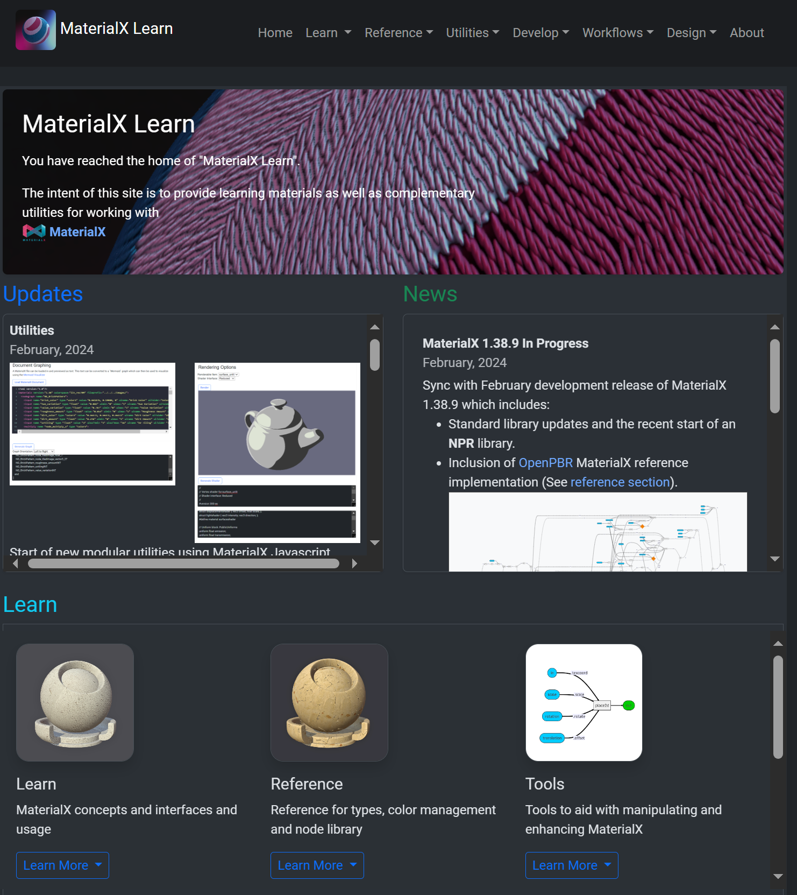

# Site Status

## Support for this repo and site has halted as of the MaterialX 1.39 official release. Please sponser the authors for any
further development. Thank you.

# Welcome to "MaterialX Elements"

## Overview

This is a complementary site for those interested in learning about MaterialX. Current content includes:
* Node definition library with image and node graph previews. 
* Glossary of basic types, geometric definitions, color management and real-world unit definitions. 
* Fundamental concepts (Nodes, Nodegraphs, Documents, Definitions) 
* Python environment setup for MaterialX
* Interactive tutorials from basics to shader code generation, shader graph interop, definition creation, and rendering [pymaterialx](pymaterialx).

### Contributions Wanted

Comments and ideas for improving or providing new content and contributions are always welcome. See issues and project area for some of items on queue.

If you find value in here and want support its progress, Please consider sponsoring the project as it will allow it to be supported and continue to evolve.

## Visit the site 

## Visit the Repository Content
The content for the site is provided in the following sub-folders:

* [Documents](documents) Learning materials, utilities, and definitions.
* [PyMaterialX](pymaterialx) Python Tutorials,  Jupyter Notebooks and Python utilities (including [mxltutils](pymaterialx/mtlxutils))
* [Resources](resources) Additional MaterialX resource files.

