# Shader Graphs

## 1. Introduction

One way of representing some shading computation is via a graph of nodes. We will call such graphs "shader graphs". 

The basic components for all graphs are:
1. nodes 
2. ports
3. connections

We will use the *XML* nomenclature to denote
components where applicable. That is, the component is surrounded by start and end angle braces `<` and `>`. For example a node is denoted as `<node>`.

## 2. Basic Components

### 2.1 Node

 A `<node>` is atomic unit that is not represented by other nodes.
 
 The API class is called `Node`.
 
 There are various types of nodes within MaterialX. For the purposes of shader computation, we will consider nodes which either:

 1. Perform a computation or route input values to produce output values
 2. A conditional evaluation (such as a conditional 'if')
 3. Route input application data such as constants, geometric streams, or input images.

Each node has a unique string identifier. A valid identifier contains only alphanumeric characters and cannot contain a path separator: `/`.

For diagrams, we will used rectangular boxes to denote nodes. As an example, the following diagram shows 3 nodes named "node1", "node2", and "node3"

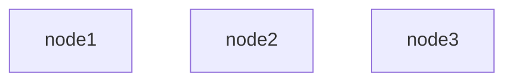

### 2.2 Ports

Each node can have 0 or more **ports**. Ports can be of 
allow for the flow of data between nodes. The API class for ports is `PortElement`.

 Ports which can accept data are called **inputs** (`<input>`) and those that can send data are called **outputs** (`<output>`).  

### 2.3 Node Containers

A **graph element** is a container for a set of nodes.
The API class is called `GraphElement`. 

Graph elements themselves cannot be created. Instead either of the following can be instantiated:
* Document: A MaterialX document (`<document>`) is a top level graph element corresponding to the API class: `Document`.
* Node graph: A graph element which is not at the top level are called **node graphs** `<nodegraph>`, and correspond to the API class : `NodeGraph`.

Graph elements can contain 0 or more nodes or node graphs and 0 or more direct child `<input>`s or `<output>`s. These children are considered to be within the **scope** of the graph element.

The additional rules apply to children within a given scope:
* Every child must have a unique string identifier.
* `<document>`s however have no identifier by default as
* `<document>`s and `<nodegraph>`s cannot contain a `<document>`s. There is no concept of a document referencing another document.
* `<input>`s cannot be instantiated as direct children of a `<document>`.

In this first example a top level document contains a node called "my_node" and a nodegraph called "my_nodegraph"
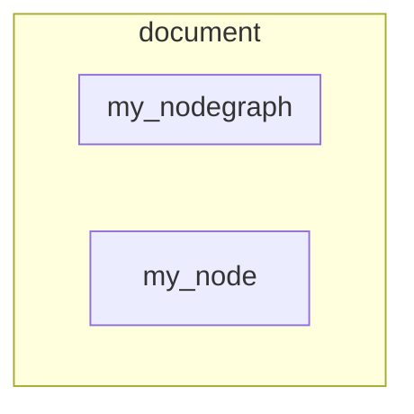

The following example shows 
* a `<nodegraph>` called "my_nodegraph". 
* an `<input>` called "input1", 
* an `<output>` called "output1"
* a node called "node1"  
* a `<nodegraph> called "nodegraph1" which contains a child node called "node2"

These are direct children and are within the scope of the "my_nodegraph".  

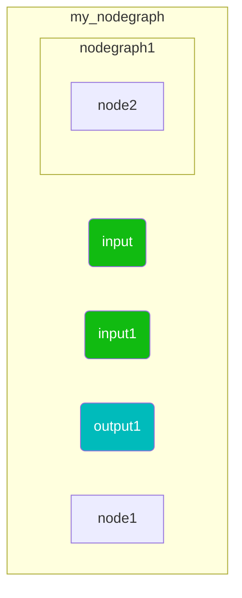
Parent / child relationships can be described using a string **path** using the a "/" delimator notation:
```
  <parent identifier>/<child identifier>
```
In this example, the path to "node" would be `my_nodegraph/nodegraph1/node2`.


## Connectivity

There can be 0 or more inputs and 1 or more outputs on a node or nodegraph. 
Having no outputs is "allowed" but these nodes / node graphs are generally of no use as there is no starting point or **root** for evaluation.

The following is an example of a node and a node graph. with various typed inputs and outputs (marked with "(out)"):
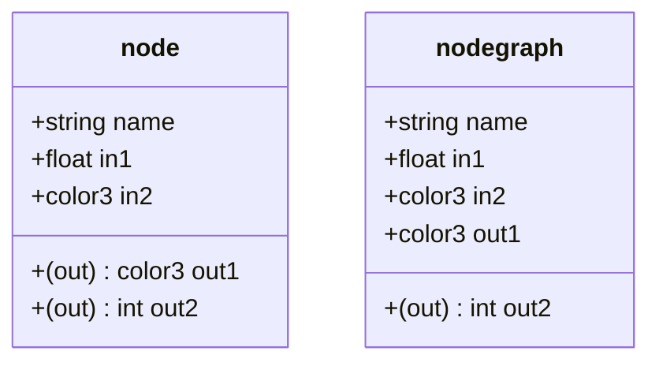

These `<input>`s and `<output>`s on `<node>`s or `<nodegraph>`s define what is connectable.

Key attributes to consider for connectivity to inputs includes:
* `type` Attribute: Every port has a type with the list of valid types defined by
the standard library definitions. `float` and `integer` tuples and arrays
as well as `string` types are common types.
* `uniform` attribute: A input can be marked as only accepting uniform values. 
* `channel` attribute: An input can mark a given channel of a tuple to be routed as input data. For example the `x` channel of a vector can be
routed as a float.

The rules for connection validity are as follows. Please take special note about scope.

* A `<node>` or `<nodegraph>` `<output>` may be connected one or more `<input>` on another node or `nodegraph` `<input>` 
**within the same scope**. 
* Ports cannot connect to themselves or other ports on the same node or node graph. (i.e. self-cycles)
* Any subgraph with a graph cannot form a cycle.
* An `<output>` can connect to one or more `<inputs>`. (fan-out allowed)
* An `<input>` can be connected to at most one `<output>`. (fan-in disallowed)
* Ports of different `type`s cannot be connected. This takes in to consideration the type produced after applying any `channel` extraction.
* Ports with different `uniform` attributes values cannot be connected.

 For a given connection the source node / port is considered to be **upstream** of the second node / port, which is **downstream**.

The following is an example diagram showing how inputs, outputs and connections are drawn, such that:
1. downstream `input` and upstream `output`s are color-coded rounded rectangles. 
2. connections are denoted with lines arrows to denote direction of data flow (what is downstream)
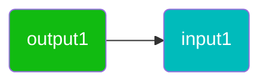

### Connectivity Diagrams
To draw these connections in the context of what node / node graphs they are associated with, we use the "." notation to separate a node or node graph identifier from a port identifier. 

The possible pair-wise configurations are shown below:
1. Node-to-node: This example shows `node1`'s input `input1` is connected to `node2`'s output called `output1`.
  ```mermaid
  graph LR;
      input1(node1.input1)
      output1(node2.output1)
      style output1 fill:#1b1,color:#fff 
      style input1 fill:#0bb,color:#fff
      output1 --> input1
  ```

2. Node-to-node graph connection:
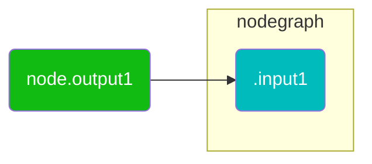

3. Node graph-to-node connection:
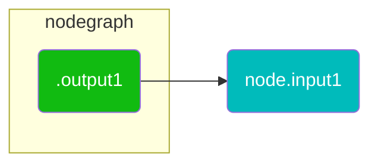

4. Node graph-to-node graph connection:
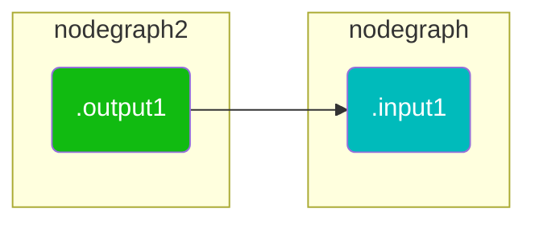
5. Combining all the variants possible within a document, a shader graph could looks like the following:
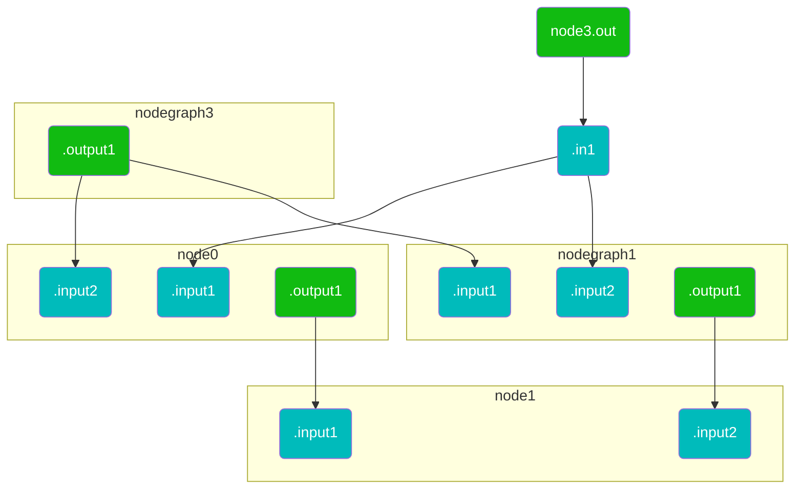

### Node Graph Interfaces  

The direct `<input>` and `<output>` children of a `<nodegraph>` are considered to be the public **interface** of the graph.
It is only through these interfaces that connections can be made to ports which are outside the scope of the nodegraph.

These interfaces can in turn be connected to node ports within the scope of the node graph such that:

1.  A `<nodegraph>` `<input>` may be connected to one or more node's `<input>` within the same scope. 
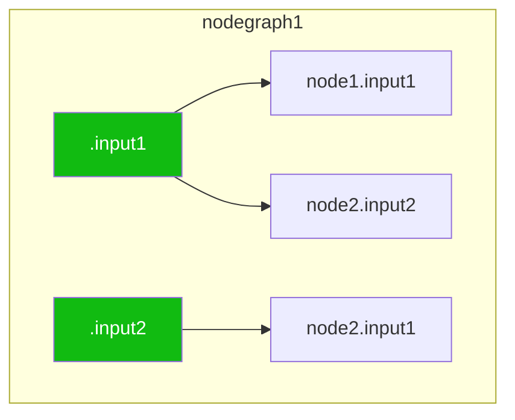
4. The `<output>`s of a node within the scope of the nodegraph may be connected to one or more nodegraph outputs. 
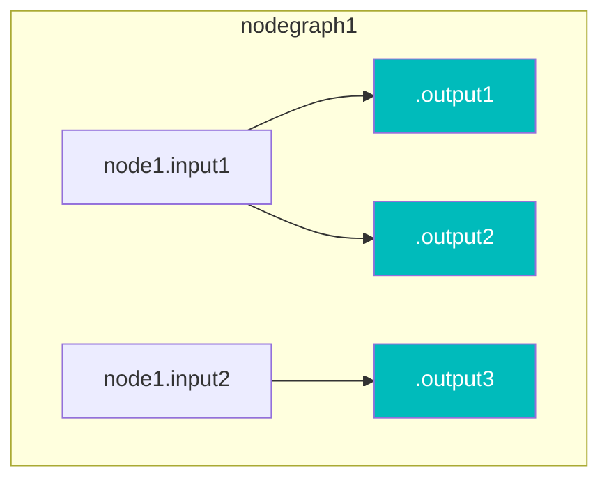
### Interface Building / Publishing Interfaces

The act of adding or removing `nodegraph` `input`s and `output`s can be thought of as **publishing** the public interface for the graph. 

A `node` should **never** have inputs / outputs added or removed which are not part of their definition -- in fact this will be tagged a node instance which has no matching definition if a validation check is performed. 

## Compound and Functional Nodegraphs and "Flattening" and "Publishing"

If node is implemented by a nodegraph, then the nodegraph is called a **functional nodegraph**. Otherwise it is called a **compound nodegraph**.

Thus a more complete definition of a shader graph is that:
1. It is composed of a series of connected nodes and compound nodegraphs.
2. One or more of these nodes may be implemented as  **functional graphs**. 
3. If the node instance is replaced with the functional graph implementation then the node essentially "becomes" a compound graph. This operation is called **flattening** a node instance.
4. If all nodes are taken out of the scope of their parent nodegraphs then all that is left is a series of connected nodes. This operation is is called **flattening** a nodegraph.
5. The reverse operation to add nodes to nodegraphs allows users to logically group nodes and/or publisih it's public interface. 
If a new definition `<nodedef>` is created and the nodegraph becomes a **functional graph** then can be thought of as  **publishing** a new definition.

### Flattening Example
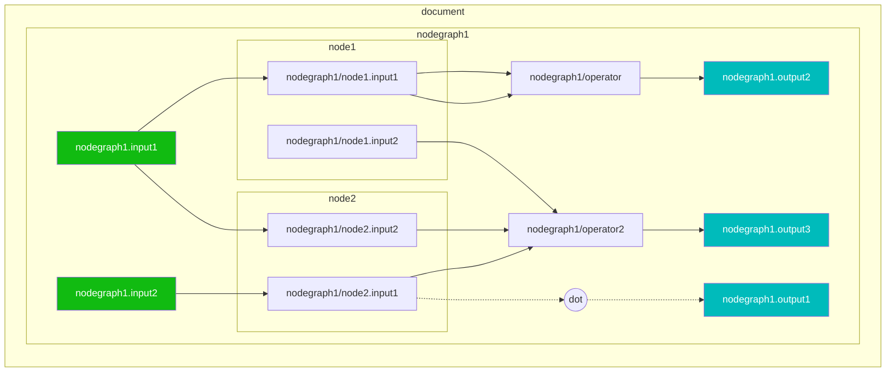
if flattened would look something like this if the parent of the nodegraph was a document. The interface `<input>` and `<output>` elements are not present as this is disallowed within the document scope.
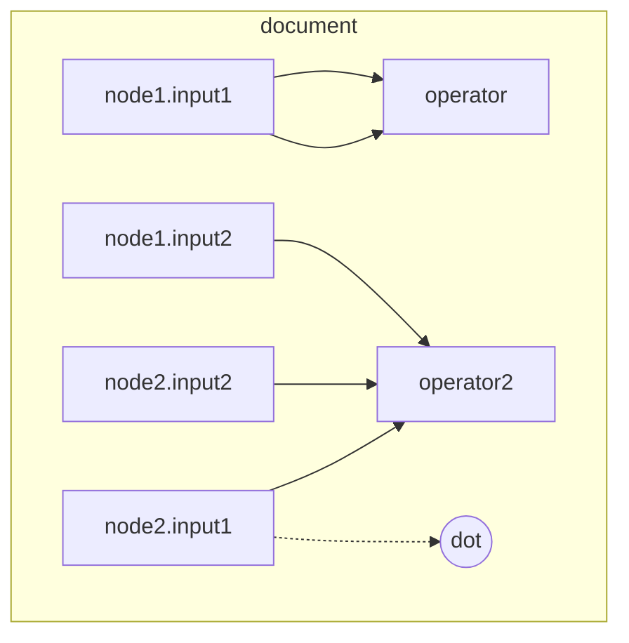
The reverse process could create a nodegraph, with inputs and outputs added to create the public interface for the nodegraph.

## Shader Generation Graphs
When dealing with shader generation shader graphs are simplified to having only nodes with inputs and outputs **"ports"**. 

The key components are:
* Shader Node: Basically corresponds to a node.
* Shader Port: A connectable attribute of a Shader Node. Can either be Input or Output Ports.
* Public Ports: Are bindable as shader code inputs or exposed as the root for evaluation as an output.
* Private Ports: Inputs and Outputs which are not exposed.

All original nodes are flattened to remove the notion of a graph hierarchy
and replace any nodes which are represented as functional graphs.

## Upstream Traversal

Upstream traversal is fairly simple where the root to start from should be an `<output>` on a node or nodegraph. Traversal will naturally only follow direct connections. 

This is straightforward when:

  1. There are no nodegraphs within the shader graph. 
  2. Or all of the nodes reside within a single nodegraph.

In this case only node inputs connect to upstream outputs.

# Examples

Interior of nodegraph to upstream nodegraphs and nodes
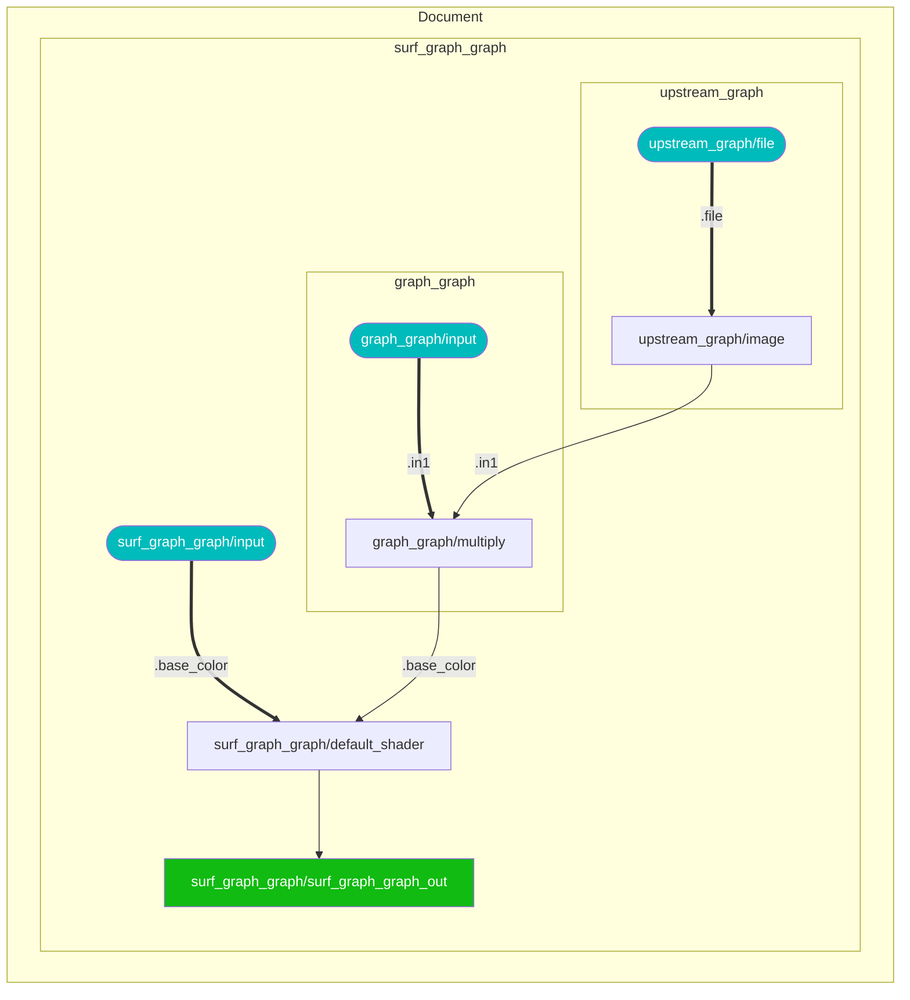
Cascading nodegraph to nodegraph
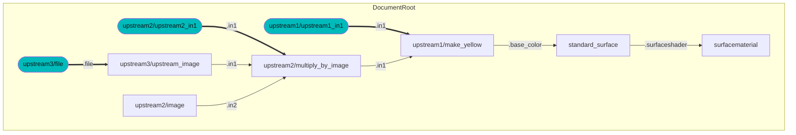
Sample AMD material
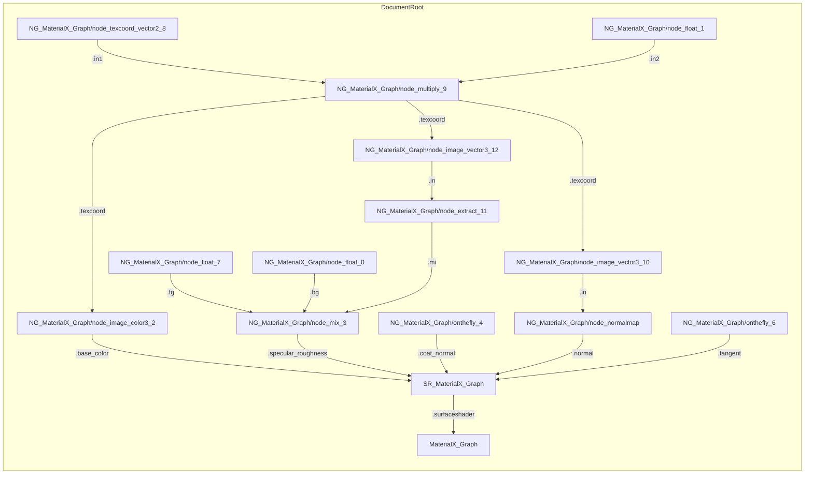
------

## Workflows

* Logically a both a Document and a NodeGraph are considered to be containers of nodes or a "node graph".
* However a Node which may have an implementation as a graph is not considered to be a container. This means
traversal up and downstream from a given node requires special casing.
* Another issue is that in order to keep a minimal size, only those inputs and which are explicit connected to or
assigned non-default values will exist on the instance of a Node or Nodegraph, even though they are part of the
interface definition.
* Any connections which within Nodegraphs which connect interior Node inputs to Nodegraph inputs also currently have
special syntax.
* All connections are specified on a downstream input instead of as a structure which provides both the input and output. This makes downstream traversal much less straightforward to perform than upstream.
* Materials as of 1.38 are nodes and traversal can find upstream shaders to allow a  full material graph to be traversed.

## Recommendations
* In order to create a "complete" graph, when instances are created all inputs and outputs should be instantiated. This can be done via utilities which scan the associated NodeDef (definition) and add inputs and outputs with default values.
* An NodeGraph itself should have all of it's inputs specified even if it's a functional graph for the same reason.
* 

