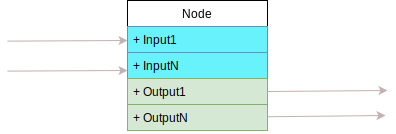
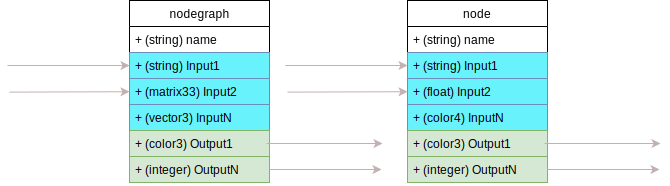

# Nodes and Node Graphs

## 1. Introduction

In MaterialX, shading computations are represented via a graph of nodes. 

The basic components for all graphs are:
1. Nodes 
2. Ports
3. Connections

**Notation**: *XML* nomenclature will be used to denote
types of components, such that a component is bracketed by start and end angle braces: `<` and `>`. For example a node is denoted as `<node>`.

## Nodes

A `<node>` can be thought of as representing an atomic unit of computation. They are
instances of [node definitions (`<nodedef>`)](https://materialx.org/docs/api/class_node_def.html). The details behind definitions are discussed in another section.

The API class is called [`Node`](https://materialx.org/docs/api/class_node.html).
 
There are various semantic types of nodes within MaterialX. For the purposes of shader computation, we will consider nodes which either:

1. Perform a **computation** on or route input values to produce output values. This includes
nodes which may extract or combine channels of an input or output.
2. Perform **condition** branching logic (such as a conditional 'if')
3. Route input **application data** such as constants, geometric streams, or input images.

Each node must have a unique string identifier (`name`). This identifier can only contain alphanumeric characters, excluding the path separator character: `/`. 
To aid with identifier naming, Materialx provides identifier creation
creation utilities it's API ( [createValidChildName()](https://materialx.org/docs/api/class_element.html) )

For the purposes of illustration,  rectangular boxes to denote nodes. For example, the following diagram shows 3 nodes named "node1", "node2", and "node3"


## Interfaces and Ports

Each node's definition is specified by an **"interface"** which contains 0 or more port elements or **ports** for short. All ports are strongly typed.

The API class for ports is [`PortElement`](https://materialx.org/docs/api/class_port_element.html).

* Ports which can receive data are called [**inputs**](https://materialx.org/docs/api/class_input.html) (`<input>`) 
* Ports which can send data are called [**outputs**](https://materialx.org/docs/api/class_output.html) (`<output>`). 
* A ports `type` is defined by the API class [`TypedElement`](https://materialx.org/docs/api/class_typed_element.html), with type values defined [here](https://materialx.org/docs/api/_material_x_core_2_types_8h.html). An example type is `color3` to represent 3 channel color.

Note that while a definition specifies the entire interface, it is **not** required that any of these ports be explicitly specified on the node instance: 
* If and only if a connection is required and / or a non-default value is required does an input need be specified. 
* Outputs do not need to be specified explicitly for a node.

**Notation**: The "." (dot) notation will be used to indicate that an input or
output is part of a node. Thus in the diagram shown, the notation used to indicate "Input1"
would be *"Node.Input1"*.



## Containers

A **graph element** is a container for a set of nodes.

The API class is called [`GraphElement`](https://materialx.org/docs/api/class_graph_element.html). 

Graph elements themselves cannot be created. Instead either of the following can be instantiated:

* **Document**: A MaterialX document (`<document>`) is a top level container which can be thought as corresponding to a single "file". The API class: [`Document`](https://materialx.org/docs/api/class_document.html).

* **Node graph**: A container which resides within a document or another node graph  **node graphs** `<nodegraph>`. The API class : [`NodeGraph`](https://materialx.org/docs/api/class_node_graph.html).

Graph elements can contain:
 * 0 or more nodes or node graphs and
 * 0 or more direct child `<input>`s or `<output>`s. 

## Scope and Path Notation

Direct children of a graph element are considered to be in **scope**.

The follow scoping rules apply:
* Every direct child must have a unique string identifier (1)
* `<document>`s and `<nodegraph>`s cannot contain child `<document>`s. There is no concept of a document referencing another document.
* `<input>`s cannot be instantiated as direct children of a `<document>`.

(1) Note that `<document>`s have no identifier by default.

### Document Scope

The diagram below shows a `<document>` with valid children. "my_node" is a node instance, and "my_nodegraph" a node graph. `<output>` nodes are not shown here and will be discussed
within the context of renderer integrations which perform multi-pass rendering.

### Node Graph Scope

This example shows valid children for a node graph
* a `<nodegraph>` called "my_nodegraph". 
* an `<input>` called "input1", 
* an `<output>` called "output1"
* a node called "node1"  
* a `<nodegraph> called "nodegraph1" which contains a child node called "node2"

These are direct children and are within the same scope of the graph "my_nodegraph".  


### Paths

Parent / child relationships can be described using a string **path** with forward-slashes ("/") being used as path separators:
```
  <parent identifier>/<child identifier>
```
In the above example, the path to "node" would be `my_nodegraph/nodegraph1/node2` while the
path to `input1` is `my_nodegraph.input1`.

## Connections

There can be 0 or more inputs and 1 or more outputs on a node instance or nodegraph. 
Having no outputs is "allowed" but these nodes / node graphs are generally of no use as there is no starting point or **root** for shader evaluation.

The following is an example of a node and a node graph showing various typed inputs and outputs.
These `<input>`s and `<output>`s on `<node>`s or `<nodegraph>`s define what is connectable.



Key attributes to consider for connectivity for an `<input>` includes:
* `type`: Every port has a type with the list of valid types defined by
the standard library definitions. `float` and `integer` tuples and arrays
as well as `string` and `filename` are common types.
* `uniform`: A input can be marked as only accepting uniform values. 
* `channel`: An input can mark a given channel of an incoming tuple to be routed as the input data. For example the `x` channel of a vector can be routed as a float. A "dot" notation
is used to specified channels: 
```
   <type>.<channel identifier>
```

The rules for connection validity are as follows. **It is assumed that all connections 
are within the same scope**.

* A `<node>` or `<nodegraph>` `<output>` may be connected one or more `<input>`s on another node or `nodegraph` `<input>`  as long as all elements are within the same scope. 
* Ports cannot connect to themselves or other ports for a given node or node graph. (i.e. cycles / loops are not allowed)
* An `<output>` can connect to one or more `<inputs>`. (fan-out allowed)
* An `<input>` can be connected to at most one `<output>`. (fan-in disallowed)
* Ports of different `type`s cannot be connected. This takes in to consideration the type produced after applying any `channel` extraction. For example, a single channel
is extracted from a float vector can be connected to a float input.
* Ports with different `uniform` attributes values cannot be connected.
* `string` and `filename` typed constants can be connected to `filename` types. 

 For a given connection the source node / port is considered to be **upstream** of the second node / port, which is **downstream**.

The following is an example diagram showing how inputs, outputs and connections are drawn:
1. Downstream `input` and upstream `output`s are color-coded rounded rectangles. 
2. Connections are denoted with lines. Arrows denote the direction of data flow (pointing downstream)


### Inter Node / Graph Connections

To draw these connections in the context of what node / node graphs they are associated with, we use the "." notation to separate a node or node graph identifier from a port identifier. 

The possible pair-wise configurations are shown below:
1. Node-to-node: This example shows `node1`'s input `input1` is connected to `node2`'s output called `output1`.
  ```mermaid
  graph LR;
      input1(node1.input1)
      output1(node2.output1)
      style output1 fill:#1b1,color:#fff 
      style input1 fill:#0bb,color:#fff
      output1 --> input1
  ```

2. Node-to-node graph connection:
  ```mermaid
    graph LR;
        output1(node.output1)
        subgraph nodegraph
          input1(.input1)
        end
        style output1 fill:#1b1,color:#fff 
        style input1 fill:#0bb,color:#fff
        output1 --> input1
  ```

3. Node graph-to-node connection:
  ```mermaid
   graph LR;
      subgraph nodegraph
        output1(.output1)
      end
      input1(node.input1)
      style output1 fill:#1b1,color:#fff 
      style input1 fill:#0bb,color:#fff
      output1 --> input1
  ```

4. Node graph-to-node graph connection:
  ```mermaid
  graph LR;
      subgraph nodegraph2
        output1(.output1)
      end
      subgraph nodegraph
        input1(.input1)
      end
      style output1 fill:#1b1,color:#fff 
      style input1 fill:#0bb,color:#fff
      output1 --> input1
  ```
5. Combining some of the variants together a shader graph could look like the following. 
Fan-out is shown for one of the outputs on node graph `nodegraph3`. 


### Intra Graph / Interface Connections  

The direct `<input>` and `<output>` children of a `<nodegraph>` are considered to be the public **interface** of the graph.

It is only through these interfaces that connections can be made to ports which are outside the scope of the nodegraph. These interfaces can in turn be connected to node ports within the scope of the node graph such that:

1.  A `<nodegraph>` `<input>` may be connected to one or more node's `<input>` within the same scope. 

2. The `<output>`s of a node within the scope of the nodegraph may be connected to one or more nodegraph outputs. 

