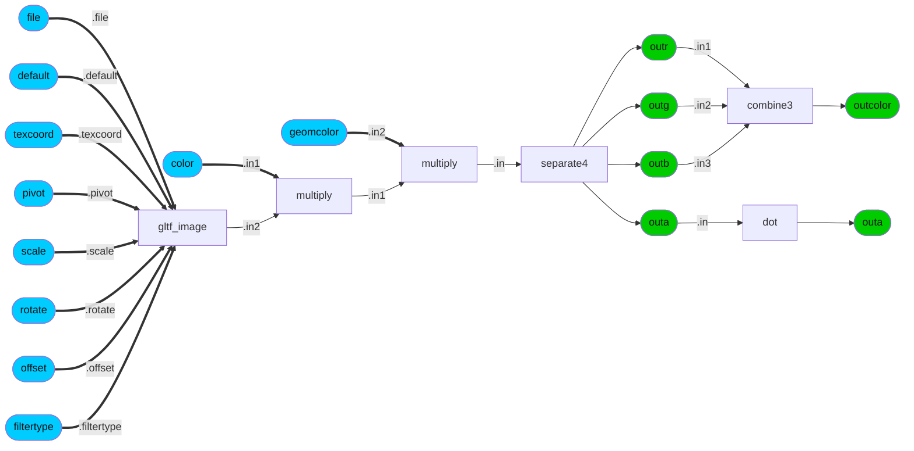
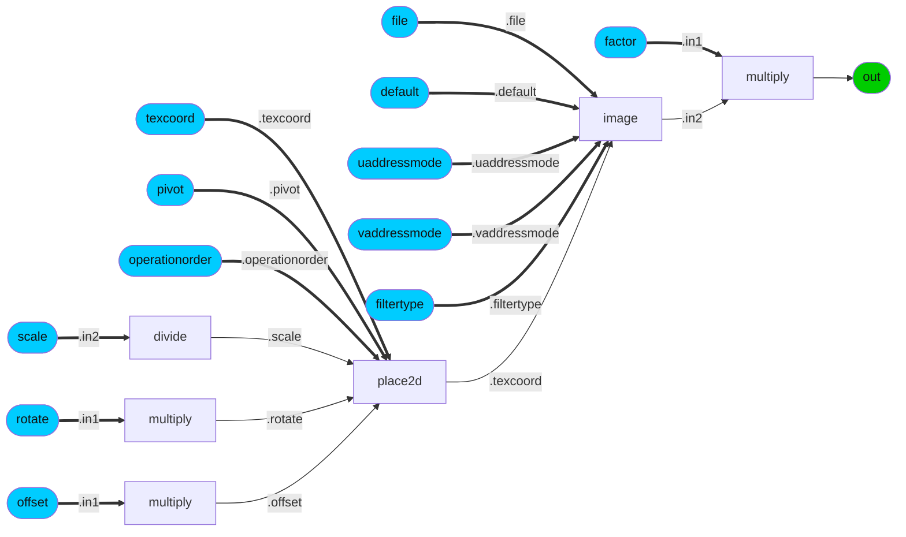
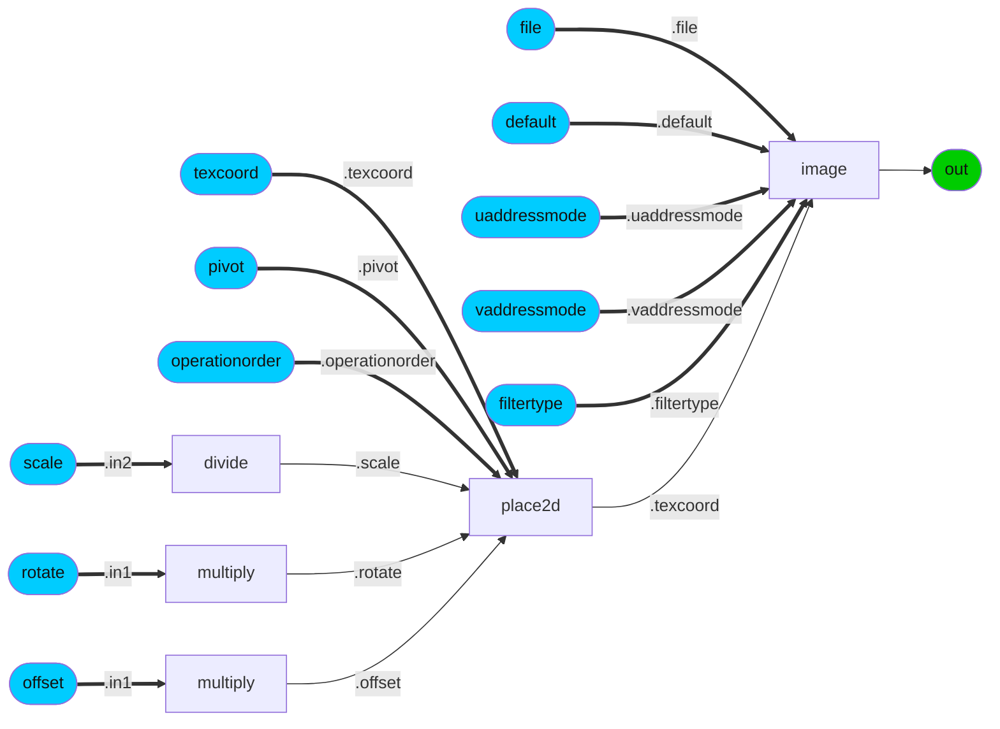
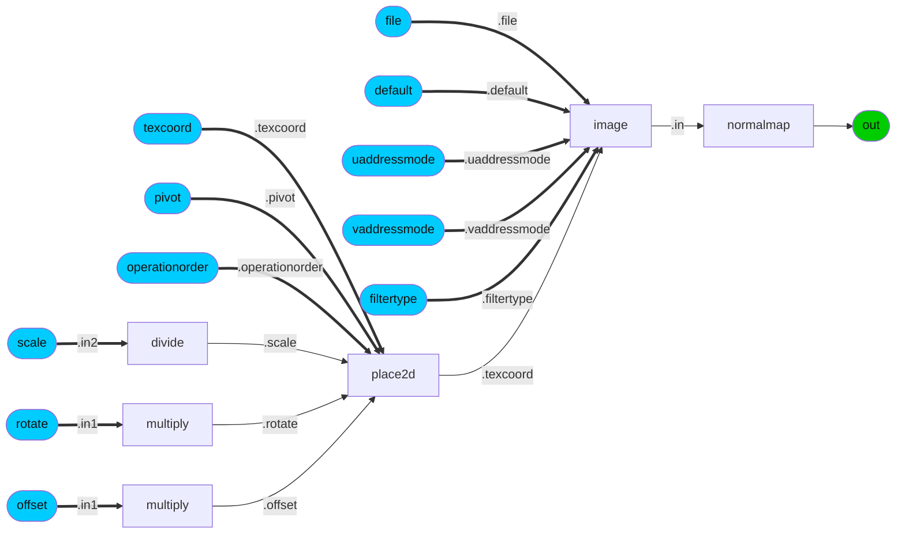
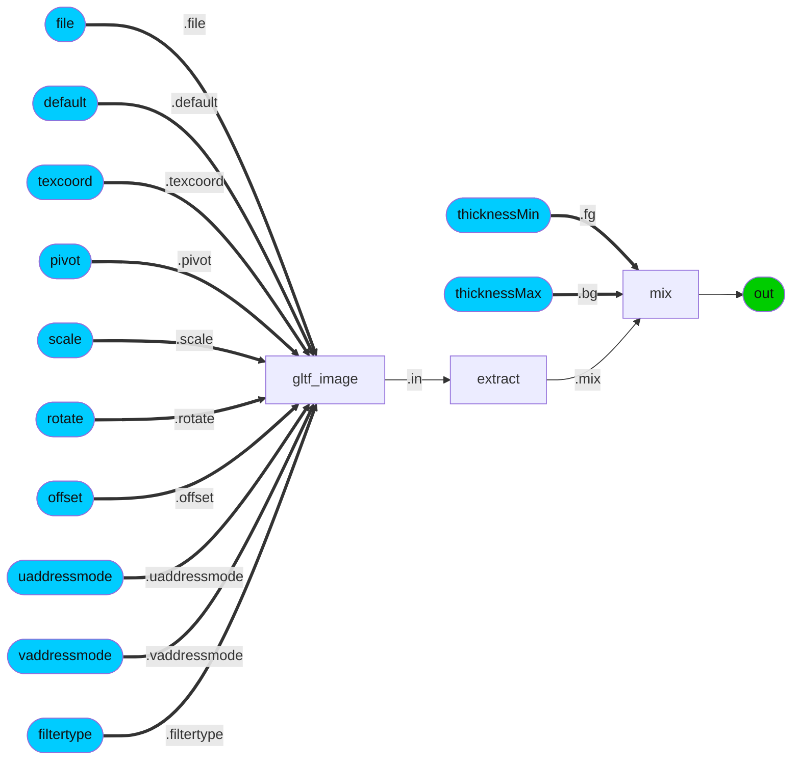
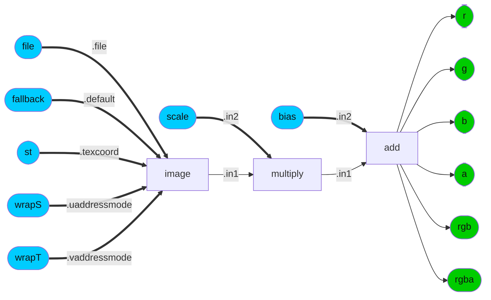
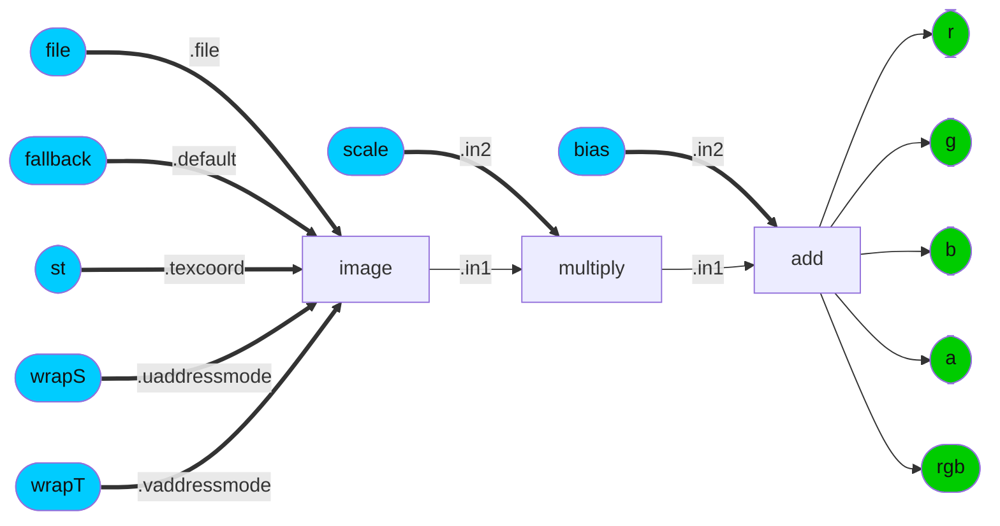
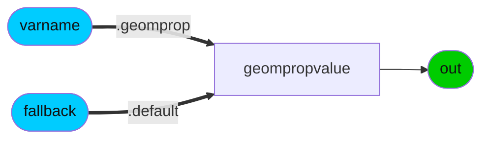
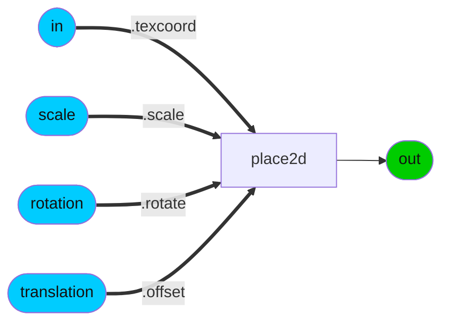
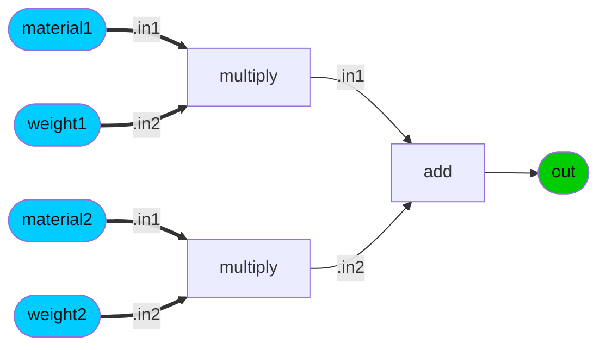

### Node Group: geometric
* [UsdPrimvarReader](#node-UsdPrimvarReader) 
---------
### Node Group: math
* [UsdTransform2d](#node-UsdTransform2d) 
---------
### Node Group: pbr
* [LamaAdd](#node-LamaAdd) [LamaConductor](#node-LamaConductor) [LamaDielectric](#node-LamaDielectric) [LamaDiffuse](#node-LamaDiffuse) [LamaEmission](#node-LamaEmission) [LamaLayer](#node-LamaLayer) [LamaMix](#node-LamaMix) [LamaSSS](#node-LamaSSS) [LamaSheen](#node-LamaSheen) [LamaTranslucent](#node-LamaTranslucent) [UsdPreviewSurface](#node-UsdPreviewSurface) [disney_brdf_2012](#node-disney_brdf_2012) [disney_bsdf_2015](#node-disney_bsdf_2015) [gltf_pbr](#node-gltf_pbr) [open_pbr_surface](#node-open_pbr_surface) [standard_surface](#node-standard_surface) 
---------
### Node Group: texture2d
* [UsdUVTexture](#node-UsdUVTexture) [gltf_colorimage](#node-gltf_colorimage) [gltf_image](#node-gltf_image) [gltf_iridescence_thickness](#node-gltf_iridescence_thickness) [gltf_normalmap](#node-gltf_normalmap) 
---------
### Node Group: translation
* [standard_surface_to_UsdPreviewSurface](#node-standard_surface_to_UsdPreviewSurface) [standard_surface_to_gltf_pbr](#node-standard_surface_to_gltf_pbr) 
---------
 
### Category: *disney_brdf_2012*
<details open><summary>ND_disney_brdf_2012_surface</summary>
<p>
 
* *Nodedef*: ND_disney_brdf_2012_surface
* *Type*: surfaceshader
* *Node Group*: pbr
* *Version*: 1.0. Is default: False
* *Doc*: UNDOCUMENTED
* *Implementation*: Non-graph
 

| Name | Type | Default Value | UI name | UI min | UI max | UI Soft Min | UI Soft Max | UI step | UI group | UI Advanced | Doc | Uniform |
| ---- | ---- | ---- | ---- | ---- | ---- | ---- | ---- | ---- | ---- | ---- | ---- | ---- |
| **baseColor** | color3 | 0.16, 0.16, 0.16 |  |  |  |  |  |  |  |  |  |  |
| **metallic** | float | 0.0 |  |  |  |  |  |  |  |  |  |  |
| **subsurface** | float | 0.0 |  |  |  |  |  |  |  |  |  |  |
| **specular** | float | 0.5 |  |  |  |  |  |  |  |  |  |  |
| **roughness** | float | 0.5 |  |  |  |  |  |  |  |  |  |  |
| **specularTint** | float | 0.0 |  |  |  |  |  |  |  |  |  |  |
| **anisotropic** | float | 0.0 |  |  |  |  |  |  |  |  |  |  |
| **sheen** | float | 0.0 |  |  |  |  |  |  |  |  |  |  |
| **sheenTint** | float | 0.5 |  |  |  |  |  |  |  |  |  |  |
| **clearcoat** | float | 0.0 |  |  |  |  |  |  |  |  |  |  |
| **clearcoatGloss** | float | 1.0 |  |  |  |  |  |  |  |  |  |  |
| *out* | surfaceshader | None |  |  |  |  |  |  |  |  |  |  |
### Category: *disney_bsdf_2015*
<details open><summary>ND_disney_bsdf_2015_surface</summary>
<p>
 
* *Nodedef*: ND_disney_bsdf_2015_surface
* *Type*: surfaceshader
* *Node Group*: pbr
* *Version*: 1.0. Is default: False
* *Doc*: UNDOCUMENTED
* *Implementation*: Non-graph
 

| Name | Type | Default Value | UI name | UI min | UI max | UI Soft Min | UI Soft Max | UI step | UI group | UI Advanced | Doc | Uniform |
| ---- | ---- | ---- | ---- | ---- | ---- | ---- | ---- | ---- | ---- | ---- | ---- | ---- |
| **baseColor** | color3 | 0.16, 0.16, 0.16 |  |  |  |  |  |  |  |  |  |  |
| **metallic** | float | 0.0 |  |  |  |  |  |  |  |  |  |  |
| **roughness** | float | 0.5 |  |  |  |  |  |  |  |  |  |  |
| **anisotropic** | float | 0.0 |  |  |  |  |  |  |  |  |  |  |
| **specularTint** | float | 0.0 |  |  |  |  |  |  |  |  |  |  |
| **sheen** | float | 0.0 |  |  |  |  |  |  |  |  |  |  |
| **sheenTint** | float | 0.5 |  |  |  |  |  |  |  |  |  |  |
| **clearcoat** | float | 0.0 |  |  |  |  |  |  |  |  |  |  |
| **clearcoatGloss** | float | 1.0 |  |  |  |  |  |  |  |  |  |  |
| **specTrans** | float | 0.0 |  |  |  |  |  |  |  |  |  |  |
| **ior** | float | 1.5 |  |  |  |  |  |  |  |  |  |  |
| **scatterDistance** | vector3 | 0, 0, 0 |  |  |  |  |  |  |  |  |  |  |
| **flatness** | float | 0.0 |  |  |  |  |  |  |  |  |  |  |
| **diffTrans** | float | 0.0 |  |  |  |  |  |  |  |  |  |  |
| **thin** | boolean | False |  |  |  |  |  |  |  |  |  | true |
| *out* | surfaceshader | None |  |  |  |  |  |  |  |  |  |  |
### Category: *gltf_pbr*
<details open><summary>ND_gltf_pbr_surfaceshader</summary>
<p>
 
* *Nodedef*: ND_gltf_pbr_surfaceshader
* *Type*: surfaceshader
* *Node Group*: pbr
* *Version*: 2.0.1. Is default: True
* *Doc*: glTF PBR
* *Nodegraph*: IMPL_gltf_pbr_surfaceshader


```mermaid
graph LR; 
    IMPL_gltf_pbr_surfaceshader_shader_constructor[surface] --> IMPL_gltf_pbr_surfaceshader_out([out])
    style IMPL_gltf_pbr_surfaceshader_out fill:#0C0, color:#111
    IMPL_gltf_pbr_surfaceshader_clearcoat_layer[layer] --".bsdf"--> IMPL_gltf_pbr_surfaceshader_shader_constructor[surface]
    IMPL_gltf_pbr_surfaceshader_clearcoat_bsdf[dielectric_bsdf] --".top"--> IMPL_gltf_pbr_surfaceshader_clearcoat_layer[layer]
    IMPL_gltf_pbr_surfaceshader_clearcoatINT([clearcoat]) ==.weight==> IMPL_gltf_pbr_surfaceshader_clearcoat_bsdf[dielectric_bsdf]
    style IMPL_gltf_pbr_surfaceshader_clearcoatINT fill:#0CF, color:#111
    IMPL_gltf_pbr_surfaceshader_clearcoat_normalINT([clearcoat_normal]) ==.normal==> IMPL_gltf_pbr_surfaceshader_clearcoat_bsdf[dielectric_bsdf]
    style IMPL_gltf_pbr_surfaceshader_clearcoat_normalINT fill:#0CF, color:#111
    IMPL_gltf_pbr_surfaceshader_tangentINT([tangent]) ==.tangent==> IMPL_gltf_pbr_surfaceshader_clearcoat_bsdf[dielectric_bsdf]
    style IMPL_gltf_pbr_surfaceshader_tangentINT fill:#0CF, color:#111
    IMPL_gltf_pbr_surfaceshader_clearcoat_roughness_uv[roughness_anisotropy] --".roughness"--> IMPL_gltf_pbr_surfaceshader_clearcoat_bsdf[dielectric_bsdf]
    IMPL_gltf_pbr_surfaceshader_clearcoat_roughnessINT([clearcoat_roughness]) ==.roughness==> IMPL_gltf_pbr_surfaceshader_clearcoat_roughness_uv[roughness_anisotropy]
    style IMPL_gltf_pbr_surfaceshader_clearcoat_roughnessINT fill:#0CF, color:#111
    IMPL_gltf_pbr_surfaceshader_sheen_layer[layer] --".base"--> IMPL_gltf_pbr_surfaceshader_clearcoat_layer[layer]
    IMPL_gltf_pbr_surfaceshader_sheen_bsdf[sheen_bsdf] --".top"--> IMPL_gltf_pbr_surfaceshader_sheen_layer[layer]
    IMPL_gltf_pbr_surfaceshader_normalINT([normal]) ==.normal==> IMPL_gltf_pbr_surfaceshader_sheen_bsdf[sheen_bsdf]
    style IMPL_gltf_pbr_surfaceshader_normalINT fill:#0CF, color:#111
    IMPL_gltf_pbr_surfaceshader_sheen_intensity[max] --".weight"--> IMPL_gltf_pbr_surfaceshader_sheen_bsdf[sheen_bsdf]
    IMPL_gltf_pbr_surfaceshader_sheen_color_max_rg[max] --".in1"--> IMPL_gltf_pbr_surfaceshader_sheen_intensity[max]
    IMPL_gltf_pbr_surfaceshader_sheen_color_r[extract] --".in1"--> IMPL_gltf_pbr_surfaceshader_sheen_color_max_rg[max]
    IMPL_gltf_pbr_surfaceshader_sheen_colorINT([sheen_color]) ==.in==> IMPL_gltf_pbr_surfaceshader_sheen_color_r[extract]
    style IMPL_gltf_pbr_surfaceshader_sheen_colorINT fill:#0CF, color:#111
    IMPL_gltf_pbr_surfaceshader_sheen_color_g[extract] --".in2"--> IMPL_gltf_pbr_surfaceshader_sheen_color_max_rg[max]
    IMPL_gltf_pbr_surfaceshader_sheen_colorINT([sheen_color]) ==.in==> IMPL_gltf_pbr_surfaceshader_sheen_color_g[extract]
    style IMPL_gltf_pbr_surfaceshader_sheen_colorINT fill:#0CF, color:#111
    IMPL_gltf_pbr_surfaceshader_sheen_color_b[extract] --".in2"--> IMPL_gltf_pbr_surfaceshader_sheen_intensity[max]
    IMPL_gltf_pbr_surfaceshader_sheen_colorINT([sheen_color]) ==.in==> IMPL_gltf_pbr_surfaceshader_sheen_color_b[extract]
    style IMPL_gltf_pbr_surfaceshader_sheen_colorINT fill:#0CF, color:#111
    IMPL_gltf_pbr_surfaceshader_sheen_color_normalized[divide] --".color"--> IMPL_gltf_pbr_surfaceshader_sheen_bsdf[sheen_bsdf]
    IMPL_gltf_pbr_surfaceshader_sheen_colorINT([sheen_color]) ==.in1==> IMPL_gltf_pbr_surfaceshader_sheen_color_normalized[divide]
    style IMPL_gltf_pbr_surfaceshader_sheen_colorINT fill:#0CF, color:#111
    IMPL_gltf_pbr_surfaceshader_sheen_intensity[max] --".in2"--> IMPL_gltf_pbr_surfaceshader_sheen_color_normalized[divide]
    IMPL_gltf_pbr_surfaceshader_sheen_roughness_sq[multiply] --".roughness"--> IMPL_gltf_pbr_surfaceshader_sheen_bsdf[sheen_bsdf]
    IMPL_gltf_pbr_surfaceshader_sheen_roughnessINT([sheen_roughness]) ==.in1==> IMPL_gltf_pbr_surfaceshader_sheen_roughness_sq[multiply]
    style IMPL_gltf_pbr_surfaceshader_sheen_roughnessINT fill:#0CF, color:#111
    IMPL_gltf_pbr_surfaceshader_sheen_roughnessINT([sheen_roughness]) ==.in2==> IMPL_gltf_pbr_surfaceshader_sheen_roughness_sq[multiply]
    style IMPL_gltf_pbr_surfaceshader_sheen_roughnessINT fill:#0CF, color:#111
    IMPL_gltf_pbr_surfaceshader_base_mix[mix] --".base"--> IMPL_gltf_pbr_surfaceshader_sheen_layer[layer]
    IMPL_gltf_pbr_surfaceshader_metallicINT([metallic]) ==.mix==> IMPL_gltf_pbr_surfaceshader_base_mix[mix]
    style IMPL_gltf_pbr_surfaceshader_metallicINT fill:#0CF, color:#111
    IMPL_gltf_pbr_surfaceshader_mix_iridescent_dielectric_bsdf[mix] --".bg"--> IMPL_gltf_pbr_surfaceshader_base_mix[mix]
    IMPL_gltf_pbr_surfaceshader_iridescenceINT([iridescence]) ==.mix==> IMPL_gltf_pbr_surfaceshader_mix_iridescent_dielectric_bsdf[mix]
    style IMPL_gltf_pbr_surfaceshader_iridescenceINT fill:#0CF, color:#111
    IMPL_gltf_pbr_surfaceshader_dielectric_bsdf[layer] --".bg"--> IMPL_gltf_pbr_surfaceshader_mix_iridescent_dielectric_bsdf[mix]
    IMPL_gltf_pbr_surfaceshader_reflection_bsdf[generalized_schlick_bsdf] --".top"--> IMPL_gltf_pbr_surfaceshader_dielectric_bsdf[layer]
    IMPL_gltf_pbr_surfaceshader_normalINT([normal]) ==.normal==> IMPL_gltf_pbr_surfaceshader_reflection_bsdf[generalized_schlick_bsdf]
    style IMPL_gltf_pbr_surfaceshader_normalINT fill:#0CF, color:#111
    IMPL_gltf_pbr_surfaceshader_tangentINT([tangent]) ==.tangent==> IMPL_gltf_pbr_surfaceshader_reflection_bsdf[generalized_schlick_bsdf]
    style IMPL_gltf_pbr_surfaceshader_tangentINT fill:#0CF, color:#111
    IMPL_gltf_pbr_surfaceshader_dielectric_f0[multiply] --".color0"--> IMPL_gltf_pbr_surfaceshader_reflection_bsdf[generalized_schlick_bsdf]
    IMPL_gltf_pbr_surfaceshader_specularINT([specular]) ==.in2==> IMPL_gltf_pbr_surfaceshader_dielectric_f0[multiply]
    style IMPL_gltf_pbr_surfaceshader_specularINT fill:#0CF, color:#111
    IMPL_gltf_pbr_surfaceshader_clamped_dielectric_f0_from_ior_specular_color[min] --".in1"--> IMPL_gltf_pbr_surfaceshader_dielectric_f0[multiply]
    IMPL_gltf_pbr_surfaceshader_dielectric_f0_from_ior_specular_color[multiply] --".in1"--> IMPL_gltf_pbr_surfaceshader_clamped_dielectric_f0_from_ior_specular_color[min]
    IMPL_gltf_pbr_surfaceshader_specular_colorINT([specular_color]) ==.in1==> IMPL_gltf_pbr_surfaceshader_dielectric_f0_from_ior_specular_color[multiply]
    style IMPL_gltf_pbr_surfaceshader_specular_colorINT fill:#0CF, color:#111
    IMPL_gltf_pbr_surfaceshader_dielectric_f0_from_ior[multiply] --".in2"--> IMPL_gltf_pbr_surfaceshader_dielectric_f0_from_ior_specular_color[multiply]
    IMPL_gltf_pbr_surfaceshader_ior_div[divide] --".in1"--> IMPL_gltf_pbr_surfaceshader_dielectric_f0_from_ior[multiply]
    IMPL_gltf_pbr_surfaceshader_one_minus_ior[subtract] --".in1"--> IMPL_gltf_pbr_surfaceshader_ior_div[divide]
    IMPL_gltf_pbr_surfaceshader_iorINT([ior]) ==.in2==> IMPL_gltf_pbr_surfaceshader_one_minus_ior[subtract]
    style IMPL_gltf_pbr_surfaceshader_iorINT fill:#0CF, color:#111
    IMPL_gltf_pbr_surfaceshader_one_plus_ior[add] --".in2"--> IMPL_gltf_pbr_surfaceshader_ior_div[divide]
    IMPL_gltf_pbr_surfaceshader_iorINT([ior]) ==.in2==> IMPL_gltf_pbr_surfaceshader_one_plus_ior[add]
    style IMPL_gltf_pbr_surfaceshader_iorINT fill:#0CF, color:#111
    IMPL_gltf_pbr_surfaceshader_ior_div[divide] --".in2"--> IMPL_gltf_pbr_surfaceshader_dielectric_f0_from_ior[multiply]
    IMPL_gltf_pbr_surfaceshader_dielectric_f90[multiply] --".color90"--> IMPL_gltf_pbr_surfaceshader_reflection_bsdf[generalized_schlick_bsdf]
    IMPL_gltf_pbr_surfaceshader_specularINT([specular]) ==.in2==> IMPL_gltf_pbr_surfaceshader_dielectric_f90[multiply]
    style IMPL_gltf_pbr_surfaceshader_specularINT fill:#0CF, color:#111
    IMPL_gltf_pbr_surfaceshader_roughness_uv[roughness_anisotropy] --".roughness"--> IMPL_gltf_pbr_surfaceshader_reflection_bsdf[generalized_schlick_bsdf]
    IMPL_gltf_pbr_surfaceshader_roughnessINT([roughness]) ==.roughness==> IMPL_gltf_pbr_surfaceshader_roughness_uv[roughness_anisotropy]
    style IMPL_gltf_pbr_surfaceshader_roughnessINT fill:#0CF, color:#111
    IMPL_gltf_pbr_surfaceshader_transmission_mix[mix] --".base"--> IMPL_gltf_pbr_surfaceshader_dielectric_bsdf[layer]
    IMPL_gltf_pbr_surfaceshader_transmissionINT([transmission]) ==.mix==> IMPL_gltf_pbr_surfaceshader_transmission_mix[mix]
    style IMPL_gltf_pbr_surfaceshader_transmissionINT fill:#0CF, color:#111
    IMPL_gltf_pbr_surfaceshader_diffuse_bsdf[oren_nayar_diffuse_bsdf] --".bg"--> IMPL_gltf_pbr_surfaceshader_transmission_mix[mix]
    IMPL_gltf_pbr_surfaceshader_base_colorINT([base_color]) ==.color==> IMPL_gltf_pbr_surfaceshader_diffuse_bsdf[oren_nayar_diffuse_bsdf]
    style IMPL_gltf_pbr_surfaceshader_base_colorINT fill:#0CF, color:#111
    IMPL_gltf_pbr_surfaceshader_normalINT([normal]) ==.normal==> IMPL_gltf_pbr_surfaceshader_diffuse_bsdf[oren_nayar_diffuse_bsdf]
    style IMPL_gltf_pbr_surfaceshader_normalINT fill:#0CF, color:#111
    IMPL_gltf_pbr_surfaceshader_transmission_bsdf[dielectric_bsdf] --".fg"--> IMPL_gltf_pbr_surfaceshader_transmission_mix[mix]
    IMPL_gltf_pbr_surfaceshader_base_colorINT([base_color]) ==.tint==> IMPL_gltf_pbr_surfaceshader_transmission_bsdf[dielectric_bsdf]
    style IMPL_gltf_pbr_surfaceshader_base_colorINT fill:#0CF, color:#111
    IMPL_gltf_pbr_surfaceshader_iorINT([ior]) ==.ior==> IMPL_gltf_pbr_surfaceshader_transmission_bsdf[dielectric_bsdf]
    style IMPL_gltf_pbr_surfaceshader_iorINT fill:#0CF, color:#111
    IMPL_gltf_pbr_surfaceshader_normalINT([normal]) ==.normal==> IMPL_gltf_pbr_surfaceshader_transmission_bsdf[dielectric_bsdf]
    style IMPL_gltf_pbr_surfaceshader_normalINT fill:#0CF, color:#111
    IMPL_gltf_pbr_surfaceshader_tangentINT([tangent]) ==.tangent==> IMPL_gltf_pbr_surfaceshader_transmission_bsdf[dielectric_bsdf]
    style IMPL_gltf_pbr_surfaceshader_tangentINT fill:#0CF, color:#111
    IMPL_gltf_pbr_surfaceshader_roughness_uv[roughness_anisotropy] --".roughness"--> IMPL_gltf_pbr_surfaceshader_transmission_bsdf[dielectric_bsdf]
    IMPL_gltf_pbr_surfaceshader_tf_dielectric_bsdf[layer] --".fg"--> IMPL_gltf_pbr_surfaceshader_mix_iridescent_dielectric_bsdf[mix]
    IMPL_gltf_pbr_surfaceshader_tf_reflection_bsdf[generalized_schlick_bsdf] --".top"--> IMPL_gltf_pbr_surfaceshader_tf_dielectric_bsdf[layer]
    IMPL_gltf_pbr_surfaceshader_normalINT([normal]) ==.normal==> IMPL_gltf_pbr_surfaceshader_tf_reflection_bsdf[generalized_schlick_bsdf]
    style IMPL_gltf_pbr_surfaceshader_normalINT fill:#0CF, color:#111
    IMPL_gltf_pbr_surfaceshader_tangentINT([tangent]) ==.tangent==> IMPL_gltf_pbr_surfaceshader_tf_reflection_bsdf[generalized_schlick_bsdf]
    style IMPL_gltf_pbr_surfaceshader_tangentINT fill:#0CF, color:#111
    IMPL_gltf_pbr_surfaceshader_iridescence_thicknessINT([iridescence_thickness]) ==.thinfilm_thickness==> IMPL_gltf_pbr_surfaceshader_tf_reflection_bsdf[generalized_schlick_bsdf]
    style IMPL_gltf_pbr_surfaceshader_iridescence_thicknessINT fill:#0CF, color:#111
    IMPL_gltf_pbr_surfaceshader_iridescence_iorINT([iridescence_ior]) ==.thinfilm_ior==> IMPL_gltf_pbr_surfaceshader_tf_reflection_bsdf[generalized_schlick_bsdf]
    style IMPL_gltf_pbr_surfaceshader_iridescence_iorINT fill:#0CF, color:#111
    IMPL_gltf_pbr_surfaceshader_dielectric_f0[multiply] --".color0"--> IMPL_gltf_pbr_surfaceshader_tf_reflection_bsdf[generalized_schlick_bsdf]
    IMPL_gltf_pbr_surfaceshader_dielectric_f90[multiply] --".color90"--> IMPL_gltf_pbr_surfaceshader_tf_reflection_bsdf[generalized_schlick_bsdf]
    IMPL_gltf_pbr_surfaceshader_roughness_uv[roughness_anisotropy] --".roughness"--> IMPL_gltf_pbr_surfaceshader_tf_reflection_bsdf[generalized_schlick_bsdf]
    IMPL_gltf_pbr_surfaceshader_tf_transmission_mix[mix] --".base"--> IMPL_gltf_pbr_surfaceshader_tf_dielectric_bsdf[layer]
    IMPL_gltf_pbr_surfaceshader_transmissionINT([transmission]) ==.mix==> IMPL_gltf_pbr_surfaceshader_tf_transmission_mix[mix]
    style IMPL_gltf_pbr_surfaceshader_transmissionINT fill:#0CF, color:#111
    IMPL_gltf_pbr_surfaceshader_diffuse_bsdf[oren_nayar_diffuse_bsdf] --".bg"--> IMPL_gltf_pbr_surfaceshader_tf_transmission_mix[mix]
    IMPL_gltf_pbr_surfaceshader_tf_transmission_bsdf[dielectric_bsdf] --".fg"--> IMPL_gltf_pbr_surfaceshader_tf_transmission_mix[mix]
    IMPL_gltf_pbr_surfaceshader_base_colorINT([base_color]) ==.tint==> IMPL_gltf_pbr_surfaceshader_tf_transmission_bsdf[dielectric_bsdf]
    style IMPL_gltf_pbr_surfaceshader_base_colorINT fill:#0CF, color:#111
    IMPL_gltf_pbr_surfaceshader_iorINT([ior]) ==.ior==> IMPL_gltf_pbr_surfaceshader_tf_transmission_bsdf[dielectric_bsdf]
    style IMPL_gltf_pbr_surfaceshader_iorINT fill:#0CF, color:#111
    IMPL_gltf_pbr_surfaceshader_normalINT([normal]) ==.normal==> IMPL_gltf_pbr_surfaceshader_tf_transmission_bsdf[dielectric_bsdf]
    style IMPL_gltf_pbr_surfaceshader_normalINT fill:#0CF, color:#111
    IMPL_gltf_pbr_surfaceshader_tangentINT([tangent]) ==.tangent==> IMPL_gltf_pbr_surfaceshader_tf_transmission_bsdf[dielectric_bsdf]
    style IMPL_gltf_pbr_surfaceshader_tangentINT fill:#0CF, color:#111
    IMPL_gltf_pbr_surfaceshader_iridescence_thicknessINT([iridescence_thickness]) ==.thinfilm_thickness==> IMPL_gltf_pbr_surfaceshader_tf_transmission_bsdf[dielectric_bsdf]
    style IMPL_gltf_pbr_surfaceshader_iridescence_thicknessINT fill:#0CF, color:#111
    IMPL_gltf_pbr_surfaceshader_iridescence_iorINT([iridescence_ior]) ==.thinfilm_ior==> IMPL_gltf_pbr_surfaceshader_tf_transmission_bsdf[dielectric_bsdf]
    style IMPL_gltf_pbr_surfaceshader_iridescence_iorINT fill:#0CF, color:#111
    IMPL_gltf_pbr_surfaceshader_roughness_uv[roughness_anisotropy] --".roughness"--> IMPL_gltf_pbr_surfaceshader_tf_transmission_bsdf[dielectric_bsdf]
    IMPL_gltf_pbr_surfaceshader_mix_iridescent_metal_bsdf[mix] --".fg"--> IMPL_gltf_pbr_surfaceshader_base_mix[mix]
    IMPL_gltf_pbr_surfaceshader_iridescenceINT([iridescence]) ==.mix==> IMPL_gltf_pbr_surfaceshader_mix_iridescent_metal_bsdf[mix]
    style IMPL_gltf_pbr_surfaceshader_iridescenceINT fill:#0CF, color:#111
    IMPL_gltf_pbr_surfaceshader_metal_bsdf[generalized_schlick_bsdf] --".bg"--> IMPL_gltf_pbr_surfaceshader_mix_iridescent_metal_bsdf[mix]
    IMPL_gltf_pbr_surfaceshader_base_colorINT([base_color]) ==.color0==> IMPL_gltf_pbr_surfaceshader_metal_bsdf[generalized_schlick_bsdf]
    style IMPL_gltf_pbr_surfaceshader_base_colorINT fill:#0CF, color:#111
    IMPL_gltf_pbr_surfaceshader_normalINT([normal]) ==.normal==> IMPL_gltf_pbr_surfaceshader_metal_bsdf[generalized_schlick_bsdf]
    style IMPL_gltf_pbr_surfaceshader_normalINT fill:#0CF, color:#111
    IMPL_gltf_pbr_surfaceshader_tangentINT([tangent]) ==.tangent==> IMPL_gltf_pbr_surfaceshader_metal_bsdf[generalized_schlick_bsdf]
    style IMPL_gltf_pbr_surfaceshader_tangentINT fill:#0CF, color:#111
    IMPL_gltf_pbr_surfaceshader_roughness_uv[roughness_anisotropy] --".roughness"--> IMPL_gltf_pbr_surfaceshader_metal_bsdf[generalized_schlick_bsdf]
    IMPL_gltf_pbr_surfaceshader_tf_metal_bsdf[generalized_schlick_bsdf] --".fg"--> IMPL_gltf_pbr_surfaceshader_mix_iridescent_metal_bsdf[mix]
    IMPL_gltf_pbr_surfaceshader_base_colorINT([base_color]) ==.color0==> IMPL_gltf_pbr_surfaceshader_tf_metal_bsdf[generalized_schlick_bsdf]
    style IMPL_gltf_pbr_surfaceshader_base_colorINT fill:#0CF, color:#111
    IMPL_gltf_pbr_surfaceshader_normalINT([normal]) ==.normal==> IMPL_gltf_pbr_surfaceshader_tf_metal_bsdf[generalized_schlick_bsdf]
    style IMPL_gltf_pbr_surfaceshader_normalINT fill:#0CF, color:#111
    IMPL_gltf_pbr_surfaceshader_tangentINT([tangent]) ==.tangent==> IMPL_gltf_pbr_surfaceshader_tf_metal_bsdf[generalized_schlick_bsdf]
    style IMPL_gltf_pbr_surfaceshader_tangentINT fill:#0CF, color:#111
    IMPL_gltf_pbr_surfaceshader_iridescence_thicknessINT([iridescence_thickness]) ==.thinfilm_thickness==> IMPL_gltf_pbr_surfaceshader_tf_metal_bsdf[generalized_schlick_bsdf]
    style IMPL_gltf_pbr_surfaceshader_iridescence_thicknessINT fill:#0CF, color:#111
    IMPL_gltf_pbr_surfaceshader_iridescence_iorINT([iridescence_ior]) ==.thinfilm_ior==> IMPL_gltf_pbr_surfaceshader_tf_metal_bsdf[generalized_schlick_bsdf]
    style IMPL_gltf_pbr_surfaceshader_iridescence_iorINT fill:#0CF, color:#111
    IMPL_gltf_pbr_surfaceshader_roughness_uv[roughness_anisotropy] --".roughness"--> IMPL_gltf_pbr_surfaceshader_tf_metal_bsdf[generalized_schlick_bsdf]
    IMPL_gltf_pbr_surfaceshader_emission[uniform_edf] --".edf"--> IMPL_gltf_pbr_surfaceshader_shader_constructor[surface]
    IMPL_gltf_pbr_surfaceshader_emission_color[multiply] --".color"--> IMPL_gltf_pbr_surfaceshader_emission[uniform_edf]
    IMPL_gltf_pbr_surfaceshader_emissiveINT([emissive]) ==.in1==> IMPL_gltf_pbr_surfaceshader_emission_color[multiply]
    style IMPL_gltf_pbr_surfaceshader_emissiveINT fill:#0CF, color:#111
    IMPL_gltf_pbr_surfaceshader_emissive_strengthINT([emissive_strength]) ==.in2==> IMPL_gltf_pbr_surfaceshader_emission_color[multiply]
    style IMPL_gltf_pbr_surfaceshader_emissive_strengthINT fill:#0CF, color:#111
    IMPL_gltf_pbr_surfaceshader_opacity[ifequal] --".opacity"--> IMPL_gltf_pbr_surfaceshader_shader_constructor[surface]
    IMPL_gltf_pbr_surfaceshader_alpha_modeINT([alpha_mode]) ==.value1==> IMPL_gltf_pbr_surfaceshader_opacity[ifequal]
    style IMPL_gltf_pbr_surfaceshader_alpha_modeINT fill:#0CF, color:#111
    IMPL_gltf_pbr_surfaceshader_opacity_mask[ifequal] --".in2"--> IMPL_gltf_pbr_surfaceshader_opacity[ifequal]
    IMPL_gltf_pbr_surfaceshader_alpha_modeINT([alpha_mode]) ==.value1==> IMPL_gltf_pbr_surfaceshader_opacity_mask[ifequal]
    style IMPL_gltf_pbr_surfaceshader_alpha_modeINT fill:#0CF, color:#111
    IMPL_gltf_pbr_surfaceshader_alphaINT([alpha]) ==.in2==> IMPL_gltf_pbr_surfaceshader_opacity_mask[ifequal]
    style IMPL_gltf_pbr_surfaceshader_alphaINT fill:#0CF, color:#111
    IMPL_gltf_pbr_surfaceshader_opacity_mask_cutoff[ifgreatereq] --".in1"--> IMPL_gltf_pbr_surfaceshader_opacity_mask[ifequal]
    IMPL_gltf_pbr_surfaceshader_alphaINT([alpha]) ==.value1==> IMPL_gltf_pbr_surfaceshader_opacity_mask_cutoff[ifgreatereq]
    style IMPL_gltf_pbr_surfaceshader_alphaINT fill:#0CF, color:#111
    IMPL_gltf_pbr_surfaceshader_alpha_cutoffINT([alpha_cutoff]) ==.value2==> IMPL_gltf_pbr_surfaceshader_opacity_mask_cutoff[ifgreatereq]
    style IMPL_gltf_pbr_surfaceshader_alpha_cutoffINT fill:#0CF, color:#111

```
 

| Name | Type | Default Value | UI name | UI min | UI max | UI Soft Min | UI Soft Max | UI step | UI group | UI Advanced | Doc | Uniform |
| ---- | ---- | ---- | ---- | ---- | ---- | ---- | ---- | ---- | ---- | ---- | ---- | ---- |
| **base_color** | color3 | 1, 1, 1 | Base Color | 0, 0, 0 | 1, 1, 1 |  |  |  | Base |  |  |  |
| **metallic** | float | 1.0 | Metallic | 0 | 1 |  |  |  | Base |  |  |  |
| **roughness** | float | 1.0 | Roughness | 0 | 1 |  |  |  | Base |  |  |  |
| **normal** | vector3 | None | Normal |  |  |  |  |  | Base |  |  |  |
| **tangent** | vector3 | None | Tangent |  |  |  |  |  | Base |  |  |  |
| **occlusion** | float | 1.0 | Occlusion | 0 | 1 |  |  |  | Base |  |  |  |
| **transmission** | float | 0.0 | Transmission | 0 | 1 |  |  |  | Base |  |  |  |
| **specular** | float | 1.0 | Specular | 0 | 1 |  |  |  | Base |  |  |  |
| **specular_color** | color3 | 1, 1, 1 | Specular Color | 0, 0, 0 |  |  | 1, 1, 1 |  | Base |  |  |  |
| **ior** | float | 1.5 | Index of Refraction | 1 |  |  | 3 |  | Base |  |  | true |
| **alpha** | float | 1.0 | Alpha | 0 | 1 |  |  |  | Alpha |  |  |  |
| **alpha_mode** | integer | 0 | Alpha Mode |  |  |  |  |  | Alpha |  |  | true |
| **alpha_cutoff** | float | 0.5 | Alpha Cutoff | 0 | 1 |  |  |  | Alpha |  |  | true |
| **iridescence** | float | 0.0 | Iridescence | 0 | 1 |  |  |  | Iridescence |  |  |  |
| **iridescence_ior** | float | 1.3 | Iridescence Index of Refraction | 1 |  |  | 3 |  | Iridescence |  |  | true |
| **iridescence_thickness** | float | 100.0 | Iridescence Thickness | 0 |  | 100 | 400 |  | Iridescence |  |  |  |
| **sheen_color** | color3 | 0, 0, 0 | Sheen Color | 0, 0, 0 | 1, 1, 1 |  |  |  | Sheen |  |  |  |
| **sheen_roughness** | float | 0.0 | Sheen Roughness | 0 | 1 |  |  |  | Sheen |  |  |  |
| **clearcoat** | float | 0.0 | Clearcoat | 0 | 1 |  |  |  | Clearcoat |  |  |  |
| **clearcoat_roughness** | float | 0.0 | Clearcoat Roughness | 0 | 1 |  |  |  | Clearcoat |  |  |  |
| **clearcoat_normal** | vector3 | None | Clearcoat Normal |  |  |  |  |  | Clearcoat |  |  |  |
| **emissive** | color3 | 0, 0, 0 | Emissive | 0, 0, 0 | 1, 1, 1 |  |  |  | Emission |  |  |  |
| **emissive_strength** | float | 1.0 | Emissive Strength | 0 |  |  |  |  | Emission |  |  | true |
| **thickness** | float | 0.0 | Thickness | 0 |  |  |  |  | Volume |  |  | false |
| **attenuation_distance** | float | None | Attenuation Distance | 0 |  |  |  |  | Volume |  |  | true |
| **attenuation_color** | color3 | 1, 1, 1 | Attenuation Color | 0, 0, 0 | 1, 1, 1 |  |  |  | Volume |  |  | true |
| *out* | surfaceshader | None |  |  |  |  |  |  |  |  |  |  |
### Category: *gltf_colorimage*
<details open><summary>ND_gltf_colorimage</summary>
<p>
 
* *Nodedef*: ND_gltf_colorimage
* *Type*: multioutput
* *Node Group*: texture2d
* *Version*: 1.0. Is default: True
* *Doc*: UNDOCUMENTED
* *Nodegraph*: NG_gltf_colorimage



 

| Name | Type | Default Value | UI name | UI min | UI max | UI Soft Min | UI Soft Max | UI step | UI group | UI Advanced | Doc | Uniform |
| ---- | ---- | ---- | ---- | ---- | ---- | ---- | ---- | ---- | ---- | ---- | ---- | ---- |
| **file** | filename |  |  |  |  |  |  |  | Image |  |  | true |
| **default** | color4 | 0, 0, 0, 0 |  |  |  |  |  |  | Image |  |  |  |
| **texcoord** | vector2 | None |  |  |  |  |  |  | Image |  |  |  |
| **pivot** | vector2 | 0, 1 |  |  |  |  |  |  | Image |  |  |  |
| **scale** | vector2 | 1, 1 |  |  |  |  |  |  | Image |  |  |  |
| **rotate** | float | 0.0 |  | 0 | 360 |  |  |  | Image |  |  |  |
| **offset** | vector2 | 0, 0 |  |  |  |  |  |  | Image |  |  |  |
| **operationorder** | integer | 1 |  |  |  |  |  |  | Image |  |  |  |
| **uaddressmode** | string | periodic |  |  |  |  |  |  | Image |  |  | true |
| **vaddressmode** | string | periodic |  |  |  |  |  |  | Image |  |  | true |
| **filtertype** | string | linear |  |  |  |  |  |  | Image |  |  | true |
| **color** | color4 | 1, 1, 1, 1 |  |  |  |  |  |  | Color |  |  |  |
| **geomcolor** | color4 | 1, 1, 1, 1 | Geometry Color |  |  |  |  |  | Color |  |  |  |
| *outcolor* | color3 | 0, 0, 0 |  |  |  |  |  |  |  |  |  |  |
| *outa* | float | 0.0 |  |  |  |  |  |  |  |  |  |  |
### Category: *gltf_image*
<details open><summary>ND_gltf_image_color3_color3_1_0</summary>
<p>
 
* *Nodedef*: ND_gltf_image_color3_color3_1_0
* *Type*: color3
* *Node Group*: texture2d
* *Version*: 1.0. Is default: True
* *Doc*: UNDOCUMENTED
* *Nodegraph*: NG_NG_gltf_image_color3_color3_1_0


 

| Name | Type | Default Value | UI name | UI min | UI max | UI Soft Min | UI Soft Max | UI step | UI group | UI Advanced | Doc | Uniform |
| ---- | ---- | ---- | ---- | ---- | ---- | ---- | ---- | ---- | ---- | ---- | ---- | ---- |
| **file** | filename |  |  |  |  |  |  |  |  |  |  | true |
| **factor** | color3 | 1, 1, 1 |  |  |  |  |  |  |  |  |  |  |
| **default** | color3 | 0, 0, 0 |  |  |  |  |  |  |  |  |  |  |
| **texcoord** | vector2 | None |  |  |  |  |  |  |  |  |  |  |
| **pivot** | vector2 | 0, 1 |  |  |  |  |  |  |  |  |  |  |
| **scale** | vector2 | 1, 1 |  |  |  |  |  |  |  |  |  |  |
| **rotate** | float | 0.0 |  | 0 | 360 |  |  |  |  |  |  |  |
| **offset** | vector2 | 0, 0 |  |  |  |  |  |  |  |  |  |  |
| **operationorder** | integer | 0 |  |  |  |  |  |  |  |  |  |  |
| **uaddressmode** | string | periodic |  |  |  |  |  |  |  |  |  | true |
| **vaddressmode** | string | periodic |  |  |  |  |  |  |  |  |  | true |
| **filtertype** | string | linear |  |  |  |  |  |  |  |  |  | true |
| *out* | color3 | 0, 0, 0 |  |  |  |  |  |  |  |  |  |  |
<details open><summary>ND_gltf_image_color4_color4_1_0</summary>
<p>
 
* *Nodedef*: ND_gltf_image_color4_color4_1_0
* *Type*: color4
* *Node Group*: texture2d
* *Version*: 1.0. Is default: True
* *Doc*: UNDOCUMENTED
* *Nodegraph*: NG_gltf_image_color4_color4_1_0



 

| Name | Type | Default Value | UI name | UI min | UI max | UI Soft Min | UI Soft Max | UI step | UI group | UI Advanced | Doc | Uniform |
| ---- | ---- | ---- | ---- | ---- | ---- | ---- | ---- | ---- | ---- | ---- | ---- | ---- |
| **file** | filename |  |  |  |  |  |  |  |  |  |  | true |
| **factor** | color4 | 1, 1, 1, 1 |  |  |  |  |  |  |  |  |  |  |
| **default** | color4 | 0, 0, 0, 0 |  |  |  |  |  |  |  |  |  |  |
| **texcoord** | vector2 | None |  |  |  |  |  |  |  |  |  |  |
| **pivot** | vector2 | 0, 1 |  |  |  |  |  |  |  |  |  |  |
| **scale** | vector2 | 1, 1 |  |  |  |  |  |  |  |  |  |  |
| **rotate** | float | 0.0 |  | 0 | 360 |  |  |  |  |  |  |  |
| **offset** | vector2 | 0, 0 |  |  |  |  |  |  |  |  |  |  |
| **operationorder** | integer | 1 |  |  |  |  |  |  |  |  |  |  |
| **uaddressmode** | string | periodic |  |  |  |  |  |  |  |  |  | true |
| **vaddressmode** | string | periodic |  |  |  |  |  |  |  |  |  | true |
| **filtertype** | string | linear |  |  |  |  |  |  |  |  |  | true |
| *out* | color4 | 0, 0, 0, 0 |  |  |  |  |  |  |  |  |  |  |
<details open><summary>ND_gltf_image_float_float_1_0</summary>
<p>
 
* *Nodedef*: ND_gltf_image_float_float_1_0
* *Type*: float
* *Node Group*: texture2d
* *Version*: 1.0. Is default: True
* *Doc*: UNDOCUMENTED
* *Nodegraph*: NG_gltf_image_float_float_1_0


 

| Name | Type | Default Value | UI name | UI min | UI max | UI Soft Min | UI Soft Max | UI step | UI group | UI Advanced | Doc | Uniform |
| ---- | ---- | ---- | ---- | ---- | ---- | ---- | ---- | ---- | ---- | ---- | ---- | ---- |
| **file** | filename |  |  |  |  |  |  |  |  |  |  | true |
| **factor** | float | 1.0 |  |  |  |  |  |  |  |  |  |  |
| **default** | float | 0.0 |  |  |  |  |  |  |  |  |  |  |
| **texcoord** | vector2 | None |  |  |  |  |  |  |  |  |  |  |
| **pivot** | vector2 | 0, 1 |  |  |  |  |  |  |  |  |  |  |
| **scale** | vector2 | 1, 1 |  |  |  |  |  |  |  |  |  |  |
| **rotate** | float | 0.0 |  | 0 | 360 |  |  |  |  |  |  |  |
| **offset** | vector2 | 0, 0 |  |  |  |  |  |  |  |  |  |  |
| **operationorder** | integer | 0 |  |  |  |  |  |  |  |  |  |  |
| **uaddressmode** | string | periodic |  |  |  |  |  |  |  |  |  | true |
| **vaddressmode** | string | periodic |  |  |  |  |  |  |  |  |  | true |
| **filtertype** | string | linear |  |  |  |  |  |  |  |  |  | true |
| *out* | float | 0.0 |  |  |  |  |  |  |  |  |  |  |
<details open><summary>ND_gltf_image_vector3_vector3_1_0</summary>
<p>
 
* *Nodedef*: ND_gltf_image_vector3_vector3_1_0
* *Type*: vector3
* *Node Group*: texture2d
* *Version*: 1.0. Is default: True
* *Doc*: UNDOCUMENTED
* *Nodegraph*: NG_gltf_image_vector3_vector3_1_0



 

| Name | Type | Default Value | UI name | UI min | UI max | UI Soft Min | UI Soft Max | UI step | UI group | UI Advanced | Doc | Uniform |
| ---- | ---- | ---- | ---- | ---- | ---- | ---- | ---- | ---- | ---- | ---- | ---- | ---- |
| **file** | filename |  |  |  |  |  |  |  |  |  |  | true |
| **default** | vector3 | 0, 0, 0 |  |  |  |  |  |  |  |  |  |  |
| **texcoord** | vector2 | None |  |  |  |  |  |  |  |  |  |  |
| **pivot** | vector2 | 0, 1 |  |  |  |  |  |  |  |  |  |  |
| **scale** | vector2 | 1, 1 |  |  |  |  |  |  |  |  |  |  |
| **rotate** | float | 0.0 |  | 0 | 360 |  |  |  |  |  |  |  |
| **offset** | vector2 | 0, 0 |  |  |  |  |  |  |  |  |  |  |
| **operationorder** | integer | 0 |  |  |  |  |  |  |  |  |  |  |
| **uaddressmode** | string | periodic |  |  |  |  |  |  |  |  |  | true |
| **vaddressmode** | string | periodic |  |  |  |  |  |  |  |  |  | true |
| **filtertype** | string | linear |  |  |  |  |  |  |  |  |  | true |
| *out* | vector3 | 0, 0, 0 |  |  |  |  |  |  |  |  |  |  |
### Category: *gltf_normalmap*
<details open><summary>ND_gltf_normalmap_vector3_1_0</summary>
<p>
 
* *Nodedef*: ND_gltf_normalmap_vector3_1_0
* *Type*: vector3
* *Node Group*: texture2d
* *Version*: 1.0. Is default: True
* *Doc*: UNDOCUMENTED
* *Nodegraph*: NG_gltf_normalmap_vector3_1_0



 

| Name | Type | Default Value | UI name | UI min | UI max | UI Soft Min | UI Soft Max | UI step | UI group | UI Advanced | Doc | Uniform |
| ---- | ---- | ---- | ---- | ---- | ---- | ---- | ---- | ---- | ---- | ---- | ---- | ---- |
| **file** | filename |  |  |  |  |  |  |  |  |  |  | true |
| **default** | vector3 | 0.5, 0.5, 1 |  |  |  |  |  |  |  |  |  |  |
| **texcoord** | vector2 | None |  |  |  |  |  |  |  |  |  |  |
| **pivot** | vector2 | 0, 1 |  |  |  |  |  |  |  |  |  |  |
| **scale** | vector2 | 1, 1 |  |  |  |  |  |  |  |  |  |  |
| **rotate** | float | 0.0 |  | 0 | 360 |  |  |  |  |  |  |  |
| **offset** | vector2 | 0, 0 |  |  |  |  |  |  |  |  |  |  |
| **operationorder** | integer | 0 |  |  |  |  |  |  |  |  |  |  |
| **uaddressmode** | string | periodic |  |  |  |  |  |  |  |  |  | true |
| **vaddressmode** | string | periodic |  |  |  |  |  |  |  |  |  | true |
| **filtertype** | string | linear |  |  |  |  |  |  |  |  |  | true |
| *out* | vector3 | 0, 0, 0 |  |  |  |  |  |  |  |  |  |  |
### Category: *gltf_iridescence_thickness*
<details open><summary>ND_gltf_iridescence_thickness_float_1_0</summary>
<p>
 
* *Nodedef*: ND_gltf_iridescence_thickness_float_1_0
* *Type*: float
* *Node Group*: texture2d
* *Version*: 1.0. Is default: True
* *Doc*: UNDOCUMENTED
* *Nodegraph*: NG_gltf_iridescence_thickness_float_1_0



 

| Name | Type | Default Value | UI name | UI min | UI max | UI Soft Min | UI Soft Max | UI step | UI group | UI Advanced | Doc | Uniform |
| ---- | ---- | ---- | ---- | ---- | ---- | ---- | ---- | ---- | ---- | ---- | ---- | ---- |
| **file** | filename |  |  |  |  |  |  |  | Image |  |  | true |
| **default** | vector3 | 0, 0, 0 |  |  |  |  |  |  | Image |  |  |  |
| **texcoord** | vector2 | None |  |  |  |  |  |  | Image |  |  |  |
| **pivot** | vector2 | 0, 0 |  |  |  |  |  |  | Image |  |  |  |
| **scale** | vector2 | 1, 1 |  |  |  |  |  |  | Image |  |  |  |
| **rotate** | float | 0.0 |  |  |  |  |  |  | Image |  |  |  |
| **offset** | vector2 | 0, 0 |  |  |  |  |  |  | Image |  |  |  |
| **uaddressmode** | string | periodic |  |  |  |  |  |  | Image |  |  | true |
| **vaddressmode** | string | periodic |  |  |  |  |  |  | Image |  |  | true |
| **filtertype** | string | linear |  |  |  |  |  |  | Image |  |  | true |
| **thicknessMin** | float | 100.0 |  |  |  |  |  |  | Thickness |  |  |  |
| **thicknessMax** | float | 400.0 |  |  |  |  |  |  | Thickness |  |  |  |
| *out* | float | 0.0 |  |  |  |  |  |  |  |  |  |  |
### Category: *open_pbr_surface*
<details open><summary>ND_open_pbr_surface_surfaceshader</summary>
<p>
 
* *Nodedef*: ND_open_pbr_surface_surfaceshader
* *Type*: surfaceshader
* *Node Group*: pbr
* *Version*: 0.2. Is default: True
* *Doc*: OpenPBR Surface Shading Model
* *Nodegraph*: NG_open_pbr_surface_surfaceshader


```mermaid
graph LR; 
    NG_open_pbr_surface_surfaceshader_shader_constructor[surface] --> NG_open_pbr_surface_surfaceshader_out([out])
    style NG_open_pbr_surface_surfaceshader_out fill:#0C0, color:#111
    NG_open_pbr_surface_surfaceshader_fuzz_layer[layer] --".bsdf"--> NG_open_pbr_surface_surfaceshader_shader_constructor[surface]
    NG_open_pbr_surface_surfaceshader_fuzz_bsdf[sheen_bsdf] --".top"--> NG_open_pbr_surface_surfaceshader_fuzz_layer[layer]
    NG_open_pbr_surface_surfaceshader_fuzz_weightINT([fuzz_weight]) ==.weight==> NG_open_pbr_surface_surfaceshader_fuzz_bsdf[sheen_bsdf]
    style NG_open_pbr_surface_surfaceshader_fuzz_weightINT fill:#0CF, color:#111
    NG_open_pbr_surface_surfaceshader_fuzz_colorINT([fuzz_color]) ==.color==> NG_open_pbr_surface_surfaceshader_fuzz_bsdf[sheen_bsdf]
    style NG_open_pbr_surface_surfaceshader_fuzz_colorINT fill:#0CF, color:#111
    NG_open_pbr_surface_surfaceshader_fuzz_roughnessINT([fuzz_roughness]) ==.roughness==> NG_open_pbr_surface_surfaceshader_fuzz_bsdf[sheen_bsdf]
    style NG_open_pbr_surface_surfaceshader_fuzz_roughnessINT fill:#0CF, color:#111
    NG_open_pbr_surface_surfaceshader_geometry_normalINT([geometry_normal]) ==.normal==> NG_open_pbr_surface_surfaceshader_fuzz_bsdf[sheen_bsdf]
    style NG_open_pbr_surface_surfaceshader_geometry_normalINT fill:#0CF, color:#111
    NG_open_pbr_surface_surfaceshader_coat_layer[layer] --".base"--> NG_open_pbr_surface_surfaceshader_fuzz_layer[layer]
    NG_open_pbr_surface_surfaceshader_coat_bsdf[dielectric_bsdf] --".top"--> NG_open_pbr_surface_surfaceshader_coat_layer[layer]
    NG_open_pbr_surface_surfaceshader_coat_weightINT([coat_weight]) ==.weight==> NG_open_pbr_surface_surfaceshader_coat_bsdf[dielectric_bsdf]
    style NG_open_pbr_surface_surfaceshader_coat_weightINT fill:#0CF, color:#111
    NG_open_pbr_surface_surfaceshader_geometry_coat_normalINT([geometry_coat_normal]) ==.normal==> NG_open_pbr_surface_surfaceshader_coat_bsdf[dielectric_bsdf]
    style NG_open_pbr_surface_surfaceshader_geometry_coat_normalINT fill:#0CF, color:#111
    NG_open_pbr_surface_surfaceshader_modulated_coat_ior[mix] --".ior"--> NG_open_pbr_surface_surfaceshader_coat_bsdf[dielectric_bsdf]
    NG_open_pbr_surface_surfaceshader_coat_weightINT([coat_weight]) ==.mix==> NG_open_pbr_surface_surfaceshader_modulated_coat_ior[mix]
    style NG_open_pbr_surface_surfaceshader_coat_weightINT fill:#0CF, color:#111
    NG_open_pbr_surface_surfaceshader_modulated_coat_ior_ratio[divide] --".fg"--> NG_open_pbr_surface_surfaceshader_modulated_coat_ior[mix]
    NG_open_pbr_surface_surfaceshader_one_plus_sqrt_modulated_coat_reflectivity[add] --".in1"--> NG_open_pbr_surface_surfaceshader_modulated_coat_ior_ratio[divide]
    NG_open_pbr_surface_surfaceshader_sqrt_modulated_coat_reflectivity[sqrt] --".in2"--> NG_open_pbr_surface_surfaceshader_one_plus_sqrt_modulated_coat_reflectivity[add]
    NG_open_pbr_surface_surfaceshader_modulated_coat_reflectivity2[multiply] --".in"--> NG_open_pbr_surface_surfaceshader_sqrt_modulated_coat_reflectivity[sqrt]
    NG_open_pbr_surface_surfaceshader_modulated_coat_reflectivity1[multiply] --".in2"--> NG_open_pbr_surface_surfaceshader_modulated_coat_reflectivity2[multiply]
    NG_open_pbr_surface_surfaceshader_coat_ior_level_clamped[clamp] --".in1"--> NG_open_pbr_surface_surfaceshader_modulated_coat_reflectivity1[multiply]
    NG_open_pbr_surface_surfaceshader_coat_ior_levelINT([coat_ior_level]) ==.in==> NG_open_pbr_surface_surfaceshader_coat_ior_level_clamped[clamp]
    style NG_open_pbr_surface_surfaceshader_coat_ior_levelINT fill:#0CF, color:#111
    NG_open_pbr_surface_surfaceshader_coat_ior_level_upper_bound[min] --".high"--> NG_open_pbr_surface_surfaceshader_coat_ior_level_clamped[clamp]
    NG_open_pbr_surface_surfaceshader_half_over_coat_F0[divide] --".in2"--> NG_open_pbr_surface_surfaceshader_coat_ior_level_upper_bound[min]
    NG_open_pbr_surface_surfaceshader_coat_ior_to_F0[multiply] --".in2"--> NG_open_pbr_surface_surfaceshader_half_over_coat_F0[divide]
    NG_open_pbr_surface_surfaceshader_coat_ior_to_F0_sqrt[divide] --".in1"--> NG_open_pbr_surface_surfaceshader_coat_ior_to_F0[multiply]
    NG_open_pbr_surface_surfaceshader_coat_ior_minus_one[subtract] --".in1"--> NG_open_pbr_surface_surfaceshader_coat_ior_to_F0_sqrt[divide]
    NG_open_pbr_surface_surfaceshader_coat_iorINT([coat_ior]) ==.in1==> NG_open_pbr_surface_surfaceshader_coat_ior_minus_one[subtract]
    style NG_open_pbr_surface_surfaceshader_coat_iorINT fill:#0CF, color:#111
    NG_open_pbr_surface_surfaceshader_coat_ior_plus_one[add] --".in2"--> NG_open_pbr_surface_surfaceshader_coat_ior_to_F0_sqrt[divide]
    NG_open_pbr_surface_surfaceshader_coat_iorINT([coat_ior]) ==.in2==> NG_open_pbr_surface_surfaceshader_coat_ior_plus_one[add]
    style NG_open_pbr_surface_surfaceshader_coat_iorINT fill:#0CF, color:#111
    NG_open_pbr_surface_surfaceshader_coat_ior_to_F0_sqrt[divide] --".in2"--> NG_open_pbr_surface_surfaceshader_coat_ior_to_F0[multiply]
    NG_open_pbr_surface_surfaceshader_coat_ior_to_F0[multiply] --".in2"--> NG_open_pbr_surface_surfaceshader_modulated_coat_reflectivity1[multiply]
    NG_open_pbr_surface_surfaceshader_one_minus_sqrt_modulated_coat_reflectivity[subtract] --".in2"--> NG_open_pbr_surface_surfaceshader_modulated_coat_ior_ratio[divide]
    NG_open_pbr_surface_surfaceshader_sqrt_modulated_coat_reflectivity[sqrt] --".in2"--> NG_open_pbr_surface_surfaceshader_one_minus_sqrt_modulated_coat_reflectivity[subtract]
    NG_open_pbr_surface_surfaceshader_coat_roughness_vector[roughness_anisotropy] --".roughness"--> NG_open_pbr_surface_surfaceshader_coat_bsdf[dielectric_bsdf]
    NG_open_pbr_surface_surfaceshader_coat_roughnessINT([coat_roughness]) ==.roughness==> NG_open_pbr_surface_surfaceshader_coat_roughness_vector[roughness_anisotropy]
    style NG_open_pbr_surface_surfaceshader_coat_roughnessINT fill:#0CF, color:#111
    NG_open_pbr_surface_surfaceshader_coat_anisotropyINT([coat_anisotropy]) ==.anisotropy==> NG_open_pbr_surface_surfaceshader_coat_roughness_vector[roughness_anisotropy]
    style NG_open_pbr_surface_surfaceshader_coat_anisotropyINT fill:#0CF, color:#111
    NG_open_pbr_surface_surfaceshader_coat_tangent[ifgreater] --".tangent"--> NG_open_pbr_surface_surfaceshader_coat_bsdf[dielectric_bsdf]
    NG_open_pbr_surface_surfaceshader_coat_anisotropyINT([coat_anisotropy]) ==.value1==> NG_open_pbr_surface_surfaceshader_coat_tangent[ifgreater]
    style NG_open_pbr_surface_surfaceshader_coat_anisotropyINT fill:#0CF, color:#111
    NG_open_pbr_surface_surfaceshader_geometry_tangentINT([geometry_tangent]) ==.in2==> NG_open_pbr_surface_surfaceshader_coat_tangent[ifgreater]
    style NG_open_pbr_surface_surfaceshader_geometry_tangentINT fill:#0CF, color:#111
    NG_open_pbr_surface_surfaceshader_coat_tangent_rotate_normalize[normalize] --".in1"--> NG_open_pbr_surface_surfaceshader_coat_tangent[ifgreater]
    NG_open_pbr_surface_surfaceshader_coat_tangent_rotate[rotate3d] --".in"--> NG_open_pbr_surface_surfaceshader_coat_tangent_rotate_normalize[normalize]
    NG_open_pbr_surface_surfaceshader_geometry_tangentINT([geometry_tangent]) ==.in==> NG_open_pbr_surface_surfaceshader_coat_tangent_rotate[rotate3d]
    style NG_open_pbr_surface_surfaceshader_geometry_tangentINT fill:#0CF, color:#111
    NG_open_pbr_surface_surfaceshader_geometry_coat_normalINT([geometry_coat_normal]) ==.axis==> NG_open_pbr_surface_surfaceshader_coat_tangent_rotate[rotate3d]
    style NG_open_pbr_surface_surfaceshader_geometry_coat_normalINT fill:#0CF, color:#111
    NG_open_pbr_surface_surfaceshader_coat_tangent_rotate_degree[multiply] --".amount"--> NG_open_pbr_surface_surfaceshader_coat_tangent_rotate[rotate3d]
    NG_open_pbr_surface_surfaceshader_coat_rotationINT([coat_rotation]) ==.in1==> NG_open_pbr_surface_surfaceshader_coat_tangent_rotate_degree[multiply]
    style NG_open_pbr_surface_surfaceshader_coat_rotationINT fill:#0CF, color:#111
    NG_open_pbr_surface_surfaceshader_coat_substrate_attenuated[multiply] --".base"--> NG_open_pbr_surface_surfaceshader_coat_layer[layer]
    NG_open_pbr_surface_surfaceshader_base_substrate[mix] --".in1"--> NG_open_pbr_surface_surfaceshader_coat_substrate_attenuated[multiply]
    NG_open_pbr_surface_surfaceshader_base_metalnessINT([base_metalness]) ==.mix==> NG_open_pbr_surface_surfaceshader_base_substrate[mix]
    style NG_open_pbr_surface_surfaceshader_base_metalnessINT fill:#0CF, color:#111
    NG_open_pbr_surface_surfaceshader_metal_bsdf[generalized_schlick_bsdf] --".fg"--> NG_open_pbr_surface_surfaceshader_base_substrate[mix]
    NG_open_pbr_surface_surfaceshader_geometry_normalINT([geometry_normal]) ==.normal==> NG_open_pbr_surface_surfaceshader_metal_bsdf[generalized_schlick_bsdf]
    style NG_open_pbr_surface_surfaceshader_geometry_normalINT fill:#0CF, color:#111
    NG_open_pbr_surface_surfaceshader_thin_film_thicknessINT([thin_film_thickness]) ==.thinfilm_thickness==> NG_open_pbr_surface_surfaceshader_metal_bsdf[generalized_schlick_bsdf]
    style NG_open_pbr_surface_surfaceshader_thin_film_thicknessINT fill:#0CF, color:#111
    NG_open_pbr_surface_surfaceshader_thin_film_iorINT([thin_film_ior]) ==.thinfilm_ior==> NG_open_pbr_surface_surfaceshader_metal_bsdf[generalized_schlick_bsdf]
    style NG_open_pbr_surface_surfaceshader_thin_film_iorINT fill:#0CF, color:#111
    NG_open_pbr_surface_surfaceshader_metal_reflectivity[multiply] --".color0"--> NG_open_pbr_surface_surfaceshader_metal_bsdf[generalized_schlick_bsdf]
    NG_open_pbr_surface_surfaceshader_base_colorINT([base_color]) ==.in1==> NG_open_pbr_surface_surfaceshader_metal_reflectivity[multiply]
    style NG_open_pbr_surface_surfaceshader_base_colorINT fill:#0CF, color:#111
    NG_open_pbr_surface_surfaceshader_base_weightINT([base_weight]) ==.in2==> NG_open_pbr_surface_surfaceshader_metal_reflectivity[multiply]
    style NG_open_pbr_surface_surfaceshader_base_weightINT fill:#0CF, color:#111
    NG_open_pbr_surface_surfaceshader_metal_edgecolor[multiply] --".color90"--> NG_open_pbr_surface_surfaceshader_metal_bsdf[generalized_schlick_bsdf]
    NG_open_pbr_surface_surfaceshader_specular_colorINT([specular_color]) ==.in1==> NG_open_pbr_surface_surfaceshader_metal_edgecolor[multiply]
    style NG_open_pbr_surface_surfaceshader_specular_colorINT fill:#0CF, color:#111
    NG_open_pbr_surface_surfaceshader_specular_weightINT([specular_weight]) ==.in2==> NG_open_pbr_surface_surfaceshader_metal_edgecolor[multiply]
    style NG_open_pbr_surface_surfaceshader_specular_weightINT fill:#0CF, color:#111
    NG_open_pbr_surface_surfaceshader_main_roughness[roughness_anisotropy] --".roughness"--> NG_open_pbr_surface_surfaceshader_metal_bsdf[generalized_schlick_bsdf]
    NG_open_pbr_surface_surfaceshader_specular_anisotropyINT([specular_anisotropy]) ==.anisotropy==> NG_open_pbr_surface_surfaceshader_main_roughness[roughness_anisotropy]
    style NG_open_pbr_surface_surfaceshader_specular_anisotropyINT fill:#0CF, color:#111
    NG_open_pbr_surface_surfaceshader_coat_affected_roughness[mix] --".roughness"--> NG_open_pbr_surface_surfaceshader_main_roughness[roughness_anisotropy]
    NG_open_pbr_surface_surfaceshader_specular_roughnessINT([specular_roughness]) ==.bg==> NG_open_pbr_surface_surfaceshader_coat_affected_roughness[mix]
    style NG_open_pbr_surface_surfaceshader_specular_roughnessINT fill:#0CF, color:#111
    NG_open_pbr_surface_surfaceshader_coat_affect_roughness_multiply2[multiply] --".mix"--> NG_open_pbr_surface_surfaceshader_coat_affected_roughness[mix]
    NG_open_pbr_surface_surfaceshader_coat_roughnessINT([coat_roughness]) ==.in2==> NG_open_pbr_surface_surfaceshader_coat_affect_roughness_multiply2[multiply]
    style NG_open_pbr_surface_surfaceshader_coat_roughnessINT fill:#0CF, color:#111
    NG_open_pbr_surface_surfaceshader_coat_affect_roughness_multiply1[multiply] --".in1"--> NG_open_pbr_surface_surfaceshader_coat_affect_roughness_multiply2[multiply]
    NG_open_pbr_surface_surfaceshader_coat_weightINT([coat_weight]) ==.in2==> NG_open_pbr_surface_surfaceshader_coat_affect_roughness_multiply1[multiply]
    style NG_open_pbr_surface_surfaceshader_coat_weightINT fill:#0CF, color:#111
    NG_open_pbr_surface_surfaceshader_main_tangent[ifgreater] --".tangent"--> NG_open_pbr_surface_surfaceshader_metal_bsdf[generalized_schlick_bsdf]
    NG_open_pbr_surface_surfaceshader_specular_anisotropyINT([specular_anisotropy]) ==.value1==> NG_open_pbr_surface_surfaceshader_main_tangent[ifgreater]
    style NG_open_pbr_surface_surfaceshader_specular_anisotropyINT fill:#0CF, color:#111
    NG_open_pbr_surface_surfaceshader_geometry_tangentINT([geometry_tangent]) ==.in2==> NG_open_pbr_surface_surfaceshader_main_tangent[ifgreater]
    style NG_open_pbr_surface_surfaceshader_geometry_tangentINT fill:#0CF, color:#111
    NG_open_pbr_surface_surfaceshader_tangent_rotate_normalize[normalize] --".in1"--> NG_open_pbr_surface_surfaceshader_main_tangent[ifgreater]
    NG_open_pbr_surface_surfaceshader_tangent_rotate[rotate3d] --".in"--> NG_open_pbr_surface_surfaceshader_tangent_rotate_normalize[normalize]
    NG_open_pbr_surface_surfaceshader_geometry_tangentINT([geometry_tangent]) ==.in==> NG_open_pbr_surface_surfaceshader_tangent_rotate[rotate3d]
    style NG_open_pbr_surface_surfaceshader_geometry_tangentINT fill:#0CF, color:#111
    NG_open_pbr_surface_surfaceshader_geometry_normalINT([geometry_normal]) ==.axis==> NG_open_pbr_surface_surfaceshader_tangent_rotate[rotate3d]
    style NG_open_pbr_surface_surfaceshader_geometry_normalINT fill:#0CF, color:#111
    NG_open_pbr_surface_surfaceshader_tangent_rotate_degree[multiply] --".amount"--> NG_open_pbr_surface_surfaceshader_tangent_rotate[rotate3d]
    NG_open_pbr_surface_surfaceshader_specular_rotationINT([specular_rotation]) ==.in1==> NG_open_pbr_surface_surfaceshader_tangent_rotate_degree[multiply]
    style NG_open_pbr_surface_surfaceshader_specular_rotationINT fill:#0CF, color:#111
    NG_open_pbr_surface_surfaceshader_dielectric_base[layer] --".bg"--> NG_open_pbr_surface_surfaceshader_base_substrate[mix]
    NG_open_pbr_surface_surfaceshader_dielectric_reflection[dielectric_bsdf] --".top"--> NG_open_pbr_surface_surfaceshader_dielectric_base[layer]
    NG_open_pbr_surface_surfaceshader_specular_weightINT([specular_weight]) ==.weight==> NG_open_pbr_surface_surfaceshader_dielectric_reflection[dielectric_bsdf]
    style NG_open_pbr_surface_surfaceshader_specular_weightINT fill:#0CF, color:#111
    NG_open_pbr_surface_surfaceshader_specular_colorINT([specular_color]) ==.tint==> NG_open_pbr_surface_surfaceshader_dielectric_reflection[dielectric_bsdf]
    style NG_open_pbr_surface_surfaceshader_specular_colorINT fill:#0CF, color:#111
    NG_open_pbr_surface_surfaceshader_geometry_normalINT([geometry_normal]) ==.normal==> NG_open_pbr_surface_surfaceshader_dielectric_reflection[dielectric_bsdf]
    style NG_open_pbr_surface_surfaceshader_geometry_normalINT fill:#0CF, color:#111
    NG_open_pbr_surface_surfaceshader_thin_film_thicknessINT([thin_film_thickness]) ==.thinfilm_thickness==> NG_open_pbr_surface_surfaceshader_dielectric_reflection[dielectric_bsdf]
    style NG_open_pbr_surface_surfaceshader_thin_film_thicknessINT fill:#0CF, color:#111
    NG_open_pbr_surface_surfaceshader_thin_film_iorINT([thin_film_ior]) ==.thinfilm_ior==> NG_open_pbr_surface_surfaceshader_dielectric_reflection[dielectric_bsdf]
    style NG_open_pbr_surface_surfaceshader_thin_film_iorINT fill:#0CF, color:#111
    NG_open_pbr_surface_surfaceshader_modulated_specular_ior_ratio[divide] --".ior"--> NG_open_pbr_surface_surfaceshader_dielectric_reflection[dielectric_bsdf]
    NG_open_pbr_surface_surfaceshader_one_plus_modulated_specular_reflectivity3[add] --".in1"--> NG_open_pbr_surface_surfaceshader_modulated_specular_ior_ratio[divide]
    NG_open_pbr_surface_surfaceshader_modulated_specular_reflectivity3[multiply] --".in2"--> NG_open_pbr_surface_surfaceshader_one_plus_modulated_specular_reflectivity3[add]
    NG_open_pbr_surface_surfaceshader_sign_specular_ior_minus_one[sign] --".in1"--> NG_open_pbr_surface_surfaceshader_modulated_specular_reflectivity3[multiply]
    NG_open_pbr_surface_surfaceshader_specular_ior_minus_one[subtract] --".in"--> NG_open_pbr_surface_surfaceshader_sign_specular_ior_minus_one[sign]
    NG_open_pbr_surface_surfaceshader_specular_to_coat_ior_ratio[divide] --".in1"--> NG_open_pbr_surface_surfaceshader_specular_ior_minus_one[subtract]
    NG_open_pbr_surface_surfaceshader_specular_iorINT([specular_ior]) ==.in1==> NG_open_pbr_surface_surfaceshader_specular_to_coat_ior_ratio[divide]
    style NG_open_pbr_surface_surfaceshader_specular_iorINT fill:#0CF, color:#111
    NG_open_pbr_surface_surfaceshader_modulated_coat_ior[mix] --".in2"--> NG_open_pbr_surface_surfaceshader_specular_to_coat_ior_ratio[divide]
    NG_open_pbr_surface_surfaceshader_sqrt_modulated_specular_reflectivity[sqrt] --".in2"--> NG_open_pbr_surface_surfaceshader_modulated_specular_reflectivity3[multiply]
    NG_open_pbr_surface_surfaceshader_modulated_specular_reflectivity2[multiply] --".in"--> NG_open_pbr_surface_surfaceshader_sqrt_modulated_specular_reflectivity[sqrt]
    NG_open_pbr_surface_surfaceshader_modulated_specular_reflectivity1[multiply] --".in2"--> NG_open_pbr_surface_surfaceshader_modulated_specular_reflectivity2[multiply]
    NG_open_pbr_surface_surfaceshader_specular_ior_level_clamped[clamp] --".in1"--> NG_open_pbr_surface_surfaceshader_modulated_specular_reflectivity1[multiply]
    NG_open_pbr_surface_surfaceshader_specular_ior_levelINT([specular_ior_level]) ==.in==> NG_open_pbr_surface_surfaceshader_specular_ior_level_clamped[clamp]
    style NG_open_pbr_surface_surfaceshader_specular_ior_levelINT fill:#0CF, color:#111
    NG_open_pbr_surface_surfaceshader_specular_ior_level_upper_bound[min] --".high"--> NG_open_pbr_surface_surfaceshader_specular_ior_level_clamped[clamp]
    NG_open_pbr_surface_surfaceshader_half_over_specular_F0[divide] --".in2"--> NG_open_pbr_surface_surfaceshader_specular_ior_level_upper_bound[min]
    NG_open_pbr_surface_surfaceshader_specular_ior_to_F0[multiply] --".in2"--> NG_open_pbr_surface_surfaceshader_half_over_specular_F0[divide]
    NG_open_pbr_surface_surfaceshader_specular_ior_to_F0_sqrt[divide] --".in1"--> NG_open_pbr_surface_surfaceshader_specular_ior_to_F0[multiply]
    NG_open_pbr_surface_surfaceshader_specular_ior_minus_one[subtract] --".in1"--> NG_open_pbr_surface_surfaceshader_specular_ior_to_F0_sqrt[divide]
    NG_open_pbr_surface_surfaceshader_specular_ior_plus_one[add] --".in2"--> NG_open_pbr_surface_surfaceshader_specular_ior_to_F0_sqrt[divide]
    NG_open_pbr_surface_surfaceshader_specular_to_coat_ior_ratio[divide] --".in2"--> NG_open_pbr_surface_surfaceshader_specular_ior_plus_one[add]
    NG_open_pbr_surface_surfaceshader_specular_ior_to_F0_sqrt[divide] --".in2"--> NG_open_pbr_surface_surfaceshader_specular_ior_to_F0[multiply]
    NG_open_pbr_surface_surfaceshader_specular_ior_to_F0[multiply] --".in2"--> NG_open_pbr_surface_surfaceshader_modulated_specular_reflectivity1[multiply]
    NG_open_pbr_surface_surfaceshader_one_minus_modulated_specular_reflectivity3[subtract] --".in2"--> NG_open_pbr_surface_surfaceshader_modulated_specular_ior_ratio[divide]
    NG_open_pbr_surface_surfaceshader_modulated_specular_reflectivity3[multiply] --".in2"--> NG_open_pbr_surface_surfaceshader_one_minus_modulated_specular_reflectivity3[subtract]
    NG_open_pbr_surface_surfaceshader_main_roughness[roughness_anisotropy] --".roughness"--> NG_open_pbr_surface_surfaceshader_dielectric_reflection[dielectric_bsdf]
    NG_open_pbr_surface_surfaceshader_main_tangent[ifgreater] --".tangent"--> NG_open_pbr_surface_surfaceshader_dielectric_reflection[dielectric_bsdf]
    NG_open_pbr_surface_surfaceshader_dielectric_substrate[mix] --".base"--> NG_open_pbr_surface_surfaceshader_dielectric_base[layer]
    NG_open_pbr_surface_surfaceshader_transmission_weightINT([transmission_weight]) ==.mix==> NG_open_pbr_surface_surfaceshader_dielectric_substrate[mix]
    style NG_open_pbr_surface_surfaceshader_transmission_weightINT fill:#0CF, color:#111
    NG_open_pbr_surface_surfaceshader_dielectric_transmission[dielectric_bsdf] --".fg"--> NG_open_pbr_surface_surfaceshader_dielectric_substrate[mix]
    NG_open_pbr_surface_surfaceshader_transmission_colorINT([transmission_color]) ==.tint==> NG_open_pbr_surface_surfaceshader_dielectric_transmission[dielectric_bsdf]
    style NG_open_pbr_surface_surfaceshader_transmission_colorINT fill:#0CF, color:#111
    NG_open_pbr_surface_surfaceshader_geometry_normalINT([geometry_normal]) ==.normal==> NG_open_pbr_surface_surfaceshader_dielectric_transmission[dielectric_bsdf]
    style NG_open_pbr_surface_surfaceshader_geometry_normalINT fill:#0CF, color:#111
    NG_open_pbr_surface_surfaceshader_thin_film_thicknessINT([thin_film_thickness]) ==.thinfilm_thickness==> NG_open_pbr_surface_surfaceshader_dielectric_transmission[dielectric_bsdf]
    style NG_open_pbr_surface_surfaceshader_thin_film_thicknessINT fill:#0CF, color:#111
    NG_open_pbr_surface_surfaceshader_thin_film_iorINT([thin_film_ior]) ==.thinfilm_ior==> NG_open_pbr_surface_surfaceshader_dielectric_transmission[dielectric_bsdf]
    style NG_open_pbr_surface_surfaceshader_thin_film_iorINT fill:#0CF, color:#111
    NG_open_pbr_surface_surfaceshader_modulated_specular_ior_ratio[divide] --".ior"--> NG_open_pbr_surface_surfaceshader_dielectric_transmission[dielectric_bsdf]
    NG_open_pbr_surface_surfaceshader_transmission_roughness[roughness_anisotropy] --".roughness"--> NG_open_pbr_surface_surfaceshader_dielectric_transmission[dielectric_bsdf]
    NG_open_pbr_surface_surfaceshader_specular_anisotropyINT([specular_anisotropy]) ==.anisotropy==> NG_open_pbr_surface_surfaceshader_transmission_roughness[roughness_anisotropy]
    style NG_open_pbr_surface_surfaceshader_specular_anisotropyINT fill:#0CF, color:#111
    NG_open_pbr_surface_surfaceshader_coat_affected_transmission_roughness[mix] --".roughness"--> NG_open_pbr_surface_surfaceshader_transmission_roughness[roughness_anisotropy]
    NG_open_pbr_surface_surfaceshader_transmission_roughness_clamped[clamp] --".bg"--> NG_open_pbr_surface_surfaceshader_coat_affected_transmission_roughness[mix]
    NG_open_pbr_surface_surfaceshader_specular_roughnessINT([specular_roughness]) ==.in==> NG_open_pbr_surface_surfaceshader_transmission_roughness_clamped[clamp]
    style NG_open_pbr_surface_surfaceshader_specular_roughnessINT fill:#0CF, color:#111
    NG_open_pbr_surface_surfaceshader_coat_affect_roughness_multiply2[multiply] --".mix"--> NG_open_pbr_surface_surfaceshader_coat_affected_transmission_roughness[mix]
    NG_open_pbr_surface_surfaceshader_main_tangent[ifgreater] --".tangent"--> NG_open_pbr_surface_surfaceshader_dielectric_transmission[dielectric_bsdf]
    NG_open_pbr_surface_surfaceshader_opaque_base[mix] --".bg"--> NG_open_pbr_surface_surfaceshader_dielectric_substrate[mix]
    NG_open_pbr_surface_surfaceshader_subsurface_weightINT([subsurface_weight]) ==.mix==> NG_open_pbr_surface_surfaceshader_opaque_base[mix]
    style NG_open_pbr_surface_surfaceshader_subsurface_weightINT fill:#0CF, color:#111
    NG_open_pbr_surface_surfaceshader_selected_subsurface[mix] --".fg"--> NG_open_pbr_surface_surfaceshader_opaque_base[mix]
    NG_open_pbr_surface_surfaceshader_subsurface_thin_walled[mix] --".fg"--> NG_open_pbr_surface_surfaceshader_selected_subsurface[mix]
    NG_open_pbr_surface_surfaceshader_subsurface_thin_walled_reflection[multiply] --".fg"--> NG_open_pbr_surface_surfaceshader_subsurface_thin_walled[mix]
    NG_open_pbr_surface_surfaceshader_subsurface_thin_walled_reflection_bsdf[oren_nayar_diffuse_bsdf] --".in1"--> NG_open_pbr_surface_surfaceshader_subsurface_thin_walled_reflection[multiply]
    NG_open_pbr_surface_surfaceshader_base_roughnessINT([base_roughness]) ==.roughness==> NG_open_pbr_surface_surfaceshader_subsurface_thin_walled_reflection_bsdf[oren_nayar_diffuse_bsdf]
    style NG_open_pbr_surface_surfaceshader_base_roughnessINT fill:#0CF, color:#111
    NG_open_pbr_surface_surfaceshader_geometry_normalINT([geometry_normal]) ==.normal==> NG_open_pbr_surface_surfaceshader_subsurface_thin_walled_reflection_bsdf[oren_nayar_diffuse_bsdf]
    style NG_open_pbr_surface_surfaceshader_geometry_normalINT fill:#0CF, color:#111
    NG_open_pbr_surface_surfaceshader_coat_affected_subsurface_color[power] --".color"--> NG_open_pbr_surface_surfaceshader_subsurface_thin_walled_reflection_bsdf[oren_nayar_diffuse_bsdf]
    NG_open_pbr_surface_surfaceshader_subsurface_color_nonnegative[max] --".in1"--> NG_open_pbr_surface_surfaceshader_coat_affected_subsurface_color[power]
    NG_open_pbr_surface_surfaceshader_subsurface_colorINT([subsurface_color]) ==.in1==> NG_open_pbr_surface_surfaceshader_subsurface_color_nonnegative[max]
    style NG_open_pbr_surface_surfaceshader_subsurface_colorINT fill:#0CF, color:#111
    NG_open_pbr_surface_surfaceshader_coat_gamma[add] --".in2"--> NG_open_pbr_surface_surfaceshader_coat_affected_subsurface_color[power]
    NG_open_pbr_surface_surfaceshader_coat_gamma_multiply[multiply] --".in1"--> NG_open_pbr_surface_surfaceshader_coat_gamma[add]
    NG_open_pbr_surface_surfaceshader_coat_clamped[clamp] --".in1"--> NG_open_pbr_surface_surfaceshader_coat_gamma_multiply[multiply]
    NG_open_pbr_surface_surfaceshader_coat_weightINT([coat_weight]) ==.in==> NG_open_pbr_surface_surfaceshader_coat_clamped[clamp]
    style NG_open_pbr_surface_surfaceshader_coat_weightINT fill:#0CF, color:#111
    NG_open_pbr_surface_surfaceshader_subsurface_thin_walled_brdf_factor[multiply] --".in2"--> NG_open_pbr_surface_surfaceshader_subsurface_thin_walled_reflection[multiply]
    NG_open_pbr_surface_surfaceshader_subsurface_colorINT([subsurface_color]) ==.in1==> NG_open_pbr_surface_surfaceshader_subsurface_thin_walled_brdf_factor[multiply]
    style NG_open_pbr_surface_surfaceshader_subsurface_colorINT fill:#0CF, color:#111
    NG_open_pbr_surface_surfaceshader_one_minus_subsurface_anisotropy[subtract] --".in2"--> NG_open_pbr_surface_surfaceshader_subsurface_thin_walled_brdf_factor[multiply]
    NG_open_pbr_surface_surfaceshader_subsurface_anisotropyINT([subsurface_anisotropy]) ==.in2==> NG_open_pbr_surface_surfaceshader_one_minus_subsurface_anisotropy[subtract]
    style NG_open_pbr_surface_surfaceshader_subsurface_anisotropyINT fill:#0CF, color:#111
    NG_open_pbr_surface_surfaceshader_subsurface_thin_walled_transmission[multiply] --".bg"--> NG_open_pbr_surface_surfaceshader_subsurface_thin_walled[mix]
    NG_open_pbr_surface_surfaceshader_subsurface_thin_walled_transmission_bsdf[translucent_bsdf] --".in1"--> NG_open_pbr_surface_surfaceshader_subsurface_thin_walled_transmission[multiply]
    NG_open_pbr_surface_surfaceshader_geometry_normalINT([geometry_normal]) ==.normal==> NG_open_pbr_surface_surfaceshader_subsurface_thin_walled_transmission_bsdf[translucent_bsdf]
    style NG_open_pbr_surface_surfaceshader_geometry_normalINT fill:#0CF, color:#111
    NG_open_pbr_surface_surfaceshader_coat_affected_subsurface_color[power] --".color"--> NG_open_pbr_surface_surfaceshader_subsurface_thin_walled_transmission_bsdf[translucent_bsdf]
    NG_open_pbr_surface_surfaceshader_subsurface_thin_walled_btdf_factor[multiply] --".in2"--> NG_open_pbr_surface_surfaceshader_subsurface_thin_walled_transmission[multiply]
    NG_open_pbr_surface_surfaceshader_subsurface_colorINT([subsurface_color]) ==.in1==> NG_open_pbr_surface_surfaceshader_subsurface_thin_walled_btdf_factor[multiply]
    style NG_open_pbr_surface_surfaceshader_subsurface_colorINT fill:#0CF, color:#111
    NG_open_pbr_surface_surfaceshader_one_plus_subsurface_anisotropy[add] --".in2"--> NG_open_pbr_surface_surfaceshader_subsurface_thin_walled_btdf_factor[multiply]
    NG_open_pbr_surface_surfaceshader_subsurface_anisotropyINT([subsurface_anisotropy]) ==.in2==> NG_open_pbr_surface_surfaceshader_one_plus_subsurface_anisotropy[add]
    style NG_open_pbr_surface_surfaceshader_subsurface_anisotropyINT fill:#0CF, color:#111
    NG_open_pbr_surface_surfaceshader_subsurface_bsdf[subsurface_bsdf] --".bg"--> NG_open_pbr_surface_surfaceshader_selected_subsurface[mix]
    NG_open_pbr_surface_surfaceshader_subsurface_anisotropyINT([subsurface_anisotropy]) ==.anisotropy==> NG_open_pbr_surface_surfaceshader_subsurface_bsdf[subsurface_bsdf]
    style NG_open_pbr_surface_surfaceshader_subsurface_anisotropyINT fill:#0CF, color:#111
    NG_open_pbr_surface_surfaceshader_geometry_normalINT([geometry_normal]) ==.normal==> NG_open_pbr_surface_surfaceshader_subsurface_bsdf[subsurface_bsdf]
    style NG_open_pbr_surface_surfaceshader_geometry_normalINT fill:#0CF, color:#111
    NG_open_pbr_surface_surfaceshader_coat_affected_subsurface_color[power] --".color"--> NG_open_pbr_surface_surfaceshader_subsurface_bsdf[subsurface_bsdf]
    NG_open_pbr_surface_surfaceshader_subsurface_radius_scaled[multiply] --".radius"--> NG_open_pbr_surface_surfaceshader_subsurface_bsdf[subsurface_bsdf]
    NG_open_pbr_surface_surfaceshader_subsurface_radiusINT([subsurface_radius]) ==.in2==> NG_open_pbr_surface_surfaceshader_subsurface_radius_scaled[multiply]
    style NG_open_pbr_surface_surfaceshader_subsurface_radiusINT fill:#0CF, color:#111
    NG_open_pbr_surface_surfaceshader_subsurface_radius_vector[convert] --".in1"--> NG_open_pbr_surface_surfaceshader_subsurface_radius_scaled[multiply]
    NG_open_pbr_surface_surfaceshader_subsurface_radius_scaleINT([subsurface_radius_scale]) ==.in==> NG_open_pbr_surface_surfaceshader_subsurface_radius_vector[convert]
    style NG_open_pbr_surface_surfaceshader_subsurface_radius_scaleINT fill:#0CF, color:#111
    NG_open_pbr_surface_surfaceshader_subsurface_selector[convert] --".mix"--> NG_open_pbr_surface_surfaceshader_selected_subsurface[mix]
    NG_open_pbr_surface_surfaceshader_geometry_thin_walledINT([geometry_thin_walled]) ==.in==> NG_open_pbr_surface_surfaceshader_subsurface_selector[convert]
    style NG_open_pbr_surface_surfaceshader_geometry_thin_walledINT fill:#0CF, color:#111
    NG_open_pbr_surface_surfaceshader_diffuse_bsdf[oren_nayar_diffuse_bsdf] --".bg"--> NG_open_pbr_surface_surfaceshader_opaque_base[mix]
    NG_open_pbr_surface_surfaceshader_base_weightINT([base_weight]) ==.weight==> NG_open_pbr_surface_surfaceshader_diffuse_bsdf[oren_nayar_diffuse_bsdf]
    style NG_open_pbr_surface_surfaceshader_base_weightINT fill:#0CF, color:#111
    NG_open_pbr_surface_surfaceshader_base_roughnessINT([base_roughness]) ==.roughness==> NG_open_pbr_surface_surfaceshader_diffuse_bsdf[oren_nayar_diffuse_bsdf]
    style NG_open_pbr_surface_surfaceshader_base_roughnessINT fill:#0CF, color:#111
    NG_open_pbr_surface_surfaceshader_geometry_normalINT([geometry_normal]) ==.normal==> NG_open_pbr_surface_surfaceshader_diffuse_bsdf[oren_nayar_diffuse_bsdf]
    style NG_open_pbr_surface_surfaceshader_geometry_normalINT fill:#0CF, color:#111
    NG_open_pbr_surface_surfaceshader_coat_affected_diffuse_color[power] --".color"--> NG_open_pbr_surface_surfaceshader_diffuse_bsdf[oren_nayar_diffuse_bsdf]
    NG_open_pbr_surface_surfaceshader_base_color_nonnegative[max] --".in1"--> NG_open_pbr_surface_surfaceshader_coat_affected_diffuse_color[power]
    NG_open_pbr_surface_surfaceshader_base_colorINT([base_color]) ==.in1==> NG_open_pbr_surface_surfaceshader_base_color_nonnegative[max]
    style NG_open_pbr_surface_surfaceshader_base_colorINT fill:#0CF, color:#111
    NG_open_pbr_surface_surfaceshader_coat_gamma[add] --".in2"--> NG_open_pbr_surface_surfaceshader_coat_affected_diffuse_color[power]
    NG_open_pbr_surface_surfaceshader_coat_attenuation[mix] --".in2"--> NG_open_pbr_surface_surfaceshader_coat_substrate_attenuated[multiply]
    NG_open_pbr_surface_surfaceshader_coat_colorINT([coat_color]) ==.fg==> NG_open_pbr_surface_surfaceshader_coat_attenuation[mix]
    style NG_open_pbr_surface_surfaceshader_coat_colorINT fill:#0CF, color:#111
    NG_open_pbr_surface_surfaceshader_coat_weightINT([coat_weight]) ==.mix==> NG_open_pbr_surface_surfaceshader_coat_attenuation[mix]
    style NG_open_pbr_surface_surfaceshader_coat_weightINT fill:#0CF, color:#111
    NG_open_pbr_surface_surfaceshader_emission_edf[mix] --".edf"--> NG_open_pbr_surface_surfaceshader_shader_constructor[surface]
    NG_open_pbr_surface_surfaceshader_coat_weightINT([coat_weight]) ==.mix==> NG_open_pbr_surface_surfaceshader_emission_edf[mix]
    style NG_open_pbr_surface_surfaceshader_coat_weightINT fill:#0CF, color:#111
    NG_open_pbr_surface_surfaceshader_coated_emission_edf[generalized_schlick_edf] --".fg"--> NG_open_pbr_surface_surfaceshader_emission_edf[mix]
    NG_open_pbr_surface_surfaceshader_one_minus_coat_F0[subtract] --".rrr -> .color0"--> NG_open_pbr_surface_surfaceshader_coated_emission_edf[generalized_schlick_edf]
    NG_open_pbr_surface_surfaceshader_coat_ior_to_F0[multiply] --".in2"--> NG_open_pbr_surface_surfaceshader_one_minus_coat_F0[subtract]
    NG_open_pbr_surface_surfaceshader_coat_tinted_emission_edf[multiply] --".base"--> NG_open_pbr_surface_surfaceshader_coated_emission_edf[generalized_schlick_edf]
    NG_open_pbr_surface_surfaceshader_coat_colorINT([coat_color]) ==.in2==> NG_open_pbr_surface_surfaceshader_coat_tinted_emission_edf[multiply]
    style NG_open_pbr_surface_surfaceshader_coat_colorINT fill:#0CF, color:#111
    NG_open_pbr_surface_surfaceshader_uncoated_emission_edf[uniform_edf] --".in1"--> NG_open_pbr_surface_surfaceshader_coat_tinted_emission_edf[multiply]
    NG_open_pbr_surface_surfaceshader_emission_weight[multiply] --".color"--> NG_open_pbr_surface_surfaceshader_uncoated_emission_edf[uniform_edf]
    NG_open_pbr_surface_surfaceshader_emission_colorINT([emission_color]) ==.in1==> NG_open_pbr_surface_surfaceshader_emission_weight[multiply]
    style NG_open_pbr_surface_surfaceshader_emission_colorINT fill:#0CF, color:#111
    NG_open_pbr_surface_surfaceshader_emission_luminanceINT([emission_luminance]) ==.in2==> NG_open_pbr_surface_surfaceshader_emission_weight[multiply]
    style NG_open_pbr_surface_surfaceshader_emission_luminanceINT fill:#0CF, color:#111
    NG_open_pbr_surface_surfaceshader_uncoated_emission_edf[uniform_edf] --".bg"--> NG_open_pbr_surface_surfaceshader_emission_edf[mix]
    NG_open_pbr_surface_surfaceshader_opacity_luminance[luminance] --".r -> .opacity"--> NG_open_pbr_surface_surfaceshader_shader_constructor[surface]
    NG_open_pbr_surface_surfaceshader_geometry_opacityINT([geometry_opacity]) ==.in==> NG_open_pbr_surface_surfaceshader_opacity_luminance[luminance]
    style NG_open_pbr_surface_surfaceshader_geometry_opacityINT fill:#0CF, color:#111

```
 

| Name | Type | Default Value | UI name | UI min | UI max | UI Soft Min | UI Soft Max | UI step | UI group | UI Advanced | Doc | Uniform |
| ---- | ---- | ---- | ---- | ---- | ---- | ---- | ---- | ---- | ---- | ---- | ---- | ---- |
| **base_weight** | float | 1.0 | Base Weight | 0.0 | 1.0 |  |  |  | Base |  | Multiplier on the intensity of the reflection from the diffuse and metallic base. |  |
| **base_color** | color3 | 0.8, 0.8, 0.8 | Base Color | 0,0,0 | 1,1,1 |  |  |  | Base |  | Color of the reflection from the diffuse and metallic base. |  |
| **base_roughness** | float | 0.0 | Base Roughness | 0.0 | 1.0 |  |  |  | Base | true | Roughness of the diffuse reflection. Higher values cause the surface to appear flatter. |  |
| **base_metalness** | float | 0.0 | Base Metalness | 0.0 | 1.0 |  |  |  | Base |  | Specifies how metallic the base material appears (dials the base from pure dielectric to pure metal). |  |
| **specular_weight** | float | 1.0 | Specular Weight | 0.0 | 1.0 |  |  |  | Specular |  | Multiplier on the intensity of the specular reflection. |  |
| **specular_color** | color3 | 1, 1, 1 | Specular Color | 0,0,0 | 1,1,1 |  |  |  | Specular |  | Color of the specular reflection (controls the physical edge-tint for metals, and a non-physical overall tint for dielectrics). |  |
| **specular_roughness** | float | 0.3 | Specular Roughness | 0.0 | 1.0 |  |  |  | Specular |  | The roughness of the specular reflection. Lower numbers produce sharper reflections, higher numbers produce blurrier reflections. |  |
| **specular_ior** | float | 1.5 | Specular Index of Refraction | 0.0 |  | 1.0 | 3.0 |  | Specular |  | Index of refraction of the dielectric base. |  |
| **specular_ior_level** | float | 0.5 | Specular IOR Level | 0.0 | 1.0 |  |  |  | Specular |  | Modulates the dielectric reflectivity at normal incidence between zero and double the original. |  |
| **specular_anisotropy** | float | 0.0 | Specular Anisotropy | 0.0 | 1.0 |  |  |  | Specular | true | The directional bias of the roughness of the metal/dielectric base, resulting in increasingly stretched highlights along the tangent direction. |  |
| **specular_rotation** | float | 0.0 | Specular Rotation | 0.0 | 1.0 |  |  |  | Specular | true | Rotation of the axis of specular roughness anisotropy around the surface normal. |  |
| **transmission_weight** | float | 0.0 | Transmission Weight | 0.0 | 1.0 |  |  |  | Transmission | true | Mixture weight between the transparent and opaque dielectric base. The greater the value the more transparent the material. |  |
| **transmission_color** | color3 | 1, 1, 1 | Transmission Color | 0,0,0 | 1,1,1 |  |  |  | Transmission | true | Controls color of the transparent base due to Beer's law volumetric absorption under the surface (reverts to a non-physical tint when transmission_depth is zero). |  |
| **transmission_depth** | float | 0.0 | Transmission Depth | 0.0 |  |  | 1.0 |  | Transmission | true | Specifies the distance light travels inside the transparent base before it becomes exactly the transmission_color according to Beer's law. |  |
| **transmission_scatter** | color3 | 0, 0, 0 | Transmission Scatter | 0,0,0 | 1,1,1 |  |  |  | Transmission | true | Controls the color of light volumetrically scattered inside the transparent base. Suitable for materials with visually significant scattering such as honey, fruit juice, murky water, opalescent glass, or milky glass. |  |
| **transmission_scatter_anisotropy** | float | 0.0 | Transmission Anisotropy | 0.0 | 1.0 |  |  |  | Transmission | true | The amount of directional bias, or anisotropy, of the volumetric scattering in the transparent base. |  |
| **transmission_dispersion** | float | 0.0 | Transmission Dispersion | 0.0 |  |  | 100.0 |  | Transmission | true | Dispersion amount, describing how much the dielectric index of refraction varies across wavelengths. |  |
| **subsurface_weight** | float | 0.0 | Subsurface | 0.0 | 1.0 |  |  |  | Subsurface Weight | true | Mixture weight which dials the opaque dielectric base between diffuse reflection and subsurface scattering. A value of 1.0 indicates full subsurface scattering and a value 0 for diffuse reflection only. |  |
| **subsurface_color** | color3 | 0.8, 0.8, 0.8 | Subsurface Color | 0,0,0 | 1,1,1 |  |  |  | Subsurface | true | The overall reflected color of the subsurface scattering effect. |  |
| **subsurface_radius** | float | 1.0 | Subsurface Radius | 0.0 |  |  | 1.0 |  | Subsurface | true | Length scale of the subsurface diffusion blur profile on the surface. |  |
| **subsurface_radius_scale** | color3 | 1, 0.5, 0.25 | Subsurface Radius Scale | 0,0,0 | 1,1,1 |  |  |  | Subsurface | true | RGB multiplier to subsurface_radius, giving the per-channel diffusion blur profile size. |  |
| **subsurface_anisotropy** | float | 0.0 | Subsurface Anisotropy | -1.0 | 1.0 |  |  |  | Subsurface | true | Controls the phase-function of subsurface scattering, where zero scatters light evenly, positive values scatter forward, and negative values scatter backward. |  |
| **fuzz_weight** | float | 0.0 | Fuzz Weight | 0.0 | 1.0 |  |  |  | Fuzz | true | The weight of a fuzz layer that can be used to approximate microfibers, for fabrics such as velvet and satin as well as dust grains. |  |
| **fuzz_color** | color3 | 1, 1, 1 | Fuzz Color | 0,0,0 | 1,1,1 |  |  |  | Fuzz | true | The color of the fuzz layer. |  |
| **fuzz_roughness** | float | 0.5 | Fuzz Roughness | 0.0 | 1.0 |  |  |  | Fuzz | true | The roughness of the fuzz layer. |  |
| **coat_weight** | float | 0.0 | Coat Weight | 0.0 | 1.0 |  |  |  | Coat |  | The weight of a reflective clear-coat layer on top of the material. Use for materials such as car paint or an oily layer. |  |
| **coat_color** | color3 | 1, 1, 1 | Coat Color | 0,0,0 | 1,1,1 |  |  |  | Coat |  | The color of the clear-coat layer's transparency, due to absorption in the coat. |  |
| **coat_roughness** | float | 0.0 | Coat Roughness | 0.0 | 1.0 |  |  |  | Coat |  | The roughness of the clear-coat reflections. The lower the value, the sharper the reflection. |  |
| **coat_anisotropy** | float | 0.0 | Coat Anisotropy | 0.0 | 1.0 |  |  |  | Coat | true | The directional bias of the roughness of the clear-coat layer, resulting in increasingly stretched highlights along the coat tangent direction. |  |
| **coat_rotation** | float | 0.0 | Coat Rotation | 0.0 | 1.0 |  |  |  | Coat | true | Rotation of the axis of clear-coat roughness anisotropy around the coat normal. |  |
| **coat_ior** | float | 1.6 | Coat Index of Refraction | 0.0 |  | 1.0 | 3.0 |  | Coat |  | The index of refraction of the clear-coat layer. |  |
| **coat_ior_level** | float | 0.5 | Coat IOR Level | 0.0 | 1.0 |  |  |  | Specular |  | Modulates the clear-coat reflectivity at normal incidence between zero and double the original. |  |
| **thin_film_thickness** | float | 0.0 | Thin Film Thickness | 0.0 |  |  | 2000.0 |  | Thin Film | true | The thickness of the thin film layer on the base (in nanometers). Use for materials such as multi-tone car paint or soap bubbles. |  |
| **thin_film_ior** | float | 1.5 | Thin Film Index of Refraction | 0.0 |  | 1.0 | 3.0 |  | Thin Film | true | The index of refraction of the thin-film. |  |
| **emission_luminance** | float | 0.0 | Emission Luminance | 0.0 |  |  | 1000.0 |  | Emission |  | The amount of emitted light, as a luminance in nits. |  |
| **emission_color** | color3 | 1, 1, 1 | Emission Color | 0,0,0 | 1,1,1 |  |  |  | Emission |  | The color of the emitted light. |  |
| **geometry_opacity** | color3 | 1, 1, 1 | Opacity | 0,0,0 | 1,1,1 |  |  |  | Geometry |  | The opacity of the entire material. |  |
| **geometry_thin_walled** | boolean | False | Thin Walled |  |  |  |  |  | Geometry | true | If true the surface is double-sided and represents an infinitesimally thin shell. Suitable for extremely geometrically thin objects such as leaves or paper. |  |
| **geometry_normal** | vector3 | None | Normal |  |  |  |  |  | Geometry |  | Input geometric normal |  |
| **geometry_coat_normal** | vector3 | None | Coat Normal |  |  |  |  |  | Geometry |  | Input normal for clear-coat layer |  |
| **geometry_tangent** | vector3 | None | Tangent Input |  |  |  |  |  | Geometry |  | Input geometric tangent |  |
| *out* | surfaceshader | None |  |  |  |  |  |  |  |  |  |  |
### Category: *standard_surface*
<details open><summary>ND_standard_surface_surfaceshader</summary>
<p>
 
* *Nodedef*: ND_standard_surface_surfaceshader
* *Type*: surfaceshader
* *Node Group*: pbr
* *Version*: 1.0.1. Is default: True
- *Inherits From*: ND_standard_surface_surfaceshader_100
* *Doc*: Autodesk standard surface shader
* *Nodegraph*: NG_standard_surface_surfaceshader_100


```mermaid
graph LR; 
    NG_standard_surface_surfaceshader_100_shader_constructor[surface] --> NG_standard_surface_surfaceshader_100_out([out])
    style NG_standard_surface_surfaceshader_100_out fill:#0C0, color:#111
    NG_standard_surface_surfaceshader_100_coat_layer[layer] --".bsdf"--> NG_standard_surface_surfaceshader_100_shader_constructor[surface]
    NG_standard_surface_surfaceshader_100_coat_bsdf[dielectric_bsdf] --".top"--> NG_standard_surface_surfaceshader_100_coat_layer[layer]
    NG_standard_surface_surfaceshader_100_coatINT([coat]) ==.weight==> NG_standard_surface_surfaceshader_100_coat_bsdf[dielectric_bsdf]
    style NG_standard_surface_surfaceshader_100_coatINT fill:#0CF, color:#111
    NG_standard_surface_surfaceshader_100_coat_IORINT([coat_IOR]) ==.ior==> NG_standard_surface_surfaceshader_100_coat_bsdf[dielectric_bsdf]
    style NG_standard_surface_surfaceshader_100_coat_IORINT fill:#0CF, color:#111
    NG_standard_surface_surfaceshader_100_coat_normalINT([coat_normal]) ==.normal==> NG_standard_surface_surfaceshader_100_coat_bsdf[dielectric_bsdf]
    style NG_standard_surface_surfaceshader_100_coat_normalINT fill:#0CF, color:#111
    NG_standard_surface_surfaceshader_100_coat_roughness_vector[roughness_anisotropy] --".roughness"--> NG_standard_surface_surfaceshader_100_coat_bsdf[dielectric_bsdf]
    NG_standard_surface_surfaceshader_100_coat_roughnessINT([coat_roughness]) ==.roughness==> NG_standard_surface_surfaceshader_100_coat_roughness_vector[roughness_anisotropy]
    style NG_standard_surface_surfaceshader_100_coat_roughnessINT fill:#0CF, color:#111
    NG_standard_surface_surfaceshader_100_coat_anisotropyINT([coat_anisotropy]) ==.anisotropy==> NG_standard_surface_surfaceshader_100_coat_roughness_vector[roughness_anisotropy]
    style NG_standard_surface_surfaceshader_100_coat_anisotropyINT fill:#0CF, color:#111
    NG_standard_surface_surfaceshader_100_coat_tangent[ifgreater] --".tangent"--> NG_standard_surface_surfaceshader_100_coat_bsdf[dielectric_bsdf]
    NG_standard_surface_surfaceshader_100_coat_anisotropyINT([coat_anisotropy]) ==.value1==> NG_standard_surface_surfaceshader_100_coat_tangent[ifgreater]
    style NG_standard_surface_surfaceshader_100_coat_anisotropyINT fill:#0CF, color:#111
    NG_standard_surface_surfaceshader_100_tangentINT([tangent]) ==.in2==> NG_standard_surface_surfaceshader_100_coat_tangent[ifgreater]
    style NG_standard_surface_surfaceshader_100_tangentINT fill:#0CF, color:#111
    NG_standard_surface_surfaceshader_100_coat_tangent_rotate_normalize[normalize] --".in1"--> NG_standard_surface_surfaceshader_100_coat_tangent[ifgreater]
    NG_standard_surface_surfaceshader_100_coat_tangent_rotate[rotate3d] --".in"--> NG_standard_surface_surfaceshader_100_coat_tangent_rotate_normalize[normalize]
    NG_standard_surface_surfaceshader_100_tangentINT([tangent]) ==.in==> NG_standard_surface_surfaceshader_100_coat_tangent_rotate[rotate3d]
    style NG_standard_surface_surfaceshader_100_tangentINT fill:#0CF, color:#111
    NG_standard_surface_surfaceshader_100_coat_normalINT([coat_normal]) ==.axis==> NG_standard_surface_surfaceshader_100_coat_tangent_rotate[rotate3d]
    style NG_standard_surface_surfaceshader_100_coat_normalINT fill:#0CF, color:#111
    NG_standard_surface_surfaceshader_100_coat_tangent_rotate_degree[multiply] --".amount"--> NG_standard_surface_surfaceshader_100_coat_tangent_rotate[rotate3d]
    NG_standard_surface_surfaceshader_100_coat_rotationINT([coat_rotation]) ==.in1==> NG_standard_surface_surfaceshader_100_coat_tangent_rotate_degree[multiply]
    style NG_standard_surface_surfaceshader_100_coat_rotationINT fill:#0CF, color:#111
    NG_standard_surface_surfaceshader_100_thin_film_layer_attenuated[multiply] --".base"--> NG_standard_surface_surfaceshader_100_coat_layer[layer]
    NG_standard_surface_surfaceshader_100_metalness_mix[mix] --".in1"--> NG_standard_surface_surfaceshader_100_thin_film_layer_attenuated[multiply]
    NG_standard_surface_surfaceshader_100_metalnessINT([metalness]) ==.mix==> NG_standard_surface_surfaceshader_100_metalness_mix[mix]
    style NG_standard_surface_surfaceshader_100_metalnessINT fill:#0CF, color:#111
    NG_standard_surface_surfaceshader_100_metal_bsdf[conductor_bsdf] --".fg"--> NG_standard_surface_surfaceshader_100_metalness_mix[mix]
    NG_standard_surface_surfaceshader_100_normalINT([normal]) ==.normal==> NG_standard_surface_surfaceshader_100_metal_bsdf[conductor_bsdf]
    style NG_standard_surface_surfaceshader_100_normalINT fill:#0CF, color:#111
    NG_standard_surface_surfaceshader_100_thin_film_thicknessINT([thin_film_thickness]) ==.thinfilm_thickness==> NG_standard_surface_surfaceshader_100_metal_bsdf[conductor_bsdf]
    style NG_standard_surface_surfaceshader_100_thin_film_thicknessINT fill:#0CF, color:#111
    NG_standard_surface_surfaceshader_100_thin_film_IORINT([thin_film_IOR]) ==.thinfilm_ior==> NG_standard_surface_surfaceshader_100_metal_bsdf[conductor_bsdf]
    style NG_standard_surface_surfaceshader_100_thin_film_IORINT fill:#0CF, color:#111
    NG_standard_surface_surfaceshader_100_artistic_ior[artistic_ior] --> NG_standard_surface_surfaceshader_100_NG_standard_surface_surfaceshader_100_artistic_iorior([ior])
    style NG_standard_surface_surfaceshader_100_NG_standard_surface_surfaceshader_100_artistic_iorior fill:#0C0, color:#111
    NG_standard_surface_surfaceshader_100_NG_standard_surface_surfaceshader_100_artistic_iorior --".ior"--> NG_standard_surface_surfaceshader_100_metal_bsdf[conductor_bsdf]
    NG_standard_surface_surfaceshader_100_metal_reflectivity[multiply] --".reflectivity"--> NG_standard_surface_surfaceshader_100_artistic_ior[artistic_ior]
    NG_standard_surface_surfaceshader_100_base_colorINT([base_color]) ==.in1==> NG_standard_surface_surfaceshader_100_metal_reflectivity[multiply]
    style NG_standard_surface_surfaceshader_100_base_colorINT fill:#0CF, color:#111
    NG_standard_surface_surfaceshader_100_baseINT([base]) ==.in2==> NG_standard_surface_surfaceshader_100_metal_reflectivity[multiply]
    style NG_standard_surface_surfaceshader_100_baseINT fill:#0CF, color:#111
    NG_standard_surface_surfaceshader_100_metal_edgecolor[multiply] --".edge_color"--> NG_standard_surface_surfaceshader_100_artistic_ior[artistic_ior]
    NG_standard_surface_surfaceshader_100_specular_colorINT([specular_color]) ==.in1==> NG_standard_surface_surfaceshader_100_metal_edgecolor[multiply]
    style NG_standard_surface_surfaceshader_100_specular_colorINT fill:#0CF, color:#111
    NG_standard_surface_surfaceshader_100_specularINT([specular]) ==.in2==> NG_standard_surface_surfaceshader_100_metal_edgecolor[multiply]
    style NG_standard_surface_surfaceshader_100_specularINT fill:#0CF, color:#111
    NG_standard_surface_surfaceshader_100_artistic_ior[artistic_ior] --> NG_standard_surface_surfaceshader_100_NG_standard_surface_surfaceshader_100_artistic_iorextinction([extinction])
    style NG_standard_surface_surfaceshader_100_NG_standard_surface_surfaceshader_100_artistic_iorextinction fill:#0C0, color:#111
    NG_standard_surface_surfaceshader_100_NG_standard_surface_surfaceshader_100_artistic_iorextinction --".extinction"--> NG_standard_surface_surfaceshader_100_metal_bsdf[conductor_bsdf]
    NG_standard_surface_surfaceshader_100_main_roughness[roughness_anisotropy] --".roughness"--> NG_standard_surface_surfaceshader_100_metal_bsdf[conductor_bsdf]
    NG_standard_surface_surfaceshader_100_specular_anisotropyINT([specular_anisotropy]) ==.anisotropy==> NG_standard_surface_surfaceshader_100_main_roughness[roughness_anisotropy]
    style NG_standard_surface_surfaceshader_100_specular_anisotropyINT fill:#0CF, color:#111
    NG_standard_surface_surfaceshader_100_coat_affected_roughness[mix] --".roughness"--> NG_standard_surface_surfaceshader_100_main_roughness[roughness_anisotropy]
    NG_standard_surface_surfaceshader_100_specular_roughnessINT([specular_roughness]) ==.bg==> NG_standard_surface_surfaceshader_100_coat_affected_roughness[mix]
    style NG_standard_surface_surfaceshader_100_specular_roughnessINT fill:#0CF, color:#111
    NG_standard_surface_surfaceshader_100_coat_affect_roughness_multiply2[multiply] --".mix"--> NG_standard_surface_surfaceshader_100_coat_affected_roughness[mix]
    NG_standard_surface_surfaceshader_100_coat_roughnessINT([coat_roughness]) ==.in2==> NG_standard_surface_surfaceshader_100_coat_affect_roughness_multiply2[multiply]
    style NG_standard_surface_surfaceshader_100_coat_roughnessINT fill:#0CF, color:#111
    NG_standard_surface_surfaceshader_100_coat_affect_roughness_multiply1[multiply] --".in1"--> NG_standard_surface_surfaceshader_100_coat_affect_roughness_multiply2[multiply]
    NG_standard_surface_surfaceshader_100_coat_affect_roughnessINT([coat_affect_roughness]) ==.in1==> NG_standard_surface_surfaceshader_100_coat_affect_roughness_multiply1[multiply]
    style NG_standard_surface_surfaceshader_100_coat_affect_roughnessINT fill:#0CF, color:#111
    NG_standard_surface_surfaceshader_100_coatINT([coat]) ==.in2==> NG_standard_surface_surfaceshader_100_coat_affect_roughness_multiply1[multiply]
    style NG_standard_surface_surfaceshader_100_coatINT fill:#0CF, color:#111
    NG_standard_surface_surfaceshader_100_main_tangent[ifgreater] --".tangent"--> NG_standard_surface_surfaceshader_100_metal_bsdf[conductor_bsdf]
    NG_standard_surface_surfaceshader_100_specular_anisotropyINT([specular_anisotropy]) ==.value1==> NG_standard_surface_surfaceshader_100_main_tangent[ifgreater]
    style NG_standard_surface_surfaceshader_100_specular_anisotropyINT fill:#0CF, color:#111
    NG_standard_surface_surfaceshader_100_tangentINT([tangent]) ==.in2==> NG_standard_surface_surfaceshader_100_main_tangent[ifgreater]
    style NG_standard_surface_surfaceshader_100_tangentINT fill:#0CF, color:#111
    NG_standard_surface_surfaceshader_100_tangent_rotate_normalize[normalize] --".in1"--> NG_standard_surface_surfaceshader_100_main_tangent[ifgreater]
    NG_standard_surface_surfaceshader_100_tangent_rotate[rotate3d] --".in"--> NG_standard_surface_surfaceshader_100_tangent_rotate_normalize[normalize]
    NG_standard_surface_surfaceshader_100_tangentINT([tangent]) ==.in==> NG_standard_surface_surfaceshader_100_tangent_rotate[rotate3d]
    style NG_standard_surface_surfaceshader_100_tangentINT fill:#0CF, color:#111
    NG_standard_surface_surfaceshader_100_normalINT([normal]) ==.axis==> NG_standard_surface_surfaceshader_100_tangent_rotate[rotate3d]
    style NG_standard_surface_surfaceshader_100_normalINT fill:#0CF, color:#111
    NG_standard_surface_surfaceshader_100_tangent_rotate_degree[multiply] --".amount"--> NG_standard_surface_surfaceshader_100_tangent_rotate[rotate3d]
    NG_standard_surface_surfaceshader_100_specular_rotationINT([specular_rotation]) ==.in1==> NG_standard_surface_surfaceshader_100_tangent_rotate_degree[multiply]
    style NG_standard_surface_surfaceshader_100_specular_rotationINT fill:#0CF, color:#111
    NG_standard_surface_surfaceshader_100_specular_layer[layer] --".bg"--> NG_standard_surface_surfaceshader_100_metalness_mix[mix]
    NG_standard_surface_surfaceshader_100_specular_bsdf[dielectric_bsdf] --".top"--> NG_standard_surface_surfaceshader_100_specular_layer[layer]
    NG_standard_surface_surfaceshader_100_specularINT([specular]) ==.weight==> NG_standard_surface_surfaceshader_100_specular_bsdf[dielectric_bsdf]
    style NG_standard_surface_surfaceshader_100_specularINT fill:#0CF, color:#111
    NG_standard_surface_surfaceshader_100_specular_colorINT([specular_color]) ==.tint==> NG_standard_surface_surfaceshader_100_specular_bsdf[dielectric_bsdf]
    style NG_standard_surface_surfaceshader_100_specular_colorINT fill:#0CF, color:#111
    NG_standard_surface_surfaceshader_100_specular_IORINT([specular_IOR]) ==.ior==> NG_standard_surface_surfaceshader_100_specular_bsdf[dielectric_bsdf]
    style NG_standard_surface_surfaceshader_100_specular_IORINT fill:#0CF, color:#111
    NG_standard_surface_surfaceshader_100_normalINT([normal]) ==.normal==> NG_standard_surface_surfaceshader_100_specular_bsdf[dielectric_bsdf]
    style NG_standard_surface_surfaceshader_100_normalINT fill:#0CF, color:#111
    NG_standard_surface_surfaceshader_100_thin_film_thicknessINT([thin_film_thickness]) ==.thinfilm_thickness==> NG_standard_surface_surfaceshader_100_specular_bsdf[dielectric_bsdf]
    style NG_standard_surface_surfaceshader_100_thin_film_thicknessINT fill:#0CF, color:#111
    NG_standard_surface_surfaceshader_100_thin_film_IORINT([thin_film_IOR]) ==.thinfilm_ior==> NG_standard_surface_surfaceshader_100_specular_bsdf[dielectric_bsdf]
    style NG_standard_surface_surfaceshader_100_thin_film_IORINT fill:#0CF, color:#111
    NG_standard_surface_surfaceshader_100_main_roughness[roughness_anisotropy] --".roughness"--> NG_standard_surface_surfaceshader_100_specular_bsdf[dielectric_bsdf]
    NG_standard_surface_surfaceshader_100_main_tangent[ifgreater] --".tangent"--> NG_standard_surface_surfaceshader_100_specular_bsdf[dielectric_bsdf]
    NG_standard_surface_surfaceshader_100_transmission_mix[mix] --".base"--> NG_standard_surface_surfaceshader_100_specular_layer[layer]
    NG_standard_surface_surfaceshader_100_transmissionINT([transmission]) ==.mix==> NG_standard_surface_surfaceshader_100_transmission_mix[mix]
    style NG_standard_surface_surfaceshader_100_transmissionINT fill:#0CF, color:#111
    NG_standard_surface_surfaceshader_100_transmission_bsdf[dielectric_bsdf] --".fg"--> NG_standard_surface_surfaceshader_100_transmission_mix[mix]
    NG_standard_surface_surfaceshader_100_transmission_colorINT([transmission_color]) ==.tint==> NG_standard_surface_surfaceshader_100_transmission_bsdf[dielectric_bsdf]
    style NG_standard_surface_surfaceshader_100_transmission_colorINT fill:#0CF, color:#111
    NG_standard_surface_surfaceshader_100_specular_IORINT([specular_IOR]) ==.ior==> NG_standard_surface_surfaceshader_100_transmission_bsdf[dielectric_bsdf]
    style NG_standard_surface_surfaceshader_100_specular_IORINT fill:#0CF, color:#111
    NG_standard_surface_surfaceshader_100_normalINT([normal]) ==.normal==> NG_standard_surface_surfaceshader_100_transmission_bsdf[dielectric_bsdf]
    style NG_standard_surface_surfaceshader_100_normalINT fill:#0CF, color:#111
    NG_standard_surface_surfaceshader_100_thin_film_thicknessINT([thin_film_thickness]) ==.thinfilm_thickness==> NG_standard_surface_surfaceshader_100_transmission_bsdf[dielectric_bsdf]
    style NG_standard_surface_surfaceshader_100_thin_film_thicknessINT fill:#0CF, color:#111
    NG_standard_surface_surfaceshader_100_thin_film_IORINT([thin_film_IOR]) ==.thinfilm_ior==> NG_standard_surface_surfaceshader_100_transmission_bsdf[dielectric_bsdf]
    style NG_standard_surface_surfaceshader_100_thin_film_IORINT fill:#0CF, color:#111
    NG_standard_surface_surfaceshader_100_transmission_roughness[roughness_anisotropy] --".roughness"--> NG_standard_surface_surfaceshader_100_transmission_bsdf[dielectric_bsdf]
    NG_standard_surface_surfaceshader_100_specular_anisotropyINT([specular_anisotropy]) ==.anisotropy==> NG_standard_surface_surfaceshader_100_transmission_roughness[roughness_anisotropy]
    style NG_standard_surface_surfaceshader_100_specular_anisotropyINT fill:#0CF, color:#111
    NG_standard_surface_surfaceshader_100_coat_affected_transmission_roughness[mix] --".roughness"--> NG_standard_surface_surfaceshader_100_transmission_roughness[roughness_anisotropy]
    NG_standard_surface_surfaceshader_100_transmission_roughness_clamped[clamp] --".bg"--> NG_standard_surface_surfaceshader_100_coat_affected_transmission_roughness[mix]
    NG_standard_surface_surfaceshader_100_transmission_roughness_add[add] --".in"--> NG_standard_surface_surfaceshader_100_transmission_roughness_clamped[clamp]
    NG_standard_surface_surfaceshader_100_specular_roughnessINT([specular_roughness]) ==.in1==> NG_standard_surface_surfaceshader_100_transmission_roughness_add[add]
    style NG_standard_surface_surfaceshader_100_specular_roughnessINT fill:#0CF, color:#111
    NG_standard_surface_surfaceshader_100_transmission_extra_roughnessINT([transmission_extra_roughness]) ==.in2==> NG_standard_surface_surfaceshader_100_transmission_roughness_add[add]
    style NG_standard_surface_surfaceshader_100_transmission_extra_roughnessINT fill:#0CF, color:#111
    NG_standard_surface_surfaceshader_100_coat_affect_roughness_multiply2[multiply] --".mix"--> NG_standard_surface_surfaceshader_100_coat_affected_transmission_roughness[mix]
    NG_standard_surface_surfaceshader_100_main_tangent[ifgreater] --".tangent"--> NG_standard_surface_surfaceshader_100_transmission_bsdf[dielectric_bsdf]
    NG_standard_surface_surfaceshader_100_sheen_layer[layer] --".bg"--> NG_standard_surface_surfaceshader_100_transmission_mix[mix]
    NG_standard_surface_surfaceshader_100_sheen_bsdf[sheen_bsdf] --".top"--> NG_standard_surface_surfaceshader_100_sheen_layer[layer]
    NG_standard_surface_surfaceshader_100_sheenINT([sheen]) ==.weight==> NG_standard_surface_surfaceshader_100_sheen_bsdf[sheen_bsdf]
    style NG_standard_surface_surfaceshader_100_sheenINT fill:#0CF, color:#111
    NG_standard_surface_surfaceshader_100_sheen_colorINT([sheen_color]) ==.color==> NG_standard_surface_surfaceshader_100_sheen_bsdf[sheen_bsdf]
    style NG_standard_surface_surfaceshader_100_sheen_colorINT fill:#0CF, color:#111
    NG_standard_surface_surfaceshader_100_sheen_roughnessINT([sheen_roughness]) ==.roughness==> NG_standard_surface_surfaceshader_100_sheen_bsdf[sheen_bsdf]
    style NG_standard_surface_surfaceshader_100_sheen_roughnessINT fill:#0CF, color:#111
    NG_standard_surface_surfaceshader_100_normalINT([normal]) ==.normal==> NG_standard_surface_surfaceshader_100_sheen_bsdf[sheen_bsdf]
    style NG_standard_surface_surfaceshader_100_normalINT fill:#0CF, color:#111
    NG_standard_surface_surfaceshader_100_subsurface_mix[mix] --".base"--> NG_standard_surface_surfaceshader_100_sheen_layer[layer]
    NG_standard_surface_surfaceshader_100_subsurfaceINT([subsurface]) ==.mix==> NG_standard_surface_surfaceshader_100_subsurface_mix[mix]
    style NG_standard_surface_surfaceshader_100_subsurfaceINT fill:#0CF, color:#111
    NG_standard_surface_surfaceshader_100_selected_subsurface_bsdf[mix] --".fg"--> NG_standard_surface_surfaceshader_100_subsurface_mix[mix]
    NG_standard_surface_surfaceshader_100_translucent_bsdf[translucent_bsdf] --".fg"--> NG_standard_surface_surfaceshader_100_selected_subsurface_bsdf[mix]
    NG_standard_surface_surfaceshader_100_normalINT([normal]) ==.normal==> NG_standard_surface_surfaceshader_100_translucent_bsdf[translucent_bsdf]
    style NG_standard_surface_surfaceshader_100_normalINT fill:#0CF, color:#111
    NG_standard_surface_surfaceshader_100_coat_affected_subsurface_color[power] --".color"--> NG_standard_surface_surfaceshader_100_translucent_bsdf[translucent_bsdf]
    NG_standard_surface_surfaceshader_100_subsurface_color_nonnegative[max] --".in1"--> NG_standard_surface_surfaceshader_100_coat_affected_subsurface_color[power]
    NG_standard_surface_surfaceshader_100_subsurface_colorINT([subsurface_color]) ==.in1==> NG_standard_surface_surfaceshader_100_subsurface_color_nonnegative[max]
    style NG_standard_surface_surfaceshader_100_subsurface_colorINT fill:#0CF, color:#111
    NG_standard_surface_surfaceshader_100_coat_gamma[add] --".in2"--> NG_standard_surface_surfaceshader_100_coat_affected_subsurface_color[power]
    NG_standard_surface_surfaceshader_100_coat_gamma_multiply[multiply] --".in1"--> NG_standard_surface_surfaceshader_100_coat_gamma[add]
    NG_standard_surface_surfaceshader_100_coat_affect_colorINT([coat_affect_color]) ==.in2==> NG_standard_surface_surfaceshader_100_coat_gamma_multiply[multiply]
    style NG_standard_surface_surfaceshader_100_coat_affect_colorINT fill:#0CF, color:#111
    NG_standard_surface_surfaceshader_100_coat_clamped[clamp] --".in1"--> NG_standard_surface_surfaceshader_100_coat_gamma_multiply[multiply]
    NG_standard_surface_surfaceshader_100_coatINT([coat]) ==.in==> NG_standard_surface_surfaceshader_100_coat_clamped[clamp]
    style NG_standard_surface_surfaceshader_100_coatINT fill:#0CF, color:#111
    NG_standard_surface_surfaceshader_100_subsurface_bsdf[subsurface_bsdf] --".bg"--> NG_standard_surface_surfaceshader_100_selected_subsurface_bsdf[mix]
    NG_standard_surface_surfaceshader_100_subsurface_anisotropyINT([subsurface_anisotropy]) ==.anisotropy==> NG_standard_surface_surfaceshader_100_subsurface_bsdf[subsurface_bsdf]
    style NG_standard_surface_surfaceshader_100_subsurface_anisotropyINT fill:#0CF, color:#111
    NG_standard_surface_surfaceshader_100_normalINT([normal]) ==.normal==> NG_standard_surface_surfaceshader_100_subsurface_bsdf[subsurface_bsdf]
    style NG_standard_surface_surfaceshader_100_normalINT fill:#0CF, color:#111
    NG_standard_surface_surfaceshader_100_coat_affected_subsurface_color[power] --".color"--> NG_standard_surface_surfaceshader_100_subsurface_bsdf[subsurface_bsdf]
    NG_standard_surface_surfaceshader_100_subsurface_radius_scaled[multiply] --".radius"--> NG_standard_surface_surfaceshader_100_subsurface_bsdf[subsurface_bsdf]
    NG_standard_surface_surfaceshader_100_subsurface_scaleINT([subsurface_scale]) ==.in2==> NG_standard_surface_surfaceshader_100_subsurface_radius_scaled[multiply]
    style NG_standard_surface_surfaceshader_100_subsurface_scaleINT fill:#0CF, color:#111
    NG_standard_surface_surfaceshader_100_subsurface_radius_vector[convert] --".in1"--> NG_standard_surface_surfaceshader_100_subsurface_radius_scaled[multiply]
    NG_standard_surface_surfaceshader_100_subsurface_radiusINT([subsurface_radius]) ==.in==> NG_standard_surface_surfaceshader_100_subsurface_radius_vector[convert]
    style NG_standard_surface_surfaceshader_100_subsurface_radiusINT fill:#0CF, color:#111
    NG_standard_surface_surfaceshader_100_subsurface_selector[convert] --".mix"--> NG_standard_surface_surfaceshader_100_selected_subsurface_bsdf[mix]
    NG_standard_surface_surfaceshader_100_thin_walledINT([thin_walled]) ==.in==> NG_standard_surface_surfaceshader_100_subsurface_selector[convert]
    style NG_standard_surface_surfaceshader_100_thin_walledINT fill:#0CF, color:#111
    NG_standard_surface_surfaceshader_100_diffuse_bsdf[oren_nayar_diffuse_bsdf] --".bg"--> NG_standard_surface_surfaceshader_100_subsurface_mix[mix]
    NG_standard_surface_surfaceshader_100_baseINT([base]) ==.weight==> NG_standard_surface_surfaceshader_100_diffuse_bsdf[oren_nayar_diffuse_bsdf]
    style NG_standard_surface_surfaceshader_100_baseINT fill:#0CF, color:#111
    NG_standard_surface_surfaceshader_100_diffuse_roughnessINT([diffuse_roughness]) ==.roughness==> NG_standard_surface_surfaceshader_100_diffuse_bsdf[oren_nayar_diffuse_bsdf]
    style NG_standard_surface_surfaceshader_100_diffuse_roughnessINT fill:#0CF, color:#111
    NG_standard_surface_surfaceshader_100_normalINT([normal]) ==.normal==> NG_standard_surface_surfaceshader_100_diffuse_bsdf[oren_nayar_diffuse_bsdf]
    style NG_standard_surface_surfaceshader_100_normalINT fill:#0CF, color:#111
    NG_standard_surface_surfaceshader_100_coat_affected_diffuse_color[power] --".color"--> NG_standard_surface_surfaceshader_100_diffuse_bsdf[oren_nayar_diffuse_bsdf]
    NG_standard_surface_surfaceshader_100_base_color_nonnegative[max] --".in1"--> NG_standard_surface_surfaceshader_100_coat_affected_diffuse_color[power]
    NG_standard_surface_surfaceshader_100_base_colorINT([base_color]) ==.in1==> NG_standard_surface_surfaceshader_100_base_color_nonnegative[max]
    style NG_standard_surface_surfaceshader_100_base_colorINT fill:#0CF, color:#111
    NG_standard_surface_surfaceshader_100_coat_gamma[add] --".in2"--> NG_standard_surface_surfaceshader_100_coat_affected_diffuse_color[power]
    NG_standard_surface_surfaceshader_100_coat_attenuation[mix] --".in2"--> NG_standard_surface_surfaceshader_100_thin_film_layer_attenuated[multiply]
    NG_standard_surface_surfaceshader_100_coat_colorINT([coat_color]) ==.fg==> NG_standard_surface_surfaceshader_100_coat_attenuation[mix]
    style NG_standard_surface_surfaceshader_100_coat_colorINT fill:#0CF, color:#111
    NG_standard_surface_surfaceshader_100_coatINT([coat]) ==.mix==> NG_standard_surface_surfaceshader_100_coat_attenuation[mix]
    style NG_standard_surface_surfaceshader_100_coatINT fill:#0CF, color:#111
    NG_standard_surface_surfaceshader_100_blended_coat_emission_edf[mix] --".edf"--> NG_standard_surface_surfaceshader_100_shader_constructor[surface]
    NG_standard_surface_surfaceshader_100_coatINT([coat]) ==.mix==> NG_standard_surface_surfaceshader_100_blended_coat_emission_edf[mix]
    style NG_standard_surface_surfaceshader_100_coatINT fill:#0CF, color:#111
    NG_standard_surface_surfaceshader_100_coat_emission_edf[generalized_schlick_edf] --".fg"--> NG_standard_surface_surfaceshader_100_blended_coat_emission_edf[mix]
    NG_standard_surface_surfaceshader_100_one_minus_coat_ior_to_F0[subtract] --".rrr -> .color0"--> NG_standard_surface_surfaceshader_100_coat_emission_edf[generalized_schlick_edf]
    NG_standard_surface_surfaceshader_100_coat_ior_to_F0[multiply] --".in2"--> NG_standard_surface_surfaceshader_100_one_minus_coat_ior_to_F0[subtract]
    NG_standard_surface_surfaceshader_100_coat_ior_to_F0_sqrt[divide] --".in1"--> NG_standard_surface_surfaceshader_100_coat_ior_to_F0[multiply]
    NG_standard_surface_surfaceshader_100_one_minus_coat_ior[subtract] --".in1"--> NG_standard_surface_surfaceshader_100_coat_ior_to_F0_sqrt[divide]
    NG_standard_surface_surfaceshader_100_coat_IORINT([coat_IOR]) ==.in2==> NG_standard_surface_surfaceshader_100_one_minus_coat_ior[subtract]
    style NG_standard_surface_surfaceshader_100_coat_IORINT fill:#0CF, color:#111
    NG_standard_surface_surfaceshader_100_one_plus_coat_ior[add] --".in2"--> NG_standard_surface_surfaceshader_100_coat_ior_to_F0_sqrt[divide]
    NG_standard_surface_surfaceshader_100_coat_IORINT([coat_IOR]) ==.in2==> NG_standard_surface_surfaceshader_100_one_plus_coat_ior[add]
    style NG_standard_surface_surfaceshader_100_coat_IORINT fill:#0CF, color:#111
    NG_standard_surface_surfaceshader_100_coat_ior_to_F0_sqrt[divide] --".in2"--> NG_standard_surface_surfaceshader_100_coat_ior_to_F0[multiply]
    NG_standard_surface_surfaceshader_100_coat_tinted_emission_edf[multiply] --".base"--> NG_standard_surface_surfaceshader_100_coat_emission_edf[generalized_schlick_edf]
    NG_standard_surface_surfaceshader_100_coat_colorINT([coat_color]) ==.in2==> NG_standard_surface_surfaceshader_100_coat_tinted_emission_edf[multiply]
    style NG_standard_surface_surfaceshader_100_coat_colorINT fill:#0CF, color:#111
    NG_standard_surface_surfaceshader_100_emission_edf[uniform_edf] --".in1"--> NG_standard_surface_surfaceshader_100_coat_tinted_emission_edf[multiply]
    NG_standard_surface_surfaceshader_100_emission_weight[multiply] --".color"--> NG_standard_surface_surfaceshader_100_emission_edf[uniform_edf]
    NG_standard_surface_surfaceshader_100_emission_colorINT([emission_color]) ==.in1==> NG_standard_surface_surfaceshader_100_emission_weight[multiply]
    style NG_standard_surface_surfaceshader_100_emission_colorINT fill:#0CF, color:#111
    NG_standard_surface_surfaceshader_100_emissionINT([emission]) ==.in2==> NG_standard_surface_surfaceshader_100_emission_weight[multiply]
    style NG_standard_surface_surfaceshader_100_emissionINT fill:#0CF, color:#111
    NG_standard_surface_surfaceshader_100_emission_edf[uniform_edf] --".bg"--> NG_standard_surface_surfaceshader_100_blended_coat_emission_edf[mix]
    NG_standard_surface_surfaceshader_100_opacity_luminance[luminance] --".r -> .opacity"--> NG_standard_surface_surfaceshader_100_shader_constructor[surface]
    NG_standard_surface_surfaceshader_100_opacityINT([opacity]) ==.in==> NG_standard_surface_surfaceshader_100_opacity_luminance[luminance]
    style NG_standard_surface_surfaceshader_100_opacityINT fill:#0CF, color:#111

```
 

| Name | Type | Default Value | UI name | UI min | UI max | UI Soft Min | UI Soft Max | UI step | UI group | UI Advanced | Doc | Uniform |
| ---- | ---- | ---- | ---- | ---- | ---- | ---- | ---- | ---- | ---- | ---- | ---- | ---- |
| **base** | float | 1.0 | Base | 0.0 | 1.0 |  |  |  | Base |  | Multiplier on the intensity of the diffuse reflection. |  |
| **base_color** | color3 | 0.8, 0.8, 0.8 | Base Color | 0,0,0 | 1,1,1 |  |  |  | Base |  | Color of the diffuse reflection. |  |
<details open><summary>ND_standard_surface_surfaceshader_100</summary>
<p>
 
* *Nodedef*: ND_standard_surface_surfaceshader_100
* *Type*: surfaceshader
* *Node Group*: pbr
* *Version*: 1.0.0. Is default: False
* *Doc*: Autodesk standard surface shader
* *Nodegraph*: NG_standard_surface_surfaceshader_100


```mermaid
graph LR; 
    NG_standard_surface_surfaceshader_100_shader_constructor[surface] --> NG_standard_surface_surfaceshader_100_out([out])
    style NG_standard_surface_surfaceshader_100_out fill:#0C0, color:#111
    NG_standard_surface_surfaceshader_100_coat_layer[layer] --".bsdf"--> NG_standard_surface_surfaceshader_100_shader_constructor[surface]
    NG_standard_surface_surfaceshader_100_coat_bsdf[dielectric_bsdf] --".top"--> NG_standard_surface_surfaceshader_100_coat_layer[layer]
    NG_standard_surface_surfaceshader_100_coatINT([coat]) ==.weight==> NG_standard_surface_surfaceshader_100_coat_bsdf[dielectric_bsdf]
    style NG_standard_surface_surfaceshader_100_coatINT fill:#0CF, color:#111
    NG_standard_surface_surfaceshader_100_coat_IORINT([coat_IOR]) ==.ior==> NG_standard_surface_surfaceshader_100_coat_bsdf[dielectric_bsdf]
    style NG_standard_surface_surfaceshader_100_coat_IORINT fill:#0CF, color:#111
    NG_standard_surface_surfaceshader_100_coat_normalINT([coat_normal]) ==.normal==> NG_standard_surface_surfaceshader_100_coat_bsdf[dielectric_bsdf]
    style NG_standard_surface_surfaceshader_100_coat_normalINT fill:#0CF, color:#111
    NG_standard_surface_surfaceshader_100_coat_roughness_vector[roughness_anisotropy] --".roughness"--> NG_standard_surface_surfaceshader_100_coat_bsdf[dielectric_bsdf]
    NG_standard_surface_surfaceshader_100_coat_roughnessINT([coat_roughness]) ==.roughness==> NG_standard_surface_surfaceshader_100_coat_roughness_vector[roughness_anisotropy]
    style NG_standard_surface_surfaceshader_100_coat_roughnessINT fill:#0CF, color:#111
    NG_standard_surface_surfaceshader_100_coat_anisotropyINT([coat_anisotropy]) ==.anisotropy==> NG_standard_surface_surfaceshader_100_coat_roughness_vector[roughness_anisotropy]
    style NG_standard_surface_surfaceshader_100_coat_anisotropyINT fill:#0CF, color:#111
    NG_standard_surface_surfaceshader_100_coat_tangent[ifgreater] --".tangent"--> NG_standard_surface_surfaceshader_100_coat_bsdf[dielectric_bsdf]
    NG_standard_surface_surfaceshader_100_coat_anisotropyINT([coat_anisotropy]) ==.value1==> NG_standard_surface_surfaceshader_100_coat_tangent[ifgreater]
    style NG_standard_surface_surfaceshader_100_coat_anisotropyINT fill:#0CF, color:#111
    NG_standard_surface_surfaceshader_100_tangentINT([tangent]) ==.in2==> NG_standard_surface_surfaceshader_100_coat_tangent[ifgreater]
    style NG_standard_surface_surfaceshader_100_tangentINT fill:#0CF, color:#111
    NG_standard_surface_surfaceshader_100_coat_tangent_rotate_normalize[normalize] --".in1"--> NG_standard_surface_surfaceshader_100_coat_tangent[ifgreater]
    NG_standard_surface_surfaceshader_100_coat_tangent_rotate[rotate3d] --".in"--> NG_standard_surface_surfaceshader_100_coat_tangent_rotate_normalize[normalize]
    NG_standard_surface_surfaceshader_100_tangentINT([tangent]) ==.in==> NG_standard_surface_surfaceshader_100_coat_tangent_rotate[rotate3d]
    style NG_standard_surface_surfaceshader_100_tangentINT fill:#0CF, color:#111
    NG_standard_surface_surfaceshader_100_coat_normalINT([coat_normal]) ==.axis==> NG_standard_surface_surfaceshader_100_coat_tangent_rotate[rotate3d]
    style NG_standard_surface_surfaceshader_100_coat_normalINT fill:#0CF, color:#111
    NG_standard_surface_surfaceshader_100_coat_tangent_rotate_degree[multiply] --".amount"--> NG_standard_surface_surfaceshader_100_coat_tangent_rotate[rotate3d]
    NG_standard_surface_surfaceshader_100_coat_rotationINT([coat_rotation]) ==.in1==> NG_standard_surface_surfaceshader_100_coat_tangent_rotate_degree[multiply]
    style NG_standard_surface_surfaceshader_100_coat_rotationINT fill:#0CF, color:#111
    NG_standard_surface_surfaceshader_100_thin_film_layer_attenuated[multiply] --".base"--> NG_standard_surface_surfaceshader_100_coat_layer[layer]
    NG_standard_surface_surfaceshader_100_metalness_mix[mix] --".in1"--> NG_standard_surface_surfaceshader_100_thin_film_layer_attenuated[multiply]
    NG_standard_surface_surfaceshader_100_metalnessINT([metalness]) ==.mix==> NG_standard_surface_surfaceshader_100_metalness_mix[mix]
    style NG_standard_surface_surfaceshader_100_metalnessINT fill:#0CF, color:#111
    NG_standard_surface_surfaceshader_100_metal_bsdf[conductor_bsdf] --".fg"--> NG_standard_surface_surfaceshader_100_metalness_mix[mix]
    NG_standard_surface_surfaceshader_100_normalINT([normal]) ==.normal==> NG_standard_surface_surfaceshader_100_metal_bsdf[conductor_bsdf]
    style NG_standard_surface_surfaceshader_100_normalINT fill:#0CF, color:#111
    NG_standard_surface_surfaceshader_100_thin_film_thicknessINT([thin_film_thickness]) ==.thinfilm_thickness==> NG_standard_surface_surfaceshader_100_metal_bsdf[conductor_bsdf]
    style NG_standard_surface_surfaceshader_100_thin_film_thicknessINT fill:#0CF, color:#111
    NG_standard_surface_surfaceshader_100_thin_film_IORINT([thin_film_IOR]) ==.thinfilm_ior==> NG_standard_surface_surfaceshader_100_metal_bsdf[conductor_bsdf]
    style NG_standard_surface_surfaceshader_100_thin_film_IORINT fill:#0CF, color:#111
    NG_standard_surface_surfaceshader_100_artistic_ior[artistic_ior] --> NG_standard_surface_surfaceshader_100_NG_standard_surface_surfaceshader_100_artistic_iorior([ior])
    style NG_standard_surface_surfaceshader_100_NG_standard_surface_surfaceshader_100_artistic_iorior fill:#0C0, color:#111
    NG_standard_surface_surfaceshader_100_NG_standard_surface_surfaceshader_100_artistic_iorior --".ior"--> NG_standard_surface_surfaceshader_100_metal_bsdf[conductor_bsdf]
    NG_standard_surface_surfaceshader_100_metal_reflectivity[multiply] --".reflectivity"--> NG_standard_surface_surfaceshader_100_artistic_ior[artistic_ior]
    NG_standard_surface_surfaceshader_100_base_colorINT([base_color]) ==.in1==> NG_standard_surface_surfaceshader_100_metal_reflectivity[multiply]
    style NG_standard_surface_surfaceshader_100_base_colorINT fill:#0CF, color:#111
    NG_standard_surface_surfaceshader_100_baseINT([base]) ==.in2==> NG_standard_surface_surfaceshader_100_metal_reflectivity[multiply]
    style NG_standard_surface_surfaceshader_100_baseINT fill:#0CF, color:#111
    NG_standard_surface_surfaceshader_100_metal_edgecolor[multiply] --".edge_color"--> NG_standard_surface_surfaceshader_100_artistic_ior[artistic_ior]
    NG_standard_surface_surfaceshader_100_specular_colorINT([specular_color]) ==.in1==> NG_standard_surface_surfaceshader_100_metal_edgecolor[multiply]
    style NG_standard_surface_surfaceshader_100_specular_colorINT fill:#0CF, color:#111
    NG_standard_surface_surfaceshader_100_specularINT([specular]) ==.in2==> NG_standard_surface_surfaceshader_100_metal_edgecolor[multiply]
    style NG_standard_surface_surfaceshader_100_specularINT fill:#0CF, color:#111
    NG_standard_surface_surfaceshader_100_artistic_ior[artistic_ior] --> NG_standard_surface_surfaceshader_100_NG_standard_surface_surfaceshader_100_artistic_iorextinction([extinction])
    style NG_standard_surface_surfaceshader_100_NG_standard_surface_surfaceshader_100_artistic_iorextinction fill:#0C0, color:#111
    NG_standard_surface_surfaceshader_100_NG_standard_surface_surfaceshader_100_artistic_iorextinction --".extinction"--> NG_standard_surface_surfaceshader_100_metal_bsdf[conductor_bsdf]
    NG_standard_surface_surfaceshader_100_main_roughness[roughness_anisotropy] --".roughness"--> NG_standard_surface_surfaceshader_100_metal_bsdf[conductor_bsdf]
    NG_standard_surface_surfaceshader_100_specular_anisotropyINT([specular_anisotropy]) ==.anisotropy==> NG_standard_surface_surfaceshader_100_main_roughness[roughness_anisotropy]
    style NG_standard_surface_surfaceshader_100_specular_anisotropyINT fill:#0CF, color:#111
    NG_standard_surface_surfaceshader_100_coat_affected_roughness[mix] --".roughness"--> NG_standard_surface_surfaceshader_100_main_roughness[roughness_anisotropy]
    NG_standard_surface_surfaceshader_100_specular_roughnessINT([specular_roughness]) ==.bg==> NG_standard_surface_surfaceshader_100_coat_affected_roughness[mix]
    style NG_standard_surface_surfaceshader_100_specular_roughnessINT fill:#0CF, color:#111
    NG_standard_surface_surfaceshader_100_coat_affect_roughness_multiply2[multiply] --".mix"--> NG_standard_surface_surfaceshader_100_coat_affected_roughness[mix]
    NG_standard_surface_surfaceshader_100_coat_roughnessINT([coat_roughness]) ==.in2==> NG_standard_surface_surfaceshader_100_coat_affect_roughness_multiply2[multiply]
    style NG_standard_surface_surfaceshader_100_coat_roughnessINT fill:#0CF, color:#111
    NG_standard_surface_surfaceshader_100_coat_affect_roughness_multiply1[multiply] --".in1"--> NG_standard_surface_surfaceshader_100_coat_affect_roughness_multiply2[multiply]
    NG_standard_surface_surfaceshader_100_coat_affect_roughnessINT([coat_affect_roughness]) ==.in1==> NG_standard_surface_surfaceshader_100_coat_affect_roughness_multiply1[multiply]
    style NG_standard_surface_surfaceshader_100_coat_affect_roughnessINT fill:#0CF, color:#111
    NG_standard_surface_surfaceshader_100_coatINT([coat]) ==.in2==> NG_standard_surface_surfaceshader_100_coat_affect_roughness_multiply1[multiply]
    style NG_standard_surface_surfaceshader_100_coatINT fill:#0CF, color:#111
    NG_standard_surface_surfaceshader_100_main_tangent[ifgreater] --".tangent"--> NG_standard_surface_surfaceshader_100_metal_bsdf[conductor_bsdf]
    NG_standard_surface_surfaceshader_100_specular_anisotropyINT([specular_anisotropy]) ==.value1==> NG_standard_surface_surfaceshader_100_main_tangent[ifgreater]
    style NG_standard_surface_surfaceshader_100_specular_anisotropyINT fill:#0CF, color:#111
    NG_standard_surface_surfaceshader_100_tangentINT([tangent]) ==.in2==> NG_standard_surface_surfaceshader_100_main_tangent[ifgreater]
    style NG_standard_surface_surfaceshader_100_tangentINT fill:#0CF, color:#111
    NG_standard_surface_surfaceshader_100_tangent_rotate_normalize[normalize] --".in1"--> NG_standard_surface_surfaceshader_100_main_tangent[ifgreater]
    NG_standard_surface_surfaceshader_100_tangent_rotate[rotate3d] --".in"--> NG_standard_surface_surfaceshader_100_tangent_rotate_normalize[normalize]
    NG_standard_surface_surfaceshader_100_tangentINT([tangent]) ==.in==> NG_standard_surface_surfaceshader_100_tangent_rotate[rotate3d]
    style NG_standard_surface_surfaceshader_100_tangentINT fill:#0CF, color:#111
    NG_standard_surface_surfaceshader_100_normalINT([normal]) ==.axis==> NG_standard_surface_surfaceshader_100_tangent_rotate[rotate3d]
    style NG_standard_surface_surfaceshader_100_normalINT fill:#0CF, color:#111
    NG_standard_surface_surfaceshader_100_tangent_rotate_degree[multiply] --".amount"--> NG_standard_surface_surfaceshader_100_tangent_rotate[rotate3d]
    NG_standard_surface_surfaceshader_100_specular_rotationINT([specular_rotation]) ==.in1==> NG_standard_surface_surfaceshader_100_tangent_rotate_degree[multiply]
    style NG_standard_surface_surfaceshader_100_specular_rotationINT fill:#0CF, color:#111
    NG_standard_surface_surfaceshader_100_specular_layer[layer] --".bg"--> NG_standard_surface_surfaceshader_100_metalness_mix[mix]
    NG_standard_surface_surfaceshader_100_specular_bsdf[dielectric_bsdf] --".top"--> NG_standard_surface_surfaceshader_100_specular_layer[layer]
    NG_standard_surface_surfaceshader_100_specularINT([specular]) ==.weight==> NG_standard_surface_surfaceshader_100_specular_bsdf[dielectric_bsdf]
    style NG_standard_surface_surfaceshader_100_specularINT fill:#0CF, color:#111
    NG_standard_surface_surfaceshader_100_specular_colorINT([specular_color]) ==.tint==> NG_standard_surface_surfaceshader_100_specular_bsdf[dielectric_bsdf]
    style NG_standard_surface_surfaceshader_100_specular_colorINT fill:#0CF, color:#111
    NG_standard_surface_surfaceshader_100_specular_IORINT([specular_IOR]) ==.ior==> NG_standard_surface_surfaceshader_100_specular_bsdf[dielectric_bsdf]
    style NG_standard_surface_surfaceshader_100_specular_IORINT fill:#0CF, color:#111
    NG_standard_surface_surfaceshader_100_normalINT([normal]) ==.normal==> NG_standard_surface_surfaceshader_100_specular_bsdf[dielectric_bsdf]
    style NG_standard_surface_surfaceshader_100_normalINT fill:#0CF, color:#111
    NG_standard_surface_surfaceshader_100_thin_film_thicknessINT([thin_film_thickness]) ==.thinfilm_thickness==> NG_standard_surface_surfaceshader_100_specular_bsdf[dielectric_bsdf]
    style NG_standard_surface_surfaceshader_100_thin_film_thicknessINT fill:#0CF, color:#111
    NG_standard_surface_surfaceshader_100_thin_film_IORINT([thin_film_IOR]) ==.thinfilm_ior==> NG_standard_surface_surfaceshader_100_specular_bsdf[dielectric_bsdf]
    style NG_standard_surface_surfaceshader_100_thin_film_IORINT fill:#0CF, color:#111
    NG_standard_surface_surfaceshader_100_main_roughness[roughness_anisotropy] --".roughness"--> NG_standard_surface_surfaceshader_100_specular_bsdf[dielectric_bsdf]
    NG_standard_surface_surfaceshader_100_main_tangent[ifgreater] --".tangent"--> NG_standard_surface_surfaceshader_100_specular_bsdf[dielectric_bsdf]
    NG_standard_surface_surfaceshader_100_transmission_mix[mix] --".base"--> NG_standard_surface_surfaceshader_100_specular_layer[layer]
    NG_standard_surface_surfaceshader_100_transmissionINT([transmission]) ==.mix==> NG_standard_surface_surfaceshader_100_transmission_mix[mix]
    style NG_standard_surface_surfaceshader_100_transmissionINT fill:#0CF, color:#111
    NG_standard_surface_surfaceshader_100_transmission_bsdf[dielectric_bsdf] --".fg"--> NG_standard_surface_surfaceshader_100_transmission_mix[mix]
    NG_standard_surface_surfaceshader_100_transmission_colorINT([transmission_color]) ==.tint==> NG_standard_surface_surfaceshader_100_transmission_bsdf[dielectric_bsdf]
    style NG_standard_surface_surfaceshader_100_transmission_colorINT fill:#0CF, color:#111
    NG_standard_surface_surfaceshader_100_specular_IORINT([specular_IOR]) ==.ior==> NG_standard_surface_surfaceshader_100_transmission_bsdf[dielectric_bsdf]
    style NG_standard_surface_surfaceshader_100_specular_IORINT fill:#0CF, color:#111
    NG_standard_surface_surfaceshader_100_normalINT([normal]) ==.normal==> NG_standard_surface_surfaceshader_100_transmission_bsdf[dielectric_bsdf]
    style NG_standard_surface_surfaceshader_100_normalINT fill:#0CF, color:#111
    NG_standard_surface_surfaceshader_100_thin_film_thicknessINT([thin_film_thickness]) ==.thinfilm_thickness==> NG_standard_surface_surfaceshader_100_transmission_bsdf[dielectric_bsdf]
    style NG_standard_surface_surfaceshader_100_thin_film_thicknessINT fill:#0CF, color:#111
    NG_standard_surface_surfaceshader_100_thin_film_IORINT([thin_film_IOR]) ==.thinfilm_ior==> NG_standard_surface_surfaceshader_100_transmission_bsdf[dielectric_bsdf]
    style NG_standard_surface_surfaceshader_100_thin_film_IORINT fill:#0CF, color:#111
    NG_standard_surface_surfaceshader_100_transmission_roughness[roughness_anisotropy] --".roughness"--> NG_standard_surface_surfaceshader_100_transmission_bsdf[dielectric_bsdf]
    NG_standard_surface_surfaceshader_100_specular_anisotropyINT([specular_anisotropy]) ==.anisotropy==> NG_standard_surface_surfaceshader_100_transmission_roughness[roughness_anisotropy]
    style NG_standard_surface_surfaceshader_100_specular_anisotropyINT fill:#0CF, color:#111
    NG_standard_surface_surfaceshader_100_coat_affected_transmission_roughness[mix] --".roughness"--> NG_standard_surface_surfaceshader_100_transmission_roughness[roughness_anisotropy]
    NG_standard_surface_surfaceshader_100_transmission_roughness_clamped[clamp] --".bg"--> NG_standard_surface_surfaceshader_100_coat_affected_transmission_roughness[mix]
    NG_standard_surface_surfaceshader_100_transmission_roughness_add[add] --".in"--> NG_standard_surface_surfaceshader_100_transmission_roughness_clamped[clamp]
    NG_standard_surface_surfaceshader_100_specular_roughnessINT([specular_roughness]) ==.in1==> NG_standard_surface_surfaceshader_100_transmission_roughness_add[add]
    style NG_standard_surface_surfaceshader_100_specular_roughnessINT fill:#0CF, color:#111
    NG_standard_surface_surfaceshader_100_transmission_extra_roughnessINT([transmission_extra_roughness]) ==.in2==> NG_standard_surface_surfaceshader_100_transmission_roughness_add[add]
    style NG_standard_surface_surfaceshader_100_transmission_extra_roughnessINT fill:#0CF, color:#111
    NG_standard_surface_surfaceshader_100_coat_affect_roughness_multiply2[multiply] --".mix"--> NG_standard_surface_surfaceshader_100_coat_affected_transmission_roughness[mix]
    NG_standard_surface_surfaceshader_100_main_tangent[ifgreater] --".tangent"--> NG_standard_surface_surfaceshader_100_transmission_bsdf[dielectric_bsdf]
    NG_standard_surface_surfaceshader_100_sheen_layer[layer] --".bg"--> NG_standard_surface_surfaceshader_100_transmission_mix[mix]
    NG_standard_surface_surfaceshader_100_sheen_bsdf[sheen_bsdf] --".top"--> NG_standard_surface_surfaceshader_100_sheen_layer[layer]
    NG_standard_surface_surfaceshader_100_sheenINT([sheen]) ==.weight==> NG_standard_surface_surfaceshader_100_sheen_bsdf[sheen_bsdf]
    style NG_standard_surface_surfaceshader_100_sheenINT fill:#0CF, color:#111
    NG_standard_surface_surfaceshader_100_sheen_colorINT([sheen_color]) ==.color==> NG_standard_surface_surfaceshader_100_sheen_bsdf[sheen_bsdf]
    style NG_standard_surface_surfaceshader_100_sheen_colorINT fill:#0CF, color:#111
    NG_standard_surface_surfaceshader_100_sheen_roughnessINT([sheen_roughness]) ==.roughness==> NG_standard_surface_surfaceshader_100_sheen_bsdf[sheen_bsdf]
    style NG_standard_surface_surfaceshader_100_sheen_roughnessINT fill:#0CF, color:#111
    NG_standard_surface_surfaceshader_100_normalINT([normal]) ==.normal==> NG_standard_surface_surfaceshader_100_sheen_bsdf[sheen_bsdf]
    style NG_standard_surface_surfaceshader_100_normalINT fill:#0CF, color:#111
    NG_standard_surface_surfaceshader_100_subsurface_mix[mix] --".base"--> NG_standard_surface_surfaceshader_100_sheen_layer[layer]
    NG_standard_surface_surfaceshader_100_subsurfaceINT([subsurface]) ==.mix==> NG_standard_surface_surfaceshader_100_subsurface_mix[mix]
    style NG_standard_surface_surfaceshader_100_subsurfaceINT fill:#0CF, color:#111
    NG_standard_surface_surfaceshader_100_selected_subsurface_bsdf[mix] --".fg"--> NG_standard_surface_surfaceshader_100_subsurface_mix[mix]
    NG_standard_surface_surfaceshader_100_translucent_bsdf[translucent_bsdf] --".fg"--> NG_standard_surface_surfaceshader_100_selected_subsurface_bsdf[mix]
    NG_standard_surface_surfaceshader_100_normalINT([normal]) ==.normal==> NG_standard_surface_surfaceshader_100_translucent_bsdf[translucent_bsdf]
    style NG_standard_surface_surfaceshader_100_normalINT fill:#0CF, color:#111
    NG_standard_surface_surfaceshader_100_coat_affected_subsurface_color[power] --".color"--> NG_standard_surface_surfaceshader_100_translucent_bsdf[translucent_bsdf]
    NG_standard_surface_surfaceshader_100_subsurface_color_nonnegative[max] --".in1"--> NG_standard_surface_surfaceshader_100_coat_affected_subsurface_color[power]
    NG_standard_surface_surfaceshader_100_subsurface_colorINT([subsurface_color]) ==.in1==> NG_standard_surface_surfaceshader_100_subsurface_color_nonnegative[max]
    style NG_standard_surface_surfaceshader_100_subsurface_colorINT fill:#0CF, color:#111
    NG_standard_surface_surfaceshader_100_coat_gamma[add] --".in2"--> NG_standard_surface_surfaceshader_100_coat_affected_subsurface_color[power]
    NG_standard_surface_surfaceshader_100_coat_gamma_multiply[multiply] --".in1"--> NG_standard_surface_surfaceshader_100_coat_gamma[add]
    NG_standard_surface_surfaceshader_100_coat_affect_colorINT([coat_affect_color]) ==.in2==> NG_standard_surface_surfaceshader_100_coat_gamma_multiply[multiply]
    style NG_standard_surface_surfaceshader_100_coat_affect_colorINT fill:#0CF, color:#111
    NG_standard_surface_surfaceshader_100_coat_clamped[clamp] --".in1"--> NG_standard_surface_surfaceshader_100_coat_gamma_multiply[multiply]
    NG_standard_surface_surfaceshader_100_coatINT([coat]) ==.in==> NG_standard_surface_surfaceshader_100_coat_clamped[clamp]
    style NG_standard_surface_surfaceshader_100_coatINT fill:#0CF, color:#111
    NG_standard_surface_surfaceshader_100_subsurface_bsdf[subsurface_bsdf] --".bg"--> NG_standard_surface_surfaceshader_100_selected_subsurface_bsdf[mix]
    NG_standard_surface_surfaceshader_100_subsurface_anisotropyINT([subsurface_anisotropy]) ==.anisotropy==> NG_standard_surface_surfaceshader_100_subsurface_bsdf[subsurface_bsdf]
    style NG_standard_surface_surfaceshader_100_subsurface_anisotropyINT fill:#0CF, color:#111
    NG_standard_surface_surfaceshader_100_normalINT([normal]) ==.normal==> NG_standard_surface_surfaceshader_100_subsurface_bsdf[subsurface_bsdf]
    style NG_standard_surface_surfaceshader_100_normalINT fill:#0CF, color:#111
    NG_standard_surface_surfaceshader_100_coat_affected_subsurface_color[power] --".color"--> NG_standard_surface_surfaceshader_100_subsurface_bsdf[subsurface_bsdf]
    NG_standard_surface_surfaceshader_100_subsurface_radius_scaled[multiply] --".radius"--> NG_standard_surface_surfaceshader_100_subsurface_bsdf[subsurface_bsdf]
    NG_standard_surface_surfaceshader_100_subsurface_scaleINT([subsurface_scale]) ==.in2==> NG_standard_surface_surfaceshader_100_subsurface_radius_scaled[multiply]
    style NG_standard_surface_surfaceshader_100_subsurface_scaleINT fill:#0CF, color:#111
    NG_standard_surface_surfaceshader_100_subsurface_radius_vector[convert] --".in1"--> NG_standard_surface_surfaceshader_100_subsurface_radius_scaled[multiply]
    NG_standard_surface_surfaceshader_100_subsurface_radiusINT([subsurface_radius]) ==.in==> NG_standard_surface_surfaceshader_100_subsurface_radius_vector[convert]
    style NG_standard_surface_surfaceshader_100_subsurface_radiusINT fill:#0CF, color:#111
    NG_standard_surface_surfaceshader_100_subsurface_selector[convert] --".mix"--> NG_standard_surface_surfaceshader_100_selected_subsurface_bsdf[mix]
    NG_standard_surface_surfaceshader_100_thin_walledINT([thin_walled]) ==.in==> NG_standard_surface_surfaceshader_100_subsurface_selector[convert]
    style NG_standard_surface_surfaceshader_100_thin_walledINT fill:#0CF, color:#111
    NG_standard_surface_surfaceshader_100_diffuse_bsdf[oren_nayar_diffuse_bsdf] --".bg"--> NG_standard_surface_surfaceshader_100_subsurface_mix[mix]
    NG_standard_surface_surfaceshader_100_baseINT([base]) ==.weight==> NG_standard_surface_surfaceshader_100_diffuse_bsdf[oren_nayar_diffuse_bsdf]
    style NG_standard_surface_surfaceshader_100_baseINT fill:#0CF, color:#111
    NG_standard_surface_surfaceshader_100_diffuse_roughnessINT([diffuse_roughness]) ==.roughness==> NG_standard_surface_surfaceshader_100_diffuse_bsdf[oren_nayar_diffuse_bsdf]
    style NG_standard_surface_surfaceshader_100_diffuse_roughnessINT fill:#0CF, color:#111
    NG_standard_surface_surfaceshader_100_normalINT([normal]) ==.normal==> NG_standard_surface_surfaceshader_100_diffuse_bsdf[oren_nayar_diffuse_bsdf]
    style NG_standard_surface_surfaceshader_100_normalINT fill:#0CF, color:#111
    NG_standard_surface_surfaceshader_100_coat_affected_diffuse_color[power] --".color"--> NG_standard_surface_surfaceshader_100_diffuse_bsdf[oren_nayar_diffuse_bsdf]
    NG_standard_surface_surfaceshader_100_base_color_nonnegative[max] --".in1"--> NG_standard_surface_surfaceshader_100_coat_affected_diffuse_color[power]
    NG_standard_surface_surfaceshader_100_base_colorINT([base_color]) ==.in1==> NG_standard_surface_surfaceshader_100_base_color_nonnegative[max]
    style NG_standard_surface_surfaceshader_100_base_colorINT fill:#0CF, color:#111
    NG_standard_surface_surfaceshader_100_coat_gamma[add] --".in2"--> NG_standard_surface_surfaceshader_100_coat_affected_diffuse_color[power]
    NG_standard_surface_surfaceshader_100_coat_attenuation[mix] --".in2"--> NG_standard_surface_surfaceshader_100_thin_film_layer_attenuated[multiply]
    NG_standard_surface_surfaceshader_100_coat_colorINT([coat_color]) ==.fg==> NG_standard_surface_surfaceshader_100_coat_attenuation[mix]
    style NG_standard_surface_surfaceshader_100_coat_colorINT fill:#0CF, color:#111
    NG_standard_surface_surfaceshader_100_coatINT([coat]) ==.mix==> NG_standard_surface_surfaceshader_100_coat_attenuation[mix]
    style NG_standard_surface_surfaceshader_100_coatINT fill:#0CF, color:#111
    NG_standard_surface_surfaceshader_100_blended_coat_emission_edf[mix] --".edf"--> NG_standard_surface_surfaceshader_100_shader_constructor[surface]
    NG_standard_surface_surfaceshader_100_coatINT([coat]) ==.mix==> NG_standard_surface_surfaceshader_100_blended_coat_emission_edf[mix]
    style NG_standard_surface_surfaceshader_100_coatINT fill:#0CF, color:#111
    NG_standard_surface_surfaceshader_100_coat_emission_edf[generalized_schlick_edf] --".fg"--> NG_standard_surface_surfaceshader_100_blended_coat_emission_edf[mix]
    NG_standard_surface_surfaceshader_100_one_minus_coat_ior_to_F0[subtract] --".rrr -> .color0"--> NG_standard_surface_surfaceshader_100_coat_emission_edf[generalized_schlick_edf]
    NG_standard_surface_surfaceshader_100_coat_ior_to_F0[multiply] --".in2"--> NG_standard_surface_surfaceshader_100_one_minus_coat_ior_to_F0[subtract]
    NG_standard_surface_surfaceshader_100_coat_ior_to_F0_sqrt[divide] --".in1"--> NG_standard_surface_surfaceshader_100_coat_ior_to_F0[multiply]
    NG_standard_surface_surfaceshader_100_one_minus_coat_ior[subtract] --".in1"--> NG_standard_surface_surfaceshader_100_coat_ior_to_F0_sqrt[divide]
    NG_standard_surface_surfaceshader_100_coat_IORINT([coat_IOR]) ==.in2==> NG_standard_surface_surfaceshader_100_one_minus_coat_ior[subtract]
    style NG_standard_surface_surfaceshader_100_coat_IORINT fill:#0CF, color:#111
    NG_standard_surface_surfaceshader_100_one_plus_coat_ior[add] --".in2"--> NG_standard_surface_surfaceshader_100_coat_ior_to_F0_sqrt[divide]
    NG_standard_surface_surfaceshader_100_coat_IORINT([coat_IOR]) ==.in2==> NG_standard_surface_surfaceshader_100_one_plus_coat_ior[add]
    style NG_standard_surface_surfaceshader_100_coat_IORINT fill:#0CF, color:#111
    NG_standard_surface_surfaceshader_100_coat_ior_to_F0_sqrt[divide] --".in2"--> NG_standard_surface_surfaceshader_100_coat_ior_to_F0[multiply]
    NG_standard_surface_surfaceshader_100_coat_tinted_emission_edf[multiply] --".base"--> NG_standard_surface_surfaceshader_100_coat_emission_edf[generalized_schlick_edf]
    NG_standard_surface_surfaceshader_100_coat_colorINT([coat_color]) ==.in2==> NG_standard_surface_surfaceshader_100_coat_tinted_emission_edf[multiply]
    style NG_standard_surface_surfaceshader_100_coat_colorINT fill:#0CF, color:#111
    NG_standard_surface_surfaceshader_100_emission_edf[uniform_edf] --".in1"--> NG_standard_surface_surfaceshader_100_coat_tinted_emission_edf[multiply]
    NG_standard_surface_surfaceshader_100_emission_weight[multiply] --".color"--> NG_standard_surface_surfaceshader_100_emission_edf[uniform_edf]
    NG_standard_surface_surfaceshader_100_emission_colorINT([emission_color]) ==.in1==> NG_standard_surface_surfaceshader_100_emission_weight[multiply]
    style NG_standard_surface_surfaceshader_100_emission_colorINT fill:#0CF, color:#111
    NG_standard_surface_surfaceshader_100_emissionINT([emission]) ==.in2==> NG_standard_surface_surfaceshader_100_emission_weight[multiply]
    style NG_standard_surface_surfaceshader_100_emissionINT fill:#0CF, color:#111
    NG_standard_surface_surfaceshader_100_emission_edf[uniform_edf] --".bg"--> NG_standard_surface_surfaceshader_100_blended_coat_emission_edf[mix]
    NG_standard_surface_surfaceshader_100_opacity_luminance[luminance] --".r -> .opacity"--> NG_standard_surface_surfaceshader_100_shader_constructor[surface]
    NG_standard_surface_surfaceshader_100_opacityINT([opacity]) ==.in==> NG_standard_surface_surfaceshader_100_opacity_luminance[luminance]
    style NG_standard_surface_surfaceshader_100_opacityINT fill:#0CF, color:#111

```
 

| Name | Type | Default Value | UI name | UI min | UI max | UI Soft Min | UI Soft Max | UI step | UI group | UI Advanced | Doc | Uniform |
| ---- | ---- | ---- | ---- | ---- | ---- | ---- | ---- | ---- | ---- | ---- | ---- | ---- |
| **base** | float | 0.8 | Base | 0.0 | 1.0 |  |  |  | Base |  | Multiplier on the intensity of the diffuse reflection. |  |
| **base_color** | color3 | 1, 1, 1 | Base Color | 0,0,0 | 1,1,1 |  |  |  | Base |  | Color of the diffuse reflection. |  |
| **diffuse_roughness** | float | 0.0 | Diffuse Roughness | 0.0 | 1.0 |  |  |  | Base | true | Roughness of the diffuse reflection. Higher values cause the surface to appear flatter and darker. |  |
| **metalness** | float | 0.0 | Metalness | 0.0 | 1.0 |  |  |  | Base |  | Specifies how metallic the material appears. At its maximum, the surface behaves like a metal, using fully specular reflection and complex fresnel. |  |
| **specular** | float | 1.0 | Specular | 0.0 | 1.0 |  |  |  | Specular |  | Multiplier on the intensity of the specular reflection. |  |
| **specular_color** | color3 | 1, 1, 1 | Specular Color | 0,0,0 | 1,1,1 |  |  |  | Specular |  | Color tint on the specular reflection. |  |
| **specular_roughness** | float | 0.2 | Specular Roughness | 0.0 | 1.0 |  |  |  | Specular |  | The roughness of the specular reflection. Lower numbers produce sharper reflections, higher numbers produce blurrier reflections. |  |
| **specular_IOR** | float | 1.5 | Index of Refraction | 0.0 |  | 1.0 | 3.0 |  | Specular |  | Index of refraction for specular reflection. |  |
| **specular_anisotropy** | float | 0.0 | Specular Anisotropy | 0.0 | 1.0 |  |  |  | Specular | true | The directional bias of reflected and transmitted light resulting in materials appearing rougher or glossier in certain directions. |  |
| **specular_rotation** | float | 0.0 | Specular Rotation | 0.0 | 1.0 |  |  |  | Specular | true | Rotation of the axis of specular anisotropy around the surface normal. |  |
| **transmission** | float | 0.0 | Transmission | 0.0 | 1.0 |  |  |  | Transmission | true | Transmission of light through the surface for materials such as glass or water. The greater the value the more transparent the material. |  |
| **transmission_color** | color3 | 1, 1, 1 | Transmission Color | 0,0,0 | 1,1,1 |  |  |  | Transmission | true | Color tint on the transmitted light. |  |
| **transmission_depth** | float | 0.0 | Transmission Depth | 0.0 |  |  | 100.0 |  | Transmission | true | Specifies the distance light travels inside the material before its becomes exactly the transmission color according to Beer's law. |  |
| **transmission_scatter** | color3 | 0, 0, 0 | Transmission Scatter | 0,0,0 | 1,1,1 |  |  |  | Transmission | true | Scattering coefficient of the interior medium. Suitable for a large body of liquid or one that is fairly thick, such as an ocean, honey, ice, or frosted glass. |  |
| **transmission_scatter_anisotropy** | float | 0.0 | Transmission Anisotropy | 0.0 | 1.0 |  |  |  | Transmission | true | The amount of directional bias, or anisotropy, of the scattering. |  |
| **transmission_dispersion** | float | 0.0 | Transmission Dispersion | 0.0 |  |  | 100.0 |  | Transmission | true | Dispersion amount, describing how much the index of refraction varies across wavelengths. |  |
| **transmission_extra_roughness** | float | 0.0 | Transmission Roughness | -1.0 | 1.0 | 0.0 |  |  | Transmission | true | Additional roughness on top of specular roughness. Positive values blur refractions more than reflections, and negative values blur refractions less. |  |
| **subsurface** | float | 0.0 | Subsurface | 0.0 | 1.0 |  |  |  | Subsurface | true | The blend between diffuse reflection and subsurface scattering. A value of 1.0 indicates full subsurface scattering and a value 0 for diffuse reflection only. |  |
| **subsurface_color** | color3 | 1, 1, 1 | Subsurface Color | 0,0,0 | 1,1,1 |  |  |  | Subsurface | true | The color of the subsurface scattering effect. |  |
| **subsurface_radius** | color3 | 1, 1, 1 | Subsurface Radius | 0,0,0 | 1,1,1 |  |  |  | Subsurface | true | The mean free path. The distance which light can travel before being scattered inside the surface. |  |
| **subsurface_scale** | float | 1.0 | Subsurface Scale | 0.0 |  |  | 10.0 |  | Subsurface | true | Scalar weight for the subsurface radius value. |  |
| **subsurface_anisotropy** | float | 0.0 | Subsurface Anisotropy | -1.0 | 1.0 |  |  |  | Subsurface | true | The direction of subsurface scattering. 0 scatters light evenly, positive values scatter forward and negative values scatter backward. |  |
| **sheen** | float | 0.0 | Sheen | 0.0 | 1.0 |  |  |  | Sheen | true | The weight of a sheen layer that can be used to approximate microfibers or fabrics such as velvet and satin. |  |
| **sheen_color** | color3 | 1, 1, 1 | Sheen Color | 0,0,0 | 1,1,1 |  |  |  | Sheen | true | The color of the sheen layer. |  |
| **sheen_roughness** | float | 0.3 | Sheen Roughness | 0.0 | 1.0 |  |  |  | Sheen | true | The roughness of the sheen layer. |  |
| **coat** | float | 0.0 | Coat | 0.0 | 1.0 |  |  |  | Coat |  | The weight of a reflective clear-coat layer on top of the material. Use for materials such as car paint or an oily layer. |  |
| **coat_color** | color3 | 1, 1, 1 | Coat Color | 0,0,0 | 1,1,1 |  |  |  | Coat |  | The color of the clear-coat layer's transparency. |  |
| **coat_roughness** | float | 0.1 | Coat Roughness | 0.0 | 1.0 |  |  |  | Coat |  | The roughness of the clear-coat reflections. The lower the value, the sharper the reflection. |  |
| **coat_anisotropy** | float | 0.0 | Coat Anisotropy | 0.0 | 1.0 |  |  |  | Coat | true | The amount of directional bias, or anisotropy, of the clear-coat layer. |  |
| **coat_rotation** | float | 0.0 | Coat Rotation | 0.0 | 1.0 |  |  |  | Coat | true | The rotation of the anisotropic effect of the clear-coat layer. |  |
| **coat_IOR** | float | 1.5 | Coat Index of Refraction | 0.0 |  | 1.0 | 3.0 |  | Coat |  | The index of refraction of the clear-coat layer. |  |
| **coat_normal** | vector3 | None | Coat normal |  |  |  |  |  | Coat |  | Input normal for clear-coat layer |  |
| **coat_affect_color** | float | 0.0 | Coat Affect Color | 0 | 1 |  |  |  | Coat | true | Controls the saturation of diffuse reflection and subsurface scattering below the clear-coat. |  |
| **coat_affect_roughness** | float | 0.0 | Coat Affect Roughness | 0 | 1 |  |  |  | Coat | true | Controls the roughness of the specular reflection in the layers below the clear-coat. |  |
| **thin_film_thickness** | float | 0.0 | Thin Film Thickness | 0.0 |  |  | 2000.0 |  | Thin Film | true | The thickness of the thin film layer on a surface. Use for materials such as multitone car paint or soap bubbles. |  |
| **thin_film_IOR** | float | 1.5 | Thin Film Index of Refraction | 0.0 |  | 1.0 | 3.0 |  | Thin Film | true | The index of refraction of the medium surrounding the material. |  |
| **emission** | float | 0.0 | Emission | 0.0 |  |  | 1.0 |  | Emission |  | The amount of emitted incandescent light. |  |
| **emission_color** | color3 | 1, 1, 1 | Emission Color | 0,0,0 | 1,1,1 |  |  |  | Emission |  | The color of the emitted light. |  |
| **opacity** | color3 | 1, 1, 1 | Opacity | 0,0,0 | 1,1,1 |  |  |  | Geometry |  | The opacity of the entire material. |  |
| **thin_walled** | boolean | False | Thin Walled |  |  |  |  |  | Geometry | true | If true the surface is double-sided and represents an infinitely thin shell. Suitable for thin objects such as tree leaves or paper. |  |
| **normal** | vector3 | None | Normal |  |  |  |  |  | Geometry |  | Input geometric normal |  |
| **tangent** | vector3 | None | Tangent Input |  |  |  |  |  | Geometry |  | Input geometric tangent |  |
| *out* | surfaceshader | None |  |  |  |  |  |  |  |  |  |  |
### Category: *UsdPreviewSurface*
<details open><summary>ND_UsdPreviewSurface_surfaceshader</summary>
<p>
 
* *Nodedef*: ND_UsdPreviewSurface_surfaceshader
* *Type*: surfaceshader
* *Node Group*: pbr
* *Version*: 2.3. Is default: True
* *Doc*: USD preview surface shader
* *Nodegraph*: IMP_UsdPreviewSurface_surfaceshader


```mermaid
graph LR; 
    IMP_UsdPreviewSurface_surfaceshader_surface_constructor[surface] --> IMP_UsdPreviewSurface_surfaceshader_out([out])
    style IMP_UsdPreviewSurface_surfaceshader_out fill:#0C0, color:#111
    IMP_UsdPreviewSurface_surfaceshader_coat_bsdf[layer] --".bsdf"--> IMP_UsdPreviewSurface_surfaceshader_surface_constructor[surface]
    IMP_UsdPreviewSurface_surfaceshader_coat_dielectric_bsdf[generalized_schlick_bsdf] --".top"--> IMP_UsdPreviewSurface_surfaceshader_coat_bsdf[layer]
    IMP_UsdPreviewSurface_surfaceshader_clearcoatINT([clearcoat]) ==.weight==> IMP_UsdPreviewSurface_surfaceshader_coat_dielectric_bsdf[generalized_schlick_bsdf]
    style IMP_UsdPreviewSurface_surfaceshader_clearcoatINT fill:#0CF, color:#111
    IMP_UsdPreviewSurface_surfaceshader_coat_F0[convert] --".color0"--> IMP_UsdPreviewSurface_surfaceshader_coat_dielectric_bsdf[generalized_schlick_bsdf]
    IMP_UsdPreviewSurface_surfaceshader_R_sq[multiply] --".in"--> IMP_UsdPreviewSurface_surfaceshader_coat_F0[convert]
    IMP_UsdPreviewSurface_surfaceshader_R[divide] --".in1"--> IMP_UsdPreviewSurface_surfaceshader_R_sq[multiply]
    IMP_UsdPreviewSurface_surfaceshader_one_minus_ior[subtract] --".in1"--> IMP_UsdPreviewSurface_surfaceshader_R[divide]
    IMP_UsdPreviewSurface_surfaceshader_iorINT([ior]) ==.in2==> IMP_UsdPreviewSurface_surfaceshader_one_minus_ior[subtract]
    style IMP_UsdPreviewSurface_surfaceshader_iorINT fill:#0CF, color:#111
    IMP_UsdPreviewSurface_surfaceshader_one_plus_ior[add] --".in2"--> IMP_UsdPreviewSurface_surfaceshader_R[divide]
    IMP_UsdPreviewSurface_surfaceshader_iorINT([ior]) ==.in2==> IMP_UsdPreviewSurface_surfaceshader_one_plus_ior[add]
    style IMP_UsdPreviewSurface_surfaceshader_iorINT fill:#0CF, color:#111
    IMP_UsdPreviewSurface_surfaceshader_R[divide] --".in2"--> IMP_UsdPreviewSurface_surfaceshader_R_sq[multiply]
    IMP_UsdPreviewSurface_surfaceshader_coat_roughness[roughness_anisotropy] --".roughness"--> IMP_UsdPreviewSurface_surfaceshader_coat_dielectric_bsdf[generalized_schlick_bsdf]
    IMP_UsdPreviewSurface_surfaceshader_clearcoatRoughnessINT([clearcoatRoughness]) ==.roughness==> IMP_UsdPreviewSurface_surfaceshader_coat_roughness[roughness_anisotropy]
    style IMP_UsdPreviewSurface_surfaceshader_clearcoatRoughnessINT fill:#0CF, color:#111
    IMP_UsdPreviewSurface_surfaceshader_surface_normal[normalmap] --".normal"--> IMP_UsdPreviewSurface_surfaceshader_coat_dielectric_bsdf[generalized_schlick_bsdf]
    IMP_UsdPreviewSurface_surfaceshader_bias_normal[add] --".in"--> IMP_UsdPreviewSurface_surfaceshader_surface_normal[normalmap]
    IMP_UsdPreviewSurface_surfaceshader_scale_normal[multiply] --".in1"--> IMP_UsdPreviewSurface_surfaceshader_bias_normal[add]
    IMP_UsdPreviewSurface_surfaceshader_normalINT([normal]) ==.in1==> IMP_UsdPreviewSurface_surfaceshader_scale_normal[multiply]
    style IMP_UsdPreviewSurface_surfaceshader_normalINT fill:#0CF, color:#111
    IMP_UsdPreviewSurface_surfaceshader_workflow_selector_bsdf[mix] --".base"--> IMP_UsdPreviewSurface_surfaceshader_coat_bsdf[layer]
    IMP_UsdPreviewSurface_surfaceshader_specular_workflow_bsdf[layer] --".fg"--> IMP_UsdPreviewSurface_surfaceshader_workflow_selector_bsdf[mix]
    IMP_UsdPreviewSurface_surfaceshader_specular_bsdf1[generalized_schlick_bsdf] --".top"--> IMP_UsdPreviewSurface_surfaceshader_specular_workflow_bsdf[layer]
    IMP_UsdPreviewSurface_surfaceshader_specularColorINT([specularColor]) ==.color0==> IMP_UsdPreviewSurface_surfaceshader_specular_bsdf1[generalized_schlick_bsdf]
    style IMP_UsdPreviewSurface_surfaceshader_specularColorINT fill:#0CF, color:#111
    IMP_UsdPreviewSurface_surfaceshader_specular_roughness[roughness_anisotropy] --".roughness"--> IMP_UsdPreviewSurface_surfaceshader_specular_bsdf1[generalized_schlick_bsdf]
    IMP_UsdPreviewSurface_surfaceshader_roughnessINT([roughness]) ==.roughness==> IMP_UsdPreviewSurface_surfaceshader_specular_roughness[roughness_anisotropy]
    style IMP_UsdPreviewSurface_surfaceshader_roughnessINT fill:#0CF, color:#111
    IMP_UsdPreviewSurface_surfaceshader_surface_normal[normalmap] --".normal"--> IMP_UsdPreviewSurface_surfaceshader_specular_bsdf1[generalized_schlick_bsdf]
    IMP_UsdPreviewSurface_surfaceshader_transmission_mix[mix] --".base"--> IMP_UsdPreviewSurface_surfaceshader_specular_workflow_bsdf[layer]
    IMP_UsdPreviewSurface_surfaceshader_opacityINT([opacity]) ==.mix==> IMP_UsdPreviewSurface_surfaceshader_transmission_mix[mix]
    style IMP_UsdPreviewSurface_surfaceshader_opacityINT fill:#0CF, color:#111
    IMP_UsdPreviewSurface_surfaceshader_diffuse_bsdf[oren_nayar_diffuse_bsdf] --".fg"--> IMP_UsdPreviewSurface_surfaceshader_transmission_mix[mix]
    IMP_UsdPreviewSurface_surfaceshader_diffuseColorINT([diffuseColor]) ==.color==> IMP_UsdPreviewSurface_surfaceshader_diffuse_bsdf[oren_nayar_diffuse_bsdf]
    style IMP_UsdPreviewSurface_surfaceshader_diffuseColorINT fill:#0CF, color:#111
    IMP_UsdPreviewSurface_surfaceshader_diffuse_bsdf_weight[mix] --".weight"--> IMP_UsdPreviewSurface_surfaceshader_diffuse_bsdf[oren_nayar_diffuse_bsdf]
    IMP_UsdPreviewSurface_surfaceshader_inverse_metalness[subtract] --".bg"--> IMP_UsdPreviewSurface_surfaceshader_diffuse_bsdf_weight[mix]
    IMP_UsdPreviewSurface_surfaceshader_metallicINT([metallic]) ==.in2==> IMP_UsdPreviewSurface_surfaceshader_inverse_metalness[subtract]
    style IMP_UsdPreviewSurface_surfaceshader_metallicINT fill:#0CF, color:#111
    IMP_UsdPreviewSurface_surfaceshader_use_specular_workflow_float[convert] --".mix"--> IMP_UsdPreviewSurface_surfaceshader_diffuse_bsdf_weight[mix]
    IMP_UsdPreviewSurface_surfaceshader_useSpecularWorkflowINT([useSpecularWorkflow]) ==.in==> IMP_UsdPreviewSurface_surfaceshader_use_specular_workflow_float[convert]
    style IMP_UsdPreviewSurface_surfaceshader_useSpecularWorkflowINT fill:#0CF, color:#111
    IMP_UsdPreviewSurface_surfaceshader_surface_normal[normalmap] --".normal"--> IMP_UsdPreviewSurface_surfaceshader_diffuse_bsdf[oren_nayar_diffuse_bsdf]
    IMP_UsdPreviewSurface_surfaceshader_transmission_bsdf[dielectric_bsdf] --".bg"--> IMP_UsdPreviewSurface_surfaceshader_transmission_mix[mix]
    IMP_UsdPreviewSurface_surfaceshader_iorINT([ior]) ==.ior==> IMP_UsdPreviewSurface_surfaceshader_transmission_bsdf[dielectric_bsdf]
    style IMP_UsdPreviewSurface_surfaceshader_iorINT fill:#0CF, color:#111
    IMP_UsdPreviewSurface_surfaceshader_surface_normal[normalmap] --".normal"--> IMP_UsdPreviewSurface_surfaceshader_transmission_bsdf[dielectric_bsdf]
    IMP_UsdPreviewSurface_surfaceshader_metalness_workflow_bsdf[mix] --".bg"--> IMP_UsdPreviewSurface_surfaceshader_workflow_selector_bsdf[mix]
    IMP_UsdPreviewSurface_surfaceshader_metallicINT([metallic]) ==.mix==> IMP_UsdPreviewSurface_surfaceshader_metalness_workflow_bsdf[mix]
    style IMP_UsdPreviewSurface_surfaceshader_metallicINT fill:#0CF, color:#111
    IMP_UsdPreviewSurface_surfaceshader_metalness_metal_bsdf[conductor_bsdf] --".fg"--> IMP_UsdPreviewSurface_surfaceshader_metalness_workflow_bsdf[mix]
    IMP_UsdPreviewSurface_surfaceshader_artistic_ior[artistic_ior] --> IMP_UsdPreviewSurface_surfaceshader_IMP_UsdPreviewSurface_surfaceshader_artistic_iorior([ior])
    style IMP_UsdPreviewSurface_surfaceshader_IMP_UsdPreviewSurface_surfaceshader_artistic_iorior fill:#0C0, color:#111
    IMP_UsdPreviewSurface_surfaceshader_IMP_UsdPreviewSurface_surfaceshader_artistic_iorior --".ior"--> IMP_UsdPreviewSurface_surfaceshader_metalness_metal_bsdf[conductor_bsdf]
    IMP_UsdPreviewSurface_surfaceshader_diffuseColorINT([diffuseColor]) ==.reflectivity==> IMP_UsdPreviewSurface_surfaceshader_artistic_ior[artistic_ior]
    style IMP_UsdPreviewSurface_surfaceshader_diffuseColorINT fill:#0CF, color:#111
    IMP_UsdPreviewSurface_surfaceshader_diffuseColorINT([diffuseColor]) ==.edge_color==> IMP_UsdPreviewSurface_surfaceshader_artistic_ior[artistic_ior]
    style IMP_UsdPreviewSurface_surfaceshader_diffuseColorINT fill:#0CF, color:#111
    IMP_UsdPreviewSurface_surfaceshader_artistic_ior[artistic_ior] --> IMP_UsdPreviewSurface_surfaceshader_IMP_UsdPreviewSurface_surfaceshader_artistic_iorextinction([extinction])
    style IMP_UsdPreviewSurface_surfaceshader_IMP_UsdPreviewSurface_surfaceshader_artistic_iorextinction fill:#0C0, color:#111
    IMP_UsdPreviewSurface_surfaceshader_IMP_UsdPreviewSurface_surfaceshader_artistic_iorextinction --".extinction"--> IMP_UsdPreviewSurface_surfaceshader_metalness_metal_bsdf[conductor_bsdf]
    IMP_UsdPreviewSurface_surfaceshader_specular_roughness[roughness_anisotropy] --".roughness"--> IMP_UsdPreviewSurface_surfaceshader_metalness_metal_bsdf[conductor_bsdf]
    IMP_UsdPreviewSurface_surfaceshader_surface_normal[normalmap] --".normal"--> IMP_UsdPreviewSurface_surfaceshader_metalness_metal_bsdf[conductor_bsdf]
    IMP_UsdPreviewSurface_surfaceshader_metalness_specular_bsdf[layer] --".bg"--> IMP_UsdPreviewSurface_surfaceshader_metalness_workflow_bsdf[mix]
    IMP_UsdPreviewSurface_surfaceshader_specular_bsdf2[generalized_schlick_bsdf] --".top"--> IMP_UsdPreviewSurface_surfaceshader_metalness_specular_bsdf[layer]
    IMP_UsdPreviewSurface_surfaceshader_F0[mix] --".color0"--> IMP_UsdPreviewSurface_surfaceshader_specular_bsdf2[generalized_schlick_bsdf]
    IMP_UsdPreviewSurface_surfaceshader_metallicINT([metallic]) ==.mix==> IMP_UsdPreviewSurface_surfaceshader_F0[mix]
    style IMP_UsdPreviewSurface_surfaceshader_metallicINT fill:#0CF, color:#111
    IMP_UsdPreviewSurface_surfaceshader_specular_color_metallic[mix] --".fg"--> IMP_UsdPreviewSurface_surfaceshader_F0[mix]
    IMP_UsdPreviewSurface_surfaceshader_diffuseColorINT([diffuseColor]) ==.fg==> IMP_UsdPreviewSurface_surfaceshader_specular_color_metallic[mix]
    style IMP_UsdPreviewSurface_surfaceshader_diffuseColorINT fill:#0CF, color:#111
    IMP_UsdPreviewSurface_surfaceshader_metallicINT([metallic]) ==.mix==> IMP_UsdPreviewSurface_surfaceshader_specular_color_metallic[mix]
    style IMP_UsdPreviewSurface_surfaceshader_metallicINT fill:#0CF, color:#111
    IMP_UsdPreviewSurface_surfaceshader_specular_color_metallic_R_sq[multiply] --".bg"--> IMP_UsdPreviewSurface_surfaceshader_F0[mix]
    IMP_UsdPreviewSurface_surfaceshader_specular_color_metallic[mix] --".in1"--> IMP_UsdPreviewSurface_surfaceshader_specular_color_metallic_R_sq[multiply]
    IMP_UsdPreviewSurface_surfaceshader_R_sq[multiply] --".in2"--> IMP_UsdPreviewSurface_surfaceshader_specular_color_metallic_R_sq[multiply]
    IMP_UsdPreviewSurface_surfaceshader_specular_color_metallic[mix] --".color90"--> IMP_UsdPreviewSurface_surfaceshader_specular_bsdf2[generalized_schlick_bsdf]
    IMP_UsdPreviewSurface_surfaceshader_specular_roughness[roughness_anisotropy] --".roughness"--> IMP_UsdPreviewSurface_surfaceshader_specular_bsdf2[generalized_schlick_bsdf]
    IMP_UsdPreviewSurface_surfaceshader_surface_normal[normalmap] --".normal"--> IMP_UsdPreviewSurface_surfaceshader_specular_bsdf2[generalized_schlick_bsdf]
    IMP_UsdPreviewSurface_surfaceshader_transmission_mix[mix] --".base"--> IMP_UsdPreviewSurface_surfaceshader_metalness_specular_bsdf[layer]
    IMP_UsdPreviewSurface_surfaceshader_use_specular_workflow_float[convert] --".mix"--> IMP_UsdPreviewSurface_surfaceshader_workflow_selector_bsdf[mix]
    IMP_UsdPreviewSurface_surfaceshader_emission_edf[uniform_edf] --".edf"--> IMP_UsdPreviewSurface_surfaceshader_surface_constructor[surface]
    IMP_UsdPreviewSurface_surfaceshader_emissiveColorINT([emissiveColor]) ==.color==> IMP_UsdPreviewSurface_surfaceshader_emission_edf[uniform_edf]
    style IMP_UsdPreviewSurface_surfaceshader_emissiveColorINT fill:#0CF, color:#111
    IMP_UsdPreviewSurface_surfaceshader_cutout_opacity[ifgreatereq] --".opacity"--> IMP_UsdPreviewSurface_surfaceshader_surface_constructor[surface]
    IMP_UsdPreviewSurface_surfaceshader_opacityINT([opacity]) ==.value1==> IMP_UsdPreviewSurface_surfaceshader_cutout_opacity[ifgreatereq]
    style IMP_UsdPreviewSurface_surfaceshader_opacityINT fill:#0CF, color:#111
    IMP_UsdPreviewSurface_surfaceshader_opacityThresholdINT([opacityThreshold]) ==.value2==> IMP_UsdPreviewSurface_surfaceshader_cutout_opacity[ifgreatereq]
    style IMP_UsdPreviewSurface_surfaceshader_opacityThresholdINT fill:#0CF, color:#111

```
 

| Name | Type | Default Value | UI name | UI min | UI max | UI Soft Min | UI Soft Max | UI step | UI group | UI Advanced | Doc | Uniform |
| ---- | ---- | ---- | ---- | ---- | ---- | ---- | ---- | ---- | ---- | ---- | ---- | ---- |
| **diffuseColor** | color3 | 0.18, 0.18, 0.18 |  | 0,0,0 | 1,1,1 |  |  |  |  |  |  |  |
| **emissiveColor** | color3 | 0, 0, 0 |  | 0,0,0 |  |  | 1,1,1 |  |  |  |  |  |
| **useSpecularWorkflow** | integer | 0 |  | 0 | 1 |  |  | 1 |  |  |  |  |
| **specularColor** | color3 | 0, 0, 0 |  | 0,0,0 | 1,1,1 |  |  |  |  |  |  |  |
| **metallic** | float | 0.0 |  | 0.0 | 1.0 |  |  |  |  |  |  |  |
| **roughness** | float | 0.5 |  | 0.0 | 1.0 |  |  |  |  |  |  |  |
| **clearcoat** | float | 0.0 |  | 0.0 | 1.0 |  |  |  |  |  |  |  |
| **clearcoatRoughness** | float | 0.01 |  | 0.0 | 1.0 |  |  |  |  |  |  |  |
| **opacity** | float | 1.0 |  | 0.0 | 1.0 |  |  |  |  |  |  |  |
| **opacityThreshold** | float | 0.0 |  | 0.0 | 1.0 |  |  |  |  |  |  |  |
| **ior** | float | 1.5 |  | 0.0 |  | 1.0 | 3.0 |  |  |  |  |  |
| **normal** | vector3 | 0, 0, 1 |  | -1.0,-1.0,-1.0 | 1.0,1.0,1.0 |  |  | 0.01 |  |  |  |  |
| **displacement** | float | 0.0 |  |  |  |  |  |  |  |  |  |  |
| **occlusion** | float | 1.0 |  | 0.0 | 1.0 |  |  |  |  |  |  |  |
| *out* | surfaceshader | None |  |  |  |  |  |  |  |  |  |  |
### Category: *UsdUVTexture*
<details open><summary>ND_UsdUVTexture</summary>
<p>
 
* *Nodedef*: ND_UsdUVTexture
* *Type*: multioutput
* *Node Group*: texture2d
* *Version*: 2.2. Is default: False
- *Inherits From*: ND_UsdUVTexture_23
* *Doc*: UNDOCUMENTED
* *Nodegraph*: IMP_UsdUVTexture_22



 

| Name | Type | Default Value | UI name | UI min | UI max | UI Soft Min | UI Soft Max | UI step | UI group | UI Advanced | Doc | Uniform |
| ---- | ---- | ---- | ---- | ---- | ---- | ---- | ---- | ---- | ---- | ---- | ---- | ---- |
| *r* | float | None |  |  |  |  |  |  |  |  |  |  |
| *g* | float | None |  |  |  |  |  |  |  |  |  |  |
| *b* | float | None |  |  |  |  |  |  |  |  |  |  |
| *a* | float | None |  |  |  |  |  |  |  |  |  |  |
| *rgb* | color3 | None |  |  |  |  |  |  |  |  |  |  |
| *rgba* | color4 | None |  |  |  |  |  |  |  |  |  |  |
<details open><summary>ND_UsdUVTexture_23</summary>
<p>
 
* *Nodedef*: ND_UsdUVTexture_23
* *Type*: multioutput
* *Node Group*: texture2d
* *Version*: 2.3. Is default: True
* *Doc*: UNDOCUMENTED
* *Nodegraph*: IMP_UsdUVTexture_23



 

| Name | Type | Default Value | UI name | UI min | UI max | UI Soft Min | UI Soft Max | UI step | UI group | UI Advanced | Doc | Uniform |
| ---- | ---- | ---- | ---- | ---- | ---- | ---- | ---- | ---- | ---- | ---- | ---- | ---- |
| **file** | filename |  |  |  |  |  |  |  |  |  |  | true |
| **st** | vector2 | None |  |  |  |  |  |  |  |  |  |  |
| **wrapS** | string | periodic |  |  |  |  |  |  |  |  |  | true |
| **wrapT** | string | periodic |  |  |  |  |  |  |  |  |  | true |
| **fallback** | color4 | 0, 0, 0, 1 |  |  |  |  |  |  |  |  |  |  |
| **scale** | color4 | 1, 1, 1, 1 |  |  |  |  |  |  |  |  |  | true |
| **bias** | color4 | 0, 0, 0, 0 |  |  |  |  |  |  |  |  |  | true |
| *r* | float | None |  |  |  |  |  |  |  |  |  |  |
| *g* | float | None |  |  |  |  |  |  |  |  |  |  |
| *b* | float | None |  |  |  |  |  |  |  |  |  |  |
| *a* | float | None |  |  |  |  |  |  |  |  |  |  |
| *rgb* | color3 | None |  |  |  |  |  |  |  |  |  |  |
### Category: *UsdPrimvarReader*
<details open><summary>ND_UsdPrimvarReader_integer</summary>
<p>
 
* *Nodedef*: ND_UsdPrimvarReader_integer
* *Type*: integer
* *Node Group*: geometric
* *Version*: 1.0. Is default: False
* *Doc*: UNDOCUMENTED
* *Nodegraph*: IMP_UsdPrimvarReader_integer


 

| Name | Type | Default Value | UI name | UI min | UI max | UI Soft Min | UI Soft Max | UI step | UI group | UI Advanced | Doc | Uniform |
| ---- | ---- | ---- | ---- | ---- | ---- | ---- | ---- | ---- | ---- | ---- | ---- | ---- |
| **varname** | string |  |  |  |  |  |  |  |  |  |  | true |
| **fallback** | integer | 0 |  |  |  |  |  |  |  |  |  |  |
| *out* | integer | None |  |  |  |  |  |  |  |  |  |  |
<details open><summary>ND_UsdPrimvarReader_boolean</summary>
<p>
 
* *Nodedef*: ND_UsdPrimvarReader_boolean
* *Type*: boolean
* *Node Group*: geometric
* *Version*: 1.0. Is default: False
* *Doc*: UNDOCUMENTED
* *Nodegraph*: IMP_UsdPrimvarReader_boolean


 

| Name | Type | Default Value | UI name | UI min | UI max | UI Soft Min | UI Soft Max | UI step | UI group | UI Advanced | Doc | Uniform |
| ---- | ---- | ---- | ---- | ---- | ---- | ---- | ---- | ---- | ---- | ---- | ---- | ---- |
| **varname** | string |  |  |  |  |  |  |  |  |  |  | true |
| **fallback** | boolean | False |  |  |  |  |  |  |  |  |  |  |
| *out* | boolean | None |  |  |  |  |  |  |  |  |  |  |
<details open><summary>ND_UsdPrimvarReader_string</summary>
<p>
 
* *Nodedef*: ND_UsdPrimvarReader_string
* *Type*: string
* *Node Group*: geometric
* *Version*: 1.0. Is default: False
* *Doc*: UNDOCUMENTED
* *Nodegraph*: IMP_UsdPrimvarReader_string


 

| Name | Type | Default Value | UI name | UI min | UI max | UI Soft Min | UI Soft Max | UI step | UI group | UI Advanced | Doc | Uniform |
| ---- | ---- | ---- | ---- | ---- | ---- | ---- | ---- | ---- | ---- | ---- | ---- | ---- |
| **varname** | string |  |  |  |  |  |  |  |  |  |  | true |
| **fallback** | string |  |  |  |  |  |  |  |  |  |  |  |
| *out* | string | None |  |  |  |  |  |  |  |  |  |  |
<details open><summary>ND_UsdPrimvarReader_float</summary>
<p>
 
* *Nodedef*: ND_UsdPrimvarReader_float
* *Type*: float
* *Node Group*: geometric
* *Version*: 1.0. Is default: False
* *Doc*: UNDOCUMENTED
* *Nodegraph*: IMP_UsdPrimvarReader_float


 

| Name | Type | Default Value | UI name | UI min | UI max | UI Soft Min | UI Soft Max | UI step | UI group | UI Advanced | Doc | Uniform |
| ---- | ---- | ---- | ---- | ---- | ---- | ---- | ---- | ---- | ---- | ---- | ---- | ---- |
| **varname** | string |  |  |  |  |  |  |  |  |  |  | true |
| **fallback** | float | 0.0 |  |  |  |  |  |  |  |  |  |  |
| *out* | float | None |  |  |  |  |  |  |  |  |  |  |
<details open><summary>ND_UsdPrimvarReader_vector2</summary>
<p>
 
* *Nodedef*: ND_UsdPrimvarReader_vector2
* *Type*: vector2
* *Node Group*: geometric
* *Version*: 1.0. Is default: False
* *Doc*: UNDOCUMENTED
* *Nodegraph*: IMP_UsdPrimvarReader_vector2



 

| Name | Type | Default Value | UI name | UI min | UI max | UI Soft Min | UI Soft Max | UI step | UI group | UI Advanced | Doc | Uniform |
| ---- | ---- | ---- | ---- | ---- | ---- | ---- | ---- | ---- | ---- | ---- | ---- | ---- |
| **varname** | string |  |  |  |  |  |  |  |  |  |  | true |
| **fallback** | vector2 | 0, 0 |  |  |  |  |  |  |  |  |  |  |
| *out* | vector2 | None |  |  |  |  |  |  |  |  |  |  |
<details open><summary>ND_UsdPrimvarReader_vector3</summary>
<p>
 
* *Nodedef*: ND_UsdPrimvarReader_vector3
* *Type*: vector3
* *Node Group*: geometric
* *Version*: 1.0. Is default: False
* *Doc*: UNDOCUMENTED
* *Nodegraph*: IMP_UsdPrimvarReader_vector3


 

| Name | Type | Default Value | UI name | UI min | UI max | UI Soft Min | UI Soft Max | UI step | UI group | UI Advanced | Doc | Uniform |
| ---- | ---- | ---- | ---- | ---- | ---- | ---- | ---- | ---- | ---- | ---- | ---- | ---- |
| **varname** | string |  |  |  |  |  |  |  |  |  |  | true |
| **fallback** | vector3 | 0, 0, 0 |  |  |  |  |  |  |  |  |  |  |
| *out* | vector3 | None |  |  |  |  |  |  |  |  |  |  |
<details open><summary>ND_UsdPrimvarReader_vector4</summary>
<p>
 
* *Nodedef*: ND_UsdPrimvarReader_vector4
* *Type*: vector4
* *Node Group*: geometric
* *Version*: 1.0. Is default: False
* *Doc*: UNDOCUMENTED
* *Nodegraph*: IMP_UsdPrimvarReader_vector4


 

| Name | Type | Default Value | UI name | UI min | UI max | UI Soft Min | UI Soft Max | UI step | UI group | UI Advanced | Doc | Uniform |
| ---- | ---- | ---- | ---- | ---- | ---- | ---- | ---- | ---- | ---- | ---- | ---- | ---- |
| **varname** | string |  |  |  |  |  |  |  |  |  |  | true |
| **fallback** | vector4 | 0, 0, 0, 0 |  |  |  |  |  |  |  |  |  |  |
| *out* | vector4 | None |  |  |  |  |  |  |  |  |  |  |
### Category: *UsdTransform2d*
<details open><summary>ND_UsdTransform2d</summary>
<p>
 
* *Nodedef*: ND_UsdTransform2d
* *Type*: vector2
* *Node Group*: math
* *Version*: 1.0. Is default: False
* *Doc*: UNDOCUMENTED
* *Nodegraph*: IMP_UsdTransform2d



 

| Name | Type | Default Value | UI name | UI min | UI max | UI Soft Min | UI Soft Max | UI step | UI group | UI Advanced | Doc | Uniform |
| ---- | ---- | ---- | ---- | ---- | ---- | ---- | ---- | ---- | ---- | ---- | ---- | ---- |
| **in** | vector2 | 0, 0 |  |  |  |  |  |  |  |  |  |  |
| **rotation** | float | 0.0 |  |  |  |  |  |  |  |  |  |  |
| **scale** | vector2 | 1, 1 |  |  |  |  |  |  |  |  |  |  |
| **translation** | vector2 | 0, 0 |  |  |  |  |  |  |  |  |  |  |
| *out* | vector2 | None |  |  |  |  |  |  |  |  |  |  |
### Category: *LamaAdd*
<details open><summary>ND_lama_add_bsdf</summary>
<p>
 
* *Nodedef*: ND_lama_add_bsdf
* *Type*: BSDF
* *Node Group*: pbr
* *Version*: 1.0. Is default: True
* *Doc*: UNDOCUMENTED
* *Nodegraph*: NG_lama_add_bsdf


 

| Name | Type | Default Value | UI name | UI min | UI max | UI Soft Min | UI Soft Max | UI step | UI group | UI Advanced | Doc | Uniform |
| ---- | ---- | ---- | ---- | ---- | ---- | ---- | ---- | ---- | ---- | ---- | ---- | ---- |
| **material1** | BSDF | None | Material 1 |  |  |  |  |  |  |  | First material to add. |  |
| **material2** | BSDF | None | Material 2 |  |  |  |  |  |  |  | Second material to add. |  |
| **weight1** | float | 1.0 | Weight 1 | 0.0 | 1.0 |  |  |  |  |  | Weight of the first material. |  |
| **weight2** | float | 0.0 | Weight 2 | 0.0 | 1.0 |  |  |  |  |  | Weight of the second material. |  |
| *out* | BSDF | None |  |  |  |  |  |  |  |  |  |  |
<details open><summary>ND_lama_add_edf</summary>
<p>
 
* *Nodedef*: ND_lama_add_edf
* *Type*: EDF
* *Node Group*: pbr
* *Version*: 1.0. Is default: True
* *Doc*: UNDOCUMENTED
* *Nodegraph*: NG_lama_add_edf



 

| Name | Type | Default Value | UI name | UI min | UI max | UI Soft Min | UI Soft Max | UI step | UI group | UI Advanced | Doc | Uniform |
| ---- | ---- | ---- | ---- | ---- | ---- | ---- | ---- | ---- | ---- | ---- | ---- | ---- |
| **material1** | EDF | None | Material 1 |  |  |  |  |  |  |  | First material to add. |  |
| **material2** | EDF | None | Material 2 |  |  |  |  |  |  |  | Second material to add. |  |
| **weight1** | float | 1.0 | Weight 1 | 0.0 | 1.0 |  |  |  |  |  | Weight of the first material. |  |
| **weight2** | float | 0.0 | Weight 2 | 0.0 | 1.0 |  |  |  |  |  | Weight of the second material. |  |
| *out* | EDF | None |  |  |  |  |  |  |  |  |  |  |
### Category: *LamaConductor*
<details open><summary>ND_lama_conductor</summary>
<p>
 
* *Nodedef*: ND_lama_conductor
* *Type*: BSDF
* *Node Group*: pbr
* *Version*: 1.0. Is default: True
* *Doc*: Lama conductor
* *Nodegraph*: IMPL_lama_conductor


```mermaid
graph LR; 
    IMPL_lama_conductor_tinted_bsdf[multiply] --> IMPL_lama_conductor_out([out])
    style IMPL_lama_conductor_out fill:#0C0, color:#111
    IMPL_lama_conductor_tintINT([tint]) ==.in2==> IMPL_lama_conductor_tinted_bsdf[multiply]
    style IMPL_lama_conductor_tintINT fill:#0CF, color:#111
    IMPL_lama_conductor_conductor_bsdf[conductor_bsdf] --".in1"--> IMPL_lama_conductor_tinted_bsdf[multiply]
    IMPL_lama_conductor_normalINT([normal]) ==.normal==> IMPL_lama_conductor_conductor_bsdf[conductor_bsdf]
    style IMPL_lama_conductor_normalINT fill:#0CF, color:#111
    IMPL_lama_conductor_iridescenceThicknessINT([iridescenceThickness]) ==.thinfilm_thickness==> IMPL_lama_conductor_conductor_bsdf[conductor_bsdf]
    style IMPL_lama_conductor_iridescenceThicknessINT fill:#0CF, color:#111
    IMPL_lama_conductor_relative_eta[divide] --".ior"--> IMPL_lama_conductor_conductor_bsdf[conductor_bsdf]
    IMPL_lama_conductor_eta_switch[switch] --".in1"--> IMPL_lama_conductor_relative_eta[divide]
    IMPL_lama_conductor_fresnelModeINT([fresnelMode]) ==.which==> IMPL_lama_conductor_eta_switch[switch]
    style IMPL_lama_conductor_fresnelModeINT fill:#0CF, color:#111
    IMPL_lama_conductor_convert_ior[convert] --".in1"--> IMPL_lama_conductor_eta_switch[switch]
    IMPL_lama_conductor_IORINT([IOR]) ==.in==> IMPL_lama_conductor_convert_ior[convert]
    style IMPL_lama_conductor_IORINT fill:#0CF, color:#111
    IMPL_lama_conductor_artistic_ior[artistic_ior] --> IMPL_lama_conductor_IMPL_lama_conductor_artistic_iorior([ior])
    style IMPL_lama_conductor_IMPL_lama_conductor_artistic_iorior fill:#0C0, color:#111
    IMPL_lama_conductor_IMPL_lama_conductor_artistic_iorior --".in2"--> IMPL_lama_conductor_eta_switch[switch]
    IMPL_lama_conductor_reflectivityINT([reflectivity]) ==.reflectivity==> IMPL_lama_conductor_artistic_ior[artistic_ior]
    style IMPL_lama_conductor_reflectivityINT fill:#0CF, color:#111
    IMPL_lama_conductor_edgeColorINT([edgeColor]) ==.edge_color==> IMPL_lama_conductor_artistic_ior[artistic_ior]
    style IMPL_lama_conductor_edgeColorINT fill:#0CF, color:#111
    IMPL_lama_conductor_exterior_ior_switch[ifgreater] --".in2"--> IMPL_lama_conductor_relative_eta[divide]
    IMPL_lama_conductor_iridescenceIORINT([iridescenceIOR]) ==.in1==> IMPL_lama_conductor_exterior_ior_switch[ifgreater]
    style IMPL_lama_conductor_iridescenceIORINT fill:#0CF, color:#111
    IMPL_lama_conductor_exteriorIORINT([exteriorIOR]) ==.in2==> IMPL_lama_conductor_exterior_ior_switch[ifgreater]
    style IMPL_lama_conductor_exteriorIORINT fill:#0CF, color:#111
    IMPL_lama_conductor_iridescenceThicknessINT([iridescenceThickness]) ==.value1==> IMPL_lama_conductor_exterior_ior_switch[ifgreater]
    style IMPL_lama_conductor_iridescenceThicknessINT fill:#0CF, color:#111
    IMPL_lama_conductor_relative_kappa[divide] --".extinction"--> IMPL_lama_conductor_conductor_bsdf[conductor_bsdf]
    IMPL_lama_conductor_kappa_switch[switch] --".in1"--> IMPL_lama_conductor_relative_kappa[divide]
    IMPL_lama_conductor_fresnelModeINT([fresnelMode]) ==.which==> IMPL_lama_conductor_kappa_switch[switch]
    style IMPL_lama_conductor_fresnelModeINT fill:#0CF, color:#111
    IMPL_lama_conductor_convert_extinction[convert] --".in1"--> IMPL_lama_conductor_kappa_switch[switch]
    IMPL_lama_conductor_extinctionINT([extinction]) ==.in==> IMPL_lama_conductor_convert_extinction[convert]
    style IMPL_lama_conductor_extinctionINT fill:#0CF, color:#111
    IMPL_lama_conductor_artistic_ior[artistic_ior] --> IMPL_lama_conductor_IMPL_lama_conductor_artistic_iorextinction([extinction])
    style IMPL_lama_conductor_IMPL_lama_conductor_artistic_iorextinction fill:#0C0, color:#111
    IMPL_lama_conductor_IMPL_lama_conductor_artistic_iorextinction --".in2"--> IMPL_lama_conductor_kappa_switch[switch]
    IMPL_lama_conductor_exterior_ior_switch[ifgreater] --".in2"--> IMPL_lama_conductor_relative_kappa[divide]
    IMPL_lama_conductor_roughness_anisotropic_squared_clamped[max] --".roughness"--> IMPL_lama_conductor_conductor_bsdf[conductor_bsdf]
    IMPL_lama_conductor_roughness_anisotropic_squared[power] --".in1"--> IMPL_lama_conductor_roughness_anisotropic_squared_clamped[max]
    IMPL_lama_conductor_roughness_linear[combine2] --".in1"--> IMPL_lama_conductor_roughness_anisotropic_squared[power]
    IMPL_lama_conductor_roughnessINT([roughness]) ==.in1==> IMPL_lama_conductor_roughness_linear[combine2]
    style IMPL_lama_conductor_roughnessINT fill:#0CF, color:#111
    IMPL_lama_conductor_roughness_bitangent_clamped[clamp] --".in2"--> IMPL_lama_conductor_roughness_linear[combine2]
    IMPL_lama_conductor_roughness_bitangent[add] --".in"--> IMPL_lama_conductor_roughness_bitangent_clamped[clamp]
    IMPL_lama_conductor_roughnessINT([roughness]) ==.in1==> IMPL_lama_conductor_roughness_bitangent[add]
    style IMPL_lama_conductor_roughnessINT fill:#0CF, color:#111
    IMPL_lama_conductor_roughness_additional[multiply] --".in2"--> IMPL_lama_conductor_roughness_bitangent[add]
    IMPL_lama_conductor_anisotropyINT([anisotropy]) ==.in1==> IMPL_lama_conductor_roughness_additional[multiply]
    style IMPL_lama_conductor_anisotropyINT fill:#0CF, color:#111
    IMPL_lama_conductor_delta[ifgreatereq] --".in2"--> IMPL_lama_conductor_roughness_additional[multiply]
    IMPL_lama_conductor_roughnessINT([roughness]) ==.in2==> IMPL_lama_conductor_delta[ifgreatereq]
    style IMPL_lama_conductor_roughnessINT fill:#0CF, color:#111
    IMPL_lama_conductor_anisotropyINT([anisotropy]) ==.value1==> IMPL_lama_conductor_delta[ifgreatereq]
    style IMPL_lama_conductor_anisotropyINT fill:#0CF, color:#111
    IMPL_lama_conductor_roughness_inverse[subtract] --".in1"--> IMPL_lama_conductor_delta[ifgreatereq]
    IMPL_lama_conductor_roughnessINT([roughness]) ==.in2==> IMPL_lama_conductor_roughness_inverse[subtract]
    style IMPL_lama_conductor_roughnessINT fill:#0CF, color:#111
    IMPL_lama_conductor_tangent_rotate_normalize[normalize] --".tangent"--> IMPL_lama_conductor_conductor_bsdf[conductor_bsdf]
    IMPL_lama_conductor_tangent_rotate[rotate3d] --".in"--> IMPL_lama_conductor_tangent_rotate_normalize[normalize]
    IMPL_lama_conductor_anisotropyDirectionINT([anisotropyDirection]) ==.in==> IMPL_lama_conductor_tangent_rotate[rotate3d]
    style IMPL_lama_conductor_anisotropyDirectionINT fill:#0CF, color:#111
    IMPL_lama_conductor_normalINT([normal]) ==.axis==> IMPL_lama_conductor_tangent_rotate[rotate3d]
    style IMPL_lama_conductor_normalINT fill:#0CF, color:#111
    IMPL_lama_conductor_tangent_rotate_degree[multiply] --".amount"--> IMPL_lama_conductor_tangent_rotate[rotate3d]
    IMPL_lama_conductor_anisotropyRotationINT([anisotropyRotation]) ==.in1==> IMPL_lama_conductor_tangent_rotate_degree[multiply]
    style IMPL_lama_conductor_anisotropyRotationINT fill:#0CF, color:#111
    IMPL_lama_conductor_iridescence_relative_ior[divide] --".thinfilm_ior"--> IMPL_lama_conductor_conductor_bsdf[conductor_bsdf]
    IMPL_lama_conductor_iridescenceIORINT([iridescenceIOR]) ==.in1==> IMPL_lama_conductor_iridescence_relative_ior[divide]
    style IMPL_lama_conductor_iridescenceIORINT fill:#0CF, color:#111
    IMPL_lama_conductor_exteriorIORINT([exteriorIOR]) ==.in2==> IMPL_lama_conductor_iridescence_relative_ior[divide]
    style IMPL_lama_conductor_exteriorIORINT fill:#0CF, color:#111

```
 

| Name | Type | Default Value | UI name | UI min | UI max | UI Soft Min | UI Soft Max | UI step | UI group | UI Advanced | Doc | Uniform |
| ---- | ---- | ---- | ---- | ---- | ---- | ---- | ---- | ---- | ---- | ---- | ---- | ---- |
| **tint** | color3 | 1, 1, 1 | Tint |  |  |  |  |  | Main |  | Overall color multiplier. It should be used with parcimony, as a non-white value breaks physicality. The prefered way to define the color of a conductor is through the Fresnel attributes right below. |  |
| **fresnelMode** | integer | 0 | Fresnel Mode |  |  |  |  |  | Main |  | Fresnel mode | true |
| **IOR** | vector3 | 0.18, 0.42, 1.37 | IOR |  |  |  |  |  | Main |  | Index of refraction (often denoted by eta), defining the color reflected by the surface in the normal direction. |  |
| **extinction** | vector3 | 3.42, 2.35, 1.77 | Extinction |  |  |  |  |  | Main |  | Extinction coefficient (often denoted by kappa), influencing how the reflected color curve evolves between its value in the normal direction (or 0 degree), and 1 when reaching 90 degrees. A null value does not deviate the curve at all. |  |
| **reflectivity** | color3 | 0.945, 0.7772, 0.3737 | Reflectivity |  |  |  |  |  | Main |  | Color reflected by the surface in the normal direction. |  |
| **edgeColor** | color3 | 0.9979, 0.9813, 0.7523 | Edge Color |  |  |  |  |  | Main |  | Indicates how the reflected color curve evolves between its value in the normal direction (or 0 degree), and 1 when reaching 90 degrees. Note that this color is unlikely to be reached, and just bends the curve towards it when reaching grazing angles. A null value does not deviate the curve at all. |  |
| **roughness** | float | 0.1 | Roughness | 0.0 | 1.0 |  |  |  | Main |  | Micro-facet distribution roughness. |  |
| **normal** | vector3 | None | Normal |  |  |  |  |  | Main |  | Shading normal, typically defined by bump or normal mapping. Defaults to the smooth surface normal if not set. |  |
| **anisotropy** | float | 0.0 | Anisotropy | -1.0 | 1.0 |  |  |  | Anisotropy |  | Defines the amount of anisotropy, changing the co-tangent axis roughness from the original value to 1 (or to 0 with a negative value). |  |
| **anisotropyDirection** | vector3 | None | Direction |  |  |  |  |  | Anisotropy |  | Overrides the surface tangent as the anisotropy direction. |  |
| **anisotropyRotation** | float | 0.0 | Rotation |  |  |  |  |  | Anisotropy |  | Rotates the anisotropy direction (possibly overriden by the previous attribute) around the normal, from 0 to 360 degrees. |  |
| **iridescenceThickness** | float | 0.0 | Thickness | 0.0 |  |  | 200.0 |  | Iridescence |  | Thin film thickness in nanometers, driving the iridescent effect. |  |
| **iridescenceIOR** | float | 1.5 | IOR | 1.0 | 3.0 |  |  |  | Iridescence |  | Thin film index of refraction, driving the iridescent effect. |  |
| **exteriorIOR** | float | 1.0 | Exterior IOR | 1.0 | 3.0 |  |  |  | Advanced |  | Defines what the IOR of the exterior medium is (can be either the outside medium, eg. air or water, or in case of a layered material, the top layer medium, like plexiglass or varnish). |  |
| *out* | BSDF | None |  |  |  |  |  |  |  |  |  |  |
### Category: *LamaDielectric*
<details open><summary>ND_lama_dielectric</summary>
<p>
 
* *Nodedef*: ND_lama_dielectric
* *Type*: BSDF
* *Node Group*: pbr
* *Version*: 1.0. Is default: True
* *Doc*: Lama dielectric
* *Nodegraph*: IMPL_lama_dielectric


```mermaid
graph LR; 
    IMPL_lama_dielectric_dielectric_bsdf[layer] --> IMPL_lama_dielectric_out([out])
    style IMPL_lama_dielectric_out fill:#0C0, color:#111
    IMPL_lama_dielectric_reflection_bsdf[dielectric_bsdf] --".top"--> IMPL_lama_dielectric_dielectric_bsdf[layer]
    IMPL_lama_dielectric_reflectionTintINT([reflectionTint]) ==.tint==> IMPL_lama_dielectric_reflection_bsdf[dielectric_bsdf]
    style IMPL_lama_dielectric_reflectionTintINT fill:#0CF, color:#111
    IMPL_lama_dielectric_normalINT([normal]) ==.normal==> IMPL_lama_dielectric_reflection_bsdf[dielectric_bsdf]
    style IMPL_lama_dielectric_normalINT fill:#0CF, color:#111
    IMPL_lama_dielectric_relative_ior[divide] --".ior"--> IMPL_lama_dielectric_reflection_bsdf[dielectric_bsdf]
    IMPL_lama_dielectric_exteriorIORINT([exteriorIOR]) ==.in2==> IMPL_lama_dielectric_relative_ior[divide]
    style IMPL_lama_dielectric_exteriorIORINT fill:#0CF, color:#111
    IMPL_lama_dielectric_fresnel_mode_switch[switch] --".in1"--> IMPL_lama_dielectric_relative_ior[divide]
    IMPL_lama_dielectric_IORINT([IOR]) ==.in1==> IMPL_lama_dielectric_fresnel_mode_switch[switch]
    style IMPL_lama_dielectric_IORINT fill:#0CF, color:#111
    IMPL_lama_dielectric_fresnelModeINT([fresnelMode]) ==.which==> IMPL_lama_dielectric_fresnel_mode_switch[switch]
    style IMPL_lama_dielectric_fresnelModeINT fill:#0CF, color:#111
    IMPL_lama_dielectric_artistic_ior[artistic_ior] --> IMPL_lama_dielectric_IMPL_lama_dielectric_artistic_iorior([ior])
    style IMPL_lama_dielectric_IMPL_lama_dielectric_artistic_iorior fill:#0C0, color:#111
    IMPL_lama_dielectric_IMPL_lama_dielectric_artistic_iorior --".r -> .in2"--> IMPL_lama_dielectric_fresnel_mode_switch[switch]
    IMPL_lama_dielectric_reflectivity_color[convert] --".reflectivity"--> IMPL_lama_dielectric_artistic_ior[artistic_ior]
    IMPL_lama_dielectric_reflectivityINT([reflectivity]) ==.in==> IMPL_lama_dielectric_reflectivity_color[convert]
    style IMPL_lama_dielectric_reflectivityINT fill:#0CF, color:#111
    IMPL_lama_dielectric_roughness_anisotropic_squared_clamped[max] --".roughness"--> IMPL_lama_dielectric_reflection_bsdf[dielectric_bsdf]
    IMPL_lama_dielectric_roughness_anisotropic_squared[power] --".in1"--> IMPL_lama_dielectric_roughness_anisotropic_squared_clamped[max]
    IMPL_lama_dielectric_roughness_linear[combine2] --".in1"--> IMPL_lama_dielectric_roughness_anisotropic_squared[power]
    IMPL_lama_dielectric_roughnessINT([roughness]) ==.in1==> IMPL_lama_dielectric_roughness_linear[combine2]
    style IMPL_lama_dielectric_roughnessINT fill:#0CF, color:#111
    IMPL_lama_dielectric_roughness_bitangent_clamped[clamp] --".in2"--> IMPL_lama_dielectric_roughness_linear[combine2]
    IMPL_lama_dielectric_roughness_bitangent[add] --".in"--> IMPL_lama_dielectric_roughness_bitangent_clamped[clamp]
    IMPL_lama_dielectric_roughnessINT([roughness]) ==.in1==> IMPL_lama_dielectric_roughness_bitangent[add]
    style IMPL_lama_dielectric_roughnessINT fill:#0CF, color:#111
    IMPL_lama_dielectric_roughness_additional[multiply] --".in2"--> IMPL_lama_dielectric_roughness_bitangent[add]
    IMPL_lama_dielectric_anisotropyINT([anisotropy]) ==.in1==> IMPL_lama_dielectric_roughness_additional[multiply]
    style IMPL_lama_dielectric_anisotropyINT fill:#0CF, color:#111
    IMPL_lama_dielectric_delta[ifgreatereq] --".in2"--> IMPL_lama_dielectric_roughness_additional[multiply]
    IMPL_lama_dielectric_roughnessINT([roughness]) ==.in2==> IMPL_lama_dielectric_delta[ifgreatereq]
    style IMPL_lama_dielectric_roughnessINT fill:#0CF, color:#111
    IMPL_lama_dielectric_anisotropyINT([anisotropy]) ==.value1==> IMPL_lama_dielectric_delta[ifgreatereq]
    style IMPL_lama_dielectric_anisotropyINT fill:#0CF, color:#111
    IMPL_lama_dielectric_roughness_inverse[subtract] --".in1"--> IMPL_lama_dielectric_delta[ifgreatereq]
    IMPL_lama_dielectric_roughnessINT([roughness]) ==.in2==> IMPL_lama_dielectric_roughness_inverse[subtract]
    style IMPL_lama_dielectric_roughnessINT fill:#0CF, color:#111
    IMPL_lama_dielectric_tangent_rotate_normalize[normalize] --".tangent"--> IMPL_lama_dielectric_reflection_bsdf[dielectric_bsdf]
    IMPL_lama_dielectric_tangent_rotate[rotate3d] --".in"--> IMPL_lama_dielectric_tangent_rotate_normalize[normalize]
    IMPL_lama_dielectric_directionINT([direction]) ==.in==> IMPL_lama_dielectric_tangent_rotate[rotate3d]
    style IMPL_lama_dielectric_directionINT fill:#0CF, color:#111
    IMPL_lama_dielectric_normalINT([normal]) ==.axis==> IMPL_lama_dielectric_tangent_rotate[rotate3d]
    style IMPL_lama_dielectric_normalINT fill:#0CF, color:#111
    IMPL_lama_dielectric_tangent_rotate_degree_offset[subtract] --".amount"--> IMPL_lama_dielectric_tangent_rotate[rotate3d]
    IMPL_lama_dielectric_tangent_rotate_degree[multiply] --".in1"--> IMPL_lama_dielectric_tangent_rotate_degree_offset[subtract]
    IMPL_lama_dielectric_rotationINT([rotation]) ==.in1==> IMPL_lama_dielectric_tangent_rotate_degree[multiply]
    style IMPL_lama_dielectric_rotationINT fill:#0CF, color:#111
    IMPL_lama_dielectric_transmission_layer[layer] --".base"--> IMPL_lama_dielectric_dielectric_bsdf[layer]
    IMPL_lama_dielectric_transmission_bsdf[dielectric_bsdf] --".top"--> IMPL_lama_dielectric_transmission_layer[layer]
    IMPL_lama_dielectric_transmissionTintINT([transmissionTint]) ==.tint==> IMPL_lama_dielectric_transmission_bsdf[dielectric_bsdf]
    style IMPL_lama_dielectric_transmissionTintINT fill:#0CF, color:#111
    IMPL_lama_dielectric_normalINT([normal]) ==.normal==> IMPL_lama_dielectric_transmission_bsdf[dielectric_bsdf]
    style IMPL_lama_dielectric_normalINT fill:#0CF, color:#111
    IMPL_lama_dielectric_relative_ior[divide] --".ior"--> IMPL_lama_dielectric_transmission_bsdf[dielectric_bsdf]
    IMPL_lama_dielectric_roughness_anisotropic_squared_clamped[max] --".roughness"--> IMPL_lama_dielectric_transmission_bsdf[dielectric_bsdf]
    IMPL_lama_dielectric_tangent_rotate_normalize[normalize] --".tangent"--> IMPL_lama_dielectric_transmission_bsdf[dielectric_bsdf]
    IMPL_lama_dielectric_interior_vdf[anisotropic_vdf] --".base"--> IMPL_lama_dielectric_transmission_layer[layer]
    IMPL_lama_dielectric_scatterAnisotropyINT([scatterAnisotropy]) ==.anisotropy==> IMPL_lama_dielectric_interior_vdf[anisotropic_vdf]
    style IMPL_lama_dielectric_scatterAnisotropyINT fill:#0CF, color:#111
    IMPL_lama_dielectric_absorption_vector[convert] --".absorption"--> IMPL_lama_dielectric_interior_vdf[anisotropic_vdf]
    IMPL_lama_dielectric_absorption[divide] --".in"--> IMPL_lama_dielectric_absorption_vector[convert]
    IMPL_lama_dielectric_absorptionColorINT([absorptionColor]) ==.in1==> IMPL_lama_dielectric_absorption[divide]
    style IMPL_lama_dielectric_absorptionColorINT fill:#0CF, color:#111
    IMPL_lama_dielectric_absorptionRadiusINT([absorptionRadius]) ==.in2==> IMPL_lama_dielectric_absorption[divide]
    style IMPL_lama_dielectric_absorptionRadiusINT fill:#0CF, color:#111
    IMPL_lama_dielectric_scatter_vector[convert] --".scattering"--> IMPL_lama_dielectric_interior_vdf[anisotropic_vdf]
    IMPL_lama_dielectric_scatterColorINT([scatterColor]) ==.in==> IMPL_lama_dielectric_scatter_vector[convert]
    style IMPL_lama_dielectric_scatterColorINT fill:#0CF, color:#111

```
 

| Name | Type | Default Value | UI name | UI min | UI max | UI Soft Min | UI Soft Max | UI step | UI group | UI Advanced | Doc | Uniform |
| ---- | ---- | ---- | ---- | ---- | ---- | ---- | ---- | ---- | ---- | ---- | ---- | ---- |
| **reflectionTint** | color3 | 1, 1, 1 | Reflection Tint |  |  |  |  |  | Main |  | Color multiplier for external reflection. It should be used with parcimony, as a non-white value breaks physicality. |  |
| **transmissionTint** | color3 | 1, 1, 1 | Transmission Tint |  |  |  |  |  | Main |  | Color multiplier for rays going inside the medium (covers external transmission and internal reflection). It should be used with parcimony, as a non-white value breaks physicality. The prefered way to define the color of a dielectric is through the Interior attributes right below. |  |
| **fresnelMode** | integer | 0 | Fresnel Mode |  |  |  |  |  | Main |  | Fresnel mode | true |
| **IOR** | float | 1.5 | IOR | 1.0 | 3.0 |  |  |  | Main |  | Index of refraction (often denoted by eta), defining the amount reflected by the surface in the normal direction, and how the rays are bent by refraction. |  |
| **reflectivity** | float | 0.04 | Reflectivity |  |  |  |  |  | Main |  | Reflectivity |  |
| **roughness** | float | 0.1 | Roughness | 0.0 | 1.0 |  |  |  | Main |  | Micro-facet distribution roughness. |  |
| **normal** | vector3 | None | Normal |  |  |  |  |  | Main |  | Shading normal, typically defined by bump or normal mapping. Defaults to the smooth surface normal if not set. |  |
| **anisotropy** | float | 0.0 | Anisotropy | -1.0 | 1.0 |  |  |  | Anisotropy |  | Defines the amount of anisotropy, changing the co-tangent axis roughness from the original value to 1 (or to 0 with a negative value). |  |
| **direction** | vector3 | None | Direction |  |  |  |  |  | Anisotropy |  | Overrides the surface tangent as the anisotropy direction. |  |
| **rotation** | float | 0.0 | Rotation |  |  |  |  |  | Anisotropy |  | Rotates the anisotropy direction (possibly overriden by the previous attribute) around the normal, from 0 to 360 degrees. |  |
| **exteriorIOR** | float | 1.0 | Exterior IOR | 1.0 | 3.0 |  |  |  | Advanced |  | Defines what the IOR of the exterior medium is (can be either the outside medium, eg. air or water, or in case of a layered material, the top layer medium, like plexiglass or varnish). |  |
| **absorptionColor** | color3 | 1, 1, 1 | Absorption Color |  |  |  |  |  | Interior |  | Absorption color |  |
| **absorptionRadius** | float | 1.0 | Absorption Radius |  |  |  |  |  | Interior |  | Absorption radius |  |
| **scatterColor** | color3 | 0, 0, 0 | Scatter Color |  |  |  |  |  | Interior |  | Scatter color |  |
| **scatterAnisotropy** | float | 0.0 | Scatter Anisotropy | -1.0 | 1.0 |  |  |  | Interior |  | Scatter anisotropy |  |
| *out* | BSDF | None |  |  |  |  |  |  |  |  |  |  |
### Category: *LamaDiffuse*
<details open><summary>ND_lama_diffuse</summary>
<p>
 
* *Nodedef*: ND_lama_diffuse
* *Type*: BSDF
* *Node Group*: pbr
* *Version*: 1.0. Is default: True
* *Doc*: UNDOCUMENTED
* *Nodegraph*: NG_lama_diffuse


```mermaid
graph LR; 
    NG_lama_diffuse_oren_nayar[oren_nayar_diffuse_bsdf] --> NG_lama_diffuse_out([out])
    style NG_lama_diffuse_out fill:#0C0, color:#111
    NG_lama_diffuse_colorINT([color]) ==.color==> NG_lama_diffuse_oren_nayar[oren_nayar_diffuse_bsdf]
    style NG_lama_diffuse_colorINT fill:#0CF, color:#111
    NG_lama_diffuse_normalINT([normal]) ==.normal==> NG_lama_diffuse_oren_nayar[oren_nayar_diffuse_bsdf]
    style NG_lama_diffuse_normalINT fill:#0CF, color:#111
    NG_lama_diffuse_half_roughness_squared[multiply] --".roughness"--> NG_lama_diffuse_oren_nayar[oren_nayar_diffuse_bsdf]
    NG_lama_diffuse_roughness_squared[multiply] --".in1"--> NG_lama_diffuse_half_roughness_squared[multiply]
    NG_lama_diffuse_roughnessINT([roughness]) ==.in1==> NG_lama_diffuse_roughness_squared[multiply]
    style NG_lama_diffuse_roughnessINT fill:#0CF, color:#111
    NG_lama_diffuse_roughnessINT([roughness]) ==.in2==> NG_lama_diffuse_roughness_squared[multiply]
    style NG_lama_diffuse_roughnessINT fill:#0CF, color:#111

```
 

| Name | Type | Default Value | UI name | UI min | UI max | UI Soft Min | UI Soft Max | UI step | UI group | UI Advanced | Doc | Uniform |
| ---- | ---- | ---- | ---- | ---- | ---- | ---- | ---- | ---- | ---- | ---- | ---- | ---- |
| **color** | color3 | 0.18, 0.18, 0.18 | Color |  |  |  |  |  |  |  | Diffuse color (aka albedo), defining what ratio of light is reflected for each color channel. |  |
| **roughness** | float | 0.0 | Roughness | 0.0 | 1.0 |  |  |  |  |  | Micro-facet distribution (Oren-Nayar) roughness. |  |
| **normal** | vector3 | None | Normal |  |  |  |  |  |  |  | Shading normal, typically defined by bump or normal mapping. Defaults to the smooth surface normal if not set. |  |
| **energyCompensation** | float | 1.0 | Energy Compensation | 0.0 | 1.0 |  |  |  | Advanced |  | Indicates how much energy should be added to compensate for the loss inherent to the Oren-Nayar model, ranging from no compensation at all, to the expected energy from multiple scattering between the micro-facets. This prevents overly dark results when roughness is high. | true |
| **lobeName** | string | diffuse | Lobe Name |  |  |  |  |  | Advanced |  | Defines the name that can be used in LPE AOVs for this lobe. | true |
| **matte** | string |  | Matte |  |  |  |  |  | Advanced |  | Defines the name that can be used by the matte system, to output the weight of this lobe in the final material as an AOV. | true |
| *out* | BSDF | None |  |  |  |  |  |  |  |  |  |  |
### Category: *LamaEmission*
<details open><summary>ND_lama_emission</summary>
<p>
 
* *Nodedef*: ND_lama_emission
* *Type*: EDF
* *Node Group*: pbr
* *Version*: 1.0. Is default: True
* *Doc*: Lama emission
* *Nodegraph*: IMPL_lama_emission


```mermaid
graph LR; 
    IMPL_lama_emission_emission[uniform_edf] --> IMPL_lama_emission_out([out])
    style IMPL_lama_emission_out fill:#0C0, color:#111
    IMPL_lama_emission_colorINT([color]) ==.color==> IMPL_lama_emission_emission[uniform_edf]
    style IMPL_lama_emission_colorINT fill:#0CF, color:#111

```
 

| Name | Type | Default Value | UI name | UI min | UI max | UI Soft Min | UI Soft Max | UI step | UI group | UI Advanced | Doc | Uniform |
| ---- | ---- | ---- | ---- | ---- | ---- | ---- | ---- | ---- | ---- | ---- | ---- | ---- |
| **color** | color3 | 1, 1, 1 | Color |  |  |  |  |  | Main |  | Color being uniformly emitted in all directions above the surface. |  |
| *out* | EDF | None |  |  |  |  |  |  |  |  |  |  |
### Category: *LamaLayer*
<details open><summary>ND_lama_layer_bsdf</summary>
<p>
 
* *Nodedef*: ND_lama_layer_bsdf
* *Type*: BSDF
* *Node Group*: pbr
* *Version*: 1.0. Is default: True
* *Doc*: UNDOCUMENTED
* *Nodegraph*: NG_lama_layer_bsdf


```mermaid
graph LR; 
    NG_lama_layer_bsdf_layer[layer] --> NG_lama_layer_bsdf_out([out])
    style NG_lama_layer_bsdf_out fill:#0C0, color:#111
    NG_lama_layer_bsdf_materialBaseINT([materialBase]) ==.base==> NG_lama_layer_bsdf_layer[layer]
    style NG_lama_layer_bsdf_materialBaseINT fill:#0CF, color:#111
    NG_lama_layer_bsdf_mul[multiply] --".top"--> NG_lama_layer_bsdf_layer[layer]
    NG_lama_layer_bsdf_materialTopINT([materialTop]) ==.in1==> NG_lama_layer_bsdf_mul[multiply]
    style NG_lama_layer_bsdf_materialTopINT fill:#0CF, color:#111
    NG_lama_layer_bsdf_topMixINT([topMix]) ==.in2==> NG_lama_layer_bsdf_mul[multiply]
    style NG_lama_layer_bsdf_topMixINT fill:#0CF, color:#111

```
 

| Name | Type | Default Value | UI name | UI min | UI max | UI Soft Min | UI Soft Max | UI step | UI group | UI Advanced | Doc | Uniform |
| ---- | ---- | ---- | ---- | ---- | ---- | ---- | ---- | ---- | ---- | ---- | ---- | ---- |
| **materialTop** | BSDF | None | Material Top |  |  |  |  |  |  |  | Material used for the top slab. If not set, the base material will be used by itself. |  |
| **materialBase** | BSDF | None | Material Base |  |  |  |  |  |  |  | Base material, right under the top one. |  |
| **topMix** | float | 1.0 | Top Mix | 0.0 | 1.0 |  |  |  |  |  | Defines how visible the top material is. |  |
| **topThickness** | float | 0.0 | Top Thickness | 0.0 |  |  |  |  |  |  | Thickness of the top slab. It is only relevant for interior effects associated with the top material, such as absorption. If the top material is itself a layer node, this value is passed on to its base component. And if the top material is a mix or add, this value is passed on to both child materials. |  |
| *out* | BSDF | None |  |  |  |  |  |  |  |  |  |  |
### Category: *LamaMix*
<details open><summary>ND_lama_mix_bsdf</summary>
<p>
 
* *Nodedef*: ND_lama_mix_bsdf
* *Type*: BSDF
* *Node Group*: pbr
* *Version*: 1.0. Is default: True
* *Doc*: UNDOCUMENTED
* *Nodegraph*: NG_lama_mix_bsdf


```mermaid
graph LR; 
    NG_lama_mix_bsdf_mix[mix] --> NG_lama_mix_bsdf_out([out])
    style NG_lama_mix_bsdf_out fill:#0C0, color:#111
    NG_lama_mix_bsdf_material2INT([material2]) ==.fg==> NG_lama_mix_bsdf_mix[mix]
    style NG_lama_mix_bsdf_material2INT fill:#0CF, color:#111
    NG_lama_mix_bsdf_material1INT([material1]) ==.bg==> NG_lama_mix_bsdf_mix[mix]
    style NG_lama_mix_bsdf_material1INT fill:#0CF, color:#111
    NG_lama_mix_bsdf_mixINT([mix]) ==.mix==> NG_lama_mix_bsdf_mix[mix]
    style NG_lama_mix_bsdf_mixINT fill:#0CF, color:#111

```
 

| Name | Type | Default Value | UI name | UI min | UI max | UI Soft Min | UI Soft Max | UI step | UI group | UI Advanced | Doc | Uniform |
| ---- | ---- | ---- | ---- | ---- | ---- | ---- | ---- | ---- | ---- | ---- | ---- | ---- |
| **material1** | BSDF | None | Material 1 |  |  |  |  |  |  |  | First material to mix. |  |
| **material2** | BSDF | None | Material 2 |  |  |  |  |  |  |  | Second material to mix. |  |
| **mix** | float | 0.0 |  | 0.0 | 1.0 |  |  |  |  |  | Defines the balance between the two materials, ranging from 0 (Material 1 only) to 1 (Material 2 only). Can also be seen as a Material 2 over Material 1 mask. |  |
| *out* | BSDF | None |  |  |  |  |  |  |  |  |  |  |
<details open><summary>ND_lama_mix_edf</summary>
<p>
 
* *Nodedef*: ND_lama_mix_edf
* *Type*: EDF
* *Node Group*: pbr
* *Version*: 1.0. Is default: True
* *Doc*: UNDOCUMENTED
* *Nodegraph*: NG_lama_mix_edf


```mermaid
graph LR; 
    NG_lama_mix_edf_mix[mix] --> NG_lama_mix_edf_out([out])
    style NG_lama_mix_edf_out fill:#0C0, color:#111
    NG_lama_mix_edf_material2INT([material2]) ==.fg==> NG_lama_mix_edf_mix[mix]
    style NG_lama_mix_edf_material2INT fill:#0CF, color:#111
    NG_lama_mix_edf_material1INT([material1]) ==.bg==> NG_lama_mix_edf_mix[mix]
    style NG_lama_mix_edf_material1INT fill:#0CF, color:#111
    NG_lama_mix_edf_mixINT([mix]) ==.mix==> NG_lama_mix_edf_mix[mix]
    style NG_lama_mix_edf_mixINT fill:#0CF, color:#111

```
 

| Name | Type | Default Value | UI name | UI min | UI max | UI Soft Min | UI Soft Max | UI step | UI group | UI Advanced | Doc | Uniform |
| ---- | ---- | ---- | ---- | ---- | ---- | ---- | ---- | ---- | ---- | ---- | ---- | ---- |
| **material1** | EDF | None | Material 1 |  |  |  |  |  |  |  | First material to mix. |  |
| **material2** | EDF | None | Material 2 |  |  |  |  |  |  |  | Second material to mix. |  |
| **mix** | float | 0.0 |  | 0.0 | 1.0 |  |  |  |  |  | Defines the balance between the two materials, ranging from 0 (Material 1 only) to 1 (Material 2 only). Can also be seen as a Material 2 over Material 1 mask. |  |
| *out* | EDF | None |  |  |  |  |  |  |  |  |  |  |
### Category: *LamaSheen*
<details open><summary>ND_lama_sheen</summary>
<p>
 
* *Nodedef*: ND_lama_sheen
* *Type*: BSDF
* *Node Group*: pbr
* *Version*: 1.0. Is default: True
* *Doc*: Lama sheen
* *Nodegraph*: IMPL_lama_sheen


```mermaid
graph LR; 
    IMPL_lama_sheen_sheen_bsdf[sheen_bsdf] --> IMPL_lama_sheen_out([out])
    style IMPL_lama_sheen_out fill:#0C0, color:#111
    IMPL_lama_sheen_colorINT([color]) ==.color==> IMPL_lama_sheen_sheen_bsdf[sheen_bsdf]
    style IMPL_lama_sheen_colorINT fill:#0CF, color:#111
    IMPL_lama_sheen_normalINT([normal]) ==.normal==> IMPL_lama_sheen_sheen_bsdf[sheen_bsdf]
    style IMPL_lama_sheen_normalINT fill:#0CF, color:#111
    IMPL_lama_sheen_roughness_squared[power] --".roughness"--> IMPL_lama_sheen_sheen_bsdf[sheen_bsdf]
    IMPL_lama_sheen_roughness_remapped[add] --".in1"--> IMPL_lama_sheen_roughness_squared[power]
    IMPL_lama_sheen_roughness_compressed[multiply] --".in1"--> IMPL_lama_sheen_roughness_remapped[add]
    IMPL_lama_sheen_roughnessINT([roughness]) ==.in1==> IMPL_lama_sheen_roughness_compressed[multiply]
    style IMPL_lama_sheen_roughnessINT fill:#0CF, color:#111

```
 

| Name | Type | Default Value | UI name | UI min | UI max | UI Soft Min | UI Soft Max | UI step | UI group | UI Advanced | Doc | Uniform |
| ---- | ---- | ---- | ---- | ---- | ---- | ---- | ---- | ---- | ---- | ---- | ---- | ---- |
| **color** | color3 | 1, 1, 1 | Color |  |  |  |  |  | Main |  | Amount of sheen to add, per channel. When this node is used as top material in a stack, the more sheen is added, the less energy will be transmitted to the base material. |  |
| **roughness** | float | 0.1 | Roughness | 0.0 | 1.0 |  |  |  | Main |  | Roughness of the sheen effect. Very rough sheen can be used to create a rough diffuse look (when combined with a diffuse node by a stack or mix). |  |
| **normal** | vector3 | None | Normal |  |  |  |  |  | Main |  | Shading normal, typically defined by bump or normal mapping. Defaults to the smooth surface normal if not set. |  |
| *out* | BSDF | None |  |  |  |  |  |  |  |  |  |  |
### Category: *LamaSSS*
<details open><summary>ND_lama_sss</summary>
<p>
 
* *Nodedef*: ND_lama_sss
* *Type*: BSDF
* *Node Group*: pbr
* *Version*: 1.0. Is default: True
* *Doc*: Lama SSS
* *Nodegraph*: IMPL_lama_sss


```mermaid
graph LR; 
    IMPL_lama_sss_subsurface_bsdf[subsurface_bsdf] --> IMPL_lama_sss_out([out])
    style IMPL_lama_sss_out fill:#0C0, color:#111
    IMPL_lama_sss_colorINT([color]) ==.color==> IMPL_lama_sss_subsurface_bsdf[subsurface_bsdf]
    style IMPL_lama_sss_colorINT fill:#0CF, color:#111
    IMPL_lama_sss_sssAnisotropyINT([sssAnisotropy]) ==.anisotropy==> IMPL_lama_sss_subsurface_bsdf[subsurface_bsdf]
    style IMPL_lama_sss_sssAnisotropyINT fill:#0CF, color:#111
    IMPL_lama_sss_normalINT([normal]) ==.normal==> IMPL_lama_sss_subsurface_bsdf[subsurface_bsdf]
    style IMPL_lama_sss_normalINT fill:#0CF, color:#111
    IMPL_lama_sss_subsurface_multiply_unitlength[multiply] --".radius"--> IMPL_lama_sss_subsurface_bsdf[subsurface_bsdf]
    IMPL_lama_sss_sssUnitLengthINT([sssUnitLength]) ==.in2==> IMPL_lama_sss_subsurface_multiply_unitlength[multiply]
    style IMPL_lama_sss_sssUnitLengthINT fill:#0CF, color:#111
    IMPL_lama_sss_subsurface_radius_scaled[multiply] --".in1"--> IMPL_lama_sss_subsurface_multiply_unitlength[multiply]
    IMPL_lama_sss_sssScaleINT([sssScale]) ==.in2==> IMPL_lama_sss_subsurface_radius_scaled[multiply]
    style IMPL_lama_sss_sssScaleINT fill:#0CF, color:#111
    IMPL_lama_sss_subsurface_radius_vector[convert] --".in1"--> IMPL_lama_sss_subsurface_radius_scaled[multiply]
    IMPL_lama_sss_sssRadiusINT([sssRadius]) ==.in==> IMPL_lama_sss_subsurface_radius_vector[convert]
    style IMPL_lama_sss_sssRadiusINT fill:#0CF, color:#111

```
 

| Name | Type | Default Value | UI name | UI min | UI max | UI Soft Min | UI Soft Max | UI step | UI group | UI Advanced | Doc | Uniform |
| ---- | ---- | ---- | ---- | ---- | ---- | ---- | ---- | ---- | ---- | ---- | ---- | ---- |
| **color** | color3 | 0.18, 0.18, 0.18 | Color |  |  |  |  |  | Main |  | Diffuse color (aka albedo), defining what ratio of light is reflected -- or transmitted -- for each color channel. |  |
| **normal** | vector3 | None | Normal |  |  |  |  |  | Main |  | Shading normal, typically defined by bump or normal mapping. Defaults to the smooth surface normal if not set. |  |
| **sssRadius** | color3 | 0, 0, 0 | Radius |  |  |  |  |  | SSS |  | Diffuse Mean Free Path, expressed for each color channel in mm. Indicates on average how much the light travels under the surface before being scattered. The higher the value, the softer the result will be. If null, the computation simplifies to a Lambertian lobe. |  |
| **sssScale** | float | 1.0 | Scale |  |  |  |  |  | SSS |  | Multiplies the radius, to adjust its scale to the scene at hand. If null, the computation simplifies to a Lambertian lobe. |  |
| **sssMode** | integer | 0 | Mode |  |  |  |  |  | Main |  | Selects what method should be used to compute sub-surface scattering. Proposes two path-traced variants, and a more traditional approximate diffusion model. | true |
| **sssIOR** | float | 1.0 | IOR | 1.0 | 2.0 |  |  |  | SSS |  | Index of refraction use to trigger cases of total internal reflections, when the paths are reaching the surface after having travelled under it. Can be used to avoid excessive glow in highly curved regions (corners, creases, ...). |  |
| **sssAnisotropy** | float | 0.0 | Anisotropy | -1.0 | 1.0 |  |  |  | SSS |  | Higher values makes light scatter predominantly forward under the surface, making the object look less diffuse and more transparent. |  |
| **sssBleed** | float | 0.0 | Bleed | 0.0 | 1.0 |  |  |  | SSS |  | Controls the depth of light bleed in the subsurface medium. Has the effect of increasing the distance light travels in the medium while preserving fine detail, compared to increasing the Mean Free Path. |  |
| **sssFollowTopology** | float | 0.0 | Follow Topology | 0.0 | 1.0 |  |  |  | SSS |  | Controls how strongly normals are considered in the subsurface computation. |  |
| **sssSubset** | string |  | Subset |  |  |  |  |  | SSS |  | Specifies trace subset for inclusion/exclusion when struck by a ray indirectly. | true |
| **sssContinuationRays** | integer | 0 | Continuation Rays |  |  |  |  |  | SSS |  | When enabled, ignores internal geometry and jumps to the last surface. |  |
| **sssUnitLength** | float | 0.00328 | Unit Length |  |  |  |  |  | SSS |  | Specifies what unit length the scene is using. It is a multiplier on the mean free path or diffuse mean free path which is expressed in mm. The default value of 0.00328 converts between feet and mm. |  |
| **mode** | integer | 0 | Mode |  |  |  |  |  | Advanced |  | If the subsurface is enabled, Reflection: should be used when both the camera and the light are outside of the object. Reflection(with direct illumination): should be used when both the camera and the light are outside of the object. This mode also computes the direct illumination at the sss ray exit point. Transmission: should be used when the light is inside the object while the camera is outside.  | true |
| **albedoInversionMethod** | integer | 0 | Albedo Inversion Method |  |  |  |  |  | Advanced |  | Decides which albedo inversion methods is used. Pixar: Does the Pixar Path Traced SSS default albedo inversion. Chiang: Does Chiang's albedo inversion (with no dmfp remapping). The look is closer to Arnold Standard Surface randomwalk. |  |
| **diffuseLobeName** | string | diffuse | Diffuse Lobe Name |  |  |  |  |  | Advanced |  | Defines the name that can be used in LPE AOVs for the diffuse lobe (when the SSS radius is null). | true |
| **sssEntryLobeName** | string | irradiance | SSS Entry Lobe Name |  |  |  |  |  | Advanced |  | Defines the name that can be used in LPE AOVs for the SSS Entry lobe. | true |
| **sssExitLobeName** | string |  | SSS Exit Lobe Name |  |  |  |  |  | Advanced |  | Defines the name that can be used in LPE AOVs for the SSS Exit lobe. | true |
| **sssId** | integer | 0 | SSS Id |  |  |  |  |  | Advanced |  | SSS ID | true |
| **matte** | string |  | Matte |  |  |  |  |  | Advanced |  | Defines the name that can be used by the matte system, to output the weight of this lobe in the final material as an AOV. | true |
| *out* | BSDF | None |  |  |  |  |  |  |  |  |  |  |
### Category: *LamaTranslucent*
<details open><summary>ND_lama_translucent</summary>
<p>
 
* *Nodedef*: ND_lama_translucent
* *Type*: BSDF
* *Node Group*: pbr
* *Version*: 1.0. Is default: True
* *Doc*: UNDOCUMENTED
* *Nodegraph*: NG_lama_translucent


```mermaid
graph LR; 
    NG_lama_translucent_translucent_bsdf1[translucent_bsdf] --> NG_lama_translucent_out([out])
    style NG_lama_translucent_out fill:#0C0, color:#111
    NG_lama_translucent_colorINT([color]) ==.color==> NG_lama_translucent_translucent_bsdf1[translucent_bsdf]
    style NG_lama_translucent_colorINT fill:#0CF, color:#111
    NG_lama_translucent_normalINT([normal]) ==.normal==> NG_lama_translucent_translucent_bsdf1[translucent_bsdf]
    style NG_lama_translucent_normalINT fill:#0CF, color:#111

```
 

| Name | Type | Default Value | UI name | UI min | UI max | UI Soft Min | UI Soft Max | UI step | UI group | UI Advanced | Doc | Uniform |
| ---- | ---- | ---- | ---- | ---- | ---- | ---- | ---- | ---- | ---- | ---- | ---- | ---- |
| **color** | color3 | 0.18, 0.18, 0.18 | Color |  |  |  |  |  |  |  | Translucent color (aka albedo), defining what ratio of light is transmitted for each color channel. |  |
| **roughness** | float | 0.0 | Roughness | 0.0 | 1.0 |  |  |  |  |  | Micro-facet distribution (Oren-Nayar) roughness. |  |
| **normal** | vector3 | None | Normal |  |  |  |  |  |  |  | Shading normal, typically defined by bump or normal mapping. Defaults to the smooth surface normal if not set. |  |
| **energyCompensation** | float | 1.0 | Energy Compensation | 0.0 | 1.0 |  |  |  | Advanced |  | Indicates how much energy should be added to compensate for the loss inherent to the Oren-Nayar model, ranging from no compensation at all, to the expected energy from multiple scattering between the micro-facets. This prevents overly dark results when roughness is high. | true |
| **lobeName** | string | diffuse | Lobe Name |  |  |  |  |  | Advanced |  | Defines the name that can be used in LPE AOVs for this lobe. | true |
| **matte** | string |  | Matte |  |  |  |  |  | Advanced |  | Defines the name that can be used by the matte system, to output the weight of this lobe in the final material as an AOV. | true |
| *out* | BSDF | None |  |  |  |  |  |  |  |  |  |  |
### Category: *standard_surface_to_gltf_pbr*
<details open><summary>ND_standard_surface_to_gltf_pbr</summary>
<p>
 
* *Nodedef*: ND_standard_surface_to_gltf_pbr
* *Type*: multioutput
* *Node Group*: translation
* *Version*: 1.0. Is default: False
* *Doc*: UNDOCUMENTED
* *Nodegraph*: NG_standard_surface_to_gltf_pbr


```mermaid
graph LR; 
    NG_standard_surface_to_gltf_pbr_base_color[ifequal] --> NG_standard_surface_to_gltf_pbr_base_color_out([base_color_out])
    style NG_standard_surface_to_gltf_pbr_base_color_out fill:#0C0, color:#111
    NG_standard_surface_to_gltf_pbr_has_coat_color[dotproduct] --".value1"--> NG_standard_surface_to_gltf_pbr_base_color[ifequal]
    NG_standard_surface_to_gltf_pbr_coat_colorINT([coat_color]) ==.in1==> NG_standard_surface_to_gltf_pbr_has_coat_color[dotproduct]
    style NG_standard_surface_to_gltf_pbr_coat_colorINT fill:#0CF, color:#111
    NG_standard_surface_to_gltf_pbr_scaledBaseColor[multiply] --".in1"--> NG_standard_surface_to_gltf_pbr_base_color[ifequal]
    NG_standard_surface_to_gltf_pbr_base_colorINT([base_color]) ==.in1==> NG_standard_surface_to_gltf_pbr_scaledBaseColor[multiply]
    style NG_standard_surface_to_gltf_pbr_base_colorINT fill:#0CF, color:#111
    NG_standard_surface_to_gltf_pbr_baseINT([base]) ==.in2==> NG_standard_surface_to_gltf_pbr_scaledBaseColor[multiply]
    style NG_standard_surface_to_gltf_pbr_baseINT fill:#0CF, color:#111
    NG_standard_surface_to_gltf_pbr_mixedBaseColor[multiply] --".in2"--> NG_standard_surface_to_gltf_pbr_base_color[ifequal]
    NG_standard_surface_to_gltf_pbr_scaledBaseColor[multiply] --".in1"--> NG_standard_surface_to_gltf_pbr_mixedBaseColor[multiply]
    NG_standard_surface_to_gltf_pbr_coatAttenuation[mix] --".in2"--> NG_standard_surface_to_gltf_pbr_mixedBaseColor[multiply]
    NG_standard_surface_to_gltf_pbr_coat_colorINT([coat_color]) ==.fg==> NG_standard_surface_to_gltf_pbr_coatAttenuation[mix]
    style NG_standard_surface_to_gltf_pbr_coat_colorINT fill:#0CF, color:#111
    NG_standard_surface_to_gltf_pbr_coatINT([coat]) ==.mix==> NG_standard_surface_to_gltf_pbr_coatAttenuation[mix]
    style NG_standard_surface_to_gltf_pbr_coatINT fill:#0CF, color:#111
    NG_standard_surface_to_gltf_pbr_metallic[dot] --> NG_standard_surface_to_gltf_pbr_metallic_out([metallic_out])
    style NG_standard_surface_to_gltf_pbr_metallic_out fill:#0C0, color:#111
    NG_standard_surface_to_gltf_pbr_metalnessINT([metalness]) ==.in==> NG_standard_surface_to_gltf_pbr_metallic[dot]
    style NG_standard_surface_to_gltf_pbr_metalnessINT fill:#0CF, color:#111
    NG_standard_surface_to_gltf_pbr_roughness[dot] --> NG_standard_surface_to_gltf_pbr_roughness_out([roughness_out])
    style NG_standard_surface_to_gltf_pbr_roughness_out fill:#0C0, color:#111
    NG_standard_surface_to_gltf_pbr_specular_roughnessINT([specular_roughness]) ==.in==> NG_standard_surface_to_gltf_pbr_roughness[dot]
    style NG_standard_surface_to_gltf_pbr_specular_roughnessINT fill:#0CF, color:#111
    NG_standard_surface_to_gltf_pbr_transmission[dot] --> NG_standard_surface_to_gltf_pbr_transmission_out([transmission_out])
    style NG_standard_surface_to_gltf_pbr_transmission_out fill:#0C0, color:#111
    NG_standard_surface_to_gltf_pbr_transmissionINT([transmission]) ==.in==> NG_standard_surface_to_gltf_pbr_transmission[dot]
    style NG_standard_surface_to_gltf_pbr_transmissionINT fill:#0CF, color:#111
    NG_standard_surface_to_gltf_pbr_thickness[dot] --> NG_standard_surface_to_gltf_pbr_thickness_out([thickness_out])
    style NG_standard_surface_to_gltf_pbr_thickness_out fill:#0C0, color:#111
    NG_standard_surface_to_gltf_pbr_transmission_depthINT([transmission_depth]) ==.in==> NG_standard_surface_to_gltf_pbr_thickness[dot]
    style NG_standard_surface_to_gltf_pbr_transmission_depthINT fill:#0CF, color:#111
    NG_standard_surface_to_gltf_pbr_attenuation_color[dot] --> NG_standard_surface_to_gltf_pbr_attenuation_color_out([attenuation_color_out])
    style NG_standard_surface_to_gltf_pbr_attenuation_color_out fill:#0C0, color:#111
    NG_standard_surface_to_gltf_pbr_transmission_colorINT([transmission_color]) ==.in==> NG_standard_surface_to_gltf_pbr_attenuation_color[dot]
    style NG_standard_surface_to_gltf_pbr_transmission_colorINT fill:#0CF, color:#111
    NG_standard_surface_to_gltf_pbr_sheen_color[multiply] --> NG_standard_surface_to_gltf_pbr_sheen_color_out([sheen_color_out])
    style NG_standard_surface_to_gltf_pbr_sheen_color_out fill:#0C0, color:#111
    NG_standard_surface_to_gltf_pbr_sheen_colorINT([sheen_color]) ==.in1==> NG_standard_surface_to_gltf_pbr_sheen_color[multiply]
    style NG_standard_surface_to_gltf_pbr_sheen_colorINT fill:#0CF, color:#111
    NG_standard_surface_to_gltf_pbr_sheenINT([sheen]) ==.in2==> NG_standard_surface_to_gltf_pbr_sheen_color[multiply]
    style NG_standard_surface_to_gltf_pbr_sheenINT fill:#0CF, color:#111
    NG_standard_surface_to_gltf_pbr_sheen_roughness[ifgreater] --> NG_standard_surface_to_gltf_pbr_sheen_roughness_out([sheen_roughness_out])
    style NG_standard_surface_to_gltf_pbr_sheen_roughness_out fill:#0C0, color:#111
    NG_standard_surface_to_gltf_pbr_sheenINT([sheen]) ==.value1==> NG_standard_surface_to_gltf_pbr_sheen_roughness[ifgreater]
    style NG_standard_surface_to_gltf_pbr_sheenINT fill:#0CF, color:#111
    NG_standard_surface_to_gltf_pbr_sheen_roughnessINT([sheen_roughness]) ==.in1==> NG_standard_surface_to_gltf_pbr_sheen_roughness[ifgreater]
    style NG_standard_surface_to_gltf_pbr_sheen_roughnessINT fill:#0CF, color:#111
    NG_standard_surface_to_gltf_pbr_clearcoat[ifequal] --> NG_standard_surface_to_gltf_pbr_clearcoat_out([clearcoat_out])
    style NG_standard_surface_to_gltf_pbr_clearcoat_out fill:#0C0, color:#111
    NG_standard_surface_to_gltf_pbr_coatINT([coat]) ==.in1==> NG_standard_surface_to_gltf_pbr_clearcoat[ifequal]
    style NG_standard_surface_to_gltf_pbr_coatINT fill:#0CF, color:#111
    NG_standard_surface_to_gltf_pbr_has_coat_color[dotproduct] --".value1"--> NG_standard_surface_to_gltf_pbr_clearcoat[ifequal]
    NG_standard_surface_to_gltf_pbr_weightedCoat[dotproduct] --".in2"--> NG_standard_surface_to_gltf_pbr_clearcoat[ifequal]
    NG_standard_surface_to_gltf_pbr_coatColor[multiply] --".rgb -> .in1"--> NG_standard_surface_to_gltf_pbr_weightedCoat[dotproduct]
    NG_standard_surface_to_gltf_pbr_coat_colorINT([coat_color]) ==.in1==> NG_standard_surface_to_gltf_pbr_coatColor[multiply]
    style NG_standard_surface_to_gltf_pbr_coat_colorINT fill:#0CF, color:#111
    NG_standard_surface_to_gltf_pbr_coatINT([coat]) ==.in2==> NG_standard_surface_to_gltf_pbr_coatColor[multiply]
    style NG_standard_surface_to_gltf_pbr_coatINT fill:#0CF, color:#111
    NG_standard_surface_to_gltf_pbr_constantOneThird[divide] --".xxx -> .in2"--> NG_standard_surface_to_gltf_pbr_weightedCoat[dotproduct]
    NG_standard_surface_to_gltf_pbr_clearcoat_roughness[dot] --> NG_standard_surface_to_gltf_pbr_clearcoat_roughness_out([clearcoat_roughness_out])
    style NG_standard_surface_to_gltf_pbr_clearcoat_roughness_out fill:#0C0, color:#111
    NG_standard_surface_to_gltf_pbr_coat_roughnessINT([coat_roughness]) ==.in==> NG_standard_surface_to_gltf_pbr_clearcoat_roughness[dot]
    style NG_standard_surface_to_gltf_pbr_coat_roughnessINT fill:#0CF, color:#111
    NG_standard_surface_to_gltf_pbr_emissive[multiply] --> NG_standard_surface_to_gltf_pbr_emissive_out([emissive_out])
    style NG_standard_surface_to_gltf_pbr_emissive_out fill:#0C0, color:#111
    NG_standard_surface_to_gltf_pbr_emission_colorINT([emission_color]) ==.in1==> NG_standard_surface_to_gltf_pbr_emissive[multiply]
    style NG_standard_surface_to_gltf_pbr_emission_colorINT fill:#0CF, color:#111
    NG_standard_surface_to_gltf_pbr_emissionINT([emission]) ==.in2==> NG_standard_surface_to_gltf_pbr_emissive[multiply]
    style NG_standard_surface_to_gltf_pbr_emissionINT fill:#0CF, color:#111
    NG_standard_surface_to_gltf_pbr_normal[dot] --> NG_standard_surface_to_gltf_pbr_normal_out([normal_out])
    style NG_standard_surface_to_gltf_pbr_normal_out fill:#0C0, color:#111
    NG_standard_surface_to_gltf_pbr_normalINT([normal]) ==.in==> NG_standard_surface_to_gltf_pbr_normal[dot]
    style NG_standard_surface_to_gltf_pbr_normalINT fill:#0CF, color:#111

```
 

| Name | Type | Default Value | UI name | UI min | UI max | UI Soft Min | UI Soft Max | UI step | UI group | UI Advanced | Doc | Uniform |
| ---- | ---- | ---- | ---- | ---- | ---- | ---- | ---- | ---- | ---- | ---- | ---- | ---- |
| **base** | float | 1.0 |  |  |  |  |  |  |  |  |  |  |
| **base_color** | color3 | 0.8, 0.8, 0.8 |  |  |  |  |  |  |  |  |  |  |
| **metalness** | float | 0.0 |  |  |  |  |  |  |  |  |  |  |
| **specular_roughness** | float | 0.2 |  |  |  |  |  |  |  |  |  |  |
| **transmission** | float | 0.0 |  |  |  |  |  |  |  |  |  |  |
| **transmission_color** | color3 | 1, 1, 1 |  |  |  |  |  |  |  |  |  |  |
| **transmission_depth** | float | 0.0 |  |  |  |  |  |  |  |  |  |  |
| **sheen** | float | 0.0 |  |  |  |  |  |  |  |  |  |  |
| **sheen_color** | color3 | 1, 1, 1 |  |  |  |  |  |  |  |  |  |  |
| **sheen_roughness** | float | 0.3 |  |  |  |  |  |  |  |  |  |  |
| **coat** | float | 0.0 |  |  |  |  |  |  |  |  |  |  |
| **coat_color** | color3 | 0, 0, 0 |  |  |  |  |  |  |  |  |  |  |
| **coat_roughness** | float | 0.1 |  |  |  |  |  |  |  |  |  |  |
| **emission** | float | 0.0 |  |  |  |  |  |  |  |  |  |  |
| **emission_color** | color3 | 1, 1, 1 |  |  |  |  |  |  |  |  |  |  |
| **normal** | vector3 | 1, 1, 1 |  |  |  |  |  |  |  |  |  |  |
| *base_color_out* | color3 | None |  |  |  |  |  |  |  |  |  |  |
| *metallic_out* | float | None |  |  |  |  |  |  |  |  |  |  |
| *roughness_out* | float | None |  |  |  |  |  |  |  |  |  |  |
| *transmission_out* | float | None |  |  |  |  |  |  |  |  |  |  |
| *thickness_out* | float | None |  |  |  |  |  |  |  |  |  |  |
| *attenuation_color_out* | color3 | None |  |  |  |  |  |  |  |  |  |  |
| *sheen_color_out* | color3 | None |  |  |  |  |  |  |  |  |  |  |
| *sheen_roughness_out* | float | None |  |  |  |  |  |  |  |  |  |  |
| *clearcoat_out* | float | None |  |  |  |  |  |  |  |  |  |  |
| *clearcoat_roughness_out* | float | None |  |  |  |  |  |  |  |  |  |  |
| *emissive_out* | color3 | None |  |  |  |  |  |  |  |  |  |  |
| *normal_out* | vector3 | None |  |  |  |  |  |  |  |  |  |  |
### Category: *standard_surface_to_UsdPreviewSurface*
<details open><summary>ND_standard_surface_to_UsdPreviewSurface</summary>
<p>
 
* *Nodedef*: ND_standard_surface_to_UsdPreviewSurface
* *Type*: multioutput
* *Node Group*: translation
* *Version*: 1.0. Is default: False
* *Doc*: UNDOCUMENTED
* *Nodegraph*: NG_standard_surface_to_UsdPreviewSurface


```mermaid
graph LR; 
    NG_standard_surface_to_UsdPreviewSurface_diffuseColor[multiply] --> NG_standard_surface_to_UsdPreviewSurface_diffuseColor_out([diffuseColor_out])
    style NG_standard_surface_to_UsdPreviewSurface_diffuseColor_out fill:#0C0, color:#111
    NG_standard_surface_to_UsdPreviewSurface_scaledBaseColor[multiply] --".in1"--> NG_standard_surface_to_UsdPreviewSurface_diffuseColor[multiply]
    NG_standard_surface_to_UsdPreviewSurface_base_colorINT([base_color]) ==.in1==> NG_standard_surface_to_UsdPreviewSurface_scaledBaseColor[multiply]
    style NG_standard_surface_to_UsdPreviewSurface_base_colorINT fill:#0CF, color:#111
    NG_standard_surface_to_UsdPreviewSurface_baseINT([base]) ==.in2==> NG_standard_surface_to_UsdPreviewSurface_scaledBaseColor[multiply]
    style NG_standard_surface_to_UsdPreviewSurface_baseINT fill:#0CF, color:#111
    NG_standard_surface_to_UsdPreviewSurface_coatAttenuation[mix] --".in2"--> NG_standard_surface_to_UsdPreviewSurface_diffuseColor[multiply]
    NG_standard_surface_to_UsdPreviewSurface_coat_colorINT([coat_color]) ==.fg==> NG_standard_surface_to_UsdPreviewSurface_coatAttenuation[mix]
    style NG_standard_surface_to_UsdPreviewSurface_coat_colorINT fill:#0CF, color:#111
    NG_standard_surface_to_UsdPreviewSurface_coatINT([coat]) ==.mix==> NG_standard_surface_to_UsdPreviewSurface_coatAttenuation[mix]
    style NG_standard_surface_to_UsdPreviewSurface_coatINT fill:#0CF, color:#111
    NG_standard_surface_to_UsdPreviewSurface_emissiveColor[multiply] --> NG_standard_surface_to_UsdPreviewSurface_emissiveColor_out([emissiveColor_out])
    style NG_standard_surface_to_UsdPreviewSurface_emissiveColor_out fill:#0C0, color:#111
    NG_standard_surface_to_UsdPreviewSurface_emission_colorINT([emission_color]) ==.in1==> NG_standard_surface_to_UsdPreviewSurface_emissiveColor[multiply]
    style NG_standard_surface_to_UsdPreviewSurface_emission_colorINT fill:#0CF, color:#111
    NG_standard_surface_to_UsdPreviewSurface_emissionINT([emission]) ==.in2==> NG_standard_surface_to_UsdPreviewSurface_emissiveColor[multiply]
    style NG_standard_surface_to_UsdPreviewSurface_emissionINT fill:#0CF, color:#111
    NG_standard_surface_to_UsdPreviewSurface_metallic[dot] --> NG_standard_surface_to_UsdPreviewSurface_metallic_out([metallic_out])
    style NG_standard_surface_to_UsdPreviewSurface_metallic_out fill:#0C0, color:#111
    NG_standard_surface_to_UsdPreviewSurface_metalnessINT([metalness]) ==.in==> NG_standard_surface_to_UsdPreviewSurface_metallic[dot]
    style NG_standard_surface_to_UsdPreviewSurface_metalnessINT fill:#0CF, color:#111
    NG_standard_surface_to_UsdPreviewSurface_roughness[dot] --> NG_standard_surface_to_UsdPreviewSurface_roughness_out([roughness_out])
    style NG_standard_surface_to_UsdPreviewSurface_roughness_out fill:#0C0, color:#111
    NG_standard_surface_to_UsdPreviewSurface_specular_roughnessINT([specular_roughness]) ==.in==> NG_standard_surface_to_UsdPreviewSurface_roughness[dot]
    style NG_standard_surface_to_UsdPreviewSurface_specular_roughnessINT fill:#0CF, color:#111
    NG_standard_surface_to_UsdPreviewSurface_clearcoat[dotproduct] --> NG_standard_surface_to_UsdPreviewSurface_clearcoat_out([clearcoat_out])
    style NG_standard_surface_to_UsdPreviewSurface_clearcoat_out fill:#0C0, color:#111
    NG_standard_surface_to_UsdPreviewSurface_coatColor[multiply] --".rgb -> .in1"--> NG_standard_surface_to_UsdPreviewSurface_clearcoat[dotproduct]
    NG_standard_surface_to_UsdPreviewSurface_coat_colorINT([coat_color]) ==.in1==> NG_standard_surface_to_UsdPreviewSurface_coatColor[multiply]
    style NG_standard_surface_to_UsdPreviewSurface_coat_colorINT fill:#0CF, color:#111
    NG_standard_surface_to_UsdPreviewSurface_coatINT([coat]) ==.in2==> NG_standard_surface_to_UsdPreviewSurface_coatColor[multiply]
    style NG_standard_surface_to_UsdPreviewSurface_coatINT fill:#0CF, color:#111
    NG_standard_surface_to_UsdPreviewSurface_constantOneThird[divide] --".xxx -> .in2"--> NG_standard_surface_to_UsdPreviewSurface_clearcoat[dotproduct]
    NG_standard_surface_to_UsdPreviewSurface_clearcoatRoughness[dot] --> NG_standard_surface_to_UsdPreviewSurface_clearcoatRoughness_out([clearcoatRoughness_out])
    style NG_standard_surface_to_UsdPreviewSurface_clearcoatRoughness_out fill:#0C0, color:#111
    NG_standard_surface_to_UsdPreviewSurface_coat_roughnessINT([coat_roughness]) ==.in==> NG_standard_surface_to_UsdPreviewSurface_clearcoatRoughness[dot]
    style NG_standard_surface_to_UsdPreviewSurface_coat_roughnessINT fill:#0CF, color:#111
    NG_standard_surface_to_UsdPreviewSurface_opacity[dotproduct] --> NG_standard_surface_to_UsdPreviewSurface_opacity_out([opacity_out])
    style NG_standard_surface_to_UsdPreviewSurface_opacity_out fill:#0C0, color:#111
    NG_standard_surface_to_UsdPreviewSurface_opacityINT([opacity]) ==.in1==> NG_standard_surface_to_UsdPreviewSurface_opacity[dotproduct]
    style NG_standard_surface_to_UsdPreviewSurface_opacityINT fill:#0CF, color:#111
    NG_standard_surface_to_UsdPreviewSurface_constantOneThird[divide] --".xxx -> .in2"--> NG_standard_surface_to_UsdPreviewSurface_opacity[dotproduct]
    NG_standard_surface_to_UsdPreviewSurface_ior[dot] --> NG_standard_surface_to_UsdPreviewSurface_ior_out([ior_out])
    style NG_standard_surface_to_UsdPreviewSurface_ior_out fill:#0C0, color:#111
    NG_standard_surface_to_UsdPreviewSurface_specular_IORINT([specular_IOR]) ==.in==> NG_standard_surface_to_UsdPreviewSurface_ior[dot]
    style NG_standard_surface_to_UsdPreviewSurface_specular_IORINT fill:#0CF, color:#111
    NG_standard_surface_to_UsdPreviewSurface_normal[multiply] --> NG_standard_surface_to_UsdPreviewSurface_normal_out([normal_out])
    style NG_standard_surface_to_UsdPreviewSurface_normal_out fill:#0C0, color:#111
    NG_standard_surface_to_UsdPreviewSurface_biasNormal[subtract] --".in1"--> NG_standard_surface_to_UsdPreviewSurface_normal[multiply]
    NG_standard_surface_to_UsdPreviewSurface_normalINT([normal]) ==.in1==> NG_standard_surface_to_UsdPreviewSurface_biasNormal[subtract]
    style NG_standard_surface_to_UsdPreviewSurface_normalINT fill:#0CF, color:#111

```
 

| Name | Type | Default Value | UI name | UI min | UI max | UI Soft Min | UI Soft Max | UI step | UI group | UI Advanced | Doc | Uniform |
| ---- | ---- | ---- | ---- | ---- | ---- | ---- | ---- | ---- | ---- | ---- | ---- | ---- |
| **metalness** | float | 0.0 |  |  |  |  |  |  |  |  |  |  |
| **base** | float | 1.0 |  |  |  |  |  |  |  |  |  |  |
| **base_color** | color3 | 0.8, 0.8, 0.8 |  |  |  |  |  |  |  |  |  |  |
| **specular** | float | 1.0 |  |  |  |  |  |  |  |  |  |  |
| **specular_color** | color3 | 1, 1, 1 |  |  |  |  |  |  |  |  |  |  |
| **specular_IOR** | float | 1.5 |  |  |  |  |  |  |  |  |  |  |
| **specular_roughness** | float | 0.2 |  |  |  |  |  |  |  |  |  |  |
| **coat** | float | 0.0 |  |  |  |  |  |  |  |  |  |  |
| **coat_color** | color3 | 1, 1, 1 |  |  |  |  |  |  |  |  |  |  |
| **coat_roughness** | float | 0.1 |  |  |  |  |  |  |  |  |  |  |
| **emission** | float | 0.0 |  |  |  |  |  |  |  |  |  |  |
| **emission_color** | color3 | 1, 1, 1 |  |  |  |  |  |  |  |  |  |  |
| **opacity** | color3 | 1, 1, 1 |  |  |  |  |  |  |  |  |  |  |
| **normal** | vector3 | 0.5, 0.5, 1 |  |  |  |  |  |  |  |  |  |  |
| *diffuseColor_out* | color3 | None |  |  |  |  |  |  |  |  |  |  |
| *emissiveColor_out* | color3 | None |  |  |  |  |  |  |  |  |  |  |
| *metallic_out* | float | None |  |  |  |  |  |  |  |  |  |  |
| *roughness_out* | float | None |  |  |  |  |  |  |  |  |  |  |
| *clearcoat_out* | float | None |  |  |  |  |  |  |  |  |  |  |
| *clearcoatRoughness_out* | float | None |  |  |  |  |  |  |  |  |  |  |
| *opacity_out* | float | None |  |  |  |  |  |  |  |  |  |  |
| *ior_out* | float | None |  |  |  |  |  |  |  |  |  |  |
| *normal_out* | vector3 | None |  |  |  |  |  |  |  |  |  |  |
</p></details>
 
