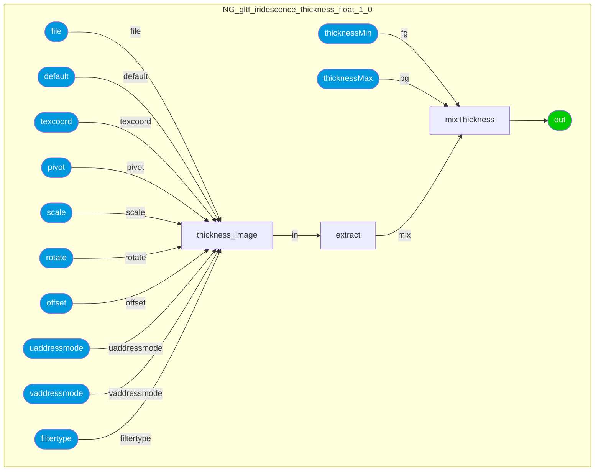
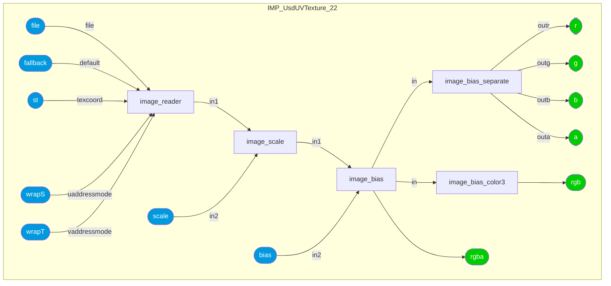
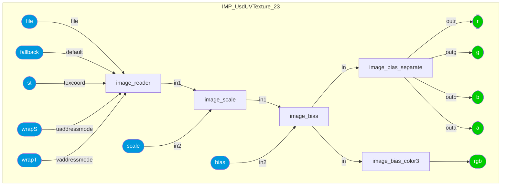

### Node Group: geometric
* [UsdPrimvarReader](#node-UsdPrimvarReader) 
---------
### Node Group: math
* [UsdTransform2d](#node-UsdTransform2d) 
---------
### Node Group: pbr
* [LamaAdd](#node-LamaAdd) [LamaConductor](#node-LamaConductor) [LamaDielectric](#node-LamaDielectric) [LamaDiffuse](#node-LamaDiffuse) [LamaEmission](#node-LamaEmission) [LamaGeneralizedSchlick](#node-LamaGeneralizedSchlick) [LamaIridescence](#node-LamaIridescence) [LamaLayer](#node-LamaLayer) [LamaMix](#node-LamaMix) [LamaSSS](#node-LamaSSS) [LamaSheen](#node-LamaSheen) [LamaSurface](#node-LamaSurface) [LamaTranslucent](#node-LamaTranslucent) [UsdPreviewSurface](#node-UsdPreviewSurface) [disney_brdf_2012](#node-disney_brdf_2012) [disney_bsdf_2015](#node-disney_bsdf_2015) [disney_principled](#node-disney_principled) [gltf_pbr](#node-gltf_pbr) [open_pbr_anisotropy](#node-open_pbr_anisotropy) [open_pbr_surface](#node-open_pbr_surface) [standard_surface](#node-standard_surface) 
---------
### Node Group: texture2d
* [UsdUVTexture](#node-UsdUVTexture) [gltf_colorimage](#node-gltf_colorimage) [gltf_image](#node-gltf_image) [gltf_iridescence_thickness](#node-gltf_iridescence_thickness) [gltf_normalmap](#node-gltf_normalmap) 
---------
### Node Group: translation
* [open_pbr_surface_to_standard_surface](#node-open_pbr_surface_to_standard_surface) [standard_surface_to_UsdPreviewSurface](#node-standard_surface_to_UsdPreviewSurface) [standard_surface_to_gltf_pbr](#node-standard_surface_to_gltf_pbr) [standard_surface_to_open_pbr_surface](#node-standard_surface_to_open_pbr_surface) 
---------
 
### Category: *disney_brdf_2012*
<details open><summary>ND_disney_brdf_2012_surface</summary>
<p>
 
* *Nodedef*: ND_disney_brdf_2012_surface
* *Type*: surfaceshader
* *Group*: pbr
* *Version*: 1.0. Is default: False
* *Doc*: UNDOCUMENTED
* *Implementation*: Non-graph
 

| Name | Type | Default Value | UI name | UI min | UI max | UI Soft Min | UI Soft Max | UI step | UI group | UI Advanced | Doc | Uniform |
| ---- | ---- | ---- | ---- | ---- | ---- | ---- | ---- | ---- | ---- | ---- | ---- | ---- |
| **baseColor** | color3 | 0.16, 0.16, 0.16 |  |  |  |  |  |  |  |  |  |  |
| **metallic** | float | 0.0 |  |  |  |  |  |  |  |  |  |  |
| **subsurface** | float | 0.0 |  |  |  |  |  |  |  |  |  |  |
| **specular** | float | 0.5 |  |  |  |  |  |  |  |  |  |  |
| **roughness** | float | 0.5 |  |  |  |  |  |  |  |  |  |  |
| **specularTint** | float | 0.0 |  |  |  |  |  |  |  |  |  |  |
| **anisotropic** | float | 0.0 |  |  |  |  |  |  |  |  |  |  |
| **sheen** | float | 0.0 |  |  |  |  |  |  |  |  |  |  |
| **sheenTint** | float | 0.5 |  |  |  |  |  |  |  |  |  |  |
| **clearcoat** | float | 0.0 |  |  |  |  |  |  |  |  |  |  |
| **clearcoatGloss** | float | 1.0 |  |  |  |  |  |  |  |  |  |  |
| *out* | surfaceshader | None |  |  |  |  |  |  |  |  |  |  |
### Category: *disney_bsdf_2015*
<details open><summary>ND_disney_bsdf_2015_surface</summary>
<p>
 
* *Nodedef*: ND_disney_bsdf_2015_surface
* *Type*: surfaceshader
* *Group*: pbr
* *Version*: 1.0. Is default: False
* *Doc*: UNDOCUMENTED
* *Implementation*: Non-graph
 

| Name | Type | Default Value | UI name | UI min | UI max | UI Soft Min | UI Soft Max | UI step | UI group | UI Advanced | Doc | Uniform |
| ---- | ---- | ---- | ---- | ---- | ---- | ---- | ---- | ---- | ---- | ---- | ---- | ---- |
| **baseColor** | color3 | 0.16, 0.16, 0.16 |  |  |  |  |  |  |  |  |  |  |
| **metallic** | float | 0.0 |  |  |  |  |  |  |  |  |  |  |
| **roughness** | float | 0.5 |  |  |  |  |  |  |  |  |  |  |
| **anisotropic** | float | 0.0 |  |  |  |  |  |  |  |  |  |  |
| **specularTint** | float | 0.0 |  |  |  |  |  |  |  |  |  |  |
| **sheen** | float | 0.0 |  |  |  |  |  |  |  |  |  |  |
| **sheenTint** | float | 0.5 |  |  |  |  |  |  |  |  |  |  |
| **clearcoat** | float | 0.0 |  |  |  |  |  |  |  |  |  |  |
| **clearcoatGloss** | float | 1.0 |  |  |  |  |  |  |  |  |  |  |
| **specTrans** | float | 0.0 |  |  |  |  |  |  |  |  |  |  |
| **ior** | float | 1.5 |  |  |  |  |  |  |  |  |  |  |
| **scatterDistance** | vector3 | 0, 0, 0 |  |  |  |  |  |  |  |  |  |  |
| **flatness** | float | 0.0 |  |  |  |  |  |  |  |  |  |  |
| **diffTrans** | float | 0.0 |  |  |  |  |  |  |  |  |  |  |
| **thin** | boolean | False |  |  |  |  |  |  |  |  |  | true |
| *out* | surfaceshader | None |  |  |  |  |  |  |  |  |  |  |
### Category: *disney_principled*
<details open><summary>ND_disney_principled</summary>
<p>
 
* *Nodedef*: ND_disney_principled
* *Type*: surfaceshader
* *Group*: pbr
* *Version*: 1.0. Is default: False
* *Doc*: The Disney Principled BSDF
* *Nodegraph*: NG_disney_principled

```mermaid
graph TB
    subgraph NG_disney_principled
    NG_disney_principled_invert_metalness[invert_metalness]
    NG_disney_principled_diffuse_bsdf[diffuse_bsdf]
    NG_disney_principled_subsurface_bsdf[subsurface_bsdf]
    NG_disney_principled_subsurface_mix[subsurface_mix]
    NG_disney_principled_sheen_color[sheen_color]
    NG_disney_principled_sheen_bsdf[sheen_bsdf]
    NG_disney_principled_sheen_layer[sheen_layer]
    NG_disney_principled_transmission_bsdf[transmission_bsdf]
    NG_disney_principled_transmission_mix[transmission_mix]
    NG_disney_principled_specular_roughness[specular_roughness]
    NG_disney_principled_dielectric_intensity[dielectric_intensity]
    NG_disney_principled_dielectric_tint[dielectric_tint]
    NG_disney_principled_dielectric_bsdf[dielectric_bsdf]
    NG_disney_principled_dielectric_layer[dielectric_layer]
    NG_disney_principled_metallic_bsdf[metallic_bsdf]
    NG_disney_principled_metallic_mix[metallic_mix]
    NG_disney_principled_coat_intensity[coat_intensity]
    NG_disney_principled_coat_roughness[coat_roughness]
    NG_disney_principled_coat_roughness_vector[coat_roughness_vector]
    NG_disney_principled_coat_roughness_dual[coat_roughness_dual]
    NG_disney_principled_coat_bsdf[coat_bsdf]
    NG_disney_principled_coat_layer[coat_layer]
    NG_disney_principled_surface_constructor[surface_constructor]
    style NG_disney_principled_out  fill:#0C0, color:#FFF
    NG_disney_principled_out([out])
    style NG_disney_principled_metallic  fill:#09D, color:#FFF
    NG_disney_principled_metallic([metallic])
    style NG_disney_principled_baseColor  fill:#09D, color:#FFF
    NG_disney_principled_baseColor([baseColor])
    style NG_disney_principled_roughness  fill:#09D, color:#FFF
    NG_disney_principled_roughness([roughness])
    style NG_disney_principled_subsurfaceDistance  fill:#09D, color:#FFF
    NG_disney_principled_subsurfaceDistance([subsurfaceDistance])
    style NG_disney_principled_subsurface  fill:#09D, color:#FFF
    NG_disney_principled_subsurface([subsurface])
    style NG_disney_principled_sheenTint  fill:#09D, color:#FFF
    NG_disney_principled_sheenTint([sheenTint])
    style NG_disney_principled_sheen  fill:#09D, color:#FFF
    NG_disney_principled_sheen([sheen])
    style NG_disney_principled_ior  fill:#09D, color:#FFF
    NG_disney_principled_ior([ior])
    style NG_disney_principled_specTrans  fill:#09D, color:#FFF
    NG_disney_principled_specTrans([specTrans])
    style NG_disney_principled_anisotropic  fill:#09D, color:#FFF
    NG_disney_principled_anisotropic([anisotropic])
    style NG_disney_principled_specular  fill:#09D, color:#FFF
    NG_disney_principled_specular([specular])
    style NG_disney_principled_specularTint  fill:#09D, color:#FFF
    NG_disney_principled_specularTint([specularTint])
    style NG_disney_principled_clearcoat  fill:#09D, color:#FFF
    NG_disney_principled_clearcoat([clearcoat])
    style NG_disney_principled_clearcoatGloss  fill:#09D, color:#FFF
    NG_disney_principled_clearcoatGloss([clearcoatGloss])
    end
    NG_disney_principled_metallic --"in"--> NG_disney_principled_invert_metalness
    NG_disney_principled_invert_metalness --"weight"--> NG_disney_principled_diffuse_bsdf
    NG_disney_principled_baseColor --"color"--> NG_disney_principled_diffuse_bsdf
    NG_disney_principled_roughness --"roughness"--> NG_disney_principled_diffuse_bsdf
    NG_disney_principled_baseColor --"color"--> NG_disney_principled_subsurface_bsdf
    NG_disney_principled_subsurfaceDistance --"radius"--> NG_disney_principled_subsurface_bsdf
    NG_disney_principled_diffuse_bsdf --"bg"--> NG_disney_principled_subsurface_mix
    NG_disney_principled_subsurface_bsdf --"fg"--> NG_disney_principled_subsurface_mix
    NG_disney_principled_subsurface --"mix"--> NG_disney_principled_subsurface_mix
    NG_disney_principled_baseColor --"fg"--> NG_disney_principled_sheen_color
    NG_disney_principled_sheenTint --"mix"--> NG_disney_principled_sheen_color
    NG_disney_principled_sheen --"weight"--> NG_disney_principled_sheen_bsdf
    NG_disney_principled_sheen_color --"color"--> NG_disney_principled_sheen_bsdf
    NG_disney_principled_sheen_bsdf --"top"--> NG_disney_principled_sheen_layer
    NG_disney_principled_subsurface_mix --"base"--> NG_disney_principled_sheen_layer
    NG_disney_principled_baseColor --"tint"--> NG_disney_principled_transmission_bsdf
    NG_disney_principled_ior --"ior"--> NG_disney_principled_transmission_bsdf
    NG_disney_principled_sheen_layer --"bg"--> NG_disney_principled_transmission_mix
    NG_disney_principled_transmission_bsdf --"fg"--> NG_disney_principled_transmission_mix
    NG_disney_principled_specTrans --"mix"--> NG_disney_principled_transmission_mix
    NG_disney_principled_roughness --"roughness"--> NG_disney_principled_specular_roughness
    NG_disney_principled_anisotropic --"anisotropy"--> NG_disney_principled_specular_roughness
    NG_disney_principled_specular --"in1"--> NG_disney_principled_dielectric_intensity
    NG_disney_principled_baseColor --"fg"--> NG_disney_principled_dielectric_tint
    NG_disney_principled_specularTint --"mix"--> NG_disney_principled_dielectric_tint
    NG_disney_principled_dielectric_intensity --"weight"--> NG_disney_principled_dielectric_bsdf
    NG_disney_principled_dielectric_tint --"color0"--> NG_disney_principled_dielectric_bsdf
    NG_disney_principled_specular_roughness --"roughness"--> NG_disney_principled_dielectric_bsdf
    NG_disney_principled_dielectric_bsdf --"top"--> NG_disney_principled_dielectric_layer
    NG_disney_principled_transmission_mix --"base"--> NG_disney_principled_dielectric_layer
    NG_disney_principled_baseColor --"color0"--> NG_disney_principled_metallic_bsdf
    NG_disney_principled_specular_roughness --"roughness"--> NG_disney_principled_metallic_bsdf
    NG_disney_principled_dielectric_layer --"bg"--> NG_disney_principled_metallic_mix
    NG_disney_principled_metallic_bsdf --"fg"--> NG_disney_principled_metallic_mix
    NG_disney_principled_metallic --"mix"--> NG_disney_principled_metallic_mix
    NG_disney_principled_clearcoat --"in1"--> NG_disney_principled_coat_intensity
    NG_disney_principled_clearcoatGloss --"in"--> NG_disney_principled_coat_roughness
    NG_disney_principled_coat_roughness --"in"--> NG_disney_principled_coat_roughness_vector
    NG_disney_principled_coat_roughness_vector --"roughness"--> NG_disney_principled_coat_roughness_dual
    NG_disney_principled_coat_intensity --"weight"--> NG_disney_principled_coat_bsdf
    NG_disney_principled_coat_roughness_dual --"roughness"--> NG_disney_principled_coat_bsdf
    NG_disney_principled_coat_bsdf --"top"--> NG_disney_principled_coat_layer
    NG_disney_principled_metallic_mix --"base"--> NG_disney_principled_coat_layer
    NG_disney_principled_coat_layer --"bsdf"--> NG_disney_principled_surface_constructor
    NG_disney_principled_surface_constructor --> NG_disney_principled_out
```



 

| Name | Type | Default Value | UI name | UI min | UI max | UI Soft Min | UI Soft Max | UI step | UI group | UI Advanced | Doc | Uniform |
| ---- | ---- | ---- | ---- | ---- | ---- | ---- | ---- | ---- | ---- | ---- | ---- | ---- |
| **baseColor** | color3 | 0.16, 0.16, 0.16 | Base Color |  |  |  |  |  | Base |  |  |  |
| **metallic** | float | 0.0 | Metallic | 0.0 | 1.0 |  |  |  | Base |  |  |  |
| **roughness** | float | 0.5 | Roughness | 0.0 | 1.0 |  |  |  | Base |  |  |  |
| **anisotropic** | float | 0.0 | Anisotropic | 0.0 | 1.0 |  |  |  | Specular |  |  |  |
| **specular** | float | 0.5 | Specular | 0.0 | 1.0 |  |  |  | Specular |  |  |  |
| **specularTint** | float | 0.0 | Specular Tint | 0.0 | 1.0 |  |  |  | Specular |  |  |  |
| **sheen** | float | 0.0 | Sheen | 0.0 | 1.0 |  |  |  | Sheen |  |  |  |
| **sheenTint** | float | 0.5 | Sheen Tint | 0.0 | 1.0 |  |  |  | Sheen |  |  |  |
| **clearcoat** | float | 0.0 | Clearcoat | 0.0 | 1.0 |  |  |  | Clearcoat |  |  |  |
| **clearcoatGloss** | float | 1.0 | Clearcoat Gloss | 0.0 | 1.0 |  |  |  | Clearcoat |  |  |  |
| **specTrans** | float | 0.0 | Spec Trans | 0.0 | 1.0 |  |  |  | Transmission |  |  |  |
| **ior** | float | 1.5 | IOR |  |  | 1.0 | 3.0 |  | Transmission |  |  |  |
| **subsurface** | float | 0.0 | Subsurface |  |  |  |  |  | Subsurface |  |  |  |
| **subsurfaceDistance** | color3 | 1, 1, 1 | Subsurface Distance |  |  |  |  |  | Subsurface |  |  |  |
| *out* | surfaceshader | None |  |  |  |  |  |  |  |  |  |  |
### Category: *gltf_pbr*
<details open><summary>ND_gltf_pbr_surfaceshader</summary>
<p>
 
* *Nodedef*: ND_gltf_pbr_surfaceshader
* *Type*: surfaceshader
* *Group*: pbr
* *Version*: 2.0.1. Is default: True
* *Doc*: glTF PBR
* *Nodegraph*: IMPL_gltf_pbr_surfaceshader


```mermaid
graph TB
    subgraph IMPL_gltf_pbr_surfaceshader
    IMPL_gltf_pbr_surfaceshader_attenuation_color_vec[attenuation_color_vec]
    IMPL_gltf_pbr_surfaceshader_ln_attenuation_color_vec[ln_attenuation_color_vec]
    IMPL_gltf_pbr_surfaceshader_ln_attenuation_color_vec_over_distance[ln_attenuation_color_vec_over_distance]
    IMPL_gltf_pbr_surfaceshader_attenuation_coeff[attenuation_coeff]
    IMPL_gltf_pbr_surfaceshader_isotropic_volume[isotropic_volume]
    IMPL_gltf_pbr_surfaceshader_one_minus_ior[one_minus_ior]
    IMPL_gltf_pbr_surfaceshader_one_plus_ior[one_plus_ior]
    IMPL_gltf_pbr_surfaceshader_ior_div[ior_div]
    IMPL_gltf_pbr_surfaceshader_dielectric_f0_from_ior[dielectric_f0_from_ior]
    IMPL_gltf_pbr_surfaceshader_dielectric_f0_from_ior_specular_color[dielectric_f0_from_ior_specular_color]
    IMPL_gltf_pbr_surfaceshader_clamped_dielectric_f0_from_ior_specular_color[clamped_dielectric_f0_from_ior_specular_color]
    IMPL_gltf_pbr_surfaceshader_dielectric_f0[dielectric_f0]
    IMPL_gltf_pbr_surfaceshader_dielectric_f90[dielectric_f90]
    IMPL_gltf_pbr_surfaceshader_roughness_uv[roughness_uv]
    IMPL_gltf_pbr_surfaceshader_diffuse_bsdf[diffuse_bsdf]
    IMPL_gltf_pbr_surfaceshader_transmission_bsdf[transmission_bsdf]
    IMPL_gltf_pbr_surfaceshader_reflection_bsdf[reflection_bsdf]
    IMPL_gltf_pbr_surfaceshader_transmission_mix[transmission_mix]
    IMPL_gltf_pbr_surfaceshader_dielectric_bsdf[dielectric_bsdf]
    IMPL_gltf_pbr_surfaceshader_tf_reflection_bsdf[tf_reflection_bsdf]
    IMPL_gltf_pbr_surfaceshader_tf_dielectric_bsdf[tf_dielectric_bsdf]
    IMPL_gltf_pbr_surfaceshader_mix_iridescent_dielectric_bsdf[mix_iridescent_dielectric_bsdf]
    IMPL_gltf_pbr_surfaceshader_metal_bsdf[metal_bsdf]
    IMPL_gltf_pbr_surfaceshader_tf_metal_bsdf[tf_metal_bsdf]
    IMPL_gltf_pbr_surfaceshader_mix_iridescent_metal_bsdf[mix_iridescent_metal_bsdf]
    IMPL_gltf_pbr_surfaceshader_base_mix[base_mix]
    IMPL_gltf_pbr_surfaceshader_sheen_color_r[sheen_color_r]
    IMPL_gltf_pbr_surfaceshader_sheen_color_g[sheen_color_g]
    IMPL_gltf_pbr_surfaceshader_sheen_color_b[sheen_color_b]
    IMPL_gltf_pbr_surfaceshader_sheen_color_max_rg[sheen_color_max_rg]
    IMPL_gltf_pbr_surfaceshader_sheen_intensity[sheen_intensity]
    IMPL_gltf_pbr_surfaceshader_sheen_roughness_sq[sheen_roughness_sq]
    IMPL_gltf_pbr_surfaceshader_sheen_color_normalized[sheen_color_normalized]
    IMPL_gltf_pbr_surfaceshader_sheen_bsdf[sheen_bsdf]
    IMPL_gltf_pbr_surfaceshader_sheen_layer[sheen_layer]
    IMPL_gltf_pbr_surfaceshader_clearcoat_roughness_uv[clearcoat_roughness_uv]
    IMPL_gltf_pbr_surfaceshader_clearcoat_bsdf[clearcoat_bsdf]
    IMPL_gltf_pbr_surfaceshader_clearcoat_layer[clearcoat_layer]
    IMPL_gltf_pbr_surfaceshader_emission_color[emission_color]
    IMPL_gltf_pbr_surfaceshader_emission[emission]
    style IMPL_gltf_pbr_surfaceshader_opacity_mask_cutoff  fill:#C72, color:#FFF
    IMPL_gltf_pbr_surfaceshader_opacity_mask_cutoff{opacity_mask_cutoff}
    style IMPL_gltf_pbr_surfaceshader_opacity_mask  fill:#C72, color:#FFF
    IMPL_gltf_pbr_surfaceshader_opacity_mask{opacity_mask}
    style IMPL_gltf_pbr_surfaceshader_opacity  fill:#C72, color:#FFF
    IMPL_gltf_pbr_surfaceshader_opacity{opacity}
    IMPL_gltf_pbr_surfaceshader_shader_constructor[shader_constructor]
    style IMPL_gltf_pbr_surfaceshader_out  fill:#0C0, color:#FFF
    IMPL_gltf_pbr_surfaceshader_out([out])
    style IMPL_gltf_pbr_surfaceshader_attenuation_color  fill:#09D, color:#FFF
    IMPL_gltf_pbr_surfaceshader_attenuation_color([attenuation_color])
    style IMPL_gltf_pbr_surfaceshader_attenuation_distance  fill:#09D, color:#FFF
    IMPL_gltf_pbr_surfaceshader_attenuation_distance([attenuation_distance])
    style IMPL_gltf_pbr_surfaceshader_ior  fill:#09D, color:#FFF
    IMPL_gltf_pbr_surfaceshader_ior([ior])
    style IMPL_gltf_pbr_surfaceshader_specular_color  fill:#09D, color:#FFF
    IMPL_gltf_pbr_surfaceshader_specular_color([specular_color])
    style IMPL_gltf_pbr_surfaceshader_specular  fill:#09D, color:#FFF
    IMPL_gltf_pbr_surfaceshader_specular([specular])
    style IMPL_gltf_pbr_surfaceshader_roughness  fill:#09D, color:#FFF
    IMPL_gltf_pbr_surfaceshader_roughness([roughness])
    style IMPL_gltf_pbr_surfaceshader_base_color  fill:#09D, color:#FFF
    IMPL_gltf_pbr_surfaceshader_base_color([base_color])
    style IMPL_gltf_pbr_surfaceshader_normal  fill:#09D, color:#FFF
    IMPL_gltf_pbr_surfaceshader_normal([normal])
    style IMPL_gltf_pbr_surfaceshader_tangent  fill:#09D, color:#FFF
    IMPL_gltf_pbr_surfaceshader_tangent([tangent])
    style IMPL_gltf_pbr_surfaceshader_transmission  fill:#09D, color:#FFF
    IMPL_gltf_pbr_surfaceshader_transmission([transmission])
    style IMPL_gltf_pbr_surfaceshader_iridescence_thickness  fill:#09D, color:#FFF
    IMPL_gltf_pbr_surfaceshader_iridescence_thickness([iridescence_thickness])
    style IMPL_gltf_pbr_surfaceshader_iridescence_ior  fill:#09D, color:#FFF
    IMPL_gltf_pbr_surfaceshader_iridescence_ior([iridescence_ior])
    style IMPL_gltf_pbr_surfaceshader_iridescence  fill:#09D, color:#FFF
    IMPL_gltf_pbr_surfaceshader_iridescence([iridescence])
    style IMPL_gltf_pbr_surfaceshader_metallic  fill:#09D, color:#FFF
    IMPL_gltf_pbr_surfaceshader_metallic([metallic])
    style IMPL_gltf_pbr_surfaceshader_sheen_color  fill:#09D, color:#FFF
    IMPL_gltf_pbr_surfaceshader_sheen_color([sheen_color])
    style IMPL_gltf_pbr_surfaceshader_sheen_roughness  fill:#09D, color:#FFF
    IMPL_gltf_pbr_surfaceshader_sheen_roughness([sheen_roughness])
    style IMPL_gltf_pbr_surfaceshader_clearcoat_roughness  fill:#09D, color:#FFF
    IMPL_gltf_pbr_surfaceshader_clearcoat_roughness([clearcoat_roughness])
    style IMPL_gltf_pbr_surfaceshader_clearcoat  fill:#09D, color:#FFF
    IMPL_gltf_pbr_surfaceshader_clearcoat([clearcoat])
    style IMPL_gltf_pbr_surfaceshader_clearcoat_normal  fill:#09D, color:#FFF
    IMPL_gltf_pbr_surfaceshader_clearcoat_normal([clearcoat_normal])
    style IMPL_gltf_pbr_surfaceshader_emissive  fill:#09D, color:#FFF
    IMPL_gltf_pbr_surfaceshader_emissive([emissive])
    style IMPL_gltf_pbr_surfaceshader_emissive_strength  fill:#09D, color:#FFF
    IMPL_gltf_pbr_surfaceshader_emissive_strength([emissive_strength])
    style IMPL_gltf_pbr_surfaceshader_alpha  fill:#09D, color:#FFF
    IMPL_gltf_pbr_surfaceshader_alpha([alpha])
    style IMPL_gltf_pbr_surfaceshader_alpha_cutoff  fill:#09D, color:#FFF
    IMPL_gltf_pbr_surfaceshader_alpha_cutoff([alpha_cutoff])
    style IMPL_gltf_pbr_surfaceshader_alpha_mode  fill:#09D, color:#FFF
    IMPL_gltf_pbr_surfaceshader_alpha_mode([alpha_mode])
    end
    IMPL_gltf_pbr_surfaceshader_attenuation_color --"in"--> IMPL_gltf_pbr_surfaceshader_attenuation_color_vec
    IMPL_gltf_pbr_surfaceshader_attenuation_color_vec --"in"--> IMPL_gltf_pbr_surfaceshader_ln_attenuation_color_vec
    IMPL_gltf_pbr_surfaceshader_ln_attenuation_color_vec --"in1"--> IMPL_gltf_pbr_surfaceshader_ln_attenuation_color_vec_over_distance
    IMPL_gltf_pbr_surfaceshader_attenuation_distance --"in2"--> IMPL_gltf_pbr_surfaceshader_ln_attenuation_color_vec_over_distance
    IMPL_gltf_pbr_surfaceshader_ln_attenuation_color_vec_over_distance --"in1"--> IMPL_gltf_pbr_surfaceshader_attenuation_coeff
    IMPL_gltf_pbr_surfaceshader_attenuation_coeff --"absorption"--> IMPL_gltf_pbr_surfaceshader_isotropic_volume
    IMPL_gltf_pbr_surfaceshader_ior --"in2"--> IMPL_gltf_pbr_surfaceshader_one_minus_ior
    IMPL_gltf_pbr_surfaceshader_ior --"in2"--> IMPL_gltf_pbr_surfaceshader_one_plus_ior
    IMPL_gltf_pbr_surfaceshader_one_minus_ior --"in1"--> IMPL_gltf_pbr_surfaceshader_ior_div
    IMPL_gltf_pbr_surfaceshader_one_plus_ior --"in2"--> IMPL_gltf_pbr_surfaceshader_ior_div
    IMPL_gltf_pbr_surfaceshader_ior_div --"in1"--> IMPL_gltf_pbr_surfaceshader_dielectric_f0_from_ior
    IMPL_gltf_pbr_surfaceshader_ior_div --"in2"--> IMPL_gltf_pbr_surfaceshader_dielectric_f0_from_ior
    IMPL_gltf_pbr_surfaceshader_specular_color --"in1"--> IMPL_gltf_pbr_surfaceshader_dielectric_f0_from_ior_specular_color
    IMPL_gltf_pbr_surfaceshader_dielectric_f0_from_ior --"in2"--> IMPL_gltf_pbr_surfaceshader_dielectric_f0_from_ior_specular_color
    IMPL_gltf_pbr_surfaceshader_dielectric_f0_from_ior_specular_color --"in1"--> IMPL_gltf_pbr_surfaceshader_clamped_dielectric_f0_from_ior_specular_color
    IMPL_gltf_pbr_surfaceshader_clamped_dielectric_f0_from_ior_specular_color --"in1"--> IMPL_gltf_pbr_surfaceshader_dielectric_f0
    IMPL_gltf_pbr_surfaceshader_specular --"in2"--> IMPL_gltf_pbr_surfaceshader_dielectric_f0
    IMPL_gltf_pbr_surfaceshader_specular --"in2"--> IMPL_gltf_pbr_surfaceshader_dielectric_f90
    IMPL_gltf_pbr_surfaceshader_roughness --"roughness"--> IMPL_gltf_pbr_surfaceshader_roughness_uv
    IMPL_gltf_pbr_surfaceshader_base_color --"color"--> IMPL_gltf_pbr_surfaceshader_diffuse_bsdf
    IMPL_gltf_pbr_surfaceshader_normal --"normal"--> IMPL_gltf_pbr_surfaceshader_diffuse_bsdf
    IMPL_gltf_pbr_surfaceshader_base_color --"tint"--> IMPL_gltf_pbr_surfaceshader_transmission_bsdf
    IMPL_gltf_pbr_surfaceshader_ior --"ior"--> IMPL_gltf_pbr_surfaceshader_transmission_bsdf
    IMPL_gltf_pbr_surfaceshader_roughness_uv --"roughness"--> IMPL_gltf_pbr_surfaceshader_transmission_bsdf
    IMPL_gltf_pbr_surfaceshader_normal --"normal"--> IMPL_gltf_pbr_surfaceshader_transmission_bsdf
    IMPL_gltf_pbr_surfaceshader_tangent --"tangent"--> IMPL_gltf_pbr_surfaceshader_transmission_bsdf
    IMPL_gltf_pbr_surfaceshader_dielectric_f0 --"color0"--> IMPL_gltf_pbr_surfaceshader_reflection_bsdf
    IMPL_gltf_pbr_surfaceshader_dielectric_f90 --"color90"--> IMPL_gltf_pbr_surfaceshader_reflection_bsdf
    IMPL_gltf_pbr_surfaceshader_roughness_uv --"roughness"--> IMPL_gltf_pbr_surfaceshader_reflection_bsdf
    IMPL_gltf_pbr_surfaceshader_normal --"normal"--> IMPL_gltf_pbr_surfaceshader_reflection_bsdf
    IMPL_gltf_pbr_surfaceshader_tangent --"tangent"--> IMPL_gltf_pbr_surfaceshader_reflection_bsdf
    IMPL_gltf_pbr_surfaceshader_diffuse_bsdf --"bg"--> IMPL_gltf_pbr_surfaceshader_transmission_mix
    IMPL_gltf_pbr_surfaceshader_transmission_bsdf --"fg"--> IMPL_gltf_pbr_surfaceshader_transmission_mix
    IMPL_gltf_pbr_surfaceshader_transmission --"mix"--> IMPL_gltf_pbr_surfaceshader_transmission_mix
    IMPL_gltf_pbr_surfaceshader_reflection_bsdf --"top"--> IMPL_gltf_pbr_surfaceshader_dielectric_bsdf
    IMPL_gltf_pbr_surfaceshader_transmission_mix --"base"--> IMPL_gltf_pbr_surfaceshader_dielectric_bsdf
    IMPL_gltf_pbr_surfaceshader_dielectric_f0 --"color0"--> IMPL_gltf_pbr_surfaceshader_tf_reflection_bsdf
    IMPL_gltf_pbr_surfaceshader_dielectric_f90 --"color90"--> IMPL_gltf_pbr_surfaceshader_tf_reflection_bsdf
    IMPL_gltf_pbr_surfaceshader_roughness_uv --"roughness"--> IMPL_gltf_pbr_surfaceshader_tf_reflection_bsdf
    IMPL_gltf_pbr_surfaceshader_normal --"normal"--> IMPL_gltf_pbr_surfaceshader_tf_reflection_bsdf
    IMPL_gltf_pbr_surfaceshader_tangent --"tangent"--> IMPL_gltf_pbr_surfaceshader_tf_reflection_bsdf
    IMPL_gltf_pbr_surfaceshader_iridescence_thickness --"thinfilm_thickness"--> IMPL_gltf_pbr_surfaceshader_tf_reflection_bsdf
    IMPL_gltf_pbr_surfaceshader_iridescence_ior --"thinfilm_ior"--> IMPL_gltf_pbr_surfaceshader_tf_reflection_bsdf
    IMPL_gltf_pbr_surfaceshader_tf_reflection_bsdf --"top"--> IMPL_gltf_pbr_surfaceshader_tf_dielectric_bsdf
    IMPL_gltf_pbr_surfaceshader_transmission_mix --"base"--> IMPL_gltf_pbr_surfaceshader_tf_dielectric_bsdf
    IMPL_gltf_pbr_surfaceshader_dielectric_bsdf --"bg"--> IMPL_gltf_pbr_surfaceshader_mix_iridescent_dielectric_bsdf
    IMPL_gltf_pbr_surfaceshader_tf_dielectric_bsdf --"fg"--> IMPL_gltf_pbr_surfaceshader_mix_iridescent_dielectric_bsdf
    IMPL_gltf_pbr_surfaceshader_iridescence --"mix"--> IMPL_gltf_pbr_surfaceshader_mix_iridescent_dielectric_bsdf
    IMPL_gltf_pbr_surfaceshader_base_color --"color0"--> IMPL_gltf_pbr_surfaceshader_metal_bsdf
    IMPL_gltf_pbr_surfaceshader_roughness_uv --"roughness"--> IMPL_gltf_pbr_surfaceshader_metal_bsdf
    IMPL_gltf_pbr_surfaceshader_normal --"normal"--> IMPL_gltf_pbr_surfaceshader_metal_bsdf
    IMPL_gltf_pbr_surfaceshader_tangent --"tangent"--> IMPL_gltf_pbr_surfaceshader_metal_bsdf
    IMPL_gltf_pbr_surfaceshader_base_color --"color0"--> IMPL_gltf_pbr_surfaceshader_tf_metal_bsdf
    IMPL_gltf_pbr_surfaceshader_roughness_uv --"roughness"--> IMPL_gltf_pbr_surfaceshader_tf_metal_bsdf
    IMPL_gltf_pbr_surfaceshader_normal --"normal"--> IMPL_gltf_pbr_surfaceshader_tf_metal_bsdf
    IMPL_gltf_pbr_surfaceshader_tangent --"tangent"--> IMPL_gltf_pbr_surfaceshader_tf_metal_bsdf
    IMPL_gltf_pbr_surfaceshader_iridescence_thickness --"thinfilm_thickness"--> IMPL_gltf_pbr_surfaceshader_tf_metal_bsdf
    IMPL_gltf_pbr_surfaceshader_iridescence_ior --"thinfilm_ior"--> IMPL_gltf_pbr_surfaceshader_tf_metal_bsdf
    IMPL_gltf_pbr_surfaceshader_metal_bsdf --"bg"--> IMPL_gltf_pbr_surfaceshader_mix_iridescent_metal_bsdf
    IMPL_gltf_pbr_surfaceshader_tf_metal_bsdf --"fg"--> IMPL_gltf_pbr_surfaceshader_mix_iridescent_metal_bsdf
    IMPL_gltf_pbr_surfaceshader_iridescence --"mix"--> IMPL_gltf_pbr_surfaceshader_mix_iridescent_metal_bsdf
    IMPL_gltf_pbr_surfaceshader_mix_iridescent_dielectric_bsdf --"bg"--> IMPL_gltf_pbr_surfaceshader_base_mix
    IMPL_gltf_pbr_surfaceshader_mix_iridescent_metal_bsdf --"fg"--> IMPL_gltf_pbr_surfaceshader_base_mix
    IMPL_gltf_pbr_surfaceshader_metallic --"mix"--> IMPL_gltf_pbr_surfaceshader_base_mix
    IMPL_gltf_pbr_surfaceshader_sheen_color --"in"--> IMPL_gltf_pbr_surfaceshader_sheen_color_r
    IMPL_gltf_pbr_surfaceshader_sheen_color --"in"--> IMPL_gltf_pbr_surfaceshader_sheen_color_g
    IMPL_gltf_pbr_surfaceshader_sheen_color --"in"--> IMPL_gltf_pbr_surfaceshader_sheen_color_b
    IMPL_gltf_pbr_surfaceshader_sheen_color_r --"in1"--> IMPL_gltf_pbr_surfaceshader_sheen_color_max_rg
    IMPL_gltf_pbr_surfaceshader_sheen_color_g --"in2"--> IMPL_gltf_pbr_surfaceshader_sheen_color_max_rg
    IMPL_gltf_pbr_surfaceshader_sheen_color_max_rg --"in1"--> IMPL_gltf_pbr_surfaceshader_sheen_intensity
    IMPL_gltf_pbr_surfaceshader_sheen_color_b --"in2"--> IMPL_gltf_pbr_surfaceshader_sheen_intensity
    IMPL_gltf_pbr_surfaceshader_sheen_roughness --"in1"--> IMPL_gltf_pbr_surfaceshader_sheen_roughness_sq
    IMPL_gltf_pbr_surfaceshader_sheen_roughness --"in2"--> IMPL_gltf_pbr_surfaceshader_sheen_roughness_sq
    IMPL_gltf_pbr_surfaceshader_sheen_color --"in1"--> IMPL_gltf_pbr_surfaceshader_sheen_color_normalized
    IMPL_gltf_pbr_surfaceshader_sheen_intensity --"in2"--> IMPL_gltf_pbr_surfaceshader_sheen_color_normalized
    IMPL_gltf_pbr_surfaceshader_sheen_intensity --"weight"--> IMPL_gltf_pbr_surfaceshader_sheen_bsdf
    IMPL_gltf_pbr_surfaceshader_sheen_color_normalized --"color"--> IMPL_gltf_pbr_surfaceshader_sheen_bsdf
    IMPL_gltf_pbr_surfaceshader_sheen_roughness_sq --"roughness"--> IMPL_gltf_pbr_surfaceshader_sheen_bsdf
    IMPL_gltf_pbr_surfaceshader_normal --"normal"--> IMPL_gltf_pbr_surfaceshader_sheen_bsdf
    IMPL_gltf_pbr_surfaceshader_sheen_bsdf --"top"--> IMPL_gltf_pbr_surfaceshader_sheen_layer
    IMPL_gltf_pbr_surfaceshader_base_mix --"base"--> IMPL_gltf_pbr_surfaceshader_sheen_layer
    IMPL_gltf_pbr_surfaceshader_clearcoat_roughness --"roughness"--> IMPL_gltf_pbr_surfaceshader_clearcoat_roughness_uv
    IMPL_gltf_pbr_surfaceshader_clearcoat --"weight"--> IMPL_gltf_pbr_surfaceshader_clearcoat_bsdf
    IMPL_gltf_pbr_surfaceshader_clearcoat_roughness_uv --"roughness"--> IMPL_gltf_pbr_surfaceshader_clearcoat_bsdf
    IMPL_gltf_pbr_surfaceshader_clearcoat_normal --"normal"--> IMPL_gltf_pbr_surfaceshader_clearcoat_bsdf
    IMPL_gltf_pbr_surfaceshader_tangent --"tangent"--> IMPL_gltf_pbr_surfaceshader_clearcoat_bsdf
    IMPL_gltf_pbr_surfaceshader_clearcoat_bsdf --"top"--> IMPL_gltf_pbr_surfaceshader_clearcoat_layer
    IMPL_gltf_pbr_surfaceshader_sheen_layer --"base"--> IMPL_gltf_pbr_surfaceshader_clearcoat_layer
    IMPL_gltf_pbr_surfaceshader_emissive --"in1"--> IMPL_gltf_pbr_surfaceshader_emission_color
    IMPL_gltf_pbr_surfaceshader_emissive_strength --"in2"--> IMPL_gltf_pbr_surfaceshader_emission_color
    IMPL_gltf_pbr_surfaceshader_emission_color --"color"--> IMPL_gltf_pbr_surfaceshader_emission
    IMPL_gltf_pbr_surfaceshader_alpha --"value1"--> IMPL_gltf_pbr_surfaceshader_opacity_mask_cutoff
    IMPL_gltf_pbr_surfaceshader_alpha_cutoff --"value2"--> IMPL_gltf_pbr_surfaceshader_opacity_mask_cutoff
    IMPL_gltf_pbr_surfaceshader_alpha_mode --"value1"--> IMPL_gltf_pbr_surfaceshader_opacity_mask
    IMPL_gltf_pbr_surfaceshader_opacity_mask_cutoff --"in1"--> IMPL_gltf_pbr_surfaceshader_opacity_mask
    IMPL_gltf_pbr_surfaceshader_alpha --"in2"--> IMPL_gltf_pbr_surfaceshader_opacity_mask
    IMPL_gltf_pbr_surfaceshader_alpha_mode --"value1"--> IMPL_gltf_pbr_surfaceshader_opacity
    IMPL_gltf_pbr_surfaceshader_opacity_mask --"in2"--> IMPL_gltf_pbr_surfaceshader_opacity
    IMPL_gltf_pbr_surfaceshader_clearcoat_layer --"bsdf"--> IMPL_gltf_pbr_surfaceshader_shader_constructor
    IMPL_gltf_pbr_surfaceshader_emission --"edf"--> IMPL_gltf_pbr_surfaceshader_shader_constructor
    IMPL_gltf_pbr_surfaceshader_opacity --"opacity"--> IMPL_gltf_pbr_surfaceshader_shader_constructor
    IMPL_gltf_pbr_surfaceshader_shader_constructor --> IMPL_gltf_pbr_surfaceshader_out
```
 

| Name | Type | Default Value | UI name | UI min | UI max | UI Soft Min | UI Soft Max | UI step | UI group | UI Advanced | Doc | Uniform |
| ---- | ---- | ---- | ---- | ---- | ---- | ---- | ---- | ---- | ---- | ---- | ---- | ---- |
| **base_color** | color3 | 1, 1, 1 | Base Color | 0, 0, 0 | 1, 1, 1 |  |  |  | Base |  |  |  |
| **metallic** | float | 1.0 | Metallic | 0 | 1 |  |  |  | Base |  |  |  |
| **roughness** | float | 1.0 | Roughness | 0 | 1 |  |  |  | Base |  |  |  |
| **normal** | vector3 | None | Normal |  |  |  |  |  | Base |  |  |  |
| **tangent** | vector3 | None | Tangent |  |  |  |  |  | Base |  |  |  |
| **occlusion** | float | 1.0 | Occlusion | 0 | 1 |  |  |  | Base |  |  |  |
| **transmission** | float | 0.0 | Transmission | 0 | 1 |  |  |  | Base |  |  |  |
| **specular** | float | 1.0 | Specular | 0 | 1 |  |  |  | Base |  |  |  |
| **specular_color** | color3 | 1, 1, 1 | Specular Color | 0, 0, 0 |  |  | 1, 1, 1 |  | Base |  |  |  |
| **ior** | float | 1.5 | Index of Refraction | 1 |  |  | 3 |  | Base |  |  | true |
| **alpha** | float | 1.0 | Alpha | 0 | 1 |  |  |  | Alpha |  |  |  |
| **alpha_mode** | integer | 0 | Alpha Mode |  |  |  |  |  | Alpha |  |  | true |
| **alpha_cutoff** | float | 0.5 | Alpha Cutoff | 0 | 1 |  |  |  | Alpha |  |  | true |
| **iridescence** | float | 0.0 | Iridescence | 0 | 1 |  |  |  | Iridescence |  |  |  |
| **iridescence_ior** | float | 1.3 | Iridescence Index of Refraction | 1 |  |  | 3 |  | Iridescence |  |  | true |
| **iridescence_thickness** | float | 100.0 | Iridescence Thickness | 0 |  | 100 | 400 |  | Iridescence |  |  |  |
| **sheen_color** | color3 | 0, 0, 0 | Sheen Color | 0, 0, 0 | 1, 1, 1 |  |  |  | Sheen |  |  |  |
| **sheen_roughness** | float | 0.0 | Sheen Roughness | 0 | 1 |  |  |  | Sheen |  |  |  |
| **clearcoat** | float | 0.0 | Clearcoat | 0 | 1 |  |  |  | Clearcoat |  |  |  |
| **clearcoat_roughness** | float | 0.0 | Clearcoat Roughness | 0 | 1 |  |  |  | Clearcoat |  |  |  |
| **clearcoat_normal** | vector3 | None | Clearcoat Normal |  |  |  |  |  | Clearcoat |  |  |  |
| **emissive** | color3 | 0, 0, 0 | Emissive | 0, 0, 0 | 1, 1, 1 |  |  |  | Emission |  |  |  |
| **emissive_strength** | float | 1.0 | Emissive Strength | 0 |  |  |  |  | Emission |  |  | true |
| **thickness** | float | 0.0 | Thickness | 0 |  |  |  |  | Volume |  |  | false |
| **attenuation_distance** | float | None | Attenuation Distance | 0 |  |  |  |  | Volume |  |  | true |
| **attenuation_color** | color3 | 1, 1, 1 | Attenuation Color | 0, 0, 0 | 1, 1, 1 |  |  |  | Volume |  |  | true |
| *out* | surfaceshader | None |  |  |  |  |  |  |  |  |  |  |
### Category: *gltf_colorimage*
<details open><summary>ND_gltf_colorimage</summary>
<p>
 
* *Nodedef*: ND_gltf_colorimage
* *Type*: multioutput
* *Group*: texture2d
* *Version*: 1.0. Is default: True
* *Doc*: UNDOCUMENTED
* *Nodegraph*: NG_gltf_colorimage


 

| Name | Type | Default Value | UI name | UI min | UI max | UI Soft Min | UI Soft Max | UI step | UI group | UI Advanced | Doc | Uniform |
| ---- | ---- | ---- | ---- | ---- | ---- | ---- | ---- | ---- | ---- | ---- | ---- | ---- |
| **file** | filename |  |  |  |  |  |  |  | Image |  |  | true |
| **default** | color4 | 0, 0, 0, 0 |  |  |  |  |  |  | Image |  |  |  |
| **texcoord** | vector2 | None |  |  |  |  |  |  | Image |  |  |  |
| **pivot** | vector2 | 0, 1 |  |  |  |  |  |  | Image |  |  |  |
| **scale** | vector2 | 1, 1 |  |  |  |  |  |  | Image |  |  |  |
| **rotate** | float | 0.0 |  | 0 | 360 |  |  |  | Image |  |  |  |
| **offset** | vector2 | 0, 0 |  |  |  |  |  |  | Image |  |  |  |
| **operationorder** | integer | 1 |  |  |  |  |  |  | Image |  |  |  |
| **uaddressmode** | string | periodic |  |  |  |  |  |  | Image |  |  | true |
| **vaddressmode** | string | periodic |  |  |  |  |  |  | Image |  |  | true |
| **filtertype** | string | linear |  |  |  |  |  |  | Image |  |  | true |
| **color** | color4 | 1, 1, 1, 1 |  |  |  |  |  |  | Color |  |  |  |
| **geomcolor** | color4 | 1, 1, 1, 1 | Geometry Color |  |  |  |  |  | Color |  |  |  |
| *outcolor* | color3 | 0, 0, 0 |  |  |  |  |  |  |  |  |  |  |
| *outa* | float | 0.0 |  |  |  |  |  |  |  |  |  |  |
### Category: *gltf_image*
<details open><summary>ND_gltf_image_color3_color3_1_0</summary>
<p>
 
* *Nodedef*: ND_gltf_image_color3_color3_1_0
* *Type*: color3
* *Group*: texture2d
* *Version*: 1.0. Is default: True
* *Doc*: UNDOCUMENTED
* *Nodegraph*: NG_NG_gltf_image_color3_color3_1_0


 

| Name | Type | Default Value | UI name | UI min | UI max | UI Soft Min | UI Soft Max | UI step | UI group | UI Advanced | Doc | Uniform |
| ---- | ---- | ---- | ---- | ---- | ---- | ---- | ---- | ---- | ---- | ---- | ---- | ---- |
| **file** | filename |  |  |  |  |  |  |  |  |  |  | true |
| **factor** | color3 | 1, 1, 1 |  |  |  |  |  |  |  |  |  |  |
| **default** | color3 | 0, 0, 0 |  |  |  |  |  |  |  |  |  |  |
| **texcoord** | vector2 | None |  |  |  |  |  |  |  |  |  |  |
| **pivot** | vector2 | 0, 1 |  |  |  |  |  |  |  |  |  |  |
| **scale** | vector2 | 1, 1 |  |  |  |  |  |  |  |  |  |  |
| **rotate** | float | 0.0 |  | 0 | 360 |  |  |  |  |  |  |  |
| **offset** | vector2 | 0, 0 |  |  |  |  |  |  |  |  |  |  |
| **operationorder** | integer | 0 |  |  |  |  |  |  |  |  |  |  |
| **uaddressmode** | string | periodic |  |  |  |  |  |  |  |  |  | true |
| **vaddressmode** | string | periodic |  |  |  |  |  |  |  |  |  | true |
| **filtertype** | string | linear |  |  |  |  |  |  |  |  |  | true |
| *out* | color3 | 0, 0, 0 |  |  |  |  |  |  |  |  |  |  |
<details open><summary>ND_gltf_image_color4_color4_1_0</summary>
<p>
 
* *Nodedef*: ND_gltf_image_color4_color4_1_0
* *Type*: color4
* *Group*: texture2d
* *Version*: 1.0. Is default: True
* *Doc*: UNDOCUMENTED
* *Nodegraph*: NG_gltf_image_color4_color4_1_0


 

| Name | Type | Default Value | UI name | UI min | UI max | UI Soft Min | UI Soft Max | UI step | UI group | UI Advanced | Doc | Uniform |
| ---- | ---- | ---- | ---- | ---- | ---- | ---- | ---- | ---- | ---- | ---- | ---- | ---- |
| **file** | filename |  |  |  |  |  |  |  |  |  |  | true |
| **factor** | color4 | 1, 1, 1, 1 |  |  |  |  |  |  |  |  |  |  |
| **default** | color4 | 0, 0, 0, 0 |  |  |  |  |  |  |  |  |  |  |
| **texcoord** | vector2 | None |  |  |  |  |  |  |  |  |  |  |
| **pivot** | vector2 | 0, 1 |  |  |  |  |  |  |  |  |  |  |
| **scale** | vector2 | 1, 1 |  |  |  |  |  |  |  |  |  |  |
| **rotate** | float | 0.0 |  | 0 | 360 |  |  |  |  |  |  |  |
| **offset** | vector2 | 0, 0 |  |  |  |  |  |  |  |  |  |  |
| **operationorder** | integer | 1 |  |  |  |  |  |  |  |  |  |  |
| **uaddressmode** | string | periodic |  |  |  |  |  |  |  |  |  | true |
| **vaddressmode** | string | periodic |  |  |  |  |  |  |  |  |  | true |
| **filtertype** | string | linear |  |  |  |  |  |  |  |  |  | true |
| *out* | color4 | 0, 0, 0, 0 |  |  |  |  |  |  |  |  |  |  |
<details open><summary>ND_gltf_image_float_float_1_0</summary>
<p>
 
* *Nodedef*: ND_gltf_image_float_float_1_0
* *Type*: float
* *Group*: texture2d
* *Version*: 1.0. Is default: True
* *Doc*: UNDOCUMENTED
* *Nodegraph*: NG_gltf_image_float_float_1_0


 

| Name | Type | Default Value | UI name | UI min | UI max | UI Soft Min | UI Soft Max | UI step | UI group | UI Advanced | Doc | Uniform |
| ---- | ---- | ---- | ---- | ---- | ---- | ---- | ---- | ---- | ---- | ---- | ---- | ---- |
| **file** | filename |  |  |  |  |  |  |  |  |  |  | true |
| **factor** | float | 1.0 |  |  |  |  |  |  |  |  |  |  |
| **default** | float | 0.0 |  |  |  |  |  |  |  |  |  |  |
| **texcoord** | vector2 | None |  |  |  |  |  |  |  |  |  |  |
| **pivot** | vector2 | 0, 1 |  |  |  |  |  |  |  |  |  |  |
| **scale** | vector2 | 1, 1 |  |  |  |  |  |  |  |  |  |  |
| **rotate** | float | 0.0 |  | 0 | 360 |  |  |  |  |  |  |  |
| **offset** | vector2 | 0, 0 |  |  |  |  |  |  |  |  |  |  |
| **operationorder** | integer | 0 |  |  |  |  |  |  |  |  |  |  |
| **uaddressmode** | string | periodic |  |  |  |  |  |  |  |  |  | true |
| **vaddressmode** | string | periodic |  |  |  |  |  |  |  |  |  | true |
| **filtertype** | string | linear |  |  |  |  |  |  |  |  |  | true |
| *out* | float | 0.0 |  |  |  |  |  |  |  |  |  |  |
<details open><summary>ND_gltf_image_vector3_vector3_1_0</summary>
<p>
 
* *Nodedef*: ND_gltf_image_vector3_vector3_1_0
* *Type*: vector3
* *Group*: texture2d
* *Version*: 1.0. Is default: True
* *Doc*: UNDOCUMENTED
* *Nodegraph*: NG_gltf_image_vector3_vector3_1_0


 

| Name | Type | Default Value | UI name | UI min | UI max | UI Soft Min | UI Soft Max | UI step | UI group | UI Advanced | Doc | Uniform |
| ---- | ---- | ---- | ---- | ---- | ---- | ---- | ---- | ---- | ---- | ---- | ---- | ---- |
| **file** | filename |  |  |  |  |  |  |  |  |  |  | true |
| **default** | vector3 | 0, 0, 0 |  |  |  |  |  |  |  |  |  |  |
| **texcoord** | vector2 | None |  |  |  |  |  |  |  |  |  |  |
| **pivot** | vector2 | 0, 1 |  |  |  |  |  |  |  |  |  |  |
| **scale** | vector2 | 1, 1 |  |  |  |  |  |  |  |  |  |  |
| **rotate** | float | 0.0 |  | 0 | 360 |  |  |  |  |  |  |  |
| **offset** | vector2 | 0, 0 |  |  |  |  |  |  |  |  |  |  |
| **operationorder** | integer | 0 |  |  |  |  |  |  |  |  |  |  |
| **uaddressmode** | string | periodic |  |  |  |  |  |  |  |  |  | true |
| **vaddressmode** | string | periodic |  |  |  |  |  |  |  |  |  | true |
| **filtertype** | string | linear |  |  |  |  |  |  |  |  |  | true |
| *out* | vector3 | 0, 0, 0 |  |  |  |  |  |  |  |  |  |  |
### Category: *gltf_normalmap*
<details open><summary>ND_gltf_normalmap_vector3_1_0</summary>
<p>
 
* *Nodedef*: ND_gltf_normalmap_vector3_1_0
* *Type*: vector3
* *Group*: texture2d
* *Version*: 1.0. Is default: True
* *Doc*: UNDOCUMENTED
* *Nodegraph*: NG_gltf_normalmap_vector3_1_0


 

| Name | Type | Default Value | UI name | UI min | UI max | UI Soft Min | UI Soft Max | UI step | UI group | UI Advanced | Doc | Uniform |
| ---- | ---- | ---- | ---- | ---- | ---- | ---- | ---- | ---- | ---- | ---- | ---- | ---- |
| **file** | filename |  |  |  |  |  |  |  |  |  |  | true |
| **default** | vector3 | 0.5, 0.5, 1 |  |  |  |  |  |  |  |  |  |  |
| **texcoord** | vector2 | None |  |  |  |  |  |  |  |  |  |  |
| **pivot** | vector2 | 0, 1 |  |  |  |  |  |  |  |  |  |  |
| **scale** | vector2 | 1, 1 |  |  |  |  |  |  |  |  |  |  |
| **rotate** | float | 0.0 |  | 0 | 360 |  |  |  |  |  |  |  |
| **offset** | vector2 | 0, 0 |  |  |  |  |  |  |  |  |  |  |
| **operationorder** | integer | 0 |  |  |  |  |  |  |  |  |  |  |
| **uaddressmode** | string | periodic |  |  |  |  |  |  |  |  |  | true |
| **vaddressmode** | string | periodic |  |  |  |  |  |  |  |  |  | true |
| **filtertype** | string | linear |  |  |  |  |  |  |  |  |  | true |
| *out* | vector3 | 0, 0, 0 |  |  |  |  |  |  |  |  |  |  |
### Category: *gltf_iridescence_thickness*
<details open><summary>ND_gltf_iridescence_thickness_float_1_0</summary>
<p>
 
* *Nodedef*: ND_gltf_iridescence_thickness_float_1_0
* *Type*: float
* *Group*: texture2d
* *Version*: 1.0. Is default: True
* *Doc*: UNDOCUMENTED
* *Nodegraph*: NG_gltf_iridescence_thickness_float_1_0



 

| Name | Type | Default Value | UI name | UI min | UI max | UI Soft Min | UI Soft Max | UI step | UI group | UI Advanced | Doc | Uniform |
| ---- | ---- | ---- | ---- | ---- | ---- | ---- | ---- | ---- | ---- | ---- | ---- | ---- |
| **file** | filename |  |  |  |  |  |  |  | Image |  |  | true |
| **default** | vector3 | 0, 0, 0 |  |  |  |  |  |  | Image |  |  |  |
| **texcoord** | vector2 | None |  |  |  |  |  |  | Image |  |  |  |
| **pivot** | vector2 | 0, 0 |  |  |  |  |  |  | Image |  |  |  |
| **scale** | vector2 | 1, 1 |  |  |  |  |  |  | Image |  |  |  |
| **rotate** | float | 0.0 |  |  |  |  |  |  | Image |  |  |  |
| **offset** | vector2 | 0, 0 |  |  |  |  |  |  | Image |  |  |  |
| **uaddressmode** | string | periodic |  |  |  |  |  |  | Image |  |  | true |
| **vaddressmode** | string | periodic |  |  |  |  |  |  | Image |  |  | true |
| **filtertype** | string | linear |  |  |  |  |  |  | Image |  |  | true |
| **thicknessMin** | float | 100.0 |  |  |  |  |  |  | Thickness |  |  |  |
| **thicknessMax** | float | 400.0 |  |  |  |  |  |  | Thickness |  |  |  |
| *out* | float | 0.0 |  |  |  |  |  |  |  |  |  |  |
### Category: *open_pbr_surface*
<details open><summary>ND_open_pbr_surface_surfaceshader</summary>
<p>
 
* *Nodedef*: ND_open_pbr_surface_surfaceshader
* *Type*: surfaceshader
* *Group*: pbr
* *Version*: 1.1. Is default: True
* *Doc*: OpenPBR Surface Shading Model
* *Nodegraph*: NG_open_pbr_surface_surfaceshader


```mermaid
graph TB
    subgraph NG_open_pbr_surface_surfaceshader
    NG_open_pbr_surface_surfaceshader_coat_roughness_to_power_4[coat_roughness_to_power_4]
    NG_open_pbr_surface_surfaceshader_two_times_coat_roughness_to_power_4[two_times_coat_roughness_to_power_4]
    NG_open_pbr_surface_surfaceshader_specular_roughness_to_power_4[specular_roughness_to_power_4]
    NG_open_pbr_surface_surfaceshader_add_coat_and_spec_roughnesses_to_power_4[add_coat_and_spec_roughnesses_to_power_4]
    NG_open_pbr_surface_surfaceshader_min_1_add_coat_and_spec_roughnesses_to_power_4[min_1_add_coat_and_spec_roughnesses_to_power_4]
    NG_open_pbr_surface_surfaceshader_coat_affected_specular_roughness[coat_affected_specular_roughness]
    NG_open_pbr_surface_surfaceshader_effective_specular_roughness[effective_specular_roughness]
    NG_open_pbr_surface_surfaceshader_main_roughness[main_roughness]
    NG_open_pbr_surface_surfaceshader_subsurface_color_nonnegative[subsurface_color_nonnegative]
    NG_open_pbr_surface_surfaceshader_subsurface_thin_walled_reflection_bsdf[subsurface_thin_walled_reflection_bsdf]
    NG_open_pbr_surface_surfaceshader_one_minus_subsurface_scatter_anisotropy[one_minus_subsurface_scatter_anisotropy]
    NG_open_pbr_surface_surfaceshader_subsurface_thin_walled_brdf_factor[subsurface_thin_walled_brdf_factor]
    NG_open_pbr_surface_surfaceshader_subsurface_thin_walled_reflection[subsurface_thin_walled_reflection]
    NG_open_pbr_surface_surfaceshader_subsurface_thin_walled_transmission_bsdf[subsurface_thin_walled_transmission_bsdf]
    NG_open_pbr_surface_surfaceshader_one_plus_subsurface_scatter_anisotropy[one_plus_subsurface_scatter_anisotropy]
    NG_open_pbr_surface_surfaceshader_subsurface_thin_walled_btdf_factor[subsurface_thin_walled_btdf_factor]
    NG_open_pbr_surface_surfaceshader_subsurface_thin_walled_transmission[subsurface_thin_walled_transmission]
    NG_open_pbr_surface_surfaceshader_subsurface_thin_walled[subsurface_thin_walled]
    NG_open_pbr_surface_surfaceshader_subsurface_radius_scaled[subsurface_radius_scaled]
    NG_open_pbr_surface_surfaceshader_subsurface_bsdf[subsurface_bsdf]
    NG_open_pbr_surface_surfaceshader_base_color_nonnegative[base_color_nonnegative]
    NG_open_pbr_surface_surfaceshader_diffuse_bsdf[diffuse_bsdf]
    NG_open_pbr_surface_surfaceshader_subsurface_selector[subsurface_selector]
    NG_open_pbr_surface_surfaceshader_selected_subsurface[selected_subsurface]
    NG_open_pbr_surface_surfaceshader_opaque_base[opaque_base]
    NG_open_pbr_surface_surfaceshader_transmission_color_vector[transmission_color_vector]
    NG_open_pbr_surface_surfaceshader_transmission_color_ln[transmission_color_ln]
    NG_open_pbr_surface_surfaceshader_extinction_coeff_denom[extinction_coeff_denom]
    NG_open_pbr_surface_surfaceshader_transmission_depth_vector[transmission_depth_vector]
    NG_open_pbr_surface_surfaceshader_extinction_coeff[extinction_coeff]
    NG_open_pbr_surface_surfaceshader_transmission_scatter_vector[transmission_scatter_vector]
    NG_open_pbr_surface_surfaceshader_scattering_coeff[scattering_coeff]
    NG_open_pbr_surface_surfaceshader_absorption_coeff[absorption_coeff]
    NG_open_pbr_surface_surfaceshader_absorption_coeff_x[absorption_coeff_x]
    NG_open_pbr_surface_surfaceshader_absorption_coeff_y[absorption_coeff_y]
    NG_open_pbr_surface_surfaceshader_absorption_coeff_z[absorption_coeff_z]
    NG_open_pbr_surface_surfaceshader_absorption_coeff_min_x_y[absorption_coeff_min_x_y]
    NG_open_pbr_surface_surfaceshader_absorption_coeff_min[absorption_coeff_min]
    NG_open_pbr_surface_surfaceshader_absorption_coeff_min_vector[absorption_coeff_min_vector]
    NG_open_pbr_surface_surfaceshader_absorption_coeff_shifted[absorption_coeff_shifted]
    NG_open_pbr_surface_surfaceshader_if_absorption_coeff_shifted[if_absorption_coeff_shifted]
    NG_open_pbr_surface_surfaceshader_if_volume_absorption[if_volume_absorption]
    NG_open_pbr_surface_surfaceshader_if_volume_scattering[if_volume_scattering]
    NG_open_pbr_surface_surfaceshader_dielectric_volume[dielectric_volume]
    NG_open_pbr_surface_surfaceshader_thin_film_thickness_nm[thin_film_thickness_nm]
    NG_open_pbr_surface_surfaceshader_specular_to_coat_ior_ratio[specular_to_coat_ior_ratio]
    NG_open_pbr_surface_surfaceshader_coat_to_specular_ior_ratio[coat_to_specular_ior_ratio]
    NG_open_pbr_surface_surfaceshader_specular_to_coat_ior_ratio_tir_fix[specular_to_coat_ior_ratio_tir_fix]
    NG_open_pbr_surface_surfaceshader_eta_s[eta_s]
    NG_open_pbr_surface_surfaceshader_eta_s_minus_one[eta_s_minus_one]
    NG_open_pbr_surface_surfaceshader_eta_s_plus_one[eta_s_plus_one]
    NG_open_pbr_surface_surfaceshader_specular_F0_sqrt[specular_F0_sqrt]
    NG_open_pbr_surface_surfaceshader_specular_F0[specular_F0]
    NG_open_pbr_surface_surfaceshader_scaled_specular_F0[scaled_specular_F0]
    NG_open_pbr_surface_surfaceshader_scaled_specular_F0_clamped[scaled_specular_F0_clamped]
    NG_open_pbr_surface_surfaceshader_sqrt_scaled_specular_F0[sqrt_scaled_specular_F0]
    NG_open_pbr_surface_surfaceshader_sign_eta_s_minus_one[sign_eta_s_minus_one]
    NG_open_pbr_surface_surfaceshader_modulated_eta_s_epsilon[modulated_eta_s_epsilon]
    NG_open_pbr_surface_surfaceshader_one_minus_modulated_eta_s_epsilon[one_minus_modulated_eta_s_epsilon]
    NG_open_pbr_surface_surfaceshader_one_plus_modulated_eta_s_epsilon[one_plus_modulated_eta_s_epsilon]
    NG_open_pbr_surface_surfaceshader_modulated_eta_s[modulated_eta_s]
    NG_open_pbr_surface_surfaceshader_if_transmission_tint[if_transmission_tint]
    NG_open_pbr_surface_surfaceshader_dielectric_transmission[dielectric_transmission]
    NG_open_pbr_surface_surfaceshader_dielectric_volume_transmission[dielectric_volume_transmission]
    NG_open_pbr_surface_surfaceshader_dielectric_substrate[dielectric_substrate]
    NG_open_pbr_surface_surfaceshader_dielectric_reflection[dielectric_reflection]
    NG_open_pbr_surface_surfaceshader_dielectric_reflection_tf[dielectric_reflection_tf]
    NG_open_pbr_surface_surfaceshader_dielectric_reflection_tf_mix[dielectric_reflection_tf_mix]
    NG_open_pbr_surface_surfaceshader_dielectric_base[dielectric_base]
    NG_open_pbr_surface_surfaceshader_metal_reflectivity[metal_reflectivity]
    NG_open_pbr_surface_surfaceshader_metal_edgecolor[metal_edgecolor]
    NG_open_pbr_surface_surfaceshader_metal_bsdf[metal_bsdf]
    NG_open_pbr_surface_surfaceshader_metal_bsdf_tf[metal_bsdf_tf]
    NG_open_pbr_surface_surfaceshader_metal_bsdf_tf_mix[metal_bsdf_tf_mix]
    NG_open_pbr_surface_surfaceshader_base_substrate[base_substrate]
    NG_open_pbr_surface_surfaceshader_one_minus_coat_F0[one_minus_coat_F0]
    NG_open_pbr_surface_surfaceshader_coat_ior_sqr[coat_ior_sqr]
    NG_open_pbr_surface_surfaceshader_one_minus_coat_F0_over_eta2[one_minus_coat_F0_over_eta2]
    NG_open_pbr_surface_surfaceshader_Kcoat[Kcoat]
    NG_open_pbr_surface_surfaceshader_Emetal[Emetal]
    NG_open_pbr_surface_surfaceshader_Edielectric[Edielectric]
    NG_open_pbr_surface_surfaceshader_Ebase[Ebase]
    NG_open_pbr_surface_surfaceshader_Ebase_Kcoat[Ebase_Kcoat]
    NG_open_pbr_surface_surfaceshader_one_minus_Kcoat[one_minus_Kcoat]
    NG_open_pbr_surface_surfaceshader_one_minus_Ebase_Kcoat[one_minus_Ebase_Kcoat]
    NG_open_pbr_surface_surfaceshader_one_minus_Kcoat_color[one_minus_Kcoat_color]
    NG_open_pbr_surface_surfaceshader_base_darkening[base_darkening]
    NG_open_pbr_surface_surfaceshader_coat_weight_times_coat_darkening[coat_weight_times_coat_darkening]
    NG_open_pbr_surface_surfaceshader_modulated_base_darkening[modulated_base_darkening]
    NG_open_pbr_surface_surfaceshader_darkened_base_substrate[darkened_base_substrate]
    NG_open_pbr_surface_surfaceshader_coat_attenuation[coat_attenuation]
    NG_open_pbr_surface_surfaceshader_coat_substrate_attenuated[coat_substrate_attenuated]
    NG_open_pbr_surface_surfaceshader_coat_roughness_vector[coat_roughness_vector]
    NG_open_pbr_surface_surfaceshader_coat_bsdf[coat_bsdf]
    NG_open_pbr_surface_surfaceshader_coat_layer[coat_layer]
    NG_open_pbr_surface_surfaceshader_fuzz_bsdf[fuzz_bsdf]
    NG_open_pbr_surface_surfaceshader_fuzz_layer[fuzz_layer]
    NG_open_pbr_surface_surfaceshader_coat_ior_minus_one[coat_ior_minus_one]
    NG_open_pbr_surface_surfaceshader_coat_ior_plus_one[coat_ior_plus_one]
    NG_open_pbr_surface_surfaceshader_coat_ior_to_F0_sqrt[coat_ior_to_F0_sqrt]
    NG_open_pbr_surface_surfaceshader_coat_ior_to_F0[coat_ior_to_F0]
    NG_open_pbr_surface_surfaceshader_emission_weight[emission_weight]
    NG_open_pbr_surface_surfaceshader_uncoated_emission_edf[uncoated_emission_edf]
    NG_open_pbr_surface_surfaceshader_coat_tinted_emission_edf[coat_tinted_emission_edf]
    NG_open_pbr_surface_surfaceshader_one_minus_coat_F0_color[one_minus_coat_F0_color]
    NG_open_pbr_surface_surfaceshader_coated_emission_edf[coated_emission_edf]
    NG_open_pbr_surface_surfaceshader_emission_edf[emission_edf]
    NG_open_pbr_surface_surfaceshader_shader_constructor[shader_constructor]
    style NG_open_pbr_surface_surfaceshader_out  fill:#0C0, color:#FFF
    NG_open_pbr_surface_surfaceshader_out([out])
    style NG_open_pbr_surface_surfaceshader_coat_roughness  fill:#09D, color:#FFF
    NG_open_pbr_surface_surfaceshader_coat_roughness([coat_roughness])
    style NG_open_pbr_surface_surfaceshader_specular_roughness  fill:#09D, color:#FFF
    NG_open_pbr_surface_surfaceshader_specular_roughness([specular_roughness])
    style NG_open_pbr_surface_surfaceshader_coat_weight  fill:#09D, color:#FFF
    NG_open_pbr_surface_surfaceshader_coat_weight([coat_weight])
    style NG_open_pbr_surface_surfaceshader_specular_roughness_anisotropy  fill:#09D, color:#FFF
    NG_open_pbr_surface_surfaceshader_specular_roughness_anisotropy([specular_roughness_anisotropy])
    style NG_open_pbr_surface_surfaceshader_subsurface_color  fill:#09D, color:#FFF
    NG_open_pbr_surface_surfaceshader_subsurface_color([subsurface_color])
    style NG_open_pbr_surface_surfaceshader_base_diffuse_roughness  fill:#09D, color:#FFF
    NG_open_pbr_surface_surfaceshader_base_diffuse_roughness([base_diffuse_roughness])
    style NG_open_pbr_surface_surfaceshader_geometry_normal  fill:#09D, color:#FFF
    NG_open_pbr_surface_surfaceshader_geometry_normal([geometry_normal])
    style NG_open_pbr_surface_surfaceshader_subsurface_scatter_anisotropy  fill:#09D, color:#FFF
    NG_open_pbr_surface_surfaceshader_subsurface_scatter_anisotropy([subsurface_scatter_anisotropy])
    style NG_open_pbr_surface_surfaceshader_subsurface_radius_scale  fill:#09D, color:#FFF
    NG_open_pbr_surface_surfaceshader_subsurface_radius_scale([subsurface_radius_scale])
    style NG_open_pbr_surface_surfaceshader_subsurface_radius  fill:#09D, color:#FFF
    NG_open_pbr_surface_surfaceshader_subsurface_radius([subsurface_radius])
    style NG_open_pbr_surface_surfaceshader_base_color  fill:#09D, color:#FFF
    NG_open_pbr_surface_surfaceshader_base_color([base_color])
    style NG_open_pbr_surface_surfaceshader_base_weight  fill:#09D, color:#FFF
    NG_open_pbr_surface_surfaceshader_base_weight([base_weight])
    style NG_open_pbr_surface_surfaceshader_geometry_thin_walled  fill:#09D, color:#FFF
    NG_open_pbr_surface_surfaceshader_geometry_thin_walled([geometry_thin_walled])
    style NG_open_pbr_surface_surfaceshader_subsurface_weight  fill:#09D, color:#FFF
    NG_open_pbr_surface_surfaceshader_subsurface_weight([subsurface_weight])
    style NG_open_pbr_surface_surfaceshader_transmission_color  fill:#09D, color:#FFF
    NG_open_pbr_surface_surfaceshader_transmission_color([transmission_color])
    style NG_open_pbr_surface_surfaceshader_transmission_depth  fill:#09D, color:#FFF
    NG_open_pbr_surface_surfaceshader_transmission_depth([transmission_depth])
    style NG_open_pbr_surface_surfaceshader_transmission_scatter  fill:#09D, color:#FFF
    NG_open_pbr_surface_surfaceshader_transmission_scatter([transmission_scatter])
    style NG_open_pbr_surface_surfaceshader_transmission_scatter_anisotropy  fill:#09D, color:#FFF
    NG_open_pbr_surface_surfaceshader_transmission_scatter_anisotropy([transmission_scatter_anisotropy])
    style NG_open_pbr_surface_surfaceshader_thin_film_thickness  fill:#09D, color:#FFF
    NG_open_pbr_surface_surfaceshader_thin_film_thickness([thin_film_thickness])
    style NG_open_pbr_surface_surfaceshader_specular_ior  fill:#09D, color:#FFF
    NG_open_pbr_surface_surfaceshader_specular_ior([specular_ior])
    style NG_open_pbr_surface_surfaceshader_coat_ior  fill:#09D, color:#FFF
    NG_open_pbr_surface_surfaceshader_coat_ior([coat_ior])
    style NG_open_pbr_surface_surfaceshader_specular_weight  fill:#09D, color:#FFF
    NG_open_pbr_surface_surfaceshader_specular_weight([specular_weight])
    style NG_open_pbr_surface_surfaceshader_geometry_tangent  fill:#09D, color:#FFF
    NG_open_pbr_surface_surfaceshader_geometry_tangent([geometry_tangent])
    style NG_open_pbr_surface_surfaceshader_transmission_weight  fill:#09D, color:#FFF
    NG_open_pbr_surface_surfaceshader_transmission_weight([transmission_weight])
    style NG_open_pbr_surface_surfaceshader_specular_color  fill:#09D, color:#FFF
    NG_open_pbr_surface_surfaceshader_specular_color([specular_color])
    style NG_open_pbr_surface_surfaceshader_thin_film_ior  fill:#09D, color:#FFF
    NG_open_pbr_surface_surfaceshader_thin_film_ior([thin_film_ior])
    style NG_open_pbr_surface_surfaceshader_thin_film_weight  fill:#09D, color:#FFF
    NG_open_pbr_surface_surfaceshader_thin_film_weight([thin_film_weight])
    style NG_open_pbr_surface_surfaceshader_base_metalness  fill:#09D, color:#FFF
    NG_open_pbr_surface_surfaceshader_base_metalness([base_metalness])
    style NG_open_pbr_surface_surfaceshader_coat_darkening  fill:#09D, color:#FFF
    NG_open_pbr_surface_surfaceshader_coat_darkening([coat_darkening])
    style NG_open_pbr_surface_surfaceshader_coat_color  fill:#09D, color:#FFF
    NG_open_pbr_surface_surfaceshader_coat_color([coat_color])
    style NG_open_pbr_surface_surfaceshader_coat_roughness_anisotropy  fill:#09D, color:#FFF
    NG_open_pbr_surface_surfaceshader_coat_roughness_anisotropy([coat_roughness_anisotropy])
    style NG_open_pbr_surface_surfaceshader_geometry_coat_normal  fill:#09D, color:#FFF
    NG_open_pbr_surface_surfaceshader_geometry_coat_normal([geometry_coat_normal])
    style NG_open_pbr_surface_surfaceshader_geometry_coat_tangent  fill:#09D, color:#FFF
    NG_open_pbr_surface_surfaceshader_geometry_coat_tangent([geometry_coat_tangent])
    style NG_open_pbr_surface_surfaceshader_fuzz_weight  fill:#09D, color:#FFF
    NG_open_pbr_surface_surfaceshader_fuzz_weight([fuzz_weight])
    style NG_open_pbr_surface_surfaceshader_fuzz_color  fill:#09D, color:#FFF
    NG_open_pbr_surface_surfaceshader_fuzz_color([fuzz_color])
    style NG_open_pbr_surface_surfaceshader_fuzz_roughness  fill:#09D, color:#FFF
    NG_open_pbr_surface_surfaceshader_fuzz_roughness([fuzz_roughness])
    style NG_open_pbr_surface_surfaceshader_emission_color  fill:#09D, color:#FFF
    NG_open_pbr_surface_surfaceshader_emission_color([emission_color])
    style NG_open_pbr_surface_surfaceshader_emission_luminance  fill:#09D, color:#FFF
    NG_open_pbr_surface_surfaceshader_emission_luminance([emission_luminance])
    style NG_open_pbr_surface_surfaceshader_geometry_opacity  fill:#09D, color:#FFF
    NG_open_pbr_surface_surfaceshader_geometry_opacity([geometry_opacity])
    end
    NG_open_pbr_surface_surfaceshader_coat_roughness --"in1"--> NG_open_pbr_surface_surfaceshader_coat_roughness_to_power_4
    NG_open_pbr_surface_surfaceshader_coat_roughness_to_power_4 --"in1"--> NG_open_pbr_surface_surfaceshader_two_times_coat_roughness_to_power_4
    NG_open_pbr_surface_surfaceshader_specular_roughness --"in1"--> NG_open_pbr_surface_surfaceshader_specular_roughness_to_power_4
    NG_open_pbr_surface_surfaceshader_two_times_coat_roughness_to_power_4 --"in1"--> NG_open_pbr_surface_surfaceshader_add_coat_and_spec_roughnesses_to_power_4
    NG_open_pbr_surface_surfaceshader_specular_roughness_to_power_4 --"in2"--> NG_open_pbr_surface_surfaceshader_add_coat_and_spec_roughnesses_to_power_4
    NG_open_pbr_surface_surfaceshader_add_coat_and_spec_roughnesses_to_power_4 --"in2"--> NG_open_pbr_surface_surfaceshader_min_1_add_coat_and_spec_roughnesses_to_power_4
    NG_open_pbr_surface_surfaceshader_min_1_add_coat_and_spec_roughnesses_to_power_4 --"in1"--> NG_open_pbr_surface_surfaceshader_coat_affected_specular_roughness
    NG_open_pbr_surface_surfaceshader_coat_affected_specular_roughness --"fg"--> NG_open_pbr_surface_surfaceshader_effective_specular_roughness
    NG_open_pbr_surface_surfaceshader_specular_roughness --"bg"--> NG_open_pbr_surface_surfaceshader_effective_specular_roughness
    NG_open_pbr_surface_surfaceshader_coat_weight --"mix"--> NG_open_pbr_surface_surfaceshader_effective_specular_roughness
    NG_open_pbr_surface_surfaceshader_effective_specular_roughness --"roughness"--> NG_open_pbr_surface_surfaceshader_main_roughness
    NG_open_pbr_surface_surfaceshader_specular_roughness_anisotropy --"anisotropy"--> NG_open_pbr_surface_surfaceshader_main_roughness
    NG_open_pbr_surface_surfaceshader_subsurface_color --"in1"--> NG_open_pbr_surface_surfaceshader_subsurface_color_nonnegative
    NG_open_pbr_surface_surfaceshader_subsurface_color_nonnegative --"color"--> NG_open_pbr_surface_surfaceshader_subsurface_thin_walled_reflection_bsdf
    NG_open_pbr_surface_surfaceshader_base_diffuse_roughness --"roughness"--> NG_open_pbr_surface_surfaceshader_subsurface_thin_walled_reflection_bsdf
    NG_open_pbr_surface_surfaceshader_geometry_normal --"normal"--> NG_open_pbr_surface_surfaceshader_subsurface_thin_walled_reflection_bsdf
    NG_open_pbr_surface_surfaceshader_subsurface_scatter_anisotropy --"in2"--> NG_open_pbr_surface_surfaceshader_one_minus_subsurface_scatter_anisotropy
    NG_open_pbr_surface_surfaceshader_subsurface_color --"in1"--> NG_open_pbr_surface_surfaceshader_subsurface_thin_walled_brdf_factor
    NG_open_pbr_surface_surfaceshader_one_minus_subsurface_scatter_anisotropy --"in2"--> NG_open_pbr_surface_surfaceshader_subsurface_thin_walled_brdf_factor
    NG_open_pbr_surface_surfaceshader_subsurface_thin_walled_reflection_bsdf --"in1"--> NG_open_pbr_surface_surfaceshader_subsurface_thin_walled_reflection
    NG_open_pbr_surface_surfaceshader_subsurface_thin_walled_brdf_factor --"in2"--> NG_open_pbr_surface_surfaceshader_subsurface_thin_walled_reflection
    NG_open_pbr_surface_surfaceshader_subsurface_color_nonnegative --"color"--> NG_open_pbr_surface_surfaceshader_subsurface_thin_walled_transmission_bsdf
    NG_open_pbr_surface_surfaceshader_geometry_normal --"normal"--> NG_open_pbr_surface_surfaceshader_subsurface_thin_walled_transmission_bsdf
    NG_open_pbr_surface_surfaceshader_subsurface_scatter_anisotropy --"in2"--> NG_open_pbr_surface_surfaceshader_one_plus_subsurface_scatter_anisotropy
    NG_open_pbr_surface_surfaceshader_subsurface_color --"in1"--> NG_open_pbr_surface_surfaceshader_subsurface_thin_walled_btdf_factor
    NG_open_pbr_surface_surfaceshader_one_plus_subsurface_scatter_anisotropy --"in2"--> NG_open_pbr_surface_surfaceshader_subsurface_thin_walled_btdf_factor
    NG_open_pbr_surface_surfaceshader_subsurface_thin_walled_transmission_bsdf --"in1"--> NG_open_pbr_surface_surfaceshader_subsurface_thin_walled_transmission
    NG_open_pbr_surface_surfaceshader_subsurface_thin_walled_btdf_factor --"in2"--> NG_open_pbr_surface_surfaceshader_subsurface_thin_walled_transmission
    NG_open_pbr_surface_surfaceshader_subsurface_thin_walled_reflection --"fg"--> NG_open_pbr_surface_surfaceshader_subsurface_thin_walled
    NG_open_pbr_surface_surfaceshader_subsurface_thin_walled_transmission --"bg"--> NG_open_pbr_surface_surfaceshader_subsurface_thin_walled
    NG_open_pbr_surface_surfaceshader_subsurface_radius_scale --"in1"--> NG_open_pbr_surface_surfaceshader_subsurface_radius_scaled
    NG_open_pbr_surface_surfaceshader_subsurface_radius --"in2"--> NG_open_pbr_surface_surfaceshader_subsurface_radius_scaled
    NG_open_pbr_surface_surfaceshader_subsurface_color_nonnegative --"color"--> NG_open_pbr_surface_surfaceshader_subsurface_bsdf
    NG_open_pbr_surface_surfaceshader_subsurface_radius_scaled --"radius"--> NG_open_pbr_surface_surfaceshader_subsurface_bsdf
    NG_open_pbr_surface_surfaceshader_subsurface_scatter_anisotropy --"anisotropy"--> NG_open_pbr_surface_surfaceshader_subsurface_bsdf
    NG_open_pbr_surface_surfaceshader_geometry_normal --"normal"--> NG_open_pbr_surface_surfaceshader_subsurface_bsdf
    NG_open_pbr_surface_surfaceshader_base_color --"in1"--> NG_open_pbr_surface_surfaceshader_base_color_nonnegative
    NG_open_pbr_surface_surfaceshader_base_weight --"weight"--> NG_open_pbr_surface_surfaceshader_diffuse_bsdf
    NG_open_pbr_surface_surfaceshader_base_color_nonnegative --"color"--> NG_open_pbr_surface_surfaceshader_diffuse_bsdf
    NG_open_pbr_surface_surfaceshader_base_diffuse_roughness --"roughness"--> NG_open_pbr_surface_surfaceshader_diffuse_bsdf
    NG_open_pbr_surface_surfaceshader_geometry_normal --"normal"--> NG_open_pbr_surface_surfaceshader_diffuse_bsdf
    NG_open_pbr_surface_surfaceshader_geometry_thin_walled --"in"--> NG_open_pbr_surface_surfaceshader_subsurface_selector
    NG_open_pbr_surface_surfaceshader_subsurface_thin_walled --"fg"--> NG_open_pbr_surface_surfaceshader_selected_subsurface
    NG_open_pbr_surface_surfaceshader_subsurface_bsdf --"bg"--> NG_open_pbr_surface_surfaceshader_selected_subsurface
    NG_open_pbr_surface_surfaceshader_subsurface_selector --"mix"--> NG_open_pbr_surface_surfaceshader_selected_subsurface
    NG_open_pbr_surface_surfaceshader_selected_subsurface --"fg"--> NG_open_pbr_surface_surfaceshader_opaque_base
    NG_open_pbr_surface_surfaceshader_diffuse_bsdf --"bg"--> NG_open_pbr_surface_surfaceshader_opaque_base
    NG_open_pbr_surface_surfaceshader_subsurface_weight --"mix"--> NG_open_pbr_surface_surfaceshader_opaque_base
    NG_open_pbr_surface_surfaceshader_transmission_color --"in"--> NG_open_pbr_surface_surfaceshader_transmission_color_vector
    NG_open_pbr_surface_surfaceshader_transmission_color_vector --"in"--> NG_open_pbr_surface_surfaceshader_transmission_color_ln
    NG_open_pbr_surface_surfaceshader_transmission_color_ln --"in1"--> NG_open_pbr_surface_surfaceshader_extinction_coeff_denom
    NG_open_pbr_surface_surfaceshader_transmission_depth --"in"--> NG_open_pbr_surface_surfaceshader_transmission_depth_vector
    NG_open_pbr_surface_surfaceshader_extinction_coeff_denom --"in1"--> NG_open_pbr_surface_surfaceshader_extinction_coeff
    NG_open_pbr_surface_surfaceshader_transmission_depth_vector --"in2"--> NG_open_pbr_surface_surfaceshader_extinction_coeff
    NG_open_pbr_surface_surfaceshader_transmission_scatter --"in"--> NG_open_pbr_surface_surfaceshader_transmission_scatter_vector
    NG_open_pbr_surface_surfaceshader_transmission_scatter_vector --"in1"--> NG_open_pbr_surface_surfaceshader_scattering_coeff
    NG_open_pbr_surface_surfaceshader_transmission_depth_vector --"in2"--> NG_open_pbr_surface_surfaceshader_scattering_coeff
    NG_open_pbr_surface_surfaceshader_extinction_coeff --"in1"--> NG_open_pbr_surface_surfaceshader_absorption_coeff
    NG_open_pbr_surface_surfaceshader_scattering_coeff --"in2"--> NG_open_pbr_surface_surfaceshader_absorption_coeff
    NG_open_pbr_surface_surfaceshader_absorption_coeff --"in"--> NG_open_pbr_surface_surfaceshader_absorption_coeff_x
    NG_open_pbr_surface_surfaceshader_absorption_coeff --"in"--> NG_open_pbr_surface_surfaceshader_absorption_coeff_y
    NG_open_pbr_surface_surfaceshader_absorption_coeff --"in"--> NG_open_pbr_surface_surfaceshader_absorption_coeff_z
    NG_open_pbr_surface_surfaceshader_absorption_coeff_x --"in1"--> NG_open_pbr_surface_surfaceshader_absorption_coeff_min_x_y
    NG_open_pbr_surface_surfaceshader_absorption_coeff_y --"in2"--> NG_open_pbr_surface_surfaceshader_absorption_coeff_min_x_y
    NG_open_pbr_surface_surfaceshader_absorption_coeff_min_x_y --"in1"--> NG_open_pbr_surface_surfaceshader_absorption_coeff_min
    NG_open_pbr_surface_surfaceshader_absorption_coeff_z --"in2"--> NG_open_pbr_surface_surfaceshader_absorption_coeff_min
    NG_open_pbr_surface_surfaceshader_absorption_coeff_min --"in"--> NG_open_pbr_surface_surfaceshader_absorption_coeff_min_vector
    NG_open_pbr_surface_surfaceshader_absorption_coeff --"in1"--> NG_open_pbr_surface_surfaceshader_absorption_coeff_shifted
    NG_open_pbr_surface_surfaceshader_absorption_coeff_min_vector --"in2"--> NG_open_pbr_surface_surfaceshader_absorption_coeff_shifted
    NG_open_pbr_surface_surfaceshader_absorption_coeff_min --"value2"--> NG_open_pbr_surface_surfaceshader_if_absorption_coeff_shifted
    NG_open_pbr_surface_surfaceshader_absorption_coeff_shifted --"in1"--> NG_open_pbr_surface_surfaceshader_if_absorption_coeff_shifted
    NG_open_pbr_surface_surfaceshader_absorption_coeff --"in2"--> NG_open_pbr_surface_surfaceshader_if_absorption_coeff_shifted
    NG_open_pbr_surface_surfaceshader_transmission_depth --"value1"--> NG_open_pbr_surface_surfaceshader_if_volume_absorption
    NG_open_pbr_surface_surfaceshader_if_absorption_coeff_shifted --"in1"--> NG_open_pbr_surface_surfaceshader_if_volume_absorption
    NG_open_pbr_surface_surfaceshader_transmission_depth --"value1"--> NG_open_pbr_surface_surfaceshader_if_volume_scattering
    NG_open_pbr_surface_surfaceshader_scattering_coeff --"in1"--> NG_open_pbr_surface_surfaceshader_if_volume_scattering
    NG_open_pbr_surface_surfaceshader_if_volume_absorption --"absorption"--> NG_open_pbr_surface_surfaceshader_dielectric_volume
    NG_open_pbr_surface_surfaceshader_if_volume_scattering --"scattering"--> NG_open_pbr_surface_surfaceshader_dielectric_volume
    NG_open_pbr_surface_surfaceshader_transmission_scatter_anisotropy --"anisotropy"--> NG_open_pbr_surface_surfaceshader_dielectric_volume
    NG_open_pbr_surface_surfaceshader_thin_film_thickness --"in1"--> NG_open_pbr_surface_surfaceshader_thin_film_thickness_nm
    NG_open_pbr_surface_surfaceshader_specular_ior --"in1"--> NG_open_pbr_surface_surfaceshader_specular_to_coat_ior_ratio
    NG_open_pbr_surface_surfaceshader_coat_ior --"in2"--> NG_open_pbr_surface_surfaceshader_specular_to_coat_ior_ratio
    NG_open_pbr_surface_surfaceshader_coat_ior --"in1"--> NG_open_pbr_surface_surfaceshader_coat_to_specular_ior_ratio
    NG_open_pbr_surface_surfaceshader_specular_ior --"in2"--> NG_open_pbr_surface_surfaceshader_coat_to_specular_ior_ratio
    NG_open_pbr_surface_surfaceshader_specular_to_coat_ior_ratio --"value1"--> NG_open_pbr_surface_surfaceshader_specular_to_coat_ior_ratio_tir_fix
    NG_open_pbr_surface_surfaceshader_specular_to_coat_ior_ratio --"in1"--> NG_open_pbr_surface_surfaceshader_specular_to_coat_ior_ratio_tir_fix
    NG_open_pbr_surface_surfaceshader_coat_to_specular_ior_ratio --"in2"--> NG_open_pbr_surface_surfaceshader_specular_to_coat_ior_ratio_tir_fix
    NG_open_pbr_surface_surfaceshader_specular_to_coat_ior_ratio_tir_fix --"fg"--> NG_open_pbr_surface_surfaceshader_eta_s
    NG_open_pbr_surface_surfaceshader_specular_ior --"bg"--> NG_open_pbr_surface_surfaceshader_eta_s
    NG_open_pbr_surface_surfaceshader_coat_weight --"mix"--> NG_open_pbr_surface_surfaceshader_eta_s
    NG_open_pbr_surface_surfaceshader_eta_s --"in1"--> NG_open_pbr_surface_surfaceshader_eta_s_minus_one
    NG_open_pbr_surface_surfaceshader_eta_s --"in1"--> NG_open_pbr_surface_surfaceshader_eta_s_plus_one
    NG_open_pbr_surface_surfaceshader_eta_s_minus_one --"in1"--> NG_open_pbr_surface_surfaceshader_specular_F0_sqrt
    NG_open_pbr_surface_surfaceshader_eta_s_plus_one --"in2"--> NG_open_pbr_surface_surfaceshader_specular_F0_sqrt
    NG_open_pbr_surface_surfaceshader_specular_F0_sqrt --"in1"--> NG_open_pbr_surface_surfaceshader_specular_F0
    NG_open_pbr_surface_surfaceshader_specular_F0_sqrt --"in2"--> NG_open_pbr_surface_surfaceshader_specular_F0
    NG_open_pbr_surface_surfaceshader_specular_weight --"in1"--> NG_open_pbr_surface_surfaceshader_scaled_specular_F0
    NG_open_pbr_surface_surfaceshader_specular_F0 --"in2"--> NG_open_pbr_surface_surfaceshader_scaled_specular_F0
    NG_open_pbr_surface_surfaceshader_scaled_specular_F0 --"in"--> NG_open_pbr_surface_surfaceshader_scaled_specular_F0_clamped
    NG_open_pbr_surface_surfaceshader_scaled_specular_F0_clamped --"in"--> NG_open_pbr_surface_surfaceshader_sqrt_scaled_specular_F0
    NG_open_pbr_surface_surfaceshader_eta_s_minus_one --"in"--> NG_open_pbr_surface_surfaceshader_sign_eta_s_minus_one
    NG_open_pbr_surface_surfaceshader_sign_eta_s_minus_one --"in1"--> NG_open_pbr_surface_surfaceshader_modulated_eta_s_epsilon
    NG_open_pbr_surface_surfaceshader_sqrt_scaled_specular_F0 --"in2"--> NG_open_pbr_surface_surfaceshader_modulated_eta_s_epsilon
    NG_open_pbr_surface_surfaceshader_modulated_eta_s_epsilon --"in2"--> NG_open_pbr_surface_surfaceshader_one_minus_modulated_eta_s_epsilon
    NG_open_pbr_surface_surfaceshader_modulated_eta_s_epsilon --"in2"--> NG_open_pbr_surface_surfaceshader_one_plus_modulated_eta_s_epsilon
    NG_open_pbr_surface_surfaceshader_one_plus_modulated_eta_s_epsilon --"in1"--> NG_open_pbr_surface_surfaceshader_modulated_eta_s
    NG_open_pbr_surface_surfaceshader_one_minus_modulated_eta_s_epsilon --"in2"--> NG_open_pbr_surface_surfaceshader_modulated_eta_s
    NG_open_pbr_surface_surfaceshader_transmission_depth --"value1"--> NG_open_pbr_surface_surfaceshader_if_transmission_tint
    NG_open_pbr_surface_surfaceshader_transmission_color --"in2"--> NG_open_pbr_surface_surfaceshader_if_transmission_tint
    NG_open_pbr_surface_surfaceshader_if_transmission_tint --"tint"--> NG_open_pbr_surface_surfaceshader_dielectric_transmission
    NG_open_pbr_surface_surfaceshader_modulated_eta_s --"ior"--> NG_open_pbr_surface_surfaceshader_dielectric_transmission
    NG_open_pbr_surface_surfaceshader_main_roughness --"roughness"--> NG_open_pbr_surface_surfaceshader_dielectric_transmission
    NG_open_pbr_surface_surfaceshader_geometry_normal --"normal"--> NG_open_pbr_surface_surfaceshader_dielectric_transmission
    NG_open_pbr_surface_surfaceshader_geometry_tangent --"tangent"--> NG_open_pbr_surface_surfaceshader_dielectric_transmission
    NG_open_pbr_surface_surfaceshader_dielectric_transmission --"top"--> NG_open_pbr_surface_surfaceshader_dielectric_volume_transmission
    NG_open_pbr_surface_surfaceshader_dielectric_volume --"base"--> NG_open_pbr_surface_surfaceshader_dielectric_volume_transmission
    NG_open_pbr_surface_surfaceshader_dielectric_volume_transmission --"fg"--> NG_open_pbr_surface_surfaceshader_dielectric_substrate
    NG_open_pbr_surface_surfaceshader_opaque_base --"bg"--> NG_open_pbr_surface_surfaceshader_dielectric_substrate
    NG_open_pbr_surface_surfaceshader_transmission_weight --"mix"--> NG_open_pbr_surface_surfaceshader_dielectric_substrate
    NG_open_pbr_surface_surfaceshader_specular_color --"tint"--> NG_open_pbr_surface_surfaceshader_dielectric_reflection
    NG_open_pbr_surface_surfaceshader_modulated_eta_s --"ior"--> NG_open_pbr_surface_surfaceshader_dielectric_reflection
    NG_open_pbr_surface_surfaceshader_main_roughness --"roughness"--> NG_open_pbr_surface_surfaceshader_dielectric_reflection
    NG_open_pbr_surface_surfaceshader_geometry_normal --"normal"--> NG_open_pbr_surface_surfaceshader_dielectric_reflection
    NG_open_pbr_surface_surfaceshader_geometry_tangent --"tangent"--> NG_open_pbr_surface_surfaceshader_dielectric_reflection
    NG_open_pbr_surface_surfaceshader_specular_color --"tint"--> NG_open_pbr_surface_surfaceshader_dielectric_reflection_tf
    NG_open_pbr_surface_surfaceshader_modulated_eta_s --"ior"--> NG_open_pbr_surface_surfaceshader_dielectric_reflection_tf
    NG_open_pbr_surface_surfaceshader_main_roughness --"roughness"--> NG_open_pbr_surface_surfaceshader_dielectric_reflection_tf
    NG_open_pbr_surface_surfaceshader_geometry_normal --"normal"--> NG_open_pbr_surface_surfaceshader_dielectric_reflection_tf
    NG_open_pbr_surface_surfaceshader_geometry_tangent --"tangent"--> NG_open_pbr_surface_surfaceshader_dielectric_reflection_tf
    NG_open_pbr_surface_surfaceshader_thin_film_thickness_nm --"thinfilm_thickness"--> NG_open_pbr_surface_surfaceshader_dielectric_reflection_tf
    NG_open_pbr_surface_surfaceshader_thin_film_ior --"thinfilm_ior"--> NG_open_pbr_surface_surfaceshader_dielectric_reflection_tf
    NG_open_pbr_surface_surfaceshader_dielectric_reflection_tf --"fg"--> NG_open_pbr_surface_surfaceshader_dielectric_reflection_tf_mix
    NG_open_pbr_surface_surfaceshader_dielectric_reflection --"bg"--> NG_open_pbr_surface_surfaceshader_dielectric_reflection_tf_mix
    NG_open_pbr_surface_surfaceshader_thin_film_weight --"mix"--> NG_open_pbr_surface_surfaceshader_dielectric_reflection_tf_mix
    NG_open_pbr_surface_surfaceshader_dielectric_reflection_tf_mix --"top"--> NG_open_pbr_surface_surfaceshader_dielectric_base
    NG_open_pbr_surface_surfaceshader_dielectric_substrate --"base"--> NG_open_pbr_surface_surfaceshader_dielectric_base
    NG_open_pbr_surface_surfaceshader_base_color --"in1"--> NG_open_pbr_surface_surfaceshader_metal_reflectivity
    NG_open_pbr_surface_surfaceshader_base_weight --"in2"--> NG_open_pbr_surface_surfaceshader_metal_reflectivity
    NG_open_pbr_surface_surfaceshader_specular_color --"in1"--> NG_open_pbr_surface_surfaceshader_metal_edgecolor
    NG_open_pbr_surface_surfaceshader_specular_weight --"in2"--> NG_open_pbr_surface_surfaceshader_metal_edgecolor
    NG_open_pbr_surface_surfaceshader_specular_weight --"weight"--> NG_open_pbr_surface_surfaceshader_metal_bsdf
    NG_open_pbr_surface_surfaceshader_metal_reflectivity --"color0"--> NG_open_pbr_surface_surfaceshader_metal_bsdf
    NG_open_pbr_surface_surfaceshader_metal_edgecolor --"color82"--> NG_open_pbr_surface_surfaceshader_metal_bsdf
    NG_open_pbr_surface_surfaceshader_main_roughness --"roughness"--> NG_open_pbr_surface_surfaceshader_metal_bsdf
    NG_open_pbr_surface_surfaceshader_geometry_normal --"normal"--> NG_open_pbr_surface_surfaceshader_metal_bsdf
    NG_open_pbr_surface_surfaceshader_geometry_tangent --"tangent"--> NG_open_pbr_surface_surfaceshader_metal_bsdf
    NG_open_pbr_surface_surfaceshader_specular_weight --"weight"--> NG_open_pbr_surface_surfaceshader_metal_bsdf_tf
    NG_open_pbr_surface_surfaceshader_metal_reflectivity --"color0"--> NG_open_pbr_surface_surfaceshader_metal_bsdf_tf
    NG_open_pbr_surface_surfaceshader_metal_edgecolor --"color82"--> NG_open_pbr_surface_surfaceshader_metal_bsdf_tf
    NG_open_pbr_surface_surfaceshader_main_roughness --"roughness"--> NG_open_pbr_surface_surfaceshader_metal_bsdf_tf
    NG_open_pbr_surface_surfaceshader_geometry_normal --"normal"--> NG_open_pbr_surface_surfaceshader_metal_bsdf_tf
    NG_open_pbr_surface_surfaceshader_geometry_tangent --"tangent"--> NG_open_pbr_surface_surfaceshader_metal_bsdf_tf
    NG_open_pbr_surface_surfaceshader_thin_film_thickness_nm --"thinfilm_thickness"--> NG_open_pbr_surface_surfaceshader_metal_bsdf_tf
    NG_open_pbr_surface_surfaceshader_thin_film_ior --"thinfilm_ior"--> NG_open_pbr_surface_surfaceshader_metal_bsdf_tf
    NG_open_pbr_surface_surfaceshader_metal_bsdf_tf --"fg"--> NG_open_pbr_surface_surfaceshader_metal_bsdf_tf_mix
    NG_open_pbr_surface_surfaceshader_metal_bsdf --"bg"--> NG_open_pbr_surface_surfaceshader_metal_bsdf_tf_mix
    NG_open_pbr_surface_surfaceshader_thin_film_weight --"mix"--> NG_open_pbr_surface_surfaceshader_metal_bsdf_tf_mix
    NG_open_pbr_surface_surfaceshader_metal_bsdf_tf_mix --"fg"--> NG_open_pbr_surface_surfaceshader_base_substrate
    NG_open_pbr_surface_surfaceshader_dielectric_base --"bg"--> NG_open_pbr_surface_surfaceshader_base_substrate
    NG_open_pbr_surface_surfaceshader_base_metalness --"mix"--> NG_open_pbr_surface_surfaceshader_base_substrate
    NG_open_pbr_surface_surfaceshader_coat_ior_to_F0 --"in2"--> NG_open_pbr_surface_surfaceshader_one_minus_coat_F0
    NG_open_pbr_surface_surfaceshader_coat_ior --"in1"--> NG_open_pbr_surface_surfaceshader_coat_ior_sqr
    NG_open_pbr_surface_surfaceshader_coat_ior --"in2"--> NG_open_pbr_surface_surfaceshader_coat_ior_sqr
    NG_open_pbr_surface_surfaceshader_one_minus_coat_F0 --"in1"--> NG_open_pbr_surface_surfaceshader_one_minus_coat_F0_over_eta2
    NG_open_pbr_surface_surfaceshader_coat_ior_sqr --"in2"--> NG_open_pbr_surface_surfaceshader_one_minus_coat_F0_over_eta2
    NG_open_pbr_surface_surfaceshader_one_minus_coat_F0_over_eta2 --"in2"--> NG_open_pbr_surface_surfaceshader_Kcoat
    NG_open_pbr_surface_surfaceshader_base_color --"in1"--> NG_open_pbr_surface_surfaceshader_Emetal
    NG_open_pbr_surface_surfaceshader_specular_weight --"in2"--> NG_open_pbr_surface_surfaceshader_Emetal
    NG_open_pbr_surface_surfaceshader_subsurface_color --"fg"--> NG_open_pbr_surface_surfaceshader_Edielectric
    NG_open_pbr_surface_surfaceshader_base_color --"bg"--> NG_open_pbr_surface_surfaceshader_Edielectric
    NG_open_pbr_surface_surfaceshader_subsurface_weight --"mix"--> NG_open_pbr_surface_surfaceshader_Edielectric
    NG_open_pbr_surface_surfaceshader_Emetal --"fg"--> NG_open_pbr_surface_surfaceshader_Ebase
    NG_open_pbr_surface_surfaceshader_Edielectric --"bg"--> NG_open_pbr_surface_surfaceshader_Ebase
    NG_open_pbr_surface_surfaceshader_base_metalness --"mix"--> NG_open_pbr_surface_surfaceshader_Ebase
    NG_open_pbr_surface_surfaceshader_Ebase --"in1"--> NG_open_pbr_surface_surfaceshader_Ebase_Kcoat
    NG_open_pbr_surface_surfaceshader_Kcoat --"in2"--> NG_open_pbr_surface_surfaceshader_Ebase_Kcoat
    NG_open_pbr_surface_surfaceshader_Kcoat --"in2"--> NG_open_pbr_surface_surfaceshader_one_minus_Kcoat
    NG_open_pbr_surface_surfaceshader_Ebase_Kcoat --"in2"--> NG_open_pbr_surface_surfaceshader_one_minus_Ebase_Kcoat
    NG_open_pbr_surface_surfaceshader_one_minus_Kcoat --"in"--> NG_open_pbr_surface_surfaceshader_one_minus_Kcoat_color
    NG_open_pbr_surface_surfaceshader_one_minus_Kcoat_color --"in1"--> NG_open_pbr_surface_surfaceshader_base_darkening
    NG_open_pbr_surface_surfaceshader_one_minus_Ebase_Kcoat --"in2"--> NG_open_pbr_surface_surfaceshader_base_darkening
    NG_open_pbr_surface_surfaceshader_coat_weight --"in1"--> NG_open_pbr_surface_surfaceshader_coat_weight_times_coat_darkening
    NG_open_pbr_surface_surfaceshader_coat_darkening --"in2"--> NG_open_pbr_surface_surfaceshader_coat_weight_times_coat_darkening
    NG_open_pbr_surface_surfaceshader_base_darkening --"fg"--> NG_open_pbr_surface_surfaceshader_modulated_base_darkening
    NG_open_pbr_surface_surfaceshader_coat_weight_times_coat_darkening --"mix"--> NG_open_pbr_surface_surfaceshader_modulated_base_darkening
    NG_open_pbr_surface_surfaceshader_base_substrate --"in1"--> NG_open_pbr_surface_surfaceshader_darkened_base_substrate
    NG_open_pbr_surface_surfaceshader_modulated_base_darkening --"in2"--> NG_open_pbr_surface_surfaceshader_darkened_base_substrate
    NG_open_pbr_surface_surfaceshader_coat_color --"fg"--> NG_open_pbr_surface_surfaceshader_coat_attenuation
    NG_open_pbr_surface_surfaceshader_coat_weight --"mix"--> NG_open_pbr_surface_surfaceshader_coat_attenuation
    NG_open_pbr_surface_surfaceshader_darkened_base_substrate --"in1"--> NG_open_pbr_surface_surfaceshader_coat_substrate_attenuated
    NG_open_pbr_surface_surfaceshader_coat_attenuation --"in2"--> NG_open_pbr_surface_surfaceshader_coat_substrate_attenuated
    NG_open_pbr_surface_surfaceshader_coat_roughness --"roughness"--> NG_open_pbr_surface_surfaceshader_coat_roughness_vector
    NG_open_pbr_surface_surfaceshader_coat_roughness_anisotropy --"anisotropy"--> NG_open_pbr_surface_surfaceshader_coat_roughness_vector
    NG_open_pbr_surface_surfaceshader_coat_weight --"weight"--> NG_open_pbr_surface_surfaceshader_coat_bsdf
    NG_open_pbr_surface_surfaceshader_coat_ior --"ior"--> NG_open_pbr_surface_surfaceshader_coat_bsdf
    NG_open_pbr_surface_surfaceshader_coat_roughness_vector --"roughness"--> NG_open_pbr_surface_surfaceshader_coat_bsdf
    NG_open_pbr_surface_surfaceshader_geometry_coat_normal --"normal"--> NG_open_pbr_surface_surfaceshader_coat_bsdf
    NG_open_pbr_surface_surfaceshader_geometry_coat_tangent --"tangent"--> NG_open_pbr_surface_surfaceshader_coat_bsdf
    NG_open_pbr_surface_surfaceshader_coat_bsdf --"top"--> NG_open_pbr_surface_surfaceshader_coat_layer
    NG_open_pbr_surface_surfaceshader_coat_substrate_attenuated --"base"--> NG_open_pbr_surface_surfaceshader_coat_layer
    NG_open_pbr_surface_surfaceshader_fuzz_weight --"weight"--> NG_open_pbr_surface_surfaceshader_fuzz_bsdf
    NG_open_pbr_surface_surfaceshader_fuzz_color --"color"--> NG_open_pbr_surface_surfaceshader_fuzz_bsdf
    NG_open_pbr_surface_surfaceshader_fuzz_roughness --"roughness"--> NG_open_pbr_surface_surfaceshader_fuzz_bsdf
    NG_open_pbr_surface_surfaceshader_geometry_normal --"normal"--> NG_open_pbr_surface_surfaceshader_fuzz_bsdf
    NG_open_pbr_surface_surfaceshader_fuzz_bsdf --"top"--> NG_open_pbr_surface_surfaceshader_fuzz_layer
    NG_open_pbr_surface_surfaceshader_coat_layer --"base"--> NG_open_pbr_surface_surfaceshader_fuzz_layer
    NG_open_pbr_surface_surfaceshader_coat_ior --"in1"--> NG_open_pbr_surface_surfaceshader_coat_ior_minus_one
    NG_open_pbr_surface_surfaceshader_coat_ior --"in2"--> NG_open_pbr_surface_surfaceshader_coat_ior_plus_one
    NG_open_pbr_surface_surfaceshader_coat_ior_minus_one --"in1"--> NG_open_pbr_surface_surfaceshader_coat_ior_to_F0_sqrt
    NG_open_pbr_surface_surfaceshader_coat_ior_plus_one --"in2"--> NG_open_pbr_surface_surfaceshader_coat_ior_to_F0_sqrt
    NG_open_pbr_surface_surfaceshader_coat_ior_to_F0_sqrt --"in1"--> NG_open_pbr_surface_surfaceshader_coat_ior_to_F0
    NG_open_pbr_surface_surfaceshader_coat_ior_to_F0_sqrt --"in2"--> NG_open_pbr_surface_surfaceshader_coat_ior_to_F0
    NG_open_pbr_surface_surfaceshader_emission_color --"in1"--> NG_open_pbr_surface_surfaceshader_emission_weight
    NG_open_pbr_surface_surfaceshader_emission_luminance --"in2"--> NG_open_pbr_surface_surfaceshader_emission_weight
    NG_open_pbr_surface_surfaceshader_emission_weight --"color"--> NG_open_pbr_surface_surfaceshader_uncoated_emission_edf
    NG_open_pbr_surface_surfaceshader_uncoated_emission_edf --"in1"--> NG_open_pbr_surface_surfaceshader_coat_tinted_emission_edf
    NG_open_pbr_surface_surfaceshader_coat_color --"in2"--> NG_open_pbr_surface_surfaceshader_coat_tinted_emission_edf
    NG_open_pbr_surface_surfaceshader_one_minus_coat_F0 --"in"--> NG_open_pbr_surface_surfaceshader_one_minus_coat_F0_color
    NG_open_pbr_surface_surfaceshader_one_minus_coat_F0_color --"color0"--> NG_open_pbr_surface_surfaceshader_coated_emission_edf
    NG_open_pbr_surface_surfaceshader_coat_tinted_emission_edf --"base"--> NG_open_pbr_surface_surfaceshader_coated_emission_edf
    NG_open_pbr_surface_surfaceshader_coated_emission_edf --"fg"--> NG_open_pbr_surface_surfaceshader_emission_edf
    NG_open_pbr_surface_surfaceshader_uncoated_emission_edf --"bg"--> NG_open_pbr_surface_surfaceshader_emission_edf
    NG_open_pbr_surface_surfaceshader_coat_weight --"mix"--> NG_open_pbr_surface_surfaceshader_emission_edf
    NG_open_pbr_surface_surfaceshader_fuzz_layer --"bsdf"--> NG_open_pbr_surface_surfaceshader_shader_constructor
    NG_open_pbr_surface_surfaceshader_emission_edf --"edf"--> NG_open_pbr_surface_surfaceshader_shader_constructor
    NG_open_pbr_surface_surfaceshader_geometry_opacity --"opacity"--> NG_open_pbr_surface_surfaceshader_shader_constructor
    NG_open_pbr_surface_surfaceshader_shader_constructor --> NG_open_pbr_surface_surfaceshader_out
```
 

| Name | Type | Default Value | UI name | UI min | UI max | UI Soft Min | UI Soft Max | UI step | UI group | UI Advanced | Doc | Uniform |
| ---- | ---- | ---- | ---- | ---- | ---- | ---- | ---- | ---- | ---- | ---- | ---- | ---- |
| **base_weight** | float | 1.0 | Base Weight | 0.0 | 1.0 |  |  |  | Base |  | Multiplier on the intensity of the reflection from the diffuse and metallic base. |  |
| **base_color** | color3 | 0.8, 0.8, 0.8 | Base Color | 0,0,0 | 1,1,1 |  |  |  | Base |  | Color of the reflection from the diffuse and metallic base. |  |
| **base_diffuse_roughness** | float | 0.0 | Base Diffuse Roughness | 0.0 | 1.0 |  |  |  | Base | true | Roughness of the diffuse reflection. Higher values cause the surface to appear flatter. |  |
| **base_metalness** | float | 0.0 | Base Metalness | 0.0 | 1.0 |  |  |  | Base |  | Specifies how metallic the base material appears (dials the base from pure dielectric to pure metal). |  |
| **specular_weight** | float | 1.0 | Specular Weight | 0.0 |  |  | 1.0 |  | Specular |  | Multiplies the specular reflectivity. |  |
| **specular_color** | color3 | 1, 1, 1 | Specular Color | 0,0,0 | 1,1,1 |  |  |  | Specular |  | Color of the specular reflection (controls the physical edge-tint for metals, and a non-physical overall tint for dielectrics). |  |
| **specular_roughness** | float | 0.3 | Specular Roughness | 0.0 | 1.0 |  |  |  | Specular |  | The roughness of the specular reflection. Lower numbers produce sharper reflections, higher numbers produce blurrier reflections. |  |
| **specular_ior** | float | 1.5 | Specular Index of Refraction | 0.0 |  | 1.0 | 3.0 |  | Specular |  | Index of refraction of the dielectric base. |  |
| **specular_roughness_anisotropy** | float | 0.0 | Specular Anisotropy | 0.0 | 1.0 |  |  |  | Specular | true | The directional bias of the roughness of the metal/dielectric base, resulting in increasingly stretched highlights along the tangent direction. |  |
| **transmission_weight** | float | 0.0 | Transmission Weight | 0.0 | 1.0 |  |  |  | Transmission | true | Mixture weight between the transparent and opaque dielectric base. The greater the value the more transparent the material. |  |
| **transmission_color** | color3 | 1, 1, 1 | Transmission Color | 0,0,0 | 1,1,1 |  |  |  | Transmission | true | Controls color of the transparent base due to Beer's law volumetric absorption under the surface (reverts to a non-physical tint when transmission_depth is zero). |  |
| **transmission_depth** | float | 0.0 | Transmission Depth | 0.0 |  |  | 1.0 |  | Transmission | true | Specifies the distance light travels inside the transparent base before it becomes exactly the transmission_color according to Beer's law. |  |
| **transmission_scatter** | color3 | 0, 0, 0 | Transmission Scatter | 0,0,0 | 1,1,1 |  |  |  | Transmission | true | Controls the color of light volumetrically scattered inside the transparent base. Suitable for materials with visually significant scattering such as honey, fruit juice, murky water, opalescent glass, or milky glass. |  |
| **transmission_scatter_anisotropy** | float | 0.0 | Transmission Anisotropy | -1.0 | 1.0 |  |  |  | Transmission | true | The amount of directional bias, or anisotropy, of the volumetric scattering in the transparent base. |  |
| **transmission_dispersion_scale** | float | 0.0 | Transmission Dispersion Scale | 0.0 | 1.0 |  |  |  | Transmission | true | Linearly scales the amount of dispersion. |  |
| **transmission_dispersion_abbe_number** | float | 20.0 | Transmission Dispersion Abbe Number | 0.0 |  | 9.0 | 91.0 |  | Transmission | true | Physical Abbe number of the dielectric medium, describing how much the dielectric index of refraction varies across wavelengths. |  |
| **subsurface_weight** | float | 0.0 | Subsurface Weight | 0.0 | 1.0 |  |  |  | Subsurface | true | Mixture weight which dials the opaque dielectric base between diffuse reflection and subsurface scattering. A value of 1.0 indicates full subsurface scattering and a value 0 for diffuse reflection only. |  |
| **subsurface_color** | color3 | 0.8, 0.8, 0.8 | Subsurface Color | 0,0,0 | 1,1,1 |  |  |  | Subsurface | true | The observed reflection color of the subsurface scattering medium. |  |
| **subsurface_radius** | float | 1.0 | Subsurface Radius | 0.0 |  |  | 1.0 |  | Subsurface | true | Length scale of the subsurface scattering mean free path. |  |
| **subsurface_radius_scale** | color3 | 1, 0.5, 0.25 | Subsurface Radius Scale | 0,0,0 | 1,1,1 |  |  |  | Subsurface | true | RGB multiplier to subsurface_radius, giving the per-channel scattering mean-free-paths. |  |
| **subsurface_scatter_anisotropy** | float | 0.0 | Subsurface Anisotropy | -1.0 | 1.0 |  |  |  | Subsurface | true | Controls the phase-function of subsurface scattering, where zero scatters light evenly, positive values scatter forwards, and negative values scatter backwards. |  |
| **fuzz_weight** | float | 0.0 | Fuzz Weight | 0.0 | 1.0 |  |  |  | Fuzz | true | The presence weight of a fuzz layer that can be used to approximate microfibers, for fabrics such as velvet and satin as well as dust grains. |  |
| **fuzz_color** | color3 | 1, 1, 1 | Fuzz Color | 0,0,0 | 1,1,1 |  |  |  | Fuzz | true | The color of the fuzz layer. |  |
| **fuzz_roughness** | float | 0.5 | Fuzz Roughness | 0.0 | 1.0 |  |  |  | Fuzz | true | The roughness of the fuzz layer. |  |
| **coat_weight** | float | 0.0 | Coat Weight | 0.0 | 1.0 |  |  |  | Coat |  | The presence weight of a reflective clear-coat layer on top of the material. Use for materials such as car paint or an oily layer. |  |
| **coat_color** | color3 | 1, 1, 1 | Coat Color | 0,0,0 | 1,1,1 |  |  |  | Coat |  | The color of the clear-coat layer's transparency, due to absorption in the coat. |  |
| **coat_roughness** | float | 0.0 | Coat Roughness | 0.0 | 1.0 |  |  |  | Coat |  | The roughness of the clear-coat reflections. The lower the value, the sharper the reflection. |  |
| **coat_roughness_anisotropy** | float | 0.0 | Coat Anisotropy | 0.0 | 1.0 |  |  |  | Coat | true | The directional bias of the roughness of the clear-coat layer, resulting in increasingly stretched highlights along the coat tangent direction. |  |
| **coat_ior** | float | 1.6 | Coat Index of Refraction | 0.0 |  | 1.0 | 3.0 |  | Coat |  | The index of refraction of the clear-coat layer. |  |
| **coat_darkening** | float | 1.0 | Coat Darkening | 0.0 | 1.0 |  |  |  | Coat |  | Modulates the physical coat darkening effect. |  |
| **thin_film_weight** | float | 0.0 | Thin Film Weight | 0.0 | 1.0 |  |  |  | Thin Film | true | Coverage weight of the thin-film. Use for materials such as multi-tone car paint or soap bubbles. |  |
| **thin_film_thickness** | float | 0.5 | Thin Film Thickness | 0.0 |  |  | 1.0 |  | Thin Film | true | The thickness of the thin-film layer on the base (in micrometers). |  |
| **thin_film_ior** | float | 1.4 | Thin Film Index of Refraction | 0.0 |  | 1.0 | 3.0 |  | Thin Film | true | The index of refraction of the thin-film. |  |
| **emission_luminance** | float | 0.0 | Emission Luminance | 0.0 |  |  | 1000.0 |  | Emission |  | The amount of emitted light, as a luminance in nits. |  |
| **emission_color** | color3 | 1, 1, 1 | Emission Color | 0,0,0 | 1,1,1 |  |  |  | Emission |  | The color of the emitted light. |  |
| **geometry_opacity** | float | 1.0 | Opacity | 0 | 1 |  |  |  | Geometry |  | The opacity of the entire material. |  |
| **geometry_thin_walled** | boolean | False | Thin Walled |  |  |  |  |  | Geometry | true | If true the surface is double-sided and represents an infinitesimally thin shell. Suitable for extremely geometrically thin objects such as leaves or paper. |  |
| **geometry_normal** | vector3 | None | Normal |  |  |  |  |  | Geometry |  | Input geometric normal |  |
| **geometry_coat_normal** | vector3 | None | Coat Normal |  |  |  |  |  | Geometry |  | Input normal for coat layer |  |
| **geometry_tangent** | vector3 | None | Tangent |  |  |  |  |  | Geometry |  | Input geometric tangent |  |
| **geometry_coat_tangent** | vector3 | None | Coat Tangent |  |  |  |  |  | Geometry |  | Input geometric tangent for coat layer |  |
| *out* | surfaceshader | None |  |  |  |  |  |  |  |  |  |  |
### Category: *open_pbr_anisotropy*
<details open><summary>ND_open_pbr_anisotropy</summary>
<p>
 
* *Nodedef*: ND_open_pbr_anisotropy
* *Type*: vector2
* *Group*: pbr
* *Version*: 1.0. Is default: False
* *Doc*: Computes anisotropic surface roughness as defined in the OpenPBR specification.
* *Nodegraph*: NG_open_pbr_anisotropy

```mermaid
graph TB
    subgraph NG_open_pbr_anisotropy
    NG_open_pbr_anisotropy_aniso_invert[aniso_invert]
    NG_open_pbr_anisotropy_aniso_invert_sq[aniso_invert_sq]
    NG_open_pbr_anisotropy_denom[denom]
    NG_open_pbr_anisotropy_fraction[fraction]
    NG_open_pbr_anisotropy_sqrt[sqrt]
    NG_open_pbr_anisotropy_rough_sq[rough_sq]
    NG_open_pbr_anisotropy_alpha_x[alpha_x]
    NG_open_pbr_anisotropy_alpha_y[alpha_y]
    NG_open_pbr_anisotropy_result[result]
    style NG_open_pbr_anisotropy_out  fill:#0C0, color:#FFF
    NG_open_pbr_anisotropy_out([out])
    style NG_open_pbr_anisotropy_anisotropy  fill:#09D, color:#FFF
    NG_open_pbr_anisotropy_anisotropy([anisotropy])
    style NG_open_pbr_anisotropy_roughness  fill:#09D, color:#FFF
    NG_open_pbr_anisotropy_roughness([roughness])
    end
    NG_open_pbr_anisotropy_anisotropy --"in"--> NG_open_pbr_anisotropy_aniso_invert
    NG_open_pbr_anisotropy_aniso_invert --"in1"--> NG_open_pbr_anisotropy_aniso_invert_sq
    NG_open_pbr_anisotropy_aniso_invert --"in2"--> NG_open_pbr_anisotropy_aniso_invert_sq
    NG_open_pbr_anisotropy_aniso_invert_sq --"in1"--> NG_open_pbr_anisotropy_denom
    NG_open_pbr_anisotropy_denom --"in2"--> NG_open_pbr_anisotropy_fraction
    NG_open_pbr_anisotropy_fraction --"in"--> NG_open_pbr_anisotropy_sqrt
    NG_open_pbr_anisotropy_roughness --"in1"--> NG_open_pbr_anisotropy_rough_sq
    NG_open_pbr_anisotropy_roughness --"in2"--> NG_open_pbr_anisotropy_rough_sq
    NG_open_pbr_anisotropy_rough_sq --"in1"--> NG_open_pbr_anisotropy_alpha_x
    NG_open_pbr_anisotropy_sqrt --"in2"--> NG_open_pbr_anisotropy_alpha_x
    NG_open_pbr_anisotropy_aniso_invert --"in1"--> NG_open_pbr_anisotropy_alpha_y
    NG_open_pbr_anisotropy_alpha_x --"in2"--> NG_open_pbr_anisotropy_alpha_y
    NG_open_pbr_anisotropy_alpha_x --"in1"--> NG_open_pbr_anisotropy_result
    NG_open_pbr_anisotropy_alpha_y --"in2"--> NG_open_pbr_anisotropy_result
    NG_open_pbr_anisotropy_result --> NG_open_pbr_anisotropy_out
```



 

| Name | Type | Default Value | UI name | UI min | UI max | UI Soft Min | UI Soft Max | UI step | UI group | UI Advanced | Doc | Uniform |
| ---- | ---- | ---- | ---- | ---- | ---- | ---- | ---- | ---- | ---- | ---- | ---- | ---- |
| **roughness** | float | 0.0 |  |  |  |  |  |  |  |  |  |  |
| **anisotropy** | float | 0.0 |  |  |  |  |  |  |  |  |  |  |
| *out* | vector2 | None |  |  |  |  |  |  |  |  |  |  |
### Category: *standard_surface*
<details open><summary>ND_standard_surface_surfaceshader</summary>
<p>
 
* *Nodedef*: ND_standard_surface_surfaceshader
* *Type*: surfaceshader
* *Group*: pbr
* *Version*: 1.0.1. Is default: True
- *Inherits From*: ND_standard_surface_surfaceshader_100
* *Doc*: Autodesk standard surface shader
* *Nodegraph*: NG_standard_surface_surfaceshader_100


```mermaid
graph TB
    subgraph NG_standard_surface_surfaceshader_100
    NG_standard_surface_surfaceshader_100_coat_affect_roughness_multiply1[coat_affect_roughness_multiply1]
    NG_standard_surface_surfaceshader_100_coat_affect_roughness_multiply2[coat_affect_roughness_multiply2]
    NG_standard_surface_surfaceshader_100_coat_affected_roughness[coat_affected_roughness]
    NG_standard_surface_surfaceshader_100_main_roughness[main_roughness]
    NG_standard_surface_surfaceshader_100_transmission_roughness_add[transmission_roughness_add]
    NG_standard_surface_surfaceshader_100_transmission_roughness_clamped[transmission_roughness_clamped]
    NG_standard_surface_surfaceshader_100_coat_affected_transmission_roughness[coat_affected_transmission_roughness]
    NG_standard_surface_surfaceshader_100_transmission_roughness[transmission_roughness]
    NG_standard_surface_surfaceshader_100_tangent_rotate_degree[tangent_rotate_degree]
    NG_standard_surface_surfaceshader_100_tangent_rotate[tangent_rotate]
    NG_standard_surface_surfaceshader_100_tangent_rotate_normalize[tangent_rotate_normalize]
    NG_standard_surface_surfaceshader_100_main_tangent[main_tangent]
    NG_standard_surface_surfaceshader_100_coat_tangent_rotate_degree[coat_tangent_rotate_degree]
    NG_standard_surface_surfaceshader_100_coat_tangent_rotate[coat_tangent_rotate]
    NG_standard_surface_surfaceshader_100_coat_tangent_rotate_normalize[coat_tangent_rotate_normalize]
    NG_standard_surface_surfaceshader_100_coat_tangent[coat_tangent]
    NG_standard_surface_surfaceshader_100_coat_clamped[coat_clamped]
    NG_standard_surface_surfaceshader_100_coat_gamma_multiply[coat_gamma_multiply]
    NG_standard_surface_surfaceshader_100_coat_gamma[coat_gamma]
    NG_standard_surface_surfaceshader_100_base_color_nonnegative[base_color_nonnegative]
    NG_standard_surface_surfaceshader_100_coat_affected_diffuse_color[coat_affected_diffuse_color]
    NG_standard_surface_surfaceshader_100_subsurface_color_nonnegative[subsurface_color_nonnegative]
    NG_standard_surface_surfaceshader_100_coat_affected_subsurface_color[coat_affected_subsurface_color]
    NG_standard_surface_surfaceshader_100_diffuse_bsdf[diffuse_bsdf]
    NG_standard_surface_surfaceshader_100_translucent_bsdf[translucent_bsdf]
    NG_standard_surface_surfaceshader_100_subsurface_radius_scaled[subsurface_radius_scaled]
    NG_standard_surface_surfaceshader_100_subsurface_bsdf[subsurface_bsdf]
    NG_standard_surface_surfaceshader_100_subsurface_selector[subsurface_selector]
    NG_standard_surface_surfaceshader_100_selected_subsurface_bsdf[selected_subsurface_bsdf]
    NG_standard_surface_surfaceshader_100_subsurface_mix[subsurface_mix]
    NG_standard_surface_surfaceshader_100_sheen_bsdf[sheen_bsdf]
    NG_standard_surface_surfaceshader_100_sheen_layer[sheen_layer]
    NG_standard_surface_surfaceshader_100_transmission_bsdf[transmission_bsdf]
    NG_standard_surface_surfaceshader_100_transmission_mix[transmission_mix]
    NG_standard_surface_surfaceshader_100_specular_bsdf[specular_bsdf]
    NG_standard_surface_surfaceshader_100_specular_layer[specular_layer]
    NG_standard_surface_surfaceshader_100_metal_reflectivity[metal_reflectivity]
    NG_standard_surface_surfaceshader_100_metal_edgecolor[metal_edgecolor]
    NG_standard_surface_surfaceshader_100_artistic_ior[artistic_ior]
    NG_standard_surface_surfaceshader_100_metal_bsdf[metal_bsdf]
    NG_standard_surface_surfaceshader_100_metalness_mix[metalness_mix]
    NG_standard_surface_surfaceshader_100_coat_attenuation[coat_attenuation]
    NG_standard_surface_surfaceshader_100_thin_film_layer_attenuated[thin_film_layer_attenuated]
    NG_standard_surface_surfaceshader_100_coat_roughness_vector[coat_roughness_vector]
    NG_standard_surface_surfaceshader_100_coat_bsdf[coat_bsdf]
    NG_standard_surface_surfaceshader_100_coat_layer[coat_layer]
    NG_standard_surface_surfaceshader_100_one_minus_coat_ior[one_minus_coat_ior]
    NG_standard_surface_surfaceshader_100_one_plus_coat_ior[one_plus_coat_ior]
    NG_standard_surface_surfaceshader_100_coat_ior_to_F0_sqrt[coat_ior_to_F0_sqrt]
    NG_standard_surface_surfaceshader_100_coat_ior_to_F0[coat_ior_to_F0]
    NG_standard_surface_surfaceshader_100_one_minus_coat_ior_to_F0[one_minus_coat_ior_to_F0]
    NG_standard_surface_surfaceshader_100_emission_weight[emission_weight]
    NG_standard_surface_surfaceshader_100_emission_edf[emission_edf]
    NG_standard_surface_surfaceshader_100_coat_tinted_emission_edf[coat_tinted_emission_edf]
    NG_standard_surface_surfaceshader_100_emission_color0[emission_color0]
    NG_standard_surface_surfaceshader_100_coat_emission_edf[coat_emission_edf]
    NG_standard_surface_surfaceshader_100_blended_coat_emission_edf[blended_coat_emission_edf]
    NG_standard_surface_surfaceshader_100_opacity_luminance[opacity_luminance]
    NG_standard_surface_surfaceshader_100_opacity_luminance_float[opacity_luminance_float]
    NG_standard_surface_surfaceshader_100_shader_constructor[shader_constructor]
    style NG_standard_surface_surfaceshader_100_out  fill:#0C0, color:#FFF
    NG_standard_surface_surfaceshader_100_out([out])
    style NG_standard_surface_surfaceshader_100_coat_affect_roughness  fill:#09D, color:#FFF
    NG_standard_surface_surfaceshader_100_coat_affect_roughness([coat_affect_roughness])
    style NG_standard_surface_surfaceshader_100_coat  fill:#09D, color:#FFF
    NG_standard_surface_surfaceshader_100_coat([coat])
    style NG_standard_surface_surfaceshader_100_coat_roughness  fill:#09D, color:#FFF
    NG_standard_surface_surfaceshader_100_coat_roughness([coat_roughness])
    style NG_standard_surface_surfaceshader_100_specular_roughness  fill:#09D, color:#FFF
    NG_standard_surface_surfaceshader_100_specular_roughness([specular_roughness])
    style NG_standard_surface_surfaceshader_100_specular_anisotropy  fill:#09D, color:#FFF
    NG_standard_surface_surfaceshader_100_specular_anisotropy([specular_anisotropy])
    style NG_standard_surface_surfaceshader_100_transmission_extra_roughness  fill:#09D, color:#FFF
    NG_standard_surface_surfaceshader_100_transmission_extra_roughness([transmission_extra_roughness])
    style NG_standard_surface_surfaceshader_100_specular_rotation  fill:#09D, color:#FFF
    NG_standard_surface_surfaceshader_100_specular_rotation([specular_rotation])
    style NG_standard_surface_surfaceshader_100_tangent  fill:#09D, color:#FFF
    NG_standard_surface_surfaceshader_100_tangent([tangent])
    style NG_standard_surface_surfaceshader_100_normal  fill:#09D, color:#FFF
    NG_standard_surface_surfaceshader_100_normal([normal])
    style NG_standard_surface_surfaceshader_100_coat_rotation  fill:#09D, color:#FFF
    NG_standard_surface_surfaceshader_100_coat_rotation([coat_rotation])
    style NG_standard_surface_surfaceshader_100_coat_normal  fill:#09D, color:#FFF
    NG_standard_surface_surfaceshader_100_coat_normal([coat_normal])
    style NG_standard_surface_surfaceshader_100_coat_anisotropy  fill:#09D, color:#FFF
    NG_standard_surface_surfaceshader_100_coat_anisotropy([coat_anisotropy])
    style NG_standard_surface_surfaceshader_100_coat_affect_color  fill:#09D, color:#FFF
    NG_standard_surface_surfaceshader_100_coat_affect_color([coat_affect_color])
    style NG_standard_surface_surfaceshader_100_base_color  fill:#09D, color:#FFF
    NG_standard_surface_surfaceshader_100_base_color([base_color])
    style NG_standard_surface_surfaceshader_100_subsurface_color  fill:#09D, color:#FFF
    NG_standard_surface_surfaceshader_100_subsurface_color([subsurface_color])
    style NG_standard_surface_surfaceshader_100_base  fill:#09D, color:#FFF
    NG_standard_surface_surfaceshader_100_base([base])
    style NG_standard_surface_surfaceshader_100_diffuse_roughness  fill:#09D, color:#FFF
    NG_standard_surface_surfaceshader_100_diffuse_roughness([diffuse_roughness])
    style NG_standard_surface_surfaceshader_100_subsurface_radius  fill:#09D, color:#FFF
    NG_standard_surface_surfaceshader_100_subsurface_radius([subsurface_radius])
    style NG_standard_surface_surfaceshader_100_subsurface_scale  fill:#09D, color:#FFF
    NG_standard_surface_surfaceshader_100_subsurface_scale([subsurface_scale])
    style NG_standard_surface_surfaceshader_100_subsurface_anisotropy  fill:#09D, color:#FFF
    NG_standard_surface_surfaceshader_100_subsurface_anisotropy([subsurface_anisotropy])
    style NG_standard_surface_surfaceshader_100_thin_walled  fill:#09D, color:#FFF
    NG_standard_surface_surfaceshader_100_thin_walled([thin_walled])
    style NG_standard_surface_surfaceshader_100_subsurface  fill:#09D, color:#FFF
    NG_standard_surface_surfaceshader_100_subsurface([subsurface])
    style NG_standard_surface_surfaceshader_100_sheen  fill:#09D, color:#FFF
    NG_standard_surface_surfaceshader_100_sheen([sheen])
    style NG_standard_surface_surfaceshader_100_sheen_color  fill:#09D, color:#FFF
    NG_standard_surface_surfaceshader_100_sheen_color([sheen_color])
    style NG_standard_surface_surfaceshader_100_sheen_roughness  fill:#09D, color:#FFF
    NG_standard_surface_surfaceshader_100_sheen_roughness([sheen_roughness])
    style NG_standard_surface_surfaceshader_100_transmission_color  fill:#09D, color:#FFF
    NG_standard_surface_surfaceshader_100_transmission_color([transmission_color])
    style NG_standard_surface_surfaceshader_100_specular_IOR  fill:#09D, color:#FFF
    NG_standard_surface_surfaceshader_100_specular_IOR([specular_IOR])
    style NG_standard_surface_surfaceshader_100_transmission  fill:#09D, color:#FFF
    NG_standard_surface_surfaceshader_100_transmission([transmission])
    style NG_standard_surface_surfaceshader_100_specular  fill:#09D, color:#FFF
    NG_standard_surface_surfaceshader_100_specular([specular])
    style NG_standard_surface_surfaceshader_100_specular_color  fill:#09D, color:#FFF
    NG_standard_surface_surfaceshader_100_specular_color([specular_color])
    style NG_standard_surface_surfaceshader_100_thin_film_thickness  fill:#09D, color:#FFF
    NG_standard_surface_surfaceshader_100_thin_film_thickness([thin_film_thickness])
    style NG_standard_surface_surfaceshader_100_thin_film_IOR  fill:#09D, color:#FFF
    NG_standard_surface_surfaceshader_100_thin_film_IOR([thin_film_IOR])
    style NG_standard_surface_surfaceshader_100_metalness  fill:#09D, color:#FFF
    NG_standard_surface_surfaceshader_100_metalness([metalness])
    style NG_standard_surface_surfaceshader_100_coat_color  fill:#09D, color:#FFF
    NG_standard_surface_surfaceshader_100_coat_color([coat_color])
    style NG_standard_surface_surfaceshader_100_coat_IOR  fill:#09D, color:#FFF
    NG_standard_surface_surfaceshader_100_coat_IOR([coat_IOR])
    style NG_standard_surface_surfaceshader_100_emission_color  fill:#09D, color:#FFF
    NG_standard_surface_surfaceshader_100_emission_color([emission_color])
    style NG_standard_surface_surfaceshader_100_emission  fill:#09D, color:#FFF
    NG_standard_surface_surfaceshader_100_emission([emission])
    style NG_standard_surface_surfaceshader_100_opacity  fill:#09D, color:#FFF
    NG_standard_surface_surfaceshader_100_opacity([opacity])
    end
    NG_standard_surface_surfaceshader_100_coat_affect_roughness --"in1"--> NG_standard_surface_surfaceshader_100_coat_affect_roughness_multiply1
    NG_standard_surface_surfaceshader_100_coat --"in2"--> NG_standard_surface_surfaceshader_100_coat_affect_roughness_multiply1
    NG_standard_surface_surfaceshader_100_coat_affect_roughness_multiply1 --"in1"--> NG_standard_surface_surfaceshader_100_coat_affect_roughness_multiply2
    NG_standard_surface_surfaceshader_100_coat_roughness --"in2"--> NG_standard_surface_surfaceshader_100_coat_affect_roughness_multiply2
    NG_standard_surface_surfaceshader_100_specular_roughness --"bg"--> NG_standard_surface_surfaceshader_100_coat_affected_roughness
    NG_standard_surface_surfaceshader_100_coat_affect_roughness_multiply2 --"mix"--> NG_standard_surface_surfaceshader_100_coat_affected_roughness
    NG_standard_surface_surfaceshader_100_coat_affected_roughness --"roughness"--> NG_standard_surface_surfaceshader_100_main_roughness
    NG_standard_surface_surfaceshader_100_specular_anisotropy --"anisotropy"--> NG_standard_surface_surfaceshader_100_main_roughness
    NG_standard_surface_surfaceshader_100_specular_roughness --"in1"--> NG_standard_surface_surfaceshader_100_transmission_roughness_add
    NG_standard_surface_surfaceshader_100_transmission_extra_roughness --"in2"--> NG_standard_surface_surfaceshader_100_transmission_roughness_add
    NG_standard_surface_surfaceshader_100_transmission_roughness_add --"in"--> NG_standard_surface_surfaceshader_100_transmission_roughness_clamped
    NG_standard_surface_surfaceshader_100_transmission_roughness_clamped --"bg"--> NG_standard_surface_surfaceshader_100_coat_affected_transmission_roughness
    NG_standard_surface_surfaceshader_100_coat_affect_roughness_multiply2 --"mix"--> NG_standard_surface_surfaceshader_100_coat_affected_transmission_roughness
    NG_standard_surface_surfaceshader_100_coat_affected_transmission_roughness --"roughness"--> NG_standard_surface_surfaceshader_100_transmission_roughness
    NG_standard_surface_surfaceshader_100_specular_anisotropy --"anisotropy"--> NG_standard_surface_surfaceshader_100_transmission_roughness
    NG_standard_surface_surfaceshader_100_specular_rotation --"in1"--> NG_standard_surface_surfaceshader_100_tangent_rotate_degree
    NG_standard_surface_surfaceshader_100_tangent --"in"--> NG_standard_surface_surfaceshader_100_tangent_rotate
    NG_standard_surface_surfaceshader_100_tangent_rotate_degree --"amount"--> NG_standard_surface_surfaceshader_100_tangent_rotate
    NG_standard_surface_surfaceshader_100_normal --"axis"--> NG_standard_surface_surfaceshader_100_tangent_rotate
    NG_standard_surface_surfaceshader_100_tangent_rotate --"in"--> NG_standard_surface_surfaceshader_100_tangent_rotate_normalize
    NG_standard_surface_surfaceshader_100_specular_anisotropy --"value1"--> NG_standard_surface_surfaceshader_100_main_tangent
    NG_standard_surface_surfaceshader_100_tangent_rotate_normalize --"in1"--> NG_standard_surface_surfaceshader_100_main_tangent
    NG_standard_surface_surfaceshader_100_tangent --"in2"--> NG_standard_surface_surfaceshader_100_main_tangent
    NG_standard_surface_surfaceshader_100_coat_rotation --"in1"--> NG_standard_surface_surfaceshader_100_coat_tangent_rotate_degree
    NG_standard_surface_surfaceshader_100_tangent --"in"--> NG_standard_surface_surfaceshader_100_coat_tangent_rotate
    NG_standard_surface_surfaceshader_100_coat_tangent_rotate_degree --"amount"--> NG_standard_surface_surfaceshader_100_coat_tangent_rotate
    NG_standard_surface_surfaceshader_100_coat_normal --"axis"--> NG_standard_surface_surfaceshader_100_coat_tangent_rotate
    NG_standard_surface_surfaceshader_100_coat_tangent_rotate --"in"--> NG_standard_surface_surfaceshader_100_coat_tangent_rotate_normalize
    NG_standard_surface_surfaceshader_100_coat_anisotropy --"value1"--> NG_standard_surface_surfaceshader_100_coat_tangent
    NG_standard_surface_surfaceshader_100_coat_tangent_rotate_normalize --"in1"--> NG_standard_surface_surfaceshader_100_coat_tangent
    NG_standard_surface_surfaceshader_100_tangent --"in2"--> NG_standard_surface_surfaceshader_100_coat_tangent
    NG_standard_surface_surfaceshader_100_coat --"in"--> NG_standard_surface_surfaceshader_100_coat_clamped
    NG_standard_surface_surfaceshader_100_coat_clamped --"in1"--> NG_standard_surface_surfaceshader_100_coat_gamma_multiply
    NG_standard_surface_surfaceshader_100_coat_affect_color --"in2"--> NG_standard_surface_surfaceshader_100_coat_gamma_multiply
    NG_standard_surface_surfaceshader_100_coat_gamma_multiply --"in1"--> NG_standard_surface_surfaceshader_100_coat_gamma
    NG_standard_surface_surfaceshader_100_base_color --"in1"--> NG_standard_surface_surfaceshader_100_base_color_nonnegative
    NG_standard_surface_surfaceshader_100_base_color_nonnegative --"in1"--> NG_standard_surface_surfaceshader_100_coat_affected_diffuse_color
    NG_standard_surface_surfaceshader_100_coat_gamma --"in2"--> NG_standard_surface_surfaceshader_100_coat_affected_diffuse_color
    NG_standard_surface_surfaceshader_100_subsurface_color --"in1"--> NG_standard_surface_surfaceshader_100_subsurface_color_nonnegative
    NG_standard_surface_surfaceshader_100_subsurface_color_nonnegative --"in1"--> NG_standard_surface_surfaceshader_100_coat_affected_subsurface_color
    NG_standard_surface_surfaceshader_100_coat_gamma --"in2"--> NG_standard_surface_surfaceshader_100_coat_affected_subsurface_color
    NG_standard_surface_surfaceshader_100_base --"weight"--> NG_standard_surface_surfaceshader_100_diffuse_bsdf
    NG_standard_surface_surfaceshader_100_coat_affected_diffuse_color --"color"--> NG_standard_surface_surfaceshader_100_diffuse_bsdf
    NG_standard_surface_surfaceshader_100_diffuse_roughness --"roughness"--> NG_standard_surface_surfaceshader_100_diffuse_bsdf
    NG_standard_surface_surfaceshader_100_normal --"normal"--> NG_standard_surface_surfaceshader_100_diffuse_bsdf
    NG_standard_surface_surfaceshader_100_coat_affected_subsurface_color --"color"--> NG_standard_surface_surfaceshader_100_translucent_bsdf
    NG_standard_surface_surfaceshader_100_normal --"normal"--> NG_standard_surface_surfaceshader_100_translucent_bsdf
    NG_standard_surface_surfaceshader_100_subsurface_radius --"in1"--> NG_standard_surface_surfaceshader_100_subsurface_radius_scaled
    NG_standard_surface_surfaceshader_100_subsurface_scale --"in2"--> NG_standard_surface_surfaceshader_100_subsurface_radius_scaled
    NG_standard_surface_surfaceshader_100_coat_affected_subsurface_color --"color"--> NG_standard_surface_surfaceshader_100_subsurface_bsdf
    NG_standard_surface_surfaceshader_100_subsurface_radius_scaled --"radius"--> NG_standard_surface_surfaceshader_100_subsurface_bsdf
    NG_standard_surface_surfaceshader_100_subsurface_anisotropy --"anisotropy"--> NG_standard_surface_surfaceshader_100_subsurface_bsdf
    NG_standard_surface_surfaceshader_100_normal --"normal"--> NG_standard_surface_surfaceshader_100_subsurface_bsdf
    NG_standard_surface_surfaceshader_100_thin_walled --"in"--> NG_standard_surface_surfaceshader_100_subsurface_selector
    NG_standard_surface_surfaceshader_100_translucent_bsdf --"fg"--> NG_standard_surface_surfaceshader_100_selected_subsurface_bsdf
    NG_standard_surface_surfaceshader_100_subsurface_bsdf --"bg"--> NG_standard_surface_surfaceshader_100_selected_subsurface_bsdf
    NG_standard_surface_surfaceshader_100_subsurface_selector --"mix"--> NG_standard_surface_surfaceshader_100_selected_subsurface_bsdf
    NG_standard_surface_surfaceshader_100_selected_subsurface_bsdf --"fg"--> NG_standard_surface_surfaceshader_100_subsurface_mix
    NG_standard_surface_surfaceshader_100_diffuse_bsdf --"bg"--> NG_standard_surface_surfaceshader_100_subsurface_mix
    NG_standard_surface_surfaceshader_100_subsurface --"mix"--> NG_standard_surface_surfaceshader_100_subsurface_mix
    NG_standard_surface_surfaceshader_100_sheen --"weight"--> NG_standard_surface_surfaceshader_100_sheen_bsdf
    NG_standard_surface_surfaceshader_100_sheen_color --"color"--> NG_standard_surface_surfaceshader_100_sheen_bsdf
    NG_standard_surface_surfaceshader_100_sheen_roughness --"roughness"--> NG_standard_surface_surfaceshader_100_sheen_bsdf
    NG_standard_surface_surfaceshader_100_normal --"normal"--> NG_standard_surface_surfaceshader_100_sheen_bsdf
    NG_standard_surface_surfaceshader_100_sheen_bsdf --"top"--> NG_standard_surface_surfaceshader_100_sheen_layer
    NG_standard_surface_surfaceshader_100_subsurface_mix --"base"--> NG_standard_surface_surfaceshader_100_sheen_layer
    NG_standard_surface_surfaceshader_100_transmission_color --"tint"--> NG_standard_surface_surfaceshader_100_transmission_bsdf
    NG_standard_surface_surfaceshader_100_specular_IOR --"ior"--> NG_standard_surface_surfaceshader_100_transmission_bsdf
    NG_standard_surface_surfaceshader_100_transmission_roughness --"roughness"--> NG_standard_surface_surfaceshader_100_transmission_bsdf
    NG_standard_surface_surfaceshader_100_normal --"normal"--> NG_standard_surface_surfaceshader_100_transmission_bsdf
    NG_standard_surface_surfaceshader_100_main_tangent --"tangent"--> NG_standard_surface_surfaceshader_100_transmission_bsdf
    NG_standard_surface_surfaceshader_100_transmission_bsdf --"fg"--> NG_standard_surface_surfaceshader_100_transmission_mix
    NG_standard_surface_surfaceshader_100_sheen_layer --"bg"--> NG_standard_surface_surfaceshader_100_transmission_mix
    NG_standard_surface_surfaceshader_100_transmission --"mix"--> NG_standard_surface_surfaceshader_100_transmission_mix
    NG_standard_surface_surfaceshader_100_specular --"weight"--> NG_standard_surface_surfaceshader_100_specular_bsdf
    NG_standard_surface_surfaceshader_100_specular_color --"tint"--> NG_standard_surface_surfaceshader_100_specular_bsdf
    NG_standard_surface_surfaceshader_100_specular_IOR --"ior"--> NG_standard_surface_surfaceshader_100_specular_bsdf
    NG_standard_surface_surfaceshader_100_main_roughness --"roughness"--> NG_standard_surface_surfaceshader_100_specular_bsdf
    NG_standard_surface_surfaceshader_100_normal --"normal"--> NG_standard_surface_surfaceshader_100_specular_bsdf
    NG_standard_surface_surfaceshader_100_main_tangent --"tangent"--> NG_standard_surface_surfaceshader_100_specular_bsdf
    NG_standard_surface_surfaceshader_100_thin_film_thickness --"thinfilm_thickness"--> NG_standard_surface_surfaceshader_100_specular_bsdf
    NG_standard_surface_surfaceshader_100_thin_film_IOR --"thinfilm_ior"--> NG_standard_surface_surfaceshader_100_specular_bsdf
    NG_standard_surface_surfaceshader_100_specular_bsdf --"top"--> NG_standard_surface_surfaceshader_100_specular_layer
    NG_standard_surface_surfaceshader_100_transmission_mix --"base"--> NG_standard_surface_surfaceshader_100_specular_layer
    NG_standard_surface_surfaceshader_100_base_color --"in1"--> NG_standard_surface_surfaceshader_100_metal_reflectivity
    NG_standard_surface_surfaceshader_100_base --"in2"--> NG_standard_surface_surfaceshader_100_metal_reflectivity
    NG_standard_surface_surfaceshader_100_specular_color --"in1"--> NG_standard_surface_surfaceshader_100_metal_edgecolor
    NG_standard_surface_surfaceshader_100_specular --"in2"--> NG_standard_surface_surfaceshader_100_metal_edgecolor
    NG_standard_surface_surfaceshader_100_metal_reflectivity --"reflectivity"--> NG_standard_surface_surfaceshader_100_artistic_ior
    NG_standard_surface_surfaceshader_100_metal_edgecolor --"edge_color"--> NG_standard_surface_surfaceshader_100_artistic_ior
    NG_standard_surface_surfaceshader_100_artistic_ior --"ior-->ior"--> NG_standard_surface_surfaceshader_100_metal_bsdf
    NG_standard_surface_surfaceshader_100_artistic_ior --"extinction-->extinction"--> NG_standard_surface_surfaceshader_100_metal_bsdf
    NG_standard_surface_surfaceshader_100_main_roughness --"roughness"--> NG_standard_surface_surfaceshader_100_metal_bsdf
    NG_standard_surface_surfaceshader_100_normal --"normal"--> NG_standard_surface_surfaceshader_100_metal_bsdf
    NG_standard_surface_surfaceshader_100_main_tangent --"tangent"--> NG_standard_surface_surfaceshader_100_metal_bsdf
    NG_standard_surface_surfaceshader_100_thin_film_thickness --"thinfilm_thickness"--> NG_standard_surface_surfaceshader_100_metal_bsdf
    NG_standard_surface_surfaceshader_100_thin_film_IOR --"thinfilm_ior"--> NG_standard_surface_surfaceshader_100_metal_bsdf
    NG_standard_surface_surfaceshader_100_metal_bsdf --"fg"--> NG_standard_surface_surfaceshader_100_metalness_mix
    NG_standard_surface_surfaceshader_100_specular_layer --"bg"--> NG_standard_surface_surfaceshader_100_metalness_mix
    NG_standard_surface_surfaceshader_100_metalness --"mix"--> NG_standard_surface_surfaceshader_100_metalness_mix
    NG_standard_surface_surfaceshader_100_coat_color --"fg"--> NG_standard_surface_surfaceshader_100_coat_attenuation
    NG_standard_surface_surfaceshader_100_coat --"mix"--> NG_standard_surface_surfaceshader_100_coat_attenuation
    NG_standard_surface_surfaceshader_100_metalness_mix --"in1"--> NG_standard_surface_surfaceshader_100_thin_film_layer_attenuated
    NG_standard_surface_surfaceshader_100_coat_attenuation --"in2"--> NG_standard_surface_surfaceshader_100_thin_film_layer_attenuated
    NG_standard_surface_surfaceshader_100_coat_roughness --"roughness"--> NG_standard_surface_surfaceshader_100_coat_roughness_vector
    NG_standard_surface_surfaceshader_100_coat_anisotropy --"anisotropy"--> NG_standard_surface_surfaceshader_100_coat_roughness_vector
    NG_standard_surface_surfaceshader_100_coat --"weight"--> NG_standard_surface_surfaceshader_100_coat_bsdf
    NG_standard_surface_surfaceshader_100_coat_IOR --"ior"--> NG_standard_surface_surfaceshader_100_coat_bsdf
    NG_standard_surface_surfaceshader_100_coat_roughness_vector --"roughness"--> NG_standard_surface_surfaceshader_100_coat_bsdf
    NG_standard_surface_surfaceshader_100_coat_normal --"normal"--> NG_standard_surface_surfaceshader_100_coat_bsdf
    NG_standard_surface_surfaceshader_100_coat_tangent --"tangent"--> NG_standard_surface_surfaceshader_100_coat_bsdf
    NG_standard_surface_surfaceshader_100_coat_bsdf --"top"--> NG_standard_surface_surfaceshader_100_coat_layer
    NG_standard_surface_surfaceshader_100_thin_film_layer_attenuated --"base"--> NG_standard_surface_surfaceshader_100_coat_layer
    NG_standard_surface_surfaceshader_100_coat_IOR --"in2"--> NG_standard_surface_surfaceshader_100_one_minus_coat_ior
    NG_standard_surface_surfaceshader_100_coat_IOR --"in2"--> NG_standard_surface_surfaceshader_100_one_plus_coat_ior
    NG_standard_surface_surfaceshader_100_one_minus_coat_ior --"in1"--> NG_standard_surface_surfaceshader_100_coat_ior_to_F0_sqrt
    NG_standard_surface_surfaceshader_100_one_plus_coat_ior --"in2"--> NG_standard_surface_surfaceshader_100_coat_ior_to_F0_sqrt
    NG_standard_surface_surfaceshader_100_coat_ior_to_F0_sqrt --"in1"--> NG_standard_surface_surfaceshader_100_coat_ior_to_F0
    NG_standard_surface_surfaceshader_100_coat_ior_to_F0_sqrt --"in2"--> NG_standard_surface_surfaceshader_100_coat_ior_to_F0
    NG_standard_surface_surfaceshader_100_coat_ior_to_F0 --"in2"--> NG_standard_surface_surfaceshader_100_one_minus_coat_ior_to_F0
    NG_standard_surface_surfaceshader_100_emission_color --"in1"--> NG_standard_surface_surfaceshader_100_emission_weight
    NG_standard_surface_surfaceshader_100_emission --"in2"--> NG_standard_surface_surfaceshader_100_emission_weight
    NG_standard_surface_surfaceshader_100_emission_weight --"color"--> NG_standard_surface_surfaceshader_100_emission_edf
    NG_standard_surface_surfaceshader_100_emission_edf --"in1"--> NG_standard_surface_surfaceshader_100_coat_tinted_emission_edf
    NG_standard_surface_surfaceshader_100_coat_color --"in2"--> NG_standard_surface_surfaceshader_100_coat_tinted_emission_edf
    NG_standard_surface_surfaceshader_100_one_minus_coat_ior_to_F0 --"in"--> NG_standard_surface_surfaceshader_100_emission_color0
    NG_standard_surface_surfaceshader_100_emission_color0 --"color0"--> NG_standard_surface_surfaceshader_100_coat_emission_edf
    NG_standard_surface_surfaceshader_100_coat_tinted_emission_edf --"base"--> NG_standard_surface_surfaceshader_100_coat_emission_edf
    NG_standard_surface_surfaceshader_100_coat_emission_edf --"fg"--> NG_standard_surface_surfaceshader_100_blended_coat_emission_edf
    NG_standard_surface_surfaceshader_100_emission_edf --"bg"--> NG_standard_surface_surfaceshader_100_blended_coat_emission_edf
    NG_standard_surface_surfaceshader_100_coat --"mix"--> NG_standard_surface_surfaceshader_100_blended_coat_emission_edf
    NG_standard_surface_surfaceshader_100_opacity --"in"--> NG_standard_surface_surfaceshader_100_opacity_luminance
    NG_standard_surface_surfaceshader_100_opacity_luminance --"in"--> NG_standard_surface_surfaceshader_100_opacity_luminance_float
    NG_standard_surface_surfaceshader_100_coat_layer --"bsdf"--> NG_standard_surface_surfaceshader_100_shader_constructor
    NG_standard_surface_surfaceshader_100_blended_coat_emission_edf --"edf"--> NG_standard_surface_surfaceshader_100_shader_constructor
    NG_standard_surface_surfaceshader_100_opacity_luminance_float --"opacity"--> NG_standard_surface_surfaceshader_100_shader_constructor
    NG_standard_surface_surfaceshader_100_shader_constructor --> NG_standard_surface_surfaceshader_100_out
```
 

| Name | Type | Default Value | UI name | UI min | UI max | UI Soft Min | UI Soft Max | UI step | UI group | UI Advanced | Doc | Uniform |
| ---- | ---- | ---- | ---- | ---- | ---- | ---- | ---- | ---- | ---- | ---- | ---- | ---- |
| **base** | float | 1.0 | Base | 0.0 | 1.0 |  |  |  | Base |  | Multiplier on the intensity of the diffuse reflection. |  |
| **base_color** | color3 | 0.8, 0.8, 0.8 | Base Color | 0,0,0 | 1,1,1 |  |  |  | Base |  | Color of the diffuse reflection. |  |
<details open><summary>ND_standard_surface_surfaceshader_100</summary>
<p>
 
* *Nodedef*: ND_standard_surface_surfaceshader_100
* *Type*: surfaceshader
* *Group*: pbr
* *Version*: 1.0.0. Is default: False
* *Doc*: Autodesk standard surface shader
* *Nodegraph*: NG_standard_surface_surfaceshader_100


```mermaid
graph TB
    subgraph NG_standard_surface_surfaceshader_100
    NG_standard_surface_surfaceshader_100_coat_affect_roughness_multiply1[coat_affect_roughness_multiply1]
    NG_standard_surface_surfaceshader_100_coat_affect_roughness_multiply2[coat_affect_roughness_multiply2]
    NG_standard_surface_surfaceshader_100_coat_affected_roughness[coat_affected_roughness]
    NG_standard_surface_surfaceshader_100_main_roughness[main_roughness]
    NG_standard_surface_surfaceshader_100_transmission_roughness_add[transmission_roughness_add]
    NG_standard_surface_surfaceshader_100_transmission_roughness_clamped[transmission_roughness_clamped]
    NG_standard_surface_surfaceshader_100_coat_affected_transmission_roughness[coat_affected_transmission_roughness]
    NG_standard_surface_surfaceshader_100_transmission_roughness[transmission_roughness]
    NG_standard_surface_surfaceshader_100_tangent_rotate_degree[tangent_rotate_degree]
    NG_standard_surface_surfaceshader_100_tangent_rotate[tangent_rotate]
    NG_standard_surface_surfaceshader_100_tangent_rotate_normalize[tangent_rotate_normalize]
    NG_standard_surface_surfaceshader_100_main_tangent[main_tangent]
    NG_standard_surface_surfaceshader_100_coat_tangent_rotate_degree[coat_tangent_rotate_degree]
    NG_standard_surface_surfaceshader_100_coat_tangent_rotate[coat_tangent_rotate]
    NG_standard_surface_surfaceshader_100_coat_tangent_rotate_normalize[coat_tangent_rotate_normalize]
    NG_standard_surface_surfaceshader_100_coat_tangent[coat_tangent]
    NG_standard_surface_surfaceshader_100_coat_clamped[coat_clamped]
    NG_standard_surface_surfaceshader_100_coat_gamma_multiply[coat_gamma_multiply]
    NG_standard_surface_surfaceshader_100_coat_gamma[coat_gamma]
    NG_standard_surface_surfaceshader_100_base_color_nonnegative[base_color_nonnegative]
    NG_standard_surface_surfaceshader_100_coat_affected_diffuse_color[coat_affected_diffuse_color]
    NG_standard_surface_surfaceshader_100_subsurface_color_nonnegative[subsurface_color_nonnegative]
    NG_standard_surface_surfaceshader_100_coat_affected_subsurface_color[coat_affected_subsurface_color]
    NG_standard_surface_surfaceshader_100_diffuse_bsdf[diffuse_bsdf]
    NG_standard_surface_surfaceshader_100_translucent_bsdf[translucent_bsdf]
    NG_standard_surface_surfaceshader_100_subsurface_radius_scaled[subsurface_radius_scaled]
    NG_standard_surface_surfaceshader_100_subsurface_bsdf[subsurface_bsdf]
    NG_standard_surface_surfaceshader_100_subsurface_selector[subsurface_selector]
    NG_standard_surface_surfaceshader_100_selected_subsurface_bsdf[selected_subsurface_bsdf]
    NG_standard_surface_surfaceshader_100_subsurface_mix[subsurface_mix]
    NG_standard_surface_surfaceshader_100_sheen_bsdf[sheen_bsdf]
    NG_standard_surface_surfaceshader_100_sheen_layer[sheen_layer]
    NG_standard_surface_surfaceshader_100_transmission_bsdf[transmission_bsdf]
    NG_standard_surface_surfaceshader_100_transmission_mix[transmission_mix]
    NG_standard_surface_surfaceshader_100_specular_bsdf[specular_bsdf]
    NG_standard_surface_surfaceshader_100_specular_layer[specular_layer]
    NG_standard_surface_surfaceshader_100_metal_reflectivity[metal_reflectivity]
    NG_standard_surface_surfaceshader_100_metal_edgecolor[metal_edgecolor]
    NG_standard_surface_surfaceshader_100_artistic_ior[artistic_ior]
    NG_standard_surface_surfaceshader_100_metal_bsdf[metal_bsdf]
    NG_standard_surface_surfaceshader_100_metalness_mix[metalness_mix]
    NG_standard_surface_surfaceshader_100_coat_attenuation[coat_attenuation]
    NG_standard_surface_surfaceshader_100_thin_film_layer_attenuated[thin_film_layer_attenuated]
    NG_standard_surface_surfaceshader_100_coat_roughness_vector[coat_roughness_vector]
    NG_standard_surface_surfaceshader_100_coat_bsdf[coat_bsdf]
    NG_standard_surface_surfaceshader_100_coat_layer[coat_layer]
    NG_standard_surface_surfaceshader_100_one_minus_coat_ior[one_minus_coat_ior]
    NG_standard_surface_surfaceshader_100_one_plus_coat_ior[one_plus_coat_ior]
    NG_standard_surface_surfaceshader_100_coat_ior_to_F0_sqrt[coat_ior_to_F0_sqrt]
    NG_standard_surface_surfaceshader_100_coat_ior_to_F0[coat_ior_to_F0]
    NG_standard_surface_surfaceshader_100_one_minus_coat_ior_to_F0[one_minus_coat_ior_to_F0]
    NG_standard_surface_surfaceshader_100_emission_weight[emission_weight]
    NG_standard_surface_surfaceshader_100_emission_edf[emission_edf]
    NG_standard_surface_surfaceshader_100_coat_tinted_emission_edf[coat_tinted_emission_edf]
    NG_standard_surface_surfaceshader_100_emission_color0[emission_color0]
    NG_standard_surface_surfaceshader_100_coat_emission_edf[coat_emission_edf]
    NG_standard_surface_surfaceshader_100_blended_coat_emission_edf[blended_coat_emission_edf]
    NG_standard_surface_surfaceshader_100_opacity_luminance[opacity_luminance]
    NG_standard_surface_surfaceshader_100_opacity_luminance_float[opacity_luminance_float]
    NG_standard_surface_surfaceshader_100_shader_constructor[shader_constructor]
    style NG_standard_surface_surfaceshader_100_out  fill:#0C0, color:#FFF
    NG_standard_surface_surfaceshader_100_out([out])
    style NG_standard_surface_surfaceshader_100_coat_affect_roughness  fill:#09D, color:#FFF
    NG_standard_surface_surfaceshader_100_coat_affect_roughness([coat_affect_roughness])
    style NG_standard_surface_surfaceshader_100_coat  fill:#09D, color:#FFF
    NG_standard_surface_surfaceshader_100_coat([coat])
    style NG_standard_surface_surfaceshader_100_coat_roughness  fill:#09D, color:#FFF
    NG_standard_surface_surfaceshader_100_coat_roughness([coat_roughness])
    style NG_standard_surface_surfaceshader_100_specular_roughness  fill:#09D, color:#FFF
    NG_standard_surface_surfaceshader_100_specular_roughness([specular_roughness])
    style NG_standard_surface_surfaceshader_100_specular_anisotropy  fill:#09D, color:#FFF
    NG_standard_surface_surfaceshader_100_specular_anisotropy([specular_anisotropy])
    style NG_standard_surface_surfaceshader_100_transmission_extra_roughness  fill:#09D, color:#FFF
    NG_standard_surface_surfaceshader_100_transmission_extra_roughness([transmission_extra_roughness])
    style NG_standard_surface_surfaceshader_100_specular_rotation  fill:#09D, color:#FFF
    NG_standard_surface_surfaceshader_100_specular_rotation([specular_rotation])
    style NG_standard_surface_surfaceshader_100_tangent  fill:#09D, color:#FFF
    NG_standard_surface_surfaceshader_100_tangent([tangent])
    style NG_standard_surface_surfaceshader_100_normal  fill:#09D, color:#FFF
    NG_standard_surface_surfaceshader_100_normal([normal])
    style NG_standard_surface_surfaceshader_100_coat_rotation  fill:#09D, color:#FFF
    NG_standard_surface_surfaceshader_100_coat_rotation([coat_rotation])
    style NG_standard_surface_surfaceshader_100_coat_normal  fill:#09D, color:#FFF
    NG_standard_surface_surfaceshader_100_coat_normal([coat_normal])
    style NG_standard_surface_surfaceshader_100_coat_anisotropy  fill:#09D, color:#FFF
    NG_standard_surface_surfaceshader_100_coat_anisotropy([coat_anisotropy])
    style NG_standard_surface_surfaceshader_100_coat_affect_color  fill:#09D, color:#FFF
    NG_standard_surface_surfaceshader_100_coat_affect_color([coat_affect_color])
    style NG_standard_surface_surfaceshader_100_base_color  fill:#09D, color:#FFF
    NG_standard_surface_surfaceshader_100_base_color([base_color])
    style NG_standard_surface_surfaceshader_100_subsurface_color  fill:#09D, color:#FFF
    NG_standard_surface_surfaceshader_100_subsurface_color([subsurface_color])
    style NG_standard_surface_surfaceshader_100_base  fill:#09D, color:#FFF
    NG_standard_surface_surfaceshader_100_base([base])
    style NG_standard_surface_surfaceshader_100_diffuse_roughness  fill:#09D, color:#FFF
    NG_standard_surface_surfaceshader_100_diffuse_roughness([diffuse_roughness])
    style NG_standard_surface_surfaceshader_100_subsurface_radius  fill:#09D, color:#FFF
    NG_standard_surface_surfaceshader_100_subsurface_radius([subsurface_radius])
    style NG_standard_surface_surfaceshader_100_subsurface_scale  fill:#09D, color:#FFF
    NG_standard_surface_surfaceshader_100_subsurface_scale([subsurface_scale])
    style NG_standard_surface_surfaceshader_100_subsurface_anisotropy  fill:#09D, color:#FFF
    NG_standard_surface_surfaceshader_100_subsurface_anisotropy([subsurface_anisotropy])
    style NG_standard_surface_surfaceshader_100_thin_walled  fill:#09D, color:#FFF
    NG_standard_surface_surfaceshader_100_thin_walled([thin_walled])
    style NG_standard_surface_surfaceshader_100_subsurface  fill:#09D, color:#FFF
    NG_standard_surface_surfaceshader_100_subsurface([subsurface])
    style NG_standard_surface_surfaceshader_100_sheen  fill:#09D, color:#FFF
    NG_standard_surface_surfaceshader_100_sheen([sheen])
    style NG_standard_surface_surfaceshader_100_sheen_color  fill:#09D, color:#FFF
    NG_standard_surface_surfaceshader_100_sheen_color([sheen_color])
    style NG_standard_surface_surfaceshader_100_sheen_roughness  fill:#09D, color:#FFF
    NG_standard_surface_surfaceshader_100_sheen_roughness([sheen_roughness])
    style NG_standard_surface_surfaceshader_100_transmission_color  fill:#09D, color:#FFF
    NG_standard_surface_surfaceshader_100_transmission_color([transmission_color])
    style NG_standard_surface_surfaceshader_100_specular_IOR  fill:#09D, color:#FFF
    NG_standard_surface_surfaceshader_100_specular_IOR([specular_IOR])
    style NG_standard_surface_surfaceshader_100_transmission  fill:#09D, color:#FFF
    NG_standard_surface_surfaceshader_100_transmission([transmission])
    style NG_standard_surface_surfaceshader_100_specular  fill:#09D, color:#FFF
    NG_standard_surface_surfaceshader_100_specular([specular])
    style NG_standard_surface_surfaceshader_100_specular_color  fill:#09D, color:#FFF
    NG_standard_surface_surfaceshader_100_specular_color([specular_color])
    style NG_standard_surface_surfaceshader_100_thin_film_thickness  fill:#09D, color:#FFF
    NG_standard_surface_surfaceshader_100_thin_film_thickness([thin_film_thickness])
    style NG_standard_surface_surfaceshader_100_thin_film_IOR  fill:#09D, color:#FFF
    NG_standard_surface_surfaceshader_100_thin_film_IOR([thin_film_IOR])
    style NG_standard_surface_surfaceshader_100_metalness  fill:#09D, color:#FFF
    NG_standard_surface_surfaceshader_100_metalness([metalness])
    style NG_standard_surface_surfaceshader_100_coat_color  fill:#09D, color:#FFF
    NG_standard_surface_surfaceshader_100_coat_color([coat_color])
    style NG_standard_surface_surfaceshader_100_coat_IOR  fill:#09D, color:#FFF
    NG_standard_surface_surfaceshader_100_coat_IOR([coat_IOR])
    style NG_standard_surface_surfaceshader_100_emission_color  fill:#09D, color:#FFF
    NG_standard_surface_surfaceshader_100_emission_color([emission_color])
    style NG_standard_surface_surfaceshader_100_emission  fill:#09D, color:#FFF
    NG_standard_surface_surfaceshader_100_emission([emission])
    style NG_standard_surface_surfaceshader_100_opacity  fill:#09D, color:#FFF
    NG_standard_surface_surfaceshader_100_opacity([opacity])
    end
    NG_standard_surface_surfaceshader_100_coat_affect_roughness --"in1"--> NG_standard_surface_surfaceshader_100_coat_affect_roughness_multiply1
    NG_standard_surface_surfaceshader_100_coat --"in2"--> NG_standard_surface_surfaceshader_100_coat_affect_roughness_multiply1
    NG_standard_surface_surfaceshader_100_coat_affect_roughness_multiply1 --"in1"--> NG_standard_surface_surfaceshader_100_coat_affect_roughness_multiply2
    NG_standard_surface_surfaceshader_100_coat_roughness --"in2"--> NG_standard_surface_surfaceshader_100_coat_affect_roughness_multiply2
    NG_standard_surface_surfaceshader_100_specular_roughness --"bg"--> NG_standard_surface_surfaceshader_100_coat_affected_roughness
    NG_standard_surface_surfaceshader_100_coat_affect_roughness_multiply2 --"mix"--> NG_standard_surface_surfaceshader_100_coat_affected_roughness
    NG_standard_surface_surfaceshader_100_coat_affected_roughness --"roughness"--> NG_standard_surface_surfaceshader_100_main_roughness
    NG_standard_surface_surfaceshader_100_specular_anisotropy --"anisotropy"--> NG_standard_surface_surfaceshader_100_main_roughness
    NG_standard_surface_surfaceshader_100_specular_roughness --"in1"--> NG_standard_surface_surfaceshader_100_transmission_roughness_add
    NG_standard_surface_surfaceshader_100_transmission_extra_roughness --"in2"--> NG_standard_surface_surfaceshader_100_transmission_roughness_add
    NG_standard_surface_surfaceshader_100_transmission_roughness_add --"in"--> NG_standard_surface_surfaceshader_100_transmission_roughness_clamped
    NG_standard_surface_surfaceshader_100_transmission_roughness_clamped --"bg"--> NG_standard_surface_surfaceshader_100_coat_affected_transmission_roughness
    NG_standard_surface_surfaceshader_100_coat_affect_roughness_multiply2 --"mix"--> NG_standard_surface_surfaceshader_100_coat_affected_transmission_roughness
    NG_standard_surface_surfaceshader_100_coat_affected_transmission_roughness --"roughness"--> NG_standard_surface_surfaceshader_100_transmission_roughness
    NG_standard_surface_surfaceshader_100_specular_anisotropy --"anisotropy"--> NG_standard_surface_surfaceshader_100_transmission_roughness
    NG_standard_surface_surfaceshader_100_specular_rotation --"in1"--> NG_standard_surface_surfaceshader_100_tangent_rotate_degree
    NG_standard_surface_surfaceshader_100_tangent --"in"--> NG_standard_surface_surfaceshader_100_tangent_rotate
    NG_standard_surface_surfaceshader_100_tangent_rotate_degree --"amount"--> NG_standard_surface_surfaceshader_100_tangent_rotate
    NG_standard_surface_surfaceshader_100_normal --"axis"--> NG_standard_surface_surfaceshader_100_tangent_rotate
    NG_standard_surface_surfaceshader_100_tangent_rotate --"in"--> NG_standard_surface_surfaceshader_100_tangent_rotate_normalize
    NG_standard_surface_surfaceshader_100_specular_anisotropy --"value1"--> NG_standard_surface_surfaceshader_100_main_tangent
    NG_standard_surface_surfaceshader_100_tangent_rotate_normalize --"in1"--> NG_standard_surface_surfaceshader_100_main_tangent
    NG_standard_surface_surfaceshader_100_tangent --"in2"--> NG_standard_surface_surfaceshader_100_main_tangent
    NG_standard_surface_surfaceshader_100_coat_rotation --"in1"--> NG_standard_surface_surfaceshader_100_coat_tangent_rotate_degree
    NG_standard_surface_surfaceshader_100_tangent --"in"--> NG_standard_surface_surfaceshader_100_coat_tangent_rotate
    NG_standard_surface_surfaceshader_100_coat_tangent_rotate_degree --"amount"--> NG_standard_surface_surfaceshader_100_coat_tangent_rotate
    NG_standard_surface_surfaceshader_100_coat_normal --"axis"--> NG_standard_surface_surfaceshader_100_coat_tangent_rotate
    NG_standard_surface_surfaceshader_100_coat_tangent_rotate --"in"--> NG_standard_surface_surfaceshader_100_coat_tangent_rotate_normalize
    NG_standard_surface_surfaceshader_100_coat_anisotropy --"value1"--> NG_standard_surface_surfaceshader_100_coat_tangent
    NG_standard_surface_surfaceshader_100_coat_tangent_rotate_normalize --"in1"--> NG_standard_surface_surfaceshader_100_coat_tangent
    NG_standard_surface_surfaceshader_100_tangent --"in2"--> NG_standard_surface_surfaceshader_100_coat_tangent
    NG_standard_surface_surfaceshader_100_coat --"in"--> NG_standard_surface_surfaceshader_100_coat_clamped
    NG_standard_surface_surfaceshader_100_coat_clamped --"in1"--> NG_standard_surface_surfaceshader_100_coat_gamma_multiply
    NG_standard_surface_surfaceshader_100_coat_affect_color --"in2"--> NG_standard_surface_surfaceshader_100_coat_gamma_multiply
    NG_standard_surface_surfaceshader_100_coat_gamma_multiply --"in1"--> NG_standard_surface_surfaceshader_100_coat_gamma
    NG_standard_surface_surfaceshader_100_base_color --"in1"--> NG_standard_surface_surfaceshader_100_base_color_nonnegative
    NG_standard_surface_surfaceshader_100_base_color_nonnegative --"in1"--> NG_standard_surface_surfaceshader_100_coat_affected_diffuse_color
    NG_standard_surface_surfaceshader_100_coat_gamma --"in2"--> NG_standard_surface_surfaceshader_100_coat_affected_diffuse_color
    NG_standard_surface_surfaceshader_100_subsurface_color --"in1"--> NG_standard_surface_surfaceshader_100_subsurface_color_nonnegative
    NG_standard_surface_surfaceshader_100_subsurface_color_nonnegative --"in1"--> NG_standard_surface_surfaceshader_100_coat_affected_subsurface_color
    NG_standard_surface_surfaceshader_100_coat_gamma --"in2"--> NG_standard_surface_surfaceshader_100_coat_affected_subsurface_color
    NG_standard_surface_surfaceshader_100_base --"weight"--> NG_standard_surface_surfaceshader_100_diffuse_bsdf
    NG_standard_surface_surfaceshader_100_coat_affected_diffuse_color --"color"--> NG_standard_surface_surfaceshader_100_diffuse_bsdf
    NG_standard_surface_surfaceshader_100_diffuse_roughness --"roughness"--> NG_standard_surface_surfaceshader_100_diffuse_bsdf
    NG_standard_surface_surfaceshader_100_normal --"normal"--> NG_standard_surface_surfaceshader_100_diffuse_bsdf
    NG_standard_surface_surfaceshader_100_coat_affected_subsurface_color --"color"--> NG_standard_surface_surfaceshader_100_translucent_bsdf
    NG_standard_surface_surfaceshader_100_normal --"normal"--> NG_standard_surface_surfaceshader_100_translucent_bsdf
    NG_standard_surface_surfaceshader_100_subsurface_radius --"in1"--> NG_standard_surface_surfaceshader_100_subsurface_radius_scaled
    NG_standard_surface_surfaceshader_100_subsurface_scale --"in2"--> NG_standard_surface_surfaceshader_100_subsurface_radius_scaled
    NG_standard_surface_surfaceshader_100_coat_affected_subsurface_color --"color"--> NG_standard_surface_surfaceshader_100_subsurface_bsdf
    NG_standard_surface_surfaceshader_100_subsurface_radius_scaled --"radius"--> NG_standard_surface_surfaceshader_100_subsurface_bsdf
    NG_standard_surface_surfaceshader_100_subsurface_anisotropy --"anisotropy"--> NG_standard_surface_surfaceshader_100_subsurface_bsdf
    NG_standard_surface_surfaceshader_100_normal --"normal"--> NG_standard_surface_surfaceshader_100_subsurface_bsdf
    NG_standard_surface_surfaceshader_100_thin_walled --"in"--> NG_standard_surface_surfaceshader_100_subsurface_selector
    NG_standard_surface_surfaceshader_100_translucent_bsdf --"fg"--> NG_standard_surface_surfaceshader_100_selected_subsurface_bsdf
    NG_standard_surface_surfaceshader_100_subsurface_bsdf --"bg"--> NG_standard_surface_surfaceshader_100_selected_subsurface_bsdf
    NG_standard_surface_surfaceshader_100_subsurface_selector --"mix"--> NG_standard_surface_surfaceshader_100_selected_subsurface_bsdf
    NG_standard_surface_surfaceshader_100_selected_subsurface_bsdf --"fg"--> NG_standard_surface_surfaceshader_100_subsurface_mix
    NG_standard_surface_surfaceshader_100_diffuse_bsdf --"bg"--> NG_standard_surface_surfaceshader_100_subsurface_mix
    NG_standard_surface_surfaceshader_100_subsurface --"mix"--> NG_standard_surface_surfaceshader_100_subsurface_mix
    NG_standard_surface_surfaceshader_100_sheen --"weight"--> NG_standard_surface_surfaceshader_100_sheen_bsdf
    NG_standard_surface_surfaceshader_100_sheen_color --"color"--> NG_standard_surface_surfaceshader_100_sheen_bsdf
    NG_standard_surface_surfaceshader_100_sheen_roughness --"roughness"--> NG_standard_surface_surfaceshader_100_sheen_bsdf
    NG_standard_surface_surfaceshader_100_normal --"normal"--> NG_standard_surface_surfaceshader_100_sheen_bsdf
    NG_standard_surface_surfaceshader_100_sheen_bsdf --"top"--> NG_standard_surface_surfaceshader_100_sheen_layer
    NG_standard_surface_surfaceshader_100_subsurface_mix --"base"--> NG_standard_surface_surfaceshader_100_sheen_layer
    NG_standard_surface_surfaceshader_100_transmission_color --"tint"--> NG_standard_surface_surfaceshader_100_transmission_bsdf
    NG_standard_surface_surfaceshader_100_specular_IOR --"ior"--> NG_standard_surface_surfaceshader_100_transmission_bsdf
    NG_standard_surface_surfaceshader_100_transmission_roughness --"roughness"--> NG_standard_surface_surfaceshader_100_transmission_bsdf
    NG_standard_surface_surfaceshader_100_normal --"normal"--> NG_standard_surface_surfaceshader_100_transmission_bsdf
    NG_standard_surface_surfaceshader_100_main_tangent --"tangent"--> NG_standard_surface_surfaceshader_100_transmission_bsdf
    NG_standard_surface_surfaceshader_100_transmission_bsdf --"fg"--> NG_standard_surface_surfaceshader_100_transmission_mix
    NG_standard_surface_surfaceshader_100_sheen_layer --"bg"--> NG_standard_surface_surfaceshader_100_transmission_mix
    NG_standard_surface_surfaceshader_100_transmission --"mix"--> NG_standard_surface_surfaceshader_100_transmission_mix
    NG_standard_surface_surfaceshader_100_specular --"weight"--> NG_standard_surface_surfaceshader_100_specular_bsdf
    NG_standard_surface_surfaceshader_100_specular_color --"tint"--> NG_standard_surface_surfaceshader_100_specular_bsdf
    NG_standard_surface_surfaceshader_100_specular_IOR --"ior"--> NG_standard_surface_surfaceshader_100_specular_bsdf
    NG_standard_surface_surfaceshader_100_main_roughness --"roughness"--> NG_standard_surface_surfaceshader_100_specular_bsdf
    NG_standard_surface_surfaceshader_100_normal --"normal"--> NG_standard_surface_surfaceshader_100_specular_bsdf
    NG_standard_surface_surfaceshader_100_main_tangent --"tangent"--> NG_standard_surface_surfaceshader_100_specular_bsdf
    NG_standard_surface_surfaceshader_100_thin_film_thickness --"thinfilm_thickness"--> NG_standard_surface_surfaceshader_100_specular_bsdf
    NG_standard_surface_surfaceshader_100_thin_film_IOR --"thinfilm_ior"--> NG_standard_surface_surfaceshader_100_specular_bsdf
    NG_standard_surface_surfaceshader_100_specular_bsdf --"top"--> NG_standard_surface_surfaceshader_100_specular_layer
    NG_standard_surface_surfaceshader_100_transmission_mix --"base"--> NG_standard_surface_surfaceshader_100_specular_layer
    NG_standard_surface_surfaceshader_100_base_color --"in1"--> NG_standard_surface_surfaceshader_100_metal_reflectivity
    NG_standard_surface_surfaceshader_100_base --"in2"--> NG_standard_surface_surfaceshader_100_metal_reflectivity
    NG_standard_surface_surfaceshader_100_specular_color --"in1"--> NG_standard_surface_surfaceshader_100_metal_edgecolor
    NG_standard_surface_surfaceshader_100_specular --"in2"--> NG_standard_surface_surfaceshader_100_metal_edgecolor
    NG_standard_surface_surfaceshader_100_metal_reflectivity --"reflectivity"--> NG_standard_surface_surfaceshader_100_artistic_ior
    NG_standard_surface_surfaceshader_100_metal_edgecolor --"edge_color"--> NG_standard_surface_surfaceshader_100_artistic_ior
    NG_standard_surface_surfaceshader_100_artistic_ior --"ior-->ior"--> NG_standard_surface_surfaceshader_100_metal_bsdf
    NG_standard_surface_surfaceshader_100_artistic_ior --"extinction-->extinction"--> NG_standard_surface_surfaceshader_100_metal_bsdf
    NG_standard_surface_surfaceshader_100_main_roughness --"roughness"--> NG_standard_surface_surfaceshader_100_metal_bsdf
    NG_standard_surface_surfaceshader_100_normal --"normal"--> NG_standard_surface_surfaceshader_100_metal_bsdf
    NG_standard_surface_surfaceshader_100_main_tangent --"tangent"--> NG_standard_surface_surfaceshader_100_metal_bsdf
    NG_standard_surface_surfaceshader_100_thin_film_thickness --"thinfilm_thickness"--> NG_standard_surface_surfaceshader_100_metal_bsdf
    NG_standard_surface_surfaceshader_100_thin_film_IOR --"thinfilm_ior"--> NG_standard_surface_surfaceshader_100_metal_bsdf
    NG_standard_surface_surfaceshader_100_metal_bsdf --"fg"--> NG_standard_surface_surfaceshader_100_metalness_mix
    NG_standard_surface_surfaceshader_100_specular_layer --"bg"--> NG_standard_surface_surfaceshader_100_metalness_mix
    NG_standard_surface_surfaceshader_100_metalness --"mix"--> NG_standard_surface_surfaceshader_100_metalness_mix
    NG_standard_surface_surfaceshader_100_coat_color --"fg"--> NG_standard_surface_surfaceshader_100_coat_attenuation
    NG_standard_surface_surfaceshader_100_coat --"mix"--> NG_standard_surface_surfaceshader_100_coat_attenuation
    NG_standard_surface_surfaceshader_100_metalness_mix --"in1"--> NG_standard_surface_surfaceshader_100_thin_film_layer_attenuated
    NG_standard_surface_surfaceshader_100_coat_attenuation --"in2"--> NG_standard_surface_surfaceshader_100_thin_film_layer_attenuated
    NG_standard_surface_surfaceshader_100_coat_roughness --"roughness"--> NG_standard_surface_surfaceshader_100_coat_roughness_vector
    NG_standard_surface_surfaceshader_100_coat_anisotropy --"anisotropy"--> NG_standard_surface_surfaceshader_100_coat_roughness_vector
    NG_standard_surface_surfaceshader_100_coat --"weight"--> NG_standard_surface_surfaceshader_100_coat_bsdf
    NG_standard_surface_surfaceshader_100_coat_IOR --"ior"--> NG_standard_surface_surfaceshader_100_coat_bsdf
    NG_standard_surface_surfaceshader_100_coat_roughness_vector --"roughness"--> NG_standard_surface_surfaceshader_100_coat_bsdf
    NG_standard_surface_surfaceshader_100_coat_normal --"normal"--> NG_standard_surface_surfaceshader_100_coat_bsdf
    NG_standard_surface_surfaceshader_100_coat_tangent --"tangent"--> NG_standard_surface_surfaceshader_100_coat_bsdf
    NG_standard_surface_surfaceshader_100_coat_bsdf --"top"--> NG_standard_surface_surfaceshader_100_coat_layer
    NG_standard_surface_surfaceshader_100_thin_film_layer_attenuated --"base"--> NG_standard_surface_surfaceshader_100_coat_layer
    NG_standard_surface_surfaceshader_100_coat_IOR --"in2"--> NG_standard_surface_surfaceshader_100_one_minus_coat_ior
    NG_standard_surface_surfaceshader_100_coat_IOR --"in2"--> NG_standard_surface_surfaceshader_100_one_plus_coat_ior
    NG_standard_surface_surfaceshader_100_one_minus_coat_ior --"in1"--> NG_standard_surface_surfaceshader_100_coat_ior_to_F0_sqrt
    NG_standard_surface_surfaceshader_100_one_plus_coat_ior --"in2"--> NG_standard_surface_surfaceshader_100_coat_ior_to_F0_sqrt
    NG_standard_surface_surfaceshader_100_coat_ior_to_F0_sqrt --"in1"--> NG_standard_surface_surfaceshader_100_coat_ior_to_F0
    NG_standard_surface_surfaceshader_100_coat_ior_to_F0_sqrt --"in2"--> NG_standard_surface_surfaceshader_100_coat_ior_to_F0
    NG_standard_surface_surfaceshader_100_coat_ior_to_F0 --"in2"--> NG_standard_surface_surfaceshader_100_one_minus_coat_ior_to_F0
    NG_standard_surface_surfaceshader_100_emission_color --"in1"--> NG_standard_surface_surfaceshader_100_emission_weight
    NG_standard_surface_surfaceshader_100_emission --"in2"--> NG_standard_surface_surfaceshader_100_emission_weight
    NG_standard_surface_surfaceshader_100_emission_weight --"color"--> NG_standard_surface_surfaceshader_100_emission_edf
    NG_standard_surface_surfaceshader_100_emission_edf --"in1"--> NG_standard_surface_surfaceshader_100_coat_tinted_emission_edf
    NG_standard_surface_surfaceshader_100_coat_color --"in2"--> NG_standard_surface_surfaceshader_100_coat_tinted_emission_edf
    NG_standard_surface_surfaceshader_100_one_minus_coat_ior_to_F0 --"in"--> NG_standard_surface_surfaceshader_100_emission_color0
    NG_standard_surface_surfaceshader_100_emission_color0 --"color0"--> NG_standard_surface_surfaceshader_100_coat_emission_edf
    NG_standard_surface_surfaceshader_100_coat_tinted_emission_edf --"base"--> NG_standard_surface_surfaceshader_100_coat_emission_edf
    NG_standard_surface_surfaceshader_100_coat_emission_edf --"fg"--> NG_standard_surface_surfaceshader_100_blended_coat_emission_edf
    NG_standard_surface_surfaceshader_100_emission_edf --"bg"--> NG_standard_surface_surfaceshader_100_blended_coat_emission_edf
    NG_standard_surface_surfaceshader_100_coat --"mix"--> NG_standard_surface_surfaceshader_100_blended_coat_emission_edf
    NG_standard_surface_surfaceshader_100_opacity --"in"--> NG_standard_surface_surfaceshader_100_opacity_luminance
    NG_standard_surface_surfaceshader_100_opacity_luminance --"in"--> NG_standard_surface_surfaceshader_100_opacity_luminance_float
    NG_standard_surface_surfaceshader_100_coat_layer --"bsdf"--> NG_standard_surface_surfaceshader_100_shader_constructor
    NG_standard_surface_surfaceshader_100_blended_coat_emission_edf --"edf"--> NG_standard_surface_surfaceshader_100_shader_constructor
    NG_standard_surface_surfaceshader_100_opacity_luminance_float --"opacity"--> NG_standard_surface_surfaceshader_100_shader_constructor
    NG_standard_surface_surfaceshader_100_shader_constructor --> NG_standard_surface_surfaceshader_100_out
```
 

| Name | Type | Default Value | UI name | UI min | UI max | UI Soft Min | UI Soft Max | UI step | UI group | UI Advanced | Doc | Uniform |
| ---- | ---- | ---- | ---- | ---- | ---- | ---- | ---- | ---- | ---- | ---- | ---- | ---- |
| **base** | float | 0.8 | Base | 0.0 | 1.0 |  |  |  | Base |  | Multiplier on the intensity of the diffuse reflection. |  |
| **base_color** | color3 | 1, 1, 1 | Base Color | 0,0,0 | 1,1,1 |  |  |  | Base |  | Color of the diffuse reflection. |  |
| **diffuse_roughness** | float | 0.0 | Diffuse Roughness | 0.0 | 1.0 |  |  |  | Base | true | Roughness of the diffuse reflection. Higher values cause the surface to appear flatter and darker. |  |
| **metalness** | float | 0.0 | Metalness | 0.0 | 1.0 |  |  |  | Base |  | Specifies how metallic the material appears. At its maximum, the surface behaves like a metal, using fully specular reflection and complex fresnel. |  |
| **specular** | float | 1.0 | Specular | 0.0 | 1.0 |  |  |  | Specular |  | Multiplier on the intensity of the specular reflection. |  |
| **specular_color** | color3 | 1, 1, 1 | Specular Color | 0,0,0 | 1,1,1 |  |  |  | Specular |  | Color tint on the specular reflection. |  |
| **specular_roughness** | float | 0.2 | Specular Roughness | 0.0 | 1.0 |  |  |  | Specular |  | The roughness of the specular reflection. Lower numbers produce sharper reflections, higher numbers produce blurrier reflections. |  |
| **specular_IOR** | float | 1.5 | Index of Refraction | 0.0 |  | 1.0 | 3.0 |  | Specular |  | Index of refraction for specular reflection. |  |
| **specular_anisotropy** | float | 0.0 | Specular Anisotropy | 0.0 | 1.0 |  |  |  | Specular | true | The directional bias of reflected and transmitted light resulting in materials appearing rougher or glossier in certain directions. |  |
| **specular_rotation** | float | 0.0 | Specular Rotation | 0.0 | 1.0 |  |  |  | Specular | true | Rotation of the axis of specular anisotropy around the surface normal. |  |
| **transmission** | float | 0.0 | Transmission | 0.0 | 1.0 |  |  |  | Transmission | true | Transmission of light through the surface for materials such as glass or water. The greater the value the more transparent the material. |  |
| **transmission_color** | color3 | 1, 1, 1 | Transmission Color | 0,0,0 | 1,1,1 |  |  |  | Transmission | true | Color tint on the transmitted light. |  |
| **transmission_depth** | float | 0.0 | Transmission Depth | 0.0 |  |  | 100.0 |  | Transmission | true | Specifies the distance light travels inside the material before its becomes exactly the transmission color according to Beer's law. |  |
| **transmission_scatter** | color3 | 0, 0, 0 | Transmission Scatter | 0,0,0 | 1,1,1 |  |  |  | Transmission | true | Scattering coefficient of the interior medium. Suitable for a large body of liquid or one that is fairly thick, such as an ocean, honey, ice, or frosted glass. |  |
| **transmission_scatter_anisotropy** | float | 0.0 | Transmission Anisotropy | 0.0 | 1.0 |  |  |  | Transmission | true | The amount of directional bias, or anisotropy, of the scattering. |  |
| **transmission_dispersion** | float | 0.0 | Transmission Dispersion | 0.0 |  |  | 100.0 |  | Transmission | true | Dispersion amount, describing how much the index of refraction varies across wavelengths. |  |
| **transmission_extra_roughness** | float | 0.0 | Transmission Roughness | -1.0 | 1.0 | 0.0 |  |  | Transmission | true | Additional roughness on top of specular roughness. Positive values blur refractions more than reflections, and negative values blur refractions less. |  |
| **subsurface** | float | 0.0 | Subsurface | 0.0 | 1.0 |  |  |  | Subsurface | true | The blend between diffuse reflection and subsurface scattering. A value of 1.0 indicates full subsurface scattering and a value 0 for diffuse reflection only. |  |
| **subsurface_color** | color3 | 1, 1, 1 | Subsurface Color | 0,0,0 | 1,1,1 |  |  |  | Subsurface | true | The color of the subsurface scattering effect. |  |
| **subsurface_radius** | color3 | 1, 1, 1 | Subsurface Radius | 0,0,0 | 1,1,1 |  |  |  | Subsurface | true | The mean free path. The distance which light can travel before being scattered inside the surface. |  |
| **subsurface_scale** | float | 1.0 | Subsurface Scale | 0.0 |  |  | 10.0 |  | Subsurface | true | Scalar weight for the subsurface radius value. |  |
| **subsurface_anisotropy** | float | 0.0 | Subsurface Anisotropy | -1.0 | 1.0 |  |  |  | Subsurface | true | The direction of subsurface scattering. 0 scatters light evenly, positive values scatter forward and negative values scatter backward. |  |
| **sheen** | float | 0.0 | Sheen | 0.0 | 1.0 |  |  |  | Sheen | true | The weight of a sheen layer that can be used to approximate microfibers or fabrics such as velvet and satin. |  |
| **sheen_color** | color3 | 1, 1, 1 | Sheen Color | 0,0,0 | 1,1,1 |  |  |  | Sheen | true | The color of the sheen layer. |  |
| **sheen_roughness** | float | 0.3 | Sheen Roughness | 0.0 | 1.0 |  |  |  | Sheen | true | The roughness of the sheen layer. |  |
| **coat** | float | 0.0 | Coat | 0.0 | 1.0 |  |  |  | Coat |  | The weight of a reflective clear-coat layer on top of the material. Use for materials such as car paint or an oily layer. |  |
| **coat_color** | color3 | 1, 1, 1 | Coat Color | 0,0,0 | 1,1,1 |  |  |  | Coat |  | The color of the clear-coat layer's transparency. |  |
| **coat_roughness** | float | 0.1 | Coat Roughness | 0.0 | 1.0 |  |  |  | Coat |  | The roughness of the clear-coat reflections. The lower the value, the sharper the reflection. |  |
| **coat_anisotropy** | float | 0.0 | Coat Anisotropy | 0.0 | 1.0 |  |  |  | Coat | true | The amount of directional bias, or anisotropy, of the clear-coat layer. |  |
| **coat_rotation** | float | 0.0 | Coat Rotation | 0.0 | 1.0 |  |  |  | Coat | true | The rotation of the anisotropic effect of the clear-coat layer. |  |
| **coat_IOR** | float | 1.5 | Coat Index of Refraction | 0.0 |  | 1.0 | 3.0 |  | Coat |  | The index of refraction of the clear-coat layer. |  |
| **coat_normal** | vector3 | None | Coat normal |  |  |  |  |  | Coat |  | Input normal for clear-coat layer |  |
| **coat_affect_color** | float | 0.0 | Coat Affect Color | 0 | 1 |  |  |  | Coat | true | Controls the saturation of diffuse reflection and subsurface scattering below the clear-coat. |  |
| **coat_affect_roughness** | float | 0.0 | Coat Affect Roughness | 0 | 1 |  |  |  | Coat | true | Controls the roughness of the specular reflection in the layers below the clear-coat. |  |
| **thin_film_thickness** | float | 0.0 | Thin Film Thickness | 0.0 |  |  | 2000.0 |  | Thin Film | true | The thickness of the thin film layer on a surface. Use for materials such as multitone car paint or soap bubbles (in nanometers). |  |
| **thin_film_IOR** | float | 1.5 | Thin Film Index of Refraction | 0.0 |  | 1.0 | 3.0 |  | Thin Film | true | The index of refraction of the medium surrounding the material. |  |
| **emission** | float | 0.0 | Emission | 0.0 |  |  | 1.0 |  | Emission |  | The amount of emitted incandescent light. |  |
| **emission_color** | color3 | 1, 1, 1 | Emission Color | 0,0,0 | 1,1,1 |  |  |  | Emission |  | The color of the emitted light. |  |
| **opacity** | color3 | 1, 1, 1 | Opacity | 0,0,0 | 1,1,1 |  |  |  | Geometry |  | The opacity of the entire material. |  |
| **thin_walled** | boolean | False | Thin Walled |  |  |  |  |  | Geometry | true | If true the surface is double-sided and represents an infinitely thin shell. Suitable for thin objects such as tree leaves or paper. |  |
| **normal** | vector3 | None | Normal |  |  |  |  |  | Geometry |  | Input geometric normal |  |
| **tangent** | vector3 | None | Tangent Input |  |  |  |  |  | Geometry |  | Input geometric tangent |  |
| *out* | surfaceshader | None |  |  |  |  |  |  |  |  |  |  |
### Category: *UsdPreviewSurface*
<details open><summary>ND_UsdPreviewSurface_surfaceshader</summary>
<p>
 
* *Nodedef*: ND_UsdPreviewSurface_surfaceshader
* *Type*: surfaceshader
* *Group*: pbr
* *Version*: 2.6. Is default: True
* *Doc*: UsdPreviewSurface shader
* *Nodegraph*: IMP_UsdPreviewSurface_surfaceshader

```mermaid
graph TB
    subgraph IMP_UsdPreviewSurface_surfaceshader
    IMP_UsdPreviewSurface_surfaceshader_use_specular_workflow_float[use_specular_workflow_float]
    IMP_UsdPreviewSurface_surfaceshader_scale_normal[scale_normal]
    IMP_UsdPreviewSurface_surfaceshader_bias_normal[bias_normal]
    IMP_UsdPreviewSurface_surfaceshader_surface_normal[surface_normal]
    IMP_UsdPreviewSurface_surfaceshader_inverse_metalness[inverse_metalness]
    IMP_UsdPreviewSurface_surfaceshader_diffuse_bsdf_weight[diffuse_bsdf_weight]
    IMP_UsdPreviewSurface_surfaceshader_diffuse_bsdf[diffuse_bsdf]
    IMP_UsdPreviewSurface_surfaceshader_transmission_bsdf[transmission_bsdf]
    IMP_UsdPreviewSurface_surfaceshader_transmission_mix_amount[transmission_mix_amount]
    IMP_UsdPreviewSurface_surfaceshader_transmission_mix[transmission_mix]
    IMP_UsdPreviewSurface_surfaceshader_specular_roughness[specular_roughness]
    IMP_UsdPreviewSurface_surfaceshader_specular_bsdf1[specular_bsdf1]
    IMP_UsdPreviewSurface_surfaceshader_specular_workflow_bsdf[specular_workflow_bsdf]
    IMP_UsdPreviewSurface_surfaceshader_one_minus_ior[one_minus_ior]
    IMP_UsdPreviewSurface_surfaceshader_one_plus_ior[one_plus_ior]
    IMP_UsdPreviewSurface_surfaceshader_R[R]
    IMP_UsdPreviewSurface_surfaceshader_R_sq[R_sq]
    IMP_UsdPreviewSurface_surfaceshader_specular_color_metallic[specular_color_metallic]
    IMP_UsdPreviewSurface_surfaceshader_specular_color_metallic_R_sq[specular_color_metallic_R_sq]
    IMP_UsdPreviewSurface_surfaceshader_F0[F0]
    IMP_UsdPreviewSurface_surfaceshader_specular_bsdf2[specular_bsdf2]
    IMP_UsdPreviewSurface_surfaceshader_metalness_specular_bsdf[metalness_specular_bsdf]
    IMP_UsdPreviewSurface_surfaceshader_artistic_ior[artistic_ior]
    IMP_UsdPreviewSurface_surfaceshader_metalness_metal_bsdf[metalness_metal_bsdf]
    IMP_UsdPreviewSurface_surfaceshader_metalness_workflow_bsdf[metalness_workflow_bsdf]
    IMP_UsdPreviewSurface_surfaceshader_workflow_selector_bsdf[workflow_selector_bsdf]
    IMP_UsdPreviewSurface_surfaceshader_coat_roughness[coat_roughness]
    IMP_UsdPreviewSurface_surfaceshader_coat_F0[coat_F0]
    IMP_UsdPreviewSurface_surfaceshader_coat_dielectric_bsdf[coat_dielectric_bsdf]
    IMP_UsdPreviewSurface_surfaceshader_coat_bsdf[coat_bsdf]
    IMP_UsdPreviewSurface_surfaceshader_emission_edf[emission_edf]
    style IMP_UsdPreviewSurface_surfaceshader_cutout_opacity  fill:#C72, color:#FFF
    IMP_UsdPreviewSurface_surfaceshader_cutout_opacity{cutout_opacity}
    style IMP_UsdPreviewSurface_surfaceshader_opacity_presence  fill:#C72, color:#FFF
    IMP_UsdPreviewSurface_surfaceshader_opacity_presence{opacity_presence}
    style IMP_UsdPreviewSurface_surfaceshader_opacity_switch  fill:#C72, color:#FFF
    IMP_UsdPreviewSurface_surfaceshader_opacity_switch{opacity_switch}
    IMP_UsdPreviewSurface_surfaceshader_surface_constructor[surface_constructor]
    style IMP_UsdPreviewSurface_surfaceshader_out  fill:#0C0, color:#FFF
    IMP_UsdPreviewSurface_surfaceshader_out([out])
    style IMP_UsdPreviewSurface_surfaceshader_useSpecularWorkflow  fill:#09D, color:#FFF
    IMP_UsdPreviewSurface_surfaceshader_useSpecularWorkflow([useSpecularWorkflow])
    style IMP_UsdPreviewSurface_surfaceshader_normal  fill:#09D, color:#FFF
    IMP_UsdPreviewSurface_surfaceshader_normal([normal])
    style IMP_UsdPreviewSurface_surfaceshader_metallic  fill:#09D, color:#FFF
    IMP_UsdPreviewSurface_surfaceshader_metallic([metallic])
    style IMP_UsdPreviewSurface_surfaceshader_diffuseColor  fill:#09D, color:#FFF
    IMP_UsdPreviewSurface_surfaceshader_diffuseColor([diffuseColor])
    style IMP_UsdPreviewSurface_surfaceshader_ior  fill:#09D, color:#FFF
    IMP_UsdPreviewSurface_surfaceshader_ior([ior])
    style IMP_UsdPreviewSurface_surfaceshader_opacityThreshold  fill:#09D, color:#FFF
    IMP_UsdPreviewSurface_surfaceshader_opacityThreshold([opacityThreshold])
    style IMP_UsdPreviewSurface_surfaceshader_opacity  fill:#09D, color:#FFF
    IMP_UsdPreviewSurface_surfaceshader_opacity([opacity])
    style IMP_UsdPreviewSurface_surfaceshader_roughness  fill:#09D, color:#FFF
    IMP_UsdPreviewSurface_surfaceshader_roughness([roughness])
    style IMP_UsdPreviewSurface_surfaceshader_specularColor  fill:#09D, color:#FFF
    IMP_UsdPreviewSurface_surfaceshader_specularColor([specularColor])
    style IMP_UsdPreviewSurface_surfaceshader_clearcoatRoughness  fill:#09D, color:#FFF
    IMP_UsdPreviewSurface_surfaceshader_clearcoatRoughness([clearcoatRoughness])
    style IMP_UsdPreviewSurface_surfaceshader_clearcoat  fill:#09D, color:#FFF
    IMP_UsdPreviewSurface_surfaceshader_clearcoat([clearcoat])
    style IMP_UsdPreviewSurface_surfaceshader_emissiveColor  fill:#09D, color:#FFF
    IMP_UsdPreviewSurface_surfaceshader_emissiveColor([emissiveColor])
    style IMP_UsdPreviewSurface_surfaceshader_opacityMode  fill:#09D, color:#FFF
    IMP_UsdPreviewSurface_surfaceshader_opacityMode([opacityMode])
    end
    IMP_UsdPreviewSurface_surfaceshader_useSpecularWorkflow --"in"--> IMP_UsdPreviewSurface_surfaceshader_use_specular_workflow_float
    IMP_UsdPreviewSurface_surfaceshader_normal --"in1"--> IMP_UsdPreviewSurface_surfaceshader_scale_normal
    IMP_UsdPreviewSurface_surfaceshader_scale_normal --"in1"--> IMP_UsdPreviewSurface_surfaceshader_bias_normal
    IMP_UsdPreviewSurface_surfaceshader_bias_normal --"in"--> IMP_UsdPreviewSurface_surfaceshader_surface_normal
    IMP_UsdPreviewSurface_surfaceshader_metallic --"in2"--> IMP_UsdPreviewSurface_surfaceshader_inverse_metalness
    IMP_UsdPreviewSurface_surfaceshader_inverse_metalness --"bg"--> IMP_UsdPreviewSurface_surfaceshader_diffuse_bsdf_weight
    IMP_UsdPreviewSurface_surfaceshader_use_specular_workflow_float --"mix"--> IMP_UsdPreviewSurface_surfaceshader_diffuse_bsdf_weight
    IMP_UsdPreviewSurface_surfaceshader_diffuse_bsdf_weight --"weight"--> IMP_UsdPreviewSurface_surfaceshader_diffuse_bsdf
    IMP_UsdPreviewSurface_surfaceshader_diffuseColor --"color"--> IMP_UsdPreviewSurface_surfaceshader_diffuse_bsdf
    IMP_UsdPreviewSurface_surfaceshader_surface_normal --"normal"--> IMP_UsdPreviewSurface_surfaceshader_diffuse_bsdf
    IMP_UsdPreviewSurface_surfaceshader_ior --"ior"--> IMP_UsdPreviewSurface_surfaceshader_transmission_bsdf
    IMP_UsdPreviewSurface_surfaceshader_surface_normal --"normal"--> IMP_UsdPreviewSurface_surfaceshader_transmission_bsdf
    IMP_UsdPreviewSurface_surfaceshader_opacityThreshold --"value1"--> IMP_UsdPreviewSurface_surfaceshader_transmission_mix_amount
    IMP_UsdPreviewSurface_surfaceshader_opacity --"in2"--> IMP_UsdPreviewSurface_surfaceshader_transmission_mix_amount
    IMP_UsdPreviewSurface_surfaceshader_diffuse_bsdf --"fg"--> IMP_UsdPreviewSurface_surfaceshader_transmission_mix
    IMP_UsdPreviewSurface_surfaceshader_transmission_bsdf --"bg"--> IMP_UsdPreviewSurface_surfaceshader_transmission_mix
    IMP_UsdPreviewSurface_surfaceshader_transmission_mix_amount --"mix"--> IMP_UsdPreviewSurface_surfaceshader_transmission_mix
    IMP_UsdPreviewSurface_surfaceshader_roughness --"roughness"--> IMP_UsdPreviewSurface_surfaceshader_specular_roughness
    IMP_UsdPreviewSurface_surfaceshader_specularColor --"color0"--> IMP_UsdPreviewSurface_surfaceshader_specular_bsdf1
    IMP_UsdPreviewSurface_surfaceshader_specular_roughness --"roughness"--> IMP_UsdPreviewSurface_surfaceshader_specular_bsdf1
    IMP_UsdPreviewSurface_surfaceshader_surface_normal --"normal"--> IMP_UsdPreviewSurface_surfaceshader_specular_bsdf1
    IMP_UsdPreviewSurface_surfaceshader_specular_bsdf1 --"top"--> IMP_UsdPreviewSurface_surfaceshader_specular_workflow_bsdf
    IMP_UsdPreviewSurface_surfaceshader_transmission_mix --"base"--> IMP_UsdPreviewSurface_surfaceshader_specular_workflow_bsdf
    IMP_UsdPreviewSurface_surfaceshader_ior --"in2"--> IMP_UsdPreviewSurface_surfaceshader_one_minus_ior
    IMP_UsdPreviewSurface_surfaceshader_ior --"in2"--> IMP_UsdPreviewSurface_surfaceshader_one_plus_ior
    IMP_UsdPreviewSurface_surfaceshader_one_minus_ior --"in1"--> IMP_UsdPreviewSurface_surfaceshader_R
    IMP_UsdPreviewSurface_surfaceshader_one_plus_ior --"in2"--> IMP_UsdPreviewSurface_surfaceshader_R
    IMP_UsdPreviewSurface_surfaceshader_R --"in1"--> IMP_UsdPreviewSurface_surfaceshader_R_sq
    IMP_UsdPreviewSurface_surfaceshader_R --"in2"--> IMP_UsdPreviewSurface_surfaceshader_R_sq
    IMP_UsdPreviewSurface_surfaceshader_diffuseColor --"fg"--> IMP_UsdPreviewSurface_surfaceshader_specular_color_metallic
    IMP_UsdPreviewSurface_surfaceshader_metallic --"mix"--> IMP_UsdPreviewSurface_surfaceshader_specular_color_metallic
    IMP_UsdPreviewSurface_surfaceshader_specular_color_metallic --"in1"--> IMP_UsdPreviewSurface_surfaceshader_specular_color_metallic_R_sq
    IMP_UsdPreviewSurface_surfaceshader_R_sq --"in2"--> IMP_UsdPreviewSurface_surfaceshader_specular_color_metallic_R_sq
    IMP_UsdPreviewSurface_surfaceshader_specular_color_metallic --"fg"--> IMP_UsdPreviewSurface_surfaceshader_F0
    IMP_UsdPreviewSurface_surfaceshader_specular_color_metallic_R_sq --"bg"--> IMP_UsdPreviewSurface_surfaceshader_F0
    IMP_UsdPreviewSurface_surfaceshader_metallic --"mix"--> IMP_UsdPreviewSurface_surfaceshader_F0
    IMP_UsdPreviewSurface_surfaceshader_F0 --"color0"--> IMP_UsdPreviewSurface_surfaceshader_specular_bsdf2
    IMP_UsdPreviewSurface_surfaceshader_specular_color_metallic --"color90"--> IMP_UsdPreviewSurface_surfaceshader_specular_bsdf2
    IMP_UsdPreviewSurface_surfaceshader_specular_roughness --"roughness"--> IMP_UsdPreviewSurface_surfaceshader_specular_bsdf2
    IMP_UsdPreviewSurface_surfaceshader_surface_normal --"normal"--> IMP_UsdPreviewSurface_surfaceshader_specular_bsdf2
    IMP_UsdPreviewSurface_surfaceshader_specular_bsdf2 --"top"--> IMP_UsdPreviewSurface_surfaceshader_metalness_specular_bsdf
    IMP_UsdPreviewSurface_surfaceshader_transmission_mix --"base"--> IMP_UsdPreviewSurface_surfaceshader_metalness_specular_bsdf
    IMP_UsdPreviewSurface_surfaceshader_diffuseColor --"reflectivity"--> IMP_UsdPreviewSurface_surfaceshader_artistic_ior
    IMP_UsdPreviewSurface_surfaceshader_diffuseColor --"edge_color"--> IMP_UsdPreviewSurface_surfaceshader_artistic_ior
    IMP_UsdPreviewSurface_surfaceshader_artistic_ior --"ior-->ior"--> IMP_UsdPreviewSurface_surfaceshader_metalness_metal_bsdf
    IMP_UsdPreviewSurface_surfaceshader_artistic_ior --"extinction-->extinction"--> IMP_UsdPreviewSurface_surfaceshader_metalness_metal_bsdf
    IMP_UsdPreviewSurface_surfaceshader_specular_roughness --"roughness"--> IMP_UsdPreviewSurface_surfaceshader_metalness_metal_bsdf
    IMP_UsdPreviewSurface_surfaceshader_surface_normal --"normal"--> IMP_UsdPreviewSurface_surfaceshader_metalness_metal_bsdf
    IMP_UsdPreviewSurface_surfaceshader_metalness_metal_bsdf --"fg"--> IMP_UsdPreviewSurface_surfaceshader_metalness_workflow_bsdf
    IMP_UsdPreviewSurface_surfaceshader_metalness_specular_bsdf --"bg"--> IMP_UsdPreviewSurface_surfaceshader_metalness_workflow_bsdf
    IMP_UsdPreviewSurface_surfaceshader_metallic --"mix"--> IMP_UsdPreviewSurface_surfaceshader_metalness_workflow_bsdf
    IMP_UsdPreviewSurface_surfaceshader_specular_workflow_bsdf --"fg"--> IMP_UsdPreviewSurface_surfaceshader_workflow_selector_bsdf
    IMP_UsdPreviewSurface_surfaceshader_metalness_workflow_bsdf --"bg"--> IMP_UsdPreviewSurface_surfaceshader_workflow_selector_bsdf
    IMP_UsdPreviewSurface_surfaceshader_use_specular_workflow_float --"mix"--> IMP_UsdPreviewSurface_surfaceshader_workflow_selector_bsdf
    IMP_UsdPreviewSurface_surfaceshader_clearcoatRoughness --"roughness"--> IMP_UsdPreviewSurface_surfaceshader_coat_roughness
    IMP_UsdPreviewSurface_surfaceshader_R_sq --"in"--> IMP_UsdPreviewSurface_surfaceshader_coat_F0
    IMP_UsdPreviewSurface_surfaceshader_clearcoat --"weight"--> IMP_UsdPreviewSurface_surfaceshader_coat_dielectric_bsdf
    IMP_UsdPreviewSurface_surfaceshader_coat_F0 --"color0"--> IMP_UsdPreviewSurface_surfaceshader_coat_dielectric_bsdf
    IMP_UsdPreviewSurface_surfaceshader_coat_roughness --"roughness"--> IMP_UsdPreviewSurface_surfaceshader_coat_dielectric_bsdf
    IMP_UsdPreviewSurface_surfaceshader_surface_normal --"normal"--> IMP_UsdPreviewSurface_surfaceshader_coat_dielectric_bsdf
    IMP_UsdPreviewSurface_surfaceshader_coat_dielectric_bsdf --"top"--> IMP_UsdPreviewSurface_surfaceshader_coat_bsdf
    IMP_UsdPreviewSurface_surfaceshader_workflow_selector_bsdf --"base"--> IMP_UsdPreviewSurface_surfaceshader_coat_bsdf
    IMP_UsdPreviewSurface_surfaceshader_emissiveColor --"color"--> IMP_UsdPreviewSurface_surfaceshader_emission_edf
    IMP_UsdPreviewSurface_surfaceshader_opacity --"value1"--> IMP_UsdPreviewSurface_surfaceshader_cutout_opacity
    IMP_UsdPreviewSurface_surfaceshader_opacityThreshold --"value2"--> IMP_UsdPreviewSurface_surfaceshader_cutout_opacity
    IMP_UsdPreviewSurface_surfaceshader_opacity --"value1"--> IMP_UsdPreviewSurface_surfaceshader_opacity_presence
    IMP_UsdPreviewSurface_surfaceshader_cutout_opacity --"in2"--> IMP_UsdPreviewSurface_surfaceshader_opacity_presence
    IMP_UsdPreviewSurface_surfaceshader_cutout_opacity --"in1"--> IMP_UsdPreviewSurface_surfaceshader_opacity_switch
    IMP_UsdPreviewSurface_surfaceshader_opacity_presence --"in2"--> IMP_UsdPreviewSurface_surfaceshader_opacity_switch
    IMP_UsdPreviewSurface_surfaceshader_opacityMode --"which"--> IMP_UsdPreviewSurface_surfaceshader_opacity_switch
    IMP_UsdPreviewSurface_surfaceshader_coat_bsdf --"bsdf"--> IMP_UsdPreviewSurface_surfaceshader_surface_constructor
    IMP_UsdPreviewSurface_surfaceshader_emission_edf --"edf"--> IMP_UsdPreviewSurface_surfaceshader_surface_constructor
    IMP_UsdPreviewSurface_surfaceshader_opacity_switch --"opacity"--> IMP_UsdPreviewSurface_surfaceshader_surface_constructor
    IMP_UsdPreviewSurface_surfaceshader_surface_constructor --> IMP_UsdPreviewSurface_surfaceshader_out
```



 

| Name | Type | Default Value | UI name | UI min | UI max | UI Soft Min | UI Soft Max | UI step | UI group | UI Advanced | Doc | Uniform |
| ---- | ---- | ---- | ---- | ---- | ---- | ---- | ---- | ---- | ---- | ---- | ---- | ---- |
| **diffuseColor** | color3 | 0.18, 0.18, 0.18 | Diffuse Color | 0,0,0 | 1,1,1 |  |  |  |  |  |  |  |
| **emissiveColor** | color3 | 0, 0, 0 | Emissive Color | 0,0,0 |  |  | 1,1,1 |  |  |  |  |  |
| **useSpecularWorkflow** | integer | 0 | Use Specular Workflow | 0 | 1 |  |  | 1 |  |  |  |  |
| **specularColor** | color3 | 0, 0, 0 | Specular Color | 0,0,0 | 1,1,1 |  |  |  |  |  |  |  |
| **metallic** | float | 0.0 | Metallic | 0.0 | 1.0 |  |  |  |  |  |  |  |
| **roughness** | float | 0.5 | Roughness | 0.0 | 1.0 |  |  |  |  |  |  |  |
| **clearcoat** | float | 0.0 | Clearcoat | 0.0 | 1.0 |  |  |  |  |  |  |  |
| **clearcoatRoughness** | float | 0.01 | Clearcoat Roughness | 0.0 | 1.0 |  |  |  |  |  |  |  |
| **opacity** | float | 1.0 | Opacity | 0.0 | 1.0 |  |  |  |  |  |  |  |
| **opacityMode** | integer | 0 | Opacity Mode |  |  |  |  |  |  |  |  |  |
| **opacityThreshold** | float | 0.0 | Opacity Threshold | 0.0 | 1.0 |  |  |  |  |  |  |  |
| **ior** | float | 1.5 | Index of Refraction | 0.0 |  | 1.0 | 3.0 |  |  |  |  |  |
| **normal** | vector3 | 0, 0, 1 | Normal | -1.0,-1.0,-1.0 | 1.0,1.0,1.0 |  |  | 0.01 |  |  |  |  |
| **displacement** | float | 0.0 | Displacement |  |  |  |  |  |  |  |  |  |
| **occlusion** | float | 1.0 | Occlusion | 0.0 | 1.0 |  |  |  |  |  |  |  |
| *out* | surfaceshader | None |  |  |  |  |  |  |  |  |  |  |
### Category: *UsdUVTexture*
<details open><summary>ND_UsdUVTexture</summary>
<p>
 
* *Nodedef*: ND_UsdUVTexture
* *Type*: multioutput
* *Group*: texture2d
* *Version*: 2.2. Is default: False
- *Inherits From*: ND_UsdUVTexture_23
* *Doc*: UNDOCUMENTED
* *Nodegraph*: IMP_UsdUVTexture_22



 

| Name | Type | Default Value | UI name | UI min | UI max | UI Soft Min | UI Soft Max | UI step | UI group | UI Advanced | Doc | Uniform |
| ---- | ---- | ---- | ---- | ---- | ---- | ---- | ---- | ---- | ---- | ---- | ---- | ---- |
| *r* | float | None |  |  |  |  |  |  |  |  |  |  |
| *g* | float | None |  |  |  |  |  |  |  |  |  |  |
| *b* | float | None |  |  |  |  |  |  |  |  |  |  |
| *a* | float | None |  |  |  |  |  |  |  |  |  |  |
| *rgb* | color3 | None |  |  |  |  |  |  |  |  |  |  |
| *rgba* | color4 | None |  |  |  |  |  |  |  |  |  |  |
<details open><summary>ND_UsdUVTexture_23</summary>
<p>
 
* *Nodedef*: ND_UsdUVTexture_23
* *Type*: multioutput
* *Group*: texture2d
* *Version*: 2.3. Is default: True
* *Doc*: UNDOCUMENTED
* *Nodegraph*: IMP_UsdUVTexture_23



 

| Name | Type | Default Value | UI name | UI min | UI max | UI Soft Min | UI Soft Max | UI step | UI group | UI Advanced | Doc | Uniform |
| ---- | ---- | ---- | ---- | ---- | ---- | ---- | ---- | ---- | ---- | ---- | ---- | ---- |
| **file** | filename |  |  |  |  |  |  |  |  |  |  | true |
| **st** | vector2 | None |  |  |  |  |  |  |  |  |  |  |
| **wrapS** | string | periodic |  |  |  |  |  |  |  |  |  | true |
| **wrapT** | string | periodic |  |  |  |  |  |  |  |  |  | true |
| **fallback** | color4 | 0, 0, 0, 1 |  |  |  |  |  |  |  |  |  |  |
| **scale** | color4 | 1, 1, 1, 1 |  |  |  |  |  |  |  |  |  | true |
| **bias** | color4 | 0, 0, 0, 0 |  |  |  |  |  |  |  |  |  | true |
| *r* | float | None |  |  |  |  |  |  |  |  |  |  |
| *g* | float | None |  |  |  |  |  |  |  |  |  |  |
| *b* | float | None |  |  |  |  |  |  |  |  |  |  |
| *a* | float | None |  |  |  |  |  |  |  |  |  |  |
| *rgb* | color3 | None |  |  |  |  |  |  |  |  |  |  |
### Category: *UsdPrimvarReader*
<details open><summary>ND_UsdPrimvarReader_integer</summary>
<p>
 
* *Nodedef*: ND_UsdPrimvarReader_integer
* *Type*: integer
* *Group*: geometric
* *Version*: 1.0. Is default: False
* *Doc*: UNDOCUMENTED
* *Nodegraph*: IMP_UsdPrimvarReader_integer


 

| Name | Type | Default Value | UI name | UI min | UI max | UI Soft Min | UI Soft Max | UI step | UI group | UI Advanced | Doc | Uniform |
| ---- | ---- | ---- | ---- | ---- | ---- | ---- | ---- | ---- | ---- | ---- | ---- | ---- |
| **varname** | string |  |  |  |  |  |  |  |  |  |  | true |
| **fallback** | integer | 0 |  |  |  |  |  |  |  |  |  |  |
| *out* | integer | None |  |  |  |  |  |  |  |  |  |  |
<details open><summary>ND_UsdPrimvarReader_boolean</summary>
<p>
 
* *Nodedef*: ND_UsdPrimvarReader_boolean
* *Type*: boolean
* *Group*: geometric
* *Version*: 1.0. Is default: False
* *Doc*: UNDOCUMENTED
* *Nodegraph*: IMP_UsdPrimvarReader_boolean


 

| Name | Type | Default Value | UI name | UI min | UI max | UI Soft Min | UI Soft Max | UI step | UI group | UI Advanced | Doc | Uniform |
| ---- | ---- | ---- | ---- | ---- | ---- | ---- | ---- | ---- | ---- | ---- | ---- | ---- |
| **varname** | string |  |  |  |  |  |  |  |  |  |  | true |
| **fallback** | boolean | False |  |  |  |  |  |  |  |  |  |  |
| *out* | boolean | None |  |  |  |  |  |  |  |  |  |  |
<details open><summary>ND_UsdPrimvarReader_string</summary>
<p>
 
* *Nodedef*: ND_UsdPrimvarReader_string
* *Type*: string
* *Group*: geometric
* *Version*: 1.0. Is default: False
* *Doc*: UNDOCUMENTED
* *Nodegraph*: IMP_UsdPrimvarReader_string


 

| Name | Type | Default Value | UI name | UI min | UI max | UI Soft Min | UI Soft Max | UI step | UI group | UI Advanced | Doc | Uniform |
| ---- | ---- | ---- | ---- | ---- | ---- | ---- | ---- | ---- | ---- | ---- | ---- | ---- |
| **varname** | string |  |  |  |  |  |  |  |  |  |  | true |
| **fallback** | string |  |  |  |  |  |  |  |  |  |  | true |
| *out* | string | None |  |  |  |  |  |  |  |  |  | true |
<details open><summary>ND_UsdPrimvarReader_filename</summary>
<p>
 
* *Nodedef*: ND_UsdPrimvarReader_filename
* *Type*: filename
* *Group*: geometric
* *Version*: 1.0. Is default: False
* *Doc*: UNDOCUMENTED
* *Nodegraph*: IMP_UsdPrimvarReader_filename


 

| Name | Type | Default Value | UI name | UI min | UI max | UI Soft Min | UI Soft Max | UI step | UI group | UI Advanced | Doc | Uniform |
| ---- | ---- | ---- | ---- | ---- | ---- | ---- | ---- | ---- | ---- | ---- | ---- | ---- |
| **varname** | string |  |  |  |  |  |  |  |  |  |  | true |
| **fallback** | filename |  |  |  |  |  |  |  |  |  |  | true |
| *out* | filename | None |  |  |  |  |  |  |  |  |  | true |
<details open><summary>ND_UsdPrimvarReader_float</summary>
<p>
 
* *Nodedef*: ND_UsdPrimvarReader_float
* *Type*: float
* *Group*: geometric
* *Version*: 1.0. Is default: False
* *Doc*: UNDOCUMENTED
* *Nodegraph*: IMP_UsdPrimvarReader_float


 

| Name | Type | Default Value | UI name | UI min | UI max | UI Soft Min | UI Soft Max | UI step | UI group | UI Advanced | Doc | Uniform |
| ---- | ---- | ---- | ---- | ---- | ---- | ---- | ---- | ---- | ---- | ---- | ---- | ---- |
| **varname** | string |  |  |  |  |  |  |  |  |  |  | true |
| **fallback** | float | 0.0 |  |  |  |  |  |  |  |  |  |  |
| *out* | float | None |  |  |  |  |  |  |  |  |  |  |
<details open><summary>ND_UsdPrimvarReader_vector2</summary>
<p>
 
* *Nodedef*: ND_UsdPrimvarReader_vector2
* *Type*: vector2
* *Group*: geometric
* *Version*: 1.0. Is default: False
* *Doc*: UNDOCUMENTED
* *Nodegraph*: IMP_UsdPrimvarReader_vector2


 

| Name | Type | Default Value | UI name | UI min | UI max | UI Soft Min | UI Soft Max | UI step | UI group | UI Advanced | Doc | Uniform |
| ---- | ---- | ---- | ---- | ---- | ---- | ---- | ---- | ---- | ---- | ---- | ---- | ---- |
| **varname** | string |  |  |  |  |  |  |  |  |  |  | true |
| **fallback** | vector2 | 0, 0 |  |  |  |  |  |  |  |  |  |  |
| *out* | vector2 | None |  |  |  |  |  |  |  |  |  |  |
<details open><summary>ND_UsdPrimvarReader_vector3</summary>
<p>
 
* *Nodedef*: ND_UsdPrimvarReader_vector3
* *Type*: vector3
* *Group*: geometric
* *Version*: 1.0. Is default: False
* *Doc*: UNDOCUMENTED
* *Nodegraph*: IMP_UsdPrimvarReader_vector3


 

| Name | Type | Default Value | UI name | UI min | UI max | UI Soft Min | UI Soft Max | UI step | UI group | UI Advanced | Doc | Uniform |
| ---- | ---- | ---- | ---- | ---- | ---- | ---- | ---- | ---- | ---- | ---- | ---- | ---- |
| **varname** | string |  |  |  |  |  |  |  |  |  |  | true |
| **fallback** | vector3 | 0, 0, 0 |  |  |  |  |  |  |  |  |  |  |
| *out* | vector3 | None |  |  |  |  |  |  |  |  |  |  |
<details open><summary>ND_UsdPrimvarReader_vector4</summary>
<p>
 
* *Nodedef*: ND_UsdPrimvarReader_vector4
* *Type*: vector4
* *Group*: geometric
* *Version*: 1.0. Is default: False
* *Doc*: UNDOCUMENTED
* *Nodegraph*: IMP_UsdPrimvarReader_vector4


 

| Name | Type | Default Value | UI name | UI min | UI max | UI Soft Min | UI Soft Max | UI step | UI group | UI Advanced | Doc | Uniform |
| ---- | ---- | ---- | ---- | ---- | ---- | ---- | ---- | ---- | ---- | ---- | ---- | ---- |
| **varname** | string |  |  |  |  |  |  |  |  |  |  | true |
| **fallback** | vector4 | 0, 0, 0, 0 |  |  |  |  |  |  |  |  |  |  |
| *out* | vector4 | None |  |  |  |  |  |  |  |  |  |  |
### Category: *UsdTransform2d*
<details open><summary>ND_UsdTransform2d</summary>
<p>
 
* *Nodedef*: ND_UsdTransform2d
* *Type*: vector2
* *Group*: math
* *Version*: 1.0. Is default: False
* *Doc*: UNDOCUMENTED
* *Nodegraph*: IMP_UsdTransform2d


```mermaid
graph TB
    subgraph IMP_UsdTransform2d
    IMP_UsdTransform2d_placement[placement]
    style IMP_UsdTransform2d_out  fill:#0C0, color:#FFF
    IMP_UsdTransform2d_out([out])
    style IMP_UsdTransform2d_in  fill:#09D, color:#FFF
    IMP_UsdTransform2d_in([in])
    style IMP_UsdTransform2d_scale  fill:#09D, color:#FFF
    IMP_UsdTransform2d_scale([scale])
    style IMP_UsdTransform2d_rotation  fill:#09D, color:#FFF
    IMP_UsdTransform2d_rotation([rotation])
    style IMP_UsdTransform2d_translation  fill:#09D, color:#FFF
    IMP_UsdTransform2d_translation([translation])
    end
    IMP_UsdTransform2d_in --"texcoord"--> IMP_UsdTransform2d_placement
    IMP_UsdTransform2d_scale --"scale"--> IMP_UsdTransform2d_placement
    IMP_UsdTransform2d_rotation --"rotate"--> IMP_UsdTransform2d_placement
    IMP_UsdTransform2d_translation --"offset"--> IMP_UsdTransform2d_placement
    IMP_UsdTransform2d_placement --> IMP_UsdTransform2d_out
```
 

| Name | Type | Default Value | UI name | UI min | UI max | UI Soft Min | UI Soft Max | UI step | UI group | UI Advanced | Doc | Uniform |
| ---- | ---- | ---- | ---- | ---- | ---- | ---- | ---- | ---- | ---- | ---- | ---- | ---- |
| **in** | vector2 | 0, 0 |  |  |  |  |  |  |  |  |  |  |
| **rotation** | float | 0.0 |  |  |  |  |  |  |  |  |  |  |
| **scale** | vector2 | 1, 1 |  |  |  |  |  |  |  |  |  |  |
| **translation** | vector2 | 0, 0 |  |  |  |  |  |  |  |  |  |  |
| *out* | vector2 | None |  |  |  |  |  |  |  |  |  |  |
### Category: *LamaAdd*
<details open><summary>ND_lama_add_bsdf</summary>
<p>
 
* *Nodedef*: ND_lama_add_bsdf
* *Type*: BSDF
* *Group*: pbr
* *Version*: 1.0. Is default: True
* *Doc*: UNDOCUMENTED
* *Nodegraph*: NG_lama_add_bsdf


```mermaid
graph TB
    subgraph NG_lama_add_bsdf
    NG_lama_add_bsdf_mul1[mul1]
    NG_lama_add_bsdf_mul2[mul2]
    NG_lama_add_bsdf_add1[add1]
    style NG_lama_add_bsdf_out  fill:#0C0, color:#FFF
    NG_lama_add_bsdf_out([out])
    style NG_lama_add_bsdf_material1  fill:#09D, color:#FFF
    NG_lama_add_bsdf_material1([material1])
    style NG_lama_add_bsdf_weight1  fill:#09D, color:#FFF
    NG_lama_add_bsdf_weight1([weight1])
    style NG_lama_add_bsdf_material2  fill:#09D, color:#FFF
    NG_lama_add_bsdf_material2([material2])
    style NG_lama_add_bsdf_weight2  fill:#09D, color:#FFF
    NG_lama_add_bsdf_weight2([weight2])
    end
    NG_lama_add_bsdf_material1 --"in1"--> NG_lama_add_bsdf_mul1
    NG_lama_add_bsdf_weight1 --"in2"--> NG_lama_add_bsdf_mul1
    NG_lama_add_bsdf_material2 --"in1"--> NG_lama_add_bsdf_mul2
    NG_lama_add_bsdf_weight2 --"in2"--> NG_lama_add_bsdf_mul2
    NG_lama_add_bsdf_mul1 --"in1"--> NG_lama_add_bsdf_add1
    NG_lama_add_bsdf_mul2 --"in2"--> NG_lama_add_bsdf_add1
    NG_lama_add_bsdf_add1 --> NG_lama_add_bsdf_out
```
 

| Name | Type | Default Value | UI name | UI min | UI max | UI Soft Min | UI Soft Max | UI step | UI group | UI Advanced | Doc | Uniform |
| ---- | ---- | ---- | ---- | ---- | ---- | ---- | ---- | ---- | ---- | ---- | ---- | ---- |
| **material1** | BSDF | None | Material 1 |  |  |  |  |  |  |  | First material to add. |  |
| **material2** | BSDF | None | Material 2 |  |  |  |  |  |  |  | Second material to add. |  |
| **weight1** | float | 1.0 | Weight 1 | 0.0 | 1.0 |  |  |  |  |  | Weight of the first material. |  |
| **weight2** | float | 0.0 | Weight 2 | 0.0 | 1.0 |  |  |  |  |  | Weight of the second material. |  |
| *out* | BSDF | None |  |  |  |  |  |  |  |  |  |  |
<details open><summary>ND_lama_add_edf</summary>
<p>
 
* *Nodedef*: ND_lama_add_edf
* *Type*: EDF
* *Group*: pbr
* *Version*: 1.0. Is default: True
* *Doc*: UNDOCUMENTED
* *Nodegraph*: NG_lama_add_edf


```mermaid
graph TB
    subgraph NG_lama_add_edf
    NG_lama_add_edf_mul1[mul1]
    NG_lama_add_edf_mul2[mul2]
    NG_lama_add_edf_add1[add1]
    style NG_lama_add_edf_out  fill:#0C0, color:#FFF
    NG_lama_add_edf_out([out])
    style NG_lama_add_edf_material1  fill:#09D, color:#FFF
    NG_lama_add_edf_material1([material1])
    style NG_lama_add_edf_weight1  fill:#09D, color:#FFF
    NG_lama_add_edf_weight1([weight1])
    style NG_lama_add_edf_material2  fill:#09D, color:#FFF
    NG_lama_add_edf_material2([material2])
    style NG_lama_add_edf_weight2  fill:#09D, color:#FFF
    NG_lama_add_edf_weight2([weight2])
    end
    NG_lama_add_edf_material1 --"in1"--> NG_lama_add_edf_mul1
    NG_lama_add_edf_weight1 --"in2"--> NG_lama_add_edf_mul1
    NG_lama_add_edf_material2 --"in1"--> NG_lama_add_edf_mul2
    NG_lama_add_edf_weight2 --"in2"--> NG_lama_add_edf_mul2
    NG_lama_add_edf_mul1 --"in1"--> NG_lama_add_edf_add1
    NG_lama_add_edf_mul2 --"in2"--> NG_lama_add_edf_add1
    NG_lama_add_edf_add1 --> NG_lama_add_edf_out
```
 

| Name | Type | Default Value | UI name | UI min | UI max | UI Soft Min | UI Soft Max | UI step | UI group | UI Advanced | Doc | Uniform |
| ---- | ---- | ---- | ---- | ---- | ---- | ---- | ---- | ---- | ---- | ---- | ---- | ---- |
| **material1** | EDF | None | Material 1 |  |  |  |  |  |  |  | First material to add. |  |
| **material2** | EDF | None | Material 2 |  |  |  |  |  |  |  | Second material to add. |  |
| **weight1** | float | 1.0 | Weight 1 | 0.0 | 1.0 |  |  |  |  |  | Weight of the first material. |  |
| **weight2** | float | 0.0 | Weight 2 | 0.0 | 1.0 |  |  |  |  |  | Weight of the second material. |  |
| *out* | EDF | None |  |  |  |  |  |  |  |  |  |  |
### Category: *LamaConductor*
<details open><summary>ND_lama_conductor</summary>
<p>
 
* *Nodedef*: ND_lama_conductor
* *Type*: BSDF
* *Group*: pbr
* *Version*: 1.0. Is default: True
* *Doc*: Lama conductor
* *Nodegraph*: IMPL_lama_conductor


```mermaid
graph TB
    subgraph IMPL_lama_conductor
    IMPL_lama_conductor_artistic_ior[artistic_ior]
    IMPL_lama_conductor_convert_ior[convert_ior]
    IMPL_lama_conductor_convert_extinction[convert_extinction]
    style IMPL_lama_conductor_eta_switch  fill:#C72, color:#FFF
    IMPL_lama_conductor_eta_switch{eta_switch}
    style IMPL_lama_conductor_kappa_switch  fill:#C72, color:#FFF
    IMPL_lama_conductor_kappa_switch{kappa_switch}
    IMPL_lama_conductor_roughness_inverse[roughness_inverse]
    style IMPL_lama_conductor_delta  fill:#C72, color:#FFF
    IMPL_lama_conductor_delta{delta}
    IMPL_lama_conductor_roughness_additional[roughness_additional]
    IMPL_lama_conductor_roughness_bitangent[roughness_bitangent]
    IMPL_lama_conductor_roughness_bitangent_clamped[roughness_bitangent_clamped]
    IMPL_lama_conductor_roughness_linear[roughness_linear]
    IMPL_lama_conductor_roughness_anisotropic_squared[roughness_anisotropic_squared]
    IMPL_lama_conductor_roughness_anisotropic_squared_clamped[roughness_anisotropic_squared_clamped]
    IMPL_lama_conductor_tangent_rotate_degree[tangent_rotate_degree]
    IMPL_lama_conductor_tangent_rotate[tangent_rotate]
    IMPL_lama_conductor_tangent_rotate_normalize[tangent_rotate_normalize]
    IMPL_lama_conductor_conductor_bsdf[conductor_bsdf]
    IMPL_lama_conductor_tinted_bsdf[tinted_bsdf]
    style IMPL_lama_conductor_out  fill:#0C0, color:#FFF
    IMPL_lama_conductor_out([out])
    style IMPL_lama_conductor_reflectivity  fill:#09D, color:#FFF
    IMPL_lama_conductor_reflectivity([reflectivity])
    style IMPL_lama_conductor_edgeColor  fill:#09D, color:#FFF
    IMPL_lama_conductor_edgeColor([edgeColor])
    style IMPL_lama_conductor_IOR  fill:#09D, color:#FFF
    IMPL_lama_conductor_IOR([IOR])
    style IMPL_lama_conductor_extinction  fill:#09D, color:#FFF
    IMPL_lama_conductor_extinction([extinction])
    style IMPL_lama_conductor_fresnelMode  fill:#09D, color:#FFF
    IMPL_lama_conductor_fresnelMode([fresnelMode])
    style IMPL_lama_conductor_roughness  fill:#09D, color:#FFF
    IMPL_lama_conductor_roughness([roughness])
    style IMPL_lama_conductor_anisotropy  fill:#09D, color:#FFF
    IMPL_lama_conductor_anisotropy([anisotropy])
    style IMPL_lama_conductor_anisotropyRotation  fill:#09D, color:#FFF
    IMPL_lama_conductor_anisotropyRotation([anisotropyRotation])
    style IMPL_lama_conductor_anisotropyDirection  fill:#09D, color:#FFF
    IMPL_lama_conductor_anisotropyDirection([anisotropyDirection])
    style IMPL_lama_conductor_normal  fill:#09D, color:#FFF
    IMPL_lama_conductor_normal([normal])
    style IMPL_lama_conductor_tint  fill:#09D, color:#FFF
    IMPL_lama_conductor_tint([tint])
    end
    IMPL_lama_conductor_reflectivity --"reflectivity"--> IMPL_lama_conductor_artistic_ior
    IMPL_lama_conductor_edgeColor --"edge_color"--> IMPL_lama_conductor_artistic_ior
    IMPL_lama_conductor_IOR --"in"--> IMPL_lama_conductor_convert_ior
    IMPL_lama_conductor_extinction --"in"--> IMPL_lama_conductor_convert_extinction
    IMPL_lama_conductor_artistic_ior --"ior-->in1"--> IMPL_lama_conductor_eta_switch
    IMPL_lama_conductor_convert_ior --"in2"--> IMPL_lama_conductor_eta_switch
    IMPL_lama_conductor_fresnelMode --"which"--> IMPL_lama_conductor_eta_switch
    IMPL_lama_conductor_artistic_ior --"extinction-->in1"--> IMPL_lama_conductor_kappa_switch
    IMPL_lama_conductor_convert_extinction --"in2"--> IMPL_lama_conductor_kappa_switch
    IMPL_lama_conductor_fresnelMode --"which"--> IMPL_lama_conductor_kappa_switch
    IMPL_lama_conductor_roughness --"in2"--> IMPL_lama_conductor_roughness_inverse
    IMPL_lama_conductor_roughness_inverse --"in1"--> IMPL_lama_conductor_delta
    IMPL_lama_conductor_roughness --"in2"--> IMPL_lama_conductor_delta
    IMPL_lama_conductor_anisotropy --"value1"--> IMPL_lama_conductor_delta
    IMPL_lama_conductor_anisotropy --"in1"--> IMPL_lama_conductor_roughness_additional
    IMPL_lama_conductor_delta --"in2"--> IMPL_lama_conductor_roughness_additional
    IMPL_lama_conductor_roughness --"in1"--> IMPL_lama_conductor_roughness_bitangent
    IMPL_lama_conductor_roughness_additional --"in2"--> IMPL_lama_conductor_roughness_bitangent
    IMPL_lama_conductor_roughness_bitangent --"in"--> IMPL_lama_conductor_roughness_bitangent_clamped
    IMPL_lama_conductor_roughness --"in1"--> IMPL_lama_conductor_roughness_linear
    IMPL_lama_conductor_roughness_bitangent_clamped --"in2"--> IMPL_lama_conductor_roughness_linear
    IMPL_lama_conductor_roughness_linear --"in1"--> IMPL_lama_conductor_roughness_anisotropic_squared
    IMPL_lama_conductor_roughness_anisotropic_squared --"in1"--> IMPL_lama_conductor_roughness_anisotropic_squared_clamped
    IMPL_lama_conductor_anisotropyRotation --"in1"--> IMPL_lama_conductor_tangent_rotate_degree
    IMPL_lama_conductor_anisotropyDirection --"in"--> IMPL_lama_conductor_tangent_rotate
    IMPL_lama_conductor_tangent_rotate_degree --"amount"--> IMPL_lama_conductor_tangent_rotate
    IMPL_lama_conductor_normal --"axis"--> IMPL_lama_conductor_tangent_rotate
    IMPL_lama_conductor_tangent_rotate --"in"--> IMPL_lama_conductor_tangent_rotate_normalize
    IMPL_lama_conductor_eta_switch --"ior"--> IMPL_lama_conductor_conductor_bsdf
    IMPL_lama_conductor_kappa_switch --"extinction"--> IMPL_lama_conductor_conductor_bsdf
    IMPL_lama_conductor_roughness_anisotropic_squared_clamped --"roughness"--> IMPL_lama_conductor_conductor_bsdf
    IMPL_lama_conductor_normal --"normal"--> IMPL_lama_conductor_conductor_bsdf
    IMPL_lama_conductor_tangent_rotate_normalize --"tangent"--> IMPL_lama_conductor_conductor_bsdf
    IMPL_lama_conductor_conductor_bsdf --"in1"--> IMPL_lama_conductor_tinted_bsdf
    IMPL_lama_conductor_tint --"in2"--> IMPL_lama_conductor_tinted_bsdf
    IMPL_lama_conductor_tinted_bsdf --> IMPL_lama_conductor_out
```
 

| Name | Type | Default Value | UI name | UI min | UI max | UI Soft Min | UI Soft Max | UI step | UI group | UI Advanced | Doc | Uniform |
| ---- | ---- | ---- | ---- | ---- | ---- | ---- | ---- | ---- | ---- | ---- | ---- | ---- |
| **tint** | color3 | 1, 1, 1 | Tint |  |  |  |  |  | Main |  | Overall color multiplier. It should be used with parcimony, as a non-white value breaks physicality. The prefered way to define the color of a conductor is through the Fresnel attributes right below. |  |
| **fresnelMode** | integer | 0 | Fresnel Mode |  |  |  |  |  | Main |  | Switches the Fresnel between Artistic and Scientific parameters. The Artistic mode offers reflectivity in the normal direction and reflectivity90 at the grazing angle. The Scientific mode provides an index of refraction for each rgb component. Note that IOR is only used to calculate the reflectivity value used by the Schlick approximation. When reflectivity90 is 1, then both modes achieve identical results, as one can be mapped to the other. | true |
| **IOR** | vector3 | 0.18, 0.42, 1.37 | IOR |  |  |  |  |  | Main |  | Index of refraction (often denoted by eta), defining the color reflected by the surface in the normal direction. |  |
| **extinction** | vector3 | 3.42, 2.35, 1.77 | Extinction |  |  |  |  |  | Main |  | Extinction coefficient (often denoted by kappa), influencing how the reflected color curve evolves between its value in the normal direction (or 0 degree), and 1 when reaching 90 degrees. A null value does not deviate the curve at all. |  |
| **reflectivity** | color3 | 0.945, 0.7772, 0.3737 | Reflectivity |  |  |  |  |  | Main |  | Color reflected by the surface in the normal direction. |  |
| **edgeColor** | color3 | 0.7137, 0.7373, 0.455 | Edge Color |  |  |  |  |  | Main |  | Indicates how the reflected color curve evolves between its value in the normal direction (or 0 degree), and 1 when reaching 90 degrees. Note that this color is unlikely to be reached, and just bends the curve towards it when reaching grazing angles. A null value does not deviate the curve at all. |  |
| **roughness** | float | 0.1 | Roughness | 0.0 | 1.0 |  |  |  | Main |  | Micro-facet distribution roughness. |  |
| **normal** | vector3 | None | Normal |  |  |  |  |  | Main |  | Shading normal, typically defined by bump or normal mapping. Defaults to the smooth surface normal if not set. |  |
| **anisotropy** | float | 0.0 | Anisotropy | -1.0 | 1.0 |  |  |  | Anisotropy |  | Defines the amount of anisotropy, changing the co-tangent axis roughness from the original value to 1 (or to 0 with a negative value). |  |
| **anisotropyDirection** | vector3 | None | Direction |  |  |  |  |  | Anisotropy |  | Overrides the surface tangent as the anisotropy direction. |  |
| **anisotropyRotation** | float | 0.0 | Rotation |  |  | 0.0 | 1.0 |  | Anisotropy |  | Rotates the anisotropy direction (possibly overriden by the previous attribute) around the normal, from 0 to 360 degrees. |  |
| *out* | BSDF | None |  |  |  |  |  |  |  |  |  |  |
### Category: *LamaDielectric*
<details open><summary>ND_lama_dielectric</summary>
<p>
 
* *Nodedef*: ND_lama_dielectric
* *Type*: BSDF
* *Group*: pbr
* *Version*: 1.0. Is default: True
* *Doc*: Lama dielectric
* *Nodegraph*: IMPL_lama_dielectric


```mermaid
graph TB
    subgraph IMPL_lama_dielectric
    IMPL_lama_dielectric_reflectivity_color[reflectivity_color]
    IMPL_lama_dielectric_artistic_ior[artistic_ior]
    IMPL_lama_dielectric_ior_float[ior_float]
    style IMPL_lama_dielectric_fresnel_mode_switch  fill:#C72, color:#FFF
    IMPL_lama_dielectric_fresnel_mode_switch{fresnel_mode_switch}
    IMPL_lama_dielectric_roughness_inverse[roughness_inverse]
    style IMPL_lama_dielectric_delta  fill:#C72, color:#FFF
    IMPL_lama_dielectric_delta{delta}
    IMPL_lama_dielectric_roughness_additional[roughness_additional]
    IMPL_lama_dielectric_roughness_bitangent[roughness_bitangent]
    IMPL_lama_dielectric_roughness_bitangent_clamped[roughness_bitangent_clamped]
    IMPL_lama_dielectric_roughness_linear[roughness_linear]
    IMPL_lama_dielectric_roughness_anisotropic_squared[roughness_anisotropic_squared]
    IMPL_lama_dielectric_roughness_anisotropic_squared_clamped[roughness_anisotropic_squared_clamped]
    IMPL_lama_dielectric_tangent_rotate_degree[tangent_rotate_degree]
    IMPL_lama_dielectric_tangent_rotate_degree_offset[tangent_rotate_degree_offset]
    IMPL_lama_dielectric_tangent_rotate[tangent_rotate]
    IMPL_lama_dielectric_tangent_rotate_normalize[tangent_rotate_normalize]
    IMPL_lama_dielectric_absorption[absorption]
    IMPL_lama_dielectric_absorption_vector[absorption_vector]
    IMPL_lama_dielectric_scatter_vector[scatter_vector]
    IMPL_lama_dielectric_interior_vdf[interior_vdf]
    IMPL_lama_dielectric_transmission_bsdf[transmission_bsdf]
    IMPL_lama_dielectric_transmission_layer[transmission_layer]
    IMPL_lama_dielectric_reflection_bsdf[reflection_bsdf]
    IMPL_lama_dielectric_dielectric_bsdf[dielectric_bsdf]
    style IMPL_lama_dielectric_out  fill:#0C0, color:#FFF
    IMPL_lama_dielectric_out([out])
    style IMPL_lama_dielectric_reflectivity  fill:#09D, color:#FFF
    IMPL_lama_dielectric_reflectivity([reflectivity])
    style IMPL_lama_dielectric_IOR  fill:#09D, color:#FFF
    IMPL_lama_dielectric_IOR([IOR])
    style IMPL_lama_dielectric_fresnelMode  fill:#09D, color:#FFF
    IMPL_lama_dielectric_fresnelMode([fresnelMode])
    style IMPL_lama_dielectric_roughness  fill:#09D, color:#FFF
    IMPL_lama_dielectric_roughness([roughness])
    style IMPL_lama_dielectric_anisotropy  fill:#09D, color:#FFF
    IMPL_lama_dielectric_anisotropy([anisotropy])
    style IMPL_lama_dielectric_rotation  fill:#09D, color:#FFF
    IMPL_lama_dielectric_rotation([rotation])
    style IMPL_lama_dielectric_direction  fill:#09D, color:#FFF
    IMPL_lama_dielectric_direction([direction])
    style IMPL_lama_dielectric_normal  fill:#09D, color:#FFF
    IMPL_lama_dielectric_normal([normal])
    style IMPL_lama_dielectric_absorptionColor  fill:#09D, color:#FFF
    IMPL_lama_dielectric_absorptionColor([absorptionColor])
    style IMPL_lama_dielectric_absorptionRadius  fill:#09D, color:#FFF
    IMPL_lama_dielectric_absorptionRadius([absorptionRadius])
    style IMPL_lama_dielectric_scatterColor  fill:#09D, color:#FFF
    IMPL_lama_dielectric_scatterColor([scatterColor])
    style IMPL_lama_dielectric_scatterAnisotropy  fill:#09D, color:#FFF
    IMPL_lama_dielectric_scatterAnisotropy([scatterAnisotropy])
    style IMPL_lama_dielectric_transmissionTint  fill:#09D, color:#FFF
    IMPL_lama_dielectric_transmissionTint([transmissionTint])
    style IMPL_lama_dielectric_reflectionTint  fill:#09D, color:#FFF
    IMPL_lama_dielectric_reflectionTint([reflectionTint])
    end
    IMPL_lama_dielectric_reflectivity --"in"--> IMPL_lama_dielectric_reflectivity_color
    IMPL_lama_dielectric_reflectivity_color --"reflectivity"--> IMPL_lama_dielectric_artistic_ior
    IMPL_lama_dielectric_artistic_ior --"ior-->in"--> IMPL_lama_dielectric_ior_float
    IMPL_lama_dielectric_ior_float --"in1"--> IMPL_lama_dielectric_fresnel_mode_switch
    IMPL_lama_dielectric_IOR --"in2"--> IMPL_lama_dielectric_fresnel_mode_switch
    IMPL_lama_dielectric_fresnelMode --"which"--> IMPL_lama_dielectric_fresnel_mode_switch
    IMPL_lama_dielectric_roughness --"in2"--> IMPL_lama_dielectric_roughness_inverse
    IMPL_lama_dielectric_roughness_inverse --"in1"--> IMPL_lama_dielectric_delta
    IMPL_lama_dielectric_roughness --"in2"--> IMPL_lama_dielectric_delta
    IMPL_lama_dielectric_anisotropy --"value1"--> IMPL_lama_dielectric_delta
    IMPL_lama_dielectric_anisotropy --"in1"--> IMPL_lama_dielectric_roughness_additional
    IMPL_lama_dielectric_delta --"in2"--> IMPL_lama_dielectric_roughness_additional
    IMPL_lama_dielectric_roughness --"in1"--> IMPL_lama_dielectric_roughness_bitangent
    IMPL_lama_dielectric_roughness_additional --"in2"--> IMPL_lama_dielectric_roughness_bitangent
    IMPL_lama_dielectric_roughness_bitangent --"in"--> IMPL_lama_dielectric_roughness_bitangent_clamped
    IMPL_lama_dielectric_roughness --"in1"--> IMPL_lama_dielectric_roughness_linear
    IMPL_lama_dielectric_roughness_bitangent_clamped --"in2"--> IMPL_lama_dielectric_roughness_linear
    IMPL_lama_dielectric_roughness_linear --"in1"--> IMPL_lama_dielectric_roughness_anisotropic_squared
    IMPL_lama_dielectric_roughness_anisotropic_squared --"in1"--> IMPL_lama_dielectric_roughness_anisotropic_squared_clamped
    IMPL_lama_dielectric_rotation --"in1"--> IMPL_lama_dielectric_tangent_rotate_degree
    IMPL_lama_dielectric_tangent_rotate_degree --"in1"--> IMPL_lama_dielectric_tangent_rotate_degree_offset
    IMPL_lama_dielectric_direction --"in"--> IMPL_lama_dielectric_tangent_rotate
    IMPL_lama_dielectric_tangent_rotate_degree_offset --"amount"--> IMPL_lama_dielectric_tangent_rotate
    IMPL_lama_dielectric_normal --"axis"--> IMPL_lama_dielectric_tangent_rotate
    IMPL_lama_dielectric_tangent_rotate --"in"--> IMPL_lama_dielectric_tangent_rotate_normalize
    IMPL_lama_dielectric_absorptionColor --"in1"--> IMPL_lama_dielectric_absorption
    IMPL_lama_dielectric_absorptionRadius --"in2"--> IMPL_lama_dielectric_absorption
    IMPL_lama_dielectric_absorption --"in"--> IMPL_lama_dielectric_absorption_vector
    IMPL_lama_dielectric_scatterColor --"in"--> IMPL_lama_dielectric_scatter_vector
    IMPL_lama_dielectric_absorption_vector --"absorption"--> IMPL_lama_dielectric_interior_vdf
    IMPL_lama_dielectric_scatter_vector --"scattering"--> IMPL_lama_dielectric_interior_vdf
    IMPL_lama_dielectric_scatterAnisotropy --"anisotropy"--> IMPL_lama_dielectric_interior_vdf
    IMPL_lama_dielectric_transmissionTint --"tint"--> IMPL_lama_dielectric_transmission_bsdf
    IMPL_lama_dielectric_fresnel_mode_switch --"ior"--> IMPL_lama_dielectric_transmission_bsdf
    IMPL_lama_dielectric_roughness_anisotropic_squared_clamped --"roughness"--> IMPL_lama_dielectric_transmission_bsdf
    IMPL_lama_dielectric_normal --"normal"--> IMPL_lama_dielectric_transmission_bsdf
    IMPL_lama_dielectric_tangent_rotate_normalize --"tangent"--> IMPL_lama_dielectric_transmission_bsdf
    IMPL_lama_dielectric_transmission_bsdf --"top"--> IMPL_lama_dielectric_transmission_layer
    IMPL_lama_dielectric_interior_vdf --"base"--> IMPL_lama_dielectric_transmission_layer
    IMPL_lama_dielectric_reflectionTint --"tint"--> IMPL_lama_dielectric_reflection_bsdf
    IMPL_lama_dielectric_fresnel_mode_switch --"ior"--> IMPL_lama_dielectric_reflection_bsdf
    IMPL_lama_dielectric_roughness_anisotropic_squared_clamped --"roughness"--> IMPL_lama_dielectric_reflection_bsdf
    IMPL_lama_dielectric_normal --"normal"--> IMPL_lama_dielectric_reflection_bsdf
    IMPL_lama_dielectric_tangent_rotate_normalize --"tangent"--> IMPL_lama_dielectric_reflection_bsdf
    IMPL_lama_dielectric_reflection_bsdf --"top"--> IMPL_lama_dielectric_dielectric_bsdf
    IMPL_lama_dielectric_transmission_layer --"base"--> IMPL_lama_dielectric_dielectric_bsdf
    IMPL_lama_dielectric_dielectric_bsdf --> IMPL_lama_dielectric_out
```
 

| Name | Type | Default Value | UI name | UI min | UI max | UI Soft Min | UI Soft Max | UI step | UI group | UI Advanced | Doc | Uniform |
| ---- | ---- | ---- | ---- | ---- | ---- | ---- | ---- | ---- | ---- | ---- | ---- | ---- |
| **reflectionTint** | color3 | 1, 1, 1 | Reflection Tint |  |  |  |  |  | Main |  | Color multiplier for external reflection. It should be used with parcimony, as a non-white value breaks physicality. |  |
| **transmissionTint** | color3 | 1, 1, 1 | Transmission Tint |  |  |  |  |  | Main |  | Color multiplier for rays going inside the medium (covers external transmission and internal reflection). It should be used with parcimony, as a non-white value breaks physicality. The prefered way to define the color of a dielectric is through the Interior attributes right below. |  |
| **fresnelMode** | integer | 0 | Fresnel Mode |  |  |  |  |  | Main |  | Switches the Fresnel parameterization between Artistic and Scientific mode. The Artistic mode offers a scalar value defining the reflectivity in the normal direction. The Scientific mode proposes an index of refraction. Both parameterizations can achieve identical results, as one can be mapped to the other. | true |
| **IOR** | float | 1.5 | IOR | 1.0 | 3.0 |  |  |  | Main |  | Index of refraction (often denoted by eta), defining the amount reflected by the surface in the normal direction, and how the rays are bent by refraction. |  |
| **reflectivity** | float | 0.04 | Reflectivity | 0.0 | 1.0 | 0.0 | 0.25 |  | Main |  | Amount reflected by the surface in the normal direction. Also affects how the rays are bent by refraction. |  |
| **roughness** | float | 0.1 | Roughness | 0.0 | 1.0 |  |  |  | Main |  | Micro-facet distribution roughness. |  |
| **normal** | vector3 | None | Normal |  |  |  |  |  | Main |  | Shading normal, typically defined by bump or normal mapping. Defaults to the smooth surface normal if not set. |  |
| **anisotropy** | float | 0.0 | Anisotropy | -1.0 | 1.0 |  |  |  | Anisotropy |  | Defines the amount of anisotropy, changing the co-tangent axis roughness from the original value to 1 (or to 0 with a negative value). |  |
| **direction** | vector3 | None | Direction |  |  |  |  |  | Anisotropy |  | Overrides the surface tangent as the anisotropy direction. |  |
| **rotation** | float | 0.0 | Rotation |  |  | 0.0 | 1.0 |  | Anisotropy |  | Rotates the anisotropy direction (possibly overriden by the previous attribute) around the normal, from 0 to 360 degrees. |  |
| **absorptionColor** | color3 | 1, 1, 1 | Absorption Color |  |  |  |  |  | Interior |  | Interior volume absorption color. It is defined as the negative logarithm of the extinction coefficient, with values between 0 and 1, such that the object itself and its shadows are tinted proportionnally. If set to 1, there is no absorption, and if set to 0, the object will be completely opaque. Note that for single scattering to kick in, the value must be inferior to 1. This value will also act as coating color, when this node is used as the top material in a layer node. |  |
| **absorptionRadius** | float | 1.0 | Absorption Radius | 0.0 |  |  |  |  | Interior |  | Distance, in world space units, at which the Absorption Color is assumed to be reached. Can be used to control the rate of absorption. |  |
| **scatterColor** | color3 | 0, 0, 0 | Scatter Color |  |  |  |  |  | Interior |  | Color (aka scattering albedo) of the medium, defines what proportion of the light hitting volumetric particles is scattered around by the phase function (as opposed to just absorbed), for each color channel. Only takes effect if the corresponding channel has a non-null density, in other words if the Absorption Color value for that channel is inferior to 1. |  |
| **scatterAnisotropy** | float | 0.0 | Scatter Anisotropy | -1.0 | 1.0 |  |  |  | Interior |  | Anisotropy of the medium's phase function, ranging from full backward scattering at -1 to forward scattering at 1. Only takes effect if the Scatter Color is non-null. |  |
| *out* | BSDF | None |  |  |  |  |  |  |  |  |  |  |
### Category: *LamaDiffuse*
<details open><summary>ND_lama_diffuse</summary>
<p>
 
* *Nodedef*: ND_lama_diffuse
* *Type*: BSDF
* *Group*: pbr
* *Version*: 1.0. Is default: True
* *Doc*: UNDOCUMENTED
* *Nodegraph*: NG_lama_diffuse


```mermaid
graph TB
    subgraph NG_lama_diffuse
    NG_lama_diffuse_roughness_squared[roughness_squared]
    NG_lama_diffuse_half_roughness_squared[half_roughness_squared]
    NG_lama_diffuse_oren_nayar_uncompensated[oren_nayar_uncompensated]
    NG_lama_diffuse_oren_nayar_compensated[oren_nayar_compensated]
    NG_lama_diffuse_oren_nayar[oren_nayar]
    style NG_lama_diffuse_out  fill:#0C0, color:#FFF
    NG_lama_diffuse_out([out])
    style NG_lama_diffuse_roughness  fill:#09D, color:#FFF
    NG_lama_diffuse_roughness([roughness])
    style NG_lama_diffuse_color  fill:#09D, color:#FFF
    NG_lama_diffuse_color([color])
    style NG_lama_diffuse_normal  fill:#09D, color:#FFF
    NG_lama_diffuse_normal([normal])
    style NG_lama_diffuse_energyCompensation  fill:#09D, color:#FFF
    NG_lama_diffuse_energyCompensation([energyCompensation])
    end
    NG_lama_diffuse_roughness --"in1"--> NG_lama_diffuse_roughness_squared
    NG_lama_diffuse_roughness --"in2"--> NG_lama_diffuse_roughness_squared
    NG_lama_diffuse_roughness_squared --"in1"--> NG_lama_diffuse_half_roughness_squared
    NG_lama_diffuse_color --"color"--> NG_lama_diffuse_oren_nayar_uncompensated
    NG_lama_diffuse_half_roughness_squared --"roughness"--> NG_lama_diffuse_oren_nayar_uncompensated
    NG_lama_diffuse_normal --"normal"--> NG_lama_diffuse_oren_nayar_uncompensated
    NG_lama_diffuse_color --"color"--> NG_lama_diffuse_oren_nayar_compensated
    NG_lama_diffuse_half_roughness_squared --"roughness"--> NG_lama_diffuse_oren_nayar_compensated
    NG_lama_diffuse_normal --"normal"--> NG_lama_diffuse_oren_nayar_compensated
    NG_lama_diffuse_oren_nayar_compensated --"fg"--> NG_lama_diffuse_oren_nayar
    NG_lama_diffuse_oren_nayar_uncompensated --"bg"--> NG_lama_diffuse_oren_nayar
    NG_lama_diffuse_energyCompensation --"mix"--> NG_lama_diffuse_oren_nayar
    NG_lama_diffuse_oren_nayar --> NG_lama_diffuse_out
```
 

| Name | Type | Default Value | UI name | UI min | UI max | UI Soft Min | UI Soft Max | UI step | UI group | UI Advanced | Doc | Uniform |
| ---- | ---- | ---- | ---- | ---- | ---- | ---- | ---- | ---- | ---- | ---- | ---- | ---- |
| **color** | color3 | 0.18, 0.18, 0.18 | Color |  |  |  |  |  |  |  | Diffuse color (aka albedo), defining what ratio of light is reflected for each color channel. |  |
| **roughness** | float | 0.0 | Roughness | 0.0 | 1.0 |  |  |  |  |  | Micro-facet distribution (Oren-Nayar) roughness. |  |
| **normal** | vector3 | None | Normal |  |  |  |  |  |  |  | Shading normal, typically defined by bump or normal mapping. Defaults to the smooth surface normal if not set. |  |
| **energyCompensation** | float | 1.0 | Energy Compensation | 0.0 | 1.0 |  |  |  | Advanced |  | Indicates how much energy should be added to compensate for the loss inherent to the Oren-Nayar model, ranging from no compensation at all, to the expected energy from multiple scattering between the micro-facets. This prevents overly dark results when roughness is high. | true |
| *out* | BSDF | None |  |  |  |  |  |  |  |  |  |  |
### Category: *LamaEmission*
<details open><summary>ND_lama_emission</summary>
<p>
 
* *Nodedef*: ND_lama_emission
* *Type*: EDF
* *Group*: pbr
* *Version*: 1.0. Is default: True
* *Doc*: Lama emission
* *Nodegraph*: IMPL_lama_emission


```mermaid
graph TB
    subgraph IMPL_lama_emission
    IMPL_lama_emission_emission[emission]
    style IMPL_lama_emission_out  fill:#0C0, color:#FFF
    IMPL_lama_emission_out([out])
    style IMPL_lama_emission_color  fill:#09D, color:#FFF
    IMPL_lama_emission_color([color])
    end
    IMPL_lama_emission_color --"color"--> IMPL_lama_emission_emission
    IMPL_lama_emission_emission --> IMPL_lama_emission_out
```
 

| Name | Type | Default Value | UI name | UI min | UI max | UI Soft Min | UI Soft Max | UI step | UI group | UI Advanced | Doc | Uniform |
| ---- | ---- | ---- | ---- | ---- | ---- | ---- | ---- | ---- | ---- | ---- | ---- | ---- |
| **color** | color3 | 0, 0, 0 | Color |  |  |  |  |  | Main |  | Color being uniformly emitted in all directions above the surface. |  |
| *out* | EDF | None |  |  |  |  |  |  |  |  |  |  |
### Category: *LamaGeneralizedSchlick*
<details open><summary>ND_lama_generalized_schlick</summary>
<p>
 
* *Nodedef*: ND_lama_generalized_schlick
* *Type*: BSDF
* *Group*: pbr
* *Version*: 1.0. Is default: True
* *Doc*: Lama generalized schlick
* *Nodegraph*: IMPL_lama_generalized_schlick


```mermaid
graph TB
    subgraph IMPL_lama_generalized_schlick
    IMPL_lama_generalized_schlick_convert_ior[convert_ior]
    IMPL_lama_generalized_schlick_ior_plus_one[ior_plus_one]
    IMPL_lama_generalized_schlick_ior_sub_one[ior_sub_one]
    IMPL_lama_generalized_schlick_ior_divide[ior_divide]
    IMPL_lama_generalized_schlick_ior_multiply[ior_multiply]
    style IMPL_lama_generalized_schlick_fresnel_mode_switch  fill:#C72, color:#FFF
    IMPL_lama_generalized_schlick_fresnel_mode_switch{fresnel_mode_switch}
    IMPL_lama_generalized_schlick_exponent[exponent]
    IMPL_lama_generalized_schlick_anisotropy_switch[anisotropy_switch]
    IMPL_lama_generalized_schlick_roughness_linear[roughness_linear]
    IMPL_lama_generalized_schlick_roughness_anisotropic_squared[roughness_anisotropic_squared]
    IMPL_lama_generalized_schlick_roughness_anisotropic_squared_clamped[roughness_anisotropic_squared_clamped]
    IMPL_lama_generalized_schlick_tangent_rotate_degree[tangent_rotate_degree]
    IMPL_lama_generalized_schlick_tangent_rotate[tangent_rotate]
    IMPL_lama_generalized_schlick_tangent_rotate_normalize[tangent_rotate_normalize]
    IMPL_lama_generalized_schlick_absorption[absorption]
    IMPL_lama_generalized_schlick_absorption_vector[absorption_vector]
    IMPL_lama_generalized_schlick_scatter_vector[scatter_vector]
    IMPL_lama_generalized_schlick_interior_vdf[interior_vdf]
    IMPL_lama_generalized_schlick_transmission_bsdf[transmission_bsdf]
    IMPL_lama_generalized_schlick_transmission_interior[transmission_interior]
    IMPL_lama_generalized_schlick_transmission_layer[transmission_layer]
    IMPL_lama_generalized_schlick_reflection_generalized_schlick_bsdf[reflection_generalized_schlick_bsdf]
    IMPL_lama_generalized_schlick_reflection_layer[reflection_layer]
    IMPL_lama_generalized_schlick_generalized_schlick_bsdf[generalized_schlick_bsdf]
    style IMPL_lama_generalized_schlick_out  fill:#0C0, color:#FFF
    IMPL_lama_generalized_schlick_out([out])
    style IMPL_lama_generalized_schlick_IOR  fill:#09D, color:#FFF
    IMPL_lama_generalized_schlick_IOR([IOR])
    style IMPL_lama_generalized_schlick_reflectivity  fill:#09D, color:#FFF
    IMPL_lama_generalized_schlick_reflectivity([reflectivity])
    style IMPL_lama_generalized_schlick_fresnelMode  fill:#09D, color:#FFF
    IMPL_lama_generalized_schlick_fresnelMode([fresnelMode])
    style IMPL_lama_generalized_schlick_reflectivityProfile  fill:#09D, color:#FFF
    IMPL_lama_generalized_schlick_reflectivityProfile([reflectivityProfile])
    style IMPL_lama_generalized_schlick_anisotropy  fill:#09D, color:#FFF
    IMPL_lama_generalized_schlick_anisotropy([anisotropy])
    style IMPL_lama_generalized_schlick_roughness  fill:#09D, color:#FFF
    IMPL_lama_generalized_schlick_roughness([roughness])
    style IMPL_lama_generalized_schlick_anisotropyRotation  fill:#09D, color:#FFF
    IMPL_lama_generalized_schlick_anisotropyRotation([anisotropyRotation])
    style IMPL_lama_generalized_schlick_anisotropyDirection  fill:#09D, color:#FFF
    IMPL_lama_generalized_schlick_anisotropyDirection([anisotropyDirection])
    style IMPL_lama_generalized_schlick_normal  fill:#09D, color:#FFF
    IMPL_lama_generalized_schlick_normal([normal])
    style IMPL_lama_generalized_schlick_absorptionColor  fill:#09D, color:#FFF
    IMPL_lama_generalized_schlick_absorptionColor([absorptionColor])
    style IMPL_lama_generalized_schlick_absorptionRadius  fill:#09D, color:#FFF
    IMPL_lama_generalized_schlick_absorptionRadius([absorptionRadius])
    style IMPL_lama_generalized_schlick_scatterColor  fill:#09D, color:#FFF
    IMPL_lama_generalized_schlick_scatterColor([scatterColor])
    style IMPL_lama_generalized_schlick_scatterAnisotropy  fill:#09D, color:#FFF
    IMPL_lama_generalized_schlick_scatterAnisotropy([scatterAnisotropy])
    style IMPL_lama_generalized_schlick_reflectivity90  fill:#09D, color:#FFF
    IMPL_lama_generalized_schlick_reflectivity90([reflectivity90])
    style IMPL_lama_generalized_schlick_transmissionTint  fill:#09D, color:#FFF
    IMPL_lama_generalized_schlick_transmissionTint([transmissionTint])
    style IMPL_lama_generalized_schlick_reflectionTint  fill:#09D, color:#FFF
    IMPL_lama_generalized_schlick_reflectionTint([reflectionTint])
    end
    IMPL_lama_generalized_schlick_IOR --"in"--> IMPL_lama_generalized_schlick_convert_ior
    IMPL_lama_generalized_schlick_convert_ior --"in1"--> IMPL_lama_generalized_schlick_ior_plus_one
    IMPL_lama_generalized_schlick_convert_ior --"in1"--> IMPL_lama_generalized_schlick_ior_sub_one
    IMPL_lama_generalized_schlick_ior_sub_one --"in1"--> IMPL_lama_generalized_schlick_ior_divide
    IMPL_lama_generalized_schlick_ior_plus_one --"in2"--> IMPL_lama_generalized_schlick_ior_divide
    IMPL_lama_generalized_schlick_ior_divide --"in1"--> IMPL_lama_generalized_schlick_ior_multiply
    IMPL_lama_generalized_schlick_ior_divide --"in2"--> IMPL_lama_generalized_schlick_ior_multiply
    IMPL_lama_generalized_schlick_reflectivity --"in1"--> IMPL_lama_generalized_schlick_fresnel_mode_switch
    IMPL_lama_generalized_schlick_ior_multiply --"in2"--> IMPL_lama_generalized_schlick_fresnel_mode_switch
    IMPL_lama_generalized_schlick_fresnelMode --"which"--> IMPL_lama_generalized_schlick_fresnel_mode_switch
    IMPL_lama_generalized_schlick_reflectivityProfile --"in2"--> IMPL_lama_generalized_schlick_exponent
    IMPL_lama_generalized_schlick_anisotropy --"value1"--> IMPL_lama_generalized_schlick_anisotropy_switch
    IMPL_lama_generalized_schlick_anisotropy --"in1"--> IMPL_lama_generalized_schlick_anisotropy_switch
    IMPL_lama_generalized_schlick_roughness --"in2"--> IMPL_lama_generalized_schlick_anisotropy_switch
    IMPL_lama_generalized_schlick_roughness --"in1"--> IMPL_lama_generalized_schlick_roughness_linear
    IMPL_lama_generalized_schlick_anisotropy_switch --"in2"--> IMPL_lama_generalized_schlick_roughness_linear
    IMPL_lama_generalized_schlick_roughness_linear --"in1"--> IMPL_lama_generalized_schlick_roughness_anisotropic_squared
    IMPL_lama_generalized_schlick_roughness_anisotropic_squared --"in1"--> IMPL_lama_generalized_schlick_roughness_anisotropic_squared_clamped
    IMPL_lama_generalized_schlick_anisotropyRotation --"in1"--> IMPL_lama_generalized_schlick_tangent_rotate_degree
    IMPL_lama_generalized_schlick_anisotropyDirection --"in"--> IMPL_lama_generalized_schlick_tangent_rotate
    IMPL_lama_generalized_schlick_tangent_rotate_degree --"amount"--> IMPL_lama_generalized_schlick_tangent_rotate
    IMPL_lama_generalized_schlick_normal --"axis"--> IMPL_lama_generalized_schlick_tangent_rotate
    IMPL_lama_generalized_schlick_tangent_rotate --"in"--> IMPL_lama_generalized_schlick_tangent_rotate_normalize
    IMPL_lama_generalized_schlick_absorptionColor --"in1"--> IMPL_lama_generalized_schlick_absorption
    IMPL_lama_generalized_schlick_absorptionRadius --"in2"--> IMPL_lama_generalized_schlick_absorption
    IMPL_lama_generalized_schlick_absorption --"in"--> IMPL_lama_generalized_schlick_absorption_vector
    IMPL_lama_generalized_schlick_scatterColor --"in"--> IMPL_lama_generalized_schlick_scatter_vector
    IMPL_lama_generalized_schlick_absorption_vector --"absorption"--> IMPL_lama_generalized_schlick_interior_vdf
    IMPL_lama_generalized_schlick_scatter_vector --"scattering"--> IMPL_lama_generalized_schlick_interior_vdf
    IMPL_lama_generalized_schlick_scatterAnisotropy --"anisotropy"--> IMPL_lama_generalized_schlick_interior_vdf
    IMPL_lama_generalized_schlick_fresnel_mode_switch --"color0"--> IMPL_lama_generalized_schlick_transmission_bsdf
    IMPL_lama_generalized_schlick_reflectivity90 --"color90"--> IMPL_lama_generalized_schlick_transmission_bsdf
    IMPL_lama_generalized_schlick_exponent --"exponent"--> IMPL_lama_generalized_schlick_transmission_bsdf
    IMPL_lama_generalized_schlick_roughness_anisotropic_squared_clamped --"roughness"--> IMPL_lama_generalized_schlick_transmission_bsdf
    IMPL_lama_generalized_schlick_normal --"normal"--> IMPL_lama_generalized_schlick_transmission_bsdf
    IMPL_lama_generalized_schlick_tangent_rotate_normalize --"tangent"--> IMPL_lama_generalized_schlick_transmission_bsdf
    IMPL_lama_generalized_schlick_transmission_bsdf --"top"--> IMPL_lama_generalized_schlick_transmission_interior
    IMPL_lama_generalized_schlick_interior_vdf --"base"--> IMPL_lama_generalized_schlick_transmission_interior
    IMPL_lama_generalized_schlick_transmission_interior --"in1"--> IMPL_lama_generalized_schlick_transmission_layer
    IMPL_lama_generalized_schlick_transmissionTint --"in2"--> IMPL_lama_generalized_schlick_transmission_layer
    IMPL_lama_generalized_schlick_fresnel_mode_switch --"color0"--> IMPL_lama_generalized_schlick_reflection_generalized_schlick_bsdf
    IMPL_lama_generalized_schlick_reflectivity90 --"color90"--> IMPL_lama_generalized_schlick_reflection_generalized_schlick_bsdf
    IMPL_lama_generalized_schlick_exponent --"exponent"--> IMPL_lama_generalized_schlick_reflection_generalized_schlick_bsdf
    IMPL_lama_generalized_schlick_roughness_anisotropic_squared_clamped --"roughness"--> IMPL_lama_generalized_schlick_reflection_generalized_schlick_bsdf
    IMPL_lama_generalized_schlick_normal --"normal"--> IMPL_lama_generalized_schlick_reflection_generalized_schlick_bsdf
    IMPL_lama_generalized_schlick_tangent_rotate_normalize --"tangent"--> IMPL_lama_generalized_schlick_reflection_generalized_schlick_bsdf
    IMPL_lama_generalized_schlick_reflection_generalized_schlick_bsdf --"in1"--> IMPL_lama_generalized_schlick_reflection_layer
    IMPL_lama_generalized_schlick_reflectionTint --"in2"--> IMPL_lama_generalized_schlick_reflection_layer
    IMPL_lama_generalized_schlick_reflection_layer --"top"--> IMPL_lama_generalized_schlick_generalized_schlick_bsdf
    IMPL_lama_generalized_schlick_transmission_layer --"base"--> IMPL_lama_generalized_schlick_generalized_schlick_bsdf
    IMPL_lama_generalized_schlick_generalized_schlick_bsdf --> IMPL_lama_generalized_schlick_out
```
 

| Name | Type | Default Value | UI name | UI min | UI max | UI Soft Min | UI Soft Max | UI step | UI group | UI Advanced | Doc | Uniform |
| ---- | ---- | ---- | ---- | ---- | ---- | ---- | ---- | ---- | ---- | ---- | ---- | ---- |
| **reflectionTint** | color3 | 1, 1, 1 | Reflection Tint |  |  |  |  |  | Main |  | Color multiplier for external reflection. It should be used with parcimony, as a non-white value breaks physicality. |  |
| **transmissionTint** | color3 | 1, 1, 1 | Transmission Tint |  |  |  |  |  | Main |  | Color multiplier for rays going inside the medium (covers external transmission and internal reflection). It should be used sparingly, as a non-white value breaks physicality. The prefered way to define the color of a dielectric is through the Interior attributes right below. |  |
| **fresnelMode** | integer | 0 | Fresnel Mode |  |  |  |  |  | Main |  | Switches the Fresnel between Artistic and Scientific parameters. The Artistic mode offers reflectivity in the normal direction and reflectivity90 at the grazing angle. The Scientific mode provides an index of refraction for each rgb component. Note that IOR is only used to calculate the reflectivity value used by the Schlick approximation. When reflectivity90 is 1, then both modes achieve identical results, as one can be mapped to the other. | true |
| **IOR** | vector3 | 1.5, 1.5, 1.5 | IOR |  |  |  |  |  | Main |  | Index of refraction (often denoted by eta), defining the amount reflected by the surface in the normal direction, and how the rays are bent by refraction. A separate value can be specified for each color channel, if desired. |  |
| **reflectivity** | color3 | 0.04, 0.04, 0.04 | Reflectivity |  |  |  |  |  | Main |  | Color reflected by the surface in the normal direction. |  |
| **reflectivity90** | color3 | 1, 1, 1 | Reflectivity 90 |  |  |  |  |  | Main |  | Color reflected by the surface at the grazing angle. Should be kept at 1,1,1 for most materials. |  |
| **reflectivityProfile** | float | 0.2 | ReflectivityProfile | 0.0 | 1.0 |  |  |  | Main |  | The inverse of the exponent to use for Schlick. |  |
| **roughness** | float | 0.1 | Roughness | 0.0 | 1.0 |  |  |  | Main |  | Micro-facet distribution roughness. |  |
| **normal** | vector3 | None | Normal |  |  |  |  |  | Main |  | Shading normal, typically defined by bump or normal mapping. Defaults to the smooth surface normal if not set. |  |
| **anisotropy** | float | -1.0 | Anisotropy | -1.0 | 1.0 |  |  |  | Anisotropy |  | Defines the roughness in the co-tangent direction, giving anisotropic reflection if the value differs from the roughness parameter value. A negative value (the default) means use the original roughness value, i.e. no anisotropy.  |  |
| **anisotropyDirection** | vector3 | None | Direction |  |  |  |  |  | Anisotropy |  | Overrides the surface tangent as the anisotropy direction. |  |
| **anisotropyRotation** | float | 0.0 | Rotation |  |  | 0.0 | 1.0 |  | Anisotropy |  | Rotates the anisotropy direction (possibly overriden by the previous attribute) around the normal, from 0 to 360 degrees. |  |
| **absorptionColor** | color3 | 1, 1, 1 | Absorption Color |  |  |  |  |  | Interior |  | Interior volume absorption color. It is defined as the negative logarithm of the extinction coefficient, with values between 0 and 1, such that the object itself and its shadows are tinted proportionally. If set to 1, there is no absorption, and if set to 0, the object will be completely opaque. Note that for single scattering to kick in, the value must be inferior to 1. This value will also act as coating color, when this node is used as top layer in a stack. |  |
| **absorptionRadius** | float | 1.0 | Absorption Radius | 0.0 |  |  |  |  | Interior |  | Distance, in world space units, at which the Absorption Color is assumed to be reached. Can be used to control the rate of absorption. |  |
| **scatterColor** | color3 | 0, 0, 0 | Scatter Color |  |  |  |  |  | Interior |  | Color (aka scattering albedo) of the medium, defines what proportion of the light hitting volumetric particles is scattered around by the phase function (as opposed to just absorbed), for each color channel. Only takes effect if the corresponding channel has a non-null density, in other words if the Absorption Color value for that channel is inferior to 1. |  |
| **scatterAnisotropy** | float | 0.0 | Scatter Anisotropy | -1.0 | 1.0 |  |  |  | Interior |  | Anisotropy of the medium's phase function, ranging from full backward scattering at -1 to forward scattering at 1. Only takes effect if the Scatter Color is non-null. |  |
| *out* | BSDF | None |  |  |  |  |  |  |  |  |  |  |
### Category: *LamaIridescence*
<details open><summary>ND_lama_iridescence</summary>
<p>
 
* *Nodedef*: ND_lama_iridescence
* *Type*: BSDF
* *Group*: pbr
* *Version*: 1.0. Is default: True
* *Doc*: Lama iridescence
* *Nodegraph*: IMPL_lama_iridescence


```mermaid
graph TB
    subgraph IMPL_lama_iridescence
    IMPL_lama_iridescence_roughness_inverse[roughness_inverse]
    style IMPL_lama_iridescence_delta  fill:#C72, color:#FFF
    IMPL_lama_iridescence_delta{delta}
    IMPL_lama_iridescence_roughness_additional[roughness_additional]
    IMPL_lama_iridescence_roughness_bitangent[roughness_bitangent]
    IMPL_lama_iridescence_roughness_bitangent_clamped[roughness_bitangent_clamped]
    IMPL_lama_iridescence_roughness_linear[roughness_linear]
    IMPL_lama_iridescence_roughness_anisotropic_squared[roughness_anisotropic_squared]
    IMPL_lama_iridescence_roughness_anisotropic_squared_clamped[roughness_anisotropic_squared_clamped]
    IMPL_lama_iridescence_tangent_normal[tangent_normal:world]
    IMPL_lama_iridescence_tangent_rotate_degree[tangent_rotate_degree]
    IMPL_lama_iridescence_tangent_rotate_degree_offset[tangent_rotate_degree_offset]
    IMPL_lama_iridescence_tangent_rotate[tangent_rotate]
    IMPL_lama_iridescence_tangent_rotate_normalize[tangent_rotate_normalize]
    IMPL_lama_iridescence_thinfilm_thickness[thinfilm_thickness]
    IMPL_lama_iridescence_iridescence_bsdf[iridescence_bsdf]
    style IMPL_lama_iridescence_out  fill:#0C0, color:#FFF
    IMPL_lama_iridescence_out([out])
    style IMPL_lama_iridescence_roughness  fill:#09D, color:#FFF
    IMPL_lama_iridescence_roughness([roughness])
    style IMPL_lama_iridescence_anisotropy  fill:#09D, color:#FFF
    IMPL_lama_iridescence_anisotropy([anisotropy])
    style IMPL_lama_iridescence_anisotropyRotation  fill:#09D, color:#FFF
    IMPL_lama_iridescence_anisotropyRotation([anisotropyRotation])
    style IMPL_lama_iridescence_anisotropyDirection  fill:#09D, color:#FFF
    IMPL_lama_iridescence_anisotropyDirection([anisotropyDirection])
    style IMPL_lama_iridescence_maxFilmThickness  fill:#09D, color:#FFF
    IMPL_lama_iridescence_maxFilmThickness([maxFilmThickness])
    style IMPL_lama_iridescence_minFilmThickness  fill:#09D, color:#FFF
    IMPL_lama_iridescence_minFilmThickness([minFilmThickness])
    style IMPL_lama_iridescence_relativeFilmThickness  fill:#09D, color:#FFF
    IMPL_lama_iridescence_relativeFilmThickness([relativeFilmThickness])
    style IMPL_lama_iridescence_filmIOR  fill:#09D, color:#FFF
    IMPL_lama_iridescence_filmIOR([filmIOR])
    end
    IMPL_lama_iridescence_roughness --"in2"--> IMPL_lama_iridescence_roughness_inverse
    IMPL_lama_iridescence_roughness_inverse --"in1"--> IMPL_lama_iridescence_delta
    IMPL_lama_iridescence_roughness --"in2"--> IMPL_lama_iridescence_delta
    IMPL_lama_iridescence_anisotropy --"value1"--> IMPL_lama_iridescence_delta
    IMPL_lama_iridescence_anisotropy --"in1"--> IMPL_lama_iridescence_roughness_additional
    IMPL_lama_iridescence_delta --"in2"--> IMPL_lama_iridescence_roughness_additional
    IMPL_lama_iridescence_roughness --"in1"--> IMPL_lama_iridescence_roughness_bitangent
    IMPL_lama_iridescence_roughness_additional --"in2"--> IMPL_lama_iridescence_roughness_bitangent
    IMPL_lama_iridescence_roughness_bitangent --"in"--> IMPL_lama_iridescence_roughness_bitangent_clamped
    IMPL_lama_iridescence_roughness --"in1"--> IMPL_lama_iridescence_roughness_linear
    IMPL_lama_iridescence_roughness_bitangent_clamped --"in2"--> IMPL_lama_iridescence_roughness_linear
    IMPL_lama_iridescence_roughness_linear --"in1"--> IMPL_lama_iridescence_roughness_anisotropic_squared
    IMPL_lama_iridescence_roughness_anisotropic_squared --"in1"--> IMPL_lama_iridescence_roughness_anisotropic_squared_clamped
    IMPL_lama_iridescence_anisotropyRotation --"in1"--> IMPL_lama_iridescence_tangent_rotate_degree
    IMPL_lama_iridescence_tangent_rotate_degree --"in1"--> IMPL_lama_iridescence_tangent_rotate_degree_offset
    IMPL_lama_iridescence_anisotropyDirection --"in"--> IMPL_lama_iridescence_tangent_rotate
    IMPL_lama_iridescence_tangent_rotate_degree_offset --"amount"--> IMPL_lama_iridescence_tangent_rotate
    IMPL_lama_iridescence_tangent_normal --"axis"--> IMPL_lama_iridescence_tangent_rotate
    IMPL_lama_iridescence_tangent_rotate --"in"--> IMPL_lama_iridescence_tangent_rotate_normalize
    IMPL_lama_iridescence_maxFilmThickness --"fg"--> IMPL_lama_iridescence_thinfilm_thickness
    IMPL_lama_iridescence_minFilmThickness --"bg"--> IMPL_lama_iridescence_thinfilm_thickness
    IMPL_lama_iridescence_relativeFilmThickness --"mix"--> IMPL_lama_iridescence_thinfilm_thickness
    IMPL_lama_iridescence_roughness_anisotropic_squared_clamped --"roughness"--> IMPL_lama_iridescence_iridescence_bsdf
    IMPL_lama_iridescence_thinfilm_thickness --"thinfilm_thickness"--> IMPL_lama_iridescence_iridescence_bsdf
    IMPL_lama_iridescence_filmIOR --"thinfilm_ior"--> IMPL_lama_iridescence_iridescence_bsdf
    IMPL_lama_iridescence_tangent_rotate_normalize --"tangent"--> IMPL_lama_iridescence_iridescence_bsdf
    IMPL_lama_iridescence_iridescence_bsdf --> IMPL_lama_iridescence_out
```
 

| Name | Type | Default Value | UI name | UI min | UI max | UI Soft Min | UI Soft Max | UI step | UI group | UI Advanced | Doc | Uniform |
| ---- | ---- | ---- | ---- | ---- | ---- | ---- | ---- | ---- | ---- | ---- | ---- | ---- |
| **roughness** | float | 0.01 | Roughness | 0.0 | 1.0 |  |  |  | Main |  | Micro-facet distribution roughness. |  |
| **anisotropy** | float | 0.0 | Anisotropy | -1.0 | 1.0 |  |  |  | Anisotropy |  | Defines the amount of anisotropy, changing the co-tangent axis roughness from the original value to 1 (or to 0 with a negative value). |  |
| **anisotropyDirection** | vector3 | None | Direction |  |  |  |  |  | Anisotropy |  | Overrides the surface tangent as the anisotropy direction. |  |
| **anisotropyRotation** | float | 0.0 | Rotation |  |  | 0.0 | 1.0 |  | Anisotropy |  | Rotates the anisotropy direction (possibly overriden by the previous attribute) around the normal, from 0 to 360 degrees. |  |
| **relativeFilmThickness** | float | 0.5 | Relative Thickness | 0.0 | 1.0 |  |  |  | Main |  | Relative thin film thickness in the range from 0 to 1 will be scaled to the minimum and maximum thickness, respectively. |  |
| **minFilmThickness** | float | 400.0 | Min. Thickness | 0.0 |  | 0.0 | 1000.0 |  | Main |  | Minimum thin film thickness in nanometers, driving the iridescent effect. |  |
| **maxFilmThickness** | float | 800.0 | Max. Thickness | 0.0 |  | 0.0 | 1000.0 |  | Main |  | Maximum thin film thickness in nanometers, driving the iridescent effect. |  |
| **filmIOR** | float | 1.3 | IOR | 0.0 |  | 1.0 | 3.0 |  | Main |  | Thin film index of refraction, driving the iridescent effect. |  |
| *out* | BSDF | None |  |  |  |  |  |  |  |  |  |  |
### Category: *LamaLayer*
<details open><summary>ND_lama_layer_bsdf</summary>
<p>
 
* *Nodedef*: ND_lama_layer_bsdf
* *Type*: BSDF
* *Group*: pbr
* *Version*: 1.0. Is default: True
* *Doc*: UNDOCUMENTED
* *Nodegraph*: NG_lama_layer_bsdf


```mermaid
graph TB
    subgraph NG_lama_layer_bsdf
    NG_lama_layer_bsdf_mul[mul]
    NG_lama_layer_bsdf_layer[layer]
    style NG_lama_layer_bsdf_out  fill:#0C0, color:#FFF
    NG_lama_layer_bsdf_out([out])
    style NG_lama_layer_bsdf_materialTop  fill:#09D, color:#FFF
    NG_lama_layer_bsdf_materialTop([materialTop])
    style NG_lama_layer_bsdf_topMix  fill:#09D, color:#FFF
    NG_lama_layer_bsdf_topMix([topMix])
    style NG_lama_layer_bsdf_materialBase  fill:#09D, color:#FFF
    NG_lama_layer_bsdf_materialBase([materialBase])
    end
    NG_lama_layer_bsdf_materialTop --"in1"--> NG_lama_layer_bsdf_mul
    NG_lama_layer_bsdf_topMix --"in2"--> NG_lama_layer_bsdf_mul
    NG_lama_layer_bsdf_mul --"top"--> NG_lama_layer_bsdf_layer
    NG_lama_layer_bsdf_materialBase --"base"--> NG_lama_layer_bsdf_layer
    NG_lama_layer_bsdf_layer --> NG_lama_layer_bsdf_out
```
 

| Name | Type | Default Value | UI name | UI min | UI max | UI Soft Min | UI Soft Max | UI step | UI group | UI Advanced | Doc | Uniform |
| ---- | ---- | ---- | ---- | ---- | ---- | ---- | ---- | ---- | ---- | ---- | ---- | ---- |
| **materialTop** | BSDF | None | Material Top |  |  |  |  |  |  |  | Material used for the top slab. If not set, the base material will be used by itself. |  |
| **materialBase** | BSDF | None | Material Base |  |  |  |  |  |  |  | Base material, right under the top one. |  |
| **topMix** | float | 1.0 | Top Mix | 0.0 | 1.0 |  |  |  |  |  | Defines how visible the top material is. |  |
| **topThickness** | float | 0.0 | Top Thickness | 0.0 |  |  |  |  |  |  | Thickness of the top slab. It is only relevant for interior effects associated with the top material, such as absorption. If the top material is itself a layer node, this value is passed on to its base component. And if the top material is a mix or add, this value is passed on to both child materials. |  |
| *out* | BSDF | None |  |  |  |  |  |  |  |  |  |  |
### Category: *LamaMix*
<details open><summary>ND_lama_mix_bsdf</summary>
<p>
 
* *Nodedef*: ND_lama_mix_bsdf
* *Type*: BSDF
* *Group*: pbr
* *Version*: 1.0. Is default: True
* *Doc*: UNDOCUMENTED
* *Nodegraph*: NG_lama_mix_bsdf


```mermaid
graph TB
    subgraph NG_lama_mix_bsdf
    NG_lama_mix_bsdf_mix[mix]
    style NG_lama_mix_bsdf_out  fill:#0C0, color:#FFF
    NG_lama_mix_bsdf_out([out])
    style NG_lama_mix_bsdf_material2  fill:#09D, color:#FFF
    NG_lama_mix_bsdf_material2([material2])
    style NG_lama_mix_bsdf_material1  fill:#09D, color:#FFF
    NG_lama_mix_bsdf_material1([material1])
    style NG_lama_mix_bsdf_mix:in  fill:#09D, color:#FFF
    NG_lama_mix_bsdf_mix:in([mix:in])
    end
    NG_lama_mix_bsdf_material2 --"fg"--> NG_lama_mix_bsdf_mix
    NG_lama_mix_bsdf_material1 --"bg"--> NG_lama_mix_bsdf_mix
    NG_lama_mix_bsdf_mix:in --"mix"--> NG_lama_mix_bsdf_mix
    NG_lama_mix_bsdf_mix --> NG_lama_mix_bsdf_out
```
 

| Name | Type | Default Value | UI name | UI min | UI max | UI Soft Min | UI Soft Max | UI step | UI group | UI Advanced | Doc | Uniform |
| ---- | ---- | ---- | ---- | ---- | ---- | ---- | ---- | ---- | ---- | ---- | ---- | ---- |
| **material1** | BSDF | None | Material 1 |  |  |  |  |  |  |  | First material to mix. |  |
| **material2** | BSDF | None | Material 2 |  |  |  |  |  |  |  | Second material to mix. |  |
| **mix** | float | 0.0 |  | 0.0 | 1.0 |  |  |  |  |  | Defines the balance between the two materials, ranging from 0 (Material 1 only) to 1 (Material 2 only). Can also be seen as a Material 2 over Material 1 mask. |  |
| *out* | BSDF | None |  |  |  |  |  |  |  |  |  |  |
<details open><summary>ND_lama_mix_edf</summary>
<p>
 
* *Nodedef*: ND_lama_mix_edf
* *Type*: EDF
* *Group*: pbr
* *Version*: 1.0. Is default: True
* *Doc*: UNDOCUMENTED
* *Nodegraph*: NG_lama_mix_edf


```mermaid
graph TB
    subgraph NG_lama_mix_edf
    NG_lama_mix_edf_mix[mix]
    style NG_lama_mix_edf_out  fill:#0C0, color:#FFF
    NG_lama_mix_edf_out([out])
    style NG_lama_mix_edf_material2  fill:#09D, color:#FFF
    NG_lama_mix_edf_material2([material2])
    style NG_lama_mix_edf_material1  fill:#09D, color:#FFF
    NG_lama_mix_edf_material1([material1])
    style NG_lama_mix_edf_mix:in  fill:#09D, color:#FFF
    NG_lama_mix_edf_mix:in([mix:in])
    end
    NG_lama_mix_edf_material2 --"fg"--> NG_lama_mix_edf_mix
    NG_lama_mix_edf_material1 --"bg"--> NG_lama_mix_edf_mix
    NG_lama_mix_edf_mix:in --"mix"--> NG_lama_mix_edf_mix
    NG_lama_mix_edf_mix --> NG_lama_mix_edf_out
```
 

| Name | Type | Default Value | UI name | UI min | UI max | UI Soft Min | UI Soft Max | UI step | UI group | UI Advanced | Doc | Uniform |
| ---- | ---- | ---- | ---- | ---- | ---- | ---- | ---- | ---- | ---- | ---- | ---- | ---- |
| **material1** | EDF | None | Material 1 |  |  |  |  |  |  |  | First material to mix. |  |
| **material2** | EDF | None | Material 2 |  |  |  |  |  |  |  | Second material to mix. |  |
| **mix** | float | 0.0 |  | 0.0 | 1.0 |  |  |  |  |  | Defines the balance between the two materials, ranging from 0 (Material 1 only) to 1 (Material 2 only). Can also be seen as a Material 2 over Material 1 mask. |  |
| *out* | EDF | None |  |  |  |  |  |  |  |  |  |  |
### Category: *LamaSheen*
<details open><summary>ND_lama_sheen</summary>
<p>
 
* *Nodedef*: ND_lama_sheen
* *Type*: BSDF
* *Group*: pbr
* *Version*: 1.0. Is default: True
* *Doc*: Lama sheen
* *Nodegraph*: IMPL_lama_sheen


```mermaid
graph TB
    subgraph IMPL_lama_sheen
    IMPL_lama_sheen_roughness_compressed[roughness_compressed]
    IMPL_lama_sheen_roughness_remapped[roughness_remapped]
    IMPL_lama_sheen_roughness_squared[roughness_squared]
    IMPL_lama_sheen_sheen_bsdf[sheen_bsdf]
    style IMPL_lama_sheen_out  fill:#0C0, color:#FFF
    IMPL_lama_sheen_out([out])
    style IMPL_lama_sheen_roughness  fill:#09D, color:#FFF
    IMPL_lama_sheen_roughness([roughness])
    style IMPL_lama_sheen_color  fill:#09D, color:#FFF
    IMPL_lama_sheen_color([color])
    style IMPL_lama_sheen_normal  fill:#09D, color:#FFF
    IMPL_lama_sheen_normal([normal])
    end
    IMPL_lama_sheen_roughness --"in1"--> IMPL_lama_sheen_roughness_compressed
    IMPL_lama_sheen_roughness_compressed --"in1"--> IMPL_lama_sheen_roughness_remapped
    IMPL_lama_sheen_roughness_remapped --"in1"--> IMPL_lama_sheen_roughness_squared
    IMPL_lama_sheen_color --"color"--> IMPL_lama_sheen_sheen_bsdf
    IMPL_lama_sheen_roughness_squared --"roughness"--> IMPL_lama_sheen_sheen_bsdf
    IMPL_lama_sheen_normal --"normal"--> IMPL_lama_sheen_sheen_bsdf
    IMPL_lama_sheen_sheen_bsdf --> IMPL_lama_sheen_out
```
 

| Name | Type | Default Value | UI name | UI min | UI max | UI Soft Min | UI Soft Max | UI step | UI group | UI Advanced | Doc | Uniform |
| ---- | ---- | ---- | ---- | ---- | ---- | ---- | ---- | ---- | ---- | ---- | ---- | ---- |
| **color** | color3 | 1, 1, 1 | Color |  |  |  |  |  | Main |  | Amount of sheen to add, per channel. When this node is used as top material in a stack, the more sheen is added, the less energy will be transmitted to the base material. |  |
| **roughness** | float | 0.1 | Roughness | 0.0 | 1.0 |  |  |  | Main |  | Roughness of the sheen effect. Very rough sheen can be used to create a rough diffuse look (when combined with a diffuse node by a layer or mix). |  |
| **normal** | vector3 | None | Normal |  |  |  |  |  | Main |  | Shading normal, typically defined by bump or normal mapping. Defaults to the smooth surface normal if not set. |  |
| *out* | BSDF | None |  |  |  |  |  |  |  |  |  |  |
### Category: *LamaSSS*
<details open><summary>ND_lama_sss</summary>
<p>
 
* *Nodedef*: ND_lama_sss
* *Type*: BSDF
* *Group*: pbr
* *Version*: 1.0. Is default: True
* *Doc*: Lama SSS
* *Nodegraph*: IMPL_lama_sss


```mermaid
graph TB
    subgraph IMPL_lama_sss
    IMPL_lama_sss_subsurface_radius_scaled[subsurface_radius_scaled]
    IMPL_lama_sss_subsurface_multiply_unitlength[subsurface_multiply_unitlength]
    IMPL_lama_sss_subsurface_bsdf[subsurface_bsdf]
    style IMPL_lama_sss_out  fill:#0C0, color:#FFF
    IMPL_lama_sss_out([out])
    style IMPL_lama_sss_sssRadius  fill:#09D, color:#FFF
    IMPL_lama_sss_sssRadius([sssRadius])
    style IMPL_lama_sss_sssScale  fill:#09D, color:#FFF
    IMPL_lama_sss_sssScale([sssScale])
    style IMPL_lama_sss_sssUnitLength  fill:#09D, color:#FFF
    IMPL_lama_sss_sssUnitLength([sssUnitLength])
    style IMPL_lama_sss_color  fill:#09D, color:#FFF
    IMPL_lama_sss_color([color])
    style IMPL_lama_sss_sssAnisotropy  fill:#09D, color:#FFF
    IMPL_lama_sss_sssAnisotropy([sssAnisotropy])
    style IMPL_lama_sss_normal  fill:#09D, color:#FFF
    IMPL_lama_sss_normal([normal])
    end
    IMPL_lama_sss_sssRadius --"in1"--> IMPL_lama_sss_subsurface_radius_scaled
    IMPL_lama_sss_sssScale --"in2"--> IMPL_lama_sss_subsurface_radius_scaled
    IMPL_lama_sss_subsurface_radius_scaled --"in1"--> IMPL_lama_sss_subsurface_multiply_unitlength
    IMPL_lama_sss_sssUnitLength --"in2"--> IMPL_lama_sss_subsurface_multiply_unitlength
    IMPL_lama_sss_color --"color"--> IMPL_lama_sss_subsurface_bsdf
    IMPL_lama_sss_subsurface_multiply_unitlength --"radius"--> IMPL_lama_sss_subsurface_bsdf
    IMPL_lama_sss_sssAnisotropy --"anisotropy"--> IMPL_lama_sss_subsurface_bsdf
    IMPL_lama_sss_normal --"normal"--> IMPL_lama_sss_subsurface_bsdf
    IMPL_lama_sss_subsurface_bsdf --> IMPL_lama_sss_out
```
 

| Name | Type | Default Value | UI name | UI min | UI max | UI Soft Min | UI Soft Max | UI step | UI group | UI Advanced | Doc | Uniform |
| ---- | ---- | ---- | ---- | ---- | ---- | ---- | ---- | ---- | ---- | ---- | ---- | ---- |
| **color** | color3 | 0.18, 0.18, 0.18 | Color |  |  |  |  |  | Main |  | Diffuse color (aka albedo), defining what ratio of light is reflected -- or transmitted -- for each color channel. |  |
| **normal** | vector3 | None | Normal |  |  |  |  |  | Main |  | Shading normal, typically defined by bump or normal mapping. Defaults to the smooth surface normal if not set. |  |
| **sssRadius** | color3 | 0, 0, 0 | Radius |  |  |  |  |  | SSS |  | Diffuse Mean Free Path, expressed for each color channel in mm. Indicates on average how much the light travels under the surface before being scattered. The higher the value, the softer the result will be. If zero (black), which is the default value, the computation simplifies to a Lambertian reflection lobe with no subsurface scattering. |  |
| **sssScale** | float | 1.0 | Scale | 0.0 |  |  |  |  | SSS |  | Multiplies the radius, to adjust its scale to the scene at hand. If zero, the computation simplifies to a Lambertian reflection lobe with no subsurface scattering. |  |
| **sssMode** | integer | 0 | Mode |  |  |  |  |  | Main |  | Selects what method should be used to compute sub-surface scattering. The first two options are path-traced variants, with different attenuation strategies applied to the path. The second two are traditional diffusion models. The first Diffusion Burley expects a diffuse mean free path in mm (the average length of a path measured from its entry and exit points after subsurface scattering interactions). The second Diffusion Burley uses mean free path in mm (the average distance that a photon travels in a subsurface volume, which is 1/sigma_t, where sigma_t is the extinction coefficient). | true |
| **sssIOR** | float | 1.0 | IOR | 1.0 |  | 1.0 | 2.0 |  | SSS |  | Index of refraction use to trigger cases of total internal reflections, when the paths are reaching the surface after having travelled under it. Can be used to avoid excessive glow in highly curved regions (corners, creases, ...). |  |
| **sssAnisotropy** | float | 0.0 | Anisotropy | 0.0 | 1.0 |  |  |  | SSS |  | Higher values makes light scatter predominantly forward under the surface, making the object look less diffuse and more transparent. |  |
| **sssBleed** | float | 0.0 | Bleed | 0.0 | 1.0 |  |  |  | SSS |  | Controls the depth of light bleed in the subsurface medium. Has the effect of increasing the distance light travels in the medium while preserving fine detail, compared to increasing the Mean Free Path. |  |
| **sssFollowTopology** | float | 0.0 | Follow Topology | 0.0 | 1.0 |  |  |  | SSS |  | Controls how strongly normals are considered in the subsurface computation. For path-traced sss (sssMode 0 and 1), the followTopology parameter reduces sss paths being blocked by backsides behind a surface, but also reduces sss from one side to another in convex regions such as ridges and ears. For diffusion sss (sssMode 2 and 3), the followTopology parameter reduces sss from one side to another in concave regions such as crevasses and wrinkles. |  |
| **sssSubset** | string |  | Subset |  |  |  |  |  | SSS |  | Specifies trace subset for inclusion/exclusion when struck by a ray indirectly. | true |
| **sssContinuationRays** | integer | 0 | Continuation Rays |  |  |  |  |  | SSS |  | When enabled, ignores internal geometry and jumps to the last surface. |  |
| **sssUnitLength** | float | 0.00328 | Unit Length |  |  |  |  |  | SSS |  | This is the multiplier that converts between millimeters and scene units. Both mean free path and diffuse mean free path are specified in millimeters and this parameter is used for the unit conversion. The default value of 0.00328 converts millimeters to feet. For centimeter scene units, this would be 0.1, for meters it would be 0.001 etc. |  |
| **mode** | integer | 0 | Mode |  |  |  |  |  | Advanced |  | If the subsurface is enabled, Reflection: should be used when both the camera and the light are outside of the object. Reflection(with direct illumination): should be used when both the camera and the light are outside of the object. This mode also computes the direct illumination at the sss ray exit point. Transmission: should be used when the light is inside the object while the camera is outside.  | true |
| **albedoInversionMethod** | integer | 0 | Albedo Inversion Method |  |  |  |  |  | Advanced |  | Decides which albedo inversion methods is used. Pixar: Does the Pixar Path Traced SSS default albedo inversion. Chiang: Does Chiang's albedo inversion (with no dmfp remapping). The look is closer to Arnold Standard Surface randomwalk. |  |
| *out* | BSDF | None |  |  |  |  |  |  |  |  |  |  |
### Category: *LamaSurface*
<details open><summary>ND_lama_surface</summary>
<p>
 
* *Nodedef*: ND_lama_surface
* *Type*: material
* *Group*: pbr
* *Version*: 1.0. Is default: True
* *Doc*: UNDOCUMENTED
* *Nodegraph*: NG_lama_surface


```mermaid
graph TB
    subgraph NG_lama_surface
    NG_lama_surface_front[front]
    NG_lama_surface_back[back]
    style NG_lama_surface_surface_material  fill:#090, color:#FFF
    NG_lama_surface_surface_material([surface_material])
    style NG_lama_surface_out  fill:#0C0, color:#FFF
    NG_lama_surface_out([out])
    style NG_lama_surface_materialFront  fill:#09D, color:#FFF
    NG_lama_surface_materialFront([materialFront])
    style NG_lama_surface_presence  fill:#09D, color:#FFF
    NG_lama_surface_presence([presence])
    style NG_lama_surface_materialBack  fill:#09D, color:#FFF
    NG_lama_surface_materialBack([materialBack])
    end
    NG_lama_surface_materialFront --"bsdf"--> NG_lama_surface_front
    NG_lama_surface_presence --"opacity"--> NG_lama_surface_front
    NG_lama_surface_materialBack --"bsdf"--> NG_lama_surface_back
    NG_lama_surface_presence --"opacity"--> NG_lama_surface_back
    NG_lama_surface_front --"surfaceshader"--> NG_lama_surface_surface_material
    NG_lama_surface_back --"backsurfaceshader"--> NG_lama_surface_surface_material
    NG_lama_surface_surface_material --> NG_lama_surface_out
```
 

| Name | Type | Default Value | UI name | UI min | UI max | UI Soft Min | UI Soft Max | UI step | UI group | UI Advanced | Doc | Uniform |
| ---- | ---- | ---- | ---- | ---- | ---- | ---- | ---- | ---- | ---- | ---- | ---- | ---- |
| **materialFront** | BSDF | None | Material Front |  |  |  |  |  |  |  | Material used on the front side (as defined by the geometric normal). |  |
| **materialBack** | BSDF | None | Material Back |  |  |  |  |  |  |  | Material used on the back side (as defined by the geometric normal). |  |
| **presence** | float | 1.0 |  |  |  |  |  |  |  |  | Connect a mask here to apply a cutout pattern to your object. This is useful for cutouts like creating leaves and other thin, complex shapes. It can also be used as opacity for gray values for semi-opaque results when seen directly by the camera. |  |
| *out* | material | None |  |  |  |  |  |  |  |  |  |  |
### Category: *LamaTranslucent*
<details open><summary>ND_lama_translucent</summary>
<p>
 
* *Nodedef*: ND_lama_translucent
* *Type*: BSDF
* *Group*: pbr
* *Version*: 1.0. Is default: True
* *Doc*: UNDOCUMENTED
* *Nodegraph*: NG_lama_translucent


```mermaid
graph TB
    subgraph NG_lama_translucent
    NG_lama_translucent_translucent_bsdf1[translucent_bsdf1]
    style NG_lama_translucent_out  fill:#0C0, color:#FFF
    NG_lama_translucent_out([out])
    style NG_lama_translucent_color  fill:#09D, color:#FFF
    NG_lama_translucent_color([color])
    style NG_lama_translucent_normal  fill:#09D, color:#FFF
    NG_lama_translucent_normal([normal])
    end
    NG_lama_translucent_color --"color"--> NG_lama_translucent_translucent_bsdf1
    NG_lama_translucent_normal --"normal"--> NG_lama_translucent_translucent_bsdf1
    NG_lama_translucent_translucent_bsdf1 --> NG_lama_translucent_out
```
 

| Name | Type | Default Value | UI name | UI min | UI max | UI Soft Min | UI Soft Max | UI step | UI group | UI Advanced | Doc | Uniform |
| ---- | ---- | ---- | ---- | ---- | ---- | ---- | ---- | ---- | ---- | ---- | ---- | ---- |
| **color** | color3 | 0.18, 0.18, 0.18 | Color |  |  |  |  |  |  |  | Translucent color (aka albedo), defining what ratio of light is transmitted for each color channel. |  |
| **roughness** | float | 0.0 | Roughness | 0.0 | 1.0 |  |  |  |  |  | Micro-facet distribution (Oren-Nayar) roughness. |  |
| **normal** | vector3 | None | Normal |  |  |  |  |  |  |  | Shading normal, typically defined by bump or normal mapping. Defaults to the smooth surface normal if not set. |  |
| **energyCompensation** | float | 1.0 | Energy Compensation | 0.0 | 1.0 |  |  |  | Advanced |  | Indicates how much energy should be added to compensate for the loss inherent to the Oren-Nayar model, ranging from no compensation at all, to the expected energy from multiple scattering between the micro-facets. This prevents overly dark results when roughness is high. | true |
| *out* | BSDF | None |  |  |  |  |  |  |  |  |  |  |
### Category: *open_pbr_surface_to_standard_surface*
<details open><summary>ND_open_pbr_surface_to_standard_surface</summary>
<p>
 
* *Nodedef*: ND_open_pbr_surface_to_standard_surface
* *Type*: multioutput
* *Group*: translation
* *Version*: 1.0. Is default: False
* *Doc*: UNDOCUMENTED
* *Nodegraph*: NG_open_pbr_surface_to_standard_surface


```mermaid
graph TB
    subgraph NG_open_pbr_surface_to_standard_surface
    NG_open_pbr_surface_to_standard_surface_coat_ior_minus_one[coat_ior_minus_one]
    NG_open_pbr_surface_to_standard_surface_coat_ior_plus_one[coat_ior_plus_one]
    NG_open_pbr_surface_to_standard_surface_coat_ior_to_F0_sqrt[coat_ior_to_F0_sqrt]
    NG_open_pbr_surface_to_standard_surface_coat_ior_to_F0[coat_ior_to_F0]
    NG_open_pbr_surface_to_standard_surface_one_minus_coat_F0[one_minus_coat_F0]
    NG_open_pbr_surface_to_standard_surface_coat_ior_sqr[coat_ior_sqr]
    NG_open_pbr_surface_to_standard_surface_one_minus_coat_F0_over_eta2[one_minus_coat_F0_over_eta2]
    NG_open_pbr_surface_to_standard_surface_Kcoat[Kcoat]
    NG_open_pbr_surface_to_standard_surface_Emetal[Emetal]
    NG_open_pbr_surface_to_standard_surface_Edielectric[Edielectric]
    NG_open_pbr_surface_to_standard_surface_Ebase[Ebase]
    NG_open_pbr_surface_to_standard_surface_Ebase_Kcoat[Ebase_Kcoat]
    NG_open_pbr_surface_to_standard_surface_one_minus_Kcoat[one_minus_Kcoat]
    NG_open_pbr_surface_to_standard_surface_one_minus_Ebase_Kcoat[one_minus_Ebase_Kcoat]
    NG_open_pbr_surface_to_standard_surface_one_minus_Kcoat_color[one_minus_Kcoat_color]
    NG_open_pbr_surface_to_standard_surface_base_darkening[base_darkening]
    NG_open_pbr_surface_to_standard_surface_coat_weight_times_coat_darkening[coat_weight_times_coat_darkening]
    NG_open_pbr_surface_to_standard_surface_modulated_base_darkening[modulated_base_darkening]
    NG_open_pbr_surface_to_standard_surface_base[base]
    NG_open_pbr_surface_to_standard_surface_diffuseRoughness[diffuseRoughness]
    NG_open_pbr_surface_to_standard_surface_metalness[metalness]
    NG_open_pbr_surface_to_standard_surface_baseColor[baseColor]
    NG_open_pbr_surface_to_standard_surface_spec[spec]
    NG_open_pbr_surface_to_standard_surface_specColor[specColor]
    NG_open_pbr_surface_to_standard_surface_specRoughness[specRoughness]
    NG_open_pbr_surface_to_standard_surface_specIOR[specIOR]
    NG_open_pbr_surface_to_standard_surface_specAnisotropy[specAnisotropy]
    NG_open_pbr_surface_to_standard_surface_transmission[transmission]
    NG_open_pbr_surface_to_standard_surface_transmissionColor[transmissionColor]
    NG_open_pbr_surface_to_standard_surface_transmissionDepth[transmissionDepth]
    NG_open_pbr_surface_to_standard_surface_transmissionScatter[transmissionScatter]
    NG_open_pbr_surface_to_standard_surface_transmissionScatterAnisotropy[transmissionScatterAnisotropy]
    NG_open_pbr_surface_to_standard_surface_transmissionDispersion[transmissionDispersion]
    NG_open_pbr_surface_to_standard_surface_subsurface[subsurface]
    NG_open_pbr_surface_to_standard_surface_subsurfaceColor[subsurfaceColor]
    NG_open_pbr_surface_to_standard_surface_subsurfaceScale[subsurfaceScale]
    NG_open_pbr_surface_to_standard_surface_subsurfaceRadius[subsurfaceRadius]
    NG_open_pbr_surface_to_standard_surface_subsurfaceAnisotropy[subsurfaceAnisotropy]
    NG_open_pbr_surface_to_standard_surface_sheen[sheen]
    NG_open_pbr_surface_to_standard_surface_sheenColor[sheenColor]
    NG_open_pbr_surface_to_standard_surface_sheenRoughness[sheenRoughness]
    NG_open_pbr_surface_to_standard_surface_coat[coat]
    NG_open_pbr_surface_to_standard_surface_coatColor[coatColor]
    NG_open_pbr_surface_to_standard_surface_coatRoughness[coatRoughness]
    NG_open_pbr_surface_to_standard_surface_coatAnisotropy[coatAnisotropy]
    NG_open_pbr_surface_to_standard_surface_coatIOR[coatIOR]
    style NG_open_pbr_surface_to_standard_surface_coatAffectRoughness  fill:#500, color:#FFF
    NG_open_pbr_surface_to_standard_surface_coatAffectRoughness([coatAffectRoughness:1.0])
    NG_open_pbr_surface_to_standard_surface_thinFilmThicknessConversion[thinFilmThicknessConversion]
    NG_open_pbr_surface_to_standard_surface_thinFilmThickness[thinFilmThickness]
    NG_open_pbr_surface_to_standard_surface_thinFilmIOR[thinFilmIOR]
    NG_open_pbr_surface_to_standard_surface_emission[emission]
    NG_open_pbr_surface_to_standard_surface_emissionColor[emissionColor]
    NG_open_pbr_surface_to_standard_surface_geometryOpacity[geometryOpacity]
    NG_open_pbr_surface_to_standard_surface_geometryThinWalled[geometryThinWalled]
    style NG_open_pbr_surface_to_standard_surface_base_out  fill:#0C0, color:#FFF
    NG_open_pbr_surface_to_standard_surface_base_out([base_out])
    style NG_open_pbr_surface_to_standard_surface_base_color_out  fill:#0C0, color:#FFF
    NG_open_pbr_surface_to_standard_surface_base_color_out([base_color_out])
    style NG_open_pbr_surface_to_standard_surface_diffuse_roughness_out  fill:#0C0, color:#FFF
    NG_open_pbr_surface_to_standard_surface_diffuse_roughness_out([diffuse_roughness_out])
    style NG_open_pbr_surface_to_standard_surface_metalness_out  fill:#0C0, color:#FFF
    NG_open_pbr_surface_to_standard_surface_metalness_out([metalness_out])
    style NG_open_pbr_surface_to_standard_surface_specular_out  fill:#0C0, color:#FFF
    NG_open_pbr_surface_to_standard_surface_specular_out([specular_out])
    style NG_open_pbr_surface_to_standard_surface_specular_color_out  fill:#0C0, color:#FFF
    NG_open_pbr_surface_to_standard_surface_specular_color_out([specular_color_out])
    style NG_open_pbr_surface_to_standard_surface_specular_roughness_out  fill:#0C0, color:#FFF
    NG_open_pbr_surface_to_standard_surface_specular_roughness_out([specular_roughness_out])
    style NG_open_pbr_surface_to_standard_surface_specular_IOR_out  fill:#0C0, color:#FFF
    NG_open_pbr_surface_to_standard_surface_specular_IOR_out([specular_IOR_out])
    style NG_open_pbr_surface_to_standard_surface_specular_anisotropy_out  fill:#0C0, color:#FFF
    NG_open_pbr_surface_to_standard_surface_specular_anisotropy_out([specular_anisotropy_out])
    style NG_open_pbr_surface_to_standard_surface_transmission_out  fill:#0C0, color:#FFF
    NG_open_pbr_surface_to_standard_surface_transmission_out([transmission_out])
    style NG_open_pbr_surface_to_standard_surface_transmission_color_out  fill:#0C0, color:#FFF
    NG_open_pbr_surface_to_standard_surface_transmission_color_out([transmission_color_out])
    style NG_open_pbr_surface_to_standard_surface_transmission_depth_out  fill:#0C0, color:#FFF
    NG_open_pbr_surface_to_standard_surface_transmission_depth_out([transmission_depth_out])
    style NG_open_pbr_surface_to_standard_surface_transmission_scatter_out  fill:#0C0, color:#FFF
    NG_open_pbr_surface_to_standard_surface_transmission_scatter_out([transmission_scatter_out])
    style NG_open_pbr_surface_to_standard_surface_transmission_scatter_anisotropy_out  fill:#0C0, color:#FFF
    NG_open_pbr_surface_to_standard_surface_transmission_scatter_anisotropy_out([transmission_scatter_anisotropy_out])
    style NG_open_pbr_surface_to_standard_surface_transmission_dispersion_out  fill:#0C0, color:#FFF
    NG_open_pbr_surface_to_standard_surface_transmission_dispersion_out([transmission_dispersion_out])
    style NG_open_pbr_surface_to_standard_surface_subsurface_out  fill:#0C0, color:#FFF
    NG_open_pbr_surface_to_standard_surface_subsurface_out([subsurface_out])
    style NG_open_pbr_surface_to_standard_surface_subsurface_color_out  fill:#0C0, color:#FFF
    NG_open_pbr_surface_to_standard_surface_subsurface_color_out([subsurface_color_out])
    style NG_open_pbr_surface_to_standard_surface_subsurface_radius_out  fill:#0C0, color:#FFF
    NG_open_pbr_surface_to_standard_surface_subsurface_radius_out([subsurface_radius_out])
    style NG_open_pbr_surface_to_standard_surface_subsurface_scale_out  fill:#0C0, color:#FFF
    NG_open_pbr_surface_to_standard_surface_subsurface_scale_out([subsurface_scale_out])
    style NG_open_pbr_surface_to_standard_surface_subsurface_anisotropy_out  fill:#0C0, color:#FFF
    NG_open_pbr_surface_to_standard_surface_subsurface_anisotropy_out([subsurface_anisotropy_out])
    style NG_open_pbr_surface_to_standard_surface_sheen_out  fill:#0C0, color:#FFF
    NG_open_pbr_surface_to_standard_surface_sheen_out([sheen_out])
    style NG_open_pbr_surface_to_standard_surface_sheen_color_out  fill:#0C0, color:#FFF
    NG_open_pbr_surface_to_standard_surface_sheen_color_out([sheen_color_out])
    style NG_open_pbr_surface_to_standard_surface_sheen_roughness_out  fill:#0C0, color:#FFF
    NG_open_pbr_surface_to_standard_surface_sheen_roughness_out([sheen_roughness_out])
    style NG_open_pbr_surface_to_standard_surface_coat_out  fill:#0C0, color:#FFF
    NG_open_pbr_surface_to_standard_surface_coat_out([coat_out])
    style NG_open_pbr_surface_to_standard_surface_coat_color_out  fill:#0C0, color:#FFF
    NG_open_pbr_surface_to_standard_surface_coat_color_out([coat_color_out])
    style NG_open_pbr_surface_to_standard_surface_coat_roughness_out  fill:#0C0, color:#FFF
    NG_open_pbr_surface_to_standard_surface_coat_roughness_out([coat_roughness_out])
    style NG_open_pbr_surface_to_standard_surface_coat_anisotropy_out  fill:#0C0, color:#FFF
    NG_open_pbr_surface_to_standard_surface_coat_anisotropy_out([coat_anisotropy_out])
    style NG_open_pbr_surface_to_standard_surface_coat_IOR_out  fill:#0C0, color:#FFF
    NG_open_pbr_surface_to_standard_surface_coat_IOR_out([coat_IOR_out])
    style NG_open_pbr_surface_to_standard_surface_coat_affect_roughness_out  fill:#0C0, color:#FFF
    NG_open_pbr_surface_to_standard_surface_coat_affect_roughness_out([coat_affect_roughness_out])
    style NG_open_pbr_surface_to_standard_surface_thin_film_thickness_out  fill:#0C0, color:#FFF
    NG_open_pbr_surface_to_standard_surface_thin_film_thickness_out([thin_film_thickness_out])
    style NG_open_pbr_surface_to_standard_surface_thin_film_IOR_out  fill:#0C0, color:#FFF
    NG_open_pbr_surface_to_standard_surface_thin_film_IOR_out([thin_film_IOR_out])
    style NG_open_pbr_surface_to_standard_surface_emission_out  fill:#0C0, color:#FFF
    NG_open_pbr_surface_to_standard_surface_emission_out([emission_out])
    style NG_open_pbr_surface_to_standard_surface_emission_color_out  fill:#0C0, color:#FFF
    NG_open_pbr_surface_to_standard_surface_emission_color_out([emission_color_out])
    style NG_open_pbr_surface_to_standard_surface_opacity_out  fill:#0C0, color:#FFF
    NG_open_pbr_surface_to_standard_surface_opacity_out([opacity_out])
    style NG_open_pbr_surface_to_standard_surface_thin_walled_out  fill:#0C0, color:#FFF
    NG_open_pbr_surface_to_standard_surface_thin_walled_out([thin_walled_out])
    style NG_open_pbr_surface_to_standard_surface_coat_ior  fill:#09D, color:#FFF
    NG_open_pbr_surface_to_standard_surface_coat_ior([coat_ior])
    style NG_open_pbr_surface_to_standard_surface_base_color  fill:#09D, color:#FFF
    NG_open_pbr_surface_to_standard_surface_base_color([base_color])
    style NG_open_pbr_surface_to_standard_surface_specular_weight  fill:#09D, color:#FFF
    NG_open_pbr_surface_to_standard_surface_specular_weight([specular_weight])
    style NG_open_pbr_surface_to_standard_surface_subsurface_color  fill:#09D, color:#FFF
    NG_open_pbr_surface_to_standard_surface_subsurface_color([subsurface_color])
    style NG_open_pbr_surface_to_standard_surface_subsurface_weight  fill:#09D, color:#FFF
    NG_open_pbr_surface_to_standard_surface_subsurface_weight([subsurface_weight])
    style NG_open_pbr_surface_to_standard_surface_base_metalness  fill:#09D, color:#FFF
    NG_open_pbr_surface_to_standard_surface_base_metalness([base_metalness])
    style NG_open_pbr_surface_to_standard_surface_coat_weight  fill:#09D, color:#FFF
    NG_open_pbr_surface_to_standard_surface_coat_weight([coat_weight])
    style NG_open_pbr_surface_to_standard_surface_coat_darkening  fill:#09D, color:#FFF
    NG_open_pbr_surface_to_standard_surface_coat_darkening([coat_darkening])
    style NG_open_pbr_surface_to_standard_surface_base_weight  fill:#09D, color:#FFF
    NG_open_pbr_surface_to_standard_surface_base_weight([base_weight])
    style NG_open_pbr_surface_to_standard_surface_base_diffuse_roughness  fill:#09D, color:#FFF
    NG_open_pbr_surface_to_standard_surface_base_diffuse_roughness([base_diffuse_roughness])
    style NG_open_pbr_surface_to_standard_surface_specular_color  fill:#09D, color:#FFF
    NG_open_pbr_surface_to_standard_surface_specular_color([specular_color])
    style NG_open_pbr_surface_to_standard_surface_coat_roughness  fill:#09D, color:#FFF
    NG_open_pbr_surface_to_standard_surface_coat_roughness([coat_roughness])
    style NG_open_pbr_surface_to_standard_surface_specular_roughness  fill:#09D, color:#FFF
    NG_open_pbr_surface_to_standard_surface_specular_roughness([specular_roughness])
    style NG_open_pbr_surface_to_standard_surface_specular_ior  fill:#09D, color:#FFF
    NG_open_pbr_surface_to_standard_surface_specular_ior([specular_ior])
    style NG_open_pbr_surface_to_standard_surface_specular_roughness_anisotropy  fill:#09D, color:#FFF
    NG_open_pbr_surface_to_standard_surface_specular_roughness_anisotropy([specular_roughness_anisotropy])
    style NG_open_pbr_surface_to_standard_surface_transmission_weight  fill:#09D, color:#FFF
    NG_open_pbr_surface_to_standard_surface_transmission_weight([transmission_weight])
    style NG_open_pbr_surface_to_standard_surface_transmission_color  fill:#09D, color:#FFF
    NG_open_pbr_surface_to_standard_surface_transmission_color([transmission_color])
    style NG_open_pbr_surface_to_standard_surface_transmission_depth  fill:#09D, color:#FFF
    NG_open_pbr_surface_to_standard_surface_transmission_depth([transmission_depth])
    style NG_open_pbr_surface_to_standard_surface_transmission_scatter  fill:#09D, color:#FFF
    NG_open_pbr_surface_to_standard_surface_transmission_scatter([transmission_scatter])
    style NG_open_pbr_surface_to_standard_surface_transmission_scatter_anisotropy  fill:#09D, color:#FFF
    NG_open_pbr_surface_to_standard_surface_transmission_scatter_anisotropy([transmission_scatter_anisotropy])
    style NG_open_pbr_surface_to_standard_surface_transmission_dispersion_scale  fill:#09D, color:#FFF
    NG_open_pbr_surface_to_standard_surface_transmission_dispersion_scale([transmission_dispersion_scale])
    style NG_open_pbr_surface_to_standard_surface_subsurface_radius  fill:#09D, color:#FFF
    NG_open_pbr_surface_to_standard_surface_subsurface_radius([subsurface_radius])
    style NG_open_pbr_surface_to_standard_surface_subsurface_radius_scale  fill:#09D, color:#FFF
    NG_open_pbr_surface_to_standard_surface_subsurface_radius_scale([subsurface_radius_scale])
    style NG_open_pbr_surface_to_standard_surface_subsurface_scatter_anisotropy  fill:#09D, color:#FFF
    NG_open_pbr_surface_to_standard_surface_subsurface_scatter_anisotropy([subsurface_scatter_anisotropy])
    style NG_open_pbr_surface_to_standard_surface_fuzz_weight  fill:#09D, color:#FFF
    NG_open_pbr_surface_to_standard_surface_fuzz_weight([fuzz_weight])
    style NG_open_pbr_surface_to_standard_surface_fuzz_color  fill:#09D, color:#FFF
    NG_open_pbr_surface_to_standard_surface_fuzz_color([fuzz_color])
    style NG_open_pbr_surface_to_standard_surface_fuzz_roughness  fill:#09D, color:#FFF
    NG_open_pbr_surface_to_standard_surface_fuzz_roughness([fuzz_roughness])
    style NG_open_pbr_surface_to_standard_surface_coat_color  fill:#09D, color:#FFF
    NG_open_pbr_surface_to_standard_surface_coat_color([coat_color])
    style NG_open_pbr_surface_to_standard_surface_coat_roughness_anisotropy  fill:#09D, color:#FFF
    NG_open_pbr_surface_to_standard_surface_coat_roughness_anisotropy([coat_roughness_anisotropy])
    style NG_open_pbr_surface_to_standard_surface_thin_film_thickness  fill:#09D, color:#FFF
    NG_open_pbr_surface_to_standard_surface_thin_film_thickness([thin_film_thickness])
    style NG_open_pbr_surface_to_standard_surface_thin_film_weight  fill:#09D, color:#FFF
    NG_open_pbr_surface_to_standard_surface_thin_film_weight([thin_film_weight])
    style NG_open_pbr_surface_to_standard_surface_thin_film_ior  fill:#09D, color:#FFF
    NG_open_pbr_surface_to_standard_surface_thin_film_ior([thin_film_ior])
    style NG_open_pbr_surface_to_standard_surface_emission_luminance  fill:#09D, color:#FFF
    NG_open_pbr_surface_to_standard_surface_emission_luminance([emission_luminance])
    style NG_open_pbr_surface_to_standard_surface_emission_color  fill:#09D, color:#FFF
    NG_open_pbr_surface_to_standard_surface_emission_color([emission_color])
    style NG_open_pbr_surface_to_standard_surface_geometry_opacity  fill:#09D, color:#FFF
    NG_open_pbr_surface_to_standard_surface_geometry_opacity([geometry_opacity])
    style NG_open_pbr_surface_to_standard_surface_geometry_thin_walled  fill:#09D, color:#FFF
    NG_open_pbr_surface_to_standard_surface_geometry_thin_walled([geometry_thin_walled])
    end
    NG_open_pbr_surface_to_standard_surface_coat_ior --"in1"--> NG_open_pbr_surface_to_standard_surface_coat_ior_minus_one
    NG_open_pbr_surface_to_standard_surface_coat_ior --"in2"--> NG_open_pbr_surface_to_standard_surface_coat_ior_plus_one
    NG_open_pbr_surface_to_standard_surface_coat_ior_minus_one --"in1"--> NG_open_pbr_surface_to_standard_surface_coat_ior_to_F0_sqrt
    NG_open_pbr_surface_to_standard_surface_coat_ior_plus_one --"in2"--> NG_open_pbr_surface_to_standard_surface_coat_ior_to_F0_sqrt
    NG_open_pbr_surface_to_standard_surface_coat_ior_to_F0_sqrt --"in1"--> NG_open_pbr_surface_to_standard_surface_coat_ior_to_F0
    NG_open_pbr_surface_to_standard_surface_coat_ior_to_F0_sqrt --"in2"--> NG_open_pbr_surface_to_standard_surface_coat_ior_to_F0
    NG_open_pbr_surface_to_standard_surface_coat_ior_to_F0 --"in2"--> NG_open_pbr_surface_to_standard_surface_one_minus_coat_F0
    NG_open_pbr_surface_to_standard_surface_coat_ior --"in1"--> NG_open_pbr_surface_to_standard_surface_coat_ior_sqr
    NG_open_pbr_surface_to_standard_surface_coat_ior --"in2"--> NG_open_pbr_surface_to_standard_surface_coat_ior_sqr
    NG_open_pbr_surface_to_standard_surface_one_minus_coat_F0 --"in1"--> NG_open_pbr_surface_to_standard_surface_one_minus_coat_F0_over_eta2
    NG_open_pbr_surface_to_standard_surface_coat_ior_sqr --"in2"--> NG_open_pbr_surface_to_standard_surface_one_minus_coat_F0_over_eta2
    NG_open_pbr_surface_to_standard_surface_one_minus_coat_F0_over_eta2 --"in2"--> NG_open_pbr_surface_to_standard_surface_Kcoat
    NG_open_pbr_surface_to_standard_surface_base_color --"in1"--> NG_open_pbr_surface_to_standard_surface_Emetal
    NG_open_pbr_surface_to_standard_surface_specular_weight --"in2"--> NG_open_pbr_surface_to_standard_surface_Emetal
    NG_open_pbr_surface_to_standard_surface_subsurface_color --"fg"--> NG_open_pbr_surface_to_standard_surface_Edielectric
    NG_open_pbr_surface_to_standard_surface_base_color --"bg"--> NG_open_pbr_surface_to_standard_surface_Edielectric
    NG_open_pbr_surface_to_standard_surface_subsurface_weight --"mix"--> NG_open_pbr_surface_to_standard_surface_Edielectric
    NG_open_pbr_surface_to_standard_surface_Emetal --"fg"--> NG_open_pbr_surface_to_standard_surface_Ebase
    NG_open_pbr_surface_to_standard_surface_Edielectric --"bg"--> NG_open_pbr_surface_to_standard_surface_Ebase
    NG_open_pbr_surface_to_standard_surface_base_metalness --"mix"--> NG_open_pbr_surface_to_standard_surface_Ebase
    NG_open_pbr_surface_to_standard_surface_Ebase --"in1"--> NG_open_pbr_surface_to_standard_surface_Ebase_Kcoat
    NG_open_pbr_surface_to_standard_surface_Kcoat --"in2"--> NG_open_pbr_surface_to_standard_surface_Ebase_Kcoat
    NG_open_pbr_surface_to_standard_surface_Kcoat --"in2"--> NG_open_pbr_surface_to_standard_surface_one_minus_Kcoat
    NG_open_pbr_surface_to_standard_surface_Ebase_Kcoat --"in2"--> NG_open_pbr_surface_to_standard_surface_one_minus_Ebase_Kcoat
    NG_open_pbr_surface_to_standard_surface_one_minus_Kcoat --"in"--> NG_open_pbr_surface_to_standard_surface_one_minus_Kcoat_color
    NG_open_pbr_surface_to_standard_surface_one_minus_Kcoat_color --"in1"--> NG_open_pbr_surface_to_standard_surface_base_darkening
    NG_open_pbr_surface_to_standard_surface_one_minus_Ebase_Kcoat --"in2"--> NG_open_pbr_surface_to_standard_surface_base_darkening
    NG_open_pbr_surface_to_standard_surface_coat_weight --"in1"--> NG_open_pbr_surface_to_standard_surface_coat_weight_times_coat_darkening
    NG_open_pbr_surface_to_standard_surface_coat_darkening --"in2"--> NG_open_pbr_surface_to_standard_surface_coat_weight_times_coat_darkening
    NG_open_pbr_surface_to_standard_surface_base_darkening --"fg"--> NG_open_pbr_surface_to_standard_surface_modulated_base_darkening
    NG_open_pbr_surface_to_standard_surface_coat_weight_times_coat_darkening --"mix"--> NG_open_pbr_surface_to_standard_surface_modulated_base_darkening
    NG_open_pbr_surface_to_standard_surface_base_weight --"in"--> NG_open_pbr_surface_to_standard_surface_base
    NG_open_pbr_surface_to_standard_surface_base_diffuse_roughness --"in"--> NG_open_pbr_surface_to_standard_surface_diffuseRoughness
    NG_open_pbr_surface_to_standard_surface_base_metalness --"in"--> NG_open_pbr_surface_to_standard_surface_metalness
    NG_open_pbr_surface_to_standard_surface_base_color --"in1"--> NG_open_pbr_surface_to_standard_surface_baseColor
    NG_open_pbr_surface_to_standard_surface_modulated_base_darkening --"in2"--> NG_open_pbr_surface_to_standard_surface_baseColor
    NG_open_pbr_surface_to_standard_surface_specular_weight --"in"--> NG_open_pbr_surface_to_standard_surface_spec
    NG_open_pbr_surface_to_standard_surface_specular_color --"in"--> NG_open_pbr_surface_to_standard_surface_specColor
    NG_open_pbr_surface_to_standard_surface_coat_roughness --"fg"--> NG_open_pbr_surface_to_standard_surface_specRoughness
    NG_open_pbr_surface_to_standard_surface_specular_roughness --"bg"--> NG_open_pbr_surface_to_standard_surface_specRoughness
    NG_open_pbr_surface_to_standard_surface_coat_weight --"mix"--> NG_open_pbr_surface_to_standard_surface_specRoughness
    NG_open_pbr_surface_to_standard_surface_specular_ior --"in"--> NG_open_pbr_surface_to_standard_surface_specIOR
    NG_open_pbr_surface_to_standard_surface_specular_roughness_anisotropy --"in"--> NG_open_pbr_surface_to_standard_surface_specAnisotropy
    NG_open_pbr_surface_to_standard_surface_transmission_weight --"in"--> NG_open_pbr_surface_to_standard_surface_transmission
    NG_open_pbr_surface_to_standard_surface_transmission_color --"in"--> NG_open_pbr_surface_to_standard_surface_transmissionColor
    NG_open_pbr_surface_to_standard_surface_transmission_depth --"in"--> NG_open_pbr_surface_to_standard_surface_transmissionDepth
    NG_open_pbr_surface_to_standard_surface_transmission_scatter --"in"--> NG_open_pbr_surface_to_standard_surface_transmissionScatter
    NG_open_pbr_surface_to_standard_surface_transmission_scatter_anisotropy --"in"--> NG_open_pbr_surface_to_standard_surface_transmissionScatterAnisotropy
    NG_open_pbr_surface_to_standard_surface_transmission_dispersion_scale --"in"--> NG_open_pbr_surface_to_standard_surface_transmissionDispersion
    NG_open_pbr_surface_to_standard_surface_subsurface_weight --"in"--> NG_open_pbr_surface_to_standard_surface_subsurface
    NG_open_pbr_surface_to_standard_surface_subsurface_color --"in1"--> NG_open_pbr_surface_to_standard_surface_subsurfaceColor
    NG_open_pbr_surface_to_standard_surface_modulated_base_darkening --"in2"--> NG_open_pbr_surface_to_standard_surface_subsurfaceColor
    NG_open_pbr_surface_to_standard_surface_subsurface_radius --"in"--> NG_open_pbr_surface_to_standard_surface_subsurfaceScale
    NG_open_pbr_surface_to_standard_surface_subsurface_radius_scale --"in"--> NG_open_pbr_surface_to_standard_surface_subsurfaceRadius
    NG_open_pbr_surface_to_standard_surface_subsurface_scatter_anisotropy --"in"--> NG_open_pbr_surface_to_standard_surface_subsurfaceAnisotropy
    NG_open_pbr_surface_to_standard_surface_fuzz_weight --"in"--> NG_open_pbr_surface_to_standard_surface_sheen
    NG_open_pbr_surface_to_standard_surface_fuzz_color --"in"--> NG_open_pbr_surface_to_standard_surface_sheenColor
    NG_open_pbr_surface_to_standard_surface_fuzz_roughness --"in1"--> NG_open_pbr_surface_to_standard_surface_sheenRoughness
    NG_open_pbr_surface_to_standard_surface_coat_weight --"in"--> NG_open_pbr_surface_to_standard_surface_coat
    NG_open_pbr_surface_to_standard_surface_coat_color --"in"--> NG_open_pbr_surface_to_standard_surface_coatColor
    NG_open_pbr_surface_to_standard_surface_coat_roughness --"in"--> NG_open_pbr_surface_to_standard_surface_coatRoughness
    NG_open_pbr_surface_to_standard_surface_coat_roughness_anisotropy --"in"--> NG_open_pbr_surface_to_standard_surface_coatAnisotropy
    NG_open_pbr_surface_to_standard_surface_coat_ior --"in"--> NG_open_pbr_surface_to_standard_surface_coatIOR
    NG_open_pbr_surface_to_standard_surface_thin_film_thickness --"in1"--> NG_open_pbr_surface_to_standard_surface_thinFilmThicknessConversion
    NG_open_pbr_surface_to_standard_surface_thin_film_weight --"value1"--> NG_open_pbr_surface_to_standard_surface_thinFilmThickness
    NG_open_pbr_surface_to_standard_surface_thinFilmThicknessConversion --"in1"--> NG_open_pbr_surface_to_standard_surface_thinFilmThickness
    NG_open_pbr_surface_to_standard_surface_thin_film_ior --"in"--> NG_open_pbr_surface_to_standard_surface_thinFilmIOR
    NG_open_pbr_surface_to_standard_surface_emission_luminance --"in"--> NG_open_pbr_surface_to_standard_surface_emission
    NG_open_pbr_surface_to_standard_surface_emission_color --"in"--> NG_open_pbr_surface_to_standard_surface_emissionColor
    NG_open_pbr_surface_to_standard_surface_geometry_opacity --"in"--> NG_open_pbr_surface_to_standard_surface_geometryOpacity
    NG_open_pbr_surface_to_standard_surface_geometry_thin_walled --"in"--> NG_open_pbr_surface_to_standard_surface_geometryThinWalled
    NG_open_pbr_surface_to_standard_surface_base --> NG_open_pbr_surface_to_standard_surface_base_out
    NG_open_pbr_surface_to_standard_surface_baseColor --> NG_open_pbr_surface_to_standard_surface_base_color_out
    NG_open_pbr_surface_to_standard_surface_diffuseRoughness --> NG_open_pbr_surface_to_standard_surface_diffuse_roughness_out
    NG_open_pbr_surface_to_standard_surface_metalness --> NG_open_pbr_surface_to_standard_surface_metalness_out
    NG_open_pbr_surface_to_standard_surface_spec --> NG_open_pbr_surface_to_standard_surface_specular_out
    NG_open_pbr_surface_to_standard_surface_specColor --> NG_open_pbr_surface_to_standard_surface_specular_color_out
    NG_open_pbr_surface_to_standard_surface_specRoughness --> NG_open_pbr_surface_to_standard_surface_specular_roughness_out
    NG_open_pbr_surface_to_standard_surface_specIOR --> NG_open_pbr_surface_to_standard_surface_specular_IOR_out
    NG_open_pbr_surface_to_standard_surface_specAnisotropy --> NG_open_pbr_surface_to_standard_surface_specular_anisotropy_out
    NG_open_pbr_surface_to_standard_surface_transmission --> NG_open_pbr_surface_to_standard_surface_transmission_out
    NG_open_pbr_surface_to_standard_surface_transmissionColor --> NG_open_pbr_surface_to_standard_surface_transmission_color_out
    NG_open_pbr_surface_to_standard_surface_transmissionDepth --> NG_open_pbr_surface_to_standard_surface_transmission_depth_out
    NG_open_pbr_surface_to_standard_surface_transmissionScatter --> NG_open_pbr_surface_to_standard_surface_transmission_scatter_out
    NG_open_pbr_surface_to_standard_surface_transmissionScatterAnisotropy --> NG_open_pbr_surface_to_standard_surface_transmission_scatter_anisotropy_out
    NG_open_pbr_surface_to_standard_surface_transmissionDispersion --> NG_open_pbr_surface_to_standard_surface_transmission_dispersion_out
    NG_open_pbr_surface_to_standard_surface_subsurface --> NG_open_pbr_surface_to_standard_surface_subsurface_out
    NG_open_pbr_surface_to_standard_surface_subsurfaceColor --> NG_open_pbr_surface_to_standard_surface_subsurface_color_out
    NG_open_pbr_surface_to_standard_surface_subsurfaceRadius --> NG_open_pbr_surface_to_standard_surface_subsurface_radius_out
    NG_open_pbr_surface_to_standard_surface_subsurfaceScale --> NG_open_pbr_surface_to_standard_surface_subsurface_scale_out
    NG_open_pbr_surface_to_standard_surface_subsurfaceAnisotropy --> NG_open_pbr_surface_to_standard_surface_subsurface_anisotropy_out
    NG_open_pbr_surface_to_standard_surface_sheen --> NG_open_pbr_surface_to_standard_surface_sheen_out
    NG_open_pbr_surface_to_standard_surface_sheenColor --> NG_open_pbr_surface_to_standard_surface_sheen_color_out
    NG_open_pbr_surface_to_standard_surface_sheenRoughness --> NG_open_pbr_surface_to_standard_surface_sheen_roughness_out
    NG_open_pbr_surface_to_standard_surface_coat --> NG_open_pbr_surface_to_standard_surface_coat_out
    NG_open_pbr_surface_to_standard_surface_coatColor --> NG_open_pbr_surface_to_standard_surface_coat_color_out
    NG_open_pbr_surface_to_standard_surface_coatRoughness --> NG_open_pbr_surface_to_standard_surface_coat_roughness_out
    NG_open_pbr_surface_to_standard_surface_coatAnisotropy --> NG_open_pbr_surface_to_standard_surface_coat_anisotropy_out
    NG_open_pbr_surface_to_standard_surface_coatIOR --> NG_open_pbr_surface_to_standard_surface_coat_IOR_out
    NG_open_pbr_surface_to_standard_surface_coatAffectRoughness --> NG_open_pbr_surface_to_standard_surface_coat_affect_roughness_out
    NG_open_pbr_surface_to_standard_surface_thinFilmThickness --> NG_open_pbr_surface_to_standard_surface_thin_film_thickness_out
    NG_open_pbr_surface_to_standard_surface_thinFilmIOR --> NG_open_pbr_surface_to_standard_surface_thin_film_IOR_out
    NG_open_pbr_surface_to_standard_surface_emission --> NG_open_pbr_surface_to_standard_surface_emission_out
    NG_open_pbr_surface_to_standard_surface_emissionColor --> NG_open_pbr_surface_to_standard_surface_emission_color_out
    NG_open_pbr_surface_to_standard_surface_geometryOpacity --> NG_open_pbr_surface_to_standard_surface_opacity_out
    NG_open_pbr_surface_to_standard_surface_geometryThinWalled --> NG_open_pbr_surface_to_standard_surface_thin_walled_out
```
 

| Name | Type | Default Value | UI name | UI min | UI max | UI Soft Min | UI Soft Max | UI step | UI group | UI Advanced | Doc | Uniform |
| ---- | ---- | ---- | ---- | ---- | ---- | ---- | ---- | ---- | ---- | ---- | ---- | ---- |
| **base_weight** | float | 1.0 |  |  |  |  |  |  |  |  |  |  |
| **base_color** | color3 | 0.8, 0.8, 0.8 |  |  |  |  |  |  |  |  |  |  |
| **base_diffuse_roughness** | float | 0.0 |  |  |  |  |  |  |  |  |  |  |
| **base_metalness** | float | 0.0 |  |  |  |  |  |  |  |  |  |  |
| **specular_weight** | float | 1.0 |  |  |  |  |  |  |  |  |  |  |
| **specular_color** | color3 | 1, 1, 1 |  |  |  |  |  |  |  |  |  |  |
| **specular_roughness** | float | 0.3 |  |  |  |  |  |  |  |  |  |  |
| **specular_ior** | float | 1.5 |  |  |  |  |  |  |  |  |  |  |
| **specular_roughness_anisotropy** | float | 0.0 |  |  |  |  |  |  |  |  |  |  |
| **transmission_weight** | float | 0.0 |  |  |  |  |  |  |  |  |  |  |
| **transmission_color** | color3 | 1, 1, 1 |  |  |  |  |  |  |  |  |  |  |
| **transmission_depth** | float | 0.0 |  |  |  |  |  |  |  |  |  |  |
| **transmission_scatter** | color3 | 0, 0, 0 |  |  |  |  |  |  |  |  |  |  |
| **transmission_scatter_anisotropy** | float | 0.0 |  |  |  |  |  |  |  |  |  |  |
| **transmission_dispersion_scale** | float | 0.0 |  |  |  |  |  |  |  |  |  |  |
| **subsurface_weight** | float | 0.0 |  |  |  |  |  |  |  |  |  |  |
| **subsurface_color** | color3 | 0.8, 0.8, 0.8 |  |  |  |  |  |  |  |  |  |  |
| **subsurface_radius** | float | 1.0 |  |  |  |  |  |  |  |  |  |  |
| **subsurface_radius_scale** | color3 | 1, 0.5, 0.25 |  |  |  |  |  |  |  |  |  |  |
| **subsurface_scatter_anisotropy** | float | 0.0 |  |  |  |  |  |  |  |  |  |  |
| **fuzz_weight** | float | 0.0 |  |  |  |  |  |  |  |  |  |  |
| **fuzz_color** | color3 | 1, 1, 1 |  |  |  |  |  |  |  |  |  |  |
| **fuzz_roughness** | float | 0.5 |  |  |  |  |  |  |  |  |  |  |
| **coat_weight** | float | 0.0 |  |  |  |  |  |  |  |  |  |  |
| **coat_color** | color3 | 1, 1, 1 |  |  |  |  |  |  |  |  |  |  |
| **coat_roughness** | float | 0.0 |  |  |  |  |  |  |  |  |  |  |
| **coat_roughness_anisotropy** | float | 0.0 |  |  |  |  |  |  |  |  |  |  |
| **coat_ior** | float | 1.6 |  |  |  |  |  |  |  |  |  |  |
| **coat_darkening** | float | 1.0 |  |  |  |  |  |  |  |  |  |  |
| **thin_film_weight** | float | 0.0 |  |  |  |  |  |  |  |  |  |  |
| **thin_film_thickness** | float | 0.5 |  |  |  |  |  |  |  |  |  |  |
| **thin_film_ior** | float | 1.4 |  |  |  |  |  |  |  |  |  |  |
| **emission_luminance** | float | 0.0 |  |  |  |  |  |  |  |  |  |  |
| **emission_color** | color3 | 1, 1, 1 |  |  |  |  |  |  |  |  |  |  |
| **geometry_opacity** | float | 1.0 |  |  |  |  |  |  |  |  |  |  |
| **geometry_thin_walled** | boolean | False |  |  |  |  |  |  |  |  |  |  |
| *base_out* | float | None |  |  |  |  |  |  |  |  |  |  |
| *base_color_out* | color3 | None |  |  |  |  |  |  |  |  |  |  |
| *diffuse_roughness_out* | float | None |  |  |  |  |  |  |  |  |  |  |
| *metalness_out* | float | None |  |  |  |  |  |  |  |  |  |  |
| *specular_out* | float | None |  |  |  |  |  |  |  |  |  |  |
| *specular_color_out* | color3 | None |  |  |  |  |  |  |  |  |  |  |
| *specular_roughness_out* | float | None |  |  |  |  |  |  |  |  |  |  |
| *specular_IOR_out* | float | None |  |  |  |  |  |  |  |  |  |  |
| *specular_anisotropy_out* | float | None |  |  |  |  |  |  |  |  |  |  |
| *transmission_out* | float | None |  |  |  |  |  |  |  |  |  |  |
| *transmission_color_out* | color3 | None |  |  |  |  |  |  |  |  |  |  |
| *transmission_depth_out* | float | None |  |  |  |  |  |  |  |  |  |  |
| *transmission_scatter_out* | color3 | None |  |  |  |  |  |  |  |  |  |  |
| *transmission_scatter_anisotropy_out* | float | None |  |  |  |  |  |  |  |  |  |  |
| *transmission_dispersion_out* | float | None |  |  |  |  |  |  |  |  |  |  |
| *subsurface_out* | float | None |  |  |  |  |  |  |  |  |  |  |
| *subsurface_color_out* | color3 | None |  |  |  |  |  |  |  |  |  |  |
| *subsurface_radius_out* | color3 | None |  |  |  |  |  |  |  |  |  |  |
| *subsurface_scale_out* | float | None |  |  |  |  |  |  |  |  |  |  |
| *subsurface_anisotropy_out* | float | None |  |  |  |  |  |  |  |  |  |  |
| *sheen_out* | float | None |  |  |  |  |  |  |  |  |  |  |
| *sheen_color_out* | color3 | None |  |  |  |  |  |  |  |  |  |  |
| *sheen_roughness_out* | float | None |  |  |  |  |  |  |  |  |  |  |
| *coat_out* | float | None |  |  |  |  |  |  |  |  |  |  |
| *coat_color_out* | color3 | None |  |  |  |  |  |  |  |  |  |  |
| *coat_roughness_out* | float | None |  |  |  |  |  |  |  |  |  |  |
| *coat_anisotropy_out* | float | None |  |  |  |  |  |  |  |  |  |  |
| *coat_IOR_out* | float | None |  |  |  |  |  |  |  |  |  |  |
| *coat_affect_roughness_out* | float | None |  |  |  |  |  |  |  |  |  |  |
| *thin_film_thickness_out* | float | None |  |  |  |  |  |  |  |  |  |  |
| *thin_film_IOR_out* | float | None |  |  |  |  |  |  |  |  |  |  |
| *emission_out* | float | None |  |  |  |  |  |  |  |  |  |  |
| *emission_color_out* | color3 | None |  |  |  |  |  |  |  |  |  |  |
| *opacity_out* | color3 | None |  |  |  |  |  |  |  |  |  |  |
| *thin_walled_out* | boolean | None |  |  |  |  |  |  |  |  |  |  |
### Category: *standard_surface_to_gltf_pbr*
<details open><summary>ND_standard_surface_to_gltf_pbr</summary>
<p>
 
* *Nodedef*: ND_standard_surface_to_gltf_pbr
* *Type*: multioutput
* *Group*: translation
* *Version*: 1.0. Is default: False
* *Doc*: UNDOCUMENTED
* *Nodegraph*: NG_standard_surface_to_gltf_pbr


```mermaid
graph TB
    subgraph NG_standard_surface_to_gltf_pbr
    NG_standard_surface_to_gltf_pbr_constantOneThird[constantOneThird]
    NG_standard_surface_to_gltf_pbr_constantOneThirdVector[constantOneThirdVector]
    NG_standard_surface_to_gltf_pbr_coatColorVector[coatColorVector]
    NG_standard_surface_to_gltf_pbr_hasCoatColor[hasCoatColor]
    NG_standard_surface_to_gltf_pbr_scaledBaseColor[scaledBaseColor]
    NG_standard_surface_to_gltf_pbr_coatAttenuation[coatAttenuation]
    NG_standard_surface_to_gltf_pbr_mixedBaseColor[mixedBaseColor]
    NG_standard_surface_to_gltf_pbr_coatColorScaled[coatColorScaled]
    NG_standard_surface_to_gltf_pbr_coatColorScaledVector[coatColorScaledVector]
    NG_standard_surface_to_gltf_pbr_weightedCoat[weightedCoat]
    style NG_standard_surface_to_gltf_pbr_baseColor  fill:#C72, color:#FFF
    NG_standard_surface_to_gltf_pbr_baseColor{baseColor}
    NG_standard_surface_to_gltf_pbr_transmissionBaseColor[transmissionBaseColor]
    NG_standard_surface_to_gltf_pbr_base_color[base_color]
    NG_standard_surface_to_gltf_pbr_metallic[metallic]
    NG_standard_surface_to_gltf_pbr_roughness[roughness]
    NG_standard_surface_to_gltf_pbr_transmission[transmission]
    NG_standard_surface_to_gltf_pbr_thickness[thickness]
    NG_standard_surface_to_gltf_pbr_transmissionAttenuationColor[transmissionAttenuationColor]
    NG_standard_surface_to_gltf_pbr_attenuation_color[attenuation_color]
    NG_standard_surface_to_gltf_pbr_sheen_color[sheen_color]
    NG_standard_surface_to_gltf_pbr_sheen_roughness[sheen_roughness]
    style NG_standard_surface_to_gltf_pbr_clearcoat  fill:#C72, color:#FFF
    NG_standard_surface_to_gltf_pbr_clearcoat{clearcoat}
    NG_standard_surface_to_gltf_pbr_clearcoat_roughness[clearcoat_roughness]
    NG_standard_surface_to_gltf_pbr_emissive[emissive]
    style NG_standard_surface_to_gltf_pbr_base_color_out  fill:#0C0, color:#FFF
    NG_standard_surface_to_gltf_pbr_base_color_out([base_color_out])
    style NG_standard_surface_to_gltf_pbr_metallic_out  fill:#0C0, color:#FFF
    NG_standard_surface_to_gltf_pbr_metallic_out([metallic_out])
    style NG_standard_surface_to_gltf_pbr_roughness_out  fill:#0C0, color:#FFF
    NG_standard_surface_to_gltf_pbr_roughness_out([roughness_out])
    style NG_standard_surface_to_gltf_pbr_transmission_out  fill:#0C0, color:#FFF
    NG_standard_surface_to_gltf_pbr_transmission_out([transmission_out])
    style NG_standard_surface_to_gltf_pbr_thickness_out  fill:#0C0, color:#FFF
    NG_standard_surface_to_gltf_pbr_thickness_out([thickness_out])
    style NG_standard_surface_to_gltf_pbr_attenuation_color_out  fill:#0C0, color:#FFF
    NG_standard_surface_to_gltf_pbr_attenuation_color_out([attenuation_color_out])
    style NG_standard_surface_to_gltf_pbr_sheen_color_out  fill:#0C0, color:#FFF
    NG_standard_surface_to_gltf_pbr_sheen_color_out([sheen_color_out])
    style NG_standard_surface_to_gltf_pbr_sheen_roughness_out  fill:#0C0, color:#FFF
    NG_standard_surface_to_gltf_pbr_sheen_roughness_out([sheen_roughness_out])
    style NG_standard_surface_to_gltf_pbr_clearcoat_out  fill:#0C0, color:#FFF
    NG_standard_surface_to_gltf_pbr_clearcoat_out([clearcoat_out])
    style NG_standard_surface_to_gltf_pbr_clearcoat_roughness_out  fill:#0C0, color:#FFF
    NG_standard_surface_to_gltf_pbr_clearcoat_roughness_out([clearcoat_roughness_out])
    style NG_standard_surface_to_gltf_pbr_emissive_out  fill:#0C0, color:#FFF
    NG_standard_surface_to_gltf_pbr_emissive_out([emissive_out])
    style NG_standard_surface_to_gltf_pbr_coat_color  fill:#09D, color:#FFF
    NG_standard_surface_to_gltf_pbr_coat_color([coat_color])
    style NG_standard_surface_to_gltf_pbr_base  fill:#09D, color:#FFF
    NG_standard_surface_to_gltf_pbr_base([base])
    style NG_standard_surface_to_gltf_pbr_coat  fill:#09D, color:#FFF
    NG_standard_surface_to_gltf_pbr_coat([coat])
    style NG_standard_surface_to_gltf_pbr_transmission_depth  fill:#09D, color:#FFF
    NG_standard_surface_to_gltf_pbr_transmission_depth([transmission_depth])
    style NG_standard_surface_to_gltf_pbr_transmission_color  fill:#09D, color:#FFF
    NG_standard_surface_to_gltf_pbr_transmission_color([transmission_color])
    style NG_standard_surface_to_gltf_pbr_metalness  fill:#09D, color:#FFF
    NG_standard_surface_to_gltf_pbr_metalness([metalness])
    style NG_standard_surface_to_gltf_pbr_specular_roughness  fill:#09D, color:#FFF
    NG_standard_surface_to_gltf_pbr_specular_roughness([specular_roughness])
    style NG_standard_surface_to_gltf_pbr_transmission:in  fill:#09D, color:#FFF
    NG_standard_surface_to_gltf_pbr_transmission:in([transmission:in])
    style NG_standard_surface_to_gltf_pbr_sheen_color:in  fill:#09D, color:#FFF
    NG_standard_surface_to_gltf_pbr_sheen_color:in([sheen_color:in])
    style NG_standard_surface_to_gltf_pbr_sheen  fill:#09D, color:#FFF
    NG_standard_surface_to_gltf_pbr_sheen([sheen])
    style NG_standard_surface_to_gltf_pbr_sheen_roughness:in  fill:#09D, color:#FFF
    NG_standard_surface_to_gltf_pbr_sheen_roughness:in([sheen_roughness:in])
    style NG_standard_surface_to_gltf_pbr_coat_roughness  fill:#09D, color:#FFF
    NG_standard_surface_to_gltf_pbr_coat_roughness([coat_roughness])
    style NG_standard_surface_to_gltf_pbr_emission_color  fill:#09D, color:#FFF
    NG_standard_surface_to_gltf_pbr_emission_color([emission_color])
    style NG_standard_surface_to_gltf_pbr_emission  fill:#09D, color:#FFF
    NG_standard_surface_to_gltf_pbr_emission([emission])
    end
    NG_standard_surface_to_gltf_pbr_constantOneThird --"in"--> NG_standard_surface_to_gltf_pbr_constantOneThirdVector
    NG_standard_surface_to_gltf_pbr_coat_color --"in"--> NG_standard_surface_to_gltf_pbr_coatColorVector
    NG_standard_surface_to_gltf_pbr_coatColorVector --"in1"--> NG_standard_surface_to_gltf_pbr_hasCoatColor
    NG_standard_surface_to_gltf_pbr_base_color --"in1"--> NG_standard_surface_to_gltf_pbr_scaledBaseColor
    NG_standard_surface_to_gltf_pbr_base --"in2"--> NG_standard_surface_to_gltf_pbr_scaledBaseColor
    NG_standard_surface_to_gltf_pbr_coat_color --"fg"--> NG_standard_surface_to_gltf_pbr_coatAttenuation
    NG_standard_surface_to_gltf_pbr_coat --"mix"--> NG_standard_surface_to_gltf_pbr_coatAttenuation
    NG_standard_surface_to_gltf_pbr_scaledBaseColor --"in1"--> NG_standard_surface_to_gltf_pbr_mixedBaseColor
    NG_standard_surface_to_gltf_pbr_coatAttenuation --"in2"--> NG_standard_surface_to_gltf_pbr_mixedBaseColor
    NG_standard_surface_to_gltf_pbr_coat_color --"in1"--> NG_standard_surface_to_gltf_pbr_coatColorScaled
    NG_standard_surface_to_gltf_pbr_coat --"in2"--> NG_standard_surface_to_gltf_pbr_coatColorScaled
    NG_standard_surface_to_gltf_pbr_coatColorScaled --"in"--> NG_standard_surface_to_gltf_pbr_coatColorScaledVector
    NG_standard_surface_to_gltf_pbr_coatColorScaledVector --"in1"--> NG_standard_surface_to_gltf_pbr_weightedCoat
    NG_standard_surface_to_gltf_pbr_constantOneThirdVector --"in2"--> NG_standard_surface_to_gltf_pbr_weightedCoat
    NG_standard_surface_to_gltf_pbr_hasCoatColor --"value1"--> NG_standard_surface_to_gltf_pbr_baseColor
    NG_standard_surface_to_gltf_pbr_scaledBaseColor --"in1"--> NG_standard_surface_to_gltf_pbr_baseColor
    NG_standard_surface_to_gltf_pbr_mixedBaseColor --"in2"--> NG_standard_surface_to_gltf_pbr_baseColor
    NG_standard_surface_to_gltf_pbr_transmission_depth --"value1"--> NG_standard_surface_to_gltf_pbr_transmissionBaseColor
    NG_standard_surface_to_gltf_pbr_transmission_color --"in2"--> NG_standard_surface_to_gltf_pbr_transmissionBaseColor
    NG_standard_surface_to_gltf_pbr_transmission --"value1"--> NG_standard_surface_to_gltf_pbr_base_color
    NG_standard_surface_to_gltf_pbr_transmissionBaseColor --"in1"--> NG_standard_surface_to_gltf_pbr_base_color
    NG_standard_surface_to_gltf_pbr_baseColor --"in2"--> NG_standard_surface_to_gltf_pbr_base_color
    NG_standard_surface_to_gltf_pbr_metalness --"in"--> NG_standard_surface_to_gltf_pbr_metallic
    NG_standard_surface_to_gltf_pbr_specular_roughness --"in"--> NG_standard_surface_to_gltf_pbr_roughness
    NG_standard_surface_to_gltf_pbr_transmission:in --"in"--> NG_standard_surface_to_gltf_pbr_transmission
    NG_standard_surface_to_gltf_pbr_transmission_depth --"in"--> NG_standard_surface_to_gltf_pbr_thickness
    NG_standard_surface_to_gltf_pbr_transmission_depth --"value1"--> NG_standard_surface_to_gltf_pbr_transmissionAttenuationColor
    NG_standard_surface_to_gltf_pbr_transmission_color --"in1"--> NG_standard_surface_to_gltf_pbr_transmissionAttenuationColor
    NG_standard_surface_to_gltf_pbr_transmission --"value1"--> NG_standard_surface_to_gltf_pbr_attenuation_color
    NG_standard_surface_to_gltf_pbr_transmissionAttenuationColor --"in1"--> NG_standard_surface_to_gltf_pbr_attenuation_color
    NG_standard_surface_to_gltf_pbr_sheen_color:in --"in1"--> NG_standard_surface_to_gltf_pbr_sheen_color
    NG_standard_surface_to_gltf_pbr_sheen --"in2"--> NG_standard_surface_to_gltf_pbr_sheen_color
    NG_standard_surface_to_gltf_pbr_sheen --"value1"--> NG_standard_surface_to_gltf_pbr_sheen_roughness
    NG_standard_surface_to_gltf_pbr_sheen_roughness:in --"in1"--> NG_standard_surface_to_gltf_pbr_sheen_roughness
    NG_standard_surface_to_gltf_pbr_hasCoatColor --"value1"--> NG_standard_surface_to_gltf_pbr_clearcoat
    NG_standard_surface_to_gltf_pbr_coat --"in1"--> NG_standard_surface_to_gltf_pbr_clearcoat
    NG_standard_surface_to_gltf_pbr_weightedCoat --"in2"--> NG_standard_surface_to_gltf_pbr_clearcoat
    NG_standard_surface_to_gltf_pbr_coat_roughness --"in"--> NG_standard_surface_to_gltf_pbr_clearcoat_roughness
    NG_standard_surface_to_gltf_pbr_emission_color --"in1"--> NG_standard_surface_to_gltf_pbr_emissive
    NG_standard_surface_to_gltf_pbr_emission --"in2"--> NG_standard_surface_to_gltf_pbr_emissive
    NG_standard_surface_to_gltf_pbr_base_color --> NG_standard_surface_to_gltf_pbr_base_color_out
    NG_standard_surface_to_gltf_pbr_metallic --> NG_standard_surface_to_gltf_pbr_metallic_out
    NG_standard_surface_to_gltf_pbr_roughness --> NG_standard_surface_to_gltf_pbr_roughness_out
    NG_standard_surface_to_gltf_pbr_transmission --> NG_standard_surface_to_gltf_pbr_transmission_out
    NG_standard_surface_to_gltf_pbr_thickness --> NG_standard_surface_to_gltf_pbr_thickness_out
    NG_standard_surface_to_gltf_pbr_attenuation_color --> NG_standard_surface_to_gltf_pbr_attenuation_color_out
    NG_standard_surface_to_gltf_pbr_sheen_color --> NG_standard_surface_to_gltf_pbr_sheen_color_out
    NG_standard_surface_to_gltf_pbr_sheen_roughness --> NG_standard_surface_to_gltf_pbr_sheen_roughness_out
    NG_standard_surface_to_gltf_pbr_clearcoat --> NG_standard_surface_to_gltf_pbr_clearcoat_out
    NG_standard_surface_to_gltf_pbr_clearcoat_roughness --> NG_standard_surface_to_gltf_pbr_clearcoat_roughness_out
    NG_standard_surface_to_gltf_pbr_emissive --> NG_standard_surface_to_gltf_pbr_emissive_out
```
 

| Name | Type | Default Value | UI name | UI min | UI max | UI Soft Min | UI Soft Max | UI step | UI group | UI Advanced | Doc | Uniform |
| ---- | ---- | ---- | ---- | ---- | ---- | ---- | ---- | ---- | ---- | ---- | ---- | ---- |
| **base** | float | 1.0 |  |  |  |  |  |  |  |  |  |  |
| **base_color** | color3 | 0.8, 0.8, 0.8 |  |  |  |  |  |  |  |  |  |  |
| **metalness** | float | 0.0 |  |  |  |  |  |  |  |  |  |  |
| **specular_roughness** | float | 0.2 |  |  |  |  |  |  |  |  |  |  |
| **transmission** | float | 0.0 |  |  |  |  |  |  |  |  |  |  |
| **transmission_color** | color3 | 1, 1, 1 |  |  |  |  |  |  |  |  |  |  |
| **transmission_depth** | float | 0.0 |  |  |  |  |  |  |  |  |  |  |
| **sheen** | float | 0.0 |  |  |  |  |  |  |  |  |  |  |
| **sheen_color** | color3 | 1, 1, 1 |  |  |  |  |  |  |  |  |  |  |
| **sheen_roughness** | float | 0.3 |  |  |  |  |  |  |  |  |  |  |
| **coat** | float | 0.0 |  |  |  |  |  |  |  |  |  |  |
| **coat_color** | color3 | 0, 0, 0 |  |  |  |  |  |  |  |  |  |  |
| **coat_roughness** | float | 0.1 |  |  |  |  |  |  |  |  |  |  |
| **emission** | float | 0.0 |  |  |  |  |  |  |  |  |  |  |
| **emission_color** | color3 | 1, 1, 1 |  |  |  |  |  |  |  |  |  |  |
| *base_color_out* | color3 | None |  |  |  |  |  |  |  |  |  |  |
| *metallic_out* | float | None |  |  |  |  |  |  |  |  |  |  |
| *roughness_out* | float | None |  |  |  |  |  |  |  |  |  |  |
| *transmission_out* | float | None |  |  |  |  |  |  |  |  |  |  |
| *thickness_out* | float | None |  |  |  |  |  |  |  |  |  |  |
| *attenuation_color_out* | color3 | None |  |  |  |  |  |  |  |  |  |  |
| *sheen_color_out* | color3 | None |  |  |  |  |  |  |  |  |  |  |
| *sheen_roughness_out* | float | None |  |  |  |  |  |  |  |  |  |  |
| *clearcoat_out* | float | None |  |  |  |  |  |  |  |  |  |  |
| *clearcoat_roughness_out* | float | None |  |  |  |  |  |  |  |  |  |  |
| *emissive_out* | color3 | None |  |  |  |  |  |  |  |  |  |  |
### Category: *standard_surface_to_open_pbr_surface*
<details open><summary>ND_standard_surface_to_open_pbr_surface</summary>
<p>
 
* *Nodedef*: ND_standard_surface_to_open_pbr_surface
* *Type*: multioutput
* *Group*: translation
* *Version*: 1.0. Is default: False
* *Doc*: UNDOCUMENTED
* *Nodegraph*: NG_standard_surface_to_open_pbr_surface


```mermaid
graph TB
    subgraph NG_standard_surface_to_open_pbr_surface
    NG_standard_surface_to_open_pbr_surface_baseWeight[baseWeight]
    NG_standard_surface_to_open_pbr_surface_coatAttenuation[coatAttenuation]
    NG_standard_surface_to_open_pbr_surface_baseColor[baseColor]
    NG_standard_surface_to_open_pbr_surface_baseDiffuseRoughness[baseDiffuseRoughness]
    NG_standard_surface_to_open_pbr_surface_baseMetalness[baseMetalness]
    NG_standard_surface_to_open_pbr_surface_specWeight[specWeight]
    NG_standard_surface_to_open_pbr_surface_specVector[specVector]
    NG_standard_surface_to_open_pbr_surface_dotProd[dotProd]
    style NG_standard_surface_to_open_pbr_surface_specColor  fill:#C72, color:#FFF
    NG_standard_surface_to_open_pbr_surface_specColor{specColor}
    NG_standard_surface_to_open_pbr_surface_specRoughness[specRoughness]
    NG_standard_surface_to_open_pbr_surface_specIOR[specIOR]
    NG_standard_surface_to_open_pbr_surface_specRoughnessAnisotropy[specRoughnessAnisotropy]
    NG_standard_surface_to_open_pbr_surface_transmissionWeight[transmissionWeight]
    NG_standard_surface_to_open_pbr_surface_transmissionColor[transmissionColor]
    NG_standard_surface_to_open_pbr_surface_transmissionDepth[transmissionDepth]
    NG_standard_surface_to_open_pbr_surface_transmissionScatter[transmissionScatter]
    NG_standard_surface_to_open_pbr_surface_transmissionScatterAnisotropy[transmissionScatterAnisotropy]
    NG_standard_surface_to_open_pbr_surface_transmissionDispersion[transmissionDispersion]
    NG_standard_surface_to_open_pbr_surface_subsurfaceWeight[subsurfaceWeight]
    NG_standard_surface_to_open_pbr_surface_subsurfaceColor[subsurfaceColor]
    NG_standard_surface_to_open_pbr_surface_subsurfaceRadius[subsurfaceRadius]
    NG_standard_surface_to_open_pbr_surface_subsurfaceRadiusScale[subsurfaceRadiusScale]
    NG_standard_surface_to_open_pbr_surface_subsurfaceAnisotropy[subsurfaceAnisotropy]
    NG_standard_surface_to_open_pbr_surface_fuzzWeight[fuzzWeight]
    NG_standard_surface_to_open_pbr_surface_fuzzColor[fuzzColor]
    NG_standard_surface_to_open_pbr_surface_fuzzRoughness[fuzzRoughness]
    NG_standard_surface_to_open_pbr_surface_coatMetallic[coatMetallic]
    NG_standard_surface_to_open_pbr_surface_coatWeight[coatWeight]
    NG_standard_surface_to_open_pbr_surface_coatColor[coatColor]
    NG_standard_surface_to_open_pbr_surface_coatRoughness[coatRoughness]
    NG_standard_surface_to_open_pbr_surface_coatAnisotropy[coatAnisotropy]
    NG_standard_surface_to_open_pbr_surface_coatIOR[coatIOR]
    NG_standard_surface_to_open_pbr_surface_coatDarkening[coatDarkening]
    NG_standard_surface_to_open_pbr_surface_thinFilmThicknessConversion[thinFilmThicknessConversion]
    NG_standard_surface_to_open_pbr_surface_thinFilmWeight[thinFilmWeight]
    NG_standard_surface_to_open_pbr_surface_thinFilmThickness[thinFilmThickness]
    NG_standard_surface_to_open_pbr_surface_thinFilmIOR[thinFilmIOR]
    NG_standard_surface_to_open_pbr_surface_emissionLuminance[emissionLuminance]
    NG_standard_surface_to_open_pbr_surface_emissionColor[emissionColor]
    NG_standard_surface_to_open_pbr_surface_geometryOpacity[geometryOpacity]
    NG_standard_surface_to_open_pbr_surface_geometryThinWalled[geometryThinWalled]
    style NG_standard_surface_to_open_pbr_surface_base_weight_out  fill:#0C0, color:#FFF
    NG_standard_surface_to_open_pbr_surface_base_weight_out([base_weight_out])
    style NG_standard_surface_to_open_pbr_surface_base_color_out  fill:#0C0, color:#FFF
    NG_standard_surface_to_open_pbr_surface_base_color_out([base_color_out])
    style NG_standard_surface_to_open_pbr_surface_base_diffuse_roughness_out  fill:#0C0, color:#FFF
    NG_standard_surface_to_open_pbr_surface_base_diffuse_roughness_out([base_diffuse_roughness_out])
    style NG_standard_surface_to_open_pbr_surface_base_metalness_out  fill:#0C0, color:#FFF
    NG_standard_surface_to_open_pbr_surface_base_metalness_out([base_metalness_out])
    style NG_standard_surface_to_open_pbr_surface_specular_weight_out  fill:#0C0, color:#FFF
    NG_standard_surface_to_open_pbr_surface_specular_weight_out([specular_weight_out])
    style NG_standard_surface_to_open_pbr_surface_specular_color_out  fill:#0C0, color:#FFF
    NG_standard_surface_to_open_pbr_surface_specular_color_out([specular_color_out])
    style NG_standard_surface_to_open_pbr_surface_specular_roughness_out  fill:#0C0, color:#FFF
    NG_standard_surface_to_open_pbr_surface_specular_roughness_out([specular_roughness_out])
    style NG_standard_surface_to_open_pbr_surface_specular_ior_out  fill:#0C0, color:#FFF
    NG_standard_surface_to_open_pbr_surface_specular_ior_out([specular_ior_out])
    style NG_standard_surface_to_open_pbr_surface_specular_roughness_anisotropy_out  fill:#0C0, color:#FFF
    NG_standard_surface_to_open_pbr_surface_specular_roughness_anisotropy_out([specular_roughness_anisotropy_out])
    style NG_standard_surface_to_open_pbr_surface_transmission_weight_out  fill:#0C0, color:#FFF
    NG_standard_surface_to_open_pbr_surface_transmission_weight_out([transmission_weight_out])
    style NG_standard_surface_to_open_pbr_surface_transmission_color_out  fill:#0C0, color:#FFF
    NG_standard_surface_to_open_pbr_surface_transmission_color_out([transmission_color_out])
    style NG_standard_surface_to_open_pbr_surface_transmission_depth_out  fill:#0C0, color:#FFF
    NG_standard_surface_to_open_pbr_surface_transmission_depth_out([transmission_depth_out])
    style NG_standard_surface_to_open_pbr_surface_transmission_scatter_out  fill:#0C0, color:#FFF
    NG_standard_surface_to_open_pbr_surface_transmission_scatter_out([transmission_scatter_out])
    style NG_standard_surface_to_open_pbr_surface_transmission_scatter_anisotropy_out  fill:#0C0, color:#FFF
    NG_standard_surface_to_open_pbr_surface_transmission_scatter_anisotropy_out([transmission_scatter_anisotropy_out])
    style NG_standard_surface_to_open_pbr_surface_transmission_dispersion_scale_out  fill:#0C0, color:#FFF
    NG_standard_surface_to_open_pbr_surface_transmission_dispersion_scale_out([transmission_dispersion_scale_out])
    style NG_standard_surface_to_open_pbr_surface_subsurface_weight_out  fill:#0C0, color:#FFF
    NG_standard_surface_to_open_pbr_surface_subsurface_weight_out([subsurface_weight_out])
    style NG_standard_surface_to_open_pbr_surface_subsurface_color_out  fill:#0C0, color:#FFF
    NG_standard_surface_to_open_pbr_surface_subsurface_color_out([subsurface_color_out])
    style NG_standard_surface_to_open_pbr_surface_subsurface_radius_out  fill:#0C0, color:#FFF
    NG_standard_surface_to_open_pbr_surface_subsurface_radius_out([subsurface_radius_out])
    style NG_standard_surface_to_open_pbr_surface_subsurface_radius_scale_out  fill:#0C0, color:#FFF
    NG_standard_surface_to_open_pbr_surface_subsurface_radius_scale_out([subsurface_radius_scale_out])
    style NG_standard_surface_to_open_pbr_surface_subsurface_scatter_anisotropy_out  fill:#0C0, color:#FFF
    NG_standard_surface_to_open_pbr_surface_subsurface_scatter_anisotropy_out([subsurface_scatter_anisotropy_out])
    style NG_standard_surface_to_open_pbr_surface_fuzz_weight_out  fill:#0C0, color:#FFF
    NG_standard_surface_to_open_pbr_surface_fuzz_weight_out([fuzz_weight_out])
    style NG_standard_surface_to_open_pbr_surface_fuzz_color_out  fill:#0C0, color:#FFF
    NG_standard_surface_to_open_pbr_surface_fuzz_color_out([fuzz_color_out])
    style NG_standard_surface_to_open_pbr_surface_fuzz_roughness_out  fill:#0C0, color:#FFF
    NG_standard_surface_to_open_pbr_surface_fuzz_roughness_out([fuzz_roughness_out])
    style NG_standard_surface_to_open_pbr_surface_coat_weight_out  fill:#0C0, color:#FFF
    NG_standard_surface_to_open_pbr_surface_coat_weight_out([coat_weight_out])
    style NG_standard_surface_to_open_pbr_surface_coat_color_out  fill:#0C0, color:#FFF
    NG_standard_surface_to_open_pbr_surface_coat_color_out([coat_color_out])
    style NG_standard_surface_to_open_pbr_surface_coat_roughness_out  fill:#0C0, color:#FFF
    NG_standard_surface_to_open_pbr_surface_coat_roughness_out([coat_roughness_out])
    style NG_standard_surface_to_open_pbr_surface_coat_roughness_anisotropy_out  fill:#0C0, color:#FFF
    NG_standard_surface_to_open_pbr_surface_coat_roughness_anisotropy_out([coat_roughness_anisotropy_out])
    style NG_standard_surface_to_open_pbr_surface_coat_ior_out  fill:#0C0, color:#FFF
    NG_standard_surface_to_open_pbr_surface_coat_ior_out([coat_ior_out])
    style NG_standard_surface_to_open_pbr_surface_coat_darkening_out  fill:#0C0, color:#FFF
    NG_standard_surface_to_open_pbr_surface_coat_darkening_out([coat_darkening_out])
    style NG_standard_surface_to_open_pbr_surface_thin_film_weight_out  fill:#0C0, color:#FFF
    NG_standard_surface_to_open_pbr_surface_thin_film_weight_out([thin_film_weight_out])
    style NG_standard_surface_to_open_pbr_surface_thin_film_thickness_out  fill:#0C0, color:#FFF
    NG_standard_surface_to_open_pbr_surface_thin_film_thickness_out([thin_film_thickness_out])
    style NG_standard_surface_to_open_pbr_surface_thin_film_ior_out  fill:#0C0, color:#FFF
    NG_standard_surface_to_open_pbr_surface_thin_film_ior_out([thin_film_ior_out])
    style NG_standard_surface_to_open_pbr_surface_emission_luminance_out  fill:#0C0, color:#FFF
    NG_standard_surface_to_open_pbr_surface_emission_luminance_out([emission_luminance_out])
    style NG_standard_surface_to_open_pbr_surface_emission_color_out  fill:#0C0, color:#FFF
    NG_standard_surface_to_open_pbr_surface_emission_color_out([emission_color_out])
    style NG_standard_surface_to_open_pbr_surface_geometry_opacity_out  fill:#0C0, color:#FFF
    NG_standard_surface_to_open_pbr_surface_geometry_opacity_out([geometry_opacity_out])
    style NG_standard_surface_to_open_pbr_surface_geometry_thin_walled_out  fill:#0C0, color:#FFF
    NG_standard_surface_to_open_pbr_surface_geometry_thin_walled_out([geometry_thin_walled_out])
    style NG_standard_surface_to_open_pbr_surface_base  fill:#09D, color:#FFF
    NG_standard_surface_to_open_pbr_surface_base([base])
    style NG_standard_surface_to_open_pbr_surface_coat_color  fill:#09D, color:#FFF
    NG_standard_surface_to_open_pbr_surface_coat_color([coat_color])
    style NG_standard_surface_to_open_pbr_surface_coat  fill:#09D, color:#FFF
    NG_standard_surface_to_open_pbr_surface_coat([coat])
    style NG_standard_surface_to_open_pbr_surface_base_color  fill:#09D, color:#FFF
    NG_standard_surface_to_open_pbr_surface_base_color([base_color])
    style NG_standard_surface_to_open_pbr_surface_diffuse_roughness  fill:#09D, color:#FFF
    NG_standard_surface_to_open_pbr_surface_diffuse_roughness([diffuse_roughness])
    style NG_standard_surface_to_open_pbr_surface_metalness  fill:#09D, color:#FFF
    NG_standard_surface_to_open_pbr_surface_metalness([metalness])
    style NG_standard_surface_to_open_pbr_surface_specular  fill:#09D, color:#FFF
    NG_standard_surface_to_open_pbr_surface_specular([specular])
    style NG_standard_surface_to_open_pbr_surface_specular_color  fill:#09D, color:#FFF
    NG_standard_surface_to_open_pbr_surface_specular_color([specular_color])
    style NG_standard_surface_to_open_pbr_surface_specular_roughness  fill:#09D, color:#FFF
    NG_standard_surface_to_open_pbr_surface_specular_roughness([specular_roughness])
    style NG_standard_surface_to_open_pbr_surface_specular_IOR  fill:#09D, color:#FFF
    NG_standard_surface_to_open_pbr_surface_specular_IOR([specular_IOR])
    style NG_standard_surface_to_open_pbr_surface_specular_anisotropy  fill:#09D, color:#FFF
    NG_standard_surface_to_open_pbr_surface_specular_anisotropy([specular_anisotropy])
    style NG_standard_surface_to_open_pbr_surface_transmission  fill:#09D, color:#FFF
    NG_standard_surface_to_open_pbr_surface_transmission([transmission])
    style NG_standard_surface_to_open_pbr_surface_transmission_color  fill:#09D, color:#FFF
    NG_standard_surface_to_open_pbr_surface_transmission_color([transmission_color])
    style NG_standard_surface_to_open_pbr_surface_transmission_depth  fill:#09D, color:#FFF
    NG_standard_surface_to_open_pbr_surface_transmission_depth([transmission_depth])
    style NG_standard_surface_to_open_pbr_surface_transmission_scatter  fill:#09D, color:#FFF
    NG_standard_surface_to_open_pbr_surface_transmission_scatter([transmission_scatter])
    style NG_standard_surface_to_open_pbr_surface_transmission_scatter_anisotropy  fill:#09D, color:#FFF
    NG_standard_surface_to_open_pbr_surface_transmission_scatter_anisotropy([transmission_scatter_anisotropy])
    style NG_standard_surface_to_open_pbr_surface_transmission_dispersion  fill:#09D, color:#FFF
    NG_standard_surface_to_open_pbr_surface_transmission_dispersion([transmission_dispersion])
    style NG_standard_surface_to_open_pbr_surface_subsurface  fill:#09D, color:#FFF
    NG_standard_surface_to_open_pbr_surface_subsurface([subsurface])
    style NG_standard_surface_to_open_pbr_surface_subsurface_color  fill:#09D, color:#FFF
    NG_standard_surface_to_open_pbr_surface_subsurface_color([subsurface_color])
    style NG_standard_surface_to_open_pbr_surface_subsurface_scale  fill:#09D, color:#FFF
    NG_standard_surface_to_open_pbr_surface_subsurface_scale([subsurface_scale])
    style NG_standard_surface_to_open_pbr_surface_subsurface_radius  fill:#09D, color:#FFF
    NG_standard_surface_to_open_pbr_surface_subsurface_radius([subsurface_radius])
    style NG_standard_surface_to_open_pbr_surface_subsurface_anisotropy  fill:#09D, color:#FFF
    NG_standard_surface_to_open_pbr_surface_subsurface_anisotropy([subsurface_anisotropy])
    style NG_standard_surface_to_open_pbr_surface_sheen  fill:#09D, color:#FFF
    NG_standard_surface_to_open_pbr_surface_sheen([sheen])
    style NG_standard_surface_to_open_pbr_surface_sheen_color  fill:#09D, color:#FFF
    NG_standard_surface_to_open_pbr_surface_sheen_color([sheen_color])
    style NG_standard_surface_to_open_pbr_surface_sheen_roughness  fill:#09D, color:#FFF
    NG_standard_surface_to_open_pbr_surface_sheen_roughness([sheen_roughness])
    style NG_standard_surface_to_open_pbr_surface_coat_roughness  fill:#09D, color:#FFF
    NG_standard_surface_to_open_pbr_surface_coat_roughness([coat_roughness])
    style NG_standard_surface_to_open_pbr_surface_coat_anisotropy  fill:#09D, color:#FFF
    NG_standard_surface_to_open_pbr_surface_coat_anisotropy([coat_anisotropy])
    style NG_standard_surface_to_open_pbr_surface_coat_IOR  fill:#09D, color:#FFF
    NG_standard_surface_to_open_pbr_surface_coat_IOR([coat_IOR])
    style NG_standard_surface_to_open_pbr_surface_coat_affect_roughness  fill:#09D, color:#FFF
    NG_standard_surface_to_open_pbr_surface_coat_affect_roughness([coat_affect_roughness])
    style NG_standard_surface_to_open_pbr_surface_thin_film_thickness  fill:#09D, color:#FFF
    NG_standard_surface_to_open_pbr_surface_thin_film_thickness([thin_film_thickness])
    style NG_standard_surface_to_open_pbr_surface_thin_film_IOR  fill:#09D, color:#FFF
    NG_standard_surface_to_open_pbr_surface_thin_film_IOR([thin_film_IOR])
    style NG_standard_surface_to_open_pbr_surface_emission  fill:#09D, color:#FFF
    NG_standard_surface_to_open_pbr_surface_emission([emission])
    style NG_standard_surface_to_open_pbr_surface_emission_color  fill:#09D, color:#FFF
    NG_standard_surface_to_open_pbr_surface_emission_color([emission_color])
    style NG_standard_surface_to_open_pbr_surface_opacity  fill:#09D, color:#FFF
    NG_standard_surface_to_open_pbr_surface_opacity([opacity])
    style NG_standard_surface_to_open_pbr_surface_thin_walled  fill:#09D, color:#FFF
    NG_standard_surface_to_open_pbr_surface_thin_walled([thin_walled])
    end
    NG_standard_surface_to_open_pbr_surface_base --"in"--> NG_standard_surface_to_open_pbr_surface_baseWeight
    NG_standard_surface_to_open_pbr_surface_coat_color --"fg"--> NG_standard_surface_to_open_pbr_surface_coatAttenuation
    NG_standard_surface_to_open_pbr_surface_coat --"mix"--> NG_standard_surface_to_open_pbr_surface_coatAttenuation
    NG_standard_surface_to_open_pbr_surface_base_color --"in1"--> NG_standard_surface_to_open_pbr_surface_baseColor
    NG_standard_surface_to_open_pbr_surface_coatAttenuation --"in2"--> NG_standard_surface_to_open_pbr_surface_baseColor
    NG_standard_surface_to_open_pbr_surface_diffuse_roughness --"in"--> NG_standard_surface_to_open_pbr_surface_baseDiffuseRoughness
    NG_standard_surface_to_open_pbr_surface_metalness --"in"--> NG_standard_surface_to_open_pbr_surface_baseMetalness
    NG_standard_surface_to_open_pbr_surface_metalness --"value1"--> NG_standard_surface_to_open_pbr_surface_specWeight
    NG_standard_surface_to_open_pbr_surface_specular --"in2"--> NG_standard_surface_to_open_pbr_surface_specWeight
    NG_standard_surface_to_open_pbr_surface_specular_color --"in"--> NG_standard_surface_to_open_pbr_surface_specVector
    NG_standard_surface_to_open_pbr_surface_specVector --"in1"--> NG_standard_surface_to_open_pbr_surface_dotProd
    NG_standard_surface_to_open_pbr_surface_dotProd --"value2"--> NG_standard_surface_to_open_pbr_surface_specColor
    NG_standard_surface_to_open_pbr_surface_specular_color --"in2"--> NG_standard_surface_to_open_pbr_surface_specColor
    NG_standard_surface_to_open_pbr_surface_specular_roughness --"in"--> NG_standard_surface_to_open_pbr_surface_specRoughness
    NG_standard_surface_to_open_pbr_surface_specular_IOR --"in"--> NG_standard_surface_to_open_pbr_surface_specIOR
    NG_standard_surface_to_open_pbr_surface_specular_anisotropy --"in"--> NG_standard_surface_to_open_pbr_surface_specRoughnessAnisotropy
    NG_standard_surface_to_open_pbr_surface_transmission --"in"--> NG_standard_surface_to_open_pbr_surface_transmissionWeight
    NG_standard_surface_to_open_pbr_surface_transmission_color --"in"--> NG_standard_surface_to_open_pbr_surface_transmissionColor
    NG_standard_surface_to_open_pbr_surface_transmission_depth --"in"--> NG_standard_surface_to_open_pbr_surface_transmissionDepth
    NG_standard_surface_to_open_pbr_surface_transmission_scatter --"in"--> NG_standard_surface_to_open_pbr_surface_transmissionScatter
    NG_standard_surface_to_open_pbr_surface_transmission_scatter_anisotropy --"in"--> NG_standard_surface_to_open_pbr_surface_transmissionScatterAnisotropy
    NG_standard_surface_to_open_pbr_surface_transmission_dispersion --"in"--> NG_standard_surface_to_open_pbr_surface_transmissionDispersion
    NG_standard_surface_to_open_pbr_surface_subsurface --"in"--> NG_standard_surface_to_open_pbr_surface_subsurfaceWeight
    NG_standard_surface_to_open_pbr_surface_subsurface_color --"in"--> NG_standard_surface_to_open_pbr_surface_subsurfaceColor
    NG_standard_surface_to_open_pbr_surface_subsurface_scale --"in"--> NG_standard_surface_to_open_pbr_surface_subsurfaceRadius
    NG_standard_surface_to_open_pbr_surface_subsurface_radius --"in"--> NG_standard_surface_to_open_pbr_surface_subsurfaceRadiusScale
    NG_standard_surface_to_open_pbr_surface_subsurface_anisotropy --"in"--> NG_standard_surface_to_open_pbr_surface_subsurfaceAnisotropy
    NG_standard_surface_to_open_pbr_surface_sheen --"in"--> NG_standard_surface_to_open_pbr_surface_fuzzWeight
    NG_standard_surface_to_open_pbr_surface_sheen_color --"in"--> NG_standard_surface_to_open_pbr_surface_fuzzColor
    NG_standard_surface_to_open_pbr_surface_sheen_roughness --"in1"--> NG_standard_surface_to_open_pbr_surface_fuzzRoughness
    NG_standard_surface_to_open_pbr_surface_coat --"in1"--> NG_standard_surface_to_open_pbr_surface_coatMetallic
    NG_standard_surface_to_open_pbr_surface_metalness --"in2"--> NG_standard_surface_to_open_pbr_surface_coatMetallic
    NG_standard_surface_to_open_pbr_surface_coatMetallic --"value1"--> NG_standard_surface_to_open_pbr_surface_coatWeight
    NG_standard_surface_to_open_pbr_surface_coat --"in2"--> NG_standard_surface_to_open_pbr_surface_coatWeight
    NG_standard_surface_to_open_pbr_surface_coat_color --"in"--> NG_standard_surface_to_open_pbr_surface_coatColor
    NG_standard_surface_to_open_pbr_surface_coat_roughness --"in"--> NG_standard_surface_to_open_pbr_surface_coatRoughness
    NG_standard_surface_to_open_pbr_surface_coat_anisotropy --"in"--> NG_standard_surface_to_open_pbr_surface_coatAnisotropy
    NG_standard_surface_to_open_pbr_surface_coat_IOR --"in"--> NG_standard_surface_to_open_pbr_surface_coatIOR
    NG_standard_surface_to_open_pbr_surface_coat_affect_roughness --"in"--> NG_standard_surface_to_open_pbr_surface_coatDarkening
    NG_standard_surface_to_open_pbr_surface_thin_film_thickness --"in1"--> NG_standard_surface_to_open_pbr_surface_thinFilmThicknessConversion
    NG_standard_surface_to_open_pbr_surface_thinFilmThicknessConversion --"value1"--> NG_standard_surface_to_open_pbr_surface_thinFilmWeight
    NG_standard_surface_to_open_pbr_surface_thinFilmThicknessConversion --"in"--> NG_standard_surface_to_open_pbr_surface_thinFilmThickness
    NG_standard_surface_to_open_pbr_surface_thin_film_IOR --"in"--> NG_standard_surface_to_open_pbr_surface_thinFilmIOR
    NG_standard_surface_to_open_pbr_surface_emission --"in"--> NG_standard_surface_to_open_pbr_surface_emissionLuminance
    NG_standard_surface_to_open_pbr_surface_emission_color --"in"--> NG_standard_surface_to_open_pbr_surface_emissionColor
    NG_standard_surface_to_open_pbr_surface_opacity --"in"--> NG_standard_surface_to_open_pbr_surface_geometryOpacity
    NG_standard_surface_to_open_pbr_surface_thin_walled --"in"--> NG_standard_surface_to_open_pbr_surface_geometryThinWalled
    NG_standard_surface_to_open_pbr_surface_baseWeight --> NG_standard_surface_to_open_pbr_surface_base_weight_out
    NG_standard_surface_to_open_pbr_surface_baseColor --> NG_standard_surface_to_open_pbr_surface_base_color_out
    NG_standard_surface_to_open_pbr_surface_baseDiffuseRoughness --> NG_standard_surface_to_open_pbr_surface_base_diffuse_roughness_out
    NG_standard_surface_to_open_pbr_surface_baseMetalness --> NG_standard_surface_to_open_pbr_surface_base_metalness_out
    NG_standard_surface_to_open_pbr_surface_specWeight --> NG_standard_surface_to_open_pbr_surface_specular_weight_out
    NG_standard_surface_to_open_pbr_surface_specColor --> NG_standard_surface_to_open_pbr_surface_specular_color_out
    NG_standard_surface_to_open_pbr_surface_specRoughness --> NG_standard_surface_to_open_pbr_surface_specular_roughness_out
    NG_standard_surface_to_open_pbr_surface_specIOR --> NG_standard_surface_to_open_pbr_surface_specular_ior_out
    NG_standard_surface_to_open_pbr_surface_specRoughnessAnisotropy --> NG_standard_surface_to_open_pbr_surface_specular_roughness_anisotropy_out
    NG_standard_surface_to_open_pbr_surface_transmissionWeight --> NG_standard_surface_to_open_pbr_surface_transmission_weight_out
    NG_standard_surface_to_open_pbr_surface_transmissionColor --> NG_standard_surface_to_open_pbr_surface_transmission_color_out
    NG_standard_surface_to_open_pbr_surface_transmissionDepth --> NG_standard_surface_to_open_pbr_surface_transmission_depth_out
    NG_standard_surface_to_open_pbr_surface_transmissionScatter --> NG_standard_surface_to_open_pbr_surface_transmission_scatter_out
    NG_standard_surface_to_open_pbr_surface_transmissionScatterAnisotropy --> NG_standard_surface_to_open_pbr_surface_transmission_scatter_anisotropy_out
    NG_standard_surface_to_open_pbr_surface_transmissionDispersion --> NG_standard_surface_to_open_pbr_surface_transmission_dispersion_scale_out
    NG_standard_surface_to_open_pbr_surface_subsurfaceWeight --> NG_standard_surface_to_open_pbr_surface_subsurface_weight_out
    NG_standard_surface_to_open_pbr_surface_subsurfaceColor --> NG_standard_surface_to_open_pbr_surface_subsurface_color_out
    NG_standard_surface_to_open_pbr_surface_subsurfaceRadius --> NG_standard_surface_to_open_pbr_surface_subsurface_radius_out
    NG_standard_surface_to_open_pbr_surface_subsurfaceRadiusScale --> NG_standard_surface_to_open_pbr_surface_subsurface_radius_scale_out
    NG_standard_surface_to_open_pbr_surface_subsurfaceAnisotropy --> NG_standard_surface_to_open_pbr_surface_subsurface_scatter_anisotropy_out
    NG_standard_surface_to_open_pbr_surface_fuzzWeight --> NG_standard_surface_to_open_pbr_surface_fuzz_weight_out
    NG_standard_surface_to_open_pbr_surface_fuzzColor --> NG_standard_surface_to_open_pbr_surface_fuzz_color_out
    NG_standard_surface_to_open_pbr_surface_fuzzRoughness --> NG_standard_surface_to_open_pbr_surface_fuzz_roughness_out
    NG_standard_surface_to_open_pbr_surface_coatWeight --> NG_standard_surface_to_open_pbr_surface_coat_weight_out
    NG_standard_surface_to_open_pbr_surface_coatColor --> NG_standard_surface_to_open_pbr_surface_coat_color_out
    NG_standard_surface_to_open_pbr_surface_coatRoughness --> NG_standard_surface_to_open_pbr_surface_coat_roughness_out
    NG_standard_surface_to_open_pbr_surface_coatAnisotropy --> NG_standard_surface_to_open_pbr_surface_coat_roughness_anisotropy_out
    NG_standard_surface_to_open_pbr_surface_coatIOR --> NG_standard_surface_to_open_pbr_surface_coat_ior_out
    NG_standard_surface_to_open_pbr_surface_coatDarkening --> NG_standard_surface_to_open_pbr_surface_coat_darkening_out
    NG_standard_surface_to_open_pbr_surface_thinFilmWeight --> NG_standard_surface_to_open_pbr_surface_thin_film_weight_out
    NG_standard_surface_to_open_pbr_surface_thinFilmThickness --> NG_standard_surface_to_open_pbr_surface_thin_film_thickness_out
    NG_standard_surface_to_open_pbr_surface_thinFilmIOR --> NG_standard_surface_to_open_pbr_surface_thin_film_ior_out
    NG_standard_surface_to_open_pbr_surface_emissionLuminance --> NG_standard_surface_to_open_pbr_surface_emission_luminance_out
    NG_standard_surface_to_open_pbr_surface_emissionColor --> NG_standard_surface_to_open_pbr_surface_emission_color_out
    NG_standard_surface_to_open_pbr_surface_geometryOpacity --> NG_standard_surface_to_open_pbr_surface_geometry_opacity_out
    NG_standard_surface_to_open_pbr_surface_geometryThinWalled --> NG_standard_surface_to_open_pbr_surface_geometry_thin_walled_out
```
 

| Name | Type | Default Value | UI name | UI min | UI max | UI Soft Min | UI Soft Max | UI step | UI group | UI Advanced | Doc | Uniform |
| ---- | ---- | ---- | ---- | ---- | ---- | ---- | ---- | ---- | ---- | ---- | ---- | ---- |
| **base** | float | 0.8 |  |  |  |  |  |  |  |  |  |  |
| **base_color** | color3 | 1, 1, 1 |  |  |  |  |  |  |  |  |  |  |
| **diffuse_roughness** | float | 0.0 |  |  |  |  |  |  |  |  |  |  |
| **metalness** | float | 0.0 |  |  |  |  |  |  |  |  |  |  |
| **specular** | float | 1.0 |  |  |  |  |  |  |  |  |  |  |
| **specular_color** | color3 | 1, 1, 1 |  |  |  |  |  |  |  |  |  |  |
| **specular_roughness** | float | 0.2 |  |  |  |  |  |  |  |  |  |  |
| **specular_IOR** | float | 1.5 |  |  |  |  |  |  |  |  |  |  |
| **specular_anisotropy** | float | 0.0 |  |  |  |  |  |  |  |  |  |  |
| **transmission** | float | 0.0 |  |  |  |  |  |  |  |  |  |  |
| **transmission_color** | color3 | 1, 1, 1 |  |  |  |  |  |  |  |  |  |  |
| **transmission_depth** | float | 0.0 |  |  |  |  |  |  |  |  |  |  |
| **transmission_scatter** | color3 | 0, 0, 0 |  |  |  |  |  |  |  |  |  |  |
| **transmission_scatter_anisotropy** | float | 0.0 |  |  |  |  |  |  |  |  |  |  |
| **transmission_dispersion** | float | 0.0 |  |  |  |  |  |  |  |  |  |  |
| **subsurface** | float | 0.0 |  | 0.0 |  |  |  |  |  |  |  |  |
| **subsurface_color** | color3 | 1, 1, 1 |  |  |  |  |  |  |  |  |  |  |
| **subsurface_radius** | color3 | 1, 1, 1 |  |  |  |  |  |  |  |  |  |  |
| **subsurface_scale** | float | 1.0 |  |  |  |  |  |  |  |  |  |  |
| **subsurface_anisotropy** | float | 0.0 |  |  |  |  |  |  |  |  |  |  |
| **sheen** | float | 0.0 |  | 0.0 |  |  |  |  |  |  |  |  |
| **sheen_color** | color3 | 1, 1, 1 |  |  |  |  |  |  |  |  |  |  |
| **sheen_roughness** | float | 0.3 |  |  |  |  |  |  |  |  |  |  |
| **coat** | float | 0.0 |  |  |  |  |  |  |  |  |  |  |
| **coat_color** | color3 | 1, 1, 1 |  |  |  |  |  |  |  |  |  |  |
| **coat_roughness** | float | 0.1 |  |  |  |  |  |  |  |  |  |  |
| **coat_anisotropy** | float | 0.0 |  |  |  |  |  |  |  |  |  |  |
| **coat_IOR** | float | 1.5 |  |  |  |  |  |  |  |  |  |  |
| **coat_affect_roughness** | float | 0.0 |  |  |  |  |  |  |  |  |  |  |
| **thin_film_thickness** | float | 0.0 |  |  |  |  |  |  |  |  |  |  |
| **thin_film_IOR** | float | 1.5 |  |  |  |  |  |  |  |  |  |  |
| **emission** | float | 0.0 |  |  |  |  |  |  |  |  |  |  |
| **emission_color** | color3 | 1, 1, 1 |  |  |  |  |  |  |  |  |  |  |
| **opacity** | color3 | 1, 1, 1 |  |  |  |  |  |  |  |  |  |  |
| **thin_walled** | boolean | False |  |  |  |  |  |  |  |  |  |  |
| *base_weight_out* | float | None |  |  |  |  |  |  |  |  |  |  |
| *base_color_out* | color3 | None |  |  |  |  |  |  |  |  |  |  |
| *base_diffuse_roughness_out* | float | None |  |  |  |  |  |  |  |  |  |  |
| *base_metalness_out* | float | None |  |  |  |  |  |  |  |  |  |  |
| *specular_weight_out* | float | None |  |  |  |  |  |  |  |  |  |  |
| *specular_color_out* | color3 | None |  |  |  |  |  |  |  |  |  |  |
| *specular_roughness_out* | float | None |  |  |  |  |  |  |  |  |  |  |
| *specular_ior_out* | float | None |  |  |  |  |  |  |  |  |  |  |
| *specular_roughness_anisotropy_out* | float | None |  |  |  |  |  |  |  |  |  |  |
| *transmission_weight_out* | float | None |  |  |  |  |  |  |  |  |  |  |
| *transmission_color_out* | color3 | None |  |  |  |  |  |  |  |  |  |  |
| *transmission_depth_out* | float | None |  |  |  |  |  |  |  |  |  |  |
| *transmission_scatter_out* | color3 | None |  |  |  |  |  |  |  |  |  |  |
| *transmission_scatter_anisotropy_out* | float | None |  |  |  |  |  |  |  |  |  |  |
| *transmission_dispersion_scale_out* | float | None |  |  |  |  |  |  |  |  |  |  |
| *subsurface_weight_out* | float | None |  |  |  |  |  |  |  |  |  |  |
| *subsurface_color_out* | color3 | None |  |  |  |  |  |  |  |  |  |  |
| *subsurface_radius_out* | float | None |  |  |  |  |  |  |  |  |  |  |
| *subsurface_radius_scale_out* | color3 | None |  |  |  |  |  |  |  |  |  |  |
| *subsurface_scatter_anisotropy_out* | float | None |  |  |  |  |  |  |  |  |  |  |
| *fuzz_weight_out* | float | None |  |  |  |  |  |  |  |  |  |  |
| *fuzz_color_out* | color3 | None |  |  |  |  |  |  |  |  |  |  |
| *fuzz_roughness_out* | float | None |  |  |  |  |  |  |  |  |  |  |
| *coat_weight_out* | float | None |  |  |  |  |  |  |  |  |  |  |
| *coat_color_out* | color3 | None |  |  |  |  |  |  |  |  |  |  |
| *coat_roughness_out* | float | None |  |  |  |  |  |  |  |  |  |  |
| *coat_roughness_anisotropy_out* | float | None |  |  |  |  |  |  |  |  |  |  |
| *coat_ior_out* | float | None |  |  |  |  |  |  |  |  |  |  |
| *coat_darkening_out* | float | None |  |  |  |  |  |  |  |  |  |  |
| *thin_film_weight_out* | float | None |  |  |  |  |  |  |  |  |  |  |
| *thin_film_thickness_out* | float | None |  |  |  |  |  |  |  |  |  |  |
| *thin_film_ior_out* | float | None |  |  |  |  |  |  |  |  |  |  |
| *emission_luminance_out* | float | None |  |  |  |  |  |  |  |  |  |  |
| *emission_color_out* | color3 | None |  |  |  |  |  |  |  |  |  |  |
| *geometry_opacity_out* | float | None |  |  |  |  |  |  |  |  |  |  |
| *geometry_thin_walled_out* | boolean | None |  |  |  |  |  |  |  |  |  |  |
### Category: *standard_surface_to_UsdPreviewSurface*
<details open><summary>ND_standard_surface_to_UsdPreviewSurface</summary>
<p>
 
* *Nodedef*: ND_standard_surface_to_UsdPreviewSurface
* *Type*: multioutput
* *Group*: translation
* *Version*: 1.0. Is default: False
* *Doc*: UNDOCUMENTED
* *Nodegraph*: NG_standard_surface_to_UsdPreviewSurface


```mermaid
graph TB
    subgraph NG_standard_surface_to_UsdPreviewSurface
    NG_standard_surface_to_UsdPreviewSurface_constantOneThird[constantOneThird]
    NG_standard_surface_to_UsdPreviewSurface_constantOneThirdVector[constantOneThirdVector]
    NG_standard_surface_to_UsdPreviewSurface_metallic[metallic]
    NG_standard_surface_to_UsdPreviewSurface_scaledBaseColor[scaledBaseColor]
    NG_standard_surface_to_UsdPreviewSurface_albedoOpaqueDielectric[albedoOpaqueDielectric]
    NG_standard_surface_to_UsdPreviewSurface_coatAttenuation[coatAttenuation]
    NG_standard_surface_to_UsdPreviewSurface_diffuseColor[diffuseColor]
    NG_standard_surface_to_UsdPreviewSurface_roughness[roughness]
    NG_standard_surface_to_UsdPreviewSurface_ior[ior]
    NG_standard_surface_to_UsdPreviewSurface_coatColor[coatColor]
    NG_standard_surface_to_UsdPreviewSurface_coatColorVector[coatColorVector]
    NG_standard_surface_to_UsdPreviewSurface_clearcoat[clearcoat]
    NG_standard_surface_to_UsdPreviewSurface_clearcoatRoughness[clearcoatRoughness]
    NG_standard_surface_to_UsdPreviewSurface_scaledEmissionColor[scaledEmissionColor]
    NG_standard_surface_to_UsdPreviewSurface_emissiveColor[emissiveColor]
    NG_standard_surface_to_UsdPreviewSurface_opacityVector[opacityVector]
    NG_standard_surface_to_UsdPreviewSurface_opacity[opacity]
    NG_standard_surface_to_UsdPreviewSurface_biasNormal[biasNormal]
    NG_standard_surface_to_UsdPreviewSurface_normal[normal]
    style NG_standard_surface_to_UsdPreviewSurface_diffuseColor_out  fill:#0C0, color:#FFF
    NG_standard_surface_to_UsdPreviewSurface_diffuseColor_out([diffuseColor_out])
    style NG_standard_surface_to_UsdPreviewSurface_emissiveColor_out  fill:#0C0, color:#FFF
    NG_standard_surface_to_UsdPreviewSurface_emissiveColor_out([emissiveColor_out])
    style NG_standard_surface_to_UsdPreviewSurface_metallic_out  fill:#0C0, color:#FFF
    NG_standard_surface_to_UsdPreviewSurface_metallic_out([metallic_out])
    style NG_standard_surface_to_UsdPreviewSurface_roughness_out  fill:#0C0, color:#FFF
    NG_standard_surface_to_UsdPreviewSurface_roughness_out([roughness_out])
    style NG_standard_surface_to_UsdPreviewSurface_clearcoat_out  fill:#0C0, color:#FFF
    NG_standard_surface_to_UsdPreviewSurface_clearcoat_out([clearcoat_out])
    style NG_standard_surface_to_UsdPreviewSurface_clearcoatRoughness_out  fill:#0C0, color:#FFF
    NG_standard_surface_to_UsdPreviewSurface_clearcoatRoughness_out([clearcoatRoughness_out])
    style NG_standard_surface_to_UsdPreviewSurface_opacity_out  fill:#0C0, color:#FFF
    NG_standard_surface_to_UsdPreviewSurface_opacity_out([opacity_out])
    style NG_standard_surface_to_UsdPreviewSurface_ior_out  fill:#0C0, color:#FFF
    NG_standard_surface_to_UsdPreviewSurface_ior_out([ior_out])
    style NG_standard_surface_to_UsdPreviewSurface_normal_out  fill:#0C0, color:#FFF
    NG_standard_surface_to_UsdPreviewSurface_normal_out([normal_out])
    style NG_standard_surface_to_UsdPreviewSurface_metalness  fill:#09D, color:#FFF
    NG_standard_surface_to_UsdPreviewSurface_metalness([metalness])
    style NG_standard_surface_to_UsdPreviewSurface_base_color  fill:#09D, color:#FFF
    NG_standard_surface_to_UsdPreviewSurface_base_color([base_color])
    style NG_standard_surface_to_UsdPreviewSurface_base  fill:#09D, color:#FFF
    NG_standard_surface_to_UsdPreviewSurface_base([base])
    style NG_standard_surface_to_UsdPreviewSurface_subsurface_color  fill:#09D, color:#FFF
    NG_standard_surface_to_UsdPreviewSurface_subsurface_color([subsurface_color])
    style NG_standard_surface_to_UsdPreviewSurface_subsurface  fill:#09D, color:#FFF
    NG_standard_surface_to_UsdPreviewSurface_subsurface([subsurface])
    style NG_standard_surface_to_UsdPreviewSurface_coat_color  fill:#09D, color:#FFF
    NG_standard_surface_to_UsdPreviewSurface_coat_color([coat_color])
    style NG_standard_surface_to_UsdPreviewSurface_coat  fill:#09D, color:#FFF
    NG_standard_surface_to_UsdPreviewSurface_coat([coat])
    style NG_standard_surface_to_UsdPreviewSurface_specular_roughness  fill:#09D, color:#FFF
    NG_standard_surface_to_UsdPreviewSurface_specular_roughness([specular_roughness])
    style NG_standard_surface_to_UsdPreviewSurface_specular_IOR  fill:#09D, color:#FFF
    NG_standard_surface_to_UsdPreviewSurface_specular_IOR([specular_IOR])
    style NG_standard_surface_to_UsdPreviewSurface_coat_roughness  fill:#09D, color:#FFF
    NG_standard_surface_to_UsdPreviewSurface_coat_roughness([coat_roughness])
    style NG_standard_surface_to_UsdPreviewSurface_emission_color  fill:#09D, color:#FFF
    NG_standard_surface_to_UsdPreviewSurface_emission_color([emission_color])
    style NG_standard_surface_to_UsdPreviewSurface_emission  fill:#09D, color:#FFF
    NG_standard_surface_to_UsdPreviewSurface_emission([emission])
    end
    NG_standard_surface_to_UsdPreviewSurface_constantOneThird --"in"--> NG_standard_surface_to_UsdPreviewSurface_constantOneThirdVector
    NG_standard_surface_to_UsdPreviewSurface_metalness --"in"--> NG_standard_surface_to_UsdPreviewSurface_metallic
    NG_standard_surface_to_UsdPreviewSurface_base_color --"in1"--> NG_standard_surface_to_UsdPreviewSurface_scaledBaseColor
    NG_standard_surface_to_UsdPreviewSurface_base --"in2"--> NG_standard_surface_to_UsdPreviewSurface_scaledBaseColor
    NG_standard_surface_to_UsdPreviewSurface_subsurface_color --"fg"--> NG_standard_surface_to_UsdPreviewSurface_albedoOpaqueDielectric
    NG_standard_surface_to_UsdPreviewSurface_scaledBaseColor --"bg"--> NG_standard_surface_to_UsdPreviewSurface_albedoOpaqueDielectric
    NG_standard_surface_to_UsdPreviewSurface_subsurface --"mix"--> NG_standard_surface_to_UsdPreviewSurface_albedoOpaqueDielectric
    NG_standard_surface_to_UsdPreviewSurface_coat_color --"fg"--> NG_standard_surface_to_UsdPreviewSurface_coatAttenuation
    NG_standard_surface_to_UsdPreviewSurface_coat --"mix"--> NG_standard_surface_to_UsdPreviewSurface_coatAttenuation
    NG_standard_surface_to_UsdPreviewSurface_albedoOpaqueDielectric --"in1"--> NG_standard_surface_to_UsdPreviewSurface_diffuseColor
    NG_standard_surface_to_UsdPreviewSurface_coatAttenuation --"in2"--> NG_standard_surface_to_UsdPreviewSurface_diffuseColor
    NG_standard_surface_to_UsdPreviewSurface_specular_roughness --"in"--> NG_standard_surface_to_UsdPreviewSurface_roughness
    NG_standard_surface_to_UsdPreviewSurface_specular_IOR --"in"--> NG_standard_surface_to_UsdPreviewSurface_ior
    NG_standard_surface_to_UsdPreviewSurface_coat_color --"in1"--> NG_standard_surface_to_UsdPreviewSurface_coatColor
    NG_standard_surface_to_UsdPreviewSurface_coat --"in2"--> NG_standard_surface_to_UsdPreviewSurface_coatColor
    NG_standard_surface_to_UsdPreviewSurface_coatColor --"in"--> NG_standard_surface_to_UsdPreviewSurface_coatColorVector
    NG_standard_surface_to_UsdPreviewSurface_coatColorVector --"in1"--> NG_standard_surface_to_UsdPreviewSurface_clearcoat
    NG_standard_surface_to_UsdPreviewSurface_constantOneThirdVector --"in2"--> NG_standard_surface_to_UsdPreviewSurface_clearcoat
    NG_standard_surface_to_UsdPreviewSurface_coat_roughness --"in"--> NG_standard_surface_to_UsdPreviewSurface_clearcoatRoughness
    NG_standard_surface_to_UsdPreviewSurface_emission_color --"in1"--> NG_standard_surface_to_UsdPreviewSurface_scaledEmissionColor
    NG_standard_surface_to_UsdPreviewSurface_emission --"in2"--> NG_standard_surface_to_UsdPreviewSurface_scaledEmissionColor
    NG_standard_surface_to_UsdPreviewSurface_scaledEmissionColor --"in1"--> NG_standard_surface_to_UsdPreviewSurface_emissiveColor
    NG_standard_surface_to_UsdPreviewSurface_coatAttenuation --"in2"--> NG_standard_surface_to_UsdPreviewSurface_emissiveColor
    NG_standard_surface_to_UsdPreviewSurface_opacity --"in"--> NG_standard_surface_to_UsdPreviewSurface_opacityVector
    NG_standard_surface_to_UsdPreviewSurface_opacityVector --"in1"--> NG_standard_surface_to_UsdPreviewSurface_opacity
    NG_standard_surface_to_UsdPreviewSurface_constantOneThirdVector --"in2"--> NG_standard_surface_to_UsdPreviewSurface_opacity
    NG_standard_surface_to_UsdPreviewSurface_normal --"in1"--> NG_standard_surface_to_UsdPreviewSurface_biasNormal
    NG_standard_surface_to_UsdPreviewSurface_biasNormal --"in1"--> NG_standard_surface_to_UsdPreviewSurface_normal
    NG_standard_surface_to_UsdPreviewSurface_diffuseColor --> NG_standard_surface_to_UsdPreviewSurface_diffuseColor_out
    NG_standard_surface_to_UsdPreviewSurface_emissiveColor --> NG_standard_surface_to_UsdPreviewSurface_emissiveColor_out
    NG_standard_surface_to_UsdPreviewSurface_metallic --> NG_standard_surface_to_UsdPreviewSurface_metallic_out
    NG_standard_surface_to_UsdPreviewSurface_roughness --> NG_standard_surface_to_UsdPreviewSurface_roughness_out
    NG_standard_surface_to_UsdPreviewSurface_clearcoat --> NG_standard_surface_to_UsdPreviewSurface_clearcoat_out
    NG_standard_surface_to_UsdPreviewSurface_clearcoatRoughness --> NG_standard_surface_to_UsdPreviewSurface_clearcoatRoughness_out
    NG_standard_surface_to_UsdPreviewSurface_opacity --> NG_standard_surface_to_UsdPreviewSurface_opacity_out
    NG_standard_surface_to_UsdPreviewSurface_ior --> NG_standard_surface_to_UsdPreviewSurface_ior_out
    NG_standard_surface_to_UsdPreviewSurface_normal --> NG_standard_surface_to_UsdPreviewSurface_normal_out
```
 

| Name | Type | Default Value | UI name | UI min | UI max | UI Soft Min | UI Soft Max | UI step | UI group | UI Advanced | Doc | Uniform |
| ---- | ---- | ---- | ---- | ---- | ---- | ---- | ---- | ---- | ---- | ---- | ---- | ---- |
| **metalness** | float | 0.0 |  |  |  |  |  |  |  |  |  |  |
| **base** | float | 1.0 |  |  |  |  |  |  |  |  |  |  |
| **base_color** | color3 | 0.8, 0.8, 0.8 |  |  |  |  |  |  |  |  |  |  |
| **specular** | float | 1.0 |  |  |  |  |  |  |  |  |  |  |
| **specular_color** | color3 | 1, 1, 1 |  |  |  |  |  |  |  |  |  |  |
| **specular_IOR** | float | 1.5 |  |  |  |  |  |  |  |  |  |  |
| **specular_roughness** | float | 0.2 |  |  |  |  |  |  |  |  |  |  |
| **coat** | float | 0.0 |  |  |  |  |  |  |  |  |  |  |
| **coat_color** | color3 | 1, 1, 1 |  |  |  |  |  |  |  |  |  |  |
| **coat_roughness** | float | 0.1 |  |  |  |  |  |  |  |  |  |  |
| **subsurface** | float | 0.0 |  |  |  |  |  |  |  |  |  |  |
| **subsurface_color** | color3 | 1, 1, 1 |  |  |  |  |  |  |  |  |  |  |
| **emission** | float | 0.0 |  |  |  |  |  |  |  |  |  |  |
| **emission_color** | color3 | 1, 1, 1 |  |  |  |  |  |  |  |  |  |  |
| **opacity** | color3 | 1, 1, 1 |  |  |  |  |  |  |  |  |  |  |
| **normal** | vector3 | 0.5, 0.5, 1 |  |  |  |  |  |  |  |  |  |  |
| *diffuseColor_out* | color3 | None |  |  |  |  |  |  |  |  |  |  |
| *emissiveColor_out* | color3 | None |  |  |  |  |  |  |  |  |  |  |
| *metallic_out* | float | None |  |  |  |  |  |  |  |  |  |  |
| *roughness_out* | float | None |  |  |  |  |  |  |  |  |  |  |
| *clearcoat_out* | float | None |  |  |  |  |  |  |  |  |  |  |
| *clearcoatRoughness_out* | float | None |  |  |  |  |  |  |  |  |  |  |
| *opacity_out* | float | None |  |  |  |  |  |  |  |  |  |  |
| *ior_out* | float | None |  |  |  |  |  |  |  |  |  |  |
| *normal_out* | vector3 | None |  |  |  |  |  |  |  |  |  |  |
</p></details>
 
