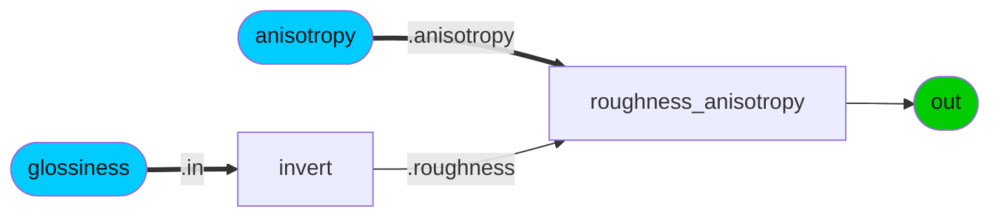

### Node Group: pbr
* [absorption_vdf](#node-absorption_vdf) [add](#node-add) [anisotropic_vdf](#node-anisotropic_vdf) [artistic_ior](#node-artistic_ior) [blackbody](#node-blackbody) [burley_diffuse_bsdf](#node-burley_diffuse_bsdf) [conductor_bsdf](#node-conductor_bsdf) [conical_edf](#node-conical_edf) [dielectric_bsdf](#node-dielectric_bsdf) [displacement](#node-displacement) [generalized_schlick_bsdf](#node-generalized_schlick_bsdf) [generalized_schlick_edf](#node-generalized_schlick_edf) [glossiness_anisotropy](#node-glossiness_anisotropy) [layer](#node-layer) [light](#node-light) [measured_edf](#node-measured_edf) [mix](#node-mix) [multiply](#node-multiply) [oren_nayar_diffuse_bsdf](#node-oren_nayar_diffuse_bsdf) [roughness_anisotropy](#node-roughness_anisotropy) [roughness_dual](#node-roughness_dual) [sheen_bsdf](#node-sheen_bsdf) [subsurface_bsdf](#node-subsurface_bsdf) [surface](#node-surface) [thin_film_bsdf](#node-thin_film_bsdf) [thin_surface](#node-thin_surface) [translucent_bsdf](#node-translucent_bsdf) [uniform_edf](#node-uniform_edf) [volume](#node-volume) 
---------
 
### Category: *oren_nayar_diffuse_bsdf*

ND_oren_nayar_diffuse_bsdf

 
* *Nodedef*: ND_oren_nayar_diffuse_bsdf
* *Type*: BSDF
* *Node Group*: pbr
* *Version*: 1.0. Is default: False
* *Doc*: A BSDF node for diffuse reflections.
* *Implementation*: Non-graph
 

| Name | Type | Default Value | UI name | UI min | UI max | UI Soft Min | UI Soft Max | UI step | UI group | UI Advanced | Doc | Uniform |
| ---- | ---- | ---- | ---- | ---- | ---- | ---- | ---- | ---- | ---- | ---- | ---- | ---- |
| **weight** | float | 1.0 |  | 0.0 | 1.0 |  |  |  |  |  |  |  |
| **color** | color3 | 0.18, 0.18, 0.18 |  |  |  |  |  |  |  |  |  |  |
| **roughness** | float | 0.0 |  |  |  |  |  |  |  |  |  |  |
| **normal** | vector3 | None |  |  |  |  |  |  |  |  |  |  |
| *out* | BSDF | None |  |  |  |  |  |  |  |  |  |  |
### Category: *burley_diffuse_bsdf*

ND_burley_diffuse_bsdf

 
* *Nodedef*: ND_burley_diffuse_bsdf
* *Type*: BSDF
* *Node Group*: pbr
* *Version*: 1.0. Is default: False
* *Doc*: A BSDF node for Burley diffuse reflections.
* *Implementation*: Non-graph
 

| Name | Type | Default Value | UI name | UI min | UI max | UI Soft Min | UI Soft Max | UI step | UI group | UI Advanced | Doc | Uniform |
| ---- | ---- | ---- | ---- | ---- | ---- | ---- | ---- | ---- | ---- | ---- | ---- | ---- |
| **weight** | float | 1.0 |  | 0.0 | 1.0 |  |  |  |  |  |  |  |
| **color** | color3 | 0.18, 0.18, 0.18 |  |  |  |  |  |  |  |  |  |  |
| **roughness** | float | 0.0 |  |  |  |  |  |  |  |  |  |  |
| **normal** | vector3 | None |  |  |  |  |  |  |  |  |  |  |
| *out* | BSDF | None |  |  |  |  |  |  |  |  |  |  |
### Category: *translucent_bsdf*

ND_translucent_bsdf

 
* *Nodedef*: ND_translucent_bsdf
* *Type*: BSDF
* *Node Group*: pbr
* *Version*: 1.0. Is default: False
* *Doc*: A BSDF node for pure diffuse transmission.
* *Implementation*: Non-graph
 

| Name | Type | Default Value | UI name | UI min | UI max | UI Soft Min | UI Soft Max | UI step | UI group | UI Advanced | Doc | Uniform |
| ---- | ---- | ---- | ---- | ---- | ---- | ---- | ---- | ---- | ---- | ---- | ---- | ---- |
| **weight** | float | 1.0 |  | 0.0 | 1.0 |  |  |  |  |  |  |  |
| **color** | color3 | 1, 1, 1 |  |  |  |  |  |  |  |  |  |  |
| **normal** | vector3 | None |  |  |  |  |  |  |  |  |  |  |
| *out* | BSDF | None |  |  |  |  |  |  |  |  |  |  |
### Category: *dielectric_bsdf*

ND_dielectric_bsdf

 
* *Nodedef*: ND_dielectric_bsdf
* *Type*: BSDF
* *Node Group*: pbr
* *Version*: 1.0. Is default: False
* *Doc*: A reflection/transmission BSDF node based on a microfacet model and a Fresnel curve for dielectrics.
* *Implementation*: Non-graph
 

| Name | Type | Default Value | UI name | UI min | UI max | UI Soft Min | UI Soft Max | UI step | UI group | UI Advanced | Doc | Uniform |
| ---- | ---- | ---- | ---- | ---- | ---- | ---- | ---- | ---- | ---- | ---- | ---- | ---- |
| **weight** | float | 1.0 |  | 0.0 | 1.0 |  |  |  |  |  |  |  |
| **tint** | color3 | 1, 1, 1 |  |  |  |  |  |  |  |  |  |  |
| **ior** | float | 1.5 |  |  |  |  |  |  |  |  |  |  |
| **roughness** | vector2 | 0.05, 0.05 |  |  |  |  |  |  |  |  |  |  |
| **normal** | vector3 | None |  |  |  |  |  |  |  |  |  |  |
| **tangent** | vector3 | None |  |  |  |  |  |  |  |  |  |  |
| **distribution** | string | ggx |  |  |  |  |  |  |  |  |  | true |
| **scatter_mode** | string | R |  |  |  |  |  |  |  |  |  | true |
| *out* | BSDF | None |  |  |  |  |  |  |  |  |  |  |
### Category: *conductor_bsdf*

ND_conductor_bsdf

 
* *Nodedef*: ND_conductor_bsdf
* *Type*: BSDF
* *Node Group*: pbr
* *Version*: 1.0. Is default: False
* *Doc*: A reflection BSDF node based on a microfacet model and a Fresnel curve for conductors/metals.
* *Implementation*: Non-graph
 

| Name | Type | Default Value | UI name | UI min | UI max | UI Soft Min | UI Soft Max | UI step | UI group | UI Advanced | Doc | Uniform |
| ---- | ---- | ---- | ---- | ---- | ---- | ---- | ---- | ---- | ---- | ---- | ---- | ---- |
| **weight** | float | 1.0 |  | 0.0 | 1.0 |  |  |  |  |  |  |  |
| **ior** | color3 | 0.183, 0.421, 1.373 |  |  |  |  |  |  |  |  |  |  |
| **extinction** | color3 | 3.424, 2.346, 1.77 |  |  |  |  |  |  |  |  |  |  |
| **roughness** | vector2 | 0.05, 0.05 |  |  |  |  |  |  |  |  |  |  |
| **normal** | vector3 | None |  |  |  |  |  |  |  |  |  |  |
| **tangent** | vector3 | None |  |  |  |  |  |  |  |  |  |  |
| **distribution** | string | ggx |  |  |  |  |  |  |  |  |  | true |
| *out* | BSDF | None |  |  |  |  |  |  |  |  |  |  |
### Category: *generalized_schlick_bsdf*

ND_generalized_schlick_bsdf

 
* *Nodedef*: ND_generalized_schlick_bsdf
* *Type*: BSDF
* *Node Group*: pbr
* *Version*: 1.0. Is default: False
* *Doc*: A reflection/transmission BSDF node based on a microfacet model and a generalized Schlick Fresnel curve.
* *Implementation*: Non-graph
 

| Name | Type | Default Value | UI name | UI min | UI max | UI Soft Min | UI Soft Max | UI step | UI group | UI Advanced | Doc | Uniform |
| ---- | ---- | ---- | ---- | ---- | ---- | ---- | ---- | ---- | ---- | ---- | ---- | ---- |
| **weight** | float | 1.0 |  | 0.0 | 1.0 |  |  |  |  |  |  |  |
| **color0** | color3 | 1, 1, 1 |  |  |  |  |  |  |  |  |  |  |
| **color90** | color3 | 1, 1, 1 |  |  |  |  |  |  |  |  |  |  |
| **exponent** | float | 5.0 |  |  |  |  |  |  |  |  |  |  |
| **roughness** | vector2 | 0.05, 0.05 |  |  |  |  |  |  |  |  |  |  |
| **normal** | vector3 | None |  |  |  |  |  |  |  |  |  |  |
| **tangent** | vector3 | None |  |  |  |  |  |  |  |  |  |  |
| **distribution** | string | ggx |  |  |  |  |  |  |  |  |  | true |
| **scatter_mode** | string | R |  |  |  |  |  |  |  |  |  | true |
| *out* | BSDF | None |  |  |  |  |  |  |  |  |  |  |
### Category: *subsurface_bsdf*

ND_subsurface_bsdf

 
* *Nodedef*: ND_subsurface_bsdf
* *Type*: BSDF
* *Node Group*: pbr
* *Version*: 1.0. Is default: False
* *Doc*: A subsurface scattering BSDF for true subsurface scattering.
* *Implementation*: Non-graph
 

| Name | Type | Default Value | UI name | UI min | UI max | UI Soft Min | UI Soft Max | UI step | UI group | UI Advanced | Doc | Uniform |
| ---- | ---- | ---- | ---- | ---- | ---- | ---- | ---- | ---- | ---- | ---- | ---- | ---- |
| **weight** | float | 1.0 |  | 0.0 | 1.0 |  |  |  |  |  |  |  |
| **color** | color3 | 0.18, 0.18, 0.18 |  |  |  |  |  |  |  |  |  |  |
| **radius** | vector3 | 1, 1, 1 |  |  |  |  |  |  |  |  |  |  |
| **anisotropy** | float | 0.0 |  |  |  |  |  |  |  |  |  |  |
| **normal** | vector3 | None |  |  |  |  |  |  |  |  |  |  |
| *out* | BSDF | None |  |  |  |  |  |  |  |  |  |  |
### Category: *sheen_bsdf*

ND_sheen_bsdf

 
* *Nodedef*: ND_sheen_bsdf
* *Type*: BSDF
* *Node Group*: pbr
* *Version*: 1.0. Is default: False
* *Doc*: A microfacet BSDF for the back-scattering properties of cloth-like materials.
* *Implementation*: Non-graph
 

| Name | Type | Default Value | UI name | UI min | UI max | UI Soft Min | UI Soft Max | UI step | UI group | UI Advanced | Doc | Uniform |
| ---- | ---- | ---- | ---- | ---- | ---- | ---- | ---- | ---- | ---- | ---- | ---- | ---- |
| **weight** | float | 1.0 |  | 0.0 | 1.0 |  |  |  |  |  |  |  |
| **color** | color3 | 1, 1, 1 |  |  |  |  |  |  |  |  |  |  |
| **roughness** | float | 0.3 |  |  |  |  |  |  |  |  |  |  |
| **normal** | vector3 | None |  |  |  |  |  |  |  |  |  |  |
| *out* | BSDF | None |  |  |  |  |  |  |  |  |  |  |
### Category: *thin_film_bsdf*

ND_thin_film_bsdf

 
* *Nodedef*: ND_thin_film_bsdf
* *Type*: BSDF
* *Node Group*: pbr
* *Version*: 1.0. Is default: False
* *Doc*: Adds an iridescent thin film layer over a microfacet base BSDF.
* *Implementation*: Non-graph
 

| Name | Type | Default Value | UI name | UI min | UI max | UI Soft Min | UI Soft Max | UI step | UI group | UI Advanced | Doc | Uniform |
| ---- | ---- | ---- | ---- | ---- | ---- | ---- | ---- | ---- | ---- | ---- | ---- | ---- |
| **thickness** | float | 550.0 |  |  |  |  |  |  |  |  |  |  |
| **ior** | float | 1.5 |  |  |  |  |  |  |  |  |  |  |
| *out* | BSDF | None |  |  |  |  |  |  |  |  |  |  |
### Category: *uniform_edf*

ND_uniform_edf

 
* *Nodedef*: ND_uniform_edf
* *Type*: EDF
* *Node Group*: pbr
* *Version*: 1.0. Is default: False
* *Doc*: An EDF node for uniform emission.
* *Implementation*: Non-graph
 

| Name | Type | Default Value | UI name | UI min | UI max | UI Soft Min | UI Soft Max | UI step | UI group | UI Advanced | Doc | Uniform |
| ---- | ---- | ---- | ---- | ---- | ---- | ---- | ---- | ---- | ---- | ---- | ---- | ---- |
| **color** | color3 | 1, 1, 1 |  |  |  |  |  |  |  |  |  |  |
| *out* | EDF | None |  |  |  |  |  |  |  |  |  |  |
### Category: *conical_edf*

ND_conical_edf

 
* *Nodedef*: ND_conical_edf
* *Type*: EDF
* *Node Group*: pbr
* *Version*: 1.0. Is default: False
* *Doc*: Constructs an EDF emitting light inside a cone around the normal direction.
* *Implementation*: Non-graph
 

| Name | Type | Default Value | UI name | UI min | UI max | UI Soft Min | UI Soft Max | UI step | UI group | UI Advanced | Doc | Uniform |
| ---- | ---- | ---- | ---- | ---- | ---- | ---- | ---- | ---- | ---- | ---- | ---- | ---- |
| **color** | color3 | 1, 1, 1 |  |  |  |  |  |  |  |  |  |  |
| **normal** | vector3 | None |  |  |  |  |  |  |  |  |  |  |
| **inner_angle** | float | 60.0 |  |  |  |  |  |  |  |  |  |  |
| **outer_angle** | float | 0.0 |  |  |  |  |  |  |  |  |  |  |
| *out* | EDF | None |  |  |  |  |  |  |  |  |  |  |
### Category: *measured_edf*

ND_measured_edf

 
* *Nodedef*: ND_measured_edf
* *Type*: EDF
* *Node Group*: pbr
* *Version*: 1.0. Is default: False
* *Doc*: Constructs an EDF emitting light according to a measured IES light profile.
* *Implementation*: Non-graph
 

| Name | Type | Default Value | UI name | UI min | UI max | UI Soft Min | UI Soft Max | UI step | UI group | UI Advanced | Doc | Uniform |
| ---- | ---- | ---- | ---- | ---- | ---- | ---- | ---- | ---- | ---- | ---- | ---- | ---- |
| **color** | color3 | 1, 1, 1 |  |  |  |  |  |  |  |  |  |  |
| **normal** | vector3 | None |  |  |  |  |  |  |  |  |  |  |
| **file** | filename |  |  |  |  |  |  |  |  |  |  | true |
| *out* | EDF | None |  |  |  |  |  |  |  |  |  |  |
### Category: *generalized_schlick_edf*

ND_generalized_schlick_edf

 
* *Nodedef*: ND_generalized_schlick_edf
* *Type*: EDF
* *Node Group*: pbr
* *Version*: 1.0. Is default: False
* *Doc*: Modifies an EDF with a directional factor.
* *Implementation*: Non-graph
 

| Name | Type | Default Value | UI name | UI min | UI max | UI Soft Min | UI Soft Max | UI step | UI group | UI Advanced | Doc | Uniform |
| ---- | ---- | ---- | ---- | ---- | ---- | ---- | ---- | ---- | ---- | ---- | ---- | ---- |
| **color0** | color3 | 1, 1, 1 |  |  |  |  |  |  |  |  |  |  |
| **color90** | color3 | 1, 1, 1 |  |  |  |  |  |  |  |  |  |  |
| **exponent** | float | 5.0 |  |  |  |  |  |  |  |  |  |  |
| **base** | EDF |  |  |  |  |  |  |  |  |  |  |  |
| *out* | EDF | None |  |  |  |  |  |  |  |  |  |  |
### Category: *absorption_vdf*

ND_absorption_vdf

 
* *Nodedef*: ND_absorption_vdf
* *Type*: VDF
* *Node Group*: pbr
* *Version*: 1.0. Is default: False
* *Doc*: Constructs a VDF for pure light absorption.
* *Implementation*: Non-graph
 

| Name | Type | Default Value | UI name | UI min | UI max | UI Soft Min | UI Soft Max | UI step | UI group | UI Advanced | Doc | Uniform |
| ---- | ---- | ---- | ---- | ---- | ---- | ---- | ---- | ---- | ---- | ---- | ---- | ---- |
| **absorption** | vector3 | 0, 0, 0 |  |  |  |  |  |  |  |  |  |  |
| *out* | VDF | None |  |  |  |  |  |  |  |  |  |  |
### Category: *anisotropic_vdf*

ND_anisotropic_vdf

 
* *Nodedef*: ND_anisotropic_vdf
* *Type*: VDF
* *Node Group*: pbr
* *Version*: 1.0. Is default: False
* *Doc*: Constructs a VDF scattering light for a participating medium, based on the Henyey-Greenstein phase function.
* *Implementation*: Non-graph
 

| Name | Type | Default Value | UI name | UI min | UI max | UI Soft Min | UI Soft Max | UI step | UI group | UI Advanced | Doc | Uniform |
| ---- | ---- | ---- | ---- | ---- | ---- | ---- | ---- | ---- | ---- | ---- | ---- | ---- |
| **absorption** | vector3 | 0, 0, 0 |  |  |  |  |  |  |  |  |  |  |
| **scattering** | vector3 | 0, 0, 0 |  |  |  |  |  |  |  |  |  |  |
| **anisotropy** | float | 0.0 |  |  |  |  |  |  |  |  |  |  |
| *out* | VDF | None |  |  |  |  |  |  |  |  |  |  |
### Category: *surface*

ND_surface

 
* *Nodedef*: ND_surface
* *Type*: surfaceshader
* *Node Group*: pbr
* *Version*: 1.0. Is default: False
* *Doc*: A constructor node for the surfaceshader type.
* *Implementation*: Non-graph
 

| Name | Type | Default Value | UI name | UI min | UI max | UI Soft Min | UI Soft Max | UI step | UI group | UI Advanced | Doc | Uniform |
| ---- | ---- | ---- | ---- | ---- | ---- | ---- | ---- | ---- | ---- | ---- | ---- | ---- |
| **bsdf** | BSDF |  |  |  |  |  |  |  |  |  | Distribution function for surface scattering. |  |
| **edf** | EDF |  |  |  |  |  |  |  |  |  | Distribution function for surface emission. |  |
| **opacity** | float | 1.0 |  |  |  |  |  |  |  |  | Surface cutout opacity |  |
| *out* | surfaceshader | None |  |  |  |  |  |  |  |  |  |  |
### Category: *thin_surface*

ND_thin_surface

 
* *Nodedef*: ND_thin_surface
* *Type*: surfaceshader
* *Node Group*: pbr
* *Version*: 1.0. Is default: False
* *Doc*: A constructor node for the surfaceshader type for non-closed 'thin' objects.
* *Implementation*: Non-graph
 

| Name | Type | Default Value | UI name | UI min | UI max | UI Soft Min | UI Soft Max | UI step | UI group | UI Advanced | Doc | Uniform |
| ---- | ---- | ---- | ---- | ---- | ---- | ---- | ---- | ---- | ---- | ---- | ---- | ---- |
| **front_bsdf** | BSDF |  |  |  |  |  |  |  |  |  | Distribution function for front-side surface scattering. |  |
| **front_edf** | EDF |  |  |  |  |  |  |  |  |  | Distribution function for front-side surface emission. |  |
| **back_bsdf** | BSDF |  |  |  |  |  |  |  |  |  | Distribution function for back-side surface scattering. |  |
| **back_edf** | EDF |  |  |  |  |  |  |  |  |  | Distribution function for back-side surface emission. |  |
| **opacity** | float | 1.0 |  |  |  |  |  |  |  |  | Surface cutout opacity |  |
| *out* | surfaceshader | None |  |  |  |  |  |  |  |  |  |  |
### Category: *volume*

ND_volume

 
* *Nodedef*: ND_volume
* *Type*: volumeshader
* *Node Group*: pbr
* *Version*: 1.0. Is default: False
* *Doc*: A constructor node for the volumeshader type.
* *Implementation*: Non-graph
 

| Name | Type | Default Value | UI name | UI min | UI max | UI Soft Min | UI Soft Max | UI step | UI group | UI Advanced | Doc | Uniform |
| ---- | ---- | ---- | ---- | ---- | ---- | ---- | ---- | ---- | ---- | ---- | ---- | ---- |
| **vdf** | VDF |  |  |  |  |  |  |  |  |  | Volume distribution function for the medium. |  |
| **edf** | EDF |  |  |  |  |  |  |  |  |  | Emission distribution function for the medium. |  |
| *out* | volumeshader | None |  |  |  |  |  |  |  |  |  |  |
### Category: *light*

ND_light

 
* *Nodedef*: ND_light
* *Type*: lightshader
* *Node Group*: pbr
* *Version*: 1.0. Is default: False
* *Doc*: A constructor node for the lightshader type.
* *Implementation*: Non-graph
 

| Name | Type | Default Value | UI name | UI min | UI max | UI Soft Min | UI Soft Max | UI step | UI group | UI Advanced | Doc | Uniform |
| ---- | ---- | ---- | ---- | ---- | ---- | ---- | ---- | ---- | ---- | ---- | ---- | ---- |
| **edf** | EDF |  |  |  |  |  |  |  |  |  | Distribution function for light emission. |  |
| **intensity** | float | 1.0 |  |  |  |  |  |  |  |  | Multiplier for the light intensity |  |
| **exposure** | float | 0.0 |  |  |  |  |  |  |  |  | Exposure control for the light intensity |  |
| *out* | lightshader | None |  |  |  |  |  |  |  |  |  |  |
### Category: *displacement*

ND_displacement_float

 
* *Nodedef*: ND_displacement_float
* *Type*: displacementshader
* *Node Group*: pbr
* *Version*: 1.0. Is default: False
* *Doc*: A constructor node for the displacementshader type.
* *Implementation*: Non-graph
 

| Name | Type | Default Value | UI name | UI min | UI max | UI Soft Min | UI Soft Max | UI step | UI group | UI Advanced | Doc | Uniform |
| ---- | ---- | ---- | ---- | ---- | ---- | ---- | ---- | ---- | ---- | ---- | ---- | ---- |
| **displacement** | float | 0.0 |  |  |  |  |  |  |  |  | Scalar displacement amount along the surface normal direction. |  |
| **scale** | float | 1.0 |  |  |  |  |  |  |  |  | Scale factor for the displacement vector |  |
| *out* | displacementshader | None |  |  |  |  |  |  |  |  |  |  |

ND_displacement_vector3

 
* *Nodedef*: ND_displacement_vector3
* *Type*: displacementshader
* *Node Group*: pbr
* *Version*: 1.0. Is default: False
* *Doc*: A constructor node for the displacementshader type.
* *Implementation*: Non-graph
 

| Name | Type | Default Value | UI name | UI min | UI max | UI Soft Min | UI Soft Max | UI step | UI group | UI Advanced | Doc | Uniform |
| ---- | ---- | ---- | ---- | ---- | ---- | ---- | ---- | ---- | ---- | ---- | ---- | ---- |
| **displacement** | vector3 | 0, 0, 0 |  |  |  |  |  |  |  |  | Vector displacement in (dPdu, dPdv, N) tangent/normal space. |  |
| **scale** | float | 1.0 |  |  |  |  |  |  |  |  | Scale factor for the displacement vector |  |
| *out* | displacementshader | None |  |  |  |  |  |  |  |  |  |  |
### Category: *layer*

ND_layer_bsdf

 
* *Nodedef*: ND_layer_bsdf
* *Type*: BSDF
* *Node Group*: pbr
* *Version*: 1.0. Is default: False
* *Doc*: Layer two BSDF's with vertical layering.
* *Implementation*: Non-graph
 

| Name | Type | Default Value | UI name | UI min | UI max | UI Soft Min | UI Soft Max | UI step | UI group | UI Advanced | Doc | Uniform |
| ---- | ---- | ---- | ---- | ---- | ---- | ---- | ---- | ---- | ---- | ---- | ---- | ---- |
| **top** | BSDF |  |  |  |  |  |  |  |  |  |  |  |
| **base** | BSDF |  |  |  |  |  |  |  |  |  |  |  |
| *out* | BSDF | None |  |  |  |  |  |  |  |  |  |  |

ND_layer_vdf

 
* *Nodedef*: ND_layer_vdf
* *Type*: BSDF
* *Node Group*: pbr
* *Version*: 1.0. Is default: False
* *Doc*: Layer a BSDF over a VDF describing the interior media.
* *Implementation*: Non-graph
 

| Name | Type | Default Value | UI name | UI min | UI max | UI Soft Min | UI Soft Max | UI step | UI group | UI Advanced | Doc | Uniform |
| ---- | ---- | ---- | ---- | ---- | ---- | ---- | ---- | ---- | ---- | ---- | ---- | ---- |
| **top** | BSDF |  |  |  |  |  |  |  |  |  |  |  |
| **base** | VDF |  |  |  |  |  |  |  |  |  |  |  |
| *out* | BSDF | None |  |  |  |  |  |  |  |  |  |  |
### Category: *mix*

ND_mix_bsdf

 
* *Nodedef*: ND_mix_bsdf
* *Type*: BSDF
* *Node Group*: pbr
* *Version*: 1.0. Is default: False
* *Doc*: Mix two BSDF's according to an input mix amount.
* *Implementation*: Non-graph
 

| Name | Type | Default Value | UI name | UI min | UI max | UI Soft Min | UI Soft Max | UI step | UI group | UI Advanced | Doc | Uniform |
| ---- | ---- | ---- | ---- | ---- | ---- | ---- | ---- | ---- | ---- | ---- | ---- | ---- |
| **fg** | BSDF |  |  |  |  |  |  |  |  |  |  |  |
| **bg** | BSDF |  |  |  |  |  |  |  |  |  |  |  |
| **mix** | float | 0.0 |  | 0.0 | 1.0 |  |  |  |  |  | Mixing weight, range [0, 1]. |  |
| *out* | BSDF | None |  |  |  |  |  |  |  |  |  |  |

ND_mix_edf

 
* *Nodedef*: ND_mix_edf
* *Type*: EDF
* *Node Group*: pbr
* *Version*: 1.0. Is default: False
* *Doc*: Mix two EDF's according to an input mix amount.
* *Implementation*: Non-graph
 

| Name | Type | Default Value | UI name | UI min | UI max | UI Soft Min | UI Soft Max | UI step | UI group | UI Advanced | Doc | Uniform |
| ---- | ---- | ---- | ---- | ---- | ---- | ---- | ---- | ---- | ---- | ---- | ---- | ---- |
| **fg** | EDF |  |  |  |  |  |  |  |  |  |  |  |
| **bg** | EDF |  |  |  |  |  |  |  |  |  |  |  |
| **mix** | float | 0.0 |  | 0.0 | 1.0 |  |  |  |  |  | Mixing weight, range [0, 1]. |  |
| *out* | EDF | None |  |  |  |  |  |  |  |  |  |  |

ND_mix_vdf

 
* *Nodedef*: ND_mix_vdf
* *Type*: VDF
* *Node Group*: pbr
* *Version*: 1.0. Is default: False
* *Doc*: Mix two VDF's according to an input mix amount.
* *Implementation*: Non-graph
 

| Name | Type | Default Value | UI name | UI min | UI max | UI Soft Min | UI Soft Max | UI step | UI group | UI Advanced | Doc | Uniform |
| ---- | ---- | ---- | ---- | ---- | ---- | ---- | ---- | ---- | ---- | ---- | ---- | ---- |
| **fg** | VDF |  |  |  |  |  |  |  |  |  |  |  |
| **bg** | VDF |  |  |  |  |  |  |  |  |  |  |  |
| **mix** | float | 0.0 |  | 0.0 | 1.0 |  |  |  |  |  | Mixing weight, range [0, 1]. |  |
| *out* | VDF | None |  |  |  |  |  |  |  |  |  |  |
### Category: *add*

ND_add_bsdf

 
* *Nodedef*: ND_add_bsdf
* *Type*: BSDF
* *Node Group*: pbr
* *Version*: 1.0. Is default: False
* *Doc*: A node for additive blending of BSDF's.
* *Implementation*: Non-graph
 

| Name | Type | Default Value | UI name | UI min | UI max | UI Soft Min | UI Soft Max | UI step | UI group | UI Advanced | Doc | Uniform |
| ---- | ---- | ---- | ---- | ---- | ---- | ---- | ---- | ---- | ---- | ---- | ---- | ---- |
| **in1** | BSDF |  |  |  |  |  |  |  |  |  | First BSDF. |  |
| **in2** | BSDF |  |  |  |  |  |  |  |  |  | Second BSDF. |  |
| *out* | BSDF | None |  |  |  |  |  |  |  |  |  |  |

ND_add_edf

 
* *Nodedef*: ND_add_edf
* *Type*: EDF
* *Node Group*: pbr
* *Version*: 1.0. Is default: False
* *Doc*: A node for additive blending of EDF's.
* *Implementation*: Non-graph
 

| Name | Type | Default Value | UI name | UI min | UI max | UI Soft Min | UI Soft Max | UI step | UI group | UI Advanced | Doc | Uniform |
| ---- | ---- | ---- | ---- | ---- | ---- | ---- | ---- | ---- | ---- | ---- | ---- | ---- |
| **in1** | EDF |  |  |  |  |  |  |  |  |  | First EDF. |  |
| **in2** | EDF |  |  |  |  |  |  |  |  |  | Second EDF. |  |
| *out* | EDF | None |  |  |  |  |  |  |  |  |  |  |

ND_add_vdf

 
* *Nodedef*: ND_add_vdf
* *Type*: VDF
* *Node Group*: pbr
* *Version*: 1.0. Is default: False
* *Doc*: A node for additive blending of VDF's.
* *Implementation*: Non-graph
 

| Name | Type | Default Value | UI name | UI min | UI max | UI Soft Min | UI Soft Max | UI step | UI group | UI Advanced | Doc | Uniform |
| ---- | ---- | ---- | ---- | ---- | ---- | ---- | ---- | ---- | ---- | ---- | ---- | ---- |
| **in1** | VDF |  |  |  |  |  |  |  |  |  | First VDF. |  |
| **in2** | VDF |  |  |  |  |  |  |  |  |  | Second VDF. |  |
| *out* | VDF | None |  |  |  |  |  |  |  |  |  |  |
### Category: *multiply*

ND_multiply_bsdfC

 
* *Nodedef*: ND_multiply_bsdfC
* *Type*: BSDF
* *Node Group*: pbr
* *Version*: 1.0. Is default: False
* *Doc*: A node for adjusting the contribution of a BSDF with a weight.
* *Implementation*: Non-graph
 

| Name | Type | Default Value | UI name | UI min | UI max | UI Soft Min | UI Soft Max | UI step | UI group | UI Advanced | Doc | Uniform |
| ---- | ---- | ---- | ---- | ---- | ---- | ---- | ---- | ---- | ---- | ---- | ---- | ---- |
| **in1** | BSDF |  |  |  |  |  |  |  |  |  | The BSDF to scale. |  |
| **in2** | color3 | 1, 1, 1 |  |  |  |  |  |  |  |  | Scaling weight. |  |
| *out* | BSDF | None |  |  |  |  |  |  |  |  |  |  |

ND_multiply_bsdfF

 
* *Nodedef*: ND_multiply_bsdfF
* *Type*: BSDF
* *Node Group*: pbr
* *Version*: 1.0. Is default: False
* *Doc*: A node for adjusting the contribution of a BSDF with a weight.
* *Implementation*: Non-graph
 

| Name | Type | Default Value | UI name | UI min | UI max | UI Soft Min | UI Soft Max | UI step | UI group | UI Advanced | Doc | Uniform |
| ---- | ---- | ---- | ---- | ---- | ---- | ---- | ---- | ---- | ---- | ---- | ---- | ---- |
| **in1** | BSDF |  |  |  |  |  |  |  |  |  | The BSDF to scale. |  |
| **in2** | float | 1.0 |  |  |  |  |  |  |  |  | Scaling weight. |  |
| *out* | BSDF | None |  |  |  |  |  |  |  |  |  |  |

ND_multiply_edfC

 
* *Nodedef*: ND_multiply_edfC
* *Type*: EDF
* *Node Group*: pbr
* *Version*: 1.0. Is default: False
* *Doc*: A node for adjusting the contribution of an EDF with a weight.
* *Implementation*: Non-graph
 

| Name | Type | Default Value | UI name | UI min | UI max | UI Soft Min | UI Soft Max | UI step | UI group | UI Advanced | Doc | Uniform |
| ---- | ---- | ---- | ---- | ---- | ---- | ---- | ---- | ---- | ---- | ---- | ---- | ---- |
| **in1** | EDF |  |  |  |  |  |  |  |  |  | The EDF to scale. |  |
| **in2** | color3 | 1, 1, 1 |  |  |  |  |  |  |  |  | Scaling weight. |  |
| *out* | EDF | None |  |  |  |  |  |  |  |  |  |  |

ND_multiply_edfF

 
* *Nodedef*: ND_multiply_edfF
* *Type*: EDF
* *Node Group*: pbr
* *Version*: 1.0. Is default: False
* *Doc*: A node for adjusting the contribution of an EDF with a weight.
* *Implementation*: Non-graph
 

| Name | Type | Default Value | UI name | UI min | UI max | UI Soft Min | UI Soft Max | UI step | UI group | UI Advanced | Doc | Uniform |
| ---- | ---- | ---- | ---- | ---- | ---- | ---- | ---- | ---- | ---- | ---- | ---- | ---- |
| **in1** | EDF |  |  |  |  |  |  |  |  |  | The EDF to scale. |  |
| **in2** | float | 1.0 |  |  |  |  |  |  |  |  | Scaling weight. |  |
| *out* | EDF | None |  |  |  |  |  |  |  |  |  |  |

ND_multiply_vdfC

 
* *Nodedef*: ND_multiply_vdfC
* *Type*: VDF
* *Node Group*: pbr
* *Version*: 1.0. Is default: False
* *Doc*: A node for adjusting the contribution of an VDF with a weight.
* *Implementation*: Non-graph
 

| Name | Type | Default Value | UI name | UI min | UI max | UI Soft Min | UI Soft Max | UI step | UI group | UI Advanced | Doc | Uniform |
| ---- | ---- | ---- | ---- | ---- | ---- | ---- | ---- | ---- | ---- | ---- | ---- | ---- |
| **in1** | VDF |  |  |  |  |  |  |  |  |  | The VDF to scale. |  |
| **in2** | color3 | 1, 1, 1 |  |  |  |  |  |  |  |  | Scaling weight. |  |
| *out* | VDF | None |  |  |  |  |  |  |  |  |  |  |

ND_multiply_vdfF

 
* *Nodedef*: ND_multiply_vdfF
* *Type*: VDF
* *Node Group*: pbr
* *Version*: 1.0. Is default: False
* *Doc*: A node for adjusting the contribution of an VDF with a weight.
* *Implementation*: Non-graph
 

| Name | Type | Default Value | UI name | UI min | UI max | UI Soft Min | UI Soft Max | UI step | UI group | UI Advanced | Doc | Uniform |
| ---- | ---- | ---- | ---- | ---- | ---- | ---- | ---- | ---- | ---- | ---- | ---- | ---- |
| **in1** | VDF |  |  |  |  |  |  |  |  |  | The VDF to scale. |  |
| **in2** | float | 1.0 |  |  |  |  |  |  |  |  | Scaling weight. |  |
| *out* | VDF | None |  |  |  |  |  |  |  |  |  |  |
### Category: *roughness_anisotropy*

ND_roughness_anisotropy

 
* *Nodedef*: ND_roughness_anisotropy
* *Type*: vector2
* *Node Group*: pbr
* *Version*: 1.0. Is default: False
* *Doc*: Calculates anisotropic surface roughness from a scalar roughness/anisotropy parameterization.
* *Implementation*: Non-graph
 

| Name | Type | Default Value | UI name | UI min | UI max | UI Soft Min | UI Soft Max | UI step | UI group | UI Advanced | Doc | Uniform |
| ---- | ---- | ---- | ---- | ---- | ---- | ---- | ---- | ---- | ---- | ---- | ---- | ---- |
| **roughness** | float | 0.0 |  |  |  |  |  |  |  |  |  |  |
| **anisotropy** | float | 0.0 |  |  |  |  |  |  |  |  |  |  |
| *out* | vector2 | None |  |  |  |  |  |  |  |  |  |  |
### Category: *roughness_dual*

ND_roughness_dual

 
* *Nodedef*: ND_roughness_dual
* *Type*: vector2
* *Node Group*: pbr
* *Version*: 1.0. Is default: False
* *Doc*: Calculates anisotropic surface roughness from a dual surface roughness parameterization.
* *Implementation*: Non-graph
 

| Name | Type | Default Value | UI name | UI min | UI max | UI Soft Min | UI Soft Max | UI step | UI group | UI Advanced | Doc | Uniform |
| ---- | ---- | ---- | ---- | ---- | ---- | ---- | ---- | ---- | ---- | ---- | ---- | ---- |
| **roughness** | vector2 | 0, 0 |  |  |  |  |  |  |  |  |  |  |
| *out* | vector2 | None |  |  |  |  |  |  |  |  |  |  |
### Category: *glossiness_anisotropy*

ND_glossiness_anisotropy

 
* *Nodedef*: ND_glossiness_anisotropy
* *Type*: vector2
* *Node Group*: pbr
* *Version*: 1.0. Is default: False
* *Doc*: Calculates anisotropic surface roughness from a scalar glossiness/anisotropy parameterization.
* *Nodegraph*: IMP_glossiness_anisotropy

 

| Name | Type | Default Value | UI name | UI min | UI max | UI Soft Min | UI Soft Max | UI step | UI group | UI Advanced | Doc | Uniform |
| ---- | ---- | ---- | ---- | ---- | ---- | ---- | ---- | ---- | ---- | ---- | ---- | ---- |
| **glossiness** | float | 1.0 |  | 0.0 | 1.0 |  |  |  |  |  |  |  |
| **anisotropy** | float | 0.0 |  | 0.0 | 1.0 |  |  |  |  |  |  |  |
| *out* | vector2 | None |  |  |  |  |  |  |  |  |  |  |
### Category: *blackbody*

ND_blackbody

 
* *Nodedef*: ND_blackbody
* *Type*: color3
* *Node Group*: pbr
* *Version*: 1.0. Is default: False
* *Doc*: Returns the radiant emittance of a blackbody radiator with the given temperature.
* *Implementation*: Non-graph
 

| Name | Type | Default Value | UI name | UI min | UI max | UI Soft Min | UI Soft Max | UI step | UI group | UI Advanced | Doc | Uniform |
| ---- | ---- | ---- | ---- | ---- | ---- | ---- | ---- | ---- | ---- | ---- | ---- | ---- |
| **temperature** | float | 5000.0 |  |  |  |  |  |  |  |  |  |  |
| *out* | color3 | None |  |  |  |  |  |  |  |  |  |  |
### Category: *artistic_ior*

ND_artistic_ior

 
* *Nodedef*: ND_artistic_ior
* *Type*: multioutput
* *Node Group*: pbr
* *Version*: 1.0. Is default: False
* *Doc*: Converts the artistic parameterization reflectivity and edge_color to  complex IOR values.
* *Implementation*: Non-graph
 

| Name | Type | Default Value | UI name | UI min | UI max | UI Soft Min | UI Soft Max | UI step | UI group | UI Advanced | Doc | Uniform |
| ---- | ---- | ---- | ---- | ---- | ---- | ---- | ---- | ---- | ---- | ---- | ---- | ---- |
| **reflectivity** | color3 | 0.944, 0.776, 0.373 |  |  |  |  |  |  |  |  |  |  |
| **edge_color** | color3 | 0.998, 0.981, 0.751 |  |  |  |  |  |  |  |  |  |  |
| *ior* | color3 | None |  |  |  |  |  |  |  |  |  |  |
| *extinction* | color3 | None |  |  |  |  |  |  |  |  |  |  |

 
