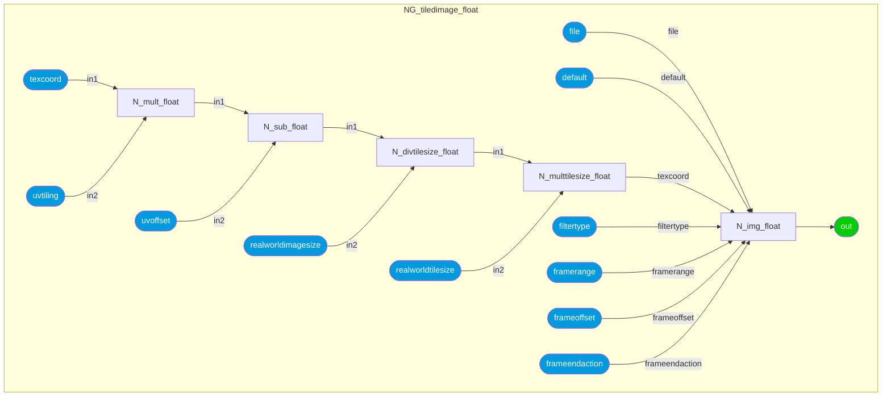
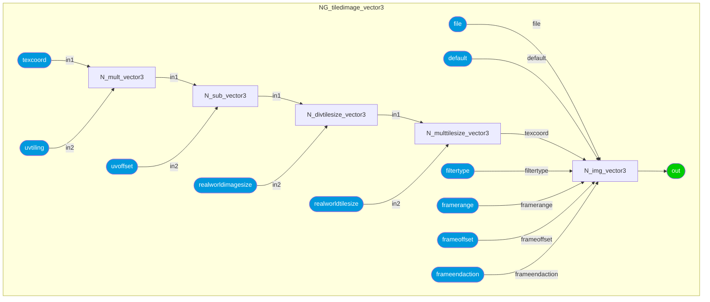
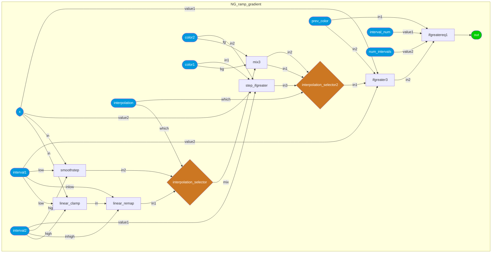
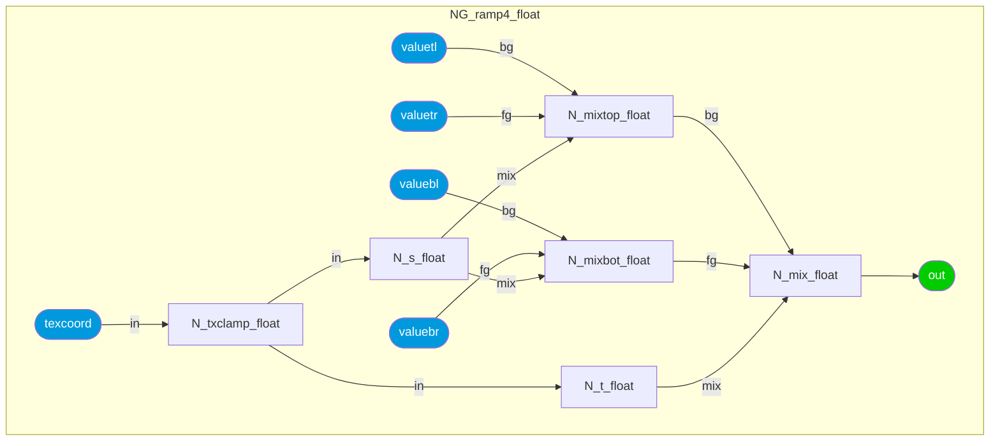
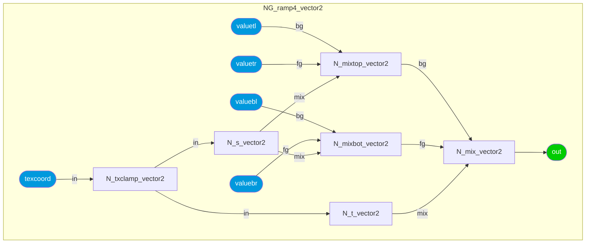

### Node Group: adjustment
* [colorcorrect](#node-colorcorrect) [contrast](#node-contrast) [hsvadjust](#node-hsvadjust) [hsvtorgb](#node-hsvtorgb) [luminance](#node-luminance) [range](#node-range) [remap](#node-remap) [rgbtohsv](#node-rgbtohsv) [saturate](#node-saturate) [smoothstep](#node-smoothstep) 
---------
### Node Group: application
* [frame](#node-frame) [time](#node-time) 
---------
### Node Group: channel
* [combine2](#node-combine2) [combine3](#node-combine3) [combine4](#node-combine4) [convert](#node-convert) [extract](#node-extract) [separate2](#node-separate2) [separate3](#node-separate3) [separate4](#node-separate4) 
---------
### Node Group: compositing
* [burn](#node-burn) [difference](#node-difference) [disjointover](#node-disjointover) [dodge](#node-dodge) [in](#node-in) [inside](#node-inside) [mask](#node-mask) [matte](#node-matte) [minus](#node-minus) [mix](#node-mix) [out](#node-out) [outside](#node-outside) [over](#node-over) [overlay](#node-overlay) [plus](#node-plus) [premult](#node-premult) [screen](#node-screen) [unpremult](#node-unpremult) 
---------
### Node Group: conditional
* [and](#node-and) [ifequal](#node-ifequal) [ifgreater](#node-ifgreater) [ifgreatereq](#node-ifgreatereq) [not](#node-not) [or](#node-or) [switch](#node-switch) [xor](#node-xor) 
---------
### Node Group: convolution2d
* [blur](#node-blur) [heighttonormal](#node-heighttonormal) 
---------
### Node Group: geometric
* [bitangent](#node-bitangent) [bump](#node-bump) [geomcolor](#node-geomcolor) [geompropvalue](#node-geompropvalue) [geompropvalueuniform](#node-geompropvalueuniform) [normal](#node-normal) [position](#node-position) [tangent](#node-tangent) [texcoord](#node-texcoord) 
---------
### Node Group: material
* [surfacematerial](#node-surfacematerial) [volumematerial](#node-volumematerial) 
---------
### Node Group: math
* [absval](#node-absval) [acos](#node-acos) [add](#node-add) [asin](#node-asin) [atan2](#node-atan2) [ceil](#node-ceil) [clamp](#node-clamp) [cos](#node-cos) [creatematrix](#node-creatematrix) [crossproduct](#node-crossproduct) [determinant](#node-determinant) [distance](#node-distance) [divide](#node-divide) [dotproduct](#node-dotproduct) [exp](#node-exp) [floor](#node-floor) [invert](#node-invert) [invertmatrix](#node-invertmatrix) [ln](#node-ln) [magnitude](#node-magnitude) [max](#node-max) [min](#node-min) [modulo](#node-modulo) [multiply](#node-multiply) [normalize](#node-normalize) [normalmap](#node-normalmap) [place2d](#node-place2d) [power](#node-power) [reflect](#node-reflect) [refract](#node-refract) [rotate2d](#node-rotate2d) [rotate3d](#node-rotate3d) [round](#node-round) [safepower](#node-safepower) [sign](#node-sign) [sin](#node-sin) [sqrt](#node-sqrt) [subtract](#node-subtract) [tan](#node-tan) [transformmatrix](#node-transformmatrix) [transformnormal](#node-transformnormal) [transformpoint](#node-transformpoint) [transformvector](#node-transformvector) [transpose](#node-transpose) [trianglewave](#node-trianglewave) 
---------
### Node Group: organization
* [dot](#node-dot) 
---------
### Node Group: procedural
* [constant](#node-constant) [randomfloat](#node-randomfloat) 
---------
### Node Group: procedural2d
* [cellnoise2d](#node-cellnoise2d) [checkerboard](#node-checkerboard) [circle](#node-circle) [cloverleaf](#node-cloverleaf) [crosshatch](#node-crosshatch) [grid](#node-grid) [hexagon](#node-hexagon) [line](#node-line) [noise2d](#node-noise2d) [ramp](#node-ramp) [ramp4](#node-ramp4) [ramp_gradient](#node-ramp_gradient) [ramplr](#node-ramplr) [ramptb](#node-ramptb) [splitlr](#node-splitlr) [splittb](#node-splittb) [tiledcircles](#node-tiledcircles) [tiledcloverleafs](#node-tiledcloverleafs) [tiledhexagons](#node-tiledhexagons) [unifiednoise2d](#node-unifiednoise2d) [worleynoise2d](#node-worleynoise2d) 
---------
### Node Group: procedural3d
* [cellnoise3d](#node-cellnoise3d) [fractal3d](#node-fractal3d) [noise3d](#node-noise3d) [randomcolor](#node-randomcolor) [unifiednoise3d](#node-unifiednoise3d) [worleynoise3d](#node-worleynoise3d) 
---------
### Node Group: shader
* [convert](#node-convert) [surface_unlit](#node-surface_unlit) 
---------
### Node Group: texture2d
* [image](#node-image) [tiledimage](#node-tiledimage) 
---------
### Node Group: texture3d
* [triplanarprojection](#node-triplanarprojection) 
---------
 
### Category: *surfacematerial*
<details open><summary>ND_surfacematerial</summary>
<p>
 
* *Nodedef*: ND_surfacematerial
* *Type*: material
* *Group*: material
* *Version*: 1.0. Is default: False
* *Doc*: UNDOCUMENTED
* *Implementation*: Non-graph
 

| Name | Type | Default Value | UI name | UI min | UI max | UI Soft Min | UI Soft Max | UI step | UI group | UI Advanced | Doc | Uniform |
| ---- | ---- | ---- | ---- | ---- | ---- | ---- | ---- | ---- | ---- | ---- | ---- | ---- |
| **surfaceshader** | surfaceshader |  |  |  |  |  |  |  |  |  |  |  |
| **backsurfaceshader** | surfaceshader |  |  |  |  |  |  |  |  |  |  |  |
| **displacementshader** | displacementshader |  |  |  |  |  |  |  |  |  |  |  |
| *out* | material | None |  |  |  |  |  |  |  |  |  |  |
### Category: *volumematerial*
<details open><summary>ND_volumematerial</summary>
<p>
 
* *Nodedef*: ND_volumematerial
* *Type*: material
* *Group*: material
* *Version*: 1.0. Is default: False
* *Doc*: UNDOCUMENTED
* *Implementation*: Non-graph
 

| Name | Type | Default Value | UI name | UI min | UI max | UI Soft Min | UI Soft Max | UI step | UI group | UI Advanced | Doc | Uniform |
| ---- | ---- | ---- | ---- | ---- | ---- | ---- | ---- | ---- | ---- | ---- | ---- | ---- |
| **volumeshader** | volumeshader |  |  |  |  |  |  |  |  |  |  |  |
| *out* | material | None |  |  |  |  |  |  |  |  |  |  |
### Category: *surface_unlit*
<details open><summary>ND_surface_unlit</summary>
<p>
 
* *Nodedef*: ND_surface_unlit
* *Type*: surfaceshader
* *Group*: shader
* *Version*: 1.0. Is default: False
* *Doc*: Construct a surface shader from emission and transmission values.
* *Implementation*: Non-graph
 

| Name | Type | Default Value | UI name | UI min | UI max | UI Soft Min | UI Soft Max | UI step | UI group | UI Advanced | Doc | Uniform |
| ---- | ---- | ---- | ---- | ---- | ---- | ---- | ---- | ---- | ---- | ---- | ---- | ---- |
| **emission** | float | 1.0 |  |  |  |  |  |  |  |  | Surface emission amount. |  |
| **emission_color** | color3 | 1, 1, 1 |  |  |  |  |  |  |  |  | Surface emission color. |  |
| **transmission** | float | 0.0 |  |  |  |  |  |  |  |  | Surface transmission amount. |  |
| **transmission_color** | color3 | 1, 1, 1 |  |  |  |  |  |  |  |  | Surface transmission color. |  |
| **opacity** | float | 1.0 |  |  |  |  |  |  |  |  | Surface cutout opacity. |  |
| *out* | surfaceshader | None |  |  |  |  |  |  |  |  |  |  |
### Category: *image*
<details open><summary>ND_image_float</summary>
<p>
 
* *Nodedef*: ND_image_float
* *Type*: float
* *Group*: texture2d
* *Version*: 1.0. Is default: False
* *Doc*: UNDOCUMENTED
* *Implementation*: Non-graph
 

| Name | Type | Default Value | UI name | UI min | UI max | UI Soft Min | UI Soft Max | UI step | UI group | UI Advanced | Doc | Uniform |
| ---- | ---- | ---- | ---- | ---- | ---- | ---- | ---- | ---- | ---- | ---- | ---- | ---- |
| **file** | filename |  | Filename |  |  |  |  |  |  |  |  | true |
| **layer** | string |  | Layer |  |  |  |  |  |  |  |  | true |
| **default** | float | 0.0 | Default Color |  |  |  |  |  |  |  |  |  |
| **texcoord** | vector2 | None | Texture Coordinates |  |  |  |  |  |  |  |  |  |
| **uaddressmode** | string | periodic | Address Mode U |  |  |  |  |  |  |  |  | true |
| **vaddressmode** | string | periodic | Address Mode V |  |  |  |  |  |  |  |  | true |
| **filtertype** | string | linear | Filter Type |  |  |  |  |  |  |  |  | true |
| **framerange** | string |  | Frame Range |  |  |  |  |  |  |  |  | true |
| **frameoffset** | integer | 0 | Frame Offset |  |  |  |  |  |  |  |  | true |
| **frameendaction** | string | constant | Frame End Action |  |  |  |  |  |  |  |  | true |
| *out* | float | None |  |  |  |  |  |  |  |  |  |  |
<details open><summary>ND_image_color3</summary>
<p>
 
* *Nodedef*: ND_image_color3
* *Type*: color3
* *Group*: texture2d
* *Version*: 1.0. Is default: False
* *Doc*: UNDOCUMENTED
* *Implementation*: Non-graph
 

| Name | Type | Default Value | UI name | UI min | UI max | UI Soft Min | UI Soft Max | UI step | UI group | UI Advanced | Doc | Uniform |
| ---- | ---- | ---- | ---- | ---- | ---- | ---- | ---- | ---- | ---- | ---- | ---- | ---- |
| **file** | filename |  | Filename |  |  |  |  |  |  |  |  | true |
| **layer** | string |  | Layer |  |  |  |  |  |  |  |  | true |
| **default** | color3 | 0, 0, 0 | Default Color |  |  |  |  |  |  |  |  |  |
| **texcoord** | vector2 | None | Texture Coordinates |  |  |  |  |  |  |  |  |  |
| **uaddressmode** | string | periodic | Address Mode U |  |  |  |  |  |  |  |  | true |
| **vaddressmode** | string | periodic | Address Mode V |  |  |  |  |  |  |  |  | true |
| **filtertype** | string | linear | Filter Type |  |  |  |  |  |  |  |  | true |
| **framerange** | string |  | Frame Range |  |  |  |  |  |  |  |  | true |
| **frameoffset** | integer | 0 | Frame Offset |  |  |  |  |  |  |  |  | true |
| **frameendaction** | string | constant | Frame End Action |  |  |  |  |  |  |  |  | true |
| *out* | color3 | None |  |  |  |  |  |  |  |  |  |  |
<details open><summary>ND_image_color4</summary>
<p>
 
* *Nodedef*: ND_image_color4
* *Type*: color4
* *Group*: texture2d
* *Version*: 1.0. Is default: False
* *Doc*: UNDOCUMENTED
* *Implementation*: Non-graph
 

| Name | Type | Default Value | UI name | UI min | UI max | UI Soft Min | UI Soft Max | UI step | UI group | UI Advanced | Doc | Uniform |
| ---- | ---- | ---- | ---- | ---- | ---- | ---- | ---- | ---- | ---- | ---- | ---- | ---- |
| **file** | filename |  | Filename |  |  |  |  |  |  |  |  | true |
| **layer** | string |  | Layer |  |  |  |  |  |  |  |  | true |
| **default** | color4 | 0, 0, 0, 0 | Default Color |  |  |  |  |  |  |  |  |  |
| **texcoord** | vector2 | None | Texture Coordinates |  |  |  |  |  |  |  |  |  |
| **uaddressmode** | string | periodic | Address Mode U |  |  |  |  |  |  |  |  | true |
| **vaddressmode** | string | periodic | Address Mode V |  |  |  |  |  |  |  |  | true |
| **filtertype** | string | linear | Filter Type |  |  |  |  |  |  |  |  | true |
| **framerange** | string |  | Frame Range |  |  |  |  |  |  |  |  | true |
| **frameoffset** | integer | 0 | Frame Offset |  |  |  |  |  |  |  |  | true |
| **frameendaction** | string | constant | Frame End Action |  |  |  |  |  |  |  |  | true |
| *out* | color4 | None |  |  |  |  |  |  |  |  |  |  |
<details open><summary>ND_image_vector2</summary>
<p>
 
* *Nodedef*: ND_image_vector2
* *Type*: vector2
* *Group*: texture2d
* *Version*: 1.0. Is default: False
* *Doc*: UNDOCUMENTED
* *Implementation*: Non-graph
 

| Name | Type | Default Value | UI name | UI min | UI max | UI Soft Min | UI Soft Max | UI step | UI group | UI Advanced | Doc | Uniform |
| ---- | ---- | ---- | ---- | ---- | ---- | ---- | ---- | ---- | ---- | ---- | ---- | ---- |
| **file** | filename |  | Filename |  |  |  |  |  |  |  |  | true |
| **layer** | string |  | Layer |  |  |  |  |  |  |  |  | true |
| **default** | vector2 | 0, 0 | Default Color |  |  |  |  |  |  |  |  |  |
| **texcoord** | vector2 | None | Texture Coordinates |  |  |  |  |  |  |  |  |  |
| **uaddressmode** | string | periodic | Address Mode U |  |  |  |  |  |  |  |  | true |
| **vaddressmode** | string | periodic | Address Mode V |  |  |  |  |  |  |  |  | true |
| **filtertype** | string | linear | Filter Type |  |  |  |  |  |  |  |  | true |
| **framerange** | string |  | Frame Range |  |  |  |  |  |  |  |  | true |
| **frameoffset** | integer | 0 | Frame Offset |  |  |  |  |  |  |  |  | true |
| **frameendaction** | string | constant | Frame End Action |  |  |  |  |  |  |  |  | true |
| *out* | vector2 | None |  |  |  |  |  |  |  |  |  |  |
<details open><summary>ND_image_vector3</summary>
<p>
 
* *Nodedef*: ND_image_vector3
* *Type*: vector3
* *Group*: texture2d
* *Version*: 1.0. Is default: False
* *Doc*: UNDOCUMENTED
* *Implementation*: Non-graph
 

| Name | Type | Default Value | UI name | UI min | UI max | UI Soft Min | UI Soft Max | UI step | UI group | UI Advanced | Doc | Uniform |
| ---- | ---- | ---- | ---- | ---- | ---- | ---- | ---- | ---- | ---- | ---- | ---- | ---- |
| **file** | filename |  | Filename |  |  |  |  |  |  |  |  | true |
| **layer** | string |  | Layer |  |  |  |  |  |  |  |  | true |
| **default** | vector3 | 0, 0, 0 | Default Color |  |  |  |  |  |  |  |  |  |
| **texcoord** | vector2 | None | Texture Coordinates |  |  |  |  |  |  |  |  |  |
| **uaddressmode** | string | periodic | Address Mode U |  |  |  |  |  |  |  |  | true |
| **vaddressmode** | string | periodic | Address Mode V |  |  |  |  |  |  |  |  | true |
| **filtertype** | string | linear | Filter Type |  |  |  |  |  |  |  |  | true |
| **framerange** | string |  | Frame Range |  |  |  |  |  |  |  |  | true |
| **frameoffset** | integer | 0 | Frame Offset |  |  |  |  |  |  |  |  | true |
| **frameendaction** | string | constant | Frame End Action |  |  |  |  |  |  |  |  | true |
| *out* | vector3 | None |  |  |  |  |  |  |  |  |  |  |
<details open><summary>ND_image_vector4</summary>
<p>
 
* *Nodedef*: ND_image_vector4
* *Type*: vector4
* *Group*: texture2d
* *Version*: 1.0. Is default: False
* *Doc*: UNDOCUMENTED
* *Implementation*: Non-graph
 

| Name | Type | Default Value | UI name | UI min | UI max | UI Soft Min | UI Soft Max | UI step | UI group | UI Advanced | Doc | Uniform |
| ---- | ---- | ---- | ---- | ---- | ---- | ---- | ---- | ---- | ---- | ---- | ---- | ---- |
| **file** | filename |  | Filename |  |  |  |  |  |  |  |  | true |
| **layer** | string |  | Layer |  |  |  |  |  |  |  |  | true |
| **default** | vector4 | 0, 0, 0, 0 | Default Color |  |  |  |  |  |  |  |  |  |
| **texcoord** | vector2 | None | Texture Coordinates |  |  |  |  |  |  |  |  |  |
| **uaddressmode** | string | periodic | Address Mode U |  |  |  |  |  |  |  |  | true |
| **vaddressmode** | string | periodic | Address Mode V |  |  |  |  |  |  |  |  | true |
| **filtertype** | string | linear | Filter Type |  |  |  |  |  |  |  |  | true |
| **framerange** | string |  | Frame Range |  |  |  |  |  |  |  |  | true |
| **frameoffset** | integer | 0 | Frame Offset |  |  |  |  |  |  |  |  | true |
| **frameendaction** | string | constant | Frame End Action |  |  |  |  |  |  |  |  | true |
| *out* | vector4 | None |  |  |  |  |  |  |  |  |  |  |
### Category: *tiledimage*
<details open><summary>ND_tiledimage_float</summary>
<p>
 
* *Nodedef*: ND_tiledimage_float
* *Type*: float
* *Group*: texture2d
* *Version*: 1.0. Is default: False
* *Doc*: UNDOCUMENTED
* *Nodegraph*: NG_tiledimage_float



 

| Name | Type | Default Value | UI name | UI min | UI max | UI Soft Min | UI Soft Max | UI step | UI group | UI Advanced | Doc | Uniform |
| ---- | ---- | ---- | ---- | ---- | ---- | ---- | ---- | ---- | ---- | ---- | ---- | ---- |
| **file** | filename |  |  |  |  |  |  |  |  |  |  | true |
| **default** | float | 0.0 |  |  |  |  |  |  |  |  |  |  |
| **texcoord** | vector2 | None |  |  |  |  |  |  |  |  |  |  |
| **uvtiling** | vector2 | 1, 1 |  |  |  |  |  |  |  |  |  |  |
| **uvoffset** | vector2 | 0, 0 |  |  |  |  |  |  |  |  |  |  |
| **realworldimagesize** | vector2 | 1, 1 |  |  |  |  |  |  |  |  |  |  |
| **realworldtilesize** | vector2 | 1, 1 |  |  |  |  |  |  |  |  |  |  |
| **filtertype** | string | linear |  |  |  |  |  |  |  |  |  | true |
| **framerange** | string |  |  |  |  |  |  |  |  |  |  | true |
| **frameoffset** | integer | 0 |  |  |  |  |  |  |  |  |  | true |
| **frameendaction** | string | constant |  |  |  |  |  |  |  |  |  | true |
| *out* | float | None |  |  |  |  |  |  |  |  |  |  |
<details open><summary>ND_tiledimage_color3</summary>
<p>
 
* *Nodedef*: ND_tiledimage_color3
* *Type*: color3
* *Group*: texture2d
* *Version*: 1.0. Is default: False
* *Doc*: UNDOCUMENTED
* *Nodegraph*: NG_tiledimage_color3


 

| Name | Type | Default Value | UI name | UI min | UI max | UI Soft Min | UI Soft Max | UI step | UI group | UI Advanced | Doc | Uniform |
| ---- | ---- | ---- | ---- | ---- | ---- | ---- | ---- | ---- | ---- | ---- | ---- | ---- |
| **file** | filename |  |  |  |  |  |  |  |  |  |  | true |
| **default** | color3 | 0, 0, 0 |  |  |  |  |  |  |  |  |  |  |
| **texcoord** | vector2 | None |  |  |  |  |  |  |  |  |  |  |
| **uvtiling** | vector2 | 1, 1 |  |  |  |  |  |  |  |  |  |  |
| **uvoffset** | vector2 | 0, 0 |  |  |  |  |  |  |  |  |  |  |
| **realworldimagesize** | vector2 | 1, 1 |  |  |  |  |  |  |  |  |  |  |
| **realworldtilesize** | vector2 | 1, 1 |  |  |  |  |  |  |  |  |  |  |
| **filtertype** | string | linear |  |  |  |  |  |  |  |  |  | true |
| **framerange** | string |  |  |  |  |  |  |  |  |  |  | true |
| **frameoffset** | integer | 0 |  |  |  |  |  |  |  |  |  | true |
| **frameendaction** | string | constant |  |  |  |  |  |  |  |  |  | true |
| *out* | color3 | None |  |  |  |  |  |  |  |  |  |  |
<details open><summary>ND_tiledimage_color4</summary>
<p>
 
* *Nodedef*: ND_tiledimage_color4
* *Type*: color4
* *Group*: texture2d
* *Version*: 1.0. Is default: False
* *Doc*: UNDOCUMENTED
* *Nodegraph*: NG_tiledimage_color4


 

| Name | Type | Default Value | UI name | UI min | UI max | UI Soft Min | UI Soft Max | UI step | UI group | UI Advanced | Doc | Uniform |
| ---- | ---- | ---- | ---- | ---- | ---- | ---- | ---- | ---- | ---- | ---- | ---- | ---- |
| **file** | filename |  |  |  |  |  |  |  |  |  |  | true |
| **default** | color4 | 0, 0, 0, 0 |  |  |  |  |  |  |  |  |  |  |
| **texcoord** | vector2 | None |  |  |  |  |  |  |  |  |  |  |
| **uvtiling** | vector2 | 1, 1 |  |  |  |  |  |  |  |  |  |  |
| **uvoffset** | vector2 | 0, 0 |  |  |  |  |  |  |  |  |  |  |
| **realworldimagesize** | vector2 | 1, 1 |  |  |  |  |  |  |  |  |  |  |
| **realworldtilesize** | vector2 | 1, 1 |  |  |  |  |  |  |  |  |  |  |
| **filtertype** | string | linear |  |  |  |  |  |  |  |  |  | true |
| **framerange** | string |  |  |  |  |  |  |  |  |  |  | true |
| **frameoffset** | integer | 0 |  |  |  |  |  |  |  |  |  | true |
| **frameendaction** | string | constant |  |  |  |  |  |  |  |  |  | true |
| *out* | color4 | None |  |  |  |  |  |  |  |  |  |  |
<details open><summary>ND_tiledimage_vector2</summary>
<p>
 
* *Nodedef*: ND_tiledimage_vector2
* *Type*: vector2
* *Group*: texture2d
* *Version*: 1.0. Is default: False
* *Doc*: UNDOCUMENTED
* *Nodegraph*: NG_tiledimage_vector2


 

| Name | Type | Default Value | UI name | UI min | UI max | UI Soft Min | UI Soft Max | UI step | UI group | UI Advanced | Doc | Uniform |
| ---- | ---- | ---- | ---- | ---- | ---- | ---- | ---- | ---- | ---- | ---- | ---- | ---- |
| **file** | filename |  |  |  |  |  |  |  |  |  |  | true |
| **default** | vector2 | 0, 0 |  |  |  |  |  |  |  |  |  |  |
| **texcoord** | vector2 | None |  |  |  |  |  |  |  |  |  |  |
| **uvtiling** | vector2 | 1, 1 |  |  |  |  |  |  |  |  |  |  |
| **uvoffset** | vector2 | 0, 0 |  |  |  |  |  |  |  |  |  |  |
| **realworldimagesize** | vector2 | 1, 1 |  |  |  |  |  |  |  |  |  |  |
| **realworldtilesize** | vector2 | 1, 1 |  |  |  |  |  |  |  |  |  |  |
| **filtertype** | string | linear |  |  |  |  |  |  |  |  |  | true |
| **framerange** | string |  |  |  |  |  |  |  |  |  |  | true |
| **frameoffset** | integer | 0 |  |  |  |  |  |  |  |  |  | true |
| **frameendaction** | string | constant |  |  |  |  |  |  |  |  |  | true |
| *out* | vector2 | None |  |  |  |  |  |  |  |  |  |  |
<details open><summary>ND_tiledimage_vector3</summary>
<p>
 
* *Nodedef*: ND_tiledimage_vector3
* *Type*: vector3
* *Group*: texture2d
* *Version*: 1.0. Is default: False
* *Doc*: UNDOCUMENTED
* *Nodegraph*: NG_tiledimage_vector3



 

| Name | Type | Default Value | UI name | UI min | UI max | UI Soft Min | UI Soft Max | UI step | UI group | UI Advanced | Doc | Uniform |
| ---- | ---- | ---- | ---- | ---- | ---- | ---- | ---- | ---- | ---- | ---- | ---- | ---- |
| **file** | filename |  |  |  |  |  |  |  |  |  |  | true |
| **default** | vector3 | 0, 0, 0 |  |  |  |  |  |  |  |  |  |  |
| **texcoord** | vector2 | None |  |  |  |  |  |  |  |  |  |  |
| **uvtiling** | vector2 | 1, 1 |  |  |  |  |  |  |  |  |  |  |
| **uvoffset** | vector2 | 0, 0 |  |  |  |  |  |  |  |  |  |  |
| **realworldimagesize** | vector2 | 1, 1 |  |  |  |  |  |  |  |  |  |  |
| **realworldtilesize** | vector2 | 1, 1 |  |  |  |  |  |  |  |  |  |  |
| **filtertype** | string | linear |  |  |  |  |  |  |  |  |  | true |
| **framerange** | string |  |  |  |  |  |  |  |  |  |  | true |
| **frameoffset** | integer | 0 |  |  |  |  |  |  |  |  |  | true |
| **frameendaction** | string | constant |  |  |  |  |  |  |  |  |  | true |
| *out* | vector3 | None |  |  |  |  |  |  |  |  |  |  |
<details open><summary>ND_tiledimage_vector4</summary>
<p>
 
* *Nodedef*: ND_tiledimage_vector4
* *Type*: vector4
* *Group*: texture2d
* *Version*: 1.0. Is default: False
* *Doc*: UNDOCUMENTED
* *Nodegraph*: NG_tiledimage_vector4


 

| Name | Type | Default Value | UI name | UI min | UI max | UI Soft Min | UI Soft Max | UI step | UI group | UI Advanced | Doc | Uniform |
| ---- | ---- | ---- | ---- | ---- | ---- | ---- | ---- | ---- | ---- | ---- | ---- | ---- |
| **file** | filename |  |  |  |  |  |  |  |  |  |  | true |
| **default** | vector4 | 0, 0, 0, 0 |  |  |  |  |  |  |  |  |  |  |
| **texcoord** | vector2 | None |  |  |  |  |  |  |  |  |  |  |
| **uvtiling** | vector2 | 1, 1 |  |  |  |  |  |  |  |  |  |  |
| **uvoffset** | vector2 | 0, 0 |  |  |  |  |  |  |  |  |  |  |
| **realworldimagesize** | vector2 | 1, 1 |  |  |  |  |  |  |  |  |  |  |
| **realworldtilesize** | vector2 | 1, 1 |  |  |  |  |  |  |  |  |  |  |
| **filtertype** | string | linear |  |  |  |  |  |  |  |  |  | true |
| **framerange** | string |  |  |  |  |  |  |  |  |  |  | true |
| **frameoffset** | integer | 0 |  |  |  |  |  |  |  |  |  | true |
| **frameendaction** | string | constant |  |  |  |  |  |  |  |  |  | true |
| *out* | vector4 | None |  |  |  |  |  |  |  |  |  |  |
### Category: *triplanarprojection*
<details open><summary>ND_triplanarprojection_float</summary>
<p>
 
* *Nodedef*: ND_triplanarprojection_float
* *Type*: float
* *Group*: texture3d
* *Version*: 1.0. Is default: False
* *Doc*: UNDOCUMENTED
* *Nodegraph*: NG_triplanarprojection_float

```mermaid
graph TB
    subgraph NG_triplanarprojection_float
    NG_triplanarprojection_float_N_extX_float[N_extX_float]
    NG_triplanarprojection_float_N_extY_float[N_extY_float]
    NG_triplanarprojection_float_N_extZ_float[N_extZ_float]
    NG_triplanarprojection_float_N_vecYZ_float[N_vecYZ_float]
    NG_triplanarprojection_float_N_vecXZ_float[N_vecXZ_float]
    NG_triplanarprojection_float_N_vecXY_float[N_vecXY_float]
    NG_triplanarprojection_float_N_vecXY_invert_float[N_vecXY_invert_float]
    NG_triplanarprojection_float_N_vecXY_xUp_float[N_vecXY_xUp_float]
    NG_triplanarprojection_float_N_vecXZ_xUp_float[N_vecXZ_xUp_float]
    NG_triplanarprojection_float_N_vecYZ_yUp_float[N_vecYZ_yUp_float]
    style NG_triplanarprojection_float_N_upDirSwitchXY_float  fill:#C72, color:#FFF
    NG_triplanarprojection_float_N_upDirSwitchXY_float{N_upDirSwitchXY_float}
    style NG_triplanarprojection_float_N_upDirSwitchXZ_float  fill:#C72, color:#FFF
    NG_triplanarprojection_float_N_upDirSwitchXZ_float{N_upDirSwitchXZ_float}
    style NG_triplanarprojection_float_N_upDirSwitchYZ_float  fill:#C72, color:#FFF
    NG_triplanarprojection_float_N_upDirSwitchYZ_float{N_upDirSwitchYZ_float}
    NG_triplanarprojection_float_N_imgX_float[N_imgX_float]
    NG_triplanarprojection_float_N_imgY_float[N_imgY_float]
    NG_triplanarprojection_float_N_imgZ_float[N_imgZ_float]
    NG_triplanarprojection_float_N_norm_vector3[N_norm_vector3]
    NG_triplanarprojection_float_N_absN[N_absN]
    NG_triplanarprojection_float_N_dotN[N_dotN]
    NG_triplanarprojection_float_N_normalizeWeights[N_normalizeWeights]
    NG_triplanarprojection_float_N_clampForPrecision[N_clampForPrecision]
    NG_triplanarprojection_float_N_oneOverBlend[N_oneOverBlend]
    NG_triplanarprojection_float_N_blendPower[N_blendPower]
    NG_triplanarprojection_float_N_dotBlendedN[N_dotBlendedN]
    NG_triplanarprojection_float_N_normalizeBlendedWeights[N_normalizeBlendedWeights]
    NG_triplanarprojection_float_N_separateWeights[N_separateWeights]
    NG_triplanarprojection_float_N_nX_float[N_nX_float]
    NG_triplanarprojection_float_N_nY_float[N_nY_float]
    NG_triplanarprojection_float_N_nZ_float[N_nZ_float]
    NG_triplanarprojection_float_N_add1_float[N_add1_float]
    NG_triplanarprojection_float_N_add2_float[N_add2_float]
    style NG_triplanarprojection_float_out  fill:#0C0, color:#FFF
    NG_triplanarprojection_float_out([out])
    style NG_triplanarprojection_float_position  fill:#09D, color:#FFF
    NG_triplanarprojection_float_position([position])
    style NG_triplanarprojection_float_upaxis  fill:#09D, color:#FFF
    NG_triplanarprojection_float_upaxis([upaxis])
    style NG_triplanarprojection_float_filex  fill:#09D, color:#FFF
    NG_triplanarprojection_float_filex([filex])
    style NG_triplanarprojection_float_layerx  fill:#09D, color:#FFF
    NG_triplanarprojection_float_layerx([layerx])
    style NG_triplanarprojection_float_default1  fill:#09D, color:#FFF
    NG_triplanarprojection_float_default1([default])
    style NG_triplanarprojection_float_filtertype  fill:#09D, color:#FFF
    NG_triplanarprojection_float_filtertype([filtertype])
    style NG_triplanarprojection_float_framerange  fill:#09D, color:#FFF
    NG_triplanarprojection_float_framerange([framerange])
    style NG_triplanarprojection_float_frameoffset  fill:#09D, color:#FFF
    NG_triplanarprojection_float_frameoffset([frameoffset])
    style NG_triplanarprojection_float_frameendaction  fill:#09D, color:#FFF
    NG_triplanarprojection_float_frameendaction([frameendaction])
    style NG_triplanarprojection_float_filey  fill:#09D, color:#FFF
    NG_triplanarprojection_float_filey([filey])
    style NG_triplanarprojection_float_layery  fill:#09D, color:#FFF
    NG_triplanarprojection_float_layery([layery])
    style NG_triplanarprojection_float_filez  fill:#09D, color:#FFF
    NG_triplanarprojection_float_filez([filez])
    style NG_triplanarprojection_float_layerz  fill:#09D, color:#FFF
    NG_triplanarprojection_float_layerz([layerz])
    style NG_triplanarprojection_float_normal  fill:#09D, color:#FFF
    NG_triplanarprojection_float_normal([normal])
    style NG_triplanarprojection_float_blend  fill:#09D, color:#FFF
    NG_triplanarprojection_float_blend([blend])
    end
    NG_triplanarprojection_float_position --"in"--> NG_triplanarprojection_float_N_extX_float
    NG_triplanarprojection_float_position --"in"--> NG_triplanarprojection_float_N_extY_float
    NG_triplanarprojection_float_position --"in"--> NG_triplanarprojection_float_N_extZ_float
    NG_triplanarprojection_float_N_extY_float --"in1"--> NG_triplanarprojection_float_N_vecYZ_float
    NG_triplanarprojection_float_N_extZ_float --"in2"--> NG_triplanarprojection_float_N_vecYZ_float
    NG_triplanarprojection_float_N_extX_float --"in1"--> NG_triplanarprojection_float_N_vecXZ_float
    NG_triplanarprojection_float_N_extZ_float --"in2"--> NG_triplanarprojection_float_N_vecXZ_float
    NG_triplanarprojection_float_N_extX_float --"in1"--> NG_triplanarprojection_float_N_vecXY_float
    NG_triplanarprojection_float_N_extY_float --"in2"--> NG_triplanarprojection_float_N_vecXY_float
    NG_triplanarprojection_float_N_extY_float --"in1"--> NG_triplanarprojection_float_N_vecXY_invert_float
    NG_triplanarprojection_float_N_vecXY_invert_float --"in1"--> NG_triplanarprojection_float_N_vecXY_xUp_float
    NG_triplanarprojection_float_N_extX_float --"in2"--> NG_triplanarprojection_float_N_vecXY_xUp_float
    NG_triplanarprojection_float_N_extZ_float --"in1"--> NG_triplanarprojection_float_N_vecXZ_xUp_float
    NG_triplanarprojection_float_N_extX_float --"in2"--> NG_triplanarprojection_float_N_vecXZ_xUp_float
    NG_triplanarprojection_float_N_extZ_float --"in1"--> NG_triplanarprojection_float_N_vecYZ_yUp_float
    NG_triplanarprojection_float_N_extY_float --"in2"--> NG_triplanarprojection_float_N_vecYZ_yUp_float
    NG_triplanarprojection_float_N_vecXY_xUp_float --"in1"--> NG_triplanarprojection_float_N_upDirSwitchXY_float
    NG_triplanarprojection_float_N_vecXY_float --"in2"--> NG_triplanarprojection_float_N_upDirSwitchXY_float
    NG_triplanarprojection_float_N_vecXY_float --"in3"--> NG_triplanarprojection_float_N_upDirSwitchXY_float
    NG_triplanarprojection_float_upaxis --"which"--> NG_triplanarprojection_float_N_upDirSwitchXY_float
    NG_triplanarprojection_float_N_vecXZ_xUp_float --"in1"--> NG_triplanarprojection_float_N_upDirSwitchXZ_float
    NG_triplanarprojection_float_N_vecXZ_float --"in2"--> NG_triplanarprojection_float_N_upDirSwitchXZ_float
    NG_triplanarprojection_float_N_vecXZ_float --"in3"--> NG_triplanarprojection_float_N_upDirSwitchXZ_float
    NG_triplanarprojection_float_upaxis --"which"--> NG_triplanarprojection_float_N_upDirSwitchXZ_float
    NG_triplanarprojection_float_N_vecYZ_yUp_float --"in1"--> NG_triplanarprojection_float_N_upDirSwitchYZ_float
    NG_triplanarprojection_float_N_vecYZ_yUp_float --"in2"--> NG_triplanarprojection_float_N_upDirSwitchYZ_float
    NG_triplanarprojection_float_N_vecYZ_float --"in3"--> NG_triplanarprojection_float_N_upDirSwitchYZ_float
    NG_triplanarprojection_float_upaxis --"which"--> NG_triplanarprojection_float_N_upDirSwitchYZ_float
    NG_triplanarprojection_float_filex --"file"--> NG_triplanarprojection_float_N_imgX_float
    NG_triplanarprojection_float_layerx --"layer"--> NG_triplanarprojection_float_N_imgX_float
    NG_triplanarprojection_float_default1 --"default"--> NG_triplanarprojection_float_N_imgX_float
    NG_triplanarprojection_float_N_upDirSwitchYZ_float --"texcoord"--> NG_triplanarprojection_float_N_imgX_float
    NG_triplanarprojection_float_filtertype --"filtertype"--> NG_triplanarprojection_float_N_imgX_float
    NG_triplanarprojection_float_framerange --"framerange"--> NG_triplanarprojection_float_N_imgX_float
    NG_triplanarprojection_float_frameoffset --"frameoffset"--> NG_triplanarprojection_float_N_imgX_float
    NG_triplanarprojection_float_frameendaction --"frameendaction"--> NG_triplanarprojection_float_N_imgX_float
    NG_triplanarprojection_float_filey --"file"--> NG_triplanarprojection_float_N_imgY_float
    NG_triplanarprojection_float_layery --"layer"--> NG_triplanarprojection_float_N_imgY_float
    NG_triplanarprojection_float_default1 --"default"--> NG_triplanarprojection_float_N_imgY_float
    NG_triplanarprojection_float_N_upDirSwitchXZ_float --"texcoord"--> NG_triplanarprojection_float_N_imgY_float
    NG_triplanarprojection_float_filtertype --"filtertype"--> NG_triplanarprojection_float_N_imgY_float
    NG_triplanarprojection_float_framerange --"framerange"--> NG_triplanarprojection_float_N_imgY_float
    NG_triplanarprojection_float_frameoffset --"frameoffset"--> NG_triplanarprojection_float_N_imgY_float
    NG_triplanarprojection_float_frameendaction --"frameendaction"--> NG_triplanarprojection_float_N_imgY_float
    NG_triplanarprojection_float_filez --"file"--> NG_triplanarprojection_float_N_imgZ_float
    NG_triplanarprojection_float_layerz --"layer"--> NG_triplanarprojection_float_N_imgZ_float
    NG_triplanarprojection_float_default1 --"default"--> NG_triplanarprojection_float_N_imgZ_float
    NG_triplanarprojection_float_N_upDirSwitchXY_float --"texcoord"--> NG_triplanarprojection_float_N_imgZ_float
    NG_triplanarprojection_float_filtertype --"filtertype"--> NG_triplanarprojection_float_N_imgZ_float
    NG_triplanarprojection_float_framerange --"framerange"--> NG_triplanarprojection_float_N_imgZ_float
    NG_triplanarprojection_float_frameoffset --"frameoffset"--> NG_triplanarprojection_float_N_imgZ_float
    NG_triplanarprojection_float_frameendaction --"frameendaction"--> NG_triplanarprojection_float_N_imgZ_float
    NG_triplanarprojection_float_normal --"in"--> NG_triplanarprojection_float_N_norm_vector3
    NG_triplanarprojection_float_N_norm_vector3 --"in"--> NG_triplanarprojection_float_N_absN
    NG_triplanarprojection_float_N_absN --"in1"--> NG_triplanarprojection_float_N_dotN
    NG_triplanarprojection_float_N_absN --"in1"--> NG_triplanarprojection_float_N_normalizeWeights
    NG_triplanarprojection_float_N_dotN --"in2"--> NG_triplanarprojection_float_N_normalizeWeights
    NG_triplanarprojection_float_blend --"in"--> NG_triplanarprojection_float_N_clampForPrecision
    NG_triplanarprojection_float_N_clampForPrecision --"in2"--> NG_triplanarprojection_float_N_oneOverBlend
    NG_triplanarprojection_float_N_normalizeWeights --"in1"--> NG_triplanarprojection_float_N_blendPower
    NG_triplanarprojection_float_N_oneOverBlend --"in2"--> NG_triplanarprojection_float_N_blendPower
    NG_triplanarprojection_float_N_blendPower --"in1"--> NG_triplanarprojection_float_N_dotBlendedN
    NG_triplanarprojection_float_N_blendPower --"in1"--> NG_triplanarprojection_float_N_normalizeBlendedWeights
    NG_triplanarprojection_float_N_dotBlendedN --"in2"--> NG_triplanarprojection_float_N_normalizeBlendedWeights
    NG_triplanarprojection_float_N_normalizeBlendedWeights --"in"--> NG_triplanarprojection_float_N_separateWeights
    NG_triplanarprojection_float_N_imgX_float --"in1"--> NG_triplanarprojection_float_N_nX_float
    NG_triplanarprojection_float_N_separateWeights --"outx-->in2"--> NG_triplanarprojection_float_N_nX_float
    NG_triplanarprojection_float_N_imgY_float --"in1"--> NG_triplanarprojection_float_N_nY_float
    NG_triplanarprojection_float_N_separateWeights --"outy-->in2"--> NG_triplanarprojection_float_N_nY_float
    NG_triplanarprojection_float_N_imgZ_float --"in1"--> NG_triplanarprojection_float_N_nZ_float
    NG_triplanarprojection_float_N_separateWeights --"outz-->in2"--> NG_triplanarprojection_float_N_nZ_float
    NG_triplanarprojection_float_N_nX_float --"in1"--> NG_triplanarprojection_float_N_add1_float
    NG_triplanarprojection_float_N_nY_float --"in2"--> NG_triplanarprojection_float_N_add1_float
    NG_triplanarprojection_float_N_add1_float --"in1"--> NG_triplanarprojection_float_N_add2_float
    NG_triplanarprojection_float_N_nZ_float --"in2"--> NG_triplanarprojection_float_N_add2_float
    NG_triplanarprojection_float_N_add2_float --> NG_triplanarprojection_float_out
```



 

| Name | Type | Default Value | UI name | UI min | UI max | UI Soft Min | UI Soft Max | UI step | UI group | UI Advanced | Doc | Uniform |
| ---- | ---- | ---- | ---- | ---- | ---- | ---- | ---- | ---- | ---- | ---- | ---- | ---- |
| **filex** | filename |  |  |  |  |  |  |  |  |  |  | true |
| **filey** | filename |  |  |  |  |  |  |  |  |  |  | true |
| **filez** | filename |  |  |  |  |  |  |  |  |  |  | true |
| **layerx** | string |  |  |  |  |  |  |  |  |  |  | true |
| **layery** | string |  |  |  |  |  |  |  |  |  |  | true |
| **layerz** | string |  |  |  |  |  |  |  |  |  |  | true |
| **default** | float | 0.0 |  |  |  |  |  |  |  |  |  |  |
| **position** | vector3 | None |  |  |  |  |  |  |  |  |  |  |
| **normal** | vector3 | None |  |  |  |  |  |  |  |  |  |  |
| **upaxis** | integer | 2 |  |  |  |  |  |  |  |  |  | true |
| **blend** | float | 1.0 |  | 0.0 | 1.0 |  |  |  |  |  |  |  |
| **filtertype** | string | linear |  |  |  |  |  |  |  |  |  | true |
| **framerange** | string |  |  |  |  |  |  |  |  |  |  | true |
| **frameoffset** | integer | 0 |  |  |  |  |  |  |  |  |  | true |
| **frameendaction** | string | constant |  |  |  |  |  |  |  |  |  | true |
| *out* | float | None |  |  |  |  |  |  |  |  |  |  |
<details open><summary>ND_triplanarprojection_color3</summary>
<p>
 
* *Nodedef*: ND_triplanarprojection_color3
* *Type*: color3
* *Group*: texture3d
* *Version*: 1.0. Is default: False
* *Doc*: UNDOCUMENTED
* *Nodegraph*: NG_triplanarprojection_color3


 

| Name | Type | Default Value | UI name | UI min | UI max | UI Soft Min | UI Soft Max | UI step | UI group | UI Advanced | Doc | Uniform |
| ---- | ---- | ---- | ---- | ---- | ---- | ---- | ---- | ---- | ---- | ---- | ---- | ---- |
| **filex** | filename |  |  |  |  |  |  |  |  |  |  | true |
| **filey** | filename |  |  |  |  |  |  |  |  |  |  | true |
| **filez** | filename |  |  |  |  |  |  |  |  |  |  | true |
| **layerx** | string |  |  |  |  |  |  |  |  |  |  | true |
| **layery** | string |  |  |  |  |  |  |  |  |  |  | true |
| **layerz** | string |  |  |  |  |  |  |  |  |  |  | true |
| **default** | color3 | 0, 0, 0 |  |  |  |  |  |  |  |  |  |  |
| **position** | vector3 | None |  |  |  |  |  |  |  |  |  |  |
| **normal** | vector3 | None |  |  |  |  |  |  |  |  |  |  |
| **upaxis** | integer | 2 |  |  |  |  |  |  |  |  |  | true |
| **blend** | float | 1.0 |  | 0.0 | 1.0 |  |  |  |  |  |  |  |
| **filtertype** | string | linear |  |  |  |  |  |  |  |  |  | true |
| **framerange** | string |  |  |  |  |  |  |  |  |  |  | true |
| **frameoffset** | integer | 0 |  |  |  |  |  |  |  |  |  | true |
| **frameendaction** | string | constant |  |  |  |  |  |  |  |  |  | true |
| *out* | color3 | None |  |  |  |  |  |  |  |  |  |  |
<details open><summary>ND_triplanarprojection_color4</summary>
<p>
 
* *Nodedef*: ND_triplanarprojection_color4
* *Type*: color4
* *Group*: texture3d
* *Version*: 1.0. Is default: False
* *Doc*: UNDOCUMENTED
* *Nodegraph*: NG_triplanarprojection_color4


 

| Name | Type | Default Value | UI name | UI min | UI max | UI Soft Min | UI Soft Max | UI step | UI group | UI Advanced | Doc | Uniform |
| ---- | ---- | ---- | ---- | ---- | ---- | ---- | ---- | ---- | ---- | ---- | ---- | ---- |
| **filex** | filename |  |  |  |  |  |  |  |  |  |  | true |
| **filey** | filename |  |  |  |  |  |  |  |  |  |  | true |
| **filez** | filename |  |  |  |  |  |  |  |  |  |  | true |
| **layerx** | string |  |  |  |  |  |  |  |  |  |  | true |
| **layery** | string |  |  |  |  |  |  |  |  |  |  | true |
| **layerz** | string |  |  |  |  |  |  |  |  |  |  | true |
| **default** | color4 | 0, 0, 0, 0 |  |  |  |  |  |  |  |  |  |  |
| **position** | vector3 | None |  |  |  |  |  |  |  |  |  |  |
| **normal** | vector3 | None |  |  |  |  |  |  |  |  |  |  |
| **upaxis** | integer | 2 |  |  |  |  |  |  |  |  |  | true |
| **blend** | float | 1.0 |  | 0.0 | 1.0 |  |  |  |  |  |  |  |
| **filtertype** | string | linear |  |  |  |  |  |  |  |  |  | true |
| **framerange** | string |  |  |  |  |  |  |  |  |  |  | true |
| **frameoffset** | integer | 0 |  |  |  |  |  |  |  |  |  | true |
| **frameendaction** | string | constant |  |  |  |  |  |  |  |  |  | true |
| *out* | color4 | None |  |  |  |  |  |  |  |  |  |  |
<details open><summary>ND_triplanarprojection_vector2</summary>
<p>
 
* *Nodedef*: ND_triplanarprojection_vector2
* *Type*: vector2
* *Group*: texture3d
* *Version*: 1.0. Is default: False
* *Doc*: UNDOCUMENTED
* *Nodegraph*: NG_triplanarprojection_vector2

```mermaid
graph TB
    subgraph NG_triplanarprojection_vector2
    NG_triplanarprojection_vector2_N_extX_vector2[N_extX_vector2]
    NG_triplanarprojection_vector2_N_extY_vector2[N_extY_vector2]
    NG_triplanarprojection_vector2_N_extZ_vector2[N_extZ_vector2]
    NG_triplanarprojection_vector2_N_vecYZ_vector2[N_vecYZ_vector2]
    NG_triplanarprojection_vector2_N_vecXZ_vector2[N_vecXZ_vector2]
    NG_triplanarprojection_vector2_N_vecXY_vector2[N_vecXY_vector2]
    NG_triplanarprojection_vector2_N_vecXY_invert_vector2[N_vecXY_invert_vector2]
    NG_triplanarprojection_vector2_N_vecXY_xUp_vector2[N_vecXY_xUp_vector2]
    NG_triplanarprojection_vector2_N_vecXZ_xUp_vector2[N_vecXZ_xUp_vector2]
    NG_triplanarprojection_vector2_N_vecYZ_yUp_vector2[N_vecYZ_yUp_vector2]
    style NG_triplanarprojection_vector2_N_upDirSwitchXY_vector2  fill:#C72, color:#FFF
    NG_triplanarprojection_vector2_N_upDirSwitchXY_vector2{N_upDirSwitchXY_vector2}
    style NG_triplanarprojection_vector2_N_upDirSwitchXZ_vector2  fill:#C72, color:#FFF
    NG_triplanarprojection_vector2_N_upDirSwitchXZ_vector2{N_upDirSwitchXZ_vector2}
    style NG_triplanarprojection_vector2_N_upDirSwitchYZ_vector2  fill:#C72, color:#FFF
    NG_triplanarprojection_vector2_N_upDirSwitchYZ_vector2{N_upDirSwitchYZ_vector2}
    NG_triplanarprojection_vector2_N_imgX_vector2[N_imgX_vector2]
    NG_triplanarprojection_vector2_N_imgY_vector2[N_imgY_vector2]
    NG_triplanarprojection_vector2_N_imgZ_vector2[N_imgZ_vector2]
    NG_triplanarprojection_vector2_N_norm_vector3[N_norm_vector3]
    NG_triplanarprojection_vector2_N_absN[N_absN]
    NG_triplanarprojection_vector2_N_dotN[N_dotN]
    NG_triplanarprojection_vector2_N_normalizeWeights[N_normalizeWeights]
    NG_triplanarprojection_vector2_N_clampForPrecision[N_clampForPrecision]
    NG_triplanarprojection_vector2_N_oneOverBlend[N_oneOverBlend]
    NG_triplanarprojection_vector2_N_blendPower[N_blendPower]
    NG_triplanarprojection_vector2_N_dotBlendedN[N_dotBlendedN]
    NG_triplanarprojection_vector2_N_normalizeBlendedWeights[N_normalizeBlendedWeights]
    NG_triplanarprojection_vector2_N_separateWeights[N_separateWeights]
    NG_triplanarprojection_vector2_N_nX_vector2[N_nX_vector2]
    NG_triplanarprojection_vector2_N_nY_vector2[N_nY_vector2]
    NG_triplanarprojection_vector2_N_nZ_vector2[N_nZ_vector2]
    NG_triplanarprojection_vector2_N_add1_vector2[N_add1_vector2]
    NG_triplanarprojection_vector2_N_add2_vector2[N_add2_vector2]
    style NG_triplanarprojection_vector2_out  fill:#0C0, color:#FFF
    NG_triplanarprojection_vector2_out([out])
    style NG_triplanarprojection_vector2_position  fill:#09D, color:#FFF
    NG_triplanarprojection_vector2_position([position])
    style NG_triplanarprojection_vector2_upaxis  fill:#09D, color:#FFF
    NG_triplanarprojection_vector2_upaxis([upaxis])
    style NG_triplanarprojection_vector2_filex  fill:#09D, color:#FFF
    NG_triplanarprojection_vector2_filex([filex])
    style NG_triplanarprojection_vector2_layerx  fill:#09D, color:#FFF
    NG_triplanarprojection_vector2_layerx([layerx])
    style NG_triplanarprojection_vector2_default1  fill:#09D, color:#FFF
    NG_triplanarprojection_vector2_default1([default])
    style NG_triplanarprojection_vector2_filtertype  fill:#09D, color:#FFF
    NG_triplanarprojection_vector2_filtertype([filtertype])
    style NG_triplanarprojection_vector2_framerange  fill:#09D, color:#FFF
    NG_triplanarprojection_vector2_framerange([framerange])
    style NG_triplanarprojection_vector2_frameoffset  fill:#09D, color:#FFF
    NG_triplanarprojection_vector2_frameoffset([frameoffset])
    style NG_triplanarprojection_vector2_frameendaction  fill:#09D, color:#FFF
    NG_triplanarprojection_vector2_frameendaction([frameendaction])
    style NG_triplanarprojection_vector2_filey  fill:#09D, color:#FFF
    NG_triplanarprojection_vector2_filey([filey])
    style NG_triplanarprojection_vector2_layery  fill:#09D, color:#FFF
    NG_triplanarprojection_vector2_layery([layery])
    style NG_triplanarprojection_vector2_filez  fill:#09D, color:#FFF
    NG_triplanarprojection_vector2_filez([filez])
    style NG_triplanarprojection_vector2_layerz  fill:#09D, color:#FFF
    NG_triplanarprojection_vector2_layerz([layerz])
    style NG_triplanarprojection_vector2_normal  fill:#09D, color:#FFF
    NG_triplanarprojection_vector2_normal([normal])
    style NG_triplanarprojection_vector2_blend  fill:#09D, color:#FFF
    NG_triplanarprojection_vector2_blend([blend])
    end
    NG_triplanarprojection_vector2_position --"in"--> NG_triplanarprojection_vector2_N_extX_vector2
    NG_triplanarprojection_vector2_position --"in"--> NG_triplanarprojection_vector2_N_extY_vector2
    NG_triplanarprojection_vector2_position --"in"--> NG_triplanarprojection_vector2_N_extZ_vector2
    NG_triplanarprojection_vector2_N_extY_vector2 --"in1"--> NG_triplanarprojection_vector2_N_vecYZ_vector2
    NG_triplanarprojection_vector2_N_extZ_vector2 --"in2"--> NG_triplanarprojection_vector2_N_vecYZ_vector2
    NG_triplanarprojection_vector2_N_extX_vector2 --"in1"--> NG_triplanarprojection_vector2_N_vecXZ_vector2
    NG_triplanarprojection_vector2_N_extZ_vector2 --"in2"--> NG_triplanarprojection_vector2_N_vecXZ_vector2
    NG_triplanarprojection_vector2_N_extX_vector2 --"in1"--> NG_triplanarprojection_vector2_N_vecXY_vector2
    NG_triplanarprojection_vector2_N_extY_vector2 --"in2"--> NG_triplanarprojection_vector2_N_vecXY_vector2
    NG_triplanarprojection_vector2_N_extY_vector2 --"in1"--> NG_triplanarprojection_vector2_N_vecXY_invert_vector2
    NG_triplanarprojection_vector2_N_vecXY_invert_vector2 --"in1"--> NG_triplanarprojection_vector2_N_vecXY_xUp_vector2
    NG_triplanarprojection_vector2_N_extX_vector2 --"in2"--> NG_triplanarprojection_vector2_N_vecXY_xUp_vector2
    NG_triplanarprojection_vector2_N_extZ_vector2 --"in1"--> NG_triplanarprojection_vector2_N_vecXZ_xUp_vector2
    NG_triplanarprojection_vector2_N_extX_vector2 --"in2"--> NG_triplanarprojection_vector2_N_vecXZ_xUp_vector2
    NG_triplanarprojection_vector2_N_extZ_vector2 --"in1"--> NG_triplanarprojection_vector2_N_vecYZ_yUp_vector2
    NG_triplanarprojection_vector2_N_extY_vector2 --"in2"--> NG_triplanarprojection_vector2_N_vecYZ_yUp_vector2
    NG_triplanarprojection_vector2_N_vecXY_xUp_vector2 --"in1"--> NG_triplanarprojection_vector2_N_upDirSwitchXY_vector2
    NG_triplanarprojection_vector2_N_vecXY_vector2 --"in2"--> NG_triplanarprojection_vector2_N_upDirSwitchXY_vector2
    NG_triplanarprojection_vector2_N_vecXY_vector2 --"in3"--> NG_triplanarprojection_vector2_N_upDirSwitchXY_vector2
    NG_triplanarprojection_vector2_upaxis --"which"--> NG_triplanarprojection_vector2_N_upDirSwitchXY_vector2
    NG_triplanarprojection_vector2_N_vecXZ_xUp_vector2 --"in1"--> NG_triplanarprojection_vector2_N_upDirSwitchXZ_vector2
    NG_triplanarprojection_vector2_N_vecXZ_vector2 --"in2"--> NG_triplanarprojection_vector2_N_upDirSwitchXZ_vector2
    NG_triplanarprojection_vector2_N_vecXZ_vector2 --"in3"--> NG_triplanarprojection_vector2_N_upDirSwitchXZ_vector2
    NG_triplanarprojection_vector2_upaxis --"which"--> NG_triplanarprojection_vector2_N_upDirSwitchXZ_vector2
    NG_triplanarprojection_vector2_N_vecYZ_yUp_vector2 --"in1"--> NG_triplanarprojection_vector2_N_upDirSwitchYZ_vector2
    NG_triplanarprojection_vector2_N_vecYZ_yUp_vector2 --"in2"--> NG_triplanarprojection_vector2_N_upDirSwitchYZ_vector2
    NG_triplanarprojection_vector2_N_vecYZ_vector2 --"in3"--> NG_triplanarprojection_vector2_N_upDirSwitchYZ_vector2
    NG_triplanarprojection_vector2_upaxis --"which"--> NG_triplanarprojection_vector2_N_upDirSwitchYZ_vector2
    NG_triplanarprojection_vector2_filex --"file"--> NG_triplanarprojection_vector2_N_imgX_vector2
    NG_triplanarprojection_vector2_layerx --"layer"--> NG_triplanarprojection_vector2_N_imgX_vector2
    NG_triplanarprojection_vector2_default1 --"default"--> NG_triplanarprojection_vector2_N_imgX_vector2
    NG_triplanarprojection_vector2_N_upDirSwitchYZ_vector2 --"texcoord"--> NG_triplanarprojection_vector2_N_imgX_vector2
    NG_triplanarprojection_vector2_filtertype --"filtertype"--> NG_triplanarprojection_vector2_N_imgX_vector2
    NG_triplanarprojection_vector2_framerange --"framerange"--> NG_triplanarprojection_vector2_N_imgX_vector2
    NG_triplanarprojection_vector2_frameoffset --"frameoffset"--> NG_triplanarprojection_vector2_N_imgX_vector2
    NG_triplanarprojection_vector2_frameendaction --"frameendaction"--> NG_triplanarprojection_vector2_N_imgX_vector2
    NG_triplanarprojection_vector2_filey --"file"--> NG_triplanarprojection_vector2_N_imgY_vector2
    NG_triplanarprojection_vector2_layery --"layer"--> NG_triplanarprojection_vector2_N_imgY_vector2
    NG_triplanarprojection_vector2_default1 --"default"--> NG_triplanarprojection_vector2_N_imgY_vector2
    NG_triplanarprojection_vector2_N_upDirSwitchXZ_vector2 --"texcoord"--> NG_triplanarprojection_vector2_N_imgY_vector2
    NG_triplanarprojection_vector2_filtertype --"filtertype"--> NG_triplanarprojection_vector2_N_imgY_vector2
    NG_triplanarprojection_vector2_framerange --"framerange"--> NG_triplanarprojection_vector2_N_imgY_vector2
    NG_triplanarprojection_vector2_frameoffset --"frameoffset"--> NG_triplanarprojection_vector2_N_imgY_vector2
    NG_triplanarprojection_vector2_frameendaction --"frameendaction"--> NG_triplanarprojection_vector2_N_imgY_vector2
    NG_triplanarprojection_vector2_filez --"file"--> NG_triplanarprojection_vector2_N_imgZ_vector2
    NG_triplanarprojection_vector2_layerz --"layer"--> NG_triplanarprojection_vector2_N_imgZ_vector2
    NG_triplanarprojection_vector2_default1 --"default"--> NG_triplanarprojection_vector2_N_imgZ_vector2
    NG_triplanarprojection_vector2_N_upDirSwitchXY_vector2 --"texcoord"--> NG_triplanarprojection_vector2_N_imgZ_vector2
    NG_triplanarprojection_vector2_filtertype --"filtertype"--> NG_triplanarprojection_vector2_N_imgZ_vector2
    NG_triplanarprojection_vector2_framerange --"framerange"--> NG_triplanarprojection_vector2_N_imgZ_vector2
    NG_triplanarprojection_vector2_frameoffset --"frameoffset"--> NG_triplanarprojection_vector2_N_imgZ_vector2
    NG_triplanarprojection_vector2_frameendaction --"frameendaction"--> NG_triplanarprojection_vector2_N_imgZ_vector2
    NG_triplanarprojection_vector2_normal --"in"--> NG_triplanarprojection_vector2_N_norm_vector3
    NG_triplanarprojection_vector2_N_norm_vector3 --"in"--> NG_triplanarprojection_vector2_N_absN
    NG_triplanarprojection_vector2_N_absN --"in1"--> NG_triplanarprojection_vector2_N_dotN
    NG_triplanarprojection_vector2_N_absN --"in1"--> NG_triplanarprojection_vector2_N_normalizeWeights
    NG_triplanarprojection_vector2_N_dotN --"in2"--> NG_triplanarprojection_vector2_N_normalizeWeights
    NG_triplanarprojection_vector2_blend --"in"--> NG_triplanarprojection_vector2_N_clampForPrecision
    NG_triplanarprojection_vector2_N_clampForPrecision --"in2"--> NG_triplanarprojection_vector2_N_oneOverBlend
    NG_triplanarprojection_vector2_N_normalizeWeights --"in1"--> NG_triplanarprojection_vector2_N_blendPower
    NG_triplanarprojection_vector2_N_oneOverBlend --"in2"--> NG_triplanarprojection_vector2_N_blendPower
    NG_triplanarprojection_vector2_N_blendPower --"in1"--> NG_triplanarprojection_vector2_N_dotBlendedN
    NG_triplanarprojection_vector2_N_blendPower --"in1"--> NG_triplanarprojection_vector2_N_normalizeBlendedWeights
    NG_triplanarprojection_vector2_N_dotBlendedN --"in2"--> NG_triplanarprojection_vector2_N_normalizeBlendedWeights
    NG_triplanarprojection_vector2_N_normalizeBlendedWeights --"in"--> NG_triplanarprojection_vector2_N_separateWeights
    NG_triplanarprojection_vector2_N_imgX_vector2 --"in1"--> NG_triplanarprojection_vector2_N_nX_vector2
    NG_triplanarprojection_vector2_N_separateWeights --"outx-->in2"--> NG_triplanarprojection_vector2_N_nX_vector2
    NG_triplanarprojection_vector2_N_imgY_vector2 --"in1"--> NG_triplanarprojection_vector2_N_nY_vector2
    NG_triplanarprojection_vector2_N_separateWeights --"outy-->in2"--> NG_triplanarprojection_vector2_N_nY_vector2
    NG_triplanarprojection_vector2_N_imgZ_vector2 --"in1"--> NG_triplanarprojection_vector2_N_nZ_vector2
    NG_triplanarprojection_vector2_N_separateWeights --"outz-->in2"--> NG_triplanarprojection_vector2_N_nZ_vector2
    NG_triplanarprojection_vector2_N_nX_vector2 --"in1"--> NG_triplanarprojection_vector2_N_add1_vector2
    NG_triplanarprojection_vector2_N_nY_vector2 --"in2"--> NG_triplanarprojection_vector2_N_add1_vector2
    NG_triplanarprojection_vector2_N_add1_vector2 --"in1"--> NG_triplanarprojection_vector2_N_add2_vector2
    NG_triplanarprojection_vector2_N_nZ_vector2 --"in2"--> NG_triplanarprojection_vector2_N_add2_vector2
    NG_triplanarprojection_vector2_N_add2_vector2 --> NG_triplanarprojection_vector2_out
```



 

| Name | Type | Default Value | UI name | UI min | UI max | UI Soft Min | UI Soft Max | UI step | UI group | UI Advanced | Doc | Uniform |
| ---- | ---- | ---- | ---- | ---- | ---- | ---- | ---- | ---- | ---- | ---- | ---- | ---- |
| **filex** | filename |  |  |  |  |  |  |  |  |  |  | true |
| **filey** | filename |  |  |  |  |  |  |  |  |  |  | true |
| **filez** | filename |  |  |  |  |  |  |  |  |  |  | true |
| **layerx** | string |  |  |  |  |  |  |  |  |  |  | true |
| **layery** | string |  |  |  |  |  |  |  |  |  |  | true |
| **layerz** | string |  |  |  |  |  |  |  |  |  |  | true |
| **default** | vector2 | 0, 0 |  |  |  |  |  |  |  |  |  |  |
| **position** | vector3 | None |  |  |  |  |  |  |  |  |  |  |
| **normal** | vector3 | None |  |  |  |  |  |  |  |  |  |  |
| **upaxis** | integer | 2 |  |  |  |  |  |  |  |  |  | true |
| **blend** | float | 1.0 |  | 0.0 | 1.0 |  |  |  |  |  |  |  |
| **filtertype** | string | linear |  |  |  |  |  |  |  |  |  | true |
| **framerange** | string |  |  |  |  |  |  |  |  |  |  | true |
| **frameoffset** | integer | 0 |  |  |  |  |  |  |  |  |  | true |
| **frameendaction** | string | constant |  |  |  |  |  |  |  |  |  | true |
| *out* | vector2 | None |  |  |  |  |  |  |  |  |  |  |
<details open><summary>ND_triplanarprojection_vector3</summary>
<p>
 
* *Nodedef*: ND_triplanarprojection_vector3
* *Type*: vector3
* *Group*: texture3d
* *Version*: 1.0. Is default: False
* *Doc*: UNDOCUMENTED
* *Nodegraph*: NG_triplanarprojection_vector3

```mermaid
graph TB
    subgraph NG_triplanarprojection_vector3
    NG_triplanarprojection_vector3_N_extX_vector3[N_extX_vector3]
    NG_triplanarprojection_vector3_N_extY_vector3[N_extY_vector3]
    NG_triplanarprojection_vector3_N_extZ_vector3[N_extZ_vector3]
    NG_triplanarprojection_vector3_N_vecYZ_vector3[N_vecYZ_vector3]
    NG_triplanarprojection_vector3_N_vecXZ_vector3[N_vecXZ_vector3]
    NG_triplanarprojection_vector3_N_vecXY_vector3[N_vecXY_vector3]
    NG_triplanarprojection_vector3_N_vecXY_invert_vector3[N_vecXY_invert_vector3]
    NG_triplanarprojection_vector3_N_vecXY_xUp_vector3[N_vecXY_xUp_vector3]
    NG_triplanarprojection_vector3_N_vecXZ_xUp_vector3[N_vecXZ_xUp_vector3]
    NG_triplanarprojection_vector3_N_vecYZ_yUp_vector3[N_vecYZ_yUp_vector3]
    style NG_triplanarprojection_vector3_N_upDirSwitchXY_vector3  fill:#C72, color:#FFF
    NG_triplanarprojection_vector3_N_upDirSwitchXY_vector3{N_upDirSwitchXY_vector3}
    style NG_triplanarprojection_vector3_N_upDirSwitchXZ_vector3  fill:#C72, color:#FFF
    NG_triplanarprojection_vector3_N_upDirSwitchXZ_vector3{N_upDirSwitchXZ_vector3}
    style NG_triplanarprojection_vector3_N_upDirSwitchYZ_vector3  fill:#C72, color:#FFF
    NG_triplanarprojection_vector3_N_upDirSwitchYZ_vector3{N_upDirSwitchYZ_vector3}
    NG_triplanarprojection_vector3_N_imgX_vector3[N_imgX_vector3]
    NG_triplanarprojection_vector3_N_imgY_vector3[N_imgY_vector3]
    NG_triplanarprojection_vector3_N_imgZ_vector3[N_imgZ_vector3]
    NG_triplanarprojection_vector3_N_norm_vector3[N_norm_vector3]
    NG_triplanarprojection_vector3_N_absN[N_absN]
    NG_triplanarprojection_vector3_N_dotN[N_dotN]
    NG_triplanarprojection_vector3_N_normalizeWeights[N_normalizeWeights]
    NG_triplanarprojection_vector3_N_clampForPrecision[N_clampForPrecision]
    NG_triplanarprojection_vector3_N_oneOverBlend[N_oneOverBlend]
    NG_triplanarprojection_vector3_N_blendPower[N_blendPower]
    NG_triplanarprojection_vector3_N_dotBlendedN[N_dotBlendedN]
    NG_triplanarprojection_vector3_N_normalizeBlendedWeights[N_normalizeBlendedWeights]
    NG_triplanarprojection_vector3_N_separateWeights[N_separateWeights]
    NG_triplanarprojection_vector3_N_nX_vector3[N_nX_vector3]
    NG_triplanarprojection_vector3_N_nY_vector3[N_nY_vector3]
    NG_triplanarprojection_vector3_N_nZ_vector3[N_nZ_vector3]
    NG_triplanarprojection_vector3_N_add1_vector3[N_add1_vector3]
    NG_triplanarprojection_vector3_N_add2_vector3[N_add2_vector3]
    style NG_triplanarprojection_vector3_out  fill:#0C0, color:#FFF
    NG_triplanarprojection_vector3_out([out])
    style NG_triplanarprojection_vector3_position  fill:#09D, color:#FFF
    NG_triplanarprojection_vector3_position([position])
    style NG_triplanarprojection_vector3_upaxis  fill:#09D, color:#FFF
    NG_triplanarprojection_vector3_upaxis([upaxis])
    style NG_triplanarprojection_vector3_filex  fill:#09D, color:#FFF
    NG_triplanarprojection_vector3_filex([filex])
    style NG_triplanarprojection_vector3_layerx  fill:#09D, color:#FFF
    NG_triplanarprojection_vector3_layerx([layerx])
    style NG_triplanarprojection_vector3_default1  fill:#09D, color:#FFF
    NG_triplanarprojection_vector3_default1([default])
    style NG_triplanarprojection_vector3_filtertype  fill:#09D, color:#FFF
    NG_triplanarprojection_vector3_filtertype([filtertype])
    style NG_triplanarprojection_vector3_framerange  fill:#09D, color:#FFF
    NG_triplanarprojection_vector3_framerange([framerange])
    style NG_triplanarprojection_vector3_frameoffset  fill:#09D, color:#FFF
    NG_triplanarprojection_vector3_frameoffset([frameoffset])
    style NG_triplanarprojection_vector3_frameendaction  fill:#09D, color:#FFF
    NG_triplanarprojection_vector3_frameendaction([frameendaction])
    style NG_triplanarprojection_vector3_filey  fill:#09D, color:#FFF
    NG_triplanarprojection_vector3_filey([filey])
    style NG_triplanarprojection_vector3_layery  fill:#09D, color:#FFF
    NG_triplanarprojection_vector3_layery([layery])
    style NG_triplanarprojection_vector3_filez  fill:#09D, color:#FFF
    NG_triplanarprojection_vector3_filez([filez])
    style NG_triplanarprojection_vector3_layerz  fill:#09D, color:#FFF
    NG_triplanarprojection_vector3_layerz([layerz])
    style NG_triplanarprojection_vector3_normal  fill:#09D, color:#FFF
    NG_triplanarprojection_vector3_normal([normal])
    style NG_triplanarprojection_vector3_blend  fill:#09D, color:#FFF
    NG_triplanarprojection_vector3_blend([blend])
    end
    NG_triplanarprojection_vector3_position --"in"--> NG_triplanarprojection_vector3_N_extX_vector3
    NG_triplanarprojection_vector3_position --"in"--> NG_triplanarprojection_vector3_N_extY_vector3
    NG_triplanarprojection_vector3_position --"in"--> NG_triplanarprojection_vector3_N_extZ_vector3
    NG_triplanarprojection_vector3_N_extY_vector3 --"in1"--> NG_triplanarprojection_vector3_N_vecYZ_vector3
    NG_triplanarprojection_vector3_N_extZ_vector3 --"in2"--> NG_triplanarprojection_vector3_N_vecYZ_vector3
    NG_triplanarprojection_vector3_N_extX_vector3 --"in1"--> NG_triplanarprojection_vector3_N_vecXZ_vector3
    NG_triplanarprojection_vector3_N_extZ_vector3 --"in2"--> NG_triplanarprojection_vector3_N_vecXZ_vector3
    NG_triplanarprojection_vector3_N_extX_vector3 --"in1"--> NG_triplanarprojection_vector3_N_vecXY_vector3
    NG_triplanarprojection_vector3_N_extY_vector3 --"in2"--> NG_triplanarprojection_vector3_N_vecXY_vector3
    NG_triplanarprojection_vector3_N_extY_vector3 --"in1"--> NG_triplanarprojection_vector3_N_vecXY_invert_vector3
    NG_triplanarprojection_vector3_N_vecXY_invert_vector3 --"in1"--> NG_triplanarprojection_vector3_N_vecXY_xUp_vector3
    NG_triplanarprojection_vector3_N_extX_vector3 --"in2"--> NG_triplanarprojection_vector3_N_vecXY_xUp_vector3
    NG_triplanarprojection_vector3_N_extZ_vector3 --"in1"--> NG_triplanarprojection_vector3_N_vecXZ_xUp_vector3
    NG_triplanarprojection_vector3_N_extX_vector3 --"in2"--> NG_triplanarprojection_vector3_N_vecXZ_xUp_vector3
    NG_triplanarprojection_vector3_N_extZ_vector3 --"in1"--> NG_triplanarprojection_vector3_N_vecYZ_yUp_vector3
    NG_triplanarprojection_vector3_N_extY_vector3 --"in2"--> NG_triplanarprojection_vector3_N_vecYZ_yUp_vector3
    NG_triplanarprojection_vector3_N_vecXY_xUp_vector3 --"in1"--> NG_triplanarprojection_vector3_N_upDirSwitchXY_vector3
    NG_triplanarprojection_vector3_N_vecXY_vector3 --"in2"--> NG_triplanarprojection_vector3_N_upDirSwitchXY_vector3
    NG_triplanarprojection_vector3_N_vecXY_vector3 --"in3"--> NG_triplanarprojection_vector3_N_upDirSwitchXY_vector3
    NG_triplanarprojection_vector3_upaxis --"which"--> NG_triplanarprojection_vector3_N_upDirSwitchXY_vector3
    NG_triplanarprojection_vector3_N_vecXZ_xUp_vector3 --"in1"--> NG_triplanarprojection_vector3_N_upDirSwitchXZ_vector3
    NG_triplanarprojection_vector3_N_vecXZ_vector3 --"in2"--> NG_triplanarprojection_vector3_N_upDirSwitchXZ_vector3
    NG_triplanarprojection_vector3_N_vecXZ_vector3 --"in3"--> NG_triplanarprojection_vector3_N_upDirSwitchXZ_vector3
    NG_triplanarprojection_vector3_upaxis --"which"--> NG_triplanarprojection_vector3_N_upDirSwitchXZ_vector3
    NG_triplanarprojection_vector3_N_vecYZ_yUp_vector3 --"in1"--> NG_triplanarprojection_vector3_N_upDirSwitchYZ_vector3
    NG_triplanarprojection_vector3_N_vecYZ_yUp_vector3 --"in2"--> NG_triplanarprojection_vector3_N_upDirSwitchYZ_vector3
    NG_triplanarprojection_vector3_N_vecYZ_vector3 --"in3"--> NG_triplanarprojection_vector3_N_upDirSwitchYZ_vector3
    NG_triplanarprojection_vector3_upaxis --"which"--> NG_triplanarprojection_vector3_N_upDirSwitchYZ_vector3
    NG_triplanarprojection_vector3_filex --"file"--> NG_triplanarprojection_vector3_N_imgX_vector3
    NG_triplanarprojection_vector3_layerx --"layer"--> NG_triplanarprojection_vector3_N_imgX_vector3
    NG_triplanarprojection_vector3_default1 --"default"--> NG_triplanarprojection_vector3_N_imgX_vector3
    NG_triplanarprojection_vector3_N_upDirSwitchYZ_vector3 --"texcoord"--> NG_triplanarprojection_vector3_N_imgX_vector3
    NG_triplanarprojection_vector3_filtertype --"filtertype"--> NG_triplanarprojection_vector3_N_imgX_vector3
    NG_triplanarprojection_vector3_framerange --"framerange"--> NG_triplanarprojection_vector3_N_imgX_vector3
    NG_triplanarprojection_vector3_frameoffset --"frameoffset"--> NG_triplanarprojection_vector3_N_imgX_vector3
    NG_triplanarprojection_vector3_frameendaction --"frameendaction"--> NG_triplanarprojection_vector3_N_imgX_vector3
    NG_triplanarprojection_vector3_filey --"file"--> NG_triplanarprojection_vector3_N_imgY_vector3
    NG_triplanarprojection_vector3_layery --"layer"--> NG_triplanarprojection_vector3_N_imgY_vector3
    NG_triplanarprojection_vector3_default1 --"default"--> NG_triplanarprojection_vector3_N_imgY_vector3
    NG_triplanarprojection_vector3_N_upDirSwitchXZ_vector3 --"texcoord"--> NG_triplanarprojection_vector3_N_imgY_vector3
    NG_triplanarprojection_vector3_filtertype --"filtertype"--> NG_triplanarprojection_vector3_N_imgY_vector3
    NG_triplanarprojection_vector3_framerange --"framerange"--> NG_triplanarprojection_vector3_N_imgY_vector3
    NG_triplanarprojection_vector3_frameoffset --"frameoffset"--> NG_triplanarprojection_vector3_N_imgY_vector3
    NG_triplanarprojection_vector3_frameendaction --"frameendaction"--> NG_triplanarprojection_vector3_N_imgY_vector3
    NG_triplanarprojection_vector3_filez --"file"--> NG_triplanarprojection_vector3_N_imgZ_vector3
    NG_triplanarprojection_vector3_layerz --"layer"--> NG_triplanarprojection_vector3_N_imgZ_vector3
    NG_triplanarprojection_vector3_default1 --"default"--> NG_triplanarprojection_vector3_N_imgZ_vector3
    NG_triplanarprojection_vector3_N_upDirSwitchXY_vector3 --"texcoord"--> NG_triplanarprojection_vector3_N_imgZ_vector3
    NG_triplanarprojection_vector3_filtertype --"filtertype"--> NG_triplanarprojection_vector3_N_imgZ_vector3
    NG_triplanarprojection_vector3_framerange --"framerange"--> NG_triplanarprojection_vector3_N_imgZ_vector3
    NG_triplanarprojection_vector3_frameoffset --"frameoffset"--> NG_triplanarprojection_vector3_N_imgZ_vector3
    NG_triplanarprojection_vector3_frameendaction --"frameendaction"--> NG_triplanarprojection_vector3_N_imgZ_vector3
    NG_triplanarprojection_vector3_normal --"in"--> NG_triplanarprojection_vector3_N_norm_vector3
    NG_triplanarprojection_vector3_N_norm_vector3 --"in"--> NG_triplanarprojection_vector3_N_absN
    NG_triplanarprojection_vector3_N_absN --"in1"--> NG_triplanarprojection_vector3_N_dotN
    NG_triplanarprojection_vector3_N_absN --"in1"--> NG_triplanarprojection_vector3_N_normalizeWeights
    NG_triplanarprojection_vector3_N_dotN --"in2"--> NG_triplanarprojection_vector3_N_normalizeWeights
    NG_triplanarprojection_vector3_blend --"in"--> NG_triplanarprojection_vector3_N_clampForPrecision
    NG_triplanarprojection_vector3_N_clampForPrecision --"in2"--> NG_triplanarprojection_vector3_N_oneOverBlend
    NG_triplanarprojection_vector3_N_normalizeWeights --"in1"--> NG_triplanarprojection_vector3_N_blendPower
    NG_triplanarprojection_vector3_N_oneOverBlend --"in2"--> NG_triplanarprojection_vector3_N_blendPower
    NG_triplanarprojection_vector3_N_blendPower --"in1"--> NG_triplanarprojection_vector3_N_dotBlendedN
    NG_triplanarprojection_vector3_N_blendPower --"in1"--> NG_triplanarprojection_vector3_N_normalizeBlendedWeights
    NG_triplanarprojection_vector3_N_dotBlendedN --"in2"--> NG_triplanarprojection_vector3_N_normalizeBlendedWeights
    NG_triplanarprojection_vector3_N_normalizeBlendedWeights --"in"--> NG_triplanarprojection_vector3_N_separateWeights
    NG_triplanarprojection_vector3_N_imgX_vector3 --"in1"--> NG_triplanarprojection_vector3_N_nX_vector3
    NG_triplanarprojection_vector3_N_separateWeights --"outx-->in2"--> NG_triplanarprojection_vector3_N_nX_vector3
    NG_triplanarprojection_vector3_N_imgY_vector3 --"in1"--> NG_triplanarprojection_vector3_N_nY_vector3
    NG_triplanarprojection_vector3_N_separateWeights --"outy-->in2"--> NG_triplanarprojection_vector3_N_nY_vector3
    NG_triplanarprojection_vector3_N_imgZ_vector3 --"in1"--> NG_triplanarprojection_vector3_N_nZ_vector3
    NG_triplanarprojection_vector3_N_separateWeights --"outz-->in2"--> NG_triplanarprojection_vector3_N_nZ_vector3
    NG_triplanarprojection_vector3_N_nX_vector3 --"in1"--> NG_triplanarprojection_vector3_N_add1_vector3
    NG_triplanarprojection_vector3_N_nY_vector3 --"in2"--> NG_triplanarprojection_vector3_N_add1_vector3
    NG_triplanarprojection_vector3_N_add1_vector3 --"in1"--> NG_triplanarprojection_vector3_N_add2_vector3
    NG_triplanarprojection_vector3_N_nZ_vector3 --"in2"--> NG_triplanarprojection_vector3_N_add2_vector3
    NG_triplanarprojection_vector3_N_add2_vector3 --> NG_triplanarprojection_vector3_out
```



 

| Name | Type | Default Value | UI name | UI min | UI max | UI Soft Min | UI Soft Max | UI step | UI group | UI Advanced | Doc | Uniform |
| ---- | ---- | ---- | ---- | ---- | ---- | ---- | ---- | ---- | ---- | ---- | ---- | ---- |
| **filex** | filename |  |  |  |  |  |  |  |  |  |  | true |
| **filey** | filename |  |  |  |  |  |  |  |  |  |  | true |
| **filez** | filename |  |  |  |  |  |  |  |  |  |  | true |
| **layerx** | string |  |  |  |  |  |  |  |  |  |  | true |
| **layery** | string |  |  |  |  |  |  |  |  |  |  | true |
| **layerz** | string |  |  |  |  |  |  |  |  |  |  | true |
| **default** | vector3 | 0, 0, 0 |  |  |  |  |  |  |  |  |  |  |
| **position** | vector3 | None |  |  |  |  |  |  |  |  |  |  |
| **normal** | vector3 | None |  |  |  |  |  |  |  |  |  |  |
| **upaxis** | integer | 2 |  |  |  |  |  |  |  |  |  | true |
| **blend** | float | 1.0 |  | 0.0 | 1.0 |  |  |  |  |  |  |  |
| **filtertype** | string | linear |  |  |  |  |  |  |  |  |  | true |
| **framerange** | string |  |  |  |  |  |  |  |  |  |  | true |
| **frameoffset** | integer | 0 |  |  |  |  |  |  |  |  |  | true |
| **frameendaction** | string | constant |  |  |  |  |  |  |  |  |  | true |
| *out* | vector3 | None |  |  |  |  |  |  |  |  |  |  |
<details open><summary>ND_triplanarprojection_vector4</summary>
<p>
 
* *Nodedef*: ND_triplanarprojection_vector4
* *Type*: vector4
* *Group*: texture3d
* *Version*: 1.0. Is default: False
* *Doc*: UNDOCUMENTED
* *Nodegraph*: NG_triplanarprojection_vector4


 

| Name | Type | Default Value | UI name | UI min | UI max | UI Soft Min | UI Soft Max | UI step | UI group | UI Advanced | Doc | Uniform |
| ---- | ---- | ---- | ---- | ---- | ---- | ---- | ---- | ---- | ---- | ---- | ---- | ---- |
| **filex** | filename |  |  |  |  |  |  |  |  |  |  | true |
| **filey** | filename |  |  |  |  |  |  |  |  |  |  | true |
| **filez** | filename |  |  |  |  |  |  |  |  |  |  | true |
| **layerx** | string |  |  |  |  |  |  |  |  |  |  | true |
| **layery** | string |  |  |  |  |  |  |  |  |  |  | true |
| **layerz** | string |  |  |  |  |  |  |  |  |  |  | true |
| **default** | vector4 | 0, 0, 0, 0 |  |  |  |  |  |  |  |  |  |  |
| **position** | vector3 | None |  |  |  |  |  |  |  |  |  |  |
| **normal** | vector3 | None |  |  |  |  |  |  |  |  |  |  |
| **upaxis** | integer | 2 |  |  |  |  |  |  |  |  |  | true |
| **blend** | float | 1.0 |  | 0.0 | 1.0 |  |  |  |  |  |  |  |
| **filtertype** | string | linear |  |  |  |  |  |  |  |  |  | true |
| **framerange** | string |  |  |  |  |  |  |  |  |  |  | true |
| **frameoffset** | integer | 0 |  |  |  |  |  |  |  |  |  | true |
| **frameendaction** | string | constant |  |  |  |  |  |  |  |  |  | true |
| *out* | vector4 | None |  |  |  |  |  |  |  |  |  |  |
### Category: *constant*
<details open><summary>ND_constant_float</summary>
<p>
 
* *Nodedef*: ND_constant_float
* *Type*: float
* *Group*: procedural
* *Version*: 1.0. Is default: False
* *Doc*: UNDOCUMENTED
* *Implementation*: Non-graph
 

| Name | Type | Default Value | UI name | UI min | UI max | UI Soft Min | UI Soft Max | UI step | UI group | UI Advanced | Doc | Uniform |
| ---- | ---- | ---- | ---- | ---- | ---- | ---- | ---- | ---- | ---- | ---- | ---- | ---- |
| **value** | float | 0.0 |  |  |  |  |  |  |  |  |  |  |
| *out* | float | None |  |  |  |  |  |  |  |  |  |  |
<details open><summary>ND_constant_color3</summary>
<p>
 
* *Nodedef*: ND_constant_color3
* *Type*: color3
* *Group*: procedural
* *Version*: 1.0. Is default: False
* *Doc*: UNDOCUMENTED
* *Implementation*: Non-graph
 

| Name | Type | Default Value | UI name | UI min | UI max | UI Soft Min | UI Soft Max | UI step | UI group | UI Advanced | Doc | Uniform |
| ---- | ---- | ---- | ---- | ---- | ---- | ---- | ---- | ---- | ---- | ---- | ---- | ---- |
| **value** | color3 | 0, 0, 0 |  |  |  |  |  |  |  |  |  |  |
| *out* | color3 | None |  |  |  |  |  |  |  |  |  |  |
<details open><summary>ND_constant_color4</summary>
<p>
 
* *Nodedef*: ND_constant_color4
* *Type*: color4
* *Group*: procedural
* *Version*: 1.0. Is default: False
* *Doc*: UNDOCUMENTED
* *Implementation*: Non-graph
 

| Name | Type | Default Value | UI name | UI min | UI max | UI Soft Min | UI Soft Max | UI step | UI group | UI Advanced | Doc | Uniform |
| ---- | ---- | ---- | ---- | ---- | ---- | ---- | ---- | ---- | ---- | ---- | ---- | ---- |
| **value** | color4 | 0, 0, 0, 0 |  |  |  |  |  |  |  |  |  |  |
| *out* | color4 | None |  |  |  |  |  |  |  |  |  |  |
<details open><summary>ND_constant_vector2</summary>
<p>
 
* *Nodedef*: ND_constant_vector2
* *Type*: vector2
* *Group*: procedural
* *Version*: 1.0. Is default: False
* *Doc*: UNDOCUMENTED
* *Implementation*: Non-graph
 

| Name | Type | Default Value | UI name | UI min | UI max | UI Soft Min | UI Soft Max | UI step | UI group | UI Advanced | Doc | Uniform |
| ---- | ---- | ---- | ---- | ---- | ---- | ---- | ---- | ---- | ---- | ---- | ---- | ---- |
| **value** | vector2 | 0, 0 |  |  |  |  |  |  |  |  |  |  |
| *out* | vector2 | None |  |  |  |  |  |  |  |  |  |  |
<details open><summary>ND_constant_vector3</summary>
<p>
 
* *Nodedef*: ND_constant_vector3
* *Type*: vector3
* *Group*: procedural
* *Version*: 1.0. Is default: False
* *Doc*: UNDOCUMENTED
* *Implementation*: Non-graph
 

| Name | Type | Default Value | UI name | UI min | UI max | UI Soft Min | UI Soft Max | UI step | UI group | UI Advanced | Doc | Uniform |
| ---- | ---- | ---- | ---- | ---- | ---- | ---- | ---- | ---- | ---- | ---- | ---- | ---- |
| **value** | vector3 | 0, 0, 0 |  |  |  |  |  |  |  |  |  |  |
| *out* | vector3 | None |  |  |  |  |  |  |  |  |  |  |
<details open><summary>ND_constant_vector4</summary>
<p>
 
* *Nodedef*: ND_constant_vector4
* *Type*: vector4
* *Group*: procedural
* *Version*: 1.0. Is default: False
* *Doc*: UNDOCUMENTED
* *Implementation*: Non-graph
 

| Name | Type | Default Value | UI name | UI min | UI max | UI Soft Min | UI Soft Max | UI step | UI group | UI Advanced | Doc | Uniform |
| ---- | ---- | ---- | ---- | ---- | ---- | ---- | ---- | ---- | ---- | ---- | ---- | ---- |
| **value** | vector4 | 0, 0, 0, 0 |  |  |  |  |  |  |  |  |  |  |
| *out* | vector4 | None |  |  |  |  |  |  |  |  |  |  |
<details open><summary>ND_constant_boolean</summary>
<p>
 
* *Nodedef*: ND_constant_boolean
* *Type*: boolean
* *Group*: procedural
* *Version*: 1.0. Is default: False
* *Doc*: UNDOCUMENTED
* *Implementation*: Non-graph
 

| Name | Type | Default Value | UI name | UI min | UI max | UI Soft Min | UI Soft Max | UI step | UI group | UI Advanced | Doc | Uniform |
| ---- | ---- | ---- | ---- | ---- | ---- | ---- | ---- | ---- | ---- | ---- | ---- | ---- |
| **value** | boolean | False |  |  |  |  |  |  |  |  |  |  |
| *out* | boolean | None |  |  |  |  |  |  |  |  |  |  |
<details open><summary>ND_constant_integer</summary>
<p>
 
* *Nodedef*: ND_constant_integer
* *Type*: integer
* *Group*: procedural
* *Version*: 1.0. Is default: False
* *Doc*: UNDOCUMENTED
* *Implementation*: Non-graph
 

| Name | Type | Default Value | UI name | UI min | UI max | UI Soft Min | UI Soft Max | UI step | UI group | UI Advanced | Doc | Uniform |
| ---- | ---- | ---- | ---- | ---- | ---- | ---- | ---- | ---- | ---- | ---- | ---- | ---- |
| **value** | integer | 0 |  |  |  |  |  |  |  |  |  |  |
| *out* | integer | None |  |  |  |  |  |  |  |  |  |  |
<details open><summary>ND_constant_matrix33</summary>
<p>
 
* *Nodedef*: ND_constant_matrix33
* *Type*: matrix33
* *Group*: procedural
* *Version*: 1.0. Is default: False
* *Doc*: UNDOCUMENTED
* *Implementation*: Non-graph
 

| Name | Type | Default Value | UI name | UI min | UI max | UI Soft Min | UI Soft Max | UI step | UI group | UI Advanced | Doc | Uniform |
| ---- | ---- | ---- | ---- | ---- | ---- | ---- | ---- | ---- | ---- | ---- | ---- | ---- |
| **value** | matrix33 | 1, 0, 0, 0, 1, 0, 0, 0, 1 |  |  |  |  |  |  |  |  |  |  |
| *out* | matrix33 | None |  |  |  |  |  |  |  |  |  |  |
<details open><summary>ND_constant_matrix44</summary>
<p>
 
* *Nodedef*: ND_constant_matrix44
* *Type*: matrix44
* *Group*: procedural
* *Version*: 1.0. Is default: False
* *Doc*: UNDOCUMENTED
* *Implementation*: Non-graph
 

| Name | Type | Default Value | UI name | UI min | UI max | UI Soft Min | UI Soft Max | UI step | UI group | UI Advanced | Doc | Uniform |
| ---- | ---- | ---- | ---- | ---- | ---- | ---- | ---- | ---- | ---- | ---- | ---- | ---- |
| **value** | matrix44 | 1, 0, 0, 0, 0, 1, 0, 0, 0, 0, 1, 0, 0, 0, 0, 1 |  |  |  |  |  |  |  |  |  |  |
| *out* | matrix44 | None |  |  |  |  |  |  |  |  |  |  |
<details open><summary>ND_constant_string</summary>
<p>
 
* *Nodedef*: ND_constant_string
* *Type*: string
* *Group*: procedural
* *Version*: 1.0. Is default: False
* *Doc*: UNDOCUMENTED
* *Implementation*: Non-graph
 

| Name | Type | Default Value | UI name | UI min | UI max | UI Soft Min | UI Soft Max | UI step | UI group | UI Advanced | Doc | Uniform |
| ---- | ---- | ---- | ---- | ---- | ---- | ---- | ---- | ---- | ---- | ---- | ---- | ---- |
| **value** | string |  |  |  |  |  |  |  |  |  |  | true |
| *out* | string | None |  |  |  |  |  |  |  |  |  |  |
<details open><summary>ND_constant_filename</summary>
<p>
 
* *Nodedef*: ND_constant_filename
* *Type*: filename
* *Group*: procedural
* *Version*: 1.0. Is default: False
* *Doc*: UNDOCUMENTED
* *Implementation*: Non-graph
 

| Name | Type | Default Value | UI name | UI min | UI max | UI Soft Min | UI Soft Max | UI step | UI group | UI Advanced | Doc | Uniform |
| ---- | ---- | ---- | ---- | ---- | ---- | ---- | ---- | ---- | ---- | ---- | ---- | ---- |
| **value** | filename |  |  |  |  |  |  |  |  |  |  | true |
| *out* | filename | None |  |  |  |  |  |  |  |  |  |  |
### Category: *ramp*
<details open><summary>ND_ramp</summary>
<p>
 
* *Nodedef*: ND_ramp
* *Type*: color4
* *Group*: procedural2d
* *Version*: 1.0. Is default: False
* *Doc*: UNDOCUMENTED
* *Nodegraph*: NG_ramp

```mermaid
graph TB
    subgraph NG_ramp
    NG_ramp_separate1[separate1]
    NG_ramp_ramp_gradient1[ramp_gradient1]
    NG_ramp_ramp_gradient2[ramp_gradient2]
    NG_ramp_ramp_gradient3[ramp_gradient3]
    NG_ramp_ramp_gradient4[ramp_gradient4]
    NG_ramp_ramp_gradient5[ramp_gradient5]
    NG_ramp_ramp_gradient6[ramp_gradient6]
    NG_ramp_ramp_gradient7[ramp_gradient7]
    NG_ramp_ramp_gradient8[ramp_gradient8]
    NG_ramp_ramp_gradient9[ramp_gradient9]
    style NG_ramp_ramp_type_selector  fill:#C72, color:#FFF
    NG_ramp_ramp_type_selector{ramp_type_selector}
    NG_ramp_box_multiply[box_multiply]
    NG_ramp_box_ifgreater[box_ifgreater]
    NG_ramp_box_absval[box_absval]
    NG_ramp_separate7[separate7]
    NG_ramp_separate6[separate6]
    NG_ramp_radial_atan2[radial_atan2]
    NG_ramp_radial_divide[radial_divide]
    NG_ramp_radial_add[radial_add]
    NG_ramp_circular_multiply[circular_multiply]
    NG_ramp_circular_magnitude[circular_magnitude]
    NG_ramp_subtract_half[subtract_half]
    NG_ramp_separate9[separate9]
    style NG_ramp_out  fill:#0C0, color:#FFF
    NG_ramp_out([out])
    style NG_ramp_texcoord  fill:#09D, color:#FFF
    NG_ramp_texcoord([texcoord])
    style NG_ramp_interpolation  fill:#09D, color:#FFF
    NG_ramp_interpolation([interpolation])
    style NG_ramp_num_intervals  fill:#09D, color:#FFF
    NG_ramp_num_intervals([num_intervals])
    style NG_ramp_interval1  fill:#09D, color:#FFF
    NG_ramp_interval1([interval1])
    style NG_ramp_interval2  fill:#09D, color:#FFF
    NG_ramp_interval2([interval2])
    style NG_ramp_color1  fill:#09D, color:#FFF
    NG_ramp_color1([color1])
    style NG_ramp_color2  fill:#09D, color:#FFF
    NG_ramp_color2([color2])
    style NG_ramp_interval3  fill:#09D, color:#FFF
    NG_ramp_interval3([interval3])
    style NG_ramp_color3  fill:#09D, color:#FFF
    NG_ramp_color3([color3])
    style NG_ramp_interval4  fill:#09D, color:#FFF
    NG_ramp_interval4([interval4])
    style NG_ramp_color4  fill:#09D, color:#FFF
    NG_ramp_color4([color4])
    style NG_ramp_interval5  fill:#09D, color:#FFF
    NG_ramp_interval5([interval5])
    style NG_ramp_color5  fill:#09D, color:#FFF
    NG_ramp_color5([color5])
    style NG_ramp_interval6  fill:#09D, color:#FFF
    NG_ramp_interval6([interval6])
    style NG_ramp_color6  fill:#09D, color:#FFF
    NG_ramp_color6([color6])
    style NG_ramp_interval7  fill:#09D, color:#FFF
    NG_ramp_interval7([interval7])
    style NG_ramp_color7  fill:#09D, color:#FFF
    NG_ramp_color7([color7])
    style NG_ramp_interval8  fill:#09D, color:#FFF
    NG_ramp_interval8([interval8])
    style NG_ramp_color8  fill:#09D, color:#FFF
    NG_ramp_color8([color8])
    style NG_ramp_interval9  fill:#09D, color:#FFF
    NG_ramp_interval9([interval9])
    style NG_ramp_color9  fill:#09D, color:#FFF
    NG_ramp_color9([color9])
    style NG_ramp_interval10  fill:#09D, color:#FFF
    NG_ramp_interval10([interval10])
    style NG_ramp_color10  fill:#09D, color:#FFF
    NG_ramp_color10([color10])
    style NG_ramp_type  fill:#09D, color:#FFF
    NG_ramp_type([type])
    end
    NG_ramp_texcoord --"in"--> NG_ramp_separate1
    NG_ramp_interpolation --"interpolation"--> NG_ramp_ramp_gradient1
    NG_ramp_num_intervals --"num_intervals"--> NG_ramp_ramp_gradient1
    NG_ramp_interval1 --"interval1"--> NG_ramp_ramp_gradient1
    NG_ramp_interval2 --"interval2"--> NG_ramp_ramp_gradient1
    NG_ramp_color1 --"color1"--> NG_ramp_ramp_gradient1
    NG_ramp_color1 --"prev_color"--> NG_ramp_ramp_gradient1
    NG_ramp_color2 --"color2"--> NG_ramp_ramp_gradient1
    NG_ramp_ramp_type_selector --"x"--> NG_ramp_ramp_gradient1
    NG_ramp_ramp_gradient1 --"prev_color"--> NG_ramp_ramp_gradient2
    NG_ramp_interpolation --"interpolation"--> NG_ramp_ramp_gradient2
    NG_ramp_num_intervals --"num_intervals"--> NG_ramp_ramp_gradient2
    NG_ramp_interval2 --"interval1"--> NG_ramp_ramp_gradient2
    NG_ramp_interval3 --"interval2"--> NG_ramp_ramp_gradient2
    NG_ramp_color2 --"color1"--> NG_ramp_ramp_gradient2
    NG_ramp_color3 --"color2"--> NG_ramp_ramp_gradient2
    NG_ramp_ramp_type_selector --"x"--> NG_ramp_ramp_gradient2
    NG_ramp_ramp_gradient2 --"prev_color"--> NG_ramp_ramp_gradient3
    NG_ramp_interpolation --"interpolation"--> NG_ramp_ramp_gradient3
    NG_ramp_num_intervals --"num_intervals"--> NG_ramp_ramp_gradient3
    NG_ramp_interval3 --"interval1"--> NG_ramp_ramp_gradient3
    NG_ramp_interval4 --"interval2"--> NG_ramp_ramp_gradient3
    NG_ramp_color3 --"color1"--> NG_ramp_ramp_gradient3
    NG_ramp_color4 --"color2"--> NG_ramp_ramp_gradient3
    NG_ramp_ramp_type_selector --"x"--> NG_ramp_ramp_gradient3
    NG_ramp_ramp_gradient3 --"prev_color"--> NG_ramp_ramp_gradient4
    NG_ramp_interpolation --"interpolation"--> NG_ramp_ramp_gradient4
    NG_ramp_num_intervals --"num_intervals"--> NG_ramp_ramp_gradient4
    NG_ramp_interval4 --"interval1"--> NG_ramp_ramp_gradient4
    NG_ramp_interval5 --"interval2"--> NG_ramp_ramp_gradient4
    NG_ramp_color4 --"color1"--> NG_ramp_ramp_gradient4
    NG_ramp_color5 --"color2"--> NG_ramp_ramp_gradient4
    NG_ramp_ramp_type_selector --"x"--> NG_ramp_ramp_gradient4
    NG_ramp_ramp_gradient4 --"prev_color"--> NG_ramp_ramp_gradient5
    NG_ramp_interpolation --"interpolation"--> NG_ramp_ramp_gradient5
    NG_ramp_num_intervals --"num_intervals"--> NG_ramp_ramp_gradient5
    NG_ramp_interval5 --"interval1"--> NG_ramp_ramp_gradient5
    NG_ramp_interval6 --"interval2"--> NG_ramp_ramp_gradient5
    NG_ramp_color5 --"color1"--> NG_ramp_ramp_gradient5
    NG_ramp_color6 --"color2"--> NG_ramp_ramp_gradient5
    NG_ramp_ramp_type_selector --"x"--> NG_ramp_ramp_gradient5
    NG_ramp_interpolation --"interpolation"--> NG_ramp_ramp_gradient6
    NG_ramp_ramp_gradient5 --"prev_color"--> NG_ramp_ramp_gradient6
    NG_ramp_num_intervals --"num_intervals"--> NG_ramp_ramp_gradient6
    NG_ramp_interval6 --"interval1"--> NG_ramp_ramp_gradient6
    NG_ramp_interval7 --"interval2"--> NG_ramp_ramp_gradient6
    NG_ramp_color6 --"color1"--> NG_ramp_ramp_gradient6
    NG_ramp_color7 --"color2"--> NG_ramp_ramp_gradient6
    NG_ramp_ramp_type_selector --"x"--> NG_ramp_ramp_gradient6
    NG_ramp_ramp_gradient6 --"prev_color"--> NG_ramp_ramp_gradient7
    NG_ramp_interpolation --"interpolation"--> NG_ramp_ramp_gradient7
    NG_ramp_num_intervals --"num_intervals"--> NG_ramp_ramp_gradient7
    NG_ramp_interval7 --"interval1"--> NG_ramp_ramp_gradient7
    NG_ramp_interval8 --"interval2"--> NG_ramp_ramp_gradient7
    NG_ramp_color7 --"color1"--> NG_ramp_ramp_gradient7
    NG_ramp_color8 --"color2"--> NG_ramp_ramp_gradient7
    NG_ramp_ramp_type_selector --"x"--> NG_ramp_ramp_gradient7
    NG_ramp_interpolation --"interpolation"--> NG_ramp_ramp_gradient8
    NG_ramp_ramp_gradient7 --"prev_color"--> NG_ramp_ramp_gradient8
    NG_ramp_num_intervals --"num_intervals"--> NG_ramp_ramp_gradient8
    NG_ramp_interval8 --"interval1"--> NG_ramp_ramp_gradient8
    NG_ramp_interval9 --"interval2"--> NG_ramp_ramp_gradient8
    NG_ramp_color8 --"color1"--> NG_ramp_ramp_gradient8
    NG_ramp_color9 --"color2"--> NG_ramp_ramp_gradient8
    NG_ramp_ramp_type_selector --"x"--> NG_ramp_ramp_gradient8
    NG_ramp_interpolation --"interpolation"--> NG_ramp_ramp_gradient9
    NG_ramp_ramp_gradient8 --"prev_color"--> NG_ramp_ramp_gradient9
    NG_ramp_num_intervals --"num_intervals"--> NG_ramp_ramp_gradient9
    NG_ramp_interval9 --"interval1"--> NG_ramp_ramp_gradient9
    NG_ramp_interval10 --"interval2"--> NG_ramp_ramp_gradient9
    NG_ramp_color9 --"color1"--> NG_ramp_ramp_gradient9
    NG_ramp_color10 --"color2"--> NG_ramp_ramp_gradient9
    NG_ramp_ramp_type_selector --"x"--> NG_ramp_ramp_gradient9
    NG_ramp_type --"which"--> NG_ramp_ramp_type_selector
    NG_ramp_separate1 --"outx-->in1"--> NG_ramp_ramp_type_selector
    NG_ramp_radial_add --"in2"--> NG_ramp_ramp_type_selector
    NG_ramp_circular_magnitude --"in3"--> NG_ramp_ramp_type_selector
    NG_ramp_box_ifgreater --"in4"--> NG_ramp_ramp_type_selector
    NG_ramp_box_absval --"in1"--> NG_ramp_box_multiply
    NG_ramp_separate6 --"outx-->value1"--> NG_ramp_box_ifgreater
    NG_ramp_separate6 --"outy-->value2"--> NG_ramp_box_ifgreater
    NG_ramp_separate7 --"outx-->in1"--> NG_ramp_box_ifgreater
    NG_ramp_separate7 --"outy-->in2"--> NG_ramp_box_ifgreater
    NG_ramp_subtract_half --"in"--> NG_ramp_box_absval
    NG_ramp_box_multiply --"in"--> NG_ramp_separate7
    NG_ramp_box_absval --"in"--> NG_ramp_separate6
    NG_ramp_separate9 --"outy-->inx"--> NG_ramp_radial_atan2
    NG_ramp_separate9 --"outx-->iny"--> NG_ramp_radial_atan2
    NG_ramp_radial_atan2 --"in1"--> NG_ramp_radial_divide
    NG_ramp_radial_divide --"in1"--> NG_ramp_radial_add
    NG_ramp_subtract_half --"in1"--> NG_ramp_circular_multiply
    NG_ramp_circular_multiply --"in"--> NG_ramp_circular_magnitude
    NG_ramp_texcoord --"in1"--> NG_ramp_subtract_half
    NG_ramp_subtract_half --"in"--> NG_ramp_separate9
    NG_ramp_ramp_gradient9 --> NG_ramp_out
```



 

| Name | Type | Default Value | UI name | UI min | UI max | UI Soft Min | UI Soft Max | UI step | UI group | UI Advanced | Doc | Uniform |
| ---- | ---- | ---- | ---- | ---- | ---- | ---- | ---- | ---- | ---- | ---- | ---- | ---- |
| **texcoord** | vector2 | None |  |  |  |  |  |  |  |  |  |  |
| **type** | integer | 0 |  |  |  |  |  |  |  |  |  |  |
| **interpolation** | integer | 1 |  |  |  |  |  |  |  |  |  |  |
| **num_intervals** | integer | 2 |  | 2 | 10 |  |  |  |  |  |  |  |
| **interval1** | float | 0.0 |  | 0 | 1 |  |  |  |  |  |  |  |
| **color1** | color4 | 0, 0, 0, 1 |  | 0,0,0,0 | 1,1,1,1 |  |  |  |  |  |  |  |
| **interval2** | float | 1.0 |  | 0 | 1 |  |  |  |  |  |  |  |
| **color2** | color4 | 1, 1, 1, 1 |  | 0,0,0,0 | 1,1,1,1 |  |  |  |  |  |  |  |
| **interval3** | float | 1.0 |  | 0 | 1 |  |  |  |  |  |  |  |
| **color3** | color4 | 1, 1, 1, 1 |  | 0,0,0,0 | 1,1,1,1 |  |  |  |  |  |  |  |
| **interval4** | float | 1.0 |  | 0 | 1 |  |  |  |  |  |  |  |
| **color4** | color4 | 1, 1, 1, 1 |  | 0,0,0,0 | 1,1,1,1 |  |  |  |  |  |  |  |
| **interval5** | float | 1.0 |  | 0 | 1 |  |  |  |  |  |  |  |
| **color5** | color4 | 1, 1, 1, 1 |  | 0,0,0,0 | 1,1,1,1 |  |  |  |  |  |  |  |
| **interval6** | float | 1.0 |  | 0 | 1 |  |  |  |  |  |  |  |
| **color6** | color4 | 1, 1, 1, 1 |  | 0,0,0,0 | 1,1,1,1 |  |  |  |  |  |  |  |
| **interval7** | float | 1.0 |  | 0 | 1 |  |  |  |  |  |  |  |
| **color7** | color4 | 1, 1, 1, 1 |  | 0,0,0,0 | 1,1,1,1 |  |  |  |  |  |  |  |
| **interval8** | float | 1.0 |  | 0 | 1 |  |  |  |  |  |  |  |
| **color8** | color4 | 1, 1, 1, 1 |  | 0,0,0,0 | 1,1,1,1 |  |  |  |  |  |  |  |
| **interval9** | float | 1.0 |  | 0 | 1 |  |  |  |  |  |  |  |
| **color9** | color4 | 1, 1, 1, 1 |  | 0,0,0,0 | 1,1,1,1 |  |  |  |  |  |  |  |
| **interval10** | float | 1.0 |  | 0 | 1 |  |  |  |  |  |  |  |
| **color10** | color4 | 1, 1, 1, 1 |  | 0,0,0,0 | 1,1,1,1 |  |  |  |  |  |  |  |
| *out* | color4 | None |  |  |  |  |  |  |  |  |  |  |
### Category: *ramp_gradient*
<details open><summary>ND_ramp_gradient</summary>
<p>
 
* *Nodedef*: ND_ramp_gradient
* *Type*: color4
* *Group*: procedural2d
* *Version*: 1.0. Is default: False
* *Doc*: UNDOCUMENTED
* *Nodegraph*: NG_ramp_gradient



 

| Name | Type | Default Value | UI name | UI min | UI max | UI Soft Min | UI Soft Max | UI step | UI group | UI Advanced | Doc | Uniform |
| ---- | ---- | ---- | ---- | ---- | ---- | ---- | ---- | ---- | ---- | ---- | ---- | ---- |
| **x** | float | 0.0 |  | 0 | 1 |  |  |  |  |  |  |  |
| **interval1** | float | 0.0 |  | 0 | 1 |  |  |  |  |  |  |  |
| **interval2** | float | 1.0 |  | 0 | 1 |  |  |  |  |  |  |  |
| **color1** | color4 | 0, 0, 0, 1 |  | 0,0,0,0 | 1,1,1,1 |  |  |  |  |  |  |  |
| **color2** | color4 | 1, 1, 1, 1 |  | 0,0,0,0 | 1,1,1,1 |  |  |  |  |  |  |  |
| **interpolation** | integer | 1 |  |  |  |  |  |  |  |  |  |  |
| **prev_color** | color4 | 0, 0, 0, 1 |  | 0,0,0,0 | 1,1,1,1 |  |  |  |  |  |  |  |
| **interval_num** | integer | 1 |  |  |  |  |  |  |  |  |  |  |
| **num_intervals** | integer | 2 |  |  |  |  |  |  |  |  |  |  |
| *out* | color4 | None |  |  |  |  |  |  |  |  |  |  |
### Category: *ramplr*
<details open><summary>ND_ramplr_float</summary>
<p>
 
* *Nodedef*: ND_ramplr_float
* *Type*: float
* *Group*: procedural2d
* *Version*: 1.0. Is default: False
* *Doc*: UNDOCUMENTED
* *Implementation*: Non-graph
 

| Name | Type | Default Value | UI name | UI min | UI max | UI Soft Min | UI Soft Max | UI step | UI group | UI Advanced | Doc | Uniform |
| ---- | ---- | ---- | ---- | ---- | ---- | ---- | ---- | ---- | ---- | ---- | ---- | ---- |
| **valuel** | float | 0.0 |  |  |  |  |  |  |  |  |  |  |
| **valuer** | float | 0.0 |  |  |  |  |  |  |  |  |  |  |
| **texcoord** | vector2 | None |  |  |  |  |  |  |  |  |  |  |
| *out* | float | None |  |  |  |  |  |  |  |  |  |  |
<details open><summary>ND_ramplr_color3</summary>
<p>
 
* *Nodedef*: ND_ramplr_color3
* *Type*: color3
* *Group*: procedural2d
* *Version*: 1.0. Is default: False
* *Doc*: UNDOCUMENTED
* *Implementation*: Non-graph
 

| Name | Type | Default Value | UI name | UI min | UI max | UI Soft Min | UI Soft Max | UI step | UI group | UI Advanced | Doc | Uniform |
| ---- | ---- | ---- | ---- | ---- | ---- | ---- | ---- | ---- | ---- | ---- | ---- | ---- |
| **valuel** | color3 | 0, 0, 0 |  |  |  |  |  |  |  |  |  |  |
| **valuer** | color3 | 0, 0, 0 |  |  |  |  |  |  |  |  |  |  |
| **texcoord** | vector2 | None |  |  |  |  |  |  |  |  |  |  |
| *out* | color3 | None |  |  |  |  |  |  |  |  |  |  |
<details open><summary>ND_ramplr_color4</summary>
<p>
 
* *Nodedef*: ND_ramplr_color4
* *Type*: color4
* *Group*: procedural2d
* *Version*: 1.0. Is default: False
* *Doc*: UNDOCUMENTED
* *Implementation*: Non-graph
 

| Name | Type | Default Value | UI name | UI min | UI max | UI Soft Min | UI Soft Max | UI step | UI group | UI Advanced | Doc | Uniform |
| ---- | ---- | ---- | ---- | ---- | ---- | ---- | ---- | ---- | ---- | ---- | ---- | ---- |
| **valuel** | color4 | 0, 0, 0, 0 |  |  |  |  |  |  |  |  |  |  |
| **valuer** | color4 | 0, 0, 0, 0 |  |  |  |  |  |  |  |  |  |  |
| **texcoord** | vector2 | None |  |  |  |  |  |  |  |  |  |  |
| *out* | color4 | None |  |  |  |  |  |  |  |  |  |  |
<details open><summary>ND_ramplr_vector2</summary>
<p>
 
* *Nodedef*: ND_ramplr_vector2
* *Type*: vector2
* *Group*: procedural2d
* *Version*: 1.0. Is default: False
* *Doc*: UNDOCUMENTED
* *Implementation*: Non-graph
 

| Name | Type | Default Value | UI name | UI min | UI max | UI Soft Min | UI Soft Max | UI step | UI group | UI Advanced | Doc | Uniform |
| ---- | ---- | ---- | ---- | ---- | ---- | ---- | ---- | ---- | ---- | ---- | ---- | ---- |
| **valuel** | vector2 | 0, 0 |  |  |  |  |  |  |  |  |  |  |
| **valuer** | vector2 | 0, 0 |  |  |  |  |  |  |  |  |  |  |
| **texcoord** | vector2 | None |  |  |  |  |  |  |  |  |  |  |
| *out* | vector2 | None |  |  |  |  |  |  |  |  |  |  |
<details open><summary>ND_ramplr_vector3</summary>
<p>
 
* *Nodedef*: ND_ramplr_vector3
* *Type*: vector3
* *Group*: procedural2d
* *Version*: 1.0. Is default: False
* *Doc*: UNDOCUMENTED
* *Implementation*: Non-graph
 

| Name | Type | Default Value | UI name | UI min | UI max | UI Soft Min | UI Soft Max | UI step | UI group | UI Advanced | Doc | Uniform |
| ---- | ---- | ---- | ---- | ---- | ---- | ---- | ---- | ---- | ---- | ---- | ---- | ---- |
| **valuel** | vector3 | 0, 0, 0 |  |  |  |  |  |  |  |  |  |  |
| **valuer** | vector3 | 0, 0, 0 |  |  |  |  |  |  |  |  |  |  |
| **texcoord** | vector2 | None |  |  |  |  |  |  |  |  |  |  |
| *out* | vector3 | None |  |  |  |  |  |  |  |  |  |  |
<details open><summary>ND_ramplr_vector4</summary>
<p>
 
* *Nodedef*: ND_ramplr_vector4
* *Type*: vector4
* *Group*: procedural2d
* *Version*: 1.0. Is default: False
* *Doc*: UNDOCUMENTED
* *Implementation*: Non-graph
 

| Name | Type | Default Value | UI name | UI min | UI max | UI Soft Min | UI Soft Max | UI step | UI group | UI Advanced | Doc | Uniform |
| ---- | ---- | ---- | ---- | ---- | ---- | ---- | ---- | ---- | ---- | ---- | ---- | ---- |
| **valuel** | vector4 | 0, 0, 0, 0 |  |  |  |  |  |  |  |  |  |  |
| **valuer** | vector4 | 0, 0, 0, 0 |  |  |  |  |  |  |  |  |  |  |
| **texcoord** | vector2 | None |  |  |  |  |  |  |  |  |  |  |
| *out* | vector4 | None |  |  |  |  |  |  |  |  |  |  |
### Category: *ramptb*
<details open><summary>ND_ramptb_float</summary>
<p>
 
* *Nodedef*: ND_ramptb_float
* *Type*: float
* *Group*: procedural2d
* *Version*: 1.0. Is default: False
* *Doc*: UNDOCUMENTED
* *Implementation*: Non-graph
 

| Name | Type | Default Value | UI name | UI min | UI max | UI Soft Min | UI Soft Max | UI step | UI group | UI Advanced | Doc | Uniform |
| ---- | ---- | ---- | ---- | ---- | ---- | ---- | ---- | ---- | ---- | ---- | ---- | ---- |
| **valuet** | float | 0.0 |  |  |  |  |  |  |  |  |  |  |
| **valueb** | float | 0.0 |  |  |  |  |  |  |  |  |  |  |
| **texcoord** | vector2 | None |  |  |  |  |  |  |  |  |  |  |
| *out* | float | None |  |  |  |  |  |  |  |  |  |  |
<details open><summary>ND_ramptb_color3</summary>
<p>
 
* *Nodedef*: ND_ramptb_color3
* *Type*: color3
* *Group*: procedural2d
* *Version*: 1.0. Is default: False
* *Doc*: UNDOCUMENTED
* *Implementation*: Non-graph
 

| Name | Type | Default Value | UI name | UI min | UI max | UI Soft Min | UI Soft Max | UI step | UI group | UI Advanced | Doc | Uniform |
| ---- | ---- | ---- | ---- | ---- | ---- | ---- | ---- | ---- | ---- | ---- | ---- | ---- |
| **valuet** | color3 | 0, 0, 0 |  |  |  |  |  |  |  |  |  |  |
| **valueb** | color3 | 0, 0, 0 |  |  |  |  |  |  |  |  |  |  |
| **texcoord** | vector2 | None |  |  |  |  |  |  |  |  |  |  |
| *out* | color3 | None |  |  |  |  |  |  |  |  |  |  |
<details open><summary>ND_ramptb_color4</summary>
<p>
 
* *Nodedef*: ND_ramptb_color4
* *Type*: color4
* *Group*: procedural2d
* *Version*: 1.0. Is default: False
* *Doc*: UNDOCUMENTED
* *Implementation*: Non-graph
 

| Name | Type | Default Value | UI name | UI min | UI max | UI Soft Min | UI Soft Max | UI step | UI group | UI Advanced | Doc | Uniform |
| ---- | ---- | ---- | ---- | ---- | ---- | ---- | ---- | ---- | ---- | ---- | ---- | ---- |
| **valuet** | color4 | 0, 0, 0, 0 |  |  |  |  |  |  |  |  |  |  |
| **valueb** | color4 | 0, 0, 0, 0 |  |  |  |  |  |  |  |  |  |  |
| **texcoord** | vector2 | None |  |  |  |  |  |  |  |  |  |  |
| *out* | color4 | None |  |  |  |  |  |  |  |  |  |  |
<details open><summary>ND_ramptb_vector2</summary>
<p>
 
* *Nodedef*: ND_ramptb_vector2
* *Type*: vector2
* *Group*: procedural2d
* *Version*: 1.0. Is default: False
* *Doc*: UNDOCUMENTED
* *Implementation*: Non-graph
 

| Name | Type | Default Value | UI name | UI min | UI max | UI Soft Min | UI Soft Max | UI step | UI group | UI Advanced | Doc | Uniform |
| ---- | ---- | ---- | ---- | ---- | ---- | ---- | ---- | ---- | ---- | ---- | ---- | ---- |
| **valuet** | vector2 | 0, 0 |  |  |  |  |  |  |  |  |  |  |
| **valueb** | vector2 | 0, 0 |  |  |  |  |  |  |  |  |  |  |
| **texcoord** | vector2 | None |  |  |  |  |  |  |  |  |  |  |
| *out* | vector2 | None |  |  |  |  |  |  |  |  |  |  |
<details open><summary>ND_ramptb_vector3</summary>
<p>
 
* *Nodedef*: ND_ramptb_vector3
* *Type*: vector3
* *Group*: procedural2d
* *Version*: 1.0. Is default: False
* *Doc*: UNDOCUMENTED
* *Implementation*: Non-graph
 

| Name | Type | Default Value | UI name | UI min | UI max | UI Soft Min | UI Soft Max | UI step | UI group | UI Advanced | Doc | Uniform |
| ---- | ---- | ---- | ---- | ---- | ---- | ---- | ---- | ---- | ---- | ---- | ---- | ---- |
| **valuet** | vector3 | 0, 0, 0 |  |  |  |  |  |  |  |  |  |  |
| **valueb** | vector3 | 0, 0, 0 |  |  |  |  |  |  |  |  |  |  |
| **texcoord** | vector2 | None |  |  |  |  |  |  |  |  |  |  |
| *out* | vector3 | None |  |  |  |  |  |  |  |  |  |  |
<details open><summary>ND_ramptb_vector4</summary>
<p>
 
* *Nodedef*: ND_ramptb_vector4
* *Type*: vector4
* *Group*: procedural2d
* *Version*: 1.0. Is default: False
* *Doc*: UNDOCUMENTED
* *Implementation*: Non-graph
 

| Name | Type | Default Value | UI name | UI min | UI max | UI Soft Min | UI Soft Max | UI step | UI group | UI Advanced | Doc | Uniform |
| ---- | ---- | ---- | ---- | ---- | ---- | ---- | ---- | ---- | ---- | ---- | ---- | ---- |
| **valuet** | vector4 | 0, 0, 0, 0 |  |  |  |  |  |  |  |  |  |  |
| **valueb** | vector4 | 0, 0, 0, 0 |  |  |  |  |  |  |  |  |  |  |
| **texcoord** | vector2 | None |  |  |  |  |  |  |  |  |  |  |
| *out* | vector4 | None |  |  |  |  |  |  |  |  |  |  |
### Category: *ramp4*
<details open><summary>ND_ramp4_float</summary>
<p>
 
* *Nodedef*: ND_ramp4_float
* *Type*: float
* *Group*: procedural2d
* *Version*: 1.0. Is default: False
* *Doc*: UNDOCUMENTED
* *Nodegraph*: NG_ramp4_float



 

| Name | Type | Default Value | UI name | UI min | UI max | UI Soft Min | UI Soft Max | UI step | UI group | UI Advanced | Doc | Uniform |
| ---- | ---- | ---- | ---- | ---- | ---- | ---- | ---- | ---- | ---- | ---- | ---- | ---- |
| **valuetl** | float | 0.0 |  |  |  |  |  |  |  |  |  |  |
| **valuetr** | float | 0.0 |  |  |  |  |  |  |  |  |  |  |
| **valuebl** | float | 0.0 |  |  |  |  |  |  |  |  |  |  |
| **valuebr** | float | 0.0 |  |  |  |  |  |  |  |  |  |  |
| **texcoord** | vector2 | None |  |  |  |  |  |  |  |  |  |  |
| *out* | float | None |  |  |  |  |  |  |  |  |  |  |
<details open><summary>ND_ramp4_color3</summary>
<p>
 
* *Nodedef*: ND_ramp4_color3
* *Type*: color3
* *Group*: procedural2d
* *Version*: 1.0. Is default: False
* *Doc*: UNDOCUMENTED
* *Nodegraph*: NG_ramp4_color3


 

| Name | Type | Default Value | UI name | UI min | UI max | UI Soft Min | UI Soft Max | UI step | UI group | UI Advanced | Doc | Uniform |
| ---- | ---- | ---- | ---- | ---- | ---- | ---- | ---- | ---- | ---- | ---- | ---- | ---- |
| **valuetl** | color3 | 0, 0, 0 |  |  |  |  |  |  |  |  |  |  |
| **valuetr** | color3 | 0, 0, 0 |  |  |  |  |  |  |  |  |  |  |
| **valuebl** | color3 | 0, 0, 0 |  |  |  |  |  |  |  |  |  |  |
| **valuebr** | color3 | 0, 0, 0 |  |  |  |  |  |  |  |  |  |  |
| **texcoord** | vector2 | None |  |  |  |  |  |  |  |  |  |  |
| *out* | color3 | None |  |  |  |  |  |  |  |  |  |  |
<details open><summary>ND_ramp4_color4</summary>
<p>
 
* *Nodedef*: ND_ramp4_color4
* *Type*: color4
* *Group*: procedural2d
* *Version*: 1.0. Is default: False
* *Doc*: UNDOCUMENTED
* *Nodegraph*: NG_ramp4_color4


 

| Name | Type | Default Value | UI name | UI min | UI max | UI Soft Min | UI Soft Max | UI step | UI group | UI Advanced | Doc | Uniform |
| ---- | ---- | ---- | ---- | ---- | ---- | ---- | ---- | ---- | ---- | ---- | ---- | ---- |
| **valuetl** | color4 | 0, 0, 0, 0 |  |  |  |  |  |  |  |  |  |  |
| **valuetr** | color4 | 0, 0, 0, 0 |  |  |  |  |  |  |  |  |  |  |
| **valuebl** | color4 | 0, 0, 0, 0 |  |  |  |  |  |  |  |  |  |  |
| **valuebr** | color4 | 0, 0, 0, 0 |  |  |  |  |  |  |  |  |  |  |
| **texcoord** | vector2 | None |  |  |  |  |  |  |  |  |  |  |
| *out* | color4 | None |  |  |  |  |  |  |  |  |  |  |
<details open><summary>ND_ramp4_vector2</summary>
<p>
 
* *Nodedef*: ND_ramp4_vector2
* *Type*: vector2
* *Group*: procedural2d
* *Version*: 1.0. Is default: False
* *Doc*: UNDOCUMENTED
* *Nodegraph*: NG_ramp4_vector2



 

| Name | Type | Default Value | UI name | UI min | UI max | UI Soft Min | UI Soft Max | UI step | UI group | UI Advanced | Doc | Uniform |
| ---- | ---- | ---- | ---- | ---- | ---- | ---- | ---- | ---- | ---- | ---- | ---- | ---- |
| **valuetl** | vector2 | 0, 0 |  |  |  |  |  |  |  |  |  |  |
| **valuetr** | vector2 | 0, 0 |  |  |  |  |  |  |  |  |  |  |
| **valuebl** | vector2 | 0, 0 |  |  |  |  |  |  |  |  |  |  |
| **valuebr** | vector2 | 0, 0 |  |  |  |  |  |  |  |  |  |  |
| **texcoord** | vector2 | None |  |  |  |  |  |  |  |  |  |  |
| *out* | vector2 | None |  |  |  |  |  |  |  |  |  |  |
<details open><summary>ND_ramp4_vector3</summary>
<p>
 
* *Nodedef*: ND_ramp4_vector3
* *Type*: vector3
* *Group*: procedural2d
* *Version*: 1.0. Is default: False
* *Doc*: UNDOCUMENTED
* *Nodegraph*: NG_ramp4_vector3


 

| Name | Type | Default Value | UI name | UI min | UI max | UI Soft Min | UI Soft Max | UI step | UI group | UI Advanced | Doc | Uniform |
| ---- | ---- | ---- | ---- | ---- | ---- | ---- | ---- | ---- | ---- | ---- | ---- | ---- |
| **valuetl** | vector3 | 0, 0, 0 |  |  |  |  |  |  |  |  |  |  |
| **valuetr** | vector3 | 0, 0, 0 |  |  |  |  |  |  |  |  |  |  |
| **valuebl** | vector3 | 0, 0, 0 |  |  |  |  |  |  |  |  |  |  |
| **valuebr** | vector3 | 0, 0, 0 |  |  |  |  |  |  |  |  |  |  |
| **texcoord** | vector2 | None |  |  |  |  |  |  |  |  |  |  |
| *out* | vector3 | None |  |  |  |  |  |  |  |  |  |  |
<details open><summary>ND_ramp4_vector4</summary>
<p>
 
* *Nodedef*: ND_ramp4_vector4
* *Type*: vector4
* *Group*: procedural2d
* *Version*: 1.0. Is default: False
* *Doc*: UNDOCUMENTED
* *Nodegraph*: NG_ramp4_vector4


 

| Name | Type | Default Value | UI name | UI min | UI max | UI Soft Min | UI Soft Max | UI step | UI group | UI Advanced | Doc | Uniform |
| ---- | ---- | ---- | ---- | ---- | ---- | ---- | ---- | ---- | ---- | ---- | ---- | ---- |
| **valuetl** | vector4 | 0, 0, 0, 0 |  |  |  |  |  |  |  |  |  |  |
| **valuetr** | vector4 | 0, 0, 0, 0 |  |  |  |  |  |  |  |  |  |  |
| **valuebl** | vector4 | 0, 0, 0, 0 |  |  |  |  |  |  |  |  |  |  |
| **valuebr** | vector4 | 0, 0, 0, 0 |  |  |  |  |  |  |  |  |  |  |
| **texcoord** | vector2 | None |  |  |  |  |  |  |  |  |  |  |
| *out* | vector4 | None |  |  |  |  |  |  |  |  |  |  |
### Category: *splitlr*
<details open><summary>ND_splitlr_float</summary>
<p>
 
* *Nodedef*: ND_splitlr_float
* *Type*: float
* *Group*: procedural2d
* *Version*: 1.0. Is default: False
* *Doc*: UNDOCUMENTED
* *Implementation*: Non-graph
 

| Name | Type | Default Value | UI name | UI min | UI max | UI Soft Min | UI Soft Max | UI step | UI group | UI Advanced | Doc | Uniform |
| ---- | ---- | ---- | ---- | ---- | ---- | ---- | ---- | ---- | ---- | ---- | ---- | ---- |
| **valuel** | float | 0.0 | Left |  |  |  |  |  |  |  |  |  |
| **valuer** | float | 0.0 | Right |  |  |  |  |  |  |  |  |  |
| **center** | float | 0.5 | Center | 0.0 | 1.0 |  |  |  |  |  |  |  |
| **texcoord** | vector2 | None |  |  |  |  |  |  |  |  |  |  |
| *out* | float | None |  |  |  |  |  |  |  |  |  |  |
<details open><summary>ND_splitlr_color3</summary>
<p>
 
* *Nodedef*: ND_splitlr_color3
* *Type*: color3
* *Group*: procedural2d
* *Version*: 1.0. Is default: False
* *Doc*: UNDOCUMENTED
* *Implementation*: Non-graph
 

| Name | Type | Default Value | UI name | UI min | UI max | UI Soft Min | UI Soft Max | UI step | UI group | UI Advanced | Doc | Uniform |
| ---- | ---- | ---- | ---- | ---- | ---- | ---- | ---- | ---- | ---- | ---- | ---- | ---- |
| **valuel** | color3 | 0, 0, 0 | Left |  |  |  |  |  |  |  |  |  |
| **valuer** | color3 | 0, 0, 0 | Right |  |  |  |  |  |  |  |  |  |
| **center** | float | 0.5 | Center | 0.0 | 1.0 |  |  |  |  |  |  |  |
| **texcoord** | vector2 | None |  |  |  |  |  |  |  |  |  |  |
| *out* | color3 | None |  |  |  |  |  |  |  |  |  |  |
<details open><summary>ND_splitlr_color4</summary>
<p>
 
* *Nodedef*: ND_splitlr_color4
* *Type*: color4
* *Group*: procedural2d
* *Version*: 1.0. Is default: False
* *Doc*: UNDOCUMENTED
* *Implementation*: Non-graph
 

| Name | Type | Default Value | UI name | UI min | UI max | UI Soft Min | UI Soft Max | UI step | UI group | UI Advanced | Doc | Uniform |
| ---- | ---- | ---- | ---- | ---- | ---- | ---- | ---- | ---- | ---- | ---- | ---- | ---- |
| **valuel** | color4 | 0, 0, 0, 0 | Left |  |  |  |  |  |  |  |  |  |
| **valuer** | color4 | 0, 0, 0, 0 | Right |  |  |  |  |  |  |  |  |  |
| **center** | float | 0.5 | Center | 0.0 | 1.0 |  |  |  |  |  |  |  |
| **texcoord** | vector2 | None |  |  |  |  |  |  |  |  |  |  |
| *out* | color4 | None |  |  |  |  |  |  |  |  |  |  |
<details open><summary>ND_splitlr_vector2</summary>
<p>
 
* *Nodedef*: ND_splitlr_vector2
* *Type*: vector2
* *Group*: procedural2d
* *Version*: 1.0. Is default: False
* *Doc*: UNDOCUMENTED
* *Implementation*: Non-graph
 

| Name | Type | Default Value | UI name | UI min | UI max | UI Soft Min | UI Soft Max | UI step | UI group | UI Advanced | Doc | Uniform |
| ---- | ---- | ---- | ---- | ---- | ---- | ---- | ---- | ---- | ---- | ---- | ---- | ---- |
| **valuel** | vector2 | 0, 0 | Left |  |  |  |  |  |  |  |  |  |
| **valuer** | vector2 | 0, 0 | Right |  |  |  |  |  |  |  |  |  |
| **center** | float | 0.5 | Center | 0.0 | 1.0 |  |  |  |  |  |  |  |
| **texcoord** | vector2 | None |  |  |  |  |  |  |  |  |  |  |
| *out* | vector2 | None |  |  |  |  |  |  |  |  |  |  |
<details open><summary>ND_splitlr_vector3</summary>
<p>
 
* *Nodedef*: ND_splitlr_vector3
* *Type*: vector3
* *Group*: procedural2d
* *Version*: 1.0. Is default: False
* *Doc*: UNDOCUMENTED
* *Implementation*: Non-graph
 

| Name | Type | Default Value | UI name | UI min | UI max | UI Soft Min | UI Soft Max | UI step | UI group | UI Advanced | Doc | Uniform |
| ---- | ---- | ---- | ---- | ---- | ---- | ---- | ---- | ---- | ---- | ---- | ---- | ---- |
| **valuel** | vector3 | 0, 0, 0 | Left |  |  |  |  |  |  |  |  |  |
| **valuer** | vector3 | 0, 0, 0 | Right |  |  |  |  |  |  |  |  |  |
| **center** | float | 0.5 | Center | 0.0 | 1.0 |  |  |  |  |  |  |  |
| **texcoord** | vector2 | None |  |  |  |  |  |  |  |  |  |  |
| *out* | vector3 | None |  |  |  |  |  |  |  |  |  |  |
<details open><summary>ND_splitlr_vector4</summary>
<p>
 
* *Nodedef*: ND_splitlr_vector4
* *Type*: vector4
* *Group*: procedural2d
* *Version*: 1.0. Is default: False
* *Doc*: UNDOCUMENTED
* *Implementation*: Non-graph
 

| Name | Type | Default Value | UI name | UI min | UI max | UI Soft Min | UI Soft Max | UI step | UI group | UI Advanced | Doc | Uniform |
| ---- | ---- | ---- | ---- | ---- | ---- | ---- | ---- | ---- | ---- | ---- | ---- | ---- |
| **valuel** | vector4 | 0, 0, 0, 0 | Left |  |  |  |  |  |  |  |  |  |
| **valuer** | vector4 | 0, 0, 0, 0 | Right |  |  |  |  |  |  |  |  |  |
| **center** | float | 0.5 | Center | 0.0 | 1.0 |  |  |  |  |  |  |  |
| **texcoord** | vector2 | None |  |  |  |  |  |  |  |  |  |  |
| *out* | vector4 | None |  |  |  |  |  |  |  |  |  |  |
### Category: *splittb*
<details open><summary>ND_splittb_float</summary>
<p>
 
* *Nodedef*: ND_splittb_float
* *Type*: float
* *Group*: procedural2d
* *Version*: 1.0. Is default: False
* *Doc*: UNDOCUMENTED
* *Implementation*: Non-graph
 

| Name | Type | Default Value | UI name | UI min | UI max | UI Soft Min | UI Soft Max | UI step | UI group | UI Advanced | Doc | Uniform |
| ---- | ---- | ---- | ---- | ---- | ---- | ---- | ---- | ---- | ---- | ---- | ---- | ---- |
| **valuet** | float | 0.0 | Top |  |  |  |  |  |  |  |  |  |
| **valueb** | float | 0.0 | Bottom |  |  |  |  |  |  |  |  |  |
| **center** | float | 0.5 | Center | 0.0 | 1.0 |  |  |  |  |  |  |  |
| **texcoord** | vector2 | None |  |  |  |  |  |  |  |  |  |  |
| *out* | float | None |  |  |  |  |  |  |  |  |  |  |
<details open><summary>ND_splittb_color3</summary>
<p>
 
* *Nodedef*: ND_splittb_color3
* *Type*: color3
* *Group*: procedural2d
* *Version*: 1.0. Is default: False
* *Doc*: UNDOCUMENTED
* *Implementation*: Non-graph
 

| Name | Type | Default Value | UI name | UI min | UI max | UI Soft Min | UI Soft Max | UI step | UI group | UI Advanced | Doc | Uniform |
| ---- | ---- | ---- | ---- | ---- | ---- | ---- | ---- | ---- | ---- | ---- | ---- | ---- |
| **valuet** | color3 | 0, 0, 0 | Top |  |  |  |  |  |  |  |  |  |
| **valueb** | color3 | 0, 0, 0 | Bottom |  |  |  |  |  |  |  |  |  |
| **center** | float | 0.5 | Center | 0.0 | 1.0 |  |  |  |  |  |  |  |
| **texcoord** | vector2 | None |  |  |  |  |  |  |  |  |  |  |
| *out* | color3 | None |  |  |  |  |  |  |  |  |  |  |
<details open><summary>ND_splittb_color4</summary>
<p>
 
* *Nodedef*: ND_splittb_color4
* *Type*: color4
* *Group*: procedural2d
* *Version*: 1.0. Is default: False
* *Doc*: UNDOCUMENTED
* *Implementation*: Non-graph
 

| Name | Type | Default Value | UI name | UI min | UI max | UI Soft Min | UI Soft Max | UI step | UI group | UI Advanced | Doc | Uniform |
| ---- | ---- | ---- | ---- | ---- | ---- | ---- | ---- | ---- | ---- | ---- | ---- | ---- |
| **valuet** | color4 | 0, 0, 0, 0 | Top |  |  |  |  |  |  |  |  |  |
| **valueb** | color4 | 0, 0, 0, 0 | Bottom |  |  |  |  |  |  |  |  |  |
| **center** | float | 0.5 | Center | 0.0 | 1.0 |  |  |  |  |  |  |  |
| **texcoord** | vector2 | None |  |  |  |  |  |  |  |  |  |  |
| *out* | color4 | None |  |  |  |  |  |  |  |  |  |  |
<details open><summary>ND_splittb_vector2</summary>
<p>
 
* *Nodedef*: ND_splittb_vector2
* *Type*: vector2
* *Group*: procedural2d
* *Version*: 1.0. Is default: False
* *Doc*: UNDOCUMENTED
* *Implementation*: Non-graph
 

| Name | Type | Default Value | UI name | UI min | UI max | UI Soft Min | UI Soft Max | UI step | UI group | UI Advanced | Doc | Uniform |
| ---- | ---- | ---- | ---- | ---- | ---- | ---- | ---- | ---- | ---- | ---- | ---- | ---- |
| **valuet** | vector2 | 0, 0 | Top |  |  |  |  |  |  |  |  |  |
| **valueb** | vector2 | 0, 0 | Bottom |  |  |  |  |  |  |  |  |  |
| **center** | float | 0.5 | Center | 0.0 | 1.0 |  |  |  |  |  |  |  |
| **texcoord** | vector2 | None |  |  |  |  |  |  |  |  |  |  |
| *out* | vector2 | None |  |  |  |  |  |  |  |  |  |  |
<details open><summary>ND_splittb_vector3</summary>
<p>
 
* *Nodedef*: ND_splittb_vector3
* *Type*: vector3
* *Group*: procedural2d
* *Version*: 1.0. Is default: False
* *Doc*: UNDOCUMENTED
* *Implementation*: Non-graph
 

| Name | Type | Default Value | UI name | UI min | UI max | UI Soft Min | UI Soft Max | UI step | UI group | UI Advanced | Doc | Uniform |
| ---- | ---- | ---- | ---- | ---- | ---- | ---- | ---- | ---- | ---- | ---- | ---- | ---- |
| **valuet** | vector3 | 0, 0, 0 | Top |  |  |  |  |  |  |  |  |  |
| **valueb** | vector3 | 0, 0, 0 | Bottom |  |  |  |  |  |  |  |  |  |
| **center** | float | 0.5 | Center | 0.0 | 1.0 |  |  |  |  |  |  |  |
| **texcoord** | vector2 | None |  |  |  |  |  |  |  |  |  |  |
| *out* | vector3 | None |  |  |  |  |  |  |  |  |  |  |
<details open><summary>ND_splittb_vector4</summary>
<p>
 
* *Nodedef*: ND_splittb_vector4
* *Type*: vector4
* *Group*: procedural2d
* *Version*: 1.0. Is default: False
* *Doc*: UNDOCUMENTED
* *Implementation*: Non-graph
 

| Name | Type | Default Value | UI name | UI min | UI max | UI Soft Min | UI Soft Max | UI step | UI group | UI Advanced | Doc | Uniform |
| ---- | ---- | ---- | ---- | ---- | ---- | ---- | ---- | ---- | ---- | ---- | ---- | ---- |
| **valuet** | vector4 | 0, 0, 0, 0 | Top |  |  |  |  |  |  |  |  |  |
| **valueb** | vector4 | 0, 0, 0, 0 | Bottom |  |  |  |  |  |  |  |  |  |
| **center** | float | 0.5 | Center | 0.0 | 1.0 |  |  |  |  |  |  |  |
| **texcoord** | vector2 | None |  |  |  |  |  |  |  |  |  |  |
| *out* | vector4 | None |  |  |  |  |  |  |  |  |  |  |
### Category: *noise2d*
<details open><summary>ND_noise2d_float</summary>
<p>
 
* *Nodedef*: ND_noise2d_float
* *Type*: float
* *Group*: procedural2d
* *Version*: 1.0. Is default: False
* *Doc*: UNDOCUMENTED
* *Implementation*: Non-graph
 

| Name | Type | Default Value | UI name | UI min | UI max | UI Soft Min | UI Soft Max | UI step | UI group | UI Advanced | Doc | Uniform |
| ---- | ---- | ---- | ---- | ---- | ---- | ---- | ---- | ---- | ---- | ---- | ---- | ---- |
| **amplitude** | float | 1.0 |  |  |  |  |  |  |  |  |  |  |
| **pivot** | float | 0.0 |  |  |  |  |  |  |  |  |  |  |
| **texcoord** | vector2 | None |  |  |  |  |  |  |  |  |  |  |
| *out* | float | None |  |  |  |  |  |  |  |  |  |  |
<details open><summary>ND_noise2d_color3</summary>
<p>
 
* *Nodedef*: ND_noise2d_color3
* *Type*: color3
* *Group*: procedural2d
* *Version*: 1.0. Is default: False
* *Doc*: UNDOCUMENTED
* *Nodegraph*: NG_noise2d_color3


```mermaid
graph TB
    subgraph NG_noise2d_color3
    NG_noise2d_color3_N_noise2d[N_noise2d]
    NG_noise2d_color3_N_convert[N_convert]
    style NG_noise2d_color3_out  fill:#0C0, color:#FFF
    NG_noise2d_color3_out([out])
    style NG_noise2d_color3_amplitude  fill:#09D, color:#FFF
    NG_noise2d_color3_amplitude([amplitude])
    style NG_noise2d_color3_pivot  fill:#09D, color:#FFF
    NG_noise2d_color3_pivot([pivot])
    style NG_noise2d_color3_texcoord  fill:#09D, color:#FFF
    NG_noise2d_color3_texcoord([texcoord])
    end
    NG_noise2d_color3_amplitude --"amplitude"--> NG_noise2d_color3_N_noise2d
    NG_noise2d_color3_pivot --"pivot"--> NG_noise2d_color3_N_noise2d
    NG_noise2d_color3_texcoord --"texcoord"--> NG_noise2d_color3_N_noise2d
    NG_noise2d_color3_N_noise2d --"in"--> NG_noise2d_color3_N_convert
    NG_noise2d_color3_N_convert --> NG_noise2d_color3_out
```
 

| Name | Type | Default Value | UI name | UI min | UI max | UI Soft Min | UI Soft Max | UI step | UI group | UI Advanced | Doc | Uniform |
| ---- | ---- | ---- | ---- | ---- | ---- | ---- | ---- | ---- | ---- | ---- | ---- | ---- |
| **amplitude** | vector3 | 1, 1, 1 |  |  |  |  |  |  |  |  |  |  |
| **pivot** | float | 0.0 |  |  |  |  |  |  |  |  |  |  |
| **texcoord** | vector2 | None |  |  |  |  |  |  |  |  |  |  |
| *out* | color3 | None |  |  |  |  |  |  |  |  |  |  |
<details open><summary>ND_noise2d_color4</summary>
<p>
 
* *Nodedef*: ND_noise2d_color4
* *Type*: color4
* *Group*: procedural2d
* *Version*: 1.0. Is default: False
* *Doc*: UNDOCUMENTED
* *Nodegraph*: NG_noise2d_color4


```mermaid
graph TB
    subgraph NG_noise2d_color4
    NG_noise2d_color4_N_noise2d[N_noise2d]
    NG_noise2d_color4_N_convert[N_convert]
    style NG_noise2d_color4_out  fill:#0C0, color:#FFF
    NG_noise2d_color4_out([out])
    style NG_noise2d_color4_amplitude  fill:#09D, color:#FFF
    NG_noise2d_color4_amplitude([amplitude])
    style NG_noise2d_color4_pivot  fill:#09D, color:#FFF
    NG_noise2d_color4_pivot([pivot])
    style NG_noise2d_color4_texcoord  fill:#09D, color:#FFF
    NG_noise2d_color4_texcoord([texcoord])
    end
    NG_noise2d_color4_amplitude --"amplitude"--> NG_noise2d_color4_N_noise2d
    NG_noise2d_color4_pivot --"pivot"--> NG_noise2d_color4_N_noise2d
    NG_noise2d_color4_texcoord --"texcoord"--> NG_noise2d_color4_N_noise2d
    NG_noise2d_color4_N_noise2d --"in"--> NG_noise2d_color4_N_convert
    NG_noise2d_color4_N_convert --> NG_noise2d_color4_out
```
 

| Name | Type | Default Value | UI name | UI min | UI max | UI Soft Min | UI Soft Max | UI step | UI group | UI Advanced | Doc | Uniform |
| ---- | ---- | ---- | ---- | ---- | ---- | ---- | ---- | ---- | ---- | ---- | ---- | ---- |
| **amplitude** | vector4 | 1, 1, 1, 1 |  |  |  |  |  |  |  |  |  |  |
| **pivot** | float | 0.0 |  |  |  |  |  |  |  |  |  |  |
| **texcoord** | vector2 | None |  |  |  |  |  |  |  |  |  |  |
| *out* | color4 | None |  |  |  |  |  |  |  |  |  |  |
<details open><summary>ND_noise2d_vector2</summary>
<p>
 
* *Nodedef*: ND_noise2d_vector2
* *Type*: vector2
* *Group*: procedural2d
* *Version*: 1.0. Is default: False
* *Doc*: UNDOCUMENTED
* *Implementation*: Non-graph
 

| Name | Type | Default Value | UI name | UI min | UI max | UI Soft Min | UI Soft Max | UI step | UI group | UI Advanced | Doc | Uniform |
| ---- | ---- | ---- | ---- | ---- | ---- | ---- | ---- | ---- | ---- | ---- | ---- | ---- |
| **amplitude** | vector2 | 1, 1 |  |  |  |  |  |  |  |  |  |  |
| **pivot** | float | 0.0 |  |  |  |  |  |  |  |  |  |  |
| **texcoord** | vector2 | None |  |  |  |  |  |  |  |  |  |  |
| *out* | vector2 | None |  |  |  |  |  |  |  |  |  |  |
<details open><summary>ND_noise2d_vector3</summary>
<p>
 
* *Nodedef*: ND_noise2d_vector3
* *Type*: vector3
* *Group*: procedural2d
* *Version*: 1.0. Is default: False
* *Doc*: UNDOCUMENTED
* *Implementation*: Non-graph
 

| Name | Type | Default Value | UI name | UI min | UI max | UI Soft Min | UI Soft Max | UI step | UI group | UI Advanced | Doc | Uniform |
| ---- | ---- | ---- | ---- | ---- | ---- | ---- | ---- | ---- | ---- | ---- | ---- | ---- |
| **amplitude** | vector3 | 1, 1, 1 |  |  |  |  |  |  |  |  |  |  |
| **pivot** | float | 0.0 |  |  |  |  |  |  |  |  |  |  |
| **texcoord** | vector2 | None |  |  |  |  |  |  |  |  |  |  |
| *out* | vector3 | None |  |  |  |  |  |  |  |  |  |  |
<details open><summary>ND_noise2d_vector4</summary>
<p>
 
* *Nodedef*: ND_noise2d_vector4
* *Type*: vector4
* *Group*: procedural2d
* *Version*: 1.0. Is default: False
* *Doc*: UNDOCUMENTED
* *Implementation*: Non-graph
 

| Name | Type | Default Value | UI name | UI min | UI max | UI Soft Min | UI Soft Max | UI step | UI group | UI Advanced | Doc | Uniform |
| ---- | ---- | ---- | ---- | ---- | ---- | ---- | ---- | ---- | ---- | ---- | ---- | ---- |
| **amplitude** | vector4 | 1, 1, 1, 1 |  |  |  |  |  |  |  |  |  |  |
| **pivot** | float | 0.0 |  |  |  |  |  |  |  |  |  |  |
| **texcoord** | vector2 | None |  |  |  |  |  |  |  |  |  |  |
| *out* | vector4 | None |  |  |  |  |  |  |  |  |  |  |
<details open><summary>ND_noise2d_color3FA</summary>
<p>
 
* *Nodedef*: ND_noise2d_color3FA
* *Type*: color3
* *Group*: procedural2d
* *Version*: 1.0. Is default: False
* *Doc*: UNDOCUMENTED
* *Nodegraph*: NG_noise2d_color3FA


```mermaid
graph TB
    subgraph NG_noise2d_color3FA
    NG_noise2d_color3FA_N_convert[N_convert]
    NG_noise2d_color3FA_N_noise2d[N_noise2d]
    style NG_noise2d_color3FA_out  fill:#0C0, color:#FFF
    NG_noise2d_color3FA_out([out])
    style NG_noise2d_color3FA_amplitude  fill:#09D, color:#FFF
    NG_noise2d_color3FA_amplitude([amplitude])
    style NG_noise2d_color3FA_pivot  fill:#09D, color:#FFF
    NG_noise2d_color3FA_pivot([pivot])
    style NG_noise2d_color3FA_texcoord  fill:#09D, color:#FFF
    NG_noise2d_color3FA_texcoord([texcoord])
    end
    NG_noise2d_color3FA_amplitude --"in"--> NG_noise2d_color3FA_N_convert
    NG_noise2d_color3FA_N_convert --"amplitude"--> NG_noise2d_color3FA_N_noise2d
    NG_noise2d_color3FA_pivot --"pivot"--> NG_noise2d_color3FA_N_noise2d
    NG_noise2d_color3FA_texcoord --"texcoord"--> NG_noise2d_color3FA_N_noise2d
    NG_noise2d_color3FA_N_noise2d --> NG_noise2d_color3FA_out
```
 

| Name | Type | Default Value | UI name | UI min | UI max | UI Soft Min | UI Soft Max | UI step | UI group | UI Advanced | Doc | Uniform |
| ---- | ---- | ---- | ---- | ---- | ---- | ---- | ---- | ---- | ---- | ---- | ---- | ---- |
| **amplitude** | float | 1.0 |  |  |  |  |  |  |  |  |  |  |
| **pivot** | float | 0.0 |  |  |  |  |  |  |  |  |  |  |
| **texcoord** | vector2 | None |  |  |  |  |  |  |  |  |  |  |
| *out* | color3 | None |  |  |  |  |  |  |  |  |  |  |
<details open><summary>ND_noise2d_color4FA</summary>
<p>
 
* *Nodedef*: ND_noise2d_color4FA
* *Type*: color4
* *Group*: procedural2d
* *Version*: 1.0. Is default: False
* *Doc*: UNDOCUMENTED
* *Nodegraph*: NG_noise2d_color4FA


```mermaid
graph TB
    subgraph NG_noise2d_color4FA
    NG_noise2d_color4FA_N_convert[N_convert]
    NG_noise2d_color4FA_N_noise2d[N_noise2d]
    style NG_noise2d_color4FA_out  fill:#0C0, color:#FFF
    NG_noise2d_color4FA_out([out])
    style NG_noise2d_color4FA_amplitude  fill:#09D, color:#FFF
    NG_noise2d_color4FA_amplitude([amplitude])
    style NG_noise2d_color4FA_pivot  fill:#09D, color:#FFF
    NG_noise2d_color4FA_pivot([pivot])
    style NG_noise2d_color4FA_texcoord  fill:#09D, color:#FFF
    NG_noise2d_color4FA_texcoord([texcoord])
    end
    NG_noise2d_color4FA_amplitude --"in"--> NG_noise2d_color4FA_N_convert
    NG_noise2d_color4FA_N_convert --"amplitude"--> NG_noise2d_color4FA_N_noise2d
    NG_noise2d_color4FA_pivot --"pivot"--> NG_noise2d_color4FA_N_noise2d
    NG_noise2d_color4FA_texcoord --"texcoord"--> NG_noise2d_color4FA_N_noise2d
    NG_noise2d_color4FA_N_noise2d --> NG_noise2d_color4FA_out
```
 

| Name | Type | Default Value | UI name | UI min | UI max | UI Soft Min | UI Soft Max | UI step | UI group | UI Advanced | Doc | Uniform |
| ---- | ---- | ---- | ---- | ---- | ---- | ---- | ---- | ---- | ---- | ---- | ---- | ---- |
| **amplitude** | float | 1.0 |  |  |  |  |  |  |  |  |  |  |
| **pivot** | float | 0.0 |  |  |  |  |  |  |  |  |  |  |
| **texcoord** | vector2 | None |  |  |  |  |  |  |  |  |  |  |
| *out* | color4 | None |  |  |  |  |  |  |  |  |  |  |
<details open><summary>ND_noise2d_vector2FA</summary>
<p>
 
* *Nodedef*: ND_noise2d_vector2FA
* *Type*: vector2
* *Group*: procedural2d
* *Version*: 1.0. Is default: False
* *Doc*: UNDOCUMENTED
* *Nodegraph*: NG_noise2d_vector2FA


```mermaid
graph TB
    subgraph NG_noise2d_vector2FA
    NG_noise2d_vector2FA_N_convert[N_convert]
    NG_noise2d_vector2FA_N_noise2d[N_noise2d]
    style NG_noise2d_vector2FA_out  fill:#0C0, color:#FFF
    NG_noise2d_vector2FA_out([out])
    style NG_noise2d_vector2FA_amplitude  fill:#09D, color:#FFF
    NG_noise2d_vector2FA_amplitude([amplitude])
    style NG_noise2d_vector2FA_pivot  fill:#09D, color:#FFF
    NG_noise2d_vector2FA_pivot([pivot])
    style NG_noise2d_vector2FA_texcoord  fill:#09D, color:#FFF
    NG_noise2d_vector2FA_texcoord([texcoord])
    end
    NG_noise2d_vector2FA_amplitude --"in"--> NG_noise2d_vector2FA_N_convert
    NG_noise2d_vector2FA_N_convert --"amplitude"--> NG_noise2d_vector2FA_N_noise2d
    NG_noise2d_vector2FA_pivot --"pivot"--> NG_noise2d_vector2FA_N_noise2d
    NG_noise2d_vector2FA_texcoord --"texcoord"--> NG_noise2d_vector2FA_N_noise2d
    NG_noise2d_vector2FA_N_noise2d --> NG_noise2d_vector2FA_out
```
 

| Name | Type | Default Value | UI name | UI min | UI max | UI Soft Min | UI Soft Max | UI step | UI group | UI Advanced | Doc | Uniform |
| ---- | ---- | ---- | ---- | ---- | ---- | ---- | ---- | ---- | ---- | ---- | ---- | ---- |
| **amplitude** | float | 1.0 |  |  |  |  |  |  |  |  |  |  |
| **pivot** | float | 0.0 |  |  |  |  |  |  |  |  |  |  |
| **texcoord** | vector2 | None |  |  |  |  |  |  |  |  |  |  |
| *out* | vector2 | None |  |  |  |  |  |  |  |  |  |  |
<details open><summary>ND_noise2d_vector3FA</summary>
<p>
 
* *Nodedef*: ND_noise2d_vector3FA
* *Type*: vector3
* *Group*: procedural2d
* *Version*: 1.0. Is default: False
* *Doc*: UNDOCUMENTED
* *Nodegraph*: NG_noise2d_vector3FA


```mermaid
graph TB
    subgraph NG_noise2d_vector3FA
    NG_noise2d_vector3FA_N_convert[N_convert]
    NG_noise2d_vector3FA_N_noise2d[N_noise2d]
    style NG_noise2d_vector3FA_out  fill:#0C0, color:#FFF
    NG_noise2d_vector3FA_out([out])
    style NG_noise2d_vector3FA_amplitude  fill:#09D, color:#FFF
    NG_noise2d_vector3FA_amplitude([amplitude])
    style NG_noise2d_vector3FA_pivot  fill:#09D, color:#FFF
    NG_noise2d_vector3FA_pivot([pivot])
    style NG_noise2d_vector3FA_texcoord  fill:#09D, color:#FFF
    NG_noise2d_vector3FA_texcoord([texcoord])
    end
    NG_noise2d_vector3FA_amplitude --"in"--> NG_noise2d_vector3FA_N_convert
    NG_noise2d_vector3FA_N_convert --"amplitude"--> NG_noise2d_vector3FA_N_noise2d
    NG_noise2d_vector3FA_pivot --"pivot"--> NG_noise2d_vector3FA_N_noise2d
    NG_noise2d_vector3FA_texcoord --"texcoord"--> NG_noise2d_vector3FA_N_noise2d
    NG_noise2d_vector3FA_N_noise2d --> NG_noise2d_vector3FA_out
```
 

| Name | Type | Default Value | UI name | UI min | UI max | UI Soft Min | UI Soft Max | UI step | UI group | UI Advanced | Doc | Uniform |
| ---- | ---- | ---- | ---- | ---- | ---- | ---- | ---- | ---- | ---- | ---- | ---- | ---- |
| **amplitude** | float | 1.0 |  |  |  |  |  |  |  |  |  |  |
| **pivot** | float | 0.0 |  |  |  |  |  |  |  |  |  |  |
| **texcoord** | vector2 | None |  |  |  |  |  |  |  |  |  |  |
| *out* | vector3 | None |  |  |  |  |  |  |  |  |  |  |
<details open><summary>ND_noise2d_vector4FA</summary>
<p>
 
* *Nodedef*: ND_noise2d_vector4FA
* *Type*: vector4
* *Group*: procedural2d
* *Version*: 1.0. Is default: False
* *Doc*: UNDOCUMENTED
* *Nodegraph*: NG_noise2d_vector4FA


```mermaid
graph TB
    subgraph NG_noise2d_vector4FA
    NG_noise2d_vector4FA_N_convert[N_convert]
    NG_noise2d_vector4FA_N_noise2d[N_noise2d]
    style NG_noise2d_vector4FA_out  fill:#0C0, color:#FFF
    NG_noise2d_vector4FA_out([out])
    style NG_noise2d_vector4FA_amplitude  fill:#09D, color:#FFF
    NG_noise2d_vector4FA_amplitude([amplitude])
    style NG_noise2d_vector4FA_pivot  fill:#09D, color:#FFF
    NG_noise2d_vector4FA_pivot([pivot])
    style NG_noise2d_vector4FA_texcoord  fill:#09D, color:#FFF
    NG_noise2d_vector4FA_texcoord([texcoord])
    end
    NG_noise2d_vector4FA_amplitude --"in"--> NG_noise2d_vector4FA_N_convert
    NG_noise2d_vector4FA_N_convert --"amplitude"--> NG_noise2d_vector4FA_N_noise2d
    NG_noise2d_vector4FA_pivot --"pivot"--> NG_noise2d_vector4FA_N_noise2d
    NG_noise2d_vector4FA_texcoord --"texcoord"--> NG_noise2d_vector4FA_N_noise2d
    NG_noise2d_vector4FA_N_noise2d --> NG_noise2d_vector4FA_out
```
 

| Name | Type | Default Value | UI name | UI min | UI max | UI Soft Min | UI Soft Max | UI step | UI group | UI Advanced | Doc | Uniform |
| ---- | ---- | ---- | ---- | ---- | ---- | ---- | ---- | ---- | ---- | ---- | ---- | ---- |
| **amplitude** | float | 1.0 |  |  |  |  |  |  |  |  |  |  |
| **pivot** | float | 0.0 |  |  |  |  |  |  |  |  |  |  |
| **texcoord** | vector2 | None |  |  |  |  |  |  |  |  |  |  |
| *out* | vector4 | None |  |  |  |  |  |  |  |  |  |  |
### Category: *noise3d*
<details open><summary>ND_noise3d_float</summary>
<p>
 
* *Nodedef*: ND_noise3d_float
* *Type*: float
* *Group*: procedural3d
* *Version*: 1.0. Is default: False
* *Doc*: UNDOCUMENTED
* *Implementation*: Non-graph
 

| Name | Type | Default Value | UI name | UI min | UI max | UI Soft Min | UI Soft Max | UI step | UI group | UI Advanced | Doc | Uniform |
| ---- | ---- | ---- | ---- | ---- | ---- | ---- | ---- | ---- | ---- | ---- | ---- | ---- |
| **amplitude** | float | 1.0 |  |  |  |  |  |  |  |  |  |  |
| **pivot** | float | 0.0 |  |  |  |  |  |  |  |  |  |  |
| **position** | vector3 | None |  |  |  |  |  |  |  |  |  |  |
| *out* | float | None |  |  |  |  |  |  |  |  |  |  |
<details open><summary>ND_noise3d_color3</summary>
<p>
 
* *Nodedef*: ND_noise3d_color3
* *Type*: color3
* *Group*: procedural3d
* *Version*: 1.0. Is default: False
* *Doc*: UNDOCUMENTED
* *Nodegraph*: NG_noise3d_color3


```mermaid
graph TB
    subgraph NG_noise3d_color3
    NG_noise3d_color3_N_noise3d[N_noise3d]
    NG_noise3d_color3_N_convert[N_convert]
    style NG_noise3d_color3_out  fill:#0C0, color:#FFF
    NG_noise3d_color3_out([out])
    style NG_noise3d_color3_amplitude  fill:#09D, color:#FFF
    NG_noise3d_color3_amplitude([amplitude])
    style NG_noise3d_color3_pivot  fill:#09D, color:#FFF
    NG_noise3d_color3_pivot([pivot])
    style NG_noise3d_color3_position  fill:#09D, color:#FFF
    NG_noise3d_color3_position([position])
    end
    NG_noise3d_color3_amplitude --"amplitude"--> NG_noise3d_color3_N_noise3d
    NG_noise3d_color3_pivot --"pivot"--> NG_noise3d_color3_N_noise3d
    NG_noise3d_color3_position --"position"--> NG_noise3d_color3_N_noise3d
    NG_noise3d_color3_N_noise3d --"in"--> NG_noise3d_color3_N_convert
    NG_noise3d_color3_N_convert --> NG_noise3d_color3_out
```
 

| Name | Type | Default Value | UI name | UI min | UI max | UI Soft Min | UI Soft Max | UI step | UI group | UI Advanced | Doc | Uniform |
| ---- | ---- | ---- | ---- | ---- | ---- | ---- | ---- | ---- | ---- | ---- | ---- | ---- |
| **amplitude** | vector3 | 1, 1, 1 |  |  |  |  |  |  |  |  |  |  |
| **pivot** | float | 0.0 |  |  |  |  |  |  |  |  |  |  |
| **position** | vector3 | None |  |  |  |  |  |  |  |  |  |  |
| *out* | color3 | None |  |  |  |  |  |  |  |  |  |  |
<details open><summary>ND_noise3d_color4</summary>
<p>
 
* *Nodedef*: ND_noise3d_color4
* *Type*: color4
* *Group*: procedural3d
* *Version*: 1.0. Is default: False
* *Doc*: UNDOCUMENTED
* *Nodegraph*: NG_noise3d_color4


```mermaid
graph TB
    subgraph NG_noise3d_color4
    NG_noise3d_color4_N_noise3d[N_noise3d]
    NG_noise3d_color4_N_convert[N_convert]
    style NG_noise3d_color4_out  fill:#0C0, color:#FFF
    NG_noise3d_color4_out([out])
    style NG_noise3d_color4_amplitude  fill:#09D, color:#FFF
    NG_noise3d_color4_amplitude([amplitude])
    style NG_noise3d_color4_pivot  fill:#09D, color:#FFF
    NG_noise3d_color4_pivot([pivot])
    style NG_noise3d_color4_position  fill:#09D, color:#FFF
    NG_noise3d_color4_position([position])
    end
    NG_noise3d_color4_amplitude --"amplitude"--> NG_noise3d_color4_N_noise3d
    NG_noise3d_color4_pivot --"pivot"--> NG_noise3d_color4_N_noise3d
    NG_noise3d_color4_position --"position"--> NG_noise3d_color4_N_noise3d
    NG_noise3d_color4_N_noise3d --"in"--> NG_noise3d_color4_N_convert
    NG_noise3d_color4_N_convert --> NG_noise3d_color4_out
```
 

| Name | Type | Default Value | UI name | UI min | UI max | UI Soft Min | UI Soft Max | UI step | UI group | UI Advanced | Doc | Uniform |
| ---- | ---- | ---- | ---- | ---- | ---- | ---- | ---- | ---- | ---- | ---- | ---- | ---- |
| **amplitude** | vector4 | 1, 1, 1, 1 |  |  |  |  |  |  |  |  |  |  |
| **pivot** | float | 0.0 |  |  |  |  |  |  |  |  |  |  |
| **position** | vector3 | None |  |  |  |  |  |  |  |  |  |  |
| *out* | color4 | None |  |  |  |  |  |  |  |  |  |  |
<details open><summary>ND_noise3d_vector2</summary>
<p>
 
* *Nodedef*: ND_noise3d_vector2
* *Type*: vector2
* *Group*: procedural3d
* *Version*: 1.0. Is default: False
* *Doc*: UNDOCUMENTED
* *Implementation*: Non-graph
 

| Name | Type | Default Value | UI name | UI min | UI max | UI Soft Min | UI Soft Max | UI step | UI group | UI Advanced | Doc | Uniform |
| ---- | ---- | ---- | ---- | ---- | ---- | ---- | ---- | ---- | ---- | ---- | ---- | ---- |
| **amplitude** | vector2 | 1, 1 |  |  |  |  |  |  |  |  |  |  |
| **pivot** | float | 0.0 |  |  |  |  |  |  |  |  |  |  |
| **position** | vector3 | None |  |  |  |  |  |  |  |  |  |  |
| *out* | vector2 | None |  |  |  |  |  |  |  |  |  |  |
<details open><summary>ND_noise3d_vector3</summary>
<p>
 
* *Nodedef*: ND_noise3d_vector3
* *Type*: vector3
* *Group*: procedural3d
* *Version*: 1.0. Is default: False
* *Doc*: UNDOCUMENTED
* *Implementation*: Non-graph
 

| Name | Type | Default Value | UI name | UI min | UI max | UI Soft Min | UI Soft Max | UI step | UI group | UI Advanced | Doc | Uniform |
| ---- | ---- | ---- | ---- | ---- | ---- | ---- | ---- | ---- | ---- | ---- | ---- | ---- |
| **amplitude** | vector3 | 1, 1, 1 |  |  |  |  |  |  |  |  |  |  |
| **pivot** | float | 0.0 |  |  |  |  |  |  |  |  |  |  |
| **position** | vector3 | None |  |  |  |  |  |  |  |  |  |  |
| *out* | vector3 | None |  |  |  |  |  |  |  |  |  |  |
<details open><summary>ND_noise3d_vector4</summary>
<p>
 
* *Nodedef*: ND_noise3d_vector4
* *Type*: vector4
* *Group*: procedural3d
* *Version*: 1.0. Is default: False
* *Doc*: UNDOCUMENTED
* *Implementation*: Non-graph
 

| Name | Type | Default Value | UI name | UI min | UI max | UI Soft Min | UI Soft Max | UI step | UI group | UI Advanced | Doc | Uniform |
| ---- | ---- | ---- | ---- | ---- | ---- | ---- | ---- | ---- | ---- | ---- | ---- | ---- |
| **amplitude** | vector4 | 1, 1, 1, 1 |  |  |  |  |  |  |  |  |  |  |
| **pivot** | float | 0.0 |  |  |  |  |  |  |  |  |  |  |
| **position** | vector3 | None |  |  |  |  |  |  |  |  |  |  |
| *out* | vector4 | None |  |  |  |  |  |  |  |  |  |  |
<details open><summary>ND_noise3d_color3FA</summary>
<p>
 
* *Nodedef*: ND_noise3d_color3FA
* *Type*: color3
* *Group*: procedural3d
* *Version*: 1.0. Is default: False
* *Doc*: UNDOCUMENTED
* *Nodegraph*: NG_noise3d_color3FA


```mermaid
graph TB
    subgraph NG_noise3d_color3FA
    NG_noise3d_color3FA_N_convert[N_convert]
    NG_noise3d_color3FA_N_noise3d[N_noise3d]
    style NG_noise3d_color3FA_out  fill:#0C0, color:#FFF
    NG_noise3d_color3FA_out([out])
    style NG_noise3d_color3FA_amplitude  fill:#09D, color:#FFF
    NG_noise3d_color3FA_amplitude([amplitude])
    style NG_noise3d_color3FA_pivot  fill:#09D, color:#FFF
    NG_noise3d_color3FA_pivot([pivot])
    style NG_noise3d_color3FA_position  fill:#09D, color:#FFF
    NG_noise3d_color3FA_position([position])
    end
    NG_noise3d_color3FA_amplitude --"in"--> NG_noise3d_color3FA_N_convert
    NG_noise3d_color3FA_N_convert --"amplitude"--> NG_noise3d_color3FA_N_noise3d
    NG_noise3d_color3FA_pivot --"pivot"--> NG_noise3d_color3FA_N_noise3d
    NG_noise3d_color3FA_position --"position"--> NG_noise3d_color3FA_N_noise3d
    NG_noise3d_color3FA_N_noise3d --> NG_noise3d_color3FA_out
```
 

| Name | Type | Default Value | UI name | UI min | UI max | UI Soft Min | UI Soft Max | UI step | UI group | UI Advanced | Doc | Uniform |
| ---- | ---- | ---- | ---- | ---- | ---- | ---- | ---- | ---- | ---- | ---- | ---- | ---- |
| **amplitude** | float | 1.0 |  |  |  |  |  |  |  |  |  |  |
| **pivot** | float | 0.0 |  |  |  |  |  |  |  |  |  |  |
| **position** | vector3 | None |  |  |  |  |  |  |  |  |  |  |
| *out* | color3 | None |  |  |  |  |  |  |  |  |  |  |
<details open><summary>ND_noise3d_color4FA</summary>
<p>
 
* *Nodedef*: ND_noise3d_color4FA
* *Type*: color4
* *Group*: procedural3d
* *Version*: 1.0. Is default: False
* *Doc*: UNDOCUMENTED
* *Nodegraph*: NG_noise3d_color4FA


```mermaid
graph TB
    subgraph NG_noise3d_color4FA
    NG_noise3d_color4FA_N_convert[N_convert]
    NG_noise3d_color4FA_N_noise3d[N_noise3d]
    style NG_noise3d_color4FA_out  fill:#0C0, color:#FFF
    NG_noise3d_color4FA_out([out])
    style NG_noise3d_color4FA_amplitude  fill:#09D, color:#FFF
    NG_noise3d_color4FA_amplitude([amplitude])
    style NG_noise3d_color4FA_pivot  fill:#09D, color:#FFF
    NG_noise3d_color4FA_pivot([pivot])
    style NG_noise3d_color4FA_position  fill:#09D, color:#FFF
    NG_noise3d_color4FA_position([position])
    end
    NG_noise3d_color4FA_amplitude --"in"--> NG_noise3d_color4FA_N_convert
    NG_noise3d_color4FA_N_convert --"amplitude"--> NG_noise3d_color4FA_N_noise3d
    NG_noise3d_color4FA_pivot --"pivot"--> NG_noise3d_color4FA_N_noise3d
    NG_noise3d_color4FA_position --"position"--> NG_noise3d_color4FA_N_noise3d
    NG_noise3d_color4FA_N_noise3d --> NG_noise3d_color4FA_out
```
 

| Name | Type | Default Value | UI name | UI min | UI max | UI Soft Min | UI Soft Max | UI step | UI group | UI Advanced | Doc | Uniform |
| ---- | ---- | ---- | ---- | ---- | ---- | ---- | ---- | ---- | ---- | ---- | ---- | ---- |
| **amplitude** | float | 1.0 |  |  |  |  |  |  |  |  |  |  |
| **pivot** | float | 0.0 |  |  |  |  |  |  |  |  |  |  |
| **position** | vector3 | None |  |  |  |  |  |  |  |  |  |  |
| *out* | color4 | None |  |  |  |  |  |  |  |  |  |  |
<details open><summary>ND_noise3d_vector2FA</summary>
<p>
 
* *Nodedef*: ND_noise3d_vector2FA
* *Type*: vector2
* *Group*: procedural3d
* *Version*: 1.0. Is default: False
* *Doc*: UNDOCUMENTED
* *Nodegraph*: NG_noise3d_vector2FA


```mermaid
graph TB
    subgraph NG_noise3d_vector2FA
    NG_noise3d_vector2FA_N_convert[N_convert]
    NG_noise3d_vector2FA_N_noise3d[N_noise3d]
    style NG_noise3d_vector2FA_out  fill:#0C0, color:#FFF
    NG_noise3d_vector2FA_out([out])
    style NG_noise3d_vector2FA_amplitude  fill:#09D, color:#FFF
    NG_noise3d_vector2FA_amplitude([amplitude])
    style NG_noise3d_vector2FA_pivot  fill:#09D, color:#FFF
    NG_noise3d_vector2FA_pivot([pivot])
    style NG_noise3d_vector2FA_position  fill:#09D, color:#FFF
    NG_noise3d_vector2FA_position([position])
    end
    NG_noise3d_vector2FA_amplitude --"in"--> NG_noise3d_vector2FA_N_convert
    NG_noise3d_vector2FA_N_convert --"amplitude"--> NG_noise3d_vector2FA_N_noise3d
    NG_noise3d_vector2FA_pivot --"pivot"--> NG_noise3d_vector2FA_N_noise3d
    NG_noise3d_vector2FA_position --"position"--> NG_noise3d_vector2FA_N_noise3d
    NG_noise3d_vector2FA_N_noise3d --> NG_noise3d_vector2FA_out
```
 

| Name | Type | Default Value | UI name | UI min | UI max | UI Soft Min | UI Soft Max | UI step | UI group | UI Advanced | Doc | Uniform |
| ---- | ---- | ---- | ---- | ---- | ---- | ---- | ---- | ---- | ---- | ---- | ---- | ---- |
| **amplitude** | float | 1.0 |  |  |  |  |  |  |  |  |  |  |
| **pivot** | float | 0.0 |  |  |  |  |  |  |  |  |  |  |
| **position** | vector3 | None |  |  |  |  |  |  |  |  |  |  |
| *out* | vector2 | None |  |  |  |  |  |  |  |  |  |  |
<details open><summary>ND_noise3d_vector3FA</summary>
<p>
 
* *Nodedef*: ND_noise3d_vector3FA
* *Type*: vector3
* *Group*: procedural3d
* *Version*: 1.0. Is default: False
* *Doc*: UNDOCUMENTED
* *Nodegraph*: NG_noise3d_vector3FA


```mermaid
graph TB
    subgraph NG_noise3d_vector3FA
    NG_noise3d_vector3FA_N_convert[N_convert]
    NG_noise3d_vector3FA_N_noise3d[N_noise3d]
    style NG_noise3d_vector3FA_out  fill:#0C0, color:#FFF
    NG_noise3d_vector3FA_out([out])
    style NG_noise3d_vector3FA_amplitude  fill:#09D, color:#FFF
    NG_noise3d_vector3FA_amplitude([amplitude])
    style NG_noise3d_vector3FA_pivot  fill:#09D, color:#FFF
    NG_noise3d_vector3FA_pivot([pivot])
    style NG_noise3d_vector3FA_position  fill:#09D, color:#FFF
    NG_noise3d_vector3FA_position([position])
    end
    NG_noise3d_vector3FA_amplitude --"in"--> NG_noise3d_vector3FA_N_convert
    NG_noise3d_vector3FA_N_convert --"amplitude"--> NG_noise3d_vector3FA_N_noise3d
    NG_noise3d_vector3FA_pivot --"pivot"--> NG_noise3d_vector3FA_N_noise3d
    NG_noise3d_vector3FA_position --"position"--> NG_noise3d_vector3FA_N_noise3d
    NG_noise3d_vector3FA_N_noise3d --> NG_noise3d_vector3FA_out
```
 

| Name | Type | Default Value | UI name | UI min | UI max | UI Soft Min | UI Soft Max | UI step | UI group | UI Advanced | Doc | Uniform |
| ---- | ---- | ---- | ---- | ---- | ---- | ---- | ---- | ---- | ---- | ---- | ---- | ---- |
| **amplitude** | float | 1.0 |  |  |  |  |  |  |  |  |  |  |
| **pivot** | float | 0.0 |  |  |  |  |  |  |  |  |  |  |
| **position** | vector3 | None |  |  |  |  |  |  |  |  |  |  |
| *out* | vector3 | None |  |  |  |  |  |  |  |  |  |  |
<details open><summary>ND_noise3d_vector4FA</summary>
<p>
 
* *Nodedef*: ND_noise3d_vector4FA
* *Type*: vector4
* *Group*: procedural3d
* *Version*: 1.0. Is default: False
* *Doc*: UNDOCUMENTED
* *Nodegraph*: NG_noise3d_vector4FA


```mermaid
graph TB
    subgraph NG_noise3d_vector4FA
    NG_noise3d_vector4FA_N_convert[N_convert]
    NG_noise3d_vector4FA_N_noise3d[N_noise3d]
    style NG_noise3d_vector4FA_out  fill:#0C0, color:#FFF
    NG_noise3d_vector4FA_out([out])
    style NG_noise3d_vector4FA_amplitude  fill:#09D, color:#FFF
    NG_noise3d_vector4FA_amplitude([amplitude])
    style NG_noise3d_vector4FA_pivot  fill:#09D, color:#FFF
    NG_noise3d_vector4FA_pivot([pivot])
    style NG_noise3d_vector4FA_position  fill:#09D, color:#FFF
    NG_noise3d_vector4FA_position([position])
    end
    NG_noise3d_vector4FA_amplitude --"in"--> NG_noise3d_vector4FA_N_convert
    NG_noise3d_vector4FA_N_convert --"amplitude"--> NG_noise3d_vector4FA_N_noise3d
    NG_noise3d_vector4FA_pivot --"pivot"--> NG_noise3d_vector4FA_N_noise3d
    NG_noise3d_vector4FA_position --"position"--> NG_noise3d_vector4FA_N_noise3d
    NG_noise3d_vector4FA_N_noise3d --> NG_noise3d_vector4FA_out
```
 

| Name | Type | Default Value | UI name | UI min | UI max | UI Soft Min | UI Soft Max | UI step | UI group | UI Advanced | Doc | Uniform |
| ---- | ---- | ---- | ---- | ---- | ---- | ---- | ---- | ---- | ---- | ---- | ---- | ---- |
| **amplitude** | float | 1.0 |  |  |  |  |  |  |  |  |  |  |
| **pivot** | float | 0.0 |  |  |  |  |  |  |  |  |  |  |
| **position** | vector3 | None |  |  |  |  |  |  |  |  |  |  |
| *out* | vector4 | None |  |  |  |  |  |  |  |  |  |  |
### Category: *fractal3d*
<details open><summary>ND_fractal3d_float</summary>
<p>
 
* *Nodedef*: ND_fractal3d_float
* *Type*: float
* *Group*: procedural3d
* *Version*: 1.0. Is default: False
* *Doc*: UNDOCUMENTED
* *Implementation*: Non-graph
 

| Name | Type | Default Value | UI name | UI min | UI max | UI Soft Min | UI Soft Max | UI step | UI group | UI Advanced | Doc | Uniform |
| ---- | ---- | ---- | ---- | ---- | ---- | ---- | ---- | ---- | ---- | ---- | ---- | ---- |
| **amplitude** | float | 1.0 |  |  |  |  |  |  |  |  |  |  |
| **octaves** | integer | 3 |  |  |  |  |  |  |  |  |  |  |
| **lacunarity** | float | 2.0 |  |  |  |  |  |  |  |  |  |  |
| **diminish** | float | 0.5 |  |  |  |  |  |  |  |  |  |  |
| **position** | vector3 | None |  |  |  |  |  |  |  |  |  |  |
| *out* | float | None |  |  |  |  |  |  |  |  |  |  |
<details open><summary>ND_fractal3d_color3</summary>
<p>
 
* *Nodedef*: ND_fractal3d_color3
* *Type*: color3
* *Group*: procedural3d
* *Version*: 1.0. Is default: False
* *Doc*: UNDOCUMENTED
* *Nodegraph*: NG_fractal3d_color3


```mermaid
graph TB
    subgraph NG_fractal3d_color3
    NG_fractal3d_color3_N_fractal3d[N_fractal3d]
    NG_fractal3d_color3_N_convert[N_convert]
    style NG_fractal3d_color3_out  fill:#0C0, color:#FFF
    NG_fractal3d_color3_out([out])
    style NG_fractal3d_color3_amplitude  fill:#09D, color:#FFF
    NG_fractal3d_color3_amplitude([amplitude])
    style NG_fractal3d_color3_octaves  fill:#09D, color:#FFF
    NG_fractal3d_color3_octaves([octaves])
    style NG_fractal3d_color3_lacunarity  fill:#09D, color:#FFF
    NG_fractal3d_color3_lacunarity([lacunarity])
    style NG_fractal3d_color3_diminish  fill:#09D, color:#FFF
    NG_fractal3d_color3_diminish([diminish])
    style NG_fractal3d_color3_position  fill:#09D, color:#FFF
    NG_fractal3d_color3_position([position])
    end
    NG_fractal3d_color3_amplitude --"amplitude"--> NG_fractal3d_color3_N_fractal3d
    NG_fractal3d_color3_octaves --"octaves"--> NG_fractal3d_color3_N_fractal3d
    NG_fractal3d_color3_lacunarity --"lacunarity"--> NG_fractal3d_color3_N_fractal3d
    NG_fractal3d_color3_diminish --"diminish"--> NG_fractal3d_color3_N_fractal3d
    NG_fractal3d_color3_position --"position"--> NG_fractal3d_color3_N_fractal3d
    NG_fractal3d_color3_N_fractal3d --"in"--> NG_fractal3d_color3_N_convert
    NG_fractal3d_color3_N_convert --> NG_fractal3d_color3_out
```
 

| Name | Type | Default Value | UI name | UI min | UI max | UI Soft Min | UI Soft Max | UI step | UI group | UI Advanced | Doc | Uniform |
| ---- | ---- | ---- | ---- | ---- | ---- | ---- | ---- | ---- | ---- | ---- | ---- | ---- |
| **amplitude** | vector3 | 1, 1, 1 |  |  |  |  |  |  |  |  |  |  |
| **octaves** | integer | 3 |  |  |  |  |  |  |  |  |  |  |
| **lacunarity** | float | 2.0 |  |  |  |  |  |  |  |  |  |  |
| **diminish** | float | 0.5 |  |  |  |  |  |  |  |  |  |  |
| **position** | vector3 | None |  |  |  |  |  |  |  |  |  |  |
| *out* | color3 | None |  |  |  |  |  |  |  |  |  |  |
<details open><summary>ND_fractal3d_color4</summary>
<p>
 
* *Nodedef*: ND_fractal3d_color4
* *Type*: color4
* *Group*: procedural3d
* *Version*: 1.0. Is default: False
* *Doc*: UNDOCUMENTED
* *Nodegraph*: NG_fractal3d_color4


```mermaid
graph TB
    subgraph NG_fractal3d_color4
    NG_fractal3d_color4_N_fractal3d[N_fractal3d]
    NG_fractal3d_color4_N_convert[N_convert]
    style NG_fractal3d_color4_out  fill:#0C0, color:#FFF
    NG_fractal3d_color4_out([out])
    style NG_fractal3d_color4_amplitude  fill:#09D, color:#FFF
    NG_fractal3d_color4_amplitude([amplitude])
    style NG_fractal3d_color4_octaves  fill:#09D, color:#FFF
    NG_fractal3d_color4_octaves([octaves])
    style NG_fractal3d_color4_lacunarity  fill:#09D, color:#FFF
    NG_fractal3d_color4_lacunarity([lacunarity])
    style NG_fractal3d_color4_diminish  fill:#09D, color:#FFF
    NG_fractal3d_color4_diminish([diminish])
    style NG_fractal3d_color4_position  fill:#09D, color:#FFF
    NG_fractal3d_color4_position([position])
    end
    NG_fractal3d_color4_amplitude --"amplitude"--> NG_fractal3d_color4_N_fractal3d
    NG_fractal3d_color4_octaves --"octaves"--> NG_fractal3d_color4_N_fractal3d
    NG_fractal3d_color4_lacunarity --"lacunarity"--> NG_fractal3d_color4_N_fractal3d
    NG_fractal3d_color4_diminish --"diminish"--> NG_fractal3d_color4_N_fractal3d
    NG_fractal3d_color4_position --"position"--> NG_fractal3d_color4_N_fractal3d
    NG_fractal3d_color4_N_fractal3d --"in"--> NG_fractal3d_color4_N_convert
    NG_fractal3d_color4_N_convert --> NG_fractal3d_color4_out
```
 

| Name | Type | Default Value | UI name | UI min | UI max | UI Soft Min | UI Soft Max | UI step | UI group | UI Advanced | Doc | Uniform |
| ---- | ---- | ---- | ---- | ---- | ---- | ---- | ---- | ---- | ---- | ---- | ---- | ---- |
| **amplitude** | vector4 | 1, 1, 1, 1 |  |  |  |  |  |  |  |  |  |  |
| **octaves** | integer | 3 |  |  |  |  |  |  |  |  |  |  |
| **lacunarity** | float | 2.0 |  |  |  |  |  |  |  |  |  |  |
| **diminish** | float | 0.5 |  |  |  |  |  |  |  |  |  |  |
| **position** | vector3 | None |  |  |  |  |  |  |  |  |  |  |
| *out* | color4 | None |  |  |  |  |  |  |  |  |  |  |
<details open><summary>ND_fractal3d_vector2</summary>
<p>
 
* *Nodedef*: ND_fractal3d_vector2
* *Type*: vector2
* *Group*: procedural3d
* *Version*: 1.0. Is default: False
* *Doc*: UNDOCUMENTED
* *Implementation*: Non-graph
 

| Name | Type | Default Value | UI name | UI min | UI max | UI Soft Min | UI Soft Max | UI step | UI group | UI Advanced | Doc | Uniform |
| ---- | ---- | ---- | ---- | ---- | ---- | ---- | ---- | ---- | ---- | ---- | ---- | ---- |
| **amplitude** | vector2 | 1, 1 |  |  |  |  |  |  |  |  |  |  |
| **octaves** | integer | 3 |  |  |  |  |  |  |  |  |  |  |
| **lacunarity** | float | 2.0 |  |  |  |  |  |  |  |  |  |  |
| **diminish** | float | 0.5 |  |  |  |  |  |  |  |  |  |  |
| **position** | vector3 | None |  |  |  |  |  |  |  |  |  |  |
| *out* | vector2 | None |  |  |  |  |  |  |  |  |  |  |
<details open><summary>ND_fractal3d_vector3</summary>
<p>
 
* *Nodedef*: ND_fractal3d_vector3
* *Type*: vector3
* *Group*: procedural3d
* *Version*: 1.0. Is default: False
* *Doc*: UNDOCUMENTED
* *Implementation*: Non-graph
 

| Name | Type | Default Value | UI name | UI min | UI max | UI Soft Min | UI Soft Max | UI step | UI group | UI Advanced | Doc | Uniform |
| ---- | ---- | ---- | ---- | ---- | ---- | ---- | ---- | ---- | ---- | ---- | ---- | ---- |
| **amplitude** | vector3 | 1, 1, 1 |  |  |  |  |  |  |  |  |  |  |
| **octaves** | integer | 3 |  |  |  |  |  |  |  |  |  |  |
| **lacunarity** | float | 2.0 |  |  |  |  |  |  |  |  |  |  |
| **diminish** | float | 0.5 |  |  |  |  |  |  |  |  |  |  |
| **position** | vector3 | None |  |  |  |  |  |  |  |  |  |  |
| *out* | vector3 | None |  |  |  |  |  |  |  |  |  |  |
<details open><summary>ND_fractal3d_vector4</summary>
<p>
 
* *Nodedef*: ND_fractal3d_vector4
* *Type*: vector4
* *Group*: procedural3d
* *Version*: 1.0. Is default: False
* *Doc*: UNDOCUMENTED
* *Implementation*: Non-graph
 

| Name | Type | Default Value | UI name | UI min | UI max | UI Soft Min | UI Soft Max | UI step | UI group | UI Advanced | Doc | Uniform |
| ---- | ---- | ---- | ---- | ---- | ---- | ---- | ---- | ---- | ---- | ---- | ---- | ---- |
| **amplitude** | vector4 | 1, 1, 1, 1 |  |  |  |  |  |  |  |  |  |  |
| **octaves** | integer | 3 |  |  |  |  |  |  |  |  |  |  |
| **lacunarity** | float | 2.0 |  |  |  |  |  |  |  |  |  |  |
| **diminish** | float | 0.5 |  |  |  |  |  |  |  |  |  |  |
| **position** | vector3 | None |  |  |  |  |  |  |  |  |  |  |
| *out* | vector4 | None |  |  |  |  |  |  |  |  |  |  |
<details open><summary>ND_fractal3d_color3FA</summary>
<p>
 
* *Nodedef*: ND_fractal3d_color3FA
* *Type*: color3
* *Group*: procedural3d
* *Version*: 1.0. Is default: False
* *Doc*: UNDOCUMENTED
* *Nodegraph*: NG_fractal3d_color3FA


```mermaid
graph TB
    subgraph NG_fractal3d_color3FA
    NG_fractal3d_color3FA_N_convert[N_convert]
    NG_fractal3d_color3FA_N_fractal3d[N_fractal3d]
    style NG_fractal3d_color3FA_out  fill:#0C0, color:#FFF
    NG_fractal3d_color3FA_out([out])
    style NG_fractal3d_color3FA_amplitude  fill:#09D, color:#FFF
    NG_fractal3d_color3FA_amplitude([amplitude])
    style NG_fractal3d_color3FA_octaves  fill:#09D, color:#FFF
    NG_fractal3d_color3FA_octaves([octaves])
    style NG_fractal3d_color3FA_lacunarity  fill:#09D, color:#FFF
    NG_fractal3d_color3FA_lacunarity([lacunarity])
    style NG_fractal3d_color3FA_diminish  fill:#09D, color:#FFF
    NG_fractal3d_color3FA_diminish([diminish])
    style NG_fractal3d_color3FA_position  fill:#09D, color:#FFF
    NG_fractal3d_color3FA_position([position])
    end
    NG_fractal3d_color3FA_amplitude --"in"--> NG_fractal3d_color3FA_N_convert
    NG_fractal3d_color3FA_N_convert --"amplitude"--> NG_fractal3d_color3FA_N_fractal3d
    NG_fractal3d_color3FA_octaves --"octaves"--> NG_fractal3d_color3FA_N_fractal3d
    NG_fractal3d_color3FA_lacunarity --"lacunarity"--> NG_fractal3d_color3FA_N_fractal3d
    NG_fractal3d_color3FA_diminish --"diminish"--> NG_fractal3d_color3FA_N_fractal3d
    NG_fractal3d_color3FA_position --"position"--> NG_fractal3d_color3FA_N_fractal3d
    NG_fractal3d_color3FA_N_fractal3d --> NG_fractal3d_color3FA_out
```
 

| Name | Type | Default Value | UI name | UI min | UI max | UI Soft Min | UI Soft Max | UI step | UI group | UI Advanced | Doc | Uniform |
| ---- | ---- | ---- | ---- | ---- | ---- | ---- | ---- | ---- | ---- | ---- | ---- | ---- |
| **amplitude** | float | 1.0 |  |  |  |  |  |  |  |  |  |  |
| **octaves** | integer | 3 |  |  |  |  |  |  |  |  |  |  |
| **lacunarity** | float | 2.0 |  |  |  |  |  |  |  |  |  |  |
| **diminish** | float | 0.5 |  |  |  |  |  |  |  |  |  |  |
| **position** | vector3 | None |  |  |  |  |  |  |  |  |  |  |
| *out* | color3 | None |  |  |  |  |  |  |  |  |  |  |
<details open><summary>ND_fractal3d_color4FA</summary>
<p>
 
* *Nodedef*: ND_fractal3d_color4FA
* *Type*: color4
* *Group*: procedural3d
* *Version*: 1.0. Is default: False
* *Doc*: UNDOCUMENTED
* *Nodegraph*: NG_fractal3d_color4FA


```mermaid
graph TB
    subgraph NG_fractal3d_color4FA
    NG_fractal3d_color4FA_N_convert[N_convert]
    NG_fractal3d_color4FA_N_fractal3d[N_fractal3d]
    style NG_fractal3d_color4FA_out  fill:#0C0, color:#FFF
    NG_fractal3d_color4FA_out([out])
    style NG_fractal3d_color4FA_amplitude  fill:#09D, color:#FFF
    NG_fractal3d_color4FA_amplitude([amplitude])
    style NG_fractal3d_color4FA_octaves  fill:#09D, color:#FFF
    NG_fractal3d_color4FA_octaves([octaves])
    style NG_fractal3d_color4FA_lacunarity  fill:#09D, color:#FFF
    NG_fractal3d_color4FA_lacunarity([lacunarity])
    style NG_fractal3d_color4FA_diminish  fill:#09D, color:#FFF
    NG_fractal3d_color4FA_diminish([diminish])
    style NG_fractal3d_color4FA_position  fill:#09D, color:#FFF
    NG_fractal3d_color4FA_position([position])
    end
    NG_fractal3d_color4FA_amplitude --"in"--> NG_fractal3d_color4FA_N_convert
    NG_fractal3d_color4FA_N_convert --"amplitude"--> NG_fractal3d_color4FA_N_fractal3d
    NG_fractal3d_color4FA_octaves --"octaves"--> NG_fractal3d_color4FA_N_fractal3d
    NG_fractal3d_color4FA_lacunarity --"lacunarity"--> NG_fractal3d_color4FA_N_fractal3d
    NG_fractal3d_color4FA_diminish --"diminish"--> NG_fractal3d_color4FA_N_fractal3d
    NG_fractal3d_color4FA_position --"position"--> NG_fractal3d_color4FA_N_fractal3d
    NG_fractal3d_color4FA_N_fractal3d --> NG_fractal3d_color4FA_out
```
 

| Name | Type | Default Value | UI name | UI min | UI max | UI Soft Min | UI Soft Max | UI step | UI group | UI Advanced | Doc | Uniform |
| ---- | ---- | ---- | ---- | ---- | ---- | ---- | ---- | ---- | ---- | ---- | ---- | ---- |
| **amplitude** | float | 1.0 |  |  |  |  |  |  |  |  |  |  |
| **octaves** | integer | 3 |  |  |  |  |  |  |  |  |  |  |
| **lacunarity** | float | 2.0 |  |  |  |  |  |  |  |  |  |  |
| **diminish** | float | 0.5 |  |  |  |  |  |  |  |  |  |  |
| **position** | vector3 | None |  |  |  |  |  |  |  |  |  |  |
| *out* | color4 | None |  |  |  |  |  |  |  |  |  |  |
<details open><summary>ND_fractal3d_vector2FA</summary>
<p>
 
* *Nodedef*: ND_fractal3d_vector2FA
* *Type*: vector2
* *Group*: procedural3d
* *Version*: 1.0. Is default: False
* *Doc*: UNDOCUMENTED
* *Nodegraph*: NG_fractal3d_vector2FA


```mermaid
graph TB
    subgraph NG_fractal3d_vector2FA
    NG_fractal3d_vector2FA_N_convert[N_convert]
    NG_fractal3d_vector2FA_N_fractal3d[N_fractal3d]
    style NG_fractal3d_vector2FA_out  fill:#0C0, color:#FFF
    NG_fractal3d_vector2FA_out([out])
    style NG_fractal3d_vector2FA_amplitude  fill:#09D, color:#FFF
    NG_fractal3d_vector2FA_amplitude([amplitude])
    style NG_fractal3d_vector2FA_octaves  fill:#09D, color:#FFF
    NG_fractal3d_vector2FA_octaves([octaves])
    style NG_fractal3d_vector2FA_lacunarity  fill:#09D, color:#FFF
    NG_fractal3d_vector2FA_lacunarity([lacunarity])
    style NG_fractal3d_vector2FA_diminish  fill:#09D, color:#FFF
    NG_fractal3d_vector2FA_diminish([diminish])
    style NG_fractal3d_vector2FA_position  fill:#09D, color:#FFF
    NG_fractal3d_vector2FA_position([position])
    end
    NG_fractal3d_vector2FA_amplitude --"in"--> NG_fractal3d_vector2FA_N_convert
    NG_fractal3d_vector2FA_N_convert --"amplitude"--> NG_fractal3d_vector2FA_N_fractal3d
    NG_fractal3d_vector2FA_octaves --"octaves"--> NG_fractal3d_vector2FA_N_fractal3d
    NG_fractal3d_vector2FA_lacunarity --"lacunarity"--> NG_fractal3d_vector2FA_N_fractal3d
    NG_fractal3d_vector2FA_diminish --"diminish"--> NG_fractal3d_vector2FA_N_fractal3d
    NG_fractal3d_vector2FA_position --"position"--> NG_fractal3d_vector2FA_N_fractal3d
    NG_fractal3d_vector2FA_N_fractal3d --> NG_fractal3d_vector2FA_out
```
 

| Name | Type | Default Value | UI name | UI min | UI max | UI Soft Min | UI Soft Max | UI step | UI group | UI Advanced | Doc | Uniform |
| ---- | ---- | ---- | ---- | ---- | ---- | ---- | ---- | ---- | ---- | ---- | ---- | ---- |
| **amplitude** | float | 1.0 |  |  |  |  |  |  |  |  |  |  |
| **octaves** | integer | 3 |  |  |  |  |  |  |  |  |  |  |
| **lacunarity** | float | 2.0 |  |  |  |  |  |  |  |  |  |  |
| **diminish** | float | 0.5 |  |  |  |  |  |  |  |  |  |  |
| **position** | vector3 | None |  |  |  |  |  |  |  |  |  |  |
| *out* | vector2 | None |  |  |  |  |  |  |  |  |  |  |
<details open><summary>ND_fractal3d_vector3FA</summary>
<p>
 
* *Nodedef*: ND_fractal3d_vector3FA
* *Type*: vector3
* *Group*: procedural3d
* *Version*: 1.0. Is default: False
* *Doc*: UNDOCUMENTED
* *Nodegraph*: NG_fractal3d_vector3FA


```mermaid
graph TB
    subgraph NG_fractal3d_vector3FA
    NG_fractal3d_vector3FA_N_convert[N_convert]
    NG_fractal3d_vector3FA_N_fractal3d[N_fractal3d]
    style NG_fractal3d_vector3FA_out  fill:#0C0, color:#FFF
    NG_fractal3d_vector3FA_out([out])
    style NG_fractal3d_vector3FA_amplitude  fill:#09D, color:#FFF
    NG_fractal3d_vector3FA_amplitude([amplitude])
    style NG_fractal3d_vector3FA_octaves  fill:#09D, color:#FFF
    NG_fractal3d_vector3FA_octaves([octaves])
    style NG_fractal3d_vector3FA_lacunarity  fill:#09D, color:#FFF
    NG_fractal3d_vector3FA_lacunarity([lacunarity])
    style NG_fractal3d_vector3FA_diminish  fill:#09D, color:#FFF
    NG_fractal3d_vector3FA_diminish([diminish])
    style NG_fractal3d_vector3FA_position  fill:#09D, color:#FFF
    NG_fractal3d_vector3FA_position([position])
    end
    NG_fractal3d_vector3FA_amplitude --"in"--> NG_fractal3d_vector3FA_N_convert
    NG_fractal3d_vector3FA_N_convert --"amplitude"--> NG_fractal3d_vector3FA_N_fractal3d
    NG_fractal3d_vector3FA_octaves --"octaves"--> NG_fractal3d_vector3FA_N_fractal3d
    NG_fractal3d_vector3FA_lacunarity --"lacunarity"--> NG_fractal3d_vector3FA_N_fractal3d
    NG_fractal3d_vector3FA_diminish --"diminish"--> NG_fractal3d_vector3FA_N_fractal3d
    NG_fractal3d_vector3FA_position --"position"--> NG_fractal3d_vector3FA_N_fractal3d
    NG_fractal3d_vector3FA_N_fractal3d --> NG_fractal3d_vector3FA_out
```
 

| Name | Type | Default Value | UI name | UI min | UI max | UI Soft Min | UI Soft Max | UI step | UI group | UI Advanced | Doc | Uniform |
| ---- | ---- | ---- | ---- | ---- | ---- | ---- | ---- | ---- | ---- | ---- | ---- | ---- |
| **amplitude** | float | 1.0 |  |  |  |  |  |  |  |  |  |  |
| **octaves** | integer | 3 |  |  |  |  |  |  |  |  |  |  |
| **lacunarity** | float | 2.0 |  |  |  |  |  |  |  |  |  |  |
| **diminish** | float | 0.5 |  |  |  |  |  |  |  |  |  |  |
| **position** | vector3 | None |  |  |  |  |  |  |  |  |  |  |
| *out* | vector3 | None |  |  |  |  |  |  |  |  |  |  |
<details open><summary>ND_fractal3d_vector4FA</summary>
<p>
 
* *Nodedef*: ND_fractal3d_vector4FA
* *Type*: vector4
* *Group*: procedural3d
* *Version*: 1.0. Is default: False
* *Doc*: UNDOCUMENTED
* *Nodegraph*: NG_fractal3d_vector4FA


```mermaid
graph TB
    subgraph NG_fractal3d_vector4FA
    NG_fractal3d_vector4FA_N_convert[N_convert]
    NG_fractal3d_vector4FA_N_fractal3d[N_fractal3d]
    style NG_fractal3d_vector4FA_out  fill:#0C0, color:#FFF
    NG_fractal3d_vector4FA_out([out])
    style NG_fractal3d_vector4FA_amplitude  fill:#09D, color:#FFF
    NG_fractal3d_vector4FA_amplitude([amplitude])
    style NG_fractal3d_vector4FA_octaves  fill:#09D, color:#FFF
    NG_fractal3d_vector4FA_octaves([octaves])
    style NG_fractal3d_vector4FA_lacunarity  fill:#09D, color:#FFF
    NG_fractal3d_vector4FA_lacunarity([lacunarity])
    style NG_fractal3d_vector4FA_diminish  fill:#09D, color:#FFF
    NG_fractal3d_vector4FA_diminish([diminish])
    style NG_fractal3d_vector4FA_position  fill:#09D, color:#FFF
    NG_fractal3d_vector4FA_position([position])
    end
    NG_fractal3d_vector4FA_amplitude --"in"--> NG_fractal3d_vector4FA_N_convert
    NG_fractal3d_vector4FA_N_convert --"amplitude"--> NG_fractal3d_vector4FA_N_fractal3d
    NG_fractal3d_vector4FA_octaves --"octaves"--> NG_fractal3d_vector4FA_N_fractal3d
    NG_fractal3d_vector4FA_lacunarity --"lacunarity"--> NG_fractal3d_vector4FA_N_fractal3d
    NG_fractal3d_vector4FA_diminish --"diminish"--> NG_fractal3d_vector4FA_N_fractal3d
    NG_fractal3d_vector4FA_position --"position"--> NG_fractal3d_vector4FA_N_fractal3d
    NG_fractal3d_vector4FA_N_fractal3d --> NG_fractal3d_vector4FA_out
```
 

| Name | Type | Default Value | UI name | UI min | UI max | UI Soft Min | UI Soft Max | UI step | UI group | UI Advanced | Doc | Uniform |
| ---- | ---- | ---- | ---- | ---- | ---- | ---- | ---- | ---- | ---- | ---- | ---- | ---- |
| **amplitude** | float | 1.0 |  |  |  |  |  |  |  |  |  |  |
| **octaves** | integer | 3 |  |  |  |  |  |  |  |  |  |  |
| **lacunarity** | float | 2.0 |  |  |  |  |  |  |  |  |  |  |
| **diminish** | float | 0.5 |  |  |  |  |  |  |  |  |  |  |
| **position** | vector3 | None |  |  |  |  |  |  |  |  |  |  |
| *out* | vector4 | None |  |  |  |  |  |  |  |  |  |  |
### Category: *cellnoise2d*
<details open><summary>ND_cellnoise2d_float</summary>
<p>
 
* *Nodedef*: ND_cellnoise2d_float
* *Type*: float
* *Group*: procedural2d
* *Version*: 1.0. Is default: False
* *Doc*: UNDOCUMENTED
* *Implementation*: Non-graph
 

| Name | Type | Default Value | UI name | UI min | UI max | UI Soft Min | UI Soft Max | UI step | UI group | UI Advanced | Doc | Uniform |
| ---- | ---- | ---- | ---- | ---- | ---- | ---- | ---- | ---- | ---- | ---- | ---- | ---- |
| **texcoord** | vector2 | None |  |  |  |  |  |  |  |  |  |  |
| *out* | float | None |  |  |  |  |  |  |  |  |  |  |
### Category: *cellnoise3d*
<details open><summary>ND_cellnoise3d_float</summary>
<p>
 
* *Nodedef*: ND_cellnoise3d_float
* *Type*: float
* *Group*: procedural3d
* *Version*: 1.0. Is default: False
* *Doc*: UNDOCUMENTED
* *Implementation*: Non-graph
 

| Name | Type | Default Value | UI name | UI min | UI max | UI Soft Min | UI Soft Max | UI step | UI group | UI Advanced | Doc | Uniform |
| ---- | ---- | ---- | ---- | ---- | ---- | ---- | ---- | ---- | ---- | ---- | ---- | ---- |
| **position** | vector3 | None |  |  |  |  |  |  |  |  |  |  |
| *out* | float | None |  |  |  |  |  |  |  |  |  |  |
### Category: *worleynoise2d*
<details open><summary>ND_worleynoise2d_float</summary>
<p>
 
* *Nodedef*: ND_worleynoise2d_float
* *Type*: float
* *Group*: procedural2d
* *Version*: 1.0. Is default: False
* *Doc*: UNDOCUMENTED
* *Implementation*: Non-graph
 

| Name | Type | Default Value | UI name | UI min | UI max | UI Soft Min | UI Soft Max | UI step | UI group | UI Advanced | Doc | Uniform |
| ---- | ---- | ---- | ---- | ---- | ---- | ---- | ---- | ---- | ---- | ---- | ---- | ---- |
| **texcoord** | vector2 | None |  |  |  |  |  |  |  |  |  |  |
| **jitter** | float | 1.0 |  |  |  |  |  |  |  |  |  |  |
| **style** | integer | 0 | Cell Style |  |  |  |  |  |  |  |  |  |
| *out* | float | None |  |  |  |  |  |  |  |  |  |  |
<details open><summary>ND_worleynoise2d_vector2</summary>
<p>
 
* *Nodedef*: ND_worleynoise2d_vector2
* *Type*: vector2
* *Group*: procedural2d
* *Version*: 1.0. Is default: False
* *Doc*: UNDOCUMENTED
* *Implementation*: Non-graph
 

| Name | Type | Default Value | UI name | UI min | UI max | UI Soft Min | UI Soft Max | UI step | UI group | UI Advanced | Doc | Uniform |
| ---- | ---- | ---- | ---- | ---- | ---- | ---- | ---- | ---- | ---- | ---- | ---- | ---- |
| **texcoord** | vector2 | None |  |  |  |  |  |  |  |  |  |  |
| **jitter** | float | 1.0 |  |  |  |  |  |  |  |  |  |  |
| **style** | integer | 0 | Cell Style |  |  |  |  |  |  |  |  |  |
| *out* | vector2 | None |  |  |  |  |  |  |  |  |  |  |
<details open><summary>ND_worleynoise2d_vector3</summary>
<p>
 
* *Nodedef*: ND_worleynoise2d_vector3
* *Type*: vector3
* *Group*: procedural2d
* *Version*: 1.0. Is default: False
* *Doc*: UNDOCUMENTED
* *Implementation*: Non-graph
 

| Name | Type | Default Value | UI name | UI min | UI max | UI Soft Min | UI Soft Max | UI step | UI group | UI Advanced | Doc | Uniform |
| ---- | ---- | ---- | ---- | ---- | ---- | ---- | ---- | ---- | ---- | ---- | ---- | ---- |
| **texcoord** | vector2 | None |  |  |  |  |  |  |  |  |  |  |
| **jitter** | float | 1.0 |  |  |  |  |  |  |  |  |  |  |
| **style** | integer | 0 | Cell Style |  |  |  |  |  |  |  |  |  |
| *out* | vector3 | None |  |  |  |  |  |  |  |  |  |  |
### Category: *worleynoise3d*
<details open><summary>ND_worleynoise3d_float</summary>
<p>
 
* *Nodedef*: ND_worleynoise3d_float
* *Type*: float
* *Group*: procedural3d
* *Version*: 1.0. Is default: False
* *Doc*: UNDOCUMENTED
* *Implementation*: Non-graph
 

| Name | Type | Default Value | UI name | UI min | UI max | UI Soft Min | UI Soft Max | UI step | UI group | UI Advanced | Doc | Uniform |
| ---- | ---- | ---- | ---- | ---- | ---- | ---- | ---- | ---- | ---- | ---- | ---- | ---- |
| **position** | vector3 | None |  |  |  |  |  |  |  |  |  |  |
| **jitter** | float | 1.0 |  |  |  |  |  |  |  |  |  |  |
| **style** | integer | 0 | Cell Style |  |  |  |  |  |  |  |  |  |
| *out* | float | None |  |  |  |  |  |  |  |  |  |  |
<details open><summary>ND_worleynoise3d_vector2</summary>
<p>
 
* *Nodedef*: ND_worleynoise3d_vector2
* *Type*: vector2
* *Group*: procedural3d
* *Version*: 1.0. Is default: False
* *Doc*: UNDOCUMENTED
* *Implementation*: Non-graph
 

| Name | Type | Default Value | UI name | UI min | UI max | UI Soft Min | UI Soft Max | UI step | UI group | UI Advanced | Doc | Uniform |
| ---- | ---- | ---- | ---- | ---- | ---- | ---- | ---- | ---- | ---- | ---- | ---- | ---- |
| **position** | vector3 | None |  |  |  |  |  |  |  |  |  |  |
| **jitter** | float | 1.0 |  |  |  |  |  |  |  |  |  |  |
| **style** | integer | 0 | Cell Style |  |  |  |  |  |  |  |  |  |
| *out* | vector2 | None |  |  |  |  |  |  |  |  |  |  |
<details open><summary>ND_worleynoise3d_vector3</summary>
<p>
 
* *Nodedef*: ND_worleynoise3d_vector3
* *Type*: vector3
* *Group*: procedural3d
* *Version*: 1.0. Is default: False
* *Doc*: UNDOCUMENTED
* *Implementation*: Non-graph
 

| Name | Type | Default Value | UI name | UI min | UI max | UI Soft Min | UI Soft Max | UI step | UI group | UI Advanced | Doc | Uniform |
| ---- | ---- | ---- | ---- | ---- | ---- | ---- | ---- | ---- | ---- | ---- | ---- | ---- |
| **position** | vector3 | None |  |  |  |  |  |  |  |  |  |  |
| **jitter** | float | 1.0 |  |  |  |  |  |  |  |  |  |  |
| **style** | integer | 0 | Cell Style |  |  |  |  |  |  |  |  |  |
| *out* | vector3 | None |  |  |  |  |  |  |  |  |  |  |
### Category: *unifiednoise2d*
<details open><summary>ND_unifiednoise2d_float</summary>
<p>
 
* *Nodedef*: ND_unifiednoise2d_float
* *Type*: float
* *Group*: procedural2d
* *Version*: 1.0. Is default: False
* *Doc*: UNDOCUMENTED
* *Nodegraph*: NG_unifiednoise2d_float


```mermaid
graph TB
    subgraph NG_unifiednoise2d_float
    NG_unifiednoise2d_float_N_range[N_range]
    style NG_unifiednoise2d_float_N_switch_type  fill:#C72, color:#FFF
    NG_unifiednoise2d_float_N_switch_type{N_switch_type}
    NG_unifiednoise2d_float_N_perlin_noise2d[N_perlin_noise2d]
    NG_unifiednoise2d_float_N_cellnoise2d[N_cellnoise2d]
    NG_unifiednoise2d_float_N_worleynoise2d[N_worleynoise2d]
    NG_unifiednoise2d_float_N_fractal3d[N_fractal3d]
    NG_unifiednoise2d_float_N_apply_cell_jitter[N_apply_cell_jitter]
    NG_unifiednoise2d_float_N_apply_offset[N_apply_offset]
    NG_unifiednoise2d_float_N_combine_with_jitter[N_combine_with_jitter]
    NG_unifiednoise2d_float_N_cell_jitter_mult[N_cell_jitter_mult]
    NG_unifiednoise2d_float_N_apply_freq[N_apply_freq]
    NG_unifiednoise2d_float_N_separate[N_separate]
    NG_unifiednoise2d_float_N_jitter_minus_1[N_jitter_minus_1]
    style NG_unifiednoise2d_float_out  fill:#0C0, color:#FFF
    NG_unifiednoise2d_float_out([out])
    style NG_unifiednoise2d_float_outmin  fill:#09D, color:#FFF
    NG_unifiednoise2d_float_outmin([outmin])
    style NG_unifiednoise2d_float_outmax  fill:#09D, color:#FFF
    NG_unifiednoise2d_float_outmax([outmax])
    style NG_unifiednoise2d_float_clampoutput  fill:#09D, color:#FFF
    NG_unifiednoise2d_float_clampoutput([clampoutput])
    style NG_unifiednoise2d_float_type  fill:#09D, color:#FFF
    NG_unifiednoise2d_float_type([type])
    style NG_unifiednoise2d_float_jitter  fill:#09D, color:#FFF
    NG_unifiednoise2d_float_jitter([jitter])
    style NG_unifiednoise2d_float_octaves  fill:#09D, color:#FFF
    NG_unifiednoise2d_float_octaves([octaves])
    style NG_unifiednoise2d_float_lacunarity  fill:#09D, color:#FFF
    NG_unifiednoise2d_float_lacunarity([lacunarity])
    style NG_unifiednoise2d_float_diminish  fill:#09D, color:#FFF
    NG_unifiednoise2d_float_diminish([diminish])
    style NG_unifiednoise2d_float_offset  fill:#09D, color:#FFF
    NG_unifiednoise2d_float_offset([offset])
    style NG_unifiednoise2d_float_texcoord  fill:#09D, color:#FFF
    NG_unifiednoise2d_float_texcoord([texcoord])
    style NG_unifiednoise2d_float_freq  fill:#09D, color:#FFF
    NG_unifiednoise2d_float_freq([freq])
    end
    NG_unifiednoise2d_float_N_switch_type --"in"--> NG_unifiednoise2d_float_N_range
    NG_unifiednoise2d_float_outmin --"outlow"--> NG_unifiednoise2d_float_N_range
    NG_unifiednoise2d_float_outmax --"outhigh"--> NG_unifiednoise2d_float_N_range
    NG_unifiednoise2d_float_clampoutput --"doclamp"--> NG_unifiednoise2d_float_N_range
    NG_unifiednoise2d_float_N_perlin_noise2d --"in1"--> NG_unifiednoise2d_float_N_switch_type
    NG_unifiednoise2d_float_N_cellnoise2d --"in2"--> NG_unifiednoise2d_float_N_switch_type
    NG_unifiednoise2d_float_N_worleynoise2d --"in3"--> NG_unifiednoise2d_float_N_switch_type
    NG_unifiednoise2d_float_N_fractal3d --"in4"--> NG_unifiednoise2d_float_N_switch_type
    NG_unifiednoise2d_float_type --"which"--> NG_unifiednoise2d_float_N_switch_type
    NG_unifiednoise2d_float_N_apply_cell_jitter --"texcoord"--> NG_unifiednoise2d_float_N_perlin_noise2d
    NG_unifiednoise2d_float_N_apply_cell_jitter --"texcoord"--> NG_unifiednoise2d_float_N_cellnoise2d
    NG_unifiednoise2d_float_N_apply_offset --"texcoord"--> NG_unifiednoise2d_float_N_worleynoise2d
    NG_unifiednoise2d_float_jitter --"jitter"--> NG_unifiednoise2d_float_N_worleynoise2d
    NG_unifiednoise2d_float_octaves --"octaves"--> NG_unifiednoise2d_float_N_fractal3d
    NG_unifiednoise2d_float_lacunarity --"lacunarity"--> NG_unifiednoise2d_float_N_fractal3d
    NG_unifiednoise2d_float_diminish --"diminish"--> NG_unifiednoise2d_float_N_fractal3d
    NG_unifiednoise2d_float_N_combine_with_jitter --"position"--> NG_unifiednoise2d_float_N_fractal3d
    NG_unifiednoise2d_float_N_apply_offset --"in"--> NG_unifiednoise2d_float_N_apply_cell_jitter
    NG_unifiednoise2d_float_N_cell_jitter_mult --"amount"--> NG_unifiednoise2d_float_N_apply_cell_jitter
    NG_unifiednoise2d_float_N_apply_freq --"in1"--> NG_unifiednoise2d_float_N_apply_offset
    NG_unifiednoise2d_float_offset --"in2"--> NG_unifiednoise2d_float_N_apply_offset
    NG_unifiednoise2d_float_N_separate --"outx-->in1"--> NG_unifiednoise2d_float_N_combine_with_jitter
    NG_unifiednoise2d_float_N_separate --"outy-->in2"--> NG_unifiednoise2d_float_N_combine_with_jitter
    NG_unifiednoise2d_float_N_cell_jitter_mult --"in3"--> NG_unifiednoise2d_float_N_combine_with_jitter
    NG_unifiednoise2d_float_N_jitter_minus_1 --"in1"--> NG_unifiednoise2d_float_N_cell_jitter_mult
    NG_unifiednoise2d_float_texcoord --"in1"--> NG_unifiednoise2d_float_N_apply_freq
    NG_unifiednoise2d_float_freq --"in2"--> NG_unifiednoise2d_float_N_apply_freq
    NG_unifiednoise2d_float_N_apply_offset --"in"--> NG_unifiednoise2d_float_N_separate
    NG_unifiednoise2d_float_jitter --"in1"--> NG_unifiednoise2d_float_N_jitter_minus_1
    NG_unifiednoise2d_float_N_range --> NG_unifiednoise2d_float_out
```
 

| Name | Type | Default Value | UI name | UI min | UI max | UI Soft Min | UI Soft Max | UI step | UI group | UI Advanced | Doc | Uniform |
| ---- | ---- | ---- | ---- | ---- | ---- | ---- | ---- | ---- | ---- | ---- | ---- | ---- |
| **texcoord** | vector2 | None |  |  |  |  |  |  | Common |  | The input 2d space. Default is the first texture coordinates. |  |
| **freq** | vector2 | 1, 1 | Frequency |  |  |  |  |  | Common |  | Adjusts the noise frequency, with higher values producing smaller noise shapes. Default is (1,1). |  |
| **offset** | vector2 | 0, 0 | Offset |  |  |  |  |  | Common |  | Shift the noise in 2d space. Default is (0,0). |  |
| **jitter** | float | 1.0 | Jitter |  |  | 0.0 | 1.0 |  | Common |  | Adjust uniformity of Worley noise; for other noise types jitters the results. |  |
| **outmin** | float | 0.0 | Output Min |  |  |  |  |  | Post Process |  | The lowest values fit to the noise. Default is 0.0. |  |
| **outmax** | float | 1.0 | Output Max |  |  |  |  |  | Post Process |  | The highest values fit to the noise. Default is 1.0. |  |
| **clampoutput** | boolean | True | Clamp Output |  |  |  |  |  | Post Process |  | Clamp the output to the min and max output values. |  |
| **octaves** | integer | 3 | Octaves |  |  |  |  |  | Fractal |  | The number of octaves of Fractal noise to be generated. Default is 3. |  |
| **lacunarity** | float | 2.0 | Lacunarity |  |  |  |  |  | Fractal |  | The exponential scale between successive octaves of Fractal noise. Default is 2.0. |  |
| **diminish** | float | 0.5 | Diminish |  |  | 0.0 | 1.0 |  | Fractal |  | The rate at which noise amplitude is diminished for each octave of Fractal noise. Default is 0.5. |  |
| **type** | integer | 0 | Noise Type |  |  | 0 | 3 |  | Common |  | Menu to select the type of noise: Perlin, Cell, Worley, or Fractal. Default is Perlin. |  |
| *out* | float | None |  |  |  |  |  |  |  |  |  |  |
### Category: *unifiednoise3d*
<details open><summary>ND_unifiednoise3d_float</summary>
<p>
 
* *Nodedef*: ND_unifiednoise3d_float
* *Type*: float
* *Group*: procedural3d
* *Version*: 1.0. Is default: False
* *Doc*: UNDOCUMENTED
* *Nodegraph*: NG_unifiednoise3d_float


```mermaid
graph TB
    subgraph NG_unifiednoise3d_float
    NG_unifiednoise3d_float_N_range[N_range]
    style NG_unifiednoise3d_float_N_switch_type  fill:#C72, color:#FFF
    NG_unifiednoise3d_float_N_switch_type{N_switch_type}
    NG_unifiednoise3d_float_N_perlin_noise3d[N_perlin_noise3d]
    NG_unifiednoise3d_float_N_cellnoise3d[N_cellnoise3d]
    NG_unifiednoise3d_float_N_worleynoise3d[N_worleynoise3d]
    NG_unifiednoise3d_float_N_fractal3d[N_fractal3d]
    NG_unifiednoise3d_float_N_apply_cell_jitter[N_apply_cell_jitter]
    NG_unifiednoise3d_float_N_apply_offset[N_apply_offset]
    NG_unifiednoise3d_float_N_cell_jitter_mult[N_cell_jitter_mult]
    NG_unifiednoise3d_float_N_apply_freq[N_apply_freq]
    NG_unifiednoise3d_float_N_jitter_minus_one[N_jitter_minus_one]
    style NG_unifiednoise3d_float_out  fill:#0C0, color:#FFF
    NG_unifiednoise3d_float_out([out])
    style NG_unifiednoise3d_float_outmin  fill:#09D, color:#FFF
    NG_unifiednoise3d_float_outmin([outmin])
    style NG_unifiednoise3d_float_outmax  fill:#09D, color:#FFF
    NG_unifiednoise3d_float_outmax([outmax])
    style NG_unifiednoise3d_float_clampoutput  fill:#09D, color:#FFF
    NG_unifiednoise3d_float_clampoutput([clampoutput])
    style NG_unifiednoise3d_float_type  fill:#09D, color:#FFF
    NG_unifiednoise3d_float_type([type])
    style NG_unifiednoise3d_float_jitter  fill:#09D, color:#FFF
    NG_unifiednoise3d_float_jitter([jitter])
    style NG_unifiednoise3d_float_octaves  fill:#09D, color:#FFF
    NG_unifiednoise3d_float_octaves([octaves])
    style NG_unifiednoise3d_float_lacunarity  fill:#09D, color:#FFF
    NG_unifiednoise3d_float_lacunarity([lacunarity])
    style NG_unifiednoise3d_float_diminish  fill:#09D, color:#FFF
    NG_unifiednoise3d_float_diminish([diminish])
    style NG_unifiednoise3d_float_offset  fill:#09D, color:#FFF
    NG_unifiednoise3d_float_offset([offset])
    style NG_unifiednoise3d_float_position  fill:#09D, color:#FFF
    NG_unifiednoise3d_float_position([position])
    style NG_unifiednoise3d_float_freq  fill:#09D, color:#FFF
    NG_unifiednoise3d_float_freq([freq])
    end
    NG_unifiednoise3d_float_N_switch_type --"in"--> NG_unifiednoise3d_float_N_range
    NG_unifiednoise3d_float_outmin --"outlow"--> NG_unifiednoise3d_float_N_range
    NG_unifiednoise3d_float_outmax --"outhigh"--> NG_unifiednoise3d_float_N_range
    NG_unifiednoise3d_float_clampoutput --"doclamp"--> NG_unifiednoise3d_float_N_range
    NG_unifiednoise3d_float_N_perlin_noise3d --"in1"--> NG_unifiednoise3d_float_N_switch_type
    NG_unifiednoise3d_float_N_cellnoise3d --"in2"--> NG_unifiednoise3d_float_N_switch_type
    NG_unifiednoise3d_float_N_worleynoise3d --"in3"--> NG_unifiednoise3d_float_N_switch_type
    NG_unifiednoise3d_float_N_fractal3d --"in4"--> NG_unifiednoise3d_float_N_switch_type
    NG_unifiednoise3d_float_type --"which"--> NG_unifiednoise3d_float_N_switch_type
    NG_unifiednoise3d_float_N_apply_cell_jitter --"position"--> NG_unifiednoise3d_float_N_perlin_noise3d
    NG_unifiednoise3d_float_N_apply_cell_jitter --"position"--> NG_unifiednoise3d_float_N_cellnoise3d
    NG_unifiednoise3d_float_N_apply_offset --"position"--> NG_unifiednoise3d_float_N_worleynoise3d
    NG_unifiednoise3d_float_jitter --"jitter"--> NG_unifiednoise3d_float_N_worleynoise3d
    NG_unifiednoise3d_float_octaves --"octaves"--> NG_unifiednoise3d_float_N_fractal3d
    NG_unifiednoise3d_float_lacunarity --"lacunarity"--> NG_unifiednoise3d_float_N_fractal3d
    NG_unifiednoise3d_float_diminish --"diminish"--> NG_unifiednoise3d_float_N_fractal3d
    NG_unifiednoise3d_float_N_apply_cell_jitter --"position"--> NG_unifiednoise3d_float_N_fractal3d
    NG_unifiednoise3d_float_N_apply_offset --"in"--> NG_unifiednoise3d_float_N_apply_cell_jitter
    NG_unifiednoise3d_float_N_cell_jitter_mult --"amount"--> NG_unifiednoise3d_float_N_apply_cell_jitter
    NG_unifiednoise3d_float_N_apply_freq --"in1"--> NG_unifiednoise3d_float_N_apply_offset
    NG_unifiednoise3d_float_offset --"in2"--> NG_unifiednoise3d_float_N_apply_offset
    NG_unifiednoise3d_float_N_jitter_minus_one --"in1"--> NG_unifiednoise3d_float_N_cell_jitter_mult
    NG_unifiednoise3d_float_position --"in1"--> NG_unifiednoise3d_float_N_apply_freq
    NG_unifiednoise3d_float_freq --"in2"--> NG_unifiednoise3d_float_N_apply_freq
    NG_unifiednoise3d_float_jitter --"in1"--> NG_unifiednoise3d_float_N_jitter_minus_one
    NG_unifiednoise3d_float_N_range --> NG_unifiednoise3d_float_out
```
 

| Name | Type | Default Value | UI name | UI min | UI max | UI Soft Min | UI Soft Max | UI step | UI group | UI Advanced | Doc | Uniform |
| ---- | ---- | ---- | ---- | ---- | ---- | ---- | ---- | ---- | ---- | ---- | ---- | ---- |
| **position** | vector3 | None |  |  |  |  |  |  | Common |  | The input 3d space. Default is position in object-space. |  |
| **freq** | vector3 | 1, 1, 1 | Frequency |  |  |  |  |  | Common |  | Adjusts the noise frequency, with higher values producing smaller noise shapes. Default is (1,1,1). |  |
| **offset** | vector3 | 0, 0, 0 | Offset |  |  |  |  |  | Common |  | Shift the noise in 3d space. Default is (0,0,0). |  |
| **jitter** | float | 1.0 | Jitter |  |  | 0.0 | 1.0 |  | Common |  | Adjust uniformity of Worley noise; for other noise types jitters the results. |  |
| **outmin** | float | 0.0 | Output Min |  |  |  |  |  | Post Process |  | The lowest values fit to the noise. Default is 0.0. |  |
| **outmax** | float | 1.0 | Output Max |  |  |  |  |  | Post Process |  | The highest values fit to the noise. Default is 1.0. |  |
| **clampoutput** | boolean | True | Clamp Output |  |  |  |  |  | Post Process |  | Clamp the output to the min and max output values. |  |
| **octaves** | integer | 3 | Octaves |  |  |  |  |  | Fractal |  | The number of octaves of Fractal noise to be generated. Default is 3. |  |
| **lacunarity** | float | 2.0 | Lacunarity |  |  |  |  |  | Fractal |  | The exponential scale between successive octaves of Fractal noise. Default is 2.0. |  |
| **diminish** | float | 0.5 | Diminish |  |  | 0.0 | 1.0 |  | Fractal |  | The rate at which noise amplitude is diminished for each octave of Fractal noise. Default is 0.5. |  |
| **type** | integer | 0 | Noise Type |  |  | 0 | 3 |  | Common |  | Menu to select the type of noise: Perlin, Cell, Worley, or Fractal. Default is Perlin. |  |
| *out* | float | None |  |  |  |  |  |  |  |  |  |  |
### Category: *randomfloat*
<details open><summary>ND_randomfloat_float</summary>
<p>
 
* *Nodedef*: ND_randomfloat_float
* *Type*: float
* *Group*: procedural
* *Version*: 1.0. Is default: False
* *Doc*: UNDOCUMENTED
* *Nodegraph*: NG_randomfloat_float


```mermaid
graph TB
    subgraph NG_randomfloat_float
    NG_randomfloat_float_N_convertSeed1[N_convertSeed1]
    NG_randomfloat_float_N_scaleInput[N_scaleInput]
    NG_randomfloat_float_N_combine2[N_combine2]
    NG_randomfloat_float_N_cellnoise1[N_cellnoise1]
    NG_randomfloat_float_N_remapRange[N_remapRange]
    style NG_randomfloat_float_out  fill:#0C0, color:#FFF
    NG_randomfloat_float_out([out])
    style NG_randomfloat_float_seed  fill:#09D, color:#FFF
    NG_randomfloat_float_seed([seed])
    style NG_randomfloat_float_in  fill:#09D, color:#FFF
    NG_randomfloat_float_in([in])
    style NG_randomfloat_float_min  fill:#09D, color:#FFF
    NG_randomfloat_float_min([min])
    style NG_randomfloat_float_max  fill:#09D, color:#FFF
    NG_randomfloat_float_max([max])
    end
    NG_randomfloat_float_seed --"in"--> NG_randomfloat_float_N_convertSeed1
    NG_randomfloat_float_in --"in1"--> NG_randomfloat_float_N_scaleInput
    NG_randomfloat_float_N_scaleInput --"in1"--> NG_randomfloat_float_N_combine2
    NG_randomfloat_float_N_convertSeed1 --"in2"--> NG_randomfloat_float_N_combine2
    NG_randomfloat_float_N_combine2 --"texcoord"--> NG_randomfloat_float_N_cellnoise1
    NG_randomfloat_float_N_cellnoise1 --"in"--> NG_randomfloat_float_N_remapRange
    NG_randomfloat_float_min --"outlow"--> NG_randomfloat_float_N_remapRange
    NG_randomfloat_float_max --"outhigh"--> NG_randomfloat_float_N_remapRange
    NG_randomfloat_float_N_remapRange --> NG_randomfloat_float_out
```
 

| Name | Type | Default Value | UI name | UI min | UI max | UI Soft Min | UI Soft Max | UI step | UI group | UI Advanced | Doc | Uniform |
| ---- | ---- | ---- | ---- | ---- | ---- | ---- | ---- | ---- | ---- | ---- | ---- | ---- |
| **in** | float | 0.0 | Input |  |  |  |  |  |  |  | Initial randomization seed. |  |
| **min** | float | 0.0 | Minimum |  |  |  |  |  |  |  | The minimum output value. |  |
| **max** | float | 1.0 | Maximum |  |  |  |  |  |  |  | The maximum output value. |  |
| **seed** | integer | 0 | Seed |  |  |  |  |  |  |  | Additional seed. |  |
| *out* | float | None |  |  |  |  |  |  |  |  |  |  |
<details open><summary>ND_randomfloat_integer</summary>
<p>
 
* *Nodedef*: ND_randomfloat_integer
* *Type*: float
* *Group*: procedural
* *Version*: 1.0. Is default: False
* *Doc*: UNDOCUMENTED
* *Nodegraph*: NG_randomfloat_integer


```mermaid
graph TB
    subgraph NG_randomfloat_integer
    NG_randomfloat_integer_N_convertInput1[N_convertInput1]
    NG_randomfloat_integer_N_convertSeed1[N_convertSeed1]
    NG_randomfloat_integer_N_combine2[N_combine2]
    NG_randomfloat_integer_N_cellnoise1[N_cellnoise1]
    NG_randomfloat_integer_N_remapRange[N_remapRange]
    style NG_randomfloat_integer_out  fill:#0C0, color:#FFF
    NG_randomfloat_integer_out([out])
    style NG_randomfloat_integer_in  fill:#09D, color:#FFF
    NG_randomfloat_integer_in([in])
    style NG_randomfloat_integer_seed  fill:#09D, color:#FFF
    NG_randomfloat_integer_seed([seed])
    style NG_randomfloat_integer_min  fill:#09D, color:#FFF
    NG_randomfloat_integer_min([min])
    style NG_randomfloat_integer_max  fill:#09D, color:#FFF
    NG_randomfloat_integer_max([max])
    end
    NG_randomfloat_integer_in --"in"--> NG_randomfloat_integer_N_convertInput1
    NG_randomfloat_integer_seed --"in"--> NG_randomfloat_integer_N_convertSeed1
    NG_randomfloat_integer_N_convertInput1 --"in1"--> NG_randomfloat_integer_N_combine2
    NG_randomfloat_integer_N_convertSeed1 --"in2"--> NG_randomfloat_integer_N_combine2
    NG_randomfloat_integer_N_combine2 --"texcoord"--> NG_randomfloat_integer_N_cellnoise1
    NG_randomfloat_integer_N_cellnoise1 --"in"--> NG_randomfloat_integer_N_remapRange
    NG_randomfloat_integer_min --"outlow"--> NG_randomfloat_integer_N_remapRange
    NG_randomfloat_integer_max --"outhigh"--> NG_randomfloat_integer_N_remapRange
    NG_randomfloat_integer_N_remapRange --> NG_randomfloat_integer_out
```
 

| Name | Type | Default Value | UI name | UI min | UI max | UI Soft Min | UI Soft Max | UI step | UI group | UI Advanced | Doc | Uniform |
| ---- | ---- | ---- | ---- | ---- | ---- | ---- | ---- | ---- | ---- | ---- | ---- | ---- |
| **in** | integer | 0 | Input |  |  |  |  |  |  |  |  |  |
| **min** | float | 0.0 | Minimum |  |  |  |  |  |  |  |  |  |
| **max** | float | 1.0 | Maximum |  |  |  |  |  |  |  |  |  |
| **seed** | integer | 0 | Seed |  |  |  |  |  |  |  |  |  |
| *out* | float | None |  |  |  |  |  |  |  |  |  |  |
### Category: *randomcolor*
<details open><summary>ND_randomcolor_float</summary>
<p>
 
* *Nodedef*: ND_randomcolor_float
* *Type*: color3
* *Group*: procedural3d
* *Version*: 1.0. Is default: False
* *Doc*: UNDOCUMENTED
* *Nodegraph*: NG_randomcolor_float


```mermaid
graph TB
    subgraph NG_randomcolor_float
    NG_randomcolor_float_N_convertSeed1[N_convertSeed1]
    NG_randomcolor_float_N_offset_hue[N_offset_hue]
    NG_randomcolor_float_N_offset_saturation[N_offset_saturation]
    NG_randomcolor_float_N_offset_brightness[N_offset_brightness]
    NG_randomcolor_float_N_seed_hue[N_seed_hue]
    NG_randomcolor_float_N_seed_saturation[N_seed_saturation]
    NG_randomcolor_float_N_seed_brightness[N_seed_brightness]
    NG_randomcolor_float_N_rand_hue[N_rand_hue]
    NG_randomcolor_float_N_rand_saturation[N_rand_saturation]
    NG_randomcolor_float_N_rand_brightness[N_rand_brightness]
    NG_randomcolor_float_N_range_hue[N_range_hue]
    NG_randomcolor_float_N_range_saturation[N_range_saturation]
    NG_randomcolor_float_N_range_brightness[N_range_brightness]
    NG_randomcolor_float_N_combine_HSV[N_combine_HSV]
    NG_randomcolor_float_N_HSV_to_RGB[N_HSV_to_RGB]
    style NG_randomcolor_float_out  fill:#0C0, color:#FFF
    NG_randomcolor_float_out([out])
    style NG_randomcolor_float_seed  fill:#09D, color:#FFF
    NG_randomcolor_float_seed([seed])
    style NG_randomcolor_float_in  fill:#09D, color:#FFF
    NG_randomcolor_float_in([in])
    style NG_randomcolor_float_huelow  fill:#09D, color:#FFF
    NG_randomcolor_float_huelow([huelow])
    style NG_randomcolor_float_huehigh  fill:#09D, color:#FFF
    NG_randomcolor_float_huehigh([huehigh])
    style NG_randomcolor_float_saturationlow  fill:#09D, color:#FFF
    NG_randomcolor_float_saturationlow([saturationlow])
    style NG_randomcolor_float_saturationhigh  fill:#09D, color:#FFF
    NG_randomcolor_float_saturationhigh([saturationhigh])
    style NG_randomcolor_float_brightnesslow  fill:#09D, color:#FFF
    NG_randomcolor_float_brightnesslow([brightnesslow])
    style NG_randomcolor_float_brightnesshigh  fill:#09D, color:#FFF
    NG_randomcolor_float_brightnesshigh([brightnesshigh])
    end
    NG_randomcolor_float_seed --"in"--> NG_randomcolor_float_N_convertSeed1
    NG_randomcolor_float_N_convertSeed1 --"in1"--> NG_randomcolor_float_N_offset_hue
    NG_randomcolor_float_N_convertSeed1 --"in1"--> NG_randomcolor_float_N_offset_saturation
    NG_randomcolor_float_N_convertSeed1 --"in1"--> NG_randomcolor_float_N_offset_brightness
    NG_randomcolor_float_N_offset_hue --"in"--> NG_randomcolor_float_N_seed_hue
    NG_randomcolor_float_N_offset_saturation --"in"--> NG_randomcolor_float_N_seed_saturation
    NG_randomcolor_float_N_offset_brightness --"in"--> NG_randomcolor_float_N_seed_brightness
    NG_randomcolor_float_in --"in"--> NG_randomcolor_float_N_rand_hue
    NG_randomcolor_float_N_seed_hue --"seed"--> NG_randomcolor_float_N_rand_hue
    NG_randomcolor_float_in --"in"--> NG_randomcolor_float_N_rand_saturation
    NG_randomcolor_float_N_seed_saturation --"seed"--> NG_randomcolor_float_N_rand_saturation
    NG_randomcolor_float_in --"in"--> NG_randomcolor_float_N_rand_brightness
    NG_randomcolor_float_N_seed_brightness --"seed"--> NG_randomcolor_float_N_rand_brightness
    NG_randomcolor_float_N_rand_hue --"in"--> NG_randomcolor_float_N_range_hue
    NG_randomcolor_float_huelow --"outlow"--> NG_randomcolor_float_N_range_hue
    NG_randomcolor_float_huehigh --"outhigh"--> NG_randomcolor_float_N_range_hue
    NG_randomcolor_float_N_rand_saturation --"in"--> NG_randomcolor_float_N_range_saturation
    NG_randomcolor_float_saturationlow --"outlow"--> NG_randomcolor_float_N_range_saturation
    NG_randomcolor_float_saturationhigh --"outhigh"--> NG_randomcolor_float_N_range_saturation
    NG_randomcolor_float_N_rand_brightness --"in"--> NG_randomcolor_float_N_range_brightness
    NG_randomcolor_float_brightnesslow --"outlow"--> NG_randomcolor_float_N_range_brightness
    NG_randomcolor_float_brightnesshigh --"outhigh"--> NG_randomcolor_float_N_range_brightness
    NG_randomcolor_float_N_range_hue --"in1"--> NG_randomcolor_float_N_combine_HSV
    NG_randomcolor_float_N_range_saturation --"in2"--> NG_randomcolor_float_N_combine_HSV
    NG_randomcolor_float_N_range_brightness --"in3"--> NG_randomcolor_float_N_combine_HSV
    NG_randomcolor_float_N_combine_HSV --"in"--> NG_randomcolor_float_N_HSV_to_RGB
    NG_randomcolor_float_N_HSV_to_RGB --> NG_randomcolor_float_out
```
 

| Name | Type | Default Value | UI name | UI min | UI max | UI Soft Min | UI Soft Max | UI step | UI group | UI Advanced | Doc | Uniform |
| ---- | ---- | ---- | ---- | ---- | ---- | ---- | ---- | ---- | ---- | ---- | ---- | ---- |
| **in** | float | 0.0 | Input |  |  | 0.0 | 10.0 |  |  |  |  |  |
| **huelow** | float | 0.0 | Hue Low |  |  | 0.0 | 1.0 |  |  |  |  |  |
| **huehigh** | float | 1.0 | Hue High |  |  | 0.0 | 1.0 |  |  |  |  |  |
| **saturationlow** | float | 0.825 | Saturation Low |  |  | 0.0 | 1.0 |  |  |  |  |  |
| **saturationhigh** | float | 1.0 | Saturation High |  |  | 0.0 | 1.0 |  |  |  |  |  |
| **brightnesslow** | float | 1.0 | Brightness Low |  |  | 0.0 | 1.0 |  |  |  |  |  |
| **brightnesshigh** | float | 1.0 | Brightness High |  |  | 0.0 | 1.0 |  |  |  |  |  |
| **seed** | integer | 0 | Seed |  |  |  |  |  |  |  |  |  |
| *out* | color3 | None |  |  |  |  |  |  |  |  |  |  |
<details open><summary>ND_randomcolor_integer</summary>
<p>
 
* *Nodedef*: ND_randomcolor_integer
* *Type*: color3
* *Group*: procedural3d
* *Version*: 1.0. Is default: False
* *Doc*: UNDOCUMENTED
* *Nodegraph*: NG_randomcolor_integer


```mermaid
graph TB
    subgraph NG_randomcolor_integer
    NG_randomcolor_integer_N_convert1[N_convert1]
    NG_randomcolor_integer_N_randomcolor1[N_randomcolor1]
    style NG_randomcolor_integer_out  fill:#0C0, color:#FFF
    NG_randomcolor_integer_out([out])
    style NG_randomcolor_integer_in  fill:#09D, color:#FFF
    NG_randomcolor_integer_in([in])
    style NG_randomcolor_integer_huelow  fill:#09D, color:#FFF
    NG_randomcolor_integer_huelow([huelow])
    style NG_randomcolor_integer_huehigh  fill:#09D, color:#FFF
    NG_randomcolor_integer_huehigh([huehigh])
    style NG_randomcolor_integer_saturationlow  fill:#09D, color:#FFF
    NG_randomcolor_integer_saturationlow([saturationlow])
    style NG_randomcolor_integer_saturationhigh  fill:#09D, color:#FFF
    NG_randomcolor_integer_saturationhigh([saturationhigh])
    style NG_randomcolor_integer_brightnesslow  fill:#09D, color:#FFF
    NG_randomcolor_integer_brightnesslow([brightnesslow])
    style NG_randomcolor_integer_brightnesshigh  fill:#09D, color:#FFF
    NG_randomcolor_integer_brightnesshigh([brightnesshigh])
    style NG_randomcolor_integer_seed  fill:#09D, color:#FFF
    NG_randomcolor_integer_seed([seed])
    end
    NG_randomcolor_integer_in --"in"--> NG_randomcolor_integer_N_convert1
    NG_randomcolor_integer_N_convert1 --"in"--> NG_randomcolor_integer_N_randomcolor1
    NG_randomcolor_integer_huelow --"huelow"--> NG_randomcolor_integer_N_randomcolor1
    NG_randomcolor_integer_huehigh --"huehigh"--> NG_randomcolor_integer_N_randomcolor1
    NG_randomcolor_integer_saturationlow --"saturationlow"--> NG_randomcolor_integer_N_randomcolor1
    NG_randomcolor_integer_saturationhigh --"saturationhigh"--> NG_randomcolor_integer_N_randomcolor1
    NG_randomcolor_integer_brightnesslow --"brightnesslow"--> NG_randomcolor_integer_N_randomcolor1
    NG_randomcolor_integer_brightnesshigh --"brightnesshigh"--> NG_randomcolor_integer_N_randomcolor1
    NG_randomcolor_integer_seed --"seed"--> NG_randomcolor_integer_N_randomcolor1
    NG_randomcolor_integer_N_randomcolor1 --> NG_randomcolor_integer_out
```
 

| Name | Type | Default Value | UI name | UI min | UI max | UI Soft Min | UI Soft Max | UI step | UI group | UI Advanced | Doc | Uniform |
| ---- | ---- | ---- | ---- | ---- | ---- | ---- | ---- | ---- | ---- | ---- | ---- | ---- |
| **in** | integer | 0 | Input |  |  | 0 | 10 |  |  |  |  |  |
| **huelow** | float | 0.0 | Hue Low |  |  | 0.0 | 1.0 |  |  |  |  |  |
| **huehigh** | float | 1.0 | Hue High |  |  | 0.0 | 1.0 |  |  |  |  |  |
| **saturationlow** | float | 0.825 | Saturation Low |  |  | 0.0 | 1.0 |  |  |  |  |  |
| **saturationhigh** | float | 1.0 | Saturation High |  |  | 0.0 | 1.0 |  |  |  |  |  |
| **brightnesslow** | float | 1.0 | Brightness Low |  |  | 0.0 | 1.0 |  |  |  |  |  |
| **brightnesshigh** | float | 1.0 | Brightness High |  |  | 0.0 | 1.0 |  |  |  |  |  |
| **seed** | integer | 0 | Seed |  |  |  |  |  |  |  |  |  |
| *out* | color3 | None |  |  |  |  |  |  |  |  |  |  |
### Category: *checkerboard*
<details open><summary>ND_checkerboard_color3</summary>
<p>
 
* *Nodedef*: ND_checkerboard_color3
* *Type*: color3
* *Group*: procedural2d
* *Version*: 1.0. Is default: False
* *Doc*: UNDOCUMENTED
* *Nodegraph*: NG_checkerboard_color3


```mermaid
graph TB
    subgraph NG_checkerboard_color3
    NG_checkerboard_color3_N_mtlxmult[N_mtlxmult]
    NG_checkerboard_color3_N_mtlxsubtract[N_mtlxsubtract]
    NG_checkerboard_color3_N_mtlxfloor[N_mtlxfloor]
    NG_checkerboard_color3_N_mtlxdotproduct[N_mtlxdotproduct]
    NG_checkerboard_color3_N_modulo[N_modulo]
    NG_checkerboard_color3_N_mtlxmix[N_mtlxmix]
    style NG_checkerboard_color3_out  fill:#0C0, color:#FFF
    NG_checkerboard_color3_out([out])
    style NG_checkerboard_color3_texcoord  fill:#09D, color:#FFF
    NG_checkerboard_color3_texcoord([texcoord])
    style NG_checkerboard_color3_uvtiling  fill:#09D, color:#FFF
    NG_checkerboard_color3_uvtiling([uvtiling])
    style NG_checkerboard_color3_uvoffset  fill:#09D, color:#FFF
    NG_checkerboard_color3_uvoffset([uvoffset])
    style NG_checkerboard_color3_color2  fill:#09D, color:#FFF
    NG_checkerboard_color3_color2([color2])
    style NG_checkerboard_color3_color1  fill:#09D, color:#FFF
    NG_checkerboard_color3_color1([color1])
    end
    NG_checkerboard_color3_texcoord --"in1"--> NG_checkerboard_color3_N_mtlxmult
    NG_checkerboard_color3_uvtiling --"in2"--> NG_checkerboard_color3_N_mtlxmult
    NG_checkerboard_color3_N_mtlxmult --"in1"--> NG_checkerboard_color3_N_mtlxsubtract
    NG_checkerboard_color3_uvoffset --"in2"--> NG_checkerboard_color3_N_mtlxsubtract
    NG_checkerboard_color3_N_mtlxsubtract --"in"--> NG_checkerboard_color3_N_mtlxfloor
    NG_checkerboard_color3_N_mtlxfloor --"in1"--> NG_checkerboard_color3_N_mtlxdotproduct
    NG_checkerboard_color3_N_mtlxdotproduct --"in1"--> NG_checkerboard_color3_N_modulo
    NG_checkerboard_color3_color2 --"bg"--> NG_checkerboard_color3_N_mtlxmix
    NG_checkerboard_color3_color1 --"fg"--> NG_checkerboard_color3_N_mtlxmix
    NG_checkerboard_color3_N_modulo --"mix"--> NG_checkerboard_color3_N_mtlxmix
    NG_checkerboard_color3_N_mtlxmix --> NG_checkerboard_color3_out
```
 

| Name | Type | Default Value | UI name | UI min | UI max | UI Soft Min | UI Soft Max | UI step | UI group | UI Advanced | Doc | Uniform |
| ---- | ---- | ---- | ---- | ---- | ---- | ---- | ---- | ---- | ---- | ---- | ---- | ---- |
| **color1** | color3 | 1, 1, 1 | Color 1 |  |  |  |  |  |  |  | The first color used in the checkerboard pattern. |  |
| **color2** | color3 | 0, 0, 0 | Color 2 |  |  |  |  |  |  |  | The second color used in the checkerboard pattern. |  |
| **uvtiling** | vector2 | 8, 8 | UV Tiling |  |  |  |  |  |  |  | The tiling of the checkerboard pattern along each axis, with higher values producing smaller squares. Default is (8, 8). |  |
| **uvoffset** | vector2 | 0, 0 | UV Offset |  |  |  |  |  |  |  | The offset of the checkerboard pattern along each axis. Default is (0, 0). |  |
| **texcoord** | vector2 | None | Texture Coordinates |  |  |  |  |  |  |  | The input 2d space. Default is the first texture coordinates. |  |
| *out* | color3 | None |  |  |  |  |  |  |  |  |  |  |
### Category: *line*
<details open><summary>ND_line_float</summary>
<p>
 
* *Nodedef*: ND_line_float
* *Type*: float
* *Group*: procedural2d
* *Version*: 1.0. Is default: False
* *Doc*: UNDOCUMENTED
* *Nodegraph*: NG_line_float


```mermaid
graph TB
    subgraph NG_line_float
    NG_line_float_delta[delta]
    NG_line_float_p_a[p_a]
    NG_line_float_b_a[b_a]
    NG_line_float_dot_pa_ba[dot_pa_ba]
    NG_line_float_dot_ba_ba[dot_ba_ba]
    NG_line_float_divide_dots[divide_dots]
    NG_line_float_clamp[clamp]
    NG_line_float_multiply_clamp_ba[multiply_clamp_ba]
    NG_line_float_distance[distance]
    NG_line_float_dist_comp[dist_comp]
    style NG_line_float_out  fill:#0C0, color:#FFF
    NG_line_float_out([out])
    style NG_line_float_texcoord  fill:#09D, color:#FFF
    NG_line_float_texcoord([texcoord])
    style NG_line_float_center  fill:#09D, color:#FFF
    NG_line_float_center([center])
    style NG_line_float_point1  fill:#09D, color:#FFF
    NG_line_float_point1([point1])
    style NG_line_float_point2  fill:#09D, color:#FFF
    NG_line_float_point2([point2])
    style NG_line_float_radius  fill:#09D, color:#FFF
    NG_line_float_radius([radius])
    end
    NG_line_float_texcoord --"in1"--> NG_line_float_delta
    NG_line_float_center --"in2"--> NG_line_float_delta
    NG_line_float_delta --"in1"--> NG_line_float_p_a
    NG_line_float_point1 --"in2"--> NG_line_float_p_a
    NG_line_float_point2 --"in1"--> NG_line_float_b_a
    NG_line_float_point1 --"in2"--> NG_line_float_b_a
    NG_line_float_p_a --"in1"--> NG_line_float_dot_pa_ba
    NG_line_float_b_a --"in2"--> NG_line_float_dot_pa_ba
    NG_line_float_b_a --"in1"--> NG_line_float_dot_ba_ba
    NG_line_float_b_a --"in2"--> NG_line_float_dot_ba_ba
    NG_line_float_dot_pa_ba --"in1"--> NG_line_float_divide_dots
    NG_line_float_dot_ba_ba --"in2"--> NG_line_float_divide_dots
    NG_line_float_divide_dots --"in"--> NG_line_float_clamp
    NG_line_float_b_a --"in1"--> NG_line_float_multiply_clamp_ba
    NG_line_float_clamp --"in2"--> NG_line_float_multiply_clamp_ba
    NG_line_float_p_a --"in1"--> NG_line_float_distance
    NG_line_float_multiply_clamp_ba --"in2"--> NG_line_float_distance
    NG_line_float_distance --"value1"--> NG_line_float_dist_comp
    NG_line_float_radius --"value2"--> NG_line_float_dist_comp
    NG_line_float_dist_comp --> NG_line_float_out
```
 

| Name | Type | Default Value | UI name | UI min | UI max | UI Soft Min | UI Soft Max | UI step | UI group | UI Advanced | Doc | Uniform |
| ---- | ---- | ---- | ---- | ---- | ---- | ---- | ---- | ---- | ---- | ---- | ---- | ---- |
| **texcoord** | vector2 | None |  |  |  |  |  |  |  |  |  |  |
| **center** | vector2 | 0, 0 |  |  |  |  |  |  |  |  |  |  |
| **radius** | float | 0.1 |  |  |  |  |  |  |  |  |  |  |
| **point1** | vector2 | 0.25, 0.25 |  |  |  |  |  |  |  |  |  |  |
| **point2** | vector2 | 0.75, 0.75 |  |  |  |  |  |  |  |  |  |  |
| *out* | float | None |  |  |  |  |  |  |  |  |  |  |
### Category: *circle*
<details open><summary>ND_circle_float</summary>
<p>
 
* *Nodedef*: ND_circle_float
* *Type*: float
* *Group*: procedural2d
* *Version*: 1.0. Is default: False
* *Doc*: UNDOCUMENTED
* *Nodegraph*: NG_circle_float


```mermaid
graph TB
    subgraph NG_circle_float
    NG_circle_float_delta[delta]
    NG_circle_float_dist_square[dist_square]
    NG_circle_float_rad_square[rad_square]
    NG_circle_float_dist_comp[dist_comp]
    style NG_circle_float_out  fill:#0C0, color:#FFF
    NG_circle_float_out([out])
    style NG_circle_float_texcoord  fill:#09D, color:#FFF
    NG_circle_float_texcoord([texcoord])
    style NG_circle_float_center  fill:#09D, color:#FFF
    NG_circle_float_center([center])
    style NG_circle_float_radius  fill:#09D, color:#FFF
    NG_circle_float_radius([radius])
    end
    NG_circle_float_texcoord --"in1"--> NG_circle_float_delta
    NG_circle_float_center --"in2"--> NG_circle_float_delta
    NG_circle_float_delta --"in1"--> NG_circle_float_dist_square
    NG_circle_float_delta --"in2"--> NG_circle_float_dist_square
    NG_circle_float_radius --"in1"--> NG_circle_float_rad_square
    NG_circle_float_radius --"in2"--> NG_circle_float_rad_square
    NG_circle_float_dist_square --"value1"--> NG_circle_float_dist_comp
    NG_circle_float_rad_square --"value2"--> NG_circle_float_dist_comp
    NG_circle_float_dist_comp --> NG_circle_float_out
```
 

| Name | Type | Default Value | UI name | UI min | UI max | UI Soft Min | UI Soft Max | UI step | UI group | UI Advanced | Doc | Uniform |
| ---- | ---- | ---- | ---- | ---- | ---- | ---- | ---- | ---- | ---- | ---- | ---- | ---- |
| **texcoord** | vector2 | None |  |  |  |  |  |  |  |  |  |  |
| **center** | vector2 | 0, 0 |  |  |  |  |  |  |  |  |  |  |
| **radius** | float | 0.5 |  |  |  |  |  |  |  |  |  |  |
| *out* | float | None |  |  |  |  |  |  |  |  |  |  |
### Category: *cloverleaf*
<details open><summary>ND_cloverleaf_float</summary>
<p>
 
* *Nodedef*: ND_cloverleaf_float
* *Type*: float
* *Group*: procedural2d
* *Version*: 1.0. Is default: False
* *Doc*: UNDOCUMENTED
* *Nodegraph*: NG_cloverleaf_float


```mermaid
graph TB
    subgraph NG_cloverleaf_float
    NG_cloverleaf_float_sample_double[sample_double]
    NG_cloverleaf_float_sample_add[sample_add]
    NG_cloverleaf_float_sample_subtract[sample_subtract]
    NG_cloverleaf_float_sample_double_separate[sample_double_separate]
    NG_cloverleaf_float_sample_add_separate[sample_add_separate]
    NG_cloverleaf_float_sample_subtract_separate[sample_subtract_separate]
    NG_cloverleaf_float_coord1[coord1]
    NG_cloverleaf_float_coord2[coord2]
    NG_cloverleaf_float_coord3[coord3]
    NG_cloverleaf_float_coord4[coord4]
    NG_cloverleaf_float_circle1[circle1]
    NG_cloverleaf_float_circle2[circle2]
    NG_cloverleaf_float_circle3[circle3]
    NG_cloverleaf_float_circle4[circle4]
    NG_cloverleaf_float_max1[max1]
    NG_cloverleaf_float_max2[max2]
    NG_cloverleaf_float_max[max]
    style NG_cloverleaf_float_out  fill:#0C0, color:#FFF
    NG_cloverleaf_float_out([out])
    style NG_cloverleaf_float_texcoord  fill:#09D, color:#FFF
    NG_cloverleaf_float_texcoord([texcoord])
    style NG_cloverleaf_float_radius  fill:#09D, color:#FFF
    NG_cloverleaf_float_radius([radius])
    style NG_cloverleaf_float_center  fill:#09D, color:#FFF
    NG_cloverleaf_float_center([center])
    end
    NG_cloverleaf_float_texcoord --"in1"--> NG_cloverleaf_float_sample_double
    NG_cloverleaf_float_texcoord --"in2"--> NG_cloverleaf_float_sample_double
    NG_cloverleaf_float_sample_double --"in1"--> NG_cloverleaf_float_sample_add
    NG_cloverleaf_float_radius --"in2"--> NG_cloverleaf_float_sample_add
    NG_cloverleaf_float_sample_double --"in1"--> NG_cloverleaf_float_sample_subtract
    NG_cloverleaf_float_radius --"in2"--> NG_cloverleaf_float_sample_subtract
    NG_cloverleaf_float_sample_double --"in"--> NG_cloverleaf_float_sample_double_separate
    NG_cloverleaf_float_sample_add --"in"--> NG_cloverleaf_float_sample_add_separate
    NG_cloverleaf_float_sample_subtract --"in"--> NG_cloverleaf_float_sample_subtract_separate
    NG_cloverleaf_float_sample_add_separate --"outx-->in1"--> NG_cloverleaf_float_coord1
    NG_cloverleaf_float_sample_double_separate --"outy-->in2"--> NG_cloverleaf_float_coord1
    NG_cloverleaf_float_sample_subtract_separate --"outx-->in1"--> NG_cloverleaf_float_coord2
    NG_cloverleaf_float_sample_double_separate --"outy-->in2"--> NG_cloverleaf_float_coord2
    NG_cloverleaf_float_sample_double_separate --"outx-->in1"--> NG_cloverleaf_float_coord3
    NG_cloverleaf_float_sample_subtract_separate --"outy-->in2"--> NG_cloverleaf_float_coord3
    NG_cloverleaf_float_sample_double_separate --"outx-->in1"--> NG_cloverleaf_float_coord4
    NG_cloverleaf_float_sample_add_separate --"outy-->in2"--> NG_cloverleaf_float_coord4
    NG_cloverleaf_float_coord1 --"texcoord"--> NG_cloverleaf_float_circle1
    NG_cloverleaf_float_center --"center"--> NG_cloverleaf_float_circle1
    NG_cloverleaf_float_radius --"radius"--> NG_cloverleaf_float_circle1
    NG_cloverleaf_float_coord2 --"texcoord"--> NG_cloverleaf_float_circle2
    NG_cloverleaf_float_center --"center"--> NG_cloverleaf_float_circle2
    NG_cloverleaf_float_radius --"radius"--> NG_cloverleaf_float_circle2
    NG_cloverleaf_float_coord3 --"texcoord"--> NG_cloverleaf_float_circle3
    NG_cloverleaf_float_center --"center"--> NG_cloverleaf_float_circle3
    NG_cloverleaf_float_radius --"radius"--> NG_cloverleaf_float_circle3
    NG_cloverleaf_float_coord4 --"texcoord"--> NG_cloverleaf_float_circle4
    NG_cloverleaf_float_center --"center"--> NG_cloverleaf_float_circle4
    NG_cloverleaf_float_radius --"radius"--> NG_cloverleaf_float_circle4
    NG_cloverleaf_float_circle1 --"in1"--> NG_cloverleaf_float_max1
    NG_cloverleaf_float_circle2 --"in2"--> NG_cloverleaf_float_max1
    NG_cloverleaf_float_circle3 --"in1"--> NG_cloverleaf_float_max2
    NG_cloverleaf_float_circle4 --"in2"--> NG_cloverleaf_float_max2
    NG_cloverleaf_float_max1 --"in1"--> NG_cloverleaf_float_max
    NG_cloverleaf_float_max2 --"in2"--> NG_cloverleaf_float_max
    NG_cloverleaf_float_max --> NG_cloverleaf_float_out
```
 

| Name | Type | Default Value | UI name | UI min | UI max | UI Soft Min | UI Soft Max | UI step | UI group | UI Advanced | Doc | Uniform |
| ---- | ---- | ---- | ---- | ---- | ---- | ---- | ---- | ---- | ---- | ---- | ---- | ---- |
| **texcoord** | vector2 | None |  |  |  |  |  |  |  |  |  |  |
| **center** | vector2 | 0, 0 |  |  |  |  |  |  |  |  |  |  |
| **radius** | float | 0.5 |  |  |  |  |  |  |  |  |  |  |
| *out* | float | None |  |  |  |  |  |  |  |  |  |  |
### Category: *hexagon*
<details open><summary>ND_hexagon_float</summary>
<p>
 
* *Nodedef*: ND_hexagon_float
* *Type*: float
* *Group*: procedural2d
* *Version*: 1.0. Is default: False
* *Doc*: UNDOCUMENTED
* *Nodegraph*: NG_hexagon_float


```mermaid
graph TB
    subgraph NG_hexagon_float
    style NG_hexagon_float_k  fill:#500, color:#FFF
    NG_hexagon_float_k([k:-0.866025, 0.5, 0.57735])
    NG_hexagon_float_minus_k[minus_k]
    NG_hexagon_float_k_separate[k_separate]
    NG_hexagon_float_minus_k_separate[minus_k_separate]
    NG_hexagon_float_delta[delta]
    NG_hexagon_float_delta_abs[delta_abs]
    NG_hexagon_float_delta_abs_separate[delta_abs_separate]
    NG_hexagon_float_p[p]
    NG_hexagon_float_kz_r1[kz_r1]
    NG_hexagon_float_minus_kz_r[minus_kz_r]
    NG_hexagon_float_combine_mkx_ky[combine_mkx_ky]
    NG_hexagon_float_kxy[kxy]
    NG_hexagon_float_dot_kxy_p[dot_kxy_p]
    NG_hexagon_float_dot_kxy_p1[dot_kxy_p1]
    NG_hexagon_float_min_dotkxyp_p[min_dotkxyp_p]
    NG_hexagon_float_min_0[min_0]
    NG_hexagon_float_multiply_kxy_min[multiply_kxy_min]
    NG_hexagon_float_multiply2_1[multiply2_1]
    NG_hexagon_float_multiply_min_comb[multiply_min_comb]
    NG_hexagon_float_multiply2_2[multiply2_2]
    NG_hexagon_float_new_p2_x[new_p2_x]
    NG_hexagon_float_clamp[clamp]
    NG_hexagon_float_combine_clamp_rad[combine_clamp_rad]
    NG_hexagon_float_new_p1[new_p1]
    NG_hexagon_float_new_p2[new_p2]
    NG_hexagon_float_new_p3[new_p3]
    NG_hexagon_float_p3_sum[p3_sum]
    NG_hexagon_float_p3_sqrt[p3_sqrt]
    NG_hexagon_float_ifgreater_p3[ifgreater_p3]
    style NG_hexagon_float_out  fill:#0C0, color:#FFF
    NG_hexagon_float_out([out])
    style NG_hexagon_float_texcoord  fill:#09D, color:#FFF
    NG_hexagon_float_texcoord([texcoord])
    style NG_hexagon_float_center  fill:#09D, color:#FFF
    NG_hexagon_float_center([center])
    style NG_hexagon_float_radius  fill:#09D, color:#FFF
    NG_hexagon_float_radius([radius])
    end
    NG_hexagon_float_k --"in1"--> NG_hexagon_float_minus_k
    NG_hexagon_float_k --"in"--> NG_hexagon_float_k_separate
    NG_hexagon_float_minus_k --"in"--> NG_hexagon_float_minus_k_separate
    NG_hexagon_float_texcoord --"in1"--> NG_hexagon_float_delta
    NG_hexagon_float_center --"in2"--> NG_hexagon_float_delta
    NG_hexagon_float_delta --"in"--> NG_hexagon_float_delta_abs
    NG_hexagon_float_delta_abs --"in"--> NG_hexagon_float_delta_abs_separate
    NG_hexagon_float_delta_abs_separate --"outy-->in1"--> NG_hexagon_float_p
    NG_hexagon_float_delta_abs_separate --"outx-->in2"--> NG_hexagon_float_p
    NG_hexagon_float_k_separate --"outz-->in1"--> NG_hexagon_float_kz_r1
    NG_hexagon_float_radius --"in2"--> NG_hexagon_float_kz_r1
    NG_hexagon_float_minus_k_separate --"outz-->in1"--> NG_hexagon_float_minus_kz_r
    NG_hexagon_float_radius --"in2"--> NG_hexagon_float_minus_kz_r
    NG_hexagon_float_minus_k_separate --"outx-->in1"--> NG_hexagon_float_combine_mkx_ky
    NG_hexagon_float_k_separate --"outy-->in2"--> NG_hexagon_float_combine_mkx_ky
    NG_hexagon_float_k_separate --"outx-->in1"--> NG_hexagon_float_kxy
    NG_hexagon_float_k_separate --"outy-->in2"--> NG_hexagon_float_kxy
    NG_hexagon_float_kxy --"in1"--> NG_hexagon_float_dot_kxy_p
    NG_hexagon_float_p --"in2"--> NG_hexagon_float_dot_kxy_p
    NG_hexagon_float_combine_mkx_ky --"in1"--> NG_hexagon_float_dot_kxy_p1
    NG_hexagon_float_new_p1 --"in2"--> NG_hexagon_float_dot_kxy_p1
    NG_hexagon_float_dot_kxy_p --"in1"--> NG_hexagon_float_min_dotkxyp_p
    NG_hexagon_float_dot_kxy_p1 --"in1"--> NG_hexagon_float_min_0
    NG_hexagon_float_kxy --"in1"--> NG_hexagon_float_multiply_kxy_min
    NG_hexagon_float_min_dotkxyp_p --"in2"--> NG_hexagon_float_multiply_kxy_min
    NG_hexagon_float_multiply_kxy_min --"in1"--> NG_hexagon_float_multiply2_1
    NG_hexagon_float_combine_mkx_ky --"in1"--> NG_hexagon_float_multiply_min_comb
    NG_hexagon_float_min_0 --"in2"--> NG_hexagon_float_multiply_min_comb
    NG_hexagon_float_multiply_min_comb --"in1"--> NG_hexagon_float_multiply2_2
    NG_hexagon_float_new_p2 --"in"--> NG_hexagon_float_new_p2_x
    NG_hexagon_float_new_p2_x --"in"--> NG_hexagon_float_clamp
    NG_hexagon_float_minus_kz_r --"low"--> NG_hexagon_float_clamp
    NG_hexagon_float_kz_r1 --"high"--> NG_hexagon_float_clamp
    NG_hexagon_float_clamp --"in1"--> NG_hexagon_float_combine_clamp_rad
    NG_hexagon_float_radius --"in2"--> NG_hexagon_float_combine_clamp_rad
    NG_hexagon_float_p --"in1"--> NG_hexagon_float_new_p1
    NG_hexagon_float_multiply2_1 --"in2"--> NG_hexagon_float_new_p1
    NG_hexagon_float_new_p1 --"in1"--> NG_hexagon_float_new_p2
    NG_hexagon_float_multiply2_2 --"in2"--> NG_hexagon_float_new_p2
    NG_hexagon_float_new_p2 --"in1"--> NG_hexagon_float_new_p3
    NG_hexagon_float_combine_clamp_rad --"in2"--> NG_hexagon_float_new_p3
    NG_hexagon_float_new_p3 --"in1"--> NG_hexagon_float_p3_sum
    NG_hexagon_float_p3_sum --"in"--> NG_hexagon_float_p3_sqrt
    NG_hexagon_float_p3_sqrt --"value1"--> NG_hexagon_float_ifgreater_p3
    NG_hexagon_float_ifgreater_p3 --> NG_hexagon_float_out
```
 

| Name | Type | Default Value | UI name | UI min | UI max | UI Soft Min | UI Soft Max | UI step | UI group | UI Advanced | Doc | Uniform |
| ---- | ---- | ---- | ---- | ---- | ---- | ---- | ---- | ---- | ---- | ---- | ---- | ---- |
| **texcoord** | vector2 | None |  |  |  |  |  |  |  |  |  |  |
| **center** | vector2 | 0, 0 |  |  |  |  |  |  |  |  |  |  |
| **radius** | float | 0.5 |  |  |  |  |  |  |  |  |  |  |
| *out* | float | None |  |  |  |  |  |  |  |  |  |  |
### Category: *grid*
<details open><summary>ND_grid_color3</summary>
<p>
 
* *Nodedef*: ND_grid_color3
* *Type*: color3
* *Group*: procedural2d
* *Version*: 1.0. Is default: False
* *Doc*: UNDOCUMENTED
* *Nodegraph*: NG_grid_color3


```mermaid
graph TB
    subgraph NG_grid_color3
    NG_grid_color3_texcoord_scale[texcoord_scale]
    NG_grid_color3_texcoord_bias[texcoord_bias]
    NG_grid_color3_texcoord_bias_separate[texcoord_bias_separate]
    NG_grid_color3_thick_to_size[thick_to_size]
    NG_grid_color3_mod_Y[mod_Y]
    NG_grid_color3_mod_Y_row[mod_Y_row]
    NG_grid_color3_mody_2[mody_2]
    NG_grid_color3_alt_rows_shift[alt_rows_shift]
    NG_grid_color3_shift_X[shift_X]
    style NG_grid_color3_stagger_selection  fill:#C72, color:#FFF
    NG_grid_color3_stagger_selection{stagger_selection}
    NG_grid_color3_mod_X[mod_X]
    NG_grid_color3_modx_2[modx_2]
    NG_grid_color3_subX_1[subX_1]
    NG_grid_color3_subY_1[subY_1]
    NG_grid_color3_abs_X[abs_X]
    NG_grid_color3_abs_Y[abs_Y]
    NG_grid_color3_X_detect[X_detect]
    NG_grid_color3_Y_detect[Y_detect]
    NG_grid_color3_min[min]
    NG_grid_color3_inv_result[inv_result]
    NG_grid_color3_to_rgb[to_rgb]
    style NG_grid_color3_out  fill:#0C0, color:#FFF
    NG_grid_color3_out([out])
    style NG_grid_color3_texcoord  fill:#09D, color:#FFF
    NG_grid_color3_texcoord([texcoord])
    style NG_grid_color3_uvtiling  fill:#09D, color:#FFF
    NG_grid_color3_uvtiling([uvtiling])
    style NG_grid_color3_uvoffset  fill:#09D, color:#FFF
    NG_grid_color3_uvoffset([uvoffset])
    style NG_grid_color3_thickness  fill:#09D, color:#FFF
    NG_grid_color3_thickness([thickness])
    style NG_grid_color3_staggered  fill:#09D, color:#FFF
    NG_grid_color3_staggered([staggered])
    end
    NG_grid_color3_texcoord --"in1"--> NG_grid_color3_texcoord_scale
    NG_grid_color3_uvtiling --"in2"--> NG_grid_color3_texcoord_scale
    NG_grid_color3_texcoord_scale --"in1"--> NG_grid_color3_texcoord_bias
    NG_grid_color3_uvoffset --"in2"--> NG_grid_color3_texcoord_bias
    NG_grid_color3_texcoord_bias --"in"--> NG_grid_color3_texcoord_bias_separate
    NG_grid_color3_thickness --"in2"--> NG_grid_color3_thick_to_size
    NG_grid_color3_texcoord_bias_separate --"outy-->in1"--> NG_grid_color3_mod_Y
    NG_grid_color3_texcoord_bias_separate --"outy-->in1"--> NG_grid_color3_mod_Y_row
    NG_grid_color3_mod_Y --"in1"--> NG_grid_color3_mody_2
    NG_grid_color3_mod_Y_row --"value1"--> NG_grid_color3_alt_rows_shift
    NG_grid_color3_texcoord_bias_separate --"outx-->in1"--> NG_grid_color3_shift_X
    NG_grid_color3_alt_rows_shift --"in2"--> NG_grid_color3_shift_X
    NG_grid_color3_staggered --"value1"--> NG_grid_color3_stagger_selection
    NG_grid_color3_shift_X --"in1"--> NG_grid_color3_stagger_selection
    NG_grid_color3_texcoord_bias_separate --"outx-->in2"--> NG_grid_color3_stagger_selection
    NG_grid_color3_stagger_selection --"in1"--> NG_grid_color3_mod_X
    NG_grid_color3_mod_X --"in1"--> NG_grid_color3_modx_2
    NG_grid_color3_modx_2 --"in1"--> NG_grid_color3_subX_1
    NG_grid_color3_mody_2 --"in1"--> NG_grid_color3_subY_1
    NG_grid_color3_subX_1 --"in"--> NG_grid_color3_abs_X
    NG_grid_color3_subY_1 --"in"--> NG_grid_color3_abs_Y
    NG_grid_color3_abs_X --"value1"--> NG_grid_color3_X_detect
    NG_grid_color3_thick_to_size --"value2"--> NG_grid_color3_X_detect
    NG_grid_color3_abs_Y --"value1"--> NG_grid_color3_Y_detect
    NG_grid_color3_thick_to_size --"value2"--> NG_grid_color3_Y_detect
    NG_grid_color3_X_detect --"in1"--> NG_grid_color3_min
    NG_grid_color3_Y_detect --"in2"--> NG_grid_color3_min
    NG_grid_color3_min --"in2"--> NG_grid_color3_inv_result
    NG_grid_color3_inv_result --"in"--> NG_grid_color3_to_rgb
    NG_grid_color3_to_rgb --> NG_grid_color3_out
```
 

| Name | Type | Default Value | UI name | UI min | UI max | UI Soft Min | UI Soft Max | UI step | UI group | UI Advanced | Doc | Uniform |
| ---- | ---- | ---- | ---- | ---- | ---- | ---- | ---- | ---- | ---- | ---- | ---- | ---- |
| **texcoord** | vector2 | None |  |  |  |  |  |  |  |  |  |  |
| **uvtiling** | vector2 | 1, 1 |  |  |  |  |  |  |  |  |  |  |
| **uvoffset** | vector2 | 0, 0 |  |  |  |  |  |  |  |  |  |  |
| **thickness** | float | 0.05 |  |  |  |  |  |  |  |  |  |  |
| **staggered** | boolean | False |  |  |  |  |  |  |  |  |  |  |
| *out* | color3 | None |  |  |  |  |  |  |  |  |  |  |
### Category: *crosshatch*
<details open><summary>ND_crosshatch_color3</summary>
<p>
 
* *Nodedef*: ND_crosshatch_color3
* *Type*: color3
* *Group*: procedural2d
* *Version*: 1.0. Is default: False
* *Doc*: UNDOCUMENTED
* *Nodegraph*: NG_crosshatch_color3


```mermaid
graph TB
    subgraph NG_crosshatch_color3
    NG_crosshatch_color3_texcoord_scale[texcoord_scale]
    NG_crosshatch_color3_texcoord_bias[texcoord_bias]
    NG_crosshatch_color3_texcoord_bias_separate[texcoord_bias_separate]
    NG_crosshatch_color3_mod_Y[mod_Y]
    NG_crosshatch_color3_mod_Y_row[mod_Y_row]
    NG_crosshatch_color3_mody_2[mody_2]
    NG_crosshatch_color3_alt_rows_shift[alt_rows_shift]
    NG_crosshatch_color3_shift_X[shift_X]
    style NG_crosshatch_color3_stagger_selection  fill:#C72, color:#FFF
    NG_crosshatch_color3_stagger_selection{stagger_selection}
    NG_crosshatch_color3_mod_X[mod_X]
    NG_crosshatch_color3_modx_2[modx_2]
    NG_crosshatch_color3_subX_1[subX_1]
    NG_crosshatch_color3_subY_1[subY_1]
    NG_crosshatch_color3_sample_vec[sample_vec]
    NG_crosshatch_color3_line_diag1[line_diag1]
    NG_crosshatch_color3_line_diag2[line_diag2]
    NG_crosshatch_color3_composite_diags[composite_diags]
    NG_crosshatch_color3_max[max]
    NG_crosshatch_color3_to_rgb[to_rgb]
    style NG_crosshatch_color3_out  fill:#0C0, color:#FFF
    NG_crosshatch_color3_out([out])
    style NG_crosshatch_color3_texcoord  fill:#09D, color:#FFF
    NG_crosshatch_color3_texcoord([texcoord])
    style NG_crosshatch_color3_uvtiling  fill:#09D, color:#FFF
    NG_crosshatch_color3_uvtiling([uvtiling])
    style NG_crosshatch_color3_uvoffset  fill:#09D, color:#FFF
    NG_crosshatch_color3_uvoffset([uvoffset])
    style NG_crosshatch_color3_staggered  fill:#09D, color:#FFF
    NG_crosshatch_color3_staggered([staggered])
    style NG_crosshatch_color3_thickness  fill:#09D, color:#FFF
    NG_crosshatch_color3_thickness([thickness])
    end
    NG_crosshatch_color3_texcoord --"in1"--> NG_crosshatch_color3_texcoord_scale
    NG_crosshatch_color3_uvtiling --"in2"--> NG_crosshatch_color3_texcoord_scale
    NG_crosshatch_color3_texcoord_scale --"in1"--> NG_crosshatch_color3_texcoord_bias
    NG_crosshatch_color3_uvoffset --"in2"--> NG_crosshatch_color3_texcoord_bias
    NG_crosshatch_color3_texcoord_bias --"in"--> NG_crosshatch_color3_texcoord_bias_separate
    NG_crosshatch_color3_texcoord_bias_separate --"outy-->in1"--> NG_crosshatch_color3_mod_Y
    NG_crosshatch_color3_texcoord_bias_separate --"outy-->in1"--> NG_crosshatch_color3_mod_Y_row
    NG_crosshatch_color3_mod_Y --"in1"--> NG_crosshatch_color3_mody_2
    NG_crosshatch_color3_mod_Y_row --"value1"--> NG_crosshatch_color3_alt_rows_shift
    NG_crosshatch_color3_texcoord_bias_separate --"outx-->in1"--> NG_crosshatch_color3_shift_X
    NG_crosshatch_color3_alt_rows_shift --"in2"--> NG_crosshatch_color3_shift_X
    NG_crosshatch_color3_staggered --"value1"--> NG_crosshatch_color3_stagger_selection
    NG_crosshatch_color3_shift_X --"in1"--> NG_crosshatch_color3_stagger_selection
    NG_crosshatch_color3_texcoord_bias_separate --"outx-->in2"--> NG_crosshatch_color3_stagger_selection
    NG_crosshatch_color3_stagger_selection --"in1"--> NG_crosshatch_color3_mod_X
    NG_crosshatch_color3_mod_X --"in1"--> NG_crosshatch_color3_modx_2
    NG_crosshatch_color3_modx_2 --"in1"--> NG_crosshatch_color3_subX_1
    NG_crosshatch_color3_mody_2 --"in1"--> NG_crosshatch_color3_subY_1
    NG_crosshatch_color3_subX_1 --"in1"--> NG_crosshatch_color3_sample_vec
    NG_crosshatch_color3_subY_1 --"in2"--> NG_crosshatch_color3_sample_vec
    NG_crosshatch_color3_sample_vec --"texcoord"--> NG_crosshatch_color3_line_diag1
    NG_crosshatch_color3_thickness --"radius"--> NG_crosshatch_color3_line_diag1
    NG_crosshatch_color3_sample_vec --"texcoord"--> NG_crosshatch_color3_line_diag2
    NG_crosshatch_color3_thickness --"radius"--> NG_crosshatch_color3_line_diag2
    NG_crosshatch_color3_line_diag1 --"in1"--> NG_crosshatch_color3_composite_diags
    NG_crosshatch_color3_line_diag2 --"in2"--> NG_crosshatch_color3_composite_diags
    NG_crosshatch_color3_composite_diags --"in1"--> NG_crosshatch_color3_max
    NG_crosshatch_color3_composite_diags --"in2"--> NG_crosshatch_color3_max
    NG_crosshatch_color3_max --"in"--> NG_crosshatch_color3_to_rgb
    NG_crosshatch_color3_to_rgb --> NG_crosshatch_color3_out
```
 

| Name | Type | Default Value | UI name | UI min | UI max | UI Soft Min | UI Soft Max | UI step | UI group | UI Advanced | Doc | Uniform |
| ---- | ---- | ---- | ---- | ---- | ---- | ---- | ---- | ---- | ---- | ---- | ---- | ---- |
| **texcoord** | vector2 | None |  |  |  |  |  |  |  |  |  |  |
| **uvtiling** | vector2 | 1, 1 |  |  |  |  |  |  |  |  |  |  |
| **uvoffset** | vector2 | 0, 0 |  |  |  |  |  |  |  |  |  |  |
| **thickness** | float | 0.05 |  |  |  |  |  |  |  |  |  |  |
| **staggered** | boolean | False |  |  |  |  |  |  |  |  |  |  |
| *out* | color3 | None |  |  |  |  |  |  |  |  |  |  |
### Category: *tiledcircles*
<details open><summary>ND_tiledcircles_color3</summary>
<p>
 
* *Nodedef*: ND_tiledcircles_color3
* *Type*: color3
* *Group*: procedural2d
* *Version*: 1.0. Is default: False
* *Doc*: UNDOCUMENTED
* *Nodegraph*: NG_tiledcircles_color3


```mermaid
graph TB
    subgraph NG_tiledcircles_color3
    NG_tiledcircles_color3_texcoord_scale[texcoord_scale]
    NG_tiledcircles_color3_texcoord_bias[texcoord_bias]
    NG_tiledcircles_color3_texcoord_bias_separate[texcoord_bias_separate]
    NG_tiledcircles_color3_mod_texcoord[mod_texcoord]
    NG_tiledcircles_color3_mod_texcoord_2[mod_texcoord_2]
    NG_tiledcircles_color3_recenter[recenter]
    NG_tiledcircles_color3_stagg_Y[stagg_Y]
    NG_tiledcircles_color3_delta_X[delta_X]
    NG_tiledcircles_color3_shift_X[shift_X]
    NG_tiledcircles_color3_mod_X_1[mod_X_1]
    NG_tiledcircles_color3_mod_Y_1[mod_Y_1]
    NG_tiledcircles_color3_coord_adj_1[coord_adj_1]
    NG_tiledcircles_color3_coord_adj_2[coord_adj_2]
    NG_tiledcircles_color3_coord_adj_3[coord_adj_3]
    NG_tiledcircles_color3_coord_circ1[coord_circ1]
    NG_tiledcircles_color3_coord_circ2[coord_circ2]
    NG_tiledcircles_color3_coord_circ3[coord_circ3]
    NG_tiledcircles_color3_scale_half[scale_half]
    NG_tiledcircles_color3_circle_stagg1[circle_stagg1]
    NG_tiledcircles_color3_circle_stagg2[circle_stagg2]
    NG_tiledcircles_color3_circle_stagg3[circle_stagg3]
    NG_tiledcircles_color3_max1[max1]
    NG_tiledcircles_color3_max[max]
    NG_tiledcircles_color3_circle_regular[circle_regular]
    style NG_tiledcircles_color3_pattern_selection  fill:#C72, color:#FFF
    NG_tiledcircles_color3_pattern_selection{pattern_selection}
    NG_tiledcircles_color3_to_rgb[to_rgb]
    style NG_tiledcircles_color3_out  fill:#0C0, color:#FFF
    NG_tiledcircles_color3_out([out])
    style NG_tiledcircles_color3_texcoord  fill:#09D, color:#FFF
    NG_tiledcircles_color3_texcoord([texcoord])
    style NG_tiledcircles_color3_uvtiling  fill:#09D, color:#FFF
    NG_tiledcircles_color3_uvtiling([uvtiling])
    style NG_tiledcircles_color3_uvoffset  fill:#09D, color:#FFF
    NG_tiledcircles_color3_uvoffset([uvoffset])
    style NG_tiledcircles_color3_size  fill:#09D, color:#FFF
    NG_tiledcircles_color3_size([size])
    style NG_tiledcircles_color3_staggered  fill:#09D, color:#FFF
    NG_tiledcircles_color3_staggered([staggered])
    end
    NG_tiledcircles_color3_texcoord --"in1"--> NG_tiledcircles_color3_texcoord_scale
    NG_tiledcircles_color3_uvtiling --"in2"--> NG_tiledcircles_color3_texcoord_scale
    NG_tiledcircles_color3_texcoord_scale --"in1"--> NG_tiledcircles_color3_texcoord_bias
    NG_tiledcircles_color3_uvoffset --"in2"--> NG_tiledcircles_color3_texcoord_bias
    NG_tiledcircles_color3_texcoord_bias --"in"--> NG_tiledcircles_color3_texcoord_bias_separate
    NG_tiledcircles_color3_texcoord_bias --"in1"--> NG_tiledcircles_color3_mod_texcoord
    NG_tiledcircles_color3_mod_texcoord --"in1"--> NG_tiledcircles_color3_mod_texcoord_2
    NG_tiledcircles_color3_mod_texcoord_2 --"in1"--> NG_tiledcircles_color3_recenter
    NG_tiledcircles_color3_texcoord_bias_separate --"outy-->in1"--> NG_tiledcircles_color3_stagg_Y
    NG_tiledcircles_color3_stagg_Y --"value1"--> NG_tiledcircles_color3_delta_X
    NG_tiledcircles_color3_texcoord_bias_separate --"outx-->in1"--> NG_tiledcircles_color3_shift_X
    NG_tiledcircles_color3_delta_X --"in2"--> NG_tiledcircles_color3_shift_X
    NG_tiledcircles_color3_shift_X --"in1"--> NG_tiledcircles_color3_mod_X_1
    NG_tiledcircles_color3_texcoord_bias_separate --"outy-->in1"--> NG_tiledcircles_color3_mod_Y_1
    NG_tiledcircles_color3_mod_X_1 --"in2"--> NG_tiledcircles_color3_coord_adj_1
    NG_tiledcircles_color3_mod_X_1 --"in1"--> NG_tiledcircles_color3_coord_adj_2
    NG_tiledcircles_color3_mod_Y_1 --"in2"--> NG_tiledcircles_color3_coord_adj_3
    NG_tiledcircles_color3_mod_X_1 --"in1"--> NG_tiledcircles_color3_coord_circ1
    NG_tiledcircles_color3_mod_Y_1 --"in2"--> NG_tiledcircles_color3_coord_circ1
    NG_tiledcircles_color3_coord_adj_1 --"in1"--> NG_tiledcircles_color3_coord_circ2
    NG_tiledcircles_color3_mod_Y_1 --"in2"--> NG_tiledcircles_color3_coord_circ2
    NG_tiledcircles_color3_coord_adj_2 --"in1"--> NG_tiledcircles_color3_coord_circ3
    NG_tiledcircles_color3_coord_adj_3 --"in2"--> NG_tiledcircles_color3_coord_circ3
    NG_tiledcircles_color3_size --"in1"--> NG_tiledcircles_color3_scale_half
    NG_tiledcircles_color3_coord_circ1 --"texcoord"--> NG_tiledcircles_color3_circle_stagg1
    NG_tiledcircles_color3_scale_half --"radius"--> NG_tiledcircles_color3_circle_stagg1
    NG_tiledcircles_color3_coord_circ2 --"texcoord"--> NG_tiledcircles_color3_circle_stagg2
    NG_tiledcircles_color3_scale_half --"radius"--> NG_tiledcircles_color3_circle_stagg2
    NG_tiledcircles_color3_coord_circ3 --"texcoord"--> NG_tiledcircles_color3_circle_stagg3
    NG_tiledcircles_color3_scale_half --"radius"--> NG_tiledcircles_color3_circle_stagg3
    NG_tiledcircles_color3_circle_stagg1 --"in1"--> NG_tiledcircles_color3_max1
    NG_tiledcircles_color3_circle_stagg2 --"in2"--> NG_tiledcircles_color3_max1
    NG_tiledcircles_color3_max1 --"in1"--> NG_tiledcircles_color3_max
    NG_tiledcircles_color3_circle_stagg3 --"in2"--> NG_tiledcircles_color3_max
    NG_tiledcircles_color3_recenter --"texcoord"--> NG_tiledcircles_color3_circle_regular
    NG_tiledcircles_color3_size --"radius"--> NG_tiledcircles_color3_circle_regular
    NG_tiledcircles_color3_staggered --"value1"--> NG_tiledcircles_color3_pattern_selection
    NG_tiledcircles_color3_max --"in1"--> NG_tiledcircles_color3_pattern_selection
    NG_tiledcircles_color3_circle_regular --"in2"--> NG_tiledcircles_color3_pattern_selection
    NG_tiledcircles_color3_pattern_selection --"in"--> NG_tiledcircles_color3_to_rgb
    NG_tiledcircles_color3_to_rgb --> NG_tiledcircles_color3_out
```
 

| Name | Type | Default Value | UI name | UI min | UI max | UI Soft Min | UI Soft Max | UI step | UI group | UI Advanced | Doc | Uniform |
| ---- | ---- | ---- | ---- | ---- | ---- | ---- | ---- | ---- | ---- | ---- | ---- | ---- |
| **texcoord** | vector2 | None |  |  |  |  |  |  |  |  |  |  |
| **uvtiling** | vector2 | 1, 1 |  |  |  |  |  |  |  |  |  |  |
| **uvoffset** | vector2 | 0, 0 |  |  |  |  |  |  |  |  |  |  |
| **size** | float | 0.5 |  |  |  |  |  |  |  |  |  |  |
| **staggered** | boolean | False |  |  |  |  |  |  |  |  |  |  |
| *out* | color3 | None |  |  |  |  |  |  |  |  |  |  |
### Category: *tiledcloverleafs*
<details open><summary>ND_tiledcloverleafs_color3</summary>
<p>
 
* *Nodedef*: ND_tiledcloverleafs_color3
* *Type*: color3
* *Group*: procedural2d
* *Version*: 1.0. Is default: False
* *Doc*: UNDOCUMENTED
* *Nodegraph*: NG_tiledcloverleafs_color3


```mermaid
graph TB
    subgraph NG_tiledcloverleafs_color3
    NG_tiledcloverleafs_color3_texcoord_scale[texcoord_scale]
    NG_tiledcloverleafs_color3_texcoord_bias[texcoord_bias]
    NG_tiledcloverleafs_color3_texcoord_bias_separate[texcoord_bias_separate]
    NG_tiledcloverleafs_color3_mod_texcoord[mod_texcoord]
    NG_tiledcloverleafs_color3_mod_texcoord_2[mod_texcoord_2]
    NG_tiledcloverleafs_color3_recenter[recenter]
    NG_tiledcloverleafs_color3_stagg_Y[stagg_Y]
    NG_tiledcloverleafs_color3_delta_X[delta_X]
    NG_tiledcloverleafs_color3_shift_X[shift_X]
    NG_tiledcloverleafs_color3_mod_X_1[mod_X_1]
    NG_tiledcloverleafs_color3_mod_Y_1[mod_Y_1]
    NG_tiledcloverleafs_color3_coord_adj_1[coord_adj_1]
    NG_tiledcloverleafs_color3_coord_adj_2[coord_adj_2]
    NG_tiledcloverleafs_color3_coord_adj_3[coord_adj_3]
    NG_tiledcloverleafs_color3_coord_circ1[coord_circ1]
    NG_tiledcloverleafs_color3_coord_circ2[coord_circ2]
    NG_tiledcloverleafs_color3_coord_circ3[coord_circ3]
    NG_tiledcloverleafs_color3_scale_half[scale_half]
    NG_tiledcloverleafs_color3_cloverleaf_stagg1[cloverleaf_stagg1]
    NG_tiledcloverleafs_color3_cloverleaf_stagg2[cloverleaf_stagg2]
    NG_tiledcloverleafs_color3_cloverleaf_stagg3[cloverleaf_stagg3]
    NG_tiledcloverleafs_color3_max1[max1]
    NG_tiledcloverleafs_color3_max[max]
    NG_tiledcloverleafs_color3_cloverleaf_regular[cloverleaf_regular]
    style NG_tiledcloverleafs_color3_pattern_selection  fill:#C72, color:#FFF
    NG_tiledcloverleafs_color3_pattern_selection{pattern_selection}
    NG_tiledcloverleafs_color3_to_rgb[to_rgb]
    style NG_tiledcloverleafs_color3_out  fill:#0C0, color:#FFF
    NG_tiledcloverleafs_color3_out([out])
    style NG_tiledcloverleafs_color3_texcoord  fill:#09D, color:#FFF
    NG_tiledcloverleafs_color3_texcoord([texcoord])
    style NG_tiledcloverleafs_color3_uvtiling  fill:#09D, color:#FFF
    NG_tiledcloverleafs_color3_uvtiling([uvtiling])
    style NG_tiledcloverleafs_color3_uvoffset  fill:#09D, color:#FFF
    NG_tiledcloverleafs_color3_uvoffset([uvoffset])
    style NG_tiledcloverleafs_color3_size  fill:#09D, color:#FFF
    NG_tiledcloverleafs_color3_size([size])
    style NG_tiledcloverleafs_color3_staggered  fill:#09D, color:#FFF
    NG_tiledcloverleafs_color3_staggered([staggered])
    end
    NG_tiledcloverleafs_color3_texcoord --"in1"--> NG_tiledcloverleafs_color3_texcoord_scale
    NG_tiledcloverleafs_color3_uvtiling --"in2"--> NG_tiledcloverleafs_color3_texcoord_scale
    NG_tiledcloverleafs_color3_texcoord_scale --"in1"--> NG_tiledcloverleafs_color3_texcoord_bias
    NG_tiledcloverleafs_color3_uvoffset --"in2"--> NG_tiledcloverleafs_color3_texcoord_bias
    NG_tiledcloverleafs_color3_texcoord_bias --"in"--> NG_tiledcloverleafs_color3_texcoord_bias_separate
    NG_tiledcloverleafs_color3_texcoord_bias --"in1"--> NG_tiledcloverleafs_color3_mod_texcoord
    NG_tiledcloverleafs_color3_mod_texcoord --"in1"--> NG_tiledcloverleafs_color3_mod_texcoord_2
    NG_tiledcloverleafs_color3_mod_texcoord_2 --"in1"--> NG_tiledcloverleafs_color3_recenter
    NG_tiledcloverleafs_color3_texcoord_bias_separate --"outy-->in1"--> NG_tiledcloverleafs_color3_stagg_Y
    NG_tiledcloverleafs_color3_stagg_Y --"value1"--> NG_tiledcloverleafs_color3_delta_X
    NG_tiledcloverleafs_color3_texcoord_bias_separate --"outx-->in1"--> NG_tiledcloverleafs_color3_shift_X
    NG_tiledcloverleafs_color3_delta_X --"in2"--> NG_tiledcloverleafs_color3_shift_X
    NG_tiledcloverleafs_color3_shift_X --"in1"--> NG_tiledcloverleafs_color3_mod_X_1
    NG_tiledcloverleafs_color3_texcoord_bias_separate --"outy-->in1"--> NG_tiledcloverleafs_color3_mod_Y_1
    NG_tiledcloverleafs_color3_mod_X_1 --"in2"--> NG_tiledcloverleafs_color3_coord_adj_1
    NG_tiledcloverleafs_color3_mod_X_1 --"in1"--> NG_tiledcloverleafs_color3_coord_adj_2
    NG_tiledcloverleafs_color3_mod_Y_1 --"in2"--> NG_tiledcloverleafs_color3_coord_adj_3
    NG_tiledcloverleafs_color3_mod_X_1 --"in1"--> NG_tiledcloverleafs_color3_coord_circ1
    NG_tiledcloverleafs_color3_mod_Y_1 --"in2"--> NG_tiledcloverleafs_color3_coord_circ1
    NG_tiledcloverleafs_color3_coord_adj_1 --"in1"--> NG_tiledcloverleafs_color3_coord_circ2
    NG_tiledcloverleafs_color3_mod_Y_1 --"in2"--> NG_tiledcloverleafs_color3_coord_circ2
    NG_tiledcloverleafs_color3_coord_adj_2 --"in1"--> NG_tiledcloverleafs_color3_coord_circ3
    NG_tiledcloverleafs_color3_coord_adj_3 --"in2"--> NG_tiledcloverleafs_color3_coord_circ3
    NG_tiledcloverleafs_color3_size --"in1"--> NG_tiledcloverleafs_color3_scale_half
    NG_tiledcloverleafs_color3_coord_circ1 --"texcoord"--> NG_tiledcloverleafs_color3_cloverleaf_stagg1
    NG_tiledcloverleafs_color3_scale_half --"radius"--> NG_tiledcloverleafs_color3_cloverleaf_stagg1
    NG_tiledcloverleafs_color3_coord_circ2 --"texcoord"--> NG_tiledcloverleafs_color3_cloverleaf_stagg2
    NG_tiledcloverleafs_color3_scale_half --"radius"--> NG_tiledcloverleafs_color3_cloverleaf_stagg2
    NG_tiledcloverleafs_color3_coord_circ3 --"texcoord"--> NG_tiledcloverleafs_color3_cloverleaf_stagg3
    NG_tiledcloverleafs_color3_scale_half --"radius"--> NG_tiledcloverleafs_color3_cloverleaf_stagg3
    NG_tiledcloverleafs_color3_cloverleaf_stagg1 --"in1"--> NG_tiledcloverleafs_color3_max1
    NG_tiledcloverleafs_color3_cloverleaf_stagg2 --"in2"--> NG_tiledcloverleafs_color3_max1
    NG_tiledcloverleafs_color3_max1 --"in1"--> NG_tiledcloverleafs_color3_max
    NG_tiledcloverleafs_color3_cloverleaf_stagg3 --"in2"--> NG_tiledcloverleafs_color3_max
    NG_tiledcloverleafs_color3_recenter --"texcoord"--> NG_tiledcloverleafs_color3_cloverleaf_regular
    NG_tiledcloverleafs_color3_size --"radius"--> NG_tiledcloverleafs_color3_cloverleaf_regular
    NG_tiledcloverleafs_color3_staggered --"value1"--> NG_tiledcloverleafs_color3_pattern_selection
    NG_tiledcloverleafs_color3_max --"in1"--> NG_tiledcloverleafs_color3_pattern_selection
    NG_tiledcloverleafs_color3_cloverleaf_regular --"in2"--> NG_tiledcloverleafs_color3_pattern_selection
    NG_tiledcloverleafs_color3_pattern_selection --"in"--> NG_tiledcloverleafs_color3_to_rgb
    NG_tiledcloverleafs_color3_to_rgb --> NG_tiledcloverleafs_color3_out
```
 

| Name | Type | Default Value | UI name | UI min | UI max | UI Soft Min | UI Soft Max | UI step | UI group | UI Advanced | Doc | Uniform |
| ---- | ---- | ---- | ---- | ---- | ---- | ---- | ---- | ---- | ---- | ---- | ---- | ---- |
| **texcoord** | vector2 | None |  |  |  |  |  |  |  |  |  |  |
| **uvtiling** | vector2 | 1, 1 |  |  |  |  |  |  |  |  |  |  |
| **uvoffset** | vector2 | 0, 0 |  |  |  |  |  |  |  |  |  |  |
| **size** | float | 0.5 |  |  |  |  |  |  |  |  |  |  |
| **staggered** | boolean | False |  |  |  |  |  |  |  |  |  |  |
| *out* | color3 | None |  |  |  |  |  |  |  |  |  |  |
### Category: *tiledhexagons*
<details open><summary>ND_tiledhexagons_color3</summary>
<p>
 
* *Nodedef*: ND_tiledhexagons_color3
* *Type*: color3
* *Group*: procedural2d
* *Version*: 1.0. Is default: False
* *Doc*: UNDOCUMENTED
* *Nodegraph*: NG_tiledhexagons_color3


```mermaid
graph TB
    subgraph NG_tiledhexagons_color3
    NG_tiledhexagons_color3_texcoord_scale[texcoord_scale]
    NG_tiledhexagons_color3_texcoord_bias[texcoord_bias]
    NG_tiledhexagons_color3_texcoord_bias_separate[texcoord_bias_separate]
    NG_tiledhexagons_color3_mod_texcoord[mod_texcoord]
    NG_tiledhexagons_color3_mod_texcoord_2[mod_texcoord_2]
    NG_tiledhexagons_color3_recenter[recenter]
    NG_tiledhexagons_color3_stagg_Y[stagg_Y]
    NG_tiledhexagons_color3_delta_X[delta_X]
    NG_tiledhexagons_color3_shift_X[shift_X]
    NG_tiledhexagons_color3_mod_X_1[mod_X_1]
    NG_tiledhexagons_color3_mod_Y_1[mod_Y_1]
    NG_tiledhexagons_color3_coord_adj_1[coord_adj_1]
    NG_tiledhexagons_color3_coord_adj_2[coord_adj_2]
    NG_tiledhexagons_color3_coord_adj_3[coord_adj_3]
    NG_tiledhexagons_color3_coord_circ1[coord_circ1]
    NG_tiledhexagons_color3_coord_circ2[coord_circ2]
    NG_tiledhexagons_color3_coord_circ3[coord_circ3]
    NG_tiledhexagons_color3_scale_half[scale_half]
    NG_tiledhexagons_color3_hexagon_stagg1[hexagon_stagg1]
    NG_tiledhexagons_color3_hexagon_stagg2[hexagon_stagg2]
    NG_tiledhexagons_color3_hexagon_stagg3[hexagon_stagg3]
    NG_tiledhexagons_color3_max1[max1]
    NG_tiledhexagons_color3_max[max]
    NG_tiledhexagons_color3_hexagon_regular[hexagon_regular]
    style NG_tiledhexagons_color3_pattern_selection  fill:#C72, color:#FFF
    NG_tiledhexagons_color3_pattern_selection{pattern_selection}
    NG_tiledhexagons_color3_to_rgb[to_rgb]
    style NG_tiledhexagons_color3_out  fill:#0C0, color:#FFF
    NG_tiledhexagons_color3_out([out])
    style NG_tiledhexagons_color3_texcoord  fill:#09D, color:#FFF
    NG_tiledhexagons_color3_texcoord([texcoord])
    style NG_tiledhexagons_color3_uvtiling  fill:#09D, color:#FFF
    NG_tiledhexagons_color3_uvtiling([uvtiling])
    style NG_tiledhexagons_color3_uvoffset  fill:#09D, color:#FFF
    NG_tiledhexagons_color3_uvoffset([uvoffset])
    style NG_tiledhexagons_color3_size  fill:#09D, color:#FFF
    NG_tiledhexagons_color3_size([size])
    style NG_tiledhexagons_color3_staggered  fill:#09D, color:#FFF
    NG_tiledhexagons_color3_staggered([staggered])
    end
    NG_tiledhexagons_color3_texcoord --"in1"--> NG_tiledhexagons_color3_texcoord_scale
    NG_tiledhexagons_color3_uvtiling --"in2"--> NG_tiledhexagons_color3_texcoord_scale
    NG_tiledhexagons_color3_texcoord_scale --"in1"--> NG_tiledhexagons_color3_texcoord_bias
    NG_tiledhexagons_color3_uvoffset --"in2"--> NG_tiledhexagons_color3_texcoord_bias
    NG_tiledhexagons_color3_texcoord_bias --"in"--> NG_tiledhexagons_color3_texcoord_bias_separate
    NG_tiledhexagons_color3_texcoord_bias --"in1"--> NG_tiledhexagons_color3_mod_texcoord
    NG_tiledhexagons_color3_mod_texcoord --"in1"--> NG_tiledhexagons_color3_mod_texcoord_2
    NG_tiledhexagons_color3_mod_texcoord_2 --"in1"--> NG_tiledhexagons_color3_recenter
    NG_tiledhexagons_color3_texcoord_bias_separate --"outy-->in1"--> NG_tiledhexagons_color3_stagg_Y
    NG_tiledhexagons_color3_stagg_Y --"value1"--> NG_tiledhexagons_color3_delta_X
    NG_tiledhexagons_color3_texcoord_bias_separate --"outx-->in1"--> NG_tiledhexagons_color3_shift_X
    NG_tiledhexagons_color3_delta_X --"in2"--> NG_tiledhexagons_color3_shift_X
    NG_tiledhexagons_color3_shift_X --"in1"--> NG_tiledhexagons_color3_mod_X_1
    NG_tiledhexagons_color3_texcoord_bias_separate --"outy-->in1"--> NG_tiledhexagons_color3_mod_Y_1
    NG_tiledhexagons_color3_mod_X_1 --"in2"--> NG_tiledhexagons_color3_coord_adj_1
    NG_tiledhexagons_color3_mod_X_1 --"in1"--> NG_tiledhexagons_color3_coord_adj_2
    NG_tiledhexagons_color3_mod_Y_1 --"in2"--> NG_tiledhexagons_color3_coord_adj_3
    NG_tiledhexagons_color3_mod_X_1 --"in1"--> NG_tiledhexagons_color3_coord_circ1
    NG_tiledhexagons_color3_mod_Y_1 --"in2"--> NG_tiledhexagons_color3_coord_circ1
    NG_tiledhexagons_color3_coord_adj_1 --"in1"--> NG_tiledhexagons_color3_coord_circ2
    NG_tiledhexagons_color3_mod_Y_1 --"in2"--> NG_tiledhexagons_color3_coord_circ2
    NG_tiledhexagons_color3_coord_adj_2 --"in1"--> NG_tiledhexagons_color3_coord_circ3
    NG_tiledhexagons_color3_coord_adj_3 --"in2"--> NG_tiledhexagons_color3_coord_circ3
    NG_tiledhexagons_color3_size --"in1"--> NG_tiledhexagons_color3_scale_half
    NG_tiledhexagons_color3_coord_circ1 --"texcoord"--> NG_tiledhexagons_color3_hexagon_stagg1
    NG_tiledhexagons_color3_scale_half --"radius"--> NG_tiledhexagons_color3_hexagon_stagg1
    NG_tiledhexagons_color3_coord_circ2 --"texcoord"--> NG_tiledhexagons_color3_hexagon_stagg2
    NG_tiledhexagons_color3_scale_half --"radius"--> NG_tiledhexagons_color3_hexagon_stagg2
    NG_tiledhexagons_color3_coord_circ3 --"texcoord"--> NG_tiledhexagons_color3_hexagon_stagg3
    NG_tiledhexagons_color3_scale_half --"radius"--> NG_tiledhexagons_color3_hexagon_stagg3
    NG_tiledhexagons_color3_hexagon_stagg1 --"in1"--> NG_tiledhexagons_color3_max1
    NG_tiledhexagons_color3_hexagon_stagg2 --"in2"--> NG_tiledhexagons_color3_max1
    NG_tiledhexagons_color3_max1 --"in1"--> NG_tiledhexagons_color3_max
    NG_tiledhexagons_color3_hexagon_stagg3 --"in2"--> NG_tiledhexagons_color3_max
    NG_tiledhexagons_color3_recenter --"texcoord"--> NG_tiledhexagons_color3_hexagon_regular
    NG_tiledhexagons_color3_size --"radius"--> NG_tiledhexagons_color3_hexagon_regular
    NG_tiledhexagons_color3_staggered --"value1"--> NG_tiledhexagons_color3_pattern_selection
    NG_tiledhexagons_color3_max --"in1"--> NG_tiledhexagons_color3_pattern_selection
    NG_tiledhexagons_color3_hexagon_regular --"in2"--> NG_tiledhexagons_color3_pattern_selection
    NG_tiledhexagons_color3_pattern_selection --"in"--> NG_tiledhexagons_color3_to_rgb
    NG_tiledhexagons_color3_to_rgb --> NG_tiledhexagons_color3_out
```
 

| Name | Type | Default Value | UI name | UI min | UI max | UI Soft Min | UI Soft Max | UI step | UI group | UI Advanced | Doc | Uniform |
| ---- | ---- | ---- | ---- | ---- | ---- | ---- | ---- | ---- | ---- | ---- | ---- | ---- |
| **texcoord** | vector2 | None |  |  |  |  |  |  |  |  |  |  |
| **uvtiling** | vector2 | 1, 1 |  |  |  |  |  |  |  |  |  |  |
| **uvoffset** | vector2 | 0, 0 |  |  |  |  |  |  |  |  |  |  |
| **size** | float | 0.5 |  |  |  |  |  |  |  |  |  |  |
| **staggered** | boolean | False |  |  |  |  |  |  |  |  |  |  |
| *out* | color3 | None |  |  |  |  |  |  |  |  |  |  |
### Category: *position*
<details open><summary>ND_position_vector3</summary>
<p>
 
* *Nodedef*: ND_position_vector3
* *Type*: vector3
* *Group*: geometric
* *Version*: 1.0. Is default: False
* *Doc*: UNDOCUMENTED
* *Implementation*: Non-graph
 

| Name | Type | Default Value | UI name | UI min | UI max | UI Soft Min | UI Soft Max | UI step | UI group | UI Advanced | Doc | Uniform |
| ---- | ---- | ---- | ---- | ---- | ---- | ---- | ---- | ---- | ---- | ---- | ---- | ---- |
| **space** | string | object |  |  |  |  |  |  |  |  |  | true |
| *out* | vector3 | None |  |  |  |  |  |  |  |  |  |  |
### Category: *normal*
<details open><summary>ND_normal_vector3</summary>
<p>
 
* *Nodedef*: ND_normal_vector3
* *Type*: vector3
* *Group*: geometric
* *Version*: 1.0. Is default: False
* *Doc*: UNDOCUMENTED
* *Implementation*: Non-graph
 

| Name | Type | Default Value | UI name | UI min | UI max | UI Soft Min | UI Soft Max | UI step | UI group | UI Advanced | Doc | Uniform |
| ---- | ---- | ---- | ---- | ---- | ---- | ---- | ---- | ---- | ---- | ---- | ---- | ---- |
| **space** | string | object |  |  |  |  |  |  |  |  |  | true |
| *out* | vector3 | None |  |  |  |  |  |  |  |  |  |  |
### Category: *tangent*
<details open><summary>ND_tangent_vector3</summary>
<p>
 
* *Nodedef*: ND_tangent_vector3
* *Type*: vector3
* *Group*: geometric
* *Version*: 1.0. Is default: False
* *Doc*: UNDOCUMENTED
* *Implementation*: Non-graph
 

| Name | Type | Default Value | UI name | UI min | UI max | UI Soft Min | UI Soft Max | UI step | UI group | UI Advanced | Doc | Uniform |
| ---- | ---- | ---- | ---- | ---- | ---- | ---- | ---- | ---- | ---- | ---- | ---- | ---- |
| **space** | string | object |  |  |  |  |  |  |  |  |  | true |
| **index** | integer | 0 |  |  |  |  |  |  |  |  |  | true |
| *out* | vector3 | None |  |  |  |  |  |  |  |  |  |  |
### Category: *bitangent*
<details open><summary>ND_bitangent_vector3</summary>
<p>
 
* *Nodedef*: ND_bitangent_vector3
* *Type*: vector3
* *Group*: geometric
* *Version*: 1.0. Is default: False
* *Doc*: UNDOCUMENTED
* *Implementation*: Non-graph
 

| Name | Type | Default Value | UI name | UI min | UI max | UI Soft Min | UI Soft Max | UI step | UI group | UI Advanced | Doc | Uniform |
| ---- | ---- | ---- | ---- | ---- | ---- | ---- | ---- | ---- | ---- | ---- | ---- | ---- |
| **space** | string | object |  |  |  |  |  |  |  |  |  | true |
| **index** | integer | 0 |  |  |  |  |  |  |  |  |  | true |
| *out* | vector3 | None |  |  |  |  |  |  |  |  |  |  |
### Category: *texcoord*
<details open><summary>ND_texcoord_vector2</summary>
<p>
 
* *Nodedef*: ND_texcoord_vector2
* *Type*: vector2
* *Group*: geometric
* *Version*: 1.0. Is default: False
* *Doc*: UNDOCUMENTED
* *Implementation*: Non-graph
 

| Name | Type | Default Value | UI name | UI min | UI max | UI Soft Min | UI Soft Max | UI step | UI group | UI Advanced | Doc | Uniform |
| ---- | ---- | ---- | ---- | ---- | ---- | ---- | ---- | ---- | ---- | ---- | ---- | ---- |
| **index** | integer | 0 |  |  |  |  |  |  |  |  |  | true |
| *out* | vector2 | None |  |  |  |  |  |  |  |  |  |  |
<details open><summary>ND_texcoord_vector3</summary>
<p>
 
* *Nodedef*: ND_texcoord_vector3
* *Type*: vector3
* *Group*: geometric
* *Version*: 1.0. Is default: False
* *Doc*: UNDOCUMENTED
* *Implementation*: Non-graph
 

| Name | Type | Default Value | UI name | UI min | UI max | UI Soft Min | UI Soft Max | UI step | UI group | UI Advanced | Doc | Uniform |
| ---- | ---- | ---- | ---- | ---- | ---- | ---- | ---- | ---- | ---- | ---- | ---- | ---- |
| **index** | integer | 0 |  |  |  |  |  |  |  |  |  | true |
| *out* | vector3 | None |  |  |  |  |  |  |  |  |  |  |
### Category: *geomcolor*
<details open><summary>ND_geomcolor_float</summary>
<p>
 
* *Nodedef*: ND_geomcolor_float
* *Type*: float
* *Group*: geometric
* *Version*: 1.0. Is default: False
* *Doc*: UNDOCUMENTED
* *Implementation*: Non-graph
 

| Name | Type | Default Value | UI name | UI min | UI max | UI Soft Min | UI Soft Max | UI step | UI group | UI Advanced | Doc | Uniform |
| ---- | ---- | ---- | ---- | ---- | ---- | ---- | ---- | ---- | ---- | ---- | ---- | ---- |
| **index** | integer | 0 |  |  |  |  |  |  |  |  |  | true |
| *out* | float | None |  |  |  |  |  |  |  |  |  |  |
<details open><summary>ND_geomcolor_color3</summary>
<p>
 
* *Nodedef*: ND_geomcolor_color3
* *Type*: color3
* *Group*: geometric
* *Version*: 1.0. Is default: False
* *Doc*: UNDOCUMENTED
* *Implementation*: Non-graph
 

| Name | Type | Default Value | UI name | UI min | UI max | UI Soft Min | UI Soft Max | UI step | UI group | UI Advanced | Doc | Uniform |
| ---- | ---- | ---- | ---- | ---- | ---- | ---- | ---- | ---- | ---- | ---- | ---- | ---- |
| **index** | integer | 0 |  |  |  |  |  |  |  |  |  | true |
| *out* | color3 | None |  |  |  |  |  |  |  |  |  |  |
<details open><summary>ND_geomcolor_color4</summary>
<p>
 
* *Nodedef*: ND_geomcolor_color4
* *Type*: color4
* *Group*: geometric
* *Version*: 1.0. Is default: False
* *Doc*: UNDOCUMENTED
* *Implementation*: Non-graph
 

| Name | Type | Default Value | UI name | UI min | UI max | UI Soft Min | UI Soft Max | UI step | UI group | UI Advanced | Doc | Uniform |
| ---- | ---- | ---- | ---- | ---- | ---- | ---- | ---- | ---- | ---- | ---- | ---- | ---- |
| **index** | integer | 0 |  |  |  |  |  |  |  |  |  | true |
| *out* | color4 | None |  |  |  |  |  |  |  |  |  |  |
### Category: *geompropvalue*
<details open><summary>ND_geompropvalue_integer</summary>
<p>
 
* *Nodedef*: ND_geompropvalue_integer
* *Type*: integer
* *Group*: geometric
* *Version*: 1.0. Is default: False
* *Doc*: UNDOCUMENTED
* *Implementation*: Non-graph
 

| Name | Type | Default Value | UI name | UI min | UI max | UI Soft Min | UI Soft Max | UI step | UI group | UI Advanced | Doc | Uniform |
| ---- | ---- | ---- | ---- | ---- | ---- | ---- | ---- | ---- | ---- | ---- | ---- | ---- |
| **geomprop** | string |  |  |  |  |  |  |  |  |  |  | true |
| **default** | integer | 0 |  |  |  |  |  |  |  |  |  |  |
| *out* | integer | None |  |  |  |  |  |  |  |  |  |  |
<details open><summary>ND_geompropvalue_boolean</summary>
<p>
 
* *Nodedef*: ND_geompropvalue_boolean
* *Type*: boolean
* *Group*: geometric
* *Version*: 1.0. Is default: False
* *Doc*: UNDOCUMENTED
* *Implementation*: Non-graph
 

| Name | Type | Default Value | UI name | UI min | UI max | UI Soft Min | UI Soft Max | UI step | UI group | UI Advanced | Doc | Uniform |
| ---- | ---- | ---- | ---- | ---- | ---- | ---- | ---- | ---- | ---- | ---- | ---- | ---- |
| **geomprop** | string |  |  |  |  |  |  |  |  |  |  | true |
| **default** | boolean | False |  |  |  |  |  |  |  |  |  |  |
| *out* | boolean | None |  |  |  |  |  |  |  |  |  |  |
<details open><summary>ND_geompropvalue_float</summary>
<p>
 
* *Nodedef*: ND_geompropvalue_float
* *Type*: float
* *Group*: geometric
* *Version*: 1.0. Is default: False
* *Doc*: UNDOCUMENTED
* *Implementation*: Non-graph
 

| Name | Type | Default Value | UI name | UI min | UI max | UI Soft Min | UI Soft Max | UI step | UI group | UI Advanced | Doc | Uniform |
| ---- | ---- | ---- | ---- | ---- | ---- | ---- | ---- | ---- | ---- | ---- | ---- | ---- |
| **geomprop** | string |  |  |  |  |  |  |  |  |  |  | true |
| **default** | float | 0.0 |  |  |  |  |  |  |  |  |  |  |
| *out* | float | None |  |  |  |  |  |  |  |  |  |  |
<details open><summary>ND_geompropvalue_color3</summary>
<p>
 
* *Nodedef*: ND_geompropvalue_color3
* *Type*: color3
* *Group*: geometric
* *Version*: 1.0. Is default: False
* *Doc*: UNDOCUMENTED
* *Implementation*: Non-graph
 

| Name | Type | Default Value | UI name | UI min | UI max | UI Soft Min | UI Soft Max | UI step | UI group | UI Advanced | Doc | Uniform |
| ---- | ---- | ---- | ---- | ---- | ---- | ---- | ---- | ---- | ---- | ---- | ---- | ---- |
| **geomprop** | string |  |  |  |  |  |  |  |  |  |  | true |
| **default** | color3 | 0, 0, 0 |  |  |  |  |  |  |  |  |  |  |
| *out* | color3 | None |  |  |  |  |  |  |  |  |  |  |
<details open><summary>ND_geompropvalue_color4</summary>
<p>
 
* *Nodedef*: ND_geompropvalue_color4
* *Type*: color4
* *Group*: geometric
* *Version*: 1.0. Is default: False
* *Doc*: UNDOCUMENTED
* *Implementation*: Non-graph
 

| Name | Type | Default Value | UI name | UI min | UI max | UI Soft Min | UI Soft Max | UI step | UI group | UI Advanced | Doc | Uniform |
| ---- | ---- | ---- | ---- | ---- | ---- | ---- | ---- | ---- | ---- | ---- | ---- | ---- |
| **geomprop** | string |  |  |  |  |  |  |  |  |  |  | true |
| **default** | color4 | 0, 0, 0, 0 |  |  |  |  |  |  |  |  |  |  |
| *out* | color4 | None |  |  |  |  |  |  |  |  |  |  |
<details open><summary>ND_geompropvalue_vector2</summary>
<p>
 
* *Nodedef*: ND_geompropvalue_vector2
* *Type*: vector2
* *Group*: geometric
* *Version*: 1.0. Is default: False
* *Doc*: UNDOCUMENTED
* *Implementation*: Non-graph
 

| Name | Type | Default Value | UI name | UI min | UI max | UI Soft Min | UI Soft Max | UI step | UI group | UI Advanced | Doc | Uniform |
| ---- | ---- | ---- | ---- | ---- | ---- | ---- | ---- | ---- | ---- | ---- | ---- | ---- |
| **geomprop** | string |  |  |  |  |  |  |  |  |  |  | true |
| **default** | vector2 | 0, 0 |  |  |  |  |  |  |  |  |  |  |
| *out* | vector2 | None |  |  |  |  |  |  |  |  |  |  |
<details open><summary>ND_geompropvalue_vector3</summary>
<p>
 
* *Nodedef*: ND_geompropvalue_vector3
* *Type*: vector3
* *Group*: geometric
* *Version*: 1.0. Is default: False
* *Doc*: UNDOCUMENTED
* *Implementation*: Non-graph
 

| Name | Type | Default Value | UI name | UI min | UI max | UI Soft Min | UI Soft Max | UI step | UI group | UI Advanced | Doc | Uniform |
| ---- | ---- | ---- | ---- | ---- | ---- | ---- | ---- | ---- | ---- | ---- | ---- | ---- |
| **geomprop** | string |  |  |  |  |  |  |  |  |  |  | true |
| **default** | vector3 | 0, 0, 0 |  |  |  |  |  |  |  |  |  |  |
| *out* | vector3 | None |  |  |  |  |  |  |  |  |  |  |
<details open><summary>ND_geompropvalue_vector4</summary>
<p>
 
* *Nodedef*: ND_geompropvalue_vector4
* *Type*: vector4
* *Group*: geometric
* *Version*: 1.0. Is default: False
* *Doc*: UNDOCUMENTED
* *Implementation*: Non-graph
 

| Name | Type | Default Value | UI name | UI min | UI max | UI Soft Min | UI Soft Max | UI step | UI group | UI Advanced | Doc | Uniform |
| ---- | ---- | ---- | ---- | ---- | ---- | ---- | ---- | ---- | ---- | ---- | ---- | ---- |
| **geomprop** | string |  |  |  |  |  |  |  |  |  |  | true |
| **default** | vector4 | 0, 0, 0, 0 |  |  |  |  |  |  |  |  |  |  |
| *out* | vector4 | None |  |  |  |  |  |  |  |  |  |  |
### Category: *geompropvalueuniform*
<details open><summary>ND_geompropvalueuniform_string</summary>
<p>
 
* *Nodedef*: ND_geompropvalueuniform_string
* *Type*: string
* *Group*: geometric
* *Version*: 1.0. Is default: False
* *Doc*: UNDOCUMENTED
* *Implementation*: Non-graph
 

| Name | Type | Default Value | UI name | UI min | UI max | UI Soft Min | UI Soft Max | UI step | UI group | UI Advanced | Doc | Uniform |
| ---- | ---- | ---- | ---- | ---- | ---- | ---- | ---- | ---- | ---- | ---- | ---- | ---- |
| **geomprop** | string |  |  |  |  |  |  |  |  |  |  | true |
| **default** | string |  |  |  |  |  |  |  |  |  |  | true |
| *out* | string | None |  |  |  |  |  |  |  |  |  | true |
<details open><summary>ND_geompropvalueuniform_filename</summary>
<p>
 
* *Nodedef*: ND_geompropvalueuniform_filename
* *Type*: filename
* *Group*: geometric
* *Version*: 1.0. Is default: False
* *Doc*: UNDOCUMENTED
* *Implementation*: Non-graph
 

| Name | Type | Default Value | UI name | UI min | UI max | UI Soft Min | UI Soft Max | UI step | UI group | UI Advanced | Doc | Uniform |
| ---- | ---- | ---- | ---- | ---- | ---- | ---- | ---- | ---- | ---- | ---- | ---- | ---- |
| **geomprop** | string |  |  |  |  |  |  |  |  |  |  | true |
| **default** | filename |  |  |  |  |  |  |  |  |  |  | true |
| *out* | filename | None |  |  |  |  |  |  |  |  |  | true |
### Category: *bump*
<details open><summary>ND_bump_vector3</summary>
<p>
 
* *Nodedef*: ND_bump_vector3
* *Type*: vector3
* *Group*: geometric
* *Version*: 1.0. Is default: False
* *Doc*: UNDOCUMENTED
* *Nodegraph*: NG_bump_vector3


```mermaid
graph TB
    subgraph NG_bump_vector3
    NG_bump_vector3_N_heighttonormal[N_heighttonormal]
    NG_bump_vector3_N_normalmap[N_normalmap]
    style NG_bump_vector3_out  fill:#0C0, color:#FFF
    NG_bump_vector3_out([out])
    style NG_bump_vector3_height  fill:#09D, color:#FFF
    NG_bump_vector3_height([height])
    style NG_bump_vector3_normal  fill:#09D, color:#FFF
    NG_bump_vector3_normal([normal])
    style NG_bump_vector3_scale  fill:#09D, color:#FFF
    NG_bump_vector3_scale([scale])
    style NG_bump_vector3_tangent  fill:#09D, color:#FFF
    NG_bump_vector3_tangent([tangent])
    end
    NG_bump_vector3_height --"in"--> NG_bump_vector3_N_heighttonormal
    NG_bump_vector3_N_heighttonormal --"in"--> NG_bump_vector3_N_normalmap
    NG_bump_vector3_normal --"normal"--> NG_bump_vector3_N_normalmap
    NG_bump_vector3_scale --"scale"--> NG_bump_vector3_N_normalmap
    NG_bump_vector3_tangent --"tangent"--> NG_bump_vector3_N_normalmap
    NG_bump_vector3_N_normalmap --> NG_bump_vector3_out
```
 

| Name | Type | Default Value | UI name | UI min | UI max | UI Soft Min | UI Soft Max | UI step | UI group | UI Advanced | Doc | Uniform |
| ---- | ---- | ---- | ---- | ---- | ---- | ---- | ---- | ---- | ---- | ---- | ---- | ---- |
| **height** | float | 0.0 | Height |  |  | 0.0 | 1.0 |  |  |  | Amount to offset the surface normal. |  |
| **scale** | float | 1.0 | Scale |  |  | 0.0 | 1.0 |  |  |  | Scalar to adjust the height amount. |  |
| **normal** | vector3 | None | Normal |  |  |  |  |  |  |  | Surface normal; defaults to the current world-space normal. |  |
| **tangent** | vector3 | None | Tangent |  |  |  |  |  |  |  | Surface tangent vector, defaults to the current world-space tangent vector. |  |
| *out* | vector3 | None |  |  |  |  |  |  |  |  | Offset surface normal; connect this to a shader's 'normal' input. |  |
### Category: *frame*
<details open><summary>ND_frame_float</summary>
<p>
 
* *Nodedef*: ND_frame_float
* *Type*: float
* *Group*: application
* *Version*: 1.0. Is default: False
* *Doc*: UNDOCUMENTED
* *Implementation*: Non-graph
 

| Name | Type | Default Value | UI name | UI min | UI max | UI Soft Min | UI Soft Max | UI step | UI group | UI Advanced | Doc | Uniform |
| ---- | ---- | ---- | ---- | ---- | ---- | ---- | ---- | ---- | ---- | ---- | ---- | ---- |
| *out* | float | None |  |  |  |  |  |  |  |  |  |  |
### Category: *time*
<details open><summary>ND_time_float</summary>
<p>
 
* *Nodedef*: ND_time_float
* *Type*: float
* *Group*: application
* *Version*: 1.0. Is default: False
* *Doc*: UNDOCUMENTED
* *Implementation*: Non-graph
 

| Name | Type | Default Value | UI name | UI min | UI max | UI Soft Min | UI Soft Max | UI step | UI group | UI Advanced | Doc | Uniform |
| ---- | ---- | ---- | ---- | ---- | ---- | ---- | ---- | ---- | ---- | ---- | ---- | ---- |
| **fps** | float | 24.0 |  |  |  |  |  |  |  |  |  |  |
| *out* | float | None |  |  |  |  |  |  |  |  |  |  |
### Category: *add*
<details open><summary>ND_add_float</summary>
<p>
 
* *Nodedef*: ND_add_float
* *Type*: float
* *Group*: math
* *Version*: 1.0. Is default: False
* *Doc*: UNDOCUMENTED
* *Implementation*: Non-graph
 

| Name | Type | Default Value | UI name | UI min | UI max | UI Soft Min | UI Soft Max | UI step | UI group | UI Advanced | Doc | Uniform |
| ---- | ---- | ---- | ---- | ---- | ---- | ---- | ---- | ---- | ---- | ---- | ---- | ---- |
| **in1** | float | 0.0 |  |  |  |  |  |  |  |  |  |  |
| **in2** | float | 0.0 |  |  |  |  |  |  |  |  |  |  |
| *out* | float | None |  |  |  |  |  |  |  |  |  |  |
<details open><summary>ND_add_integer</summary>
<p>
 
* *Nodedef*: ND_add_integer
* *Type*: integer
* *Group*: math
* *Version*: 1.0. Is default: False
* *Doc*: UNDOCUMENTED
* *Implementation*: Non-graph
 

| Name | Type | Default Value | UI name | UI min | UI max | UI Soft Min | UI Soft Max | UI step | UI group | UI Advanced | Doc | Uniform |
| ---- | ---- | ---- | ---- | ---- | ---- | ---- | ---- | ---- | ---- | ---- | ---- | ---- |
| **in1** | integer | 0 |  |  |  |  |  |  |  |  |  |  |
| **in2** | integer | 0 |  |  |  |  |  |  |  |  |  |  |
| *out* | integer | None |  |  |  |  |  |  |  |  |  |  |
<details open><summary>ND_add_color3</summary>
<p>
 
* *Nodedef*: ND_add_color3
* *Type*: color3
* *Group*: math
* *Version*: 1.0. Is default: False
* *Doc*: UNDOCUMENTED
* *Implementation*: Non-graph
 

| Name | Type | Default Value | UI name | UI min | UI max | UI Soft Min | UI Soft Max | UI step | UI group | UI Advanced | Doc | Uniform |
| ---- | ---- | ---- | ---- | ---- | ---- | ---- | ---- | ---- | ---- | ---- | ---- | ---- |
| **in1** | color3 | 0, 0, 0 |  |  |  |  |  |  |  |  |  |  |
| **in2** | color3 | 0, 0, 0 |  |  |  |  |  |  |  |  |  |  |
| *out* | color3 | None |  |  |  |  |  |  |  |  |  |  |
<details open><summary>ND_add_color4</summary>
<p>
 
* *Nodedef*: ND_add_color4
* *Type*: color4
* *Group*: math
* *Version*: 1.0. Is default: False
* *Doc*: UNDOCUMENTED
* *Implementation*: Non-graph
 

| Name | Type | Default Value | UI name | UI min | UI max | UI Soft Min | UI Soft Max | UI step | UI group | UI Advanced | Doc | Uniform |
| ---- | ---- | ---- | ---- | ---- | ---- | ---- | ---- | ---- | ---- | ---- | ---- | ---- |
| **in1** | color4 | 0, 0, 0, 0 |  |  |  |  |  |  |  |  |  |  |
| **in2** | color4 | 0, 0, 0, 0 |  |  |  |  |  |  |  |  |  |  |
| *out* | color4 | None |  |  |  |  |  |  |  |  |  |  |
<details open><summary>ND_add_vector2</summary>
<p>
 
* *Nodedef*: ND_add_vector2
* *Type*: vector2
* *Group*: math
* *Version*: 1.0. Is default: False
* *Doc*: UNDOCUMENTED
* *Implementation*: Non-graph
 

| Name | Type | Default Value | UI name | UI min | UI max | UI Soft Min | UI Soft Max | UI step | UI group | UI Advanced | Doc | Uniform |
| ---- | ---- | ---- | ---- | ---- | ---- | ---- | ---- | ---- | ---- | ---- | ---- | ---- |
| **in1** | vector2 | 0, 0 |  |  |  |  |  |  |  |  |  |  |
| **in2** | vector2 | 0, 0 |  |  |  |  |  |  |  |  |  |  |
| *out* | vector2 | None |  |  |  |  |  |  |  |  |  |  |
<details open><summary>ND_add_vector3</summary>
<p>
 
* *Nodedef*: ND_add_vector3
* *Type*: vector3
* *Group*: math
* *Version*: 1.0. Is default: False
* *Doc*: UNDOCUMENTED
* *Implementation*: Non-graph
 

| Name | Type | Default Value | UI name | UI min | UI max | UI Soft Min | UI Soft Max | UI step | UI group | UI Advanced | Doc | Uniform |
| ---- | ---- | ---- | ---- | ---- | ---- | ---- | ---- | ---- | ---- | ---- | ---- | ---- |
| **in1** | vector3 | 0, 0, 0 |  |  |  |  |  |  |  |  |  |  |
| **in2** | vector3 | 0, 0, 0 |  |  |  |  |  |  |  |  |  |  |
| *out* | vector3 | None |  |  |  |  |  |  |  |  |  |  |
<details open><summary>ND_add_vector4</summary>
<p>
 
* *Nodedef*: ND_add_vector4
* *Type*: vector4
* *Group*: math
* *Version*: 1.0. Is default: False
* *Doc*: UNDOCUMENTED
* *Implementation*: Non-graph
 

| Name | Type | Default Value | UI name | UI min | UI max | UI Soft Min | UI Soft Max | UI step | UI group | UI Advanced | Doc | Uniform |
| ---- | ---- | ---- | ---- | ---- | ---- | ---- | ---- | ---- | ---- | ---- | ---- | ---- |
| **in1** | vector4 | 0, 0, 0, 0 |  |  |  |  |  |  |  |  |  |  |
| **in2** | vector4 | 0, 0, 0, 0 |  |  |  |  |  |  |  |  |  |  |
| *out* | vector4 | None |  |  |  |  |  |  |  |  |  |  |
<details open><summary>ND_add_matrix33</summary>
<p>
 
* *Nodedef*: ND_add_matrix33
* *Type*: matrix33
* *Group*: math
* *Version*: 1.0. Is default: False
* *Doc*: UNDOCUMENTED
* *Implementation*: Non-graph
 

| Name | Type | Default Value | UI name | UI min | UI max | UI Soft Min | UI Soft Max | UI step | UI group | UI Advanced | Doc | Uniform |
| ---- | ---- | ---- | ---- | ---- | ---- | ---- | ---- | ---- | ---- | ---- | ---- | ---- |
| **in1** | matrix33 | 1, 0, 0, 0, 1, 0, 0, 0, 1 |  |  |  |  |  |  |  |  |  |  |
| **in2** | matrix33 | 0, 0, 0, 0, 0, 0, 0, 0, 0 |  |  |  |  |  |  |  |  |  |  |
| *out* | matrix33 | None |  |  |  |  |  |  |  |  |  |  |
<details open><summary>ND_add_matrix44</summary>
<p>
 
* *Nodedef*: ND_add_matrix44
* *Type*: matrix44
* *Group*: math
* *Version*: 1.0. Is default: False
* *Doc*: UNDOCUMENTED
* *Implementation*: Non-graph
 

| Name | Type | Default Value | UI name | UI min | UI max | UI Soft Min | UI Soft Max | UI step | UI group | UI Advanced | Doc | Uniform |
| ---- | ---- | ---- | ---- | ---- | ---- | ---- | ---- | ---- | ---- | ---- | ---- | ---- |
| **in1** | matrix44 | 1, 0, 0, 0, 0, 1, 0, 0, 0, 0, 1, 0, 0, 0, 0, 1 |  |  |  |  |  |  |  |  |  |  |
| **in2** | matrix44 | 0, 0, 0, 0, 0, 0, 0, 0, 0, 0, 0, 0, 0, 0, 0, 0 |  |  |  |  |  |  |  |  |  |  |
| *out* | matrix44 | None |  |  |  |  |  |  |  |  |  |  |
<details open><summary>ND_add_color3FA</summary>
<p>
 
* *Nodedef*: ND_add_color3FA
* *Type*: color3
* *Group*: math
* *Version*: 1.0. Is default: False
* *Doc*: UNDOCUMENTED
* *Implementation*: Non-graph
 

| Name | Type | Default Value | UI name | UI min | UI max | UI Soft Min | UI Soft Max | UI step | UI group | UI Advanced | Doc | Uniform |
| ---- | ---- | ---- | ---- | ---- | ---- | ---- | ---- | ---- | ---- | ---- | ---- | ---- |
| **in1** | color3 | 0, 0, 0 |  |  |  |  |  |  |  |  |  |  |
| **in2** | float | 0.0 |  |  |  |  |  |  |  |  |  |  |
| *out* | color3 | None |  |  |  |  |  |  |  |  |  |  |
<details open><summary>ND_add_color4FA</summary>
<p>
 
* *Nodedef*: ND_add_color4FA
* *Type*: color4
* *Group*: math
* *Version*: 1.0. Is default: False
* *Doc*: UNDOCUMENTED
* *Implementation*: Non-graph
 

| Name | Type | Default Value | UI name | UI min | UI max | UI Soft Min | UI Soft Max | UI step | UI group | UI Advanced | Doc | Uniform |
| ---- | ---- | ---- | ---- | ---- | ---- | ---- | ---- | ---- | ---- | ---- | ---- | ---- |
| **in1** | color4 | 0, 0, 0, 0 |  |  |  |  |  |  |  |  |  |  |
| **in2** | float | 0.0 |  |  |  |  |  |  |  |  |  |  |
| *out* | color4 | None |  |  |  |  |  |  |  |  |  |  |
<details open><summary>ND_add_vector2FA</summary>
<p>
 
* *Nodedef*: ND_add_vector2FA
* *Type*: vector2
* *Group*: math
* *Version*: 1.0. Is default: False
* *Doc*: UNDOCUMENTED
* *Implementation*: Non-graph
 

| Name | Type | Default Value | UI name | UI min | UI max | UI Soft Min | UI Soft Max | UI step | UI group | UI Advanced | Doc | Uniform |
| ---- | ---- | ---- | ---- | ---- | ---- | ---- | ---- | ---- | ---- | ---- | ---- | ---- |
| **in1** | vector2 | 0, 0 |  |  |  |  |  |  |  |  |  |  |
| **in2** | float | 0.0 |  |  |  |  |  |  |  |  |  |  |
| *out* | vector2 | None |  |  |  |  |  |  |  |  |  |  |
<details open><summary>ND_add_vector3FA</summary>
<p>
 
* *Nodedef*: ND_add_vector3FA
* *Type*: vector3
* *Group*: math
* *Version*: 1.0. Is default: False
* *Doc*: UNDOCUMENTED
* *Implementation*: Non-graph
 

| Name | Type | Default Value | UI name | UI min | UI max | UI Soft Min | UI Soft Max | UI step | UI group | UI Advanced | Doc | Uniform |
| ---- | ---- | ---- | ---- | ---- | ---- | ---- | ---- | ---- | ---- | ---- | ---- | ---- |
| **in1** | vector3 | 0, 0, 0 |  |  |  |  |  |  |  |  |  |  |
| **in2** | float | 0.0 |  |  |  |  |  |  |  |  |  |  |
| *out* | vector3 | None |  |  |  |  |  |  |  |  |  |  |
<details open><summary>ND_add_vector4FA</summary>
<p>
 
* *Nodedef*: ND_add_vector4FA
* *Type*: vector4
* *Group*: math
* *Version*: 1.0. Is default: False
* *Doc*: UNDOCUMENTED
* *Implementation*: Non-graph
 

| Name | Type | Default Value | UI name | UI min | UI max | UI Soft Min | UI Soft Max | UI step | UI group | UI Advanced | Doc | Uniform |
| ---- | ---- | ---- | ---- | ---- | ---- | ---- | ---- | ---- | ---- | ---- | ---- | ---- |
| **in1** | vector4 | 0, 0, 0, 0 |  |  |  |  |  |  |  |  |  |  |
| **in2** | float | 0.0 |  |  |  |  |  |  |  |  |  |  |
| *out* | vector4 | None |  |  |  |  |  |  |  |  |  |  |
<details open><summary>ND_add_matrix33FA</summary>
<p>
 
* *Nodedef*: ND_add_matrix33FA
* *Type*: matrix33
* *Group*: math
* *Version*: 1.0. Is default: False
* *Doc*: UNDOCUMENTED
* *Implementation*: Non-graph
 

| Name | Type | Default Value | UI name | UI min | UI max | UI Soft Min | UI Soft Max | UI step | UI group | UI Advanced | Doc | Uniform |
| ---- | ---- | ---- | ---- | ---- | ---- | ---- | ---- | ---- | ---- | ---- | ---- | ---- |
| **in1** | matrix33 | 1, 0, 0, 0, 1, 0, 0, 0, 1 |  |  |  |  |  |  |  |  |  |  |
| **in2** | float | 0.0 |  |  |  |  |  |  |  |  |  |  |
| *out* | matrix33 | None |  |  |  |  |  |  |  |  |  |  |
<details open><summary>ND_add_matrix44FA</summary>
<p>
 
* *Nodedef*: ND_add_matrix44FA
* *Type*: matrix44
* *Group*: math
* *Version*: 1.0. Is default: False
* *Doc*: UNDOCUMENTED
* *Implementation*: Non-graph
 

| Name | Type | Default Value | UI name | UI min | UI max | UI Soft Min | UI Soft Max | UI step | UI group | UI Advanced | Doc | Uniform |
| ---- | ---- | ---- | ---- | ---- | ---- | ---- | ---- | ---- | ---- | ---- | ---- | ---- |
| **in1** | matrix44 | 1, 0, 0, 0, 0, 1, 0, 0, 0, 0, 1, 0, 0, 0, 0, 1 |  |  |  |  |  |  |  |  |  |  |
| **in2** | float | 0.0 |  |  |  |  |  |  |  |  |  |  |
| *out* | matrix44 | None |  |  |  |  |  |  |  |  |  |  |
### Category: *subtract*
<details open><summary>ND_subtract_float</summary>
<p>
 
* *Nodedef*: ND_subtract_float
* *Type*: float
* *Group*: math
* *Version*: 1.0. Is default: False
* *Doc*: UNDOCUMENTED
* *Implementation*: Non-graph
 

| Name | Type | Default Value | UI name | UI min | UI max | UI Soft Min | UI Soft Max | UI step | UI group | UI Advanced | Doc | Uniform |
| ---- | ---- | ---- | ---- | ---- | ---- | ---- | ---- | ---- | ---- | ---- | ---- | ---- |
| **in1** | float | 0.0 |  |  |  |  |  |  |  |  |  |  |
| **in2** | float | 0.0 |  |  |  |  |  |  |  |  |  |  |
| *out* | float | None |  |  |  |  |  |  |  |  |  |  |
<details open><summary>ND_subtract_integer</summary>
<p>
 
* *Nodedef*: ND_subtract_integer
* *Type*: integer
* *Group*: math
* *Version*: 1.0. Is default: False
* *Doc*: UNDOCUMENTED
* *Implementation*: Non-graph
 

| Name | Type | Default Value | UI name | UI min | UI max | UI Soft Min | UI Soft Max | UI step | UI group | UI Advanced | Doc | Uniform |
| ---- | ---- | ---- | ---- | ---- | ---- | ---- | ---- | ---- | ---- | ---- | ---- | ---- |
| **in1** | integer | 0 |  |  |  |  |  |  |  |  |  |  |
| **in2** | integer | 0 |  |  |  |  |  |  |  |  |  |  |
| *out* | integer | None |  |  |  |  |  |  |  |  |  |  |
<details open><summary>ND_subtract_color3</summary>
<p>
 
* *Nodedef*: ND_subtract_color3
* *Type*: color3
* *Group*: math
* *Version*: 1.0. Is default: False
* *Doc*: UNDOCUMENTED
* *Implementation*: Non-graph
 

| Name | Type | Default Value | UI name | UI min | UI max | UI Soft Min | UI Soft Max | UI step | UI group | UI Advanced | Doc | Uniform |
| ---- | ---- | ---- | ---- | ---- | ---- | ---- | ---- | ---- | ---- | ---- | ---- | ---- |
| **in1** | color3 | 0, 0, 0 |  |  |  |  |  |  |  |  |  |  |
| **in2** | color3 | 0, 0, 0 |  |  |  |  |  |  |  |  |  |  |
| *out* | color3 | None |  |  |  |  |  |  |  |  |  |  |
<details open><summary>ND_subtract_color4</summary>
<p>
 
* *Nodedef*: ND_subtract_color4
* *Type*: color4
* *Group*: math
* *Version*: 1.0. Is default: False
* *Doc*: UNDOCUMENTED
* *Implementation*: Non-graph
 

| Name | Type | Default Value | UI name | UI min | UI max | UI Soft Min | UI Soft Max | UI step | UI group | UI Advanced | Doc | Uniform |
| ---- | ---- | ---- | ---- | ---- | ---- | ---- | ---- | ---- | ---- | ---- | ---- | ---- |
| **in1** | color4 | 0, 0, 0, 0 |  |  |  |  |  |  |  |  |  |  |
| **in2** | color4 | 0, 0, 0, 0 |  |  |  |  |  |  |  |  |  |  |
| *out* | color4 | None |  |  |  |  |  |  |  |  |  |  |
<details open><summary>ND_subtract_vector2</summary>
<p>
 
* *Nodedef*: ND_subtract_vector2
* *Type*: vector2
* *Group*: math
* *Version*: 1.0. Is default: False
* *Doc*: UNDOCUMENTED
* *Implementation*: Non-graph
 

| Name | Type | Default Value | UI name | UI min | UI max | UI Soft Min | UI Soft Max | UI step | UI group | UI Advanced | Doc | Uniform |
| ---- | ---- | ---- | ---- | ---- | ---- | ---- | ---- | ---- | ---- | ---- | ---- | ---- |
| **in1** | vector2 | 0, 0 |  |  |  |  |  |  |  |  |  |  |
| **in2** | vector2 | 0, 0 |  |  |  |  |  |  |  |  |  |  |
| *out* | vector2 | None |  |  |  |  |  |  |  |  |  |  |
<details open><summary>ND_subtract_vector3</summary>
<p>
 
* *Nodedef*: ND_subtract_vector3
* *Type*: vector3
* *Group*: math
* *Version*: 1.0. Is default: False
* *Doc*: UNDOCUMENTED
* *Implementation*: Non-graph
 

| Name | Type | Default Value | UI name | UI min | UI max | UI Soft Min | UI Soft Max | UI step | UI group | UI Advanced | Doc | Uniform |
| ---- | ---- | ---- | ---- | ---- | ---- | ---- | ---- | ---- | ---- | ---- | ---- | ---- |
| **in1** | vector3 | 0, 0, 0 |  |  |  |  |  |  |  |  |  |  |
| **in2** | vector3 | 0, 0, 0 |  |  |  |  |  |  |  |  |  |  |
| *out* | vector3 | None |  |  |  |  |  |  |  |  |  |  |
<details open><summary>ND_subtract_vector4</summary>
<p>
 
* *Nodedef*: ND_subtract_vector4
* *Type*: vector4
* *Group*: math
* *Version*: 1.0. Is default: False
* *Doc*: UNDOCUMENTED
* *Implementation*: Non-graph
 

| Name | Type | Default Value | UI name | UI min | UI max | UI Soft Min | UI Soft Max | UI step | UI group | UI Advanced | Doc | Uniform |
| ---- | ---- | ---- | ---- | ---- | ---- | ---- | ---- | ---- | ---- | ---- | ---- | ---- |
| **in1** | vector4 | 0, 0, 0, 0 |  |  |  |  |  |  |  |  |  |  |
| **in2** | vector4 | 0, 0, 0, 0 |  |  |  |  |  |  |  |  |  |  |
| *out* | vector4 | None |  |  |  |  |  |  |  |  |  |  |
<details open><summary>ND_subtract_matrix33</summary>
<p>
 
* *Nodedef*: ND_subtract_matrix33
* *Type*: matrix33
* *Group*: math
* *Version*: 1.0. Is default: False
* *Doc*: UNDOCUMENTED
* *Implementation*: Non-graph
 

| Name | Type | Default Value | UI name | UI min | UI max | UI Soft Min | UI Soft Max | UI step | UI group | UI Advanced | Doc | Uniform |
| ---- | ---- | ---- | ---- | ---- | ---- | ---- | ---- | ---- | ---- | ---- | ---- | ---- |
| **in1** | matrix33 | 1, 0, 0, 0, 1, 0, 0, 0, 1 |  |  |  |  |  |  |  |  |  |  |
| **in2** | matrix33 | 0, 0, 0, 0, 0, 0, 0, 0, 0 |  |  |  |  |  |  |  |  |  |  |
| *out* | matrix33 | None |  |  |  |  |  |  |  |  |  |  |
<details open><summary>ND_subtract_matrix44</summary>
<p>
 
* *Nodedef*: ND_subtract_matrix44
* *Type*: matrix44
* *Group*: math
* *Version*: 1.0. Is default: False
* *Doc*: UNDOCUMENTED
* *Implementation*: Non-graph
 

| Name | Type | Default Value | UI name | UI min | UI max | UI Soft Min | UI Soft Max | UI step | UI group | UI Advanced | Doc | Uniform |
| ---- | ---- | ---- | ---- | ---- | ---- | ---- | ---- | ---- | ---- | ---- | ---- | ---- |
| **in1** | matrix44 | 1, 0, 0, 0, 0, 1, 0, 0, 0, 0, 1, 0, 0, 0, 0, 1 |  |  |  |  |  |  |  |  |  |  |
| **in2** | matrix44 | 0, 0, 0, 0, 0, 0, 0, 0, 0, 0, 0, 0, 0, 0, 0, 0 |  |  |  |  |  |  |  |  |  |  |
| *out* | matrix44 | None |  |  |  |  |  |  |  |  |  |  |
<details open><summary>ND_subtract_color3FA</summary>
<p>
 
* *Nodedef*: ND_subtract_color3FA
* *Type*: color3
* *Group*: math
* *Version*: 1.0. Is default: False
* *Doc*: UNDOCUMENTED
* *Implementation*: Non-graph
 

| Name | Type | Default Value | UI name | UI min | UI max | UI Soft Min | UI Soft Max | UI step | UI group | UI Advanced | Doc | Uniform |
| ---- | ---- | ---- | ---- | ---- | ---- | ---- | ---- | ---- | ---- | ---- | ---- | ---- |
| **in1** | color3 | 0, 0, 0 |  |  |  |  |  |  |  |  |  |  |
| **in2** | float | 0.0 |  |  |  |  |  |  |  |  |  |  |
| *out* | color3 | None |  |  |  |  |  |  |  |  |  |  |
<details open><summary>ND_subtract_color4FA</summary>
<p>
 
* *Nodedef*: ND_subtract_color4FA
* *Type*: color4
* *Group*: math
* *Version*: 1.0. Is default: False
* *Doc*: UNDOCUMENTED
* *Implementation*: Non-graph
 

| Name | Type | Default Value | UI name | UI min | UI max | UI Soft Min | UI Soft Max | UI step | UI group | UI Advanced | Doc | Uniform |
| ---- | ---- | ---- | ---- | ---- | ---- | ---- | ---- | ---- | ---- | ---- | ---- | ---- |
| **in1** | color4 | 0, 0, 0, 0 |  |  |  |  |  |  |  |  |  |  |
| **in2** | float | 0.0 |  |  |  |  |  |  |  |  |  |  |
| *out* | color4 | None |  |  |  |  |  |  |  |  |  |  |
<details open><summary>ND_subtract_vector2FA</summary>
<p>
 
* *Nodedef*: ND_subtract_vector2FA
* *Type*: vector2
* *Group*: math
* *Version*: 1.0. Is default: False
* *Doc*: UNDOCUMENTED
* *Implementation*: Non-graph
 

| Name | Type | Default Value | UI name | UI min | UI max | UI Soft Min | UI Soft Max | UI step | UI group | UI Advanced | Doc | Uniform |
| ---- | ---- | ---- | ---- | ---- | ---- | ---- | ---- | ---- | ---- | ---- | ---- | ---- |
| **in1** | vector2 | 0, 0 |  |  |  |  |  |  |  |  |  |  |
| **in2** | float | 0.0 |  |  |  |  |  |  |  |  |  |  |
| *out* | vector2 | None |  |  |  |  |  |  |  |  |  |  |
<details open><summary>ND_subtract_vector3FA</summary>
<p>
 
* *Nodedef*: ND_subtract_vector3FA
* *Type*: vector3
* *Group*: math
* *Version*: 1.0. Is default: False
* *Doc*: UNDOCUMENTED
* *Implementation*: Non-graph
 

| Name | Type | Default Value | UI name | UI min | UI max | UI Soft Min | UI Soft Max | UI step | UI group | UI Advanced | Doc | Uniform |
| ---- | ---- | ---- | ---- | ---- | ---- | ---- | ---- | ---- | ---- | ---- | ---- | ---- |
| **in1** | vector3 | 0, 0, 0 |  |  |  |  |  |  |  |  |  |  |
| **in2** | float | 0.0 |  |  |  |  |  |  |  |  |  |  |
| *out* | vector3 | None |  |  |  |  |  |  |  |  |  |  |
<details open><summary>ND_subtract_vector4FA</summary>
<p>
 
* *Nodedef*: ND_subtract_vector4FA
* *Type*: vector4
* *Group*: math
* *Version*: 1.0. Is default: False
* *Doc*: UNDOCUMENTED
* *Implementation*: Non-graph
 

| Name | Type | Default Value | UI name | UI min | UI max | UI Soft Min | UI Soft Max | UI step | UI group | UI Advanced | Doc | Uniform |
| ---- | ---- | ---- | ---- | ---- | ---- | ---- | ---- | ---- | ---- | ---- | ---- | ---- |
| **in1** | vector4 | 0, 0, 0, 0 |  |  |  |  |  |  |  |  |  |  |
| **in2** | float | 0.0 |  |  |  |  |  |  |  |  |  |  |
| *out* | vector4 | None |  |  |  |  |  |  |  |  |  |  |
<details open><summary>ND_subtract_matrix33FA</summary>
<p>
 
* *Nodedef*: ND_subtract_matrix33FA
* *Type*: matrix33
* *Group*: math
* *Version*: 1.0. Is default: False
* *Doc*: UNDOCUMENTED
* *Implementation*: Non-graph
 

| Name | Type | Default Value | UI name | UI min | UI max | UI Soft Min | UI Soft Max | UI step | UI group | UI Advanced | Doc | Uniform |
| ---- | ---- | ---- | ---- | ---- | ---- | ---- | ---- | ---- | ---- | ---- | ---- | ---- |
| **in1** | matrix33 | 1, 0, 0, 0, 1, 0, 0, 0, 1 |  |  |  |  |  |  |  |  |  |  |
| **in2** | float | 0.0 |  |  |  |  |  |  |  |  |  |  |
| *out* | matrix33 | None |  |  |  |  |  |  |  |  |  |  |
<details open><summary>ND_subtract_matrix44FA</summary>
<p>
 
* *Nodedef*: ND_subtract_matrix44FA
* *Type*: matrix44
* *Group*: math
* *Version*: 1.0. Is default: False
* *Doc*: UNDOCUMENTED
* *Implementation*: Non-graph
 

| Name | Type | Default Value | UI name | UI min | UI max | UI Soft Min | UI Soft Max | UI step | UI group | UI Advanced | Doc | Uniform |
| ---- | ---- | ---- | ---- | ---- | ---- | ---- | ---- | ---- | ---- | ---- | ---- | ---- |
| **in1** | matrix44 | 1, 0, 0, 0, 0, 1, 0, 0, 0, 0, 1, 0, 0, 0, 0, 1 |  |  |  |  |  |  |  |  |  |  |
| **in2** | float | 0.0 |  |  |  |  |  |  |  |  |  |  |
| *out* | matrix44 | None |  |  |  |  |  |  |  |  |  |  |
### Category: *multiply*
<details open><summary>ND_multiply_float</summary>
<p>
 
* *Nodedef*: ND_multiply_float
* *Type*: float
* *Group*: math
* *Version*: 1.0. Is default: False
* *Doc*: UNDOCUMENTED
* *Implementation*: Non-graph
 

| Name | Type | Default Value | UI name | UI min | UI max | UI Soft Min | UI Soft Max | UI step | UI group | UI Advanced | Doc | Uniform |
| ---- | ---- | ---- | ---- | ---- | ---- | ---- | ---- | ---- | ---- | ---- | ---- | ---- |
| **in1** | float | 0.0 |  |  |  |  |  |  |  |  |  |  |
| **in2** | float | 1.0 |  |  |  |  |  |  |  |  |  |  |
| *out* | float | None |  |  |  |  |  |  |  |  |  |  |
<details open><summary>ND_multiply_color3</summary>
<p>
 
* *Nodedef*: ND_multiply_color3
* *Type*: color3
* *Group*: math
* *Version*: 1.0. Is default: False
* *Doc*: UNDOCUMENTED
* *Implementation*: Non-graph
 

| Name | Type | Default Value | UI name | UI min | UI max | UI Soft Min | UI Soft Max | UI step | UI group | UI Advanced | Doc | Uniform |
| ---- | ---- | ---- | ---- | ---- | ---- | ---- | ---- | ---- | ---- | ---- | ---- | ---- |
| **in1** | color3 | 0, 0, 0 |  |  |  |  |  |  |  |  |  |  |
| **in2** | color3 | 1, 1, 1 |  |  |  |  |  |  |  |  |  |  |
| *out* | color3 | None |  |  |  |  |  |  |  |  |  |  |
<details open><summary>ND_multiply_color4</summary>
<p>
 
* *Nodedef*: ND_multiply_color4
* *Type*: color4
* *Group*: math
* *Version*: 1.0. Is default: False
* *Doc*: UNDOCUMENTED
* *Implementation*: Non-graph
 

| Name | Type | Default Value | UI name | UI min | UI max | UI Soft Min | UI Soft Max | UI step | UI group | UI Advanced | Doc | Uniform |
| ---- | ---- | ---- | ---- | ---- | ---- | ---- | ---- | ---- | ---- | ---- | ---- | ---- |
| **in1** | color4 | 0, 0, 0, 0 |  |  |  |  |  |  |  |  |  |  |
| **in2** | color4 | 1, 1, 1, 1 |  |  |  |  |  |  |  |  |  |  |
| *out* | color4 | None |  |  |  |  |  |  |  |  |  |  |
<details open><summary>ND_multiply_vector2</summary>
<p>
 
* *Nodedef*: ND_multiply_vector2
* *Type*: vector2
* *Group*: math
* *Version*: 1.0. Is default: False
* *Doc*: UNDOCUMENTED
* *Implementation*: Non-graph
 

| Name | Type | Default Value | UI name | UI min | UI max | UI Soft Min | UI Soft Max | UI step | UI group | UI Advanced | Doc | Uniform |
| ---- | ---- | ---- | ---- | ---- | ---- | ---- | ---- | ---- | ---- | ---- | ---- | ---- |
| **in1** | vector2 | 0, 0 |  |  |  |  |  |  |  |  |  |  |
| **in2** | vector2 | 1, 1 |  |  |  |  |  |  |  |  |  |  |
| *out* | vector2 | None |  |  |  |  |  |  |  |  |  |  |
<details open><summary>ND_multiply_vector3</summary>
<p>
 
* *Nodedef*: ND_multiply_vector3
* *Type*: vector3
* *Group*: math
* *Version*: 1.0. Is default: False
* *Doc*: UNDOCUMENTED
* *Implementation*: Non-graph
 

| Name | Type | Default Value | UI name | UI min | UI max | UI Soft Min | UI Soft Max | UI step | UI group | UI Advanced | Doc | Uniform |
| ---- | ---- | ---- | ---- | ---- | ---- | ---- | ---- | ---- | ---- | ---- | ---- | ---- |
| **in1** | vector3 | 0, 0, 0 |  |  |  |  |  |  |  |  |  |  |
| **in2** | vector3 | 1, 1, 1 |  |  |  |  |  |  |  |  |  |  |
| *out* | vector3 | None |  |  |  |  |  |  |  |  |  |  |
<details open><summary>ND_multiply_vector4</summary>
<p>
 
* *Nodedef*: ND_multiply_vector4
* *Type*: vector4
* *Group*: math
* *Version*: 1.0. Is default: False
* *Doc*: UNDOCUMENTED
* *Implementation*: Non-graph
 

| Name | Type | Default Value | UI name | UI min | UI max | UI Soft Min | UI Soft Max | UI step | UI group | UI Advanced | Doc | Uniform |
| ---- | ---- | ---- | ---- | ---- | ---- | ---- | ---- | ---- | ---- | ---- | ---- | ---- |
| **in1** | vector4 | 0, 0, 0, 0 |  |  |  |  |  |  |  |  |  |  |
| **in2** | vector4 | 1, 1, 1, 1 |  |  |  |  |  |  |  |  |  |  |
| *out* | vector4 | None |  |  |  |  |  |  |  |  |  |  |
<details open><summary>ND_multiply_matrix33</summary>
<p>
 
* *Nodedef*: ND_multiply_matrix33
* *Type*: matrix33
* *Group*: math
* *Version*: 1.0. Is default: False
* *Doc*: UNDOCUMENTED
* *Implementation*: Non-graph
 

| Name | Type | Default Value | UI name | UI min | UI max | UI Soft Min | UI Soft Max | UI step | UI group | UI Advanced | Doc | Uniform |
| ---- | ---- | ---- | ---- | ---- | ---- | ---- | ---- | ---- | ---- | ---- | ---- | ---- |
| **in1** | matrix33 | 1, 0, 0, 0, 1, 0, 0, 0, 1 |  |  |  |  |  |  |  |  |  |  |
| **in2** | matrix33 | 1, 0, 0, 0, 1, 0, 0, 0, 1 |  |  |  |  |  |  |  |  |  |  |
| *out* | matrix33 | None |  |  |  |  |  |  |  |  |  |  |
<details open><summary>ND_multiply_matrix44</summary>
<p>
 
* *Nodedef*: ND_multiply_matrix44
* *Type*: matrix44
* *Group*: math
* *Version*: 1.0. Is default: False
* *Doc*: UNDOCUMENTED
* *Implementation*: Non-graph
 

| Name | Type | Default Value | UI name | UI min | UI max | UI Soft Min | UI Soft Max | UI step | UI group | UI Advanced | Doc | Uniform |
| ---- | ---- | ---- | ---- | ---- | ---- | ---- | ---- | ---- | ---- | ---- | ---- | ---- |
| **in1** | matrix44 | 1, 0, 0, 0, 0, 1, 0, 0, 0, 0, 1, 0, 0, 0, 0, 1 |  |  |  |  |  |  |  |  |  |  |
| **in2** | matrix44 | 1, 0, 0, 0, 0, 1, 0, 0, 0, 0, 1, 0, 0, 0, 0, 1 |  |  |  |  |  |  |  |  |  |  |
| *out* | matrix44 | None |  |  |  |  |  |  |  |  |  |  |
<details open><summary>ND_multiply_color3FA</summary>
<p>
 
* *Nodedef*: ND_multiply_color3FA
* *Type*: color3
* *Group*: math
* *Version*: 1.0. Is default: False
* *Doc*: UNDOCUMENTED
* *Implementation*: Non-graph
 

| Name | Type | Default Value | UI name | UI min | UI max | UI Soft Min | UI Soft Max | UI step | UI group | UI Advanced | Doc | Uniform |
| ---- | ---- | ---- | ---- | ---- | ---- | ---- | ---- | ---- | ---- | ---- | ---- | ---- |
| **in1** | color3 | 0, 0, 0 |  |  |  |  |  |  |  |  |  |  |
| **in2** | float | 1.0 |  |  |  |  |  |  |  |  |  |  |
| *out* | color3 | None |  |  |  |  |  |  |  |  |  |  |
<details open><summary>ND_multiply_color4FA</summary>
<p>
 
* *Nodedef*: ND_multiply_color4FA
* *Type*: color4
* *Group*: math
* *Version*: 1.0. Is default: False
* *Doc*: UNDOCUMENTED
* *Implementation*: Non-graph
 

| Name | Type | Default Value | UI name | UI min | UI max | UI Soft Min | UI Soft Max | UI step | UI group | UI Advanced | Doc | Uniform |
| ---- | ---- | ---- | ---- | ---- | ---- | ---- | ---- | ---- | ---- | ---- | ---- | ---- |
| **in1** | color4 | 0, 0, 0, 0 |  |  |  |  |  |  |  |  |  |  |
| **in2** | float | 1.0 |  |  |  |  |  |  |  |  |  |  |
| *out* | color4 | None |  |  |  |  |  |  |  |  |  |  |
<details open><summary>ND_multiply_vector2FA</summary>
<p>
 
* *Nodedef*: ND_multiply_vector2FA
* *Type*: vector2
* *Group*: math
* *Version*: 1.0. Is default: False
* *Doc*: UNDOCUMENTED
* *Implementation*: Non-graph
 

| Name | Type | Default Value | UI name | UI min | UI max | UI Soft Min | UI Soft Max | UI step | UI group | UI Advanced | Doc | Uniform |
| ---- | ---- | ---- | ---- | ---- | ---- | ---- | ---- | ---- | ---- | ---- | ---- | ---- |
| **in1** | vector2 | 0, 0 |  |  |  |  |  |  |  |  |  |  |
| **in2** | float | 1.0 |  |  |  |  |  |  |  |  |  |  |
| *out* | vector2 | None |  |  |  |  |  |  |  |  |  |  |
<details open><summary>ND_multiply_vector3FA</summary>
<p>
 
* *Nodedef*: ND_multiply_vector3FA
* *Type*: vector3
* *Group*: math
* *Version*: 1.0. Is default: False
* *Doc*: UNDOCUMENTED
* *Implementation*: Non-graph
 

| Name | Type | Default Value | UI name | UI min | UI max | UI Soft Min | UI Soft Max | UI step | UI group | UI Advanced | Doc | Uniform |
| ---- | ---- | ---- | ---- | ---- | ---- | ---- | ---- | ---- | ---- | ---- | ---- | ---- |
| **in1** | vector3 | 0, 0, 0 |  |  |  |  |  |  |  |  |  |  |
| **in2** | float | 1.0 |  |  |  |  |  |  |  |  |  |  |
| *out* | vector3 | None |  |  |  |  |  |  |  |  |  |  |
<details open><summary>ND_multiply_vector4FA</summary>
<p>
 
* *Nodedef*: ND_multiply_vector4FA
* *Type*: vector4
* *Group*: math
* *Version*: 1.0. Is default: False
* *Doc*: UNDOCUMENTED
* *Implementation*: Non-graph
 

| Name | Type | Default Value | UI name | UI min | UI max | UI Soft Min | UI Soft Max | UI step | UI group | UI Advanced | Doc | Uniform |
| ---- | ---- | ---- | ---- | ---- | ---- | ---- | ---- | ---- | ---- | ---- | ---- | ---- |
| **in1** | vector4 | 0, 0, 0, 0 |  |  |  |  |  |  |  |  |  |  |
| **in2** | float | 1.0 |  |  |  |  |  |  |  |  |  |  |
| *out* | vector4 | None |  |  |  |  |  |  |  |  |  |  |
### Category: *divide*
<details open><summary>ND_divide_float</summary>
<p>
 
* *Nodedef*: ND_divide_float
* *Type*: float
* *Group*: math
* *Version*: 1.0. Is default: False
* *Doc*: UNDOCUMENTED
* *Implementation*: Non-graph
 

| Name | Type | Default Value | UI name | UI min | UI max | UI Soft Min | UI Soft Max | UI step | UI group | UI Advanced | Doc | Uniform |
| ---- | ---- | ---- | ---- | ---- | ---- | ---- | ---- | ---- | ---- | ---- | ---- | ---- |
| **in1** | float | 0.0 |  |  |  |  |  |  |  |  |  |  |
| **in2** | float | 1.0 |  |  |  |  |  |  |  |  |  |  |
| *out* | float | None |  |  |  |  |  |  |  |  |  |  |
<details open><summary>ND_divide_color3</summary>
<p>
 
* *Nodedef*: ND_divide_color3
* *Type*: color3
* *Group*: math
* *Version*: 1.0. Is default: False
* *Doc*: UNDOCUMENTED
* *Implementation*: Non-graph
 

| Name | Type | Default Value | UI name | UI min | UI max | UI Soft Min | UI Soft Max | UI step | UI group | UI Advanced | Doc | Uniform |
| ---- | ---- | ---- | ---- | ---- | ---- | ---- | ---- | ---- | ---- | ---- | ---- | ---- |
| **in1** | color3 | 0, 0, 0 |  |  |  |  |  |  |  |  |  |  |
| **in2** | color3 | 1, 1, 1 |  |  |  |  |  |  |  |  |  |  |
| *out* | color3 | None |  |  |  |  |  |  |  |  |  |  |
<details open><summary>ND_divide_color4</summary>
<p>
 
* *Nodedef*: ND_divide_color4
* *Type*: color4
* *Group*: math
* *Version*: 1.0. Is default: False
* *Doc*: UNDOCUMENTED
* *Implementation*: Non-graph
 

| Name | Type | Default Value | UI name | UI min | UI max | UI Soft Min | UI Soft Max | UI step | UI group | UI Advanced | Doc | Uniform |
| ---- | ---- | ---- | ---- | ---- | ---- | ---- | ---- | ---- | ---- | ---- | ---- | ---- |
| **in1** | color4 | 0, 0, 0, 0 |  |  |  |  |  |  |  |  |  |  |
| **in2** | color4 | 1, 1, 1, 1 |  |  |  |  |  |  |  |  |  |  |
| *out* | color4 | None |  |  |  |  |  |  |  |  |  |  |
<details open><summary>ND_divide_vector2</summary>
<p>
 
* *Nodedef*: ND_divide_vector2
* *Type*: vector2
* *Group*: math
* *Version*: 1.0. Is default: False
* *Doc*: UNDOCUMENTED
* *Implementation*: Non-graph
 

| Name | Type | Default Value | UI name | UI min | UI max | UI Soft Min | UI Soft Max | UI step | UI group | UI Advanced | Doc | Uniform |
| ---- | ---- | ---- | ---- | ---- | ---- | ---- | ---- | ---- | ---- | ---- | ---- | ---- |
| **in1** | vector2 | 0, 0 |  |  |  |  |  |  |  |  |  |  |
| **in2** | vector2 | 1, 1 |  |  |  |  |  |  |  |  |  |  |
| *out* | vector2 | None |  |  |  |  |  |  |  |  |  |  |
<details open><summary>ND_divide_vector3</summary>
<p>
 
* *Nodedef*: ND_divide_vector3
* *Type*: vector3
* *Group*: math
* *Version*: 1.0. Is default: False
* *Doc*: UNDOCUMENTED
* *Implementation*: Non-graph
 

| Name | Type | Default Value | UI name | UI min | UI max | UI Soft Min | UI Soft Max | UI step | UI group | UI Advanced | Doc | Uniform |
| ---- | ---- | ---- | ---- | ---- | ---- | ---- | ---- | ---- | ---- | ---- | ---- | ---- |
| **in1** | vector3 | 0, 0, 0 |  |  |  |  |  |  |  |  |  |  |
| **in2** | vector3 | 1, 1, 1 |  |  |  |  |  |  |  |  |  |  |
| *out* | vector3 | None |  |  |  |  |  |  |  |  |  |  |
<details open><summary>ND_divide_vector4</summary>
<p>
 
* *Nodedef*: ND_divide_vector4
* *Type*: vector4
* *Group*: math
* *Version*: 1.0. Is default: False
* *Doc*: UNDOCUMENTED
* *Implementation*: Non-graph
 

| Name | Type | Default Value | UI name | UI min | UI max | UI Soft Min | UI Soft Max | UI step | UI group | UI Advanced | Doc | Uniform |
| ---- | ---- | ---- | ---- | ---- | ---- | ---- | ---- | ---- | ---- | ---- | ---- | ---- |
| **in1** | vector4 | 0, 0, 0, 0 |  |  |  |  |  |  |  |  |  |  |
| **in2** | vector4 | 1, 1, 1, 1 |  |  |  |  |  |  |  |  |  |  |
| *out* | vector4 | None |  |  |  |  |  |  |  |  |  |  |
<details open><summary>ND_divide_matrix33</summary>
<p>
 
* *Nodedef*: ND_divide_matrix33
* *Type*: matrix33
* *Group*: math
* *Version*: 1.0. Is default: False
* *Doc*: UNDOCUMENTED
* *Implementation*: Non-graph
 

| Name | Type | Default Value | UI name | UI min | UI max | UI Soft Min | UI Soft Max | UI step | UI group | UI Advanced | Doc | Uniform |
| ---- | ---- | ---- | ---- | ---- | ---- | ---- | ---- | ---- | ---- | ---- | ---- | ---- |
| **in1** | matrix33 | 1, 0, 0, 0, 1, 0, 0, 0, 1 |  |  |  |  |  |  |  |  |  |  |
| **in2** | matrix33 | 1, 0, 0, 0, 1, 0, 0, 0, 1 |  |  |  |  |  |  |  |  |  |  |
| *out* | matrix33 | None |  |  |  |  |  |  |  |  |  |  |
<details open><summary>ND_divide_matrix44</summary>
<p>
 
* *Nodedef*: ND_divide_matrix44
* *Type*: matrix44
* *Group*: math
* *Version*: 1.0. Is default: False
* *Doc*: UNDOCUMENTED
* *Implementation*: Non-graph
 

| Name | Type | Default Value | UI name | UI min | UI max | UI Soft Min | UI Soft Max | UI step | UI group | UI Advanced | Doc | Uniform |
| ---- | ---- | ---- | ---- | ---- | ---- | ---- | ---- | ---- | ---- | ---- | ---- | ---- |
| **in1** | matrix44 | 1, 0, 0, 0, 0, 1, 0, 0, 0, 0, 1, 0, 0, 0, 0, 1 |  |  |  |  |  |  |  |  |  |  |
| **in2** | matrix44 | 1, 0, 0, 0, 0, 1, 0, 0, 0, 0, 1, 0, 0, 0, 0, 1 |  |  |  |  |  |  |  |  |  |  |
| *out* | matrix44 | None |  |  |  |  |  |  |  |  |  |  |
<details open><summary>ND_divide_color3FA</summary>
<p>
 
* *Nodedef*: ND_divide_color3FA
* *Type*: color3
* *Group*: math
* *Version*: 1.0. Is default: False
* *Doc*: UNDOCUMENTED
* *Implementation*: Non-graph
 

| Name | Type | Default Value | UI name | UI min | UI max | UI Soft Min | UI Soft Max | UI step | UI group | UI Advanced | Doc | Uniform |
| ---- | ---- | ---- | ---- | ---- | ---- | ---- | ---- | ---- | ---- | ---- | ---- | ---- |
| **in1** | color3 | 0, 0, 0 |  |  |  |  |  |  |  |  |  |  |
| **in2** | float | 1.0 |  |  |  |  |  |  |  |  |  |  |
| *out* | color3 | None |  |  |  |  |  |  |  |  |  |  |
<details open><summary>ND_divide_color4FA</summary>
<p>
 
* *Nodedef*: ND_divide_color4FA
* *Type*: color4
* *Group*: math
* *Version*: 1.0. Is default: False
* *Doc*: UNDOCUMENTED
* *Implementation*: Non-graph
 

| Name | Type | Default Value | UI name | UI min | UI max | UI Soft Min | UI Soft Max | UI step | UI group | UI Advanced | Doc | Uniform |
| ---- | ---- | ---- | ---- | ---- | ---- | ---- | ---- | ---- | ---- | ---- | ---- | ---- |
| **in1** | color4 | 0, 0, 0, 0 |  |  |  |  |  |  |  |  |  |  |
| **in2** | float | 1.0 |  |  |  |  |  |  |  |  |  |  |
| *out* | color4 | None |  |  |  |  |  |  |  |  |  |  |
<details open><summary>ND_divide_vector2FA</summary>
<p>
 
* *Nodedef*: ND_divide_vector2FA
* *Type*: vector2
* *Group*: math
* *Version*: 1.0. Is default: False
* *Doc*: UNDOCUMENTED
* *Implementation*: Non-graph
 

| Name | Type | Default Value | UI name | UI min | UI max | UI Soft Min | UI Soft Max | UI step | UI group | UI Advanced | Doc | Uniform |
| ---- | ---- | ---- | ---- | ---- | ---- | ---- | ---- | ---- | ---- | ---- | ---- | ---- |
| **in1** | vector2 | 0, 0 |  |  |  |  |  |  |  |  |  |  |
| **in2** | float | 1.0 |  |  |  |  |  |  |  |  |  |  |
| *out* | vector2 | None |  |  |  |  |  |  |  |  |  |  |
<details open><summary>ND_divide_vector3FA</summary>
<p>
 
* *Nodedef*: ND_divide_vector3FA
* *Type*: vector3
* *Group*: math
* *Version*: 1.0. Is default: False
* *Doc*: UNDOCUMENTED
* *Implementation*: Non-graph
 

| Name | Type | Default Value | UI name | UI min | UI max | UI Soft Min | UI Soft Max | UI step | UI group | UI Advanced | Doc | Uniform |
| ---- | ---- | ---- | ---- | ---- | ---- | ---- | ---- | ---- | ---- | ---- | ---- | ---- |
| **in1** | vector3 | 0, 0, 0 |  |  |  |  |  |  |  |  |  |  |
| **in2** | float | 1.0 |  |  |  |  |  |  |  |  |  |  |
| *out* | vector3 | None |  |  |  |  |  |  |  |  |  |  |
<details open><summary>ND_divide_vector4FA</summary>
<p>
 
* *Nodedef*: ND_divide_vector4FA
* *Type*: vector4
* *Group*: math
* *Version*: 1.0. Is default: False
* *Doc*: UNDOCUMENTED
* *Implementation*: Non-graph
 

| Name | Type | Default Value | UI name | UI min | UI max | UI Soft Min | UI Soft Max | UI step | UI group | UI Advanced | Doc | Uniform |
| ---- | ---- | ---- | ---- | ---- | ---- | ---- | ---- | ---- | ---- | ---- | ---- | ---- |
| **in1** | vector4 | 0, 0, 0, 0 |  |  |  |  |  |  |  |  |  |  |
| **in2** | float | 1.0 |  |  |  |  |  |  |  |  |  |  |
| *out* | vector4 | None |  |  |  |  |  |  |  |  |  |  |
### Category: *modulo*
<details open><summary>ND_modulo_float</summary>
<p>
 
* *Nodedef*: ND_modulo_float
* *Type*: float
* *Group*: math
* *Version*: 1.0. Is default: False
* *Doc*: UNDOCUMENTED
* *Implementation*: Non-graph
 

| Name | Type | Default Value | UI name | UI min | UI max | UI Soft Min | UI Soft Max | UI step | UI group | UI Advanced | Doc | Uniform |
| ---- | ---- | ---- | ---- | ---- | ---- | ---- | ---- | ---- | ---- | ---- | ---- | ---- |
| **in1** | float | 0.0 |  |  |  |  |  |  |  |  |  |  |
| **in2** | float | 1.0 |  |  |  |  |  |  |  |  |  |  |
| *out* | float | None |  |  |  |  |  |  |  |  |  |  |
<details open><summary>ND_modulo_color3</summary>
<p>
 
* *Nodedef*: ND_modulo_color3
* *Type*: color3
* *Group*: math
* *Version*: 1.0. Is default: False
* *Doc*: UNDOCUMENTED
* *Implementation*: Non-graph
 

| Name | Type | Default Value | UI name | UI min | UI max | UI Soft Min | UI Soft Max | UI step | UI group | UI Advanced | Doc | Uniform |
| ---- | ---- | ---- | ---- | ---- | ---- | ---- | ---- | ---- | ---- | ---- | ---- | ---- |
| **in1** | color3 | 0, 0, 0 |  |  |  |  |  |  |  |  |  |  |
| **in2** | color3 | 1, 1, 1 |  |  |  |  |  |  |  |  |  |  |
| *out* | color3 | None |  |  |  |  |  |  |  |  |  |  |
<details open><summary>ND_modulo_color4</summary>
<p>
 
* *Nodedef*: ND_modulo_color4
* *Type*: color4
* *Group*: math
* *Version*: 1.0. Is default: False
* *Doc*: UNDOCUMENTED
* *Implementation*: Non-graph
 

| Name | Type | Default Value | UI name | UI min | UI max | UI Soft Min | UI Soft Max | UI step | UI group | UI Advanced | Doc | Uniform |
| ---- | ---- | ---- | ---- | ---- | ---- | ---- | ---- | ---- | ---- | ---- | ---- | ---- |
| **in1** | color4 | 0, 0, 0, 0 |  |  |  |  |  |  |  |  |  |  |
| **in2** | color4 | 1, 1, 1, 1 |  |  |  |  |  |  |  |  |  |  |
| *out* | color4 | None |  |  |  |  |  |  |  |  |  |  |
<details open><summary>ND_modulo_vector2</summary>
<p>
 
* *Nodedef*: ND_modulo_vector2
* *Type*: vector2
* *Group*: math
* *Version*: 1.0. Is default: False
* *Doc*: UNDOCUMENTED
* *Implementation*: Non-graph
 

| Name | Type | Default Value | UI name | UI min | UI max | UI Soft Min | UI Soft Max | UI step | UI group | UI Advanced | Doc | Uniform |
| ---- | ---- | ---- | ---- | ---- | ---- | ---- | ---- | ---- | ---- | ---- | ---- | ---- |
| **in1** | vector2 | 0, 0 |  |  |  |  |  |  |  |  |  |  |
| **in2** | vector2 | 1, 1 |  |  |  |  |  |  |  |  |  |  |
| *out* | vector2 | None |  |  |  |  |  |  |  |  |  |  |
<details open><summary>ND_modulo_vector3</summary>
<p>
 
* *Nodedef*: ND_modulo_vector3
* *Type*: vector3
* *Group*: math
* *Version*: 1.0. Is default: False
* *Doc*: UNDOCUMENTED
* *Implementation*: Non-graph
 

| Name | Type | Default Value | UI name | UI min | UI max | UI Soft Min | UI Soft Max | UI step | UI group | UI Advanced | Doc | Uniform |
| ---- | ---- | ---- | ---- | ---- | ---- | ---- | ---- | ---- | ---- | ---- | ---- | ---- |
| **in1** | vector3 | 0, 0, 0 |  |  |  |  |  |  |  |  |  |  |
| **in2** | vector3 | 1, 1, 1 |  |  |  |  |  |  |  |  |  |  |
| *out* | vector3 | None |  |  |  |  |  |  |  |  |  |  |
<details open><summary>ND_modulo_vector4</summary>
<p>
 
* *Nodedef*: ND_modulo_vector4
* *Type*: vector4
* *Group*: math
* *Version*: 1.0. Is default: False
* *Doc*: UNDOCUMENTED
* *Implementation*: Non-graph
 

| Name | Type | Default Value | UI name | UI min | UI max | UI Soft Min | UI Soft Max | UI step | UI group | UI Advanced | Doc | Uniform |
| ---- | ---- | ---- | ---- | ---- | ---- | ---- | ---- | ---- | ---- | ---- | ---- | ---- |
| **in1** | vector4 | 0, 0, 0, 0 |  |  |  |  |  |  |  |  |  |  |
| **in2** | vector4 | 1, 1, 1, 1 |  |  |  |  |  |  |  |  |  |  |
| *out* | vector4 | None |  |  |  |  |  |  |  |  |  |  |
<details open><summary>ND_modulo_color3FA</summary>
<p>
 
* *Nodedef*: ND_modulo_color3FA
* *Type*: color3
* *Group*: math
* *Version*: 1.0. Is default: False
* *Doc*: UNDOCUMENTED
* *Implementation*: Non-graph
 

| Name | Type | Default Value | UI name | UI min | UI max | UI Soft Min | UI Soft Max | UI step | UI group | UI Advanced | Doc | Uniform |
| ---- | ---- | ---- | ---- | ---- | ---- | ---- | ---- | ---- | ---- | ---- | ---- | ---- |
| **in1** | color3 | 0, 0, 0 |  |  |  |  |  |  |  |  |  |  |
| **in2** | float | 1.0 |  |  |  |  |  |  |  |  |  |  |
| *out* | color3 | None |  |  |  |  |  |  |  |  |  |  |
<details open><summary>ND_modulo_color4FA</summary>
<p>
 
* *Nodedef*: ND_modulo_color4FA
* *Type*: color4
* *Group*: math
* *Version*: 1.0. Is default: False
* *Doc*: UNDOCUMENTED
* *Implementation*: Non-graph
 

| Name | Type | Default Value | UI name | UI min | UI max | UI Soft Min | UI Soft Max | UI step | UI group | UI Advanced | Doc | Uniform |
| ---- | ---- | ---- | ---- | ---- | ---- | ---- | ---- | ---- | ---- | ---- | ---- | ---- |
| **in1** | color4 | 0, 0, 0, 0 |  |  |  |  |  |  |  |  |  |  |
| **in2** | float | 1.0 |  |  |  |  |  |  |  |  |  |  |
| *out* | color4 | None |  |  |  |  |  |  |  |  |  |  |
<details open><summary>ND_modulo_vector2FA</summary>
<p>
 
* *Nodedef*: ND_modulo_vector2FA
* *Type*: vector2
* *Group*: math
* *Version*: 1.0. Is default: False
* *Doc*: UNDOCUMENTED
* *Implementation*: Non-graph
 

| Name | Type | Default Value | UI name | UI min | UI max | UI Soft Min | UI Soft Max | UI step | UI group | UI Advanced | Doc | Uniform |
| ---- | ---- | ---- | ---- | ---- | ---- | ---- | ---- | ---- | ---- | ---- | ---- | ---- |
| **in1** | vector2 | 0, 0 |  |  |  |  |  |  |  |  |  |  |
| **in2** | float | 1.0 |  |  |  |  |  |  |  |  |  |  |
| *out* | vector2 | None |  |  |  |  |  |  |  |  |  |  |
<details open><summary>ND_modulo_vector3FA</summary>
<p>
 
* *Nodedef*: ND_modulo_vector3FA
* *Type*: vector3
* *Group*: math
* *Version*: 1.0. Is default: False
* *Doc*: UNDOCUMENTED
* *Implementation*: Non-graph
 

| Name | Type | Default Value | UI name | UI min | UI max | UI Soft Min | UI Soft Max | UI step | UI group | UI Advanced | Doc | Uniform |
| ---- | ---- | ---- | ---- | ---- | ---- | ---- | ---- | ---- | ---- | ---- | ---- | ---- |
| **in1** | vector3 | 0, 0, 0 |  |  |  |  |  |  |  |  |  |  |
| **in2** | float | 1.0 |  |  |  |  |  |  |  |  |  |  |
| *out* | vector3 | None |  |  |  |  |  |  |  |  |  |  |
<details open><summary>ND_modulo_vector4FA</summary>
<p>
 
* *Nodedef*: ND_modulo_vector4FA
* *Type*: vector4
* *Group*: math
* *Version*: 1.0. Is default: False
* *Doc*: UNDOCUMENTED
* *Implementation*: Non-graph
 

| Name | Type | Default Value | UI name | UI min | UI max | UI Soft Min | UI Soft Max | UI step | UI group | UI Advanced | Doc | Uniform |
| ---- | ---- | ---- | ---- | ---- | ---- | ---- | ---- | ---- | ---- | ---- | ---- | ---- |
| **in1** | vector4 | 0, 0, 0, 0 |  |  |  |  |  |  |  |  |  |  |
| **in2** | float | 1.0 |  |  |  |  |  |  |  |  |  |  |
| *out* | vector4 | None |  |  |  |  |  |  |  |  |  |  |
### Category: *invert*
<details open><summary>ND_invert_float</summary>
<p>
 
* *Nodedef*: ND_invert_float
* *Type*: float
* *Group*: math
* *Version*: 1.0. Is default: False
* *Doc*: UNDOCUMENTED
* *Implementation*: Non-graph
 

| Name | Type | Default Value | UI name | UI min | UI max | UI Soft Min | UI Soft Max | UI step | UI group | UI Advanced | Doc | Uniform |
| ---- | ---- | ---- | ---- | ---- | ---- | ---- | ---- | ---- | ---- | ---- | ---- | ---- |
| **in** | float | 0.0 |  |  |  |  |  |  |  |  |  |  |
| **amount** | float | 1.0 |  |  |  |  |  |  |  |  |  |  |
| *out* | float | None |  |  |  |  |  |  |  |  |  |  |
<details open><summary>ND_invert_color3</summary>
<p>
 
* *Nodedef*: ND_invert_color3
* *Type*: color3
* *Group*: math
* *Version*: 1.0. Is default: False
* *Doc*: UNDOCUMENTED
* *Implementation*: Non-graph
 

| Name | Type | Default Value | UI name | UI min | UI max | UI Soft Min | UI Soft Max | UI step | UI group | UI Advanced | Doc | Uniform |
| ---- | ---- | ---- | ---- | ---- | ---- | ---- | ---- | ---- | ---- | ---- | ---- | ---- |
| **in** | color3 | 0, 0, 0 |  |  |  |  |  |  |  |  |  |  |
| **amount** | color3 | 1, 1, 1 |  |  |  |  |  |  |  |  |  |  |
| *out* | color3 | None |  |  |  |  |  |  |  |  |  |  |
<details open><summary>ND_invert_color4</summary>
<p>
 
* *Nodedef*: ND_invert_color4
* *Type*: color4
* *Group*: math
* *Version*: 1.0. Is default: False
* *Doc*: UNDOCUMENTED
* *Implementation*: Non-graph
 

| Name | Type | Default Value | UI name | UI min | UI max | UI Soft Min | UI Soft Max | UI step | UI group | UI Advanced | Doc | Uniform |
| ---- | ---- | ---- | ---- | ---- | ---- | ---- | ---- | ---- | ---- | ---- | ---- | ---- |
| **in** | color4 | 0, 0, 0, 0 |  |  |  |  |  |  |  |  |  |  |
| **amount** | color4 | 1, 1, 1, 1 |  |  |  |  |  |  |  |  |  |  |
| *out* | color4 | None |  |  |  |  |  |  |  |  |  |  |
<details open><summary>ND_invert_vector2</summary>
<p>
 
* *Nodedef*: ND_invert_vector2
* *Type*: vector2
* *Group*: math
* *Version*: 1.0. Is default: False
* *Doc*: UNDOCUMENTED
* *Implementation*: Non-graph
 

| Name | Type | Default Value | UI name | UI min | UI max | UI Soft Min | UI Soft Max | UI step | UI group | UI Advanced | Doc | Uniform |
| ---- | ---- | ---- | ---- | ---- | ---- | ---- | ---- | ---- | ---- | ---- | ---- | ---- |
| **in** | vector2 | 0, 0 |  |  |  |  |  |  |  |  |  |  |
| **amount** | vector2 | 1, 1 |  |  |  |  |  |  |  |  |  |  |
| *out* | vector2 | None |  |  |  |  |  |  |  |  |  |  |
<details open><summary>ND_invert_vector3</summary>
<p>
 
* *Nodedef*: ND_invert_vector3
* *Type*: vector3
* *Group*: math
* *Version*: 1.0. Is default: False
* *Doc*: UNDOCUMENTED
* *Implementation*: Non-graph
 

| Name | Type | Default Value | UI name | UI min | UI max | UI Soft Min | UI Soft Max | UI step | UI group | UI Advanced | Doc | Uniform |
| ---- | ---- | ---- | ---- | ---- | ---- | ---- | ---- | ---- | ---- | ---- | ---- | ---- |
| **in** | vector3 | 0, 0, 0 |  |  |  |  |  |  |  |  |  |  |
| **amount** | vector3 | 1, 1, 1 |  |  |  |  |  |  |  |  |  |  |
| *out* | vector3 | None |  |  |  |  |  |  |  |  |  |  |
<details open><summary>ND_invert_vector4</summary>
<p>
 
* *Nodedef*: ND_invert_vector4
* *Type*: vector4
* *Group*: math
* *Version*: 1.0. Is default: False
* *Doc*: UNDOCUMENTED
* *Implementation*: Non-graph
 

| Name | Type | Default Value | UI name | UI min | UI max | UI Soft Min | UI Soft Max | UI step | UI group | UI Advanced | Doc | Uniform |
| ---- | ---- | ---- | ---- | ---- | ---- | ---- | ---- | ---- | ---- | ---- | ---- | ---- |
| **in** | vector4 | 0, 0, 0, 0 |  |  |  |  |  |  |  |  |  |  |
| **amount** | vector4 | 1, 1, 1, 1 |  |  |  |  |  |  |  |  |  |  |
| *out* | vector4 | None |  |  |  |  |  |  |  |  |  |  |
<details open><summary>ND_invert_color3FA</summary>
<p>
 
* *Nodedef*: ND_invert_color3FA
* *Type*: color3
* *Group*: math
* *Version*: 1.0. Is default: False
* *Doc*: UNDOCUMENTED
* *Implementation*: Non-graph
 

| Name | Type | Default Value | UI name | UI min | UI max | UI Soft Min | UI Soft Max | UI step | UI group | UI Advanced | Doc | Uniform |
| ---- | ---- | ---- | ---- | ---- | ---- | ---- | ---- | ---- | ---- | ---- | ---- | ---- |
| **in** | color3 | 0, 0, 0 |  |  |  |  |  |  |  |  |  |  |
| **amount** | float | 1.0 |  |  |  |  |  |  |  |  |  |  |
| *out* | color3 | None |  |  |  |  |  |  |  |  |  |  |
<details open><summary>ND_invert_color4FA</summary>
<p>
 
* *Nodedef*: ND_invert_color4FA
* *Type*: color4
* *Group*: math
* *Version*: 1.0. Is default: False
* *Doc*: UNDOCUMENTED
* *Implementation*: Non-graph
 

| Name | Type | Default Value | UI name | UI min | UI max | UI Soft Min | UI Soft Max | UI step | UI group | UI Advanced | Doc | Uniform |
| ---- | ---- | ---- | ---- | ---- | ---- | ---- | ---- | ---- | ---- | ---- | ---- | ---- |
| **in** | color4 | 0, 0, 0, 0 |  |  |  |  |  |  |  |  |  |  |
| **amount** | float | 1.0 |  |  |  |  |  |  |  |  |  |  |
| *out* | color4 | None |  |  |  |  |  |  |  |  |  |  |
<details open><summary>ND_invert_vector2FA</summary>
<p>
 
* *Nodedef*: ND_invert_vector2FA
* *Type*: vector2
* *Group*: math
* *Version*: 1.0. Is default: False
* *Doc*: UNDOCUMENTED
* *Implementation*: Non-graph
 

| Name | Type | Default Value | UI name | UI min | UI max | UI Soft Min | UI Soft Max | UI step | UI group | UI Advanced | Doc | Uniform |
| ---- | ---- | ---- | ---- | ---- | ---- | ---- | ---- | ---- | ---- | ---- | ---- | ---- |
| **in** | vector2 | 0, 0 |  |  |  |  |  |  |  |  |  |  |
| **amount** | float | 1.0 |  |  |  |  |  |  |  |  |  |  |
| *out* | vector2 | None |  |  |  |  |  |  |  |  |  |  |
<details open><summary>ND_invert_vector3FA</summary>
<p>
 
* *Nodedef*: ND_invert_vector3FA
* *Type*: vector3
* *Group*: math
* *Version*: 1.0. Is default: False
* *Doc*: UNDOCUMENTED
* *Implementation*: Non-graph
 

| Name | Type | Default Value | UI name | UI min | UI max | UI Soft Min | UI Soft Max | UI step | UI group | UI Advanced | Doc | Uniform |
| ---- | ---- | ---- | ---- | ---- | ---- | ---- | ---- | ---- | ---- | ---- | ---- | ---- |
| **in** | vector3 | 0, 0, 0 |  |  |  |  |  |  |  |  |  |  |
| **amount** | float | 1.0 |  |  |  |  |  |  |  |  |  |  |
| *out* | vector3 | None |  |  |  |  |  |  |  |  |  |  |
<details open><summary>ND_invert_vector4FA</summary>
<p>
 
* *Nodedef*: ND_invert_vector4FA
* *Type*: vector4
* *Group*: math
* *Version*: 1.0. Is default: False
* *Doc*: UNDOCUMENTED
* *Implementation*: Non-graph
 

| Name | Type | Default Value | UI name | UI min | UI max | UI Soft Min | UI Soft Max | UI step | UI group | UI Advanced | Doc | Uniform |
| ---- | ---- | ---- | ---- | ---- | ---- | ---- | ---- | ---- | ---- | ---- | ---- | ---- |
| **in** | vector4 | 0, 0, 0, 0 |  |  |  |  |  |  |  |  |  |  |
| **amount** | float | 1.0 |  |  |  |  |  |  |  |  |  |  |
| *out* | vector4 | None |  |  |  |  |  |  |  |  |  |  |
### Category: *absval*
<details open><summary>ND_absval_float</summary>
<p>
 
* *Nodedef*: ND_absval_float
* *Type*: float
* *Group*: math
* *Version*: 1.0. Is default: False
* *Doc*: UNDOCUMENTED
* *Implementation*: Non-graph
 

| Name | Type | Default Value | UI name | UI min | UI max | UI Soft Min | UI Soft Max | UI step | UI group | UI Advanced | Doc | Uniform |
| ---- | ---- | ---- | ---- | ---- | ---- | ---- | ---- | ---- | ---- | ---- | ---- | ---- |
| **in** | float | 0.0 |  |  |  |  |  |  |  |  |  |  |
| *out* | float | None |  |  |  |  |  |  |  |  |  |  |
<details open><summary>ND_absval_color3</summary>
<p>
 
* *Nodedef*: ND_absval_color3
* *Type*: color3
* *Group*: math
* *Version*: 1.0. Is default: False
* *Doc*: UNDOCUMENTED
* *Implementation*: Non-graph
 

| Name | Type | Default Value | UI name | UI min | UI max | UI Soft Min | UI Soft Max | UI step | UI group | UI Advanced | Doc | Uniform |
| ---- | ---- | ---- | ---- | ---- | ---- | ---- | ---- | ---- | ---- | ---- | ---- | ---- |
| **in** | color3 | 0, 0, 0 |  |  |  |  |  |  |  |  |  |  |
| *out* | color3 | None |  |  |  |  |  |  |  |  |  |  |
<details open><summary>ND_absval_color4</summary>
<p>
 
* *Nodedef*: ND_absval_color4
* *Type*: color4
* *Group*: math
* *Version*: 1.0. Is default: False
* *Doc*: UNDOCUMENTED
* *Implementation*: Non-graph
 

| Name | Type | Default Value | UI name | UI min | UI max | UI Soft Min | UI Soft Max | UI step | UI group | UI Advanced | Doc | Uniform |
| ---- | ---- | ---- | ---- | ---- | ---- | ---- | ---- | ---- | ---- | ---- | ---- | ---- |
| **in** | color4 | 0, 0, 0, 0 |  |  |  |  |  |  |  |  |  |  |
| *out* | color4 | None |  |  |  |  |  |  |  |  |  |  |
<details open><summary>ND_absval_vector2</summary>
<p>
 
* *Nodedef*: ND_absval_vector2
* *Type*: vector2
* *Group*: math
* *Version*: 1.0. Is default: False
* *Doc*: UNDOCUMENTED
* *Implementation*: Non-graph
 

| Name | Type | Default Value | UI name | UI min | UI max | UI Soft Min | UI Soft Max | UI step | UI group | UI Advanced | Doc | Uniform |
| ---- | ---- | ---- | ---- | ---- | ---- | ---- | ---- | ---- | ---- | ---- | ---- | ---- |
| **in** | vector2 | 0, 0 |  |  |  |  |  |  |  |  |  |  |
| *out* | vector2 | None |  |  |  |  |  |  |  |  |  |  |
<details open><summary>ND_absval_vector3</summary>
<p>
 
* *Nodedef*: ND_absval_vector3
* *Type*: vector3
* *Group*: math
* *Version*: 1.0. Is default: False
* *Doc*: UNDOCUMENTED
* *Implementation*: Non-graph
 

| Name | Type | Default Value | UI name | UI min | UI max | UI Soft Min | UI Soft Max | UI step | UI group | UI Advanced | Doc | Uniform |
| ---- | ---- | ---- | ---- | ---- | ---- | ---- | ---- | ---- | ---- | ---- | ---- | ---- |
| **in** | vector3 | 0, 0, 0 |  |  |  |  |  |  |  |  |  |  |
| *out* | vector3 | None |  |  |  |  |  |  |  |  |  |  |
<details open><summary>ND_absval_vector4</summary>
<p>
 
* *Nodedef*: ND_absval_vector4
* *Type*: vector4
* *Group*: math
* *Version*: 1.0. Is default: False
* *Doc*: UNDOCUMENTED
* *Implementation*: Non-graph
 

| Name | Type | Default Value | UI name | UI min | UI max | UI Soft Min | UI Soft Max | UI step | UI group | UI Advanced | Doc | Uniform |
| ---- | ---- | ---- | ---- | ---- | ---- | ---- | ---- | ---- | ---- | ---- | ---- | ---- |
| **in** | vector4 | 0, 0, 0, 0 |  |  |  |  |  |  |  |  |  |  |
| *out* | vector4 | None |  |  |  |  |  |  |  |  |  |  |
### Category: *floor*
<details open><summary>ND_floor_float</summary>
<p>
 
* *Nodedef*: ND_floor_float
* *Type*: float
* *Group*: math
* *Version*: 1.0. Is default: False
* *Doc*: UNDOCUMENTED
* *Implementation*: Non-graph
 

| Name | Type | Default Value | UI name | UI min | UI max | UI Soft Min | UI Soft Max | UI step | UI group | UI Advanced | Doc | Uniform |
| ---- | ---- | ---- | ---- | ---- | ---- | ---- | ---- | ---- | ---- | ---- | ---- | ---- |
| **in** | float | 0.0 |  |  |  |  |  |  |  |  |  |  |
| *out* | float | None |  |  |  |  |  |  |  |  |  |  |
<details open><summary>ND_floor_color3</summary>
<p>
 
* *Nodedef*: ND_floor_color3
* *Type*: color3
* *Group*: math
* *Version*: 1.0. Is default: False
* *Doc*: UNDOCUMENTED
* *Implementation*: Non-graph
 

| Name | Type | Default Value | UI name | UI min | UI max | UI Soft Min | UI Soft Max | UI step | UI group | UI Advanced | Doc | Uniform |
| ---- | ---- | ---- | ---- | ---- | ---- | ---- | ---- | ---- | ---- | ---- | ---- | ---- |
| **in** | color3 | 0, 0, 0 |  |  |  |  |  |  |  |  |  |  |
| *out* | color3 | None |  |  |  |  |  |  |  |  |  |  |
<details open><summary>ND_floor_color4</summary>
<p>
 
* *Nodedef*: ND_floor_color4
* *Type*: color4
* *Group*: math
* *Version*: 1.0. Is default: False
* *Doc*: UNDOCUMENTED
* *Implementation*: Non-graph
 

| Name | Type | Default Value | UI name | UI min | UI max | UI Soft Min | UI Soft Max | UI step | UI group | UI Advanced | Doc | Uniform |
| ---- | ---- | ---- | ---- | ---- | ---- | ---- | ---- | ---- | ---- | ---- | ---- | ---- |
| **in** | color4 | 0, 0, 0, 0 |  |  |  |  |  |  |  |  |  |  |
| *out* | color4 | None |  |  |  |  |  |  |  |  |  |  |
<details open><summary>ND_floor_vector2</summary>
<p>
 
* *Nodedef*: ND_floor_vector2
* *Type*: vector2
* *Group*: math
* *Version*: 1.0. Is default: False
* *Doc*: UNDOCUMENTED
* *Implementation*: Non-graph
 

| Name | Type | Default Value | UI name | UI min | UI max | UI Soft Min | UI Soft Max | UI step | UI group | UI Advanced | Doc | Uniform |
| ---- | ---- | ---- | ---- | ---- | ---- | ---- | ---- | ---- | ---- | ---- | ---- | ---- |
| **in** | vector2 | 0, 0 |  |  |  |  |  |  |  |  |  |  |
| *out* | vector2 | None |  |  |  |  |  |  |  |  |  |  |
<details open><summary>ND_floor_vector3</summary>
<p>
 
* *Nodedef*: ND_floor_vector3
* *Type*: vector3
* *Group*: math
* *Version*: 1.0. Is default: False
* *Doc*: UNDOCUMENTED
* *Implementation*: Non-graph
 

| Name | Type | Default Value | UI name | UI min | UI max | UI Soft Min | UI Soft Max | UI step | UI group | UI Advanced | Doc | Uniform |
| ---- | ---- | ---- | ---- | ---- | ---- | ---- | ---- | ---- | ---- | ---- | ---- | ---- |
| **in** | vector3 | 0, 0, 0 |  |  |  |  |  |  |  |  |  |  |
| *out* | vector3 | None |  |  |  |  |  |  |  |  |  |  |
<details open><summary>ND_floor_vector4</summary>
<p>
 
* *Nodedef*: ND_floor_vector4
* *Type*: vector4
* *Group*: math
* *Version*: 1.0. Is default: False
* *Doc*: UNDOCUMENTED
* *Implementation*: Non-graph
 

| Name | Type | Default Value | UI name | UI min | UI max | UI Soft Min | UI Soft Max | UI step | UI group | UI Advanced | Doc | Uniform |
| ---- | ---- | ---- | ---- | ---- | ---- | ---- | ---- | ---- | ---- | ---- | ---- | ---- |
| **in** | vector4 | 0, 0, 0, 0 |  |  |  |  |  |  |  |  |  |  |
| *out* | vector4 | None |  |  |  |  |  |  |  |  |  |  |
<details open><summary>ND_floor_integer</summary>
<p>
 
* *Nodedef*: ND_floor_integer
* *Type*: integer
* *Group*: math
* *Version*: 1.0. Is default: False
* *Doc*: UNDOCUMENTED
* *Implementation*: Non-graph
 

| Name | Type | Default Value | UI name | UI min | UI max | UI Soft Min | UI Soft Max | UI step | UI group | UI Advanced | Doc | Uniform |
| ---- | ---- | ---- | ---- | ---- | ---- | ---- | ---- | ---- | ---- | ---- | ---- | ---- |
| **in** | float | 0.0 |  |  |  |  |  |  |  |  |  |  |
| *out* | integer | None |  |  |  |  |  |  |  |  |  |  |
### Category: *ceil*
<details open><summary>ND_ceil_float</summary>
<p>
 
* *Nodedef*: ND_ceil_float
* *Type*: float
* *Group*: math
* *Version*: 1.0. Is default: False
* *Doc*: UNDOCUMENTED
* *Implementation*: Non-graph
 

| Name | Type | Default Value | UI name | UI min | UI max | UI Soft Min | UI Soft Max | UI step | UI group | UI Advanced | Doc | Uniform |
| ---- | ---- | ---- | ---- | ---- | ---- | ---- | ---- | ---- | ---- | ---- | ---- | ---- |
| **in** | float | 0.0 |  |  |  |  |  |  |  |  |  |  |
| *out* | float | None |  |  |  |  |  |  |  |  |  |  |
<details open><summary>ND_ceil_color3</summary>
<p>
 
* *Nodedef*: ND_ceil_color3
* *Type*: color3
* *Group*: math
* *Version*: 1.0. Is default: False
* *Doc*: UNDOCUMENTED
* *Implementation*: Non-graph
 

| Name | Type | Default Value | UI name | UI min | UI max | UI Soft Min | UI Soft Max | UI step | UI group | UI Advanced | Doc | Uniform |
| ---- | ---- | ---- | ---- | ---- | ---- | ---- | ---- | ---- | ---- | ---- | ---- | ---- |
| **in** | color3 | 0, 0, 0 |  |  |  |  |  |  |  |  |  |  |
| *out* | color3 | None |  |  |  |  |  |  |  |  |  |  |
<details open><summary>ND_ceil_color4</summary>
<p>
 
* *Nodedef*: ND_ceil_color4
* *Type*: color4
* *Group*: math
* *Version*: 1.0. Is default: False
* *Doc*: UNDOCUMENTED
* *Implementation*: Non-graph
 

| Name | Type | Default Value | UI name | UI min | UI max | UI Soft Min | UI Soft Max | UI step | UI group | UI Advanced | Doc | Uniform |
| ---- | ---- | ---- | ---- | ---- | ---- | ---- | ---- | ---- | ---- | ---- | ---- | ---- |
| **in** | color4 | 0, 0, 0, 0 |  |  |  |  |  |  |  |  |  |  |
| *out* | color4 | None |  |  |  |  |  |  |  |  |  |  |
<details open><summary>ND_ceil_vector2</summary>
<p>
 
* *Nodedef*: ND_ceil_vector2
* *Type*: vector2
* *Group*: math
* *Version*: 1.0. Is default: False
* *Doc*: UNDOCUMENTED
* *Implementation*: Non-graph
 

| Name | Type | Default Value | UI name | UI min | UI max | UI Soft Min | UI Soft Max | UI step | UI group | UI Advanced | Doc | Uniform |
| ---- | ---- | ---- | ---- | ---- | ---- | ---- | ---- | ---- | ---- | ---- | ---- | ---- |
| **in** | vector2 | 0, 0 |  |  |  |  |  |  |  |  |  |  |
| *out* | vector2 | None |  |  |  |  |  |  |  |  |  |  |
<details open><summary>ND_ceil_vector3</summary>
<p>
 
* *Nodedef*: ND_ceil_vector3
* *Type*: vector3
* *Group*: math
* *Version*: 1.0. Is default: False
* *Doc*: UNDOCUMENTED
* *Implementation*: Non-graph
 

| Name | Type | Default Value | UI name | UI min | UI max | UI Soft Min | UI Soft Max | UI step | UI group | UI Advanced | Doc | Uniform |
| ---- | ---- | ---- | ---- | ---- | ---- | ---- | ---- | ---- | ---- | ---- | ---- | ---- |
| **in** | vector3 | 0, 0, 0 |  |  |  |  |  |  |  |  |  |  |
| *out* | vector3 | None |  |  |  |  |  |  |  |  |  |  |
<details open><summary>ND_ceil_vector4</summary>
<p>
 
* *Nodedef*: ND_ceil_vector4
* *Type*: vector4
* *Group*: math
* *Version*: 1.0. Is default: False
* *Doc*: UNDOCUMENTED
* *Implementation*: Non-graph
 

| Name | Type | Default Value | UI name | UI min | UI max | UI Soft Min | UI Soft Max | UI step | UI group | UI Advanced | Doc | Uniform |
| ---- | ---- | ---- | ---- | ---- | ---- | ---- | ---- | ---- | ---- | ---- | ---- | ---- |
| **in** | vector4 | 0, 0, 0, 0 |  |  |  |  |  |  |  |  |  |  |
| *out* | vector4 | None |  |  |  |  |  |  |  |  |  |  |
<details open><summary>ND_ceil_integer</summary>
<p>
 
* *Nodedef*: ND_ceil_integer
* *Type*: integer
* *Group*: math
* *Version*: 1.0. Is default: False
* *Doc*: UNDOCUMENTED
* *Implementation*: Non-graph
 

| Name | Type | Default Value | UI name | UI min | UI max | UI Soft Min | UI Soft Max | UI step | UI group | UI Advanced | Doc | Uniform |
| ---- | ---- | ---- | ---- | ---- | ---- | ---- | ---- | ---- | ---- | ---- | ---- | ---- |
| **in** | float | 0.0 |  |  |  |  |  |  |  |  |  |  |
| *out* | integer | None |  |  |  |  |  |  |  |  |  |  |
### Category: *round*
<details open><summary>ND_round_float</summary>
<p>
 
* *Nodedef*: ND_round_float
* *Type*: float
* *Group*: math
* *Version*: 1.0. Is default: False
* *Doc*: UNDOCUMENTED
* *Implementation*: Non-graph
 

| Name | Type | Default Value | UI name | UI min | UI max | UI Soft Min | UI Soft Max | UI step | UI group | UI Advanced | Doc | Uniform |
| ---- | ---- | ---- | ---- | ---- | ---- | ---- | ---- | ---- | ---- | ---- | ---- | ---- |
| **in** | float | 0.0 |  |  |  |  |  |  |  |  |  |  |
| *out* | float | None |  |  |  |  |  |  |  |  |  |  |
<details open><summary>ND_round_color3</summary>
<p>
 
* *Nodedef*: ND_round_color3
* *Type*: color3
* *Group*: math
* *Version*: 1.0. Is default: False
* *Doc*: UNDOCUMENTED
* *Implementation*: Non-graph
 

| Name | Type | Default Value | UI name | UI min | UI max | UI Soft Min | UI Soft Max | UI step | UI group | UI Advanced | Doc | Uniform |
| ---- | ---- | ---- | ---- | ---- | ---- | ---- | ---- | ---- | ---- | ---- | ---- | ---- |
| **in** | color3 | 0, 0, 0 |  |  |  |  |  |  |  |  |  |  |
| *out* | color3 | None |  |  |  |  |  |  |  |  |  |  |
<details open><summary>ND_round_color4</summary>
<p>
 
* *Nodedef*: ND_round_color4
* *Type*: color4
* *Group*: math
* *Version*: 1.0. Is default: False
* *Doc*: UNDOCUMENTED
* *Implementation*: Non-graph
 

| Name | Type | Default Value | UI name | UI min | UI max | UI Soft Min | UI Soft Max | UI step | UI group | UI Advanced | Doc | Uniform |
| ---- | ---- | ---- | ---- | ---- | ---- | ---- | ---- | ---- | ---- | ---- | ---- | ---- |
| **in** | color4 | 0, 0, 0, 0 |  |  |  |  |  |  |  |  |  |  |
| *out* | color4 | None |  |  |  |  |  |  |  |  |  |  |
<details open><summary>ND_round_vector2</summary>
<p>
 
* *Nodedef*: ND_round_vector2
* *Type*: vector2
* *Group*: math
* *Version*: 1.0. Is default: False
* *Doc*: UNDOCUMENTED
* *Implementation*: Non-graph
 

| Name | Type | Default Value | UI name | UI min | UI max | UI Soft Min | UI Soft Max | UI step | UI group | UI Advanced | Doc | Uniform |
| ---- | ---- | ---- | ---- | ---- | ---- | ---- | ---- | ---- | ---- | ---- | ---- | ---- |
| **in** | vector2 | 0, 0 |  |  |  |  |  |  |  |  |  |  |
| *out* | vector2 | None |  |  |  |  |  |  |  |  |  |  |
<details open><summary>ND_round_vector3</summary>
<p>
 
* *Nodedef*: ND_round_vector3
* *Type*: vector3
* *Group*: math
* *Version*: 1.0. Is default: False
* *Doc*: UNDOCUMENTED
* *Implementation*: Non-graph
 

| Name | Type | Default Value | UI name | UI min | UI max | UI Soft Min | UI Soft Max | UI step | UI group | UI Advanced | Doc | Uniform |
| ---- | ---- | ---- | ---- | ---- | ---- | ---- | ---- | ---- | ---- | ---- | ---- | ---- |
| **in** | vector3 | 0, 0, 0 |  |  |  |  |  |  |  |  |  |  |
| *out* | vector3 | None |  |  |  |  |  |  |  |  |  |  |
<details open><summary>ND_round_vector4</summary>
<p>
 
* *Nodedef*: ND_round_vector4
* *Type*: vector4
* *Group*: math
* *Version*: 1.0. Is default: False
* *Doc*: UNDOCUMENTED
* *Implementation*: Non-graph
 

| Name | Type | Default Value | UI name | UI min | UI max | UI Soft Min | UI Soft Max | UI step | UI group | UI Advanced | Doc | Uniform |
| ---- | ---- | ---- | ---- | ---- | ---- | ---- | ---- | ---- | ---- | ---- | ---- | ---- |
| **in** | vector4 | 0, 0, 0, 0 |  |  |  |  |  |  |  |  |  |  |
| *out* | vector4 | None |  |  |  |  |  |  |  |  |  |  |
<details open><summary>ND_round_integer</summary>
<p>
 
* *Nodedef*: ND_round_integer
* *Type*: integer
* *Group*: math
* *Version*: 1.0. Is default: False
* *Doc*: UNDOCUMENTED
* *Implementation*: Non-graph
 

| Name | Type | Default Value | UI name | UI min | UI max | UI Soft Min | UI Soft Max | UI step | UI group | UI Advanced | Doc | Uniform |
| ---- | ---- | ---- | ---- | ---- | ---- | ---- | ---- | ---- | ---- | ---- | ---- | ---- |
| **in** | float | 0.0 |  |  |  |  |  |  |  |  |  |  |
| *out* | integer | None |  |  |  |  |  |  |  |  |  |  |
### Category: *power*
<details open><summary>ND_power_float</summary>
<p>
 
* *Nodedef*: ND_power_float
* *Type*: float
* *Group*: math
* *Version*: 1.0. Is default: False
* *Doc*: UNDOCUMENTED
* *Implementation*: Non-graph
 

| Name | Type | Default Value | UI name | UI min | UI max | UI Soft Min | UI Soft Max | UI step | UI group | UI Advanced | Doc | Uniform |
| ---- | ---- | ---- | ---- | ---- | ---- | ---- | ---- | ---- | ---- | ---- | ---- | ---- |
| **in1** | float | 0.0 |  |  |  |  |  |  |  |  |  |  |
| **in2** | float | 1.0 |  |  |  |  |  |  |  |  |  |  |
| *out* | float | None |  |  |  |  |  |  |  |  |  |  |
<details open><summary>ND_power_color3</summary>
<p>
 
* *Nodedef*: ND_power_color3
* *Type*: color3
* *Group*: math
* *Version*: 1.0. Is default: False
* *Doc*: UNDOCUMENTED
* *Implementation*: Non-graph
 

| Name | Type | Default Value | UI name | UI min | UI max | UI Soft Min | UI Soft Max | UI step | UI group | UI Advanced | Doc | Uniform |
| ---- | ---- | ---- | ---- | ---- | ---- | ---- | ---- | ---- | ---- | ---- | ---- | ---- |
| **in1** | color3 | 0, 0, 0 |  |  |  |  |  |  |  |  |  |  |
| **in2** | color3 | 1, 1, 1 |  |  |  |  |  |  |  |  |  |  |
| *out* | color3 | None |  |  |  |  |  |  |  |  |  |  |
<details open><summary>ND_power_color4</summary>
<p>
 
* *Nodedef*: ND_power_color4
* *Type*: color4
* *Group*: math
* *Version*: 1.0. Is default: False
* *Doc*: UNDOCUMENTED
* *Implementation*: Non-graph
 

| Name | Type | Default Value | UI name | UI min | UI max | UI Soft Min | UI Soft Max | UI step | UI group | UI Advanced | Doc | Uniform |
| ---- | ---- | ---- | ---- | ---- | ---- | ---- | ---- | ---- | ---- | ---- | ---- | ---- |
| **in1** | color4 | 0, 0, 0, 0 |  |  |  |  |  |  |  |  |  |  |
| **in2** | color4 | 1, 1, 1, 1 |  |  |  |  |  |  |  |  |  |  |
| *out* | color4 | None |  |  |  |  |  |  |  |  |  |  |
<details open><summary>ND_power_vector2</summary>
<p>
 
* *Nodedef*: ND_power_vector2
* *Type*: vector2
* *Group*: math
* *Version*: 1.0. Is default: False
* *Doc*: UNDOCUMENTED
* *Implementation*: Non-graph
 

| Name | Type | Default Value | UI name | UI min | UI max | UI Soft Min | UI Soft Max | UI step | UI group | UI Advanced | Doc | Uniform |
| ---- | ---- | ---- | ---- | ---- | ---- | ---- | ---- | ---- | ---- | ---- | ---- | ---- |
| **in1** | vector2 | 0, 0 |  |  |  |  |  |  |  |  |  |  |
| **in2** | vector2 | 1, 1 |  |  |  |  |  |  |  |  |  |  |
| *out* | vector2 | None |  |  |  |  |  |  |  |  |  |  |
<details open><summary>ND_power_vector3</summary>
<p>
 
* *Nodedef*: ND_power_vector3
* *Type*: vector3
* *Group*: math
* *Version*: 1.0. Is default: False
* *Doc*: UNDOCUMENTED
* *Implementation*: Non-graph
 

| Name | Type | Default Value | UI name | UI min | UI max | UI Soft Min | UI Soft Max | UI step | UI group | UI Advanced | Doc | Uniform |
| ---- | ---- | ---- | ---- | ---- | ---- | ---- | ---- | ---- | ---- | ---- | ---- | ---- |
| **in1** | vector3 | 0, 0, 0 |  |  |  |  |  |  |  |  |  |  |
| **in2** | vector3 | 1, 1, 1 |  |  |  |  |  |  |  |  |  |  |
| *out* | vector3 | None |  |  |  |  |  |  |  |  |  |  |
<details open><summary>ND_power_vector4</summary>
<p>
 
* *Nodedef*: ND_power_vector4
* *Type*: vector4
* *Group*: math
* *Version*: 1.0. Is default: False
* *Doc*: UNDOCUMENTED
* *Implementation*: Non-graph
 

| Name | Type | Default Value | UI name | UI min | UI max | UI Soft Min | UI Soft Max | UI step | UI group | UI Advanced | Doc | Uniform |
| ---- | ---- | ---- | ---- | ---- | ---- | ---- | ---- | ---- | ---- | ---- | ---- | ---- |
| **in1** | vector4 | 0, 0, 0, 0 |  |  |  |  |  |  |  |  |  |  |
| **in2** | vector4 | 1, 1, 1, 1 |  |  |  |  |  |  |  |  |  |  |
| *out* | vector4 | None |  |  |  |  |  |  |  |  |  |  |
<details open><summary>ND_power_color3FA</summary>
<p>
 
* *Nodedef*: ND_power_color3FA
* *Type*: color3
* *Group*: math
* *Version*: 1.0. Is default: False
* *Doc*: UNDOCUMENTED
* *Implementation*: Non-graph
 

| Name | Type | Default Value | UI name | UI min | UI max | UI Soft Min | UI Soft Max | UI step | UI group | UI Advanced | Doc | Uniform |
| ---- | ---- | ---- | ---- | ---- | ---- | ---- | ---- | ---- | ---- | ---- | ---- | ---- |
| **in1** | color3 | 0, 0, 0 |  |  |  |  |  |  |  |  |  |  |
| **in2** | float | 1.0 |  |  |  |  |  |  |  |  |  |  |
| *out* | color3 | None |  |  |  |  |  |  |  |  |  |  |
<details open><summary>ND_power_color4FA</summary>
<p>
 
* *Nodedef*: ND_power_color4FA
* *Type*: color4
* *Group*: math
* *Version*: 1.0. Is default: False
* *Doc*: UNDOCUMENTED
* *Implementation*: Non-graph
 

| Name | Type | Default Value | UI name | UI min | UI max | UI Soft Min | UI Soft Max | UI step | UI group | UI Advanced | Doc | Uniform |
| ---- | ---- | ---- | ---- | ---- | ---- | ---- | ---- | ---- | ---- | ---- | ---- | ---- |
| **in1** | color4 | 0, 0, 0, 0 |  |  |  |  |  |  |  |  |  |  |
| **in2** | float | 1.0 |  |  |  |  |  |  |  |  |  |  |
| *out* | color4 | None |  |  |  |  |  |  |  |  |  |  |
<details open><summary>ND_power_vector2FA</summary>
<p>
 
* *Nodedef*: ND_power_vector2FA
* *Type*: vector2
* *Group*: math
* *Version*: 1.0. Is default: False
* *Doc*: UNDOCUMENTED
* *Implementation*: Non-graph
 

| Name | Type | Default Value | UI name | UI min | UI max | UI Soft Min | UI Soft Max | UI step | UI group | UI Advanced | Doc | Uniform |
| ---- | ---- | ---- | ---- | ---- | ---- | ---- | ---- | ---- | ---- | ---- | ---- | ---- |
| **in1** | vector2 | 0, 0 |  |  |  |  |  |  |  |  |  |  |
| **in2** | float | 1.0 |  |  |  |  |  |  |  |  |  |  |
| *out* | vector2 | None |  |  |  |  |  |  |  |  |  |  |
<details open><summary>ND_power_vector3FA</summary>
<p>
 
* *Nodedef*: ND_power_vector3FA
* *Type*: vector3
* *Group*: math
* *Version*: 1.0. Is default: False
* *Doc*: UNDOCUMENTED
* *Implementation*: Non-graph
 

| Name | Type | Default Value | UI name | UI min | UI max | UI Soft Min | UI Soft Max | UI step | UI group | UI Advanced | Doc | Uniform |
| ---- | ---- | ---- | ---- | ---- | ---- | ---- | ---- | ---- | ---- | ---- | ---- | ---- |
| **in1** | vector3 | 0, 0, 0 |  |  |  |  |  |  |  |  |  |  |
| **in2** | float | 1.0 |  |  |  |  |  |  |  |  |  |  |
| *out* | vector3 | None |  |  |  |  |  |  |  |  |  |  |
<details open><summary>ND_power_vector4FA</summary>
<p>
 
* *Nodedef*: ND_power_vector4FA
* *Type*: vector4
* *Group*: math
* *Version*: 1.0. Is default: False
* *Doc*: UNDOCUMENTED
* *Implementation*: Non-graph
 

| Name | Type | Default Value | UI name | UI min | UI max | UI Soft Min | UI Soft Max | UI step | UI group | UI Advanced | Doc | Uniform |
| ---- | ---- | ---- | ---- | ---- | ---- | ---- | ---- | ---- | ---- | ---- | ---- | ---- |
| **in1** | vector4 | 0, 0, 0, 0 |  |  |  |  |  |  |  |  |  |  |
| **in2** | float | 1.0 |  |  |  |  |  |  |  |  |  |  |
| *out* | vector4 | None |  |  |  |  |  |  |  |  |  |  |
### Category: *safepower*
<details open><summary>ND_safepower_float</summary>
<p>
 
* *Nodedef*: ND_safepower_float
* *Type*: float
* *Group*: math
* *Version*: 1.0. Is default: False
* *Doc*: UNDOCUMENTED
* *Nodegraph*: NG_safepower_float


```mermaid
graph TB
    subgraph NG_safepower_float
    NG_safepower_float_sign_in1[sign_in1]
    NG_safepower_float_abs_in1[abs_in1]
    NG_safepower_float_power[power]
    NG_safepower_float_safepower[safepower]
    style NG_safepower_float_out  fill:#0C0, color:#FFF
    NG_safepower_float_out([out])
    style NG_safepower_float_in1  fill:#09D, color:#FFF
    NG_safepower_float_in1([in1])
    style NG_safepower_float_in2  fill:#09D, color:#FFF
    NG_safepower_float_in2([in2])
    end
    NG_safepower_float_in1 --"in"--> NG_safepower_float_sign_in1
    NG_safepower_float_in1 --"in"--> NG_safepower_float_abs_in1
    NG_safepower_float_abs_in1 --"in1"--> NG_safepower_float_power
    NG_safepower_float_in2 --"in2"--> NG_safepower_float_power
    NG_safepower_float_sign_in1 --"in1"--> NG_safepower_float_safepower
    NG_safepower_float_power --"in2"--> NG_safepower_float_safepower
    NG_safepower_float_safepower --> NG_safepower_float_out
```
 

| Name | Type | Default Value | UI name | UI min | UI max | UI Soft Min | UI Soft Max | UI step | UI group | UI Advanced | Doc | Uniform |
| ---- | ---- | ---- | ---- | ---- | ---- | ---- | ---- | ---- | ---- | ---- | ---- | ---- |
| **in1** | float | 0.0 |  |  |  |  |  |  |  |  |  |  |
| **in2** | float | 1.0 |  |  |  |  |  |  |  |  |  |  |
| *out* | float | None |  |  |  |  |  |  |  |  |  |  |
<details open><summary>ND_safepower_color3</summary>
<p>
 
* *Nodedef*: ND_safepower_color3
* *Type*: color3
* *Group*: math
* *Version*: 1.0. Is default: False
* *Doc*: UNDOCUMENTED
* *Nodegraph*: NG_safepower_color3


```mermaid
graph TB
    subgraph NG_safepower_color3
    NG_safepower_color3_sign_in1[sign_in1]
    NG_safepower_color3_abs_in1[abs_in1]
    NG_safepower_color3_power[power]
    NG_safepower_color3_safepower[safepower]
    style NG_safepower_color3_out  fill:#0C0, color:#FFF
    NG_safepower_color3_out([out])
    style NG_safepower_color3_in1  fill:#09D, color:#FFF
    NG_safepower_color3_in1([in1])
    style NG_safepower_color3_in2  fill:#09D, color:#FFF
    NG_safepower_color3_in2([in2])
    end
    NG_safepower_color3_in1 --"in"--> NG_safepower_color3_sign_in1
    NG_safepower_color3_in1 --"in"--> NG_safepower_color3_abs_in1
    NG_safepower_color3_abs_in1 --"in1"--> NG_safepower_color3_power
    NG_safepower_color3_in2 --"in2"--> NG_safepower_color3_power
    NG_safepower_color3_sign_in1 --"in1"--> NG_safepower_color3_safepower
    NG_safepower_color3_power --"in2"--> NG_safepower_color3_safepower
    NG_safepower_color3_safepower --> NG_safepower_color3_out
```
 

| Name | Type | Default Value | UI name | UI min | UI max | UI Soft Min | UI Soft Max | UI step | UI group | UI Advanced | Doc | Uniform |
| ---- | ---- | ---- | ---- | ---- | ---- | ---- | ---- | ---- | ---- | ---- | ---- | ---- |
| **in1** | color3 | 0, 0, 0 |  |  |  |  |  |  |  |  |  |  |
| **in2** | color3 | 1, 1, 1 |  |  |  |  |  |  |  |  |  |  |
| *out* | color3 | None |  |  |  |  |  |  |  |  |  |  |
<details open><summary>ND_safepower_color4</summary>
<p>
 
* *Nodedef*: ND_safepower_color4
* *Type*: color4
* *Group*: math
* *Version*: 1.0. Is default: False
* *Doc*: UNDOCUMENTED
* *Nodegraph*: NG_safepower_color4


```mermaid
graph TB
    subgraph NG_safepower_color4
    NG_safepower_color4_sign_in1[sign_in1]
    NG_safepower_color4_abs_in1[abs_in1]
    NG_safepower_color4_power[power]
    NG_safepower_color4_safepower[safepower]
    style NG_safepower_color4_out  fill:#0C0, color:#FFF
    NG_safepower_color4_out([out])
    style NG_safepower_color4_in1  fill:#09D, color:#FFF
    NG_safepower_color4_in1([in1])
    style NG_safepower_color4_in2  fill:#09D, color:#FFF
    NG_safepower_color4_in2([in2])
    end
    NG_safepower_color4_in1 --"in"--> NG_safepower_color4_sign_in1
    NG_safepower_color4_in1 --"in"--> NG_safepower_color4_abs_in1
    NG_safepower_color4_abs_in1 --"in1"--> NG_safepower_color4_power
    NG_safepower_color4_in2 --"in2"--> NG_safepower_color4_power
    NG_safepower_color4_sign_in1 --"in1"--> NG_safepower_color4_safepower
    NG_safepower_color4_power --"in2"--> NG_safepower_color4_safepower
    NG_safepower_color4_safepower --> NG_safepower_color4_out
```
 

| Name | Type | Default Value | UI name | UI min | UI max | UI Soft Min | UI Soft Max | UI step | UI group | UI Advanced | Doc | Uniform |
| ---- | ---- | ---- | ---- | ---- | ---- | ---- | ---- | ---- | ---- | ---- | ---- | ---- |
| **in1** | color4 | 0, 0, 0, 0 |  |  |  |  |  |  |  |  |  |  |
| **in2** | color4 | 1, 1, 1, 1 |  |  |  |  |  |  |  |  |  |  |
| *out* | color4 | None |  |  |  |  |  |  |  |  |  |  |
<details open><summary>ND_safepower_vector2</summary>
<p>
 
* *Nodedef*: ND_safepower_vector2
* *Type*: vector2
* *Group*: math
* *Version*: 1.0. Is default: False
* *Doc*: UNDOCUMENTED
* *Nodegraph*: NG_safepower_vector2


```mermaid
graph TB
    subgraph NG_safepower_vector2
    NG_safepower_vector2_sign_in1[sign_in1]
    NG_safepower_vector2_abs_in1[abs_in1]
    NG_safepower_vector2_power[power]
    NG_safepower_vector2_safepower[safepower]
    style NG_safepower_vector2_out  fill:#0C0, color:#FFF
    NG_safepower_vector2_out([out])
    style NG_safepower_vector2_in1  fill:#09D, color:#FFF
    NG_safepower_vector2_in1([in1])
    style NG_safepower_vector2_in2  fill:#09D, color:#FFF
    NG_safepower_vector2_in2([in2])
    end
    NG_safepower_vector2_in1 --"in"--> NG_safepower_vector2_sign_in1
    NG_safepower_vector2_in1 --"in"--> NG_safepower_vector2_abs_in1
    NG_safepower_vector2_abs_in1 --"in1"--> NG_safepower_vector2_power
    NG_safepower_vector2_in2 --"in2"--> NG_safepower_vector2_power
    NG_safepower_vector2_sign_in1 --"in1"--> NG_safepower_vector2_safepower
    NG_safepower_vector2_power --"in2"--> NG_safepower_vector2_safepower
    NG_safepower_vector2_safepower --> NG_safepower_vector2_out
```
 

| Name | Type | Default Value | UI name | UI min | UI max | UI Soft Min | UI Soft Max | UI step | UI group | UI Advanced | Doc | Uniform |
| ---- | ---- | ---- | ---- | ---- | ---- | ---- | ---- | ---- | ---- | ---- | ---- | ---- |
| **in1** | vector2 | 0, 0 |  |  |  |  |  |  |  |  |  |  |
| **in2** | vector2 | 1, 1 |  |  |  |  |  |  |  |  |  |  |
| *out* | vector2 | None |  |  |  |  |  |  |  |  |  |  |
<details open><summary>ND_safepower_vector3</summary>
<p>
 
* *Nodedef*: ND_safepower_vector3
* *Type*: vector3
* *Group*: math
* *Version*: 1.0. Is default: False
* *Doc*: UNDOCUMENTED
* *Nodegraph*: NG_safepower_vector3


```mermaid
graph TB
    subgraph NG_safepower_vector3
    NG_safepower_vector3_sign_in1[sign_in1]
    NG_safepower_vector3_abs_in1[abs_in1]
    NG_safepower_vector3_power[power]
    NG_safepower_vector3_safepower[safepower]
    style NG_safepower_vector3_out  fill:#0C0, color:#FFF
    NG_safepower_vector3_out([out])
    style NG_safepower_vector3_in1  fill:#09D, color:#FFF
    NG_safepower_vector3_in1([in1])
    style NG_safepower_vector3_in2  fill:#09D, color:#FFF
    NG_safepower_vector3_in2([in2])
    end
    NG_safepower_vector3_in1 --"in"--> NG_safepower_vector3_sign_in1
    NG_safepower_vector3_in1 --"in"--> NG_safepower_vector3_abs_in1
    NG_safepower_vector3_abs_in1 --"in1"--> NG_safepower_vector3_power
    NG_safepower_vector3_in2 --"in2"--> NG_safepower_vector3_power
    NG_safepower_vector3_sign_in1 --"in1"--> NG_safepower_vector3_safepower
    NG_safepower_vector3_power --"in2"--> NG_safepower_vector3_safepower
    NG_safepower_vector3_safepower --> NG_safepower_vector3_out
```
 

| Name | Type | Default Value | UI name | UI min | UI max | UI Soft Min | UI Soft Max | UI step | UI group | UI Advanced | Doc | Uniform |
| ---- | ---- | ---- | ---- | ---- | ---- | ---- | ---- | ---- | ---- | ---- | ---- | ---- |
| **in1** | vector3 | 0, 0, 0 |  |  |  |  |  |  |  |  |  |  |
| **in2** | vector3 | 1, 1, 1 |  |  |  |  |  |  |  |  |  |  |
| *out* | vector3 | None |  |  |  |  |  |  |  |  |  |  |
<details open><summary>ND_safepower_vector4</summary>
<p>
 
* *Nodedef*: ND_safepower_vector4
* *Type*: vector4
* *Group*: math
* *Version*: 1.0. Is default: False
* *Doc*: UNDOCUMENTED
* *Nodegraph*: NG_safepower_vector4


```mermaid
graph TB
    subgraph NG_safepower_vector4
    NG_safepower_vector4_sign_in1[sign_in1]
    NG_safepower_vector4_abs_in1[abs_in1]
    NG_safepower_vector4_power[power]
    NG_safepower_vector4_safepower[safepower]
    style NG_safepower_vector4_out  fill:#0C0, color:#FFF
    NG_safepower_vector4_out([out])
    style NG_safepower_vector4_in1  fill:#09D, color:#FFF
    NG_safepower_vector4_in1([in1])
    style NG_safepower_vector4_in2  fill:#09D, color:#FFF
    NG_safepower_vector4_in2([in2])
    end
    NG_safepower_vector4_in1 --"in"--> NG_safepower_vector4_sign_in1
    NG_safepower_vector4_in1 --"in"--> NG_safepower_vector4_abs_in1
    NG_safepower_vector4_abs_in1 --"in1"--> NG_safepower_vector4_power
    NG_safepower_vector4_in2 --"in2"--> NG_safepower_vector4_power
    NG_safepower_vector4_sign_in1 --"in1"--> NG_safepower_vector4_safepower
    NG_safepower_vector4_power --"in2"--> NG_safepower_vector4_safepower
    NG_safepower_vector4_safepower --> NG_safepower_vector4_out
```
 

| Name | Type | Default Value | UI name | UI min | UI max | UI Soft Min | UI Soft Max | UI step | UI group | UI Advanced | Doc | Uniform |
| ---- | ---- | ---- | ---- | ---- | ---- | ---- | ---- | ---- | ---- | ---- | ---- | ---- |
| **in1** | vector4 | 0, 0, 0, 0 |  |  |  |  |  |  |  |  |  |  |
| **in2** | vector4 | 1, 1, 1, 1 |  |  |  |  |  |  |  |  |  |  |
| *out* | vector4 | None |  |  |  |  |  |  |  |  |  |  |
<details open><summary>ND_safepower_color3FA</summary>
<p>
 
* *Nodedef*: ND_safepower_color3FA
* *Type*: color3
* *Group*: math
* *Version*: 1.0. Is default: False
* *Doc*: UNDOCUMENTED
* *Nodegraph*: NG_safepower_color3FA


```mermaid
graph TB
    subgraph NG_safepower_color3FA
    NG_safepower_color3FA_sign_in1[sign_in1]
    NG_safepower_color3FA_abs_in1[abs_in1]
    NG_safepower_color3FA_power[power]
    NG_safepower_color3FA_safepower[safepower]
    style NG_safepower_color3FA_out  fill:#0C0, color:#FFF
    NG_safepower_color3FA_out([out])
    style NG_safepower_color3FA_in1  fill:#09D, color:#FFF
    NG_safepower_color3FA_in1([in1])
    style NG_safepower_color3FA_in2  fill:#09D, color:#FFF
    NG_safepower_color3FA_in2([in2])
    end
    NG_safepower_color3FA_in1 --"in"--> NG_safepower_color3FA_sign_in1
    NG_safepower_color3FA_in1 --"in"--> NG_safepower_color3FA_abs_in1
    NG_safepower_color3FA_abs_in1 --"in1"--> NG_safepower_color3FA_power
    NG_safepower_color3FA_in2 --"in2"--> NG_safepower_color3FA_power
    NG_safepower_color3FA_sign_in1 --"in1"--> NG_safepower_color3FA_safepower
    NG_safepower_color3FA_power --"in2"--> NG_safepower_color3FA_safepower
    NG_safepower_color3FA_safepower --> NG_safepower_color3FA_out
```
 

| Name | Type | Default Value | UI name | UI min | UI max | UI Soft Min | UI Soft Max | UI step | UI group | UI Advanced | Doc | Uniform |
| ---- | ---- | ---- | ---- | ---- | ---- | ---- | ---- | ---- | ---- | ---- | ---- | ---- |
| **in1** | color3 | 0, 0, 0 |  |  |  |  |  |  |  |  |  |  |
| **in2** | float | 1.0 |  |  |  |  |  |  |  |  |  |  |
| *out* | color3 | None |  |  |  |  |  |  |  |  |  |  |
<details open><summary>ND_safepower_color4FA</summary>
<p>
 
* *Nodedef*: ND_safepower_color4FA
* *Type*: color4
* *Group*: math
* *Version*: 1.0. Is default: False
* *Doc*: UNDOCUMENTED
* *Nodegraph*: NG_safepower_color4FA


```mermaid
graph TB
    subgraph NG_safepower_color4FA
    NG_safepower_color4FA_sign_in1[sign_in1]
    NG_safepower_color4FA_abs_in1[abs_in1]
    NG_safepower_color4FA_power[power]
    NG_safepower_color4FA_safepower[safepower]
    style NG_safepower_color4FA_out  fill:#0C0, color:#FFF
    NG_safepower_color4FA_out([out])
    style NG_safepower_color4FA_in1  fill:#09D, color:#FFF
    NG_safepower_color4FA_in1([in1])
    style NG_safepower_color4FA_in2  fill:#09D, color:#FFF
    NG_safepower_color4FA_in2([in2])
    end
    NG_safepower_color4FA_in1 --"in"--> NG_safepower_color4FA_sign_in1
    NG_safepower_color4FA_in1 --"in"--> NG_safepower_color4FA_abs_in1
    NG_safepower_color4FA_abs_in1 --"in1"--> NG_safepower_color4FA_power
    NG_safepower_color4FA_in2 --"in2"--> NG_safepower_color4FA_power
    NG_safepower_color4FA_sign_in1 --"in1"--> NG_safepower_color4FA_safepower
    NG_safepower_color4FA_power --"in2"--> NG_safepower_color4FA_safepower
    NG_safepower_color4FA_safepower --> NG_safepower_color4FA_out
```
 

| Name | Type | Default Value | UI name | UI min | UI max | UI Soft Min | UI Soft Max | UI step | UI group | UI Advanced | Doc | Uniform |
| ---- | ---- | ---- | ---- | ---- | ---- | ---- | ---- | ---- | ---- | ---- | ---- | ---- |
| **in1** | color4 | 0, 0, 0, 0 |  |  |  |  |  |  |  |  |  |  |
| **in2** | float | 1.0 |  |  |  |  |  |  |  |  |  |  |
| *out* | color4 | None |  |  |  |  |  |  |  |  |  |  |
<details open><summary>ND_safepower_vector2FA</summary>
<p>
 
* *Nodedef*: ND_safepower_vector2FA
* *Type*: vector2
* *Group*: math
* *Version*: 1.0. Is default: False
* *Doc*: UNDOCUMENTED
* *Nodegraph*: NG_safepower_vector2FA


```mermaid
graph TB
    subgraph NG_safepower_vector2FA
    NG_safepower_vector2FA_sign_in1[sign_in1]
    NG_safepower_vector2FA_abs_in1[abs_in1]
    NG_safepower_vector2FA_power[power]
    NG_safepower_vector2FA_safepower[safepower]
    style NG_safepower_vector2FA_out  fill:#0C0, color:#FFF
    NG_safepower_vector2FA_out([out])
    style NG_safepower_vector2FA_in1  fill:#09D, color:#FFF
    NG_safepower_vector2FA_in1([in1])
    style NG_safepower_vector2FA_in2  fill:#09D, color:#FFF
    NG_safepower_vector2FA_in2([in2])
    end
    NG_safepower_vector2FA_in1 --"in"--> NG_safepower_vector2FA_sign_in1
    NG_safepower_vector2FA_in1 --"in"--> NG_safepower_vector2FA_abs_in1
    NG_safepower_vector2FA_abs_in1 --"in1"--> NG_safepower_vector2FA_power
    NG_safepower_vector2FA_in2 --"in2"--> NG_safepower_vector2FA_power
    NG_safepower_vector2FA_sign_in1 --"in1"--> NG_safepower_vector2FA_safepower
    NG_safepower_vector2FA_power --"in2"--> NG_safepower_vector2FA_safepower
    NG_safepower_vector2FA_safepower --> NG_safepower_vector2FA_out
```
 

| Name | Type | Default Value | UI name | UI min | UI max | UI Soft Min | UI Soft Max | UI step | UI group | UI Advanced | Doc | Uniform |
| ---- | ---- | ---- | ---- | ---- | ---- | ---- | ---- | ---- | ---- | ---- | ---- | ---- |
| **in1** | vector2 | 0, 0 |  |  |  |  |  |  |  |  |  |  |
| **in2** | float | 1.0 |  |  |  |  |  |  |  |  |  |  |
| *out* | vector2 | None |  |  |  |  |  |  |  |  |  |  |
<details open><summary>ND_safepower_vector3FA</summary>
<p>
 
* *Nodedef*: ND_safepower_vector3FA
* *Type*: vector3
* *Group*: math
* *Version*: 1.0. Is default: False
* *Doc*: UNDOCUMENTED
* *Nodegraph*: NG_safepower_vector3FA


```mermaid
graph TB
    subgraph NG_safepower_vector3FA
    NG_safepower_vector3FA_sign_in1[sign_in1]
    NG_safepower_vector3FA_abs_in1[abs_in1]
    NG_safepower_vector3FA_power[power]
    NG_safepower_vector3FA_safepower[safepower]
    style NG_safepower_vector3FA_out  fill:#0C0, color:#FFF
    NG_safepower_vector3FA_out([out])
    style NG_safepower_vector3FA_in1  fill:#09D, color:#FFF
    NG_safepower_vector3FA_in1([in1])
    style NG_safepower_vector3FA_in2  fill:#09D, color:#FFF
    NG_safepower_vector3FA_in2([in2])
    end
    NG_safepower_vector3FA_in1 --"in"--> NG_safepower_vector3FA_sign_in1
    NG_safepower_vector3FA_in1 --"in"--> NG_safepower_vector3FA_abs_in1
    NG_safepower_vector3FA_abs_in1 --"in1"--> NG_safepower_vector3FA_power
    NG_safepower_vector3FA_in2 --"in2"--> NG_safepower_vector3FA_power
    NG_safepower_vector3FA_sign_in1 --"in1"--> NG_safepower_vector3FA_safepower
    NG_safepower_vector3FA_power --"in2"--> NG_safepower_vector3FA_safepower
    NG_safepower_vector3FA_safepower --> NG_safepower_vector3FA_out
```
 

| Name | Type | Default Value | UI name | UI min | UI max | UI Soft Min | UI Soft Max | UI step | UI group | UI Advanced | Doc | Uniform |
| ---- | ---- | ---- | ---- | ---- | ---- | ---- | ---- | ---- | ---- | ---- | ---- | ---- |
| **in1** | vector3 | 0, 0, 0 |  |  |  |  |  |  |  |  |  |  |
| **in2** | float | 1.0 |  |  |  |  |  |  |  |  |  |  |
| *out* | vector3 | None |  |  |  |  |  |  |  |  |  |  |
<details open><summary>ND_safepower_vector4FA</summary>
<p>
 
* *Nodedef*: ND_safepower_vector4FA
* *Type*: vector4
* *Group*: math
* *Version*: 1.0. Is default: False
* *Doc*: UNDOCUMENTED
* *Nodegraph*: NG_safepower_vector4FA


```mermaid
graph TB
    subgraph NG_safepower_vector4FA
    NG_safepower_vector4FA_sign_in1[sign_in1]
    NG_safepower_vector4FA_abs_in1[abs_in1]
    NG_safepower_vector4FA_power[power]
    NG_safepower_vector4FA_safepower[safepower]
    style NG_safepower_vector4FA_out  fill:#0C0, color:#FFF
    NG_safepower_vector4FA_out([out])
    style NG_safepower_vector4FA_in1  fill:#09D, color:#FFF
    NG_safepower_vector4FA_in1([in1])
    style NG_safepower_vector4FA_in2  fill:#09D, color:#FFF
    NG_safepower_vector4FA_in2([in2])
    end
    NG_safepower_vector4FA_in1 --"in"--> NG_safepower_vector4FA_sign_in1
    NG_safepower_vector4FA_in1 --"in"--> NG_safepower_vector4FA_abs_in1
    NG_safepower_vector4FA_abs_in1 --"in1"--> NG_safepower_vector4FA_power
    NG_safepower_vector4FA_in2 --"in2"--> NG_safepower_vector4FA_power
    NG_safepower_vector4FA_sign_in1 --"in1"--> NG_safepower_vector4FA_safepower
    NG_safepower_vector4FA_power --"in2"--> NG_safepower_vector4FA_safepower
    NG_safepower_vector4FA_safepower --> NG_safepower_vector4FA_out
```
 

| Name | Type | Default Value | UI name | UI min | UI max | UI Soft Min | UI Soft Max | UI step | UI group | UI Advanced | Doc | Uniform |
| ---- | ---- | ---- | ---- | ---- | ---- | ---- | ---- | ---- | ---- | ---- | ---- | ---- |
| **in1** | vector4 | 0, 0, 0, 0 |  |  |  |  |  |  |  |  |  |  |
| **in2** | float | 1.0 |  |  |  |  |  |  |  |  |  |  |
| *out* | vector4 | None |  |  |  |  |  |  |  |  |  |  |
### Category: *sin*
<details open><summary>ND_sin_float</summary>
<p>
 
* *Nodedef*: ND_sin_float
* *Type*: float
* *Group*: math
* *Version*: 1.0. Is default: False
* *Doc*: UNDOCUMENTED
* *Implementation*: Non-graph
 

| Name | Type | Default Value | UI name | UI min | UI max | UI Soft Min | UI Soft Max | UI step | UI group | UI Advanced | Doc | Uniform |
| ---- | ---- | ---- | ---- | ---- | ---- | ---- | ---- | ---- | ---- | ---- | ---- | ---- |
| **in** | float | 0.0 |  |  |  |  |  |  |  |  |  |  |
| *out* | float | None |  |  |  |  |  |  |  |  |  |  |
### Category: *cos*
<details open><summary>ND_cos_float</summary>
<p>
 
* *Nodedef*: ND_cos_float
* *Type*: float
* *Group*: math
* *Version*: 1.0. Is default: False
* *Doc*: UNDOCUMENTED
* *Implementation*: Non-graph
 

| Name | Type | Default Value | UI name | UI min | UI max | UI Soft Min | UI Soft Max | UI step | UI group | UI Advanced | Doc | Uniform |
| ---- | ---- | ---- | ---- | ---- | ---- | ---- | ---- | ---- | ---- | ---- | ---- | ---- |
| **in** | float | 0.0 |  |  |  |  |  |  |  |  |  |  |
| *out* | float | None |  |  |  |  |  |  |  |  |  |  |
### Category: *tan*
<details open><summary>ND_tan_float</summary>
<p>
 
* *Nodedef*: ND_tan_float
* *Type*: float
* *Group*: math
* *Version*: 1.0. Is default: False
* *Doc*: UNDOCUMENTED
* *Implementation*: Non-graph
 

| Name | Type | Default Value | UI name | UI min | UI max | UI Soft Min | UI Soft Max | UI step | UI group | UI Advanced | Doc | Uniform |
| ---- | ---- | ---- | ---- | ---- | ---- | ---- | ---- | ---- | ---- | ---- | ---- | ---- |
| **in** | float | 0.0 |  |  |  |  |  |  |  |  |  |  |
| *out* | float | None |  |  |  |  |  |  |  |  |  |  |
### Category: *asin*
<details open><summary>ND_asin_float</summary>
<p>
 
* *Nodedef*: ND_asin_float
* *Type*: float
* *Group*: math
* *Version*: 1.0. Is default: False
* *Doc*: UNDOCUMENTED
* *Implementation*: Non-graph
 

| Name | Type | Default Value | UI name | UI min | UI max | UI Soft Min | UI Soft Max | UI step | UI group | UI Advanced | Doc | Uniform |
| ---- | ---- | ---- | ---- | ---- | ---- | ---- | ---- | ---- | ---- | ---- | ---- | ---- |
| **in** | float | 0.0 |  |  |  |  |  |  |  |  |  |  |
| *out* | float | None |  |  |  |  |  |  |  |  |  |  |
### Category: *acos*
<details open><summary>ND_acos_float</summary>
<p>
 
* *Nodedef*: ND_acos_float
* *Type*: float
* *Group*: math
* *Version*: 1.0. Is default: False
* *Doc*: UNDOCUMENTED
* *Implementation*: Non-graph
 

| Name | Type | Default Value | UI name | UI min | UI max | UI Soft Min | UI Soft Max | UI step | UI group | UI Advanced | Doc | Uniform |
| ---- | ---- | ---- | ---- | ---- | ---- | ---- | ---- | ---- | ---- | ---- | ---- | ---- |
| **in** | float | 0.0 |  |  |  |  |  |  |  |  |  |  |
| *out* | float | None |  |  |  |  |  |  |  |  |  |  |
### Category: *atan2*
<details open><summary>ND_atan2_float</summary>
<p>
 
* *Nodedef*: ND_atan2_float
* *Type*: float
* *Group*: math
* *Version*: 1.0. Is default: False
* *Doc*: UNDOCUMENTED
* *Implementation*: Non-graph
 

| Name | Type | Default Value | UI name | UI min | UI max | UI Soft Min | UI Soft Max | UI step | UI group | UI Advanced | Doc | Uniform |
| ---- | ---- | ---- | ---- | ---- | ---- | ---- | ---- | ---- | ---- | ---- | ---- | ---- |
| **iny** | float | 0.0 |  |  |  |  |  |  |  |  |  |  |
| **inx** | float | 1.0 |  |  |  |  |  |  |  |  |  |  |
| *out* | float | None |  |  |  |  |  |  |  |  |  |  |
### Category: *sin*
<details open><summary>ND_sin_vector2</summary>
<p>
 
* *Nodedef*: ND_sin_vector2
* *Type*: vector2
* *Group*: math
* *Version*: 1.0. Is default: False
* *Doc*: UNDOCUMENTED
* *Implementation*: Non-graph
 

| Name | Type | Default Value | UI name | UI min | UI max | UI Soft Min | UI Soft Max | UI step | UI group | UI Advanced | Doc | Uniform |
| ---- | ---- | ---- | ---- | ---- | ---- | ---- | ---- | ---- | ---- | ---- | ---- | ---- |
| **in** | vector2 | 0, 0 |  |  |  |  |  |  |  |  |  |  |
| *out* | vector2 | None |  |  |  |  |  |  |  |  |  |  |
### Category: *cos*
<details open><summary>ND_cos_vector2</summary>
<p>
 
* *Nodedef*: ND_cos_vector2
* *Type*: vector2
* *Group*: math
* *Version*: 1.0. Is default: False
* *Doc*: UNDOCUMENTED
* *Implementation*: Non-graph
 

| Name | Type | Default Value | UI name | UI min | UI max | UI Soft Min | UI Soft Max | UI step | UI group | UI Advanced | Doc | Uniform |
| ---- | ---- | ---- | ---- | ---- | ---- | ---- | ---- | ---- | ---- | ---- | ---- | ---- |
| **in** | vector2 | 0, 0 |  |  |  |  |  |  |  |  |  |  |
| *out* | vector2 | None |  |  |  |  |  |  |  |  |  |  |
### Category: *tan*
<details open><summary>ND_tan_vector2</summary>
<p>
 
* *Nodedef*: ND_tan_vector2
* *Type*: vector2
* *Group*: math
* *Version*: 1.0. Is default: False
* *Doc*: UNDOCUMENTED
* *Implementation*: Non-graph
 

| Name | Type | Default Value | UI name | UI min | UI max | UI Soft Min | UI Soft Max | UI step | UI group | UI Advanced | Doc | Uniform |
| ---- | ---- | ---- | ---- | ---- | ---- | ---- | ---- | ---- | ---- | ---- | ---- | ---- |
| **in** | vector2 | 0, 0 |  |  |  |  |  |  |  |  |  |  |
| *out* | vector2 | None |  |  |  |  |  |  |  |  |  |  |
### Category: *asin*
<details open><summary>ND_asin_vector2</summary>
<p>
 
* *Nodedef*: ND_asin_vector2
* *Type*: vector2
* *Group*: math
* *Version*: 1.0. Is default: False
* *Doc*: UNDOCUMENTED
* *Implementation*: Non-graph
 

| Name | Type | Default Value | UI name | UI min | UI max | UI Soft Min | UI Soft Max | UI step | UI group | UI Advanced | Doc | Uniform |
| ---- | ---- | ---- | ---- | ---- | ---- | ---- | ---- | ---- | ---- | ---- | ---- | ---- |
| **in** | vector2 | 0, 0 |  |  |  |  |  |  |  |  |  |  |
| *out* | vector2 | None |  |  |  |  |  |  |  |  |  |  |
### Category: *acos*
<details open><summary>ND_acos_vector2</summary>
<p>
 
* *Nodedef*: ND_acos_vector2
* *Type*: vector2
* *Group*: math
* *Version*: 1.0. Is default: False
* *Doc*: UNDOCUMENTED
* *Implementation*: Non-graph
 

| Name | Type | Default Value | UI name | UI min | UI max | UI Soft Min | UI Soft Max | UI step | UI group | UI Advanced | Doc | Uniform |
| ---- | ---- | ---- | ---- | ---- | ---- | ---- | ---- | ---- | ---- | ---- | ---- | ---- |
| **in** | vector2 | 0, 0 |  |  |  |  |  |  |  |  |  |  |
| *out* | vector2 | None |  |  |  |  |  |  |  |  |  |  |
### Category: *atan2*
<details open><summary>ND_atan2_vector2</summary>
<p>
 
* *Nodedef*: ND_atan2_vector2
* *Type*: vector2
* *Group*: math
* *Version*: 1.0. Is default: False
* *Doc*: UNDOCUMENTED
* *Implementation*: Non-graph
 

| Name | Type | Default Value | UI name | UI min | UI max | UI Soft Min | UI Soft Max | UI step | UI group | UI Advanced | Doc | Uniform |
| ---- | ---- | ---- | ---- | ---- | ---- | ---- | ---- | ---- | ---- | ---- | ---- | ---- |
| **iny** | vector2 | 1, 1 |  |  |  |  |  |  |  |  |  |  |
| **inx** | vector2 | 0, 0 |  |  |  |  |  |  |  |  |  |  |
| *out* | vector2 | None |  |  |  |  |  |  |  |  |  |  |
### Category: *sin*
<details open><summary>ND_sin_vector3</summary>
<p>
 
* *Nodedef*: ND_sin_vector3
* *Type*: vector3
* *Group*: math
* *Version*: 1.0. Is default: False
* *Doc*: UNDOCUMENTED
* *Implementation*: Non-graph
 

| Name | Type | Default Value | UI name | UI min | UI max | UI Soft Min | UI Soft Max | UI step | UI group | UI Advanced | Doc | Uniform |
| ---- | ---- | ---- | ---- | ---- | ---- | ---- | ---- | ---- | ---- | ---- | ---- | ---- |
| **in** | vector3 | 0, 0, 0 |  |  |  |  |  |  |  |  |  |  |
| *out* | vector3 | None |  |  |  |  |  |  |  |  |  |  |
### Category: *cos*
<details open><summary>ND_cos_vector3</summary>
<p>
 
* *Nodedef*: ND_cos_vector3
* *Type*: vector3
* *Group*: math
* *Version*: 1.0. Is default: False
* *Doc*: UNDOCUMENTED
* *Implementation*: Non-graph
 

| Name | Type | Default Value | UI name | UI min | UI max | UI Soft Min | UI Soft Max | UI step | UI group | UI Advanced | Doc | Uniform |
| ---- | ---- | ---- | ---- | ---- | ---- | ---- | ---- | ---- | ---- | ---- | ---- | ---- |
| **in** | vector3 | 0, 0, 0 |  |  |  |  |  |  |  |  |  |  |
| *out* | vector3 | None |  |  |  |  |  |  |  |  |  |  |
### Category: *tan*
<details open><summary>ND_tan_vector3</summary>
<p>
 
* *Nodedef*: ND_tan_vector3
* *Type*: vector3
* *Group*: math
* *Version*: 1.0. Is default: False
* *Doc*: UNDOCUMENTED
* *Implementation*: Non-graph
 

| Name | Type | Default Value | UI name | UI min | UI max | UI Soft Min | UI Soft Max | UI step | UI group | UI Advanced | Doc | Uniform |
| ---- | ---- | ---- | ---- | ---- | ---- | ---- | ---- | ---- | ---- | ---- | ---- | ---- |
| **in** | vector3 | 0, 0, 0 |  |  |  |  |  |  |  |  |  |  |
| *out* | vector3 | None |  |  |  |  |  |  |  |  |  |  |
### Category: *asin*
<details open><summary>ND_asin_vector3</summary>
<p>
 
* *Nodedef*: ND_asin_vector3
* *Type*: vector3
* *Group*: math
* *Version*: 1.0. Is default: False
* *Doc*: UNDOCUMENTED
* *Implementation*: Non-graph
 

| Name | Type | Default Value | UI name | UI min | UI max | UI Soft Min | UI Soft Max | UI step | UI group | UI Advanced | Doc | Uniform |
| ---- | ---- | ---- | ---- | ---- | ---- | ---- | ---- | ---- | ---- | ---- | ---- | ---- |
| **in** | vector3 | 0, 0, 0 |  |  |  |  |  |  |  |  |  |  |
| *out* | vector3 | None |  |  |  |  |  |  |  |  |  |  |
### Category: *acos*
<details open><summary>ND_acos_vector3</summary>
<p>
 
* *Nodedef*: ND_acos_vector3
* *Type*: vector3
* *Group*: math
* *Version*: 1.0. Is default: False
* *Doc*: UNDOCUMENTED
* *Implementation*: Non-graph
 

| Name | Type | Default Value | UI name | UI min | UI max | UI Soft Min | UI Soft Max | UI step | UI group | UI Advanced | Doc | Uniform |
| ---- | ---- | ---- | ---- | ---- | ---- | ---- | ---- | ---- | ---- | ---- | ---- | ---- |
| **in** | vector3 | 0, 0, 0 |  |  |  |  |  |  |  |  |  |  |
| *out* | vector3 | None |  |  |  |  |  |  |  |  |  |  |
### Category: *atan2*
<details open><summary>ND_atan2_vector3</summary>
<p>
 
* *Nodedef*: ND_atan2_vector3
* *Type*: vector3
* *Group*: math
* *Version*: 1.0. Is default: False
* *Doc*: UNDOCUMENTED
* *Implementation*: Non-graph
 

| Name | Type | Default Value | UI name | UI min | UI max | UI Soft Min | UI Soft Max | UI step | UI group | UI Advanced | Doc | Uniform |
| ---- | ---- | ---- | ---- | ---- | ---- | ---- | ---- | ---- | ---- | ---- | ---- | ---- |
| **iny** | vector3 | 1, 1, 1 |  |  |  |  |  |  |  |  |  |  |
| **inx** | vector3 | 0, 0, 0 |  |  |  |  |  |  |  |  |  |  |
| *out* | vector3 | None |  |  |  |  |  |  |  |  |  |  |
### Category: *sin*
<details open><summary>ND_sin_vector4</summary>
<p>
 
* *Nodedef*: ND_sin_vector4
* *Type*: vector4
* *Group*: math
* *Version*: 1.0. Is default: False
* *Doc*: UNDOCUMENTED
* *Implementation*: Non-graph
 

| Name | Type | Default Value | UI name | UI min | UI max | UI Soft Min | UI Soft Max | UI step | UI group | UI Advanced | Doc | Uniform |
| ---- | ---- | ---- | ---- | ---- | ---- | ---- | ---- | ---- | ---- | ---- | ---- | ---- |
| **in** | vector4 | 0, 0, 0, 0 |  |  |  |  |  |  |  |  |  |  |
| *out* | vector4 | None |  |  |  |  |  |  |  |  |  |  |
### Category: *cos*
<details open><summary>ND_cos_vector4</summary>
<p>
 
* *Nodedef*: ND_cos_vector4
* *Type*: vector4
* *Group*: math
* *Version*: 1.0. Is default: False
* *Doc*: UNDOCUMENTED
* *Implementation*: Non-graph
 

| Name | Type | Default Value | UI name | UI min | UI max | UI Soft Min | UI Soft Max | UI step | UI group | UI Advanced | Doc | Uniform |
| ---- | ---- | ---- | ---- | ---- | ---- | ---- | ---- | ---- | ---- | ---- | ---- | ---- |
| **in** | vector4 | 0, 0, 0, 0 |  |  |  |  |  |  |  |  |  |  |
| *out* | vector4 | None |  |  |  |  |  |  |  |  |  |  |
### Category: *tan*
<details open><summary>ND_tan_vector4</summary>
<p>
 
* *Nodedef*: ND_tan_vector4
* *Type*: vector4
* *Group*: math
* *Version*: 1.0. Is default: False
* *Doc*: UNDOCUMENTED
* *Implementation*: Non-graph
 

| Name | Type | Default Value | UI name | UI min | UI max | UI Soft Min | UI Soft Max | UI step | UI group | UI Advanced | Doc | Uniform |
| ---- | ---- | ---- | ---- | ---- | ---- | ---- | ---- | ---- | ---- | ---- | ---- | ---- |
| **in** | vector4 | 0, 0, 0, 0 |  |  |  |  |  |  |  |  |  |  |
| *out* | vector4 | None |  |  |  |  |  |  |  |  |  |  |
### Category: *asin*
<details open><summary>ND_asin_vector4</summary>
<p>
 
* *Nodedef*: ND_asin_vector4
* *Type*: vector4
* *Group*: math
* *Version*: 1.0. Is default: False
* *Doc*: UNDOCUMENTED
* *Implementation*: Non-graph
 

| Name | Type | Default Value | UI name | UI min | UI max | UI Soft Min | UI Soft Max | UI step | UI group | UI Advanced | Doc | Uniform |
| ---- | ---- | ---- | ---- | ---- | ---- | ---- | ---- | ---- | ---- | ---- | ---- | ---- |
| **in** | vector4 | 0, 0, 0, 0 |  |  |  |  |  |  |  |  |  |  |
| *out* | vector4 | None |  |  |  |  |  |  |  |  |  |  |
### Category: *acos*
<details open><summary>ND_acos_vector4</summary>
<p>
 
* *Nodedef*: ND_acos_vector4
* *Type*: vector4
* *Group*: math
* *Version*: 1.0. Is default: False
* *Doc*: UNDOCUMENTED
* *Implementation*: Non-graph
 

| Name | Type | Default Value | UI name | UI min | UI max | UI Soft Min | UI Soft Max | UI step | UI group | UI Advanced | Doc | Uniform |
| ---- | ---- | ---- | ---- | ---- | ---- | ---- | ---- | ---- | ---- | ---- | ---- | ---- |
| **in** | vector4 | 0, 0, 0, 0 |  |  |  |  |  |  |  |  |  |  |
| *out* | vector4 | None |  |  |  |  |  |  |  |  |  |  |
### Category: *atan2*
<details open><summary>ND_atan2_vector4</summary>
<p>
 
* *Nodedef*: ND_atan2_vector4
* *Type*: vector4
* *Group*: math
* *Version*: 1.0. Is default: False
* *Doc*: UNDOCUMENTED
* *Implementation*: Non-graph
 

| Name | Type | Default Value | UI name | UI min | UI max | UI Soft Min | UI Soft Max | UI step | UI group | UI Advanced | Doc | Uniform |
| ---- | ---- | ---- | ---- | ---- | ---- | ---- | ---- | ---- | ---- | ---- | ---- | ---- |
| **iny** | vector4 | 1, 1, 1, 1 |  |  |  |  |  |  |  |  |  |  |
| **inx** | vector4 | 0, 0, 0, 0 |  |  |  |  |  |  |  |  |  |  |
| *out* | vector4 | None |  |  |  |  |  |  |  |  |  |  |
### Category: *sqrt*
<details open><summary>ND_sqrt_float</summary>
<p>
 
* *Nodedef*: ND_sqrt_float
* *Type*: float
* *Group*: math
* *Version*: 1.0. Is default: False
* *Doc*: UNDOCUMENTED
* *Implementation*: Non-graph
 

| Name | Type | Default Value | UI name | UI min | UI max | UI Soft Min | UI Soft Max | UI step | UI group | UI Advanced | Doc | Uniform |
| ---- | ---- | ---- | ---- | ---- | ---- | ---- | ---- | ---- | ---- | ---- | ---- | ---- |
| **in** | float | 0.0 |  |  |  |  |  |  |  |  |  |  |
| *out* | float | None |  |  |  |  |  |  |  |  |  |  |
### Category: *ln*
<details open><summary>ND_ln_float</summary>
<p>
 
* *Nodedef*: ND_ln_float
* *Type*: float
* *Group*: math
* *Version*: 1.0. Is default: False
* *Doc*: UNDOCUMENTED
* *Implementation*: Non-graph
 

| Name | Type | Default Value | UI name | UI min | UI max | UI Soft Min | UI Soft Max | UI step | UI group | UI Advanced | Doc | Uniform |
| ---- | ---- | ---- | ---- | ---- | ---- | ---- | ---- | ---- | ---- | ---- | ---- | ---- |
| **in** | float | 1.0 |  |  |  |  |  |  |  |  |  |  |
| *out* | float | None |  |  |  |  |  |  |  |  |  |  |
### Category: *exp*
<details open><summary>ND_exp_float</summary>
<p>
 
* *Nodedef*: ND_exp_float
* *Type*: float
* *Group*: math
* *Version*: 1.0. Is default: False
* *Doc*: UNDOCUMENTED
* *Implementation*: Non-graph
 

| Name | Type | Default Value | UI name | UI min | UI max | UI Soft Min | UI Soft Max | UI step | UI group | UI Advanced | Doc | Uniform |
| ---- | ---- | ---- | ---- | ---- | ---- | ---- | ---- | ---- | ---- | ---- | ---- | ---- |
| **in** | float | 0.0 |  |  |  |  |  |  |  |  |  |  |
| *out* | float | None |  |  |  |  |  |  |  |  |  |  |
### Category: *sqrt*
<details open><summary>ND_sqrt_vector2</summary>
<p>
 
* *Nodedef*: ND_sqrt_vector2
* *Type*: vector2
* *Group*: math
* *Version*: 1.0. Is default: False
* *Doc*: UNDOCUMENTED
* *Implementation*: Non-graph
 

| Name | Type | Default Value | UI name | UI min | UI max | UI Soft Min | UI Soft Max | UI step | UI group | UI Advanced | Doc | Uniform |
| ---- | ---- | ---- | ---- | ---- | ---- | ---- | ---- | ---- | ---- | ---- | ---- | ---- |
| **in** | vector2 | 0, 0 |  |  |  |  |  |  |  |  |  |  |
| *out* | vector2 | None |  |  |  |  |  |  |  |  |  |  |
### Category: *ln*
<details open><summary>ND_ln_vector2</summary>
<p>
 
* *Nodedef*: ND_ln_vector2
* *Type*: vector2
* *Group*: math
* *Version*: 1.0. Is default: False
* *Doc*: UNDOCUMENTED
* *Implementation*: Non-graph
 

| Name | Type | Default Value | UI name | UI min | UI max | UI Soft Min | UI Soft Max | UI step | UI group | UI Advanced | Doc | Uniform |
| ---- | ---- | ---- | ---- | ---- | ---- | ---- | ---- | ---- | ---- | ---- | ---- | ---- |
| **in** | vector2 | 1, 1 |  |  |  |  |  |  |  |  |  |  |
| *out* | vector2 | None |  |  |  |  |  |  |  |  |  |  |
### Category: *exp*
<details open><summary>ND_exp_vector2</summary>
<p>
 
* *Nodedef*: ND_exp_vector2
* *Type*: vector2
* *Group*: math
* *Version*: 1.0. Is default: False
* *Doc*: UNDOCUMENTED
* *Implementation*: Non-graph
 

| Name | Type | Default Value | UI name | UI min | UI max | UI Soft Min | UI Soft Max | UI step | UI group | UI Advanced | Doc | Uniform |
| ---- | ---- | ---- | ---- | ---- | ---- | ---- | ---- | ---- | ---- | ---- | ---- | ---- |
| **in** | vector2 | 0, 0 |  |  |  |  |  |  |  |  |  |  |
| *out* | vector2 | None |  |  |  |  |  |  |  |  |  |  |
### Category: *sqrt*
<details open><summary>ND_sqrt_vector3</summary>
<p>
 
* *Nodedef*: ND_sqrt_vector3
* *Type*: vector3
* *Group*: math
* *Version*: 1.0. Is default: False
* *Doc*: UNDOCUMENTED
* *Implementation*: Non-graph
 

| Name | Type | Default Value | UI name | UI min | UI max | UI Soft Min | UI Soft Max | UI step | UI group | UI Advanced | Doc | Uniform |
| ---- | ---- | ---- | ---- | ---- | ---- | ---- | ---- | ---- | ---- | ---- | ---- | ---- |
| **in** | vector3 | 0, 0, 0 |  |  |  |  |  |  |  |  |  |  |
| *out* | vector3 | None |  |  |  |  |  |  |  |  |  |  |
### Category: *ln*
<details open><summary>ND_ln_vector3</summary>
<p>
 
* *Nodedef*: ND_ln_vector3
* *Type*: vector3
* *Group*: math
* *Version*: 1.0. Is default: False
* *Doc*: UNDOCUMENTED
* *Implementation*: Non-graph
 

| Name | Type | Default Value | UI name | UI min | UI max | UI Soft Min | UI Soft Max | UI step | UI group | UI Advanced | Doc | Uniform |
| ---- | ---- | ---- | ---- | ---- | ---- | ---- | ---- | ---- | ---- | ---- | ---- | ---- |
| **in** | vector3 | 1, 1, 1 |  |  |  |  |  |  |  |  |  |  |
| *out* | vector3 | None |  |  |  |  |  |  |  |  |  |  |
### Category: *exp*
<details open><summary>ND_exp_vector3</summary>
<p>
 
* *Nodedef*: ND_exp_vector3
* *Type*: vector3
* *Group*: math
* *Version*: 1.0. Is default: False
* *Doc*: UNDOCUMENTED
* *Implementation*: Non-graph
 

| Name | Type | Default Value | UI name | UI min | UI max | UI Soft Min | UI Soft Max | UI step | UI group | UI Advanced | Doc | Uniform |
| ---- | ---- | ---- | ---- | ---- | ---- | ---- | ---- | ---- | ---- | ---- | ---- | ---- |
| **in** | vector3 | 0, 0, 0 |  |  |  |  |  |  |  |  |  |  |
| *out* | vector3 | None |  |  |  |  |  |  |  |  |  |  |
### Category: *sqrt*
<details open><summary>ND_sqrt_vector4</summary>
<p>
 
* *Nodedef*: ND_sqrt_vector4
* *Type*: vector4
* *Group*: math
* *Version*: 1.0. Is default: False
* *Doc*: UNDOCUMENTED
* *Implementation*: Non-graph
 

| Name | Type | Default Value | UI name | UI min | UI max | UI Soft Min | UI Soft Max | UI step | UI group | UI Advanced | Doc | Uniform |
| ---- | ---- | ---- | ---- | ---- | ---- | ---- | ---- | ---- | ---- | ---- | ---- | ---- |
| **in** | vector4 | 0, 0, 0, 0 |  |  |  |  |  |  |  |  |  |  |
| *out* | vector4 | None |  |  |  |  |  |  |  |  |  |  |
### Category: *ln*
<details open><summary>ND_ln_vector4</summary>
<p>
 
* *Nodedef*: ND_ln_vector4
* *Type*: vector4
* *Group*: math
* *Version*: 1.0. Is default: False
* *Doc*: UNDOCUMENTED
* *Implementation*: Non-graph
 

| Name | Type | Default Value | UI name | UI min | UI max | UI Soft Min | UI Soft Max | UI step | UI group | UI Advanced | Doc | Uniform |
| ---- | ---- | ---- | ---- | ---- | ---- | ---- | ---- | ---- | ---- | ---- | ---- | ---- |
| **in** | vector4 | 1, 1, 1, 1 |  |  |  |  |  |  |  |  |  |  |
| *out* | vector4 | None |  |  |  |  |  |  |  |  |  |  |
### Category: *exp*
<details open><summary>ND_exp_vector4</summary>
<p>
 
* *Nodedef*: ND_exp_vector4
* *Type*: vector4
* *Group*: math
* *Version*: 1.0. Is default: False
* *Doc*: UNDOCUMENTED
* *Implementation*: Non-graph
 

| Name | Type | Default Value | UI name | UI min | UI max | UI Soft Min | UI Soft Max | UI step | UI group | UI Advanced | Doc | Uniform |
| ---- | ---- | ---- | ---- | ---- | ---- | ---- | ---- | ---- | ---- | ---- | ---- | ---- |
| **in** | vector4 | 0, 0, 0, 0 |  |  |  |  |  |  |  |  |  |  |
| *out* | vector4 | None |  |  |  |  |  |  |  |  |  |  |
### Category: *sign*
<details open><summary>ND_sign_float</summary>
<p>
 
* *Nodedef*: ND_sign_float
* *Type*: float
* *Group*: math
* *Version*: 1.0. Is default: False
* *Doc*: UNDOCUMENTED
* *Implementation*: Non-graph
 

| Name | Type | Default Value | UI name | UI min | UI max | UI Soft Min | UI Soft Max | UI step | UI group | UI Advanced | Doc | Uniform |
| ---- | ---- | ---- | ---- | ---- | ---- | ---- | ---- | ---- | ---- | ---- | ---- | ---- |
| **in** | float | 0.0 |  |  |  |  |  |  |  |  |  |  |
| *out* | float | None |  |  |  |  |  |  |  |  |  |  |
<details open><summary>ND_sign_color3</summary>
<p>
 
* *Nodedef*: ND_sign_color3
* *Type*: color3
* *Group*: math
* *Version*: 1.0. Is default: False
* *Doc*: UNDOCUMENTED
* *Implementation*: Non-graph
 

| Name | Type | Default Value | UI name | UI min | UI max | UI Soft Min | UI Soft Max | UI step | UI group | UI Advanced | Doc | Uniform |
| ---- | ---- | ---- | ---- | ---- | ---- | ---- | ---- | ---- | ---- | ---- | ---- | ---- |
| **in** | color3 | 0, 0, 0 |  |  |  |  |  |  |  |  |  |  |
| *out* | color3 | None |  |  |  |  |  |  |  |  |  |  |
<details open><summary>ND_sign_color4</summary>
<p>
 
* *Nodedef*: ND_sign_color4
* *Type*: color4
* *Group*: math
* *Version*: 1.0. Is default: False
* *Doc*: UNDOCUMENTED
* *Implementation*: Non-graph
 

| Name | Type | Default Value | UI name | UI min | UI max | UI Soft Min | UI Soft Max | UI step | UI group | UI Advanced | Doc | Uniform |
| ---- | ---- | ---- | ---- | ---- | ---- | ---- | ---- | ---- | ---- | ---- | ---- | ---- |
| **in** | color4 | 0, 0, 0, 0 |  |  |  |  |  |  |  |  |  |  |
| *out* | color4 | None |  |  |  |  |  |  |  |  |  |  |
<details open><summary>ND_sign_vector2</summary>
<p>
 
* *Nodedef*: ND_sign_vector2
* *Type*: vector2
* *Group*: math
* *Version*: 1.0. Is default: False
* *Doc*: UNDOCUMENTED
* *Implementation*: Non-graph
 

| Name | Type | Default Value | UI name | UI min | UI max | UI Soft Min | UI Soft Max | UI step | UI group | UI Advanced | Doc | Uniform |
| ---- | ---- | ---- | ---- | ---- | ---- | ---- | ---- | ---- | ---- | ---- | ---- | ---- |
| **in** | vector2 | 0, 0 |  |  |  |  |  |  |  |  |  |  |
| *out* | vector2 | None |  |  |  |  |  |  |  |  |  |  |
<details open><summary>ND_sign_vector3</summary>
<p>
 
* *Nodedef*: ND_sign_vector3
* *Type*: vector3
* *Group*: math
* *Version*: 1.0. Is default: False
* *Doc*: UNDOCUMENTED
* *Implementation*: Non-graph
 

| Name | Type | Default Value | UI name | UI min | UI max | UI Soft Min | UI Soft Max | UI step | UI group | UI Advanced | Doc | Uniform |
| ---- | ---- | ---- | ---- | ---- | ---- | ---- | ---- | ---- | ---- | ---- | ---- | ---- |
| **in** | vector3 | 0, 0, 0 |  |  |  |  |  |  |  |  |  |  |
| *out* | vector3 | None |  |  |  |  |  |  |  |  |  |  |
<details open><summary>ND_sign_vector4</summary>
<p>
 
* *Nodedef*: ND_sign_vector4
* *Type*: vector4
* *Group*: math
* *Version*: 1.0. Is default: False
* *Doc*: UNDOCUMENTED
* *Implementation*: Non-graph
 

| Name | Type | Default Value | UI name | UI min | UI max | UI Soft Min | UI Soft Max | UI step | UI group | UI Advanced | Doc | Uniform |
| ---- | ---- | ---- | ---- | ---- | ---- | ---- | ---- | ---- | ---- | ---- | ---- | ---- |
| **in** | vector4 | 0, 0, 0, 0 |  |  |  |  |  |  |  |  |  |  |
| *out* | vector4 | None |  |  |  |  |  |  |  |  |  |  |
### Category: *clamp*
<details open><summary>ND_clamp_float</summary>
<p>
 
* *Nodedef*: ND_clamp_float
* *Type*: float
* *Group*: math
* *Version*: 1.0. Is default: False
* *Doc*: UNDOCUMENTED
* *Implementation*: Non-graph
 

| Name | Type | Default Value | UI name | UI min | UI max | UI Soft Min | UI Soft Max | UI step | UI group | UI Advanced | Doc | Uniform |
| ---- | ---- | ---- | ---- | ---- | ---- | ---- | ---- | ---- | ---- | ---- | ---- | ---- |
| **in** | float | 0.0 |  |  |  |  |  |  |  |  |  |  |
| **low** | float | 0.0 |  |  |  |  |  |  |  |  |  |  |
| **high** | float | 1.0 |  |  |  |  |  |  |  |  |  |  |
| *out* | float | None |  |  |  |  |  |  |  |  |  |  |
<details open><summary>ND_clamp_color3</summary>
<p>
 
* *Nodedef*: ND_clamp_color3
* *Type*: color3
* *Group*: math
* *Version*: 1.0. Is default: False
* *Doc*: UNDOCUMENTED
* *Implementation*: Non-graph
 

| Name | Type | Default Value | UI name | UI min | UI max | UI Soft Min | UI Soft Max | UI step | UI group | UI Advanced | Doc | Uniform |
| ---- | ---- | ---- | ---- | ---- | ---- | ---- | ---- | ---- | ---- | ---- | ---- | ---- |
| **in** | color3 | 0, 0, 0 |  |  |  |  |  |  |  |  |  |  |
| **low** | color3 | 0, 0, 0 |  |  |  |  |  |  |  |  |  |  |
| **high** | color3 | 1, 1, 1 |  |  |  |  |  |  |  |  |  |  |
| *out* | color3 | None |  |  |  |  |  |  |  |  |  |  |
<details open><summary>ND_clamp_color4</summary>
<p>
 
* *Nodedef*: ND_clamp_color4
* *Type*: color4
* *Group*: math
* *Version*: 1.0. Is default: False
* *Doc*: UNDOCUMENTED
* *Implementation*: Non-graph
 

| Name | Type | Default Value | UI name | UI min | UI max | UI Soft Min | UI Soft Max | UI step | UI group | UI Advanced | Doc | Uniform |
| ---- | ---- | ---- | ---- | ---- | ---- | ---- | ---- | ---- | ---- | ---- | ---- | ---- |
| **in** | color4 | 0, 0, 0, 0 |  |  |  |  |  |  |  |  |  |  |
| **low** | color4 | 0, 0, 0, 0 |  |  |  |  |  |  |  |  |  |  |
| **high** | color4 | 1, 1, 1, 1 |  |  |  |  |  |  |  |  |  |  |
| *out* | color4 | None |  |  |  |  |  |  |  |  |  |  |
<details open><summary>ND_clamp_vector2</summary>
<p>
 
* *Nodedef*: ND_clamp_vector2
* *Type*: vector2
* *Group*: math
* *Version*: 1.0. Is default: False
* *Doc*: UNDOCUMENTED
* *Implementation*: Non-graph
 

| Name | Type | Default Value | UI name | UI min | UI max | UI Soft Min | UI Soft Max | UI step | UI group | UI Advanced | Doc | Uniform |
| ---- | ---- | ---- | ---- | ---- | ---- | ---- | ---- | ---- | ---- | ---- | ---- | ---- |
| **in** | vector2 | 0, 0 |  |  |  |  |  |  |  |  |  |  |
| **low** | vector2 | 0, 0 |  |  |  |  |  |  |  |  |  |  |
| **high** | vector2 | 1, 1 |  |  |  |  |  |  |  |  |  |  |
| *out* | vector2 | None |  |  |  |  |  |  |  |  |  |  |
<details open><summary>ND_clamp_vector3</summary>
<p>
 
* *Nodedef*: ND_clamp_vector3
* *Type*: vector3
* *Group*: math
* *Version*: 1.0. Is default: False
* *Doc*: UNDOCUMENTED
* *Implementation*: Non-graph
 

| Name | Type | Default Value | UI name | UI min | UI max | UI Soft Min | UI Soft Max | UI step | UI group | UI Advanced | Doc | Uniform |
| ---- | ---- | ---- | ---- | ---- | ---- | ---- | ---- | ---- | ---- | ---- | ---- | ---- |
| **in** | vector3 | 0, 0, 0 |  |  |  |  |  |  |  |  |  |  |
| **low** | vector3 | 0, 0, 0 |  |  |  |  |  |  |  |  |  |  |
| **high** | vector3 | 1, 1, 1 |  |  |  |  |  |  |  |  |  |  |
| *out* | vector3 | None |  |  |  |  |  |  |  |  |  |  |
<details open><summary>ND_clamp_vector4</summary>
<p>
 
* *Nodedef*: ND_clamp_vector4
* *Type*: vector4
* *Group*: math
* *Version*: 1.0. Is default: False
* *Doc*: UNDOCUMENTED
* *Implementation*: Non-graph
 

| Name | Type | Default Value | UI name | UI min | UI max | UI Soft Min | UI Soft Max | UI step | UI group | UI Advanced | Doc | Uniform |
| ---- | ---- | ---- | ---- | ---- | ---- | ---- | ---- | ---- | ---- | ---- | ---- | ---- |
| **in** | vector4 | 0, 0, 0, 0 |  |  |  |  |  |  |  |  |  |  |
| **low** | vector4 | 0, 0, 0, 0 |  |  |  |  |  |  |  |  |  |  |
| **high** | vector4 | 1, 1, 1, 1 |  |  |  |  |  |  |  |  |  |  |
| *out* | vector4 | None |  |  |  |  |  |  |  |  |  |  |
<details open><summary>ND_clamp_color3FA</summary>
<p>
 
* *Nodedef*: ND_clamp_color3FA
* *Type*: color3
* *Group*: math
* *Version*: 1.0. Is default: False
* *Doc*: UNDOCUMENTED
* *Implementation*: Non-graph
 

| Name | Type | Default Value | UI name | UI min | UI max | UI Soft Min | UI Soft Max | UI step | UI group | UI Advanced | Doc | Uniform |
| ---- | ---- | ---- | ---- | ---- | ---- | ---- | ---- | ---- | ---- | ---- | ---- | ---- |
| **in** | color3 | 0, 0, 0 |  |  |  |  |  |  |  |  |  |  |
| **low** | float | 0.0 |  |  |  |  |  |  |  |  |  |  |
| **high** | float | 1.0 |  |  |  |  |  |  |  |  |  |  |
| *out* | color3 | None |  |  |  |  |  |  |  |  |  |  |
<details open><summary>ND_clamp_color4FA</summary>
<p>
 
* *Nodedef*: ND_clamp_color4FA
* *Type*: color4
* *Group*: math
* *Version*: 1.0. Is default: False
* *Doc*: UNDOCUMENTED
* *Implementation*: Non-graph
 

| Name | Type | Default Value | UI name | UI min | UI max | UI Soft Min | UI Soft Max | UI step | UI group | UI Advanced | Doc | Uniform |
| ---- | ---- | ---- | ---- | ---- | ---- | ---- | ---- | ---- | ---- | ---- | ---- | ---- |
| **in** | color4 | 0, 0, 0, 0 |  |  |  |  |  |  |  |  |  |  |
| **low** | float | 0.0 |  |  |  |  |  |  |  |  |  |  |
| **high** | float | 1.0 |  |  |  |  |  |  |  |  |  |  |
| *out* | color4 | None |  |  |  |  |  |  |  |  |  |  |
<details open><summary>ND_clamp_vector2FA</summary>
<p>
 
* *Nodedef*: ND_clamp_vector2FA
* *Type*: vector2
* *Group*: math
* *Version*: 1.0. Is default: False
* *Doc*: UNDOCUMENTED
* *Implementation*: Non-graph
 

| Name | Type | Default Value | UI name | UI min | UI max | UI Soft Min | UI Soft Max | UI step | UI group | UI Advanced | Doc | Uniform |
| ---- | ---- | ---- | ---- | ---- | ---- | ---- | ---- | ---- | ---- | ---- | ---- | ---- |
| **in** | vector2 | 0, 0 |  |  |  |  |  |  |  |  |  |  |
| **low** | float | 0.0 |  |  |  |  |  |  |  |  |  |  |
| **high** | float | 1.0 |  |  |  |  |  |  |  |  |  |  |
| *out* | vector2 | None |  |  |  |  |  |  |  |  |  |  |
<details open><summary>ND_clamp_vector3FA</summary>
<p>
 
* *Nodedef*: ND_clamp_vector3FA
* *Type*: vector3
* *Group*: math
* *Version*: 1.0. Is default: False
* *Doc*: UNDOCUMENTED
* *Implementation*: Non-graph
 

| Name | Type | Default Value | UI name | UI min | UI max | UI Soft Min | UI Soft Max | UI step | UI group | UI Advanced | Doc | Uniform |
| ---- | ---- | ---- | ---- | ---- | ---- | ---- | ---- | ---- | ---- | ---- | ---- | ---- |
| **in** | vector3 | 0, 0, 0 |  |  |  |  |  |  |  |  |  |  |
| **low** | float | 0.0 |  |  |  |  |  |  |  |  |  |  |
| **high** | float | 1.0 |  |  |  |  |  |  |  |  |  |  |
| *out* | vector3 | None |  |  |  |  |  |  |  |  |  |  |
<details open><summary>ND_clamp_vector4FA</summary>
<p>
 
* *Nodedef*: ND_clamp_vector4FA
* *Type*: vector4
* *Group*: math
* *Version*: 1.0. Is default: False
* *Doc*: UNDOCUMENTED
* *Implementation*: Non-graph
 

| Name | Type | Default Value | UI name | UI min | UI max | UI Soft Min | UI Soft Max | UI step | UI group | UI Advanced | Doc | Uniform |
| ---- | ---- | ---- | ---- | ---- | ---- | ---- | ---- | ---- | ---- | ---- | ---- | ---- |
| **in** | vector4 | 0, 0, 0, 0 |  |  |  |  |  |  |  |  |  |  |
| **low** | float | 0.0 |  |  |  |  |  |  |  |  |  |  |
| **high** | float | 1.0 |  |  |  |  |  |  |  |  |  |  |
| *out* | vector4 | None |  |  |  |  |  |  |  |  |  |  |
### Category: *min*
<details open><summary>ND_min_float</summary>
<p>
 
* *Nodedef*: ND_min_float
* *Type*: float
* *Group*: math
* *Version*: 1.0. Is default: False
* *Doc*: UNDOCUMENTED
* *Implementation*: Non-graph
 

| Name | Type | Default Value | UI name | UI min | UI max | UI Soft Min | UI Soft Max | UI step | UI group | UI Advanced | Doc | Uniform |
| ---- | ---- | ---- | ---- | ---- | ---- | ---- | ---- | ---- | ---- | ---- | ---- | ---- |
| **in1** | float | 0.0 |  |  |  |  |  |  |  |  |  |  |
| **in2** | float | 0.0 |  |  |  |  |  |  |  |  |  |  |
| *out* | float | None |  |  |  |  |  |  |  |  |  |  |
<details open><summary>ND_min_color3</summary>
<p>
 
* *Nodedef*: ND_min_color3
* *Type*: color3
* *Group*: math
* *Version*: 1.0. Is default: False
* *Doc*: UNDOCUMENTED
* *Implementation*: Non-graph
 

| Name | Type | Default Value | UI name | UI min | UI max | UI Soft Min | UI Soft Max | UI step | UI group | UI Advanced | Doc | Uniform |
| ---- | ---- | ---- | ---- | ---- | ---- | ---- | ---- | ---- | ---- | ---- | ---- | ---- |
| **in1** | color3 | 0, 0, 0 |  |  |  |  |  |  |  |  |  |  |
| **in2** | color3 | 0, 0, 0 |  |  |  |  |  |  |  |  |  |  |
| *out* | color3 | None |  |  |  |  |  |  |  |  |  |  |
<details open><summary>ND_min_color4</summary>
<p>
 
* *Nodedef*: ND_min_color4
* *Type*: color4
* *Group*: math
* *Version*: 1.0. Is default: False
* *Doc*: UNDOCUMENTED
* *Implementation*: Non-graph
 

| Name | Type | Default Value | UI name | UI min | UI max | UI Soft Min | UI Soft Max | UI step | UI group | UI Advanced | Doc | Uniform |
| ---- | ---- | ---- | ---- | ---- | ---- | ---- | ---- | ---- | ---- | ---- | ---- | ---- |
| **in1** | color4 | 0, 0, 0, 0 |  |  |  |  |  |  |  |  |  |  |
| **in2** | color4 | 0, 0, 0, 0 |  |  |  |  |  |  |  |  |  |  |
| *out* | color4 | None |  |  |  |  |  |  |  |  |  |  |
<details open><summary>ND_min_vector2</summary>
<p>
 
* *Nodedef*: ND_min_vector2
* *Type*: vector2
* *Group*: math
* *Version*: 1.0. Is default: False
* *Doc*: UNDOCUMENTED
* *Implementation*: Non-graph
 

| Name | Type | Default Value | UI name | UI min | UI max | UI Soft Min | UI Soft Max | UI step | UI group | UI Advanced | Doc | Uniform |
| ---- | ---- | ---- | ---- | ---- | ---- | ---- | ---- | ---- | ---- | ---- | ---- | ---- |
| **in1** | vector2 | 0, 0 |  |  |  |  |  |  |  |  |  |  |
| **in2** | vector2 | 0, 0 |  |  |  |  |  |  |  |  |  |  |
| *out* | vector2 | None |  |  |  |  |  |  |  |  |  |  |
<details open><summary>ND_min_vector3</summary>
<p>
 
* *Nodedef*: ND_min_vector3
* *Type*: vector3
* *Group*: math
* *Version*: 1.0. Is default: False
* *Doc*: UNDOCUMENTED
* *Implementation*: Non-graph
 

| Name | Type | Default Value | UI name | UI min | UI max | UI Soft Min | UI Soft Max | UI step | UI group | UI Advanced | Doc | Uniform |
| ---- | ---- | ---- | ---- | ---- | ---- | ---- | ---- | ---- | ---- | ---- | ---- | ---- |
| **in1** | vector3 | 0, 0, 0 |  |  |  |  |  |  |  |  |  |  |
| **in2** | vector3 | 0, 0, 0 |  |  |  |  |  |  |  |  |  |  |
| *out* | vector3 | None |  |  |  |  |  |  |  |  |  |  |
<details open><summary>ND_min_vector4</summary>
<p>
 
* *Nodedef*: ND_min_vector4
* *Type*: vector4
* *Group*: math
* *Version*: 1.0. Is default: False
* *Doc*: UNDOCUMENTED
* *Implementation*: Non-graph
 

| Name | Type | Default Value | UI name | UI min | UI max | UI Soft Min | UI Soft Max | UI step | UI group | UI Advanced | Doc | Uniform |
| ---- | ---- | ---- | ---- | ---- | ---- | ---- | ---- | ---- | ---- | ---- | ---- | ---- |
| **in1** | vector4 | 0, 0, 0, 0 |  |  |  |  |  |  |  |  |  |  |
| **in2** | vector4 | 0, 0, 0, 0 |  |  |  |  |  |  |  |  |  |  |
| *out* | vector4 | None |  |  |  |  |  |  |  |  |  |  |
<details open><summary>ND_min_color3FA</summary>
<p>
 
* *Nodedef*: ND_min_color3FA
* *Type*: color3
* *Group*: math
* *Version*: 1.0. Is default: False
* *Doc*: UNDOCUMENTED
* *Implementation*: Non-graph
 

| Name | Type | Default Value | UI name | UI min | UI max | UI Soft Min | UI Soft Max | UI step | UI group | UI Advanced | Doc | Uniform |
| ---- | ---- | ---- | ---- | ---- | ---- | ---- | ---- | ---- | ---- | ---- | ---- | ---- |
| **in1** | color3 | 0, 0, 0 |  |  |  |  |  |  |  |  |  |  |
| **in2** | float | 0.0 |  |  |  |  |  |  |  |  |  |  |
| *out* | color3 | None |  |  |  |  |  |  |  |  |  |  |
<details open><summary>ND_min_color4FA</summary>
<p>
 
* *Nodedef*: ND_min_color4FA
* *Type*: color4
* *Group*: math
* *Version*: 1.0. Is default: False
* *Doc*: UNDOCUMENTED
* *Implementation*: Non-graph
 

| Name | Type | Default Value | UI name | UI min | UI max | UI Soft Min | UI Soft Max | UI step | UI group | UI Advanced | Doc | Uniform |
| ---- | ---- | ---- | ---- | ---- | ---- | ---- | ---- | ---- | ---- | ---- | ---- | ---- |
| **in1** | color4 | 0, 0, 0, 0 |  |  |  |  |  |  |  |  |  |  |
| **in2** | float | 0.0 |  |  |  |  |  |  |  |  |  |  |
| *out* | color4 | None |  |  |  |  |  |  |  |  |  |  |
<details open><summary>ND_min_vector2FA</summary>
<p>
 
* *Nodedef*: ND_min_vector2FA
* *Type*: vector2
* *Group*: math
* *Version*: 1.0. Is default: False
* *Doc*: UNDOCUMENTED
* *Implementation*: Non-graph
 

| Name | Type | Default Value | UI name | UI min | UI max | UI Soft Min | UI Soft Max | UI step | UI group | UI Advanced | Doc | Uniform |
| ---- | ---- | ---- | ---- | ---- | ---- | ---- | ---- | ---- | ---- | ---- | ---- | ---- |
| **in1** | vector2 | 0, 0 |  |  |  |  |  |  |  |  |  |  |
| **in2** | float | 0.0 |  |  |  |  |  |  |  |  |  |  |
| *out* | vector2 | None |  |  |  |  |  |  |  |  |  |  |
<details open><summary>ND_min_vector3FA</summary>
<p>
 
* *Nodedef*: ND_min_vector3FA
* *Type*: vector3
* *Group*: math
* *Version*: 1.0. Is default: False
* *Doc*: UNDOCUMENTED
* *Implementation*: Non-graph
 

| Name | Type | Default Value | UI name | UI min | UI max | UI Soft Min | UI Soft Max | UI step | UI group | UI Advanced | Doc | Uniform |
| ---- | ---- | ---- | ---- | ---- | ---- | ---- | ---- | ---- | ---- | ---- | ---- | ---- |
| **in1** | vector3 | 0, 0, 0 |  |  |  |  |  |  |  |  |  |  |
| **in2** | float | 0.0 |  |  |  |  |  |  |  |  |  |  |
| *out* | vector3 | None |  |  |  |  |  |  |  |  |  |  |
<details open><summary>ND_min_vector4FA</summary>
<p>
 
* *Nodedef*: ND_min_vector4FA
* *Type*: vector4
* *Group*: math
* *Version*: 1.0. Is default: False
* *Doc*: UNDOCUMENTED
* *Implementation*: Non-graph
 

| Name | Type | Default Value | UI name | UI min | UI max | UI Soft Min | UI Soft Max | UI step | UI group | UI Advanced | Doc | Uniform |
| ---- | ---- | ---- | ---- | ---- | ---- | ---- | ---- | ---- | ---- | ---- | ---- | ---- |
| **in1** | vector4 | 0, 0, 0, 0 |  |  |  |  |  |  |  |  |  |  |
| **in2** | float | 0.0 |  |  |  |  |  |  |  |  |  |  |
| *out* | vector4 | None |  |  |  |  |  |  |  |  |  |  |
### Category: *max*
<details open><summary>ND_max_float</summary>
<p>
 
* *Nodedef*: ND_max_float
* *Type*: float
* *Group*: math
* *Version*: 1.0. Is default: False
* *Doc*: UNDOCUMENTED
* *Implementation*: Non-graph
 

| Name | Type | Default Value | UI name | UI min | UI max | UI Soft Min | UI Soft Max | UI step | UI group | UI Advanced | Doc | Uniform |
| ---- | ---- | ---- | ---- | ---- | ---- | ---- | ---- | ---- | ---- | ---- | ---- | ---- |
| **in1** | float | 0.0 |  |  |  |  |  |  |  |  |  |  |
| **in2** | float | 0.0 |  |  |  |  |  |  |  |  |  |  |
| *out* | float | None |  |  |  |  |  |  |  |  |  |  |
<details open><summary>ND_max_color3</summary>
<p>
 
* *Nodedef*: ND_max_color3
* *Type*: color3
* *Group*: math
* *Version*: 1.0. Is default: False
* *Doc*: UNDOCUMENTED
* *Implementation*: Non-graph
 

| Name | Type | Default Value | UI name | UI min | UI max | UI Soft Min | UI Soft Max | UI step | UI group | UI Advanced | Doc | Uniform |
| ---- | ---- | ---- | ---- | ---- | ---- | ---- | ---- | ---- | ---- | ---- | ---- | ---- |
| **in1** | color3 | 0, 0, 0 |  |  |  |  |  |  |  |  |  |  |
| **in2** | color3 | 0, 0, 0 |  |  |  |  |  |  |  |  |  |  |
| *out* | color3 | None |  |  |  |  |  |  |  |  |  |  |
<details open><summary>ND_max_color4</summary>
<p>
 
* *Nodedef*: ND_max_color4
* *Type*: color4
* *Group*: math
* *Version*: 1.0. Is default: False
* *Doc*: UNDOCUMENTED
* *Implementation*: Non-graph
 

| Name | Type | Default Value | UI name | UI min | UI max | UI Soft Min | UI Soft Max | UI step | UI group | UI Advanced | Doc | Uniform |
| ---- | ---- | ---- | ---- | ---- | ---- | ---- | ---- | ---- | ---- | ---- | ---- | ---- |
| **in1** | color4 | 0, 0, 0, 0 |  |  |  |  |  |  |  |  |  |  |
| **in2** | color4 | 0, 0, 0, 0 |  |  |  |  |  |  |  |  |  |  |
| *out* | color4 | None |  |  |  |  |  |  |  |  |  |  |
<details open><summary>ND_max_vector2</summary>
<p>
 
* *Nodedef*: ND_max_vector2
* *Type*: vector2
* *Group*: math
* *Version*: 1.0. Is default: False
* *Doc*: UNDOCUMENTED
* *Implementation*: Non-graph
 

| Name | Type | Default Value | UI name | UI min | UI max | UI Soft Min | UI Soft Max | UI step | UI group | UI Advanced | Doc | Uniform |
| ---- | ---- | ---- | ---- | ---- | ---- | ---- | ---- | ---- | ---- | ---- | ---- | ---- |
| **in1** | vector2 | 0, 0 |  |  |  |  |  |  |  |  |  |  |
| **in2** | vector2 | 0, 0 |  |  |  |  |  |  |  |  |  |  |
| *out* | vector2 | None |  |  |  |  |  |  |  |  |  |  |
<details open><summary>ND_max_vector3</summary>
<p>
 
* *Nodedef*: ND_max_vector3
* *Type*: vector3
* *Group*: math
* *Version*: 1.0. Is default: False
* *Doc*: UNDOCUMENTED
* *Implementation*: Non-graph
 

| Name | Type | Default Value | UI name | UI min | UI max | UI Soft Min | UI Soft Max | UI step | UI group | UI Advanced | Doc | Uniform |
| ---- | ---- | ---- | ---- | ---- | ---- | ---- | ---- | ---- | ---- | ---- | ---- | ---- |
| **in1** | vector3 | 0, 0, 0 |  |  |  |  |  |  |  |  |  |  |
| **in2** | vector3 | 0, 0, 0 |  |  |  |  |  |  |  |  |  |  |
| *out* | vector3 | None |  |  |  |  |  |  |  |  |  |  |
<details open><summary>ND_max_vector4</summary>
<p>
 
* *Nodedef*: ND_max_vector4
* *Type*: vector4
* *Group*: math
* *Version*: 1.0. Is default: False
* *Doc*: UNDOCUMENTED
* *Implementation*: Non-graph
 

| Name | Type | Default Value | UI name | UI min | UI max | UI Soft Min | UI Soft Max | UI step | UI group | UI Advanced | Doc | Uniform |
| ---- | ---- | ---- | ---- | ---- | ---- | ---- | ---- | ---- | ---- | ---- | ---- | ---- |
| **in1** | vector4 | 0, 0, 0, 0 |  |  |  |  |  |  |  |  |  |  |
| **in2** | vector4 | 0, 0, 0, 0 |  |  |  |  |  |  |  |  |  |  |
| *out* | vector4 | None |  |  |  |  |  |  |  |  |  |  |
<details open><summary>ND_max_color3FA</summary>
<p>
 
* *Nodedef*: ND_max_color3FA
* *Type*: color3
* *Group*: math
* *Version*: 1.0. Is default: False
* *Doc*: UNDOCUMENTED
* *Implementation*: Non-graph
 

| Name | Type | Default Value | UI name | UI min | UI max | UI Soft Min | UI Soft Max | UI step | UI group | UI Advanced | Doc | Uniform |
| ---- | ---- | ---- | ---- | ---- | ---- | ---- | ---- | ---- | ---- | ---- | ---- | ---- |
| **in1** | color3 | 0, 0, 0 |  |  |  |  |  |  |  |  |  |  |
| **in2** | float | 0.0 |  |  |  |  |  |  |  |  |  |  |
| *out* | color3 | None |  |  |  |  |  |  |  |  |  |  |
<details open><summary>ND_max_color4FA</summary>
<p>
 
* *Nodedef*: ND_max_color4FA
* *Type*: color4
* *Group*: math
* *Version*: 1.0. Is default: False
* *Doc*: UNDOCUMENTED
* *Implementation*: Non-graph
 

| Name | Type | Default Value | UI name | UI min | UI max | UI Soft Min | UI Soft Max | UI step | UI group | UI Advanced | Doc | Uniform |
| ---- | ---- | ---- | ---- | ---- | ---- | ---- | ---- | ---- | ---- | ---- | ---- | ---- |
| **in1** | color4 | 0, 0, 0, 0 |  |  |  |  |  |  |  |  |  |  |
| **in2** | float | 0.0 |  |  |  |  |  |  |  |  |  |  |
| *out* | color4 | None |  |  |  |  |  |  |  |  |  |  |
<details open><summary>ND_max_vector2FA</summary>
<p>
 
* *Nodedef*: ND_max_vector2FA
* *Type*: vector2
* *Group*: math
* *Version*: 1.0. Is default: False
* *Doc*: UNDOCUMENTED
* *Implementation*: Non-graph
 

| Name | Type | Default Value | UI name | UI min | UI max | UI Soft Min | UI Soft Max | UI step | UI group | UI Advanced | Doc | Uniform |
| ---- | ---- | ---- | ---- | ---- | ---- | ---- | ---- | ---- | ---- | ---- | ---- | ---- |
| **in1** | vector2 | 0, 0 |  |  |  |  |  |  |  |  |  |  |
| **in2** | float | 0.0 |  |  |  |  |  |  |  |  |  |  |
| *out* | vector2 | None |  |  |  |  |  |  |  |  |  |  |
<details open><summary>ND_max_vector3FA</summary>
<p>
 
* *Nodedef*: ND_max_vector3FA
* *Type*: vector3
* *Group*: math
* *Version*: 1.0. Is default: False
* *Doc*: UNDOCUMENTED
* *Implementation*: Non-graph
 

| Name | Type | Default Value | UI name | UI min | UI max | UI Soft Min | UI Soft Max | UI step | UI group | UI Advanced | Doc | Uniform |
| ---- | ---- | ---- | ---- | ---- | ---- | ---- | ---- | ---- | ---- | ---- | ---- | ---- |
| **in1** | vector3 | 0, 0, 0 |  |  |  |  |  |  |  |  |  |  |
| **in2** | float | 0.0 |  |  |  |  |  |  |  |  |  |  |
| *out* | vector3 | None |  |  |  |  |  |  |  |  |  |  |
<details open><summary>ND_max_vector4FA</summary>
<p>
 
* *Nodedef*: ND_max_vector4FA
* *Type*: vector4
* *Group*: math
* *Version*: 1.0. Is default: False
* *Doc*: UNDOCUMENTED
* *Implementation*: Non-graph
 

| Name | Type | Default Value | UI name | UI min | UI max | UI Soft Min | UI Soft Max | UI step | UI group | UI Advanced | Doc | Uniform |
| ---- | ---- | ---- | ---- | ---- | ---- | ---- | ---- | ---- | ---- | ---- | ---- | ---- |
| **in1** | vector4 | 0, 0, 0, 0 |  |  |  |  |  |  |  |  |  |  |
| **in2** | float | 0.0 |  |  |  |  |  |  |  |  |  |  |
| *out* | vector4 | None |  |  |  |  |  |  |  |  |  |  |
### Category: *normalize*
<details open><summary>ND_normalize_vector2</summary>
<p>
 
* *Nodedef*: ND_normalize_vector2
* *Type*: vector2
* *Group*: math
* *Version*: 1.0. Is default: False
* *Doc*: UNDOCUMENTED
* *Implementation*: Non-graph
 

| Name | Type | Default Value | UI name | UI min | UI max | UI Soft Min | UI Soft Max | UI step | UI group | UI Advanced | Doc | Uniform |
| ---- | ---- | ---- | ---- | ---- | ---- | ---- | ---- | ---- | ---- | ---- | ---- | ---- |
| **in** | vector2 | 0, 0 |  |  |  |  |  |  |  |  |  |  |
| *out* | vector2 | None |  |  |  |  |  |  |  |  |  |  |
<details open><summary>ND_normalize_vector3</summary>
<p>
 
* *Nodedef*: ND_normalize_vector3
* *Type*: vector3
* *Group*: math
* *Version*: 1.0. Is default: False
* *Doc*: UNDOCUMENTED
* *Implementation*: Non-graph
 

| Name | Type | Default Value | UI name | UI min | UI max | UI Soft Min | UI Soft Max | UI step | UI group | UI Advanced | Doc | Uniform |
| ---- | ---- | ---- | ---- | ---- | ---- | ---- | ---- | ---- | ---- | ---- | ---- | ---- |
| **in** | vector3 | 0, 0, 0 |  |  |  |  |  |  |  |  |  |  |
| *out* | vector3 | None |  |  |  |  |  |  |  |  |  |  |
<details open><summary>ND_normalize_vector4</summary>
<p>
 
* *Nodedef*: ND_normalize_vector4
* *Type*: vector4
* *Group*: math
* *Version*: 1.0. Is default: False
* *Doc*: UNDOCUMENTED
* *Implementation*: Non-graph
 

| Name | Type | Default Value | UI name | UI min | UI max | UI Soft Min | UI Soft Max | UI step | UI group | UI Advanced | Doc | Uniform |
| ---- | ---- | ---- | ---- | ---- | ---- | ---- | ---- | ---- | ---- | ---- | ---- | ---- |
| **in** | vector4 | 0, 0, 0, 0 |  |  |  |  |  |  |  |  |  |  |
| *out* | vector4 | None |  |  |  |  |  |  |  |  |  |  |
### Category: *magnitude*
<details open><summary>ND_magnitude_vector2</summary>
<p>
 
* *Nodedef*: ND_magnitude_vector2
* *Type*: float
* *Group*: math
* *Version*: 1.0. Is default: False
* *Doc*: UNDOCUMENTED
* *Implementation*: Non-graph
 

| Name | Type | Default Value | UI name | UI min | UI max | UI Soft Min | UI Soft Max | UI step | UI group | UI Advanced | Doc | Uniform |
| ---- | ---- | ---- | ---- | ---- | ---- | ---- | ---- | ---- | ---- | ---- | ---- | ---- |
| **in** | vector2 | 0, 0 |  |  |  |  |  |  |  |  |  |  |
| *out* | float | None |  |  |  |  |  |  |  |  |  |  |
<details open><summary>ND_magnitude_vector3</summary>
<p>
 
* *Nodedef*: ND_magnitude_vector3
* *Type*: float
* *Group*: math
* *Version*: 1.0. Is default: False
* *Doc*: UNDOCUMENTED
* *Implementation*: Non-graph
 

| Name | Type | Default Value | UI name | UI min | UI max | UI Soft Min | UI Soft Max | UI step | UI group | UI Advanced | Doc | Uniform |
| ---- | ---- | ---- | ---- | ---- | ---- | ---- | ---- | ---- | ---- | ---- | ---- | ---- |
| **in** | vector3 | 0, 0, 0 |  |  |  |  |  |  |  |  |  |  |
| *out* | float | None |  |  |  |  |  |  |  |  |  |  |
<details open><summary>ND_magnitude_vector4</summary>
<p>
 
* *Nodedef*: ND_magnitude_vector4
* *Type*: float
* *Group*: math
* *Version*: 1.0. Is default: False
* *Doc*: UNDOCUMENTED
* *Implementation*: Non-graph
 

| Name | Type | Default Value | UI name | UI min | UI max | UI Soft Min | UI Soft Max | UI step | UI group | UI Advanced | Doc | Uniform |
| ---- | ---- | ---- | ---- | ---- | ---- | ---- | ---- | ---- | ---- | ---- | ---- | ---- |
| **in** | vector4 | 0, 0, 0, 0 |  |  |  |  |  |  |  |  |  |  |
| *out* | float | None |  |  |  |  |  |  |  |  |  |  |
### Category: *distance*
<details open><summary>ND_distance_vector2</summary>
<p>
 
* *Nodedef*: ND_distance_vector2
* *Type*: float
* *Group*: math
* *Version*: 1.0. Is default: False
* *Doc*: UNDOCUMENTED
* *Nodegraph*: NG_distance_vector2


```mermaid
graph TB
    subgraph NG_distance_vector2
    NG_distance_vector2_N_mtlxsubtract[N_mtlxsubtract]
    NG_distance_vector2_N_mtlxmagnitude[N_mtlxmagnitude]
    style NG_distance_vector2_out  fill:#0C0, color:#FFF
    NG_distance_vector2_out([out])
    style NG_distance_vector2_in1  fill:#09D, color:#FFF
    NG_distance_vector2_in1([in1])
    style NG_distance_vector2_in2  fill:#09D, color:#FFF
    NG_distance_vector2_in2([in2])
    end
    NG_distance_vector2_in1 --"in1"--> NG_distance_vector2_N_mtlxsubtract
    NG_distance_vector2_in2 --"in2"--> NG_distance_vector2_N_mtlxsubtract
    NG_distance_vector2_N_mtlxsubtract --"in"--> NG_distance_vector2_N_mtlxmagnitude
    NG_distance_vector2_N_mtlxmagnitude --> NG_distance_vector2_out
```
 

| Name | Type | Default Value | UI name | UI min | UI max | UI Soft Min | UI Soft Max | UI step | UI group | UI Advanced | Doc | Uniform |
| ---- | ---- | ---- | ---- | ---- | ---- | ---- | ---- | ---- | ---- | ---- | ---- | ---- |
| **in1** | vector2 | 0, 0 | in1 |  |  |  |  |  |  |  |  |  |
| **in2** | vector2 | 0, 0 | in2 |  |  |  |  |  |  |  |  |  |
| *out* | float | None |  |  |  |  |  |  |  |  |  |  |
<details open><summary>ND_distance_vector3</summary>
<p>
 
* *Nodedef*: ND_distance_vector3
* *Type*: float
* *Group*: math
* *Version*: 1.0. Is default: False
* *Doc*: UNDOCUMENTED
* *Nodegraph*: NG_distance_vector3


```mermaid
graph TB
    subgraph NG_distance_vector3
    NG_distance_vector3_N_mtlxsubtract[N_mtlxsubtract]
    NG_distance_vector3_N_mtlxmagnitude[N_mtlxmagnitude]
    style NG_distance_vector3_out  fill:#0C0, color:#FFF
    NG_distance_vector3_out([out])
    style NG_distance_vector3_in1  fill:#09D, color:#FFF
    NG_distance_vector3_in1([in1])
    style NG_distance_vector3_in2  fill:#09D, color:#FFF
    NG_distance_vector3_in2([in2])
    end
    NG_distance_vector3_in1 --"in1"--> NG_distance_vector3_N_mtlxsubtract
    NG_distance_vector3_in2 --"in2"--> NG_distance_vector3_N_mtlxsubtract
    NG_distance_vector3_N_mtlxsubtract --"in"--> NG_distance_vector3_N_mtlxmagnitude
    NG_distance_vector3_N_mtlxmagnitude --> NG_distance_vector3_out
```
 

| Name | Type | Default Value | UI name | UI min | UI max | UI Soft Min | UI Soft Max | UI step | UI group | UI Advanced | Doc | Uniform |
| ---- | ---- | ---- | ---- | ---- | ---- | ---- | ---- | ---- | ---- | ---- | ---- | ---- |
| **in1** | vector3 | 0, 0, 0 | in1 |  |  |  |  |  |  |  |  |  |
| **in2** | vector3 | 0, 0, 0 | in2 |  |  |  |  |  |  |  |  |  |
| *out* | float | None |  |  |  |  |  |  |  |  |  |  |
<details open><summary>ND_distance_vector4</summary>
<p>
 
* *Nodedef*: ND_distance_vector4
* *Type*: float
* *Group*: math
* *Version*: 1.0. Is default: False
* *Doc*: UNDOCUMENTED
* *Nodegraph*: NG_distance_vector4


```mermaid
graph TB
    subgraph NG_distance_vector4
    NG_distance_vector4_N_mtlxsubtract[N_mtlxsubtract]
    NG_distance_vector4_N_mtlxmagnitude[N_mtlxmagnitude]
    style NG_distance_vector4_out  fill:#0C0, color:#FFF
    NG_distance_vector4_out([out])
    style NG_distance_vector4_in1  fill:#09D, color:#FFF
    NG_distance_vector4_in1([in1])
    style NG_distance_vector4_in2  fill:#09D, color:#FFF
    NG_distance_vector4_in2([in2])
    end
    NG_distance_vector4_in1 --"in1"--> NG_distance_vector4_N_mtlxsubtract
    NG_distance_vector4_in2 --"in2"--> NG_distance_vector4_N_mtlxsubtract
    NG_distance_vector4_N_mtlxsubtract --"in"--> NG_distance_vector4_N_mtlxmagnitude
    NG_distance_vector4_N_mtlxmagnitude --> NG_distance_vector4_out
```
 

| Name | Type | Default Value | UI name | UI min | UI max | UI Soft Min | UI Soft Max | UI step | UI group | UI Advanced | Doc | Uniform |
| ---- | ---- | ---- | ---- | ---- | ---- | ---- | ---- | ---- | ---- | ---- | ---- | ---- |
| **in1** | vector4 | 0, 0, 0, 0 | in1 |  |  |  |  |  |  |  |  |  |
| **in2** | vector4 | 0, 0, 0, 0 | in2 |  |  |  |  |  |  |  |  |  |
| *out* | float | None |  |  |  |  |  |  |  |  |  |  |
### Category: *dotproduct*
<details open><summary>ND_dotproduct_vector2</summary>
<p>
 
* *Nodedef*: ND_dotproduct_vector2
* *Type*: float
* *Group*: math
* *Version*: 1.0. Is default: False
* *Doc*: UNDOCUMENTED
* *Implementation*: Non-graph
 

| Name | Type | Default Value | UI name | UI min | UI max | UI Soft Min | UI Soft Max | UI step | UI group | UI Advanced | Doc | Uniform |
| ---- | ---- | ---- | ---- | ---- | ---- | ---- | ---- | ---- | ---- | ---- | ---- | ---- |
| **in1** | vector2 | 0, 0 |  |  |  |  |  |  |  |  |  |  |
| **in2** | vector2 | 0, 0 |  |  |  |  |  |  |  |  |  |  |
| *out* | float | None |  |  |  |  |  |  |  |  |  |  |
<details open><summary>ND_dotproduct_vector3</summary>
<p>
 
* *Nodedef*: ND_dotproduct_vector3
* *Type*: float
* *Group*: math
* *Version*: 1.0. Is default: False
* *Doc*: UNDOCUMENTED
* *Implementation*: Non-graph
 

| Name | Type | Default Value | UI name | UI min | UI max | UI Soft Min | UI Soft Max | UI step | UI group | UI Advanced | Doc | Uniform |
| ---- | ---- | ---- | ---- | ---- | ---- | ---- | ---- | ---- | ---- | ---- | ---- | ---- |
| **in1** | vector3 | 0, 0, 0 |  |  |  |  |  |  |  |  |  |  |
| **in2** | vector3 | 0, 0, 0 |  |  |  |  |  |  |  |  |  |  |
| *out* | float | None |  |  |  |  |  |  |  |  |  |  |
<details open><summary>ND_dotproduct_vector4</summary>
<p>
 
* *Nodedef*: ND_dotproduct_vector4
* *Type*: float
* *Group*: math
* *Version*: 1.0. Is default: False
* *Doc*: UNDOCUMENTED
* *Implementation*: Non-graph
 

| Name | Type | Default Value | UI name | UI min | UI max | UI Soft Min | UI Soft Max | UI step | UI group | UI Advanced | Doc | Uniform |
| ---- | ---- | ---- | ---- | ---- | ---- | ---- | ---- | ---- | ---- | ---- | ---- | ---- |
| **in1** | vector4 | 0, 0, 0, 0 |  |  |  |  |  |  |  |  |  |  |
| **in2** | vector4 | 0, 0, 0, 0 |  |  |  |  |  |  |  |  |  |  |
| *out* | float | None |  |  |  |  |  |  |  |  |  |  |
### Category: *crossproduct*
<details open><summary>ND_crossproduct_vector3</summary>
<p>
 
* *Nodedef*: ND_crossproduct_vector3
* *Type*: vector3
* *Group*: math
* *Version*: 1.0. Is default: False
* *Doc*: UNDOCUMENTED
* *Implementation*: Non-graph
 

| Name | Type | Default Value | UI name | UI min | UI max | UI Soft Min | UI Soft Max | UI step | UI group | UI Advanced | Doc | Uniform |
| ---- | ---- | ---- | ---- | ---- | ---- | ---- | ---- | ---- | ---- | ---- | ---- | ---- |
| **in1** | vector3 | 0, 0, 0 |  |  |  |  |  |  |  |  |  |  |
| **in2** | vector3 | 0, 0, 0 |  |  |  |  |  |  |  |  |  |  |
| *out* | vector3 | None |  |  |  |  |  |  |  |  |  |  |
### Category: *transformpoint*
<details open><summary>ND_transformpoint_vector3</summary>
<p>
 
* *Nodedef*: ND_transformpoint_vector3
* *Type*: vector3
* *Group*: math
* *Version*: 1.0. Is default: False
* *Doc*: UNDOCUMENTED
* *Implementation*: Non-graph
 

| Name | Type | Default Value | UI name | UI min | UI max | UI Soft Min | UI Soft Max | UI step | UI group | UI Advanced | Doc | Uniform |
| ---- | ---- | ---- | ---- | ---- | ---- | ---- | ---- | ---- | ---- | ---- | ---- | ---- |
| **in** | vector3 | 0, 0, 0 |  |  |  |  |  |  |  |  |  |  |
| **fromspace** | string |  |  |  |  |  |  |  |  |  |  | true |
| **tospace** | string |  |  |  |  |  |  |  |  |  |  | true |
| *out* | vector3 | None |  |  |  |  |  |  |  |  |  |  |
### Category: *transformvector*
<details open><summary>ND_transformvector_vector3</summary>
<p>
 
* *Nodedef*: ND_transformvector_vector3
* *Type*: vector3
* *Group*: math
* *Version*: 1.0. Is default: False
* *Doc*: UNDOCUMENTED
* *Implementation*: Non-graph
 

| Name | Type | Default Value | UI name | UI min | UI max | UI Soft Min | UI Soft Max | UI step | UI group | UI Advanced | Doc | Uniform |
| ---- | ---- | ---- | ---- | ---- | ---- | ---- | ---- | ---- | ---- | ---- | ---- | ---- |
| **in** | vector3 | 0, 0, 0 |  |  |  |  |  |  |  |  |  |  |
| **fromspace** | string |  |  |  |  |  |  |  |  |  |  | true |
| **tospace** | string |  |  |  |  |  |  |  |  |  |  | true |
| *out* | vector3 | None |  |  |  |  |  |  |  |  |  |  |
### Category: *transformnormal*
<details open><summary>ND_transformnormal_vector3</summary>
<p>
 
* *Nodedef*: ND_transformnormal_vector3
* *Type*: vector3
* *Group*: math
* *Version*: 1.0. Is default: False
* *Doc*: UNDOCUMENTED
* *Implementation*: Non-graph
 

| Name | Type | Default Value | UI name | UI min | UI max | UI Soft Min | UI Soft Max | UI step | UI group | UI Advanced | Doc | Uniform |
| ---- | ---- | ---- | ---- | ---- | ---- | ---- | ---- | ---- | ---- | ---- | ---- | ---- |
| **in** | vector3 | 0, 0, 1 |  |  |  |  |  |  |  |  |  |  |
| **fromspace** | string |  |  |  |  |  |  |  |  |  |  | true |
| **tospace** | string |  |  |  |  |  |  |  |  |  |  | true |
| *out* | vector3 | None |  |  |  |  |  |  |  |  |  |  |
### Category: *transformmatrix*
<details open><summary>ND_transformmatrix_vector2M3</summary>
<p>
 
* *Nodedef*: ND_transformmatrix_vector2M3
* *Type*: vector2
* *Group*: math
* *Version*: 1.0. Is default: False
* *Doc*: UNDOCUMENTED
* *Implementation*: Non-graph
 

| Name | Type | Default Value | UI name | UI min | UI max | UI Soft Min | UI Soft Max | UI step | UI group | UI Advanced | Doc | Uniform |
| ---- | ---- | ---- | ---- | ---- | ---- | ---- | ---- | ---- | ---- | ---- | ---- | ---- |
| **in** | vector2 | 0, 0 |  |  |  |  |  |  |  |  |  |  |
| **mat** | matrix33 | 1, 0, 0, 0, 1, 0, 0, 0, 1 |  |  |  |  |  |  |  |  |  |  |
| *out* | vector2 | None |  |  |  |  |  |  |  |  |  |  |
<details open><summary>ND_transformmatrix_vector3</summary>
<p>
 
* *Nodedef*: ND_transformmatrix_vector3
* *Type*: vector3
* *Group*: math
* *Version*: 1.0. Is default: False
* *Doc*: UNDOCUMENTED
* *Implementation*: Non-graph
 

| Name | Type | Default Value | UI name | UI min | UI max | UI Soft Min | UI Soft Max | UI step | UI group | UI Advanced | Doc | Uniform |
| ---- | ---- | ---- | ---- | ---- | ---- | ---- | ---- | ---- | ---- | ---- | ---- | ---- |
| **in** | vector3 | 0, 0, 0 |  |  |  |  |  |  |  |  |  |  |
| **mat** | matrix33 | 1, 0, 0, 0, 1, 0, 0, 0, 1 |  |  |  |  |  |  |  |  |  |  |
| *out* | vector3 | None |  |  |  |  |  |  |  |  |  |  |
<details open><summary>ND_transformmatrix_vector3M4</summary>
<p>
 
* *Nodedef*: ND_transformmatrix_vector3M4
* *Type*: vector3
* *Group*: math
* *Version*: 1.0. Is default: False
* *Doc*: UNDOCUMENTED
* *Implementation*: Non-graph
 

| Name | Type | Default Value | UI name | UI min | UI max | UI Soft Min | UI Soft Max | UI step | UI group | UI Advanced | Doc | Uniform |
| ---- | ---- | ---- | ---- | ---- | ---- | ---- | ---- | ---- | ---- | ---- | ---- | ---- |
| **in** | vector3 | 0, 0, 0 |  |  |  |  |  |  |  |  |  |  |
| **mat** | matrix44 | 1, 0, 0, 0, 0, 1, 0, 0, 0, 0, 1, 0, 0, 0, 0, 1 |  |  |  |  |  |  |  |  |  |  |
| *out* | vector3 | None |  |  |  |  |  |  |  |  |  |  |
<details open><summary>ND_transformmatrix_vector4</summary>
<p>
 
* *Nodedef*: ND_transformmatrix_vector4
* *Type*: vector4
* *Group*: math
* *Version*: 1.0. Is default: False
* *Doc*: UNDOCUMENTED
* *Implementation*: Non-graph
 

| Name | Type | Default Value | UI name | UI min | UI max | UI Soft Min | UI Soft Max | UI step | UI group | UI Advanced | Doc | Uniform |
| ---- | ---- | ---- | ---- | ---- | ---- | ---- | ---- | ---- | ---- | ---- | ---- | ---- |
| **in** | vector4 | 0, 0, 0, 0 |  |  |  |  |  |  |  |  |  |  |
| **mat** | matrix44 | 1, 0, 0, 0, 0, 1, 0, 0, 0, 0, 1, 0, 0, 0, 0, 1 |  |  |  |  |  |  |  |  |  |  |
| *out* | vector4 | None |  |  |  |  |  |  |  |  |  |  |
### Category: *normalmap*
<details open><summary>ND_normalmap_float</summary>
<p>
 
* *Nodedef*: ND_normalmap_float
* *Type*: vector3
* *Group*: math
* *Version*: 1.0. Is default: False
* *Doc*: UNDOCUMENTED
* *Implementation*: Non-graph
 

| Name | Type | Default Value | UI name | UI min | UI max | UI Soft Min | UI Soft Max | UI step | UI group | UI Advanced | Doc | Uniform |
| ---- | ---- | ---- | ---- | ---- | ---- | ---- | ---- | ---- | ---- | ---- | ---- | ---- |
| **in** | vector3 | 0.5, 0.5, 1 |  |  |  |  |  |  |  |  |  |  |
| **scale** | float | 1.0 |  |  |  |  |  |  |  |  |  |  |
| **normal** | vector3 | None |  |  |  |  |  |  |  |  |  |  |
| **tangent** | vector3 | None |  |  |  |  |  |  |  |  |  |  |
| **bitangent** | vector3 | None |  |  |  |  |  |  |  |  |  |  |
| *out* | vector3 | None |  |  |  |  |  |  |  |  |  |  |
<details open><summary>ND_normalmap_vector2</summary>
<p>
 
* *Nodedef*: ND_normalmap_vector2
* *Type*: vector3
* *Group*: math
* *Version*: 1.0. Is default: False
* *Doc*: UNDOCUMENTED
* *Implementation*: Non-graph
 

| Name | Type | Default Value | UI name | UI min | UI max | UI Soft Min | UI Soft Max | UI step | UI group | UI Advanced | Doc | Uniform |
| ---- | ---- | ---- | ---- | ---- | ---- | ---- | ---- | ---- | ---- | ---- | ---- | ---- |
| **in** | vector3 | 0.5, 0.5, 1 |  |  |  |  |  |  |  |  |  |  |
| **scale** | vector2 | 1, 1 |  |  |  |  |  |  |  |  |  |  |
| **normal** | vector3 | None |  |  |  |  |  |  |  |  |  |  |
| **tangent** | vector3 | None |  |  |  |  |  |  |  |  |  |  |
| **bitangent** | vector3 | None |  |  |  |  |  |  |  |  |  |  |
| *out* | vector3 | None |  |  |  |  |  |  |  |  |  |  |
### Category: *transpose*
<details open><summary>ND_transpose_matrix33</summary>
<p>
 
* *Nodedef*: ND_transpose_matrix33
* *Type*: matrix33
* *Group*: math
* *Version*: 1.0. Is default: False
* *Doc*: UNDOCUMENTED
* *Implementation*: Non-graph
 

| Name | Type | Default Value | UI name | UI min | UI max | UI Soft Min | UI Soft Max | UI step | UI group | UI Advanced | Doc | Uniform |
| ---- | ---- | ---- | ---- | ---- | ---- | ---- | ---- | ---- | ---- | ---- | ---- | ---- |
| **in** | matrix33 | 1, 0, 0, 0, 1, 0, 0, 0, 1 |  |  |  |  |  |  |  |  |  |  |
| *out* | matrix33 | None |  |  |  |  |  |  |  |  |  |  |
<details open><summary>ND_transpose_matrix44</summary>
<p>
 
* *Nodedef*: ND_transpose_matrix44
* *Type*: matrix44
* *Group*: math
* *Version*: 1.0. Is default: False
* *Doc*: UNDOCUMENTED
* *Implementation*: Non-graph
 

| Name | Type | Default Value | UI name | UI min | UI max | UI Soft Min | UI Soft Max | UI step | UI group | UI Advanced | Doc | Uniform |
| ---- | ---- | ---- | ---- | ---- | ---- | ---- | ---- | ---- | ---- | ---- | ---- | ---- |
| **in** | matrix44 | 1, 0, 0, 0, 0, 1, 0, 0, 0, 0, 1, 0, 0, 0, 0, 1 |  |  |  |  |  |  |  |  |  |  |
| *out* | matrix44 | None |  |  |  |  |  |  |  |  |  |  |
### Category: *determinant*
<details open><summary>ND_determinant_matrix33</summary>
<p>
 
* *Nodedef*: ND_determinant_matrix33
* *Type*: float
* *Group*: math
* *Version*: 1.0. Is default: False
* *Doc*: UNDOCUMENTED
* *Implementation*: Non-graph
 

| Name | Type | Default Value | UI name | UI min | UI max | UI Soft Min | UI Soft Max | UI step | UI group | UI Advanced | Doc | Uniform |
| ---- | ---- | ---- | ---- | ---- | ---- | ---- | ---- | ---- | ---- | ---- | ---- | ---- |
| **in** | matrix33 | 1, 0, 0, 0, 1, 0, 0, 0, 1 |  |  |  |  |  |  |  |  |  |  |
| *out* | float | None |  |  |  |  |  |  |  |  |  |  |
<details open><summary>ND_determinant_matrix44</summary>
<p>
 
* *Nodedef*: ND_determinant_matrix44
* *Type*: float
* *Group*: math
* *Version*: 1.0. Is default: False
* *Doc*: UNDOCUMENTED
* *Implementation*: Non-graph
 

| Name | Type | Default Value | UI name | UI min | UI max | UI Soft Min | UI Soft Max | UI step | UI group | UI Advanced | Doc | Uniform |
| ---- | ---- | ---- | ---- | ---- | ---- | ---- | ---- | ---- | ---- | ---- | ---- | ---- |
| **in** | matrix44 | 1, 0, 0, 0, 0, 1, 0, 0, 0, 0, 1, 0, 0, 0, 0, 1 |  |  |  |  |  |  |  |  |  |  |
| *out* | float | None |  |  |  |  |  |  |  |  |  |  |
### Category: *invertmatrix*
<details open><summary>ND_invertmatrix_matrix33</summary>
<p>
 
* *Nodedef*: ND_invertmatrix_matrix33
* *Type*: matrix33
* *Group*: math
* *Version*: 1.0. Is default: False
* *Doc*: UNDOCUMENTED
* *Implementation*: Non-graph
 

| Name | Type | Default Value | UI name | UI min | UI max | UI Soft Min | UI Soft Max | UI step | UI group | UI Advanced | Doc | Uniform |
| ---- | ---- | ---- | ---- | ---- | ---- | ---- | ---- | ---- | ---- | ---- | ---- | ---- |
| **in** | matrix33 | 1, 0, 0, 0, 1, 0, 0, 0, 1 |  |  |  |  |  |  |  |  |  |  |
| *out* | matrix33 | None |  |  |  |  |  |  |  |  |  |  |
<details open><summary>ND_invertmatrix_matrix44</summary>
<p>
 
* *Nodedef*: ND_invertmatrix_matrix44
* *Type*: matrix44
* *Group*: math
* *Version*: 1.0. Is default: False
* *Doc*: UNDOCUMENTED
* *Implementation*: Non-graph
 

| Name | Type | Default Value | UI name | UI min | UI max | UI Soft Min | UI Soft Max | UI step | UI group | UI Advanced | Doc | Uniform |
| ---- | ---- | ---- | ---- | ---- | ---- | ---- | ---- | ---- | ---- | ---- | ---- | ---- |
| **in** | matrix44 | 1, 0, 0, 0, 0, 1, 0, 0, 0, 0, 1, 0, 0, 0, 0, 1 |  |  |  |  |  |  |  |  |  |  |
| *out* | matrix44 | None |  |  |  |  |  |  |  |  |  |  |
### Category: *rotate2d*
<details open><summary>ND_rotate2d_vector2</summary>
<p>
 
* *Nodedef*: ND_rotate2d_vector2
* *Type*: vector2
* *Group*: math
* *Version*: 1.0. Is default: False
* *Doc*: UNDOCUMENTED
* *Implementation*: Non-graph
 

| Name | Type | Default Value | UI name | UI min | UI max | UI Soft Min | UI Soft Max | UI step | UI group | UI Advanced | Doc | Uniform |
| ---- | ---- | ---- | ---- | ---- | ---- | ---- | ---- | ---- | ---- | ---- | ---- | ---- |
| **in** | vector2 | 0, 0 |  |  |  |  |  |  |  |  |  |  |
| **amount** | float | 0.0 |  |  |  |  |  |  |  |  |  |  |
| *out* | vector2 | None |  |  |  |  |  |  |  |  |  |  |
### Category: *rotate3d*
<details open><summary>ND_rotate3d_vector3</summary>
<p>
 
* *Nodedef*: ND_rotate3d_vector3
* *Type*: vector3
* *Group*: math
* *Version*: 1.0. Is default: False
* *Doc*: UNDOCUMENTED
* *Implementation*: Non-graph
 

| Name | Type | Default Value | UI name | UI min | UI max | UI Soft Min | UI Soft Max | UI step | UI group | UI Advanced | Doc | Uniform |
| ---- | ---- | ---- | ---- | ---- | ---- | ---- | ---- | ---- | ---- | ---- | ---- | ---- |
| **in** | vector3 | 0, 0, 0 |  |  |  |  |  |  |  |  |  |  |
| **amount** | float | 0.0 |  |  |  |  |  |  |  |  |  |  |
| **axis** | vector3 | 0, 1, 0 |  |  |  |  |  |  |  |  |  |  |
| *out* | vector3 | None |  |  |  |  |  |  |  |  |  |  |
### Category: *place2d*
<details open><summary>ND_place2d_vector2</summary>
<p>
 
* *Nodedef*: ND_place2d_vector2
* *Type*: vector2
* *Group*: math
* *Version*: 1.0. Is default: False
* *Doc*: UNDOCUMENTED
* *Nodegraph*: NG_place2d_vector2


```mermaid
graph TB
    subgraph NG_place2d_vector2
    NG_place2d_vector2_N_subpivot[N_subpivot]
    NG_place2d_vector2_N_applyscale[N_applyscale]
    NG_place2d_vector2_N_applyrot[N_applyrot]
    NG_place2d_vector2_N_applyoffset[N_applyoffset]
    NG_place2d_vector2_N_addpivot[N_addpivot]
    NG_place2d_vector2_N_applyoffset2[N_applyoffset2]
    NG_place2d_vector2_N_applyrot2[N_applyrot2]
    NG_place2d_vector2_N_applyscale2[N_applyscale2]
    NG_place2d_vector2_N_addpivot2[N_addpivot2]
    style NG_place2d_vector2_N_switch_operationorder  fill:#C72, color:#FFF
    NG_place2d_vector2_N_switch_operationorder{N_switch_operationorder}
    style NG_place2d_vector2_out  fill:#0C0, color:#FFF
    NG_place2d_vector2_out([out])
    style NG_place2d_vector2_texcoord  fill:#09D, color:#FFF
    NG_place2d_vector2_texcoord([texcoord])
    style NG_place2d_vector2_pivot  fill:#09D, color:#FFF
    NG_place2d_vector2_pivot([pivot])
    style NG_place2d_vector2_scale  fill:#09D, color:#FFF
    NG_place2d_vector2_scale([scale])
    style NG_place2d_vector2_rotate  fill:#09D, color:#FFF
    NG_place2d_vector2_rotate([rotate])
    style NG_place2d_vector2_offset  fill:#09D, color:#FFF
    NG_place2d_vector2_offset([offset])
    style NG_place2d_vector2_operationorder  fill:#09D, color:#FFF
    NG_place2d_vector2_operationorder([operationorder])
    end
    NG_place2d_vector2_texcoord --"in1"--> NG_place2d_vector2_N_subpivot
    NG_place2d_vector2_pivot --"in2"--> NG_place2d_vector2_N_subpivot
    NG_place2d_vector2_N_subpivot --"in1"--> NG_place2d_vector2_N_applyscale
    NG_place2d_vector2_scale --"in2"--> NG_place2d_vector2_N_applyscale
    NG_place2d_vector2_N_applyscale --"in"--> NG_place2d_vector2_N_applyrot
    NG_place2d_vector2_rotate --"amount"--> NG_place2d_vector2_N_applyrot
    NG_place2d_vector2_N_applyrot --"in1"--> NG_place2d_vector2_N_applyoffset
    NG_place2d_vector2_offset --"in2"--> NG_place2d_vector2_N_applyoffset
    NG_place2d_vector2_N_applyoffset --"in1"--> NG_place2d_vector2_N_addpivot
    NG_place2d_vector2_pivot --"in2"--> NG_place2d_vector2_N_addpivot
    NG_place2d_vector2_N_subpivot --"in1"--> NG_place2d_vector2_N_applyoffset2
    NG_place2d_vector2_offset --"in2"--> NG_place2d_vector2_N_applyoffset2
    NG_place2d_vector2_N_applyoffset2 --"in"--> NG_place2d_vector2_N_applyrot2
    NG_place2d_vector2_rotate --"amount"--> NG_place2d_vector2_N_applyrot2
    NG_place2d_vector2_N_applyrot2 --"in1"--> NG_place2d_vector2_N_applyscale2
    NG_place2d_vector2_scale --"in2"--> NG_place2d_vector2_N_applyscale2
    NG_place2d_vector2_N_applyscale2 --"in1"--> NG_place2d_vector2_N_addpivot2
    NG_place2d_vector2_pivot --"in2"--> NG_place2d_vector2_N_addpivot2
    NG_place2d_vector2_N_addpivot --"in1"--> NG_place2d_vector2_N_switch_operationorder
    NG_place2d_vector2_N_addpivot2 --"in2"--> NG_place2d_vector2_N_switch_operationorder
    NG_place2d_vector2_operationorder --"which"--> NG_place2d_vector2_N_switch_operationorder
    NG_place2d_vector2_N_switch_operationorder --> NG_place2d_vector2_out
```
 

| Name | Type | Default Value | UI name | UI min | UI max | UI Soft Min | UI Soft Max | UI step | UI group | UI Advanced | Doc | Uniform |
| ---- | ---- | ---- | ---- | ---- | ---- | ---- | ---- | ---- | ---- | ---- | ---- | ---- |
| **texcoord** | vector2 | 0, 0 |  |  |  |  |  |  |  |  |  |  |
| **pivot** | vector2 | 0, 0 |  |  |  |  |  |  |  |  |  |  |
| **scale** | vector2 | 1, 1 |  |  |  |  |  |  |  |  |  |  |
| **rotate** | float | 0.0 |  |  |  |  |  |  |  |  |  |  |
| **offset** | vector2 | 0, 0 |  |  |  |  |  |  |  |  |  |  |
| **operationorder** | integer | 0 |  |  |  |  |  |  |  |  |  |  |
| *out* | vector2 | None |  |  |  |  |  |  |  |  |  |  |
### Category: *trianglewave*
<details open><summary>ND_trianglewave_float</summary>
<p>
 
* *Nodedef*: ND_trianglewave_float
* *Type*: float
* *Group*: math
* *Version*: 1.0. Is default: False
* *Doc*: UNDOCUMENTED
* *Nodegraph*: NG_trianglewave_float


```mermaid
graph TB
    subgraph NG_trianglewave_float
    NG_trianglewave_float_absval1[absval1]
    NG_trianglewave_float_modulo1[modulo1]
    NG_trianglewave_float_subtract1[subtract1]
    NG_trianglewave_float_absval2[absval2]
    NG_trianglewave_float_subtract2[subtract2]
    style NG_trianglewave_float_out  fill:#0C0, color:#FFF
    NG_trianglewave_float_out([out])
    style NG_trianglewave_float_in  fill:#09D, color:#FFF
    NG_trianglewave_float_in([in])
    end
    NG_trianglewave_float_in --"in"--> NG_trianglewave_float_absval1
    NG_trianglewave_float_absval1 --"in1"--> NG_trianglewave_float_modulo1
    NG_trianglewave_float_modulo1 --"in1"--> NG_trianglewave_float_subtract1
    NG_trianglewave_float_subtract1 --"in"--> NG_trianglewave_float_absval2
    NG_trianglewave_float_absval2 --"in2"--> NG_trianglewave_float_subtract2
    NG_trianglewave_float_subtract2 --> NG_trianglewave_float_out
```
 

| Name | Type | Default Value | UI name | UI min | UI max | UI Soft Min | UI Soft Max | UI step | UI group | UI Advanced | Doc | Uniform |
| ---- | ---- | ---- | ---- | ---- | ---- | ---- | ---- | ---- | ---- | ---- | ---- | ---- |
| **in** | float | 0.0 |  |  |  |  |  |  |  |  |  |  |
| *out* | float | None |  |  |  |  |  |  |  |  |  |  |
### Category: *reflect*
<details open><summary>ND_reflect_vector3</summary>
<p>
 
* *Nodedef*: ND_reflect_vector3
* *Type*: vector3
* *Group*: math
* *Version*: 1.0. Is default: False
* *Doc*: Compute the reflection vector
* *Nodegraph*: NG_reflect_vector3


```mermaid
graph TB
    subgraph NG_reflect_vector3
    NG_reflect_vector3_NdotI[NdotI]
    NG_reflect_vector3_NdotI_2[NdotI_2]
    NG_reflect_vector3_NdotI_N_2[NdotI_N_2]
    NG_reflect_vector3_reflection_vector[reflection_vector]
    style NG_reflect_vector3_out  fill:#0C0, color:#FFF
    NG_reflect_vector3_out([out])
    style NG_reflect_vector3_normal  fill:#09D, color:#FFF
    NG_reflect_vector3_normal([normal])
    style NG_reflect_vector3_in  fill:#09D, color:#FFF
    NG_reflect_vector3_in([in])
    end
    NG_reflect_vector3_normal --"in1"--> NG_reflect_vector3_NdotI
    NG_reflect_vector3_in --"in2"--> NG_reflect_vector3_NdotI
    NG_reflect_vector3_NdotI --"in1"--> NG_reflect_vector3_NdotI_2
    NG_reflect_vector3_normal --"in1"--> NG_reflect_vector3_NdotI_N_2
    NG_reflect_vector3_NdotI_2 --"in2"--> NG_reflect_vector3_NdotI_N_2
    NG_reflect_vector3_in --"in1"--> NG_reflect_vector3_reflection_vector
    NG_reflect_vector3_NdotI_N_2 --"in2"--> NG_reflect_vector3_reflection_vector
    NG_reflect_vector3_reflection_vector --> NG_reflect_vector3_out
```
 

| Name | Type | Default Value | UI name | UI min | UI max | UI Soft Min | UI Soft Max | UI step | UI group | UI Advanced | Doc | Uniform |
| ---- | ---- | ---- | ---- | ---- | ---- | ---- | ---- | ---- | ---- | ---- | ---- | ---- |
| **in** | vector3 | 1, 0, 0 |  |  |  |  |  |  |  |  | Incident vector |  |
| **normal** | vector3 | None |  |  |  |  |  |  |  |  | Surface normal |  |
| *out* | vector3 | None |  |  |  |  |  |  |  |  |  |  |
### Category: *refract*
<details open><summary>ND_refract_vector3</summary>
<p>
 
* *Nodedef*: ND_refract_vector3
* *Type*: vector3
* *Group*: math
* *Version*: 1.0. Is default: False
* *Doc*: Compute the refraction vector
* *Nodegraph*: NG_refract_vector3


```mermaid
graph TB
    subgraph NG_refract_vector3
    NG_refract_vector3_IdotN[IdotN]
    NG_refract_vector3_IdotNsq[IdotNsq]
    NG_refract_vector3_iorsq[iorsq]
    NG_refract_vector3_one_IdotNsq[one_IdotNsq]
    NG_refract_vector3_iorsq_one_IdotNsq[iorsq_one_IdotNsq]
    NG_refract_vector3_k[k]
    NG_refract_vector3_I_scaled[I_scaled]
    NG_refract_vector3_sqrt_k[sqrt_k]
    NG_refract_vector3_ior_NdotI[ior_NdotI]
    NG_refract_vector3_ior_NdotI_sqrt_k[ior_NdotI_sqrt_k]
    NG_refract_vector3_N_scaled[N_scaled]
    NG_refract_vector3_refract_dir[refract_dir]
    NG_refract_vector3_result[result]
    style NG_refract_vector3_out  fill:#0C0, color:#FFF
    NG_refract_vector3_out([out])
    style NG_refract_vector3_in  fill:#09D, color:#FFF
    NG_refract_vector3_in([in])
    style NG_refract_vector3_normal  fill:#09D, color:#FFF
    NG_refract_vector3_normal([normal])
    style NG_refract_vector3_ior  fill:#09D, color:#FFF
    NG_refract_vector3_ior([ior])
    end
    NG_refract_vector3_in --"in1"--> NG_refract_vector3_IdotN
    NG_refract_vector3_normal --"in2"--> NG_refract_vector3_IdotN
    NG_refract_vector3_IdotN --"in1"--> NG_refract_vector3_IdotNsq
    NG_refract_vector3_IdotN --"in2"--> NG_refract_vector3_IdotNsq
    NG_refract_vector3_ior --"in1"--> NG_refract_vector3_iorsq
    NG_refract_vector3_ior --"in2"--> NG_refract_vector3_iorsq
    NG_refract_vector3_IdotNsq --"in2"--> NG_refract_vector3_one_IdotNsq
    NG_refract_vector3_iorsq --"in1"--> NG_refract_vector3_iorsq_one_IdotNsq
    NG_refract_vector3_one_IdotNsq --"in2"--> NG_refract_vector3_iorsq_one_IdotNsq
    NG_refract_vector3_iorsq_one_IdotNsq --"in2"--> NG_refract_vector3_k
    NG_refract_vector3_in --"in1"--> NG_refract_vector3_I_scaled
    NG_refract_vector3_ior --"in2"--> NG_refract_vector3_I_scaled
    NG_refract_vector3_k --"in"--> NG_refract_vector3_sqrt_k
    NG_refract_vector3_ior --"in1"--> NG_refract_vector3_ior_NdotI
    NG_refract_vector3_IdotN --"in2"--> NG_refract_vector3_ior_NdotI
    NG_refract_vector3_ior_NdotI --"in1"--> NG_refract_vector3_ior_NdotI_sqrt_k
    NG_refract_vector3_sqrt_k --"in2"--> NG_refract_vector3_ior_NdotI_sqrt_k
    NG_refract_vector3_normal --"in1"--> NG_refract_vector3_N_scaled
    NG_refract_vector3_ior_NdotI_sqrt_k --"in2"--> NG_refract_vector3_N_scaled
    NG_refract_vector3_I_scaled --"in1"--> NG_refract_vector3_refract_dir
    NG_refract_vector3_N_scaled --"in2"--> NG_refract_vector3_refract_dir
    NG_refract_vector3_k --"value2"--> NG_refract_vector3_result
    NG_refract_vector3_refract_dir --"in2"--> NG_refract_vector3_result
    NG_refract_vector3_result --> NG_refract_vector3_out
```
 

| Name | Type | Default Value | UI name | UI min | UI max | UI Soft Min | UI Soft Max | UI step | UI group | UI Advanced | Doc | Uniform |
| ---- | ---- | ---- | ---- | ---- | ---- | ---- | ---- | ---- | ---- | ---- | ---- | ---- |
| **in** | vector3 | 1, 0, 0 |  |  |  |  |  |  |  |  | Incident vector |  |
| **normal** | vector3 | None |  |  |  |  |  |  |  |  | Surface normal |  |
| **ior** | float | 1.0 |  |  |  |  |  |  |  |  | Index of refraction |  |
| *out* | vector3 | None |  |  |  |  |  |  |  |  |  |  |
### Category: *remap*
<details open><summary>ND_remap_float</summary>
<p>
 
* *Nodedef*: ND_remap_float
* *Type*: float
* *Group*: adjustment
* *Version*: 1.0. Is default: False
* *Doc*: UNDOCUMENTED
* *Implementation*: Non-graph
 

| Name | Type | Default Value | UI name | UI min | UI max | UI Soft Min | UI Soft Max | UI step | UI group | UI Advanced | Doc | Uniform |
| ---- | ---- | ---- | ---- | ---- | ---- | ---- | ---- | ---- | ---- | ---- | ---- | ---- |
| **in** | float | 0.0 |  |  |  |  |  |  |  |  |  |  |
| **inlow** | float | 0.0 |  |  |  |  |  |  |  |  |  |  |
| **inhigh** | float | 1.0 |  |  |  |  |  |  |  |  |  |  |
| **outlow** | float | 0.0 |  |  |  |  |  |  |  |  |  |  |
| **outhigh** | float | 1.0 |  |  |  |  |  |  |  |  |  |  |
| *out* | float | None |  |  |  |  |  |  |  |  |  |  |
<details open><summary>ND_remap_color3</summary>
<p>
 
* *Nodedef*: ND_remap_color3
* *Type*: color3
* *Group*: adjustment
* *Version*: 1.0. Is default: False
* *Doc*: UNDOCUMENTED
* *Implementation*: Non-graph
 

| Name | Type | Default Value | UI name | UI min | UI max | UI Soft Min | UI Soft Max | UI step | UI group | UI Advanced | Doc | Uniform |
| ---- | ---- | ---- | ---- | ---- | ---- | ---- | ---- | ---- | ---- | ---- | ---- | ---- |
| **in** | color3 | 0, 0, 0 |  |  |  |  |  |  |  |  |  |  |
| **inlow** | color3 | 0, 0, 0 |  |  |  |  |  |  |  |  |  |  |
| **inhigh** | color3 | 1, 1, 1 |  |  |  |  |  |  |  |  |  |  |
| **outlow** | color3 | 0, 0, 0 |  |  |  |  |  |  |  |  |  |  |
| **outhigh** | color3 | 1, 1, 1 |  |  |  |  |  |  |  |  |  |  |
| *out* | color3 | None |  |  |  |  |  |  |  |  |  |  |
<details open><summary>ND_remap_color4</summary>
<p>
 
* *Nodedef*: ND_remap_color4
* *Type*: color4
* *Group*: adjustment
* *Version*: 1.0. Is default: False
* *Doc*: UNDOCUMENTED
* *Implementation*: Non-graph
 

| Name | Type | Default Value | UI name | UI min | UI max | UI Soft Min | UI Soft Max | UI step | UI group | UI Advanced | Doc | Uniform |
| ---- | ---- | ---- | ---- | ---- | ---- | ---- | ---- | ---- | ---- | ---- | ---- | ---- |
| **in** | color4 | 0, 0, 0, 0 |  |  |  |  |  |  |  |  |  |  |
| **inlow** | color4 | 0, 0, 0, 0 |  |  |  |  |  |  |  |  |  |  |
| **inhigh** | color4 | 1, 1, 1, 1 |  |  |  |  |  |  |  |  |  |  |
| **outlow** | color4 | 0, 0, 0, 0 |  |  |  |  |  |  |  |  |  |  |
| **outhigh** | color4 | 1, 1, 1, 1 |  |  |  |  |  |  |  |  |  |  |
| *out* | color4 | None |  |  |  |  |  |  |  |  |  |  |
<details open><summary>ND_remap_vector2</summary>
<p>
 
* *Nodedef*: ND_remap_vector2
* *Type*: vector2
* *Group*: adjustment
* *Version*: 1.0. Is default: False
* *Doc*: UNDOCUMENTED
* *Implementation*: Non-graph
 

| Name | Type | Default Value | UI name | UI min | UI max | UI Soft Min | UI Soft Max | UI step | UI group | UI Advanced | Doc | Uniform |
| ---- | ---- | ---- | ---- | ---- | ---- | ---- | ---- | ---- | ---- | ---- | ---- | ---- |
| **in** | vector2 | 0, 0 |  |  |  |  |  |  |  |  |  |  |
| **inlow** | vector2 | 0, 0 |  |  |  |  |  |  |  |  |  |  |
| **inhigh** | vector2 | 1, 1 |  |  |  |  |  |  |  |  |  |  |
| **outlow** | vector2 | 0, 0 |  |  |  |  |  |  |  |  |  |  |
| **outhigh** | vector2 | 1, 1 |  |  |  |  |  |  |  |  |  |  |
| *out* | vector2 | None |  |  |  |  |  |  |  |  |  |  |
<details open><summary>ND_remap_vector3</summary>
<p>
 
* *Nodedef*: ND_remap_vector3
* *Type*: vector3
* *Group*: adjustment
* *Version*: 1.0. Is default: False
* *Doc*: UNDOCUMENTED
* *Implementation*: Non-graph
 

| Name | Type | Default Value | UI name | UI min | UI max | UI Soft Min | UI Soft Max | UI step | UI group | UI Advanced | Doc | Uniform |
| ---- | ---- | ---- | ---- | ---- | ---- | ---- | ---- | ---- | ---- | ---- | ---- | ---- |
| **in** | vector3 | 0, 0, 0 |  |  |  |  |  |  |  |  |  |  |
| **inlow** | vector3 | 0, 0, 0 |  |  |  |  |  |  |  |  |  |  |
| **inhigh** | vector3 | 1, 1, 1 |  |  |  |  |  |  |  |  |  |  |
| **outlow** | vector3 | 0, 0, 0 |  |  |  |  |  |  |  |  |  |  |
| **outhigh** | vector3 | 1, 1, 1 |  |  |  |  |  |  |  |  |  |  |
| *out* | vector3 | None |  |  |  |  |  |  |  |  |  |  |
<details open><summary>ND_remap_vector4</summary>
<p>
 
* *Nodedef*: ND_remap_vector4
* *Type*: vector4
* *Group*: adjustment
* *Version*: 1.0. Is default: False
* *Doc*: UNDOCUMENTED
* *Implementation*: Non-graph
 

| Name | Type | Default Value | UI name | UI min | UI max | UI Soft Min | UI Soft Max | UI step | UI group | UI Advanced | Doc | Uniform |
| ---- | ---- | ---- | ---- | ---- | ---- | ---- | ---- | ---- | ---- | ---- | ---- | ---- |
| **in** | vector4 | 0, 0, 0, 0 |  |  |  |  |  |  |  |  |  |  |
| **inlow** | vector4 | 0, 0, 0, 0 |  |  |  |  |  |  |  |  |  |  |
| **inhigh** | vector4 | 1, 1, 1, 1 |  |  |  |  |  |  |  |  |  |  |
| **outlow** | vector4 | 0, 0, 0, 0 |  |  |  |  |  |  |  |  |  |  |
| **outhigh** | vector4 | 1, 1, 1, 1 |  |  |  |  |  |  |  |  |  |  |
| *out* | vector4 | None |  |  |  |  |  |  |  |  |  |  |
<details open><summary>ND_remap_color3FA</summary>
<p>
 
* *Nodedef*: ND_remap_color3FA
* *Type*: color3
* *Group*: adjustment
* *Version*: 1.0. Is default: False
* *Doc*: UNDOCUMENTED
* *Implementation*: Non-graph
 

| Name | Type | Default Value | UI name | UI min | UI max | UI Soft Min | UI Soft Max | UI step | UI group | UI Advanced | Doc | Uniform |
| ---- | ---- | ---- | ---- | ---- | ---- | ---- | ---- | ---- | ---- | ---- | ---- | ---- |
| **in** | color3 | 0, 0, 0 |  |  |  |  |  |  |  |  |  |  |
| **inlow** | float | 0.0 |  |  |  |  |  |  |  |  |  |  |
| **inhigh** | float | 1.0 |  |  |  |  |  |  |  |  |  |  |
| **outlow** | float | 0.0 |  |  |  |  |  |  |  |  |  |  |
| **outhigh** | float | 1.0 |  |  |  |  |  |  |  |  |  |  |
| *out* | color3 | None |  |  |  |  |  |  |  |  |  |  |
<details open><summary>ND_remap_color4FA</summary>
<p>
 
* *Nodedef*: ND_remap_color4FA
* *Type*: color4
* *Group*: adjustment
* *Version*: 1.0. Is default: False
* *Doc*: UNDOCUMENTED
* *Implementation*: Non-graph
 

| Name | Type | Default Value | UI name | UI min | UI max | UI Soft Min | UI Soft Max | UI step | UI group | UI Advanced | Doc | Uniform |
| ---- | ---- | ---- | ---- | ---- | ---- | ---- | ---- | ---- | ---- | ---- | ---- | ---- |
| **in** | color4 | 0, 0, 0, 0 |  |  |  |  |  |  |  |  |  |  |
| **inlow** | float | 0.0 |  |  |  |  |  |  |  |  |  |  |
| **inhigh** | float | 1.0 |  |  |  |  |  |  |  |  |  |  |
| **outlow** | float | 0.0 |  |  |  |  |  |  |  |  |  |  |
| **outhigh** | float | 1.0 |  |  |  |  |  |  |  |  |  |  |
| *out* | color4 | None |  |  |  |  |  |  |  |  |  |  |
<details open><summary>ND_remap_vector2FA</summary>
<p>
 
* *Nodedef*: ND_remap_vector2FA
* *Type*: vector2
* *Group*: adjustment
* *Version*: 1.0. Is default: False
* *Doc*: UNDOCUMENTED
* *Implementation*: Non-graph
 

| Name | Type | Default Value | UI name | UI min | UI max | UI Soft Min | UI Soft Max | UI step | UI group | UI Advanced | Doc | Uniform |
| ---- | ---- | ---- | ---- | ---- | ---- | ---- | ---- | ---- | ---- | ---- | ---- | ---- |
| **in** | vector2 | 0, 0 |  |  |  |  |  |  |  |  |  |  |
| **inlow** | float | 0.0 |  |  |  |  |  |  |  |  |  |  |
| **inhigh** | float | 1.0 |  |  |  |  |  |  |  |  |  |  |
| **outlow** | float | 0.0 |  |  |  |  |  |  |  |  |  |  |
| **outhigh** | float | 1.0 |  |  |  |  |  |  |  |  |  |  |
| *out* | vector2 | None |  |  |  |  |  |  |  |  |  |  |
<details open><summary>ND_remap_vector3FA</summary>
<p>
 
* *Nodedef*: ND_remap_vector3FA
* *Type*: vector3
* *Group*: adjustment
* *Version*: 1.0. Is default: False
* *Doc*: UNDOCUMENTED
* *Implementation*: Non-graph
 

| Name | Type | Default Value | UI name | UI min | UI max | UI Soft Min | UI Soft Max | UI step | UI group | UI Advanced | Doc | Uniform |
| ---- | ---- | ---- | ---- | ---- | ---- | ---- | ---- | ---- | ---- | ---- | ---- | ---- |
| **in** | vector3 | 0, 0, 0 |  |  |  |  |  |  |  |  |  |  |
| **inlow** | float | 0.0 |  |  |  |  |  |  |  |  |  |  |
| **inhigh** | float | 1.0 |  |  |  |  |  |  |  |  |  |  |
| **outlow** | float | 0.0 |  |  |  |  |  |  |  |  |  |  |
| **outhigh** | float | 1.0 |  |  |  |  |  |  |  |  |  |  |
| *out* | vector3 | None |  |  |  |  |  |  |  |  |  |  |
<details open><summary>ND_remap_vector4FA</summary>
<p>
 
* *Nodedef*: ND_remap_vector4FA
* *Type*: vector4
* *Group*: adjustment
* *Version*: 1.0. Is default: False
* *Doc*: UNDOCUMENTED
* *Implementation*: Non-graph
 

| Name | Type | Default Value | UI name | UI min | UI max | UI Soft Min | UI Soft Max | UI step | UI group | UI Advanced | Doc | Uniform |
| ---- | ---- | ---- | ---- | ---- | ---- | ---- | ---- | ---- | ---- | ---- | ---- | ---- |
| **in** | vector4 | 0, 0, 0, 0 |  |  |  |  |  |  |  |  |  |  |
| **inlow** | float | 0.0 |  |  |  |  |  |  |  |  |  |  |
| **inhigh** | float | 1.0 |  |  |  |  |  |  |  |  |  |  |
| **outlow** | float | 0.0 |  |  |  |  |  |  |  |  |  |  |
| **outhigh** | float | 1.0 |  |  |  |  |  |  |  |  |  |  |
| *out* | vector4 | None |  |  |  |  |  |  |  |  |  |  |
### Category: *smoothstep*
<details open><summary>ND_smoothstep_float</summary>
<p>
 
* *Nodedef*: ND_smoothstep_float
* *Type*: float
* *Group*: adjustment
* *Version*: 1.0. Is default: False
* *Doc*: UNDOCUMENTED
* *Implementation*: Non-graph
 

| Name | Type | Default Value | UI name | UI min | UI max | UI Soft Min | UI Soft Max | UI step | UI group | UI Advanced | Doc | Uniform |
| ---- | ---- | ---- | ---- | ---- | ---- | ---- | ---- | ---- | ---- | ---- | ---- | ---- |
| **in** | float | 0.0 |  |  |  |  |  |  |  |  |  |  |
| **low** | float | 0.0 |  |  |  |  |  |  |  |  |  |  |
| **high** | float | 1.0 |  |  |  |  |  |  |  |  |  |  |
| *out* | float | None |  |  |  |  |  |  |  |  |  |  |
<details open><summary>ND_smoothstep_color3</summary>
<p>
 
* *Nodedef*: ND_smoothstep_color3
* *Type*: color3
* *Group*: adjustment
* *Version*: 1.0. Is default: False
* *Doc*: UNDOCUMENTED
* *Nodegraph*: NG_smoothstep_color3


```mermaid
graph TB
    subgraph NG_smoothstep_color3
    NG_smoothstep_color3_separate_in[separate_in]
    NG_smoothstep_color3_separate_low[separate_low]
    NG_smoothstep_color3_separate_high[separate_high]
    NG_smoothstep_color3_smoothstep_r[smoothstep_r]
    NG_smoothstep_color3_smoothstep_g[smoothstep_g]
    NG_smoothstep_color3_smoothstep_b[smoothstep_b]
    NG_smoothstep_color3_combine[combine]
    style NG_smoothstep_color3_out  fill:#0C0, color:#FFF
    NG_smoothstep_color3_out([out])
    style NG_smoothstep_color3_in  fill:#09D, color:#FFF
    NG_smoothstep_color3_in([in])
    style NG_smoothstep_color3_low  fill:#09D, color:#FFF
    NG_smoothstep_color3_low([low])
    style NG_smoothstep_color3_high  fill:#09D, color:#FFF
    NG_smoothstep_color3_high([high])
    end
    NG_smoothstep_color3_in --"in"--> NG_smoothstep_color3_separate_in
    NG_smoothstep_color3_low --"in"--> NG_smoothstep_color3_separate_low
    NG_smoothstep_color3_high --"in"--> NG_smoothstep_color3_separate_high
    NG_smoothstep_color3_separate_in --"outr-->in"--> NG_smoothstep_color3_smoothstep_r
    NG_smoothstep_color3_separate_low --"outr-->low"--> NG_smoothstep_color3_smoothstep_r
    NG_smoothstep_color3_separate_high --"outr-->high"--> NG_smoothstep_color3_smoothstep_r
    NG_smoothstep_color3_separate_in --"outg-->in"--> NG_smoothstep_color3_smoothstep_g
    NG_smoothstep_color3_separate_low --"outg-->low"--> NG_smoothstep_color3_smoothstep_g
    NG_smoothstep_color3_separate_high --"outg-->high"--> NG_smoothstep_color3_smoothstep_g
    NG_smoothstep_color3_separate_in --"outb-->in"--> NG_smoothstep_color3_smoothstep_b
    NG_smoothstep_color3_separate_low --"outb-->low"--> NG_smoothstep_color3_smoothstep_b
    NG_smoothstep_color3_separate_high --"outb-->high"--> NG_smoothstep_color3_smoothstep_b
    NG_smoothstep_color3_smoothstep_r --"in1"--> NG_smoothstep_color3_combine
    NG_smoothstep_color3_smoothstep_g --"in2"--> NG_smoothstep_color3_combine
    NG_smoothstep_color3_smoothstep_b --"in3"--> NG_smoothstep_color3_combine
    NG_smoothstep_color3_combine --> NG_smoothstep_color3_out
```
 

| Name | Type | Default Value | UI name | UI min | UI max | UI Soft Min | UI Soft Max | UI step | UI group | UI Advanced | Doc | Uniform |
| ---- | ---- | ---- | ---- | ---- | ---- | ---- | ---- | ---- | ---- | ---- | ---- | ---- |
| **in** | color3 | 0, 0, 0 |  |  |  |  |  |  |  |  |  |  |
| **low** | color3 | 0, 0, 0 |  |  |  |  |  |  |  |  |  |  |
| **high** | color3 | 1, 1, 1 |  |  |  |  |  |  |  |  |  |  |
| *out* | color3 | None |  |  |  |  |  |  |  |  |  |  |
<details open><summary>ND_smoothstep_color4</summary>
<p>
 
* *Nodedef*: ND_smoothstep_color4
* *Type*: color4
* *Group*: adjustment
* *Version*: 1.0. Is default: False
* *Doc*: UNDOCUMENTED
* *Nodegraph*: NG_smoothstep_color4


```mermaid
graph TB
    subgraph NG_smoothstep_color4
    NG_smoothstep_color4_separate_in[separate_in]
    NG_smoothstep_color4_separate_low[separate_low]
    NG_smoothstep_color4_separate_high[separate_high]
    NG_smoothstep_color4_smoothstep_r[smoothstep_r]
    NG_smoothstep_color4_smoothstep_g[smoothstep_g]
    NG_smoothstep_color4_smoothstep_b[smoothstep_b]
    NG_smoothstep_color4_smoothstep_a[smoothstep_a]
    NG_smoothstep_color4_combine[combine]
    style NG_smoothstep_color4_out  fill:#0C0, color:#FFF
    NG_smoothstep_color4_out([out])
    style NG_smoothstep_color4_in  fill:#09D, color:#FFF
    NG_smoothstep_color4_in([in])
    style NG_smoothstep_color4_low  fill:#09D, color:#FFF
    NG_smoothstep_color4_low([low])
    style NG_smoothstep_color4_high  fill:#09D, color:#FFF
    NG_smoothstep_color4_high([high])
    end
    NG_smoothstep_color4_in --"in"--> NG_smoothstep_color4_separate_in
    NG_smoothstep_color4_low --"in"--> NG_smoothstep_color4_separate_low
    NG_smoothstep_color4_high --"in"--> NG_smoothstep_color4_separate_high
    NG_smoothstep_color4_separate_in --"outr-->in"--> NG_smoothstep_color4_smoothstep_r
    NG_smoothstep_color4_separate_low --"outr-->low"--> NG_smoothstep_color4_smoothstep_r
    NG_smoothstep_color4_separate_high --"outr-->high"--> NG_smoothstep_color4_smoothstep_r
    NG_smoothstep_color4_separate_in --"outg-->in"--> NG_smoothstep_color4_smoothstep_g
    NG_smoothstep_color4_separate_low --"outg-->low"--> NG_smoothstep_color4_smoothstep_g
    NG_smoothstep_color4_separate_high --"outg-->high"--> NG_smoothstep_color4_smoothstep_g
    NG_smoothstep_color4_separate_in --"outb-->in"--> NG_smoothstep_color4_smoothstep_b
    NG_smoothstep_color4_separate_low --"outb-->low"--> NG_smoothstep_color4_smoothstep_b
    NG_smoothstep_color4_separate_high --"outb-->high"--> NG_smoothstep_color4_smoothstep_b
    NG_smoothstep_color4_separate_in --"outa-->in"--> NG_smoothstep_color4_smoothstep_a
    NG_smoothstep_color4_separate_low --"outa-->low"--> NG_smoothstep_color4_smoothstep_a
    NG_smoothstep_color4_separate_high --"outa-->high"--> NG_smoothstep_color4_smoothstep_a
    NG_smoothstep_color4_smoothstep_r --"in1"--> NG_smoothstep_color4_combine
    NG_smoothstep_color4_smoothstep_g --"in2"--> NG_smoothstep_color4_combine
    NG_smoothstep_color4_smoothstep_b --"in3"--> NG_smoothstep_color4_combine
    NG_smoothstep_color4_smoothstep_a --"in4"--> NG_smoothstep_color4_combine
    NG_smoothstep_color4_combine --> NG_smoothstep_color4_out
```
 

| Name | Type | Default Value | UI name | UI min | UI max | UI Soft Min | UI Soft Max | UI step | UI group | UI Advanced | Doc | Uniform |
| ---- | ---- | ---- | ---- | ---- | ---- | ---- | ---- | ---- | ---- | ---- | ---- | ---- |
| **in** | color4 | 0, 0, 0, 0 |  |  |  |  |  |  |  |  |  |  |
| **low** | color4 | 0, 0, 0, 0 |  |  |  |  |  |  |  |  |  |  |
| **high** | color4 | 1, 1, 1, 1 |  |  |  |  |  |  |  |  |  |  |
| *out* | color4 | None |  |  |  |  |  |  |  |  |  |  |
<details open><summary>ND_smoothstep_vector2</summary>
<p>
 
* *Nodedef*: ND_smoothstep_vector2
* *Type*: vector2
* *Group*: adjustment
* *Version*: 1.0. Is default: False
* *Doc*: UNDOCUMENTED
* *Nodegraph*: NG_smoothstep_vector2


```mermaid
graph TB
    subgraph NG_smoothstep_vector2
    NG_smoothstep_vector2_separate_in[separate_in]
    NG_smoothstep_vector2_separate_low[separate_low]
    NG_smoothstep_vector2_separate_high[separate_high]
    NG_smoothstep_vector2_smoothstep_x[smoothstep_x]
    NG_smoothstep_vector2_smoothstep_y[smoothstep_y]
    NG_smoothstep_vector2_combine[combine]
    style NG_smoothstep_vector2_out  fill:#0C0, color:#FFF
    NG_smoothstep_vector2_out([out])
    style NG_smoothstep_vector2_in  fill:#09D, color:#FFF
    NG_smoothstep_vector2_in([in])
    style NG_smoothstep_vector2_low  fill:#09D, color:#FFF
    NG_smoothstep_vector2_low([low])
    style NG_smoothstep_vector2_high  fill:#09D, color:#FFF
    NG_smoothstep_vector2_high([high])
    end
    NG_smoothstep_vector2_in --"in"--> NG_smoothstep_vector2_separate_in
    NG_smoothstep_vector2_low --"in"--> NG_smoothstep_vector2_separate_low
    NG_smoothstep_vector2_high --"in"--> NG_smoothstep_vector2_separate_high
    NG_smoothstep_vector2_separate_in --"outx-->in"--> NG_smoothstep_vector2_smoothstep_x
    NG_smoothstep_vector2_separate_low --"outx-->low"--> NG_smoothstep_vector2_smoothstep_x
    NG_smoothstep_vector2_separate_high --"outx-->high"--> NG_smoothstep_vector2_smoothstep_x
    NG_smoothstep_vector2_separate_in --"outy-->in"--> NG_smoothstep_vector2_smoothstep_y
    NG_smoothstep_vector2_separate_low --"outy-->low"--> NG_smoothstep_vector2_smoothstep_y
    NG_smoothstep_vector2_separate_high --"outy-->high"--> NG_smoothstep_vector2_smoothstep_y
    NG_smoothstep_vector2_smoothstep_x --"in1"--> NG_smoothstep_vector2_combine
    NG_smoothstep_vector2_smoothstep_y --"in2"--> NG_smoothstep_vector2_combine
    NG_smoothstep_vector2_combine --> NG_smoothstep_vector2_out
```
 

| Name | Type | Default Value | UI name | UI min | UI max | UI Soft Min | UI Soft Max | UI step | UI group | UI Advanced | Doc | Uniform |
| ---- | ---- | ---- | ---- | ---- | ---- | ---- | ---- | ---- | ---- | ---- | ---- | ---- |
| **in** | vector2 | 0, 0 |  |  |  |  |  |  |  |  |  |  |
| **low** | vector2 | 0, 0 |  |  |  |  |  |  |  |  |  |  |
| **high** | vector2 | 1, 1 |  |  |  |  |  |  |  |  |  |  |
| *out* | vector2 | None |  |  |  |  |  |  |  |  |  |  |
<details open><summary>ND_smoothstep_vector3</summary>
<p>
 
* *Nodedef*: ND_smoothstep_vector3
* *Type*: vector3
* *Group*: adjustment
* *Version*: 1.0. Is default: False
* *Doc*: UNDOCUMENTED
* *Nodegraph*: NG_smoothstep_vector3


```mermaid
graph TB
    subgraph NG_smoothstep_vector3
    NG_smoothstep_vector3_separate_in[separate_in]
    NG_smoothstep_vector3_separate_low[separate_low]
    NG_smoothstep_vector3_separate_high[separate_high]
    NG_smoothstep_vector3_smoothstep_x[smoothstep_x]
    NG_smoothstep_vector3_smoothstep_y[smoothstep_y]
    NG_smoothstep_vector3_smoothstep_z[smoothstep_z]
    NG_smoothstep_vector3_combine[combine]
    style NG_smoothstep_vector3_out  fill:#0C0, color:#FFF
    NG_smoothstep_vector3_out([out])
    style NG_smoothstep_vector3_in  fill:#09D, color:#FFF
    NG_smoothstep_vector3_in([in])
    style NG_smoothstep_vector3_low  fill:#09D, color:#FFF
    NG_smoothstep_vector3_low([low])
    style NG_smoothstep_vector3_high  fill:#09D, color:#FFF
    NG_smoothstep_vector3_high([high])
    end
    NG_smoothstep_vector3_in --"in"--> NG_smoothstep_vector3_separate_in
    NG_smoothstep_vector3_low --"in"--> NG_smoothstep_vector3_separate_low
    NG_smoothstep_vector3_high --"in"--> NG_smoothstep_vector3_separate_high
    NG_smoothstep_vector3_separate_in --"outx-->in"--> NG_smoothstep_vector3_smoothstep_x
    NG_smoothstep_vector3_separate_low --"outx-->low"--> NG_smoothstep_vector3_smoothstep_x
    NG_smoothstep_vector3_separate_high --"outx-->high"--> NG_smoothstep_vector3_smoothstep_x
    NG_smoothstep_vector3_separate_in --"outy-->in"--> NG_smoothstep_vector3_smoothstep_y
    NG_smoothstep_vector3_separate_low --"outy-->low"--> NG_smoothstep_vector3_smoothstep_y
    NG_smoothstep_vector3_separate_high --"outy-->high"--> NG_smoothstep_vector3_smoothstep_y
    NG_smoothstep_vector3_separate_in --"outz-->in"--> NG_smoothstep_vector3_smoothstep_z
    NG_smoothstep_vector3_separate_low --"outz-->low"--> NG_smoothstep_vector3_smoothstep_z
    NG_smoothstep_vector3_separate_high --"outz-->high"--> NG_smoothstep_vector3_smoothstep_z
    NG_smoothstep_vector3_smoothstep_x --"in1"--> NG_smoothstep_vector3_combine
    NG_smoothstep_vector3_smoothstep_y --"in2"--> NG_smoothstep_vector3_combine
    NG_smoothstep_vector3_smoothstep_z --"in3"--> NG_smoothstep_vector3_combine
    NG_smoothstep_vector3_combine --> NG_smoothstep_vector3_out
```
 

| Name | Type | Default Value | UI name | UI min | UI max | UI Soft Min | UI Soft Max | UI step | UI group | UI Advanced | Doc | Uniform |
| ---- | ---- | ---- | ---- | ---- | ---- | ---- | ---- | ---- | ---- | ---- | ---- | ---- |
| **in** | vector3 | 0, 0, 0 |  |  |  |  |  |  |  |  |  |  |
| **low** | vector3 | 0, 0, 0 |  |  |  |  |  |  |  |  |  |  |
| **high** | vector3 | 1, 1, 1 |  |  |  |  |  |  |  |  |  |  |
| *out* | vector3 | None |  |  |  |  |  |  |  |  |  |  |
<details open><summary>ND_smoothstep_vector4</summary>
<p>
 
* *Nodedef*: ND_smoothstep_vector4
* *Type*: vector4
* *Group*: adjustment
* *Version*: 1.0. Is default: False
* *Doc*: UNDOCUMENTED
* *Nodegraph*: NG_smoothstep_vector4


```mermaid
graph TB
    subgraph NG_smoothstep_vector4
    NG_smoothstep_vector4_separate_in[separate_in]
    NG_smoothstep_vector4_separate_low[separate_low]
    NG_smoothstep_vector4_separate_high[separate_high]
    NG_smoothstep_vector4_smoothstep_x[smoothstep_x]
    NG_smoothstep_vector4_smoothstep_y[smoothstep_y]
    NG_smoothstep_vector4_smoothstep_z[smoothstep_z]
    NG_smoothstep_vector4_smoothstep_w[smoothstep_w]
    NG_smoothstep_vector4_combine[combine]
    style NG_smoothstep_vector4_out  fill:#0C0, color:#FFF
    NG_smoothstep_vector4_out([out])
    style NG_smoothstep_vector4_in  fill:#09D, color:#FFF
    NG_smoothstep_vector4_in([in])
    style NG_smoothstep_vector4_low  fill:#09D, color:#FFF
    NG_smoothstep_vector4_low([low])
    style NG_smoothstep_vector4_high  fill:#09D, color:#FFF
    NG_smoothstep_vector4_high([high])
    end
    NG_smoothstep_vector4_in --"in"--> NG_smoothstep_vector4_separate_in
    NG_smoothstep_vector4_low --"in"--> NG_smoothstep_vector4_separate_low
    NG_smoothstep_vector4_high --"in"--> NG_smoothstep_vector4_separate_high
    NG_smoothstep_vector4_separate_in --"outx-->in"--> NG_smoothstep_vector4_smoothstep_x
    NG_smoothstep_vector4_separate_low --"outx-->low"--> NG_smoothstep_vector4_smoothstep_x
    NG_smoothstep_vector4_separate_high --"outx-->high"--> NG_smoothstep_vector4_smoothstep_x
    NG_smoothstep_vector4_separate_in --"outy-->in"--> NG_smoothstep_vector4_smoothstep_y
    NG_smoothstep_vector4_separate_low --"outy-->low"--> NG_smoothstep_vector4_smoothstep_y
    NG_smoothstep_vector4_separate_high --"outy-->high"--> NG_smoothstep_vector4_smoothstep_y
    NG_smoothstep_vector4_separate_in --"outz-->in"--> NG_smoothstep_vector4_smoothstep_z
    NG_smoothstep_vector4_separate_low --"outz-->low"--> NG_smoothstep_vector4_smoothstep_z
    NG_smoothstep_vector4_separate_high --"outz-->high"--> NG_smoothstep_vector4_smoothstep_z
    NG_smoothstep_vector4_separate_in --"outw-->in"--> NG_smoothstep_vector4_smoothstep_w
    NG_smoothstep_vector4_separate_low --"outw-->low"--> NG_smoothstep_vector4_smoothstep_w
    NG_smoothstep_vector4_separate_high --"outw-->high"--> NG_smoothstep_vector4_smoothstep_w
    NG_smoothstep_vector4_smoothstep_x --"in1"--> NG_smoothstep_vector4_combine
    NG_smoothstep_vector4_smoothstep_y --"in2"--> NG_smoothstep_vector4_combine
    NG_smoothstep_vector4_smoothstep_z --"in3"--> NG_smoothstep_vector4_combine
    NG_smoothstep_vector4_smoothstep_w --"in4"--> NG_smoothstep_vector4_combine
    NG_smoothstep_vector4_combine --> NG_smoothstep_vector4_out
```
 

| Name | Type | Default Value | UI name | UI min | UI max | UI Soft Min | UI Soft Max | UI step | UI group | UI Advanced | Doc | Uniform |
| ---- | ---- | ---- | ---- | ---- | ---- | ---- | ---- | ---- | ---- | ---- | ---- | ---- |
| **in** | vector4 | 0, 0, 0, 0 |  |  |  |  |  |  |  |  |  |  |
| **low** | vector4 | 0, 0, 0, 0 |  |  |  |  |  |  |  |  |  |  |
| **high** | vector4 | 1, 1, 1, 1 |  |  |  |  |  |  |  |  |  |  |
| *out* | vector4 | None |  |  |  |  |  |  |  |  |  |  |
<details open><summary>ND_smoothstep_color3FA</summary>
<p>
 
* *Nodedef*: ND_smoothstep_color3FA
* *Type*: color3
* *Group*: adjustment
* *Version*: 1.0. Is default: False
* *Doc*: UNDOCUMENTED
* *Nodegraph*: NG_smoothstep_color3FA


```mermaid
graph TB
    subgraph NG_smoothstep_color3FA
    NG_smoothstep_color3FA_separate_in[separate_in]
    NG_smoothstep_color3FA_smoothstep_r[smoothstep_r]
    NG_smoothstep_color3FA_smoothstep_g[smoothstep_g]
    NG_smoothstep_color3FA_smoothstep_b[smoothstep_b]
    NG_smoothstep_color3FA_combine[combine]
    style NG_smoothstep_color3FA_out  fill:#0C0, color:#FFF
    NG_smoothstep_color3FA_out([out])
    style NG_smoothstep_color3FA_in  fill:#09D, color:#FFF
    NG_smoothstep_color3FA_in([in])
    style NG_smoothstep_color3FA_low  fill:#09D, color:#FFF
    NG_smoothstep_color3FA_low([low])
    style NG_smoothstep_color3FA_high  fill:#09D, color:#FFF
    NG_smoothstep_color3FA_high([high])
    end
    NG_smoothstep_color3FA_in --"in"--> NG_smoothstep_color3FA_separate_in
    NG_smoothstep_color3FA_separate_in --"outr-->in"--> NG_smoothstep_color3FA_smoothstep_r
    NG_smoothstep_color3FA_low --"low"--> NG_smoothstep_color3FA_smoothstep_r
    NG_smoothstep_color3FA_high --"high"--> NG_smoothstep_color3FA_smoothstep_r
    NG_smoothstep_color3FA_separate_in --"outg-->in"--> NG_smoothstep_color3FA_smoothstep_g
    NG_smoothstep_color3FA_low --"low"--> NG_smoothstep_color3FA_smoothstep_g
    NG_smoothstep_color3FA_high --"high"--> NG_smoothstep_color3FA_smoothstep_g
    NG_smoothstep_color3FA_separate_in --"outb-->in"--> NG_smoothstep_color3FA_smoothstep_b
    NG_smoothstep_color3FA_low --"low"--> NG_smoothstep_color3FA_smoothstep_b
    NG_smoothstep_color3FA_high --"high"--> NG_smoothstep_color3FA_smoothstep_b
    NG_smoothstep_color3FA_smoothstep_r --"in1"--> NG_smoothstep_color3FA_combine
    NG_smoothstep_color3FA_smoothstep_g --"in2"--> NG_smoothstep_color3FA_combine
    NG_smoothstep_color3FA_smoothstep_b --"in3"--> NG_smoothstep_color3FA_combine
    NG_smoothstep_color3FA_combine --> NG_smoothstep_color3FA_out
```
 

| Name | Type | Default Value | UI name | UI min | UI max | UI Soft Min | UI Soft Max | UI step | UI group | UI Advanced | Doc | Uniform |
| ---- | ---- | ---- | ---- | ---- | ---- | ---- | ---- | ---- | ---- | ---- | ---- | ---- |
| **in** | color3 | 0, 0, 0 |  |  |  |  |  |  |  |  |  |  |
| **low** | float | 0.0 |  |  |  |  |  |  |  |  |  |  |
| **high** | float | 1.0 |  |  |  |  |  |  |  |  |  |  |
| *out* | color3 | None |  |  |  |  |  |  |  |  |  |  |
<details open><summary>ND_smoothstep_color4FA</summary>
<p>
 
* *Nodedef*: ND_smoothstep_color4FA
* *Type*: color4
* *Group*: adjustment
* *Version*: 1.0. Is default: False
* *Doc*: UNDOCUMENTED
* *Nodegraph*: NG_smoothstep_color4FA


```mermaid
graph TB
    subgraph NG_smoothstep_color4FA
    NG_smoothstep_color4FA_separate_in[separate_in]
    NG_smoothstep_color4FA_smoothstep_r[smoothstep_r]
    NG_smoothstep_color4FA_smoothstep_g[smoothstep_g]
    NG_smoothstep_color4FA_smoothstep_b[smoothstep_b]
    NG_smoothstep_color4FA_smoothstep_a[smoothstep_a]
    NG_smoothstep_color4FA_combine[combine]
    style NG_smoothstep_color4FA_out  fill:#0C0, color:#FFF
    NG_smoothstep_color4FA_out([out])
    style NG_smoothstep_color4FA_in  fill:#09D, color:#FFF
    NG_smoothstep_color4FA_in([in])
    style NG_smoothstep_color4FA_low  fill:#09D, color:#FFF
    NG_smoothstep_color4FA_low([low])
    style NG_smoothstep_color4FA_high  fill:#09D, color:#FFF
    NG_smoothstep_color4FA_high([high])
    end
    NG_smoothstep_color4FA_in --"in"--> NG_smoothstep_color4FA_separate_in
    NG_smoothstep_color4FA_separate_in --"outr-->in"--> NG_smoothstep_color4FA_smoothstep_r
    NG_smoothstep_color4FA_low --"low"--> NG_smoothstep_color4FA_smoothstep_r
    NG_smoothstep_color4FA_high --"high"--> NG_smoothstep_color4FA_smoothstep_r
    NG_smoothstep_color4FA_separate_in --"outg-->in"--> NG_smoothstep_color4FA_smoothstep_g
    NG_smoothstep_color4FA_low --"low"--> NG_smoothstep_color4FA_smoothstep_g
    NG_smoothstep_color4FA_high --"high"--> NG_smoothstep_color4FA_smoothstep_g
    NG_smoothstep_color4FA_separate_in --"outb-->in"--> NG_smoothstep_color4FA_smoothstep_b
    NG_smoothstep_color4FA_low --"low"--> NG_smoothstep_color4FA_smoothstep_b
    NG_smoothstep_color4FA_high --"high"--> NG_smoothstep_color4FA_smoothstep_b
    NG_smoothstep_color4FA_separate_in --"outa-->in"--> NG_smoothstep_color4FA_smoothstep_a
    NG_smoothstep_color4FA_low --"low"--> NG_smoothstep_color4FA_smoothstep_a
    NG_smoothstep_color4FA_high --"high"--> NG_smoothstep_color4FA_smoothstep_a
    NG_smoothstep_color4FA_smoothstep_r --"in1"--> NG_smoothstep_color4FA_combine
    NG_smoothstep_color4FA_smoothstep_g --"in2"--> NG_smoothstep_color4FA_combine
    NG_smoothstep_color4FA_smoothstep_b --"in3"--> NG_smoothstep_color4FA_combine
    NG_smoothstep_color4FA_smoothstep_a --"in4"--> NG_smoothstep_color4FA_combine
    NG_smoothstep_color4FA_combine --> NG_smoothstep_color4FA_out
```
 

| Name | Type | Default Value | UI name | UI min | UI max | UI Soft Min | UI Soft Max | UI step | UI group | UI Advanced | Doc | Uniform |
| ---- | ---- | ---- | ---- | ---- | ---- | ---- | ---- | ---- | ---- | ---- | ---- | ---- |
| **in** | color4 | 0, 0, 0, 0 |  |  |  |  |  |  |  |  |  |  |
| **low** | float | 0.0 |  |  |  |  |  |  |  |  |  |  |
| **high** | float | 1.0 |  |  |  |  |  |  |  |  |  |  |
| *out* | color4 | None |  |  |  |  |  |  |  |  |  |  |
<details open><summary>ND_smoothstep_vector2FA</summary>
<p>
 
* *Nodedef*: ND_smoothstep_vector2FA
* *Type*: vector2
* *Group*: adjustment
* *Version*: 1.0. Is default: False
* *Doc*: UNDOCUMENTED
* *Nodegraph*: NG_smoothstep_vector2FA


```mermaid
graph TB
    subgraph NG_smoothstep_vector2FA
    NG_smoothstep_vector2FA_separate_in[separate_in]
    NG_smoothstep_vector2FA_smoothstep_x[smoothstep_x]
    NG_smoothstep_vector2FA_smoothstep_y[smoothstep_y]
    NG_smoothstep_vector2FA_combine[combine]
    style NG_smoothstep_vector2FA_out  fill:#0C0, color:#FFF
    NG_smoothstep_vector2FA_out([out])
    style NG_smoothstep_vector2FA_in  fill:#09D, color:#FFF
    NG_smoothstep_vector2FA_in([in])
    style NG_smoothstep_vector2FA_low  fill:#09D, color:#FFF
    NG_smoothstep_vector2FA_low([low])
    style NG_smoothstep_vector2FA_high  fill:#09D, color:#FFF
    NG_smoothstep_vector2FA_high([high])
    end
    NG_smoothstep_vector2FA_in --"in"--> NG_smoothstep_vector2FA_separate_in
    NG_smoothstep_vector2FA_separate_in --"outx-->in"--> NG_smoothstep_vector2FA_smoothstep_x
    NG_smoothstep_vector2FA_low --"low"--> NG_smoothstep_vector2FA_smoothstep_x
    NG_smoothstep_vector2FA_high --"high"--> NG_smoothstep_vector2FA_smoothstep_x
    NG_smoothstep_vector2FA_separate_in --"outy-->in"--> NG_smoothstep_vector2FA_smoothstep_y
    NG_smoothstep_vector2FA_low --"low"--> NG_smoothstep_vector2FA_smoothstep_y
    NG_smoothstep_vector2FA_high --"high"--> NG_smoothstep_vector2FA_smoothstep_y
    NG_smoothstep_vector2FA_smoothstep_x --"in1"--> NG_smoothstep_vector2FA_combine
    NG_smoothstep_vector2FA_smoothstep_y --"in2"--> NG_smoothstep_vector2FA_combine
    NG_smoothstep_vector2FA_combine --> NG_smoothstep_vector2FA_out
```
 

| Name | Type | Default Value | UI name | UI min | UI max | UI Soft Min | UI Soft Max | UI step | UI group | UI Advanced | Doc | Uniform |
| ---- | ---- | ---- | ---- | ---- | ---- | ---- | ---- | ---- | ---- | ---- | ---- | ---- |
| **in** | vector2 | 0, 0 |  |  |  |  |  |  |  |  |  |  |
| **low** | float | 0.0 |  |  |  |  |  |  |  |  |  |  |
| **high** | float | 1.0 |  |  |  |  |  |  |  |  |  |  |
| *out* | vector2 | None |  |  |  |  |  |  |  |  |  |  |
<details open><summary>ND_smoothstep_vector3FA</summary>
<p>
 
* *Nodedef*: ND_smoothstep_vector3FA
* *Type*: vector3
* *Group*: adjustment
* *Version*: 1.0. Is default: False
* *Doc*: UNDOCUMENTED
* *Nodegraph*: NG_smoothstep_vector3FA


```mermaid
graph TB
    subgraph NG_smoothstep_vector3FA
    NG_smoothstep_vector3FA_separate_in[separate_in]
    NG_smoothstep_vector3FA_smoothstep_x[smoothstep_x]
    NG_smoothstep_vector3FA_smoothstep_y[smoothstep_y]
    NG_smoothstep_vector3FA_smoothstep_z[smoothstep_z]
    NG_smoothstep_vector3FA_combine[combine]
    style NG_smoothstep_vector3FA_out  fill:#0C0, color:#FFF
    NG_smoothstep_vector3FA_out([out])
    style NG_smoothstep_vector3FA_in  fill:#09D, color:#FFF
    NG_smoothstep_vector3FA_in([in])
    style NG_smoothstep_vector3FA_low  fill:#09D, color:#FFF
    NG_smoothstep_vector3FA_low([low])
    style NG_smoothstep_vector3FA_high  fill:#09D, color:#FFF
    NG_smoothstep_vector3FA_high([high])
    end
    NG_smoothstep_vector3FA_in --"in"--> NG_smoothstep_vector3FA_separate_in
    NG_smoothstep_vector3FA_separate_in --"outx-->in"--> NG_smoothstep_vector3FA_smoothstep_x
    NG_smoothstep_vector3FA_low --"low"--> NG_smoothstep_vector3FA_smoothstep_x
    NG_smoothstep_vector3FA_high --"high"--> NG_smoothstep_vector3FA_smoothstep_x
    NG_smoothstep_vector3FA_separate_in --"outy-->in"--> NG_smoothstep_vector3FA_smoothstep_y
    NG_smoothstep_vector3FA_low --"low"--> NG_smoothstep_vector3FA_smoothstep_y
    NG_smoothstep_vector3FA_high --"high"--> NG_smoothstep_vector3FA_smoothstep_y
    NG_smoothstep_vector3FA_separate_in --"outz-->in"--> NG_smoothstep_vector3FA_smoothstep_z
    NG_smoothstep_vector3FA_low --"low"--> NG_smoothstep_vector3FA_smoothstep_z
    NG_smoothstep_vector3FA_high --"high"--> NG_smoothstep_vector3FA_smoothstep_z
    NG_smoothstep_vector3FA_smoothstep_x --"in1"--> NG_smoothstep_vector3FA_combine
    NG_smoothstep_vector3FA_smoothstep_y --"in2"--> NG_smoothstep_vector3FA_combine
    NG_smoothstep_vector3FA_smoothstep_z --"in3"--> NG_smoothstep_vector3FA_combine
    NG_smoothstep_vector3FA_combine --> NG_smoothstep_vector3FA_out
```
 

| Name | Type | Default Value | UI name | UI min | UI max | UI Soft Min | UI Soft Max | UI step | UI group | UI Advanced | Doc | Uniform |
| ---- | ---- | ---- | ---- | ---- | ---- | ---- | ---- | ---- | ---- | ---- | ---- | ---- |
| **in** | vector3 | 0, 0, 0 |  |  |  |  |  |  |  |  |  |  |
| **low** | float | 0.0 |  |  |  |  |  |  |  |  |  |  |
| **high** | float | 1.0 |  |  |  |  |  |  |  |  |  |  |
| *out* | vector3 | None |  |  |  |  |  |  |  |  |  |  |
<details open><summary>ND_smoothstep_vector4FA</summary>
<p>
 
* *Nodedef*: ND_smoothstep_vector4FA
* *Type*: vector4
* *Group*: adjustment
* *Version*: 1.0. Is default: False
* *Doc*: UNDOCUMENTED
* *Nodegraph*: NG_smoothstep_vector4FA


```mermaid
graph TB
    subgraph NG_smoothstep_vector4FA
    NG_smoothstep_vector4FA_separate_in[separate_in]
    NG_smoothstep_vector4FA_smoothstep_x[smoothstep_x]
    NG_smoothstep_vector4FA_smoothstep_y[smoothstep_y]
    NG_smoothstep_vector4FA_smoothstep_z[smoothstep_z]
    NG_smoothstep_vector4FA_smoothstep_w[smoothstep_w]
    NG_smoothstep_vector4FA_combine[combine]
    style NG_smoothstep_vector4FA_out  fill:#0C0, color:#FFF
    NG_smoothstep_vector4FA_out([out])
    style NG_smoothstep_vector4FA_in  fill:#09D, color:#FFF
    NG_smoothstep_vector4FA_in([in])
    style NG_smoothstep_vector4FA_low  fill:#09D, color:#FFF
    NG_smoothstep_vector4FA_low([low])
    style NG_smoothstep_vector4FA_high  fill:#09D, color:#FFF
    NG_smoothstep_vector4FA_high([high])
    end
    NG_smoothstep_vector4FA_in --"in"--> NG_smoothstep_vector4FA_separate_in
    NG_smoothstep_vector4FA_separate_in --"outx-->in"--> NG_smoothstep_vector4FA_smoothstep_x
    NG_smoothstep_vector4FA_low --"low"--> NG_smoothstep_vector4FA_smoothstep_x
    NG_smoothstep_vector4FA_high --"high"--> NG_smoothstep_vector4FA_smoothstep_x
    NG_smoothstep_vector4FA_separate_in --"outy-->in"--> NG_smoothstep_vector4FA_smoothstep_y
    NG_smoothstep_vector4FA_low --"low"--> NG_smoothstep_vector4FA_smoothstep_y
    NG_smoothstep_vector4FA_high --"high"--> NG_smoothstep_vector4FA_smoothstep_y
    NG_smoothstep_vector4FA_separate_in --"outz-->in"--> NG_smoothstep_vector4FA_smoothstep_z
    NG_smoothstep_vector4FA_low --"low"--> NG_smoothstep_vector4FA_smoothstep_z
    NG_smoothstep_vector4FA_high --"high"--> NG_smoothstep_vector4FA_smoothstep_z
    NG_smoothstep_vector4FA_separate_in --"outw-->in"--> NG_smoothstep_vector4FA_smoothstep_w
    NG_smoothstep_vector4FA_low --"low"--> NG_smoothstep_vector4FA_smoothstep_w
    NG_smoothstep_vector4FA_high --"high"--> NG_smoothstep_vector4FA_smoothstep_w
    NG_smoothstep_vector4FA_smoothstep_x --"in1"--> NG_smoothstep_vector4FA_combine
    NG_smoothstep_vector4FA_smoothstep_y --"in2"--> NG_smoothstep_vector4FA_combine
    NG_smoothstep_vector4FA_smoothstep_z --"in3"--> NG_smoothstep_vector4FA_combine
    NG_smoothstep_vector4FA_smoothstep_w --"in4"--> NG_smoothstep_vector4FA_combine
    NG_smoothstep_vector4FA_combine --> NG_smoothstep_vector4FA_out
```
 

| Name | Type | Default Value | UI name | UI min | UI max | UI Soft Min | UI Soft Max | UI step | UI group | UI Advanced | Doc | Uniform |
| ---- | ---- | ---- | ---- | ---- | ---- | ---- | ---- | ---- | ---- | ---- | ---- | ---- |
| **in** | vector4 | 0, 0, 0, 0 |  |  |  |  |  |  |  |  |  |  |
| **low** | float | 0.0 |  |  |  |  |  |  |  |  |  |  |
| **high** | float | 1.0 |  |  |  |  |  |  |  |  |  |  |
| *out* | vector4 | None |  |  |  |  |  |  |  |  |  |  |
### Category: *luminance*
<details open><summary>ND_luminance_color3</summary>
<p>
 
* *Nodedef*: ND_luminance_color3
* *Type*: color3
* *Group*: adjustment
* *Version*: 1.0. Is default: False
* *Doc*: UNDOCUMENTED
* *Implementation*: Non-graph
 

| Name | Type | Default Value | UI name | UI min | UI max | UI Soft Min | UI Soft Max | UI step | UI group | UI Advanced | Doc | Uniform |
| ---- | ---- | ---- | ---- | ---- | ---- | ---- | ---- | ---- | ---- | ---- | ---- | ---- |
| **in** | color3 | 0, 0, 0 |  |  |  |  |  |  |  |  |  |  |
| **lumacoeffs** | color3 | 0.272229, 0.674082, 0.0536895 |  |  |  |  |  |  |  |  |  |  |
| *out* | color3 | None |  |  |  |  |  |  |  |  |  |  |
<details open><summary>ND_luminance_color4</summary>
<p>
 
* *Nodedef*: ND_luminance_color4
* *Type*: color4
* *Group*: adjustment
* *Version*: 1.0. Is default: False
* *Doc*: UNDOCUMENTED
* *Implementation*: Non-graph
 

| Name | Type | Default Value | UI name | UI min | UI max | UI Soft Min | UI Soft Max | UI step | UI group | UI Advanced | Doc | Uniform |
| ---- | ---- | ---- | ---- | ---- | ---- | ---- | ---- | ---- | ---- | ---- | ---- | ---- |
| **in** | color4 | 0, 0, 0, 0 |  |  |  |  |  |  |  |  |  |  |
| **lumacoeffs** | color3 | 0.272229, 0.674082, 0.0536895 |  |  |  |  |  |  |  |  |  |  |
| *out* | color4 | None |  |  |  |  |  |  |  |  |  |  |
### Category: *rgbtohsv*
<details open><summary>ND_rgbtohsv_color3</summary>
<p>
 
* *Nodedef*: ND_rgbtohsv_color3
* *Type*: color3
* *Group*: adjustment
* *Version*: 1.0. Is default: False
* *Doc*: UNDOCUMENTED
* *Implementation*: Non-graph
 

| Name | Type | Default Value | UI name | UI min | UI max | UI Soft Min | UI Soft Max | UI step | UI group | UI Advanced | Doc | Uniform |
| ---- | ---- | ---- | ---- | ---- | ---- | ---- | ---- | ---- | ---- | ---- | ---- | ---- |
| **in** | color3 | 0, 0, 0 |  |  |  |  |  |  |  |  |  |  |
| *out* | color3 | None |  |  |  |  |  |  |  |  |  |  |
<details open><summary>ND_rgbtohsv_color4</summary>
<p>
 
* *Nodedef*: ND_rgbtohsv_color4
* *Type*: color4
* *Group*: adjustment
* *Version*: 1.0. Is default: False
* *Doc*: UNDOCUMENTED
* *Implementation*: Non-graph
 

| Name | Type | Default Value | UI name | UI min | UI max | UI Soft Min | UI Soft Max | UI step | UI group | UI Advanced | Doc | Uniform |
| ---- | ---- | ---- | ---- | ---- | ---- | ---- | ---- | ---- | ---- | ---- | ---- | ---- |
| **in** | color4 | 0, 0, 0, 0 |  |  |  |  |  |  |  |  |  |  |
| *out* | color4 | None |  |  |  |  |  |  |  |  |  |  |
### Category: *hsvtorgb*
<details open><summary>ND_hsvtorgb_color3</summary>
<p>
 
* *Nodedef*: ND_hsvtorgb_color3
* *Type*: color3
* *Group*: adjustment
* *Version*: 1.0. Is default: False
* *Doc*: UNDOCUMENTED
* *Implementation*: Non-graph
 

| Name | Type | Default Value | UI name | UI min | UI max | UI Soft Min | UI Soft Max | UI step | UI group | UI Advanced | Doc | Uniform |
| ---- | ---- | ---- | ---- | ---- | ---- | ---- | ---- | ---- | ---- | ---- | ---- | ---- |
| **in** | color3 | 0, 0, 0 |  |  |  |  |  |  |  |  |  |  |
| *out* | color3 | None |  |  |  |  |  |  |  |  |  |  |
<details open><summary>ND_hsvtorgb_color4</summary>
<p>
 
* *Nodedef*: ND_hsvtorgb_color4
* *Type*: color4
* *Group*: adjustment
* *Version*: 1.0. Is default: False
* *Doc*: UNDOCUMENTED
* *Implementation*: Non-graph
 

| Name | Type | Default Value | UI name | UI min | UI max | UI Soft Min | UI Soft Max | UI step | UI group | UI Advanced | Doc | Uniform |
| ---- | ---- | ---- | ---- | ---- | ---- | ---- | ---- | ---- | ---- | ---- | ---- | ---- |
| **in** | color4 | 0, 0, 0, 0 |  |  |  |  |  |  |  |  |  |  |
| *out* | color4 | None |  |  |  |  |  |  |  |  |  |  |
### Category: *contrast*
<details open><summary>ND_contrast_float</summary>
<p>
 
* *Nodedef*: ND_contrast_float
* *Type*: float
* *Group*: adjustment
* *Version*: 1.0. Is default: False
* *Doc*: UNDOCUMENTED
* *Nodegraph*: NG_contrast_float


```mermaid
graph TB
    subgraph NG_contrast_float
    NG_contrast_float_N_sub_float[N_sub_float]
    NG_contrast_float_N_mul_float[N_mul_float]
    NG_contrast_float_N_add_float[N_add_float]
    style NG_contrast_float_out  fill:#0C0, color:#FFF
    NG_contrast_float_out([out])
    style NG_contrast_float_in  fill:#09D, color:#FFF
    NG_contrast_float_in([in])
    style NG_contrast_float_pivot  fill:#09D, color:#FFF
    NG_contrast_float_pivot([pivot])
    style NG_contrast_float_amount  fill:#09D, color:#FFF
    NG_contrast_float_amount([amount])
    end
    NG_contrast_float_in --"in1"--> NG_contrast_float_N_sub_float
    NG_contrast_float_pivot --"in2"--> NG_contrast_float_N_sub_float
    NG_contrast_float_N_sub_float --"in1"--> NG_contrast_float_N_mul_float
    NG_contrast_float_amount --"in2"--> NG_contrast_float_N_mul_float
    NG_contrast_float_N_mul_float --"in1"--> NG_contrast_float_N_add_float
    NG_contrast_float_pivot --"in2"--> NG_contrast_float_N_add_float
    NG_contrast_float_N_add_float --> NG_contrast_float_out
```
 

| Name | Type | Default Value | UI name | UI min | UI max | UI Soft Min | UI Soft Max | UI step | UI group | UI Advanced | Doc | Uniform |
| ---- | ---- | ---- | ---- | ---- | ---- | ---- | ---- | ---- | ---- | ---- | ---- | ---- |
| **in** | float | 0.0 |  |  |  |  |  |  |  |  |  |  |
| **amount** | float | 1.0 |  |  |  |  |  |  |  |  |  |  |
| **pivot** | float | 0.5 |  |  |  |  |  |  |  |  |  |  |
| *out* | float | None |  |  |  |  |  |  |  |  |  |  |
<details open><summary>ND_contrast_color3</summary>
<p>
 
* *Nodedef*: ND_contrast_color3
* *Type*: color3
* *Group*: adjustment
* *Version*: 1.0. Is default: False
* *Doc*: UNDOCUMENTED
* *Nodegraph*: NG_contrast_color3


```mermaid
graph TB
    subgraph NG_contrast_color3
    NG_contrast_color3_N_sub_color3[N_sub_color3]
    NG_contrast_color3_N_mul_color3[N_mul_color3]
    NG_contrast_color3_N_add_color3[N_add_color3]
    style NG_contrast_color3_out  fill:#0C0, color:#FFF
    NG_contrast_color3_out([out])
    style NG_contrast_color3_in  fill:#09D, color:#FFF
    NG_contrast_color3_in([in])
    style NG_contrast_color3_pivot  fill:#09D, color:#FFF
    NG_contrast_color3_pivot([pivot])
    style NG_contrast_color3_amount  fill:#09D, color:#FFF
    NG_contrast_color3_amount([amount])
    end
    NG_contrast_color3_in --"in1"--> NG_contrast_color3_N_sub_color3
    NG_contrast_color3_pivot --"in2"--> NG_contrast_color3_N_sub_color3
    NG_contrast_color3_N_sub_color3 --"in1"--> NG_contrast_color3_N_mul_color3
    NG_contrast_color3_amount --"in2"--> NG_contrast_color3_N_mul_color3
    NG_contrast_color3_N_mul_color3 --"in1"--> NG_contrast_color3_N_add_color3
    NG_contrast_color3_pivot --"in2"--> NG_contrast_color3_N_add_color3
    NG_contrast_color3_N_add_color3 --> NG_contrast_color3_out
```
 

| Name | Type | Default Value | UI name | UI min | UI max | UI Soft Min | UI Soft Max | UI step | UI group | UI Advanced | Doc | Uniform |
| ---- | ---- | ---- | ---- | ---- | ---- | ---- | ---- | ---- | ---- | ---- | ---- | ---- |
| **in** | color3 | 0, 0, 0 |  |  |  |  |  |  |  |  |  |  |
| **amount** | color3 | 1, 1, 1 |  |  |  |  |  |  |  |  |  |  |
| **pivot** | color3 | 0.5, 0.5, 0.5 |  |  |  |  |  |  |  |  |  |  |
| *out* | color3 | None |  |  |  |  |  |  |  |  |  |  |
<details open><summary>ND_contrast_color4</summary>
<p>
 
* *Nodedef*: ND_contrast_color4
* *Type*: color4
* *Group*: adjustment
* *Version*: 1.0. Is default: False
* *Doc*: UNDOCUMENTED
* *Nodegraph*: NG_contrast_color4


```mermaid
graph TB
    subgraph NG_contrast_color4
    NG_contrast_color4_N_sub_color4[N_sub_color4]
    NG_contrast_color4_N_mul_color4[N_mul_color4]
    NG_contrast_color4_N_add_color4[N_add_color4]
    style NG_contrast_color4_out  fill:#0C0, color:#FFF
    NG_contrast_color4_out([out])
    style NG_contrast_color4_in  fill:#09D, color:#FFF
    NG_contrast_color4_in([in])
    style NG_contrast_color4_pivot  fill:#09D, color:#FFF
    NG_contrast_color4_pivot([pivot])
    style NG_contrast_color4_amount  fill:#09D, color:#FFF
    NG_contrast_color4_amount([amount])
    end
    NG_contrast_color4_in --"in1"--> NG_contrast_color4_N_sub_color4
    NG_contrast_color4_pivot --"in2"--> NG_contrast_color4_N_sub_color4
    NG_contrast_color4_N_sub_color4 --"in1"--> NG_contrast_color4_N_mul_color4
    NG_contrast_color4_amount --"in2"--> NG_contrast_color4_N_mul_color4
    NG_contrast_color4_N_mul_color4 --"in1"--> NG_contrast_color4_N_add_color4
    NG_contrast_color4_pivot --"in2"--> NG_contrast_color4_N_add_color4
    NG_contrast_color4_N_add_color4 --> NG_contrast_color4_out
```
 

| Name | Type | Default Value | UI name | UI min | UI max | UI Soft Min | UI Soft Max | UI step | UI group | UI Advanced | Doc | Uniform |
| ---- | ---- | ---- | ---- | ---- | ---- | ---- | ---- | ---- | ---- | ---- | ---- | ---- |
| **in** | color4 | 0, 0, 0, 0 |  |  |  |  |  |  |  |  |  |  |
| **amount** | color4 | 1, 1, 1, 1 |  |  |  |  |  |  |  |  |  |  |
| **pivot** | color4 | 0.5, 0.5, 0.5, 0.5 |  |  |  |  |  |  |  |  |  |  |
| *out* | color4 | None |  |  |  |  |  |  |  |  |  |  |
<details open><summary>ND_contrast_vector2</summary>
<p>
 
* *Nodedef*: ND_contrast_vector2
* *Type*: vector2
* *Group*: adjustment
* *Version*: 1.0. Is default: False
* *Doc*: UNDOCUMENTED
* *Nodegraph*: NG_contrast_vector2


```mermaid
graph TB
    subgraph NG_contrast_vector2
    NG_contrast_vector2_N_sub_vector2[N_sub_vector2]
    NG_contrast_vector2_N_mul_vector2[N_mul_vector2]
    NG_contrast_vector2_N_add_vector2[N_add_vector2]
    style NG_contrast_vector2_out  fill:#0C0, color:#FFF
    NG_contrast_vector2_out([out])
    style NG_contrast_vector2_in  fill:#09D, color:#FFF
    NG_contrast_vector2_in([in])
    style NG_contrast_vector2_pivot  fill:#09D, color:#FFF
    NG_contrast_vector2_pivot([pivot])
    style NG_contrast_vector2_amount  fill:#09D, color:#FFF
    NG_contrast_vector2_amount([amount])
    end
    NG_contrast_vector2_in --"in1"--> NG_contrast_vector2_N_sub_vector2
    NG_contrast_vector2_pivot --"in2"--> NG_contrast_vector2_N_sub_vector2
    NG_contrast_vector2_N_sub_vector2 --"in1"--> NG_contrast_vector2_N_mul_vector2
    NG_contrast_vector2_amount --"in2"--> NG_contrast_vector2_N_mul_vector2
    NG_contrast_vector2_N_mul_vector2 --"in1"--> NG_contrast_vector2_N_add_vector2
    NG_contrast_vector2_pivot --"in2"--> NG_contrast_vector2_N_add_vector2
    NG_contrast_vector2_N_add_vector2 --> NG_contrast_vector2_out
```
 

| Name | Type | Default Value | UI name | UI min | UI max | UI Soft Min | UI Soft Max | UI step | UI group | UI Advanced | Doc | Uniform |
| ---- | ---- | ---- | ---- | ---- | ---- | ---- | ---- | ---- | ---- | ---- | ---- | ---- |
| **in** | vector2 | 0, 0 |  |  |  |  |  |  |  |  |  |  |
| **amount** | vector2 | 1, 1 |  |  |  |  |  |  |  |  |  |  |
| **pivot** | vector2 | 0.5, 0.5 |  |  |  |  |  |  |  |  |  |  |
| *out* | vector2 | None |  |  |  |  |  |  |  |  |  |  |
<details open><summary>ND_contrast_vector3</summary>
<p>
 
* *Nodedef*: ND_contrast_vector3
* *Type*: vector3
* *Group*: adjustment
* *Version*: 1.0. Is default: False
* *Doc*: UNDOCUMENTED
* *Nodegraph*: NG_contrast_vector3


```mermaid
graph TB
    subgraph NG_contrast_vector3
    NG_contrast_vector3_N_sub_vector3[N_sub_vector3]
    NG_contrast_vector3_N_mul_vector3[N_mul_vector3]
    NG_contrast_vector3_N_add_vector3[N_add_vector3]
    style NG_contrast_vector3_out  fill:#0C0, color:#FFF
    NG_contrast_vector3_out([out])
    style NG_contrast_vector3_in  fill:#09D, color:#FFF
    NG_contrast_vector3_in([in])
    style NG_contrast_vector3_pivot  fill:#09D, color:#FFF
    NG_contrast_vector3_pivot([pivot])
    style NG_contrast_vector3_amount  fill:#09D, color:#FFF
    NG_contrast_vector3_amount([amount])
    end
    NG_contrast_vector3_in --"in1"--> NG_contrast_vector3_N_sub_vector3
    NG_contrast_vector3_pivot --"in2"--> NG_contrast_vector3_N_sub_vector3
    NG_contrast_vector3_N_sub_vector3 --"in1"--> NG_contrast_vector3_N_mul_vector3
    NG_contrast_vector3_amount --"in2"--> NG_contrast_vector3_N_mul_vector3
    NG_contrast_vector3_N_mul_vector3 --"in1"--> NG_contrast_vector3_N_add_vector3
    NG_contrast_vector3_pivot --"in2"--> NG_contrast_vector3_N_add_vector3
    NG_contrast_vector3_N_add_vector3 --> NG_contrast_vector3_out
```
 

| Name | Type | Default Value | UI name | UI min | UI max | UI Soft Min | UI Soft Max | UI step | UI group | UI Advanced | Doc | Uniform |
| ---- | ---- | ---- | ---- | ---- | ---- | ---- | ---- | ---- | ---- | ---- | ---- | ---- |
| **in** | vector3 | 0, 0, 0 |  |  |  |  |  |  |  |  |  |  |
| **amount** | vector3 | 1, 1, 1 |  |  |  |  |  |  |  |  |  |  |
| **pivot** | vector3 | 0.5, 0.5, 0.5 |  |  |  |  |  |  |  |  |  |  |
| *out* | vector3 | None |  |  |  |  |  |  |  |  |  |  |
<details open><summary>ND_contrast_vector4</summary>
<p>
 
* *Nodedef*: ND_contrast_vector4
* *Type*: vector4
* *Group*: adjustment
* *Version*: 1.0. Is default: False
* *Doc*: UNDOCUMENTED
* *Nodegraph*: NG_contrast_vector4


```mermaid
graph TB
    subgraph NG_contrast_vector4
    NG_contrast_vector4_N_sub_vector4[N_sub_vector4]
    NG_contrast_vector4_N_mul_vector4[N_mul_vector4]
    NG_contrast_vector4_N_add_vector4[N_add_vector4]
    style NG_contrast_vector4_out  fill:#0C0, color:#FFF
    NG_contrast_vector4_out([out])
    style NG_contrast_vector4_in  fill:#09D, color:#FFF
    NG_contrast_vector4_in([in])
    style NG_contrast_vector4_pivot  fill:#09D, color:#FFF
    NG_contrast_vector4_pivot([pivot])
    style NG_contrast_vector4_amount  fill:#09D, color:#FFF
    NG_contrast_vector4_amount([amount])
    end
    NG_contrast_vector4_in --"in1"--> NG_contrast_vector4_N_sub_vector4
    NG_contrast_vector4_pivot --"in2"--> NG_contrast_vector4_N_sub_vector4
    NG_contrast_vector4_N_sub_vector4 --"in1"--> NG_contrast_vector4_N_mul_vector4
    NG_contrast_vector4_amount --"in2"--> NG_contrast_vector4_N_mul_vector4
    NG_contrast_vector4_N_mul_vector4 --"in1"--> NG_contrast_vector4_N_add_vector4
    NG_contrast_vector4_pivot --"in2"--> NG_contrast_vector4_N_add_vector4
    NG_contrast_vector4_N_add_vector4 --> NG_contrast_vector4_out
```
 

| Name | Type | Default Value | UI name | UI min | UI max | UI Soft Min | UI Soft Max | UI step | UI group | UI Advanced | Doc | Uniform |
| ---- | ---- | ---- | ---- | ---- | ---- | ---- | ---- | ---- | ---- | ---- | ---- | ---- |
| **in** | vector4 | 0, 0, 0, 0 |  |  |  |  |  |  |  |  |  |  |
| **amount** | vector4 | 1, 1, 1, 1 |  |  |  |  |  |  |  |  |  |  |
| **pivot** | vector4 | 0.5, 0.5, 0.5, 0.5 |  |  |  |  |  |  |  |  |  |  |
| *out* | vector4 | None |  |  |  |  |  |  |  |  |  |  |
<details open><summary>ND_contrast_color3FA</summary>
<p>
 
* *Nodedef*: ND_contrast_color3FA
* *Type*: color3
* *Group*: adjustment
* *Version*: 1.0. Is default: False
* *Doc*: UNDOCUMENTED
* *Nodegraph*: NG_contrast_color3FA


```mermaid
graph TB
    subgraph NG_contrast_color3FA
    NG_contrast_color3FA_N_sub_color3FA[N_sub_color3FA]
    NG_contrast_color3FA_N_mul_color3FA[N_mul_color3FA]
    NG_contrast_color3FA_N_add_color3FA[N_add_color3FA]
    style NG_contrast_color3FA_out  fill:#0C0, color:#FFF
    NG_contrast_color3FA_out([out])
    style NG_contrast_color3FA_in  fill:#09D, color:#FFF
    NG_contrast_color3FA_in([in])
    style NG_contrast_color3FA_pivot  fill:#09D, color:#FFF
    NG_contrast_color3FA_pivot([pivot])
    style NG_contrast_color3FA_amount  fill:#09D, color:#FFF
    NG_contrast_color3FA_amount([amount])
    end
    NG_contrast_color3FA_in --"in1"--> NG_contrast_color3FA_N_sub_color3FA
    NG_contrast_color3FA_pivot --"in2"--> NG_contrast_color3FA_N_sub_color3FA
    NG_contrast_color3FA_N_sub_color3FA --"in1"--> NG_contrast_color3FA_N_mul_color3FA
    NG_contrast_color3FA_amount --"in2"--> NG_contrast_color3FA_N_mul_color3FA
    NG_contrast_color3FA_N_mul_color3FA --"in1"--> NG_contrast_color3FA_N_add_color3FA
    NG_contrast_color3FA_pivot --"in2"--> NG_contrast_color3FA_N_add_color3FA
    NG_contrast_color3FA_N_add_color3FA --> NG_contrast_color3FA_out
```
 

| Name | Type | Default Value | UI name | UI min | UI max | UI Soft Min | UI Soft Max | UI step | UI group | UI Advanced | Doc | Uniform |
| ---- | ---- | ---- | ---- | ---- | ---- | ---- | ---- | ---- | ---- | ---- | ---- | ---- |
| **in** | color3 | 0, 0, 0 |  |  |  |  |  |  |  |  |  |  |
| **amount** | float | 1.0 |  |  |  |  |  |  |  |  |  |  |
| **pivot** | float | 0.5 |  |  |  |  |  |  |  |  |  |  |
| *out* | color3 | None |  |  |  |  |  |  |  |  |  |  |
<details open><summary>ND_contrast_color4FA</summary>
<p>
 
* *Nodedef*: ND_contrast_color4FA
* *Type*: color4
* *Group*: adjustment
* *Version*: 1.0. Is default: False
* *Doc*: UNDOCUMENTED
* *Nodegraph*: NG_contrast_color4FA


```mermaid
graph TB
    subgraph NG_contrast_color4FA
    NG_contrast_color4FA_N_sub_color4FA[N_sub_color4FA]
    NG_contrast_color4FA_N_mul_color4FA[N_mul_color4FA]
    NG_contrast_color4FA_N_add_color4FA[N_add_color4FA]
    style NG_contrast_color4FA_out  fill:#0C0, color:#FFF
    NG_contrast_color4FA_out([out])
    style NG_contrast_color4FA_in  fill:#09D, color:#FFF
    NG_contrast_color4FA_in([in])
    style NG_contrast_color4FA_pivot  fill:#09D, color:#FFF
    NG_contrast_color4FA_pivot([pivot])
    style NG_contrast_color4FA_amount  fill:#09D, color:#FFF
    NG_contrast_color4FA_amount([amount])
    end
    NG_contrast_color4FA_in --"in1"--> NG_contrast_color4FA_N_sub_color4FA
    NG_contrast_color4FA_pivot --"in2"--> NG_contrast_color4FA_N_sub_color4FA
    NG_contrast_color4FA_N_sub_color4FA --"in1"--> NG_contrast_color4FA_N_mul_color4FA
    NG_contrast_color4FA_amount --"in2"--> NG_contrast_color4FA_N_mul_color4FA
    NG_contrast_color4FA_N_mul_color4FA --"in1"--> NG_contrast_color4FA_N_add_color4FA
    NG_contrast_color4FA_pivot --"in2"--> NG_contrast_color4FA_N_add_color4FA
    NG_contrast_color4FA_N_add_color4FA --> NG_contrast_color4FA_out
```
 

| Name | Type | Default Value | UI name | UI min | UI max | UI Soft Min | UI Soft Max | UI step | UI group | UI Advanced | Doc | Uniform |
| ---- | ---- | ---- | ---- | ---- | ---- | ---- | ---- | ---- | ---- | ---- | ---- | ---- |
| **in** | color4 | 0, 0, 0, 0 |  |  |  |  |  |  |  |  |  |  |
| **amount** | float | 1.0 |  |  |  |  |  |  |  |  |  |  |
| **pivot** | float | 0.5 |  |  |  |  |  |  |  |  |  |  |
| *out* | color4 | None |  |  |  |  |  |  |  |  |  |  |
<details open><summary>ND_contrast_vector2FA</summary>
<p>
 
* *Nodedef*: ND_contrast_vector2FA
* *Type*: vector2
* *Group*: adjustment
* *Version*: 1.0. Is default: False
* *Doc*: UNDOCUMENTED
* *Nodegraph*: NG_contrast_vector2FA


```mermaid
graph TB
    subgraph NG_contrast_vector2FA
    NG_contrast_vector2FA_N_sub_vector2FA[N_sub_vector2FA]
    NG_contrast_vector2FA_N_mul_vector2FA[N_mul_vector2FA]
    NG_contrast_vector2FA_N_add_vector2FA[N_add_vector2FA]
    style NG_contrast_vector2FA_out  fill:#0C0, color:#FFF
    NG_contrast_vector2FA_out([out])
    style NG_contrast_vector2FA_in  fill:#09D, color:#FFF
    NG_contrast_vector2FA_in([in])
    style NG_contrast_vector2FA_pivot  fill:#09D, color:#FFF
    NG_contrast_vector2FA_pivot([pivot])
    style NG_contrast_vector2FA_amount  fill:#09D, color:#FFF
    NG_contrast_vector2FA_amount([amount])
    end
    NG_contrast_vector2FA_in --"in1"--> NG_contrast_vector2FA_N_sub_vector2FA
    NG_contrast_vector2FA_pivot --"in2"--> NG_contrast_vector2FA_N_sub_vector2FA
    NG_contrast_vector2FA_N_sub_vector2FA --"in1"--> NG_contrast_vector2FA_N_mul_vector2FA
    NG_contrast_vector2FA_amount --"in2"--> NG_contrast_vector2FA_N_mul_vector2FA
    NG_contrast_vector2FA_N_mul_vector2FA --"in1"--> NG_contrast_vector2FA_N_add_vector2FA
    NG_contrast_vector2FA_pivot --"in2"--> NG_contrast_vector2FA_N_add_vector2FA
    NG_contrast_vector2FA_N_add_vector2FA --> NG_contrast_vector2FA_out
```
 

| Name | Type | Default Value | UI name | UI min | UI max | UI Soft Min | UI Soft Max | UI step | UI group | UI Advanced | Doc | Uniform |
| ---- | ---- | ---- | ---- | ---- | ---- | ---- | ---- | ---- | ---- | ---- | ---- | ---- |
| **in** | vector2 | 0, 0 |  |  |  |  |  |  |  |  |  |  |
| **amount** | float | 1.0 |  |  |  |  |  |  |  |  |  |  |
| **pivot** | float | 0.5 |  |  |  |  |  |  |  |  |  |  |
| *out* | vector2 | None |  |  |  |  |  |  |  |  |  |  |
<details open><summary>ND_contrast_vector3FA</summary>
<p>
 
* *Nodedef*: ND_contrast_vector3FA
* *Type*: vector3
* *Group*: adjustment
* *Version*: 1.0. Is default: False
* *Doc*: UNDOCUMENTED
* *Nodegraph*: NG_contrast_vector3FA


```mermaid
graph TB
    subgraph NG_contrast_vector3FA
    NG_contrast_vector3FA_N_sub_vector3FA[N_sub_vector3FA]
    NG_contrast_vector3FA_N_mul_vector3FA[N_mul_vector3FA]
    NG_contrast_vector3FA_N_add_vector3FA[N_add_vector3FA]
    style NG_contrast_vector3FA_out  fill:#0C0, color:#FFF
    NG_contrast_vector3FA_out([out])
    style NG_contrast_vector3FA_in  fill:#09D, color:#FFF
    NG_contrast_vector3FA_in([in])
    style NG_contrast_vector3FA_pivot  fill:#09D, color:#FFF
    NG_contrast_vector3FA_pivot([pivot])
    style NG_contrast_vector3FA_amount  fill:#09D, color:#FFF
    NG_contrast_vector3FA_amount([amount])
    end
    NG_contrast_vector3FA_in --"in1"--> NG_contrast_vector3FA_N_sub_vector3FA
    NG_contrast_vector3FA_pivot --"in2"--> NG_contrast_vector3FA_N_sub_vector3FA
    NG_contrast_vector3FA_N_sub_vector3FA --"in1"--> NG_contrast_vector3FA_N_mul_vector3FA
    NG_contrast_vector3FA_amount --"in2"--> NG_contrast_vector3FA_N_mul_vector3FA
    NG_contrast_vector3FA_N_mul_vector3FA --"in1"--> NG_contrast_vector3FA_N_add_vector3FA
    NG_contrast_vector3FA_pivot --"in2"--> NG_contrast_vector3FA_N_add_vector3FA
    NG_contrast_vector3FA_N_add_vector3FA --> NG_contrast_vector3FA_out
```
 

| Name | Type | Default Value | UI name | UI min | UI max | UI Soft Min | UI Soft Max | UI step | UI group | UI Advanced | Doc | Uniform |
| ---- | ---- | ---- | ---- | ---- | ---- | ---- | ---- | ---- | ---- | ---- | ---- | ---- |
| **in** | vector3 | 0, 0, 0 |  |  |  |  |  |  |  |  |  |  |
| **amount** | float | 1.0 |  |  |  |  |  |  |  |  |  |  |
| **pivot** | float | 0.5 |  |  |  |  |  |  |  |  |  |  |
| *out* | vector3 | None |  |  |  |  |  |  |  |  |  |  |
<details open><summary>ND_contrast_vector4FA</summary>
<p>
 
* *Nodedef*: ND_contrast_vector4FA
* *Type*: vector4
* *Group*: adjustment
* *Version*: 1.0. Is default: False
* *Doc*: UNDOCUMENTED
* *Nodegraph*: NG_contrast_vector4FA


```mermaid
graph TB
    subgraph NG_contrast_vector4FA
    NG_contrast_vector4FA_N_sub_vector4FA[N_sub_vector4FA]
    NG_contrast_vector4FA_N_mul_vector4FA[N_mul_vector4FA]
    NG_contrast_vector4FA_N_add_vector4FA[N_add_vector4FA]
    style NG_contrast_vector4FA_out  fill:#0C0, color:#FFF
    NG_contrast_vector4FA_out([out])
    style NG_contrast_vector4FA_in  fill:#09D, color:#FFF
    NG_contrast_vector4FA_in([in])
    style NG_contrast_vector4FA_pivot  fill:#09D, color:#FFF
    NG_contrast_vector4FA_pivot([pivot])
    style NG_contrast_vector4FA_amount  fill:#09D, color:#FFF
    NG_contrast_vector4FA_amount([amount])
    end
    NG_contrast_vector4FA_in --"in1"--> NG_contrast_vector4FA_N_sub_vector4FA
    NG_contrast_vector4FA_pivot --"in2"--> NG_contrast_vector4FA_N_sub_vector4FA
    NG_contrast_vector4FA_N_sub_vector4FA --"in1"--> NG_contrast_vector4FA_N_mul_vector4FA
    NG_contrast_vector4FA_amount --"in2"--> NG_contrast_vector4FA_N_mul_vector4FA
    NG_contrast_vector4FA_N_mul_vector4FA --"in1"--> NG_contrast_vector4FA_N_add_vector4FA
    NG_contrast_vector4FA_pivot --"in2"--> NG_contrast_vector4FA_N_add_vector4FA
    NG_contrast_vector4FA_N_add_vector4FA --> NG_contrast_vector4FA_out
```
 

| Name | Type | Default Value | UI name | UI min | UI max | UI Soft Min | UI Soft Max | UI step | UI group | UI Advanced | Doc | Uniform |
| ---- | ---- | ---- | ---- | ---- | ---- | ---- | ---- | ---- | ---- | ---- | ---- | ---- |
| **in** | vector4 | 0, 0, 0, 0 |  |  |  |  |  |  |  |  |  |  |
| **amount** | float | 1.0 |  |  |  |  |  |  |  |  |  |  |
| **pivot** | float | 0.5 |  |  |  |  |  |  |  |  |  |  |
| *out* | vector4 | None |  |  |  |  |  |  |  |  |  |  |
### Category: *range*
<details open><summary>ND_range_float</summary>
<p>
 
* *Nodedef*: ND_range_float
* *Type*: float
* *Group*: adjustment
* *Version*: 1.0. Is default: False
* *Doc*: UNDOCUMENTED
* *Nodegraph*: NG_range_float


```mermaid
graph TB
    subgraph NG_range_float
    NG_range_float_N_remap1_float[N_remap1_float]
    NG_range_float_N_recip_float[N_recip_float]
    NG_range_float_N_abs_float[N_abs_float]
    NG_range_float_N_pow_float[N_pow_float]
    NG_range_float_N_sign_float[N_sign_float]
    NG_range_float_N_gamma_float[N_gamma_float]
    NG_range_float_N_remap2_float[N_remap2_float]
    NG_range_float_N_clamp_float[N_clamp_float]
    style NG_range_float_N_switch_float  fill:#C72, color:#FFF
    NG_range_float_N_switch_float{N_switch_float}
    style NG_range_float_out  fill:#0C0, color:#FFF
    NG_range_float_out([out])
    style NG_range_float_in  fill:#09D, color:#FFF
    NG_range_float_in([in])
    style NG_range_float_inlow  fill:#09D, color:#FFF
    NG_range_float_inlow([inlow])
    style NG_range_float_inhigh  fill:#09D, color:#FFF
    NG_range_float_inhigh([inhigh])
    style NG_range_float_gamma  fill:#09D, color:#FFF
    NG_range_float_gamma([gamma])
    style NG_range_float_outlow  fill:#09D, color:#FFF
    NG_range_float_outlow([outlow])
    style NG_range_float_outhigh  fill:#09D, color:#FFF
    NG_range_float_outhigh([outhigh])
    style NG_range_float_doclamp  fill:#09D, color:#FFF
    NG_range_float_doclamp([doclamp])
    end
    NG_range_float_in --"in"--> NG_range_float_N_remap1_float
    NG_range_float_inlow --"inlow"--> NG_range_float_N_remap1_float
    NG_range_float_inhigh --"inhigh"--> NG_range_float_N_remap1_float
    NG_range_float_gamma --"in2"--> NG_range_float_N_recip_float
    NG_range_float_N_remap1_float --"in"--> NG_range_float_N_abs_float
    NG_range_float_N_abs_float --"in1"--> NG_range_float_N_pow_float
    NG_range_float_N_recip_float --"in2"--> NG_range_float_N_pow_float
    NG_range_float_N_remap1_float --"in"--> NG_range_float_N_sign_float
    NG_range_float_N_pow_float --"in1"--> NG_range_float_N_gamma_float
    NG_range_float_N_sign_float --"in2"--> NG_range_float_N_gamma_float
    NG_range_float_N_gamma_float --"in"--> NG_range_float_N_remap2_float
    NG_range_float_outlow --"outlow"--> NG_range_float_N_remap2_float
    NG_range_float_outhigh --"outhigh"--> NG_range_float_N_remap2_float
    NG_range_float_N_remap2_float --"in"--> NG_range_float_N_clamp_float
    NG_range_float_outlow --"low"--> NG_range_float_N_clamp_float
    NG_range_float_outhigh --"high"--> NG_range_float_N_clamp_float
    NG_range_float_N_clamp_float --"in1"--> NG_range_float_N_switch_float
    NG_range_float_N_remap2_float --"in2"--> NG_range_float_N_switch_float
    NG_range_float_doclamp --"value1"--> NG_range_float_N_switch_float
    NG_range_float_N_switch_float --> NG_range_float_out
```
 

| Name | Type | Default Value | UI name | UI min | UI max | UI Soft Min | UI Soft Max | UI step | UI group | UI Advanced | Doc | Uniform |
| ---- | ---- | ---- | ---- | ---- | ---- | ---- | ---- | ---- | ---- | ---- | ---- | ---- |
| **in** | float | 0.0 |  |  |  |  |  |  |  |  |  |  |
| **inlow** | float | 0.0 |  |  |  |  |  |  |  |  |  |  |
| **inhigh** | float | 1.0 |  |  |  |  |  |  |  |  |  |  |
| **gamma** | float | 1.0 |  |  |  |  |  |  |  |  |  |  |
| **outlow** | float | 0.0 |  |  |  |  |  |  |  |  |  |  |
| **outhigh** | float | 1.0 |  |  |  |  |  |  |  |  |  |  |
| **doclamp** | boolean | False |  |  |  |  |  |  |  |  |  |  |
| *out* | float | None |  |  |  |  |  |  |  |  |  |  |
<details open><summary>ND_range_color3</summary>
<p>
 
* *Nodedef*: ND_range_color3
* *Type*: color3
* *Group*: adjustment
* *Version*: 1.0. Is default: False
* *Doc*: UNDOCUMENTED
* *Nodegraph*: NG_range_color3


```mermaid
graph TB
    subgraph NG_range_color3
    NG_range_color3_N_remap1_color3[N_remap1_color3]
    NG_range_color3_N_recip_color3[N_recip_color3]
    NG_range_color3_N_abs_color3[N_abs_color3]
    NG_range_color3_N_pow_color3[N_pow_color3]
    NG_range_color3_N_sign_color3[N_sign_color3]
    NG_range_color3_N_gamma_color3[N_gamma_color3]
    NG_range_color3_N_remap2_color3[N_remap2_color3]
    NG_range_color3_N_clamp_color3[N_clamp_color3]
    style NG_range_color3_N_switch_color3  fill:#C72, color:#FFF
    NG_range_color3_N_switch_color3{N_switch_color3}
    style NG_range_color3_out  fill:#0C0, color:#FFF
    NG_range_color3_out([out])
    style NG_range_color3_in  fill:#09D, color:#FFF
    NG_range_color3_in([in])
    style NG_range_color3_inlow  fill:#09D, color:#FFF
    NG_range_color3_inlow([inlow])
    style NG_range_color3_inhigh  fill:#09D, color:#FFF
    NG_range_color3_inhigh([inhigh])
    style NG_range_color3_gamma  fill:#09D, color:#FFF
    NG_range_color3_gamma([gamma])
    style NG_range_color3_outlow  fill:#09D, color:#FFF
    NG_range_color3_outlow([outlow])
    style NG_range_color3_outhigh  fill:#09D, color:#FFF
    NG_range_color3_outhigh([outhigh])
    style NG_range_color3_doclamp  fill:#09D, color:#FFF
    NG_range_color3_doclamp([doclamp])
    end
    NG_range_color3_in --"in"--> NG_range_color3_N_remap1_color3
    NG_range_color3_inlow --"inlow"--> NG_range_color3_N_remap1_color3
    NG_range_color3_inhigh --"inhigh"--> NG_range_color3_N_remap1_color3
    NG_range_color3_gamma --"in2"--> NG_range_color3_N_recip_color3
    NG_range_color3_N_remap1_color3 --"in"--> NG_range_color3_N_abs_color3
    NG_range_color3_N_abs_color3 --"in1"--> NG_range_color3_N_pow_color3
    NG_range_color3_N_recip_color3 --"in2"--> NG_range_color3_N_pow_color3
    NG_range_color3_N_remap1_color3 --"in"--> NG_range_color3_N_sign_color3
    NG_range_color3_N_pow_color3 --"in1"--> NG_range_color3_N_gamma_color3
    NG_range_color3_N_sign_color3 --"in2"--> NG_range_color3_N_gamma_color3
    NG_range_color3_N_gamma_color3 --"in"--> NG_range_color3_N_remap2_color3
    NG_range_color3_outlow --"outlow"--> NG_range_color3_N_remap2_color3
    NG_range_color3_outhigh --"outhigh"--> NG_range_color3_N_remap2_color3
    NG_range_color3_N_remap2_color3 --"in"--> NG_range_color3_N_clamp_color3
    NG_range_color3_outlow --"low"--> NG_range_color3_N_clamp_color3
    NG_range_color3_outhigh --"high"--> NG_range_color3_N_clamp_color3
    NG_range_color3_N_clamp_color3 --"in1"--> NG_range_color3_N_switch_color3
    NG_range_color3_N_remap2_color3 --"in2"--> NG_range_color3_N_switch_color3
    NG_range_color3_doclamp --"value1"--> NG_range_color3_N_switch_color3
    NG_range_color3_N_switch_color3 --> NG_range_color3_out
```
 

| Name | Type | Default Value | UI name | UI min | UI max | UI Soft Min | UI Soft Max | UI step | UI group | UI Advanced | Doc | Uniform |
| ---- | ---- | ---- | ---- | ---- | ---- | ---- | ---- | ---- | ---- | ---- | ---- | ---- |
| **in** | color3 | 0, 0, 0 |  |  |  |  |  |  |  |  |  |  |
| **inlow** | color3 | 0, 0, 0 |  |  |  |  |  |  |  |  |  |  |
| **inhigh** | color3 | 1, 1, 1 |  |  |  |  |  |  |  |  |  |  |
| **gamma** | color3 | 1, 1, 1 |  |  |  |  |  |  |  |  |  |  |
| **outlow** | color3 | 0, 0, 0 |  |  |  |  |  |  |  |  |  |  |
| **outhigh** | color3 | 1, 1, 1 |  |  |  |  |  |  |  |  |  |  |
| **doclamp** | boolean | False |  |  |  |  |  |  |  |  |  |  |
| *out* | color3 | None |  |  |  |  |  |  |  |  |  |  |
<details open><summary>ND_range_color4</summary>
<p>
 
* *Nodedef*: ND_range_color4
* *Type*: color4
* *Group*: adjustment
* *Version*: 1.0. Is default: False
* *Doc*: UNDOCUMENTED
* *Nodegraph*: NG_range_color4


```mermaid
graph TB
    subgraph NG_range_color4
    NG_range_color4_N_remap1_color4[N_remap1_color4]
    NG_range_color4_N_recip_color4[N_recip_color4]
    NG_range_color4_N_abs_color4[N_abs_color4]
    NG_range_color4_N_pow_color4[N_pow_color4]
    NG_range_color4_N_sign_color4[N_sign_color4]
    NG_range_color4_N_gamma_color4[N_gamma_color4]
    NG_range_color4_N_remap2_color4[N_remap2_color4]
    NG_range_color4_N_clamp_color4[N_clamp_color4]
    style NG_range_color4_N_switch_color4  fill:#C72, color:#FFF
    NG_range_color4_N_switch_color4{N_switch_color4}
    style NG_range_color4_out  fill:#0C0, color:#FFF
    NG_range_color4_out([out])
    style NG_range_color4_in  fill:#09D, color:#FFF
    NG_range_color4_in([in])
    style NG_range_color4_inlow  fill:#09D, color:#FFF
    NG_range_color4_inlow([inlow])
    style NG_range_color4_inhigh  fill:#09D, color:#FFF
    NG_range_color4_inhigh([inhigh])
    style NG_range_color4_gamma  fill:#09D, color:#FFF
    NG_range_color4_gamma([gamma])
    style NG_range_color4_outlow  fill:#09D, color:#FFF
    NG_range_color4_outlow([outlow])
    style NG_range_color4_outhigh  fill:#09D, color:#FFF
    NG_range_color4_outhigh([outhigh])
    style NG_range_color4_doclamp  fill:#09D, color:#FFF
    NG_range_color4_doclamp([doclamp])
    end
    NG_range_color4_in --"in"--> NG_range_color4_N_remap1_color4
    NG_range_color4_inlow --"inlow"--> NG_range_color4_N_remap1_color4
    NG_range_color4_inhigh --"inhigh"--> NG_range_color4_N_remap1_color4
    NG_range_color4_gamma --"in2"--> NG_range_color4_N_recip_color4
    NG_range_color4_N_remap1_color4 --"in"--> NG_range_color4_N_abs_color4
    NG_range_color4_N_abs_color4 --"in1"--> NG_range_color4_N_pow_color4
    NG_range_color4_N_recip_color4 --"in2"--> NG_range_color4_N_pow_color4
    NG_range_color4_N_remap1_color4 --"in"--> NG_range_color4_N_sign_color4
    NG_range_color4_N_pow_color4 --"in1"--> NG_range_color4_N_gamma_color4
    NG_range_color4_N_sign_color4 --"in2"--> NG_range_color4_N_gamma_color4
    NG_range_color4_N_gamma_color4 --"in"--> NG_range_color4_N_remap2_color4
    NG_range_color4_outlow --"outlow"--> NG_range_color4_N_remap2_color4
    NG_range_color4_outhigh --"outhigh"--> NG_range_color4_N_remap2_color4
    NG_range_color4_N_remap2_color4 --"in"--> NG_range_color4_N_clamp_color4
    NG_range_color4_outlow --"low"--> NG_range_color4_N_clamp_color4
    NG_range_color4_outhigh --"high"--> NG_range_color4_N_clamp_color4
    NG_range_color4_N_clamp_color4 --"in1"--> NG_range_color4_N_switch_color4
    NG_range_color4_N_remap2_color4 --"in2"--> NG_range_color4_N_switch_color4
    NG_range_color4_doclamp --"value1"--> NG_range_color4_N_switch_color4
    NG_range_color4_N_switch_color4 --> NG_range_color4_out
```
 

| Name | Type | Default Value | UI name | UI min | UI max | UI Soft Min | UI Soft Max | UI step | UI group | UI Advanced | Doc | Uniform |
| ---- | ---- | ---- | ---- | ---- | ---- | ---- | ---- | ---- | ---- | ---- | ---- | ---- |
| **in** | color4 | 0, 0, 0, 0 |  |  |  |  |  |  |  |  |  |  |
| **inlow** | color4 | 0, 0, 0, 0 |  |  |  |  |  |  |  |  |  |  |
| **inhigh** | color4 | 1, 1, 1, 1 |  |  |  |  |  |  |  |  |  |  |
| **gamma** | color4 | 1, 1, 1, 1 |  |  |  |  |  |  |  |  |  |  |
| **outlow** | color4 | 0, 0, 0, 0 |  |  |  |  |  |  |  |  |  |  |
| **outhigh** | color4 | 1, 1, 1, 1 |  |  |  |  |  |  |  |  |  |  |
| **doclamp** | boolean | False |  |  |  |  |  |  |  |  |  |  |
| *out* | color4 | None |  |  |  |  |  |  |  |  |  |  |
<details open><summary>ND_range_vector2</summary>
<p>
 
* *Nodedef*: ND_range_vector2
* *Type*: vector2
* *Group*: adjustment
* *Version*: 1.0. Is default: False
* *Doc*: UNDOCUMENTED
* *Nodegraph*: NG_range_vector2


```mermaid
graph TB
    subgraph NG_range_vector2
    NG_range_vector2_N_remap1_vector2[N_remap1_vector2]
    NG_range_vector2_N_recip_vector2[N_recip_vector2]
    NG_range_vector2_N_abs_vector2[N_abs_vector2]
    NG_range_vector2_N_pow_vector2[N_pow_vector2]
    NG_range_vector2_N_sign_vector2[N_sign_vector2]
    NG_range_vector2_N_gamma_vector2[N_gamma_vector2]
    NG_range_vector2_N_remap2_vector2[N_remap2_vector2]
    NG_range_vector2_N_clamp_vector2[N_clamp_vector2]
    style NG_range_vector2_N_switch_vector2  fill:#C72, color:#FFF
    NG_range_vector2_N_switch_vector2{N_switch_vector2}
    style NG_range_vector2_out  fill:#0C0, color:#FFF
    NG_range_vector2_out([out])
    style NG_range_vector2_in  fill:#09D, color:#FFF
    NG_range_vector2_in([in])
    style NG_range_vector2_inlow  fill:#09D, color:#FFF
    NG_range_vector2_inlow([inlow])
    style NG_range_vector2_inhigh  fill:#09D, color:#FFF
    NG_range_vector2_inhigh([inhigh])
    style NG_range_vector2_gamma  fill:#09D, color:#FFF
    NG_range_vector2_gamma([gamma])
    style NG_range_vector2_outlow  fill:#09D, color:#FFF
    NG_range_vector2_outlow([outlow])
    style NG_range_vector2_outhigh  fill:#09D, color:#FFF
    NG_range_vector2_outhigh([outhigh])
    style NG_range_vector2_doclamp  fill:#09D, color:#FFF
    NG_range_vector2_doclamp([doclamp])
    end
    NG_range_vector2_in --"in"--> NG_range_vector2_N_remap1_vector2
    NG_range_vector2_inlow --"inlow"--> NG_range_vector2_N_remap1_vector2
    NG_range_vector2_inhigh --"inhigh"--> NG_range_vector2_N_remap1_vector2
    NG_range_vector2_gamma --"in2"--> NG_range_vector2_N_recip_vector2
    NG_range_vector2_N_remap1_vector2 --"in"--> NG_range_vector2_N_abs_vector2
    NG_range_vector2_N_abs_vector2 --"in1"--> NG_range_vector2_N_pow_vector2
    NG_range_vector2_N_recip_vector2 --"in2"--> NG_range_vector2_N_pow_vector2
    NG_range_vector2_N_remap1_vector2 --"in"--> NG_range_vector2_N_sign_vector2
    NG_range_vector2_N_pow_vector2 --"in1"--> NG_range_vector2_N_gamma_vector2
    NG_range_vector2_N_sign_vector2 --"in2"--> NG_range_vector2_N_gamma_vector2
    NG_range_vector2_N_gamma_vector2 --"in"--> NG_range_vector2_N_remap2_vector2
    NG_range_vector2_outlow --"outlow"--> NG_range_vector2_N_remap2_vector2
    NG_range_vector2_outhigh --"outhigh"--> NG_range_vector2_N_remap2_vector2
    NG_range_vector2_N_remap2_vector2 --"in"--> NG_range_vector2_N_clamp_vector2
    NG_range_vector2_outlow --"low"--> NG_range_vector2_N_clamp_vector2
    NG_range_vector2_outhigh --"high"--> NG_range_vector2_N_clamp_vector2
    NG_range_vector2_N_clamp_vector2 --"in1"--> NG_range_vector2_N_switch_vector2
    NG_range_vector2_N_remap2_vector2 --"in2"--> NG_range_vector2_N_switch_vector2
    NG_range_vector2_doclamp --"value1"--> NG_range_vector2_N_switch_vector2
    NG_range_vector2_N_switch_vector2 --> NG_range_vector2_out
```
 

| Name | Type | Default Value | UI name | UI min | UI max | UI Soft Min | UI Soft Max | UI step | UI group | UI Advanced | Doc | Uniform |
| ---- | ---- | ---- | ---- | ---- | ---- | ---- | ---- | ---- | ---- | ---- | ---- | ---- |
| **in** | vector2 | 0, 0 |  |  |  |  |  |  |  |  |  |  |
| **inlow** | vector2 | 0, 0 |  |  |  |  |  |  |  |  |  |  |
| **inhigh** | vector2 | 1, 1 |  |  |  |  |  |  |  |  |  |  |
| **gamma** | vector2 | 1, 1 |  |  |  |  |  |  |  |  |  |  |
| **outlow** | vector2 | 0, 0 |  |  |  |  |  |  |  |  |  |  |
| **outhigh** | vector2 | 1, 1 |  |  |  |  |  |  |  |  |  |  |
| **doclamp** | boolean | False |  |  |  |  |  |  |  |  |  |  |
| *out* | vector2 | None |  |  |  |  |  |  |  |  |  |  |
<details open><summary>ND_range_vector3</summary>
<p>
 
* *Nodedef*: ND_range_vector3
* *Type*: vector3
* *Group*: adjustment
* *Version*: 1.0. Is default: False
* *Doc*: UNDOCUMENTED
* *Nodegraph*: NG_range_vector3


```mermaid
graph TB
    subgraph NG_range_vector3
    NG_range_vector3_N_remap1_vector3[N_remap1_vector3]
    NG_range_vector3_N_recip_vector3[N_recip_vector3]
    NG_range_vector3_N_abs_vector3[N_abs_vector3]
    NG_range_vector3_N_pow_vector3[N_pow_vector3]
    NG_range_vector3_N_sign_vector3[N_sign_vector3]
    NG_range_vector3_N_gamma_vector3[N_gamma_vector3]
    NG_range_vector3_N_remap2_vector3[N_remap2_vector3]
    NG_range_vector3_N_clamp_vector3[N_clamp_vector3]
    style NG_range_vector3_N_switch_vector3  fill:#C72, color:#FFF
    NG_range_vector3_N_switch_vector3{N_switch_vector3}
    style NG_range_vector3_out  fill:#0C0, color:#FFF
    NG_range_vector3_out([out])
    style NG_range_vector3_in  fill:#09D, color:#FFF
    NG_range_vector3_in([in])
    style NG_range_vector3_inlow  fill:#09D, color:#FFF
    NG_range_vector3_inlow([inlow])
    style NG_range_vector3_inhigh  fill:#09D, color:#FFF
    NG_range_vector3_inhigh([inhigh])
    style NG_range_vector3_gamma  fill:#09D, color:#FFF
    NG_range_vector3_gamma([gamma])
    style NG_range_vector3_outlow  fill:#09D, color:#FFF
    NG_range_vector3_outlow([outlow])
    style NG_range_vector3_outhigh  fill:#09D, color:#FFF
    NG_range_vector3_outhigh([outhigh])
    style NG_range_vector3_doclamp  fill:#09D, color:#FFF
    NG_range_vector3_doclamp([doclamp])
    end
    NG_range_vector3_in --"in"--> NG_range_vector3_N_remap1_vector3
    NG_range_vector3_inlow --"inlow"--> NG_range_vector3_N_remap1_vector3
    NG_range_vector3_inhigh --"inhigh"--> NG_range_vector3_N_remap1_vector3
    NG_range_vector3_gamma --"in2"--> NG_range_vector3_N_recip_vector3
    NG_range_vector3_N_remap1_vector3 --"in"--> NG_range_vector3_N_abs_vector3
    NG_range_vector3_N_abs_vector3 --"in1"--> NG_range_vector3_N_pow_vector3
    NG_range_vector3_N_recip_vector3 --"in2"--> NG_range_vector3_N_pow_vector3
    NG_range_vector3_N_remap1_vector3 --"in"--> NG_range_vector3_N_sign_vector3
    NG_range_vector3_N_pow_vector3 --"in1"--> NG_range_vector3_N_gamma_vector3
    NG_range_vector3_N_sign_vector3 --"in2"--> NG_range_vector3_N_gamma_vector3
    NG_range_vector3_N_gamma_vector3 --"in"--> NG_range_vector3_N_remap2_vector3
    NG_range_vector3_outlow --"outlow"--> NG_range_vector3_N_remap2_vector3
    NG_range_vector3_outhigh --"outhigh"--> NG_range_vector3_N_remap2_vector3
    NG_range_vector3_N_remap2_vector3 --"in"--> NG_range_vector3_N_clamp_vector3
    NG_range_vector3_outlow --"low"--> NG_range_vector3_N_clamp_vector3
    NG_range_vector3_outhigh --"high"--> NG_range_vector3_N_clamp_vector3
    NG_range_vector3_N_clamp_vector3 --"in1"--> NG_range_vector3_N_switch_vector3
    NG_range_vector3_N_remap2_vector3 --"in2"--> NG_range_vector3_N_switch_vector3
    NG_range_vector3_doclamp --"value1"--> NG_range_vector3_N_switch_vector3
    NG_range_vector3_N_switch_vector3 --> NG_range_vector3_out
```
 

| Name | Type | Default Value | UI name | UI min | UI max | UI Soft Min | UI Soft Max | UI step | UI group | UI Advanced | Doc | Uniform |
| ---- | ---- | ---- | ---- | ---- | ---- | ---- | ---- | ---- | ---- | ---- | ---- | ---- |
| **in** | vector3 | 0, 0, 0 |  |  |  |  |  |  |  |  |  |  |
| **inlow** | vector3 | 0, 0, 0 |  |  |  |  |  |  |  |  |  |  |
| **inhigh** | vector3 | 1, 1, 1 |  |  |  |  |  |  |  |  |  |  |
| **gamma** | vector3 | 1, 1, 1 |  |  |  |  |  |  |  |  |  |  |
| **outlow** | vector3 | 0, 0, 0 |  |  |  |  |  |  |  |  |  |  |
| **outhigh** | vector3 | 1, 1, 1 |  |  |  |  |  |  |  |  |  |  |
| **doclamp** | boolean | False |  |  |  |  |  |  |  |  |  |  |
| *out* | vector3 | None |  |  |  |  |  |  |  |  |  |  |
<details open><summary>ND_range_vector4</summary>
<p>
 
* *Nodedef*: ND_range_vector4
* *Type*: vector4
* *Group*: adjustment
* *Version*: 1.0. Is default: False
* *Doc*: UNDOCUMENTED
* *Nodegraph*: NG_range_vector4


```mermaid
graph TB
    subgraph NG_range_vector4
    NG_range_vector4_N_remap1_vector4[N_remap1_vector4]
    NG_range_vector4_N_recip_vector4[N_recip_vector4]
    NG_range_vector4_N_abs_vector4[N_abs_vector4]
    NG_range_vector4_N_pow_vector4[N_pow_vector4]
    NG_range_vector4_N_sign_vector4[N_sign_vector4]
    NG_range_vector4_N_gamma_vector4[N_gamma_vector4]
    NG_range_vector4_N_remap2_vector4[N_remap2_vector4]
    NG_range_vector4_N_clamp_vector4[N_clamp_vector4]
    style NG_range_vector4_N_switch_vector4  fill:#C72, color:#FFF
    NG_range_vector4_N_switch_vector4{N_switch_vector4}
    style NG_range_vector4_out  fill:#0C0, color:#FFF
    NG_range_vector4_out([out])
    style NG_range_vector4_in  fill:#09D, color:#FFF
    NG_range_vector4_in([in])
    style NG_range_vector4_inlow  fill:#09D, color:#FFF
    NG_range_vector4_inlow([inlow])
    style NG_range_vector4_inhigh  fill:#09D, color:#FFF
    NG_range_vector4_inhigh([inhigh])
    style NG_range_vector4_gamma  fill:#09D, color:#FFF
    NG_range_vector4_gamma([gamma])
    style NG_range_vector4_outlow  fill:#09D, color:#FFF
    NG_range_vector4_outlow([outlow])
    style NG_range_vector4_outhigh  fill:#09D, color:#FFF
    NG_range_vector4_outhigh([outhigh])
    style NG_range_vector4_doclamp  fill:#09D, color:#FFF
    NG_range_vector4_doclamp([doclamp])
    end
    NG_range_vector4_in --"in"--> NG_range_vector4_N_remap1_vector4
    NG_range_vector4_inlow --"inlow"--> NG_range_vector4_N_remap1_vector4
    NG_range_vector4_inhigh --"inhigh"--> NG_range_vector4_N_remap1_vector4
    NG_range_vector4_gamma --"in2"--> NG_range_vector4_N_recip_vector4
    NG_range_vector4_N_remap1_vector4 --"in"--> NG_range_vector4_N_abs_vector4
    NG_range_vector4_N_abs_vector4 --"in1"--> NG_range_vector4_N_pow_vector4
    NG_range_vector4_N_recip_vector4 --"in2"--> NG_range_vector4_N_pow_vector4
    NG_range_vector4_N_remap1_vector4 --"in"--> NG_range_vector4_N_sign_vector4
    NG_range_vector4_N_pow_vector4 --"in1"--> NG_range_vector4_N_gamma_vector4
    NG_range_vector4_N_sign_vector4 --"in2"--> NG_range_vector4_N_gamma_vector4
    NG_range_vector4_N_gamma_vector4 --"in"--> NG_range_vector4_N_remap2_vector4
    NG_range_vector4_outlow --"outlow"--> NG_range_vector4_N_remap2_vector4
    NG_range_vector4_outhigh --"outhigh"--> NG_range_vector4_N_remap2_vector4
    NG_range_vector4_N_remap2_vector4 --"in"--> NG_range_vector4_N_clamp_vector4
    NG_range_vector4_outlow --"low"--> NG_range_vector4_N_clamp_vector4
    NG_range_vector4_outhigh --"high"--> NG_range_vector4_N_clamp_vector4
    NG_range_vector4_N_clamp_vector4 --"in1"--> NG_range_vector4_N_switch_vector4
    NG_range_vector4_N_remap2_vector4 --"in2"--> NG_range_vector4_N_switch_vector4
    NG_range_vector4_doclamp --"value1"--> NG_range_vector4_N_switch_vector4
    NG_range_vector4_N_switch_vector4 --> NG_range_vector4_out
```
 

| Name | Type | Default Value | UI name | UI min | UI max | UI Soft Min | UI Soft Max | UI step | UI group | UI Advanced | Doc | Uniform |
| ---- | ---- | ---- | ---- | ---- | ---- | ---- | ---- | ---- | ---- | ---- | ---- | ---- |
| **in** | vector4 | 0, 0, 0, 0 |  |  |  |  |  |  |  |  |  |  |
| **inlow** | vector4 | 0, 0, 0, 0 |  |  |  |  |  |  |  |  |  |  |
| **inhigh** | vector4 | 1, 1, 1, 1 |  |  |  |  |  |  |  |  |  |  |
| **gamma** | vector4 | 1, 1, 1, 1 |  |  |  |  |  |  |  |  |  |  |
| **outlow** | vector4 | 0, 0, 0, 0 |  |  |  |  |  |  |  |  |  |  |
| **outhigh** | vector4 | 1, 1, 1, 1 |  |  |  |  |  |  |  |  |  |  |
| **doclamp** | boolean | False |  |  |  |  |  |  |  |  |  |  |
| *out* | vector4 | None |  |  |  |  |  |  |  |  |  |  |
<details open><summary>ND_range_color3FA</summary>
<p>
 
* *Nodedef*: ND_range_color3FA
* *Type*: color3
* *Group*: adjustment
* *Version*: 1.0. Is default: False
* *Doc*: UNDOCUMENTED
* *Nodegraph*: NG_range_color3FA


```mermaid
graph TB
    subgraph NG_range_color3FA
    NG_range_color3FA_N_remap1_color3FA[N_remap1_color3FA]
    NG_range_color3FA_N_recip_color3FA[N_recip_color3FA]
    NG_range_color3FA_N_abs_color3FA[N_abs_color3FA]
    NG_range_color3FA_N_pow_color3FA[N_pow_color3FA]
    NG_range_color3FA_N_sign_color3FA[N_sign_color3FA]
    NG_range_color3FA_N_gamma_color3FA[N_gamma_color3FA]
    NG_range_color3FA_N_remap2_color3FA[N_remap2_color3FA]
    NG_range_color3FA_N_clamp_color3FA[N_clamp_color3FA]
    style NG_range_color3FA_N_switch_color3FA  fill:#C72, color:#FFF
    NG_range_color3FA_N_switch_color3FA{N_switch_color3FA}
    style NG_range_color3FA_out  fill:#0C0, color:#FFF
    NG_range_color3FA_out([out])
    style NG_range_color3FA_in  fill:#09D, color:#FFF
    NG_range_color3FA_in([in])
    style NG_range_color3FA_inlow  fill:#09D, color:#FFF
    NG_range_color3FA_inlow([inlow])
    style NG_range_color3FA_inhigh  fill:#09D, color:#FFF
    NG_range_color3FA_inhigh([inhigh])
    style NG_range_color3FA_gamma  fill:#09D, color:#FFF
    NG_range_color3FA_gamma([gamma])
    style NG_range_color3FA_outlow  fill:#09D, color:#FFF
    NG_range_color3FA_outlow([outlow])
    style NG_range_color3FA_outhigh  fill:#09D, color:#FFF
    NG_range_color3FA_outhigh([outhigh])
    style NG_range_color3FA_doclamp  fill:#09D, color:#FFF
    NG_range_color3FA_doclamp([doclamp])
    end
    NG_range_color3FA_in --"in"--> NG_range_color3FA_N_remap1_color3FA
    NG_range_color3FA_inlow --"inlow"--> NG_range_color3FA_N_remap1_color3FA
    NG_range_color3FA_inhigh --"inhigh"--> NG_range_color3FA_N_remap1_color3FA
    NG_range_color3FA_gamma --"in2"--> NG_range_color3FA_N_recip_color3FA
    NG_range_color3FA_N_remap1_color3FA --"in"--> NG_range_color3FA_N_abs_color3FA
    NG_range_color3FA_N_abs_color3FA --"in1"--> NG_range_color3FA_N_pow_color3FA
    NG_range_color3FA_N_recip_color3FA --"in2"--> NG_range_color3FA_N_pow_color3FA
    NG_range_color3FA_N_remap1_color3FA --"in"--> NG_range_color3FA_N_sign_color3FA
    NG_range_color3FA_N_pow_color3FA --"in1"--> NG_range_color3FA_N_gamma_color3FA
    NG_range_color3FA_N_sign_color3FA --"in2"--> NG_range_color3FA_N_gamma_color3FA
    NG_range_color3FA_N_gamma_color3FA --"in"--> NG_range_color3FA_N_remap2_color3FA
    NG_range_color3FA_outlow --"outlow"--> NG_range_color3FA_N_remap2_color3FA
    NG_range_color3FA_outhigh --"outhigh"--> NG_range_color3FA_N_remap2_color3FA
    NG_range_color3FA_N_remap2_color3FA --"in"--> NG_range_color3FA_N_clamp_color3FA
    NG_range_color3FA_outlow --"low"--> NG_range_color3FA_N_clamp_color3FA
    NG_range_color3FA_outhigh --"high"--> NG_range_color3FA_N_clamp_color3FA
    NG_range_color3FA_N_clamp_color3FA --"in1"--> NG_range_color3FA_N_switch_color3FA
    NG_range_color3FA_N_remap2_color3FA --"in2"--> NG_range_color3FA_N_switch_color3FA
    NG_range_color3FA_doclamp --"value1"--> NG_range_color3FA_N_switch_color3FA
    NG_range_color3FA_N_switch_color3FA --> NG_range_color3FA_out
```
 

| Name | Type | Default Value | UI name | UI min | UI max | UI Soft Min | UI Soft Max | UI step | UI group | UI Advanced | Doc | Uniform |
| ---- | ---- | ---- | ---- | ---- | ---- | ---- | ---- | ---- | ---- | ---- | ---- | ---- |
| **in** | color3 | 0, 0, 0 |  |  |  |  |  |  |  |  |  |  |
| **inlow** | float | 0.0 |  |  |  |  |  |  |  |  |  |  |
| **inhigh** | float | 1.0 |  |  |  |  |  |  |  |  |  |  |
| **gamma** | float | 1.0 |  |  |  |  |  |  |  |  |  |  |
| **outlow** | float | 0.0 |  |  |  |  |  |  |  |  |  |  |
| **outhigh** | float | 1.0 |  |  |  |  |  |  |  |  |  |  |
| **doclamp** | boolean | False |  |  |  |  |  |  |  |  |  |  |
| *out* | color3 | None |  |  |  |  |  |  |  |  |  |  |
<details open><summary>ND_range_color4FA</summary>
<p>
 
* *Nodedef*: ND_range_color4FA
* *Type*: color4
* *Group*: adjustment
* *Version*: 1.0. Is default: False
* *Doc*: UNDOCUMENTED
* *Nodegraph*: NG_range_color4FA


```mermaid
graph TB
    subgraph NG_range_color4FA
    NG_range_color4FA_N_remap1_color4FA[N_remap1_color4FA]
    NG_range_color4FA_N_recip_color4FA[N_recip_color4FA]
    NG_range_color4FA_N_abs_color4FA[N_abs_color4FA]
    NG_range_color4FA_N_pow_color4FA[N_pow_color4FA]
    NG_range_color4FA_N_sign_color4FA[N_sign_color4FA]
    NG_range_color4FA_N_gamma_color4FA[N_gamma_color4FA]
    NG_range_color4FA_N_remap2_color4FA[N_remap2_color4FA]
    NG_range_color4FA_N_clamp_color4FA[N_clamp_color4FA]
    style NG_range_color4FA_N_switch_color4FA  fill:#C72, color:#FFF
    NG_range_color4FA_N_switch_color4FA{N_switch_color4FA}
    style NG_range_color4FA_out  fill:#0C0, color:#FFF
    NG_range_color4FA_out([out])
    style NG_range_color4FA_in  fill:#09D, color:#FFF
    NG_range_color4FA_in([in])
    style NG_range_color4FA_inlow  fill:#09D, color:#FFF
    NG_range_color4FA_inlow([inlow])
    style NG_range_color4FA_inhigh  fill:#09D, color:#FFF
    NG_range_color4FA_inhigh([inhigh])
    style NG_range_color4FA_gamma  fill:#09D, color:#FFF
    NG_range_color4FA_gamma([gamma])
    style NG_range_color4FA_outlow  fill:#09D, color:#FFF
    NG_range_color4FA_outlow([outlow])
    style NG_range_color4FA_outhigh  fill:#09D, color:#FFF
    NG_range_color4FA_outhigh([outhigh])
    style NG_range_color4FA_doclamp  fill:#09D, color:#FFF
    NG_range_color4FA_doclamp([doclamp])
    end
    NG_range_color4FA_in --"in"--> NG_range_color4FA_N_remap1_color4FA
    NG_range_color4FA_inlow --"inlow"--> NG_range_color4FA_N_remap1_color4FA
    NG_range_color4FA_inhigh --"inhigh"--> NG_range_color4FA_N_remap1_color4FA
    NG_range_color4FA_gamma --"in2"--> NG_range_color4FA_N_recip_color4FA
    NG_range_color4FA_N_remap1_color4FA --"in"--> NG_range_color4FA_N_abs_color4FA
    NG_range_color4FA_N_abs_color4FA --"in1"--> NG_range_color4FA_N_pow_color4FA
    NG_range_color4FA_N_recip_color4FA --"in2"--> NG_range_color4FA_N_pow_color4FA
    NG_range_color4FA_N_remap1_color4FA --"in"--> NG_range_color4FA_N_sign_color4FA
    NG_range_color4FA_N_pow_color4FA --"in1"--> NG_range_color4FA_N_gamma_color4FA
    NG_range_color4FA_N_sign_color4FA --"in2"--> NG_range_color4FA_N_gamma_color4FA
    NG_range_color4FA_N_gamma_color4FA --"in"--> NG_range_color4FA_N_remap2_color4FA
    NG_range_color4FA_outlow --"outlow"--> NG_range_color4FA_N_remap2_color4FA
    NG_range_color4FA_outhigh --"outhigh"--> NG_range_color4FA_N_remap2_color4FA
    NG_range_color4FA_N_remap2_color4FA --"in"--> NG_range_color4FA_N_clamp_color4FA
    NG_range_color4FA_outlow --"low"--> NG_range_color4FA_N_clamp_color4FA
    NG_range_color4FA_outhigh --"high"--> NG_range_color4FA_N_clamp_color4FA
    NG_range_color4FA_N_clamp_color4FA --"in1"--> NG_range_color4FA_N_switch_color4FA
    NG_range_color4FA_N_remap2_color4FA --"in2"--> NG_range_color4FA_N_switch_color4FA
    NG_range_color4FA_doclamp --"value1"--> NG_range_color4FA_N_switch_color4FA
    NG_range_color4FA_N_switch_color4FA --> NG_range_color4FA_out
```
 

| Name | Type | Default Value | UI name | UI min | UI max | UI Soft Min | UI Soft Max | UI step | UI group | UI Advanced | Doc | Uniform |
| ---- | ---- | ---- | ---- | ---- | ---- | ---- | ---- | ---- | ---- | ---- | ---- | ---- |
| **in** | color4 | 0, 0, 0, 0 |  |  |  |  |  |  |  |  |  |  |
| **inlow** | float | 0.0 |  |  |  |  |  |  |  |  |  |  |
| **inhigh** | float | 1.0 |  |  |  |  |  |  |  |  |  |  |
| **gamma** | float | 1.0 |  |  |  |  |  |  |  |  |  |  |
| **outlow** | float | 0.0 |  |  |  |  |  |  |  |  |  |  |
| **outhigh** | float | 1.0 |  |  |  |  |  |  |  |  |  |  |
| **doclamp** | boolean | False |  |  |  |  |  |  |  |  |  |  |
| *out* | color4 | None |  |  |  |  |  |  |  |  |  |  |
<details open><summary>ND_range_vector2FA</summary>
<p>
 
* *Nodedef*: ND_range_vector2FA
* *Type*: vector2
* *Group*: adjustment
* *Version*: 1.0. Is default: False
* *Doc*: UNDOCUMENTED
* *Nodegraph*: NG_range_vector2FA


```mermaid
graph TB
    subgraph NG_range_vector2FA
    NG_range_vector2FA_N_remap1_vector2FA[N_remap1_vector2FA]
    NG_range_vector2FA_N_recip_vector2FA[N_recip_vector2FA]
    NG_range_vector2FA_N_abs_vector2FA[N_abs_vector2FA]
    NG_range_vector2FA_N_pow_vector2FA[N_pow_vector2FA]
    NG_range_vector2FA_N_sign_vector2FA[N_sign_vector2FA]
    NG_range_vector2FA_N_gamma_vector2FA[N_gamma_vector2FA]
    NG_range_vector2FA_N_remap2_vector2FA[N_remap2_vector2FA]
    NG_range_vector2FA_N_clamp_vector2FA[N_clamp_vector2FA]
    style NG_range_vector2FA_N_switch_vector2FA  fill:#C72, color:#FFF
    NG_range_vector2FA_N_switch_vector2FA{N_switch_vector2FA}
    style NG_range_vector2FA_out  fill:#0C0, color:#FFF
    NG_range_vector2FA_out([out])
    style NG_range_vector2FA_in  fill:#09D, color:#FFF
    NG_range_vector2FA_in([in])
    style NG_range_vector2FA_inlow  fill:#09D, color:#FFF
    NG_range_vector2FA_inlow([inlow])
    style NG_range_vector2FA_inhigh  fill:#09D, color:#FFF
    NG_range_vector2FA_inhigh([inhigh])
    style NG_range_vector2FA_gamma  fill:#09D, color:#FFF
    NG_range_vector2FA_gamma([gamma])
    style NG_range_vector2FA_outlow  fill:#09D, color:#FFF
    NG_range_vector2FA_outlow([outlow])
    style NG_range_vector2FA_outhigh  fill:#09D, color:#FFF
    NG_range_vector2FA_outhigh([outhigh])
    style NG_range_vector2FA_doclamp  fill:#09D, color:#FFF
    NG_range_vector2FA_doclamp([doclamp])
    end
    NG_range_vector2FA_in --"in"--> NG_range_vector2FA_N_remap1_vector2FA
    NG_range_vector2FA_inlow --"inlow"--> NG_range_vector2FA_N_remap1_vector2FA
    NG_range_vector2FA_inhigh --"inhigh"--> NG_range_vector2FA_N_remap1_vector2FA
    NG_range_vector2FA_gamma --"in2"--> NG_range_vector2FA_N_recip_vector2FA
    NG_range_vector2FA_N_remap1_vector2FA --"in"--> NG_range_vector2FA_N_abs_vector2FA
    NG_range_vector2FA_N_abs_vector2FA --"in1"--> NG_range_vector2FA_N_pow_vector2FA
    NG_range_vector2FA_N_recip_vector2FA --"in2"--> NG_range_vector2FA_N_pow_vector2FA
    NG_range_vector2FA_N_remap1_vector2FA --"in"--> NG_range_vector2FA_N_sign_vector2FA
    NG_range_vector2FA_N_pow_vector2FA --"in1"--> NG_range_vector2FA_N_gamma_vector2FA
    NG_range_vector2FA_N_sign_vector2FA --"in2"--> NG_range_vector2FA_N_gamma_vector2FA
    NG_range_vector2FA_N_gamma_vector2FA --"in"--> NG_range_vector2FA_N_remap2_vector2FA
    NG_range_vector2FA_outlow --"outlow"--> NG_range_vector2FA_N_remap2_vector2FA
    NG_range_vector2FA_outhigh --"outhigh"--> NG_range_vector2FA_N_remap2_vector2FA
    NG_range_vector2FA_N_remap2_vector2FA --"in"--> NG_range_vector2FA_N_clamp_vector2FA
    NG_range_vector2FA_outlow --"low"--> NG_range_vector2FA_N_clamp_vector2FA
    NG_range_vector2FA_outhigh --"high"--> NG_range_vector2FA_N_clamp_vector2FA
    NG_range_vector2FA_N_clamp_vector2FA --"in1"--> NG_range_vector2FA_N_switch_vector2FA
    NG_range_vector2FA_N_remap2_vector2FA --"in2"--> NG_range_vector2FA_N_switch_vector2FA
    NG_range_vector2FA_doclamp --"value1"--> NG_range_vector2FA_N_switch_vector2FA
    NG_range_vector2FA_N_switch_vector2FA --> NG_range_vector2FA_out
```
 

| Name | Type | Default Value | UI name | UI min | UI max | UI Soft Min | UI Soft Max | UI step | UI group | UI Advanced | Doc | Uniform |
| ---- | ---- | ---- | ---- | ---- | ---- | ---- | ---- | ---- | ---- | ---- | ---- | ---- |
| **in** | vector2 | 0, 0 |  |  |  |  |  |  |  |  |  |  |
| **inlow** | float | 0.0 |  |  |  |  |  |  |  |  |  |  |
| **inhigh** | float | 1.0 |  |  |  |  |  |  |  |  |  |  |
| **gamma** | float | 1.0 |  |  |  |  |  |  |  |  |  |  |
| **outlow** | float | 0.0 |  |  |  |  |  |  |  |  |  |  |
| **outhigh** | float | 1.0 |  |  |  |  |  |  |  |  |  |  |
| **doclamp** | boolean | False |  |  |  |  |  |  |  |  |  |  |
| *out* | vector2 | None |  |  |  |  |  |  |  |  |  |  |
<details open><summary>ND_range_vector3FA</summary>
<p>
 
* *Nodedef*: ND_range_vector3FA
* *Type*: vector3
* *Group*: adjustment
* *Version*: 1.0. Is default: False
* *Doc*: UNDOCUMENTED
* *Nodegraph*: NG_range_vector3FA


```mermaid
graph TB
    subgraph NG_range_vector3FA
    NG_range_vector3FA_N_remap1_vector3FA[N_remap1_vector3FA]
    NG_range_vector3FA_N_recip_vector3FA[N_recip_vector3FA]
    NG_range_vector3FA_N_abs_vector3FA[N_abs_vector3FA]
    NG_range_vector3FA_N_pow_vector3FA[N_pow_vector3FA]
    NG_range_vector3FA_N_sign_vector3FA[N_sign_vector3FA]
    NG_range_vector3FA_N_gamma_vector3FA[N_gamma_vector3FA]
    NG_range_vector3FA_N_remap2_vector3FA[N_remap2_vector3FA]
    NG_range_vector3FA_N_clamp_vector3FA[N_clamp_vector3FA]
    style NG_range_vector3FA_N_switch_vector3FA  fill:#C72, color:#FFF
    NG_range_vector3FA_N_switch_vector3FA{N_switch_vector3FA}
    style NG_range_vector3FA_out  fill:#0C0, color:#FFF
    NG_range_vector3FA_out([out])
    style NG_range_vector3FA_in  fill:#09D, color:#FFF
    NG_range_vector3FA_in([in])
    style NG_range_vector3FA_inlow  fill:#09D, color:#FFF
    NG_range_vector3FA_inlow([inlow])
    style NG_range_vector3FA_inhigh  fill:#09D, color:#FFF
    NG_range_vector3FA_inhigh([inhigh])
    style NG_range_vector3FA_gamma  fill:#09D, color:#FFF
    NG_range_vector3FA_gamma([gamma])
    style NG_range_vector3FA_outlow  fill:#09D, color:#FFF
    NG_range_vector3FA_outlow([outlow])
    style NG_range_vector3FA_outhigh  fill:#09D, color:#FFF
    NG_range_vector3FA_outhigh([outhigh])
    style NG_range_vector3FA_doclamp  fill:#09D, color:#FFF
    NG_range_vector3FA_doclamp([doclamp])
    end
    NG_range_vector3FA_in --"in"--> NG_range_vector3FA_N_remap1_vector3FA
    NG_range_vector3FA_inlow --"inlow"--> NG_range_vector3FA_N_remap1_vector3FA
    NG_range_vector3FA_inhigh --"inhigh"--> NG_range_vector3FA_N_remap1_vector3FA
    NG_range_vector3FA_gamma --"in2"--> NG_range_vector3FA_N_recip_vector3FA
    NG_range_vector3FA_N_remap1_vector3FA --"in"--> NG_range_vector3FA_N_abs_vector3FA
    NG_range_vector3FA_N_abs_vector3FA --"in1"--> NG_range_vector3FA_N_pow_vector3FA
    NG_range_vector3FA_N_recip_vector3FA --"in2"--> NG_range_vector3FA_N_pow_vector3FA
    NG_range_vector3FA_N_remap1_vector3FA --"in"--> NG_range_vector3FA_N_sign_vector3FA
    NG_range_vector3FA_N_pow_vector3FA --"in1"--> NG_range_vector3FA_N_gamma_vector3FA
    NG_range_vector3FA_N_sign_vector3FA --"in2"--> NG_range_vector3FA_N_gamma_vector3FA
    NG_range_vector3FA_N_gamma_vector3FA --"in"--> NG_range_vector3FA_N_remap2_vector3FA
    NG_range_vector3FA_outlow --"outlow"--> NG_range_vector3FA_N_remap2_vector3FA
    NG_range_vector3FA_outhigh --"outhigh"--> NG_range_vector3FA_N_remap2_vector3FA
    NG_range_vector3FA_N_remap2_vector3FA --"in"--> NG_range_vector3FA_N_clamp_vector3FA
    NG_range_vector3FA_outlow --"low"--> NG_range_vector3FA_N_clamp_vector3FA
    NG_range_vector3FA_outhigh --"high"--> NG_range_vector3FA_N_clamp_vector3FA
    NG_range_vector3FA_N_clamp_vector3FA --"in1"--> NG_range_vector3FA_N_switch_vector3FA
    NG_range_vector3FA_N_remap2_vector3FA --"in2"--> NG_range_vector3FA_N_switch_vector3FA
    NG_range_vector3FA_doclamp --"value1"--> NG_range_vector3FA_N_switch_vector3FA
    NG_range_vector3FA_N_switch_vector3FA --> NG_range_vector3FA_out
```
 

| Name | Type | Default Value | UI name | UI min | UI max | UI Soft Min | UI Soft Max | UI step | UI group | UI Advanced | Doc | Uniform |
| ---- | ---- | ---- | ---- | ---- | ---- | ---- | ---- | ---- | ---- | ---- | ---- | ---- |
| **in** | vector3 | 0, 0, 0 |  |  |  |  |  |  |  |  |  |  |
| **inlow** | float | 0.0 |  |  |  |  |  |  |  |  |  |  |
| **inhigh** | float | 1.0 |  |  |  |  |  |  |  |  |  |  |
| **gamma** | float | 1.0 |  |  |  |  |  |  |  |  |  |  |
| **outlow** | float | 0.0 |  |  |  |  |  |  |  |  |  |  |
| **outhigh** | float | 1.0 |  |  |  |  |  |  |  |  |  |  |
| **doclamp** | boolean | False |  |  |  |  |  |  |  |  |  |  |
| *out* | vector3 | None |  |  |  |  |  |  |  |  |  |  |
<details open><summary>ND_range_vector4FA</summary>
<p>
 
* *Nodedef*: ND_range_vector4FA
* *Type*: vector4
* *Group*: adjustment
* *Version*: 1.0. Is default: False
* *Doc*: UNDOCUMENTED
* *Nodegraph*: NG_range_vector4FA


```mermaid
graph TB
    subgraph NG_range_vector4FA
    NG_range_vector4FA_N_remap1_vector4FA[N_remap1_vector4FA]
    NG_range_vector4FA_N_recip_vector4FA[N_recip_vector4FA]
    NG_range_vector4FA_N_abs_vector4FA[N_abs_vector4FA]
    NG_range_vector4FA_N_pow_vector4FA[N_pow_vector4FA]
    NG_range_vector4FA_N_sign_vector4FA[N_sign_vector4FA]
    NG_range_vector4FA_N_gamma_vector4FA[N_gamma_vector4FA]
    NG_range_vector4FA_N_remap2_vector4FA[N_remap2_vector4FA]
    NG_range_vector4FA_N_clamp_vector4FA[N_clamp_vector4FA]
    style NG_range_vector4FA_N_switch_vector4FA  fill:#C72, color:#FFF
    NG_range_vector4FA_N_switch_vector4FA{N_switch_vector4FA}
    style NG_range_vector4FA_out  fill:#0C0, color:#FFF
    NG_range_vector4FA_out([out])
    style NG_range_vector4FA_in  fill:#09D, color:#FFF
    NG_range_vector4FA_in([in])
    style NG_range_vector4FA_inlow  fill:#09D, color:#FFF
    NG_range_vector4FA_inlow([inlow])
    style NG_range_vector4FA_inhigh  fill:#09D, color:#FFF
    NG_range_vector4FA_inhigh([inhigh])
    style NG_range_vector4FA_gamma  fill:#09D, color:#FFF
    NG_range_vector4FA_gamma([gamma])
    style NG_range_vector4FA_outlow  fill:#09D, color:#FFF
    NG_range_vector4FA_outlow([outlow])
    style NG_range_vector4FA_outhigh  fill:#09D, color:#FFF
    NG_range_vector4FA_outhigh([outhigh])
    style NG_range_vector4FA_doclamp  fill:#09D, color:#FFF
    NG_range_vector4FA_doclamp([doclamp])
    end
    NG_range_vector4FA_in --"in"--> NG_range_vector4FA_N_remap1_vector4FA
    NG_range_vector4FA_inlow --"inlow"--> NG_range_vector4FA_N_remap1_vector4FA
    NG_range_vector4FA_inhigh --"inhigh"--> NG_range_vector4FA_N_remap1_vector4FA
    NG_range_vector4FA_gamma --"in2"--> NG_range_vector4FA_N_recip_vector4FA
    NG_range_vector4FA_N_remap1_vector4FA --"in"--> NG_range_vector4FA_N_abs_vector4FA
    NG_range_vector4FA_N_abs_vector4FA --"in1"--> NG_range_vector4FA_N_pow_vector4FA
    NG_range_vector4FA_N_recip_vector4FA --"in2"--> NG_range_vector4FA_N_pow_vector4FA
    NG_range_vector4FA_N_remap1_vector4FA --"in"--> NG_range_vector4FA_N_sign_vector4FA
    NG_range_vector4FA_N_pow_vector4FA --"in1"--> NG_range_vector4FA_N_gamma_vector4FA
    NG_range_vector4FA_N_sign_vector4FA --"in2"--> NG_range_vector4FA_N_gamma_vector4FA
    NG_range_vector4FA_N_gamma_vector4FA --"in"--> NG_range_vector4FA_N_remap2_vector4FA
    NG_range_vector4FA_outlow --"outlow"--> NG_range_vector4FA_N_remap2_vector4FA
    NG_range_vector4FA_outhigh --"outhigh"--> NG_range_vector4FA_N_remap2_vector4FA
    NG_range_vector4FA_N_remap2_vector4FA --"in"--> NG_range_vector4FA_N_clamp_vector4FA
    NG_range_vector4FA_outlow --"low"--> NG_range_vector4FA_N_clamp_vector4FA
    NG_range_vector4FA_outhigh --"high"--> NG_range_vector4FA_N_clamp_vector4FA
    NG_range_vector4FA_N_clamp_vector4FA --"in1"--> NG_range_vector4FA_N_switch_vector4FA
    NG_range_vector4FA_N_remap2_vector4FA --"in2"--> NG_range_vector4FA_N_switch_vector4FA
    NG_range_vector4FA_doclamp --"value1"--> NG_range_vector4FA_N_switch_vector4FA
    NG_range_vector4FA_N_switch_vector4FA --> NG_range_vector4FA_out
```
 

| Name | Type | Default Value | UI name | UI min | UI max | UI Soft Min | UI Soft Max | UI step | UI group | UI Advanced | Doc | Uniform |
| ---- | ---- | ---- | ---- | ---- | ---- | ---- | ---- | ---- | ---- | ---- | ---- | ---- |
| **in** | vector4 | 0, 0, 0, 0 |  |  |  |  |  |  |  |  |  |  |
| **inlow** | float | 0.0 |  |  |  |  |  |  |  |  |  |  |
| **inhigh** | float | 1.0 |  |  |  |  |  |  |  |  |  |  |
| **gamma** | float | 1.0 |  |  |  |  |  |  |  |  |  |  |
| **outlow** | float | 0.0 |  |  |  |  |  |  |  |  |  |  |
| **outhigh** | float | 1.0 |  |  |  |  |  |  |  |  |  |  |
| **doclamp** | boolean | False |  |  |  |  |  |  |  |  |  |  |
| *out* | vector4 | None |  |  |  |  |  |  |  |  |  |  |
### Category: *hsvadjust*
<details open><summary>ND_hsvadjust_color3</summary>
<p>
 
* *Nodedef*: ND_hsvadjust_color3
* *Type*: color3
* *Group*: adjustment
* *Version*: 1.0. Is default: False
* *Doc*: UNDOCUMENTED
* *Nodegraph*: NG_hsvadjust_color3


```mermaid
graph TB
    subgraph NG_hsvadjust_color3
    NG_hsvadjust_color3_N_inhsv_color3[N_inhsv_color3]
    NG_hsvadjust_color3_N_camount_color3[N_camount_color3]
    NG_hsvadjust_color3_N_hchans_color3[N_hchans_color3]
    NG_hsvadjust_color3_N_tmp1_color3[N_tmp1_color3]
    NG_hsvadjust_color3_N_svchans_color3[N_svchans_color3]
    NG_hsvadjust_color3_N_tmp2_color3[N_tmp2_color3]
    NG_hsvadjust_color3_N_tmp3_color3[N_tmp3_color3]
    NG_hsvadjust_color3_N_torgb_color3[N_torgb_color3]
    style NG_hsvadjust_color3_out  fill:#0C0, color:#FFF
    NG_hsvadjust_color3_out([out])
    style NG_hsvadjust_color3_in  fill:#09D, color:#FFF
    NG_hsvadjust_color3_in([in])
    style NG_hsvadjust_color3_amount  fill:#09D, color:#FFF
    NG_hsvadjust_color3_amount([amount])
    end
    NG_hsvadjust_color3_in --"in"--> NG_hsvadjust_color3_N_inhsv_color3
    NG_hsvadjust_color3_amount --"in"--> NG_hsvadjust_color3_N_camount_color3
    NG_hsvadjust_color3_N_camount_color3 --"in1"--> NG_hsvadjust_color3_N_hchans_color3
    NG_hsvadjust_color3_N_camount_color3 --"in1"--> NG_hsvadjust_color3_N_tmp1_color3
    NG_hsvadjust_color3_N_tmp1_color3 --"in1"--> NG_hsvadjust_color3_N_svchans_color3
    NG_hsvadjust_color3_N_inhsv_color3 --"in1"--> NG_hsvadjust_color3_N_tmp2_color3
    NG_hsvadjust_color3_N_hchans_color3 --"in2"--> NG_hsvadjust_color3_N_tmp2_color3
    NG_hsvadjust_color3_N_tmp2_color3 --"in1"--> NG_hsvadjust_color3_N_tmp3_color3
    NG_hsvadjust_color3_N_svchans_color3 --"in2"--> NG_hsvadjust_color3_N_tmp3_color3
    NG_hsvadjust_color3_N_tmp3_color3 --"in"--> NG_hsvadjust_color3_N_torgb_color3
    NG_hsvadjust_color3_N_torgb_color3 --> NG_hsvadjust_color3_out
```
 

| Name | Type | Default Value | UI name | UI min | UI max | UI Soft Min | UI Soft Max | UI step | UI group | UI Advanced | Doc | Uniform |
| ---- | ---- | ---- | ---- | ---- | ---- | ---- | ---- | ---- | ---- | ---- | ---- | ---- |
| **in** | color3 | 0, 0, 0 |  |  |  |  |  |  |  |  |  |  |
| **amount** | vector3 | 0, 1, 1 |  |  |  |  |  |  |  |  |  |  |
| *out* | color3 | None |  |  |  |  |  |  |  |  |  |  |
<details open><summary>ND_hsvadjust_color4</summary>
<p>
 
* *Nodedef*: ND_hsvadjust_color4
* *Type*: color4
* *Group*: adjustment
* *Version*: 1.0. Is default: False
* *Doc*: UNDOCUMENTED
* *Nodegraph*: NG_hsvadjust_color4


```mermaid
graph TB
    subgraph NG_hsvadjust_color4
    NG_hsvadjust_color4_N_inhsv_color4[N_inhsv_color4]
    NG_hsvadjust_color4_N_camt_color3[N_camt_color3]
    NG_hsvadjust_color4_N_camount_color4[N_camount_color4]
    NG_hsvadjust_color4_N_hchans_color4[N_hchans_color4]
    NG_hsvadjust_color4_N_tmp1_color4[N_tmp1_color4]
    NG_hsvadjust_color4_N_svchans_color4[N_svchans_color4]
    NG_hsvadjust_color4_N_tmp2_color4[N_tmp2_color4]
    NG_hsvadjust_color4_N_tmp3_color4[N_tmp3_color4]
    NG_hsvadjust_color4_N_torgb_color4[N_torgb_color4]
    style NG_hsvadjust_color4_out  fill:#0C0, color:#FFF
    NG_hsvadjust_color4_out([out])
    style NG_hsvadjust_color4_in  fill:#09D, color:#FFF
    NG_hsvadjust_color4_in([in])
    style NG_hsvadjust_color4_amount  fill:#09D, color:#FFF
    NG_hsvadjust_color4_amount([amount])
    end
    NG_hsvadjust_color4_in --"in"--> NG_hsvadjust_color4_N_inhsv_color4
    NG_hsvadjust_color4_amount --"in"--> NG_hsvadjust_color4_N_camt_color3
    NG_hsvadjust_color4_N_camt_color3 --"in"--> NG_hsvadjust_color4_N_camount_color4
    NG_hsvadjust_color4_N_camount_color4 --"in1"--> NG_hsvadjust_color4_N_hchans_color4
    NG_hsvadjust_color4_N_camount_color4 --"in1"--> NG_hsvadjust_color4_N_tmp1_color4
    NG_hsvadjust_color4_N_tmp1_color4 --"in1"--> NG_hsvadjust_color4_N_svchans_color4
    NG_hsvadjust_color4_N_inhsv_color4 --"in1"--> NG_hsvadjust_color4_N_tmp2_color4
    NG_hsvadjust_color4_N_hchans_color4 --"in2"--> NG_hsvadjust_color4_N_tmp2_color4
    NG_hsvadjust_color4_N_tmp2_color4 --"in1"--> NG_hsvadjust_color4_N_tmp3_color4
    NG_hsvadjust_color4_N_svchans_color4 --"in2"--> NG_hsvadjust_color4_N_tmp3_color4
    NG_hsvadjust_color4_N_tmp3_color4 --"in"--> NG_hsvadjust_color4_N_torgb_color4
    NG_hsvadjust_color4_N_torgb_color4 --> NG_hsvadjust_color4_out
```
 

| Name | Type | Default Value | UI name | UI min | UI max | UI Soft Min | UI Soft Max | UI step | UI group | UI Advanced | Doc | Uniform |
| ---- | ---- | ---- | ---- | ---- | ---- | ---- | ---- | ---- | ---- | ---- | ---- | ---- |
| **in** | color4 | 0, 0, 0, 0 |  |  |  |  |  |  |  |  |  |  |
| **amount** | vector3 | 0, 1, 1 |  |  |  |  |  |  |  |  |  |  |
| *out* | color4 | None |  |  |  |  |  |  |  |  |  |  |
### Category: *saturate*
<details open><summary>ND_saturate_color3</summary>
<p>
 
* *Nodedef*: ND_saturate_color3
* *Type*: color3
* *Group*: adjustment
* *Version*: 1.0. Is default: False
* *Doc*: UNDOCUMENTED
* *Nodegraph*: NG_saturate_color3


```mermaid
graph TB
    subgraph NG_saturate_color3
    NG_saturate_color3_N_gray_color3[N_gray_color3]
    NG_saturate_color3_N_mix_color3[N_mix_color3]
    style NG_saturate_color3_out  fill:#0C0, color:#FFF
    NG_saturate_color3_out([out])
    style NG_saturate_color3_in  fill:#09D, color:#FFF
    NG_saturate_color3_in([in])
    style NG_saturate_color3_lumacoeffs  fill:#09D, color:#FFF
    NG_saturate_color3_lumacoeffs([lumacoeffs])
    style NG_saturate_color3_amount  fill:#09D, color:#FFF
    NG_saturate_color3_amount([amount])
    end
    NG_saturate_color3_in --"in"--> NG_saturate_color3_N_gray_color3
    NG_saturate_color3_lumacoeffs --"lumacoeffs"--> NG_saturate_color3_N_gray_color3
    NG_saturate_color3_N_gray_color3 --"bg"--> NG_saturate_color3_N_mix_color3
    NG_saturate_color3_in --"fg"--> NG_saturate_color3_N_mix_color3
    NG_saturate_color3_amount --"mix"--> NG_saturate_color3_N_mix_color3
    NG_saturate_color3_N_mix_color3 --> NG_saturate_color3_out
```
 

| Name | Type | Default Value | UI name | UI min | UI max | UI Soft Min | UI Soft Max | UI step | UI group | UI Advanced | Doc | Uniform |
| ---- | ---- | ---- | ---- | ---- | ---- | ---- | ---- | ---- | ---- | ---- | ---- | ---- |
| **in** | color3 | 0, 0, 0 |  |  |  |  |  |  |  |  |  |  |
| **amount** | float | 1.0 |  |  |  |  |  |  |  |  |  |  |
| **lumacoeffs** | color3 | 0.272229, 0.674082, 0.0536895 |  |  |  |  |  |  |  |  |  |  |
| *out* | color3 | None |  |  |  |  |  |  |  |  |  |  |
<details open><summary>ND_saturate_color4</summary>
<p>
 
* *Nodedef*: ND_saturate_color4
* *Type*: color4
* *Group*: adjustment
* *Version*: 1.0. Is default: False
* *Doc*: UNDOCUMENTED
* *Nodegraph*: NG_saturate_color4


```mermaid
graph TB
    subgraph NG_saturate_color4
    NG_saturate_color4_N_gray_color4[N_gray_color4]
    NG_saturate_color4_N_mix_color4[N_mix_color4]
    style NG_saturate_color4_out  fill:#0C0, color:#FFF
    NG_saturate_color4_out([out])
    style NG_saturate_color4_in  fill:#09D, color:#FFF
    NG_saturate_color4_in([in])
    style NG_saturate_color4_lumacoeffs  fill:#09D, color:#FFF
    NG_saturate_color4_lumacoeffs([lumacoeffs])
    style NG_saturate_color4_amount  fill:#09D, color:#FFF
    NG_saturate_color4_amount([amount])
    end
    NG_saturate_color4_in --"in"--> NG_saturate_color4_N_gray_color4
    NG_saturate_color4_lumacoeffs --"lumacoeffs"--> NG_saturate_color4_N_gray_color4
    NG_saturate_color4_N_gray_color4 --"bg"--> NG_saturate_color4_N_mix_color4
    NG_saturate_color4_in --"fg"--> NG_saturate_color4_N_mix_color4
    NG_saturate_color4_amount --"mix"--> NG_saturate_color4_N_mix_color4
    NG_saturate_color4_N_mix_color4 --> NG_saturate_color4_out
```
 

| Name | Type | Default Value | UI name | UI min | UI max | UI Soft Min | UI Soft Max | UI step | UI group | UI Advanced | Doc | Uniform |
| ---- | ---- | ---- | ---- | ---- | ---- | ---- | ---- | ---- | ---- | ---- | ---- | ---- |
| **in** | color4 | 0, 0, 0, 0 |  |  |  |  |  |  |  |  |  |  |
| **amount** | float | 1.0 |  |  |  |  |  |  |  |  |  |  |
| **lumacoeffs** | color3 | 0.272229, 0.674082, 0.0536895 |  |  |  |  |  |  |  |  |  |  |
| *out* | color4 | None |  |  |  |  |  |  |  |  |  |  |
### Category: *colorcorrect*
<details open><summary>ND_colorcorrect_color3</summary>
<p>
 
* *Nodedef*: ND_colorcorrect_color3
* *Type*: color3
* *Group*: adjustment
* *Version*: 1.0. Is default: False
* *Doc*: UNDOCUMENTED
* *Nodegraph*: NG_colorcorrect_color3


```mermaid
graph TB
    subgraph NG_colorcorrect_color3
    NG_colorcorrect_color3_N_exposure[N_exposure]
    NG_colorcorrect_color3_N_contrast[N_contrast]
    NG_colorcorrect_color3_N_exposurepwr[N_exposurepwr]
    NG_colorcorrect_color3_N_gain[N_gain]
    NG_colorcorrect_color3_N_liftadd[N_liftadd]
    NG_colorcorrect_color3_N_liftmult[N_liftmult]
    NG_colorcorrect_color3_N_gamma[N_gamma]
    NG_colorcorrect_color3_N_liftsubtract[N_liftsubtract]
    NG_colorcorrect_color3_N_saturation[N_saturation]
    NG_colorcorrect_color3_N_hsvadjust[N_hsvadjust]
    NG_colorcorrect_color3_N_parm2hue[N_parm2hue]
    style NG_colorcorrect_color3_out  fill:#0C0, color:#FFF
    NG_colorcorrect_color3_out([out])
    style NG_colorcorrect_color3_contrast  fill:#09D, color:#FFF
    NG_colorcorrect_color3_contrast([contrast])
    style NG_colorcorrect_color3_contrastpivot  fill:#09D, color:#FFF
    NG_colorcorrect_color3_contrastpivot([contrastpivot])
    style NG_colorcorrect_color3_exposure  fill:#09D, color:#FFF
    NG_colorcorrect_color3_exposure([exposure])
    style NG_colorcorrect_color3_gain  fill:#09D, color:#FFF
    NG_colorcorrect_color3_gain([gain])
    style NG_colorcorrect_color3_lift  fill:#09D, color:#FFF
    NG_colorcorrect_color3_lift([lift])
    style NG_colorcorrect_color3_gamma  fill:#09D, color:#FFF
    NG_colorcorrect_color3_gamma([gamma])
    style NG_colorcorrect_color3_saturation  fill:#09D, color:#FFF
    NG_colorcorrect_color3_saturation([saturation])
    style NG_colorcorrect_color3_in  fill:#09D, color:#FFF
    NG_colorcorrect_color3_in([in])
    style NG_colorcorrect_color3_hue  fill:#09D, color:#FFF
    NG_colorcorrect_color3_hue([hue])
    end
    NG_colorcorrect_color3_N_contrast --"in1"--> NG_colorcorrect_color3_N_exposure
    NG_colorcorrect_color3_N_exposurepwr --"in2"--> NG_colorcorrect_color3_N_exposure
    NG_colorcorrect_color3_N_gain --"in"--> NG_colorcorrect_color3_N_contrast
    NG_colorcorrect_color3_contrast --"amount"--> NG_colorcorrect_color3_N_contrast
    NG_colorcorrect_color3_contrastpivot --"pivot"--> NG_colorcorrect_color3_N_contrast
    NG_colorcorrect_color3_exposure --"in2"--> NG_colorcorrect_color3_N_exposurepwr
    NG_colorcorrect_color3_N_liftadd --"in1"--> NG_colorcorrect_color3_N_gain
    NG_colorcorrect_color3_gain --"in2"--> NG_colorcorrect_color3_N_gain
    NG_colorcorrect_color3_N_liftmult --"in1"--> NG_colorcorrect_color3_N_liftadd
    NG_colorcorrect_color3_lift --"in2"--> NG_colorcorrect_color3_N_liftadd
    NG_colorcorrect_color3_N_gamma --"in1"--> NG_colorcorrect_color3_N_liftmult
    NG_colorcorrect_color3_N_liftsubtract --"in2"--> NG_colorcorrect_color3_N_liftmult
    NG_colorcorrect_color3_N_saturation --"in"--> NG_colorcorrect_color3_N_gamma
    NG_colorcorrect_color3_gamma --"gamma"--> NG_colorcorrect_color3_N_gamma
    NG_colorcorrect_color3_lift --"in2"--> NG_colorcorrect_color3_N_liftsubtract
    NG_colorcorrect_color3_N_hsvadjust --"in"--> NG_colorcorrect_color3_N_saturation
    NG_colorcorrect_color3_saturation --"amount"--> NG_colorcorrect_color3_N_saturation
    NG_colorcorrect_color3_in --"in"--> NG_colorcorrect_color3_N_hsvadjust
    NG_colorcorrect_color3_N_parm2hue --"amount"--> NG_colorcorrect_color3_N_hsvadjust
    NG_colorcorrect_color3_hue --"in1"--> NG_colorcorrect_color3_N_parm2hue
    NG_colorcorrect_color3_N_exposure --> NG_colorcorrect_color3_out
```
 

| Name | Type | Default Value | UI name | UI min | UI max | UI Soft Min | UI Soft Max | UI step | UI group | UI Advanced | Doc | Uniform |
| ---- | ---- | ---- | ---- | ---- | ---- | ---- | ---- | ---- | ---- | ---- | ---- | ---- |
| **in** | color3 | 1, 1, 1 | Input Color |  |  |  |  |  |  |  | The input color to be adjusted. |  |
| **hue** | float | 0.0 | Hue |  |  | 0.0 | 1.0 |  |  |  | Rotates the color hue, with values wrapping at 0-1 boundaries. |  |
| **saturation** | float | 1.0 | Saturation |  |  | 0.0 | 1.0 |  |  |  | Adjusts the input color saturation level. |  |
| **gamma** | float | 1.0 | Gamma |  |  | 0.0 | 3.0 |  |  |  | Applies a gamma correction to the color. |  |
| **lift** | float | 0.0 | Lift |  |  | 0.0 | 1.0 |  |  |  | Raise the dark color values, leaving the white values unchanged. |  |
| **gain** | float | 1.0 | Gain |  |  | 0.0 | 1.0 |  |  |  | Multiplier increases lighter color values, leaving black values unchanged. |  |
| **contrast** | float | 1.0 | Contrast |  |  | 0.0 | 1.0 |  |  |  | Linearly increase or decrease the color contrast. |  |
| **contrastpivot** | float | 0.5 | Contrast Pivot |  |  | 0.0 | 1.0 |  |  |  | Pivot value around which contrast applies. This value will not change as contrast is adjusted. |  |
| **exposure** | float | 0.0 | Exposure |  |  | -1.0 | 1.0 |  |  |  | Multplier which increases or decreases color brightness by 2^value. |  |
| *out* | color3 | None |  |  |  |  |  |  |  |  |  |  |
<details open><summary>ND_colorcorrect_color4</summary>
<p>
 
* *Nodedef*: ND_colorcorrect_color4
* *Type*: color4
* *Group*: adjustment
* *Version*: 1.0. Is default: False
* *Doc*: UNDOCUMENTED
* *Nodegraph*: NG_colorcorrect_color4


```mermaid
graph TB
    subgraph NG_colorcorrect_color4
    NG_colorcorrect_color4_N_split_color4[N_split_color4]
    NG_colorcorrect_color4_N_combine_color[N_combine_color]
    NG_colorcorrect_color4_N_colorcorrect[N_colorcorrect]
    NG_colorcorrect_color4_N_split_color[N_split_color]
    NG_colorcorrect_color4_N_combine_with_alpha[N_combine_with_alpha]
    style NG_colorcorrect_color4_out  fill:#0C0, color:#FFF
    NG_colorcorrect_color4_out([out])
    style NG_colorcorrect_color4_in  fill:#09D, color:#FFF
    NG_colorcorrect_color4_in([in])
    style NG_colorcorrect_color4_hue  fill:#09D, color:#FFF
    NG_colorcorrect_color4_hue([hue])
    style NG_colorcorrect_color4_saturation  fill:#09D, color:#FFF
    NG_colorcorrect_color4_saturation([saturation])
    style NG_colorcorrect_color4_gamma  fill:#09D, color:#FFF
    NG_colorcorrect_color4_gamma([gamma])
    style NG_colorcorrect_color4_lift  fill:#09D, color:#FFF
    NG_colorcorrect_color4_lift([lift])
    style NG_colorcorrect_color4_gain  fill:#09D, color:#FFF
    NG_colorcorrect_color4_gain([gain])
    style NG_colorcorrect_color4_contrast  fill:#09D, color:#FFF
    NG_colorcorrect_color4_contrast([contrast])
    style NG_colorcorrect_color4_contrastpivot  fill:#09D, color:#FFF
    NG_colorcorrect_color4_contrastpivot([contrastpivot])
    style NG_colorcorrect_color4_exposure  fill:#09D, color:#FFF
    NG_colorcorrect_color4_exposure([exposure])
    end
    NG_colorcorrect_color4_in --"in"--> NG_colorcorrect_color4_N_split_color4
    NG_colorcorrect_color4_N_split_color4 --"outr-->in1"--> NG_colorcorrect_color4_N_combine_color
    NG_colorcorrect_color4_N_split_color4 --"outg-->in2"--> NG_colorcorrect_color4_N_combine_color
    NG_colorcorrect_color4_N_split_color4 --"outb-->in3"--> NG_colorcorrect_color4_N_combine_color
    NG_colorcorrect_color4_N_combine_color --"in"--> NG_colorcorrect_color4_N_colorcorrect
    NG_colorcorrect_color4_hue --"hue"--> NG_colorcorrect_color4_N_colorcorrect
    NG_colorcorrect_color4_saturation --"saturation"--> NG_colorcorrect_color4_N_colorcorrect
    NG_colorcorrect_color4_gamma --"gamma"--> NG_colorcorrect_color4_N_colorcorrect
    NG_colorcorrect_color4_lift --"lift"--> NG_colorcorrect_color4_N_colorcorrect
    NG_colorcorrect_color4_gain --"gain"--> NG_colorcorrect_color4_N_colorcorrect
    NG_colorcorrect_color4_contrast --"contrast"--> NG_colorcorrect_color4_N_colorcorrect
    NG_colorcorrect_color4_contrastpivot --"contrastpivot"--> NG_colorcorrect_color4_N_colorcorrect
    NG_colorcorrect_color4_exposure --"exposure"--> NG_colorcorrect_color4_N_colorcorrect
    NG_colorcorrect_color4_N_colorcorrect --"in"--> NG_colorcorrect_color4_N_split_color
    NG_colorcorrect_color4_N_split_color --"outr-->in1"--> NG_colorcorrect_color4_N_combine_with_alpha
    NG_colorcorrect_color4_N_split_color --"outg-->in2"--> NG_colorcorrect_color4_N_combine_with_alpha
    NG_colorcorrect_color4_N_split_color --"outb-->in3"--> NG_colorcorrect_color4_N_combine_with_alpha
    NG_colorcorrect_color4_N_split_color4 --"outa-->in4"--> NG_colorcorrect_color4_N_combine_with_alpha
    NG_colorcorrect_color4_N_combine_with_alpha --> NG_colorcorrect_color4_out
```
 

| Name | Type | Default Value | UI name | UI min | UI max | UI Soft Min | UI Soft Max | UI step | UI group | UI Advanced | Doc | Uniform |
| ---- | ---- | ---- | ---- | ---- | ---- | ---- | ---- | ---- | ---- | ---- | ---- | ---- |
| **in** | color4 | 1, 1, 1, 0 | Input Color |  |  |  |  |  |  |  | The input color to be adjusted. |  |
| **hue** | float | 0.0 | Hue |  |  | 0.0 | 1.0 |  |  |  | Rotates the color hue, with values wrapping at 0-1 boundaries. |  |
| **saturation** | float | 1.0 | Saturation |  |  | 0.0 | 1.0 |  |  |  | Adjusts the input color saturation level. |  |
| **gamma** | float | 1.0 | Gamma |  |  | 0.0 | 3.0 |  |  |  | Applies a gamma correction to the color. |  |
| **lift** | float | 0.0 | Lift |  |  | 0.0 | 1.0 |  |  |  | Raise the dark color values, leaving the white values unchanged. |  |
| **gain** | float | 1.0 | Gain |  |  | 0.0 | 1.0 |  |  |  | Multiplier increases lighter color values, leaving black values unchanged. |  |
| **contrast** | float | 1.0 | Contrast |  |  | 0.0 | 1.0 |  |  |  | Linearly increase or decrease the color contrast. |  |
| **contrastpivot** | float | 0.5 | Contrast Pivot |  |  | 0.0 | 1.0 |  |  |  | Pivot value around which contrast applies. This value will not change as contrast is adjusted. |  |
| **exposure** | float | 0.0 | Exposure |  |  | -1.0 | 1.0 |  |  |  | Multplier which increases or decreases color brightness by 2^value. |  |
| *out* | color4 | None |  |  |  |  |  |  |  |  |  |  |
### Category: *premult*
<details open><summary>ND_premult_color4</summary>
<p>
 
* *Nodedef*: ND_premult_color4
* *Type*: color4
* *Group*: compositing
* *Version*: 1.0. Is default: False
* *Doc*: UNDOCUMENTED
* *Implementation*: Non-graph
 

| Name | Type | Default Value | UI name | UI min | UI max | UI Soft Min | UI Soft Max | UI step | UI group | UI Advanced | Doc | Uniform |
| ---- | ---- | ---- | ---- | ---- | ---- | ---- | ---- | ---- | ---- | ---- | ---- | ---- |
| **in** | color4 | 0, 0, 0, 1 |  |  |  |  |  |  |  |  |  |  |
| *out* | color4 | None |  |  |  |  |  |  |  |  |  |  |
### Category: *unpremult*
<details open><summary>ND_unpremult_color4</summary>
<p>
 
* *Nodedef*: ND_unpremult_color4
* *Type*: color4
* *Group*: compositing
* *Version*: 1.0. Is default: False
* *Doc*: UNDOCUMENTED
* *Implementation*: Non-graph
 

| Name | Type | Default Value | UI name | UI min | UI max | UI Soft Min | UI Soft Max | UI step | UI group | UI Advanced | Doc | Uniform |
| ---- | ---- | ---- | ---- | ---- | ---- | ---- | ---- | ---- | ---- | ---- | ---- | ---- |
| **in** | color4 | 0, 0, 0, 1 |  |  |  |  |  |  |  |  |  |  |
| *out* | color4 | None |  |  |  |  |  |  |  |  |  |  |
### Category: *plus*
<details open><summary>ND_plus_float</summary>
<p>
 
* *Nodedef*: ND_plus_float
* *Type*: float
* *Group*: compositing
* *Version*: 1.0. Is default: False
* *Doc*: UNDOCUMENTED
* *Implementation*: Non-graph
 

| Name | Type | Default Value | UI name | UI min | UI max | UI Soft Min | UI Soft Max | UI step | UI group | UI Advanced | Doc | Uniform |
| ---- | ---- | ---- | ---- | ---- | ---- | ---- | ---- | ---- | ---- | ---- | ---- | ---- |
| **fg** | float | 0.0 |  |  |  |  |  |  |  |  |  |  |
| **bg** | float | 0.0 |  |  |  |  |  |  |  |  |  |  |
| **mix** | float | 1.0 |  |  |  |  |  |  |  |  |  |  |
| *out* | float | None |  |  |  |  |  |  |  |  |  |  |
<details open><summary>ND_plus_color3</summary>
<p>
 
* *Nodedef*: ND_plus_color3
* *Type*: color3
* *Group*: compositing
* *Version*: 1.0. Is default: False
* *Doc*: UNDOCUMENTED
* *Implementation*: Non-graph
 

| Name | Type | Default Value | UI name | UI min | UI max | UI Soft Min | UI Soft Max | UI step | UI group | UI Advanced | Doc | Uniform |
| ---- | ---- | ---- | ---- | ---- | ---- | ---- | ---- | ---- | ---- | ---- | ---- | ---- |
| **fg** | color3 | 0, 0, 0 |  |  |  |  |  |  |  |  |  |  |
| **bg** | color3 | 0, 0, 0 |  |  |  |  |  |  |  |  |  |  |
| **mix** | float | 1.0 |  |  |  |  |  |  |  |  |  |  |
| *out* | color3 | None |  |  |  |  |  |  |  |  |  |  |
<details open><summary>ND_plus_color4</summary>
<p>
 
* *Nodedef*: ND_plus_color4
* *Type*: color4
* *Group*: compositing
* *Version*: 1.0. Is default: False
* *Doc*: UNDOCUMENTED
* *Implementation*: Non-graph
 

| Name | Type | Default Value | UI name | UI min | UI max | UI Soft Min | UI Soft Max | UI step | UI group | UI Advanced | Doc | Uniform |
| ---- | ---- | ---- | ---- | ---- | ---- | ---- | ---- | ---- | ---- | ---- | ---- | ---- |
| **fg** | color4 | 0, 0, 0, 0 |  |  |  |  |  |  |  |  |  |  |
| **bg** | color4 | 0, 0, 0, 0 |  |  |  |  |  |  |  |  |  |  |
| **mix** | float | 1.0 |  |  |  |  |  |  |  |  |  |  |
| *out* | color4 | None |  |  |  |  |  |  |  |  |  |  |
### Category: *minus*
<details open><summary>ND_minus_float</summary>
<p>
 
* *Nodedef*: ND_minus_float
* *Type*: float
* *Group*: compositing
* *Version*: 1.0. Is default: False
* *Doc*: UNDOCUMENTED
* *Implementation*: Non-graph
 

| Name | Type | Default Value | UI name | UI min | UI max | UI Soft Min | UI Soft Max | UI step | UI group | UI Advanced | Doc | Uniform |
| ---- | ---- | ---- | ---- | ---- | ---- | ---- | ---- | ---- | ---- | ---- | ---- | ---- |
| **fg** | float | 0.0 |  |  |  |  |  |  |  |  |  |  |
| **bg** | float | 0.0 |  |  |  |  |  |  |  |  |  |  |
| **mix** | float | 1.0 |  |  |  |  |  |  |  |  |  |  |
| *out* | float | None |  |  |  |  |  |  |  |  |  |  |
<details open><summary>ND_minus_color3</summary>
<p>
 
* *Nodedef*: ND_minus_color3
* *Type*: color3
* *Group*: compositing
* *Version*: 1.0. Is default: False
* *Doc*: UNDOCUMENTED
* *Implementation*: Non-graph
 

| Name | Type | Default Value | UI name | UI min | UI max | UI Soft Min | UI Soft Max | UI step | UI group | UI Advanced | Doc | Uniform |
| ---- | ---- | ---- | ---- | ---- | ---- | ---- | ---- | ---- | ---- | ---- | ---- | ---- |
| **fg** | color3 | 0, 0, 0 |  |  |  |  |  |  |  |  |  |  |
| **bg** | color3 | 0, 0, 0 |  |  |  |  |  |  |  |  |  |  |
| **mix** | float | 1.0 |  |  |  |  |  |  |  |  |  |  |
| *out* | color3 | None |  |  |  |  |  |  |  |  |  |  |
<details open><summary>ND_minus_color4</summary>
<p>
 
* *Nodedef*: ND_minus_color4
* *Type*: color4
* *Group*: compositing
* *Version*: 1.0. Is default: False
* *Doc*: UNDOCUMENTED
* *Implementation*: Non-graph
 

| Name | Type | Default Value | UI name | UI min | UI max | UI Soft Min | UI Soft Max | UI step | UI group | UI Advanced | Doc | Uniform |
| ---- | ---- | ---- | ---- | ---- | ---- | ---- | ---- | ---- | ---- | ---- | ---- | ---- |
| **fg** | color4 | 0, 0, 0, 0 |  |  |  |  |  |  |  |  |  |  |
| **bg** | color4 | 0, 0, 0, 0 |  |  |  |  |  |  |  |  |  |  |
| **mix** | float | 1.0 |  |  |  |  |  |  |  |  |  |  |
| *out* | color4 | None |  |  |  |  |  |  |  |  |  |  |
### Category: *difference*
<details open><summary>ND_difference_float</summary>
<p>
 
* *Nodedef*: ND_difference_float
* *Type*: float
* *Group*: compositing
* *Version*: 1.0. Is default: False
* *Doc*: UNDOCUMENTED
* *Implementation*: Non-graph
 

| Name | Type | Default Value | UI name | UI min | UI max | UI Soft Min | UI Soft Max | UI step | UI group | UI Advanced | Doc | Uniform |
| ---- | ---- | ---- | ---- | ---- | ---- | ---- | ---- | ---- | ---- | ---- | ---- | ---- |
| **fg** | float | 0.0 |  |  |  |  |  |  |  |  |  |  |
| **bg** | float | 0.0 |  |  |  |  |  |  |  |  |  |  |
| **mix** | float | 1.0 |  |  |  |  |  |  |  |  |  |  |
| *out* | float | None |  |  |  |  |  |  |  |  |  |  |
<details open><summary>ND_difference_color3</summary>
<p>
 
* *Nodedef*: ND_difference_color3
* *Type*: color3
* *Group*: compositing
* *Version*: 1.0. Is default: False
* *Doc*: UNDOCUMENTED
* *Implementation*: Non-graph
 

| Name | Type | Default Value | UI name | UI min | UI max | UI Soft Min | UI Soft Max | UI step | UI group | UI Advanced | Doc | Uniform |
| ---- | ---- | ---- | ---- | ---- | ---- | ---- | ---- | ---- | ---- | ---- | ---- | ---- |
| **fg** | color3 | 0, 0, 0 |  |  |  |  |  |  |  |  |  |  |
| **bg** | color3 | 0, 0, 0 |  |  |  |  |  |  |  |  |  |  |
| **mix** | float | 1.0 |  |  |  |  |  |  |  |  |  |  |
| *out* | color3 | None |  |  |  |  |  |  |  |  |  |  |
<details open><summary>ND_difference_color4</summary>
<p>
 
* *Nodedef*: ND_difference_color4
* *Type*: color4
* *Group*: compositing
* *Version*: 1.0. Is default: False
* *Doc*: UNDOCUMENTED
* *Implementation*: Non-graph
 

| Name | Type | Default Value | UI name | UI min | UI max | UI Soft Min | UI Soft Max | UI step | UI group | UI Advanced | Doc | Uniform |
| ---- | ---- | ---- | ---- | ---- | ---- | ---- | ---- | ---- | ---- | ---- | ---- | ---- |
| **fg** | color4 | 0, 0, 0, 0 |  |  |  |  |  |  |  |  |  |  |
| **bg** | color4 | 0, 0, 0, 0 |  |  |  |  |  |  |  |  |  |  |
| **mix** | float | 1.0 |  |  |  |  |  |  |  |  |  |  |
| *out* | color4 | None |  |  |  |  |  |  |  |  |  |  |
### Category: *burn*
<details open><summary>ND_burn_float</summary>
<p>
 
* *Nodedef*: ND_burn_float
* *Type*: float
* *Group*: compositing
* *Version*: 1.0. Is default: False
* *Doc*: UNDOCUMENTED
* *Implementation*: Non-graph
 

| Name | Type | Default Value | UI name | UI min | UI max | UI Soft Min | UI Soft Max | UI step | UI group | UI Advanced | Doc | Uniform |
| ---- | ---- | ---- | ---- | ---- | ---- | ---- | ---- | ---- | ---- | ---- | ---- | ---- |
| **fg** | float | 0.0 |  |  |  |  |  |  |  |  |  |  |
| **bg** | float | 0.0 |  |  |  |  |  |  |  |  |  |  |
| **mix** | float | 1.0 |  |  |  |  |  |  |  |  |  |  |
| *out* | float | None |  |  |  |  |  |  |  |  |  |  |
<details open><summary>ND_burn_color3</summary>
<p>
 
* *Nodedef*: ND_burn_color3
* *Type*: color3
* *Group*: compositing
* *Version*: 1.0. Is default: False
* *Doc*: UNDOCUMENTED
* *Implementation*: Non-graph
 

| Name | Type | Default Value | UI name | UI min | UI max | UI Soft Min | UI Soft Max | UI step | UI group | UI Advanced | Doc | Uniform |
| ---- | ---- | ---- | ---- | ---- | ---- | ---- | ---- | ---- | ---- | ---- | ---- | ---- |
| **fg** | color3 | 0, 0, 0 |  |  |  |  |  |  |  |  |  |  |
| **bg** | color3 | 0, 0, 0 |  |  |  |  |  |  |  |  |  |  |
| **mix** | float | 1.0 |  |  |  |  |  |  |  |  |  |  |
| *out* | color3 | None |  |  |  |  |  |  |  |  |  |  |
<details open><summary>ND_burn_color4</summary>
<p>
 
* *Nodedef*: ND_burn_color4
* *Type*: color4
* *Group*: compositing
* *Version*: 1.0. Is default: False
* *Doc*: UNDOCUMENTED
* *Implementation*: Non-graph
 

| Name | Type | Default Value | UI name | UI min | UI max | UI Soft Min | UI Soft Max | UI step | UI group | UI Advanced | Doc | Uniform |
| ---- | ---- | ---- | ---- | ---- | ---- | ---- | ---- | ---- | ---- | ---- | ---- | ---- |
| **fg** | color4 | 0, 0, 0, 0 |  |  |  |  |  |  |  |  |  |  |
| **bg** | color4 | 0, 0, 0, 0 |  |  |  |  |  |  |  |  |  |  |
| **mix** | float | 1.0 |  |  |  |  |  |  |  |  |  |  |
| *out* | color4 | None |  |  |  |  |  |  |  |  |  |  |
### Category: *dodge*
<details open><summary>ND_dodge_float</summary>
<p>
 
* *Nodedef*: ND_dodge_float
* *Type*: float
* *Group*: compositing
* *Version*: 1.0. Is default: False
* *Doc*: UNDOCUMENTED
* *Implementation*: Non-graph
 

| Name | Type | Default Value | UI name | UI min | UI max | UI Soft Min | UI Soft Max | UI step | UI group | UI Advanced | Doc | Uniform |
| ---- | ---- | ---- | ---- | ---- | ---- | ---- | ---- | ---- | ---- | ---- | ---- | ---- |
| **fg** | float | 0.0 |  |  |  |  |  |  |  |  |  |  |
| **bg** | float | 0.0 |  |  |  |  |  |  |  |  |  |  |
| **mix** | float | 1.0 |  |  |  |  |  |  |  |  |  |  |
| *out* | float | None |  |  |  |  |  |  |  |  |  |  |
<details open><summary>ND_dodge_color3</summary>
<p>
 
* *Nodedef*: ND_dodge_color3
* *Type*: color3
* *Group*: compositing
* *Version*: 1.0. Is default: False
* *Doc*: UNDOCUMENTED
* *Implementation*: Non-graph
 

| Name | Type | Default Value | UI name | UI min | UI max | UI Soft Min | UI Soft Max | UI step | UI group | UI Advanced | Doc | Uniform |
| ---- | ---- | ---- | ---- | ---- | ---- | ---- | ---- | ---- | ---- | ---- | ---- | ---- |
| **fg** | color3 | 0, 0, 0 |  |  |  |  |  |  |  |  |  |  |
| **bg** | color3 | 0, 0, 0 |  |  |  |  |  |  |  |  |  |  |
| **mix** | float | 1.0 |  |  |  |  |  |  |  |  |  |  |
| *out* | color3 | None |  |  |  |  |  |  |  |  |  |  |
<details open><summary>ND_dodge_color4</summary>
<p>
 
* *Nodedef*: ND_dodge_color4
* *Type*: color4
* *Group*: compositing
* *Version*: 1.0. Is default: False
* *Doc*: UNDOCUMENTED
* *Implementation*: Non-graph
 

| Name | Type | Default Value | UI name | UI min | UI max | UI Soft Min | UI Soft Max | UI step | UI group | UI Advanced | Doc | Uniform |
| ---- | ---- | ---- | ---- | ---- | ---- | ---- | ---- | ---- | ---- | ---- | ---- | ---- |
| **fg** | color4 | 0, 0, 0, 0 |  |  |  |  |  |  |  |  |  |  |
| **bg** | color4 | 0, 0, 0, 0 |  |  |  |  |  |  |  |  |  |  |
| **mix** | float | 1.0 |  |  |  |  |  |  |  |  |  |  |
| *out* | color4 | None |  |  |  |  |  |  |  |  |  |  |
### Category: *screen*
<details open><summary>ND_screen_float</summary>
<p>
 
* *Nodedef*: ND_screen_float
* *Type*: float
* *Group*: compositing
* *Version*: 1.0. Is default: False
* *Doc*: UNDOCUMENTED
* *Implementation*: Non-graph
 

| Name | Type | Default Value | UI name | UI min | UI max | UI Soft Min | UI Soft Max | UI step | UI group | UI Advanced | Doc | Uniform |
| ---- | ---- | ---- | ---- | ---- | ---- | ---- | ---- | ---- | ---- | ---- | ---- | ---- |
| **fg** | float | 0.0 |  |  |  |  |  |  |  |  |  |  |
| **bg** | float | 0.0 |  |  |  |  |  |  |  |  |  |  |
| **mix** | float | 1.0 |  |  |  |  |  |  |  |  |  |  |
| *out* | float | None |  |  |  |  |  |  |  |  |  |  |
<details open><summary>ND_screen_color3</summary>
<p>
 
* *Nodedef*: ND_screen_color3
* *Type*: color3
* *Group*: compositing
* *Version*: 1.0. Is default: False
* *Doc*: UNDOCUMENTED
* *Implementation*: Non-graph
 

| Name | Type | Default Value | UI name | UI min | UI max | UI Soft Min | UI Soft Max | UI step | UI group | UI Advanced | Doc | Uniform |
| ---- | ---- | ---- | ---- | ---- | ---- | ---- | ---- | ---- | ---- | ---- | ---- | ---- |
| **fg** | color3 | 0, 0, 0 |  |  |  |  |  |  |  |  |  |  |
| **bg** | color3 | 0, 0, 0 |  |  |  |  |  |  |  |  |  |  |
| **mix** | float | 1.0 |  |  |  |  |  |  |  |  |  |  |
| *out* | color3 | None |  |  |  |  |  |  |  |  |  |  |
<details open><summary>ND_screen_color4</summary>
<p>
 
* *Nodedef*: ND_screen_color4
* *Type*: color4
* *Group*: compositing
* *Version*: 1.0. Is default: False
* *Doc*: UNDOCUMENTED
* *Implementation*: Non-graph
 

| Name | Type | Default Value | UI name | UI min | UI max | UI Soft Min | UI Soft Max | UI step | UI group | UI Advanced | Doc | Uniform |
| ---- | ---- | ---- | ---- | ---- | ---- | ---- | ---- | ---- | ---- | ---- | ---- | ---- |
| **fg** | color4 | 0, 0, 0, 0 |  |  |  |  |  |  |  |  |  |  |
| **bg** | color4 | 0, 0, 0, 0 |  |  |  |  |  |  |  |  |  |  |
| **mix** | float | 1.0 |  |  |  |  |  |  |  |  |  |  |
| *out* | color4 | None |  |  |  |  |  |  |  |  |  |  |
### Category: *overlay*
<details open><summary>ND_overlay_float</summary>
<p>
 
* *Nodedef*: ND_overlay_float
* *Type*: float
* *Group*: compositing
* *Version*: 1.0. Is default: False
* *Doc*: UNDOCUMENTED
* *Nodegraph*: NG_overlay_float


```mermaid
graph TB
    subgraph NG_overlay_float
    style NG_overlay_float_out  fill:#0C0, color:#FFF
    NG_overlay_float_out([out])
    style NG_overlay_float_N_ifgreatereq0_overlay_r  fill:#C72, color:#FFF
    NG_overlay_float_N_ifgreatereq0_overlay_r{N_ifgreatereq0_overlay_r}
    NG_overlay_float_N_multiply_upper_fg_bg[N_multiply_upper_fg_bg]
    NG_overlay_float_N_multiply_upper_two[N_multiply_upper_two]
    NG_overlay_float_N_subtract_lower_one_bg[N_subtract_lower_one_bg]
    NG_overlay_float_N_subtract_lower_one_fg[N_subtract_lower_one_fg]
    NG_overlay_float_N_multiply_lower_fg_bg[N_multiply_lower_fg_bg]
    NG_overlay_float_N_subtract_lower_one[N_subtract_lower_one]
    NG_overlay_float_N_mix[N_mix]
    NG_overlay_float_N_multiply_lower_two[N_multiply_lower_two]
    style NG_overlay_float_bg  fill:#09D, color:#FFF
    NG_overlay_float_bg([bg])
    style NG_overlay_float_fg  fill:#09D, color:#FFF
    NG_overlay_float_fg([fg])
    style NG_overlay_float_mix  fill:#09D, color:#FFF
    NG_overlay_float_mix([mix])
    end
    NG_overlay_float_N_mix --> NG_overlay_float_out
    NG_overlay_float_bg --"value1"--> NG_overlay_float_N_ifgreatereq0_overlay_r
    NG_overlay_float_N_subtract_lower_one --"in1"--> NG_overlay_float_N_ifgreatereq0_overlay_r
    NG_overlay_float_N_multiply_upper_two --"in2"--> NG_overlay_float_N_ifgreatereq0_overlay_r
    NG_overlay_float_fg --"in1"--> NG_overlay_float_N_multiply_upper_fg_bg
    NG_overlay_float_bg --"in2"--> NG_overlay_float_N_multiply_upper_fg_bg
    NG_overlay_float_N_multiply_upper_fg_bg --"in1"--> NG_overlay_float_N_multiply_upper_two
    NG_overlay_float_bg --"in2"--> NG_overlay_float_N_subtract_lower_one_bg
    NG_overlay_float_fg --"in2"--> NG_overlay_float_N_subtract_lower_one_fg
    NG_overlay_float_N_subtract_lower_one_bg --"in1"--> NG_overlay_float_N_multiply_lower_fg_bg
    NG_overlay_float_N_subtract_lower_one_fg --"in2"--> NG_overlay_float_N_multiply_lower_fg_bg
    NG_overlay_float_N_multiply_lower_two --"in2"--> NG_overlay_float_N_subtract_lower_one
    NG_overlay_float_N_ifgreatereq0_overlay_r --"fg"--> NG_overlay_float_N_mix
    NG_overlay_float_bg --"bg"--> NG_overlay_float_N_mix
    NG_overlay_float_mix --"mix"--> NG_overlay_float_N_mix
    NG_overlay_float_N_multiply_lower_fg_bg --"in1"--> NG_overlay_float_N_multiply_lower_two
```
 

| Name | Type | Default Value | UI name | UI min | UI max | UI Soft Min | UI Soft Max | UI step | UI group | UI Advanced | Doc | Uniform |
| ---- | ---- | ---- | ---- | ---- | ---- | ---- | ---- | ---- | ---- | ---- | ---- | ---- |
| **fg** | float | 0.0 |  |  |  |  |  |  |  |  |  |  |
| **bg** | float | 0.0 |  |  |  |  |  |  |  |  |  |  |
| **mix** | float | 1.0 |  |  |  |  |  |  |  |  |  |  |
| *out* | float | None |  |  |  |  |  |  |  |  |  |  |
<details open><summary>ND_overlay_color3</summary>
<p>
 
* *Nodedef*: ND_overlay_color3
* *Type*: color3
* *Group*: compositing
* *Version*: 1.0. Is default: False
* *Doc*: UNDOCUMENTED
* *Nodegraph*: NG_overlay_color3


```mermaid
graph TB
    subgraph NG_overlay_color3
    style NG_overlay_color3_out  fill:#0C0, color:#FFF
    NG_overlay_color3_out([out])
    NG_overlay_color3_N_split_color3_fg[N_split_color3_fg]
    NG_overlay_color3_N_split_color3_bg[N_split_color3_bg]
    NG_overlay_color3_N_combine[N_combine]
    NG_overlay_color3_N_overlay_r[N_overlay_r]
    NG_overlay_color3_N_overlay_g[N_overlay_g]
    NG_overlay_color3_N_overlay_b[N_overlay_b]
    style NG_overlay_color3_fg  fill:#09D, color:#FFF
    NG_overlay_color3_fg([fg])
    style NG_overlay_color3_bg  fill:#09D, color:#FFF
    NG_overlay_color3_bg([bg])
    style NG_overlay_color3_mix  fill:#09D, color:#FFF
    NG_overlay_color3_mix([mix])
    end
    NG_overlay_color3_N_combine --> NG_overlay_color3_out
    NG_overlay_color3_fg --"in"--> NG_overlay_color3_N_split_color3_fg
    NG_overlay_color3_bg --"in"--> NG_overlay_color3_N_split_color3_bg
    NG_overlay_color3_N_overlay_r --"in1"--> NG_overlay_color3_N_combine
    NG_overlay_color3_N_overlay_g --"in2"--> NG_overlay_color3_N_combine
    NG_overlay_color3_N_overlay_b --"in3"--> NG_overlay_color3_N_combine
    NG_overlay_color3_N_split_color3_fg --"outr-->fg"--> NG_overlay_color3_N_overlay_r
    NG_overlay_color3_N_split_color3_bg --"outr-->bg"--> NG_overlay_color3_N_overlay_r
    NG_overlay_color3_mix --"mix"--> NG_overlay_color3_N_overlay_r
    NG_overlay_color3_N_split_color3_fg --"outg-->fg"--> NG_overlay_color3_N_overlay_g
    NG_overlay_color3_N_split_color3_bg --"outg-->bg"--> NG_overlay_color3_N_overlay_g
    NG_overlay_color3_mix --"mix"--> NG_overlay_color3_N_overlay_g
    NG_overlay_color3_N_split_color3_fg --"outb-->fg"--> NG_overlay_color3_N_overlay_b
    NG_overlay_color3_N_split_color3_bg --"outb-->bg"--> NG_overlay_color3_N_overlay_b
    NG_overlay_color3_mix --"mix"--> NG_overlay_color3_N_overlay_b
```
 

| Name | Type | Default Value | UI name | UI min | UI max | UI Soft Min | UI Soft Max | UI step | UI group | UI Advanced | Doc | Uniform |
| ---- | ---- | ---- | ---- | ---- | ---- | ---- | ---- | ---- | ---- | ---- | ---- | ---- |
| **fg** | color3 | 0, 0, 0 |  |  |  |  |  |  |  |  |  |  |
| **bg** | color3 | 0, 0, 0 |  |  |  |  |  |  |  |  |  |  |
| **mix** | float | 1.0 |  |  |  |  |  |  |  |  |  |  |
| *out* | color3 | None |  |  |  |  |  |  |  |  |  |  |
<details open><summary>ND_overlay_color4</summary>
<p>
 
* *Nodedef*: ND_overlay_color4
* *Type*: color4
* *Group*: compositing
* *Version*: 1.0. Is default: False
* *Doc*: UNDOCUMENTED
* *Nodegraph*: NG_overlay_color4


```mermaid
graph TB
    subgraph NG_overlay_color4
    style NG_overlay_color4_out  fill:#0C0, color:#FFF
    NG_overlay_color4_out([out])
    NG_overlay_color4_N_split_fg[N_split_fg]
    NG_overlay_color4_N_split_bg[N_split_bg]
    NG_overlay_color4_N_overlay_r[N_overlay_r]
    NG_overlay_color4_N_overlay_g[N_overlay_g]
    NG_overlay_color4_N_overlay_b[N_overlay_b]
    NG_overlay_color4_N_overlay_a[N_overlay_a]
    NG_overlay_color4_N_combine[N_combine]
    style NG_overlay_color4_fg  fill:#09D, color:#FFF
    NG_overlay_color4_fg([fg])
    style NG_overlay_color4_bg  fill:#09D, color:#FFF
    NG_overlay_color4_bg([bg])
    style NG_overlay_color4_mix  fill:#09D, color:#FFF
    NG_overlay_color4_mix([mix])
    end
    NG_overlay_color4_N_combine --> NG_overlay_color4_out
    NG_overlay_color4_fg --"in"--> NG_overlay_color4_N_split_fg
    NG_overlay_color4_bg --"in"--> NG_overlay_color4_N_split_bg
    NG_overlay_color4_N_split_fg --"outr-->fg"--> NG_overlay_color4_N_overlay_r
    NG_overlay_color4_N_split_bg --"outr-->bg"--> NG_overlay_color4_N_overlay_r
    NG_overlay_color4_mix --"mix"--> NG_overlay_color4_N_overlay_r
    NG_overlay_color4_N_split_fg --"outg-->fg"--> NG_overlay_color4_N_overlay_g
    NG_overlay_color4_N_split_bg --"outg-->bg"--> NG_overlay_color4_N_overlay_g
    NG_overlay_color4_mix --"mix"--> NG_overlay_color4_N_overlay_g
    NG_overlay_color4_N_split_fg --"outb-->fg"--> NG_overlay_color4_N_overlay_b
    NG_overlay_color4_N_split_bg --"outb-->bg"--> NG_overlay_color4_N_overlay_b
    NG_overlay_color4_mix --"mix"--> NG_overlay_color4_N_overlay_b
    NG_overlay_color4_N_split_fg --"outa-->fg"--> NG_overlay_color4_N_overlay_a
    NG_overlay_color4_N_split_bg --"outa-->bg"--> NG_overlay_color4_N_overlay_a
    NG_overlay_color4_mix --"mix"--> NG_overlay_color4_N_overlay_a
    NG_overlay_color4_N_overlay_r --"in1"--> NG_overlay_color4_N_combine
    NG_overlay_color4_N_overlay_g --"in2"--> NG_overlay_color4_N_combine
    NG_overlay_color4_N_overlay_b --"in3"--> NG_overlay_color4_N_combine
    NG_overlay_color4_N_overlay_a --"in4"--> NG_overlay_color4_N_combine
```
 

| Name | Type | Default Value | UI name | UI min | UI max | UI Soft Min | UI Soft Max | UI step | UI group | UI Advanced | Doc | Uniform |
| ---- | ---- | ---- | ---- | ---- | ---- | ---- | ---- | ---- | ---- | ---- | ---- | ---- |
| **fg** | color4 | 0, 0, 0, 0 |  |  |  |  |  |  |  |  |  |  |
| **bg** | color4 | 0, 0, 0, 0 |  |  |  |  |  |  |  |  |  |  |
| **mix** | float | 1.0 |  |  |  |  |  |  |  |  |  |  |
| *out* | color4 | None |  |  |  |  |  |  |  |  |  |  |
### Category: *disjointover*
<details open><summary>ND_disjointover_color4</summary>
<p>
 
* *Nodedef*: ND_disjointover_color4
* *Type*: color4
* *Group*: compositing
* *Version*: 1.0. Is default: False
* *Doc*: UNDOCUMENTED
* *Implementation*: Non-graph
 

| Name | Type | Default Value | UI name | UI min | UI max | UI Soft Min | UI Soft Max | UI step | UI group | UI Advanced | Doc | Uniform |
| ---- | ---- | ---- | ---- | ---- | ---- | ---- | ---- | ---- | ---- | ---- | ---- | ---- |
| **fg** | color4 | 0, 0, 0, 0 |  |  |  |  |  |  |  |  |  |  |
| **bg** | color4 | 0, 0, 0, 0 |  |  |  |  |  |  |  |  |  |  |
| **mix** | float | 1.0 |  |  |  |  |  |  |  |  |  |  |
| *out* | color4 | None |  |  |  |  |  |  |  |  |  |  |
### Category: *in*
<details open><summary>ND_in_color4</summary>
<p>
 
* *Nodedef*: ND_in_color4
* *Type*: color4
* *Group*: compositing
* *Version*: 1.0. Is default: False
* *Doc*: UNDOCUMENTED
* *Implementation*: Non-graph
 

| Name | Type | Default Value | UI name | UI min | UI max | UI Soft Min | UI Soft Max | UI step | UI group | UI Advanced | Doc | Uniform |
| ---- | ---- | ---- | ---- | ---- | ---- | ---- | ---- | ---- | ---- | ---- | ---- | ---- |
| **fg** | color4 | 0, 0, 0, 0 |  |  |  |  |  |  |  |  |  |  |
| **bg** | color4 | 0, 0, 0, 0 |  |  |  |  |  |  |  |  |  |  |
| **mix** | float | 1.0 |  |  |  |  |  |  |  |  |  |  |
| *out* | color4 | None |  |  |  |  |  |  |  |  |  |  |
### Category: *mask*
<details open><summary>ND_mask_color4</summary>
<p>
 
* *Nodedef*: ND_mask_color4
* *Type*: color4
* *Group*: compositing
* *Version*: 1.0. Is default: False
* *Doc*: UNDOCUMENTED
* *Implementation*: Non-graph
 

| Name | Type | Default Value | UI name | UI min | UI max | UI Soft Min | UI Soft Max | UI step | UI group | UI Advanced | Doc | Uniform |
| ---- | ---- | ---- | ---- | ---- | ---- | ---- | ---- | ---- | ---- | ---- | ---- | ---- |
| **fg** | color4 | 0, 0, 0, 0 |  |  |  |  |  |  |  |  |  |  |
| **bg** | color4 | 0, 0, 0, 0 |  |  |  |  |  |  |  |  |  |  |
| **mix** | float | 1.0 |  |  |  |  |  |  |  |  |  |  |
| *out* | color4 | None |  |  |  |  |  |  |  |  |  |  |
### Category: *matte*
<details open><summary>ND_matte_color4</summary>
<p>
 
* *Nodedef*: ND_matte_color4
* *Type*: color4
* *Group*: compositing
* *Version*: 1.0. Is default: False
* *Doc*: UNDOCUMENTED
* *Implementation*: Non-graph
 

| Name | Type | Default Value | UI name | UI min | UI max | UI Soft Min | UI Soft Max | UI step | UI group | UI Advanced | Doc | Uniform |
| ---- | ---- | ---- | ---- | ---- | ---- | ---- | ---- | ---- | ---- | ---- | ---- | ---- |
| **fg** | color4 | 0, 0, 0, 0 |  |  |  |  |  |  |  |  |  |  |
| **bg** | color4 | 0, 0, 0, 0 |  |  |  |  |  |  |  |  |  |  |
| **mix** | float | 1.0 |  |  |  |  |  |  |  |  |  |  |
| *out* | color4 | None |  |  |  |  |  |  |  |  |  |  |
### Category: *out*
<details open><summary>ND_out_color4</summary>
<p>
 
* *Nodedef*: ND_out_color4
* *Type*: color4
* *Group*: compositing
* *Version*: 1.0. Is default: False
* *Doc*: UNDOCUMENTED
* *Implementation*: Non-graph
 

| Name | Type | Default Value | UI name | UI min | UI max | UI Soft Min | UI Soft Max | UI step | UI group | UI Advanced | Doc | Uniform |
| ---- | ---- | ---- | ---- | ---- | ---- | ---- | ---- | ---- | ---- | ---- | ---- | ---- |
| **fg** | color4 | 0, 0, 0, 0 |  |  |  |  |  |  |  |  |  |  |
| **bg** | color4 | 0, 0, 0, 0 |  |  |  |  |  |  |  |  |  |  |
| **mix** | float | 1.0 |  |  |  |  |  |  |  |  |  |  |
| *out* | color4 | None |  |  |  |  |  |  |  |  |  |  |
### Category: *over*
<details open><summary>ND_over_color4</summary>
<p>
 
* *Nodedef*: ND_over_color4
* *Type*: color4
* *Group*: compositing
* *Version*: 1.0. Is default: False
* *Doc*: UNDOCUMENTED
* *Implementation*: Non-graph
 

| Name | Type | Default Value | UI name | UI min | UI max | UI Soft Min | UI Soft Max | UI step | UI group | UI Advanced | Doc | Uniform |
| ---- | ---- | ---- | ---- | ---- | ---- | ---- | ---- | ---- | ---- | ---- | ---- | ---- |
| **fg** | color4 | 0, 0, 0, 0 |  |  |  |  |  |  |  |  |  |  |
| **bg** | color4 | 0, 0, 0, 0 |  |  |  |  |  |  |  |  |  |  |
| **mix** | float | 1.0 |  |  |  |  |  |  |  |  |  |  |
| *out* | color4 | None |  |  |  |  |  |  |  |  |  |  |
### Category: *inside*
<details open><summary>ND_inside_float</summary>
<p>
 
* *Nodedef*: ND_inside_float
* *Type*: float
* *Group*: compositing
* *Version*: 1.0. Is default: False
* *Doc*: UNDOCUMENTED
* *Implementation*: Non-graph
 

| Name | Type | Default Value | UI name | UI min | UI max | UI Soft Min | UI Soft Max | UI step | UI group | UI Advanced | Doc | Uniform |
| ---- | ---- | ---- | ---- | ---- | ---- | ---- | ---- | ---- | ---- | ---- | ---- | ---- |
| **in** | float | 0.0 |  |  |  |  |  |  |  |  |  |  |
| **mask** | float | 1.0 |  |  |  |  |  |  |  |  |  |  |
| *out* | float | None |  |  |  |  |  |  |  |  |  |  |
<details open><summary>ND_inside_color3</summary>
<p>
 
* *Nodedef*: ND_inside_color3
* *Type*: color3
* *Group*: compositing
* *Version*: 1.0. Is default: False
* *Doc*: UNDOCUMENTED
* *Implementation*: Non-graph
 

| Name | Type | Default Value | UI name | UI min | UI max | UI Soft Min | UI Soft Max | UI step | UI group | UI Advanced | Doc | Uniform |
| ---- | ---- | ---- | ---- | ---- | ---- | ---- | ---- | ---- | ---- | ---- | ---- | ---- |
| **in** | color3 | 0, 0, 0 |  |  |  |  |  |  |  |  |  |  |
| **mask** | float | 1.0 |  |  |  |  |  |  |  |  |  |  |
| *out* | color3 | None |  |  |  |  |  |  |  |  |  |  |
<details open><summary>ND_inside_color4</summary>
<p>
 
* *Nodedef*: ND_inside_color4
* *Type*: color4
* *Group*: compositing
* *Version*: 1.0. Is default: False
* *Doc*: UNDOCUMENTED
* *Implementation*: Non-graph
 

| Name | Type | Default Value | UI name | UI min | UI max | UI Soft Min | UI Soft Max | UI step | UI group | UI Advanced | Doc | Uniform |
| ---- | ---- | ---- | ---- | ---- | ---- | ---- | ---- | ---- | ---- | ---- | ---- | ---- |
| **in** | color4 | 0, 0, 0, 0 |  |  |  |  |  |  |  |  |  |  |
| **mask** | float | 1.0 |  |  |  |  |  |  |  |  |  |  |
| *out* | color4 | None |  |  |  |  |  |  |  |  |  |  |
### Category: *outside*
<details open><summary>ND_outside_float</summary>
<p>
 
* *Nodedef*: ND_outside_float
* *Type*: float
* *Group*: compositing
* *Version*: 1.0. Is default: False
* *Doc*: UNDOCUMENTED
* *Implementation*: Non-graph
 

| Name | Type | Default Value | UI name | UI min | UI max | UI Soft Min | UI Soft Max | UI step | UI group | UI Advanced | Doc | Uniform |
| ---- | ---- | ---- | ---- | ---- | ---- | ---- | ---- | ---- | ---- | ---- | ---- | ---- |
| **in** | float | 0.0 |  |  |  |  |  |  |  |  |  |  |
| **mask** | float | 0.0 |  |  |  |  |  |  |  |  |  |  |
| *out* | float | None |  |  |  |  |  |  |  |  |  |  |
<details open><summary>ND_outside_color3</summary>
<p>
 
* *Nodedef*: ND_outside_color3
* *Type*: color3
* *Group*: compositing
* *Version*: 1.0. Is default: False
* *Doc*: UNDOCUMENTED
* *Implementation*: Non-graph
 

| Name | Type | Default Value | UI name | UI min | UI max | UI Soft Min | UI Soft Max | UI step | UI group | UI Advanced | Doc | Uniform |
| ---- | ---- | ---- | ---- | ---- | ---- | ---- | ---- | ---- | ---- | ---- | ---- | ---- |
| **in** | color3 | 0, 0, 0 |  |  |  |  |  |  |  |  |  |  |
| **mask** | float | 0.0 |  |  |  |  |  |  |  |  |  |  |
| *out* | color3 | None |  |  |  |  |  |  |  |  |  |  |
<details open><summary>ND_outside_color4</summary>
<p>
 
* *Nodedef*: ND_outside_color4
* *Type*: color4
* *Group*: compositing
* *Version*: 1.0. Is default: False
* *Doc*: UNDOCUMENTED
* *Implementation*: Non-graph
 

| Name | Type | Default Value | UI name | UI min | UI max | UI Soft Min | UI Soft Max | UI step | UI group | UI Advanced | Doc | Uniform |
| ---- | ---- | ---- | ---- | ---- | ---- | ---- | ---- | ---- | ---- | ---- | ---- | ---- |
| **in** | color4 | 0, 0, 0, 0 |  |  |  |  |  |  |  |  |  |  |
| **mask** | float | 0.0 |  |  |  |  |  |  |  |  |  |  |
| *out* | color4 | None |  |  |  |  |  |  |  |  |  |  |
### Category: *mix*
<details open><summary>ND_mix_float</summary>
<p>
 
* *Nodedef*: ND_mix_float
* *Type*: float
* *Group*: compositing
* *Version*: 1.0. Is default: False
* *Doc*: UNDOCUMENTED
* *Implementation*: Non-graph
 

| Name | Type | Default Value | UI name | UI min | UI max | UI Soft Min | UI Soft Max | UI step | UI group | UI Advanced | Doc | Uniform |
| ---- | ---- | ---- | ---- | ---- | ---- | ---- | ---- | ---- | ---- | ---- | ---- | ---- |
| **fg** | float | 0.0 |  |  |  |  |  |  |  |  |  |  |
| **bg** | float | 0.0 |  |  |  |  |  |  |  |  |  |  |
| **mix** | float | 0.0 |  |  |  | 0.0 | 1.0 |  |  |  |  |  |
| *out* | float | None |  |  |  |  |  |  |  |  |  |  |
<details open><summary>ND_mix_color3</summary>
<p>
 
* *Nodedef*: ND_mix_color3
* *Type*: color3
* *Group*: compositing
* *Version*: 1.0. Is default: False
* *Doc*: UNDOCUMENTED
* *Implementation*: Non-graph
 

| Name | Type | Default Value | UI name | UI min | UI max | UI Soft Min | UI Soft Max | UI step | UI group | UI Advanced | Doc | Uniform |
| ---- | ---- | ---- | ---- | ---- | ---- | ---- | ---- | ---- | ---- | ---- | ---- | ---- |
| **fg** | color3 | 0, 0, 0 |  |  |  |  |  |  |  |  |  |  |
| **bg** | color3 | 0, 0, 0 |  |  |  |  |  |  |  |  |  |  |
| **mix** | float | 0.0 |  |  |  | 0.0 | 1.0 |  |  |  |  |  |
| *out* | color3 | None |  |  |  |  |  |  |  |  |  |  |
<details open><summary>ND_mix_color3_color3</summary>
<p>
 
* *Nodedef*: ND_mix_color3_color3
* *Type*: color3
* *Group*: compositing
* *Version*: 1.0. Is default: False
* *Doc*: UNDOCUMENTED
* *Implementation*: Non-graph
 

| Name | Type | Default Value | UI name | UI min | UI max | UI Soft Min | UI Soft Max | UI step | UI group | UI Advanced | Doc | Uniform |
| ---- | ---- | ---- | ---- | ---- | ---- | ---- | ---- | ---- | ---- | ---- | ---- | ---- |
| **fg** | color3 | 0, 0, 0 |  |  |  |  |  |  |  |  |  |  |
| **bg** | color3 | 0, 0, 0 |  |  |  |  |  |  |  |  |  |  |
| **mix** | color3 | 0, 0, 0 |  |  |  | 0,0,0 | 1,1,1 |  |  |  |  |  |
| *out* | color3 | None |  |  |  |  |  |  |  |  |  |  |
<details open><summary>ND_mix_color4</summary>
<p>
 
* *Nodedef*: ND_mix_color4
* *Type*: color4
* *Group*: compositing
* *Version*: 1.0. Is default: False
* *Doc*: UNDOCUMENTED
* *Implementation*: Non-graph
 

| Name | Type | Default Value | UI name | UI min | UI max | UI Soft Min | UI Soft Max | UI step | UI group | UI Advanced | Doc | Uniform |
| ---- | ---- | ---- | ---- | ---- | ---- | ---- | ---- | ---- | ---- | ---- | ---- | ---- |
| **fg** | color4 | 0, 0, 0, 0 |  |  |  |  |  |  |  |  |  |  |
| **bg** | color4 | 0, 0, 0, 0 |  |  |  |  |  |  |  |  |  |  |
| **mix** | float | 0.0 |  |  |  | 0.0 | 1.0 |  |  |  |  |  |
| *out* | color4 | None |  |  |  |  |  |  |  |  |  |  |
<details open><summary>ND_mix_color4_color4</summary>
<p>
 
* *Nodedef*: ND_mix_color4_color4
* *Type*: color4
* *Group*: compositing
* *Version*: 1.0. Is default: False
* *Doc*: UNDOCUMENTED
* *Implementation*: Non-graph
 

| Name | Type | Default Value | UI name | UI min | UI max | UI Soft Min | UI Soft Max | UI step | UI group | UI Advanced | Doc | Uniform |
| ---- | ---- | ---- | ---- | ---- | ---- | ---- | ---- | ---- | ---- | ---- | ---- | ---- |
| **fg** | color4 | 0, 0, 0, 0 |  |  |  |  |  |  |  |  |  |  |
| **bg** | color4 | 0, 0, 0, 0 |  |  |  |  |  |  |  |  |  |  |
| **mix** | color4 | 0, 0, 0, 0 |  |  |  | 0,0,0,0 | 1,1,1,1 |  |  |  |  |  |
| *out* | color4 | None |  |  |  |  |  |  |  |  |  |  |
<details open><summary>ND_mix_vector2</summary>
<p>
 
* *Nodedef*: ND_mix_vector2
* *Type*: vector2
* *Group*: compositing
* *Version*: 1.0. Is default: False
* *Doc*: UNDOCUMENTED
* *Implementation*: Non-graph
 

| Name | Type | Default Value | UI name | UI min | UI max | UI Soft Min | UI Soft Max | UI step | UI group | UI Advanced | Doc | Uniform |
| ---- | ---- | ---- | ---- | ---- | ---- | ---- | ---- | ---- | ---- | ---- | ---- | ---- |
| **fg** | vector2 | 0, 0 |  |  |  |  |  |  |  |  |  |  |
| **bg** | vector2 | 0, 0 |  |  |  |  |  |  |  |  |  |  |
| **mix** | float | 0.0 |  |  |  | 0.0 | 1.0 |  |  |  |  |  |
| *out* | vector2 | None |  |  |  |  |  |  |  |  |  |  |
<details open><summary>ND_mix_vector2_vector2</summary>
<p>
 
* *Nodedef*: ND_mix_vector2_vector2
* *Type*: vector2
* *Group*: compositing
* *Version*: 1.0. Is default: False
* *Doc*: UNDOCUMENTED
* *Implementation*: Non-graph
 

| Name | Type | Default Value | UI name | UI min | UI max | UI Soft Min | UI Soft Max | UI step | UI group | UI Advanced | Doc | Uniform |
| ---- | ---- | ---- | ---- | ---- | ---- | ---- | ---- | ---- | ---- | ---- | ---- | ---- |
| **fg** | vector2 | 0, 0 |  |  |  |  |  |  |  |  |  |  |
| **bg** | vector2 | 0, 0 |  |  |  |  |  |  |  |  |  |  |
| **mix** | vector2 | 0, 0 |  |  |  | 0,0 | 1,1 |  |  |  |  |  |
| *out* | vector2 | None |  |  |  |  |  |  |  |  |  |  |
<details open><summary>ND_mix_vector3</summary>
<p>
 
* *Nodedef*: ND_mix_vector3
* *Type*: vector3
* *Group*: compositing
* *Version*: 1.0. Is default: False
* *Doc*: UNDOCUMENTED
* *Implementation*: Non-graph
 

| Name | Type | Default Value | UI name | UI min | UI max | UI Soft Min | UI Soft Max | UI step | UI group | UI Advanced | Doc | Uniform |
| ---- | ---- | ---- | ---- | ---- | ---- | ---- | ---- | ---- | ---- | ---- | ---- | ---- |
| **fg** | vector3 | 0, 0, 0 |  |  |  |  |  |  |  |  |  |  |
| **bg** | vector3 | 0, 0, 0 |  |  |  |  |  |  |  |  |  |  |
| **mix** | float | 0.0 |  |  |  | 0.0 | 1.0 |  |  |  |  |  |
| *out* | vector3 | None |  |  |  |  |  |  |  |  |  |  |
<details open><summary>ND_mix_vector3_vector3</summary>
<p>
 
* *Nodedef*: ND_mix_vector3_vector3
* *Type*: vector3
* *Group*: compositing
* *Version*: 1.0. Is default: False
* *Doc*: UNDOCUMENTED
* *Implementation*: Non-graph
 

| Name | Type | Default Value | UI name | UI min | UI max | UI Soft Min | UI Soft Max | UI step | UI group | UI Advanced | Doc | Uniform |
| ---- | ---- | ---- | ---- | ---- | ---- | ---- | ---- | ---- | ---- | ---- | ---- | ---- |
| **fg** | vector3 | 0, 0, 0 |  |  |  |  |  |  |  |  |  |  |
| **bg** | vector3 | 0, 0, 0 |  |  |  |  |  |  |  |  |  |  |
| **mix** | vector3 | 0, 0, 0 |  |  |  | 0,0,0 | 1,1,1 |  |  |  |  |  |
| *out* | vector3 | None |  |  |  |  |  |  |  |  |  |  |
<details open><summary>ND_mix_vector4</summary>
<p>
 
* *Nodedef*: ND_mix_vector4
* *Type*: vector4
* *Group*: compositing
* *Version*: 1.0. Is default: False
* *Doc*: UNDOCUMENTED
* *Implementation*: Non-graph
 

| Name | Type | Default Value | UI name | UI min | UI max | UI Soft Min | UI Soft Max | UI step | UI group | UI Advanced | Doc | Uniform |
| ---- | ---- | ---- | ---- | ---- | ---- | ---- | ---- | ---- | ---- | ---- | ---- | ---- |
| **fg** | vector4 | 0, 0, 0, 0 |  |  |  |  |  |  |  |  |  |  |
| **bg** | vector4 | 0, 0, 0, 0 |  |  |  |  |  |  |  |  |  |  |
| **mix** | float | 0.0 |  |  |  | 0.0 | 1.0 |  |  |  |  |  |
| *out* | vector4 | None |  |  |  |  |  |  |  |  |  |  |
<details open><summary>ND_mix_vector4_vector4</summary>
<p>
 
* *Nodedef*: ND_mix_vector4_vector4
* *Type*: vector4
* *Group*: compositing
* *Version*: 1.0. Is default: False
* *Doc*: UNDOCUMENTED
* *Implementation*: Non-graph
 

| Name | Type | Default Value | UI name | UI min | UI max | UI Soft Min | UI Soft Max | UI step | UI group | UI Advanced | Doc | Uniform |
| ---- | ---- | ---- | ---- | ---- | ---- | ---- | ---- | ---- | ---- | ---- | ---- | ---- |
| **fg** | vector4 | 0, 0, 0, 0 |  |  |  |  |  |  |  |  |  |  |
| **bg** | vector4 | 0, 0, 0, 0 |  |  |  |  |  |  |  |  |  |  |
| **mix** | vector4 | 0, 0, 0, 0 |  |  |  | 0,0,0,0 | 1,1,1,1 |  |  |  |  |  |
| *out* | vector4 | None |  |  |  |  |  |  |  |  |  |  |
<details open><summary>ND_mix_surfaceshader</summary>
<p>
 
* *Nodedef*: ND_mix_surfaceshader
* *Type*: surfaceshader
* *Group*: compositing
* *Version*: 1.0. Is default: False
* *Doc*: UNDOCUMENTED
* *Implementation*: Non-graph
 

| Name | Type | Default Value | UI name | UI min | UI max | UI Soft Min | UI Soft Max | UI step | UI group | UI Advanced | Doc | Uniform |
| ---- | ---- | ---- | ---- | ---- | ---- | ---- | ---- | ---- | ---- | ---- | ---- | ---- |
| **fg** | surfaceshader |  |  |  |  |  |  |  |  |  |  |  |
| **bg** | surfaceshader |  |  |  |  |  |  |  |  |  |  |  |
| **mix** | float | 0.0 |  |  |  | 0.0 | 1.0 |  |  |  |  |  |
| *out* | surfaceshader | None |  |  |  |  |  |  |  |  |  |  |
<details open><summary>ND_mix_displacementshader</summary>
<p>
 
* *Nodedef*: ND_mix_displacementshader
* *Type*: displacementshader
* *Group*: compositing
* *Version*: 1.0. Is default: False
* *Doc*: UNDOCUMENTED
* *Implementation*: Non-graph
 

| Name | Type | Default Value | UI name | UI min | UI max | UI Soft Min | UI Soft Max | UI step | UI group | UI Advanced | Doc | Uniform |
| ---- | ---- | ---- | ---- | ---- | ---- | ---- | ---- | ---- | ---- | ---- | ---- | ---- |
| **fg** | displacementshader |  |  |  |  |  |  |  |  |  |  |  |
| **bg** | displacementshader |  |  |  |  |  |  |  |  |  |  |  |
| **mix** | float | 0.0 |  |  |  | 0.0 | 1.0 |  |  |  |  |  |
| *out* | displacementshader | None |  |  |  |  |  |  |  |  |  |  |
<details open><summary>ND_mix_volumeshader</summary>
<p>
 
* *Nodedef*: ND_mix_volumeshader
* *Type*: volumeshader
* *Group*: compositing
* *Version*: 1.0. Is default: False
* *Doc*: UNDOCUMENTED
* *Implementation*: Non-graph
 

| Name | Type | Default Value | UI name | UI min | UI max | UI Soft Min | UI Soft Max | UI step | UI group | UI Advanced | Doc | Uniform |
| ---- | ---- | ---- | ---- | ---- | ---- | ---- | ---- | ---- | ---- | ---- | ---- | ---- |
| **fg** | volumeshader |  |  |  |  |  |  |  |  |  |  |  |
| **bg** | volumeshader |  |  |  |  |  |  |  |  |  |  |  |
| **mix** | float | 0.0 |  |  |  | 0.0 | 1.0 |  |  |  |  |  |
| *out* | volumeshader | None |  |  |  |  |  |  |  |  |  |  |
### Category: *ifgreater*
<details open><summary>ND_ifgreater_float</summary>
<p>
 
* *Nodedef*: ND_ifgreater_float
* *Type*: float
* *Group*: conditional
* *Version*: 1.0. Is default: False
* *Doc*: UNDOCUMENTED
* *Implementation*: Non-graph
 

| Name | Type | Default Value | UI name | UI min | UI max | UI Soft Min | UI Soft Max | UI step | UI group | UI Advanced | Doc | Uniform |
| ---- | ---- | ---- | ---- | ---- | ---- | ---- | ---- | ---- | ---- | ---- | ---- | ---- |
| **value1** | float | 1.0 |  |  |  |  |  |  |  |  |  |  |
| **value2** | float | 0.0 |  |  |  |  |  |  |  |  |  |  |
| **in1** | float | 0.0 |  |  |  |  |  |  |  |  |  |  |
| **in2** | float | 0.0 |  |  |  |  |  |  |  |  |  |  |
| *out* | float | None |  |  |  |  |  |  |  |  |  |  |
<details open><summary>ND_ifgreater_integer</summary>
<p>
 
* *Nodedef*: ND_ifgreater_integer
* *Type*: integer
* *Group*: conditional
* *Version*: 1.0. Is default: False
* *Doc*: UNDOCUMENTED
* *Implementation*: Non-graph
 

| Name | Type | Default Value | UI name | UI min | UI max | UI Soft Min | UI Soft Max | UI step | UI group | UI Advanced | Doc | Uniform |
| ---- | ---- | ---- | ---- | ---- | ---- | ---- | ---- | ---- | ---- | ---- | ---- | ---- |
| **value1** | float | 1.0 |  |  |  |  |  |  |  |  |  |  |
| **value2** | float | 0.0 |  |  |  |  |  |  |  |  |  |  |
| **in1** | integer | 0 |  |  |  |  |  |  |  |  |  |  |
| **in2** | integer | 0 |  |  |  |  |  |  |  |  |  |  |
| *out* | integer | None |  |  |  |  |  |  |  |  |  |  |
<details open><summary>ND_ifgreater_color3</summary>
<p>
 
* *Nodedef*: ND_ifgreater_color3
* *Type*: color3
* *Group*: conditional
* *Version*: 1.0. Is default: False
* *Doc*: UNDOCUMENTED
* *Implementation*: Non-graph
 

| Name | Type | Default Value | UI name | UI min | UI max | UI Soft Min | UI Soft Max | UI step | UI group | UI Advanced | Doc | Uniform |
| ---- | ---- | ---- | ---- | ---- | ---- | ---- | ---- | ---- | ---- | ---- | ---- | ---- |
| **value1** | float | 1.0 |  |  |  |  |  |  |  |  |  |  |
| **value2** | float | 0.0 |  |  |  |  |  |  |  |  |  |  |
| **in1** | color3 | 0, 0, 0 |  |  |  |  |  |  |  |  |  |  |
| **in2** | color3 | 0, 0, 0 |  |  |  |  |  |  |  |  |  |  |
| *out* | color3 | None |  |  |  |  |  |  |  |  |  |  |
<details open><summary>ND_ifgreater_color4</summary>
<p>
 
* *Nodedef*: ND_ifgreater_color4
* *Type*: color4
* *Group*: conditional
* *Version*: 1.0. Is default: False
* *Doc*: UNDOCUMENTED
* *Implementation*: Non-graph
 

| Name | Type | Default Value | UI name | UI min | UI max | UI Soft Min | UI Soft Max | UI step | UI group | UI Advanced | Doc | Uniform |
| ---- | ---- | ---- | ---- | ---- | ---- | ---- | ---- | ---- | ---- | ---- | ---- | ---- |
| **value1** | float | 1.0 |  |  |  |  |  |  |  |  |  |  |
| **value2** | float | 0.0 |  |  |  |  |  |  |  |  |  |  |
| **in1** | color4 | 0, 0, 0, 0 |  |  |  |  |  |  |  |  |  |  |
| **in2** | color4 | 0, 0, 0, 0 |  |  |  |  |  |  |  |  |  |  |
| *out* | color4 | None |  |  |  |  |  |  |  |  |  |  |
<details open><summary>ND_ifgreater_vector2</summary>
<p>
 
* *Nodedef*: ND_ifgreater_vector2
* *Type*: vector2
* *Group*: conditional
* *Version*: 1.0. Is default: False
* *Doc*: UNDOCUMENTED
* *Implementation*: Non-graph
 

| Name | Type | Default Value | UI name | UI min | UI max | UI Soft Min | UI Soft Max | UI step | UI group | UI Advanced | Doc | Uniform |
| ---- | ---- | ---- | ---- | ---- | ---- | ---- | ---- | ---- | ---- | ---- | ---- | ---- |
| **value1** | float | 1.0 |  |  |  |  |  |  |  |  |  |  |
| **value2** | float | 0.0 |  |  |  |  |  |  |  |  |  |  |
| **in1** | vector2 | 0, 0 |  |  |  |  |  |  |  |  |  |  |
| **in2** | vector2 | 0, 0 |  |  |  |  |  |  |  |  |  |  |
| *out* | vector2 | None |  |  |  |  |  |  |  |  |  |  |
<details open><summary>ND_ifgreater_vector3</summary>
<p>
 
* *Nodedef*: ND_ifgreater_vector3
* *Type*: vector3
* *Group*: conditional
* *Version*: 1.0. Is default: False
* *Doc*: UNDOCUMENTED
* *Implementation*: Non-graph
 

| Name | Type | Default Value | UI name | UI min | UI max | UI Soft Min | UI Soft Max | UI step | UI group | UI Advanced | Doc | Uniform |
| ---- | ---- | ---- | ---- | ---- | ---- | ---- | ---- | ---- | ---- | ---- | ---- | ---- |
| **value1** | float | 1.0 |  |  |  |  |  |  |  |  |  |  |
| **value2** | float | 0.0 |  |  |  |  |  |  |  |  |  |  |
| **in1** | vector3 | 0, 0, 0 |  |  |  |  |  |  |  |  |  |  |
| **in2** | vector3 | 0, 0, 0 |  |  |  |  |  |  |  |  |  |  |
| *out* | vector3 | None |  |  |  |  |  |  |  |  |  |  |
<details open><summary>ND_ifgreater_vector4</summary>
<p>
 
* *Nodedef*: ND_ifgreater_vector4
* *Type*: vector4
* *Group*: conditional
* *Version*: 1.0. Is default: False
* *Doc*: UNDOCUMENTED
* *Implementation*: Non-graph
 

| Name | Type | Default Value | UI name | UI min | UI max | UI Soft Min | UI Soft Max | UI step | UI group | UI Advanced | Doc | Uniform |
| ---- | ---- | ---- | ---- | ---- | ---- | ---- | ---- | ---- | ---- | ---- | ---- | ---- |
| **value1** | float | 1.0 |  |  |  |  |  |  |  |  |  |  |
| **value2** | float | 0.0 |  |  |  |  |  |  |  |  |  |  |
| **in1** | vector4 | 0, 0, 0, 0 |  |  |  |  |  |  |  |  |  |  |
| **in2** | vector4 | 0, 0, 0, 0 |  |  |  |  |  |  |  |  |  |  |
| *out* | vector4 | None |  |  |  |  |  |  |  |  |  |  |
<details open><summary>ND_ifgreater_matrix33</summary>
<p>
 
* *Nodedef*: ND_ifgreater_matrix33
* *Type*: matrix33
* *Group*: conditional
* *Version*: 1.0. Is default: False
* *Doc*: UNDOCUMENTED
* *Implementation*: Non-graph
 

| Name | Type | Default Value | UI name | UI min | UI max | UI Soft Min | UI Soft Max | UI step | UI group | UI Advanced | Doc | Uniform |
| ---- | ---- | ---- | ---- | ---- | ---- | ---- | ---- | ---- | ---- | ---- | ---- | ---- |
| **value1** | float | 1.0 |  |  |  |  |  |  |  |  |  |  |
| **value2** | float | 0.0 |  |  |  |  |  |  |  |  |  |  |
| **in1** | matrix33 | 0, 0, 0, 0, 0, 0, 0, 0, 0 |  |  |  |  |  |  |  |  |  |  |
| **in2** | matrix33 | 0, 0, 0, 0, 0, 0, 0, 0, 0 |  |  |  |  |  |  |  |  |  |  |
| *out* | matrix33 | None |  |  |  |  |  |  |  |  |  |  |
<details open><summary>ND_ifgreater_matrix44</summary>
<p>
 
* *Nodedef*: ND_ifgreater_matrix44
* *Type*: matrix44
* *Group*: conditional
* *Version*: 1.0. Is default: False
* *Doc*: UNDOCUMENTED
* *Implementation*: Non-graph
 

| Name | Type | Default Value | UI name | UI min | UI max | UI Soft Min | UI Soft Max | UI step | UI group | UI Advanced | Doc | Uniform |
| ---- | ---- | ---- | ---- | ---- | ---- | ---- | ---- | ---- | ---- | ---- | ---- | ---- |
| **value1** | float | 1.0 |  |  |  |  |  |  |  |  |  |  |
| **value2** | float | 0.0 |  |  |  |  |  |  |  |  |  |  |
| **in1** | matrix44 | 0, 0, 0, 0, 0, 0, 0, 0, 0, 0, 0, 0, 0, 0, 0, 0 |  |  |  |  |  |  |  |  |  |  |
| **in2** | matrix44 | 0, 0, 0, 0, 0, 0, 0, 0, 0, 0, 0, 0, 0, 0, 0, 0 |  |  |  |  |  |  |  |  |  |  |
| *out* | matrix44 | None |  |  |  |  |  |  |  |  |  |  |
<details open><summary>ND_ifgreater_boolean</summary>
<p>
 
* *Nodedef*: ND_ifgreater_boolean
* *Type*: boolean
* *Group*: conditional
* *Version*: 1.0. Is default: False
* *Doc*: UNDOCUMENTED
* *Implementation*: Non-graph
 

| Name | Type | Default Value | UI name | UI min | UI max | UI Soft Min | UI Soft Max | UI step | UI group | UI Advanced | Doc | Uniform |
| ---- | ---- | ---- | ---- | ---- | ---- | ---- | ---- | ---- | ---- | ---- | ---- | ---- |
| **value1** | float | 1.0 |  |  |  |  |  |  |  |  |  |  |
| **value2** | float | 0.0 |  |  |  |  |  |  |  |  |  |  |
| *out* | boolean | None |  |  |  |  |  |  |  |  |  |  |
<details open><summary>ND_ifgreater_floatI</summary>
<p>
 
* *Nodedef*: ND_ifgreater_floatI
* *Type*: float
* *Group*: conditional
* *Version*: 1.0. Is default: False
* *Doc*: UNDOCUMENTED
* *Implementation*: Non-graph
 

| Name | Type | Default Value | UI name | UI min | UI max | UI Soft Min | UI Soft Max | UI step | UI group | UI Advanced | Doc | Uniform |
| ---- | ---- | ---- | ---- | ---- | ---- | ---- | ---- | ---- | ---- | ---- | ---- | ---- |
| **value1** | integer | 1 |  |  |  |  |  |  |  |  |  |  |
| **value2** | integer | 0 |  |  |  |  |  |  |  |  |  |  |
| **in1** | float | 0.0 |  |  |  |  |  |  |  |  |  |  |
| **in2** | float | 0.0 |  |  |  |  |  |  |  |  |  |  |
| *out* | float | None |  |  |  |  |  |  |  |  |  |  |
<details open><summary>ND_ifgreater_integerI</summary>
<p>
 
* *Nodedef*: ND_ifgreater_integerI
* *Type*: integer
* *Group*: conditional
* *Version*: 1.0. Is default: False
* *Doc*: UNDOCUMENTED
* *Implementation*: Non-graph
 

| Name | Type | Default Value | UI name | UI min | UI max | UI Soft Min | UI Soft Max | UI step | UI group | UI Advanced | Doc | Uniform |
| ---- | ---- | ---- | ---- | ---- | ---- | ---- | ---- | ---- | ---- | ---- | ---- | ---- |
| **value1** | integer | 1 |  |  |  |  |  |  |  |  |  |  |
| **value2** | integer | 0 |  |  |  |  |  |  |  |  |  |  |
| **in1** | integer | 0 |  |  |  |  |  |  |  |  |  |  |
| **in2** | integer | 0 |  |  |  |  |  |  |  |  |  |  |
| *out* | integer | None |  |  |  |  |  |  |  |  |  |  |
<details open><summary>ND_ifgreater_color3I</summary>
<p>
 
* *Nodedef*: ND_ifgreater_color3I
* *Type*: color3
* *Group*: conditional
* *Version*: 1.0. Is default: False
* *Doc*: UNDOCUMENTED
* *Implementation*: Non-graph
 

| Name | Type | Default Value | UI name | UI min | UI max | UI Soft Min | UI Soft Max | UI step | UI group | UI Advanced | Doc | Uniform |
| ---- | ---- | ---- | ---- | ---- | ---- | ---- | ---- | ---- | ---- | ---- | ---- | ---- |
| **value1** | integer | 1 |  |  |  |  |  |  |  |  |  |  |
| **value2** | integer | 0 |  |  |  |  |  |  |  |  |  |  |
| **in1** | color3 | 0, 0, 0 |  |  |  |  |  |  |  |  |  |  |
| **in2** | color3 | 0, 0, 0 |  |  |  |  |  |  |  |  |  |  |
| *out* | color3 | None |  |  |  |  |  |  |  |  |  |  |
<details open><summary>ND_ifgreater_color4I</summary>
<p>
 
* *Nodedef*: ND_ifgreater_color4I
* *Type*: color4
* *Group*: conditional
* *Version*: 1.0. Is default: False
* *Doc*: UNDOCUMENTED
* *Implementation*: Non-graph
 

| Name | Type | Default Value | UI name | UI min | UI max | UI Soft Min | UI Soft Max | UI step | UI group | UI Advanced | Doc | Uniform |
| ---- | ---- | ---- | ---- | ---- | ---- | ---- | ---- | ---- | ---- | ---- | ---- | ---- |
| **value1** | integer | 1 |  |  |  |  |  |  |  |  |  |  |
| **value2** | integer | 0 |  |  |  |  |  |  |  |  |  |  |
| **in1** | color4 | 0, 0, 0, 0 |  |  |  |  |  |  |  |  |  |  |
| **in2** | color4 | 0, 0, 0, 0 |  |  |  |  |  |  |  |  |  |  |
| *out* | color4 | None |  |  |  |  |  |  |  |  |  |  |
<details open><summary>ND_ifgreater_vector2I</summary>
<p>
 
* *Nodedef*: ND_ifgreater_vector2I
* *Type*: vector2
* *Group*: conditional
* *Version*: 1.0. Is default: False
* *Doc*: UNDOCUMENTED
* *Implementation*: Non-graph
 

| Name | Type | Default Value | UI name | UI min | UI max | UI Soft Min | UI Soft Max | UI step | UI group | UI Advanced | Doc | Uniform |
| ---- | ---- | ---- | ---- | ---- | ---- | ---- | ---- | ---- | ---- | ---- | ---- | ---- |
| **value1** | integer | 1 |  |  |  |  |  |  |  |  |  |  |
| **value2** | integer | 0 |  |  |  |  |  |  |  |  |  |  |
| **in1** | vector2 | 0, 0 |  |  |  |  |  |  |  |  |  |  |
| **in2** | vector2 | 0, 0 |  |  |  |  |  |  |  |  |  |  |
| *out* | vector2 | None |  |  |  |  |  |  |  |  |  |  |
<details open><summary>ND_ifgreater_vector3I</summary>
<p>
 
* *Nodedef*: ND_ifgreater_vector3I
* *Type*: vector3
* *Group*: conditional
* *Version*: 1.0. Is default: False
* *Doc*: UNDOCUMENTED
* *Implementation*: Non-graph
 

| Name | Type | Default Value | UI name | UI min | UI max | UI Soft Min | UI Soft Max | UI step | UI group | UI Advanced | Doc | Uniform |
| ---- | ---- | ---- | ---- | ---- | ---- | ---- | ---- | ---- | ---- | ---- | ---- | ---- |
| **value1** | integer | 1 |  |  |  |  |  |  |  |  |  |  |
| **value2** | integer | 0 |  |  |  |  |  |  |  |  |  |  |
| **in1** | vector3 | 0, 0, 0 |  |  |  |  |  |  |  |  |  |  |
| **in2** | vector3 | 0, 0, 0 |  |  |  |  |  |  |  |  |  |  |
| *out* | vector3 | None |  |  |  |  |  |  |  |  |  |  |
<details open><summary>ND_ifgreater_vector4I</summary>
<p>
 
* *Nodedef*: ND_ifgreater_vector4I
* *Type*: vector4
* *Group*: conditional
* *Version*: 1.0. Is default: False
* *Doc*: UNDOCUMENTED
* *Implementation*: Non-graph
 

| Name | Type | Default Value | UI name | UI min | UI max | UI Soft Min | UI Soft Max | UI step | UI group | UI Advanced | Doc | Uniform |
| ---- | ---- | ---- | ---- | ---- | ---- | ---- | ---- | ---- | ---- | ---- | ---- | ---- |
| **value1** | integer | 1 |  |  |  |  |  |  |  |  |  |  |
| **value2** | integer | 0 |  |  |  |  |  |  |  |  |  |  |
| **in1** | vector4 | 0, 0, 0, 0 |  |  |  |  |  |  |  |  |  |  |
| **in2** | vector4 | 0, 0, 0, 0 |  |  |  |  |  |  |  |  |  |  |
| *out* | vector4 | None |  |  |  |  |  |  |  |  |  |  |
<details open><summary>ND_ifgreater_matrix33I</summary>
<p>
 
* *Nodedef*: ND_ifgreater_matrix33I
* *Type*: matrix33
* *Group*: conditional
* *Version*: 1.0. Is default: False
* *Doc*: UNDOCUMENTED
* *Implementation*: Non-graph
 

| Name | Type | Default Value | UI name | UI min | UI max | UI Soft Min | UI Soft Max | UI step | UI group | UI Advanced | Doc | Uniform |
| ---- | ---- | ---- | ---- | ---- | ---- | ---- | ---- | ---- | ---- | ---- | ---- | ---- |
| **value1** | integer | 1 |  |  |  |  |  |  |  |  |  |  |
| **value2** | integer | 0 |  |  |  |  |  |  |  |  |  |  |
| **in1** | matrix33 | 0, 0, 0, 0, 0, 0, 0, 0, 0 |  |  |  |  |  |  |  |  |  |  |
| **in2** | matrix33 | 0, 0, 0, 0, 0, 0, 0, 0, 0 |  |  |  |  |  |  |  |  |  |  |
| *out* | matrix33 | None |  |  |  |  |  |  |  |  |  |  |
<details open><summary>ND_ifgreater_matrix44I</summary>
<p>
 
* *Nodedef*: ND_ifgreater_matrix44I
* *Type*: matrix44
* *Group*: conditional
* *Version*: 1.0. Is default: False
* *Doc*: UNDOCUMENTED
* *Implementation*: Non-graph
 

| Name | Type | Default Value | UI name | UI min | UI max | UI Soft Min | UI Soft Max | UI step | UI group | UI Advanced | Doc | Uniform |
| ---- | ---- | ---- | ---- | ---- | ---- | ---- | ---- | ---- | ---- | ---- | ---- | ---- |
| **value1** | integer | 1 |  |  |  |  |  |  |  |  |  |  |
| **value2** | integer | 0 |  |  |  |  |  |  |  |  |  |  |
| **in1** | matrix44 | 0, 0, 0, 0, 0, 0, 0, 0, 0, 0, 0, 0, 0, 0, 0, 0 |  |  |  |  |  |  |  |  |  |  |
| **in2** | matrix44 | 0, 0, 0, 0, 0, 0, 0, 0, 0, 0, 0, 0, 0, 0, 0, 0 |  |  |  |  |  |  |  |  |  |  |
| *out* | matrix44 | None |  |  |  |  |  |  |  |  |  |  |
<details open><summary>ND_ifgreater_booleanI</summary>
<p>
 
* *Nodedef*: ND_ifgreater_booleanI
* *Type*: boolean
* *Group*: conditional
* *Version*: 1.0. Is default: False
* *Doc*: UNDOCUMENTED
* *Implementation*: Non-graph
 

| Name | Type | Default Value | UI name | UI min | UI max | UI Soft Min | UI Soft Max | UI step | UI group | UI Advanced | Doc | Uniform |
| ---- | ---- | ---- | ---- | ---- | ---- | ---- | ---- | ---- | ---- | ---- | ---- | ---- |
| **value1** | integer | 1 |  |  |  |  |  |  |  |  |  |  |
| **value2** | integer | 0 |  |  |  |  |  |  |  |  |  |  |
| *out* | boolean | None |  |  |  |  |  |  |  |  |  |  |
### Category: *ifgreatereq*
<details open><summary>ND_ifgreatereq_float</summary>
<p>
 
* *Nodedef*: ND_ifgreatereq_float
* *Type*: float
* *Group*: conditional
* *Version*: 1.0. Is default: False
* *Doc*: UNDOCUMENTED
* *Implementation*: Non-graph
 

| Name | Type | Default Value | UI name | UI min | UI max | UI Soft Min | UI Soft Max | UI step | UI group | UI Advanced | Doc | Uniform |
| ---- | ---- | ---- | ---- | ---- | ---- | ---- | ---- | ---- | ---- | ---- | ---- | ---- |
| **value1** | float | 1.0 |  |  |  |  |  |  |  |  |  |  |
| **value2** | float | 0.0 |  |  |  |  |  |  |  |  |  |  |
| **in1** | float | 0.0 |  |  |  |  |  |  |  |  |  |  |
| **in2** | float | 0.0 |  |  |  |  |  |  |  |  |  |  |
| *out* | float | None |  |  |  |  |  |  |  |  |  |  |
<details open><summary>ND_ifgreatereq_integer</summary>
<p>
 
* *Nodedef*: ND_ifgreatereq_integer
* *Type*: integer
* *Group*: conditional
* *Version*: 1.0. Is default: False
* *Doc*: UNDOCUMENTED
* *Implementation*: Non-graph
 

| Name | Type | Default Value | UI name | UI min | UI max | UI Soft Min | UI Soft Max | UI step | UI group | UI Advanced | Doc | Uniform |
| ---- | ---- | ---- | ---- | ---- | ---- | ---- | ---- | ---- | ---- | ---- | ---- | ---- |
| **value1** | float | 1.0 |  |  |  |  |  |  |  |  |  |  |
| **value2** | float | 0.0 |  |  |  |  |  |  |  |  |  |  |
| **in1** | integer | 0 |  |  |  |  |  |  |  |  |  |  |
| **in2** | integer | 0 |  |  |  |  |  |  |  |  |  |  |
| *out* | integer | None |  |  |  |  |  |  |  |  |  |  |
<details open><summary>ND_ifgreatereq_color3</summary>
<p>
 
* *Nodedef*: ND_ifgreatereq_color3
* *Type*: color3
* *Group*: conditional
* *Version*: 1.0. Is default: False
* *Doc*: UNDOCUMENTED
* *Implementation*: Non-graph
 

| Name | Type | Default Value | UI name | UI min | UI max | UI Soft Min | UI Soft Max | UI step | UI group | UI Advanced | Doc | Uniform |
| ---- | ---- | ---- | ---- | ---- | ---- | ---- | ---- | ---- | ---- | ---- | ---- | ---- |
| **value1** | float | 1.0 |  |  |  |  |  |  |  |  |  |  |
| **value2** | float | 0.0 |  |  |  |  |  |  |  |  |  |  |
| **in1** | color3 | 0, 0, 0 |  |  |  |  |  |  |  |  |  |  |
| **in2** | color3 | 0, 0, 0 |  |  |  |  |  |  |  |  |  |  |
| *out* | color3 | None |  |  |  |  |  |  |  |  |  |  |
<details open><summary>ND_ifgreatereq_color4</summary>
<p>
 
* *Nodedef*: ND_ifgreatereq_color4
* *Type*: color4
* *Group*: conditional
* *Version*: 1.0. Is default: False
* *Doc*: UNDOCUMENTED
* *Implementation*: Non-graph
 

| Name | Type | Default Value | UI name | UI min | UI max | UI Soft Min | UI Soft Max | UI step | UI group | UI Advanced | Doc | Uniform |
| ---- | ---- | ---- | ---- | ---- | ---- | ---- | ---- | ---- | ---- | ---- | ---- | ---- |
| **value1** | float | 1.0 |  |  |  |  |  |  |  |  |  |  |
| **value2** | float | 0.0 |  |  |  |  |  |  |  |  |  |  |
| **in1** | color4 | 0, 0, 0, 0 |  |  |  |  |  |  |  |  |  |  |
| **in2** | color4 | 0, 0, 0, 0 |  |  |  |  |  |  |  |  |  |  |
| *out* | color4 | None |  |  |  |  |  |  |  |  |  |  |
<details open><summary>ND_ifgreatereq_vector2</summary>
<p>
 
* *Nodedef*: ND_ifgreatereq_vector2
* *Type*: vector2
* *Group*: conditional
* *Version*: 1.0. Is default: False
* *Doc*: UNDOCUMENTED
* *Implementation*: Non-graph
 

| Name | Type | Default Value | UI name | UI min | UI max | UI Soft Min | UI Soft Max | UI step | UI group | UI Advanced | Doc | Uniform |
| ---- | ---- | ---- | ---- | ---- | ---- | ---- | ---- | ---- | ---- | ---- | ---- | ---- |
| **value1** | float | 1.0 |  |  |  |  |  |  |  |  |  |  |
| **value2** | float | 0.0 |  |  |  |  |  |  |  |  |  |  |
| **in1** | vector2 | 0, 0 |  |  |  |  |  |  |  |  |  |  |
| **in2** | vector2 | 0, 0 |  |  |  |  |  |  |  |  |  |  |
| *out* | vector2 | None |  |  |  |  |  |  |  |  |  |  |
<details open><summary>ND_ifgreatereq_vector3</summary>
<p>
 
* *Nodedef*: ND_ifgreatereq_vector3
* *Type*: vector3
* *Group*: conditional
* *Version*: 1.0. Is default: False
* *Doc*: UNDOCUMENTED
* *Implementation*: Non-graph
 

| Name | Type | Default Value | UI name | UI min | UI max | UI Soft Min | UI Soft Max | UI step | UI group | UI Advanced | Doc | Uniform |
| ---- | ---- | ---- | ---- | ---- | ---- | ---- | ---- | ---- | ---- | ---- | ---- | ---- |
| **value1** | float | 1.0 |  |  |  |  |  |  |  |  |  |  |
| **value2** | float | 0.0 |  |  |  |  |  |  |  |  |  |  |
| **in1** | vector3 | 0, 0, 0 |  |  |  |  |  |  |  |  |  |  |
| **in2** | vector3 | 0, 0, 0 |  |  |  |  |  |  |  |  |  |  |
| *out* | vector3 | None |  |  |  |  |  |  |  |  |  |  |
<details open><summary>ND_ifgreatereq_vector4</summary>
<p>
 
* *Nodedef*: ND_ifgreatereq_vector4
* *Type*: vector4
* *Group*: conditional
* *Version*: 1.0. Is default: False
* *Doc*: UNDOCUMENTED
* *Implementation*: Non-graph
 

| Name | Type | Default Value | UI name | UI min | UI max | UI Soft Min | UI Soft Max | UI step | UI group | UI Advanced | Doc | Uniform |
| ---- | ---- | ---- | ---- | ---- | ---- | ---- | ---- | ---- | ---- | ---- | ---- | ---- |
| **value1** | float | 1.0 |  |  |  |  |  |  |  |  |  |  |
| **value2** | float | 0.0 |  |  |  |  |  |  |  |  |  |  |
| **in1** | vector4 | 0, 0, 0, 0 |  |  |  |  |  |  |  |  |  |  |
| **in2** | vector4 | 0, 0, 0, 0 |  |  |  |  |  |  |  |  |  |  |
| *out* | vector4 | None |  |  |  |  |  |  |  |  |  |  |
<details open><summary>ND_ifgreatereq_matrix33</summary>
<p>
 
* *Nodedef*: ND_ifgreatereq_matrix33
* *Type*: matrix33
* *Group*: conditional
* *Version*: 1.0. Is default: False
* *Doc*: UNDOCUMENTED
* *Implementation*: Non-graph
 

| Name | Type | Default Value | UI name | UI min | UI max | UI Soft Min | UI Soft Max | UI step | UI group | UI Advanced | Doc | Uniform |
| ---- | ---- | ---- | ---- | ---- | ---- | ---- | ---- | ---- | ---- | ---- | ---- | ---- |
| **value1** | float | 1.0 |  |  |  |  |  |  |  |  |  |  |
| **value2** | float | 0.0 |  |  |  |  |  |  |  |  |  |  |
| **in1** | matrix33 | 0, 0, 0, 0, 0, 0, 0, 0, 0 |  |  |  |  |  |  |  |  |  |  |
| **in2** | matrix33 | 0, 0, 0, 0, 0, 0, 0, 0, 0 |  |  |  |  |  |  |  |  |  |  |
| *out* | matrix33 | None |  |  |  |  |  |  |  |  |  |  |
<details open><summary>ND_ifgreatereq_matrix44</summary>
<p>
 
* *Nodedef*: ND_ifgreatereq_matrix44
* *Type*: matrix44
* *Group*: conditional
* *Version*: 1.0. Is default: False
* *Doc*: UNDOCUMENTED
* *Implementation*: Non-graph
 

| Name | Type | Default Value | UI name | UI min | UI max | UI Soft Min | UI Soft Max | UI step | UI group | UI Advanced | Doc | Uniform |
| ---- | ---- | ---- | ---- | ---- | ---- | ---- | ---- | ---- | ---- | ---- | ---- | ---- |
| **value1** | float | 1.0 |  |  |  |  |  |  |  |  |  |  |
| **value2** | float | 0.0 |  |  |  |  |  |  |  |  |  |  |
| **in1** | matrix44 | 0, 0, 0, 0, 0, 0, 0, 0, 0, 0, 0, 0, 0, 0, 0, 0 |  |  |  |  |  |  |  |  |  |  |
| **in2** | matrix44 | 0, 0, 0, 0, 0, 0, 0, 0, 0, 0, 0, 0, 0, 0, 0, 0 |  |  |  |  |  |  |  |  |  |  |
| *out* | matrix44 | None |  |  |  |  |  |  |  |  |  |  |
<details open><summary>ND_ifgreatereq_boolean</summary>
<p>
 
* *Nodedef*: ND_ifgreatereq_boolean
* *Type*: boolean
* *Group*: conditional
* *Version*: 1.0. Is default: False
* *Doc*: UNDOCUMENTED
* *Implementation*: Non-graph
 

| Name | Type | Default Value | UI name | UI min | UI max | UI Soft Min | UI Soft Max | UI step | UI group | UI Advanced | Doc | Uniform |
| ---- | ---- | ---- | ---- | ---- | ---- | ---- | ---- | ---- | ---- | ---- | ---- | ---- |
| **value1** | float | 1.0 |  |  |  |  |  |  |  |  |  |  |
| **value2** | float | 0.0 |  |  |  |  |  |  |  |  |  |  |
| *out* | boolean | None |  |  |  |  |  |  |  |  |  |  |
<details open><summary>ND_ifgreatereq_floatI</summary>
<p>
 
* *Nodedef*: ND_ifgreatereq_floatI
* *Type*: float
* *Group*: conditional
* *Version*: 1.0. Is default: False
* *Doc*: UNDOCUMENTED
* *Implementation*: Non-graph
 

| Name | Type | Default Value | UI name | UI min | UI max | UI Soft Min | UI Soft Max | UI step | UI group | UI Advanced | Doc | Uniform |
| ---- | ---- | ---- | ---- | ---- | ---- | ---- | ---- | ---- | ---- | ---- | ---- | ---- |
| **value1** | integer | 1 |  |  |  |  |  |  |  |  |  |  |
| **value2** | integer | 0 |  |  |  |  |  |  |  |  |  |  |
| **in1** | float | 0.0 |  |  |  |  |  |  |  |  |  |  |
| **in2** | float | 0.0 |  |  |  |  |  |  |  |  |  |  |
| *out* | float | None |  |  |  |  |  |  |  |  |  |  |
<details open><summary>ND_ifgreatereq_integerI</summary>
<p>
 
* *Nodedef*: ND_ifgreatereq_integerI
* *Type*: integer
* *Group*: conditional
* *Version*: 1.0. Is default: False
* *Doc*: UNDOCUMENTED
* *Implementation*: Non-graph
 

| Name | Type | Default Value | UI name | UI min | UI max | UI Soft Min | UI Soft Max | UI step | UI group | UI Advanced | Doc | Uniform |
| ---- | ---- | ---- | ---- | ---- | ---- | ---- | ---- | ---- | ---- | ---- | ---- | ---- |
| **value1** | integer | 1 |  |  |  |  |  |  |  |  |  |  |
| **value2** | integer | 0 |  |  |  |  |  |  |  |  |  |  |
| **in1** | integer | 0 |  |  |  |  |  |  |  |  |  |  |
| **in2** | integer | 0 |  |  |  |  |  |  |  |  |  |  |
| *out* | integer | None |  |  |  |  |  |  |  |  |  |  |
<details open><summary>ND_ifgreatereq_color3I</summary>
<p>
 
* *Nodedef*: ND_ifgreatereq_color3I
* *Type*: color3
* *Group*: conditional
* *Version*: 1.0. Is default: False
* *Doc*: UNDOCUMENTED
* *Implementation*: Non-graph
 

| Name | Type | Default Value | UI name | UI min | UI max | UI Soft Min | UI Soft Max | UI step | UI group | UI Advanced | Doc | Uniform |
| ---- | ---- | ---- | ---- | ---- | ---- | ---- | ---- | ---- | ---- | ---- | ---- | ---- |
| **value1** | integer | 1 |  |  |  |  |  |  |  |  |  |  |
| **value2** | integer | 0 |  |  |  |  |  |  |  |  |  |  |
| **in1** | color3 | 0, 0, 0 |  |  |  |  |  |  |  |  |  |  |
| **in2** | color3 | 0, 0, 0 |  |  |  |  |  |  |  |  |  |  |
| *out* | color3 | None |  |  |  |  |  |  |  |  |  |  |
<details open><summary>ND_ifgreatereq_color4I</summary>
<p>
 
* *Nodedef*: ND_ifgreatereq_color4I
* *Type*: color4
* *Group*: conditional
* *Version*: 1.0. Is default: False
* *Doc*: UNDOCUMENTED
* *Implementation*: Non-graph
 

| Name | Type | Default Value | UI name | UI min | UI max | UI Soft Min | UI Soft Max | UI step | UI group | UI Advanced | Doc | Uniform |
| ---- | ---- | ---- | ---- | ---- | ---- | ---- | ---- | ---- | ---- | ---- | ---- | ---- |
| **value1** | integer | 1 |  |  |  |  |  |  |  |  |  |  |
| **value2** | integer | 0 |  |  |  |  |  |  |  |  |  |  |
| **in1** | color4 | 0, 0, 0, 0 |  |  |  |  |  |  |  |  |  |  |
| **in2** | color4 | 0, 0, 0, 0 |  |  |  |  |  |  |  |  |  |  |
| *out* | color4 | None |  |  |  |  |  |  |  |  |  |  |
<details open><summary>ND_ifgreatereq_vector2I</summary>
<p>
 
* *Nodedef*: ND_ifgreatereq_vector2I
* *Type*: vector2
* *Group*: conditional
* *Version*: 1.0. Is default: False
* *Doc*: UNDOCUMENTED
* *Implementation*: Non-graph
 

| Name | Type | Default Value | UI name | UI min | UI max | UI Soft Min | UI Soft Max | UI step | UI group | UI Advanced | Doc | Uniform |
| ---- | ---- | ---- | ---- | ---- | ---- | ---- | ---- | ---- | ---- | ---- | ---- | ---- |
| **value1** | integer | 1 |  |  |  |  |  |  |  |  |  |  |
| **value2** | integer | 0 |  |  |  |  |  |  |  |  |  |  |
| **in1** | vector2 | 0, 0 |  |  |  |  |  |  |  |  |  |  |
| **in2** | vector2 | 0, 0 |  |  |  |  |  |  |  |  |  |  |
| *out* | vector2 | None |  |  |  |  |  |  |  |  |  |  |
<details open><summary>ND_ifgreatereq_vector3I</summary>
<p>
 
* *Nodedef*: ND_ifgreatereq_vector3I
* *Type*: vector3
* *Group*: conditional
* *Version*: 1.0. Is default: False
* *Doc*: UNDOCUMENTED
* *Implementation*: Non-graph
 

| Name | Type | Default Value | UI name | UI min | UI max | UI Soft Min | UI Soft Max | UI step | UI group | UI Advanced | Doc | Uniform |
| ---- | ---- | ---- | ---- | ---- | ---- | ---- | ---- | ---- | ---- | ---- | ---- | ---- |
| **value1** | integer | 1 |  |  |  |  |  |  |  |  |  |  |
| **value2** | integer | 0 |  |  |  |  |  |  |  |  |  |  |
| **in1** | vector3 | 0, 0, 0 |  |  |  |  |  |  |  |  |  |  |
| **in2** | vector3 | 0, 0, 0 |  |  |  |  |  |  |  |  |  |  |
| *out* | vector3 | None |  |  |  |  |  |  |  |  |  |  |
<details open><summary>ND_ifgreatereq_vector4I</summary>
<p>
 
* *Nodedef*: ND_ifgreatereq_vector4I
* *Type*: vector4
* *Group*: conditional
* *Version*: 1.0. Is default: False
* *Doc*: UNDOCUMENTED
* *Implementation*: Non-graph
 

| Name | Type | Default Value | UI name | UI min | UI max | UI Soft Min | UI Soft Max | UI step | UI group | UI Advanced | Doc | Uniform |
| ---- | ---- | ---- | ---- | ---- | ---- | ---- | ---- | ---- | ---- | ---- | ---- | ---- |
| **value1** | integer | 1 |  |  |  |  |  |  |  |  |  |  |
| **value2** | integer | 0 |  |  |  |  |  |  |  |  |  |  |
| **in1** | vector4 | 0, 0, 0, 0 |  |  |  |  |  |  |  |  |  |  |
| **in2** | vector4 | 0, 0, 0, 0 |  |  |  |  |  |  |  |  |  |  |
| *out* | vector4 | None |  |  |  |  |  |  |  |  |  |  |
<details open><summary>ND_ifgreatereq_matrix33I</summary>
<p>
 
* *Nodedef*: ND_ifgreatereq_matrix33I
* *Type*: matrix33
* *Group*: conditional
* *Version*: 1.0. Is default: False
* *Doc*: UNDOCUMENTED
* *Implementation*: Non-graph
 

| Name | Type | Default Value | UI name | UI min | UI max | UI Soft Min | UI Soft Max | UI step | UI group | UI Advanced | Doc | Uniform |
| ---- | ---- | ---- | ---- | ---- | ---- | ---- | ---- | ---- | ---- | ---- | ---- | ---- |
| **value1** | integer | 1 |  |  |  |  |  |  |  |  |  |  |
| **value2** | integer | 0 |  |  |  |  |  |  |  |  |  |  |
| **in1** | matrix33 | 0, 0, 0, 0, 0, 0, 0, 0, 0 |  |  |  |  |  |  |  |  |  |  |
| **in2** | matrix33 | 0, 0, 0, 0, 0, 0, 0, 0, 0 |  |  |  |  |  |  |  |  |  |  |
| *out* | matrix33 | None |  |  |  |  |  |  |  |  |  |  |
<details open><summary>ND_ifgreatereq_matrix44I</summary>
<p>
 
* *Nodedef*: ND_ifgreatereq_matrix44I
* *Type*: matrix44
* *Group*: conditional
* *Version*: 1.0. Is default: False
* *Doc*: UNDOCUMENTED
* *Implementation*: Non-graph
 

| Name | Type | Default Value | UI name | UI min | UI max | UI Soft Min | UI Soft Max | UI step | UI group | UI Advanced | Doc | Uniform |
| ---- | ---- | ---- | ---- | ---- | ---- | ---- | ---- | ---- | ---- | ---- | ---- | ---- |
| **value1** | integer | 1 |  |  |  |  |  |  |  |  |  |  |
| **value2** | integer | 0 |  |  |  |  |  |  |  |  |  |  |
| **in1** | matrix44 | 0, 0, 0, 0, 0, 0, 0, 0, 0, 0, 0, 0, 0, 0, 0, 0 |  |  |  |  |  |  |  |  |  |  |
| **in2** | matrix44 | 0, 0, 0, 0, 0, 0, 0, 0, 0, 0, 0, 0, 0, 0, 0, 0 |  |  |  |  |  |  |  |  |  |  |
| *out* | matrix44 | None |  |  |  |  |  |  |  |  |  |  |
<details open><summary>ND_ifgreatereq_booleanI</summary>
<p>
 
* *Nodedef*: ND_ifgreatereq_booleanI
* *Type*: boolean
* *Group*: conditional
* *Version*: 1.0. Is default: False
* *Doc*: UNDOCUMENTED
* *Implementation*: Non-graph
 

| Name | Type | Default Value | UI name | UI min | UI max | UI Soft Min | UI Soft Max | UI step | UI group | UI Advanced | Doc | Uniform |
| ---- | ---- | ---- | ---- | ---- | ---- | ---- | ---- | ---- | ---- | ---- | ---- | ---- |
| **value1** | integer | 1 |  |  |  |  |  |  |  |  |  |  |
| **value2** | integer | 0 |  |  |  |  |  |  |  |  |  |  |
| *out* | boolean | None |  |  |  |  |  |  |  |  |  |  |
### Category: *ifequal*
<details open><summary>ND_ifequal_float</summary>
<p>
 
* *Nodedef*: ND_ifequal_float
* *Type*: float
* *Group*: conditional
* *Version*: 1.0. Is default: False
* *Doc*: UNDOCUMENTED
* *Implementation*: Non-graph
 

| Name | Type | Default Value | UI name | UI min | UI max | UI Soft Min | UI Soft Max | UI step | UI group | UI Advanced | Doc | Uniform |
| ---- | ---- | ---- | ---- | ---- | ---- | ---- | ---- | ---- | ---- | ---- | ---- | ---- |
| **value1** | float | 0.0 |  |  |  |  |  |  |  |  |  |  |
| **value2** | float | 0.0 |  |  |  |  |  |  |  |  |  |  |
| **in1** | float | 0.0 |  |  |  |  |  |  |  |  |  |  |
| **in2** | float | 0.0 |  |  |  |  |  |  |  |  |  |  |
| *out* | float | None |  |  |  |  |  |  |  |  |  |  |
<details open><summary>ND_ifequal_integer</summary>
<p>
 
* *Nodedef*: ND_ifequal_integer
* *Type*: integer
* *Group*: conditional
* *Version*: 1.0. Is default: False
* *Doc*: UNDOCUMENTED
* *Implementation*: Non-graph
 

| Name | Type | Default Value | UI name | UI min | UI max | UI Soft Min | UI Soft Max | UI step | UI group | UI Advanced | Doc | Uniform |
| ---- | ---- | ---- | ---- | ---- | ---- | ---- | ---- | ---- | ---- | ---- | ---- | ---- |
| **value1** | float | 0.0 |  |  |  |  |  |  |  |  |  |  |
| **value2** | float | 0.0 |  |  |  |  |  |  |  |  |  |  |
| **in1** | integer | 0 |  |  |  |  |  |  |  |  |  |  |
| **in2** | integer | 0 |  |  |  |  |  |  |  |  |  |  |
| *out* | integer | None |  |  |  |  |  |  |  |  |  |  |
<details open><summary>ND_ifequal_color3</summary>
<p>
 
* *Nodedef*: ND_ifequal_color3
* *Type*: color3
* *Group*: conditional
* *Version*: 1.0. Is default: False
* *Doc*: UNDOCUMENTED
* *Implementation*: Non-graph
 

| Name | Type | Default Value | UI name | UI min | UI max | UI Soft Min | UI Soft Max | UI step | UI group | UI Advanced | Doc | Uniform |
| ---- | ---- | ---- | ---- | ---- | ---- | ---- | ---- | ---- | ---- | ---- | ---- | ---- |
| **value1** | float | 0.0 |  |  |  |  |  |  |  |  |  |  |
| **value2** | float | 0.0 |  |  |  |  |  |  |  |  |  |  |
| **in1** | color3 | 0, 0, 0 |  |  |  |  |  |  |  |  |  |  |
| **in2** | color3 | 0, 0, 0 |  |  |  |  |  |  |  |  |  |  |
| *out* | color3 | None |  |  |  |  |  |  |  |  |  |  |
<details open><summary>ND_ifequal_color4</summary>
<p>
 
* *Nodedef*: ND_ifequal_color4
* *Type*: color4
* *Group*: conditional
* *Version*: 1.0. Is default: False
* *Doc*: UNDOCUMENTED
* *Implementation*: Non-graph
 

| Name | Type | Default Value | UI name | UI min | UI max | UI Soft Min | UI Soft Max | UI step | UI group | UI Advanced | Doc | Uniform |
| ---- | ---- | ---- | ---- | ---- | ---- | ---- | ---- | ---- | ---- | ---- | ---- | ---- |
| **value1** | float | 0.0 |  |  |  |  |  |  |  |  |  |  |
| **value2** | float | 0.0 |  |  |  |  |  |  |  |  |  |  |
| **in1** | color4 | 0, 0, 0, 0 |  |  |  |  |  |  |  |  |  |  |
| **in2** | color4 | 0, 0, 0, 0 |  |  |  |  |  |  |  |  |  |  |
| *out* | color4 | None |  |  |  |  |  |  |  |  |  |  |
<details open><summary>ND_ifequal_vector2</summary>
<p>
 
* *Nodedef*: ND_ifequal_vector2
* *Type*: vector2
* *Group*: conditional
* *Version*: 1.0. Is default: False
* *Doc*: UNDOCUMENTED
* *Implementation*: Non-graph
 

| Name | Type | Default Value | UI name | UI min | UI max | UI Soft Min | UI Soft Max | UI step | UI group | UI Advanced | Doc | Uniform |
| ---- | ---- | ---- | ---- | ---- | ---- | ---- | ---- | ---- | ---- | ---- | ---- | ---- |
| **value1** | float | 0.0 |  |  |  |  |  |  |  |  |  |  |
| **value2** | float | 0.0 |  |  |  |  |  |  |  |  |  |  |
| **in1** | vector2 | 0, 0 |  |  |  |  |  |  |  |  |  |  |
| **in2** | vector2 | 0, 0 |  |  |  |  |  |  |  |  |  |  |
| *out* | vector2 | None |  |  |  |  |  |  |  |  |  |  |
<details open><summary>ND_ifequal_vector3</summary>
<p>
 
* *Nodedef*: ND_ifequal_vector3
* *Type*: vector3
* *Group*: conditional
* *Version*: 1.0. Is default: False
* *Doc*: UNDOCUMENTED
* *Implementation*: Non-graph
 

| Name | Type | Default Value | UI name | UI min | UI max | UI Soft Min | UI Soft Max | UI step | UI group | UI Advanced | Doc | Uniform |
| ---- | ---- | ---- | ---- | ---- | ---- | ---- | ---- | ---- | ---- | ---- | ---- | ---- |
| **value1** | float | 0.0 |  |  |  |  |  |  |  |  |  |  |
| **value2** | float | 0.0 |  |  |  |  |  |  |  |  |  |  |
| **in1** | vector3 | 0, 0, 0 |  |  |  |  |  |  |  |  |  |  |
| **in2** | vector3 | 0, 0, 0 |  |  |  |  |  |  |  |  |  |  |
| *out* | vector3 | None |  |  |  |  |  |  |  |  |  |  |
<details open><summary>ND_ifequal_vector4</summary>
<p>
 
* *Nodedef*: ND_ifequal_vector4
* *Type*: vector4
* *Group*: conditional
* *Version*: 1.0. Is default: False
* *Doc*: UNDOCUMENTED
* *Implementation*: Non-graph
 

| Name | Type | Default Value | UI name | UI min | UI max | UI Soft Min | UI Soft Max | UI step | UI group | UI Advanced | Doc | Uniform |
| ---- | ---- | ---- | ---- | ---- | ---- | ---- | ---- | ---- | ---- | ---- | ---- | ---- |
| **value1** | float | 0.0 |  |  |  |  |  |  |  |  |  |  |
| **value2** | float | 0.0 |  |  |  |  |  |  |  |  |  |  |
| **in1** | vector4 | 0, 0, 0, 0 |  |  |  |  |  |  |  |  |  |  |
| **in2** | vector4 | 0, 0, 0, 0 |  |  |  |  |  |  |  |  |  |  |
| *out* | vector4 | None |  |  |  |  |  |  |  |  |  |  |
<details open><summary>ND_ifequal_matrix33</summary>
<p>
 
* *Nodedef*: ND_ifequal_matrix33
* *Type*: matrix33
* *Group*: conditional
* *Version*: 1.0. Is default: False
* *Doc*: UNDOCUMENTED
* *Implementation*: Non-graph
 

| Name | Type | Default Value | UI name | UI min | UI max | UI Soft Min | UI Soft Max | UI step | UI group | UI Advanced | Doc | Uniform |
| ---- | ---- | ---- | ---- | ---- | ---- | ---- | ---- | ---- | ---- | ---- | ---- | ---- |
| **value1** | float | 0.0 |  |  |  |  |  |  |  |  |  |  |
| **value2** | float | 0.0 |  |  |  |  |  |  |  |  |  |  |
| **in1** | matrix33 | 0, 0, 0, 0, 0, 0, 0, 0, 0 |  |  |  |  |  |  |  |  |  |  |
| **in2** | matrix33 | 0, 0, 0, 0, 0, 0, 0, 0, 0 |  |  |  |  |  |  |  |  |  |  |
| *out* | matrix33 | None |  |  |  |  |  |  |  |  |  |  |
<details open><summary>ND_ifequal_matrix44</summary>
<p>
 
* *Nodedef*: ND_ifequal_matrix44
* *Type*: matrix44
* *Group*: conditional
* *Version*: 1.0. Is default: False
* *Doc*: UNDOCUMENTED
* *Implementation*: Non-graph
 

| Name | Type | Default Value | UI name | UI min | UI max | UI Soft Min | UI Soft Max | UI step | UI group | UI Advanced | Doc | Uniform |
| ---- | ---- | ---- | ---- | ---- | ---- | ---- | ---- | ---- | ---- | ---- | ---- | ---- |
| **value1** | float | 0.0 |  |  |  |  |  |  |  |  |  |  |
| **value2** | float | 0.0 |  |  |  |  |  |  |  |  |  |  |
| **in1** | matrix44 | 0, 0, 0, 0, 0, 0, 0, 0, 0, 0, 0, 0, 0, 0, 0, 0 |  |  |  |  |  |  |  |  |  |  |
| **in2** | matrix44 | 0, 0, 0, 0, 0, 0, 0, 0, 0, 0, 0, 0, 0, 0, 0, 0 |  |  |  |  |  |  |  |  |  |  |
| *out* | matrix44 | None |  |  |  |  |  |  |  |  |  |  |
<details open><summary>ND_ifequal_boolean</summary>
<p>
 
* *Nodedef*: ND_ifequal_boolean
* *Type*: boolean
* *Group*: conditional
* *Version*: 1.0. Is default: False
* *Doc*: UNDOCUMENTED
* *Implementation*: Non-graph
 

| Name | Type | Default Value | UI name | UI min | UI max | UI Soft Min | UI Soft Max | UI step | UI group | UI Advanced | Doc | Uniform |
| ---- | ---- | ---- | ---- | ---- | ---- | ---- | ---- | ---- | ---- | ---- | ---- | ---- |
| **value1** | float | 1.0 |  |  |  |  |  |  |  |  |  |  |
| **value2** | float | 0.0 |  |  |  |  |  |  |  |  |  |  |
| *out* | boolean | None |  |  |  |  |  |  |  |  |  |  |
<details open><summary>ND_ifequal_floatI</summary>
<p>
 
* *Nodedef*: ND_ifequal_floatI
* *Type*: float
* *Group*: conditional
* *Version*: 1.0. Is default: False
* *Doc*: UNDOCUMENTED
* *Implementation*: Non-graph
 

| Name | Type | Default Value | UI name | UI min | UI max | UI Soft Min | UI Soft Max | UI step | UI group | UI Advanced | Doc | Uniform |
| ---- | ---- | ---- | ---- | ---- | ---- | ---- | ---- | ---- | ---- | ---- | ---- | ---- |
| **value1** | integer | 0 |  |  |  |  |  |  |  |  |  |  |
| **value2** | integer | 0 |  |  |  |  |  |  |  |  |  |  |
| **in1** | float | 0.0 |  |  |  |  |  |  |  |  |  |  |
| **in2** | float | 0.0 |  |  |  |  |  |  |  |  |  |  |
| *out* | float | None |  |  |  |  |  |  |  |  |  |  |
<details open><summary>ND_ifequal_integerI</summary>
<p>
 
* *Nodedef*: ND_ifequal_integerI
* *Type*: integer
* *Group*: conditional
* *Version*: 1.0. Is default: False
* *Doc*: UNDOCUMENTED
* *Implementation*: Non-graph
 

| Name | Type | Default Value | UI name | UI min | UI max | UI Soft Min | UI Soft Max | UI step | UI group | UI Advanced | Doc | Uniform |
| ---- | ---- | ---- | ---- | ---- | ---- | ---- | ---- | ---- | ---- | ---- | ---- | ---- |
| **value1** | integer | 0 |  |  |  |  |  |  |  |  |  |  |
| **value2** | integer | 0 |  |  |  |  |  |  |  |  |  |  |
| **in1** | integer | 0 |  |  |  |  |  |  |  |  |  |  |
| **in2** | integer | 0 |  |  |  |  |  |  |  |  |  |  |
| *out* | integer | None |  |  |  |  |  |  |  |  |  |  |
<details open><summary>ND_ifequal_color3I</summary>
<p>
 
* *Nodedef*: ND_ifequal_color3I
* *Type*: color3
* *Group*: conditional
* *Version*: 1.0. Is default: False
* *Doc*: UNDOCUMENTED
* *Implementation*: Non-graph
 

| Name | Type | Default Value | UI name | UI min | UI max | UI Soft Min | UI Soft Max | UI step | UI group | UI Advanced | Doc | Uniform |
| ---- | ---- | ---- | ---- | ---- | ---- | ---- | ---- | ---- | ---- | ---- | ---- | ---- |
| **value1** | integer | 0 |  |  |  |  |  |  |  |  |  |  |
| **value2** | integer | 0 |  |  |  |  |  |  |  |  |  |  |
| **in1** | color3 | 0, 0, 0 |  |  |  |  |  |  |  |  |  |  |
| **in2** | color3 | 0, 0, 0 |  |  |  |  |  |  |  |  |  |  |
| *out* | color3 | None |  |  |  |  |  |  |  |  |  |  |
<details open><summary>ND_ifequal_color4I</summary>
<p>
 
* *Nodedef*: ND_ifequal_color4I
* *Type*: color4
* *Group*: conditional
* *Version*: 1.0. Is default: False
* *Doc*: UNDOCUMENTED
* *Implementation*: Non-graph
 

| Name | Type | Default Value | UI name | UI min | UI max | UI Soft Min | UI Soft Max | UI step | UI group | UI Advanced | Doc | Uniform |
| ---- | ---- | ---- | ---- | ---- | ---- | ---- | ---- | ---- | ---- | ---- | ---- | ---- |
| **value1** | integer | 0 |  |  |  |  |  |  |  |  |  |  |
| **value2** | integer | 0 |  |  |  |  |  |  |  |  |  |  |
| **in1** | color4 | 0, 0, 0, 0 |  |  |  |  |  |  |  |  |  |  |
| **in2** | color4 | 0, 0, 0, 0 |  |  |  |  |  |  |  |  |  |  |
| *out* | color4 | None |  |  |  |  |  |  |  |  |  |  |
<details open><summary>ND_ifequal_vector2I</summary>
<p>
 
* *Nodedef*: ND_ifequal_vector2I
* *Type*: vector2
* *Group*: conditional
* *Version*: 1.0. Is default: False
* *Doc*: UNDOCUMENTED
* *Implementation*: Non-graph
 

| Name | Type | Default Value | UI name | UI min | UI max | UI Soft Min | UI Soft Max | UI step | UI group | UI Advanced | Doc | Uniform |
| ---- | ---- | ---- | ---- | ---- | ---- | ---- | ---- | ---- | ---- | ---- | ---- | ---- |
| **value1** | integer | 0 |  |  |  |  |  |  |  |  |  |  |
| **value2** | integer | 0 |  |  |  |  |  |  |  |  |  |  |
| **in1** | vector2 | 0, 0 |  |  |  |  |  |  |  |  |  |  |
| **in2** | vector2 | 0, 0 |  |  |  |  |  |  |  |  |  |  |
| *out* | vector2 | None |  |  |  |  |  |  |  |  |  |  |
<details open><summary>ND_ifequal_vector3I</summary>
<p>
 
* *Nodedef*: ND_ifequal_vector3I
* *Type*: vector3
* *Group*: conditional
* *Version*: 1.0. Is default: False
* *Doc*: UNDOCUMENTED
* *Implementation*: Non-graph
 

| Name | Type | Default Value | UI name | UI min | UI max | UI Soft Min | UI Soft Max | UI step | UI group | UI Advanced | Doc | Uniform |
| ---- | ---- | ---- | ---- | ---- | ---- | ---- | ---- | ---- | ---- | ---- | ---- | ---- |
| **value1** | integer | 0 |  |  |  |  |  |  |  |  |  |  |
| **value2** | integer | 0 |  |  |  |  |  |  |  |  |  |  |
| **in1** | vector3 | 0, 0, 0 |  |  |  |  |  |  |  |  |  |  |
| **in2** | vector3 | 0, 0, 0 |  |  |  |  |  |  |  |  |  |  |
| *out* | vector3 | None |  |  |  |  |  |  |  |  |  |  |
<details open><summary>ND_ifequal_vector4I</summary>
<p>
 
* *Nodedef*: ND_ifequal_vector4I
* *Type*: vector4
* *Group*: conditional
* *Version*: 1.0. Is default: False
* *Doc*: UNDOCUMENTED
* *Implementation*: Non-graph
 

| Name | Type | Default Value | UI name | UI min | UI max | UI Soft Min | UI Soft Max | UI step | UI group | UI Advanced | Doc | Uniform |
| ---- | ---- | ---- | ---- | ---- | ---- | ---- | ---- | ---- | ---- | ---- | ---- | ---- |
| **value1** | integer | 0 |  |  |  |  |  |  |  |  |  |  |
| **value2** | integer | 0 |  |  |  |  |  |  |  |  |  |  |
| **in1** | vector4 | 0, 0, 0, 0 |  |  |  |  |  |  |  |  |  |  |
| **in2** | vector4 | 0, 0, 0, 0 |  |  |  |  |  |  |  |  |  |  |
| *out* | vector4 | None |  |  |  |  |  |  |  |  |  |  |
<details open><summary>ND_ifequal_matrix33I</summary>
<p>
 
* *Nodedef*: ND_ifequal_matrix33I
* *Type*: matrix33
* *Group*: conditional
* *Version*: 1.0. Is default: False
* *Doc*: UNDOCUMENTED
* *Implementation*: Non-graph
 

| Name | Type | Default Value | UI name | UI min | UI max | UI Soft Min | UI Soft Max | UI step | UI group | UI Advanced | Doc | Uniform |
| ---- | ---- | ---- | ---- | ---- | ---- | ---- | ---- | ---- | ---- | ---- | ---- | ---- |
| **value1** | integer | 0 |  |  |  |  |  |  |  |  |  |  |
| **value2** | integer | 0 |  |  |  |  |  |  |  |  |  |  |
| **in1** | matrix33 | 0, 0, 0, 0, 0, 0, 0, 0, 0 |  |  |  |  |  |  |  |  |  |  |
| **in2** | matrix33 | 0, 0, 0, 0, 0, 0, 0, 0, 0 |  |  |  |  |  |  |  |  |  |  |
| *out* | matrix33 | None |  |  |  |  |  |  |  |  |  |  |
<details open><summary>ND_ifequal_matrix44I</summary>
<p>
 
* *Nodedef*: ND_ifequal_matrix44I
* *Type*: matrix44
* *Group*: conditional
* *Version*: 1.0. Is default: False
* *Doc*: UNDOCUMENTED
* *Implementation*: Non-graph
 

| Name | Type | Default Value | UI name | UI min | UI max | UI Soft Min | UI Soft Max | UI step | UI group | UI Advanced | Doc | Uniform |
| ---- | ---- | ---- | ---- | ---- | ---- | ---- | ---- | ---- | ---- | ---- | ---- | ---- |
| **value1** | integer | 0 |  |  |  |  |  |  |  |  |  |  |
| **value2** | integer | 0 |  |  |  |  |  |  |  |  |  |  |
| **in1** | matrix44 | 0, 0, 0, 0, 0, 0, 0, 0, 0, 0, 0, 0, 0, 0, 0, 0 |  |  |  |  |  |  |  |  |  |  |
| **in2** | matrix44 | 0, 0, 0, 0, 0, 0, 0, 0, 0, 0, 0, 0, 0, 0, 0, 0 |  |  |  |  |  |  |  |  |  |  |
| *out* | matrix44 | None |  |  |  |  |  |  |  |  |  |  |
<details open><summary>ND_ifequal_booleanI</summary>
<p>
 
* *Nodedef*: ND_ifequal_booleanI
* *Type*: boolean
* *Group*: conditional
* *Version*: 1.0. Is default: False
* *Doc*: UNDOCUMENTED
* *Implementation*: Non-graph
 

| Name | Type | Default Value | UI name | UI min | UI max | UI Soft Min | UI Soft Max | UI step | UI group | UI Advanced | Doc | Uniform |
| ---- | ---- | ---- | ---- | ---- | ---- | ---- | ---- | ---- | ---- | ---- | ---- | ---- |
| **value1** | integer | 1 |  |  |  |  |  |  |  |  |  |  |
| **value2** | integer | 0 |  |  |  |  |  |  |  |  |  |  |
| *out* | boolean | None |  |  |  |  |  |  |  |  |  |  |
<details open><summary>ND_ifequal_floatB</summary>
<p>
 
* *Nodedef*: ND_ifequal_floatB
* *Type*: float
* *Group*: conditional
* *Version*: 1.0. Is default: False
* *Doc*: UNDOCUMENTED
* *Implementation*: Non-graph
 

| Name | Type | Default Value | UI name | UI min | UI max | UI Soft Min | UI Soft Max | UI step | UI group | UI Advanced | Doc | Uniform |
| ---- | ---- | ---- | ---- | ---- | ---- | ---- | ---- | ---- | ---- | ---- | ---- | ---- |
| **value1** | boolean | False |  |  |  |  |  |  |  |  |  |  |
| **value2** | boolean | False |  |  |  |  |  |  |  |  |  |  |
| **in1** | float | 0.0 |  |  |  |  |  |  |  |  |  |  |
| **in2** | float | 0.0 |  |  |  |  |  |  |  |  |  |  |
| *out* | float | None |  |  |  |  |  |  |  |  |  |  |
<details open><summary>ND_ifequal_integerB</summary>
<p>
 
* *Nodedef*: ND_ifequal_integerB
* *Type*: integer
* *Group*: conditional
* *Version*: 1.0. Is default: False
* *Doc*: UNDOCUMENTED
* *Implementation*: Non-graph
 

| Name | Type | Default Value | UI name | UI min | UI max | UI Soft Min | UI Soft Max | UI step | UI group | UI Advanced | Doc | Uniform |
| ---- | ---- | ---- | ---- | ---- | ---- | ---- | ---- | ---- | ---- | ---- | ---- | ---- |
| **value1** | boolean | False |  |  |  |  |  |  |  |  |  |  |
| **value2** | boolean | False |  |  |  |  |  |  |  |  |  |  |
| **in1** | integer | 0 |  |  |  |  |  |  |  |  |  |  |
| **in2** | integer | 0 |  |  |  |  |  |  |  |  |  |  |
| *out* | integer | None |  |  |  |  |  |  |  |  |  |  |
<details open><summary>ND_ifequal_color3B</summary>
<p>
 
* *Nodedef*: ND_ifequal_color3B
* *Type*: color3
* *Group*: conditional
* *Version*: 1.0. Is default: False
* *Doc*: UNDOCUMENTED
* *Implementation*: Non-graph
 

| Name | Type | Default Value | UI name | UI min | UI max | UI Soft Min | UI Soft Max | UI step | UI group | UI Advanced | Doc | Uniform |
| ---- | ---- | ---- | ---- | ---- | ---- | ---- | ---- | ---- | ---- | ---- | ---- | ---- |
| **value1** | boolean | False |  |  |  |  |  |  |  |  |  |  |
| **value2** | boolean | False |  |  |  |  |  |  |  |  |  |  |
| **in1** | color3 | 0, 0, 0 |  |  |  |  |  |  |  |  |  |  |
| **in2** | color3 | 0, 0, 0 |  |  |  |  |  |  |  |  |  |  |
| *out* | color3 | None |  |  |  |  |  |  |  |  |  |  |
<details open><summary>ND_ifequal_color4B</summary>
<p>
 
* *Nodedef*: ND_ifequal_color4B
* *Type*: color4
* *Group*: conditional
* *Version*: 1.0. Is default: False
* *Doc*: UNDOCUMENTED
* *Implementation*: Non-graph
 

| Name | Type | Default Value | UI name | UI min | UI max | UI Soft Min | UI Soft Max | UI step | UI group | UI Advanced | Doc | Uniform |
| ---- | ---- | ---- | ---- | ---- | ---- | ---- | ---- | ---- | ---- | ---- | ---- | ---- |
| **value1** | boolean | False |  |  |  |  |  |  |  |  |  |  |
| **value2** | boolean | False |  |  |  |  |  |  |  |  |  |  |
| **in1** | color4 | 0, 0, 0, 0 |  |  |  |  |  |  |  |  |  |  |
| **in2** | color4 | 0, 0, 0, 0 |  |  |  |  |  |  |  |  |  |  |
| *out* | color4 | None |  |  |  |  |  |  |  |  |  |  |
<details open><summary>ND_ifequal_vector2B</summary>
<p>
 
* *Nodedef*: ND_ifequal_vector2B
* *Type*: vector2
* *Group*: conditional
* *Version*: 1.0. Is default: False
* *Doc*: UNDOCUMENTED
* *Implementation*: Non-graph
 

| Name | Type | Default Value | UI name | UI min | UI max | UI Soft Min | UI Soft Max | UI step | UI group | UI Advanced | Doc | Uniform |
| ---- | ---- | ---- | ---- | ---- | ---- | ---- | ---- | ---- | ---- | ---- | ---- | ---- |
| **value1** | boolean | False |  |  |  |  |  |  |  |  |  |  |
| **value2** | boolean | False |  |  |  |  |  |  |  |  |  |  |
| **in1** | vector2 | 0, 0 |  |  |  |  |  |  |  |  |  |  |
| **in2** | vector2 | 0, 0 |  |  |  |  |  |  |  |  |  |  |
| *out* | vector2 | None |  |  |  |  |  |  |  |  |  |  |
<details open><summary>ND_ifequal_vector3B</summary>
<p>
 
* *Nodedef*: ND_ifequal_vector3B
* *Type*: vector3
* *Group*: conditional
* *Version*: 1.0. Is default: False
* *Doc*: UNDOCUMENTED
* *Implementation*: Non-graph
 

| Name | Type | Default Value | UI name | UI min | UI max | UI Soft Min | UI Soft Max | UI step | UI group | UI Advanced | Doc | Uniform |
| ---- | ---- | ---- | ---- | ---- | ---- | ---- | ---- | ---- | ---- | ---- | ---- | ---- |
| **value1** | boolean | False |  |  |  |  |  |  |  |  |  |  |
| **value2** | boolean | False |  |  |  |  |  |  |  |  |  |  |
| **in1** | vector3 | 0, 0, 0 |  |  |  |  |  |  |  |  |  |  |
| **in2** | vector3 | 0, 0, 0 |  |  |  |  |  |  |  |  |  |  |
| *out* | vector3 | None |  |  |  |  |  |  |  |  |  |  |
<details open><summary>ND_ifequal_vector4B</summary>
<p>
 
* *Nodedef*: ND_ifequal_vector4B
* *Type*: vector4
* *Group*: conditional
* *Version*: 1.0. Is default: False
* *Doc*: UNDOCUMENTED
* *Implementation*: Non-graph
 

| Name | Type | Default Value | UI name | UI min | UI max | UI Soft Min | UI Soft Max | UI step | UI group | UI Advanced | Doc | Uniform |
| ---- | ---- | ---- | ---- | ---- | ---- | ---- | ---- | ---- | ---- | ---- | ---- | ---- |
| **value1** | boolean | False |  |  |  |  |  |  |  |  |  |  |
| **value2** | boolean | False |  |  |  |  |  |  |  |  |  |  |
| **in1** | vector4 | 0, 0, 0, 0 |  |  |  |  |  |  |  |  |  |  |
| **in2** | vector4 | 0, 0, 0, 0 |  |  |  |  |  |  |  |  |  |  |
| *out* | vector4 | None |  |  |  |  |  |  |  |  |  |  |
<details open><summary>ND_ifequal_matrix33B</summary>
<p>
 
* *Nodedef*: ND_ifequal_matrix33B
* *Type*: matrix33
* *Group*: conditional
* *Version*: 1.0. Is default: False
* *Doc*: UNDOCUMENTED
* *Implementation*: Non-graph
 

| Name | Type | Default Value | UI name | UI min | UI max | UI Soft Min | UI Soft Max | UI step | UI group | UI Advanced | Doc | Uniform |
| ---- | ---- | ---- | ---- | ---- | ---- | ---- | ---- | ---- | ---- | ---- | ---- | ---- |
| **value1** | boolean | False |  |  |  |  |  |  |  |  |  |  |
| **value2** | boolean | False |  |  |  |  |  |  |  |  |  |  |
| **in1** | matrix33 | 0, 0, 0, 0, 0, 0, 0, 0, 0 |  |  |  |  |  |  |  |  |  |  |
| **in2** | matrix33 | 0, 0, 0, 0, 0, 0, 0, 0, 0 |  |  |  |  |  |  |  |  |  |  |
| *out* | matrix33 | None |  |  |  |  |  |  |  |  |  |  |
<details open><summary>ND_ifequal_matrix44B</summary>
<p>
 
* *Nodedef*: ND_ifequal_matrix44B
* *Type*: matrix44
* *Group*: conditional
* *Version*: 1.0. Is default: False
* *Doc*: UNDOCUMENTED
* *Implementation*: Non-graph
 

| Name | Type | Default Value | UI name | UI min | UI max | UI Soft Min | UI Soft Max | UI step | UI group | UI Advanced | Doc | Uniform |
| ---- | ---- | ---- | ---- | ---- | ---- | ---- | ---- | ---- | ---- | ---- | ---- | ---- |
| **value1** | boolean | False |  |  |  |  |  |  |  |  |  |  |
| **value2** | boolean | False |  |  |  |  |  |  |  |  |  |  |
| **in1** | matrix44 | 0, 0, 0, 0, 0, 0, 0, 0, 0, 0, 0, 0, 0, 0, 0, 0 |  |  |  |  |  |  |  |  |  |  |
| **in2** | matrix44 | 0, 0, 0, 0, 0, 0, 0, 0, 0, 0, 0, 0, 0, 0, 0, 0 |  |  |  |  |  |  |  |  |  |  |
| *out* | matrix44 | None |  |  |  |  |  |  |  |  |  |  |
<details open><summary>ND_ifequal_booleanB</summary>
<p>
 
* *Nodedef*: ND_ifequal_booleanB
* *Type*: boolean
* *Group*: conditional
* *Version*: 1.0. Is default: False
* *Doc*: UNDOCUMENTED
* *Implementation*: Non-graph
 

| Name | Type | Default Value | UI name | UI min | UI max | UI Soft Min | UI Soft Max | UI step | UI group | UI Advanced | Doc | Uniform |
| ---- | ---- | ---- | ---- | ---- | ---- | ---- | ---- | ---- | ---- | ---- | ---- | ---- |
| **value1** | boolean | False |  |  |  |  |  |  |  |  |  |  |
| **value2** | boolean | False |  |  |  |  |  |  |  |  |  |  |
| *out* | boolean | None |  |  |  |  |  |  |  |  |  |  |
### Category: *switch*
<details open><summary>ND_switch_float</summary>
<p>
 
* *Nodedef*: ND_switch_float
* *Type*: float
* *Group*: conditional
* *Version*: 1.0. Is default: False
* *Doc*: UNDOCUMENTED
* *Nodegraph*: NG_switch_float


```mermaid
graph TB
    subgraph NG_switch_float
    NG_switch_float_ifgreater_10[ifgreater_10]
    NG_switch_float_ifgreater_9[ifgreater_9]
    NG_switch_float_ifgreater_8[ifgreater_8]
    NG_switch_float_ifgreater_7[ifgreater_7]
    NG_switch_float_ifgreater_6[ifgreater_6]
    NG_switch_float_ifgreater_5[ifgreater_5]
    NG_switch_float_ifgreater_4[ifgreater_4]
    NG_switch_float_ifgreater_3[ifgreater_3]
    NG_switch_float_ifgreater_2[ifgreater_2]
    NG_switch_float_ifgreater_1[ifgreater_1]
    style NG_switch_float_out  fill:#0C0, color:#FFF
    NG_switch_float_out([out])
    style NG_switch_float_which  fill:#09D, color:#FFF
    NG_switch_float_which([which])
    style NG_switch_float_in10  fill:#09D, color:#FFF
    NG_switch_float_in10([in10])
    style NG_switch_float_in9  fill:#09D, color:#FFF
    NG_switch_float_in9([in9])
    style NG_switch_float_in8  fill:#09D, color:#FFF
    NG_switch_float_in8([in8])
    style NG_switch_float_in7  fill:#09D, color:#FFF
    NG_switch_float_in7([in7])
    style NG_switch_float_in6  fill:#09D, color:#FFF
    NG_switch_float_in6([in6])
    style NG_switch_float_in5  fill:#09D, color:#FFF
    NG_switch_float_in5([in5])
    style NG_switch_float_in4  fill:#09D, color:#FFF
    NG_switch_float_in4([in4])
    style NG_switch_float_in3  fill:#09D, color:#FFF
    NG_switch_float_in3([in3])
    style NG_switch_float_in2  fill:#09D, color:#FFF
    NG_switch_float_in2([in2])
    style NG_switch_float_in1  fill:#09D, color:#FFF
    NG_switch_float_in1([in1])
    end
    NG_switch_float_which --"value2"--> NG_switch_float_ifgreater_10
    NG_switch_float_in10 --"in1"--> NG_switch_float_ifgreater_10
    NG_switch_float_which --"value2"--> NG_switch_float_ifgreater_9
    NG_switch_float_in9 --"in1"--> NG_switch_float_ifgreater_9
    NG_switch_float_ifgreater_10 --"in2"--> NG_switch_float_ifgreater_9
    NG_switch_float_which --"value2"--> NG_switch_float_ifgreater_8
    NG_switch_float_in8 --"in1"--> NG_switch_float_ifgreater_8
    NG_switch_float_ifgreater_9 --"in2"--> NG_switch_float_ifgreater_8
    NG_switch_float_which --"value2"--> NG_switch_float_ifgreater_7
    NG_switch_float_in7 --"in1"--> NG_switch_float_ifgreater_7
    NG_switch_float_ifgreater_8 --"in2"--> NG_switch_float_ifgreater_7
    NG_switch_float_which --"value2"--> NG_switch_float_ifgreater_6
    NG_switch_float_in6 --"in1"--> NG_switch_float_ifgreater_6
    NG_switch_float_ifgreater_7 --"in2"--> NG_switch_float_ifgreater_6
    NG_switch_float_which --"value2"--> NG_switch_float_ifgreater_5
    NG_switch_float_in5 --"in1"--> NG_switch_float_ifgreater_5
    NG_switch_float_ifgreater_6 --"in2"--> NG_switch_float_ifgreater_5
    NG_switch_float_which --"value2"--> NG_switch_float_ifgreater_4
    NG_switch_float_in4 --"in1"--> NG_switch_float_ifgreater_4
    NG_switch_float_ifgreater_5 --"in2"--> NG_switch_float_ifgreater_4
    NG_switch_float_which --"value2"--> NG_switch_float_ifgreater_3
    NG_switch_float_in3 --"in1"--> NG_switch_float_ifgreater_3
    NG_switch_float_ifgreater_4 --"in2"--> NG_switch_float_ifgreater_3
    NG_switch_float_which --"value2"--> NG_switch_float_ifgreater_2
    NG_switch_float_in2 --"in1"--> NG_switch_float_ifgreater_2
    NG_switch_float_ifgreater_3 --"in2"--> NG_switch_float_ifgreater_2
    NG_switch_float_which --"value2"--> NG_switch_float_ifgreater_1
    NG_switch_float_in1 --"in1"--> NG_switch_float_ifgreater_1
    NG_switch_float_ifgreater_2 --"in2"--> NG_switch_float_ifgreater_1
    NG_switch_float_ifgreater_1 --> NG_switch_float_out
```
 

| Name | Type | Default Value | UI name | UI min | UI max | UI Soft Min | UI Soft Max | UI step | UI group | UI Advanced | Doc | Uniform |
| ---- | ---- | ---- | ---- | ---- | ---- | ---- | ---- | ---- | ---- | ---- | ---- | ---- |
| **in1** | float | 0.0 |  |  |  |  |  |  |  |  |  |  |
| **in2** | float | 0.0 |  |  |  |  |  |  |  |  |  |  |
| **in3** | float | 0.0 |  |  |  |  |  |  |  |  |  |  |
| **in4** | float | 0.0 |  |  |  |  |  |  |  |  |  |  |
| **in5** | float | 0.0 |  |  |  |  |  |  |  |  |  |  |
| **in6** | float | 0.0 |  |  |  |  |  |  |  |  |  |  |
| **in7** | float | 0.0 |  |  |  |  |  |  |  |  |  |  |
| **in8** | float | 0.0 |  |  |  |  |  |  |  |  |  |  |
| **in9** | float | 0.0 |  |  |  |  |  |  |  |  |  |  |
| **in10** | float | 0.0 |  |  |  |  |  |  |  |  |  |  |
| **which** | float | 0.0 |  |  |  |  |  |  |  |  |  |  |
| *out* | float | None |  |  |  |  |  |  |  |  |  |  |
<details open><summary>ND_switch_color3</summary>
<p>
 
* *Nodedef*: ND_switch_color3
* *Type*: color3
* *Group*: conditional
* *Version*: 1.0. Is default: False
* *Doc*: UNDOCUMENTED
* *Nodegraph*: NG_switch_color3


```mermaid
graph TB
    subgraph NG_switch_color3
    NG_switch_color3_ifgreater_10[ifgreater_10]
    NG_switch_color3_ifgreater_9[ifgreater_9]
    NG_switch_color3_ifgreater_8[ifgreater_8]
    NG_switch_color3_ifgreater_7[ifgreater_7]
    NG_switch_color3_ifgreater_6[ifgreater_6]
    NG_switch_color3_ifgreater_5[ifgreater_5]
    NG_switch_color3_ifgreater_4[ifgreater_4]
    NG_switch_color3_ifgreater_3[ifgreater_3]
    NG_switch_color3_ifgreater_2[ifgreater_2]
    NG_switch_color3_ifgreater_1[ifgreater_1]
    style NG_switch_color3_out  fill:#0C0, color:#FFF
    NG_switch_color3_out([out])
    style NG_switch_color3_which  fill:#09D, color:#FFF
    NG_switch_color3_which([which])
    style NG_switch_color3_in10  fill:#09D, color:#FFF
    NG_switch_color3_in10([in10])
    style NG_switch_color3_in9  fill:#09D, color:#FFF
    NG_switch_color3_in9([in9])
    style NG_switch_color3_in8  fill:#09D, color:#FFF
    NG_switch_color3_in8([in8])
    style NG_switch_color3_in7  fill:#09D, color:#FFF
    NG_switch_color3_in7([in7])
    style NG_switch_color3_in6  fill:#09D, color:#FFF
    NG_switch_color3_in6([in6])
    style NG_switch_color3_in5  fill:#09D, color:#FFF
    NG_switch_color3_in5([in5])
    style NG_switch_color3_in4  fill:#09D, color:#FFF
    NG_switch_color3_in4([in4])
    style NG_switch_color3_in3  fill:#09D, color:#FFF
    NG_switch_color3_in3([in3])
    style NG_switch_color3_in2  fill:#09D, color:#FFF
    NG_switch_color3_in2([in2])
    style NG_switch_color3_in1  fill:#09D, color:#FFF
    NG_switch_color3_in1([in1])
    end
    NG_switch_color3_which --"value2"--> NG_switch_color3_ifgreater_10
    NG_switch_color3_in10 --"in1"--> NG_switch_color3_ifgreater_10
    NG_switch_color3_which --"value2"--> NG_switch_color3_ifgreater_9
    NG_switch_color3_in9 --"in1"--> NG_switch_color3_ifgreater_9
    NG_switch_color3_ifgreater_10 --"in2"--> NG_switch_color3_ifgreater_9
    NG_switch_color3_which --"value2"--> NG_switch_color3_ifgreater_8
    NG_switch_color3_in8 --"in1"--> NG_switch_color3_ifgreater_8
    NG_switch_color3_ifgreater_9 --"in2"--> NG_switch_color3_ifgreater_8
    NG_switch_color3_which --"value2"--> NG_switch_color3_ifgreater_7
    NG_switch_color3_in7 --"in1"--> NG_switch_color3_ifgreater_7
    NG_switch_color3_ifgreater_8 --"in2"--> NG_switch_color3_ifgreater_7
    NG_switch_color3_which --"value2"--> NG_switch_color3_ifgreater_6
    NG_switch_color3_in6 --"in1"--> NG_switch_color3_ifgreater_6
    NG_switch_color3_ifgreater_7 --"in2"--> NG_switch_color3_ifgreater_6
    NG_switch_color3_which --"value2"--> NG_switch_color3_ifgreater_5
    NG_switch_color3_in5 --"in1"--> NG_switch_color3_ifgreater_5
    NG_switch_color3_ifgreater_6 --"in2"--> NG_switch_color3_ifgreater_5
    NG_switch_color3_which --"value2"--> NG_switch_color3_ifgreater_4
    NG_switch_color3_in4 --"in1"--> NG_switch_color3_ifgreater_4
    NG_switch_color3_ifgreater_5 --"in2"--> NG_switch_color3_ifgreater_4
    NG_switch_color3_which --"value2"--> NG_switch_color3_ifgreater_3
    NG_switch_color3_in3 --"in1"--> NG_switch_color3_ifgreater_3
    NG_switch_color3_ifgreater_4 --"in2"--> NG_switch_color3_ifgreater_3
    NG_switch_color3_which --"value2"--> NG_switch_color3_ifgreater_2
    NG_switch_color3_in2 --"in1"--> NG_switch_color3_ifgreater_2
    NG_switch_color3_ifgreater_3 --"in2"--> NG_switch_color3_ifgreater_2
    NG_switch_color3_which --"value2"--> NG_switch_color3_ifgreater_1
    NG_switch_color3_in1 --"in1"--> NG_switch_color3_ifgreater_1
    NG_switch_color3_ifgreater_2 --"in2"--> NG_switch_color3_ifgreater_1
    NG_switch_color3_ifgreater_1 --> NG_switch_color3_out
```
 

| Name | Type | Default Value | UI name | UI min | UI max | UI Soft Min | UI Soft Max | UI step | UI group | UI Advanced | Doc | Uniform |
| ---- | ---- | ---- | ---- | ---- | ---- | ---- | ---- | ---- | ---- | ---- | ---- | ---- |
| **in1** | color3 | 0, 0, 0 |  |  |  |  |  |  |  |  |  |  |
| **in2** | color3 | 0, 0, 0 |  |  |  |  |  |  |  |  |  |  |
| **in3** | color3 | 0, 0, 0 |  |  |  |  |  |  |  |  |  |  |
| **in4** | color3 | 0, 0, 0 |  |  |  |  |  |  |  |  |  |  |
| **in5** | color3 | 0, 0, 0 |  |  |  |  |  |  |  |  |  |  |
| **in6** | color3 | 0, 0, 0 |  |  |  |  |  |  |  |  |  |  |
| **in7** | color3 | 0, 0, 0 |  |  |  |  |  |  |  |  |  |  |
| **in8** | color3 | 0, 0, 0 |  |  |  |  |  |  |  |  |  |  |
| **in9** | color3 | 0, 0, 0 |  |  |  |  |  |  |  |  |  |  |
| **in10** | color3 | 0, 0, 0 |  |  |  |  |  |  |  |  |  |  |
| **which** | float | 0.0 |  |  |  |  |  |  |  |  |  |  |
| *out* | color3 | None |  |  |  |  |  |  |  |  |  |  |
<details open><summary>ND_switch_color4</summary>
<p>
 
* *Nodedef*: ND_switch_color4
* *Type*: color4
* *Group*: conditional
* *Version*: 1.0. Is default: False
* *Doc*: UNDOCUMENTED
* *Nodegraph*: NG_switch_color4


```mermaid
graph TB
    subgraph NG_switch_color4
    NG_switch_color4_ifgreater_10[ifgreater_10]
    NG_switch_color4_ifgreater_9[ifgreater_9]
    NG_switch_color4_ifgreater_8[ifgreater_8]
    NG_switch_color4_ifgreater_7[ifgreater_7]
    NG_switch_color4_ifgreater_6[ifgreater_6]
    NG_switch_color4_ifgreater_5[ifgreater_5]
    NG_switch_color4_ifgreater_4[ifgreater_4]
    NG_switch_color4_ifgreater_3[ifgreater_3]
    NG_switch_color4_ifgreater_2[ifgreater_2]
    NG_switch_color4_ifgreater_1[ifgreater_1]
    style NG_switch_color4_out  fill:#0C0, color:#FFF
    NG_switch_color4_out([out])
    style NG_switch_color4_which  fill:#09D, color:#FFF
    NG_switch_color4_which([which])
    style NG_switch_color4_in10  fill:#09D, color:#FFF
    NG_switch_color4_in10([in10])
    style NG_switch_color4_in9  fill:#09D, color:#FFF
    NG_switch_color4_in9([in9])
    style NG_switch_color4_in8  fill:#09D, color:#FFF
    NG_switch_color4_in8([in8])
    style NG_switch_color4_in7  fill:#09D, color:#FFF
    NG_switch_color4_in7([in7])
    style NG_switch_color4_in6  fill:#09D, color:#FFF
    NG_switch_color4_in6([in6])
    style NG_switch_color4_in5  fill:#09D, color:#FFF
    NG_switch_color4_in5([in5])
    style NG_switch_color4_in4  fill:#09D, color:#FFF
    NG_switch_color4_in4([in4])
    style NG_switch_color4_in3  fill:#09D, color:#FFF
    NG_switch_color4_in3([in3])
    style NG_switch_color4_in2  fill:#09D, color:#FFF
    NG_switch_color4_in2([in2])
    style NG_switch_color4_in1  fill:#09D, color:#FFF
    NG_switch_color4_in1([in1])
    end
    NG_switch_color4_which --"value2"--> NG_switch_color4_ifgreater_10
    NG_switch_color4_in10 --"in1"--> NG_switch_color4_ifgreater_10
    NG_switch_color4_which --"value2"--> NG_switch_color4_ifgreater_9
    NG_switch_color4_in9 --"in1"--> NG_switch_color4_ifgreater_9
    NG_switch_color4_ifgreater_10 --"in2"--> NG_switch_color4_ifgreater_9
    NG_switch_color4_which --"value2"--> NG_switch_color4_ifgreater_8
    NG_switch_color4_in8 --"in1"--> NG_switch_color4_ifgreater_8
    NG_switch_color4_ifgreater_9 --"in2"--> NG_switch_color4_ifgreater_8
    NG_switch_color4_which --"value2"--> NG_switch_color4_ifgreater_7
    NG_switch_color4_in7 --"in1"--> NG_switch_color4_ifgreater_7
    NG_switch_color4_ifgreater_8 --"in2"--> NG_switch_color4_ifgreater_7
    NG_switch_color4_which --"value2"--> NG_switch_color4_ifgreater_6
    NG_switch_color4_in6 --"in1"--> NG_switch_color4_ifgreater_6
    NG_switch_color4_ifgreater_7 --"in2"--> NG_switch_color4_ifgreater_6
    NG_switch_color4_which --"value2"--> NG_switch_color4_ifgreater_5
    NG_switch_color4_in5 --"in1"--> NG_switch_color4_ifgreater_5
    NG_switch_color4_ifgreater_6 --"in2"--> NG_switch_color4_ifgreater_5
    NG_switch_color4_which --"value2"--> NG_switch_color4_ifgreater_4
    NG_switch_color4_in4 --"in1"--> NG_switch_color4_ifgreater_4
    NG_switch_color4_ifgreater_5 --"in2"--> NG_switch_color4_ifgreater_4
    NG_switch_color4_which --"value2"--> NG_switch_color4_ifgreater_3
    NG_switch_color4_in3 --"in1"--> NG_switch_color4_ifgreater_3
    NG_switch_color4_ifgreater_4 --"in2"--> NG_switch_color4_ifgreater_3
    NG_switch_color4_which --"value2"--> NG_switch_color4_ifgreater_2
    NG_switch_color4_in2 --"in1"--> NG_switch_color4_ifgreater_2
    NG_switch_color4_ifgreater_3 --"in2"--> NG_switch_color4_ifgreater_2
    NG_switch_color4_which --"value2"--> NG_switch_color4_ifgreater_1
    NG_switch_color4_in1 --"in1"--> NG_switch_color4_ifgreater_1
    NG_switch_color4_ifgreater_2 --"in2"--> NG_switch_color4_ifgreater_1
    NG_switch_color4_ifgreater_1 --> NG_switch_color4_out
```
 

| Name | Type | Default Value | UI name | UI min | UI max | UI Soft Min | UI Soft Max | UI step | UI group | UI Advanced | Doc | Uniform |
| ---- | ---- | ---- | ---- | ---- | ---- | ---- | ---- | ---- | ---- | ---- | ---- | ---- |
| **in1** | color4 | 0, 0, 0, 0 |  |  |  |  |  |  |  |  |  |  |
| **in2** | color4 | 0, 0, 0, 0 |  |  |  |  |  |  |  |  |  |  |
| **in3** | color4 | 0, 0, 0, 0 |  |  |  |  |  |  |  |  |  |  |
| **in4** | color4 | 0, 0, 0, 0 |  |  |  |  |  |  |  |  |  |  |
| **in5** | color4 | 0, 0, 0, 0 |  |  |  |  |  |  |  |  |  |  |
| **in6** | color4 | 0, 0, 0, 0 |  |  |  |  |  |  |  |  |  |  |
| **in7** | color4 | 0, 0, 0, 0 |  |  |  |  |  |  |  |  |  |  |
| **in8** | color4 | 0, 0, 0, 0 |  |  |  |  |  |  |  |  |  |  |
| **in9** | color4 | 0, 0, 0, 0 |  |  |  |  |  |  |  |  |  |  |
| **in10** | color4 | 0, 0, 0, 0 |  |  |  |  |  |  |  |  |  |  |
| **which** | float | 0.0 |  |  |  |  |  |  |  |  |  |  |
| *out* | color4 | None |  |  |  |  |  |  |  |  |  |  |
<details open><summary>ND_switch_vector2</summary>
<p>
 
* *Nodedef*: ND_switch_vector2
* *Type*: vector2
* *Group*: conditional
* *Version*: 1.0. Is default: False
* *Doc*: UNDOCUMENTED
* *Nodegraph*: NG_switch_vector2


```mermaid
graph TB
    subgraph NG_switch_vector2
    NG_switch_vector2_ifgreater_10[ifgreater_10]
    NG_switch_vector2_ifgreater_9[ifgreater_9]
    NG_switch_vector2_ifgreater_8[ifgreater_8]
    NG_switch_vector2_ifgreater_7[ifgreater_7]
    NG_switch_vector2_ifgreater_6[ifgreater_6]
    NG_switch_vector2_ifgreater_5[ifgreater_5]
    NG_switch_vector2_ifgreater_4[ifgreater_4]
    NG_switch_vector2_ifgreater_3[ifgreater_3]
    NG_switch_vector2_ifgreater_2[ifgreater_2]
    NG_switch_vector2_ifgreater_1[ifgreater_1]
    style NG_switch_vector2_out  fill:#0C0, color:#FFF
    NG_switch_vector2_out([out])
    style NG_switch_vector2_which  fill:#09D, color:#FFF
    NG_switch_vector2_which([which])
    style NG_switch_vector2_in10  fill:#09D, color:#FFF
    NG_switch_vector2_in10([in10])
    style NG_switch_vector2_in9  fill:#09D, color:#FFF
    NG_switch_vector2_in9([in9])
    style NG_switch_vector2_in8  fill:#09D, color:#FFF
    NG_switch_vector2_in8([in8])
    style NG_switch_vector2_in7  fill:#09D, color:#FFF
    NG_switch_vector2_in7([in7])
    style NG_switch_vector2_in6  fill:#09D, color:#FFF
    NG_switch_vector2_in6([in6])
    style NG_switch_vector2_in5  fill:#09D, color:#FFF
    NG_switch_vector2_in5([in5])
    style NG_switch_vector2_in4  fill:#09D, color:#FFF
    NG_switch_vector2_in4([in4])
    style NG_switch_vector2_in3  fill:#09D, color:#FFF
    NG_switch_vector2_in3([in3])
    style NG_switch_vector2_in2  fill:#09D, color:#FFF
    NG_switch_vector2_in2([in2])
    style NG_switch_vector2_in1  fill:#09D, color:#FFF
    NG_switch_vector2_in1([in1])
    end
    NG_switch_vector2_which --"value2"--> NG_switch_vector2_ifgreater_10
    NG_switch_vector2_in10 --"in1"--> NG_switch_vector2_ifgreater_10
    NG_switch_vector2_which --"value2"--> NG_switch_vector2_ifgreater_9
    NG_switch_vector2_in9 --"in1"--> NG_switch_vector2_ifgreater_9
    NG_switch_vector2_ifgreater_10 --"in2"--> NG_switch_vector2_ifgreater_9
    NG_switch_vector2_which --"value2"--> NG_switch_vector2_ifgreater_8
    NG_switch_vector2_in8 --"in1"--> NG_switch_vector2_ifgreater_8
    NG_switch_vector2_ifgreater_9 --"in2"--> NG_switch_vector2_ifgreater_8
    NG_switch_vector2_which --"value2"--> NG_switch_vector2_ifgreater_7
    NG_switch_vector2_in7 --"in1"--> NG_switch_vector2_ifgreater_7
    NG_switch_vector2_ifgreater_8 --"in2"--> NG_switch_vector2_ifgreater_7
    NG_switch_vector2_which --"value2"--> NG_switch_vector2_ifgreater_6
    NG_switch_vector2_in6 --"in1"--> NG_switch_vector2_ifgreater_6
    NG_switch_vector2_ifgreater_7 --"in2"--> NG_switch_vector2_ifgreater_6
    NG_switch_vector2_which --"value2"--> NG_switch_vector2_ifgreater_5
    NG_switch_vector2_in5 --"in1"--> NG_switch_vector2_ifgreater_5
    NG_switch_vector2_ifgreater_6 --"in2"--> NG_switch_vector2_ifgreater_5
    NG_switch_vector2_which --"value2"--> NG_switch_vector2_ifgreater_4
    NG_switch_vector2_in4 --"in1"--> NG_switch_vector2_ifgreater_4
    NG_switch_vector2_ifgreater_5 --"in2"--> NG_switch_vector2_ifgreater_4
    NG_switch_vector2_which --"value2"--> NG_switch_vector2_ifgreater_3
    NG_switch_vector2_in3 --"in1"--> NG_switch_vector2_ifgreater_3
    NG_switch_vector2_ifgreater_4 --"in2"--> NG_switch_vector2_ifgreater_3
    NG_switch_vector2_which --"value2"--> NG_switch_vector2_ifgreater_2
    NG_switch_vector2_in2 --"in1"--> NG_switch_vector2_ifgreater_2
    NG_switch_vector2_ifgreater_3 --"in2"--> NG_switch_vector2_ifgreater_2
    NG_switch_vector2_which --"value2"--> NG_switch_vector2_ifgreater_1
    NG_switch_vector2_in1 --"in1"--> NG_switch_vector2_ifgreater_1
    NG_switch_vector2_ifgreater_2 --"in2"--> NG_switch_vector2_ifgreater_1
    NG_switch_vector2_ifgreater_1 --> NG_switch_vector2_out
```
 

| Name | Type | Default Value | UI name | UI min | UI max | UI Soft Min | UI Soft Max | UI step | UI group | UI Advanced | Doc | Uniform |
| ---- | ---- | ---- | ---- | ---- | ---- | ---- | ---- | ---- | ---- | ---- | ---- | ---- |
| **in1** | vector2 | 0, 0 |  |  |  |  |  |  |  |  |  |  |
| **in2** | vector2 | 0, 0 |  |  |  |  |  |  |  |  |  |  |
| **in3** | vector2 | 0, 0 |  |  |  |  |  |  |  |  |  |  |
| **in4** | vector2 | 0, 0 |  |  |  |  |  |  |  |  |  |  |
| **in5** | vector2 | 0, 0 |  |  |  |  |  |  |  |  |  |  |
| **in6** | vector2 | 0, 0 |  |  |  |  |  |  |  |  |  |  |
| **in7** | vector2 | 0, 0 |  |  |  |  |  |  |  |  |  |  |
| **in8** | vector2 | 0, 0 |  |  |  |  |  |  |  |  |  |  |
| **in9** | vector2 | 0, 0 |  |  |  |  |  |  |  |  |  |  |
| **in10** | vector2 | 0, 0 |  |  |  |  |  |  |  |  |  |  |
| **which** | float | 0.0 |  |  |  |  |  |  |  |  |  |  |
| *out* | vector2 | None |  |  |  |  |  |  |  |  |  |  |
<details open><summary>ND_switch_vector3</summary>
<p>
 
* *Nodedef*: ND_switch_vector3
* *Type*: vector3
* *Group*: conditional
* *Version*: 1.0. Is default: False
* *Doc*: UNDOCUMENTED
* *Nodegraph*: NG_switch_vector3


```mermaid
graph TB
    subgraph NG_switch_vector3
    NG_switch_vector3_ifgreater_10[ifgreater_10]
    NG_switch_vector3_ifgreater_9[ifgreater_9]
    NG_switch_vector3_ifgreater_8[ifgreater_8]
    NG_switch_vector3_ifgreater_7[ifgreater_7]
    NG_switch_vector3_ifgreater_6[ifgreater_6]
    NG_switch_vector3_ifgreater_5[ifgreater_5]
    NG_switch_vector3_ifgreater_4[ifgreater_4]
    NG_switch_vector3_ifgreater_3[ifgreater_3]
    NG_switch_vector3_ifgreater_2[ifgreater_2]
    NG_switch_vector3_ifgreater_1[ifgreater_1]
    style NG_switch_vector3_out  fill:#0C0, color:#FFF
    NG_switch_vector3_out([out])
    style NG_switch_vector3_which  fill:#09D, color:#FFF
    NG_switch_vector3_which([which])
    style NG_switch_vector3_in10  fill:#09D, color:#FFF
    NG_switch_vector3_in10([in10])
    style NG_switch_vector3_in9  fill:#09D, color:#FFF
    NG_switch_vector3_in9([in9])
    style NG_switch_vector3_in8  fill:#09D, color:#FFF
    NG_switch_vector3_in8([in8])
    style NG_switch_vector3_in7  fill:#09D, color:#FFF
    NG_switch_vector3_in7([in7])
    style NG_switch_vector3_in6  fill:#09D, color:#FFF
    NG_switch_vector3_in6([in6])
    style NG_switch_vector3_in5  fill:#09D, color:#FFF
    NG_switch_vector3_in5([in5])
    style NG_switch_vector3_in4  fill:#09D, color:#FFF
    NG_switch_vector3_in4([in4])
    style NG_switch_vector3_in3  fill:#09D, color:#FFF
    NG_switch_vector3_in3([in3])
    style NG_switch_vector3_in2  fill:#09D, color:#FFF
    NG_switch_vector3_in2([in2])
    style NG_switch_vector3_in1  fill:#09D, color:#FFF
    NG_switch_vector3_in1([in1])
    end
    NG_switch_vector3_which --"value2"--> NG_switch_vector3_ifgreater_10
    NG_switch_vector3_in10 --"in1"--> NG_switch_vector3_ifgreater_10
    NG_switch_vector3_which --"value2"--> NG_switch_vector3_ifgreater_9
    NG_switch_vector3_in9 --"in1"--> NG_switch_vector3_ifgreater_9
    NG_switch_vector3_ifgreater_10 --"in2"--> NG_switch_vector3_ifgreater_9
    NG_switch_vector3_which --"value2"--> NG_switch_vector3_ifgreater_8
    NG_switch_vector3_in8 --"in1"--> NG_switch_vector3_ifgreater_8
    NG_switch_vector3_ifgreater_9 --"in2"--> NG_switch_vector3_ifgreater_8
    NG_switch_vector3_which --"value2"--> NG_switch_vector3_ifgreater_7
    NG_switch_vector3_in7 --"in1"--> NG_switch_vector3_ifgreater_7
    NG_switch_vector3_ifgreater_8 --"in2"--> NG_switch_vector3_ifgreater_7
    NG_switch_vector3_which --"value2"--> NG_switch_vector3_ifgreater_6
    NG_switch_vector3_in6 --"in1"--> NG_switch_vector3_ifgreater_6
    NG_switch_vector3_ifgreater_7 --"in2"--> NG_switch_vector3_ifgreater_6
    NG_switch_vector3_which --"value2"--> NG_switch_vector3_ifgreater_5
    NG_switch_vector3_in5 --"in1"--> NG_switch_vector3_ifgreater_5
    NG_switch_vector3_ifgreater_6 --"in2"--> NG_switch_vector3_ifgreater_5
    NG_switch_vector3_which --"value2"--> NG_switch_vector3_ifgreater_4
    NG_switch_vector3_in4 --"in1"--> NG_switch_vector3_ifgreater_4
    NG_switch_vector3_ifgreater_5 --"in2"--> NG_switch_vector3_ifgreater_4
    NG_switch_vector3_which --"value2"--> NG_switch_vector3_ifgreater_3
    NG_switch_vector3_in3 --"in1"--> NG_switch_vector3_ifgreater_3
    NG_switch_vector3_ifgreater_4 --"in2"--> NG_switch_vector3_ifgreater_3
    NG_switch_vector3_which --"value2"--> NG_switch_vector3_ifgreater_2
    NG_switch_vector3_in2 --"in1"--> NG_switch_vector3_ifgreater_2
    NG_switch_vector3_ifgreater_3 --"in2"--> NG_switch_vector3_ifgreater_2
    NG_switch_vector3_which --"value2"--> NG_switch_vector3_ifgreater_1
    NG_switch_vector3_in1 --"in1"--> NG_switch_vector3_ifgreater_1
    NG_switch_vector3_ifgreater_2 --"in2"--> NG_switch_vector3_ifgreater_1
    NG_switch_vector3_ifgreater_1 --> NG_switch_vector3_out
```
 

| Name | Type | Default Value | UI name | UI min | UI max | UI Soft Min | UI Soft Max | UI step | UI group | UI Advanced | Doc | Uniform |
| ---- | ---- | ---- | ---- | ---- | ---- | ---- | ---- | ---- | ---- | ---- | ---- | ---- |
| **in1** | vector3 | 0, 0, 0 |  |  |  |  |  |  |  |  |  |  |
| **in2** | vector3 | 0, 0, 0 |  |  |  |  |  |  |  |  |  |  |
| **in3** | vector3 | 0, 0, 0 |  |  |  |  |  |  |  |  |  |  |
| **in4** | vector3 | 0, 0, 0 |  |  |  |  |  |  |  |  |  |  |
| **in5** | vector3 | 0, 0, 0 |  |  |  |  |  |  |  |  |  |  |
| **in6** | vector3 | 0, 0, 0 |  |  |  |  |  |  |  |  |  |  |
| **in7** | vector3 | 0, 0, 0 |  |  |  |  |  |  |  |  |  |  |
| **in8** | vector3 | 0, 0, 0 |  |  |  |  |  |  |  |  |  |  |
| **in9** | vector3 | 0, 0, 0 |  |  |  |  |  |  |  |  |  |  |
| **in10** | vector3 | 0, 0, 0 |  |  |  |  |  |  |  |  |  |  |
| **which** | float | 0.0 |  |  |  |  |  |  |  |  |  |  |
| *out* | vector3 | None |  |  |  |  |  |  |  |  |  |  |
<details open><summary>ND_switch_vector4</summary>
<p>
 
* *Nodedef*: ND_switch_vector4
* *Type*: vector4
* *Group*: conditional
* *Version*: 1.0. Is default: False
* *Doc*: UNDOCUMENTED
* *Nodegraph*: NG_switch_vector4


```mermaid
graph TB
    subgraph NG_switch_vector4
    NG_switch_vector4_ifgreater_10[ifgreater_10]
    NG_switch_vector4_ifgreater_9[ifgreater_9]
    NG_switch_vector4_ifgreater_8[ifgreater_8]
    NG_switch_vector4_ifgreater_7[ifgreater_7]
    NG_switch_vector4_ifgreater_6[ifgreater_6]
    NG_switch_vector4_ifgreater_5[ifgreater_5]
    NG_switch_vector4_ifgreater_4[ifgreater_4]
    NG_switch_vector4_ifgreater_3[ifgreater_3]
    NG_switch_vector4_ifgreater_2[ifgreater_2]
    NG_switch_vector4_ifgreater_1[ifgreater_1]
    style NG_switch_vector4_out  fill:#0C0, color:#FFF
    NG_switch_vector4_out([out])
    style NG_switch_vector4_which  fill:#09D, color:#FFF
    NG_switch_vector4_which([which])
    style NG_switch_vector4_in10  fill:#09D, color:#FFF
    NG_switch_vector4_in10([in10])
    style NG_switch_vector4_in9  fill:#09D, color:#FFF
    NG_switch_vector4_in9([in9])
    style NG_switch_vector4_in8  fill:#09D, color:#FFF
    NG_switch_vector4_in8([in8])
    style NG_switch_vector4_in7  fill:#09D, color:#FFF
    NG_switch_vector4_in7([in7])
    style NG_switch_vector4_in6  fill:#09D, color:#FFF
    NG_switch_vector4_in6([in6])
    style NG_switch_vector4_in5  fill:#09D, color:#FFF
    NG_switch_vector4_in5([in5])
    style NG_switch_vector4_in4  fill:#09D, color:#FFF
    NG_switch_vector4_in4([in4])
    style NG_switch_vector4_in3  fill:#09D, color:#FFF
    NG_switch_vector4_in3([in3])
    style NG_switch_vector4_in2  fill:#09D, color:#FFF
    NG_switch_vector4_in2([in2])
    style NG_switch_vector4_in1  fill:#09D, color:#FFF
    NG_switch_vector4_in1([in1])
    end
    NG_switch_vector4_which --"value2"--> NG_switch_vector4_ifgreater_10
    NG_switch_vector4_in10 --"in1"--> NG_switch_vector4_ifgreater_10
    NG_switch_vector4_which --"value2"--> NG_switch_vector4_ifgreater_9
    NG_switch_vector4_in9 --"in1"--> NG_switch_vector4_ifgreater_9
    NG_switch_vector4_ifgreater_10 --"in2"--> NG_switch_vector4_ifgreater_9
    NG_switch_vector4_which --"value2"--> NG_switch_vector4_ifgreater_8
    NG_switch_vector4_in8 --"in1"--> NG_switch_vector4_ifgreater_8
    NG_switch_vector4_ifgreater_9 --"in2"--> NG_switch_vector4_ifgreater_8
    NG_switch_vector4_which --"value2"--> NG_switch_vector4_ifgreater_7
    NG_switch_vector4_in7 --"in1"--> NG_switch_vector4_ifgreater_7
    NG_switch_vector4_ifgreater_8 --"in2"--> NG_switch_vector4_ifgreater_7
    NG_switch_vector4_which --"value2"--> NG_switch_vector4_ifgreater_6
    NG_switch_vector4_in6 --"in1"--> NG_switch_vector4_ifgreater_6
    NG_switch_vector4_ifgreater_7 --"in2"--> NG_switch_vector4_ifgreater_6
    NG_switch_vector4_which --"value2"--> NG_switch_vector4_ifgreater_5
    NG_switch_vector4_in5 --"in1"--> NG_switch_vector4_ifgreater_5
    NG_switch_vector4_ifgreater_6 --"in2"--> NG_switch_vector4_ifgreater_5
    NG_switch_vector4_which --"value2"--> NG_switch_vector4_ifgreater_4
    NG_switch_vector4_in4 --"in1"--> NG_switch_vector4_ifgreater_4
    NG_switch_vector4_ifgreater_5 --"in2"--> NG_switch_vector4_ifgreater_4
    NG_switch_vector4_which --"value2"--> NG_switch_vector4_ifgreater_3
    NG_switch_vector4_in3 --"in1"--> NG_switch_vector4_ifgreater_3
    NG_switch_vector4_ifgreater_4 --"in2"--> NG_switch_vector4_ifgreater_3
    NG_switch_vector4_which --"value2"--> NG_switch_vector4_ifgreater_2
    NG_switch_vector4_in2 --"in1"--> NG_switch_vector4_ifgreater_2
    NG_switch_vector4_ifgreater_3 --"in2"--> NG_switch_vector4_ifgreater_2
    NG_switch_vector4_which --"value2"--> NG_switch_vector4_ifgreater_1
    NG_switch_vector4_in1 --"in1"--> NG_switch_vector4_ifgreater_1
    NG_switch_vector4_ifgreater_2 --"in2"--> NG_switch_vector4_ifgreater_1
    NG_switch_vector4_ifgreater_1 --> NG_switch_vector4_out
```
 

| Name | Type | Default Value | UI name | UI min | UI max | UI Soft Min | UI Soft Max | UI step | UI group | UI Advanced | Doc | Uniform |
| ---- | ---- | ---- | ---- | ---- | ---- | ---- | ---- | ---- | ---- | ---- | ---- | ---- |
| **in1** | vector4 | 0, 0, 0, 0 |  |  |  |  |  |  |  |  |  |  |
| **in2** | vector4 | 0, 0, 0, 0 |  |  |  |  |  |  |  |  |  |  |
| **in3** | vector4 | 0, 0, 0, 0 |  |  |  |  |  |  |  |  |  |  |
| **in4** | vector4 | 0, 0, 0, 0 |  |  |  |  |  |  |  |  |  |  |
| **in5** | vector4 | 0, 0, 0, 0 |  |  |  |  |  |  |  |  |  |  |
| **in6** | vector4 | 0, 0, 0, 0 |  |  |  |  |  |  |  |  |  |  |
| **in7** | vector4 | 0, 0, 0, 0 |  |  |  |  |  |  |  |  |  |  |
| **in8** | vector4 | 0, 0, 0, 0 |  |  |  |  |  |  |  |  |  |  |
| **in9** | vector4 | 0, 0, 0, 0 |  |  |  |  |  |  |  |  |  |  |
| **in10** | vector4 | 0, 0, 0, 0 |  |  |  |  |  |  |  |  |  |  |
| **which** | float | 0.0 |  |  |  |  |  |  |  |  |  |  |
| *out* | vector4 | None |  |  |  |  |  |  |  |  |  |  |
<details open><summary>ND_switch_matrix33</summary>
<p>
 
* *Nodedef*: ND_switch_matrix33
* *Type*: matrix33
* *Group*: conditional
* *Version*: 1.0. Is default: False
* *Doc*: UNDOCUMENTED
* *Nodegraph*: NG_switch_matrix33


```mermaid
graph TB
    subgraph NG_switch_matrix33
    NG_switch_matrix33_ifgreater_10[ifgreater_10]
    NG_switch_matrix33_ifgreater_9[ifgreater_9]
    NG_switch_matrix33_ifgreater_8[ifgreater_8]
    NG_switch_matrix33_ifgreater_7[ifgreater_7]
    NG_switch_matrix33_ifgreater_6[ifgreater_6]
    NG_switch_matrix33_ifgreater_5[ifgreater_5]
    NG_switch_matrix33_ifgreater_4[ifgreater_4]
    NG_switch_matrix33_ifgreater_3[ifgreater_3]
    NG_switch_matrix33_ifgreater_2[ifgreater_2]
    NG_switch_matrix33_ifgreater_1[ifgreater_1]
    style NG_switch_matrix33_out  fill:#0C0, color:#FFF
    NG_switch_matrix33_out([out])
    style NG_switch_matrix33_which  fill:#09D, color:#FFF
    NG_switch_matrix33_which([which])
    style NG_switch_matrix33_in10  fill:#09D, color:#FFF
    NG_switch_matrix33_in10([in10])
    style NG_switch_matrix33_in9  fill:#09D, color:#FFF
    NG_switch_matrix33_in9([in9])
    style NG_switch_matrix33_in8  fill:#09D, color:#FFF
    NG_switch_matrix33_in8([in8])
    style NG_switch_matrix33_in7  fill:#09D, color:#FFF
    NG_switch_matrix33_in7([in7])
    style NG_switch_matrix33_in6  fill:#09D, color:#FFF
    NG_switch_matrix33_in6([in6])
    style NG_switch_matrix33_in5  fill:#09D, color:#FFF
    NG_switch_matrix33_in5([in5])
    style NG_switch_matrix33_in4  fill:#09D, color:#FFF
    NG_switch_matrix33_in4([in4])
    style NG_switch_matrix33_in3  fill:#09D, color:#FFF
    NG_switch_matrix33_in3([in3])
    style NG_switch_matrix33_in2  fill:#09D, color:#FFF
    NG_switch_matrix33_in2([in2])
    style NG_switch_matrix33_in1  fill:#09D, color:#FFF
    NG_switch_matrix33_in1([in1])
    end
    NG_switch_matrix33_which --"value2"--> NG_switch_matrix33_ifgreater_10
    NG_switch_matrix33_in10 --"in1"--> NG_switch_matrix33_ifgreater_10
    NG_switch_matrix33_which --"value2"--> NG_switch_matrix33_ifgreater_9
    NG_switch_matrix33_in9 --"in1"--> NG_switch_matrix33_ifgreater_9
    NG_switch_matrix33_ifgreater_10 --"in2"--> NG_switch_matrix33_ifgreater_9
    NG_switch_matrix33_which --"value2"--> NG_switch_matrix33_ifgreater_8
    NG_switch_matrix33_in8 --"in1"--> NG_switch_matrix33_ifgreater_8
    NG_switch_matrix33_ifgreater_9 --"in2"--> NG_switch_matrix33_ifgreater_8
    NG_switch_matrix33_which --"value2"--> NG_switch_matrix33_ifgreater_7
    NG_switch_matrix33_in7 --"in1"--> NG_switch_matrix33_ifgreater_7
    NG_switch_matrix33_ifgreater_8 --"in2"--> NG_switch_matrix33_ifgreater_7
    NG_switch_matrix33_which --"value2"--> NG_switch_matrix33_ifgreater_6
    NG_switch_matrix33_in6 --"in1"--> NG_switch_matrix33_ifgreater_6
    NG_switch_matrix33_ifgreater_7 --"in2"--> NG_switch_matrix33_ifgreater_6
    NG_switch_matrix33_which --"value2"--> NG_switch_matrix33_ifgreater_5
    NG_switch_matrix33_in5 --"in1"--> NG_switch_matrix33_ifgreater_5
    NG_switch_matrix33_ifgreater_6 --"in2"--> NG_switch_matrix33_ifgreater_5
    NG_switch_matrix33_which --"value2"--> NG_switch_matrix33_ifgreater_4
    NG_switch_matrix33_in4 --"in1"--> NG_switch_matrix33_ifgreater_4
    NG_switch_matrix33_ifgreater_5 --"in2"--> NG_switch_matrix33_ifgreater_4
    NG_switch_matrix33_which --"value2"--> NG_switch_matrix33_ifgreater_3
    NG_switch_matrix33_in3 --"in1"--> NG_switch_matrix33_ifgreater_3
    NG_switch_matrix33_ifgreater_4 --"in2"--> NG_switch_matrix33_ifgreater_3
    NG_switch_matrix33_which --"value2"--> NG_switch_matrix33_ifgreater_2
    NG_switch_matrix33_in2 --"in1"--> NG_switch_matrix33_ifgreater_2
    NG_switch_matrix33_ifgreater_3 --"in2"--> NG_switch_matrix33_ifgreater_2
    NG_switch_matrix33_which --"value2"--> NG_switch_matrix33_ifgreater_1
    NG_switch_matrix33_in1 --"in1"--> NG_switch_matrix33_ifgreater_1
    NG_switch_matrix33_ifgreater_2 --"in2"--> NG_switch_matrix33_ifgreater_1
    NG_switch_matrix33_ifgreater_1 --> NG_switch_matrix33_out
```
 

| Name | Type | Default Value | UI name | UI min | UI max | UI Soft Min | UI Soft Max | UI step | UI group | UI Advanced | Doc | Uniform |
| ---- | ---- | ---- | ---- | ---- | ---- | ---- | ---- | ---- | ---- | ---- | ---- | ---- |
| **in1** | matrix33 | 0, 0, 0, 0, 0, 0, 0, 0, 0 |  |  |  |  |  |  |  |  |  |  |
| **in2** | matrix33 | 0, 0, 0, 0, 0, 0, 0, 0, 0 |  |  |  |  |  |  |  |  |  |  |
| **in3** | matrix33 | 0, 0, 0, 0, 0, 0, 0, 0, 0 |  |  |  |  |  |  |  |  |  |  |
| **in4** | matrix33 | 0, 0, 0, 0, 0, 0, 0, 0, 0 |  |  |  |  |  |  |  |  |  |  |
| **in5** | matrix33 | 0, 0, 0, 0, 0, 0, 0, 0, 0 |  |  |  |  |  |  |  |  |  |  |
| **in6** | matrix33 | 0, 0, 0, 0, 0, 0, 0, 0, 0 |  |  |  |  |  |  |  |  |  |  |
| **in7** | matrix33 | 0, 0, 0, 0, 0, 0, 0, 0, 0 |  |  |  |  |  |  |  |  |  |  |
| **in8** | matrix33 | 0, 0, 0, 0, 0, 0, 0, 0, 0 |  |  |  |  |  |  |  |  |  |  |
| **in9** | matrix33 | 0, 0, 0, 0, 0, 0, 0, 0, 0 |  |  |  |  |  |  |  |  |  |  |
| **in10** | matrix33 | 0, 0, 0, 0, 0, 0, 0, 0, 0 |  |  |  |  |  |  |  |  |  |  |
| **which** | float | 0.0 |  |  |  |  |  |  |  |  |  |  |
| *out* | matrix33 | None |  |  |  |  |  |  |  |  |  |  |
<details open><summary>ND_switch_matrix44</summary>
<p>
 
* *Nodedef*: ND_switch_matrix44
* *Type*: matrix44
* *Group*: conditional
* *Version*: 1.0. Is default: False
* *Doc*: UNDOCUMENTED
* *Nodegraph*: NG_switch_matrix44


```mermaid
graph TB
    subgraph NG_switch_matrix44
    NG_switch_matrix44_ifgreater_10[ifgreater_10]
    NG_switch_matrix44_ifgreater_9[ifgreater_9]
    NG_switch_matrix44_ifgreater_8[ifgreater_8]
    NG_switch_matrix44_ifgreater_7[ifgreater_7]
    NG_switch_matrix44_ifgreater_6[ifgreater_6]
    NG_switch_matrix44_ifgreater_5[ifgreater_5]
    NG_switch_matrix44_ifgreater_4[ifgreater_4]
    NG_switch_matrix44_ifgreater_3[ifgreater_3]
    NG_switch_matrix44_ifgreater_2[ifgreater_2]
    NG_switch_matrix44_ifgreater_1[ifgreater_1]
    style NG_switch_matrix44_out  fill:#0C0, color:#FFF
    NG_switch_matrix44_out([out])
    style NG_switch_matrix44_which  fill:#09D, color:#FFF
    NG_switch_matrix44_which([which])
    style NG_switch_matrix44_in10  fill:#09D, color:#FFF
    NG_switch_matrix44_in10([in10])
    style NG_switch_matrix44_in9  fill:#09D, color:#FFF
    NG_switch_matrix44_in9([in9])
    style NG_switch_matrix44_in8  fill:#09D, color:#FFF
    NG_switch_matrix44_in8([in8])
    style NG_switch_matrix44_in7  fill:#09D, color:#FFF
    NG_switch_matrix44_in7([in7])
    style NG_switch_matrix44_in6  fill:#09D, color:#FFF
    NG_switch_matrix44_in6([in6])
    style NG_switch_matrix44_in5  fill:#09D, color:#FFF
    NG_switch_matrix44_in5([in5])
    style NG_switch_matrix44_in4  fill:#09D, color:#FFF
    NG_switch_matrix44_in4([in4])
    style NG_switch_matrix44_in3  fill:#09D, color:#FFF
    NG_switch_matrix44_in3([in3])
    style NG_switch_matrix44_in2  fill:#09D, color:#FFF
    NG_switch_matrix44_in2([in2])
    style NG_switch_matrix44_in1  fill:#09D, color:#FFF
    NG_switch_matrix44_in1([in1])
    end
    NG_switch_matrix44_which --"value2"--> NG_switch_matrix44_ifgreater_10
    NG_switch_matrix44_in10 --"in1"--> NG_switch_matrix44_ifgreater_10
    NG_switch_matrix44_which --"value2"--> NG_switch_matrix44_ifgreater_9
    NG_switch_matrix44_in9 --"in1"--> NG_switch_matrix44_ifgreater_9
    NG_switch_matrix44_ifgreater_10 --"in2"--> NG_switch_matrix44_ifgreater_9
    NG_switch_matrix44_which --"value2"--> NG_switch_matrix44_ifgreater_8
    NG_switch_matrix44_in8 --"in1"--> NG_switch_matrix44_ifgreater_8
    NG_switch_matrix44_ifgreater_9 --"in2"--> NG_switch_matrix44_ifgreater_8
    NG_switch_matrix44_which --"value2"--> NG_switch_matrix44_ifgreater_7
    NG_switch_matrix44_in7 --"in1"--> NG_switch_matrix44_ifgreater_7
    NG_switch_matrix44_ifgreater_8 --"in2"--> NG_switch_matrix44_ifgreater_7
    NG_switch_matrix44_which --"value2"--> NG_switch_matrix44_ifgreater_6
    NG_switch_matrix44_in6 --"in1"--> NG_switch_matrix44_ifgreater_6
    NG_switch_matrix44_ifgreater_7 --"in2"--> NG_switch_matrix44_ifgreater_6
    NG_switch_matrix44_which --"value2"--> NG_switch_matrix44_ifgreater_5
    NG_switch_matrix44_in5 --"in1"--> NG_switch_matrix44_ifgreater_5
    NG_switch_matrix44_ifgreater_6 --"in2"--> NG_switch_matrix44_ifgreater_5
    NG_switch_matrix44_which --"value2"--> NG_switch_matrix44_ifgreater_4
    NG_switch_matrix44_in4 --"in1"--> NG_switch_matrix44_ifgreater_4
    NG_switch_matrix44_ifgreater_5 --"in2"--> NG_switch_matrix44_ifgreater_4
    NG_switch_matrix44_which --"value2"--> NG_switch_matrix44_ifgreater_3
    NG_switch_matrix44_in3 --"in1"--> NG_switch_matrix44_ifgreater_3
    NG_switch_matrix44_ifgreater_4 --"in2"--> NG_switch_matrix44_ifgreater_3
    NG_switch_matrix44_which --"value2"--> NG_switch_matrix44_ifgreater_2
    NG_switch_matrix44_in2 --"in1"--> NG_switch_matrix44_ifgreater_2
    NG_switch_matrix44_ifgreater_3 --"in2"--> NG_switch_matrix44_ifgreater_2
    NG_switch_matrix44_which --"value2"--> NG_switch_matrix44_ifgreater_1
    NG_switch_matrix44_in1 --"in1"--> NG_switch_matrix44_ifgreater_1
    NG_switch_matrix44_ifgreater_2 --"in2"--> NG_switch_matrix44_ifgreater_1
    NG_switch_matrix44_ifgreater_1 --> NG_switch_matrix44_out
```
 

| Name | Type | Default Value | UI name | UI min | UI max | UI Soft Min | UI Soft Max | UI step | UI group | UI Advanced | Doc | Uniform |
| ---- | ---- | ---- | ---- | ---- | ---- | ---- | ---- | ---- | ---- | ---- | ---- | ---- |
| **in1** | matrix44 | 0, 0, 0, 0, 0, 0, 0, 0, 0, 0, 0, 0, 0, 0, 0, 0 |  |  |  |  |  |  |  |  |  |  |
| **in2** | matrix44 | 0, 0, 0, 0, 0, 0, 0, 0, 0, 0, 0, 0, 0, 0, 0, 0 |  |  |  |  |  |  |  |  |  |  |
| **in3** | matrix44 | 0, 0, 0, 0, 0, 0, 0, 0, 0, 0, 0, 0, 0, 0, 0, 0 |  |  |  |  |  |  |  |  |  |  |
| **in4** | matrix44 | 0, 0, 0, 0, 0, 0, 0, 0, 0, 0, 0, 0, 0, 0, 0, 0 |  |  |  |  |  |  |  |  |  |  |
| **in5** | matrix44 | 0, 0, 0, 0, 0, 0, 0, 0, 0, 0, 0, 0, 0, 0, 0, 0 |  |  |  |  |  |  |  |  |  |  |
| **in6** | matrix44 | 0, 0, 0, 0, 0, 0, 0, 0, 0, 0, 0, 0, 0, 0, 0, 0 |  |  |  |  |  |  |  |  |  |  |
| **in7** | matrix44 | 0, 0, 0, 0, 0, 0, 0, 0, 0, 0, 0, 0, 0, 0, 0, 0 |  |  |  |  |  |  |  |  |  |  |
| **in8** | matrix44 | 0, 0, 0, 0, 0, 0, 0, 0, 0, 0, 0, 0, 0, 0, 0, 0 |  |  |  |  |  |  |  |  |  |  |
| **in9** | matrix44 | 0, 0, 0, 0, 0, 0, 0, 0, 0, 0, 0, 0, 0, 0, 0, 0 |  |  |  |  |  |  |  |  |  |  |
| **in10** | matrix44 | 0, 0, 0, 0, 0, 0, 0, 0, 0, 0, 0, 0, 0, 0, 0, 0 |  |  |  |  |  |  |  |  |  |  |
| **which** | float | 0.0 |  |  |  |  |  |  |  |  |  |  |
| *out* | matrix44 | None |  |  |  |  |  |  |  |  |  |  |
<details open><summary>ND_switch_floatI</summary>
<p>
 
* *Nodedef*: ND_switch_floatI
* *Type*: float
* *Group*: conditional
* *Version*: 1.0. Is default: False
* *Doc*: UNDOCUMENTED
* *Nodegraph*: NG_switch_floatI


```mermaid
graph TB
    subgraph NG_switch_floatI
    NG_switch_floatI_ifgreater_10[ifgreater_10]
    NG_switch_floatI_ifgreater_9[ifgreater_9]
    NG_switch_floatI_ifgreater_8[ifgreater_8]
    NG_switch_floatI_ifgreater_7[ifgreater_7]
    NG_switch_floatI_ifgreater_6[ifgreater_6]
    NG_switch_floatI_ifgreater_5[ifgreater_5]
    NG_switch_floatI_ifgreater_4[ifgreater_4]
    NG_switch_floatI_ifgreater_3[ifgreater_3]
    NG_switch_floatI_ifgreater_2[ifgreater_2]
    NG_switch_floatI_ifgreater_1[ifgreater_1]
    style NG_switch_floatI_out  fill:#0C0, color:#FFF
    NG_switch_floatI_out([out])
    style NG_switch_floatI_which  fill:#09D, color:#FFF
    NG_switch_floatI_which([which])
    style NG_switch_floatI_in10  fill:#09D, color:#FFF
    NG_switch_floatI_in10([in10])
    style NG_switch_floatI_in9  fill:#09D, color:#FFF
    NG_switch_floatI_in9([in9])
    style NG_switch_floatI_in8  fill:#09D, color:#FFF
    NG_switch_floatI_in8([in8])
    style NG_switch_floatI_in7  fill:#09D, color:#FFF
    NG_switch_floatI_in7([in7])
    style NG_switch_floatI_in6  fill:#09D, color:#FFF
    NG_switch_floatI_in6([in6])
    style NG_switch_floatI_in5  fill:#09D, color:#FFF
    NG_switch_floatI_in5([in5])
    style NG_switch_floatI_in4  fill:#09D, color:#FFF
    NG_switch_floatI_in4([in4])
    style NG_switch_floatI_in3  fill:#09D, color:#FFF
    NG_switch_floatI_in3([in3])
    style NG_switch_floatI_in2  fill:#09D, color:#FFF
    NG_switch_floatI_in2([in2])
    style NG_switch_floatI_in1  fill:#09D, color:#FFF
    NG_switch_floatI_in1([in1])
    end
    NG_switch_floatI_which --"value2"--> NG_switch_floatI_ifgreater_10
    NG_switch_floatI_in10 --"in1"--> NG_switch_floatI_ifgreater_10
    NG_switch_floatI_which --"value2"--> NG_switch_floatI_ifgreater_9
    NG_switch_floatI_in9 --"in1"--> NG_switch_floatI_ifgreater_9
    NG_switch_floatI_ifgreater_10 --"in2"--> NG_switch_floatI_ifgreater_9
    NG_switch_floatI_which --"value2"--> NG_switch_floatI_ifgreater_8
    NG_switch_floatI_in8 --"in1"--> NG_switch_floatI_ifgreater_8
    NG_switch_floatI_ifgreater_9 --"in2"--> NG_switch_floatI_ifgreater_8
    NG_switch_floatI_which --"value2"--> NG_switch_floatI_ifgreater_7
    NG_switch_floatI_in7 --"in1"--> NG_switch_floatI_ifgreater_7
    NG_switch_floatI_ifgreater_8 --"in2"--> NG_switch_floatI_ifgreater_7
    NG_switch_floatI_which --"value2"--> NG_switch_floatI_ifgreater_6
    NG_switch_floatI_in6 --"in1"--> NG_switch_floatI_ifgreater_6
    NG_switch_floatI_ifgreater_7 --"in2"--> NG_switch_floatI_ifgreater_6
    NG_switch_floatI_which --"value2"--> NG_switch_floatI_ifgreater_5
    NG_switch_floatI_in5 --"in1"--> NG_switch_floatI_ifgreater_5
    NG_switch_floatI_ifgreater_6 --"in2"--> NG_switch_floatI_ifgreater_5
    NG_switch_floatI_which --"value2"--> NG_switch_floatI_ifgreater_4
    NG_switch_floatI_in4 --"in1"--> NG_switch_floatI_ifgreater_4
    NG_switch_floatI_ifgreater_5 --"in2"--> NG_switch_floatI_ifgreater_4
    NG_switch_floatI_which --"value2"--> NG_switch_floatI_ifgreater_3
    NG_switch_floatI_in3 --"in1"--> NG_switch_floatI_ifgreater_3
    NG_switch_floatI_ifgreater_4 --"in2"--> NG_switch_floatI_ifgreater_3
    NG_switch_floatI_which --"value2"--> NG_switch_floatI_ifgreater_2
    NG_switch_floatI_in2 --"in1"--> NG_switch_floatI_ifgreater_2
    NG_switch_floatI_ifgreater_3 --"in2"--> NG_switch_floatI_ifgreater_2
    NG_switch_floatI_which --"value2"--> NG_switch_floatI_ifgreater_1
    NG_switch_floatI_in1 --"in1"--> NG_switch_floatI_ifgreater_1
    NG_switch_floatI_ifgreater_2 --"in2"--> NG_switch_floatI_ifgreater_1
    NG_switch_floatI_ifgreater_1 --> NG_switch_floatI_out
```
 

| Name | Type | Default Value | UI name | UI min | UI max | UI Soft Min | UI Soft Max | UI step | UI group | UI Advanced | Doc | Uniform |
| ---- | ---- | ---- | ---- | ---- | ---- | ---- | ---- | ---- | ---- | ---- | ---- | ---- |
| **in1** | float | 0.0 |  |  |  |  |  |  |  |  |  |  |
| **in2** | float | 0.0 |  |  |  |  |  |  |  |  |  |  |
| **in3** | float | 0.0 |  |  |  |  |  |  |  |  |  |  |
| **in4** | float | 0.0 |  |  |  |  |  |  |  |  |  |  |
| **in5** | float | 0.0 |  |  |  |  |  |  |  |  |  |  |
| **in6** | float | 0.0 |  |  |  |  |  |  |  |  |  |  |
| **in7** | float | 0.0 |  |  |  |  |  |  |  |  |  |  |
| **in8** | float | 0.0 |  |  |  |  |  |  |  |  |  |  |
| **in9** | float | 0.0 |  |  |  |  |  |  |  |  |  |  |
| **in10** | float | 0.0 |  |  |  |  |  |  |  |  |  |  |
| **which** | integer | 0 |  |  |  |  |  |  |  |  |  |  |
| *out* | float | None |  |  |  |  |  |  |  |  |  |  |
<details open><summary>ND_switch_color3I</summary>
<p>
 
* *Nodedef*: ND_switch_color3I
* *Type*: color3
* *Group*: conditional
* *Version*: 1.0. Is default: False
* *Doc*: UNDOCUMENTED
* *Nodegraph*: NG_switch_color3I


```mermaid
graph TB
    subgraph NG_switch_color3I
    NG_switch_color3I_ifgreater_10[ifgreater_10]
    NG_switch_color3I_ifgreater_9[ifgreater_9]
    NG_switch_color3I_ifgreater_8[ifgreater_8]
    NG_switch_color3I_ifgreater_7[ifgreater_7]
    NG_switch_color3I_ifgreater_6[ifgreater_6]
    NG_switch_color3I_ifgreater_5[ifgreater_5]
    NG_switch_color3I_ifgreater_4[ifgreater_4]
    NG_switch_color3I_ifgreater_3[ifgreater_3]
    NG_switch_color3I_ifgreater_2[ifgreater_2]
    NG_switch_color3I_ifgreater_1[ifgreater_1]
    style NG_switch_color3I_out  fill:#0C0, color:#FFF
    NG_switch_color3I_out([out])
    style NG_switch_color3I_which  fill:#09D, color:#FFF
    NG_switch_color3I_which([which])
    style NG_switch_color3I_in10  fill:#09D, color:#FFF
    NG_switch_color3I_in10([in10])
    style NG_switch_color3I_in9  fill:#09D, color:#FFF
    NG_switch_color3I_in9([in9])
    style NG_switch_color3I_in8  fill:#09D, color:#FFF
    NG_switch_color3I_in8([in8])
    style NG_switch_color3I_in7  fill:#09D, color:#FFF
    NG_switch_color3I_in7([in7])
    style NG_switch_color3I_in6  fill:#09D, color:#FFF
    NG_switch_color3I_in6([in6])
    style NG_switch_color3I_in5  fill:#09D, color:#FFF
    NG_switch_color3I_in5([in5])
    style NG_switch_color3I_in4  fill:#09D, color:#FFF
    NG_switch_color3I_in4([in4])
    style NG_switch_color3I_in3  fill:#09D, color:#FFF
    NG_switch_color3I_in3([in3])
    style NG_switch_color3I_in2  fill:#09D, color:#FFF
    NG_switch_color3I_in2([in2])
    style NG_switch_color3I_in1  fill:#09D, color:#FFF
    NG_switch_color3I_in1([in1])
    end
    NG_switch_color3I_which --"value2"--> NG_switch_color3I_ifgreater_10
    NG_switch_color3I_in10 --"in1"--> NG_switch_color3I_ifgreater_10
    NG_switch_color3I_which --"value2"--> NG_switch_color3I_ifgreater_9
    NG_switch_color3I_in9 --"in1"--> NG_switch_color3I_ifgreater_9
    NG_switch_color3I_ifgreater_10 --"in2"--> NG_switch_color3I_ifgreater_9
    NG_switch_color3I_which --"value2"--> NG_switch_color3I_ifgreater_8
    NG_switch_color3I_in8 --"in1"--> NG_switch_color3I_ifgreater_8
    NG_switch_color3I_ifgreater_9 --"in2"--> NG_switch_color3I_ifgreater_8
    NG_switch_color3I_which --"value2"--> NG_switch_color3I_ifgreater_7
    NG_switch_color3I_in7 --"in1"--> NG_switch_color3I_ifgreater_7
    NG_switch_color3I_ifgreater_8 --"in2"--> NG_switch_color3I_ifgreater_7
    NG_switch_color3I_which --"value2"--> NG_switch_color3I_ifgreater_6
    NG_switch_color3I_in6 --"in1"--> NG_switch_color3I_ifgreater_6
    NG_switch_color3I_ifgreater_7 --"in2"--> NG_switch_color3I_ifgreater_6
    NG_switch_color3I_which --"value2"--> NG_switch_color3I_ifgreater_5
    NG_switch_color3I_in5 --"in1"--> NG_switch_color3I_ifgreater_5
    NG_switch_color3I_ifgreater_6 --"in2"--> NG_switch_color3I_ifgreater_5
    NG_switch_color3I_which --"value2"--> NG_switch_color3I_ifgreater_4
    NG_switch_color3I_in4 --"in1"--> NG_switch_color3I_ifgreater_4
    NG_switch_color3I_ifgreater_5 --"in2"--> NG_switch_color3I_ifgreater_4
    NG_switch_color3I_which --"value2"--> NG_switch_color3I_ifgreater_3
    NG_switch_color3I_in3 --"in1"--> NG_switch_color3I_ifgreater_3
    NG_switch_color3I_ifgreater_4 --"in2"--> NG_switch_color3I_ifgreater_3
    NG_switch_color3I_which --"value2"--> NG_switch_color3I_ifgreater_2
    NG_switch_color3I_in2 --"in1"--> NG_switch_color3I_ifgreater_2
    NG_switch_color3I_ifgreater_3 --"in2"--> NG_switch_color3I_ifgreater_2
    NG_switch_color3I_which --"value2"--> NG_switch_color3I_ifgreater_1
    NG_switch_color3I_in1 --"in1"--> NG_switch_color3I_ifgreater_1
    NG_switch_color3I_ifgreater_2 --"in2"--> NG_switch_color3I_ifgreater_1
    NG_switch_color3I_ifgreater_1 --> NG_switch_color3I_out
```
 

| Name | Type | Default Value | UI name | UI min | UI max | UI Soft Min | UI Soft Max | UI step | UI group | UI Advanced | Doc | Uniform |
| ---- | ---- | ---- | ---- | ---- | ---- | ---- | ---- | ---- | ---- | ---- | ---- | ---- |
| **in1** | color3 | 0, 0, 0 |  |  |  |  |  |  |  |  |  |  |
| **in2** | color3 | 0, 0, 0 |  |  |  |  |  |  |  |  |  |  |
| **in3** | color3 | 0, 0, 0 |  |  |  |  |  |  |  |  |  |  |
| **in4** | color3 | 0, 0, 0 |  |  |  |  |  |  |  |  |  |  |
| **in5** | color3 | 0, 0, 0 |  |  |  |  |  |  |  |  |  |  |
| **in6** | color3 | 0, 0, 0 |  |  |  |  |  |  |  |  |  |  |
| **in7** | color3 | 0, 0, 0 |  |  |  |  |  |  |  |  |  |  |
| **in8** | color3 | 0, 0, 0 |  |  |  |  |  |  |  |  |  |  |
| **in9** | color3 | 0, 0, 0 |  |  |  |  |  |  |  |  |  |  |
| **in10** | color3 | 0, 0, 0 |  |  |  |  |  |  |  |  |  |  |
| **which** | integer | 0 |  |  |  |  |  |  |  |  |  |  |
| *out* | color3 | None |  |  |  |  |  |  |  |  |  |  |
<details open><summary>ND_switch_color4I</summary>
<p>
 
* *Nodedef*: ND_switch_color4I
* *Type*: color4
* *Group*: conditional
* *Version*: 1.0. Is default: False
* *Doc*: UNDOCUMENTED
* *Nodegraph*: NG_switch_color4I


```mermaid
graph TB
    subgraph NG_switch_color4I
    NG_switch_color4I_ifgreater_10[ifgreater_10]
    NG_switch_color4I_ifgreater_9[ifgreater_9]
    NG_switch_color4I_ifgreater_8[ifgreater_8]
    NG_switch_color4I_ifgreater_7[ifgreater_7]
    NG_switch_color4I_ifgreater_6[ifgreater_6]
    NG_switch_color4I_ifgreater_5[ifgreater_5]
    NG_switch_color4I_ifgreater_4[ifgreater_4]
    NG_switch_color4I_ifgreater_3[ifgreater_3]
    NG_switch_color4I_ifgreater_2[ifgreater_2]
    NG_switch_color4I_ifgreater_1[ifgreater_1]
    style NG_switch_color4I_out  fill:#0C0, color:#FFF
    NG_switch_color4I_out([out])
    style NG_switch_color4I_which  fill:#09D, color:#FFF
    NG_switch_color4I_which([which])
    style NG_switch_color4I_in10  fill:#09D, color:#FFF
    NG_switch_color4I_in10([in10])
    style NG_switch_color4I_in9  fill:#09D, color:#FFF
    NG_switch_color4I_in9([in9])
    style NG_switch_color4I_in8  fill:#09D, color:#FFF
    NG_switch_color4I_in8([in8])
    style NG_switch_color4I_in7  fill:#09D, color:#FFF
    NG_switch_color4I_in7([in7])
    style NG_switch_color4I_in6  fill:#09D, color:#FFF
    NG_switch_color4I_in6([in6])
    style NG_switch_color4I_in5  fill:#09D, color:#FFF
    NG_switch_color4I_in5([in5])
    style NG_switch_color4I_in4  fill:#09D, color:#FFF
    NG_switch_color4I_in4([in4])
    style NG_switch_color4I_in3  fill:#09D, color:#FFF
    NG_switch_color4I_in3([in3])
    style NG_switch_color4I_in2  fill:#09D, color:#FFF
    NG_switch_color4I_in2([in2])
    style NG_switch_color4I_in1  fill:#09D, color:#FFF
    NG_switch_color4I_in1([in1])
    end
    NG_switch_color4I_which --"value2"--> NG_switch_color4I_ifgreater_10
    NG_switch_color4I_in10 --"in1"--> NG_switch_color4I_ifgreater_10
    NG_switch_color4I_which --"value2"--> NG_switch_color4I_ifgreater_9
    NG_switch_color4I_in9 --"in1"--> NG_switch_color4I_ifgreater_9
    NG_switch_color4I_ifgreater_10 --"in2"--> NG_switch_color4I_ifgreater_9
    NG_switch_color4I_which --"value2"--> NG_switch_color4I_ifgreater_8
    NG_switch_color4I_in8 --"in1"--> NG_switch_color4I_ifgreater_8
    NG_switch_color4I_ifgreater_9 --"in2"--> NG_switch_color4I_ifgreater_8
    NG_switch_color4I_which --"value2"--> NG_switch_color4I_ifgreater_7
    NG_switch_color4I_in7 --"in1"--> NG_switch_color4I_ifgreater_7
    NG_switch_color4I_ifgreater_8 --"in2"--> NG_switch_color4I_ifgreater_7
    NG_switch_color4I_which --"value2"--> NG_switch_color4I_ifgreater_6
    NG_switch_color4I_in6 --"in1"--> NG_switch_color4I_ifgreater_6
    NG_switch_color4I_ifgreater_7 --"in2"--> NG_switch_color4I_ifgreater_6
    NG_switch_color4I_which --"value2"--> NG_switch_color4I_ifgreater_5
    NG_switch_color4I_in5 --"in1"--> NG_switch_color4I_ifgreater_5
    NG_switch_color4I_ifgreater_6 --"in2"--> NG_switch_color4I_ifgreater_5
    NG_switch_color4I_which --"value2"--> NG_switch_color4I_ifgreater_4
    NG_switch_color4I_in4 --"in1"--> NG_switch_color4I_ifgreater_4
    NG_switch_color4I_ifgreater_5 --"in2"--> NG_switch_color4I_ifgreater_4
    NG_switch_color4I_which --"value2"--> NG_switch_color4I_ifgreater_3
    NG_switch_color4I_in3 --"in1"--> NG_switch_color4I_ifgreater_3
    NG_switch_color4I_ifgreater_4 --"in2"--> NG_switch_color4I_ifgreater_3
    NG_switch_color4I_which --"value2"--> NG_switch_color4I_ifgreater_2
    NG_switch_color4I_in2 --"in1"--> NG_switch_color4I_ifgreater_2
    NG_switch_color4I_ifgreater_3 --"in2"--> NG_switch_color4I_ifgreater_2
    NG_switch_color4I_which --"value2"--> NG_switch_color4I_ifgreater_1
    NG_switch_color4I_in1 --"in1"--> NG_switch_color4I_ifgreater_1
    NG_switch_color4I_ifgreater_2 --"in2"--> NG_switch_color4I_ifgreater_1
    NG_switch_color4I_ifgreater_1 --> NG_switch_color4I_out
```
 

| Name | Type | Default Value | UI name | UI min | UI max | UI Soft Min | UI Soft Max | UI step | UI group | UI Advanced | Doc | Uniform |
| ---- | ---- | ---- | ---- | ---- | ---- | ---- | ---- | ---- | ---- | ---- | ---- | ---- |
| **in1** | color4 | 0, 0, 0, 0 |  |  |  |  |  |  |  |  |  |  |
| **in2** | color4 | 0, 0, 0, 0 |  |  |  |  |  |  |  |  |  |  |
| **in3** | color4 | 0, 0, 0, 0 |  |  |  |  |  |  |  |  |  |  |
| **in4** | color4 | 0, 0, 0, 0 |  |  |  |  |  |  |  |  |  |  |
| **in5** | color4 | 0, 0, 0, 0 |  |  |  |  |  |  |  |  |  |  |
| **in6** | color4 | 0, 0, 0, 0 |  |  |  |  |  |  |  |  |  |  |
| **in7** | color4 | 0, 0, 0, 0 |  |  |  |  |  |  |  |  |  |  |
| **in8** | color4 | 0, 0, 0, 0 |  |  |  |  |  |  |  |  |  |  |
| **in9** | color4 | 0, 0, 0, 0 |  |  |  |  |  |  |  |  |  |  |
| **in10** | color4 | 0, 0, 0, 0 |  |  |  |  |  |  |  |  |  |  |
| **which** | integer | 0 |  |  |  |  |  |  |  |  |  |  |
| *out* | color4 | None |  |  |  |  |  |  |  |  |  |  |
<details open><summary>ND_switch_vector2I</summary>
<p>
 
* *Nodedef*: ND_switch_vector2I
* *Type*: vector2
* *Group*: conditional
* *Version*: 1.0. Is default: False
* *Doc*: UNDOCUMENTED
* *Nodegraph*: NG_switch_vector2I


```mermaid
graph TB
    subgraph NG_switch_vector2I
    NG_switch_vector2I_ifgreater_10[ifgreater_10]
    NG_switch_vector2I_ifgreater_9[ifgreater_9]
    NG_switch_vector2I_ifgreater_8[ifgreater_8]
    NG_switch_vector2I_ifgreater_7[ifgreater_7]
    NG_switch_vector2I_ifgreater_6[ifgreater_6]
    NG_switch_vector2I_ifgreater_5[ifgreater_5]
    NG_switch_vector2I_ifgreater_4[ifgreater_4]
    NG_switch_vector2I_ifgreater_3[ifgreater_3]
    NG_switch_vector2I_ifgreater_2[ifgreater_2]
    NG_switch_vector2I_ifgreater_1[ifgreater_1]
    style NG_switch_vector2I_out  fill:#0C0, color:#FFF
    NG_switch_vector2I_out([out])
    style NG_switch_vector2I_which  fill:#09D, color:#FFF
    NG_switch_vector2I_which([which])
    style NG_switch_vector2I_in10  fill:#09D, color:#FFF
    NG_switch_vector2I_in10([in10])
    style NG_switch_vector2I_in9  fill:#09D, color:#FFF
    NG_switch_vector2I_in9([in9])
    style NG_switch_vector2I_in8  fill:#09D, color:#FFF
    NG_switch_vector2I_in8([in8])
    style NG_switch_vector2I_in7  fill:#09D, color:#FFF
    NG_switch_vector2I_in7([in7])
    style NG_switch_vector2I_in6  fill:#09D, color:#FFF
    NG_switch_vector2I_in6([in6])
    style NG_switch_vector2I_in5  fill:#09D, color:#FFF
    NG_switch_vector2I_in5([in5])
    style NG_switch_vector2I_in4  fill:#09D, color:#FFF
    NG_switch_vector2I_in4([in4])
    style NG_switch_vector2I_in3  fill:#09D, color:#FFF
    NG_switch_vector2I_in3([in3])
    style NG_switch_vector2I_in2  fill:#09D, color:#FFF
    NG_switch_vector2I_in2([in2])
    style NG_switch_vector2I_in1  fill:#09D, color:#FFF
    NG_switch_vector2I_in1([in1])
    end
    NG_switch_vector2I_which --"value2"--> NG_switch_vector2I_ifgreater_10
    NG_switch_vector2I_in10 --"in1"--> NG_switch_vector2I_ifgreater_10
    NG_switch_vector2I_which --"value2"--> NG_switch_vector2I_ifgreater_9
    NG_switch_vector2I_in9 --"in1"--> NG_switch_vector2I_ifgreater_9
    NG_switch_vector2I_ifgreater_10 --"in2"--> NG_switch_vector2I_ifgreater_9
    NG_switch_vector2I_which --"value2"--> NG_switch_vector2I_ifgreater_8
    NG_switch_vector2I_in8 --"in1"--> NG_switch_vector2I_ifgreater_8
    NG_switch_vector2I_ifgreater_9 --"in2"--> NG_switch_vector2I_ifgreater_8
    NG_switch_vector2I_which --"value2"--> NG_switch_vector2I_ifgreater_7
    NG_switch_vector2I_in7 --"in1"--> NG_switch_vector2I_ifgreater_7
    NG_switch_vector2I_ifgreater_8 --"in2"--> NG_switch_vector2I_ifgreater_7
    NG_switch_vector2I_which --"value2"--> NG_switch_vector2I_ifgreater_6
    NG_switch_vector2I_in6 --"in1"--> NG_switch_vector2I_ifgreater_6
    NG_switch_vector2I_ifgreater_7 --"in2"--> NG_switch_vector2I_ifgreater_6
    NG_switch_vector2I_which --"value2"--> NG_switch_vector2I_ifgreater_5
    NG_switch_vector2I_in5 --"in1"--> NG_switch_vector2I_ifgreater_5
    NG_switch_vector2I_ifgreater_6 --"in2"--> NG_switch_vector2I_ifgreater_5
    NG_switch_vector2I_which --"value2"--> NG_switch_vector2I_ifgreater_4
    NG_switch_vector2I_in4 --"in1"--> NG_switch_vector2I_ifgreater_4
    NG_switch_vector2I_ifgreater_5 --"in2"--> NG_switch_vector2I_ifgreater_4
    NG_switch_vector2I_which --"value2"--> NG_switch_vector2I_ifgreater_3
    NG_switch_vector2I_in3 --"in1"--> NG_switch_vector2I_ifgreater_3
    NG_switch_vector2I_ifgreater_4 --"in2"--> NG_switch_vector2I_ifgreater_3
    NG_switch_vector2I_which --"value2"--> NG_switch_vector2I_ifgreater_2
    NG_switch_vector2I_in2 --"in1"--> NG_switch_vector2I_ifgreater_2
    NG_switch_vector2I_ifgreater_3 --"in2"--> NG_switch_vector2I_ifgreater_2
    NG_switch_vector2I_which --"value2"--> NG_switch_vector2I_ifgreater_1
    NG_switch_vector2I_in1 --"in1"--> NG_switch_vector2I_ifgreater_1
    NG_switch_vector2I_ifgreater_2 --"in2"--> NG_switch_vector2I_ifgreater_1
    NG_switch_vector2I_ifgreater_1 --> NG_switch_vector2I_out
```
 

| Name | Type | Default Value | UI name | UI min | UI max | UI Soft Min | UI Soft Max | UI step | UI group | UI Advanced | Doc | Uniform |
| ---- | ---- | ---- | ---- | ---- | ---- | ---- | ---- | ---- | ---- | ---- | ---- | ---- |
| **in1** | vector2 | 0, 0 |  |  |  |  |  |  |  |  |  |  |
| **in2** | vector2 | 0, 0 |  |  |  |  |  |  |  |  |  |  |
| **in3** | vector2 | 0, 0 |  |  |  |  |  |  |  |  |  |  |
| **in4** | vector2 | 0, 0 |  |  |  |  |  |  |  |  |  |  |
| **in5** | vector2 | 0, 0 |  |  |  |  |  |  |  |  |  |  |
| **in6** | vector2 | 0, 0 |  |  |  |  |  |  |  |  |  |  |
| **in7** | vector2 | 0, 0 |  |  |  |  |  |  |  |  |  |  |
| **in8** | vector2 | 0, 0 |  |  |  |  |  |  |  |  |  |  |
| **in9** | vector2 | 0, 0 |  |  |  |  |  |  |  |  |  |  |
| **in10** | vector2 | 0, 0 |  |  |  |  |  |  |  |  |  |  |
| **which** | integer | 0 |  |  |  |  |  |  |  |  |  |  |
| *out* | vector2 | None |  |  |  |  |  |  |  |  |  |  |
<details open><summary>ND_switch_vector3I</summary>
<p>
 
* *Nodedef*: ND_switch_vector3I
* *Type*: vector3
* *Group*: conditional
* *Version*: 1.0. Is default: False
* *Doc*: UNDOCUMENTED
* *Nodegraph*: NG_switch_vector3I


```mermaid
graph TB
    subgraph NG_switch_vector3I
    NG_switch_vector3I_ifgreater_10[ifgreater_10]
    NG_switch_vector3I_ifgreater_9[ifgreater_9]
    NG_switch_vector3I_ifgreater_8[ifgreater_8]
    NG_switch_vector3I_ifgreater_7[ifgreater_7]
    NG_switch_vector3I_ifgreater_6[ifgreater_6]
    NG_switch_vector3I_ifgreater_5[ifgreater_5]
    NG_switch_vector3I_ifgreater_4[ifgreater_4]
    NG_switch_vector3I_ifgreater_3[ifgreater_3]
    NG_switch_vector3I_ifgreater_2[ifgreater_2]
    NG_switch_vector3I_ifgreater_1[ifgreater_1]
    style NG_switch_vector3I_out  fill:#0C0, color:#FFF
    NG_switch_vector3I_out([out])
    style NG_switch_vector3I_which  fill:#09D, color:#FFF
    NG_switch_vector3I_which([which])
    style NG_switch_vector3I_in10  fill:#09D, color:#FFF
    NG_switch_vector3I_in10([in10])
    style NG_switch_vector3I_in9  fill:#09D, color:#FFF
    NG_switch_vector3I_in9([in9])
    style NG_switch_vector3I_in8  fill:#09D, color:#FFF
    NG_switch_vector3I_in8([in8])
    style NG_switch_vector3I_in7  fill:#09D, color:#FFF
    NG_switch_vector3I_in7([in7])
    style NG_switch_vector3I_in6  fill:#09D, color:#FFF
    NG_switch_vector3I_in6([in6])
    style NG_switch_vector3I_in5  fill:#09D, color:#FFF
    NG_switch_vector3I_in5([in5])
    style NG_switch_vector3I_in4  fill:#09D, color:#FFF
    NG_switch_vector3I_in4([in4])
    style NG_switch_vector3I_in3  fill:#09D, color:#FFF
    NG_switch_vector3I_in3([in3])
    style NG_switch_vector3I_in2  fill:#09D, color:#FFF
    NG_switch_vector3I_in2([in2])
    style NG_switch_vector3I_in1  fill:#09D, color:#FFF
    NG_switch_vector3I_in1([in1])
    end
    NG_switch_vector3I_which --"value2"--> NG_switch_vector3I_ifgreater_10
    NG_switch_vector3I_in10 --"in1"--> NG_switch_vector3I_ifgreater_10
    NG_switch_vector3I_which --"value2"--> NG_switch_vector3I_ifgreater_9
    NG_switch_vector3I_in9 --"in1"--> NG_switch_vector3I_ifgreater_9
    NG_switch_vector3I_ifgreater_10 --"in2"--> NG_switch_vector3I_ifgreater_9
    NG_switch_vector3I_which --"value2"--> NG_switch_vector3I_ifgreater_8
    NG_switch_vector3I_in8 --"in1"--> NG_switch_vector3I_ifgreater_8
    NG_switch_vector3I_ifgreater_9 --"in2"--> NG_switch_vector3I_ifgreater_8
    NG_switch_vector3I_which --"value2"--> NG_switch_vector3I_ifgreater_7
    NG_switch_vector3I_in7 --"in1"--> NG_switch_vector3I_ifgreater_7
    NG_switch_vector3I_ifgreater_8 --"in2"--> NG_switch_vector3I_ifgreater_7
    NG_switch_vector3I_which --"value2"--> NG_switch_vector3I_ifgreater_6
    NG_switch_vector3I_in6 --"in1"--> NG_switch_vector3I_ifgreater_6
    NG_switch_vector3I_ifgreater_7 --"in2"--> NG_switch_vector3I_ifgreater_6
    NG_switch_vector3I_which --"value2"--> NG_switch_vector3I_ifgreater_5
    NG_switch_vector3I_in5 --"in1"--> NG_switch_vector3I_ifgreater_5
    NG_switch_vector3I_ifgreater_6 --"in2"--> NG_switch_vector3I_ifgreater_5
    NG_switch_vector3I_which --"value2"--> NG_switch_vector3I_ifgreater_4
    NG_switch_vector3I_in4 --"in1"--> NG_switch_vector3I_ifgreater_4
    NG_switch_vector3I_ifgreater_5 --"in2"--> NG_switch_vector3I_ifgreater_4
    NG_switch_vector3I_which --"value2"--> NG_switch_vector3I_ifgreater_3
    NG_switch_vector3I_in3 --"in1"--> NG_switch_vector3I_ifgreater_3
    NG_switch_vector3I_ifgreater_4 --"in2"--> NG_switch_vector3I_ifgreater_3
    NG_switch_vector3I_which --"value2"--> NG_switch_vector3I_ifgreater_2
    NG_switch_vector3I_in2 --"in1"--> NG_switch_vector3I_ifgreater_2
    NG_switch_vector3I_ifgreater_3 --"in2"--> NG_switch_vector3I_ifgreater_2
    NG_switch_vector3I_which --"value2"--> NG_switch_vector3I_ifgreater_1
    NG_switch_vector3I_in1 --"in1"--> NG_switch_vector3I_ifgreater_1
    NG_switch_vector3I_ifgreater_2 --"in2"--> NG_switch_vector3I_ifgreater_1
    NG_switch_vector3I_ifgreater_1 --> NG_switch_vector3I_out
```
 

| Name | Type | Default Value | UI name | UI min | UI max | UI Soft Min | UI Soft Max | UI step | UI group | UI Advanced | Doc | Uniform |
| ---- | ---- | ---- | ---- | ---- | ---- | ---- | ---- | ---- | ---- | ---- | ---- | ---- |
| **in1** | vector3 | 0, 0, 0 |  |  |  |  |  |  |  |  |  |  |
| **in2** | vector3 | 0, 0, 0 |  |  |  |  |  |  |  |  |  |  |
| **in3** | vector3 | 0, 0, 0 |  |  |  |  |  |  |  |  |  |  |
| **in4** | vector3 | 0, 0, 0 |  |  |  |  |  |  |  |  |  |  |
| **in5** | vector3 | 0, 0, 0 |  |  |  |  |  |  |  |  |  |  |
| **in6** | vector3 | 0, 0, 0 |  |  |  |  |  |  |  |  |  |  |
| **in7** | vector3 | 0, 0, 0 |  |  |  |  |  |  |  |  |  |  |
| **in8** | vector3 | 0, 0, 0 |  |  |  |  |  |  |  |  |  |  |
| **in9** | vector3 | 0, 0, 0 |  |  |  |  |  |  |  |  |  |  |
| **in10** | vector3 | 0, 0, 0 |  |  |  |  |  |  |  |  |  |  |
| **which** | integer | 0 |  |  |  |  |  |  |  |  |  |  |
| *out* | vector3 | None |  |  |  |  |  |  |  |  |  |  |
<details open><summary>ND_switch_vector4I</summary>
<p>
 
* *Nodedef*: ND_switch_vector4I
* *Type*: vector4
* *Group*: conditional
* *Version*: 1.0. Is default: False
* *Doc*: UNDOCUMENTED
* *Nodegraph*: NG_switch_vector4I


```mermaid
graph TB
    subgraph NG_switch_vector4I
    NG_switch_vector4I_ifgreater_10[ifgreater_10]
    NG_switch_vector4I_ifgreater_9[ifgreater_9]
    NG_switch_vector4I_ifgreater_8[ifgreater_8]
    NG_switch_vector4I_ifgreater_7[ifgreater_7]
    NG_switch_vector4I_ifgreater_6[ifgreater_6]
    NG_switch_vector4I_ifgreater_5[ifgreater_5]
    NG_switch_vector4I_ifgreater_4[ifgreater_4]
    NG_switch_vector4I_ifgreater_3[ifgreater_3]
    NG_switch_vector4I_ifgreater_2[ifgreater_2]
    NG_switch_vector4I_ifgreater_1[ifgreater_1]
    style NG_switch_vector4I_out  fill:#0C0, color:#FFF
    NG_switch_vector4I_out([out])
    style NG_switch_vector4I_which  fill:#09D, color:#FFF
    NG_switch_vector4I_which([which])
    style NG_switch_vector4I_in10  fill:#09D, color:#FFF
    NG_switch_vector4I_in10([in10])
    style NG_switch_vector4I_in9  fill:#09D, color:#FFF
    NG_switch_vector4I_in9([in9])
    style NG_switch_vector4I_in8  fill:#09D, color:#FFF
    NG_switch_vector4I_in8([in8])
    style NG_switch_vector4I_in7  fill:#09D, color:#FFF
    NG_switch_vector4I_in7([in7])
    style NG_switch_vector4I_in6  fill:#09D, color:#FFF
    NG_switch_vector4I_in6([in6])
    style NG_switch_vector4I_in5  fill:#09D, color:#FFF
    NG_switch_vector4I_in5([in5])
    style NG_switch_vector4I_in4  fill:#09D, color:#FFF
    NG_switch_vector4I_in4([in4])
    style NG_switch_vector4I_in3  fill:#09D, color:#FFF
    NG_switch_vector4I_in3([in3])
    style NG_switch_vector4I_in2  fill:#09D, color:#FFF
    NG_switch_vector4I_in2([in2])
    style NG_switch_vector4I_in1  fill:#09D, color:#FFF
    NG_switch_vector4I_in1([in1])
    end
    NG_switch_vector4I_which --"value2"--> NG_switch_vector4I_ifgreater_10
    NG_switch_vector4I_in10 --"in1"--> NG_switch_vector4I_ifgreater_10
    NG_switch_vector4I_which --"value2"--> NG_switch_vector4I_ifgreater_9
    NG_switch_vector4I_in9 --"in1"--> NG_switch_vector4I_ifgreater_9
    NG_switch_vector4I_ifgreater_10 --"in2"--> NG_switch_vector4I_ifgreater_9
    NG_switch_vector4I_which --"value2"--> NG_switch_vector4I_ifgreater_8
    NG_switch_vector4I_in8 --"in1"--> NG_switch_vector4I_ifgreater_8
    NG_switch_vector4I_ifgreater_9 --"in2"--> NG_switch_vector4I_ifgreater_8
    NG_switch_vector4I_which --"value2"--> NG_switch_vector4I_ifgreater_7
    NG_switch_vector4I_in7 --"in1"--> NG_switch_vector4I_ifgreater_7
    NG_switch_vector4I_ifgreater_8 --"in2"--> NG_switch_vector4I_ifgreater_7
    NG_switch_vector4I_which --"value2"--> NG_switch_vector4I_ifgreater_6
    NG_switch_vector4I_in6 --"in1"--> NG_switch_vector4I_ifgreater_6
    NG_switch_vector4I_ifgreater_7 --"in2"--> NG_switch_vector4I_ifgreater_6
    NG_switch_vector4I_which --"value2"--> NG_switch_vector4I_ifgreater_5
    NG_switch_vector4I_in5 --"in1"--> NG_switch_vector4I_ifgreater_5
    NG_switch_vector4I_ifgreater_6 --"in2"--> NG_switch_vector4I_ifgreater_5
    NG_switch_vector4I_which --"value2"--> NG_switch_vector4I_ifgreater_4
    NG_switch_vector4I_in4 --"in1"--> NG_switch_vector4I_ifgreater_4
    NG_switch_vector4I_ifgreater_5 --"in2"--> NG_switch_vector4I_ifgreater_4
    NG_switch_vector4I_which --"value2"--> NG_switch_vector4I_ifgreater_3
    NG_switch_vector4I_in3 --"in1"--> NG_switch_vector4I_ifgreater_3
    NG_switch_vector4I_ifgreater_4 --"in2"--> NG_switch_vector4I_ifgreater_3
    NG_switch_vector4I_which --"value2"--> NG_switch_vector4I_ifgreater_2
    NG_switch_vector4I_in2 --"in1"--> NG_switch_vector4I_ifgreater_2
    NG_switch_vector4I_ifgreater_3 --"in2"--> NG_switch_vector4I_ifgreater_2
    NG_switch_vector4I_which --"value2"--> NG_switch_vector4I_ifgreater_1
    NG_switch_vector4I_in1 --"in1"--> NG_switch_vector4I_ifgreater_1
    NG_switch_vector4I_ifgreater_2 --"in2"--> NG_switch_vector4I_ifgreater_1
    NG_switch_vector4I_ifgreater_1 --> NG_switch_vector4I_out
```
 

| Name | Type | Default Value | UI name | UI min | UI max | UI Soft Min | UI Soft Max | UI step | UI group | UI Advanced | Doc | Uniform |
| ---- | ---- | ---- | ---- | ---- | ---- | ---- | ---- | ---- | ---- | ---- | ---- | ---- |
| **in1** | vector4 | 0, 0, 0, 0 |  |  |  |  |  |  |  |  |  |  |
| **in2** | vector4 | 0, 0, 0, 0 |  |  |  |  |  |  |  |  |  |  |
| **in3** | vector4 | 0, 0, 0, 0 |  |  |  |  |  |  |  |  |  |  |
| **in4** | vector4 | 0, 0, 0, 0 |  |  |  |  |  |  |  |  |  |  |
| **in5** | vector4 | 0, 0, 0, 0 |  |  |  |  |  |  |  |  |  |  |
| **in6** | vector4 | 0, 0, 0, 0 |  |  |  |  |  |  |  |  |  |  |
| **in7** | vector4 | 0, 0, 0, 0 |  |  |  |  |  |  |  |  |  |  |
| **in8** | vector4 | 0, 0, 0, 0 |  |  |  |  |  |  |  |  |  |  |
| **in9** | vector4 | 0, 0, 0, 0 |  |  |  |  |  |  |  |  |  |  |
| **in10** | vector4 | 0, 0, 0, 0 |  |  |  |  |  |  |  |  |  |  |
| **which** | integer | 0 |  |  |  |  |  |  |  |  |  |  |
| *out* | vector4 | None |  |  |  |  |  |  |  |  |  |  |
<details open><summary>ND_switch_matrix33I</summary>
<p>
 
* *Nodedef*: ND_switch_matrix33I
* *Type*: matrix33
* *Group*: conditional
* *Version*: 1.0. Is default: False
* *Doc*: UNDOCUMENTED
* *Nodegraph*: NG_switch_matrix33I


```mermaid
graph TB
    subgraph NG_switch_matrix33I
    NG_switch_matrix33I_ifgreater_10[ifgreater_10]
    NG_switch_matrix33I_ifgreater_9[ifgreater_9]
    NG_switch_matrix33I_ifgreater_8[ifgreater_8]
    NG_switch_matrix33I_ifgreater_7[ifgreater_7]
    NG_switch_matrix33I_ifgreater_6[ifgreater_6]
    NG_switch_matrix33I_ifgreater_5[ifgreater_5]
    NG_switch_matrix33I_ifgreater_4[ifgreater_4]
    NG_switch_matrix33I_ifgreater_3[ifgreater_3]
    NG_switch_matrix33I_ifgreater_2[ifgreater_2]
    NG_switch_matrix33I_ifgreater_1[ifgreater_1]
    style NG_switch_matrix33I_out  fill:#0C0, color:#FFF
    NG_switch_matrix33I_out([out])
    style NG_switch_matrix33I_which  fill:#09D, color:#FFF
    NG_switch_matrix33I_which([which])
    style NG_switch_matrix33I_in10  fill:#09D, color:#FFF
    NG_switch_matrix33I_in10([in10])
    style NG_switch_matrix33I_in9  fill:#09D, color:#FFF
    NG_switch_matrix33I_in9([in9])
    style NG_switch_matrix33I_in8  fill:#09D, color:#FFF
    NG_switch_matrix33I_in8([in8])
    style NG_switch_matrix33I_in7  fill:#09D, color:#FFF
    NG_switch_matrix33I_in7([in7])
    style NG_switch_matrix33I_in6  fill:#09D, color:#FFF
    NG_switch_matrix33I_in6([in6])
    style NG_switch_matrix33I_in5  fill:#09D, color:#FFF
    NG_switch_matrix33I_in5([in5])
    style NG_switch_matrix33I_in4  fill:#09D, color:#FFF
    NG_switch_matrix33I_in4([in4])
    style NG_switch_matrix33I_in3  fill:#09D, color:#FFF
    NG_switch_matrix33I_in3([in3])
    style NG_switch_matrix33I_in2  fill:#09D, color:#FFF
    NG_switch_matrix33I_in2([in2])
    style NG_switch_matrix33I_in1  fill:#09D, color:#FFF
    NG_switch_matrix33I_in1([in1])
    end
    NG_switch_matrix33I_which --"value2"--> NG_switch_matrix33I_ifgreater_10
    NG_switch_matrix33I_in10 --"in1"--> NG_switch_matrix33I_ifgreater_10
    NG_switch_matrix33I_which --"value2"--> NG_switch_matrix33I_ifgreater_9
    NG_switch_matrix33I_in9 --"in1"--> NG_switch_matrix33I_ifgreater_9
    NG_switch_matrix33I_ifgreater_10 --"in2"--> NG_switch_matrix33I_ifgreater_9
    NG_switch_matrix33I_which --"value2"--> NG_switch_matrix33I_ifgreater_8
    NG_switch_matrix33I_in8 --"in1"--> NG_switch_matrix33I_ifgreater_8
    NG_switch_matrix33I_ifgreater_9 --"in2"--> NG_switch_matrix33I_ifgreater_8
    NG_switch_matrix33I_which --"value2"--> NG_switch_matrix33I_ifgreater_7
    NG_switch_matrix33I_in7 --"in1"--> NG_switch_matrix33I_ifgreater_7
    NG_switch_matrix33I_ifgreater_8 --"in2"--> NG_switch_matrix33I_ifgreater_7
    NG_switch_matrix33I_which --"value2"--> NG_switch_matrix33I_ifgreater_6
    NG_switch_matrix33I_in6 --"in1"--> NG_switch_matrix33I_ifgreater_6
    NG_switch_matrix33I_ifgreater_7 --"in2"--> NG_switch_matrix33I_ifgreater_6
    NG_switch_matrix33I_which --"value2"--> NG_switch_matrix33I_ifgreater_5
    NG_switch_matrix33I_in5 --"in1"--> NG_switch_matrix33I_ifgreater_5
    NG_switch_matrix33I_ifgreater_6 --"in2"--> NG_switch_matrix33I_ifgreater_5
    NG_switch_matrix33I_which --"value2"--> NG_switch_matrix33I_ifgreater_4
    NG_switch_matrix33I_in4 --"in1"--> NG_switch_matrix33I_ifgreater_4
    NG_switch_matrix33I_ifgreater_5 --"in2"--> NG_switch_matrix33I_ifgreater_4
    NG_switch_matrix33I_which --"value2"--> NG_switch_matrix33I_ifgreater_3
    NG_switch_matrix33I_in3 --"in1"--> NG_switch_matrix33I_ifgreater_3
    NG_switch_matrix33I_ifgreater_4 --"in2"--> NG_switch_matrix33I_ifgreater_3
    NG_switch_matrix33I_which --"value2"--> NG_switch_matrix33I_ifgreater_2
    NG_switch_matrix33I_in2 --"in1"--> NG_switch_matrix33I_ifgreater_2
    NG_switch_matrix33I_ifgreater_3 --"in2"--> NG_switch_matrix33I_ifgreater_2
    NG_switch_matrix33I_which --"value2"--> NG_switch_matrix33I_ifgreater_1
    NG_switch_matrix33I_in1 --"in1"--> NG_switch_matrix33I_ifgreater_1
    NG_switch_matrix33I_ifgreater_2 --"in2"--> NG_switch_matrix33I_ifgreater_1
    NG_switch_matrix33I_ifgreater_1 --> NG_switch_matrix33I_out
```
 

| Name | Type | Default Value | UI name | UI min | UI max | UI Soft Min | UI Soft Max | UI step | UI group | UI Advanced | Doc | Uniform |
| ---- | ---- | ---- | ---- | ---- | ---- | ---- | ---- | ---- | ---- | ---- | ---- | ---- |
| **in1** | matrix33 | 0, 0, 0, 0, 0, 0, 0, 0, 0 |  |  |  |  |  |  |  |  |  |  |
| **in2** | matrix33 | 0, 0, 0, 0, 0, 0, 0, 0, 0 |  |  |  |  |  |  |  |  |  |  |
| **in3** | matrix33 | 0, 0, 0, 0, 0, 0, 0, 0, 0 |  |  |  |  |  |  |  |  |  |  |
| **in4** | matrix33 | 0, 0, 0, 0, 0, 0, 0, 0, 0 |  |  |  |  |  |  |  |  |  |  |
| **in5** | matrix33 | 0, 0, 0, 0, 0, 0, 0, 0, 0 |  |  |  |  |  |  |  |  |  |  |
| **in6** | matrix33 | 0, 0, 0, 0, 0, 0, 0, 0, 0 |  |  |  |  |  |  |  |  |  |  |
| **in7** | matrix33 | 0, 0, 0, 0, 0, 0, 0, 0, 0 |  |  |  |  |  |  |  |  |  |  |
| **in8** | matrix33 | 0, 0, 0, 0, 0, 0, 0, 0, 0 |  |  |  |  |  |  |  |  |  |  |
| **in9** | matrix33 | 0, 0, 0, 0, 0, 0, 0, 0, 0 |  |  |  |  |  |  |  |  |  |  |
| **in10** | matrix33 | 0, 0, 0, 0, 0, 0, 0, 0, 0 |  |  |  |  |  |  |  |  |  |  |
| **which** | integer | 0 |  |  |  |  |  |  |  |  |  |  |
| *out* | matrix33 | None |  |  |  |  |  |  |  |  |  |  |
<details open><summary>ND_switch_matrix44I</summary>
<p>
 
* *Nodedef*: ND_switch_matrix44I
* *Type*: matrix44
* *Group*: conditional
* *Version*: 1.0. Is default: False
* *Doc*: UNDOCUMENTED
* *Nodegraph*: NG_switch_matrix44I


```mermaid
graph TB
    subgraph NG_switch_matrix44I
    NG_switch_matrix44I_ifgreater_10[ifgreater_10]
    NG_switch_matrix44I_ifgreater_9[ifgreater_9]
    NG_switch_matrix44I_ifgreater_8[ifgreater_8]
    NG_switch_matrix44I_ifgreater_7[ifgreater_7]
    NG_switch_matrix44I_ifgreater_6[ifgreater_6]
    NG_switch_matrix44I_ifgreater_5[ifgreater_5]
    NG_switch_matrix44I_ifgreater_4[ifgreater_4]
    NG_switch_matrix44I_ifgreater_3[ifgreater_3]
    NG_switch_matrix44I_ifgreater_2[ifgreater_2]
    NG_switch_matrix44I_ifgreater_1[ifgreater_1]
    style NG_switch_matrix44I_out  fill:#0C0, color:#FFF
    NG_switch_matrix44I_out([out])
    style NG_switch_matrix44I_which  fill:#09D, color:#FFF
    NG_switch_matrix44I_which([which])
    style NG_switch_matrix44I_in10  fill:#09D, color:#FFF
    NG_switch_matrix44I_in10([in10])
    style NG_switch_matrix44I_in9  fill:#09D, color:#FFF
    NG_switch_matrix44I_in9([in9])
    style NG_switch_matrix44I_in8  fill:#09D, color:#FFF
    NG_switch_matrix44I_in8([in8])
    style NG_switch_matrix44I_in7  fill:#09D, color:#FFF
    NG_switch_matrix44I_in7([in7])
    style NG_switch_matrix44I_in6  fill:#09D, color:#FFF
    NG_switch_matrix44I_in6([in6])
    style NG_switch_matrix44I_in5  fill:#09D, color:#FFF
    NG_switch_matrix44I_in5([in5])
    style NG_switch_matrix44I_in4  fill:#09D, color:#FFF
    NG_switch_matrix44I_in4([in4])
    style NG_switch_matrix44I_in3  fill:#09D, color:#FFF
    NG_switch_matrix44I_in3([in3])
    style NG_switch_matrix44I_in2  fill:#09D, color:#FFF
    NG_switch_matrix44I_in2([in2])
    style NG_switch_matrix44I_in1  fill:#09D, color:#FFF
    NG_switch_matrix44I_in1([in1])
    end
    NG_switch_matrix44I_which --"value2"--> NG_switch_matrix44I_ifgreater_10
    NG_switch_matrix44I_in10 --"in1"--> NG_switch_matrix44I_ifgreater_10
    NG_switch_matrix44I_which --"value2"--> NG_switch_matrix44I_ifgreater_9
    NG_switch_matrix44I_in9 --"in1"--> NG_switch_matrix44I_ifgreater_9
    NG_switch_matrix44I_ifgreater_10 --"in2"--> NG_switch_matrix44I_ifgreater_9
    NG_switch_matrix44I_which --"value2"--> NG_switch_matrix44I_ifgreater_8
    NG_switch_matrix44I_in8 --"in1"--> NG_switch_matrix44I_ifgreater_8
    NG_switch_matrix44I_ifgreater_9 --"in2"--> NG_switch_matrix44I_ifgreater_8
    NG_switch_matrix44I_which --"value2"--> NG_switch_matrix44I_ifgreater_7
    NG_switch_matrix44I_in7 --"in1"--> NG_switch_matrix44I_ifgreater_7
    NG_switch_matrix44I_ifgreater_8 --"in2"--> NG_switch_matrix44I_ifgreater_7
    NG_switch_matrix44I_which --"value2"--> NG_switch_matrix44I_ifgreater_6
    NG_switch_matrix44I_in6 --"in1"--> NG_switch_matrix44I_ifgreater_6
    NG_switch_matrix44I_ifgreater_7 --"in2"--> NG_switch_matrix44I_ifgreater_6
    NG_switch_matrix44I_which --"value2"--> NG_switch_matrix44I_ifgreater_5
    NG_switch_matrix44I_in5 --"in1"--> NG_switch_matrix44I_ifgreater_5
    NG_switch_matrix44I_ifgreater_6 --"in2"--> NG_switch_matrix44I_ifgreater_5
    NG_switch_matrix44I_which --"value2"--> NG_switch_matrix44I_ifgreater_4
    NG_switch_matrix44I_in4 --"in1"--> NG_switch_matrix44I_ifgreater_4
    NG_switch_matrix44I_ifgreater_5 --"in2"--> NG_switch_matrix44I_ifgreater_4
    NG_switch_matrix44I_which --"value2"--> NG_switch_matrix44I_ifgreater_3
    NG_switch_matrix44I_in3 --"in1"--> NG_switch_matrix44I_ifgreater_3
    NG_switch_matrix44I_ifgreater_4 --"in2"--> NG_switch_matrix44I_ifgreater_3
    NG_switch_matrix44I_which --"value2"--> NG_switch_matrix44I_ifgreater_2
    NG_switch_matrix44I_in2 --"in1"--> NG_switch_matrix44I_ifgreater_2
    NG_switch_matrix44I_ifgreater_3 --"in2"--> NG_switch_matrix44I_ifgreater_2
    NG_switch_matrix44I_which --"value2"--> NG_switch_matrix44I_ifgreater_1
    NG_switch_matrix44I_in1 --"in1"--> NG_switch_matrix44I_ifgreater_1
    NG_switch_matrix44I_ifgreater_2 --"in2"--> NG_switch_matrix44I_ifgreater_1
    NG_switch_matrix44I_ifgreater_1 --> NG_switch_matrix44I_out
```
 

| Name | Type | Default Value | UI name | UI min | UI max | UI Soft Min | UI Soft Max | UI step | UI group | UI Advanced | Doc | Uniform |
| ---- | ---- | ---- | ---- | ---- | ---- | ---- | ---- | ---- | ---- | ---- | ---- | ---- |
| **in1** | matrix44 | 0, 0, 0, 0, 0, 0, 0, 0, 0, 0, 0, 0, 0, 0, 0, 0 |  |  |  |  |  |  |  |  |  |  |
| **in2** | matrix44 | 0, 0, 0, 0, 0, 0, 0, 0, 0, 0, 0, 0, 0, 0, 0, 0 |  |  |  |  |  |  |  |  |  |  |
| **in3** | matrix44 | 0, 0, 0, 0, 0, 0, 0, 0, 0, 0, 0, 0, 0, 0, 0, 0 |  |  |  |  |  |  |  |  |  |  |
| **in4** | matrix44 | 0, 0, 0, 0, 0, 0, 0, 0, 0, 0, 0, 0, 0, 0, 0, 0 |  |  |  |  |  |  |  |  |  |  |
| **in5** | matrix44 | 0, 0, 0, 0, 0, 0, 0, 0, 0, 0, 0, 0, 0, 0, 0, 0 |  |  |  |  |  |  |  |  |  |  |
| **in6** | matrix44 | 0, 0, 0, 0, 0, 0, 0, 0, 0, 0, 0, 0, 0, 0, 0, 0 |  |  |  |  |  |  |  |  |  |  |
| **in7** | matrix44 | 0, 0, 0, 0, 0, 0, 0, 0, 0, 0, 0, 0, 0, 0, 0, 0 |  |  |  |  |  |  |  |  |  |  |
| **in8** | matrix44 | 0, 0, 0, 0, 0, 0, 0, 0, 0, 0, 0, 0, 0, 0, 0, 0 |  |  |  |  |  |  |  |  |  |  |
| **in9** | matrix44 | 0, 0, 0, 0, 0, 0, 0, 0, 0, 0, 0, 0, 0, 0, 0, 0 |  |  |  |  |  |  |  |  |  |  |
| **in10** | matrix44 | 0, 0, 0, 0, 0, 0, 0, 0, 0, 0, 0, 0, 0, 0, 0, 0 |  |  |  |  |  |  |  |  |  |  |
| **which** | integer | 0 |  |  |  |  |  |  |  |  |  |  |
| *out* | matrix44 | None |  |  |  |  |  |  |  |  |  |  |
### Category: *convert*
<details open><summary>ND_convert_float_color3</summary>
<p>
 
* *Nodedef*: ND_convert_float_color3
* *Type*: color3
* *Group*: channel
* *Version*: 1.0. Is default: False
* *Doc*: UNDOCUMENTED
* *Nodegraph*: NG_convert_float_color3


```mermaid
graph TB
    subgraph NG_convert_float_color3
    NG_convert_float_color3_combine[combine]
    style NG_convert_float_color3_out  fill:#0C0, color:#FFF
    NG_convert_float_color3_out([out])
    style NG_convert_float_color3_in  fill:#09D, color:#FFF
    NG_convert_float_color3_in([in])
    end
    NG_convert_float_color3_in --"in1"--> NG_convert_float_color3_combine
    NG_convert_float_color3_in --"in2"--> NG_convert_float_color3_combine
    NG_convert_float_color3_in --"in3"--> NG_convert_float_color3_combine
    NG_convert_float_color3_combine --> NG_convert_float_color3_out
```
 

| Name | Type | Default Value | UI name | UI min | UI max | UI Soft Min | UI Soft Max | UI step | UI group | UI Advanced | Doc | Uniform |
| ---- | ---- | ---- | ---- | ---- | ---- | ---- | ---- | ---- | ---- | ---- | ---- | ---- |
| **in** | float | 0.0 |  |  |  |  |  |  |  |  |  |  |
| *out* | color3 | None |  |  |  |  |  |  |  |  |  |  |
<details open><summary>ND_convert_float_color4</summary>
<p>
 
* *Nodedef*: ND_convert_float_color4
* *Type*: color4
* *Group*: channel
* *Version*: 1.0. Is default: False
* *Doc*: UNDOCUMENTED
* *Nodegraph*: NG_convert_float_color4


```mermaid
graph TB
    subgraph NG_convert_float_color4
    NG_convert_float_color4_combine[combine]
    style NG_convert_float_color4_out  fill:#0C0, color:#FFF
    NG_convert_float_color4_out([out])
    style NG_convert_float_color4_in  fill:#09D, color:#FFF
    NG_convert_float_color4_in([in])
    end
    NG_convert_float_color4_in --"in1"--> NG_convert_float_color4_combine
    NG_convert_float_color4_in --"in2"--> NG_convert_float_color4_combine
    NG_convert_float_color4_in --"in3"--> NG_convert_float_color4_combine
    NG_convert_float_color4_in --"in4"--> NG_convert_float_color4_combine
    NG_convert_float_color4_combine --> NG_convert_float_color4_out
```
 

| Name | Type | Default Value | UI name | UI min | UI max | UI Soft Min | UI Soft Max | UI step | UI group | UI Advanced | Doc | Uniform |
| ---- | ---- | ---- | ---- | ---- | ---- | ---- | ---- | ---- | ---- | ---- | ---- | ---- |
| **in** | float | 0.0 |  |  |  |  |  |  |  |  |  |  |
| *out* | color4 | None |  |  |  |  |  |  |  |  |  |  |
<details open><summary>ND_convert_float_vector2</summary>
<p>
 
* *Nodedef*: ND_convert_float_vector2
* *Type*: vector2
* *Group*: channel
* *Version*: 1.0. Is default: False
* *Doc*: UNDOCUMENTED
* *Nodegraph*: NG_convert_float_vector2


```mermaid
graph TB
    subgraph NG_convert_float_vector2
    NG_convert_float_vector2_combine[combine]
    style NG_convert_float_vector2_out  fill:#0C0, color:#FFF
    NG_convert_float_vector2_out([out])
    style NG_convert_float_vector2_in  fill:#09D, color:#FFF
    NG_convert_float_vector2_in([in])
    end
    NG_convert_float_vector2_in --"in1"--> NG_convert_float_vector2_combine
    NG_convert_float_vector2_in --"in2"--> NG_convert_float_vector2_combine
    NG_convert_float_vector2_combine --> NG_convert_float_vector2_out
```
 

| Name | Type | Default Value | UI name | UI min | UI max | UI Soft Min | UI Soft Max | UI step | UI group | UI Advanced | Doc | Uniform |
| ---- | ---- | ---- | ---- | ---- | ---- | ---- | ---- | ---- | ---- | ---- | ---- | ---- |
| **in** | float | 0.0 |  |  |  |  |  |  |  |  |  |  |
| *out* | vector2 | None |  |  |  |  |  |  |  |  |  |  |
<details open><summary>ND_convert_float_vector3</summary>
<p>
 
* *Nodedef*: ND_convert_float_vector3
* *Type*: vector3
* *Group*: channel
* *Version*: 1.0. Is default: False
* *Doc*: UNDOCUMENTED
* *Nodegraph*: NG_convert_float_vector3


```mermaid
graph TB
    subgraph NG_convert_float_vector3
    NG_convert_float_vector3_combine[combine]
    style NG_convert_float_vector3_out  fill:#0C0, color:#FFF
    NG_convert_float_vector3_out([out])
    style NG_convert_float_vector3_in  fill:#09D, color:#FFF
    NG_convert_float_vector3_in([in])
    end
    NG_convert_float_vector3_in --"in1"--> NG_convert_float_vector3_combine
    NG_convert_float_vector3_in --"in2"--> NG_convert_float_vector3_combine
    NG_convert_float_vector3_in --"in3"--> NG_convert_float_vector3_combine
    NG_convert_float_vector3_combine --> NG_convert_float_vector3_out
```
 

| Name | Type | Default Value | UI name | UI min | UI max | UI Soft Min | UI Soft Max | UI step | UI group | UI Advanced | Doc | Uniform |
| ---- | ---- | ---- | ---- | ---- | ---- | ---- | ---- | ---- | ---- | ---- | ---- | ---- |
| **in** | float | 0.0 |  |  |  |  |  |  |  |  |  |  |
| *out* | vector3 | None |  |  |  |  |  |  |  |  |  |  |
<details open><summary>ND_convert_float_vector4</summary>
<p>
 
* *Nodedef*: ND_convert_float_vector4
* *Type*: vector4
* *Group*: channel
* *Version*: 1.0. Is default: False
* *Doc*: UNDOCUMENTED
* *Nodegraph*: NG_convert_float_vector4


```mermaid
graph TB
    subgraph NG_convert_float_vector4
    NG_convert_float_vector4_combine[combine]
    style NG_convert_float_vector4_out  fill:#0C0, color:#FFF
    NG_convert_float_vector4_out([out])
    style NG_convert_float_vector4_in  fill:#09D, color:#FFF
    NG_convert_float_vector4_in([in])
    end
    NG_convert_float_vector4_in --"in1"--> NG_convert_float_vector4_combine
    NG_convert_float_vector4_in --"in2"--> NG_convert_float_vector4_combine
    NG_convert_float_vector4_in --"in3"--> NG_convert_float_vector4_combine
    NG_convert_float_vector4_in --"in4"--> NG_convert_float_vector4_combine
    NG_convert_float_vector4_combine --> NG_convert_float_vector4_out
```
 

| Name | Type | Default Value | UI name | UI min | UI max | UI Soft Min | UI Soft Max | UI step | UI group | UI Advanced | Doc | Uniform |
| ---- | ---- | ---- | ---- | ---- | ---- | ---- | ---- | ---- | ---- | ---- | ---- | ---- |
| **in** | float | 0.0 |  |  |  |  |  |  |  |  |  |  |
| *out* | vector4 | None |  |  |  |  |  |  |  |  |  |  |
<details open><summary>ND_convert_color3_color4</summary>
<p>
 
* *Nodedef*: ND_convert_color3_color4
* *Type*: color4
* *Group*: channel
* *Version*: 1.0. Is default: False
* *Doc*: UNDOCUMENTED
* *Nodegraph*: NG_convert_color3_color4


```mermaid
graph TB
    subgraph NG_convert_color3_color4
    NG_convert_color3_color4_separate[separate]
    NG_convert_color3_color4_combine[combine]
    style NG_convert_color3_color4_out  fill:#0C0, color:#FFF
    NG_convert_color3_color4_out([out])
    style NG_convert_color3_color4_in  fill:#09D, color:#FFF
    NG_convert_color3_color4_in([in])
    end
    NG_convert_color3_color4_in --"in"--> NG_convert_color3_color4_separate
    NG_convert_color3_color4_separate --"outr-->in1"--> NG_convert_color3_color4_combine
    NG_convert_color3_color4_separate --"outg-->in2"--> NG_convert_color3_color4_combine
    NG_convert_color3_color4_separate --"outb-->in3"--> NG_convert_color3_color4_combine
    NG_convert_color3_color4_combine --> NG_convert_color3_color4_out
```
 

| Name | Type | Default Value | UI name | UI min | UI max | UI Soft Min | UI Soft Max | UI step | UI group | UI Advanced | Doc | Uniform |
| ---- | ---- | ---- | ---- | ---- | ---- | ---- | ---- | ---- | ---- | ---- | ---- | ---- |
| **in** | color3 | 0, 0, 0 |  |  |  |  |  |  |  |  |  |  |
| *out* | color4 | None |  |  |  |  |  |  |  |  |  |  |
<details open><summary>ND_convert_color3_vector2</summary>
<p>
 
* *Nodedef*: ND_convert_color3_vector2
* *Type*: vector2
* *Group*: channel
* *Version*: 1.0. Is default: False
* *Doc*: UNDOCUMENTED
* *Nodegraph*: NG_convert_color3_vector2


```mermaid
graph TB
    subgraph NG_convert_color3_vector2
    NG_convert_color3_vector2_separate[separate]
    NG_convert_color3_vector2_combine[combine]
    style NG_convert_color3_vector2_out  fill:#0C0, color:#FFF
    NG_convert_color3_vector2_out([out])
    style NG_convert_color3_vector2_in  fill:#09D, color:#FFF
    NG_convert_color3_vector2_in([in])
    end
    NG_convert_color3_vector2_in --"in"--> NG_convert_color3_vector2_separate
    NG_convert_color3_vector2_separate --"outr-->in1"--> NG_convert_color3_vector2_combine
    NG_convert_color3_vector2_separate --"outg-->in2"--> NG_convert_color3_vector2_combine
    NG_convert_color3_vector2_combine --> NG_convert_color3_vector2_out
```
 

| Name | Type | Default Value | UI name | UI min | UI max | UI Soft Min | UI Soft Max | UI step | UI group | UI Advanced | Doc | Uniform |
| ---- | ---- | ---- | ---- | ---- | ---- | ---- | ---- | ---- | ---- | ---- | ---- | ---- |
| **in** | color3 | 0, 0, 0 |  |  |  |  |  |  |  |  |  |  |
| *out* | vector2 | None |  |  |  |  |  |  |  |  |  |  |
<details open><summary>ND_convert_color3_vector3</summary>
<p>
 
* *Nodedef*: ND_convert_color3_vector3
* *Type*: vector3
* *Group*: channel
* *Version*: 1.0. Is default: False
* *Doc*: UNDOCUMENTED
* *Nodegraph*: NG_convert_color3_vector3


```mermaid
graph TB
    subgraph NG_convert_color3_vector3
    NG_convert_color3_vector3_separate[separate]
    NG_convert_color3_vector3_combine[combine]
    style NG_convert_color3_vector3_out  fill:#0C0, color:#FFF
    NG_convert_color3_vector3_out([out])
    style NG_convert_color3_vector3_in  fill:#09D, color:#FFF
    NG_convert_color3_vector3_in([in])
    end
    NG_convert_color3_vector3_in --"in"--> NG_convert_color3_vector3_separate
    NG_convert_color3_vector3_separate --"outr-->in1"--> NG_convert_color3_vector3_combine
    NG_convert_color3_vector3_separate --"outg-->in2"--> NG_convert_color3_vector3_combine
    NG_convert_color3_vector3_separate --"outb-->in3"--> NG_convert_color3_vector3_combine
    NG_convert_color3_vector3_combine --> NG_convert_color3_vector3_out
```
 

| Name | Type | Default Value | UI name | UI min | UI max | UI Soft Min | UI Soft Max | UI step | UI group | UI Advanced | Doc | Uniform |
| ---- | ---- | ---- | ---- | ---- | ---- | ---- | ---- | ---- | ---- | ---- | ---- | ---- |
| **in** | color3 | 0, 0, 0 |  |  |  |  |  |  |  |  |  |  |
| *out* | vector3 | None |  |  |  |  |  |  |  |  |  |  |
<details open><summary>ND_convert_color3_vector4</summary>
<p>
 
* *Nodedef*: ND_convert_color3_vector4
* *Type*: vector4
* *Group*: channel
* *Version*: 1.0. Is default: False
* *Doc*: UNDOCUMENTED
* *Nodegraph*: NG_convert_color3_vector4


```mermaid
graph TB
    subgraph NG_convert_color3_vector4
    NG_convert_color3_vector4_separate[separate]
    NG_convert_color3_vector4_combine[combine]
    style NG_convert_color3_vector4_out  fill:#0C0, color:#FFF
    NG_convert_color3_vector4_out([out])
    style NG_convert_color3_vector4_in  fill:#09D, color:#FFF
    NG_convert_color3_vector4_in([in])
    end
    NG_convert_color3_vector4_in --"in"--> NG_convert_color3_vector4_separate
    NG_convert_color3_vector4_separate --"outr-->in1"--> NG_convert_color3_vector4_combine
    NG_convert_color3_vector4_separate --"outg-->in2"--> NG_convert_color3_vector4_combine
    NG_convert_color3_vector4_separate --"outb-->in3"--> NG_convert_color3_vector4_combine
    NG_convert_color3_vector4_combine --> NG_convert_color3_vector4_out
```
 

| Name | Type | Default Value | UI name | UI min | UI max | UI Soft Min | UI Soft Max | UI step | UI group | UI Advanced | Doc | Uniform |
| ---- | ---- | ---- | ---- | ---- | ---- | ---- | ---- | ---- | ---- | ---- | ---- | ---- |
| **in** | color3 | 0, 0, 0 |  |  |  |  |  |  |  |  |  |  |
| *out* | vector4 | None |  |  |  |  |  |  |  |  |  |  |
<details open><summary>ND_convert_color4_color3</summary>
<p>
 
* *Nodedef*: ND_convert_color4_color3
* *Type*: color3
* *Group*: channel
* *Version*: 1.0. Is default: False
* *Doc*: UNDOCUMENTED
* *Nodegraph*: NG_convert_color4_color3


```mermaid
graph TB
    subgraph NG_convert_color4_color3
    NG_convert_color4_color3_separate[separate]
    NG_convert_color4_color3_combine[combine]
    style NG_convert_color4_color3_out  fill:#0C0, color:#FFF
    NG_convert_color4_color3_out([out])
    style NG_convert_color4_color3_in  fill:#09D, color:#FFF
    NG_convert_color4_color3_in([in])
    end
    NG_convert_color4_color3_in --"in"--> NG_convert_color4_color3_separate
    NG_convert_color4_color3_separate --"outr-->in1"--> NG_convert_color4_color3_combine
    NG_convert_color4_color3_separate --"outg-->in2"--> NG_convert_color4_color3_combine
    NG_convert_color4_color3_separate --"outb-->in3"--> NG_convert_color4_color3_combine
    NG_convert_color4_color3_combine --> NG_convert_color4_color3_out
```
 

| Name | Type | Default Value | UI name | UI min | UI max | UI Soft Min | UI Soft Max | UI step | UI group | UI Advanced | Doc | Uniform |
| ---- | ---- | ---- | ---- | ---- | ---- | ---- | ---- | ---- | ---- | ---- | ---- | ---- |
| **in** | color4 | 0, 0, 0, 0 |  |  |  |  |  |  |  |  |  |  |
| *out* | color3 | None |  |  |  |  |  |  |  |  |  |  |
<details open><summary>ND_convert_color4_vector2</summary>
<p>
 
* *Nodedef*: ND_convert_color4_vector2
* *Type*: vector2
* *Group*: channel
* *Version*: 1.0. Is default: False
* *Doc*: UNDOCUMENTED
* *Nodegraph*: NG_convert_color4_vector2


```mermaid
graph TB
    subgraph NG_convert_color4_vector2
    NG_convert_color4_vector2_separate[separate]
    NG_convert_color4_vector2_combine[combine]
    style NG_convert_color4_vector2_out  fill:#0C0, color:#FFF
    NG_convert_color4_vector2_out([out])
    style NG_convert_color4_vector2_in  fill:#09D, color:#FFF
    NG_convert_color4_vector2_in([in])
    end
    NG_convert_color4_vector2_in --"in"--> NG_convert_color4_vector2_separate
    NG_convert_color4_vector2_separate --"outr-->in1"--> NG_convert_color4_vector2_combine
    NG_convert_color4_vector2_separate --"outg-->in2"--> NG_convert_color4_vector2_combine
    NG_convert_color4_vector2_combine --> NG_convert_color4_vector2_out
```
 

| Name | Type | Default Value | UI name | UI min | UI max | UI Soft Min | UI Soft Max | UI step | UI group | UI Advanced | Doc | Uniform |
| ---- | ---- | ---- | ---- | ---- | ---- | ---- | ---- | ---- | ---- | ---- | ---- | ---- |
| **in** | color4 | 0, 0, 0, 0 |  |  |  |  |  |  |  |  |  |  |
| *out* | vector2 | None |  |  |  |  |  |  |  |  |  |  |
<details open><summary>ND_convert_color4_vector3</summary>
<p>
 
* *Nodedef*: ND_convert_color4_vector3
* *Type*: vector3
* *Group*: channel
* *Version*: 1.0. Is default: False
* *Doc*: UNDOCUMENTED
* *Nodegraph*: NG_convert_color4_vector3


```mermaid
graph TB
    subgraph NG_convert_color4_vector3
    NG_convert_color4_vector3_separate[separate]
    NG_convert_color4_vector3_combine[combine]
    style NG_convert_color4_vector3_out  fill:#0C0, color:#FFF
    NG_convert_color4_vector3_out([out])
    style NG_convert_color4_vector3_in  fill:#09D, color:#FFF
    NG_convert_color4_vector3_in([in])
    end
    NG_convert_color4_vector3_in --"in"--> NG_convert_color4_vector3_separate
    NG_convert_color4_vector3_separate --"outr-->in1"--> NG_convert_color4_vector3_combine
    NG_convert_color4_vector3_separate --"outg-->in2"--> NG_convert_color4_vector3_combine
    NG_convert_color4_vector3_separate --"outb-->in3"--> NG_convert_color4_vector3_combine
    NG_convert_color4_vector3_combine --> NG_convert_color4_vector3_out
```
 

| Name | Type | Default Value | UI name | UI min | UI max | UI Soft Min | UI Soft Max | UI step | UI group | UI Advanced | Doc | Uniform |
| ---- | ---- | ---- | ---- | ---- | ---- | ---- | ---- | ---- | ---- | ---- | ---- | ---- |
| **in** | color4 | 0, 0, 0, 0 |  |  |  |  |  |  |  |  |  |  |
| *out* | vector3 | None |  |  |  |  |  |  |  |  |  |  |
<details open><summary>ND_convert_color4_vector4</summary>
<p>
 
* *Nodedef*: ND_convert_color4_vector4
* *Type*: vector4
* *Group*: channel
* *Version*: 1.0. Is default: False
* *Doc*: UNDOCUMENTED
* *Nodegraph*: NG_convert_color4_vector4


```mermaid
graph TB
    subgraph NG_convert_color4_vector4
    NG_convert_color4_vector4_separate[separate]
    NG_convert_color4_vector4_combine[combine]
    style NG_convert_color4_vector4_out  fill:#0C0, color:#FFF
    NG_convert_color4_vector4_out([out])
    style NG_convert_color4_vector4_in  fill:#09D, color:#FFF
    NG_convert_color4_vector4_in([in])
    end
    NG_convert_color4_vector4_in --"in"--> NG_convert_color4_vector4_separate
    NG_convert_color4_vector4_separate --"outr-->in1"--> NG_convert_color4_vector4_combine
    NG_convert_color4_vector4_separate --"outg-->in2"--> NG_convert_color4_vector4_combine
    NG_convert_color4_vector4_separate --"outb-->in3"--> NG_convert_color4_vector4_combine
    NG_convert_color4_vector4_separate --"outa-->in4"--> NG_convert_color4_vector4_combine
    NG_convert_color4_vector4_combine --> NG_convert_color4_vector4_out
```
 

| Name | Type | Default Value | UI name | UI min | UI max | UI Soft Min | UI Soft Max | UI step | UI group | UI Advanced | Doc | Uniform |
| ---- | ---- | ---- | ---- | ---- | ---- | ---- | ---- | ---- | ---- | ---- | ---- | ---- |
| **in** | color4 | 0, 0, 0, 0 |  |  |  |  |  |  |  |  |  |  |
| *out* | vector4 | None |  |  |  |  |  |  |  |  |  |  |
<details open><summary>ND_convert_vector2_color3</summary>
<p>
 
* *Nodedef*: ND_convert_vector2_color3
* *Type*: color3
* *Group*: channel
* *Version*: 1.0. Is default: False
* *Doc*: UNDOCUMENTED
* *Nodegraph*: NG_convert_vector2_color3


```mermaid
graph TB
    subgraph NG_convert_vector2_color3
    NG_convert_vector2_color3_separate[separate]
    NG_convert_vector2_color3_combine[combine]
    style NG_convert_vector2_color3_out  fill:#0C0, color:#FFF
    NG_convert_vector2_color3_out([out])
    style NG_convert_vector2_color3_in  fill:#09D, color:#FFF
    NG_convert_vector2_color3_in([in])
    end
    NG_convert_vector2_color3_in --"in"--> NG_convert_vector2_color3_separate
    NG_convert_vector2_color3_separate --"outx-->in1"--> NG_convert_vector2_color3_combine
    NG_convert_vector2_color3_separate --"outy-->in2"--> NG_convert_vector2_color3_combine
    NG_convert_vector2_color3_combine --> NG_convert_vector2_color3_out
```
 

| Name | Type | Default Value | UI name | UI min | UI max | UI Soft Min | UI Soft Max | UI step | UI group | UI Advanced | Doc | Uniform |
| ---- | ---- | ---- | ---- | ---- | ---- | ---- | ---- | ---- | ---- | ---- | ---- | ---- |
| **in** | vector2 | 0, 0 |  |  |  |  |  |  |  |  |  |  |
| *out* | color3 | None |  |  |  |  |  |  |  |  |  |  |
<details open><summary>ND_convert_vector2_color4</summary>
<p>
 
* *Nodedef*: ND_convert_vector2_color4
* *Type*: color4
* *Group*: channel
* *Version*: 1.0. Is default: False
* *Doc*: UNDOCUMENTED
* *Nodegraph*: NG_convert_vector2_color4


```mermaid
graph TB
    subgraph NG_convert_vector2_color4
    NG_convert_vector2_color4_separate[separate]
    NG_convert_vector2_color4_combine[combine]
    style NG_convert_vector2_color4_out  fill:#0C0, color:#FFF
    NG_convert_vector2_color4_out([out])
    style NG_convert_vector2_color4_in  fill:#09D, color:#FFF
    NG_convert_vector2_color4_in([in])
    end
    NG_convert_vector2_color4_in --"in"--> NG_convert_vector2_color4_separate
    NG_convert_vector2_color4_separate --"outx-->in1"--> NG_convert_vector2_color4_combine
    NG_convert_vector2_color4_separate --"outy-->in2"--> NG_convert_vector2_color4_combine
    NG_convert_vector2_color4_combine --> NG_convert_vector2_color4_out
```
 

| Name | Type | Default Value | UI name | UI min | UI max | UI Soft Min | UI Soft Max | UI step | UI group | UI Advanced | Doc | Uniform |
| ---- | ---- | ---- | ---- | ---- | ---- | ---- | ---- | ---- | ---- | ---- | ---- | ---- |
| **in** | vector2 | 0, 0 |  |  |  |  |  |  |  |  |  |  |
| *out* | color4 | None |  |  |  |  |  |  |  |  |  |  |
<details open><summary>ND_convert_vector2_vector3</summary>
<p>
 
* *Nodedef*: ND_convert_vector2_vector3
* *Type*: vector3
* *Group*: channel
* *Version*: 1.0. Is default: False
* *Doc*: UNDOCUMENTED
* *Nodegraph*: NG_convert_vector2_vector3


```mermaid
graph TB
    subgraph NG_convert_vector2_vector3
    NG_convert_vector2_vector3_separate[separate]
    NG_convert_vector2_vector3_combine[combine]
    style NG_convert_vector2_vector3_out  fill:#0C0, color:#FFF
    NG_convert_vector2_vector3_out([out])
    style NG_convert_vector2_vector3_in  fill:#09D, color:#FFF
    NG_convert_vector2_vector3_in([in])
    end
    NG_convert_vector2_vector3_in --"in"--> NG_convert_vector2_vector3_separate
    NG_convert_vector2_vector3_separate --"outx-->in1"--> NG_convert_vector2_vector3_combine
    NG_convert_vector2_vector3_separate --"outy-->in2"--> NG_convert_vector2_vector3_combine
    NG_convert_vector2_vector3_combine --> NG_convert_vector2_vector3_out
```
 

| Name | Type | Default Value | UI name | UI min | UI max | UI Soft Min | UI Soft Max | UI step | UI group | UI Advanced | Doc | Uniform |
| ---- | ---- | ---- | ---- | ---- | ---- | ---- | ---- | ---- | ---- | ---- | ---- | ---- |
| **in** | vector2 | 0, 0 |  |  |  |  |  |  |  |  |  |  |
| *out* | vector3 | None |  |  |  |  |  |  |  |  |  |  |
<details open><summary>ND_convert_vector2_vector4</summary>
<p>
 
* *Nodedef*: ND_convert_vector2_vector4
* *Type*: vector4
* *Group*: channel
* *Version*: 1.0. Is default: False
* *Doc*: UNDOCUMENTED
* *Nodegraph*: NG_convert_vector2_vector4


```mermaid
graph TB
    subgraph NG_convert_vector2_vector4
    NG_convert_vector2_vector4_separate[separate]
    NG_convert_vector2_vector4_combine[combine]
    style NG_convert_vector2_vector4_out  fill:#0C0, color:#FFF
    NG_convert_vector2_vector4_out([out])
    style NG_convert_vector2_vector4_in  fill:#09D, color:#FFF
    NG_convert_vector2_vector4_in([in])
    end
    NG_convert_vector2_vector4_in --"in"--> NG_convert_vector2_vector4_separate
    NG_convert_vector2_vector4_separate --"outx-->in1"--> NG_convert_vector2_vector4_combine
    NG_convert_vector2_vector4_separate --"outy-->in2"--> NG_convert_vector2_vector4_combine
    NG_convert_vector2_vector4_combine --> NG_convert_vector2_vector4_out
```
 

| Name | Type | Default Value | UI name | UI min | UI max | UI Soft Min | UI Soft Max | UI step | UI group | UI Advanced | Doc | Uniform |
| ---- | ---- | ---- | ---- | ---- | ---- | ---- | ---- | ---- | ---- | ---- | ---- | ---- |
| **in** | vector2 | 0, 0 |  |  |  |  |  |  |  |  |  |  |
| *out* | vector4 | None |  |  |  |  |  |  |  |  |  |  |
<details open><summary>ND_convert_vector3_color3</summary>
<p>
 
* *Nodedef*: ND_convert_vector3_color3
* *Type*: color3
* *Group*: channel
* *Version*: 1.0. Is default: False
* *Doc*: UNDOCUMENTED
* *Nodegraph*: NG_convert_vector3_color3


```mermaid
graph TB
    subgraph NG_convert_vector3_color3
    NG_convert_vector3_color3_separate[separate]
    NG_convert_vector3_color3_combine[combine]
    style NG_convert_vector3_color3_out  fill:#0C0, color:#FFF
    NG_convert_vector3_color3_out([out])
    style NG_convert_vector3_color3_in  fill:#09D, color:#FFF
    NG_convert_vector3_color3_in([in])
    end
    NG_convert_vector3_color3_in --"in"--> NG_convert_vector3_color3_separate
    NG_convert_vector3_color3_separate --"outx-->in1"--> NG_convert_vector3_color3_combine
    NG_convert_vector3_color3_separate --"outy-->in2"--> NG_convert_vector3_color3_combine
    NG_convert_vector3_color3_separate --"outz-->in3"--> NG_convert_vector3_color3_combine
    NG_convert_vector3_color3_combine --> NG_convert_vector3_color3_out
```
 

| Name | Type | Default Value | UI name | UI min | UI max | UI Soft Min | UI Soft Max | UI step | UI group | UI Advanced | Doc | Uniform |
| ---- | ---- | ---- | ---- | ---- | ---- | ---- | ---- | ---- | ---- | ---- | ---- | ---- |
| **in** | vector3 | 0, 0, 0 |  |  |  |  |  |  |  |  |  |  |
| *out* | color3 | None |  |  |  |  |  |  |  |  |  |  |
<details open><summary>ND_convert_vector3_color4</summary>
<p>
 
* *Nodedef*: ND_convert_vector3_color4
* *Type*: color4
* *Group*: channel
* *Version*: 1.0. Is default: False
* *Doc*: UNDOCUMENTED
* *Nodegraph*: NG_convert_vector3_color4


```mermaid
graph TB
    subgraph NG_convert_vector3_color4
    NG_convert_vector3_color4_separate[separate]
    NG_convert_vector3_color4_combine[combine]
    style NG_convert_vector3_color4_out  fill:#0C0, color:#FFF
    NG_convert_vector3_color4_out([out])
    style NG_convert_vector3_color4_in  fill:#09D, color:#FFF
    NG_convert_vector3_color4_in([in])
    end
    NG_convert_vector3_color4_in --"in"--> NG_convert_vector3_color4_separate
    NG_convert_vector3_color4_separate --"outx-->in1"--> NG_convert_vector3_color4_combine
    NG_convert_vector3_color4_separate --"outy-->in2"--> NG_convert_vector3_color4_combine
    NG_convert_vector3_color4_separate --"outz-->in3"--> NG_convert_vector3_color4_combine
    NG_convert_vector3_color4_combine --> NG_convert_vector3_color4_out
```
 

| Name | Type | Default Value | UI name | UI min | UI max | UI Soft Min | UI Soft Max | UI step | UI group | UI Advanced | Doc | Uniform |
| ---- | ---- | ---- | ---- | ---- | ---- | ---- | ---- | ---- | ---- | ---- | ---- | ---- |
| **in** | vector3 | 0, 0, 0 |  |  |  |  |  |  |  |  |  |  |
| *out* | color4 | None |  |  |  |  |  |  |  |  |  |  |
<details open><summary>ND_convert_vector3_vector2</summary>
<p>
 
* *Nodedef*: ND_convert_vector3_vector2
* *Type*: vector2
* *Group*: channel
* *Version*: 1.0. Is default: False
* *Doc*: UNDOCUMENTED
* *Nodegraph*: NG_convert_vector3_vector2


```mermaid
graph TB
    subgraph NG_convert_vector3_vector2
    NG_convert_vector3_vector2_separate[separate]
    NG_convert_vector3_vector2_combine[combine]
    style NG_convert_vector3_vector2_out  fill:#0C0, color:#FFF
    NG_convert_vector3_vector2_out([out])
    style NG_convert_vector3_vector2_in  fill:#09D, color:#FFF
    NG_convert_vector3_vector2_in([in])
    end
    NG_convert_vector3_vector2_in --"in"--> NG_convert_vector3_vector2_separate
    NG_convert_vector3_vector2_separate --"outx-->in1"--> NG_convert_vector3_vector2_combine
    NG_convert_vector3_vector2_separate --"outy-->in2"--> NG_convert_vector3_vector2_combine
    NG_convert_vector3_vector2_combine --> NG_convert_vector3_vector2_out
```
 

| Name | Type | Default Value | UI name | UI min | UI max | UI Soft Min | UI Soft Max | UI step | UI group | UI Advanced | Doc | Uniform |
| ---- | ---- | ---- | ---- | ---- | ---- | ---- | ---- | ---- | ---- | ---- | ---- | ---- |
| **in** | vector3 | 0, 0, 0 |  |  |  |  |  |  |  |  |  |  |
| *out* | vector2 | None |  |  |  |  |  |  |  |  |  |  |
<details open><summary>ND_convert_vector3_vector4</summary>
<p>
 
* *Nodedef*: ND_convert_vector3_vector4
* *Type*: vector4
* *Group*: channel
* *Version*: 1.0. Is default: False
* *Doc*: UNDOCUMENTED
* *Nodegraph*: NG_convert_vector3_vector4


```mermaid
graph TB
    subgraph NG_convert_vector3_vector4
    NG_convert_vector3_vector4_separate[separate]
    NG_convert_vector3_vector4_combine[combine]
    style NG_convert_vector3_vector4_out  fill:#0C0, color:#FFF
    NG_convert_vector3_vector4_out([out])
    style NG_convert_vector3_vector4_in  fill:#09D, color:#FFF
    NG_convert_vector3_vector4_in([in])
    end
    NG_convert_vector3_vector4_in --"in"--> NG_convert_vector3_vector4_separate
    NG_convert_vector3_vector4_separate --"outx-->in1"--> NG_convert_vector3_vector4_combine
    NG_convert_vector3_vector4_separate --"outy-->in2"--> NG_convert_vector3_vector4_combine
    NG_convert_vector3_vector4_separate --"outz-->in3"--> NG_convert_vector3_vector4_combine
    NG_convert_vector3_vector4_combine --> NG_convert_vector3_vector4_out
```
 

| Name | Type | Default Value | UI name | UI min | UI max | UI Soft Min | UI Soft Max | UI step | UI group | UI Advanced | Doc | Uniform |
| ---- | ---- | ---- | ---- | ---- | ---- | ---- | ---- | ---- | ---- | ---- | ---- | ---- |
| **in** | vector3 | 0, 0, 0 |  |  |  |  |  |  |  |  |  |  |
| *out* | vector4 | None |  |  |  |  |  |  |  |  |  |  |
<details open><summary>ND_convert_vector4_color3</summary>
<p>
 
* *Nodedef*: ND_convert_vector4_color3
* *Type*: color3
* *Group*: channel
* *Version*: 1.0. Is default: False
* *Doc*: UNDOCUMENTED
* *Nodegraph*: NG_convert_vector4_color3


```mermaid
graph TB
    subgraph NG_convert_vector4_color3
    NG_convert_vector4_color3_separate[separate]
    NG_convert_vector4_color3_combine[combine]
    style NG_convert_vector4_color3_out  fill:#0C0, color:#FFF
    NG_convert_vector4_color3_out([out])
    style NG_convert_vector4_color3_in  fill:#09D, color:#FFF
    NG_convert_vector4_color3_in([in])
    end
    NG_convert_vector4_color3_in --"in"--> NG_convert_vector4_color3_separate
    NG_convert_vector4_color3_separate --"outx-->in1"--> NG_convert_vector4_color3_combine
    NG_convert_vector4_color3_separate --"outy-->in2"--> NG_convert_vector4_color3_combine
    NG_convert_vector4_color3_separate --"outz-->in3"--> NG_convert_vector4_color3_combine
    NG_convert_vector4_color3_combine --> NG_convert_vector4_color3_out
```
 

| Name | Type | Default Value | UI name | UI min | UI max | UI Soft Min | UI Soft Max | UI step | UI group | UI Advanced | Doc | Uniform |
| ---- | ---- | ---- | ---- | ---- | ---- | ---- | ---- | ---- | ---- | ---- | ---- | ---- |
| **in** | vector4 | 0, 0, 0, 0 |  |  |  |  |  |  |  |  |  |  |
| *out* | color3 | None |  |  |  |  |  |  |  |  |  |  |
<details open><summary>ND_convert_vector4_color4</summary>
<p>
 
* *Nodedef*: ND_convert_vector4_color4
* *Type*: color4
* *Group*: channel
* *Version*: 1.0. Is default: False
* *Doc*: UNDOCUMENTED
* *Nodegraph*: NG_convert_vector4_color4


```mermaid
graph TB
    subgraph NG_convert_vector4_color4
    NG_convert_vector4_color4_separate[separate]
    NG_convert_vector4_color4_combine[combine]
    style NG_convert_vector4_color4_out  fill:#0C0, color:#FFF
    NG_convert_vector4_color4_out([out])
    style NG_convert_vector4_color4_in  fill:#09D, color:#FFF
    NG_convert_vector4_color4_in([in])
    end
    NG_convert_vector4_color4_in --"in"--> NG_convert_vector4_color4_separate
    NG_convert_vector4_color4_separate --"outx-->in1"--> NG_convert_vector4_color4_combine
    NG_convert_vector4_color4_separate --"outy-->in2"--> NG_convert_vector4_color4_combine
    NG_convert_vector4_color4_separate --"outz-->in3"--> NG_convert_vector4_color4_combine
    NG_convert_vector4_color4_separate --"outw-->in4"--> NG_convert_vector4_color4_combine
    NG_convert_vector4_color4_combine --> NG_convert_vector4_color4_out
```
 

| Name | Type | Default Value | UI name | UI min | UI max | UI Soft Min | UI Soft Max | UI step | UI group | UI Advanced | Doc | Uniform |
| ---- | ---- | ---- | ---- | ---- | ---- | ---- | ---- | ---- | ---- | ---- | ---- | ---- |
| **in** | vector4 | 0, 0, 0, 0 |  |  |  |  |  |  |  |  |  |  |
| *out* | color4 | None |  |  |  |  |  |  |  |  |  |  |
<details open><summary>ND_convert_vector4_vector2</summary>
<p>
 
* *Nodedef*: ND_convert_vector4_vector2
* *Type*: vector2
* *Group*: channel
* *Version*: 1.0. Is default: False
* *Doc*: UNDOCUMENTED
* *Nodegraph*: NG_convert_vector4_vector2


```mermaid
graph TB
    subgraph NG_convert_vector4_vector2
    NG_convert_vector4_vector2_separate[separate]
    NG_convert_vector4_vector2_combine[combine]
    style NG_convert_vector4_vector2_out  fill:#0C0, color:#FFF
    NG_convert_vector4_vector2_out([out])
    style NG_convert_vector4_vector2_in  fill:#09D, color:#FFF
    NG_convert_vector4_vector2_in([in])
    end
    NG_convert_vector4_vector2_in --"in"--> NG_convert_vector4_vector2_separate
    NG_convert_vector4_vector2_separate --"outx-->in1"--> NG_convert_vector4_vector2_combine
    NG_convert_vector4_vector2_separate --"outy-->in2"--> NG_convert_vector4_vector2_combine
    NG_convert_vector4_vector2_combine --> NG_convert_vector4_vector2_out
```
 

| Name | Type | Default Value | UI name | UI min | UI max | UI Soft Min | UI Soft Max | UI step | UI group | UI Advanced | Doc | Uniform |
| ---- | ---- | ---- | ---- | ---- | ---- | ---- | ---- | ---- | ---- | ---- | ---- | ---- |
| **in** | vector4 | 0, 0, 0, 0 |  |  |  |  |  |  |  |  |  |  |
| *out* | vector2 | None |  |  |  |  |  |  |  |  |  |  |
<details open><summary>ND_convert_vector4_vector3</summary>
<p>
 
* *Nodedef*: ND_convert_vector4_vector3
* *Type*: vector3
* *Group*: channel
* *Version*: 1.0. Is default: False
* *Doc*: UNDOCUMENTED
* *Nodegraph*: NG_convert_vector4_vector3


```mermaid
graph TB
    subgraph NG_convert_vector4_vector3
    NG_convert_vector4_vector3_separate[separate]
    NG_convert_vector4_vector3_combine[combine]
    style NG_convert_vector4_vector3_out  fill:#0C0, color:#FFF
    NG_convert_vector4_vector3_out([out])
    style NG_convert_vector4_vector3_in  fill:#09D, color:#FFF
    NG_convert_vector4_vector3_in([in])
    end
    NG_convert_vector4_vector3_in --"in"--> NG_convert_vector4_vector3_separate
    NG_convert_vector4_vector3_separate --"outx-->in1"--> NG_convert_vector4_vector3_combine
    NG_convert_vector4_vector3_separate --"outy-->in2"--> NG_convert_vector4_vector3_combine
    NG_convert_vector4_vector3_separate --"outz-->in3"--> NG_convert_vector4_vector3_combine
    NG_convert_vector4_vector3_combine --> NG_convert_vector4_vector3_out
```
 

| Name | Type | Default Value | UI name | UI min | UI max | UI Soft Min | UI Soft Max | UI step | UI group | UI Advanced | Doc | Uniform |
| ---- | ---- | ---- | ---- | ---- | ---- | ---- | ---- | ---- | ---- | ---- | ---- | ---- |
| **in** | vector4 | 0, 0, 0, 0 |  |  |  |  |  |  |  |  |  |  |
| *out* | vector3 | None |  |  |  |  |  |  |  |  |  |  |
<details open><summary>ND_convert_boolean_float</summary>
<p>
 
* *Nodedef*: ND_convert_boolean_float
* *Type*: float
* *Group*: channel
* *Version*: 1.0. Is default: False
* *Doc*: UNDOCUMENTED
* *Implementation*: Non-graph
 

| Name | Type | Default Value | UI name | UI min | UI max | UI Soft Min | UI Soft Max | UI step | UI group | UI Advanced | Doc | Uniform |
| ---- | ---- | ---- | ---- | ---- | ---- | ---- | ---- | ---- | ---- | ---- | ---- | ---- |
| **in** | boolean | False |  |  |  |  |  |  |  |  |  |  |
| *out* | float | None |  |  |  |  |  |  |  |  |  |  |
<details open><summary>ND_convert_boolean_color3</summary>
<p>
 
* *Nodedef*: ND_convert_boolean_color3
* *Type*: color3
* *Group*: channel
* *Version*: 1.0. Is default: False
* *Doc*: UNDOCUMENTED
* *Nodegraph*: NG_convert_boolean_color3


```mermaid
graph TB
    subgraph NG_convert_boolean_color3
    NG_convert_boolean_color3_convert_to_float[convert_to_float]
    NG_convert_boolean_color3_convert[convert]
    style NG_convert_boolean_color3_out  fill:#0C0, color:#FFF
    NG_convert_boolean_color3_out([out])
    style NG_convert_boolean_color3_in  fill:#09D, color:#FFF
    NG_convert_boolean_color3_in([in])
    end
    NG_convert_boolean_color3_in --"in"--> NG_convert_boolean_color3_convert_to_float
    NG_convert_boolean_color3_convert_to_float --"in"--> NG_convert_boolean_color3_convert
    NG_convert_boolean_color3_convert --> NG_convert_boolean_color3_out
```
 

| Name | Type | Default Value | UI name | UI min | UI max | UI Soft Min | UI Soft Max | UI step | UI group | UI Advanced | Doc | Uniform |
| ---- | ---- | ---- | ---- | ---- | ---- | ---- | ---- | ---- | ---- | ---- | ---- | ---- |
| **in** | boolean | False |  |  |  |  |  |  |  |  |  |  |
| *out* | color3 | None |  |  |  |  |  |  |  |  |  |  |
<details open><summary>ND_convert_boolean_color4</summary>
<p>
 
* *Nodedef*: ND_convert_boolean_color4
* *Type*: color4
* *Group*: channel
* *Version*: 1.0. Is default: False
* *Doc*: UNDOCUMENTED
* *Nodegraph*: NG_convert_boolean_color4


```mermaid
graph TB
    subgraph NG_convert_boolean_color4
    NG_convert_boolean_color4_convert_to_float[convert_to_float]
    NG_convert_boolean_color4_convert[convert]
    style NG_convert_boolean_color4_out  fill:#0C0, color:#FFF
    NG_convert_boolean_color4_out([out])
    style NG_convert_boolean_color4_in  fill:#09D, color:#FFF
    NG_convert_boolean_color4_in([in])
    end
    NG_convert_boolean_color4_in --"in"--> NG_convert_boolean_color4_convert_to_float
    NG_convert_boolean_color4_convert_to_float --"in"--> NG_convert_boolean_color4_convert
    NG_convert_boolean_color4_convert --> NG_convert_boolean_color4_out
```
 

| Name | Type | Default Value | UI name | UI min | UI max | UI Soft Min | UI Soft Max | UI step | UI group | UI Advanced | Doc | Uniform |
| ---- | ---- | ---- | ---- | ---- | ---- | ---- | ---- | ---- | ---- | ---- | ---- | ---- |
| **in** | boolean | False |  |  |  |  |  |  |  |  |  |  |
| *out* | color4 | None |  |  |  |  |  |  |  |  |  |  |
<details open><summary>ND_convert_boolean_vector2</summary>
<p>
 
* *Nodedef*: ND_convert_boolean_vector2
* *Type*: vector2
* *Group*: channel
* *Version*: 1.0. Is default: False
* *Doc*: UNDOCUMENTED
* *Nodegraph*: NG_convert_boolean_vector2


```mermaid
graph TB
    subgraph NG_convert_boolean_vector2
    NG_convert_boolean_vector2_convert_to_float[convert_to_float]
    NG_convert_boolean_vector2_convert[convert]
    style NG_convert_boolean_vector2_out  fill:#0C0, color:#FFF
    NG_convert_boolean_vector2_out([out])
    style NG_convert_boolean_vector2_in  fill:#09D, color:#FFF
    NG_convert_boolean_vector2_in([in])
    end
    NG_convert_boolean_vector2_in --"in"--> NG_convert_boolean_vector2_convert_to_float
    NG_convert_boolean_vector2_convert_to_float --"in"--> NG_convert_boolean_vector2_convert
    NG_convert_boolean_vector2_convert --> NG_convert_boolean_vector2_out
```
 

| Name | Type | Default Value | UI name | UI min | UI max | UI Soft Min | UI Soft Max | UI step | UI group | UI Advanced | Doc | Uniform |
| ---- | ---- | ---- | ---- | ---- | ---- | ---- | ---- | ---- | ---- | ---- | ---- | ---- |
| **in** | boolean | False |  |  |  |  |  |  |  |  |  |  |
| *out* | vector2 | None |  |  |  |  |  |  |  |  |  |  |
<details open><summary>ND_convert_boolean_vector3</summary>
<p>
 
* *Nodedef*: ND_convert_boolean_vector3
* *Type*: vector3
* *Group*: channel
* *Version*: 1.0. Is default: False
* *Doc*: UNDOCUMENTED
* *Nodegraph*: NG_convert_boolean_vector3


```mermaid
graph TB
    subgraph NG_convert_boolean_vector3
    NG_convert_boolean_vector3_convert_to_float[convert_to_float]
    NG_convert_boolean_vector3_convert[convert]
    style NG_convert_boolean_vector3_out  fill:#0C0, color:#FFF
    NG_convert_boolean_vector3_out([out])
    style NG_convert_boolean_vector3_in  fill:#09D, color:#FFF
    NG_convert_boolean_vector3_in([in])
    end
    NG_convert_boolean_vector3_in --"in"--> NG_convert_boolean_vector3_convert_to_float
    NG_convert_boolean_vector3_convert_to_float --"in"--> NG_convert_boolean_vector3_convert
    NG_convert_boolean_vector3_convert --> NG_convert_boolean_vector3_out
```
 

| Name | Type | Default Value | UI name | UI min | UI max | UI Soft Min | UI Soft Max | UI step | UI group | UI Advanced | Doc | Uniform |
| ---- | ---- | ---- | ---- | ---- | ---- | ---- | ---- | ---- | ---- | ---- | ---- | ---- |
| **in** | boolean | False |  |  |  |  |  |  |  |  |  |  |
| *out* | vector3 | None |  |  |  |  |  |  |  |  |  |  |
<details open><summary>ND_convert_boolean_vector4</summary>
<p>
 
* *Nodedef*: ND_convert_boolean_vector4
* *Type*: vector4
* *Group*: channel
* *Version*: 1.0. Is default: False
* *Doc*: UNDOCUMENTED
* *Nodegraph*: NG_convert_boolean_vector4


```mermaid
graph TB
    subgraph NG_convert_boolean_vector4
    NG_convert_boolean_vector4_convert_to_float[convert_to_float]
    NG_convert_boolean_vector4_convert[convert]
    style NG_convert_boolean_vector4_out  fill:#0C0, color:#FFF
    NG_convert_boolean_vector4_out([out])
    style NG_convert_boolean_vector4_in  fill:#09D, color:#FFF
    NG_convert_boolean_vector4_in([in])
    end
    NG_convert_boolean_vector4_in --"in"--> NG_convert_boolean_vector4_convert_to_float
    NG_convert_boolean_vector4_convert_to_float --"in"--> NG_convert_boolean_vector4_convert
    NG_convert_boolean_vector4_convert --> NG_convert_boolean_vector4_out
```
 

| Name | Type | Default Value | UI name | UI min | UI max | UI Soft Min | UI Soft Max | UI step | UI group | UI Advanced | Doc | Uniform |
| ---- | ---- | ---- | ---- | ---- | ---- | ---- | ---- | ---- | ---- | ---- | ---- | ---- |
| **in** | boolean | False |  |  |  |  |  |  |  |  |  |  |
| *out* | vector4 | None |  |  |  |  |  |  |  |  |  |  |
<details open><summary>ND_convert_boolean_integer</summary>
<p>
 
* *Nodedef*: ND_convert_boolean_integer
* *Type*: integer
* *Group*: channel
* *Version*: 1.0. Is default: False
* *Doc*: UNDOCUMENTED
* *Nodegraph*: NG_convert_boolean_integer


```mermaid
graph TB
    subgraph NG_convert_boolean_integer
    style NG_convert_boolean_integer_ifequal  fill:#C72, color:#FFF
    NG_convert_boolean_integer_ifequal{ifequal}
    style NG_convert_boolean_integer_out  fill:#0C0, color:#FFF
    NG_convert_boolean_integer_out([out])
    style NG_convert_boolean_integer_in  fill:#09D, color:#FFF
    NG_convert_boolean_integer_in([in])
    end
    NG_convert_boolean_integer_in --"value1"--> NG_convert_boolean_integer_ifequal
    NG_convert_boolean_integer_ifequal --> NG_convert_boolean_integer_out
```
 

| Name | Type | Default Value | UI name | UI min | UI max | UI Soft Min | UI Soft Max | UI step | UI group | UI Advanced | Doc | Uniform |
| ---- | ---- | ---- | ---- | ---- | ---- | ---- | ---- | ---- | ---- | ---- | ---- | ---- |
| **in** | boolean | False |  |  |  |  |  |  |  |  |  |  |
| *out* | integer | None |  |  |  |  |  |  |  |  |  |  |
<details open><summary>ND_convert_integer_float</summary>
<p>
 
* *Nodedef*: ND_convert_integer_float
* *Type*: float
* *Group*: channel
* *Version*: 1.0. Is default: False
* *Doc*: UNDOCUMENTED
* *Implementation*: Non-graph
 

| Name | Type | Default Value | UI name | UI min | UI max | UI Soft Min | UI Soft Max | UI step | UI group | UI Advanced | Doc | Uniform |
| ---- | ---- | ---- | ---- | ---- | ---- | ---- | ---- | ---- | ---- | ---- | ---- | ---- |
| **in** | integer | 0 |  |  |  |  |  |  |  |  |  |  |
| *out* | float | None |  |  |  |  |  |  |  |  |  |  |
<details open><summary>ND_convert_integer_color3</summary>
<p>
 
* *Nodedef*: ND_convert_integer_color3
* *Type*: color3
* *Group*: channel
* *Version*: 1.0. Is default: False
* *Doc*: UNDOCUMENTED
* *Nodegraph*: NG_convert_integer_color3


```mermaid
graph TB
    subgraph NG_convert_integer_color3
    NG_convert_integer_color3_convert_to_float[convert_to_float]
    NG_convert_integer_color3_convert[convert]
    style NG_convert_integer_color3_out  fill:#0C0, color:#FFF
    NG_convert_integer_color3_out([out])
    style NG_convert_integer_color3_in  fill:#09D, color:#FFF
    NG_convert_integer_color3_in([in])
    end
    NG_convert_integer_color3_in --"in"--> NG_convert_integer_color3_convert_to_float
    NG_convert_integer_color3_convert_to_float --"in"--> NG_convert_integer_color3_convert
    NG_convert_integer_color3_convert --> NG_convert_integer_color3_out
```
 

| Name | Type | Default Value | UI name | UI min | UI max | UI Soft Min | UI Soft Max | UI step | UI group | UI Advanced | Doc | Uniform |
| ---- | ---- | ---- | ---- | ---- | ---- | ---- | ---- | ---- | ---- | ---- | ---- | ---- |
| **in** | integer | 0 |  |  |  |  |  |  |  |  |  |  |
| *out* | color3 | None |  |  |  |  |  |  |  |  |  |  |
<details open><summary>ND_convert_integer_color4</summary>
<p>
 
* *Nodedef*: ND_convert_integer_color4
* *Type*: color4
* *Group*: channel
* *Version*: 1.0. Is default: False
* *Doc*: UNDOCUMENTED
* *Nodegraph*: NG_convert_integer_color4


```mermaid
graph TB
    subgraph NG_convert_integer_color4
    NG_convert_integer_color4_convert_to_float[convert_to_float]
    NG_convert_integer_color4_convert[convert]
    style NG_convert_integer_color4_out  fill:#0C0, color:#FFF
    NG_convert_integer_color4_out([out])
    style NG_convert_integer_color4_in  fill:#09D, color:#FFF
    NG_convert_integer_color4_in([in])
    end
    NG_convert_integer_color4_in --"in"--> NG_convert_integer_color4_convert_to_float
    NG_convert_integer_color4_convert_to_float --"in"--> NG_convert_integer_color4_convert
    NG_convert_integer_color4_convert --> NG_convert_integer_color4_out
```
 

| Name | Type | Default Value | UI name | UI min | UI max | UI Soft Min | UI Soft Max | UI step | UI group | UI Advanced | Doc | Uniform |
| ---- | ---- | ---- | ---- | ---- | ---- | ---- | ---- | ---- | ---- | ---- | ---- | ---- |
| **in** | integer | 0 |  |  |  |  |  |  |  |  |  |  |
| *out* | color4 | None |  |  |  |  |  |  |  |  |  |  |
<details open><summary>ND_convert_integer_vector2</summary>
<p>
 
* *Nodedef*: ND_convert_integer_vector2
* *Type*: vector2
* *Group*: channel
* *Version*: 1.0. Is default: False
* *Doc*: UNDOCUMENTED
* *Nodegraph*: NG_convert_integer_vector2


```mermaid
graph TB
    subgraph NG_convert_integer_vector2
    NG_convert_integer_vector2_convert_to_float[convert_to_float]
    NG_convert_integer_vector2_convert[convert]
    style NG_convert_integer_vector2_out  fill:#0C0, color:#FFF
    NG_convert_integer_vector2_out([out])
    style NG_convert_integer_vector2_in  fill:#09D, color:#FFF
    NG_convert_integer_vector2_in([in])
    end
    NG_convert_integer_vector2_in --"in"--> NG_convert_integer_vector2_convert_to_float
    NG_convert_integer_vector2_convert_to_float --"in"--> NG_convert_integer_vector2_convert
    NG_convert_integer_vector2_convert --> NG_convert_integer_vector2_out
```
 

| Name | Type | Default Value | UI name | UI min | UI max | UI Soft Min | UI Soft Max | UI step | UI group | UI Advanced | Doc | Uniform |
| ---- | ---- | ---- | ---- | ---- | ---- | ---- | ---- | ---- | ---- | ---- | ---- | ---- |
| **in** | integer | 0 |  |  |  |  |  |  |  |  |  |  |
| *out* | vector2 | None |  |  |  |  |  |  |  |  |  |  |
<details open><summary>ND_convert_integer_vector3</summary>
<p>
 
* *Nodedef*: ND_convert_integer_vector3
* *Type*: vector3
* *Group*: channel
* *Version*: 1.0. Is default: False
* *Doc*: UNDOCUMENTED
* *Nodegraph*: NG_convert_integer_vector3


```mermaid
graph TB
    subgraph NG_convert_integer_vector3
    NG_convert_integer_vector3_convert_to_float[convert_to_float]
    NG_convert_integer_vector3_convert[convert]
    style NG_convert_integer_vector3_out  fill:#0C0, color:#FFF
    NG_convert_integer_vector3_out([out])
    style NG_convert_integer_vector3_in  fill:#09D, color:#FFF
    NG_convert_integer_vector3_in([in])
    end
    NG_convert_integer_vector3_in --"in"--> NG_convert_integer_vector3_convert_to_float
    NG_convert_integer_vector3_convert_to_float --"in"--> NG_convert_integer_vector3_convert
    NG_convert_integer_vector3_convert --> NG_convert_integer_vector3_out
```
 

| Name | Type | Default Value | UI name | UI min | UI max | UI Soft Min | UI Soft Max | UI step | UI group | UI Advanced | Doc | Uniform |
| ---- | ---- | ---- | ---- | ---- | ---- | ---- | ---- | ---- | ---- | ---- | ---- | ---- |
| **in** | integer | 0 |  |  |  |  |  |  |  |  |  |  |
| *out* | vector3 | None |  |  |  |  |  |  |  |  |  |  |
<details open><summary>ND_convert_integer_vector4</summary>
<p>
 
* *Nodedef*: ND_convert_integer_vector4
* *Type*: vector4
* *Group*: channel
* *Version*: 1.0. Is default: False
* *Doc*: UNDOCUMENTED
* *Nodegraph*: NG_convert_integer_vector4


```mermaid
graph TB
    subgraph NG_convert_integer_vector4
    NG_convert_integer_vector4_convert_to_float[convert_to_float]
    NG_convert_integer_vector4_convert[convert]
    style NG_convert_integer_vector4_out  fill:#0C0, color:#FFF
    NG_convert_integer_vector4_out([out])
    style NG_convert_integer_vector4_in  fill:#09D, color:#FFF
    NG_convert_integer_vector4_in([in])
    end
    NG_convert_integer_vector4_in --"in"--> NG_convert_integer_vector4_convert_to_float
    NG_convert_integer_vector4_convert_to_float --"in"--> NG_convert_integer_vector4_convert
    NG_convert_integer_vector4_convert --> NG_convert_integer_vector4_out
```
 

| Name | Type | Default Value | UI name | UI min | UI max | UI Soft Min | UI Soft Max | UI step | UI group | UI Advanced | Doc | Uniform |
| ---- | ---- | ---- | ---- | ---- | ---- | ---- | ---- | ---- | ---- | ---- | ---- | ---- |
| **in** | integer | 0 |  |  |  |  |  |  |  |  |  |  |
| *out* | vector4 | None |  |  |  |  |  |  |  |  |  |  |
<details open><summary>ND_convert_integer_boolean</summary>
<p>
 
* *Nodedef*: ND_convert_integer_boolean
* *Type*: boolean
* *Group*: channel
* *Version*: 1.0. Is default: False
* *Doc*: UNDOCUMENTED
* *Nodegraph*: NG_convert_integer_boolean


```mermaid
graph TB
    subgraph NG_convert_integer_boolean
    style NG_convert_integer_boolean_ifequal  fill:#C72, color:#FFF
    NG_convert_integer_boolean_ifequal{ifequal}
    NG_convert_integer_boolean_not[not]
    style NG_convert_integer_boolean_out  fill:#0C0, color:#FFF
    NG_convert_integer_boolean_out([out])
    style NG_convert_integer_boolean_in  fill:#09D, color:#FFF
    NG_convert_integer_boolean_in([in])
    end
    NG_convert_integer_boolean_in --"value1"--> NG_convert_integer_boolean_ifequal
    NG_convert_integer_boolean_ifequal --"in"--> NG_convert_integer_boolean_not
    NG_convert_integer_boolean_not --> NG_convert_integer_boolean_out
```
 

| Name | Type | Default Value | UI name | UI min | UI max | UI Soft Min | UI Soft Max | UI step | UI group | UI Advanced | Doc | Uniform |
| ---- | ---- | ---- | ---- | ---- | ---- | ---- | ---- | ---- | ---- | ---- | ---- | ---- |
| **in** | integer | 0 |  |  |  |  |  |  |  |  |  |  |
| *out* | boolean | None |  |  |  |  |  |  |  |  |  |  |
<details open><summary>ND_convert_color3_surfaceshader</summary>
<p>
 
* *Nodedef*: ND_convert_color3_surfaceshader
* *Type*: surfaceshader
* *Group*: shader
* *Version*: 1.0. Is default: True
* *Doc*: Convert color3 to shader
* *Nodegraph*: NG_convert_color3_surfaceshader


```mermaid
graph TB
    subgraph NG_convert_color3_surfaceshader
    NG_convert_color3_surfaceshader_surface[surface]
    style NG_convert_color3_surfaceshader_out  fill:#0C0, color:#FFF
    NG_convert_color3_surfaceshader_out([out])
    style NG_convert_color3_surfaceshader_in  fill:#09D, color:#FFF
    NG_convert_color3_surfaceshader_in([in])
    end
    NG_convert_color3_surfaceshader_in --"emission_color"--> NG_convert_color3_surfaceshader_surface
    NG_convert_color3_surfaceshader_surface --> NG_convert_color3_surfaceshader_out
```
 

| Name | Type | Default Value | UI name | UI min | UI max | UI Soft Min | UI Soft Max | UI step | UI group | UI Advanced | Doc | Uniform |
| ---- | ---- | ---- | ---- | ---- | ---- | ---- | ---- | ---- | ---- | ---- | ---- | ---- |
| **in** | color3 | 0, 0, 0 |  |  |  |  |  |  |  |  |  |  |
| *out* | surfaceshader | None |  |  |  |  |  |  |  |  |  |  |
<details open><summary>ND_convert_color4_surfaceshader</summary>
<p>
 
* *Nodedef*: ND_convert_color4_surfaceshader
* *Type*: surfaceshader
* *Group*: shader
* *Version*: 1.0. Is default: True
* *Doc*: Convert color4  to shader
* *Nodegraph*: NG_convert_color4_surfaceshader


```mermaid
graph TB
    subgraph NG_convert_color4_surfaceshader
    NG_convert_color4_surfaceshader_surface[surface]
    NG_convert_color4_surfaceshader_extract[extract]
    NG_convert_color4_surfaceshader_convert[convert]
    style NG_convert_color4_surfaceshader_out  fill:#0C0, color:#FFF
    NG_convert_color4_surfaceshader_out([out])
    style NG_convert_color4_surfaceshader_in  fill:#09D, color:#FFF
    NG_convert_color4_surfaceshader_in([in])
    end
    NG_convert_color4_surfaceshader_convert --"emission_color"--> NG_convert_color4_surfaceshader_surface
    NG_convert_color4_surfaceshader_extract --"opacity"--> NG_convert_color4_surfaceshader_surface
    NG_convert_color4_surfaceshader_in --"in"--> NG_convert_color4_surfaceshader_extract
    NG_convert_color4_surfaceshader_in --"in"--> NG_convert_color4_surfaceshader_convert
    NG_convert_color4_surfaceshader_surface --> NG_convert_color4_surfaceshader_out
```
 

| Name | Type | Default Value | UI name | UI min | UI max | UI Soft Min | UI Soft Max | UI step | UI group | UI Advanced | Doc | Uniform |
| ---- | ---- | ---- | ---- | ---- | ---- | ---- | ---- | ---- | ---- | ---- | ---- | ---- |
| **in** | color4 | 0, 0, 0, 0 |  |  |  |  |  |  |  |  |  |  |
| *out* | surfaceshader | None |  |  |  |  |  |  |  |  |  |  |
<details open><summary>ND_convert_float_surfaceshader</summary>
<p>
 
* *Nodedef*: ND_convert_float_surfaceshader
* *Type*: surfaceshader
* *Group*: shader
* *Version*: 1.0. Is default: True
* *Doc*: Convert float to shader
* *Nodegraph*: NG_convert_float_surfaceshader


```mermaid
graph TB
    subgraph NG_convert_float_surfaceshader
    NG_convert_float_surfaceshader_float_to_color3[float_to_color3]
    NG_convert_float_surfaceshader_surface[surface]
    style NG_convert_float_surfaceshader_out  fill:#0C0, color:#FFF
    NG_convert_float_surfaceshader_out([out])
    style NG_convert_float_surfaceshader_in  fill:#09D, color:#FFF
    NG_convert_float_surfaceshader_in([in])
    end
    NG_convert_float_surfaceshader_in --"in"--> NG_convert_float_surfaceshader_float_to_color3
    NG_convert_float_surfaceshader_float_to_color3 --"emission_color"--> NG_convert_float_surfaceshader_surface
    NG_convert_float_surfaceshader_surface --> NG_convert_float_surfaceshader_out
```
 

| Name | Type | Default Value | UI name | UI min | UI max | UI Soft Min | UI Soft Max | UI step | UI group | UI Advanced | Doc | Uniform |
| ---- | ---- | ---- | ---- | ---- | ---- | ---- | ---- | ---- | ---- | ---- | ---- | ---- |
| **in** | float | 0.0 |  |  |  |  |  |  |  |  |  |  |
| *out* | surfaceshader | None |  |  |  |  |  |  |  |  |  |  |
<details open><summary>ND_convert_vector2_surfaceshader</summary>
<p>
 
* *Nodedef*: ND_convert_vector2_surfaceshader
* *Type*: surfaceshader
* *Group*: shader
* *Version*: 1.0. Is default: True
* *Doc*: Convert vector2 to shader
* *Nodegraph*: NG_convert_vector2_surfaceshader


```mermaid
graph TB
    subgraph NG_convert_vector2_surfaceshader
    NG_convert_vector2_surfaceshader_surface[surface]
    NG_convert_vector2_surfaceshader_vec2_to_vec3[vec2_to_vec3]
    NG_convert_vector2_surfaceshader_vec3_to_color3[vec3_to_color3]
    style NG_convert_vector2_surfaceshader_out  fill:#0C0, color:#FFF
    NG_convert_vector2_surfaceshader_out([out])
    style NG_convert_vector2_surfaceshader_in  fill:#09D, color:#FFF
    NG_convert_vector2_surfaceshader_in([in])
    end
    NG_convert_vector2_surfaceshader_vec3_to_color3 --"emission_color"--> NG_convert_vector2_surfaceshader_surface
    NG_convert_vector2_surfaceshader_in --"in"--> NG_convert_vector2_surfaceshader_vec2_to_vec3
    NG_convert_vector2_surfaceshader_vec2_to_vec3 --"in"--> NG_convert_vector2_surfaceshader_vec3_to_color3
    NG_convert_vector2_surfaceshader_surface --> NG_convert_vector2_surfaceshader_out
```
 

| Name | Type | Default Value | UI name | UI min | UI max | UI Soft Min | UI Soft Max | UI step | UI group | UI Advanced | Doc | Uniform |
| ---- | ---- | ---- | ---- | ---- | ---- | ---- | ---- | ---- | ---- | ---- | ---- | ---- |
| **in** | vector2 | 0, 0 |  |  |  |  |  |  |  |  |  |  |
| *out* | surfaceshader | None |  |  |  |  |  |  |  |  |  |  |
<details open><summary>ND_convert_vector3_surfaceshader</summary>
<p>
 
* *Nodedef*: ND_convert_vector3_surfaceshader
* *Type*: surfaceshader
* *Group*: shader
* *Version*: 1.0. Is default: True
* *Doc*: Convert vector2 to shader
* *Nodegraph*: NG_convert_vector3_surfaceshader


```mermaid
graph TB
    subgraph NG_convert_vector3_surfaceshader
    NG_convert_vector3_surfaceshader_surface[surface]
    NG_convert_vector3_surfaceshader_vec3_to_color3[vec3_to_color3]
    style NG_convert_vector3_surfaceshader_out  fill:#0C0, color:#FFF
    NG_convert_vector3_surfaceshader_out([out])
    style NG_convert_vector3_surfaceshader_in  fill:#09D, color:#FFF
    NG_convert_vector3_surfaceshader_in([in])
    end
    NG_convert_vector3_surfaceshader_vec3_to_color3 --"emission_color"--> NG_convert_vector3_surfaceshader_surface
    NG_convert_vector3_surfaceshader_in --"in"--> NG_convert_vector3_surfaceshader_vec3_to_color3
    NG_convert_vector3_surfaceshader_surface --> NG_convert_vector3_surfaceshader_out
```
 

| Name | Type | Default Value | UI name | UI min | UI max | UI Soft Min | UI Soft Max | UI step | UI group | UI Advanced | Doc | Uniform |
| ---- | ---- | ---- | ---- | ---- | ---- | ---- | ---- | ---- | ---- | ---- | ---- | ---- |
| **in** | vector3 | 0, 0, 0 |  |  |  |  |  |  |  |  |  |  |
| *out* | surfaceshader | None |  |  |  |  |  |  |  |  |  |  |
<details open><summary>ND_convert_vector4_surfaceshader</summary>
<p>
 
* *Nodedef*: ND_convert_vector4_surfaceshader
* *Type*: surfaceshader
* *Group*: shader
* *Version*: 1.0. Is default: True
* *Doc*: Convert vector4 to shader
* *Nodegraph*: NG_convert_vector4_surfaceshader


```mermaid
graph TB
    subgraph NG_convert_vector4_surfaceshader
    NG_convert_vector4_surfaceshader_surface[surface]
    NG_convert_vector4_surfaceshader_vec4_to_color4[vec4_to_color4]
    NG_convert_vector4_surfaceshader_color4_to_float[color4_to_float]
    NG_convert_vector4_surfaceshader_color4_to_color3[color4_to_color3]
    style NG_convert_vector4_surfaceshader_out  fill:#0C0, color:#FFF
    NG_convert_vector4_surfaceshader_out([out])
    style NG_convert_vector4_surfaceshader_in  fill:#09D, color:#FFF
    NG_convert_vector4_surfaceshader_in([in])
    end
    NG_convert_vector4_surfaceshader_color4_to_color3 --"emission_color"--> NG_convert_vector4_surfaceshader_surface
    NG_convert_vector4_surfaceshader_color4_to_float --"opacity"--> NG_convert_vector4_surfaceshader_surface
    NG_convert_vector4_surfaceshader_in --"in"--> NG_convert_vector4_surfaceshader_vec4_to_color4
    NG_convert_vector4_surfaceshader_vec4_to_color4 --"in"--> NG_convert_vector4_surfaceshader_color4_to_float
    NG_convert_vector4_surfaceshader_vec4_to_color4 --"in"--> NG_convert_vector4_surfaceshader_color4_to_color3
    NG_convert_vector4_surfaceshader_surface --> NG_convert_vector4_surfaceshader_out
```
 

| Name | Type | Default Value | UI name | UI min | UI max | UI Soft Min | UI Soft Max | UI step | UI group | UI Advanced | Doc | Uniform |
| ---- | ---- | ---- | ---- | ---- | ---- | ---- | ---- | ---- | ---- | ---- | ---- | ---- |
| **in** | vector4 | 0, 0, 0, 0 |  |  |  |  |  |  |  |  |  |  |
| *out* | surfaceshader | None |  |  |  |  |  |  |  |  |  |  |
<details open><summary>ND_convert_integer_surfaceshader</summary>
<p>
 
* *Nodedef*: ND_convert_integer_surfaceshader
* *Type*: surfaceshader
* *Group*: shader
* *Version*: 1.0. Is default: True
* *Doc*: Convert integer to shader
* *Nodegraph*: NG_convert_integer_surfaceshader


```mermaid
graph TB
    subgraph NG_convert_integer_surfaceshader
    NG_convert_integer_surfaceshader_int_to_float[int_to_float]
    NG_convert_integer_surfaceshader_float_to_color3[float_to_color3]
    NG_convert_integer_surfaceshader_surface[surface]
    style NG_convert_integer_surfaceshader_out  fill:#0C0, color:#FFF
    NG_convert_integer_surfaceshader_out([out])
    style NG_convert_integer_surfaceshader_in  fill:#09D, color:#FFF
    NG_convert_integer_surfaceshader_in([in])
    end
    NG_convert_integer_surfaceshader_in --"in"--> NG_convert_integer_surfaceshader_int_to_float
    NG_convert_integer_surfaceshader_int_to_float --"in"--> NG_convert_integer_surfaceshader_float_to_color3
    NG_convert_integer_surfaceshader_float_to_color3 --"emission_color"--> NG_convert_integer_surfaceshader_surface
    NG_convert_integer_surfaceshader_surface --> NG_convert_integer_surfaceshader_out
```
 

| Name | Type | Default Value | UI name | UI min | UI max | UI Soft Min | UI Soft Max | UI step | UI group | UI Advanced | Doc | Uniform |
| ---- | ---- | ---- | ---- | ---- | ---- | ---- | ---- | ---- | ---- | ---- | ---- | ---- |
| **in** | integer | 0 |  |  |  |  |  |  |  |  |  |  |
| *out* | surfaceshader | None |  |  |  |  |  |  |  |  |  |  |
<details open><summary>ND_convert_boolean_surfaceshader</summary>
<p>
 
* *Nodedef*: ND_convert_boolean_surfaceshader
* *Type*: surfaceshader
* *Group*: shader
* *Version*: 1.0. Is default: True
* *Doc*: Convert boolean to shader
* *Nodegraph*: NG_convert_boolean_surfaceshader


```mermaid
graph TB
    subgraph NG_convert_boolean_surfaceshader
    NG_convert_boolean_surfaceshader_bool_to_float[bool_to_float]
    NG_convert_boolean_surfaceshader_float_to_color3[float_to_color3]
    NG_convert_boolean_surfaceshader_surface[surface]
    style NG_convert_boolean_surfaceshader_out  fill:#0C0, color:#FFF
    NG_convert_boolean_surfaceshader_out([out])
    style NG_convert_boolean_surfaceshader_in  fill:#09D, color:#FFF
    NG_convert_boolean_surfaceshader_in([in])
    end
    NG_convert_boolean_surfaceshader_in --"in"--> NG_convert_boolean_surfaceshader_bool_to_float
    NG_convert_boolean_surfaceshader_bool_to_float --"in"--> NG_convert_boolean_surfaceshader_float_to_color3
    NG_convert_boolean_surfaceshader_float_to_color3 --"emission_color"--> NG_convert_boolean_surfaceshader_surface
    NG_convert_boolean_surfaceshader_surface --> NG_convert_boolean_surfaceshader_out
```
 

| Name | Type | Default Value | UI name | UI min | UI max | UI Soft Min | UI Soft Max | UI step | UI group | UI Advanced | Doc | Uniform |
| ---- | ---- | ---- | ---- | ---- | ---- | ---- | ---- | ---- | ---- | ---- | ---- | ---- |
| **in** | boolean | False |  |  |  |  |  |  |  |  |  |  |
| *out* | surfaceshader | None |  |  |  |  |  |  |  |  |  |  |
### Category: *combine2*
<details open><summary>ND_combine2_vector2</summary>
<p>
 
* *Nodedef*: ND_combine2_vector2
* *Type*: vector2
* *Group*: channel
* *Version*: 1.0. Is default: False
* *Doc*: UNDOCUMENTED
* *Implementation*: Non-graph
 

| Name | Type | Default Value | UI name | UI min | UI max | UI Soft Min | UI Soft Max | UI step | UI group | UI Advanced | Doc | Uniform |
| ---- | ---- | ---- | ---- | ---- | ---- | ---- | ---- | ---- | ---- | ---- | ---- | ---- |
| **in1** | float | 0.0 |  |  |  |  |  |  |  |  |  |  |
| **in2** | float | 0.0 |  |  |  |  |  |  |  |  |  |  |
| *out* | vector2 | None |  |  |  |  |  |  |  |  |  |  |
<details open><summary>ND_combine2_color4CF</summary>
<p>
 
* *Nodedef*: ND_combine2_color4CF
* *Type*: color4
* *Group*: channel
* *Version*: 1.0. Is default: False
* *Doc*: UNDOCUMENTED
* *Implementation*: Non-graph
 

| Name | Type | Default Value | UI name | UI min | UI max | UI Soft Min | UI Soft Max | UI step | UI group | UI Advanced | Doc | Uniform |
| ---- | ---- | ---- | ---- | ---- | ---- | ---- | ---- | ---- | ---- | ---- | ---- | ---- |
| **in1** | color3 | 0, 0, 0 |  |  |  |  |  |  |  |  |  |  |
| **in2** | float | 0.0 |  |  |  |  |  |  |  |  |  |  |
| *out* | color4 | None |  |  |  |  |  |  |  |  |  |  |
<details open><summary>ND_combine2_vector4VF</summary>
<p>
 
* *Nodedef*: ND_combine2_vector4VF
* *Type*: vector4
* *Group*: channel
* *Version*: 1.0. Is default: False
* *Doc*: UNDOCUMENTED
* *Implementation*: Non-graph
 

| Name | Type | Default Value | UI name | UI min | UI max | UI Soft Min | UI Soft Max | UI step | UI group | UI Advanced | Doc | Uniform |
| ---- | ---- | ---- | ---- | ---- | ---- | ---- | ---- | ---- | ---- | ---- | ---- | ---- |
| **in1** | vector3 | 0, 0, 0 |  |  |  |  |  |  |  |  |  |  |
| **in2** | float | 0.0 |  |  |  |  |  |  |  |  |  |  |
| *out* | vector4 | None |  |  |  |  |  |  |  |  |  |  |
<details open><summary>ND_combine2_vector4VV</summary>
<p>
 
* *Nodedef*: ND_combine2_vector4VV
* *Type*: vector4
* *Group*: channel
* *Version*: 1.0. Is default: False
* *Doc*: UNDOCUMENTED
* *Implementation*: Non-graph
 

| Name | Type | Default Value | UI name | UI min | UI max | UI Soft Min | UI Soft Max | UI step | UI group | UI Advanced | Doc | Uniform |
| ---- | ---- | ---- | ---- | ---- | ---- | ---- | ---- | ---- | ---- | ---- | ---- | ---- |
| **in1** | vector2 | 0, 0 |  |  |  |  |  |  |  |  |  |  |
| **in2** | vector2 | 0, 0 |  |  |  |  |  |  |  |  |  |  |
| *out* | vector4 | None |  |  |  |  |  |  |  |  |  |  |
### Category: *combine3*
<details open><summary>ND_combine3_color3</summary>
<p>
 
* *Nodedef*: ND_combine3_color3
* *Type*: color3
* *Group*: channel
* *Version*: 1.0. Is default: False
* *Doc*: UNDOCUMENTED
* *Implementation*: Non-graph
 

| Name | Type | Default Value | UI name | UI min | UI max | UI Soft Min | UI Soft Max | UI step | UI group | UI Advanced | Doc | Uniform |
| ---- | ---- | ---- | ---- | ---- | ---- | ---- | ---- | ---- | ---- | ---- | ---- | ---- |
| **in1** | float | 0.0 |  |  |  |  |  |  |  |  |  |  |
| **in2** | float | 0.0 |  |  |  |  |  |  |  |  |  |  |
| **in3** | float | 0.0 |  |  |  |  |  |  |  |  |  |  |
| *out* | color3 | None |  |  |  |  |  |  |  |  |  |  |
<details open><summary>ND_combine3_vector3</summary>
<p>
 
* *Nodedef*: ND_combine3_vector3
* *Type*: vector3
* *Group*: channel
* *Version*: 1.0. Is default: False
* *Doc*: UNDOCUMENTED
* *Implementation*: Non-graph
 

| Name | Type | Default Value | UI name | UI min | UI max | UI Soft Min | UI Soft Max | UI step | UI group | UI Advanced | Doc | Uniform |
| ---- | ---- | ---- | ---- | ---- | ---- | ---- | ---- | ---- | ---- | ---- | ---- | ---- |
| **in1** | float | 0.0 |  |  |  |  |  |  |  |  |  |  |
| **in2** | float | 0.0 |  |  |  |  |  |  |  |  |  |  |
| **in3** | float | 0.0 |  |  |  |  |  |  |  |  |  |  |
| *out* | vector3 | None |  |  |  |  |  |  |  |  |  |  |
### Category: *combine4*
<details open><summary>ND_combine4_color4</summary>
<p>
 
* *Nodedef*: ND_combine4_color4
* *Type*: color4
* *Group*: channel
* *Version*: 1.0. Is default: False
* *Doc*: UNDOCUMENTED
* *Implementation*: Non-graph
 

| Name | Type | Default Value | UI name | UI min | UI max | UI Soft Min | UI Soft Max | UI step | UI group | UI Advanced | Doc | Uniform |
| ---- | ---- | ---- | ---- | ---- | ---- | ---- | ---- | ---- | ---- | ---- | ---- | ---- |
| **in1** | float | 0.0 |  |  |  |  |  |  |  |  |  |  |
| **in2** | float | 0.0 |  |  |  |  |  |  |  |  |  |  |
| **in3** | float | 0.0 |  |  |  |  |  |  |  |  |  |  |
| **in4** | float | 0.0 |  |  |  |  |  |  |  |  |  |  |
| *out* | color4 | None |  |  |  |  |  |  |  |  |  |  |
<details open><summary>ND_combine4_vector4</summary>
<p>
 
* *Nodedef*: ND_combine4_vector4
* *Type*: vector4
* *Group*: channel
* *Version*: 1.0. Is default: False
* *Doc*: UNDOCUMENTED
* *Implementation*: Non-graph
 

| Name | Type | Default Value | UI name | UI min | UI max | UI Soft Min | UI Soft Max | UI step | UI group | UI Advanced | Doc | Uniform |
| ---- | ---- | ---- | ---- | ---- | ---- | ---- | ---- | ---- | ---- | ---- | ---- | ---- |
| **in1** | float | 0.0 |  |  |  |  |  |  |  |  |  |  |
| **in2** | float | 0.0 |  |  |  |  |  |  |  |  |  |  |
| **in3** | float | 0.0 |  |  |  |  |  |  |  |  |  |  |
| **in4** | float | 0.0 |  |  |  |  |  |  |  |  |  |  |
| *out* | vector4 | None |  |  |  |  |  |  |  |  |  |  |
### Category: *creatematrix*
<details open><summary>ND_creatematrix_vector3_matrix33</summary>
<p>
 
* *Nodedef*: ND_creatematrix_vector3_matrix33
* *Type*: matrix33
* *Group*: math
* *Version*: 1.0. Is default: False
* *Doc*: UNDOCUMENTED
* *Implementation*: Non-graph
 

| Name | Type | Default Value | UI name | UI min | UI max | UI Soft Min | UI Soft Max | UI step | UI group | UI Advanced | Doc | Uniform |
| ---- | ---- | ---- | ---- | ---- | ---- | ---- | ---- | ---- | ---- | ---- | ---- | ---- |
| **in1** | vector3 | 1, 0, 0 |  |  |  |  |  |  |  |  |  |  |
| **in2** | vector3 | 0, 1, 0 |  |  |  |  |  |  |  |  |  |  |
| **in3** | vector3 | 0, 0, 1 |  |  |  |  |  |  |  |  |  |  |
| *out* | matrix33 | None |  |  |  |  |  |  |  |  |  |  |
<details open><summary>ND_creatematrix_vector3_matrix44</summary>
<p>
 
* *Nodedef*: ND_creatematrix_vector3_matrix44
* *Type*: matrix44
* *Group*: math
* *Version*: 1.0. Is default: False
* *Doc*: UNDOCUMENTED
* *Implementation*: Non-graph
 

| Name | Type | Default Value | UI name | UI min | UI max | UI Soft Min | UI Soft Max | UI step | UI group | UI Advanced | Doc | Uniform |
| ---- | ---- | ---- | ---- | ---- | ---- | ---- | ---- | ---- | ---- | ---- | ---- | ---- |
| **in1** | vector3 | 1, 0, 0 |  |  |  |  |  |  |  |  |  |  |
| **in2** | vector3 | 0, 1, 0 |  |  |  |  |  |  |  |  |  |  |
| **in3** | vector3 | 0, 0, 1 |  |  |  |  |  |  |  |  |  |  |
| **in4** | vector3 | 0, 0, 0 |  |  |  |  |  |  |  |  |  |  |
| *out* | matrix44 | None |  |  |  |  |  |  |  |  |  |  |
<details open><summary>ND_creatematrix_vector4_matrix44</summary>
<p>
 
* *Nodedef*: ND_creatematrix_vector4_matrix44
* *Type*: matrix44
* *Group*: math
* *Version*: 1.0. Is default: False
* *Doc*: UNDOCUMENTED
* *Implementation*: Non-graph
 

| Name | Type | Default Value | UI name | UI min | UI max | UI Soft Min | UI Soft Max | UI step | UI group | UI Advanced | Doc | Uniform |
| ---- | ---- | ---- | ---- | ---- | ---- | ---- | ---- | ---- | ---- | ---- | ---- | ---- |
| **in1** | vector4 | 1, 0, 0, 0 |  |  |  |  |  |  |  |  |  |  |
| **in2** | vector4 | 0, 1, 0, 0 |  |  |  |  |  |  |  |  |  |  |
| **in3** | vector4 | 0, 0, 1, 0 |  |  |  |  |  |  |  |  |  |  |
| **in4** | vector4 | 0, 0, 0, 1 |  |  |  |  |  |  |  |  |  |  |
| *out* | matrix44 | None |  |  |  |  |  |  |  |  |  |  |
### Category: *extract*
<details open><summary>ND_extract_color3</summary>
<p>
 
* *Nodedef*: ND_extract_color3
* *Type*: float
* *Group*: channel
* *Version*: 1.0. Is default: False
* *Doc*: UNDOCUMENTED
* *Implementation*: Non-graph
 

| Name | Type | Default Value | UI name | UI min | UI max | UI Soft Min | UI Soft Max | UI step | UI group | UI Advanced | Doc | Uniform |
| ---- | ---- | ---- | ---- | ---- | ---- | ---- | ---- | ---- | ---- | ---- | ---- | ---- |
| **in** | color3 | 0, 0, 0 |  |  |  |  |  |  |  |  |  |  |
| **index** | integer | 0 |  | 0 | 2 |  |  |  |  |  |  | true |
| *out* | float | None |  |  |  |  |  |  |  |  |  |  |
<details open><summary>ND_extract_color4</summary>
<p>
 
* *Nodedef*: ND_extract_color4
* *Type*: float
* *Group*: channel
* *Version*: 1.0. Is default: False
* *Doc*: UNDOCUMENTED
* *Implementation*: Non-graph
 

| Name | Type | Default Value | UI name | UI min | UI max | UI Soft Min | UI Soft Max | UI step | UI group | UI Advanced | Doc | Uniform |
| ---- | ---- | ---- | ---- | ---- | ---- | ---- | ---- | ---- | ---- | ---- | ---- | ---- |
| **in** | color4 | 0, 0, 0, 0 |  |  |  |  |  |  |  |  |  |  |
| **index** | integer | 0 |  | 0 | 3 |  |  |  |  |  |  | true |
| *out* | float | None |  |  |  |  |  |  |  |  |  |  |
<details open><summary>ND_extract_vector2</summary>
<p>
 
* *Nodedef*: ND_extract_vector2
* *Type*: float
* *Group*: channel
* *Version*: 1.0. Is default: False
* *Doc*: UNDOCUMENTED
* *Implementation*: Non-graph
 

| Name | Type | Default Value | UI name | UI min | UI max | UI Soft Min | UI Soft Max | UI step | UI group | UI Advanced | Doc | Uniform |
| ---- | ---- | ---- | ---- | ---- | ---- | ---- | ---- | ---- | ---- | ---- | ---- | ---- |
| **in** | vector2 | 0, 0 |  |  |  |  |  |  |  |  |  |  |
| **index** | integer | 0 |  | 0 | 1 |  |  |  |  |  |  | true |
| *out* | float | None |  |  |  |  |  |  |  |  |  |  |
<details open><summary>ND_extract_vector3</summary>
<p>
 
* *Nodedef*: ND_extract_vector3
* *Type*: float
* *Group*: channel
* *Version*: 1.0. Is default: False
* *Doc*: UNDOCUMENTED
* *Implementation*: Non-graph
 

| Name | Type | Default Value | UI name | UI min | UI max | UI Soft Min | UI Soft Max | UI step | UI group | UI Advanced | Doc | Uniform |
| ---- | ---- | ---- | ---- | ---- | ---- | ---- | ---- | ---- | ---- | ---- | ---- | ---- |
| **in** | vector3 | 0, 0, 0 |  |  |  |  |  |  |  |  |  |  |
| **index** | integer | 0 |  | 0 | 2 |  |  |  |  |  |  | true |
| *out* | float | None |  |  |  |  |  |  |  |  |  |  |
<details open><summary>ND_extract_vector4</summary>
<p>
 
* *Nodedef*: ND_extract_vector4
* *Type*: float
* *Group*: channel
* *Version*: 1.0. Is default: False
* *Doc*: UNDOCUMENTED
* *Implementation*: Non-graph
 

| Name | Type | Default Value | UI name | UI min | UI max | UI Soft Min | UI Soft Max | UI step | UI group | UI Advanced | Doc | Uniform |
| ---- | ---- | ---- | ---- | ---- | ---- | ---- | ---- | ---- | ---- | ---- | ---- | ---- |
| **in** | vector4 | 0, 0, 0, 0 |  |  |  |  |  |  |  |  |  |  |
| **index** | integer | 0 |  | 0 | 3 |  |  |  |  |  |  | true |
| *out* | float | None |  |  |  |  |  |  |  |  |  |  |
### Category: *separate2*
<details open><summary>ND_separate2_vector2</summary>
<p>
 
* *Nodedef*: ND_separate2_vector2
* *Type*: multioutput
* *Group*: channel
* *Version*: 1.0. Is default: False
* *Doc*: UNDOCUMENTED
* *Nodegraph*: NG_separate2_vector2


```mermaid
graph TB
    subgraph NG_separate2_vector2
    NG_separate2_vector2_N_extract_0[N_extract_0]
    NG_separate2_vector2_N_extract_1[N_extract_1]
    style NG_separate2_vector2_outx  fill:#0C0, color:#FFF
    NG_separate2_vector2_outx([outx])
    style NG_separate2_vector2_outy  fill:#0C0, color:#FFF
    NG_separate2_vector2_outy([outy])
    style NG_separate2_vector2_in  fill:#09D, color:#FFF
    NG_separate2_vector2_in([in])
    end
    NG_separate2_vector2_in --"in"--> NG_separate2_vector2_N_extract_0
    NG_separate2_vector2_in --"in"--> NG_separate2_vector2_N_extract_1
    NG_separate2_vector2_N_extract_0 --> NG_separate2_vector2_outx
    NG_separate2_vector2_N_extract_1 --> NG_separate2_vector2_outy
```
 

| Name | Type | Default Value | UI name | UI min | UI max | UI Soft Min | UI Soft Max | UI step | UI group | UI Advanced | Doc | Uniform |
| ---- | ---- | ---- | ---- | ---- | ---- | ---- | ---- | ---- | ---- | ---- | ---- | ---- |
| **in** | vector2 | 0, 0 |  |  |  |  |  |  |  |  |  |  |
| *outx* | float | None |  |  |  |  |  |  |  |  |  |  |
| *outy* | float | None |  |  |  |  |  |  |  |  |  |  |
### Category: *separate3*
<details open><summary>ND_separate3_color3</summary>
<p>
 
* *Nodedef*: ND_separate3_color3
* *Type*: multioutput
* *Group*: channel
* *Version*: 1.0. Is default: False
* *Doc*: UNDOCUMENTED
* *Nodegraph*: NG_separate3_color3


```mermaid
graph TB
    subgraph NG_separate3_color3
    NG_separate3_color3_N_extract_0[N_extract_0]
    NG_separate3_color3_N_extract_1[N_extract_1]
    NG_separate3_color3_N_extract_2[N_extract_2]
    style NG_separate3_color3_outr  fill:#0C0, color:#FFF
    NG_separate3_color3_outr([outr])
    style NG_separate3_color3_outg  fill:#0C0, color:#FFF
    NG_separate3_color3_outg([outg])
    style NG_separate3_color3_outb  fill:#0C0, color:#FFF
    NG_separate3_color3_outb([outb])
    style NG_separate3_color3_in  fill:#09D, color:#FFF
    NG_separate3_color3_in([in])
    end
    NG_separate3_color3_in --"in"--> NG_separate3_color3_N_extract_0
    NG_separate3_color3_in --"in"--> NG_separate3_color3_N_extract_1
    NG_separate3_color3_in --"in"--> NG_separate3_color3_N_extract_2
    NG_separate3_color3_N_extract_0 --> NG_separate3_color3_outr
    NG_separate3_color3_N_extract_1 --> NG_separate3_color3_outg
    NG_separate3_color3_N_extract_2 --> NG_separate3_color3_outb
```
 

| Name | Type | Default Value | UI name | UI min | UI max | UI Soft Min | UI Soft Max | UI step | UI group | UI Advanced | Doc | Uniform |
| ---- | ---- | ---- | ---- | ---- | ---- | ---- | ---- | ---- | ---- | ---- | ---- | ---- |
| **in** | color3 | 0, 0, 0 |  |  |  |  |  |  |  |  |  |  |
| *outr* | float | None |  |  |  |  |  |  |  |  |  |  |
| *outg* | float | None |  |  |  |  |  |  |  |  |  |  |
| *outb* | float | None |  |  |  |  |  |  |  |  |  |  |
<details open><summary>ND_separate3_vector3</summary>
<p>
 
* *Nodedef*: ND_separate3_vector3
* *Type*: multioutput
* *Group*: channel
* *Version*: 1.0. Is default: False
* *Doc*: UNDOCUMENTED
* *Nodegraph*: NG_separate3_vector3


```mermaid
graph TB
    subgraph NG_separate3_vector3
    NG_separate3_vector3_N_extract_0[N_extract_0]
    NG_separate3_vector3_N_extract_1[N_extract_1]
    NG_separate3_vector3_N_extract_2[N_extract_2]
    style NG_separate3_vector3_outx  fill:#0C0, color:#FFF
    NG_separate3_vector3_outx([outx])
    style NG_separate3_vector3_outy  fill:#0C0, color:#FFF
    NG_separate3_vector3_outy([outy])
    style NG_separate3_vector3_outz  fill:#0C0, color:#FFF
    NG_separate3_vector3_outz([outz])
    style NG_separate3_vector3_in  fill:#09D, color:#FFF
    NG_separate3_vector3_in([in])
    end
    NG_separate3_vector3_in --"in"--> NG_separate3_vector3_N_extract_0
    NG_separate3_vector3_in --"in"--> NG_separate3_vector3_N_extract_1
    NG_separate3_vector3_in --"in"--> NG_separate3_vector3_N_extract_2
    NG_separate3_vector3_N_extract_0 --> NG_separate3_vector3_outx
    NG_separate3_vector3_N_extract_1 --> NG_separate3_vector3_outy
    NG_separate3_vector3_N_extract_2 --> NG_separate3_vector3_outz
```
 

| Name | Type | Default Value | UI name | UI min | UI max | UI Soft Min | UI Soft Max | UI step | UI group | UI Advanced | Doc | Uniform |
| ---- | ---- | ---- | ---- | ---- | ---- | ---- | ---- | ---- | ---- | ---- | ---- | ---- |
| **in** | vector3 | 0, 0, 0 |  |  |  |  |  |  |  |  |  |  |
| *outx* | float | None |  |  |  |  |  |  |  |  |  |  |
| *outy* | float | None |  |  |  |  |  |  |  |  |  |  |
| *outz* | float | None |  |  |  |  |  |  |  |  |  |  |
### Category: *separate4*
<details open><summary>ND_separate4_color4</summary>
<p>
 
* *Nodedef*: ND_separate4_color4
* *Type*: multioutput
* *Group*: channel
* *Version*: 1.0. Is default: False
* *Doc*: UNDOCUMENTED
* *Nodegraph*: NG_separate4_color4


```mermaid
graph TB
    subgraph NG_separate4_color4
    NG_separate4_color4_N_extract_0[N_extract_0]
    NG_separate4_color4_N_extract_1[N_extract_1]
    NG_separate4_color4_N_extract_2[N_extract_2]
    NG_separate4_color4_N_extract_3[N_extract_3]
    style NG_separate4_color4_outr  fill:#0C0, color:#FFF
    NG_separate4_color4_outr([outr])
    style NG_separate4_color4_outg  fill:#0C0, color:#FFF
    NG_separate4_color4_outg([outg])
    style NG_separate4_color4_outb  fill:#0C0, color:#FFF
    NG_separate4_color4_outb([outb])
    style NG_separate4_color4_outa  fill:#0C0, color:#FFF
    NG_separate4_color4_outa([outa])
    style NG_separate4_color4_in  fill:#09D, color:#FFF
    NG_separate4_color4_in([in])
    end
    NG_separate4_color4_in --"in"--> NG_separate4_color4_N_extract_0
    NG_separate4_color4_in --"in"--> NG_separate4_color4_N_extract_1
    NG_separate4_color4_in --"in"--> NG_separate4_color4_N_extract_2
    NG_separate4_color4_in --"in"--> NG_separate4_color4_N_extract_3
    NG_separate4_color4_N_extract_0 --> NG_separate4_color4_outr
    NG_separate4_color4_N_extract_1 --> NG_separate4_color4_outg
    NG_separate4_color4_N_extract_2 --> NG_separate4_color4_outb
    NG_separate4_color4_N_extract_3 --> NG_separate4_color4_outa
```
 

| Name | Type | Default Value | UI name | UI min | UI max | UI Soft Min | UI Soft Max | UI step | UI group | UI Advanced | Doc | Uniform |
| ---- | ---- | ---- | ---- | ---- | ---- | ---- | ---- | ---- | ---- | ---- | ---- | ---- |
| **in** | color4 | 0, 0, 0, 0 |  |  |  |  |  |  |  |  |  |  |
| *outr* | float | None |  |  |  |  |  |  |  |  |  |  |
| *outg* | float | None |  |  |  |  |  |  |  |  |  |  |
| *outb* | float | None |  |  |  |  |  |  |  |  |  |  |
| *outa* | float | None |  |  |  |  |  |  |  |  |  |  |
<details open><summary>ND_separate4_vector4</summary>
<p>
 
* *Nodedef*: ND_separate4_vector4
* *Type*: multioutput
* *Group*: channel
* *Version*: 1.0. Is default: False
* *Doc*: UNDOCUMENTED
* *Nodegraph*: NG_separate4_vector4


```mermaid
graph TB
    subgraph NG_separate4_vector4
    NG_separate4_vector4_N_extract_0[N_extract_0]
    NG_separate4_vector4_N_extract_1[N_extract_1]
    NG_separate4_vector4_N_extract_2[N_extract_2]
    NG_separate4_vector4_N_extract_3[N_extract_3]
    style NG_separate4_vector4_outx  fill:#0C0, color:#FFF
    NG_separate4_vector4_outx([outx])
    style NG_separate4_vector4_outy  fill:#0C0, color:#FFF
    NG_separate4_vector4_outy([outy])
    style NG_separate4_vector4_outz  fill:#0C0, color:#FFF
    NG_separate4_vector4_outz([outz])
    style NG_separate4_vector4_outw  fill:#0C0, color:#FFF
    NG_separate4_vector4_outw([outw])
    style NG_separate4_vector4_in  fill:#09D, color:#FFF
    NG_separate4_vector4_in([in])
    end
    NG_separate4_vector4_in --"in"--> NG_separate4_vector4_N_extract_0
    NG_separate4_vector4_in --"in"--> NG_separate4_vector4_N_extract_1
    NG_separate4_vector4_in --"in"--> NG_separate4_vector4_N_extract_2
    NG_separate4_vector4_in --"in"--> NG_separate4_vector4_N_extract_3
    NG_separate4_vector4_N_extract_0 --> NG_separate4_vector4_outx
    NG_separate4_vector4_N_extract_1 --> NG_separate4_vector4_outy
    NG_separate4_vector4_N_extract_2 --> NG_separate4_vector4_outz
    NG_separate4_vector4_N_extract_3 --> NG_separate4_vector4_outw
```
 

| Name | Type | Default Value | UI name | UI min | UI max | UI Soft Min | UI Soft Max | UI step | UI group | UI Advanced | Doc | Uniform |
| ---- | ---- | ---- | ---- | ---- | ---- | ---- | ---- | ---- | ---- | ---- | ---- | ---- |
| **in** | vector4 | 0, 0, 0, 0 |  |  |  |  |  |  |  |  |  |  |
| *outx* | float | None |  |  |  |  |  |  |  |  |  |  |
| *outy* | float | None |  |  |  |  |  |  |  |  |  |  |
| *outz* | float | None |  |  |  |  |  |  |  |  |  |  |
| *outw* | float | None |  |  |  |  |  |  |  |  |  |  |
### Category: *blur*
<details open><summary>ND_blur_float</summary>
<p>
 
* *Nodedef*: ND_blur_float
* *Type*: float
* *Group*: convolution2d
* *Version*: 1.0. Is default: False
* *Doc*: UNDOCUMENTED
* *Implementation*: Non-graph
 

| Name | Type | Default Value | UI name | UI min | UI max | UI Soft Min | UI Soft Max | UI step | UI group | UI Advanced | Doc | Uniform |
| ---- | ---- | ---- | ---- | ---- | ---- | ---- | ---- | ---- | ---- | ---- | ---- | ---- |
| **in** | float | 0.0 |  |  |  |  |  |  |  |  |  |  |
| **size** | float | 0.0 |  |  |  |  |  |  |  |  |  |  |
| **filtertype** | string | box |  |  |  |  |  |  |  |  |  | true |
| *out* | float | None |  |  |  |  |  |  |  |  |  |  |
<details open><summary>ND_blur_color3</summary>
<p>
 
* *Nodedef*: ND_blur_color3
* *Type*: color3
* *Group*: convolution2d
* *Version*: 1.0. Is default: False
* *Doc*: UNDOCUMENTED
* *Implementation*: Non-graph
 

| Name | Type | Default Value | UI name | UI min | UI max | UI Soft Min | UI Soft Max | UI step | UI group | UI Advanced | Doc | Uniform |
| ---- | ---- | ---- | ---- | ---- | ---- | ---- | ---- | ---- | ---- | ---- | ---- | ---- |
| **in** | color3 | 0, 0, 0 |  |  |  |  |  |  |  |  |  |  |
| **size** | float | 0.0 |  |  |  |  |  |  |  |  |  |  |
| **filtertype** | string | box |  |  |  |  |  |  |  |  |  | true |
| *out* | color3 | None |  |  |  |  |  |  |  |  |  |  |
<details open><summary>ND_blur_color4</summary>
<p>
 
* *Nodedef*: ND_blur_color4
* *Type*: color4
* *Group*: convolution2d
* *Version*: 1.0. Is default: False
* *Doc*: UNDOCUMENTED
* *Implementation*: Non-graph
 

| Name | Type | Default Value | UI name | UI min | UI max | UI Soft Min | UI Soft Max | UI step | UI group | UI Advanced | Doc | Uniform |
| ---- | ---- | ---- | ---- | ---- | ---- | ---- | ---- | ---- | ---- | ---- | ---- | ---- |
| **in** | color4 | 0, 0, 0, 0 |  |  |  |  |  |  |  |  |  |  |
| **size** | float | 0.0 |  |  |  |  |  |  |  |  |  |  |
| **filtertype** | string | box |  |  |  |  |  |  |  |  |  | true |
| *out* | color4 | None |  |  |  |  |  |  |  |  |  |  |
<details open><summary>ND_blur_vector2</summary>
<p>
 
* *Nodedef*: ND_blur_vector2
* *Type*: vector2
* *Group*: convolution2d
* *Version*: 1.0. Is default: False
* *Doc*: UNDOCUMENTED
* *Implementation*: Non-graph
 

| Name | Type | Default Value | UI name | UI min | UI max | UI Soft Min | UI Soft Max | UI step | UI group | UI Advanced | Doc | Uniform |
| ---- | ---- | ---- | ---- | ---- | ---- | ---- | ---- | ---- | ---- | ---- | ---- | ---- |
| **in** | vector2 | 0, 0 |  |  |  |  |  |  |  |  |  |  |
| **size** | float | 0.0 |  |  |  |  |  |  |  |  |  |  |
| **filtertype** | string | box |  |  |  |  |  |  |  |  |  | true |
| *out* | vector2 | None |  |  |  |  |  |  |  |  |  |  |
<details open><summary>ND_blur_vector3</summary>
<p>
 
* *Nodedef*: ND_blur_vector3
* *Type*: vector3
* *Group*: convolution2d
* *Version*: 1.0. Is default: False
* *Doc*: UNDOCUMENTED
* *Implementation*: Non-graph
 

| Name | Type | Default Value | UI name | UI min | UI max | UI Soft Min | UI Soft Max | UI step | UI group | UI Advanced | Doc | Uniform |
| ---- | ---- | ---- | ---- | ---- | ---- | ---- | ---- | ---- | ---- | ---- | ---- | ---- |
| **in** | vector3 | 0, 0, 0 |  |  |  |  |  |  |  |  |  |  |
| **size** | float | 0.0 |  |  |  |  |  |  |  |  |  |  |
| **filtertype** | string | box |  |  |  |  |  |  |  |  |  | true |
| *out* | vector3 | None |  |  |  |  |  |  |  |  |  |  |
<details open><summary>ND_blur_vector4</summary>
<p>
 
* *Nodedef*: ND_blur_vector4
* *Type*: vector4
* *Group*: convolution2d
* *Version*: 1.0. Is default: False
* *Doc*: UNDOCUMENTED
* *Implementation*: Non-graph
 

| Name | Type | Default Value | UI name | UI min | UI max | UI Soft Min | UI Soft Max | UI step | UI group | UI Advanced | Doc | Uniform |
| ---- | ---- | ---- | ---- | ---- | ---- | ---- | ---- | ---- | ---- | ---- | ---- | ---- |
| **in** | vector4 | 0, 0, 0, 0 |  |  |  |  |  |  |  |  |  |  |
| **size** | float | 0.0 |  |  |  |  |  |  |  |  |  |  |
| **filtertype** | string | box |  |  |  |  |  |  |  |  |  | true |
| *out* | vector4 | None |  |  |  |  |  |  |  |  |  |  |
### Category: *heighttonormal*
<details open><summary>ND_heighttonormal_vector3</summary>
<p>
 
* *Nodedef*: ND_heighttonormal_vector3
* *Type*: vector3
* *Group*: convolution2d
* *Version*: 1.0. Is default: False
* *Doc*: UNDOCUMENTED
* *Implementation*: Non-graph
 

| Name | Type | Default Value | UI name | UI min | UI max | UI Soft Min | UI Soft Max | UI step | UI group | UI Advanced | Doc | Uniform |
| ---- | ---- | ---- | ---- | ---- | ---- | ---- | ---- | ---- | ---- | ---- | ---- | ---- |
| **in** | float | 0.0 |  |  |  |  |  |  |  |  |  |  |
| **scale** | float | 1.0 |  |  |  |  |  |  |  |  |  |  |
| *out* | vector3 | None |  |  |  |  |  |  |  |  |  |  |
### Category: *and*
<details open><summary>ND_logical_and</summary>
<p>
 
* *Nodedef*: ND_logical_and
* *Type*: boolean
* *Group*: conditional
* *Version*: 1.0. Is default: False
* *Doc*: UNDOCUMENTED
* *Implementation*: Non-graph
 

| Name | Type | Default Value | UI name | UI min | UI max | UI Soft Min | UI Soft Max | UI step | UI group | UI Advanced | Doc | Uniform |
| ---- | ---- | ---- | ---- | ---- | ---- | ---- | ---- | ---- | ---- | ---- | ---- | ---- |
| **in1** | boolean | False |  |  |  |  |  |  |  |  |  |  |
| **in2** | boolean | False |  |  |  |  |  |  |  |  |  |  |
| *out* | boolean | None |  |  |  |  |  |  |  |  |  |  |
### Category: *or*
<details open><summary>ND_logical_or</summary>
<p>
 
* *Nodedef*: ND_logical_or
* *Type*: boolean
* *Group*: conditional
* *Version*: 1.0. Is default: False
* *Doc*: UNDOCUMENTED
* *Implementation*: Non-graph
 

| Name | Type | Default Value | UI name | UI min | UI max | UI Soft Min | UI Soft Max | UI step | UI group | UI Advanced | Doc | Uniform |
| ---- | ---- | ---- | ---- | ---- | ---- | ---- | ---- | ---- | ---- | ---- | ---- | ---- |
| **in1** | boolean | False |  |  |  |  |  |  |  |  |  |  |
| **in2** | boolean | False |  |  |  |  |  |  |  |  |  |  |
| *out* | boolean | None |  |  |  |  |  |  |  |  |  |  |
### Category: *xor*
<details open><summary>ND_logical_xor</summary>
<p>
 
* *Nodedef*: ND_logical_xor
* *Type*: boolean
* *Group*: conditional
* *Version*: 1.0. Is default: False
* *Doc*: UNDOCUMENTED
* *Nodegraph*: NG_logical_xor


```mermaid
graph TB
    subgraph NG_logical_xor
    NG_logical_xor_not_in1[not_in1]
    NG_logical_xor_not_in2[not_in2]
    NG_logical_xor_in1_and_not_in2[in1_and_not_in2]
    NG_logical_xor_in2_and_not_in1[in2_and_not_in1]
    NG_logical_xor_or[or]
    style NG_logical_xor_out  fill:#0C0, color:#FFF
    NG_logical_xor_out([out])
    style NG_logical_xor_in1  fill:#09D, color:#FFF
    NG_logical_xor_in1([in1])
    style NG_logical_xor_in2  fill:#09D, color:#FFF
    NG_logical_xor_in2([in2])
    end
    NG_logical_xor_in1 --"in"--> NG_logical_xor_not_in1
    NG_logical_xor_in2 --"in"--> NG_logical_xor_not_in2
    NG_logical_xor_in1 --"in1"--> NG_logical_xor_in1_and_not_in2
    NG_logical_xor_not_in2 --"in2"--> NG_logical_xor_in1_and_not_in2
    NG_logical_xor_in2 --"in1"--> NG_logical_xor_in2_and_not_in1
    NG_logical_xor_not_in1 --"in2"--> NG_logical_xor_in2_and_not_in1
    NG_logical_xor_in1_and_not_in2 --"in1"--> NG_logical_xor_or
    NG_logical_xor_in2_and_not_in1 --"in2"--> NG_logical_xor_or
    NG_logical_xor_or --> NG_logical_xor_out
```
 

| Name | Type | Default Value | UI name | UI min | UI max | UI Soft Min | UI Soft Max | UI step | UI group | UI Advanced | Doc | Uniform |
| ---- | ---- | ---- | ---- | ---- | ---- | ---- | ---- | ---- | ---- | ---- | ---- | ---- |
| **in1** | boolean | False |  |  |  |  |  |  |  |  |  |  |
| **in2** | boolean | False |  |  |  |  |  |  |  |  |  |  |
| *out* | boolean | None |  |  |  |  |  |  |  |  |  |  |
### Category: *not*
<details open><summary>ND_logical_not</summary>
<p>
 
* *Nodedef*: ND_logical_not
* *Type*: boolean
* *Group*: conditional
* *Version*: 1.0. Is default: False
* *Doc*: UNDOCUMENTED
* *Implementation*: Non-graph
 

| Name | Type | Default Value | UI name | UI min | UI max | UI Soft Min | UI Soft Max | UI step | UI group | UI Advanced | Doc | Uniform |
| ---- | ---- | ---- | ---- | ---- | ---- | ---- | ---- | ---- | ---- | ---- | ---- | ---- |
| **in** | boolean | False |  |  |  |  |  |  |  |  |  |  |
| *out* | boolean | None |  |  |  |  |  |  |  |  |  |  |
### Category: *dot*
<details open><summary>ND_dot_float</summary>
<p>
 
* *Nodedef*: ND_dot_float
* *Type*: float
* *Group*: organization
* *Version*: 1.0. Is default: False
* *Doc*: UNDOCUMENTED
* *Implementation*: Non-graph
 

| Name | Type | Default Value | UI name | UI min | UI max | UI Soft Min | UI Soft Max | UI step | UI group | UI Advanced | Doc | Uniform |
| ---- | ---- | ---- | ---- | ---- | ---- | ---- | ---- | ---- | ---- | ---- | ---- | ---- |
| **in** | float | 0.0 |  |  |  |  |  |  |  |  |  |  |
| **note** | string |  |  |  |  |  |  |  |  |  |  | true |
| *out* | float | None |  |  |  |  |  |  |  |  |  |  |
<details open><summary>ND_dot_color3</summary>
<p>
 
* *Nodedef*: ND_dot_color3
* *Type*: color3
* *Group*: organization
* *Version*: 1.0. Is default: False
* *Doc*: UNDOCUMENTED
* *Implementation*: Non-graph
 

| Name | Type | Default Value | UI name | UI min | UI max | UI Soft Min | UI Soft Max | UI step | UI group | UI Advanced | Doc | Uniform |
| ---- | ---- | ---- | ---- | ---- | ---- | ---- | ---- | ---- | ---- | ---- | ---- | ---- |
| **in** | color3 | 0, 0, 0 |  |  |  |  |  |  |  |  |  |  |
| **note** | string |  |  |  |  |  |  |  |  |  |  | true |
| *out* | color3 | None |  |  |  |  |  |  |  |  |  |  |
<details open><summary>ND_dot_color4</summary>
<p>
 
* *Nodedef*: ND_dot_color4
* *Type*: color4
* *Group*: organization
* *Version*: 1.0. Is default: False
* *Doc*: UNDOCUMENTED
* *Implementation*: Non-graph
 

| Name | Type | Default Value | UI name | UI min | UI max | UI Soft Min | UI Soft Max | UI step | UI group | UI Advanced | Doc | Uniform |
| ---- | ---- | ---- | ---- | ---- | ---- | ---- | ---- | ---- | ---- | ---- | ---- | ---- |
| **in** | color4 | 0, 0, 0, 0 |  |  |  |  |  |  |  |  |  |  |
| **note** | string |  |  |  |  |  |  |  |  |  |  | true |
| *out* | color4 | None |  |  |  |  |  |  |  |  |  |  |
<details open><summary>ND_dot_vector2</summary>
<p>
 
* *Nodedef*: ND_dot_vector2
* *Type*: vector2
* *Group*: organization
* *Version*: 1.0. Is default: False
* *Doc*: UNDOCUMENTED
* *Implementation*: Non-graph
 

| Name | Type | Default Value | UI name | UI min | UI max | UI Soft Min | UI Soft Max | UI step | UI group | UI Advanced | Doc | Uniform |
| ---- | ---- | ---- | ---- | ---- | ---- | ---- | ---- | ---- | ---- | ---- | ---- | ---- |
| **in** | vector2 | 0, 0 |  |  |  |  |  |  |  |  |  |  |
| **note** | string |  |  |  |  |  |  |  |  |  |  | true |
| *out* | vector2 | None |  |  |  |  |  |  |  |  |  |  |
<details open><summary>ND_dot_vector3</summary>
<p>
 
* *Nodedef*: ND_dot_vector3
* *Type*: vector3
* *Group*: organization
* *Version*: 1.0. Is default: False
* *Doc*: UNDOCUMENTED
* *Implementation*: Non-graph
 

| Name | Type | Default Value | UI name | UI min | UI max | UI Soft Min | UI Soft Max | UI step | UI group | UI Advanced | Doc | Uniform |
| ---- | ---- | ---- | ---- | ---- | ---- | ---- | ---- | ---- | ---- | ---- | ---- | ---- |
| **in** | vector3 | 0, 0, 0 |  |  |  |  |  |  |  |  |  |  |
| **note** | string |  |  |  |  |  |  |  |  |  |  | true |
| *out* | vector3 | None |  |  |  |  |  |  |  |  |  |  |
<details open><summary>ND_dot_vector4</summary>
<p>
 
* *Nodedef*: ND_dot_vector4
* *Type*: vector4
* *Group*: organization
* *Version*: 1.0. Is default: False
* *Doc*: UNDOCUMENTED
* *Implementation*: Non-graph
 

| Name | Type | Default Value | UI name | UI min | UI max | UI Soft Min | UI Soft Max | UI step | UI group | UI Advanced | Doc | Uniform |
| ---- | ---- | ---- | ---- | ---- | ---- | ---- | ---- | ---- | ---- | ---- | ---- | ---- |
| **in** | vector4 | 0, 0, 0, 0 |  |  |  |  |  |  |  |  |  |  |
| **note** | string |  |  |  |  |  |  |  |  |  |  | true |
| *out* | vector4 | None |  |  |  |  |  |  |  |  |  |  |
<details open><summary>ND_dot_boolean</summary>
<p>
 
* *Nodedef*: ND_dot_boolean
* *Type*: boolean
* *Group*: organization
* *Version*: 1.0. Is default: False
* *Doc*: UNDOCUMENTED
* *Implementation*: Non-graph
 

| Name | Type | Default Value | UI name | UI min | UI max | UI Soft Min | UI Soft Max | UI step | UI group | UI Advanced | Doc | Uniform |
| ---- | ---- | ---- | ---- | ---- | ---- | ---- | ---- | ---- | ---- | ---- | ---- | ---- |
| **in** | boolean | False |  |  |  |  |  |  |  |  |  |  |
| **note** | string |  |  |  |  |  |  |  |  |  |  | true |
| *out* | boolean | None |  |  |  |  |  |  |  |  |  |  |
<details open><summary>ND_dot_integer</summary>
<p>
 
* *Nodedef*: ND_dot_integer
* *Type*: integer
* *Group*: organization
* *Version*: 1.0. Is default: False
* *Doc*: UNDOCUMENTED
* *Implementation*: Non-graph
 

| Name | Type | Default Value | UI name | UI min | UI max | UI Soft Min | UI Soft Max | UI step | UI group | UI Advanced | Doc | Uniform |
| ---- | ---- | ---- | ---- | ---- | ---- | ---- | ---- | ---- | ---- | ---- | ---- | ---- |
| **in** | integer | 0 |  |  |  |  |  |  |  |  |  |  |
| **note** | string |  |  |  |  |  |  |  |  |  |  | true |
| *out* | integer | None |  |  |  |  |  |  |  |  |  |  |
<details open><summary>ND_dot_matrix33</summary>
<p>
 
* *Nodedef*: ND_dot_matrix33
* *Type*: matrix33
* *Group*: organization
* *Version*: 1.0. Is default: False
* *Doc*: UNDOCUMENTED
* *Implementation*: Non-graph
 

| Name | Type | Default Value | UI name | UI min | UI max | UI Soft Min | UI Soft Max | UI step | UI group | UI Advanced | Doc | Uniform |
| ---- | ---- | ---- | ---- | ---- | ---- | ---- | ---- | ---- | ---- | ---- | ---- | ---- |
| **in** | matrix33 | 1, 0, 0, 0, 1, 0, 0, 0, 1 |  |  |  |  |  |  |  |  |  |  |
| **note** | string |  |  |  |  |  |  |  |  |  |  | true |
| *out* | matrix33 | None |  |  |  |  |  |  |  |  |  |  |
<details open><summary>ND_dot_matrix44</summary>
<p>
 
* *Nodedef*: ND_dot_matrix44
* *Type*: matrix44
* *Group*: organization
* *Version*: 1.0. Is default: False
* *Doc*: UNDOCUMENTED
* *Implementation*: Non-graph
 

| Name | Type | Default Value | UI name | UI min | UI max | UI Soft Min | UI Soft Max | UI step | UI group | UI Advanced | Doc | Uniform |
| ---- | ---- | ---- | ---- | ---- | ---- | ---- | ---- | ---- | ---- | ---- | ---- | ---- |
| **in** | matrix44 | 1, 0, 0, 0, 0, 1, 0, 0, 0, 0, 1, 0, 0, 0, 0, 1 |  |  |  |  |  |  |  |  |  |  |
| **note** | string |  |  |  |  |  |  |  |  |  |  | true |
| *out* | matrix44 | None |  |  |  |  |  |  |  |  |  |  |
<details open><summary>ND_dot_string</summary>
<p>
 
* *Nodedef*: ND_dot_string
* *Type*: string
* *Group*: organization
* *Version*: 1.0. Is default: False
* *Doc*: UNDOCUMENTED
* *Implementation*: Non-graph
 

| Name | Type | Default Value | UI name | UI min | UI max | UI Soft Min | UI Soft Max | UI step | UI group | UI Advanced | Doc | Uniform |
| ---- | ---- | ---- | ---- | ---- | ---- | ---- | ---- | ---- | ---- | ---- | ---- | ---- |
| **in** | string |  |  |  |  |  |  |  |  |  |  |  |
| **note** | string |  |  |  |  |  |  |  |  |  |  | true |
| *out* | string | None |  |  |  |  |  |  |  |  |  |  |
<details open><summary>ND_dot_filename</summary>
<p>
 
* *Nodedef*: ND_dot_filename
* *Type*: filename
* *Group*: organization
* *Version*: 1.0. Is default: False
* *Doc*: UNDOCUMENTED
* *Implementation*: Non-graph
 

| Name | Type | Default Value | UI name | UI min | UI max | UI Soft Min | UI Soft Max | UI step | UI group | UI Advanced | Doc | Uniform |
| ---- | ---- | ---- | ---- | ---- | ---- | ---- | ---- | ---- | ---- | ---- | ---- | ---- |
| **in** | filename |  |  |  |  |  |  |  |  |  |  |  |
| **note** | string |  |  |  |  |  |  |  |  |  |  | true |
| *out* | filename | None |  |  |  |  |  |  |  |  |  |  |
<details open><summary>ND_dot_surfaceshader</summary>
<p>
 
* *Nodedef*: ND_dot_surfaceshader
* *Type*: surfaceshader
* *Group*: organization
* *Version*: 1.0. Is default: False
* *Doc*: UNDOCUMENTED
* *Implementation*: Non-graph
 

| Name | Type | Default Value | UI name | UI min | UI max | UI Soft Min | UI Soft Max | UI step | UI group | UI Advanced | Doc | Uniform |
| ---- | ---- | ---- | ---- | ---- | ---- | ---- | ---- | ---- | ---- | ---- | ---- | ---- |
| **in** | surfaceshader |  |  |  |  |  |  |  |  |  |  |  |
| **note** | string |  |  |  |  |  |  |  |  |  |  | true |
| *out* | surfaceshader | None |  |  |  |  |  |  |  |  |  |  |
<details open><summary>ND_dot_displacementshader</summary>
<p>
 
* *Nodedef*: ND_dot_displacementshader
* *Type*: displacementshader
* *Group*: organization
* *Version*: 1.0. Is default: False
* *Doc*: UNDOCUMENTED
* *Implementation*: Non-graph
 

| Name | Type | Default Value | UI name | UI min | UI max | UI Soft Min | UI Soft Max | UI step | UI group | UI Advanced | Doc | Uniform |
| ---- | ---- | ---- | ---- | ---- | ---- | ---- | ---- | ---- | ---- | ---- | ---- | ---- |
| **in** | displacementshader |  |  |  |  |  |  |  |  |  |  |  |
| **note** | string |  |  |  |  |  |  |  |  |  |  | true |
| *out* | displacementshader | None |  |  |  |  |  |  |  |  |  |  |
<details open><summary>ND_dot_volumeshader</summary>
<p>
 
* *Nodedef*: ND_dot_volumeshader
* *Type*: volumeshader
* *Group*: organization
* *Version*: 1.0. Is default: False
* *Doc*: UNDOCUMENTED
* *Implementation*: Non-graph
 

| Name | Type | Default Value | UI name | UI min | UI max | UI Soft Min | UI Soft Max | UI step | UI group | UI Advanced | Doc | Uniform |
| ---- | ---- | ---- | ---- | ---- | ---- | ---- | ---- | ---- | ---- | ---- | ---- | ---- |
| **in** | volumeshader |  |  |  |  |  |  |  |  |  |  |  |
| **note** | string |  |  |  |  |  |  |  |  |  |  | true |
| *out* | volumeshader | None |  |  |  |  |  |  |  |  |  |  |
<details open><summary>ND_dot_lightshader</summary>
<p>
 
* *Nodedef*: ND_dot_lightshader
* *Type*: lightshader
* *Group*: organization
* *Version*: 1.0. Is default: False
* *Doc*: UNDOCUMENTED
* *Implementation*: Non-graph
 

| Name | Type | Default Value | UI name | UI min | UI max | UI Soft Min | UI Soft Max | UI step | UI group | UI Advanced | Doc | Uniform |
| ---- | ---- | ---- | ---- | ---- | ---- | ---- | ---- | ---- | ---- | ---- | ---- | ---- |
| **in** | lightshader |  |  |  |  |  |  |  |  |  |  |  |
| **note** | string |  |  |  |  |  |  |  |  |  |  | true |
| *out* | lightshader | None |  |  |  |  |  |  |  |  |  |  |
</p></details>
 
