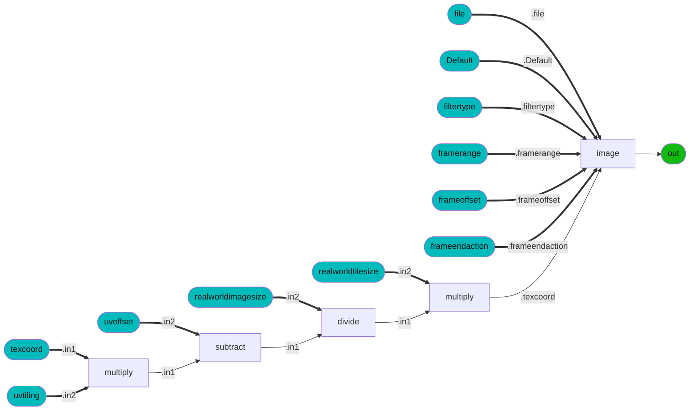
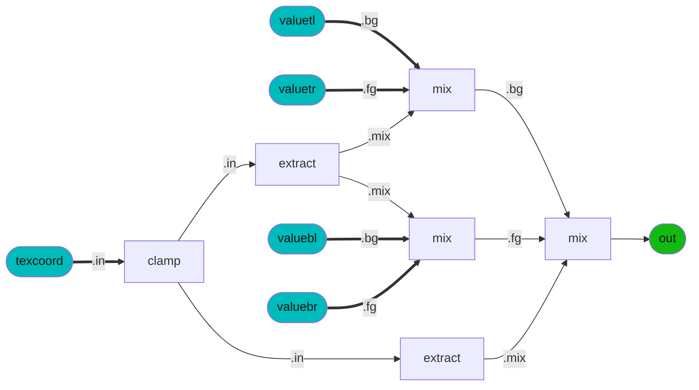
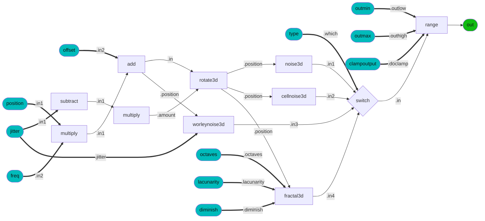

### Node Group: adjustment
* [colorcorrect](#node-colorcorrect) [contrast](#node-contrast) [curveadjust](#node-curveadjust) [hsvadjust](#node-hsvadjust) [hsvtorgb](#node-hsvtorgb) [luminance](#node-luminance) [range](#node-range) [remap](#node-remap) [rgbtohsv](#node-rgbtohsv) [saturate](#node-saturate) [smoothstep](#node-smoothstep) 
---------
### Node Group: application
* [frame](#node-frame) [time](#node-time) 
---------
### Node Group: channel
* [combine2](#node-combine2) [combine3](#node-combine3) [combine4](#node-combine4) [convert](#node-convert) [extract](#node-extract) [separate2](#node-separate2) [separate3](#node-separate3) [separate4](#node-separate4) [swizzle](#node-swizzle) 
---------
### Node Group: compositing
* [burn](#node-burn) [difference](#node-difference) [disjointover](#node-disjointover) [dodge](#node-dodge) [in](#node-in) [inside](#node-inside) [mask](#node-mask) [matte](#node-matte) [minus](#node-minus) [mix](#node-mix) [out](#node-out) [outside](#node-outside) [over](#node-over) [overlay](#node-overlay) [plus](#node-plus) [premult](#node-premult) [screen](#node-screen) [unpremult](#node-unpremult) 
---------
### Node Group: conditional
* [ifequal](#node-ifequal) [ifgreater](#node-ifgreater) [ifgreatereq](#node-ifgreatereq) [switch](#node-switch) 
---------
### Node Group: convolution2d
* [blur](#node-blur) [heighttonormal](#node-heighttonormal) 
---------
### Node Group: geometric
* [bitangent](#node-bitangent) [bump](#node-bump) [geomcolor](#node-geomcolor) [geompropvalue](#node-geompropvalue) [normal](#node-normal) [position](#node-position) [tangent](#node-tangent) [texcoord](#node-texcoord) 
---------
### Node Group: global
* [ambientocclusion](#node-ambientocclusion) 
---------
### Node Group: material
* [surfacematerial](#node-surfacematerial) [volumematerial](#node-volumematerial) 
---------
### Node Group: math
* [absval](#node-absval) [acos](#node-acos) [add](#node-add) [arrayappend](#node-arrayappend) [asin](#node-asin) [atan2](#node-atan2) [ceil](#node-ceil) [clamp](#node-clamp) [cos](#node-cos) [crossproduct](#node-crossproduct) [determinant](#node-determinant) [divide](#node-divide) [dotproduct](#node-dotproduct) [exp](#node-exp) [floor](#node-floor) [invert](#node-invert) [invertmatrix](#node-invertmatrix) [ln](#node-ln) [magnitude](#node-magnitude) [max](#node-max) [min](#node-min) [modulo](#node-modulo) [multiply](#node-multiply) [normalize](#node-normalize) [normalmap](#node-normalmap) [place2d](#node-place2d) [power](#node-power) [rotate2d](#node-rotate2d) [rotate3d](#node-rotate3d) [sign](#node-sign) [sin](#node-sin) [sqrt](#node-sqrt) [subtract](#node-subtract) [tan](#node-tan) [transformmatrix](#node-transformmatrix) [transformnormal](#node-transformnormal) [transformpoint](#node-transformpoint) [transformvector](#node-transformvector) [transpose](#node-transpose) 
---------
### Node Group: organization
* [dot](#node-dot) 
---------
### Node Group: procedural
* [constant](#node-constant) 
---------
### Node Group: procedural2d
* [cellnoise2d](#node-cellnoise2d) [noise2d](#node-noise2d) [ramp4](#node-ramp4) [ramplr](#node-ramplr) [ramptb](#node-ramptb) [splitlr](#node-splitlr) [splittb](#node-splittb) [unifiednoise2d](#node-unifiednoise2d) [worleynoise2d](#node-worleynoise2d) 
---------
### Node Group: procedural3d
* [cellnoise3d](#node-cellnoise3d) [fractal3d](#node-fractal3d) [noise3d](#node-noise3d) [unifiednoise3d](#node-unifiednoise3d) [worleynoise3d](#node-worleynoise3d) 
---------
### Node Group: shader
* [surface_unlit](#node-surface_unlit) 
---------
### Node Group: texture2d
* [image](#node-image) [tiledimage](#node-tiledimage) 
---------
### Node Group: texture3d
* [triplanarprojection](#node-triplanarprojection) 
---------
 
### Category: *surfacematerial*
<details><summary>ND_surfacematerial</summary>
<p>
 
* *Nodedef*: ND_surfacematerial
* *Type*: material
* *Node Group*: material
* *Version*: 1.0. Is default: False
* *Doc*: UNDOCUMENTED
* *Implementation*: Non-graph
 

| Name | Type | Default Value | UI name | UI min | UI max | UI Soft Min | UI Soft Max | UI step | UI group | UI Advanced | Doc | Uniform |
| ---- | ---- | ---- | ---- | ---- | ---- | ---- | ---- | ---- | ---- | ---- | ---- | ---- |
| **surfaceshader** | surfaceshader |  |  |  |  |  |  |  |  |  |  |  |
| **displacementshader** | displacementshader |  |  |  |  |  |  |  |  |  |  |  |
| *out* | material | None |  |  |  |  |  |  |  |  |  |  |
</p></details>
 
### Category: *volumematerial*
<details><summary>ND_volumematerial</summary>
<p>
 
* *Nodedef*: ND_volumematerial
* *Type*: material
* *Node Group*: material
* *Version*: 1.0. Is default: False
* *Doc*: UNDOCUMENTED
* *Implementation*: Non-graph
 

| Name | Type | Default Value | UI name | UI min | UI max | UI Soft Min | UI Soft Max | UI step | UI group | UI Advanced | Doc | Uniform |
| ---- | ---- | ---- | ---- | ---- | ---- | ---- | ---- | ---- | ---- | ---- | ---- | ---- |
| **volumeshader** | volumeshader |  |  |  |  |  |  |  |  |  |  |  |
| *out* | material | None |  |  |  |  |  |  |  |  |  |  |
</p></details>
 
### Category: *surface_unlit*
<details><summary>ND_surface_unlit</summary>
<p>
 
* *Nodedef*: ND_surface_unlit
* *Type*: surfaceshader
* *Node Group*: shader
* *Version*: 1.0. Is default: False
* *Doc*: Construct a surface shader from emission and transmission values.
* *Implementation*: Non-graph
 

| Name | Type | Default Value | UI name | UI min | UI max | UI Soft Min | UI Soft Max | UI step | UI group | UI Advanced | Doc | Uniform |
| ---- | ---- | ---- | ---- | ---- | ---- | ---- | ---- | ---- | ---- | ---- | ---- | ---- |
| **emission** | float | 1.0 |  |  |  |  |  |  |  |  | Surface emission amount. |  |
| **emission_color** | color3 | 1, 1, 1 |  |  |  |  |  |  |  |  | Surface emission color. |  |
| **transmission** | float | 0.0 |  |  |  |  |  |  |  |  | Surface transmission amount. |  |
| **transmission_color** | color3 | 1, 1, 1 |  |  |  |  |  |  |  |  | Surface transmission color. |  |
| **opacity** | float | 1.0 |  |  |  |  |  |  |  |  | Surface cutout opacity. |  |
| *out* | surfaceshader | None |  |  |  |  |  |  |  |  |  |  |
</p></details>
 
### Category: *image*
<details><summary>ND_image_float</summary>
<p>
 
* *Nodedef*: ND_image_float
* *Type*: float
* *Node Group*: texture2d
* *Version*: 1.0. Is default: False
* *Doc*: UNDOCUMENTED
* *Implementation*: Non-graph
 

| Name | Type | Default Value | UI name | UI min | UI max | UI Soft Min | UI Soft Max | UI step | UI group | UI Advanced | Doc | Uniform |
| ---- | ---- | ---- | ---- | ---- | ---- | ---- | ---- | ---- | ---- | ---- | ---- | ---- |
| **file** | filename |  | Filename |  |  |  |  |  |  |  |  | true |
| **layer** | string |  | Layer |  |  |  |  |  |  |  |  | true |
| **default** | float | 0.0 | Default Color |  |  |  |  |  |  |  |  |  |
| **texcoord** | vector2 | None | Texture Coordinates |  |  |  |  |  |  |  |  |  |
| **uaddressmode** | string | periodic | Address Mode U |  |  |  |  |  |  |  |  | true |
| **vaddressmode** | string | periodic | Address Mode V |  |  |  |  |  |  |  |  | true |
| **filtertype** | string | linear | Filter Type |  |  |  |  |  |  |  |  | true |
| **framerange** | string |  | Frame Range |  |  |  |  |  |  |  |  | true |
| **frameoffset** | integer | 0 | Frame Offset |  |  |  |  |  |  |  |  | true |
| **frameendaction** | string | constant | Frame End Action |  |  |  |  |  |  |  |  | true |
| *out* | float | None |  |  |  |  |  |  |  |  |  |  |
</p></details>
 
<details><summary>ND_image_color3</summary>
<p>
 
* *Nodedef*: ND_image_color3
* *Type*: color3
* *Node Group*: texture2d
* *Version*: 1.0. Is default: False
* *Doc*: UNDOCUMENTED
* *Implementation*: Non-graph
 

| Name | Type | Default Value | UI name | UI min | UI max | UI Soft Min | UI Soft Max | UI step | UI group | UI Advanced | Doc | Uniform |
| ---- | ---- | ---- | ---- | ---- | ---- | ---- | ---- | ---- | ---- | ---- | ---- | ---- |
| **file** | filename |  | Filename |  |  |  |  |  |  |  |  | true |
| **layer** | string |  | Layer |  |  |  |  |  |  |  |  | true |
| **default** | color3 | 0, 0, 0 | Default Color |  |  |  |  |  |  |  |  |  |
| **texcoord** | vector2 | None | Texture Coordinates |  |  |  |  |  |  |  |  |  |
| **uaddressmode** | string | periodic | Address Mode U |  |  |  |  |  |  |  |  | true |
| **vaddressmode** | string | periodic | Address Mode V |  |  |  |  |  |  |  |  | true |
| **filtertype** | string | linear | Filter Type |  |  |  |  |  |  |  |  | true |
| **framerange** | string |  | Frame Range |  |  |  |  |  |  |  |  | true |
| **frameoffset** | integer | 0 | Frame Offset |  |  |  |  |  |  |  |  | true |
| **frameendaction** | string | constant | Frame End Action |  |  |  |  |  |  |  |  | true |
| *out* | color3 | None |  |  |  |  |  |  |  |  |  |  |
</p></details>
 
<details><summary>ND_image_color4</summary>
<p>
 
* *Nodedef*: ND_image_color4
* *Type*: color4
* *Node Group*: texture2d
* *Version*: 1.0. Is default: False
* *Doc*: UNDOCUMENTED
* *Implementation*: Non-graph
 

| Name | Type | Default Value | UI name | UI min | UI max | UI Soft Min | UI Soft Max | UI step | UI group | UI Advanced | Doc | Uniform |
| ---- | ---- | ---- | ---- | ---- | ---- | ---- | ---- | ---- | ---- | ---- | ---- | ---- |
| **file** | filename |  | Filename |  |  |  |  |  |  |  |  | true |
| **layer** | string |  | Layer |  |  |  |  |  |  |  |  | true |
| **default** | color4 | 0, 0, 0, 0 | Default Color |  |  |  |  |  |  |  |  |  |
| **texcoord** | vector2 | None | Texture Coordinates |  |  |  |  |  |  |  |  |  |
| **uaddressmode** | string | periodic | Address Mode U |  |  |  |  |  |  |  |  | true |
| **vaddressmode** | string | periodic | Address Mode V |  |  |  |  |  |  |  |  | true |
| **filtertype** | string | linear | Filter Type |  |  |  |  |  |  |  |  | true |
| **framerange** | string |  | Frame Range |  |  |  |  |  |  |  |  | true |
| **frameoffset** | integer | 0 | Frame Offset |  |  |  |  |  |  |  |  | true |
| **frameendaction** | string | constant | Frame End Action |  |  |  |  |  |  |  |  | true |
| *out* | color4 | None |  |  |  |  |  |  |  |  |  |  |
</p></details>
 
<details><summary>ND_image_vector2</summary>
<p>
 
* *Nodedef*: ND_image_vector2
* *Type*: vector2
* *Node Group*: texture2d
* *Version*: 1.0. Is default: False
* *Doc*: UNDOCUMENTED
* *Implementation*: Non-graph
 

| Name | Type | Default Value | UI name | UI min | UI max | UI Soft Min | UI Soft Max | UI step | UI group | UI Advanced | Doc | Uniform |
| ---- | ---- | ---- | ---- | ---- | ---- | ---- | ---- | ---- | ---- | ---- | ---- | ---- |
| **file** | filename |  | Filename |  |  |  |  |  |  |  |  | true |
| **layer** | string |  | Layer |  |  |  |  |  |  |  |  | true |
| **default** | vector2 | 0, 0 | Default Color |  |  |  |  |  |  |  |  |  |
| **texcoord** | vector2 | None | Texture Coordinates |  |  |  |  |  |  |  |  |  |
| **uaddressmode** | string | periodic | Address Mode U |  |  |  |  |  |  |  |  | true |
| **vaddressmode** | string | periodic | Address Mode V |  |  |  |  |  |  |  |  | true |
| **filtertype** | string | linear | Filter Type |  |  |  |  |  |  |  |  | true |
| **framerange** | string |  | Frame Range |  |  |  |  |  |  |  |  | true |
| **frameoffset** | integer | 0 | Frame Offset |  |  |  |  |  |  |  |  | true |
| **frameendaction** | string | constant | Frame End Action |  |  |  |  |  |  |  |  | true |
| *out* | vector2 | None |  |  |  |  |  |  |  |  |  |  |
</p></details>
 
<details><summary>ND_image_vector3</summary>
<p>
 
* *Nodedef*: ND_image_vector3
* *Type*: vector3
* *Node Group*: texture2d
* *Version*: 1.0. Is default: False
* *Doc*: UNDOCUMENTED
* *Implementation*: Non-graph
 

| Name | Type | Default Value | UI name | UI min | UI max | UI Soft Min | UI Soft Max | UI step | UI group | UI Advanced | Doc | Uniform |
| ---- | ---- | ---- | ---- | ---- | ---- | ---- | ---- | ---- | ---- | ---- | ---- | ---- |
| **file** | filename |  | Filename |  |  |  |  |  |  |  |  | true |
| **layer** | string |  | Layer |  |  |  |  |  |  |  |  | true |
| **default** | vector3 | 0, 0, 0 | Default Color |  |  |  |  |  |  |  |  |  |
| **texcoord** | vector2 | None | Texture Coordinates |  |  |  |  |  |  |  |  |  |
| **uaddressmode** | string | periodic | Address Mode U |  |  |  |  |  |  |  |  | true |
| **vaddressmode** | string | periodic | Address Mode V |  |  |  |  |  |  |  |  | true |
| **filtertype** | string | linear | Filter Type |  |  |  |  |  |  |  |  | true |
| **framerange** | string |  | Frame Range |  |  |  |  |  |  |  |  | true |
| **frameoffset** | integer | 0 | Frame Offset |  |  |  |  |  |  |  |  | true |
| **frameendaction** | string | constant | Frame End Action |  |  |  |  |  |  |  |  | true |
| *out* | vector3 | None |  |  |  |  |  |  |  |  |  |  |
</p></details>
 
<details><summary>ND_image_vector4</summary>
<p>
 
* *Nodedef*: ND_image_vector4
* *Type*: vector4
* *Node Group*: texture2d
* *Version*: 1.0. Is default: False
* *Doc*: UNDOCUMENTED
* *Implementation*: Non-graph
 

| Name | Type | Default Value | UI name | UI min | UI max | UI Soft Min | UI Soft Max | UI step | UI group | UI Advanced | Doc | Uniform |
| ---- | ---- | ---- | ---- | ---- | ---- | ---- | ---- | ---- | ---- | ---- | ---- | ---- |
| **file** | filename |  | Filename |  |  |  |  |  |  |  |  | true |
| **layer** | string |  | Layer |  |  |  |  |  |  |  |  | true |
| **default** | vector4 | 0, 0, 0, 0 | Default Color |  |  |  |  |  |  |  |  |  |
| **texcoord** | vector2 | None | Texture Coordinates |  |  |  |  |  |  |  |  |  |
| **uaddressmode** | string | periodic | Address Mode U |  |  |  |  |  |  |  |  | true |
| **vaddressmode** | string | periodic | Address Mode V |  |  |  |  |  |  |  |  | true |
| **filtertype** | string | linear | Filter Type |  |  |  |  |  |  |  |  | true |
| **framerange** | string |  | Frame Range |  |  |  |  |  |  |  |  | true |
| **frameoffset** | integer | 0 | Frame Offset |  |  |  |  |  |  |  |  | true |
| **frameendaction** | string | constant | Frame End Action |  |  |  |  |  |  |  |  | true |
| *out* | vector4 | None |  |  |  |  |  |  |  |  |  |  |
</p></details>
 
### Category: *tiledimage*
<details><summary>ND_tiledimage_float</summary>
<p>
 
* *Nodedef*: ND_tiledimage_float
* *Type*: float
* *Node Group*: texture2d
* *Version*: 1.0. Is default: False
* *Doc*: UNDOCUMENTED
* *Nodegraph*: NG_tiledimage_float


 

| Name | Type | Default Value | UI name | UI min | UI max | UI Soft Min | UI Soft Max | UI step | UI group | UI Advanced | Doc | Uniform |
| ---- | ---- | ---- | ---- | ---- | ---- | ---- | ---- | ---- | ---- | ---- | ---- | ---- |
| **file** | filename |  |  |  |  |  |  |  |  |  |  | true |
| **default** | float | 0.0 |  |  |  |  |  |  |  |  |  |  |
| **texcoord** | vector2 | None |  |  |  |  |  |  |  |  |  |  |
| **uvtiling** | vector2 | 1, 1 |  |  |  |  |  |  |  |  |  |  |
| **uvoffset** | vector2 | 0, 0 |  |  |  |  |  |  |  |  |  |  |
| **realworldimagesize** | vector2 | 1, 1 |  |  |  |  |  |  |  |  |  |  |
| **realworldtilesize** | vector2 | 1, 1 |  |  |  |  |  |  |  |  |  |  |
| **filtertype** | string | linear |  |  |  |  |  |  |  |  |  | true |
| **framerange** | string |  |  |  |  |  |  |  |  |  |  | true |
| **frameoffset** | integer | 0 |  |  |  |  |  |  |  |  |  | true |
| **frameendaction** | string | constant |  |  |  |  |  |  |  |  |  | true |
| *out* | float | None |  |  |  |  |  |  |  |  |  |  |
</p></details>
 
<details><summary>ND_tiledimage_color3</summary>
<p>
 
* *Nodedef*: ND_tiledimage_color3
* *Type*: color3
* *Node Group*: texture2d
* *Version*: 1.0. Is default: False
* *Doc*: UNDOCUMENTED
* *Nodegraph*: NG_tiledimage_color3


 

| Name | Type | Default Value | UI name | UI min | UI max | UI Soft Min | UI Soft Max | UI step | UI group | UI Advanced | Doc | Uniform |
| ---- | ---- | ---- | ---- | ---- | ---- | ---- | ---- | ---- | ---- | ---- | ---- | ---- |
| **file** | filename |  |  |  |  |  |  |  |  |  |  | true |
| **default** | color3 | 0, 0, 0 |  |  |  |  |  |  |  |  |  |  |
| **texcoord** | vector2 | None |  |  |  |  |  |  |  |  |  |  |
| **uvtiling** | vector2 | 1, 1 |  |  |  |  |  |  |  |  |  |  |
| **uvoffset** | vector2 | 0, 0 |  |  |  |  |  |  |  |  |  |  |
| **realworldimagesize** | vector2 | 1, 1 |  |  |  |  |  |  |  |  |  |  |
| **realworldtilesize** | vector2 | 1, 1 |  |  |  |  |  |  |  |  |  |  |
| **filtertype** | string | linear |  |  |  |  |  |  |  |  |  | true |
| **framerange** | string |  |  |  |  |  |  |  |  |  |  | true |
| **frameoffset** | integer | 0 |  |  |  |  |  |  |  |  |  | true |
| **frameendaction** | string | constant |  |  |  |  |  |  |  |  |  | true |
| *out* | color3 | None |  |  |  |  |  |  |  |  |  |  |
</p></details>
 
<details><summary>ND_tiledimage_color4</summary>
<p>
 
* *Nodedef*: ND_tiledimage_color4
* *Type*: color4
* *Node Group*: texture2d
* *Version*: 1.0. Is default: False
* *Doc*: UNDOCUMENTED
* *Nodegraph*: NG_tiledimage_color4


 

| Name | Type | Default Value | UI name | UI min | UI max | UI Soft Min | UI Soft Max | UI step | UI group | UI Advanced | Doc | Uniform |
| ---- | ---- | ---- | ---- | ---- | ---- | ---- | ---- | ---- | ---- | ---- | ---- | ---- |
| **file** | filename |  |  |  |  |  |  |  |  |  |  | true |
| **default** | color4 | 0, 0, 0, 0 |  |  |  |  |  |  |  |  |  |  |
| **texcoord** | vector2 | None |  |  |  |  |  |  |  |  |  |  |
| **uvtiling** | vector2 | 1, 1 |  |  |  |  |  |  |  |  |  |  |
| **uvoffset** | vector2 | 0, 0 |  |  |  |  |  |  |  |  |  |  |
| **realworldimagesize** | vector2 | 1, 1 |  |  |  |  |  |  |  |  |  |  |
| **realworldtilesize** | vector2 | 1, 1 |  |  |  |  |  |  |  |  |  |  |
| **filtertype** | string | linear |  |  |  |  |  |  |  |  |  | true |
| **framerange** | string |  |  |  |  |  |  |  |  |  |  | true |
| **frameoffset** | integer | 0 |  |  |  |  |  |  |  |  |  | true |
| **frameendaction** | string | constant |  |  |  |  |  |  |  |  |  | true |
| *out* | color4 | None |  |  |  |  |  |  |  |  |  |  |
</p></details>
 
<details><summary>ND_tiledimage_vector2</summary>
<p>
 
* *Nodedef*: ND_tiledimage_vector2
* *Type*: vector2
* *Node Group*: texture2d
* *Version*: 1.0. Is default: False
* *Doc*: UNDOCUMENTED
* *Nodegraph*: NG_tiledimage_vector2


 

| Name | Type | Default Value | UI name | UI min | UI max | UI Soft Min | UI Soft Max | UI step | UI group | UI Advanced | Doc | Uniform |
| ---- | ---- | ---- | ---- | ---- | ---- | ---- | ---- | ---- | ---- | ---- | ---- | ---- |
| **file** | filename |  |  |  |  |  |  |  |  |  |  | true |
| **default** | vector2 | 0, 0 |  |  |  |  |  |  |  |  |  |  |
| **texcoord** | vector2 | None |  |  |  |  |  |  |  |  |  |  |
| **uvtiling** | vector2 | 1, 1 |  |  |  |  |  |  |  |  |  |  |
| **uvoffset** | vector2 | 0, 0 |  |  |  |  |  |  |  |  |  |  |
| **realworldimagesize** | vector2 | 1, 1 |  |  |  |  |  |  |  |  |  |  |
| **realworldtilesize** | vector2 | 1, 1 |  |  |  |  |  |  |  |  |  |  |
| **filtertype** | string | linear |  |  |  |  |  |  |  |  |  | true |
| **framerange** | string |  |  |  |  |  |  |  |  |  |  | true |
| **frameoffset** | integer | 0 |  |  |  |  |  |  |  |  |  | true |
| **frameendaction** | string | constant |  |  |  |  |  |  |  |  |  | true |
| *out* | vector2 | None |  |  |  |  |  |  |  |  |  |  |
</p></details>
 
<details><summary>ND_tiledimage_vector3</summary>
<p>
 
* *Nodedef*: ND_tiledimage_vector3
* *Type*: vector3
* *Node Group*: texture2d
* *Version*: 1.0. Is default: False
* *Doc*: UNDOCUMENTED
* *Nodegraph*: NG_tiledimage_vector3


 

| Name | Type | Default Value | UI name | UI min | UI max | UI Soft Min | UI Soft Max | UI step | UI group | UI Advanced | Doc | Uniform |
| ---- | ---- | ---- | ---- | ---- | ---- | ---- | ---- | ---- | ---- | ---- | ---- | ---- |
| **file** | filename |  |  |  |  |  |  |  |  |  |  | true |
| **default** | vector3 | 0, 0, 0 |  |  |  |  |  |  |  |  |  |  |
| **texcoord** | vector2 | None |  |  |  |  |  |  |  |  |  |  |
| **uvtiling** | vector2 | 1, 1 |  |  |  |  |  |  |  |  |  |  |
| **uvoffset** | vector2 | 0, 0 |  |  |  |  |  |  |  |  |  |  |
| **realworldimagesize** | vector2 | 1, 1 |  |  |  |  |  |  |  |  |  |  |
| **realworldtilesize** | vector2 | 1, 1 |  |  |  |  |  |  |  |  |  |  |
| **filtertype** | string | linear |  |  |  |  |  |  |  |  |  | true |
| **framerange** | string |  |  |  |  |  |  |  |  |  |  | true |
| **frameoffset** | integer | 0 |  |  |  |  |  |  |  |  |  | true |
| **frameendaction** | string | constant |  |  |  |  |  |  |  |  |  | true |
| *out* | vector3 | None |  |  |  |  |  |  |  |  |  |  |
</p></details>
 
<details><summary>ND_tiledimage_vector4</summary>
<p>
 
* *Nodedef*: ND_tiledimage_vector4
* *Type*: vector4
* *Node Group*: texture2d
* *Version*: 1.0. Is default: False
* *Doc*: UNDOCUMENTED
* *Nodegraph*: NG_tiledimage_vector4



 

| Name | Type | Default Value | UI name | UI min | UI max | UI Soft Min | UI Soft Max | UI step | UI group | UI Advanced | Doc | Uniform |
| ---- | ---- | ---- | ---- | ---- | ---- | ---- | ---- | ---- | ---- | ---- | ---- | ---- |
| **file** | filename |  |  |  |  |  |  |  |  |  |  | true |
| **default** | vector4 | 0, 0, 0, 0 |  |  |  |  |  |  |  |  |  |  |
| **texcoord** | vector2 | None |  |  |  |  |  |  |  |  |  |  |
| **uvtiling** | vector2 | 1, 1 |  |  |  |  |  |  |  |  |  |  |
| **uvoffset** | vector2 | 0, 0 |  |  |  |  |  |  |  |  |  |  |
| **realworldimagesize** | vector2 | 1, 1 |  |  |  |  |  |  |  |  |  |  |
| **realworldtilesize** | vector2 | 1, 1 |  |  |  |  |  |  |  |  |  |  |
| **filtertype** | string | linear |  |  |  |  |  |  |  |  |  | true |
| **framerange** | string |  |  |  |  |  |  |  |  |  |  | true |
| **frameoffset** | integer | 0 |  |  |  |  |  |  |  |  |  | true |
| **frameendaction** | string | constant |  |  |  |  |  |  |  |  |  | true |
| *out* | vector4 | None |  |  |  |  |  |  |  |  |  |  |
</p></details>
 
### Category: *triplanarprojection*
<details><summary>ND_triplanarprojection_float</summary>
<p>
 
* *Nodedef*: ND_triplanarprojection_float
* *Type*: float
* *Node Group*: texture3d
* *Version*: 1.0. Is default: False
* *Doc*: UNDOCUMENTED
* *Nodegraph*: NG_triplanarprojection_float


 

| Name | Type | Default Value | UI name | UI min | UI max | UI Soft Min | UI Soft Max | UI step | UI group | UI Advanced | Doc | Uniform |
| ---- | ---- | ---- | ---- | ---- | ---- | ---- | ---- | ---- | ---- | ---- | ---- | ---- |
| **filex** | filename |  |  |  |  |  |  |  |  |  |  | true |
| **filey** | filename |  |  |  |  |  |  |  |  |  |  | true |
| **filez** | filename |  |  |  |  |  |  |  |  |  |  | true |
| **layerx** | string |  |  |  |  |  |  |  |  |  |  | true |
| **layery** | string |  |  |  |  |  |  |  |  |  |  | true |
| **layerz** | string |  |  |  |  |  |  |  |  |  |  | true |
| **default** | float | 0.0 |  |  |  |  |  |  |  |  |  |  |
| **position** | vector3 | None |  |  |  |  |  |  |  |  |  |  |
| **normal** | vector3 | None |  |  |  |  |  |  |  |  |  |  |
| **filtertype** | string | linear |  |  |  |  |  |  |  |  |  | true |
| **framerange** | string |  |  |  |  |  |  |  |  |  |  | true |
| **frameoffset** | integer | 0 |  |  |  |  |  |  |  |  |  | true |
| **frameendaction** | string | constant |  |  |  |  |  |  |  |  |  | true |
| *out* | float | None |  |  |  |  |  |  |  |  |  |  |
</p></details>
 
<details><summary>ND_triplanarprojection_color3</summary>
<p>
 
* *Nodedef*: ND_triplanarprojection_color3
* *Type*: color3
* *Node Group*: texture3d
* *Version*: 1.0. Is default: False
* *Doc*: UNDOCUMENTED
* *Nodegraph*: NG_triplanarprojection_color3

```mermaid
graph LR; 
    NG_triplanarprojection_color3_N_add2_color3[add] --> NG_triplanarprojection_color3_out([out])
    style NG_triplanarprojection_color3_out fill:#1b1, color:#111
    NG_triplanarprojection_color3_N_add1_color3[add] --".in1"--> NG_triplanarprojection_color3_N_add2_color3[add]
    NG_triplanarprojection_color3_N_nX_color3[multiply] --".in1"--> NG_triplanarprojection_color3_N_add1_color3[add]
    NG_triplanarprojection_color3_N_imgX_color3[image] --".in1"--> NG_triplanarprojection_color3_N_nX_color3[multiply]
    NG_triplanarprojection_color3_filexINT([filex]) ==.file==> NG_triplanarprojection_color3_N_imgX_color3[image]
    style NG_triplanarprojection_color3_filexINT fill:#0bb, color:#111
    NG_triplanarprojection_color3_layerxINT([layerx]) ==.layer==> NG_triplanarprojection_color3_N_imgX_color3[image]
    style NG_triplanarprojection_color3_layerxINT fill:#0bb, color:#111
    NG_triplanarprojection_color3_DefaultINT([Default]) ==.Default==> NG_triplanarprojection_color3_N_imgX_color3[image]
    style NG_triplanarprojection_color3_DefaultINT fill:#0bb, color:#111
    NG_triplanarprojection_color3_filtertypeINT([filtertype]) ==.filtertype==> NG_triplanarprojection_color3_N_imgX_color3[image]
    style NG_triplanarprojection_color3_filtertypeINT fill:#0bb, color:#111
    NG_triplanarprojection_color3_framerangeINT([framerange]) ==.framerange==> NG_triplanarprojection_color3_N_imgX_color3[image]
    style NG_triplanarprojection_color3_framerangeINT fill:#0bb, color:#111
    NG_triplanarprojection_color3_frameoffsetINT([frameoffset]) ==.frameoffset==> NG_triplanarprojection_color3_N_imgX_color3[image]
    style NG_triplanarprojection_color3_frameoffsetINT fill:#0bb, color:#111
    NG_triplanarprojection_color3_frameendactionINT([frameendaction]) ==.frameendaction==> NG_triplanarprojection_color3_N_imgX_color3[image]
    style NG_triplanarprojection_color3_frameendactionINT fill:#0bb, color:#111
    NG_triplanarprojection_color3_N_vecYZ_color3[combine2] --".texcoord"--> NG_triplanarprojection_color3_N_imgX_color3[image]
    NG_triplanarprojection_color3_N_extY_color3[extract] --".in1"--> NG_triplanarprojection_color3_N_vecYZ_color3[combine2]
    NG_triplanarprojection_color3_positionINT([position]) ==.in==> NG_triplanarprojection_color3_N_extY_color3[extract]
    style NG_triplanarprojection_color3_positionINT fill:#0bb, color:#111
    NG_triplanarprojection_color3_N_extZ_color3[extract] --".in2"--> NG_triplanarprojection_color3_N_vecYZ_color3[combine2]
    NG_triplanarprojection_color3_positionINT([position]) ==.in==> NG_triplanarprojection_color3_N_extZ_color3[extract]
    style NG_triplanarprojection_color3_positionINT fill:#0bb, color:#111
    NG_triplanarprojection_color3_N_blendX_color3[absval] --".in2"--> NG_triplanarprojection_color3_N_nX_color3[multiply]
    NG_triplanarprojection_color3_N_dotX_color3[dotproduct] --".in"--> NG_triplanarprojection_color3_N_blendX_color3[absval]
    NG_triplanarprojection_color3_N_norm_color3[normalize] --".in1"--> NG_triplanarprojection_color3_N_dotX_color3[dotproduct]
    NG_triplanarprojection_color3_normalINT([normal]) ==.in==> NG_triplanarprojection_color3_N_norm_color3[normalize]
    style NG_triplanarprojection_color3_normalINT fill:#0bb, color:#111
    NG_triplanarprojection_color3_N_nY_color3[multiply] --".in2"--> NG_triplanarprojection_color3_N_add1_color3[add]
    NG_triplanarprojection_color3_N_imgY_color3[image] --".in1"--> NG_triplanarprojection_color3_N_nY_color3[multiply]
    NG_triplanarprojection_color3_fileyINT([filey]) ==.file==> NG_triplanarprojection_color3_N_imgY_color3[image]
    style NG_triplanarprojection_color3_fileyINT fill:#0bb, color:#111
    NG_triplanarprojection_color3_layeryINT([layery]) ==.layer==> NG_triplanarprojection_color3_N_imgY_color3[image]
    style NG_triplanarprojection_color3_layeryINT fill:#0bb, color:#111
    NG_triplanarprojection_color3_DefaultINT([Default]) ==.Default==> NG_triplanarprojection_color3_N_imgY_color3[image]
    style NG_triplanarprojection_color3_DefaultINT fill:#0bb, color:#111
    NG_triplanarprojection_color3_filtertypeINT([filtertype]) ==.filtertype==> NG_triplanarprojection_color3_N_imgY_color3[image]
    style NG_triplanarprojection_color3_filtertypeINT fill:#0bb, color:#111
    NG_triplanarprojection_color3_framerangeINT([framerange]) ==.framerange==> NG_triplanarprojection_color3_N_imgY_color3[image]
    style NG_triplanarprojection_color3_framerangeINT fill:#0bb, color:#111
    NG_triplanarprojection_color3_frameoffsetINT([frameoffset]) ==.frameoffset==> NG_triplanarprojection_color3_N_imgY_color3[image]
    style NG_triplanarprojection_color3_frameoffsetINT fill:#0bb, color:#111
    NG_triplanarprojection_color3_frameendactionINT([frameendaction]) ==.frameendaction==> NG_triplanarprojection_color3_N_imgY_color3[image]
    style NG_triplanarprojection_color3_frameendactionINT fill:#0bb, color:#111
    NG_triplanarprojection_color3_N_vecXZ_color3[combine2] --".texcoord"--> NG_triplanarprojection_color3_N_imgY_color3[image]
    NG_triplanarprojection_color3_N_extX_color3[extract] --".in1"--> NG_triplanarprojection_color3_N_vecXZ_color3[combine2]
    NG_triplanarprojection_color3_positionINT([position]) ==.in==> NG_triplanarprojection_color3_N_extX_color3[extract]
    style NG_triplanarprojection_color3_positionINT fill:#0bb, color:#111
    NG_triplanarprojection_color3_N_extZ_color3[extract] --".in2"--> NG_triplanarprojection_color3_N_vecXZ_color3[combine2]
    NG_triplanarprojection_color3_N_blendY_color3[absval] --".in2"--> NG_triplanarprojection_color3_N_nY_color3[multiply]
    NG_triplanarprojection_color3_N_dotY_color3[dotproduct] --".in"--> NG_triplanarprojection_color3_N_blendY_color3[absval]
    NG_triplanarprojection_color3_N_norm_color3[normalize] --".in1"--> NG_triplanarprojection_color3_N_dotY_color3[dotproduct]
    NG_triplanarprojection_color3_N_nZ_color3[multiply] --".in2"--> NG_triplanarprojection_color3_N_add2_color3[add]
    NG_triplanarprojection_color3_N_imgZ_color3[image] --".in1"--> NG_triplanarprojection_color3_N_nZ_color3[multiply]
    NG_triplanarprojection_color3_filezINT([filez]) ==.file==> NG_triplanarprojection_color3_N_imgZ_color3[image]
    style NG_triplanarprojection_color3_filezINT fill:#0bb, color:#111
    NG_triplanarprojection_color3_layerzINT([layerz]) ==.layer==> NG_triplanarprojection_color3_N_imgZ_color3[image]
    style NG_triplanarprojection_color3_layerzINT fill:#0bb, color:#111
    NG_triplanarprojection_color3_DefaultINT([Default]) ==.Default==> NG_triplanarprojection_color3_N_imgZ_color3[image]
    style NG_triplanarprojection_color3_DefaultINT fill:#0bb, color:#111
    NG_triplanarprojection_color3_filtertypeINT([filtertype]) ==.filtertype==> NG_triplanarprojection_color3_N_imgZ_color3[image]
    style NG_triplanarprojection_color3_filtertypeINT fill:#0bb, color:#111
    NG_triplanarprojection_color3_framerangeINT([framerange]) ==.framerange==> NG_triplanarprojection_color3_N_imgZ_color3[image]
    style NG_triplanarprojection_color3_framerangeINT fill:#0bb, color:#111
    NG_triplanarprojection_color3_frameoffsetINT([frameoffset]) ==.frameoffset==> NG_triplanarprojection_color3_N_imgZ_color3[image]
    style NG_triplanarprojection_color3_frameoffsetINT fill:#0bb, color:#111
    NG_triplanarprojection_color3_frameendactionINT([frameendaction]) ==.frameendaction==> NG_triplanarprojection_color3_N_imgZ_color3[image]
    style NG_triplanarprojection_color3_frameendactionINT fill:#0bb, color:#111
    NG_triplanarprojection_color3_N_vecXY_color3[combine2] --".texcoord"--> NG_triplanarprojection_color3_N_imgZ_color3[image]
    NG_triplanarprojection_color3_N_extX_color3[extract] --".in1"--> NG_triplanarprojection_color3_N_vecXY_color3[combine2]
    NG_triplanarprojection_color3_N_extY_color3[extract] --".in2"--> NG_triplanarprojection_color3_N_vecXY_color3[combine2]
    NG_triplanarprojection_color3_N_blendZ_color3[absval] --".in2"--> NG_triplanarprojection_color3_N_nZ_color3[multiply]
    NG_triplanarprojection_color3_N_dotZ_color3[dotproduct] --".in"--> NG_triplanarprojection_color3_N_blendZ_color3[absval]
    NG_triplanarprojection_color3_N_norm_color3[normalize] --".in1"--> NG_triplanarprojection_color3_N_dotZ_color3[dotproduct]

```



 

| Name | Type | Default Value | UI name | UI min | UI max | UI Soft Min | UI Soft Max | UI step | UI group | UI Advanced | Doc | Uniform |
| ---- | ---- | ---- | ---- | ---- | ---- | ---- | ---- | ---- | ---- | ---- | ---- | ---- |
| **filex** | filename |  |  |  |  |  |  |  |  |  |  | true |
| **filey** | filename |  |  |  |  |  |  |  |  |  |  | true |
| **filez** | filename |  |  |  |  |  |  |  |  |  |  | true |
| **layerx** | string |  |  |  |  |  |  |  |  |  |  | true |
| **layery** | string |  |  |  |  |  |  |  |  |  |  | true |
| **layerz** | string |  |  |  |  |  |  |  |  |  |  | true |
| **default** | color3 | 0, 0, 0 |  |  |  |  |  |  |  |  |  |  |
| **position** | vector3 | None |  |  |  |  |  |  |  |  |  |  |
| **normal** | vector3 | None |  |  |  |  |  |  |  |  |  |  |
| **filtertype** | string | linear |  |  |  |  |  |  |  |  |  | true |
| **framerange** | string |  |  |  |  |  |  |  |  |  |  | true |
| **frameoffset** | integer | 0 |  |  |  |  |  |  |  |  |  | true |
| **frameendaction** | string | constant |  |  |  |  |  |  |  |  |  | true |
| *out* | color3 | None |  |  |  |  |  |  |  |  |  |  |
</p></details>
 
<details><summary>ND_triplanarprojection_color4</summary>
<p>
 
* *Nodedef*: ND_triplanarprojection_color4
* *Type*: color4
* *Node Group*: texture3d
* *Version*: 1.0. Is default: False
* *Doc*: UNDOCUMENTED
* *Nodegraph*: NG_triplanarprojection_color4


 

| Name | Type | Default Value | UI name | UI min | UI max | UI Soft Min | UI Soft Max | UI step | UI group | UI Advanced | Doc | Uniform |
| ---- | ---- | ---- | ---- | ---- | ---- | ---- | ---- | ---- | ---- | ---- | ---- | ---- |
| **filex** | filename |  |  |  |  |  |  |  |  |  |  | true |
| **filey** | filename |  |  |  |  |  |  |  |  |  |  | true |
| **filez** | filename |  |  |  |  |  |  |  |  |  |  | true |
| **layerx** | string |  |  |  |  |  |  |  |  |  |  | true |
| **layery** | string |  |  |  |  |  |  |  |  |  |  | true |
| **layerz** | string |  |  |  |  |  |  |  |  |  |  | true |
| **default** | color4 | 0, 0, 0, 0 |  |  |  |  |  |  |  |  |  |  |
| **position** | vector3 | None |  |  |  |  |  |  |  |  |  |  |
| **normal** | vector3 | None |  |  |  |  |  |  |  |  |  |  |
| **filtertype** | string | linear |  |  |  |  |  |  |  |  |  | true |
| **framerange** | string |  |  |  |  |  |  |  |  |  |  | true |
| **frameoffset** | integer | 0 |  |  |  |  |  |  |  |  |  | true |
| **frameendaction** | string | constant |  |  |  |  |  |  |  |  |  | true |
| *out* | color4 | None |  |  |  |  |  |  |  |  |  |  |
</p></details>
 
<details><summary>ND_triplanarprojection_vector2</summary>
<p>
 
* *Nodedef*: ND_triplanarprojection_vector2
* *Type*: vector2
* *Node Group*: texture3d
* *Version*: 1.0. Is default: False
* *Doc*: UNDOCUMENTED
* *Nodegraph*: NG_triplanarprojection_vector2


 

| Name | Type | Default Value | UI name | UI min | UI max | UI Soft Min | UI Soft Max | UI step | UI group | UI Advanced | Doc | Uniform |
| ---- | ---- | ---- | ---- | ---- | ---- | ---- | ---- | ---- | ---- | ---- | ---- | ---- |
| **filex** | filename |  |  |  |  |  |  |  |  |  |  | true |
| **filey** | filename |  |  |  |  |  |  |  |  |  |  | true |
| **filez** | filename |  |  |  |  |  |  |  |  |  |  | true |
| **layerx** | string |  |  |  |  |  |  |  |  |  |  | true |
| **layery** | string |  |  |  |  |  |  |  |  |  |  | true |
| **layerz** | string |  |  |  |  |  |  |  |  |  |  | true |
| **default** | vector2 | 0, 0 |  |  |  |  |  |  |  |  |  |  |
| **position** | vector3 | None |  |  |  |  |  |  |  |  |  |  |
| **normal** | vector3 | None |  |  |  |  |  |  |  |  |  |  |
| **filtertype** | string | linear |  |  |  |  |  |  |  |  |  | true |
| **framerange** | string |  |  |  |  |  |  |  |  |  |  | true |
| **frameoffset** | integer | 0 |  |  |  |  |  |  |  |  |  | true |
| **frameendaction** | string | constant |  |  |  |  |  |  |  |  |  | true |
| *out* | vector2 | None |  |  |  |  |  |  |  |  |  |  |
</p></details>
 
<details><summary>ND_triplanarprojection_vector3</summary>
<p>
 
* *Nodedef*: ND_triplanarprojection_vector3
* *Type*: vector3
* *Node Group*: texture3d
* *Version*: 1.0. Is default: False
* *Doc*: UNDOCUMENTED
* *Nodegraph*: NG_triplanarprojection_vector3


 

| Name | Type | Default Value | UI name | UI min | UI max | UI Soft Min | UI Soft Max | UI step | UI group | UI Advanced | Doc | Uniform |
| ---- | ---- | ---- | ---- | ---- | ---- | ---- | ---- | ---- | ---- | ---- | ---- | ---- |
| **filex** | filename |  |  |  |  |  |  |  |  |  |  | true |
| **filey** | filename |  |  |  |  |  |  |  |  |  |  | true |
| **filez** | filename |  |  |  |  |  |  |  |  |  |  | true |
| **layerx** | string |  |  |  |  |  |  |  |  |  |  | true |
| **layery** | string |  |  |  |  |  |  |  |  |  |  | true |
| **layerz** | string |  |  |  |  |  |  |  |  |  |  | true |
| **default** | vector3 | 0, 0, 0 |  |  |  |  |  |  |  |  |  |  |
| **position** | vector3 | None |  |  |  |  |  |  |  |  |  |  |
| **normal** | vector3 | None |  |  |  |  |  |  |  |  |  |  |
| **filtertype** | string | linear |  |  |  |  |  |  |  |  |  | true |
| **framerange** | string |  |  |  |  |  |  |  |  |  |  | true |
| **frameoffset** | integer | 0 |  |  |  |  |  |  |  |  |  | true |
| **frameendaction** | string | constant |  |  |  |  |  |  |  |  |  | true |
| *out* | vector3 | None |  |  |  |  |  |  |  |  |  |  |
</p></details>
 
<details><summary>ND_triplanarprojection_vector4</summary>
<p>
 
* *Nodedef*: ND_triplanarprojection_vector4
* *Type*: vector4
* *Node Group*: texture3d
* *Version*: 1.0. Is default: False
* *Doc*: UNDOCUMENTED
* *Nodegraph*: NG_triplanarprojection_vector4


 

| Name | Type | Default Value | UI name | UI min | UI max | UI Soft Min | UI Soft Max | UI step | UI group | UI Advanced | Doc | Uniform |
| ---- | ---- | ---- | ---- | ---- | ---- | ---- | ---- | ---- | ---- | ---- | ---- | ---- |
| **filex** | filename |  |  |  |  |  |  |  |  |  |  | true |
| **filey** | filename |  |  |  |  |  |  |  |  |  |  | true |
| **filez** | filename |  |  |  |  |  |  |  |  |  |  | true |
| **layerx** | string |  |  |  |  |  |  |  |  |  |  | true |
| **layery** | string |  |  |  |  |  |  |  |  |  |  | true |
| **layerz** | string |  |  |  |  |  |  |  |  |  |  | true |
| **default** | vector4 | 0, 0, 0, 0 |  |  |  |  |  |  |  |  |  |  |
| **position** | vector3 | None |  |  |  |  |  |  |  |  |  |  |
| **normal** | vector3 | None |  |  |  |  |  |  |  |  |  |  |
| **filtertype** | string | linear |  |  |  |  |  |  |  |  |  | true |
| **framerange** | string |  |  |  |  |  |  |  |  |  |  | true |
| **frameoffset** | integer | 0 |  |  |  |  |  |  |  |  |  | true |
| **frameendaction** | string | constant |  |  |  |  |  |  |  |  |  | true |
| *out* | vector4 | None |  |  |  |  |  |  |  |  |  |  |
</p></details>
 
### Category: *constant*
<details><summary>ND_constant_float</summary>
<p>
 
* *Nodedef*: ND_constant_float
* *Type*: float
* *Node Group*: procedural
* *Version*: 1.0. Is default: False
* *Doc*: UNDOCUMENTED
* *Implementation*: Non-graph
 

| Name | Type | Default Value | UI name | UI min | UI max | UI Soft Min | UI Soft Max | UI step | UI group | UI Advanced | Doc | Uniform |
| ---- | ---- | ---- | ---- | ---- | ---- | ---- | ---- | ---- | ---- | ---- | ---- | ---- |
| **value** | float | 0.0 |  |  |  |  |  |  |  |  |  |  |
| *out* | float | None |  |  |  |  |  |  |  |  |  |  |
</p></details>
 
<details><summary>ND_constant_color3</summary>
<p>
 
* *Nodedef*: ND_constant_color3
* *Type*: color3
* *Node Group*: procedural
* *Version*: 1.0. Is default: False
* *Doc*: UNDOCUMENTED
* *Implementation*: Non-graph
 

| Name | Type | Default Value | UI name | UI min | UI max | UI Soft Min | UI Soft Max | UI step | UI group | UI Advanced | Doc | Uniform |
| ---- | ---- | ---- | ---- | ---- | ---- | ---- | ---- | ---- | ---- | ---- | ---- | ---- |
| **value** | color3 | 0, 0, 0 |  |  |  |  |  |  |  |  |  |  |
| *out* | color3 | None |  |  |  |  |  |  |  |  |  |  |
</p></details>
 
<details><summary>ND_constant_color4</summary>
<p>
 
* *Nodedef*: ND_constant_color4
* *Type*: color4
* *Node Group*: procedural
* *Version*: 1.0. Is default: False
* *Doc*: UNDOCUMENTED
* *Implementation*: Non-graph
 

| Name | Type | Default Value | UI name | UI min | UI max | UI Soft Min | UI Soft Max | UI step | UI group | UI Advanced | Doc | Uniform |
| ---- | ---- | ---- | ---- | ---- | ---- | ---- | ---- | ---- | ---- | ---- | ---- | ---- |
| **value** | color4 | 0, 0, 0, 0 |  |  |  |  |  |  |  |  |  |  |
| *out* | color4 | None |  |  |  |  |  |  |  |  |  |  |
</p></details>
 
<details><summary>ND_constant_vector2</summary>
<p>
 
* *Nodedef*: ND_constant_vector2
* *Type*: vector2
* *Node Group*: procedural
* *Version*: 1.0. Is default: False
* *Doc*: UNDOCUMENTED
* *Implementation*: Non-graph
 

| Name | Type | Default Value | UI name | UI min | UI max | UI Soft Min | UI Soft Max | UI step | UI group | UI Advanced | Doc | Uniform |
| ---- | ---- | ---- | ---- | ---- | ---- | ---- | ---- | ---- | ---- | ---- | ---- | ---- |
| **value** | vector2 | 0, 0 |  |  |  |  |  |  |  |  |  |  |
| *out* | vector2 | None |  |  |  |  |  |  |  |  |  |  |
</p></details>
 
<details><summary>ND_constant_vector3</summary>
<p>
 
* *Nodedef*: ND_constant_vector3
* *Type*: vector3
* *Node Group*: procedural
* *Version*: 1.0. Is default: False
* *Doc*: UNDOCUMENTED
* *Implementation*: Non-graph
 

| Name | Type | Default Value | UI name | UI min | UI max | UI Soft Min | UI Soft Max | UI step | UI group | UI Advanced | Doc | Uniform |
| ---- | ---- | ---- | ---- | ---- | ---- | ---- | ---- | ---- | ---- | ---- | ---- | ---- |
| **value** | vector3 | 0, 0, 0 |  |  |  |  |  |  |  |  |  |  |
| *out* | vector3 | None |  |  |  |  |  |  |  |  |  |  |
</p></details>
 
<details><summary>ND_constant_vector4</summary>
<p>
 
* *Nodedef*: ND_constant_vector4
* *Type*: vector4
* *Node Group*: procedural
* *Version*: 1.0. Is default: False
* *Doc*: UNDOCUMENTED
* *Implementation*: Non-graph
 

| Name | Type | Default Value | UI name | UI min | UI max | UI Soft Min | UI Soft Max | UI step | UI group | UI Advanced | Doc | Uniform |
| ---- | ---- | ---- | ---- | ---- | ---- | ---- | ---- | ---- | ---- | ---- | ---- | ---- |
| **value** | vector4 | 0, 0, 0, 0 |  |  |  |  |  |  |  |  |  |  |
| *out* | vector4 | None |  |  |  |  |  |  |  |  |  |  |
</p></details>
 
<details><summary>ND_constant_boolean</summary>
<p>
 
* *Nodedef*: ND_constant_boolean
* *Type*: boolean
* *Node Group*: procedural
* *Version*: 1.0. Is default: False
* *Doc*: UNDOCUMENTED
* *Implementation*: Non-graph
 

| Name | Type | Default Value | UI name | UI min | UI max | UI Soft Min | UI Soft Max | UI step | UI group | UI Advanced | Doc | Uniform |
| ---- | ---- | ---- | ---- | ---- | ---- | ---- | ---- | ---- | ---- | ---- | ---- | ---- |
| **value** | boolean | False |  |  |  |  |  |  |  |  |  |  |
| *out* | boolean | None |  |  |  |  |  |  |  |  |  |  |
</p></details>
 
<details><summary>ND_constant_integer</summary>
<p>
 
* *Nodedef*: ND_constant_integer
* *Type*: integer
* *Node Group*: procedural
* *Version*: 1.0. Is default: False
* *Doc*: UNDOCUMENTED
* *Implementation*: Non-graph
 

| Name | Type | Default Value | UI name | UI min | UI max | UI Soft Min | UI Soft Max | UI step | UI group | UI Advanced | Doc | Uniform |
| ---- | ---- | ---- | ---- | ---- | ---- | ---- | ---- | ---- | ---- | ---- | ---- | ---- |
| **value** | integer | 0 |  |  |  |  |  |  |  |  |  |  |
| *out* | integer | None |  |  |  |  |  |  |  |  |  |  |
</p></details>
 
<details><summary>ND_constant_matrix33</summary>
<p>
 
* *Nodedef*: ND_constant_matrix33
* *Type*: matrix33
* *Node Group*: procedural
* *Version*: 1.0. Is default: False
* *Doc*: UNDOCUMENTED
* *Implementation*: Non-graph
 

| Name | Type | Default Value | UI name | UI min | UI max | UI Soft Min | UI Soft Max | UI step | UI group | UI Advanced | Doc | Uniform |
| ---- | ---- | ---- | ---- | ---- | ---- | ---- | ---- | ---- | ---- | ---- | ---- | ---- |
| **value** | matrix33 | 1, 0, 0, 0, 1, 0, 0, 0, 1 |  |  |  |  |  |  |  |  |  |  |
| *out* | matrix33 | None |  |  |  |  |  |  |  |  |  |  |
</p></details>
 
<details><summary>ND_constant_matrix44</summary>
<p>
 
* *Nodedef*: ND_constant_matrix44
* *Type*: matrix44
* *Node Group*: procedural
* *Version*: 1.0. Is default: False
* *Doc*: UNDOCUMENTED
* *Implementation*: Non-graph
 

| Name | Type | Default Value | UI name | UI min | UI max | UI Soft Min | UI Soft Max | UI step | UI group | UI Advanced | Doc | Uniform |
| ---- | ---- | ---- | ---- | ---- | ---- | ---- | ---- | ---- | ---- | ---- | ---- | ---- |
| **value** | matrix44 | 1, 0, 0, 0, 0, 1, 0, 0, 0, 0, 1, 0, 0, 0, 0, 1 |  |  |  |  |  |  |  |  |  |  |
| *out* | matrix44 | None |  |  |  |  |  |  |  |  |  |  |
</p></details>
 
<details><summary>ND_constant_string</summary>
<p>
 
* *Nodedef*: ND_constant_string
* *Type*: string
* *Node Group*: procedural
* *Version*: 1.0. Is default: False
* *Doc*: UNDOCUMENTED
* *Implementation*: Non-graph
 

| Name | Type | Default Value | UI name | UI min | UI max | UI Soft Min | UI Soft Max | UI step | UI group | UI Advanced | Doc | Uniform |
| ---- | ---- | ---- | ---- | ---- | ---- | ---- | ---- | ---- | ---- | ---- | ---- | ---- |
| **value** | string |  |  |  |  |  |  |  |  |  |  | true |
| *out* | string | None |  |  |  |  |  |  |  |  |  |  |
</p></details>
 
<details><summary>ND_constant_filename</summary>
<p>
 
* *Nodedef*: ND_constant_filename
* *Type*: filename
* *Node Group*: procedural
* *Version*: 1.0. Is default: False
* *Doc*: UNDOCUMENTED
* *Implementation*: Non-graph
 

| Name | Type | Default Value | UI name | UI min | UI max | UI Soft Min | UI Soft Max | UI step | UI group | UI Advanced | Doc | Uniform |
| ---- | ---- | ---- | ---- | ---- | ---- | ---- | ---- | ---- | ---- | ---- | ---- | ---- |
| **value** | filename |  |  |  |  |  |  |  |  |  |  | true |
| *out* | filename | None |  |  |  |  |  |  |  |  |  |  |
</p></details>
 
### Category: *ramplr*
<details><summary>ND_ramplr_float</summary>
<p>
 
* *Nodedef*: ND_ramplr_float
* *Type*: float
* *Node Group*: procedural2d
* *Version*: 1.0. Is default: False
* *Doc*: UNDOCUMENTED
* *Implementation*: Non-graph
 

| Name | Type | Default Value | UI name | UI min | UI max | UI Soft Min | UI Soft Max | UI step | UI group | UI Advanced | Doc | Uniform |
| ---- | ---- | ---- | ---- | ---- | ---- | ---- | ---- | ---- | ---- | ---- | ---- | ---- |
| **valuel** | float | 0.0 |  |  |  |  |  |  |  |  |  |  |
| **valuer** | float | 0.0 |  |  |  |  |  |  |  |  |  |  |
| **texcoord** | vector2 | None |  |  |  |  |  |  |  |  |  |  |
| *out* | float | None |  |  |  |  |  |  |  |  |  |  |
</p></details>
 
<details><summary>ND_ramplr_color3</summary>
<p>
 
* *Nodedef*: ND_ramplr_color3
* *Type*: color3
* *Node Group*: procedural2d
* *Version*: 1.0. Is default: False
* *Doc*: UNDOCUMENTED
* *Implementation*: Non-graph
 

| Name | Type | Default Value | UI name | UI min | UI max | UI Soft Min | UI Soft Max | UI step | UI group | UI Advanced | Doc | Uniform |
| ---- | ---- | ---- | ---- | ---- | ---- | ---- | ---- | ---- | ---- | ---- | ---- | ---- |
| **valuel** | color3 | 0, 0, 0 |  |  |  |  |  |  |  |  |  |  |
| **valuer** | color3 | 0, 0, 0 |  |  |  |  |  |  |  |  |  |  |
| **texcoord** | vector2 | None |  |  |  |  |  |  |  |  |  |  |
| *out* | color3 | None |  |  |  |  |  |  |  |  |  |  |
</p></details>
 
<details><summary>ND_ramplr_color4</summary>
<p>
 
* *Nodedef*: ND_ramplr_color4
* *Type*: color4
* *Node Group*: procedural2d
* *Version*: 1.0. Is default: False
* *Doc*: UNDOCUMENTED
* *Implementation*: Non-graph
 

| Name | Type | Default Value | UI name | UI min | UI max | UI Soft Min | UI Soft Max | UI step | UI group | UI Advanced | Doc | Uniform |
| ---- | ---- | ---- | ---- | ---- | ---- | ---- | ---- | ---- | ---- | ---- | ---- | ---- |
| **valuel** | color4 | 0, 0, 0, 0 |  |  |  |  |  |  |  |  |  |  |
| **valuer** | color4 | 0, 0, 0, 0 |  |  |  |  |  |  |  |  |  |  |
| **texcoord** | vector2 | None |  |  |  |  |  |  |  |  |  |  |
| *out* | color4 | None |  |  |  |  |  |  |  |  |  |  |
</p></details>
 
<details><summary>ND_ramplr_vector2</summary>
<p>
 
* *Nodedef*: ND_ramplr_vector2
* *Type*: vector2
* *Node Group*: procedural2d
* *Version*: 1.0. Is default: False
* *Doc*: UNDOCUMENTED
* *Implementation*: Non-graph
 

| Name | Type | Default Value | UI name | UI min | UI max | UI Soft Min | UI Soft Max | UI step | UI group | UI Advanced | Doc | Uniform |
| ---- | ---- | ---- | ---- | ---- | ---- | ---- | ---- | ---- | ---- | ---- | ---- | ---- |
| **valuel** | vector2 | 0, 0 |  |  |  |  |  |  |  |  |  |  |
| **valuer** | vector2 | 0, 0 |  |  |  |  |  |  |  |  |  |  |
| **texcoord** | vector2 | None |  |  |  |  |  |  |  |  |  |  |
| *out* | vector2 | None |  |  |  |  |  |  |  |  |  |  |
</p></details>
 
<details><summary>ND_ramplr_vector3</summary>
<p>
 
* *Nodedef*: ND_ramplr_vector3
* *Type*: vector3
* *Node Group*: procedural2d
* *Version*: 1.0. Is default: False
* *Doc*: UNDOCUMENTED
* *Implementation*: Non-graph
 

| Name | Type | Default Value | UI name | UI min | UI max | UI Soft Min | UI Soft Max | UI step | UI group | UI Advanced | Doc | Uniform |
| ---- | ---- | ---- | ---- | ---- | ---- | ---- | ---- | ---- | ---- | ---- | ---- | ---- |
| **valuel** | vector3 | 0, 0, 0 |  |  |  |  |  |  |  |  |  |  |
| **valuer** | vector3 | 0, 0, 0 |  |  |  |  |  |  |  |  |  |  |
| **texcoord** | vector2 | None |  |  |  |  |  |  |  |  |  |  |
| *out* | vector3 | None |  |  |  |  |  |  |  |  |  |  |
</p></details>
 
<details><summary>ND_ramplr_vector4</summary>
<p>
 
* *Nodedef*: ND_ramplr_vector4
* *Type*: vector4
* *Node Group*: procedural2d
* *Version*: 1.0. Is default: False
* *Doc*: UNDOCUMENTED
* *Implementation*: Non-graph
 

| Name | Type | Default Value | UI name | UI min | UI max | UI Soft Min | UI Soft Max | UI step | UI group | UI Advanced | Doc | Uniform |
| ---- | ---- | ---- | ---- | ---- | ---- | ---- | ---- | ---- | ---- | ---- | ---- | ---- |
| **valuel** | vector4 | 0, 0, 0, 0 |  |  |  |  |  |  |  |  |  |  |
| **valuer** | vector4 | 0, 0, 0, 0 |  |  |  |  |  |  |  |  |  |  |
| **texcoord** | vector2 | None |  |  |  |  |  |  |  |  |  |  |
| *out* | vector4 | None |  |  |  |  |  |  |  |  |  |  |
</p></details>
 
### Category: *ramptb*
<details><summary>ND_ramptb_float</summary>
<p>
 
* *Nodedef*: ND_ramptb_float
* *Type*: float
* *Node Group*: procedural2d
* *Version*: 1.0. Is default: False
* *Doc*: UNDOCUMENTED
* *Implementation*: Non-graph
 

| Name | Type | Default Value | UI name | UI min | UI max | UI Soft Min | UI Soft Max | UI step | UI group | UI Advanced | Doc | Uniform |
| ---- | ---- | ---- | ---- | ---- | ---- | ---- | ---- | ---- | ---- | ---- | ---- | ---- |
| **valuet** | float | 0.0 |  |  |  |  |  |  |  |  |  |  |
| **valueb** | float | 0.0 |  |  |  |  |  |  |  |  |  |  |
| **texcoord** | vector2 | None |  |  |  |  |  |  |  |  |  |  |
| *out* | float | None |  |  |  |  |  |  |  |  |  |  |
</p></details>
 
<details><summary>ND_ramptb_color3</summary>
<p>
 
* *Nodedef*: ND_ramptb_color3
* *Type*: color3
* *Node Group*: procedural2d
* *Version*: 1.0. Is default: False
* *Doc*: UNDOCUMENTED
* *Implementation*: Non-graph
 

| Name | Type | Default Value | UI name | UI min | UI max | UI Soft Min | UI Soft Max | UI step | UI group | UI Advanced | Doc | Uniform |
| ---- | ---- | ---- | ---- | ---- | ---- | ---- | ---- | ---- | ---- | ---- | ---- | ---- |
| **valuet** | color3 | 0, 0, 0 |  |  |  |  |  |  |  |  |  |  |
| **valueb** | color3 | 0, 0, 0 |  |  |  |  |  |  |  |  |  |  |
| **texcoord** | vector2 | None |  |  |  |  |  |  |  |  |  |  |
| *out* | color3 | None |  |  |  |  |  |  |  |  |  |  |
</p></details>
 
<details><summary>ND_ramptb_color4</summary>
<p>
 
* *Nodedef*: ND_ramptb_color4
* *Type*: color4
* *Node Group*: procedural2d
* *Version*: 1.0. Is default: False
* *Doc*: UNDOCUMENTED
* *Implementation*: Non-graph
 

| Name | Type | Default Value | UI name | UI min | UI max | UI Soft Min | UI Soft Max | UI step | UI group | UI Advanced | Doc | Uniform |
| ---- | ---- | ---- | ---- | ---- | ---- | ---- | ---- | ---- | ---- | ---- | ---- | ---- |
| **valuet** | color4 | 0, 0, 0, 0 |  |  |  |  |  |  |  |  |  |  |
| **valueb** | color4 | 0, 0, 0, 0 |  |  |  |  |  |  |  |  |  |  |
| **texcoord** | vector2 | None |  |  |  |  |  |  |  |  |  |  |
| *out* | color4 | None |  |  |  |  |  |  |  |  |  |  |
</p></details>
 
<details><summary>ND_ramptb_vector2</summary>
<p>
 
* *Nodedef*: ND_ramptb_vector2
* *Type*: vector2
* *Node Group*: procedural2d
* *Version*: 1.0. Is default: False
* *Doc*: UNDOCUMENTED
* *Implementation*: Non-graph
 

| Name | Type | Default Value | UI name | UI min | UI max | UI Soft Min | UI Soft Max | UI step | UI group | UI Advanced | Doc | Uniform |
| ---- | ---- | ---- | ---- | ---- | ---- | ---- | ---- | ---- | ---- | ---- | ---- | ---- |
| **valuet** | vector2 | 0, 0 |  |  |  |  |  |  |  |  |  |  |
| **valueb** | vector2 | 0, 0 |  |  |  |  |  |  |  |  |  |  |
| **texcoord** | vector2 | None |  |  |  |  |  |  |  |  |  |  |
| *out* | vector2 | None |  |  |  |  |  |  |  |  |  |  |
</p></details>
 
<details><summary>ND_ramptb_vector3</summary>
<p>
 
* *Nodedef*: ND_ramptb_vector3
* *Type*: vector3
* *Node Group*: procedural2d
* *Version*: 1.0. Is default: False
* *Doc*: UNDOCUMENTED
* *Implementation*: Non-graph
 

| Name | Type | Default Value | UI name | UI min | UI max | UI Soft Min | UI Soft Max | UI step | UI group | UI Advanced | Doc | Uniform |
| ---- | ---- | ---- | ---- | ---- | ---- | ---- | ---- | ---- | ---- | ---- | ---- | ---- |
| **valuet** | vector3 | 0, 0, 0 |  |  |  |  |  |  |  |  |  |  |
| **valueb** | vector3 | 0, 0, 0 |  |  |  |  |  |  |  |  |  |  |
| **texcoord** | vector2 | None |  |  |  |  |  |  |  |  |  |  |
| *out* | vector3 | None |  |  |  |  |  |  |  |  |  |  |
</p></details>
 
<details><summary>ND_ramptb_vector4</summary>
<p>
 
* *Nodedef*: ND_ramptb_vector4
* *Type*: vector4
* *Node Group*: procedural2d
* *Version*: 1.0. Is default: False
* *Doc*: UNDOCUMENTED
* *Implementation*: Non-graph
 

| Name | Type | Default Value | UI name | UI min | UI max | UI Soft Min | UI Soft Max | UI step | UI group | UI Advanced | Doc | Uniform |
| ---- | ---- | ---- | ---- | ---- | ---- | ---- | ---- | ---- | ---- | ---- | ---- | ---- |
| **valuet** | vector4 | 0, 0, 0, 0 |  |  |  |  |  |  |  |  |  |  |
| **valueb** | vector4 | 0, 0, 0, 0 |  |  |  |  |  |  |  |  |  |  |
| **texcoord** | vector2 | None |  |  |  |  |  |  |  |  |  |  |
| *out* | vector4 | None |  |  |  |  |  |  |  |  |  |  |
</p></details>
 
### Category: *ramp4*
<details><summary>ND_ramp4_float</summary>
<p>
 
* *Nodedef*: ND_ramp4_float
* *Type*: float
* *Node Group*: procedural2d
* *Version*: 1.0. Is default: False
* *Doc*: UNDOCUMENTED
* *Nodegraph*: NG_ramp4_float


 

| Name | Type | Default Value | UI name | UI min | UI max | UI Soft Min | UI Soft Max | UI step | UI group | UI Advanced | Doc | Uniform |
| ---- | ---- | ---- | ---- | ---- | ---- | ---- | ---- | ---- | ---- | ---- | ---- | ---- |
| **valuetl** | float | 0.0 |  |  |  |  |  |  |  |  |  |  |
| **valuetr** | float | 0.0 |  |  |  |  |  |  |  |  |  |  |
| **valuebl** | float | 0.0 |  |  |  |  |  |  |  |  |  |  |
| **valuebr** | float | 0.0 |  |  |  |  |  |  |  |  |  |  |
| **texcoord** | vector2 | None |  |  |  |  |  |  |  |  |  |  |
| *out* | float | None |  |  |  |  |  |  |  |  |  |  |
</p></details>
 
<details><summary>ND_ramp4_color3</summary>
<p>
 
* *Nodedef*: ND_ramp4_color3
* *Type*: color3
* *Node Group*: procedural2d
* *Version*: 1.0. Is default: False
* *Doc*: UNDOCUMENTED
* *Nodegraph*: NG_ramp4_color3


 

| Name | Type | Default Value | UI name | UI min | UI max | UI Soft Min | UI Soft Max | UI step | UI group | UI Advanced | Doc | Uniform |
| ---- | ---- | ---- | ---- | ---- | ---- | ---- | ---- | ---- | ---- | ---- | ---- | ---- |
| **valuetl** | color3 | 0, 0, 0 |  |  |  |  |  |  |  |  |  |  |
| **valuetr** | color3 | 0, 0, 0 |  |  |  |  |  |  |  |  |  |  |
| **valuebl** | color3 | 0, 0, 0 |  |  |  |  |  |  |  |  |  |  |
| **valuebr** | color3 | 0, 0, 0 |  |  |  |  |  |  |  |  |  |  |
| **texcoord** | vector2 | None |  |  |  |  |  |  |  |  |  |  |
| *out* | color3 | None |  |  |  |  |  |  |  |  |  |  |
</p></details>
 
<details><summary>ND_ramp4_color4</summary>
<p>
 
* *Nodedef*: ND_ramp4_color4
* *Type*: color4
* *Node Group*: procedural2d
* *Version*: 1.0. Is default: False
* *Doc*: UNDOCUMENTED
* *Nodegraph*: NG_ramp4_color4


 

| Name | Type | Default Value | UI name | UI min | UI max | UI Soft Min | UI Soft Max | UI step | UI group | UI Advanced | Doc | Uniform |
| ---- | ---- | ---- | ---- | ---- | ---- | ---- | ---- | ---- | ---- | ---- | ---- | ---- |
| **valuetl** | color4 | 0, 0, 0, 0 |  |  |  |  |  |  |  |  |  |  |
| **valuetr** | color4 | 0, 0, 0, 0 |  |  |  |  |  |  |  |  |  |  |
| **valuebl** | color4 | 0, 0, 0, 0 |  |  |  |  |  |  |  |  |  |  |
| **valuebr** | color4 | 0, 0, 0, 0 |  |  |  |  |  |  |  |  |  |  |
| **texcoord** | vector2 | None |  |  |  |  |  |  |  |  |  |  |
| *out* | color4 | None |  |  |  |  |  |  |  |  |  |  |
</p></details>
 
<details><summary>ND_ramp4_vector2</summary>
<p>
 
* *Nodedef*: ND_ramp4_vector2
* *Type*: vector2
* *Node Group*: procedural2d
* *Version*: 1.0. Is default: False
* *Doc*: UNDOCUMENTED
* *Nodegraph*: NG_ramp4_vector2



 

| Name | Type | Default Value | UI name | UI min | UI max | UI Soft Min | UI Soft Max | UI step | UI group | UI Advanced | Doc | Uniform |
| ---- | ---- | ---- | ---- | ---- | ---- | ---- | ---- | ---- | ---- | ---- | ---- | ---- |
| **valuetl** | vector2 | 0, 0 |  |  |  |  |  |  |  |  |  |  |
| **valuetr** | vector2 | 0, 0 |  |  |  |  |  |  |  |  |  |  |
| **valuebl** | vector2 | 0, 0 |  |  |  |  |  |  |  |  |  |  |
| **valuebr** | vector2 | 0, 0 |  |  |  |  |  |  |  |  |  |  |
| **texcoord** | vector2 | None |  |  |  |  |  |  |  |  |  |  |
| *out* | vector2 | None |  |  |  |  |  |  |  |  |  |  |
</p></details>
 
<details><summary>ND_ramp4_vector3</summary>
<p>
 
* *Nodedef*: ND_ramp4_vector3
* *Type*: vector3
* *Node Group*: procedural2d
* *Version*: 1.0. Is default: False
* *Doc*: UNDOCUMENTED
* *Nodegraph*: NG_ramp4_vector3


 

| Name | Type | Default Value | UI name | UI min | UI max | UI Soft Min | UI Soft Max | UI step | UI group | UI Advanced | Doc | Uniform |
| ---- | ---- | ---- | ---- | ---- | ---- | ---- | ---- | ---- | ---- | ---- | ---- | ---- |
| **valuetl** | vector3 | 0, 0, 0 |  |  |  |  |  |  |  |  |  |  |
| **valuetr** | vector3 | 0, 0, 0 |  |  |  |  |  |  |  |  |  |  |
| **valuebl** | vector3 | 0, 0, 0 |  |  |  |  |  |  |  |  |  |  |
| **valuebr** | vector3 | 0, 0, 0 |  |  |  |  |  |  |  |  |  |  |
| **texcoord** | vector2 | None |  |  |  |  |  |  |  |  |  |  |
| *out* | vector3 | None |  |  |  |  |  |  |  |  |  |  |
</p></details>
 
<details><summary>ND_ramp4_vector4</summary>
<p>
 
* *Nodedef*: ND_ramp4_vector4
* *Type*: vector4
* *Node Group*: procedural2d
* *Version*: 1.0. Is default: False
* *Doc*: UNDOCUMENTED
* *Nodegraph*: NG_ramp4_vector4


 

| Name | Type | Default Value | UI name | UI min | UI max | UI Soft Min | UI Soft Max | UI step | UI group | UI Advanced | Doc | Uniform |
| ---- | ---- | ---- | ---- | ---- | ---- | ---- | ---- | ---- | ---- | ---- | ---- | ---- |
| **valuetl** | vector4 | 0, 0, 0, 0 |  |  |  |  |  |  |  |  |  |  |
| **valuetr** | vector4 | 0, 0, 0, 0 |  |  |  |  |  |  |  |  |  |  |
| **valuebl** | vector4 | 0, 0, 0, 0 |  |  |  |  |  |  |  |  |  |  |
| **valuebr** | vector4 | 0, 0, 0, 0 |  |  |  |  |  |  |  |  |  |  |
| **texcoord** | vector2 | None |  |  |  |  |  |  |  |  |  |  |
| *out* | vector4 | None |  |  |  |  |  |  |  |  |  |  |
</p></details>
 
### Category: *splitlr*
<details><summary>ND_splitlr_float</summary>
<p>
 
* *Nodedef*: ND_splitlr_float
* *Type*: float
* *Node Group*: procedural2d
* *Version*: 1.0. Is default: False
* *Doc*: UNDOCUMENTED
* *Implementation*: Non-graph
 

| Name | Type | Default Value | UI name | UI min | UI max | UI Soft Min | UI Soft Max | UI step | UI group | UI Advanced | Doc | Uniform |
| ---- | ---- | ---- | ---- | ---- | ---- | ---- | ---- | ---- | ---- | ---- | ---- | ---- |
| **valuel** | float | 0.0 | Left |  |  |  |  |  |  |  |  |  |
| **valuer** | float | 0.0 | Right |  |  |  |  |  |  |  |  |  |
| **center** | float | 0.5 | Center | 0.0 | 1.0 |  |  |  |  |  |  |  |
| **texcoord** | vector2 | None |  |  |  |  |  |  |  |  |  |  |
| *out* | float | None |  |  |  |  |  |  |  |  |  |  |
</p></details>
 
<details><summary>ND_splitlr_color3</summary>
<p>
 
* *Nodedef*: ND_splitlr_color3
* *Type*: color3
* *Node Group*: procedural2d
* *Version*: 1.0. Is default: False
* *Doc*: UNDOCUMENTED
* *Implementation*: Non-graph
 

| Name | Type | Default Value | UI name | UI min | UI max | UI Soft Min | UI Soft Max | UI step | UI group | UI Advanced | Doc | Uniform |
| ---- | ---- | ---- | ---- | ---- | ---- | ---- | ---- | ---- | ---- | ---- | ---- | ---- |
| **valuel** | color3 | 0, 0, 0 | Left |  |  |  |  |  |  |  |  |  |
| **valuer** | color3 | 0, 0, 0 | Right |  |  |  |  |  |  |  |  |  |
| **center** | float | 0.5 | Center | 0.0 | 1.0 |  |  |  |  |  |  |  |
| **texcoord** | vector2 | None |  |  |  |  |  |  |  |  |  |  |
| *out* | color3 | None |  |  |  |  |  |  |  |  |  |  |
</p></details>
 
<details><summary>ND_splitlr_color4</summary>
<p>
 
* *Nodedef*: ND_splitlr_color4
* *Type*: color4
* *Node Group*: procedural2d
* *Version*: 1.0. Is default: False
* *Doc*: UNDOCUMENTED
* *Implementation*: Non-graph
 

| Name | Type | Default Value | UI name | UI min | UI max | UI Soft Min | UI Soft Max | UI step | UI group | UI Advanced | Doc | Uniform |
| ---- | ---- | ---- | ---- | ---- | ---- | ---- | ---- | ---- | ---- | ---- | ---- | ---- |
| **valuel** | color4 | 0, 0, 0, 0 | Left |  |  |  |  |  |  |  |  |  |
| **valuer** | color4 | 0, 0, 0, 0 | Right |  |  |  |  |  |  |  |  |  |
| **center** | float | 0.5 | Center | 0.0 | 1.0 |  |  |  |  |  |  |  |
| **texcoord** | vector2 | None |  |  |  |  |  |  |  |  |  |  |
| *out* | color4 | None |  |  |  |  |  |  |  |  |  |  |
</p></details>
 
<details><summary>ND_splitlr_vector2</summary>
<p>
 
* *Nodedef*: ND_splitlr_vector2
* *Type*: vector2
* *Node Group*: procedural2d
* *Version*: 1.0. Is default: False
* *Doc*: UNDOCUMENTED
* *Implementation*: Non-graph
 

| Name | Type | Default Value | UI name | UI min | UI max | UI Soft Min | UI Soft Max | UI step | UI group | UI Advanced | Doc | Uniform |
| ---- | ---- | ---- | ---- | ---- | ---- | ---- | ---- | ---- | ---- | ---- | ---- | ---- |
| **valuel** | vector2 | 0, 0 | Left |  |  |  |  |  |  |  |  |  |
| **valuer** | vector2 | 0, 0 | Right |  |  |  |  |  |  |  |  |  |
| **center** | float | 0.5 | Center | 0.0 | 1.0 |  |  |  |  |  |  |  |
| **texcoord** | vector2 | None |  |  |  |  |  |  |  |  |  |  |
| *out* | vector2 | None |  |  |  |  |  |  |  |  |  |  |
</p></details>
 
<details><summary>ND_splitlr_vector3</summary>
<p>
 
* *Nodedef*: ND_splitlr_vector3
* *Type*: vector3
* *Node Group*: procedural2d
* *Version*: 1.0. Is default: False
* *Doc*: UNDOCUMENTED
* *Implementation*: Non-graph
 

| Name | Type | Default Value | UI name | UI min | UI max | UI Soft Min | UI Soft Max | UI step | UI group | UI Advanced | Doc | Uniform |
| ---- | ---- | ---- | ---- | ---- | ---- | ---- | ---- | ---- | ---- | ---- | ---- | ---- |
| **valuel** | vector3 | 0, 0, 0 | Left |  |  |  |  |  |  |  |  |  |
| **valuer** | vector3 | 0, 0, 0 | Right |  |  |  |  |  |  |  |  |  |
| **center** | float | 0.5 | Center | 0.0 | 1.0 |  |  |  |  |  |  |  |
| **texcoord** | vector2 | None |  |  |  |  |  |  |  |  |  |  |
| *out* | vector3 | None |  |  |  |  |  |  |  |  |  |  |
</p></details>
 
<details><summary>ND_splitlr_vector4</summary>
<p>
 
* *Nodedef*: ND_splitlr_vector4
* *Type*: vector4
* *Node Group*: procedural2d
* *Version*: 1.0. Is default: False
* *Doc*: UNDOCUMENTED
* *Implementation*: Non-graph
 

| Name | Type | Default Value | UI name | UI min | UI max | UI Soft Min | UI Soft Max | UI step | UI group | UI Advanced | Doc | Uniform |
| ---- | ---- | ---- | ---- | ---- | ---- | ---- | ---- | ---- | ---- | ---- | ---- | ---- |
| **valuel** | vector4 | 0, 0, 0, 0 | Left |  |  |  |  |  |  |  |  |  |
| **valuer** | vector4 | 0, 0, 0, 0 | Right |  |  |  |  |  |  |  |  |  |
| **center** | float | 0.5 | Center | 0.0 | 1.0 |  |  |  |  |  |  |  |
| **texcoord** | vector2 | None |  |  |  |  |  |  |  |  |  |  |
| *out* | vector4 | None |  |  |  |  |  |  |  |  |  |  |
</p></details>
 
### Category: *splittb*
<details><summary>ND_splittb_float</summary>
<p>
 
* *Nodedef*: ND_splittb_float
* *Type*: float
* *Node Group*: procedural2d
* *Version*: 1.0. Is default: False
* *Doc*: UNDOCUMENTED
* *Implementation*: Non-graph
 

| Name | Type | Default Value | UI name | UI min | UI max | UI Soft Min | UI Soft Max | UI step | UI group | UI Advanced | Doc | Uniform |
| ---- | ---- | ---- | ---- | ---- | ---- | ---- | ---- | ---- | ---- | ---- | ---- | ---- |
| **valuet** | float | 0.0 | Top |  |  |  |  |  |  |  |  |  |
| **valueb** | float | 0.0 | Bottom |  |  |  |  |  |  |  |  |  |
| **center** | float | 0.5 | Center | 0.0 | 1.0 |  |  |  |  |  |  |  |
| **texcoord** | vector2 | None |  |  |  |  |  |  |  |  |  |  |
| *out* | float | None |  |  |  |  |  |  |  |  |  |  |
</p></details>
 
<details><summary>ND_splittb_color3</summary>
<p>
 
* *Nodedef*: ND_splittb_color3
* *Type*: color3
* *Node Group*: procedural2d
* *Version*: 1.0. Is default: False
* *Doc*: UNDOCUMENTED
* *Implementation*: Non-graph
 

| Name | Type | Default Value | UI name | UI min | UI max | UI Soft Min | UI Soft Max | UI step | UI group | UI Advanced | Doc | Uniform |
| ---- | ---- | ---- | ---- | ---- | ---- | ---- | ---- | ---- | ---- | ---- | ---- | ---- |
| **valuet** | color3 | 0, 0, 0 | Top |  |  |  |  |  |  |  |  |  |
| **valueb** | color3 | 0, 0, 0 | Bottom |  |  |  |  |  |  |  |  |  |
| **center** | float | 0.5 | Center | 0.0 | 1.0 |  |  |  |  |  |  |  |
| **texcoord** | vector2 | None |  |  |  |  |  |  |  |  |  |  |
| *out* | color3 | None |  |  |  |  |  |  |  |  |  |  |
</p></details>
 
<details><summary>ND_splittb_color4</summary>
<p>
 
* *Nodedef*: ND_splittb_color4
* *Type*: color4
* *Node Group*: procedural2d
* *Version*: 1.0. Is default: False
* *Doc*: UNDOCUMENTED
* *Implementation*: Non-graph
 

| Name | Type | Default Value | UI name | UI min | UI max | UI Soft Min | UI Soft Max | UI step | UI group | UI Advanced | Doc | Uniform |
| ---- | ---- | ---- | ---- | ---- | ---- | ---- | ---- | ---- | ---- | ---- | ---- | ---- |
| **valuet** | color4 | 0, 0, 0, 0 | Top |  |  |  |  |  |  |  |  |  |
| **valueb** | color4 | 0, 0, 0, 0 | Bottom |  |  |  |  |  |  |  |  |  |
| **center** | float | 0.5 | Center | 0.0 | 1.0 |  |  |  |  |  |  |  |
| **texcoord** | vector2 | None |  |  |  |  |  |  |  |  |  |  |
| *out* | color4 | None |  |  |  |  |  |  |  |  |  |  |
</p></details>
 
<details><summary>ND_splittb_vector2</summary>
<p>
 
* *Nodedef*: ND_splittb_vector2
* *Type*: vector2
* *Node Group*: procedural2d
* *Version*: 1.0. Is default: False
* *Doc*: UNDOCUMENTED
* *Implementation*: Non-graph
 

| Name | Type | Default Value | UI name | UI min | UI max | UI Soft Min | UI Soft Max | UI step | UI group | UI Advanced | Doc | Uniform |
| ---- | ---- | ---- | ---- | ---- | ---- | ---- | ---- | ---- | ---- | ---- | ---- | ---- |
| **valuet** | vector2 | 0, 0 | Top |  |  |  |  |  |  |  |  |  |
| **valueb** | vector2 | 0, 0 | Bottom |  |  |  |  |  |  |  |  |  |
| **center** | float | 0.5 | Center | 0.0 | 1.0 |  |  |  |  |  |  |  |
| **texcoord** | vector2 | None |  |  |  |  |  |  |  |  |  |  |
| *out* | vector2 | None |  |  |  |  |  |  |  |  |  |  |
</p></details>
 
<details><summary>ND_splittb_vector3</summary>
<p>
 
* *Nodedef*: ND_splittb_vector3
* *Type*: vector3
* *Node Group*: procedural2d
* *Version*: 1.0. Is default: False
* *Doc*: UNDOCUMENTED
* *Implementation*: Non-graph
 

| Name | Type | Default Value | UI name | UI min | UI max | UI Soft Min | UI Soft Max | UI step | UI group | UI Advanced | Doc | Uniform |
| ---- | ---- | ---- | ---- | ---- | ---- | ---- | ---- | ---- | ---- | ---- | ---- | ---- |
| **valuet** | vector3 | 0, 0, 0 | Top |  |  |  |  |  |  |  |  |  |
| **valueb** | vector3 | 0, 0, 0 | Bottom |  |  |  |  |  |  |  |  |  |
| **center** | float | 0.5 | Center | 0.0 | 1.0 |  |  |  |  |  |  |  |
| **texcoord** | vector2 | None |  |  |  |  |  |  |  |  |  |  |
| *out* | vector3 | None |  |  |  |  |  |  |  |  |  |  |
</p></details>
 
<details><summary>ND_splittb_vector4</summary>
<p>
 
* *Nodedef*: ND_splittb_vector4
* *Type*: vector4
* *Node Group*: procedural2d
* *Version*: 1.0. Is default: False
* *Doc*: UNDOCUMENTED
* *Implementation*: Non-graph
 

| Name | Type | Default Value | UI name | UI min | UI max | UI Soft Min | UI Soft Max | UI step | UI group | UI Advanced | Doc | Uniform |
| ---- | ---- | ---- | ---- | ---- | ---- | ---- | ---- | ---- | ---- | ---- | ---- | ---- |
| **valuet** | vector4 | 0, 0, 0, 0 | Top |  |  |  |  |  |  |  |  |  |
| **valueb** | vector4 | 0, 0, 0, 0 | Bottom |  |  |  |  |  |  |  |  |  |
| **center** | float | 0.5 | Center | 0.0 | 1.0 |  |  |  |  |  |  |  |
| **texcoord** | vector2 | None |  |  |  |  |  |  |  |  |  |  |
| *out* | vector4 | None |  |  |  |  |  |  |  |  |  |  |
</p></details>
 
### Category: *noise2d*
<details><summary>ND_noise2d_float</summary>
<p>
 
* *Nodedef*: ND_noise2d_float
* *Type*: float
* *Node Group*: procedural2d
* *Version*: 1.0. Is default: False
* *Doc*: UNDOCUMENTED
* *Implementation*: Non-graph
 

| Name | Type | Default Value | UI name | UI min | UI max | UI Soft Min | UI Soft Max | UI step | UI group | UI Advanced | Doc | Uniform |
| ---- | ---- | ---- | ---- | ---- | ---- | ---- | ---- | ---- | ---- | ---- | ---- | ---- |
| **amplitude** | float | 1.0 |  |  |  |  |  |  |  |  |  |  |
| **pivot** | float | 0.0 |  |  |  |  |  |  |  |  |  |  |
| **texcoord** | vector2 | None |  |  |  |  |  |  |  |  |  |  |
| *out* | float | None |  |  |  |  |  |  |  |  |  |  |
</p></details>
 
<details><summary>ND_noise2d_color3</summary>
<p>
 
* *Nodedef*: ND_noise2d_color3
* *Type*: color3
* *Node Group*: procedural2d
* *Version*: 1.0. Is default: False
* *Doc*: UNDOCUMENTED
* *Implementation*: Non-graph
 

| Name | Type | Default Value | UI name | UI min | UI max | UI Soft Min | UI Soft Max | UI step | UI group | UI Advanced | Doc | Uniform |
| ---- | ---- | ---- | ---- | ---- | ---- | ---- | ---- | ---- | ---- | ---- | ---- | ---- |
| **amplitude** | vector3 | 1, 1, 1 |  |  |  |  |  |  |  |  |  |  |
| **pivot** | float | 0.0 |  |  |  |  |  |  |  |  |  |  |
| **texcoord** | vector2 | None |  |  |  |  |  |  |  |  |  |  |
| *out* | color3 | None |  |  |  |  |  |  |  |  |  |  |
</p></details>
 
<details><summary>ND_noise2d_color4</summary>
<p>
 
* *Nodedef*: ND_noise2d_color4
* *Type*: color4
* *Node Group*: procedural2d
* *Version*: 1.0. Is default: False
* *Doc*: UNDOCUMENTED
* *Implementation*: Non-graph
 

| Name | Type | Default Value | UI name | UI min | UI max | UI Soft Min | UI Soft Max | UI step | UI group | UI Advanced | Doc | Uniform |
| ---- | ---- | ---- | ---- | ---- | ---- | ---- | ---- | ---- | ---- | ---- | ---- | ---- |
| **amplitude** | vector4 | 1, 1, 1, 1 |  |  |  |  |  |  |  |  |  |  |
| **pivot** | float | 0.0 |  |  |  |  |  |  |  |  |  |  |
| **texcoord** | vector2 | None |  |  |  |  |  |  |  |  |  |  |
| *out* | color4 | None |  |  |  |  |  |  |  |  |  |  |
</p></details>
 
<details><summary>ND_noise2d_vector2</summary>
<p>
 
* *Nodedef*: ND_noise2d_vector2
* *Type*: vector2
* *Node Group*: procedural2d
* *Version*: 1.0. Is default: False
* *Doc*: UNDOCUMENTED
* *Implementation*: Non-graph
 

| Name | Type | Default Value | UI name | UI min | UI max | UI Soft Min | UI Soft Max | UI step | UI group | UI Advanced | Doc | Uniform |
| ---- | ---- | ---- | ---- | ---- | ---- | ---- | ---- | ---- | ---- | ---- | ---- | ---- |
| **amplitude** | vector2 | 1, 1 |  |  |  |  |  |  |  |  |  |  |
| **pivot** | float | 0.0 |  |  |  |  |  |  |  |  |  |  |
| **texcoord** | vector2 | None |  |  |  |  |  |  |  |  |  |  |
| *out* | vector2 | None |  |  |  |  |  |  |  |  |  |  |
</p></details>
 
<details><summary>ND_noise2d_vector3</summary>
<p>
 
* *Nodedef*: ND_noise2d_vector3
* *Type*: vector3
* *Node Group*: procedural2d
* *Version*: 1.0. Is default: False
* *Doc*: UNDOCUMENTED
* *Implementation*: Non-graph
 

| Name | Type | Default Value | UI name | UI min | UI max | UI Soft Min | UI Soft Max | UI step | UI group | UI Advanced | Doc | Uniform |
| ---- | ---- | ---- | ---- | ---- | ---- | ---- | ---- | ---- | ---- | ---- | ---- | ---- |
| **amplitude** | vector3 | 1, 1, 1 |  |  |  |  |  |  |  |  |  |  |
| **pivot** | float | 0.0 |  |  |  |  |  |  |  |  |  |  |
| **texcoord** | vector2 | None |  |  |  |  |  |  |  |  |  |  |
| *out* | vector3 | None |  |  |  |  |  |  |  |  |  |  |
</p></details>
 
<details><summary>ND_noise2d_vector4</summary>
<p>
 
* *Nodedef*: ND_noise2d_vector4
* *Type*: vector4
* *Node Group*: procedural2d
* *Version*: 1.0. Is default: False
* *Doc*: UNDOCUMENTED
* *Implementation*: Non-graph
 

| Name | Type | Default Value | UI name | UI min | UI max | UI Soft Min | UI Soft Max | UI step | UI group | UI Advanced | Doc | Uniform |
| ---- | ---- | ---- | ---- | ---- | ---- | ---- | ---- | ---- | ---- | ---- | ---- | ---- |
| **amplitude** | vector4 | 1, 1, 1, 1 |  |  |  |  |  |  |  |  |  |  |
| **pivot** | float | 0.0 |  |  |  |  |  |  |  |  |  |  |
| **texcoord** | vector2 | None |  |  |  |  |  |  |  |  |  |  |
| *out* | vector4 | None |  |  |  |  |  |  |  |  |  |  |
</p></details>
 
<details><summary>ND_noise2d_color3FA</summary>
<p>
 
* *Nodedef*: ND_noise2d_color3FA
* *Type*: color3
* *Node Group*: procedural2d
* *Version*: 1.0. Is default: False
* *Doc*: UNDOCUMENTED
* *Implementation*: Non-graph
 

| Name | Type | Default Value | UI name | UI min | UI max | UI Soft Min | UI Soft Max | UI step | UI group | UI Advanced | Doc | Uniform |
| ---- | ---- | ---- | ---- | ---- | ---- | ---- | ---- | ---- | ---- | ---- | ---- | ---- |
| **amplitude** | float | 1.0 |  |  |  |  |  |  |  |  |  |  |
| **pivot** | float | 0.0 |  |  |  |  |  |  |  |  |  |  |
| **texcoord** | vector2 | None |  |  |  |  |  |  |  |  |  |  |
| *out* | color3 | None |  |  |  |  |  |  |  |  |  |  |
</p></details>
 
<details><summary>ND_noise2d_color4FA</summary>
<p>
 
* *Nodedef*: ND_noise2d_color4FA
* *Type*: color4
* *Node Group*: procedural2d
* *Version*: 1.0. Is default: False
* *Doc*: UNDOCUMENTED
* *Implementation*: Non-graph
 

| Name | Type | Default Value | UI name | UI min | UI max | UI Soft Min | UI Soft Max | UI step | UI group | UI Advanced | Doc | Uniform |
| ---- | ---- | ---- | ---- | ---- | ---- | ---- | ---- | ---- | ---- | ---- | ---- | ---- |
| **amplitude** | float | 1.0 |  |  |  |  |  |  |  |  |  |  |
| **pivot** | float | 0.0 |  |  |  |  |  |  |  |  |  |  |
| **texcoord** | vector2 | None |  |  |  |  |  |  |  |  |  |  |
| *out* | color4 | None |  |  |  |  |  |  |  |  |  |  |
</p></details>
 
<details><summary>ND_noise2d_vector2FA</summary>
<p>
 
* *Nodedef*: ND_noise2d_vector2FA
* *Type*: vector2
* *Node Group*: procedural2d
* *Version*: 1.0. Is default: False
* *Doc*: UNDOCUMENTED
* *Implementation*: Non-graph
 

| Name | Type | Default Value | UI name | UI min | UI max | UI Soft Min | UI Soft Max | UI step | UI group | UI Advanced | Doc | Uniform |
| ---- | ---- | ---- | ---- | ---- | ---- | ---- | ---- | ---- | ---- | ---- | ---- | ---- |
| **amplitude** | float | 1.0 |  |  |  |  |  |  |  |  |  |  |
| **pivot** | float | 0.0 |  |  |  |  |  |  |  |  |  |  |
| **texcoord** | vector2 | None |  |  |  |  |  |  |  |  |  |  |
| *out* | vector2 | None |  |  |  |  |  |  |  |  |  |  |
</p></details>
 
<details><summary>ND_noise2d_vector3FA</summary>
<p>
 
* *Nodedef*: ND_noise2d_vector3FA
* *Type*: vector3
* *Node Group*: procedural2d
* *Version*: 1.0. Is default: False
* *Doc*: UNDOCUMENTED
* *Implementation*: Non-graph
 

| Name | Type | Default Value | UI name | UI min | UI max | UI Soft Min | UI Soft Max | UI step | UI group | UI Advanced | Doc | Uniform |
| ---- | ---- | ---- | ---- | ---- | ---- | ---- | ---- | ---- | ---- | ---- | ---- | ---- |
| **amplitude** | float | 1.0 |  |  |  |  |  |  |  |  |  |  |
| **pivot** | float | 0.0 |  |  |  |  |  |  |  |  |  |  |
| **texcoord** | vector2 | None |  |  |  |  |  |  |  |  |  |  |
| *out* | vector3 | None |  |  |  |  |  |  |  |  |  |  |
</p></details>
 
<details><summary>ND_noise2d_vector4FA</summary>
<p>
 
* *Nodedef*: ND_noise2d_vector4FA
* *Type*: vector4
* *Node Group*: procedural2d
* *Version*: 1.0. Is default: False
* *Doc*: UNDOCUMENTED
* *Implementation*: Non-graph
 

| Name | Type | Default Value | UI name | UI min | UI max | UI Soft Min | UI Soft Max | UI step | UI group | UI Advanced | Doc | Uniform |
| ---- | ---- | ---- | ---- | ---- | ---- | ---- | ---- | ---- | ---- | ---- | ---- | ---- |
| **amplitude** | float | 1.0 |  |  |  |  |  |  |  |  |  |  |
| **pivot** | float | 0.0 |  |  |  |  |  |  |  |  |  |  |
| **texcoord** | vector2 | None |  |  |  |  |  |  |  |  |  |  |
| *out* | vector4 | None |  |  |  |  |  |  |  |  |  |  |
</p></details>
 
### Category: *noise3d*
<details><summary>ND_noise3d_float</summary>
<p>
 
* *Nodedef*: ND_noise3d_float
* *Type*: float
* *Node Group*: procedural3d
* *Version*: 1.0. Is default: False
* *Doc*: UNDOCUMENTED
* *Implementation*: Non-graph
 

| Name | Type | Default Value | UI name | UI min | UI max | UI Soft Min | UI Soft Max | UI step | UI group | UI Advanced | Doc | Uniform |
| ---- | ---- | ---- | ---- | ---- | ---- | ---- | ---- | ---- | ---- | ---- | ---- | ---- |
| **amplitude** | float | 1.0 |  |  |  |  |  |  |  |  |  |  |
| **pivot** | float | 0.0 |  |  |  |  |  |  |  |  |  |  |
| **position** | vector3 | None |  |  |  |  |  |  |  |  |  |  |
| *out* | float | None |  |  |  |  |  |  |  |  |  |  |
</p></details>
 
<details><summary>ND_noise3d_color3</summary>
<p>
 
* *Nodedef*: ND_noise3d_color3
* *Type*: color3
* *Node Group*: procedural3d
* *Version*: 1.0. Is default: False
* *Doc*: UNDOCUMENTED
* *Implementation*: Non-graph
 

| Name | Type | Default Value | UI name | UI min | UI max | UI Soft Min | UI Soft Max | UI step | UI group | UI Advanced | Doc | Uniform |
| ---- | ---- | ---- | ---- | ---- | ---- | ---- | ---- | ---- | ---- | ---- | ---- | ---- |
| **amplitude** | vector3 | 1, 1, 1 |  |  |  |  |  |  |  |  |  |  |
| **pivot** | float | 0.0 |  |  |  |  |  |  |  |  |  |  |
| **position** | vector3 | None |  |  |  |  |  |  |  |  |  |  |
| *out* | color3 | None |  |  |  |  |  |  |  |  |  |  |
</p></details>
 
<details><summary>ND_noise3d_color4</summary>
<p>
 
* *Nodedef*: ND_noise3d_color4
* *Type*: color4
* *Node Group*: procedural3d
* *Version*: 1.0. Is default: False
* *Doc*: UNDOCUMENTED
* *Implementation*: Non-graph
 

| Name | Type | Default Value | UI name | UI min | UI max | UI Soft Min | UI Soft Max | UI step | UI group | UI Advanced | Doc | Uniform |
| ---- | ---- | ---- | ---- | ---- | ---- | ---- | ---- | ---- | ---- | ---- | ---- | ---- |
| **amplitude** | vector4 | 1, 1, 1, 1 |  |  |  |  |  |  |  |  |  |  |
| **pivot** | float | 0.0 |  |  |  |  |  |  |  |  |  |  |
| **position** | vector3 | None |  |  |  |  |  |  |  |  |  |  |
| *out* | color4 | None |  |  |  |  |  |  |  |  |  |  |
</p></details>
 
<details><summary>ND_noise3d_vector2</summary>
<p>
 
* *Nodedef*: ND_noise3d_vector2
* *Type*: vector2
* *Node Group*: procedural3d
* *Version*: 1.0. Is default: False
* *Doc*: UNDOCUMENTED
* *Implementation*: Non-graph
 

| Name | Type | Default Value | UI name | UI min | UI max | UI Soft Min | UI Soft Max | UI step | UI group | UI Advanced | Doc | Uniform |
| ---- | ---- | ---- | ---- | ---- | ---- | ---- | ---- | ---- | ---- | ---- | ---- | ---- |
| **amplitude** | vector2 | 1, 1 |  |  |  |  |  |  |  |  |  |  |
| **pivot** | float | 0.0 |  |  |  |  |  |  |  |  |  |  |
| **position** | vector3 | None |  |  |  |  |  |  |  |  |  |  |
| *out* | vector2 | None |  |  |  |  |  |  |  |  |  |  |
</p></details>
 
<details><summary>ND_noise3d_vector3</summary>
<p>
 
* *Nodedef*: ND_noise3d_vector3
* *Type*: vector3
* *Node Group*: procedural3d
* *Version*: 1.0. Is default: False
* *Doc*: UNDOCUMENTED
* *Implementation*: Non-graph
 

| Name | Type | Default Value | UI name | UI min | UI max | UI Soft Min | UI Soft Max | UI step | UI group | UI Advanced | Doc | Uniform |
| ---- | ---- | ---- | ---- | ---- | ---- | ---- | ---- | ---- | ---- | ---- | ---- | ---- |
| **amplitude** | vector3 | 1, 1, 1 |  |  |  |  |  |  |  |  |  |  |
| **pivot** | float | 0.0 |  |  |  |  |  |  |  |  |  |  |
| **position** | vector3 | None |  |  |  |  |  |  |  |  |  |  |
| *out* | vector3 | None |  |  |  |  |  |  |  |  |  |  |
</p></details>
 
<details><summary>ND_noise3d_vector4</summary>
<p>
 
* *Nodedef*: ND_noise3d_vector4
* *Type*: vector4
* *Node Group*: procedural3d
* *Version*: 1.0. Is default: False
* *Doc*: UNDOCUMENTED
* *Implementation*: Non-graph
 

| Name | Type | Default Value | UI name | UI min | UI max | UI Soft Min | UI Soft Max | UI step | UI group | UI Advanced | Doc | Uniform |
| ---- | ---- | ---- | ---- | ---- | ---- | ---- | ---- | ---- | ---- | ---- | ---- | ---- |
| **amplitude** | vector4 | 1, 1, 1, 1 |  |  |  |  |  |  |  |  |  |  |
| **pivot** | float | 0.0 |  |  |  |  |  |  |  |  |  |  |
| **position** | vector3 | None |  |  |  |  |  |  |  |  |  |  |
| *out* | vector4 | None |  |  |  |  |  |  |  |  |  |  |
</p></details>
 
<details><summary>ND_noise3d_color3FA</summary>
<p>
 
* *Nodedef*: ND_noise3d_color3FA
* *Type*: color3
* *Node Group*: procedural3d
* *Version*: 1.0. Is default: False
* *Doc*: UNDOCUMENTED
* *Implementation*: Non-graph
 

| Name | Type | Default Value | UI name | UI min | UI max | UI Soft Min | UI Soft Max | UI step | UI group | UI Advanced | Doc | Uniform |
| ---- | ---- | ---- | ---- | ---- | ---- | ---- | ---- | ---- | ---- | ---- | ---- | ---- |
| **amplitude** | float | 1.0 |  |  |  |  |  |  |  |  |  |  |
| **pivot** | float | 0.0 |  |  |  |  |  |  |  |  |  |  |
| **position** | vector3 | None |  |  |  |  |  |  |  |  |  |  |
| *out* | color3 | None |  |  |  |  |  |  |  |  |  |  |
</p></details>
 
<details><summary>ND_noise3d_color4FA</summary>
<p>
 
* *Nodedef*: ND_noise3d_color4FA
* *Type*: color4
* *Node Group*: procedural3d
* *Version*: 1.0. Is default: False
* *Doc*: UNDOCUMENTED
* *Implementation*: Non-graph
 

| Name | Type | Default Value | UI name | UI min | UI max | UI Soft Min | UI Soft Max | UI step | UI group | UI Advanced | Doc | Uniform |
| ---- | ---- | ---- | ---- | ---- | ---- | ---- | ---- | ---- | ---- | ---- | ---- | ---- |
| **amplitude** | float | 1.0 |  |  |  |  |  |  |  |  |  |  |
| **pivot** | float | 0.0 |  |  |  |  |  |  |  |  |  |  |
| **position** | vector3 | None |  |  |  |  |  |  |  |  |  |  |
| *out* | color4 | None |  |  |  |  |  |  |  |  |  |  |
</p></details>
 
<details><summary>ND_noise3d_vector2FA</summary>
<p>
 
* *Nodedef*: ND_noise3d_vector2FA
* *Type*: vector2
* *Node Group*: procedural3d
* *Version*: 1.0. Is default: False
* *Doc*: UNDOCUMENTED
* *Implementation*: Non-graph
 

| Name | Type | Default Value | UI name | UI min | UI max | UI Soft Min | UI Soft Max | UI step | UI group | UI Advanced | Doc | Uniform |
| ---- | ---- | ---- | ---- | ---- | ---- | ---- | ---- | ---- | ---- | ---- | ---- | ---- |
| **amplitude** | float | 1.0 |  |  |  |  |  |  |  |  |  |  |
| **pivot** | float | 0.0 |  |  |  |  |  |  |  |  |  |  |
| **position** | vector3 | None |  |  |  |  |  |  |  |  |  |  |
| *out* | vector2 | None |  |  |  |  |  |  |  |  |  |  |
</p></details>
 
<details><summary>ND_noise3d_vector3FA</summary>
<p>
 
* *Nodedef*: ND_noise3d_vector3FA
* *Type*: vector3
* *Node Group*: procedural3d
* *Version*: 1.0. Is default: False
* *Doc*: UNDOCUMENTED
* *Implementation*: Non-graph
 

| Name | Type | Default Value | UI name | UI min | UI max | UI Soft Min | UI Soft Max | UI step | UI group | UI Advanced | Doc | Uniform |
| ---- | ---- | ---- | ---- | ---- | ---- | ---- | ---- | ---- | ---- | ---- | ---- | ---- |
| **amplitude** | float | 1.0 |  |  |  |  |  |  |  |  |  |  |
| **pivot** | float | 0.0 |  |  |  |  |  |  |  |  |  |  |
| **position** | vector3 | None |  |  |  |  |  |  |  |  |  |  |
| *out* | vector3 | None |  |  |  |  |  |  |  |  |  |  |
</p></details>
 
<details><summary>ND_noise3d_vector4FA</summary>
<p>
 
* *Nodedef*: ND_noise3d_vector4FA
* *Type*: vector4
* *Node Group*: procedural3d
* *Version*: 1.0. Is default: False
* *Doc*: UNDOCUMENTED
* *Implementation*: Non-graph
 

| Name | Type | Default Value | UI name | UI min | UI max | UI Soft Min | UI Soft Max | UI step | UI group | UI Advanced | Doc | Uniform |
| ---- | ---- | ---- | ---- | ---- | ---- | ---- | ---- | ---- | ---- | ---- | ---- | ---- |
| **amplitude** | float | 1.0 |  |  |  |  |  |  |  |  |  |  |
| **pivot** | float | 0.0 |  |  |  |  |  |  |  |  |  |  |
| **position** | vector3 | None |  |  |  |  |  |  |  |  |  |  |
| *out* | vector4 | None |  |  |  |  |  |  |  |  |  |  |
</p></details>
 
### Category: *fractal3d*
<details><summary>ND_fractal3d_float</summary>
<p>
 
* *Nodedef*: ND_fractal3d_float
* *Type*: float
* *Node Group*: procedural3d
* *Version*: 1.0. Is default: False
* *Doc*: UNDOCUMENTED
* *Implementation*: Non-graph
 

| Name | Type | Default Value | UI name | UI min | UI max | UI Soft Min | UI Soft Max | UI step | UI group | UI Advanced | Doc | Uniform |
| ---- | ---- | ---- | ---- | ---- | ---- | ---- | ---- | ---- | ---- | ---- | ---- | ---- |
| **amplitude** | float | 1.0 |  |  |  |  |  |  |  |  |  |  |
| **octaves** | integer | 3 |  |  |  |  |  |  |  |  |  |  |
| **lacunarity** | float | 2.0 |  |  |  |  |  |  |  |  |  |  |
| **diminish** | float | 0.5 |  |  |  |  |  |  |  |  |  |  |
| **position** | vector3 | None |  |  |  |  |  |  |  |  |  |  |
| *out* | float | None |  |  |  |  |  |  |  |  |  |  |
</p></details>
 
<details><summary>ND_fractal3d_color3</summary>
<p>
 
* *Nodedef*: ND_fractal3d_color3
* *Type*: color3
* *Node Group*: procedural3d
* *Version*: 1.0. Is default: False
* *Doc*: UNDOCUMENTED
* *Implementation*: Non-graph
 

| Name | Type | Default Value | UI name | UI min | UI max | UI Soft Min | UI Soft Max | UI step | UI group | UI Advanced | Doc | Uniform |
| ---- | ---- | ---- | ---- | ---- | ---- | ---- | ---- | ---- | ---- | ---- | ---- | ---- |
| **amplitude** | vector3 | 1, 1, 1 |  |  |  |  |  |  |  |  |  |  |
| **octaves** | integer | 3 |  |  |  |  |  |  |  |  |  |  |
| **lacunarity** | float | 2.0 |  |  |  |  |  |  |  |  |  |  |
| **diminish** | float | 0.5 |  |  |  |  |  |  |  |  |  |  |
| **position** | vector3 | None |  |  |  |  |  |  |  |  |  |  |
| *out* | color3 | None |  |  |  |  |  |  |  |  |  |  |
</p></details>
 
<details><summary>ND_fractal3d_color4</summary>
<p>
 
* *Nodedef*: ND_fractal3d_color4
* *Type*: color4
* *Node Group*: procedural3d
* *Version*: 1.0. Is default: False
* *Doc*: UNDOCUMENTED
* *Implementation*: Non-graph
 

| Name | Type | Default Value | UI name | UI min | UI max | UI Soft Min | UI Soft Max | UI step | UI group | UI Advanced | Doc | Uniform |
| ---- | ---- | ---- | ---- | ---- | ---- | ---- | ---- | ---- | ---- | ---- | ---- | ---- |
| **amplitude** | vector4 | 1, 1, 1, 1 |  |  |  |  |  |  |  |  |  |  |
| **octaves** | integer | 3 |  |  |  |  |  |  |  |  |  |  |
| **lacunarity** | float | 2.0 |  |  |  |  |  |  |  |  |  |  |
| **diminish** | float | 0.5 |  |  |  |  |  |  |  |  |  |  |
| **position** | vector3 | None |  |  |  |  |  |  |  |  |  |  |
| *out* | color4 | None |  |  |  |  |  |  |  |  |  |  |
</p></details>
 
<details><summary>ND_fractal3d_vector2</summary>
<p>
 
* *Nodedef*: ND_fractal3d_vector2
* *Type*: vector2
* *Node Group*: procedural3d
* *Version*: 1.0. Is default: False
* *Doc*: UNDOCUMENTED
* *Implementation*: Non-graph
 

| Name | Type | Default Value | UI name | UI min | UI max | UI Soft Min | UI Soft Max | UI step | UI group | UI Advanced | Doc | Uniform |
| ---- | ---- | ---- | ---- | ---- | ---- | ---- | ---- | ---- | ---- | ---- | ---- | ---- |
| **amplitude** | vector2 | 1, 1 |  |  |  |  |  |  |  |  |  |  |
| **octaves** | integer | 3 |  |  |  |  |  |  |  |  |  |  |
| **lacunarity** | float | 2.0 |  |  |  |  |  |  |  |  |  |  |
| **diminish** | float | 0.5 |  |  |  |  |  |  |  |  |  |  |
| **position** | vector3 | None |  |  |  |  |  |  |  |  |  |  |
| *out* | vector2 | None |  |  |  |  |  |  |  |  |  |  |
</p></details>
 
<details><summary>ND_fractal3d_vector3</summary>
<p>
 
* *Nodedef*: ND_fractal3d_vector3
* *Type*: vector3
* *Node Group*: procedural3d
* *Version*: 1.0. Is default: False
* *Doc*: UNDOCUMENTED
* *Implementation*: Non-graph
 

| Name | Type | Default Value | UI name | UI min | UI max | UI Soft Min | UI Soft Max | UI step | UI group | UI Advanced | Doc | Uniform |
| ---- | ---- | ---- | ---- | ---- | ---- | ---- | ---- | ---- | ---- | ---- | ---- | ---- |
| **amplitude** | vector3 | 1, 1, 1 |  |  |  |  |  |  |  |  |  |  |
| **octaves** | integer | 3 |  |  |  |  |  |  |  |  |  |  |
| **lacunarity** | float | 2.0 |  |  |  |  |  |  |  |  |  |  |
| **diminish** | float | 0.5 |  |  |  |  |  |  |  |  |  |  |
| **position** | vector3 | None |  |  |  |  |  |  |  |  |  |  |
| *out* | vector3 | None |  |  |  |  |  |  |  |  |  |  |
</p></details>
 
<details><summary>ND_fractal3d_vector4</summary>
<p>
 
* *Nodedef*: ND_fractal3d_vector4
* *Type*: vector4
* *Node Group*: procedural3d
* *Version*: 1.0. Is default: False
* *Doc*: UNDOCUMENTED
* *Implementation*: Non-graph
 

| Name | Type | Default Value | UI name | UI min | UI max | UI Soft Min | UI Soft Max | UI step | UI group | UI Advanced | Doc | Uniform |
| ---- | ---- | ---- | ---- | ---- | ---- | ---- | ---- | ---- | ---- | ---- | ---- | ---- |
| **amplitude** | vector4 | 1, 1, 1, 1 |  |  |  |  |  |  |  |  |  |  |
| **octaves** | integer | 3 |  |  |  |  |  |  |  |  |  |  |
| **lacunarity** | float | 2.0 |  |  |  |  |  |  |  |  |  |  |
| **diminish** | float | 0.5 |  |  |  |  |  |  |  |  |  |  |
| **position** | vector3 | None |  |  |  |  |  |  |  |  |  |  |
| *out* | vector4 | None |  |  |  |  |  |  |  |  |  |  |
</p></details>
 
<details><summary>ND_fractal3d_color3FA</summary>
<p>
 
* *Nodedef*: ND_fractal3d_color3FA
* *Type*: color3
* *Node Group*: procedural3d
* *Version*: 1.0. Is default: False
* *Doc*: UNDOCUMENTED
* *Implementation*: Non-graph
 

| Name | Type | Default Value | UI name | UI min | UI max | UI Soft Min | UI Soft Max | UI step | UI group | UI Advanced | Doc | Uniform |
| ---- | ---- | ---- | ---- | ---- | ---- | ---- | ---- | ---- | ---- | ---- | ---- | ---- |
| **amplitude** | float | 1.0 |  |  |  |  |  |  |  |  |  |  |
| **octaves** | integer | 3 |  |  |  |  |  |  |  |  |  |  |
| **lacunarity** | float | 2.0 |  |  |  |  |  |  |  |  |  |  |
| **diminish** | float | 0.5 |  |  |  |  |  |  |  |  |  |  |
| **position** | vector3 | None |  |  |  |  |  |  |  |  |  |  |
| *out* | color3 | None |  |  |  |  |  |  |  |  |  |  |
</p></details>
 
<details><summary>ND_fractal3d_color4FA</summary>
<p>
 
* *Nodedef*: ND_fractal3d_color4FA
* *Type*: color4
* *Node Group*: procedural3d
* *Version*: 1.0. Is default: False
* *Doc*: UNDOCUMENTED
* *Implementation*: Non-graph
 

| Name | Type | Default Value | UI name | UI min | UI max | UI Soft Min | UI Soft Max | UI step | UI group | UI Advanced | Doc | Uniform |
| ---- | ---- | ---- | ---- | ---- | ---- | ---- | ---- | ---- | ---- | ---- | ---- | ---- |
| **amplitude** | float | 1.0 |  |  |  |  |  |  |  |  |  |  |
| **octaves** | integer | 3 |  |  |  |  |  |  |  |  |  |  |
| **lacunarity** | float | 2.0 |  |  |  |  |  |  |  |  |  |  |
| **diminish** | float | 0.5 |  |  |  |  |  |  |  |  |  |  |
| **position** | vector3 | None |  |  |  |  |  |  |  |  |  |  |
| *out* | color4 | None |  |  |  |  |  |  |  |  |  |  |
</p></details>
 
<details><summary>ND_fractal3d_vector2FA</summary>
<p>
 
* *Nodedef*: ND_fractal3d_vector2FA
* *Type*: vector2
* *Node Group*: procedural3d
* *Version*: 1.0. Is default: False
* *Doc*: UNDOCUMENTED
* *Implementation*: Non-graph
 

| Name | Type | Default Value | UI name | UI min | UI max | UI Soft Min | UI Soft Max | UI step | UI group | UI Advanced | Doc | Uniform |
| ---- | ---- | ---- | ---- | ---- | ---- | ---- | ---- | ---- | ---- | ---- | ---- | ---- |
| **amplitude** | float | 1.0 |  |  |  |  |  |  |  |  |  |  |
| **octaves** | integer | 3 |  |  |  |  |  |  |  |  |  |  |
| **lacunarity** | float | 2.0 |  |  |  |  |  |  |  |  |  |  |
| **diminish** | float | 0.5 |  |  |  |  |  |  |  |  |  |  |
| **position** | vector3 | None |  |  |  |  |  |  |  |  |  |  |
| *out* | vector2 | None |  |  |  |  |  |  |  |  |  |  |
</p></details>
 
<details><summary>ND_fractal3d_vector3FA</summary>
<p>
 
* *Nodedef*: ND_fractal3d_vector3FA
* *Type*: vector3
* *Node Group*: procedural3d
* *Version*: 1.0. Is default: False
* *Doc*: UNDOCUMENTED
* *Implementation*: Non-graph
 

| Name | Type | Default Value | UI name | UI min | UI max | UI Soft Min | UI Soft Max | UI step | UI group | UI Advanced | Doc | Uniform |
| ---- | ---- | ---- | ---- | ---- | ---- | ---- | ---- | ---- | ---- | ---- | ---- | ---- |
| **amplitude** | float | 1.0 |  |  |  |  |  |  |  |  |  |  |
| **octaves** | integer | 3 |  |  |  |  |  |  |  |  |  |  |
| **lacunarity** | float | 2.0 |  |  |  |  |  |  |  |  |  |  |
| **diminish** | float | 0.5 |  |  |  |  |  |  |  |  |  |  |
| **position** | vector3 | None |  |  |  |  |  |  |  |  |  |  |
| *out* | vector3 | None |  |  |  |  |  |  |  |  |  |  |
</p></details>
 
<details><summary>ND_fractal3d_vector4FA</summary>
<p>
 
* *Nodedef*: ND_fractal3d_vector4FA
* *Type*: vector4
* *Node Group*: procedural3d
* *Version*: 1.0. Is default: False
* *Doc*: UNDOCUMENTED
* *Implementation*: Non-graph
 

| Name | Type | Default Value | UI name | UI min | UI max | UI Soft Min | UI Soft Max | UI step | UI group | UI Advanced | Doc | Uniform |
| ---- | ---- | ---- | ---- | ---- | ---- | ---- | ---- | ---- | ---- | ---- | ---- | ---- |
| **amplitude** | float | 1.0 |  |  |  |  |  |  |  |  |  |  |
| **octaves** | integer | 3 |  |  |  |  |  |  |  |  |  |  |
| **lacunarity** | float | 2.0 |  |  |  |  |  |  |  |  |  |  |
| **diminish** | float | 0.5 |  |  |  |  |  |  |  |  |  |  |
| **position** | vector3 | None |  |  |  |  |  |  |  |  |  |  |
| *out* | vector4 | None |  |  |  |  |  |  |  |  |  |  |
</p></details>
 
### Category: *cellnoise2d*
<details><summary>ND_cellnoise2d_float</summary>
<p>
 
* *Nodedef*: ND_cellnoise2d_float
* *Type*: float
* *Node Group*: procedural2d
* *Version*: 1.0. Is default: False
* *Doc*: UNDOCUMENTED
* *Implementation*: Non-graph
 

| Name | Type | Default Value | UI name | UI min | UI max | UI Soft Min | UI Soft Max | UI step | UI group | UI Advanced | Doc | Uniform |
| ---- | ---- | ---- | ---- | ---- | ---- | ---- | ---- | ---- | ---- | ---- | ---- | ---- |
| **texcoord** | vector2 | None |  |  |  |  |  |  |  |  |  |  |
| *out* | float | None |  |  |  |  |  |  |  |  |  |  |
</p></details>
 
### Category: *cellnoise3d*
<details><summary>ND_cellnoise3d_float</summary>
<p>
 
* *Nodedef*: ND_cellnoise3d_float
* *Type*: float
* *Node Group*: procedural3d
* *Version*: 1.0. Is default: False
* *Doc*: UNDOCUMENTED
* *Implementation*: Non-graph
 

| Name | Type | Default Value | UI name | UI min | UI max | UI Soft Min | UI Soft Max | UI step | UI group | UI Advanced | Doc | Uniform |
| ---- | ---- | ---- | ---- | ---- | ---- | ---- | ---- | ---- | ---- | ---- | ---- | ---- |
| **position** | vector3 | None |  |  |  |  |  |  |  |  |  |  |
| *out* | float | None |  |  |  |  |  |  |  |  |  |  |
</p></details>
 
### Category: *worleynoise2d*
<details><summary>ND_worleynoise2d_float</summary>
<p>
 
* *Nodedef*: ND_worleynoise2d_float
* *Type*: float
* *Node Group*: procedural2d
* *Version*: 1.0. Is default: False
* *Doc*: UNDOCUMENTED
* *Implementation*: Non-graph
 

| Name | Type | Default Value | UI name | UI min | UI max | UI Soft Min | UI Soft Max | UI step | UI group | UI Advanced | Doc | Uniform |
| ---- | ---- | ---- | ---- | ---- | ---- | ---- | ---- | ---- | ---- | ---- | ---- | ---- |
| **texcoord** | vector2 | None |  |  |  |  |  |  |  |  |  |  |
| **jitter** | float | 1.0 |  |  |  |  |  |  |  |  |  |  |
| *out* | float | None |  |  |  |  |  |  |  |  |  |  |
</p></details>
 
<details><summary>ND_worleynoise2d_vector2</summary>
<p>
 
* *Nodedef*: ND_worleynoise2d_vector2
* *Type*: vector2
* *Node Group*: procedural2d
* *Version*: 1.0. Is default: False
* *Doc*: UNDOCUMENTED
* *Implementation*: Non-graph
 

| Name | Type | Default Value | UI name | UI min | UI max | UI Soft Min | UI Soft Max | UI step | UI group | UI Advanced | Doc | Uniform |
| ---- | ---- | ---- | ---- | ---- | ---- | ---- | ---- | ---- | ---- | ---- | ---- | ---- |
| **texcoord** | vector2 | None |  |  |  |  |  |  |  |  |  |  |
| **jitter** | float | 1.0 |  |  |  |  |  |  |  |  |  |  |
| *out* | vector2 | None |  |  |  |  |  |  |  |  |  |  |
</p></details>
 
<details><summary>ND_worleynoise2d_vector3</summary>
<p>
 
* *Nodedef*: ND_worleynoise2d_vector3
* *Type*: vector3
* *Node Group*: procedural2d
* *Version*: 1.0. Is default: False
* *Doc*: UNDOCUMENTED
* *Implementation*: Non-graph
 

| Name | Type | Default Value | UI name | UI min | UI max | UI Soft Min | UI Soft Max | UI step | UI group | UI Advanced | Doc | Uniform |
| ---- | ---- | ---- | ---- | ---- | ---- | ---- | ---- | ---- | ---- | ---- | ---- | ---- |
| **texcoord** | vector2 | None |  |  |  |  |  |  |  |  |  |  |
| **jitter** | float | 1.0 |  |  |  |  |  |  |  |  |  |  |
| *out* | vector3 | None |  |  |  |  |  |  |  |  |  |  |
</p></details>
 
### Category: *worleynoise3d*
<details><summary>ND_worleynoise3d_float</summary>
<p>
 
* *Nodedef*: ND_worleynoise3d_float
* *Type*: float
* *Node Group*: procedural3d
* *Version*: 1.0. Is default: False
* *Doc*: UNDOCUMENTED
* *Implementation*: Non-graph
 

| Name | Type | Default Value | UI name | UI min | UI max | UI Soft Min | UI Soft Max | UI step | UI group | UI Advanced | Doc | Uniform |
| ---- | ---- | ---- | ---- | ---- | ---- | ---- | ---- | ---- | ---- | ---- | ---- | ---- |
| **position** | vector3 | None |  |  |  |  |  |  |  |  |  |  |
| **jitter** | float | 1.0 |  |  |  |  |  |  |  |  |  |  |
| *out* | float | None |  |  |  |  |  |  |  |  |  |  |
</p></details>
 
<details><summary>ND_worleynoise3d_vector2</summary>
<p>
 
* *Nodedef*: ND_worleynoise3d_vector2
* *Type*: vector2
* *Node Group*: procedural3d
* *Version*: 1.0. Is default: False
* *Doc*: UNDOCUMENTED
* *Implementation*: Non-graph
 

| Name | Type | Default Value | UI name | UI min | UI max | UI Soft Min | UI Soft Max | UI step | UI group | UI Advanced | Doc | Uniform |
| ---- | ---- | ---- | ---- | ---- | ---- | ---- | ---- | ---- | ---- | ---- | ---- | ---- |
| **position** | vector3 | None |  |  |  |  |  |  |  |  |  |  |
| **jitter** | float | 1.0 |  |  |  |  |  |  |  |  |  |  |
| *out* | vector2 | None |  |  |  |  |  |  |  |  |  |  |
</p></details>
 
<details><summary>ND_worleynoise3d_vector3</summary>
<p>
 
* *Nodedef*: ND_worleynoise3d_vector3
* *Type*: vector3
* *Node Group*: procedural3d
* *Version*: 1.0. Is default: False
* *Doc*: UNDOCUMENTED
* *Implementation*: Non-graph
 

| Name | Type | Default Value | UI name | UI min | UI max | UI Soft Min | UI Soft Max | UI step | UI group | UI Advanced | Doc | Uniform |
| ---- | ---- | ---- | ---- | ---- | ---- | ---- | ---- | ---- | ---- | ---- | ---- | ---- |
| **position** | vector3 | None |  |  |  |  |  |  |  |  |  |  |
| **jitter** | float | 1.0 |  |  |  |  |  |  |  |  |  |  |
| *out* | vector3 | None |  |  |  |  |  |  |  |  |  |  |
</p></details>
 
### Category: *unifiednoise2d*
<details><summary>ND_unifiednoise2d_float</summary>
<p>
 
* *Nodedef*: ND_unifiednoise2d_float
* *Type*: float
* *Node Group*: procedural2d
* *Version*: 1.0. Is default: False
* *Doc*: UNDOCUMENTED
* *Nodegraph*: NG_unifiednoise2d_float

```mermaid
graph LR; 
    NG_unifiednoise2d_float_N_range[range] --> NG_unifiednoise2d_float_out([out])
    style NG_unifiednoise2d_float_out fill:#1b1, color:#111
    NG_unifiednoise2d_float_outminINT([outmin]) ==.outlow==> NG_unifiednoise2d_float_N_range[range]
    style NG_unifiednoise2d_float_outminINT fill:#0bb, color:#111
    NG_unifiednoise2d_float_outmaxINT([outmax]) ==.outhigh==> NG_unifiednoise2d_float_N_range[range]
    style NG_unifiednoise2d_float_outmaxINT fill:#0bb, color:#111
    NG_unifiednoise2d_float_clampoutputINT([clampoutput]) ==.doclamp==> NG_unifiednoise2d_float_N_range[range]
    style NG_unifiednoise2d_float_clampoutputINT fill:#0bb, color:#111
    NG_unifiednoise2d_float_N_switch_type{switch} --".in"--> NG_unifiednoise2d_float_N_range[range]
    NG_unifiednoise2d_float_typeINT([type]) ==.which==> NG_unifiednoise2d_float_N_switch_type[switch]
    style NG_unifiednoise2d_float_typeINT fill:#0bb, color:#111
    NG_unifiednoise2d_float_N_perlin_noise2d[noise2d] --".in1"--> NG_unifiednoise2d_float_N_switch_type{switch}
    NG_unifiednoise2d_float_N_apply_cell_jitter[rotate2d] --".texcoord"--> NG_unifiednoise2d_float_N_perlin_noise2d[noise2d]
    NG_unifiednoise2d_float_N_apply_offset[add] --".in"--> NG_unifiednoise2d_float_N_apply_cell_jitter[rotate2d]
    NG_unifiednoise2d_float_offsetINT([offset]) ==.in2==> NG_unifiednoise2d_float_N_apply_offset[add]
    style NG_unifiednoise2d_float_offsetINT fill:#0bb, color:#111
    NG_unifiednoise2d_float_N_apply_freq[multiply] --".in1"--> NG_unifiednoise2d_float_N_apply_offset[add]
    NG_unifiednoise2d_float_texcoordINT([texcoord]) ==.in1==> NG_unifiednoise2d_float_N_apply_freq[multiply]
    style NG_unifiednoise2d_float_texcoordINT fill:#0bb, color:#111
    NG_unifiednoise2d_float_freqINT([freq]) ==.in2==> NG_unifiednoise2d_float_N_apply_freq[multiply]
    style NG_unifiednoise2d_float_freqINT fill:#0bb, color:#111
    NG_unifiednoise2d_float_N_cell_jitter_mult[multiply] --".amount"--> NG_unifiednoise2d_float_N_apply_cell_jitter[rotate2d]
    NG_unifiednoise2d_float_N_jitter_minus_1[subtract] --".in1"--> NG_unifiednoise2d_float_N_cell_jitter_mult[multiply]
    NG_unifiednoise2d_float_jitterINT([jitter]) ==.in1==> NG_unifiednoise2d_float_N_jitter_minus_1[subtract]
    style NG_unifiednoise2d_float_jitterINT fill:#0bb, color:#111
    NG_unifiednoise2d_float_N_cellnoise2d[cellnoise2d] --".in2"--> NG_unifiednoise2d_float_N_switch_type{switch}
    NG_unifiednoise2d_float_N_apply_cell_jitter[rotate2d] --".texcoord"--> NG_unifiednoise2d_float_N_cellnoise2d[cellnoise2d]
    NG_unifiednoise2d_float_N_worleynoise2d[worleynoise2d] --".in3"--> NG_unifiednoise2d_float_N_switch_type{switch}
    NG_unifiednoise2d_float_jitterINT([jitter]) ==.jitter==> NG_unifiednoise2d_float_N_worleynoise2d[worleynoise2d]
    style NG_unifiednoise2d_float_jitterINT fill:#0bb, color:#111
    NG_unifiednoise2d_float_N_apply_offset[add] --".texcoord"--> NG_unifiednoise2d_float_N_worleynoise2d[worleynoise2d]
    NG_unifiednoise2d_float_N_fractal3d[fractal3d] --".in4"--> NG_unifiednoise2d_float_N_switch_type{switch}
    NG_unifiednoise2d_float_octavesINT([octaves]) ==.octaves==> NG_unifiednoise2d_float_N_fractal3d[fractal3d]
    style NG_unifiednoise2d_float_octavesINT fill:#0bb, color:#111
    NG_unifiednoise2d_float_lacunarityINT([lacunarity]) ==.lacunarity==> NG_unifiednoise2d_float_N_fractal3d[fractal3d]
    style NG_unifiednoise2d_float_lacunarityINT fill:#0bb, color:#111
    NG_unifiednoise2d_float_diminishINT([diminish]) ==.diminish==> NG_unifiednoise2d_float_N_fractal3d[fractal3d]
    style NG_unifiednoise2d_float_diminishINT fill:#0bb, color:#111
    NG_unifiednoise2d_float_N_combine_with_jitter[combine3] --".position"--> NG_unifiednoise2d_float_N_fractal3d[fractal3d]
    NG_unifiednoise2d_float_N_separate[separate2] --> NG_unifiednoise2d_float_NG_unifiednoise2d_float_N_separateoutx([outx])
    style NG_unifiednoise2d_float_NG_unifiednoise2d_float_N_separateoutx fill:#1b1, color:#111
    NG_unifiednoise2d_float_NG_unifiednoise2d_float_N_separateoutx --".in1"--> NG_unifiednoise2d_float_N_combine_with_jitter[combine3]
    NG_unifiednoise2d_float_N_apply_offset[add] --".in"--> NG_unifiednoise2d_float_N_separate[separate2]
    NG_unifiednoise2d_float_N_separate[separate2] --> NG_unifiednoise2d_float_NG_unifiednoise2d_float_N_separateouty([outy])
    style NG_unifiednoise2d_float_NG_unifiednoise2d_float_N_separateouty fill:#1b1, color:#111
    NG_unifiednoise2d_float_NG_unifiednoise2d_float_N_separateouty --".in2"--> NG_unifiednoise2d_float_N_combine_with_jitter[combine3]
    NG_unifiednoise2d_float_N_cell_jitter_mult[multiply] --".in3"--> NG_unifiednoise2d_float_N_combine_with_jitter[combine3]

```



 

| Name | Type | Default Value | UI name | UI min | UI max | UI Soft Min | UI Soft Max | UI step | UI group | UI Advanced | Doc | Uniform |
| ---- | ---- | ---- | ---- | ---- | ---- | ---- | ---- | ---- | ---- | ---- | ---- | ---- |
| **texcoord** | vector2 | None |  |  |  |  |  |  | Common |  | The input 2d space. Default is the first texture coordinates. |  |
| **freq** | vector2 | 1, 1 | Frequency |  |  |  |  |  | Common |  | Adjusts the noise frequency, with higher values producing smaller noise shapes. Default is (1,1). |  |
| **offset** | vector2 | 0, 0 | Offset |  |  |  |  |  | Common |  | Shift the noise in 2d space. Default is (0,0). |  |
| **jitter** | float | 1.0 | Jitter |  |  | 0.0 | 1.0 |  | Common |  | Adjust uniformity of Worley noise; for other noise types jitters the results. |  |
| **outmin** | float | 0.0 | Output Min |  |  |  |  |  | Post Process |  | The lowest values fit to the noise. Default is 0.0. |  |
| **outmax** | float | 1.0 | Output Max |  |  |  |  |  | Post Process |  | The highest values fit to the noise. Default is 1.0. |  |
| **clampoutput** | boolean | True | Clamp Output |  |  |  |  |  | Post Process |  | Clamp the output to the min and max output values. |  |
| **octaves** | integer | 3 | Octaves |  |  |  |  |  | Fractal |  | The number of octaves of Fractal noise to be generated. Default is 3. |  |
| **lacunarity** | float | 2.0 | Lacunarity |  |  |  |  |  | Fractal |  | The exponential scale between successive octaves of Fractal noise. Default is 2.0. |  |
| **diminish** | float | 0.5 | Diminish |  |  | 0.0 | 1.0 |  | Fractal |  | The rate at which noise amplitude is diminished for each octave of Fractal noise. Default is 0.5. |  |
| **type** | integer | 0 | Noise Type |  |  | 0 | 3 |  | Common |  | Menu to select the type of noise: Perlin, Cell, Worley, or Fractal. Default is Perlin. |  |
| *out* | float | None |  |  |  |  |  |  |  |  |  |  |
</p></details>
 
### Category: *unifiednoise3d*
<details><summary>ND_unifiednoise3d_float</summary>
<p>
 
* *Nodedef*: ND_unifiednoise3d_float
* *Type*: float
* *Node Group*: procedural3d
* *Version*: 1.0. Is default: False
* *Doc*: UNDOCUMENTED
* *Nodegraph*: NG_unifiednoise3d_float



 

| Name | Type | Default Value | UI name | UI min | UI max | UI Soft Min | UI Soft Max | UI step | UI group | UI Advanced | Doc | Uniform |
| ---- | ---- | ---- | ---- | ---- | ---- | ---- | ---- | ---- | ---- | ---- | ---- | ---- |
| **position** | vector3 | None |  |  |  |  |  |  | Common |  | The input 3d space. Default is position in object-space. |  |
| **freq** | vector3 | 1, 1, 1 | Frequency |  |  |  |  |  | Common |  | Adjusts the noise frequency, with higher values producing smaller noise shapes. Default is (1,1,1). |  |
| **offset** | vector3 | 0, 0, 0 | Offset |  |  |  |  |  | Common |  | Shift the noise in 3d space. Default is (0,0,0). |  |
| **jitter** | float | 1.0 | Jitter |  |  | 0.0 | 1.0 |  | Common |  | Adjust uniformity of Worley noise; for other noise types jitters the results. |  |
| **outmin** | float | 0.0 | Output Min |  |  |  |  |  | Post Process |  | The lowest values fit to the noise. Default is 0.0. |  |
| **outmax** | float | 1.0 | Output Max |  |  |  |  |  | Post Process |  | The highest values fit to the noise. Default is 1.0. |  |
| **clampoutput** | boolean | True | Clamp Output |  |  |  |  |  | Post Process |  | Clamp the output to the min and max output values. |  |
| **octaves** | integer | 3 | Octaves |  |  |  |  |  | Fractal |  | The number of octaves of Fractal noise to be generated. Default is 3. |  |
| **lacunarity** | float | 2.0 | Lacunarity |  |  |  |  |  | Fractal |  | The exponential scale between successive octaves of Fractal noise. Default is 2.0. |  |
| **diminish** | float | 0.5 | Diminish |  |  | 0.0 | 1.0 |  | Fractal |  | The rate at which noise amplitude is diminished for each octave of Fractal noise. Default is 0.5. |  |
| **type** | integer | 0 | Noise Type |  |  | 0 | 3 |  | Common |  | Menu to select the type of noise: Perlin, Cell, Worley, or Fractal. Default is Perlin. |  |
| *out* | float | None |  |  |  |  |  |  |  |  |  |  |
</p></details>
 
### Category: *position*
<details><summary>ND_position_vector3</summary>
<p>
 
* *Nodedef*: ND_position_vector3
* *Type*: vector3
* *Node Group*: geometric
* *Version*: 1.0. Is default: False
* *Doc*: UNDOCUMENTED
* *Implementation*: Non-graph
 

| Name | Type | Default Value | UI name | UI min | UI max | UI Soft Min | UI Soft Max | UI step | UI group | UI Advanced | Doc | Uniform |
| ---- | ---- | ---- | ---- | ---- | ---- | ---- | ---- | ---- | ---- | ---- | ---- | ---- |
| **space** | string | object |  |  |  |  |  |  |  |  |  | true |
| *out* | vector3 | None |  |  |  |  |  |  |  |  |  |  |
</p></details>
 
### Category: *normal*
<details><summary>ND_normal_vector3</summary>
<p>
 
* *Nodedef*: ND_normal_vector3
* *Type*: vector3
* *Node Group*: geometric
* *Version*: 1.0. Is default: False
* *Doc*: UNDOCUMENTED
* *Implementation*: Non-graph
 

| Name | Type | Default Value | UI name | UI min | UI max | UI Soft Min | UI Soft Max | UI step | UI group | UI Advanced | Doc | Uniform |
| ---- | ---- | ---- | ---- | ---- | ---- | ---- | ---- | ---- | ---- | ---- | ---- | ---- |
| **space** | string | object |  |  |  |  |  |  |  |  |  | true |
| *out* | vector3 | None |  |  |  |  |  |  |  |  |  |  |
</p></details>
 
### Category: *tangent*
<details><summary>ND_tangent_vector3</summary>
<p>
 
* *Nodedef*: ND_tangent_vector3
* *Type*: vector3
* *Node Group*: geometric
* *Version*: 1.0. Is default: False
* *Doc*: UNDOCUMENTED
* *Implementation*: Non-graph
 

| Name | Type | Default Value | UI name | UI min | UI max | UI Soft Min | UI Soft Max | UI step | UI group | UI Advanced | Doc | Uniform |
| ---- | ---- | ---- | ---- | ---- | ---- | ---- | ---- | ---- | ---- | ---- | ---- | ---- |
| **space** | string | object |  |  |  |  |  |  |  |  |  | true |
| **index** | integer | 0 |  |  |  |  |  |  |  |  |  | true |
| *out* | vector3 | None |  |  |  |  |  |  |  |  |  |  |
</p></details>
 
### Category: *bitangent*
<details><summary>ND_bitangent_vector3</summary>
<p>
 
* *Nodedef*: ND_bitangent_vector3
* *Type*: vector3
* *Node Group*: geometric
* *Version*: 1.0. Is default: False
* *Doc*: UNDOCUMENTED
* *Implementation*: Non-graph
 

| Name | Type | Default Value | UI name | UI min | UI max | UI Soft Min | UI Soft Max | UI step | UI group | UI Advanced | Doc | Uniform |
| ---- | ---- | ---- | ---- | ---- | ---- | ---- | ---- | ---- | ---- | ---- | ---- | ---- |
| **space** | string | object |  |  |  |  |  |  |  |  |  | true |
| **index** | integer | 0 |  |  |  |  |  |  |  |  |  | true |
| *out* | vector3 | None |  |  |  |  |  |  |  |  |  |  |
</p></details>
 
### Category: *texcoord*
<details><summary>ND_texcoord_vector2</summary>
<p>
 
* *Nodedef*: ND_texcoord_vector2
* *Type*: vector2
* *Node Group*: geometric
* *Version*: 1.0. Is default: False
* *Doc*: UNDOCUMENTED
* *Implementation*: Non-graph
 

| Name | Type | Default Value | UI name | UI min | UI max | UI Soft Min | UI Soft Max | UI step | UI group | UI Advanced | Doc | Uniform |
| ---- | ---- | ---- | ---- | ---- | ---- | ---- | ---- | ---- | ---- | ---- | ---- | ---- |
| **index** | integer | 0 |  |  |  |  |  |  |  |  |  | true |
| *out* | vector2 | None |  |  |  |  |  |  |  |  |  |  |
</p></details>
 
<details><summary>ND_texcoord_vector3</summary>
<p>
 
* *Nodedef*: ND_texcoord_vector3
* *Type*: vector3
* *Node Group*: geometric
* *Version*: 1.0. Is default: False
* *Doc*: UNDOCUMENTED
* *Implementation*: Non-graph
 

| Name | Type | Default Value | UI name | UI min | UI max | UI Soft Min | UI Soft Max | UI step | UI group | UI Advanced | Doc | Uniform |
| ---- | ---- | ---- | ---- | ---- | ---- | ---- | ---- | ---- | ---- | ---- | ---- | ---- |
| **index** | integer | 0 |  |  |  |  |  |  |  |  |  | true |
| *out* | vector3 | None |  |  |  |  |  |  |  |  |  |  |
</p></details>
 
### Category: *geomcolor*
<details><summary>ND_geomcolor_float</summary>
<p>
 
* *Nodedef*: ND_geomcolor_float
* *Type*: float
* *Node Group*: geometric
* *Version*: 1.0. Is default: False
* *Doc*: UNDOCUMENTED
* *Implementation*: Non-graph
 

| Name | Type | Default Value | UI name | UI min | UI max | UI Soft Min | UI Soft Max | UI step | UI group | UI Advanced | Doc | Uniform |
| ---- | ---- | ---- | ---- | ---- | ---- | ---- | ---- | ---- | ---- | ---- | ---- | ---- |
| **index** | integer | 0 |  |  |  |  |  |  |  |  |  | true |
| *out* | float | None |  |  |  |  |  |  |  |  |  |  |
</p></details>
 
<details><summary>ND_geomcolor_color3</summary>
<p>
 
* *Nodedef*: ND_geomcolor_color3
* *Type*: color3
* *Node Group*: geometric
* *Version*: 1.0. Is default: False
* *Doc*: UNDOCUMENTED
* *Implementation*: Non-graph
 

| Name | Type | Default Value | UI name | UI min | UI max | UI Soft Min | UI Soft Max | UI step | UI group | UI Advanced | Doc | Uniform |
| ---- | ---- | ---- | ---- | ---- | ---- | ---- | ---- | ---- | ---- | ---- | ---- | ---- |
| **index** | integer | 0 |  |  |  |  |  |  |  |  |  | true |
| *out* | color3 | None |  |  |  |  |  |  |  |  |  |  |
</p></details>
 
<details><summary>ND_geomcolor_color4</summary>
<p>
 
* *Nodedef*: ND_geomcolor_color4
* *Type*: color4
* *Node Group*: geometric
* *Version*: 1.0. Is default: False
* *Doc*: UNDOCUMENTED
* *Implementation*: Non-graph
 

| Name | Type | Default Value | UI name | UI min | UI max | UI Soft Min | UI Soft Max | UI step | UI group | UI Advanced | Doc | Uniform |
| ---- | ---- | ---- | ---- | ---- | ---- | ---- | ---- | ---- | ---- | ---- | ---- | ---- |
| **index** | integer | 0 |  |  |  |  |  |  |  |  |  | true |
| *out* | color4 | None |  |  |  |  |  |  |  |  |  |  |
</p></details>
 
### Category: *geompropvalue*
<details><summary>ND_geompropvalue_integer</summary>
<p>
 
* *Nodedef*: ND_geompropvalue_integer
* *Type*: integer
* *Node Group*: geometric
* *Version*: 1.0. Is default: False
* *Doc*: UNDOCUMENTED
* *Implementation*: Non-graph
 

| Name | Type | Default Value | UI name | UI min | UI max | UI Soft Min | UI Soft Max | UI step | UI group | UI Advanced | Doc | Uniform |
| ---- | ---- | ---- | ---- | ---- | ---- | ---- | ---- | ---- | ---- | ---- | ---- | ---- |
| **geomprop** | string |  |  |  |  |  |  |  |  |  |  | true |
| **default** | integer | 0 |  |  |  |  |  |  |  |  |  |  |
| *out* | integer | None |  |  |  |  |  |  |  |  |  |  |
</p></details>
 
<details><summary>ND_geompropvalue_boolean</summary>
<p>
 
* *Nodedef*: ND_geompropvalue_boolean
* *Type*: boolean
* *Node Group*: geometric
* *Version*: 1.0. Is default: False
* *Doc*: UNDOCUMENTED
* *Implementation*: Non-graph
 

| Name | Type | Default Value | UI name | UI min | UI max | UI Soft Min | UI Soft Max | UI step | UI group | UI Advanced | Doc | Uniform |
| ---- | ---- | ---- | ---- | ---- | ---- | ---- | ---- | ---- | ---- | ---- | ---- | ---- |
| **geomprop** | string |  |  |  |  |  |  |  |  |  |  | true |
| **default** | boolean | False |  |  |  |  |  |  |  |  |  |  |
| *out* | boolean | None |  |  |  |  |  |  |  |  |  |  |
</p></details>
 
<details><summary>ND_geompropvalue_string</summary>
<p>
 
* *Nodedef*: ND_geompropvalue_string
* *Type*: string
* *Node Group*: geometric
* *Version*: 1.0. Is default: False
* *Doc*: UNDOCUMENTED
* *Implementation*: Non-graph
 

| Name | Type | Default Value | UI name | UI min | UI max | UI Soft Min | UI Soft Max | UI step | UI group | UI Advanced | Doc | Uniform |
| ---- | ---- | ---- | ---- | ---- | ---- | ---- | ---- | ---- | ---- | ---- | ---- | ---- |
| **geomprop** | string |  |  |  |  |  |  |  |  |  |  | true |
| **default** | string |  |  |  |  |  |  |  |  |  |  | true |
| *out* | string | None |  |  |  |  |  |  |  |  |  |  |
</p></details>
 
<details><summary>ND_geompropvalue_float</summary>
<p>
 
* *Nodedef*: ND_geompropvalue_float
* *Type*: float
* *Node Group*: geometric
* *Version*: 1.0. Is default: False
* *Doc*: UNDOCUMENTED
* *Implementation*: Non-graph
 

| Name | Type | Default Value | UI name | UI min | UI max | UI Soft Min | UI Soft Max | UI step | UI group | UI Advanced | Doc | Uniform |
| ---- | ---- | ---- | ---- | ---- | ---- | ---- | ---- | ---- | ---- | ---- | ---- | ---- |
| **geomprop** | string |  |  |  |  |  |  |  |  |  |  | true |
| **default** | float | 0.0 |  |  |  |  |  |  |  |  |  |  |
| *out* | float | None |  |  |  |  |  |  |  |  |  |  |
</p></details>
 
<details><summary>ND_geompropvalue_color3</summary>
<p>
 
* *Nodedef*: ND_geompropvalue_color3
* *Type*: color3
* *Node Group*: geometric
* *Version*: 1.0. Is default: False
* *Doc*: UNDOCUMENTED
* *Implementation*: Non-graph
 

| Name | Type | Default Value | UI name | UI min | UI max | UI Soft Min | UI Soft Max | UI step | UI group | UI Advanced | Doc | Uniform |
| ---- | ---- | ---- | ---- | ---- | ---- | ---- | ---- | ---- | ---- | ---- | ---- | ---- |
| **geomprop** | string |  |  |  |  |  |  |  |  |  |  | true |
| **default** | color3 | 0, 0, 0 |  |  |  |  |  |  |  |  |  |  |
| *out* | color3 | None |  |  |  |  |  |  |  |  |  |  |
</p></details>
 
<details><summary>ND_geompropvalue_color4</summary>
<p>
 
* *Nodedef*: ND_geompropvalue_color4
* *Type*: color4
* *Node Group*: geometric
* *Version*: 1.0. Is default: False
* *Doc*: UNDOCUMENTED
* *Implementation*: Non-graph
 

| Name | Type | Default Value | UI name | UI min | UI max | UI Soft Min | UI Soft Max | UI step | UI group | UI Advanced | Doc | Uniform |
| ---- | ---- | ---- | ---- | ---- | ---- | ---- | ---- | ---- | ---- | ---- | ---- | ---- |
| **geomprop** | string |  |  |  |  |  |  |  |  |  |  | true |
| **default** | color4 | 0, 0, 0, 0 |  |  |  |  |  |  |  |  |  |  |
| *out* | color4 | None |  |  |  |  |  |  |  |  |  |  |
</p></details>
 
<details><summary>ND_geompropvalue_vector2</summary>
<p>
 
* *Nodedef*: ND_geompropvalue_vector2
* *Type*: vector2
* *Node Group*: geometric
* *Version*: 1.0. Is default: False
* *Doc*: UNDOCUMENTED
* *Implementation*: Non-graph
 

| Name | Type | Default Value | UI name | UI min | UI max | UI Soft Min | UI Soft Max | UI step | UI group | UI Advanced | Doc | Uniform |
| ---- | ---- | ---- | ---- | ---- | ---- | ---- | ---- | ---- | ---- | ---- | ---- | ---- |
| **geomprop** | string |  |  |  |  |  |  |  |  |  |  | true |
| **default** | vector2 | 0, 0 |  |  |  |  |  |  |  |  |  |  |
| *out* | vector2 | None |  |  |  |  |  |  |  |  |  |  |
</p></details>
 
<details><summary>ND_geompropvalue_vector3</summary>
<p>
 
* *Nodedef*: ND_geompropvalue_vector3
* *Type*: vector3
* *Node Group*: geometric
* *Version*: 1.0. Is default: False
* *Doc*: UNDOCUMENTED
* *Implementation*: Non-graph
 

| Name | Type | Default Value | UI name | UI min | UI max | UI Soft Min | UI Soft Max | UI step | UI group | UI Advanced | Doc | Uniform |
| ---- | ---- | ---- | ---- | ---- | ---- | ---- | ---- | ---- | ---- | ---- | ---- | ---- |
| **geomprop** | string |  |  |  |  |  |  |  |  |  |  | true |
| **default** | vector3 | 0, 0, 0 |  |  |  |  |  |  |  |  |  |  |
| *out* | vector3 | None |  |  |  |  |  |  |  |  |  |  |
</p></details>
 
<details><summary>ND_geompropvalue_vector4</summary>
<p>
 
* *Nodedef*: ND_geompropvalue_vector4
* *Type*: vector4
* *Node Group*: geometric
* *Version*: 1.0. Is default: False
* *Doc*: UNDOCUMENTED
* *Implementation*: Non-graph
 

| Name | Type | Default Value | UI name | UI min | UI max | UI Soft Min | UI Soft Max | UI step | UI group | UI Advanced | Doc | Uniform |
| ---- | ---- | ---- | ---- | ---- | ---- | ---- | ---- | ---- | ---- | ---- | ---- | ---- |
| **geomprop** | string |  |  |  |  |  |  |  |  |  |  | true |
| **default** | vector4 | 0, 0, 0, 0 |  |  |  |  |  |  |  |  |  |  |
| *out* | vector4 | None |  |  |  |  |  |  |  |  |  |  |
</p></details>
 
### Category: *bump*
<details><summary>ND_bump_vector3</summary>
<p>
 
* *Nodedef*: ND_bump_vector3
* *Type*: vector3
* *Node Group*: geometric
* *Version*: 1.0. Is default: False
* *Doc*: UNDOCUMENTED
* *Nodegraph*: NG_bump_vector3


```mermaid
graph LR; 
    NG_bump_vector3_N_normalmap[normalmap] --> NG_bump_vector3_out([out])
    style NG_bump_vector3_out fill:#1b1, color:#111
    NG_bump_vector3_normalINT([normal]) ==.normal==> NG_bump_vector3_N_normalmap[normalmap]
    style NG_bump_vector3_normalINT fill:#0bb, color:#111
    NG_bump_vector3_scaleINT([scale]) ==.scale==> NG_bump_vector3_N_normalmap[normalmap]
    style NG_bump_vector3_scaleINT fill:#0bb, color:#111
    NG_bump_vector3_tangentINT([tangent]) ==.tangent==> NG_bump_vector3_N_normalmap[normalmap]
    style NG_bump_vector3_tangentINT fill:#0bb, color:#111
    NG_bump_vector3_N_heighttonormal[heighttonormal] --".in"--> NG_bump_vector3_N_normalmap[normalmap]
    NG_bump_vector3_heightINT([height]) ==.in==> NG_bump_vector3_N_heighttonormal[heighttonormal]
    style NG_bump_vector3_heightINT fill:#0bb, color:#111

```
 

| Name | Type | Default Value | UI name | UI min | UI max | UI Soft Min | UI Soft Max | UI step | UI group | UI Advanced | Doc | Uniform |
| ---- | ---- | ---- | ---- | ---- | ---- | ---- | ---- | ---- | ---- | ---- | ---- | ---- |
| **height** | float | 0.0 | Height |  |  | 0.0 | 1.0 |  |  |  | Amount to offset the surface normal. |  |
| **scale** | float | 1.0 | Scale |  |  | 0.0 | 1.0 |  |  |  | Scalar to adjust the height amount. |  |
| **normal** | vector3 | None | Normal |  |  |  |  |  |  |  | Surface normal; defaults to the current world-space normal. |  |
| **tangent** | vector3 | None | Tangent |  |  |  |  |  |  |  | Surface tangent vector, defaults to the current world-space tangent vector. |  |
| *out* | vector3 | None |  |  |  |  |  |  |  |  | Offset surface normal; connect this to a shader's 'normal' input. |  |
</p></details>
 
### Category: *ambientocclusion*
<details><summary>ND_ambientocclusion_float</summary>
<p>
 
* *Nodedef*: ND_ambientocclusion_float
* *Type*: float
* *Node Group*: global
* *Version*: 1.0. Is default: False
* *Doc*: UNDOCUMENTED
* *Implementation*: Non-graph
 

| Name | Type | Default Value | UI name | UI min | UI max | UI Soft Min | UI Soft Max | UI step | UI group | UI Advanced | Doc | Uniform |
| ---- | ---- | ---- | ---- | ---- | ---- | ---- | ---- | ---- | ---- | ---- | ---- | ---- |
| **coneangle** | float | 90.0 |  |  |  |  |  |  |  |  |  |  |
| **maxdistance** | float | 9.999999680285692e+37 |  |  |  |  |  |  |  |  |  |  |
| *out* | float | None |  |  |  |  |  |  |  |  |  |  |
</p></details>
 
### Category: *frame*
<details><summary>ND_frame_float</summary>
<p>
 
* *Nodedef*: ND_frame_float
* *Type*: float
* *Node Group*: application
* *Version*: 1.0. Is default: False
* *Doc*: UNDOCUMENTED
* *Implementation*: Non-graph
 

| Name | Type | Default Value | UI name | UI min | UI max | UI Soft Min | UI Soft Max | UI step | UI group | UI Advanced | Doc | Uniform |
| ---- | ---- | ---- | ---- | ---- | ---- | ---- | ---- | ---- | ---- | ---- | ---- | ---- |
| *out* | float | None |  |  |  |  |  |  |  |  |  |  |
</p></details>
 
### Category: *time*
<details><summary>ND_time_float</summary>
<p>
 
* *Nodedef*: ND_time_float
* *Type*: float
* *Node Group*: application
* *Version*: 1.0. Is default: False
* *Doc*: UNDOCUMENTED
* *Implementation*: Non-graph
 

| Name | Type | Default Value | UI name | UI min | UI max | UI Soft Min | UI Soft Max | UI step | UI group | UI Advanced | Doc | Uniform |
| ---- | ---- | ---- | ---- | ---- | ---- | ---- | ---- | ---- | ---- | ---- | ---- | ---- |
| **fps** | float | 24.0 |  |  |  |  |  |  |  |  |  |  |
| *out* | float | None |  |  |  |  |  |  |  |  |  |  |
</p></details>
 
### Category: *add*
<details><summary>ND_add_float</summary>
<p>
 
* *Nodedef*: ND_add_float
* *Type*: float
* *Node Group*: math
* *Version*: 1.0. Is default: False
* *Doc*: UNDOCUMENTED
* *Implementation*: Non-graph
 

| Name | Type | Default Value | UI name | UI min | UI max | UI Soft Min | UI Soft Max | UI step | UI group | UI Advanced | Doc | Uniform |
| ---- | ---- | ---- | ---- | ---- | ---- | ---- | ---- | ---- | ---- | ---- | ---- | ---- |
| **in1** | float | 0.0 |  |  |  |  |  |  |  |  |  |  |
| **in2** | float | 0.0 |  |  |  |  |  |  |  |  |  |  |
| *out* | float | None |  |  |  |  |  |  |  |  |  |  |
</p></details>
 
<details><summary>ND_add_color3</summary>
<p>
 
* *Nodedef*: ND_add_color3
* *Type*: color3
* *Node Group*: math
* *Version*: 1.0. Is default: False
* *Doc*: UNDOCUMENTED
* *Implementation*: Non-graph
 

| Name | Type | Default Value | UI name | UI min | UI max | UI Soft Min | UI Soft Max | UI step | UI group | UI Advanced | Doc | Uniform |
| ---- | ---- | ---- | ---- | ---- | ---- | ---- | ---- | ---- | ---- | ---- | ---- | ---- |
| **in1** | color3 | 0, 0, 0 |  |  |  |  |  |  |  |  |  |  |
| **in2** | color3 | 0, 0, 0 |  |  |  |  |  |  |  |  |  |  |
| *out* | color3 | None |  |  |  |  |  |  |  |  |  |  |
</p></details>
 
<details><summary>ND_add_color4</summary>
<p>
 
* *Nodedef*: ND_add_color4
* *Type*: color4
* *Node Group*: math
* *Version*: 1.0. Is default: False
* *Doc*: UNDOCUMENTED
* *Implementation*: Non-graph
 

| Name | Type | Default Value | UI name | UI min | UI max | UI Soft Min | UI Soft Max | UI step | UI group | UI Advanced | Doc | Uniform |
| ---- | ---- | ---- | ---- | ---- | ---- | ---- | ---- | ---- | ---- | ---- | ---- | ---- |
| **in1** | color4 | 0, 0, 0, 0 |  |  |  |  |  |  |  |  |  |  |
| **in2** | color4 | 0, 0, 0, 0 |  |  |  |  |  |  |  |  |  |  |
| *out* | color4 | None |  |  |  |  |  |  |  |  |  |  |
</p></details>
 
<details><summary>ND_add_vector2</summary>
<p>
 
* *Nodedef*: ND_add_vector2
* *Type*: vector2
* *Node Group*: math
* *Version*: 1.0. Is default: False
* *Doc*: UNDOCUMENTED
* *Implementation*: Non-graph
 

| Name | Type | Default Value | UI name | UI min | UI max | UI Soft Min | UI Soft Max | UI step | UI group | UI Advanced | Doc | Uniform |
| ---- | ---- | ---- | ---- | ---- | ---- | ---- | ---- | ---- | ---- | ---- | ---- | ---- |
| **in1** | vector2 | 0, 0 |  |  |  |  |  |  |  |  |  |  |
| **in2** | vector2 | 0, 0 |  |  |  |  |  |  |  |  |  |  |
| *out* | vector2 | None |  |  |  |  |  |  |  |  |  |  |
</p></details>
 
<details><summary>ND_add_vector3</summary>
<p>
 
* *Nodedef*: ND_add_vector3
* *Type*: vector3
* *Node Group*: math
* *Version*: 1.0. Is default: False
* *Doc*: UNDOCUMENTED
* *Implementation*: Non-graph
 

| Name | Type | Default Value | UI name | UI min | UI max | UI Soft Min | UI Soft Max | UI step | UI group | UI Advanced | Doc | Uniform |
| ---- | ---- | ---- | ---- | ---- | ---- | ---- | ---- | ---- | ---- | ---- | ---- | ---- |
| **in1** | vector3 | 0, 0, 0 |  |  |  |  |  |  |  |  |  |  |
| **in2** | vector3 | 0, 0, 0 |  |  |  |  |  |  |  |  |  |  |
| *out* | vector3 | None |  |  |  |  |  |  |  |  |  |  |
</p></details>
 
<details><summary>ND_add_vector4</summary>
<p>
 
* *Nodedef*: ND_add_vector4
* *Type*: vector4
* *Node Group*: math
* *Version*: 1.0. Is default: False
* *Doc*: UNDOCUMENTED
* *Implementation*: Non-graph
 

| Name | Type | Default Value | UI name | UI min | UI max | UI Soft Min | UI Soft Max | UI step | UI group | UI Advanced | Doc | Uniform |
| ---- | ---- | ---- | ---- | ---- | ---- | ---- | ---- | ---- | ---- | ---- | ---- | ---- |
| **in1** | vector4 | 0, 0, 0, 0 |  |  |  |  |  |  |  |  |  |  |
| **in2** | vector4 | 0, 0, 0, 0 |  |  |  |  |  |  |  |  |  |  |
| *out* | vector4 | None |  |  |  |  |  |  |  |  |  |  |
</p></details>
 
<details><summary>ND_add_matrix33</summary>
<p>
 
* *Nodedef*: ND_add_matrix33
* *Type*: matrix33
* *Node Group*: math
* *Version*: 1.0. Is default: False
* *Doc*: UNDOCUMENTED
* *Implementation*: Non-graph
 

| Name | Type | Default Value | UI name | UI min | UI max | UI Soft Min | UI Soft Max | UI step | UI group | UI Advanced | Doc | Uniform |
| ---- | ---- | ---- | ---- | ---- | ---- | ---- | ---- | ---- | ---- | ---- | ---- | ---- |
| **in1** | matrix33 | 1, 0, 0, 0, 1, 0, 0, 0, 1 |  |  |  |  |  |  |  |  |  |  |
| **in2** | matrix33 | 0, 0, 0, 0, 0, 0, 0, 0, 0 |  |  |  |  |  |  |  |  |  |  |
| *out* | matrix33 | None |  |  |  |  |  |  |  |  |  |  |
</p></details>
 
<details><summary>ND_add_matrix44</summary>
<p>
 
* *Nodedef*: ND_add_matrix44
* *Type*: matrix44
* *Node Group*: math
* *Version*: 1.0. Is default: False
* *Doc*: UNDOCUMENTED
* *Implementation*: Non-graph
 

| Name | Type | Default Value | UI name | UI min | UI max | UI Soft Min | UI Soft Max | UI step | UI group | UI Advanced | Doc | Uniform |
| ---- | ---- | ---- | ---- | ---- | ---- | ---- | ---- | ---- | ---- | ---- | ---- | ---- |
| **in1** | matrix44 | 1, 0, 0, 0, 0, 1, 0, 0, 0, 0, 1, 0, 0, 0, 0, 1 |  |  |  |  |  |  |  |  |  |  |
| **in2** | matrix44 | 0, 0, 0, 0, 0, 0, 0, 0, 0, 0, 0, 0, 0, 0, 0, 0 |  |  |  |  |  |  |  |  |  |  |
| *out* | matrix44 | None |  |  |  |  |  |  |  |  |  |  |
</p></details>
 
<details><summary>ND_add_color3FA</summary>
<p>
 
* *Nodedef*: ND_add_color3FA
* *Type*: color3
* *Node Group*: math
* *Version*: 1.0. Is default: False
* *Doc*: UNDOCUMENTED
* *Implementation*: Non-graph
 

| Name | Type | Default Value | UI name | UI min | UI max | UI Soft Min | UI Soft Max | UI step | UI group | UI Advanced | Doc | Uniform |
| ---- | ---- | ---- | ---- | ---- | ---- | ---- | ---- | ---- | ---- | ---- | ---- | ---- |
| **in1** | color3 | 0, 0, 0 |  |  |  |  |  |  |  |  |  |  |
| **in2** | float | 0.0 |  |  |  |  |  |  |  |  |  |  |
| *out* | color3 | None |  |  |  |  |  |  |  |  |  |  |
</p></details>
 
<details><summary>ND_add_color4FA</summary>
<p>
 
* *Nodedef*: ND_add_color4FA
* *Type*: color4
* *Node Group*: math
* *Version*: 1.0. Is default: False
* *Doc*: UNDOCUMENTED
* *Implementation*: Non-graph
 

| Name | Type | Default Value | UI name | UI min | UI max | UI Soft Min | UI Soft Max | UI step | UI group | UI Advanced | Doc | Uniform |
| ---- | ---- | ---- | ---- | ---- | ---- | ---- | ---- | ---- | ---- | ---- | ---- | ---- |
| **in1** | color4 | 0, 0, 0, 0 |  |  |  |  |  |  |  |  |  |  |
| **in2** | float | 0.0 |  |  |  |  |  |  |  |  |  |  |
| *out* | color4 | None |  |  |  |  |  |  |  |  |  |  |
</p></details>
 
<details><summary>ND_add_vector2FA</summary>
<p>
 
* *Nodedef*: ND_add_vector2FA
* *Type*: vector2
* *Node Group*: math
* *Version*: 1.0. Is default: False
* *Doc*: UNDOCUMENTED
* *Implementation*: Non-graph
 

| Name | Type | Default Value | UI name | UI min | UI max | UI Soft Min | UI Soft Max | UI step | UI group | UI Advanced | Doc | Uniform |
| ---- | ---- | ---- | ---- | ---- | ---- | ---- | ---- | ---- | ---- | ---- | ---- | ---- |
| **in1** | vector2 | 0, 0 |  |  |  |  |  |  |  |  |  |  |
| **in2** | float | 0.0 |  |  |  |  |  |  |  |  |  |  |
| *out* | vector2 | None |  |  |  |  |  |  |  |  |  |  |
</p></details>
 
<details><summary>ND_add_vector3FA</summary>
<p>
 
* *Nodedef*: ND_add_vector3FA
* *Type*: vector3
* *Node Group*: math
* *Version*: 1.0. Is default: False
* *Doc*: UNDOCUMENTED
* *Implementation*: Non-graph
 

| Name | Type | Default Value | UI name | UI min | UI max | UI Soft Min | UI Soft Max | UI step | UI group | UI Advanced | Doc | Uniform |
| ---- | ---- | ---- | ---- | ---- | ---- | ---- | ---- | ---- | ---- | ---- | ---- | ---- |
| **in1** | vector3 | 0, 0, 0 |  |  |  |  |  |  |  |  |  |  |
| **in2** | float | 0.0 |  |  |  |  |  |  |  |  |  |  |
| *out* | vector3 | None |  |  |  |  |  |  |  |  |  |  |
</p></details>
 
<details><summary>ND_add_vector4FA</summary>
<p>
 
* *Nodedef*: ND_add_vector4FA
* *Type*: vector4
* *Node Group*: math
* *Version*: 1.0. Is default: False
* *Doc*: UNDOCUMENTED
* *Implementation*: Non-graph
 

| Name | Type | Default Value | UI name | UI min | UI max | UI Soft Min | UI Soft Max | UI step | UI group | UI Advanced | Doc | Uniform |
| ---- | ---- | ---- | ---- | ---- | ---- | ---- | ---- | ---- | ---- | ---- | ---- | ---- |
| **in1** | vector4 | 0, 0, 0, 0 |  |  |  |  |  |  |  |  |  |  |
| **in2** | float | 0.0 |  |  |  |  |  |  |  |  |  |  |
| *out* | vector4 | None |  |  |  |  |  |  |  |  |  |  |
</p></details>
 
<details><summary>ND_add_matrix33FA</summary>
<p>
 
* *Nodedef*: ND_add_matrix33FA
* *Type*: matrix33
* *Node Group*: math
* *Version*: 1.0. Is default: False
* *Doc*: UNDOCUMENTED
* *Implementation*: Non-graph
 

| Name | Type | Default Value | UI name | UI min | UI max | UI Soft Min | UI Soft Max | UI step | UI group | UI Advanced | Doc | Uniform |
| ---- | ---- | ---- | ---- | ---- | ---- | ---- | ---- | ---- | ---- | ---- | ---- | ---- |
| **in1** | matrix33 | 1, 0, 0, 0, 1, 0, 0, 0, 1 |  |  |  |  |  |  |  |  |  |  |
| **in2** | float | 0.0 |  |  |  |  |  |  |  |  |  |  |
| *out* | matrix33 | None |  |  |  |  |  |  |  |  |  |  |
</p></details>
 
<details><summary>ND_add_matrix44FA</summary>
<p>
 
* *Nodedef*: ND_add_matrix44FA
* *Type*: matrix44
* *Node Group*: math
* *Version*: 1.0. Is default: False
* *Doc*: UNDOCUMENTED
* *Implementation*: Non-graph
 

| Name | Type | Default Value | UI name | UI min | UI max | UI Soft Min | UI Soft Max | UI step | UI group | UI Advanced | Doc | Uniform |
| ---- | ---- | ---- | ---- | ---- | ---- | ---- | ---- | ---- | ---- | ---- | ---- | ---- |
| **in1** | matrix44 | 1, 0, 0, 0, 0, 1, 0, 0, 0, 0, 1, 0, 0, 0, 0, 1 |  |  |  |  |  |  |  |  |  |  |
| **in2** | float | 0.0 |  |  |  |  |  |  |  |  |  |  |
| *out* | matrix44 | None |  |  |  |  |  |  |  |  |  |  |
</p></details>
 
### Category: *subtract*
<details><summary>ND_subtract_float</summary>
<p>
 
* *Nodedef*: ND_subtract_float
* *Type*: float
* *Node Group*: math
* *Version*: 1.0. Is default: False
* *Doc*: UNDOCUMENTED
* *Implementation*: Non-graph
 

| Name | Type | Default Value | UI name | UI min | UI max | UI Soft Min | UI Soft Max | UI step | UI group | UI Advanced | Doc | Uniform |
| ---- | ---- | ---- | ---- | ---- | ---- | ---- | ---- | ---- | ---- | ---- | ---- | ---- |
| **in1** | float | 0.0 |  |  |  |  |  |  |  |  |  |  |
| **in2** | float | 0.0 |  |  |  |  |  |  |  |  |  |  |
| *out* | float | None |  |  |  |  |  |  |  |  |  |  |
</p></details>
 
<details><summary>ND_subtract_color3</summary>
<p>
 
* *Nodedef*: ND_subtract_color3
* *Type*: color3
* *Node Group*: math
* *Version*: 1.0. Is default: False
* *Doc*: UNDOCUMENTED
* *Implementation*: Non-graph
 

| Name | Type | Default Value | UI name | UI min | UI max | UI Soft Min | UI Soft Max | UI step | UI group | UI Advanced | Doc | Uniform |
| ---- | ---- | ---- | ---- | ---- | ---- | ---- | ---- | ---- | ---- | ---- | ---- | ---- |
| **in1** | color3 | 0, 0, 0 |  |  |  |  |  |  |  |  |  |  |
| **in2** | color3 | 0, 0, 0 |  |  |  |  |  |  |  |  |  |  |
| *out* | color3 | None |  |  |  |  |  |  |  |  |  |  |
</p></details>
 
<details><summary>ND_subtract_color4</summary>
<p>
 
* *Nodedef*: ND_subtract_color4
* *Type*: color4
* *Node Group*: math
* *Version*: 1.0. Is default: False
* *Doc*: UNDOCUMENTED
* *Implementation*: Non-graph
 

| Name | Type | Default Value | UI name | UI min | UI max | UI Soft Min | UI Soft Max | UI step | UI group | UI Advanced | Doc | Uniform |
| ---- | ---- | ---- | ---- | ---- | ---- | ---- | ---- | ---- | ---- | ---- | ---- | ---- |
| **in1** | color4 | 0, 0, 0, 0 |  |  |  |  |  |  |  |  |  |  |
| **in2** | color4 | 0, 0, 0, 0 |  |  |  |  |  |  |  |  |  |  |
| *out* | color4 | None |  |  |  |  |  |  |  |  |  |  |
</p></details>
 
<details><summary>ND_subtract_vector2</summary>
<p>
 
* *Nodedef*: ND_subtract_vector2
* *Type*: vector2
* *Node Group*: math
* *Version*: 1.0. Is default: False
* *Doc*: UNDOCUMENTED
* *Implementation*: Non-graph
 

| Name | Type | Default Value | UI name | UI min | UI max | UI Soft Min | UI Soft Max | UI step | UI group | UI Advanced | Doc | Uniform |
| ---- | ---- | ---- | ---- | ---- | ---- | ---- | ---- | ---- | ---- | ---- | ---- | ---- |
| **in1** | vector2 | 0, 0 |  |  |  |  |  |  |  |  |  |  |
| **in2** | vector2 | 0, 0 |  |  |  |  |  |  |  |  |  |  |
| *out* | vector2 | None |  |  |  |  |  |  |  |  |  |  |
</p></details>
 
<details><summary>ND_subtract_vector3</summary>
<p>
 
* *Nodedef*: ND_subtract_vector3
* *Type*: vector3
* *Node Group*: math
* *Version*: 1.0. Is default: False
* *Doc*: UNDOCUMENTED
* *Implementation*: Non-graph
 

| Name | Type | Default Value | UI name | UI min | UI max | UI Soft Min | UI Soft Max | UI step | UI group | UI Advanced | Doc | Uniform |
| ---- | ---- | ---- | ---- | ---- | ---- | ---- | ---- | ---- | ---- | ---- | ---- | ---- |
| **in1** | vector3 | 0, 0, 0 |  |  |  |  |  |  |  |  |  |  |
| **in2** | vector3 | 0, 0, 0 |  |  |  |  |  |  |  |  |  |  |
| *out* | vector3 | None |  |  |  |  |  |  |  |  |  |  |
</p></details>
 
<details><summary>ND_subtract_vector4</summary>
<p>
 
* *Nodedef*: ND_subtract_vector4
* *Type*: vector4
* *Node Group*: math
* *Version*: 1.0. Is default: False
* *Doc*: UNDOCUMENTED
* *Implementation*: Non-graph
 

| Name | Type | Default Value | UI name | UI min | UI max | UI Soft Min | UI Soft Max | UI step | UI group | UI Advanced | Doc | Uniform |
| ---- | ---- | ---- | ---- | ---- | ---- | ---- | ---- | ---- | ---- | ---- | ---- | ---- |
| **in1** | vector4 | 0, 0, 0, 0 |  |  |  |  |  |  |  |  |  |  |
| **in2** | vector4 | 0, 0, 0, 0 |  |  |  |  |  |  |  |  |  |  |
| *out* | vector4 | None |  |  |  |  |  |  |  |  |  |  |
</p></details>
 
<details><summary>ND_subtract_matrix33</summary>
<p>
 
* *Nodedef*: ND_subtract_matrix33
* *Type*: matrix33
* *Node Group*: math
* *Version*: 1.0. Is default: False
* *Doc*: UNDOCUMENTED
* *Implementation*: Non-graph
 

| Name | Type | Default Value | UI name | UI min | UI max | UI Soft Min | UI Soft Max | UI step | UI group | UI Advanced | Doc | Uniform |
| ---- | ---- | ---- | ---- | ---- | ---- | ---- | ---- | ---- | ---- | ---- | ---- | ---- |
| **in1** | matrix33 | 1, 0, 0, 0, 1, 0, 0, 0, 1 |  |  |  |  |  |  |  |  |  |  |
| **in2** | matrix33 | 0, 0, 0, 0, 0, 0, 0, 0, 0 |  |  |  |  |  |  |  |  |  |  |
| *out* | matrix33 | None |  |  |  |  |  |  |  |  |  |  |
</p></details>
 
<details><summary>ND_subtract_matrix44</summary>
<p>
 
* *Nodedef*: ND_subtract_matrix44
* *Type*: matrix44
* *Node Group*: math
* *Version*: 1.0. Is default: False
* *Doc*: UNDOCUMENTED
* *Implementation*: Non-graph
 

| Name | Type | Default Value | UI name | UI min | UI max | UI Soft Min | UI Soft Max | UI step | UI group | UI Advanced | Doc | Uniform |
| ---- | ---- | ---- | ---- | ---- | ---- | ---- | ---- | ---- | ---- | ---- | ---- | ---- |
| **in1** | matrix44 | 1, 0, 0, 0, 0, 1, 0, 0, 0, 0, 1, 0, 0, 0, 0, 1 |  |  |  |  |  |  |  |  |  |  |
| **in2** | matrix44 | 0, 0, 0, 0, 0, 0, 0, 0, 0, 0, 0, 0, 0, 0, 0, 0 |  |  |  |  |  |  |  |  |  |  |
| *out* | matrix44 | None |  |  |  |  |  |  |  |  |  |  |
</p></details>
 
<details><summary>ND_subtract_color3FA</summary>
<p>
 
* *Nodedef*: ND_subtract_color3FA
* *Type*: color3
* *Node Group*: math
* *Version*: 1.0. Is default: False
* *Doc*: UNDOCUMENTED
* *Implementation*: Non-graph
 

| Name | Type | Default Value | UI name | UI min | UI max | UI Soft Min | UI Soft Max | UI step | UI group | UI Advanced | Doc | Uniform |
| ---- | ---- | ---- | ---- | ---- | ---- | ---- | ---- | ---- | ---- | ---- | ---- | ---- |
| **in1** | color3 | 0, 0, 0 |  |  |  |  |  |  |  |  |  |  |
| **in2** | float | 0.0 |  |  |  |  |  |  |  |  |  |  |
| *out* | color3 | None |  |  |  |  |  |  |  |  |  |  |
</p></details>
 
<details><summary>ND_subtract_color4FA</summary>
<p>
 
* *Nodedef*: ND_subtract_color4FA
* *Type*: color4
* *Node Group*: math
* *Version*: 1.0. Is default: False
* *Doc*: UNDOCUMENTED
* *Implementation*: Non-graph
 

| Name | Type | Default Value | UI name | UI min | UI max | UI Soft Min | UI Soft Max | UI step | UI group | UI Advanced | Doc | Uniform |
| ---- | ---- | ---- | ---- | ---- | ---- | ---- | ---- | ---- | ---- | ---- | ---- | ---- |
| **in1** | color4 | 0, 0, 0, 0 |  |  |  |  |  |  |  |  |  |  |
| **in2** | float | 0.0 |  |  |  |  |  |  |  |  |  |  |
| *out* | color4 | None |  |  |  |  |  |  |  |  |  |  |
</p></details>
 
<details><summary>ND_subtract_vector2FA</summary>
<p>
 
* *Nodedef*: ND_subtract_vector2FA
* *Type*: vector2
* *Node Group*: math
* *Version*: 1.0. Is default: False
* *Doc*: UNDOCUMENTED
* *Implementation*: Non-graph
 

| Name | Type | Default Value | UI name | UI min | UI max | UI Soft Min | UI Soft Max | UI step | UI group | UI Advanced | Doc | Uniform |
| ---- | ---- | ---- | ---- | ---- | ---- | ---- | ---- | ---- | ---- | ---- | ---- | ---- |
| **in1** | vector2 | 0, 0 |  |  |  |  |  |  |  |  |  |  |
| **in2** | float | 0.0 |  |  |  |  |  |  |  |  |  |  |
| *out* | vector2 | None |  |  |  |  |  |  |  |  |  |  |
</p></details>
 
<details><summary>ND_subtract_vector3FA</summary>
<p>
 
* *Nodedef*: ND_subtract_vector3FA
* *Type*: vector3
* *Node Group*: math
* *Version*: 1.0. Is default: False
* *Doc*: UNDOCUMENTED
* *Implementation*: Non-graph
 

| Name | Type | Default Value | UI name | UI min | UI max | UI Soft Min | UI Soft Max | UI step | UI group | UI Advanced | Doc | Uniform |
| ---- | ---- | ---- | ---- | ---- | ---- | ---- | ---- | ---- | ---- | ---- | ---- | ---- |
| **in1** | vector3 | 0, 0, 0 |  |  |  |  |  |  |  |  |  |  |
| **in2** | float | 0.0 |  |  |  |  |  |  |  |  |  |  |
| *out* | vector3 | None |  |  |  |  |  |  |  |  |  |  |
</p></details>
 
<details><summary>ND_subtract_vector4FA</summary>
<p>
 
* *Nodedef*: ND_subtract_vector4FA
* *Type*: vector4
* *Node Group*: math
* *Version*: 1.0. Is default: False
* *Doc*: UNDOCUMENTED
* *Implementation*: Non-graph
 

| Name | Type | Default Value | UI name | UI min | UI max | UI Soft Min | UI Soft Max | UI step | UI group | UI Advanced | Doc | Uniform |
| ---- | ---- | ---- | ---- | ---- | ---- | ---- | ---- | ---- | ---- | ---- | ---- | ---- |
| **in1** | vector4 | 0, 0, 0, 0 |  |  |  |  |  |  |  |  |  |  |
| **in2** | float | 0.0 |  |  |  |  |  |  |  |  |  |  |
| *out* | vector4 | None |  |  |  |  |  |  |  |  |  |  |
</p></details>
 
<details><summary>ND_subtract_matrix33FA</summary>
<p>
 
* *Nodedef*: ND_subtract_matrix33FA
* *Type*: matrix33
* *Node Group*: math
* *Version*: 1.0. Is default: False
* *Doc*: UNDOCUMENTED
* *Implementation*: Non-graph
 

| Name | Type | Default Value | UI name | UI min | UI max | UI Soft Min | UI Soft Max | UI step | UI group | UI Advanced | Doc | Uniform |
| ---- | ---- | ---- | ---- | ---- | ---- | ---- | ---- | ---- | ---- | ---- | ---- | ---- |
| **in1** | matrix33 | 1, 0, 0, 0, 1, 0, 0, 0, 1 |  |  |  |  |  |  |  |  |  |  |
| **in2** | float | 0.0 |  |  |  |  |  |  |  |  |  |  |
| *out* | matrix33 | None |  |  |  |  |  |  |  |  |  |  |
</p></details>
 
<details><summary>ND_subtract_matrix44FA</summary>
<p>
 
* *Nodedef*: ND_subtract_matrix44FA
* *Type*: matrix44
* *Node Group*: math
* *Version*: 1.0. Is default: False
* *Doc*: UNDOCUMENTED
* *Implementation*: Non-graph
 

| Name | Type | Default Value | UI name | UI min | UI max | UI Soft Min | UI Soft Max | UI step | UI group | UI Advanced | Doc | Uniform |
| ---- | ---- | ---- | ---- | ---- | ---- | ---- | ---- | ---- | ---- | ---- | ---- | ---- |
| **in1** | matrix44 | 1, 0, 0, 0, 0, 1, 0, 0, 0, 0, 1, 0, 0, 0, 0, 1 |  |  |  |  |  |  |  |  |  |  |
| **in2** | float | 0.0 |  |  |  |  |  |  |  |  |  |  |
| *out* | matrix44 | None |  |  |  |  |  |  |  |  |  |  |
</p></details>
 
### Category: *multiply*
<details><summary>ND_multiply_float</summary>
<p>
 
* *Nodedef*: ND_multiply_float
* *Type*: float
* *Node Group*: math
* *Version*: 1.0. Is default: False
* *Doc*: UNDOCUMENTED
* *Implementation*: Non-graph
 

| Name | Type | Default Value | UI name | UI min | UI max | UI Soft Min | UI Soft Max | UI step | UI group | UI Advanced | Doc | Uniform |
| ---- | ---- | ---- | ---- | ---- | ---- | ---- | ---- | ---- | ---- | ---- | ---- | ---- |
| **in1** | float | 0.0 |  |  |  |  |  |  |  |  |  |  |
| **in2** | float | 1.0 |  |  |  |  |  |  |  |  |  |  |
| *out* | float | None |  |  |  |  |  |  |  |  |  |  |
</p></details>
 
<details><summary>ND_multiply_color3</summary>
<p>
 
* *Nodedef*: ND_multiply_color3
* *Type*: color3
* *Node Group*: math
* *Version*: 1.0. Is default: False
* *Doc*: UNDOCUMENTED
* *Implementation*: Non-graph
 

| Name | Type | Default Value | UI name | UI min | UI max | UI Soft Min | UI Soft Max | UI step | UI group | UI Advanced | Doc | Uniform |
| ---- | ---- | ---- | ---- | ---- | ---- | ---- | ---- | ---- | ---- | ---- | ---- | ---- |
| **in1** | color3 | 0, 0, 0 |  |  |  |  |  |  |  |  |  |  |
| **in2** | color3 | 1, 1, 1 |  |  |  |  |  |  |  |  |  |  |
| *out* | color3 | None |  |  |  |  |  |  |  |  |  |  |
</p></details>
 
<details><summary>ND_multiply_color4</summary>
<p>
 
* *Nodedef*: ND_multiply_color4
* *Type*: color4
* *Node Group*: math
* *Version*: 1.0. Is default: False
* *Doc*: UNDOCUMENTED
* *Implementation*: Non-graph
 

| Name | Type | Default Value | UI name | UI min | UI max | UI Soft Min | UI Soft Max | UI step | UI group | UI Advanced | Doc | Uniform |
| ---- | ---- | ---- | ---- | ---- | ---- | ---- | ---- | ---- | ---- | ---- | ---- | ---- |
| **in1** | color4 | 0, 0, 0, 0 |  |  |  |  |  |  |  |  |  |  |
| **in2** | color4 | 1, 1, 1, 1 |  |  |  |  |  |  |  |  |  |  |
| *out* | color4 | None |  |  |  |  |  |  |  |  |  |  |
</p></details>
 
<details><summary>ND_multiply_vector2</summary>
<p>
 
* *Nodedef*: ND_multiply_vector2
* *Type*: vector2
* *Node Group*: math
* *Version*: 1.0. Is default: False
* *Doc*: UNDOCUMENTED
* *Implementation*: Non-graph
 

| Name | Type | Default Value | UI name | UI min | UI max | UI Soft Min | UI Soft Max | UI step | UI group | UI Advanced | Doc | Uniform |
| ---- | ---- | ---- | ---- | ---- | ---- | ---- | ---- | ---- | ---- | ---- | ---- | ---- |
| **in1** | vector2 | 0, 0 |  |  |  |  |  |  |  |  |  |  |
| **in2** | vector2 | 1, 1 |  |  |  |  |  |  |  |  |  |  |
| *out* | vector2 | None |  |  |  |  |  |  |  |  |  |  |
</p></details>
 
<details><summary>ND_multiply_vector3</summary>
<p>
 
* *Nodedef*: ND_multiply_vector3
* *Type*: vector3
* *Node Group*: math
* *Version*: 1.0. Is default: False
* *Doc*: UNDOCUMENTED
* *Implementation*: Non-graph
 

| Name | Type | Default Value | UI name | UI min | UI max | UI Soft Min | UI Soft Max | UI step | UI group | UI Advanced | Doc | Uniform |
| ---- | ---- | ---- | ---- | ---- | ---- | ---- | ---- | ---- | ---- | ---- | ---- | ---- |
| **in1** | vector3 | 0, 0, 0 |  |  |  |  |  |  |  |  |  |  |
| **in2** | vector3 | 1, 1, 1 |  |  |  |  |  |  |  |  |  |  |
| *out* | vector3 | None |  |  |  |  |  |  |  |  |  |  |
</p></details>
 
<details><summary>ND_multiply_vector4</summary>
<p>
 
* *Nodedef*: ND_multiply_vector4
* *Type*: vector4
* *Node Group*: math
* *Version*: 1.0. Is default: False
* *Doc*: UNDOCUMENTED
* *Implementation*: Non-graph
 

| Name | Type | Default Value | UI name | UI min | UI max | UI Soft Min | UI Soft Max | UI step | UI group | UI Advanced | Doc | Uniform |
| ---- | ---- | ---- | ---- | ---- | ---- | ---- | ---- | ---- | ---- | ---- | ---- | ---- |
| **in1** | vector4 | 0, 0, 0, 0 |  |  |  |  |  |  |  |  |  |  |
| **in2** | vector4 | 1, 1, 1, 1 |  |  |  |  |  |  |  |  |  |  |
| *out* | vector4 | None |  |  |  |  |  |  |  |  |  |  |
</p></details>
 
<details><summary>ND_multiply_matrix33</summary>
<p>
 
* *Nodedef*: ND_multiply_matrix33
* *Type*: matrix33
* *Node Group*: math
* *Version*: 1.0. Is default: False
* *Doc*: UNDOCUMENTED
* *Implementation*: Non-graph
 

| Name | Type | Default Value | UI name | UI min | UI max | UI Soft Min | UI Soft Max | UI step | UI group | UI Advanced | Doc | Uniform |
| ---- | ---- | ---- | ---- | ---- | ---- | ---- | ---- | ---- | ---- | ---- | ---- | ---- |
| **in1** | matrix33 | 1, 0, 0, 0, 1, 0, 0, 0, 1 |  |  |  |  |  |  |  |  |  |  |
| **in2** | matrix33 | 1, 0, 0, 0, 1, 0, 0, 0, 1 |  |  |  |  |  |  |  |  |  |  |
| *out* | matrix33 | None |  |  |  |  |  |  |  |  |  |  |
</p></details>
 
<details><summary>ND_multiply_matrix44</summary>
<p>
 
* *Nodedef*: ND_multiply_matrix44
* *Type*: matrix44
* *Node Group*: math
* *Version*: 1.0. Is default: False
* *Doc*: UNDOCUMENTED
* *Implementation*: Non-graph
 

| Name | Type | Default Value | UI name | UI min | UI max | UI Soft Min | UI Soft Max | UI step | UI group | UI Advanced | Doc | Uniform |
| ---- | ---- | ---- | ---- | ---- | ---- | ---- | ---- | ---- | ---- | ---- | ---- | ---- |
| **in1** | matrix44 | 1, 0, 0, 0, 0, 1, 0, 0, 0, 0, 1, 0, 0, 0, 0, 1 |  |  |  |  |  |  |  |  |  |  |
| **in2** | matrix44 | 1, 0, 0, 0, 0, 1, 0, 0, 0, 0, 1, 0, 0, 0, 0, 1 |  |  |  |  |  |  |  |  |  |  |
| *out* | matrix44 | None |  |  |  |  |  |  |  |  |  |  |
</p></details>
 
<details><summary>ND_multiply_color3FA</summary>
<p>
 
* *Nodedef*: ND_multiply_color3FA
* *Type*: color3
* *Node Group*: math
* *Version*: 1.0. Is default: False
* *Doc*: UNDOCUMENTED
* *Implementation*: Non-graph
 

| Name | Type | Default Value | UI name | UI min | UI max | UI Soft Min | UI Soft Max | UI step | UI group | UI Advanced | Doc | Uniform |
| ---- | ---- | ---- | ---- | ---- | ---- | ---- | ---- | ---- | ---- | ---- | ---- | ---- |
| **in1** | color3 | 0, 0, 0 |  |  |  |  |  |  |  |  |  |  |
| **in2** | float | 1.0 |  |  |  |  |  |  |  |  |  |  |
| *out* | color3 | None |  |  |  |  |  |  |  |  |  |  |
</p></details>
 
<details><summary>ND_multiply_color4FA</summary>
<p>
 
* *Nodedef*: ND_multiply_color4FA
* *Type*: color4
* *Node Group*: math
* *Version*: 1.0. Is default: False
* *Doc*: UNDOCUMENTED
* *Implementation*: Non-graph
 

| Name | Type | Default Value | UI name | UI min | UI max | UI Soft Min | UI Soft Max | UI step | UI group | UI Advanced | Doc | Uniform |
| ---- | ---- | ---- | ---- | ---- | ---- | ---- | ---- | ---- | ---- | ---- | ---- | ---- |
| **in1** | color4 | 0, 0, 0, 0 |  |  |  |  |  |  |  |  |  |  |
| **in2** | float | 1.0 |  |  |  |  |  |  |  |  |  |  |
| *out* | color4 | None |  |  |  |  |  |  |  |  |  |  |
</p></details>
 
<details><summary>ND_multiply_vector2FA</summary>
<p>
 
* *Nodedef*: ND_multiply_vector2FA
* *Type*: vector2
* *Node Group*: math
* *Version*: 1.0. Is default: False
* *Doc*: UNDOCUMENTED
* *Implementation*: Non-graph
 

| Name | Type | Default Value | UI name | UI min | UI max | UI Soft Min | UI Soft Max | UI step | UI group | UI Advanced | Doc | Uniform |
| ---- | ---- | ---- | ---- | ---- | ---- | ---- | ---- | ---- | ---- | ---- | ---- | ---- |
| **in1** | vector2 | 0, 0 |  |  |  |  |  |  |  |  |  |  |
| **in2** | float | 1.0 |  |  |  |  |  |  |  |  |  |  |
| *out* | vector2 | None |  |  |  |  |  |  |  |  |  |  |
</p></details>
 
<details><summary>ND_multiply_vector3FA</summary>
<p>
 
* *Nodedef*: ND_multiply_vector3FA
* *Type*: vector3
* *Node Group*: math
* *Version*: 1.0. Is default: False
* *Doc*: UNDOCUMENTED
* *Implementation*: Non-graph
 

| Name | Type | Default Value | UI name | UI min | UI max | UI Soft Min | UI Soft Max | UI step | UI group | UI Advanced | Doc | Uniform |
| ---- | ---- | ---- | ---- | ---- | ---- | ---- | ---- | ---- | ---- | ---- | ---- | ---- |
| **in1** | vector3 | 0, 0, 0 |  |  |  |  |  |  |  |  |  |  |
| **in2** | float | 1.0 |  |  |  |  |  |  |  |  |  |  |
| *out* | vector3 | None |  |  |  |  |  |  |  |  |  |  |
</p></details>
 
<details><summary>ND_multiply_vector4FA</summary>
<p>
 
* *Nodedef*: ND_multiply_vector4FA
* *Type*: vector4
* *Node Group*: math
* *Version*: 1.0. Is default: False
* *Doc*: UNDOCUMENTED
* *Implementation*: Non-graph
 

| Name | Type | Default Value | UI name | UI min | UI max | UI Soft Min | UI Soft Max | UI step | UI group | UI Advanced | Doc | Uniform |
| ---- | ---- | ---- | ---- | ---- | ---- | ---- | ---- | ---- | ---- | ---- | ---- | ---- |
| **in1** | vector4 | 0, 0, 0, 0 |  |  |  |  |  |  |  |  |  |  |
| **in2** | float | 1.0 |  |  |  |  |  |  |  |  |  |  |
| *out* | vector4 | None |  |  |  |  |  |  |  |  |  |  |
</p></details>
 
### Category: *divide*
<details><summary>ND_divide_float</summary>
<p>
 
* *Nodedef*: ND_divide_float
* *Type*: float
* *Node Group*: math
* *Version*: 1.0. Is default: False
* *Doc*: UNDOCUMENTED
* *Implementation*: Non-graph
 

| Name | Type | Default Value | UI name | UI min | UI max | UI Soft Min | UI Soft Max | UI step | UI group | UI Advanced | Doc | Uniform |
| ---- | ---- | ---- | ---- | ---- | ---- | ---- | ---- | ---- | ---- | ---- | ---- | ---- |
| **in1** | float | 0.0 |  |  |  |  |  |  |  |  |  |  |
| **in2** | float | 1.0 |  |  |  |  |  |  |  |  |  |  |
| *out* | float | None |  |  |  |  |  |  |  |  |  |  |
</p></details>
 
<details><summary>ND_divide_color3</summary>
<p>
 
* *Nodedef*: ND_divide_color3
* *Type*: color3
* *Node Group*: math
* *Version*: 1.0. Is default: False
* *Doc*: UNDOCUMENTED
* *Implementation*: Non-graph
 

| Name | Type | Default Value | UI name | UI min | UI max | UI Soft Min | UI Soft Max | UI step | UI group | UI Advanced | Doc | Uniform |
| ---- | ---- | ---- | ---- | ---- | ---- | ---- | ---- | ---- | ---- | ---- | ---- | ---- |
| **in1** | color3 | 0, 0, 0 |  |  |  |  |  |  |  |  |  |  |
| **in2** | color3 | 1, 1, 1 |  |  |  |  |  |  |  |  |  |  |
| *out* | color3 | None |  |  |  |  |  |  |  |  |  |  |
</p></details>
 
<details><summary>ND_divide_color4</summary>
<p>
 
* *Nodedef*: ND_divide_color4
* *Type*: color4
* *Node Group*: math
* *Version*: 1.0. Is default: False
* *Doc*: UNDOCUMENTED
* *Implementation*: Non-graph
 

| Name | Type | Default Value | UI name | UI min | UI max | UI Soft Min | UI Soft Max | UI step | UI group | UI Advanced | Doc | Uniform |
| ---- | ---- | ---- | ---- | ---- | ---- | ---- | ---- | ---- | ---- | ---- | ---- | ---- |
| **in1** | color4 | 0, 0, 0, 0 |  |  |  |  |  |  |  |  |  |  |
| **in2** | color4 | 1, 1, 1, 1 |  |  |  |  |  |  |  |  |  |  |
| *out* | color4 | None |  |  |  |  |  |  |  |  |  |  |
</p></details>
 
<details><summary>ND_divide_vector2</summary>
<p>
 
* *Nodedef*: ND_divide_vector2
* *Type*: vector2
* *Node Group*: math
* *Version*: 1.0. Is default: False
* *Doc*: UNDOCUMENTED
* *Implementation*: Non-graph
 

| Name | Type | Default Value | UI name | UI min | UI max | UI Soft Min | UI Soft Max | UI step | UI group | UI Advanced | Doc | Uniform |
| ---- | ---- | ---- | ---- | ---- | ---- | ---- | ---- | ---- | ---- | ---- | ---- | ---- |
| **in1** | vector2 | 0, 0 |  |  |  |  |  |  |  |  |  |  |
| **in2** | vector2 | 1, 1 |  |  |  |  |  |  |  |  |  |  |
| *out* | vector2 | None |  |  |  |  |  |  |  |  |  |  |
</p></details>
 
<details><summary>ND_divide_vector3</summary>
<p>
 
* *Nodedef*: ND_divide_vector3
* *Type*: vector3
* *Node Group*: math
* *Version*: 1.0. Is default: False
* *Doc*: UNDOCUMENTED
* *Implementation*: Non-graph
 

| Name | Type | Default Value | UI name | UI min | UI max | UI Soft Min | UI Soft Max | UI step | UI group | UI Advanced | Doc | Uniform |
| ---- | ---- | ---- | ---- | ---- | ---- | ---- | ---- | ---- | ---- | ---- | ---- | ---- |
| **in1** | vector3 | 0, 0, 0 |  |  |  |  |  |  |  |  |  |  |
| **in2** | vector3 | 1, 1, 1 |  |  |  |  |  |  |  |  |  |  |
| *out* | vector3 | None |  |  |  |  |  |  |  |  |  |  |
</p></details>
 
<details><summary>ND_divide_vector4</summary>
<p>
 
* *Nodedef*: ND_divide_vector4
* *Type*: vector4
* *Node Group*: math
* *Version*: 1.0. Is default: False
* *Doc*: UNDOCUMENTED
* *Implementation*: Non-graph
 

| Name | Type | Default Value | UI name | UI min | UI max | UI Soft Min | UI Soft Max | UI step | UI group | UI Advanced | Doc | Uniform |
| ---- | ---- | ---- | ---- | ---- | ---- | ---- | ---- | ---- | ---- | ---- | ---- | ---- |
| **in1** | vector4 | 0, 0, 0, 0 |  |  |  |  |  |  |  |  |  |  |
| **in2** | vector4 | 1, 1, 1, 1 |  |  |  |  |  |  |  |  |  |  |
| *out* | vector4 | None |  |  |  |  |  |  |  |  |  |  |
</p></details>
 
<details><summary>ND_divide_matrix33</summary>
<p>
 
* *Nodedef*: ND_divide_matrix33
* *Type*: matrix33
* *Node Group*: math
* *Version*: 1.0. Is default: False
* *Doc*: UNDOCUMENTED
* *Implementation*: Non-graph
 

| Name | Type | Default Value | UI name | UI min | UI max | UI Soft Min | UI Soft Max | UI step | UI group | UI Advanced | Doc | Uniform |
| ---- | ---- | ---- | ---- | ---- | ---- | ---- | ---- | ---- | ---- | ---- | ---- | ---- |
| **in1** | matrix33 | 1, 0, 0, 0, 1, 0, 0, 0, 1 |  |  |  |  |  |  |  |  |  |  |
| **in2** | matrix33 | 1, 0, 0, 0, 1, 0, 0, 0, 1 |  |  |  |  |  |  |  |  |  |  |
| *out* | matrix33 | None |  |  |  |  |  |  |  |  |  |  |
</p></details>
 
<details><summary>ND_divide_matrix44</summary>
<p>
 
* *Nodedef*: ND_divide_matrix44
* *Type*: matrix44
* *Node Group*: math
* *Version*: 1.0. Is default: False
* *Doc*: UNDOCUMENTED
* *Implementation*: Non-graph
 

| Name | Type | Default Value | UI name | UI min | UI max | UI Soft Min | UI Soft Max | UI step | UI group | UI Advanced | Doc | Uniform |
| ---- | ---- | ---- | ---- | ---- | ---- | ---- | ---- | ---- | ---- | ---- | ---- | ---- |
| **in1** | matrix44 | 1, 0, 0, 0, 0, 1, 0, 0, 0, 0, 1, 0, 0, 0, 0, 1 |  |  |  |  |  |  |  |  |  |  |
| **in2** | matrix44 | 1, 0, 0, 0, 0, 1, 0, 0, 0, 0, 1, 0, 0, 0, 0, 1 |  |  |  |  |  |  |  |  |  |  |
| *out* | matrix44 | None |  |  |  |  |  |  |  |  |  |  |
</p></details>
 
<details><summary>ND_divide_color3FA</summary>
<p>
 
* *Nodedef*: ND_divide_color3FA
* *Type*: color3
* *Node Group*: math
* *Version*: 1.0. Is default: False
* *Doc*: UNDOCUMENTED
* *Implementation*: Non-graph
 

| Name | Type | Default Value | UI name | UI min | UI max | UI Soft Min | UI Soft Max | UI step | UI group | UI Advanced | Doc | Uniform |
| ---- | ---- | ---- | ---- | ---- | ---- | ---- | ---- | ---- | ---- | ---- | ---- | ---- |
| **in1** | color3 | 0, 0, 0 |  |  |  |  |  |  |  |  |  |  |
| **in2** | float | 1.0 |  |  |  |  |  |  |  |  |  |  |
| *out* | color3 | None |  |  |  |  |  |  |  |  |  |  |
</p></details>
 
<details><summary>ND_divide_color4FA</summary>
<p>
 
* *Nodedef*: ND_divide_color4FA
* *Type*: color4
* *Node Group*: math
* *Version*: 1.0. Is default: False
* *Doc*: UNDOCUMENTED
* *Implementation*: Non-graph
 

| Name | Type | Default Value | UI name | UI min | UI max | UI Soft Min | UI Soft Max | UI step | UI group | UI Advanced | Doc | Uniform |
| ---- | ---- | ---- | ---- | ---- | ---- | ---- | ---- | ---- | ---- | ---- | ---- | ---- |
| **in1** | color4 | 0, 0, 0, 0 |  |  |  |  |  |  |  |  |  |  |
| **in2** | float | 1.0 |  |  |  |  |  |  |  |  |  |  |
| *out* | color4 | None |  |  |  |  |  |  |  |  |  |  |
</p></details>
 
<details><summary>ND_divide_vector2FA</summary>
<p>
 
* *Nodedef*: ND_divide_vector2FA
* *Type*: vector2
* *Node Group*: math
* *Version*: 1.0. Is default: False
* *Doc*: UNDOCUMENTED
* *Implementation*: Non-graph
 

| Name | Type | Default Value | UI name | UI min | UI max | UI Soft Min | UI Soft Max | UI step | UI group | UI Advanced | Doc | Uniform |
| ---- | ---- | ---- | ---- | ---- | ---- | ---- | ---- | ---- | ---- | ---- | ---- | ---- |
| **in1** | vector2 | 0, 0 |  |  |  |  |  |  |  |  |  |  |
| **in2** | float | 1.0 |  |  |  |  |  |  |  |  |  |  |
| *out* | vector2 | None |  |  |  |  |  |  |  |  |  |  |
</p></details>
 
<details><summary>ND_divide_vector3FA</summary>
<p>
 
* *Nodedef*: ND_divide_vector3FA
* *Type*: vector3
* *Node Group*: math
* *Version*: 1.0. Is default: False
* *Doc*: UNDOCUMENTED
* *Implementation*: Non-graph
 

| Name | Type | Default Value | UI name | UI min | UI max | UI Soft Min | UI Soft Max | UI step | UI group | UI Advanced | Doc | Uniform |
| ---- | ---- | ---- | ---- | ---- | ---- | ---- | ---- | ---- | ---- | ---- | ---- | ---- |
| **in1** | vector3 | 0, 0, 0 |  |  |  |  |  |  |  |  |  |  |
| **in2** | float | 1.0 |  |  |  |  |  |  |  |  |  |  |
| *out* | vector3 | None |  |  |  |  |  |  |  |  |  |  |
</p></details>
 
<details><summary>ND_divide_vector4FA</summary>
<p>
 
* *Nodedef*: ND_divide_vector4FA
* *Type*: vector4
* *Node Group*: math
* *Version*: 1.0. Is default: False
* *Doc*: UNDOCUMENTED
* *Implementation*: Non-graph
 

| Name | Type | Default Value | UI name | UI min | UI max | UI Soft Min | UI Soft Max | UI step | UI group | UI Advanced | Doc | Uniform |
| ---- | ---- | ---- | ---- | ---- | ---- | ---- | ---- | ---- | ---- | ---- | ---- | ---- |
| **in1** | vector4 | 0, 0, 0, 0 |  |  |  |  |  |  |  |  |  |  |
| **in2** | float | 1.0 |  |  |  |  |  |  |  |  |  |  |
| *out* | vector4 | None |  |  |  |  |  |  |  |  |  |  |
</p></details>
 
### Category: *modulo*
<details><summary>ND_modulo_float</summary>
<p>
 
* *Nodedef*: ND_modulo_float
* *Type*: float
* *Node Group*: math
* *Version*: 1.0. Is default: False
* *Doc*: UNDOCUMENTED
* *Implementation*: Non-graph
 

| Name | Type | Default Value | UI name | UI min | UI max | UI Soft Min | UI Soft Max | UI step | UI group | UI Advanced | Doc | Uniform |
| ---- | ---- | ---- | ---- | ---- | ---- | ---- | ---- | ---- | ---- | ---- | ---- | ---- |
| **in1** | float | 0.0 |  |  |  |  |  |  |  |  |  |  |
| **in2** | float | 1.0 |  |  |  |  |  |  |  |  |  |  |
| *out* | float | None |  |  |  |  |  |  |  |  |  |  |
</p></details>
 
<details><summary>ND_modulo_color3</summary>
<p>
 
* *Nodedef*: ND_modulo_color3
* *Type*: color3
* *Node Group*: math
* *Version*: 1.0. Is default: False
* *Doc*: UNDOCUMENTED
* *Implementation*: Non-graph
 

| Name | Type | Default Value | UI name | UI min | UI max | UI Soft Min | UI Soft Max | UI step | UI group | UI Advanced | Doc | Uniform |
| ---- | ---- | ---- | ---- | ---- | ---- | ---- | ---- | ---- | ---- | ---- | ---- | ---- |
| **in1** | color3 | 0, 0, 0 |  |  |  |  |  |  |  |  |  |  |
| **in2** | color3 | 1, 1, 1 |  |  |  |  |  |  |  |  |  |  |
| *out* | color3 | None |  |  |  |  |  |  |  |  |  |  |
</p></details>
 
<details><summary>ND_modulo_color4</summary>
<p>
 
* *Nodedef*: ND_modulo_color4
* *Type*: color4
* *Node Group*: math
* *Version*: 1.0. Is default: False
* *Doc*: UNDOCUMENTED
* *Implementation*: Non-graph
 

| Name | Type | Default Value | UI name | UI min | UI max | UI Soft Min | UI Soft Max | UI step | UI group | UI Advanced | Doc | Uniform |
| ---- | ---- | ---- | ---- | ---- | ---- | ---- | ---- | ---- | ---- | ---- | ---- | ---- |
| **in1** | color4 | 0, 0, 0, 0 |  |  |  |  |  |  |  |  |  |  |
| **in2** | color4 | 1, 1, 1, 1 |  |  |  |  |  |  |  |  |  |  |
| *out* | color4 | None |  |  |  |  |  |  |  |  |  |  |
</p></details>
 
<details><summary>ND_modulo_vector2</summary>
<p>
 
* *Nodedef*: ND_modulo_vector2
* *Type*: vector2
* *Node Group*: math
* *Version*: 1.0. Is default: False
* *Doc*: UNDOCUMENTED
* *Implementation*: Non-graph
 

| Name | Type | Default Value | UI name | UI min | UI max | UI Soft Min | UI Soft Max | UI step | UI group | UI Advanced | Doc | Uniform |
| ---- | ---- | ---- | ---- | ---- | ---- | ---- | ---- | ---- | ---- | ---- | ---- | ---- |
| **in1** | vector2 | 0, 0 |  |  |  |  |  |  |  |  |  |  |
| **in2** | vector2 | 1, 1 |  |  |  |  |  |  |  |  |  |  |
| *out* | vector2 | None |  |  |  |  |  |  |  |  |  |  |
</p></details>
 
<details><summary>ND_modulo_vector3</summary>
<p>
 
* *Nodedef*: ND_modulo_vector3
* *Type*: vector3
* *Node Group*: math
* *Version*: 1.0. Is default: False
* *Doc*: UNDOCUMENTED
* *Implementation*: Non-graph
 

| Name | Type | Default Value | UI name | UI min | UI max | UI Soft Min | UI Soft Max | UI step | UI group | UI Advanced | Doc | Uniform |
| ---- | ---- | ---- | ---- | ---- | ---- | ---- | ---- | ---- | ---- | ---- | ---- | ---- |
| **in1** | vector3 | 0, 0, 0 |  |  |  |  |  |  |  |  |  |  |
| **in2** | vector3 | 1, 1, 1 |  |  |  |  |  |  |  |  |  |  |
| *out* | vector3 | None |  |  |  |  |  |  |  |  |  |  |
</p></details>
 
<details><summary>ND_modulo_vector4</summary>
<p>
 
* *Nodedef*: ND_modulo_vector4
* *Type*: vector4
* *Node Group*: math
* *Version*: 1.0. Is default: False
* *Doc*: UNDOCUMENTED
* *Implementation*: Non-graph
 

| Name | Type | Default Value | UI name | UI min | UI max | UI Soft Min | UI Soft Max | UI step | UI group | UI Advanced | Doc | Uniform |
| ---- | ---- | ---- | ---- | ---- | ---- | ---- | ---- | ---- | ---- | ---- | ---- | ---- |
| **in1** | vector4 | 0, 0, 0, 0 |  |  |  |  |  |  |  |  |  |  |
| **in2** | vector4 | 1, 1, 1, 1 |  |  |  |  |  |  |  |  |  |  |
| *out* | vector4 | None |  |  |  |  |  |  |  |  |  |  |
</p></details>
 
<details><summary>ND_modulo_color3FA</summary>
<p>
 
* *Nodedef*: ND_modulo_color3FA
* *Type*: color3
* *Node Group*: math
* *Version*: 1.0. Is default: False
* *Doc*: UNDOCUMENTED
* *Implementation*: Non-graph
 

| Name | Type | Default Value | UI name | UI min | UI max | UI Soft Min | UI Soft Max | UI step | UI group | UI Advanced | Doc | Uniform |
| ---- | ---- | ---- | ---- | ---- | ---- | ---- | ---- | ---- | ---- | ---- | ---- | ---- |
| **in1** | color3 | 0, 0, 0 |  |  |  |  |  |  |  |  |  |  |
| **in2** | float | 1.0 |  |  |  |  |  |  |  |  |  |  |
| *out* | color3 | None |  |  |  |  |  |  |  |  |  |  |
</p></details>
 
<details><summary>ND_modulo_color4FA</summary>
<p>
 
* *Nodedef*: ND_modulo_color4FA
* *Type*: color4
* *Node Group*: math
* *Version*: 1.0. Is default: False
* *Doc*: UNDOCUMENTED
* *Implementation*: Non-graph
 

| Name | Type | Default Value | UI name | UI min | UI max | UI Soft Min | UI Soft Max | UI step | UI group | UI Advanced | Doc | Uniform |
| ---- | ---- | ---- | ---- | ---- | ---- | ---- | ---- | ---- | ---- | ---- | ---- | ---- |
| **in1** | color4 | 0, 0, 0, 0 |  |  |  |  |  |  |  |  |  |  |
| **in2** | float | 1.0 |  |  |  |  |  |  |  |  |  |  |
| *out* | color4 | None |  |  |  |  |  |  |  |  |  |  |
</p></details>
 
<details><summary>ND_modulo_vector2FA</summary>
<p>
 
* *Nodedef*: ND_modulo_vector2FA
* *Type*: vector2
* *Node Group*: math
* *Version*: 1.0. Is default: False
* *Doc*: UNDOCUMENTED
* *Implementation*: Non-graph
 

| Name | Type | Default Value | UI name | UI min | UI max | UI Soft Min | UI Soft Max | UI step | UI group | UI Advanced | Doc | Uniform |
| ---- | ---- | ---- | ---- | ---- | ---- | ---- | ---- | ---- | ---- | ---- | ---- | ---- |
| **in1** | vector2 | 0, 0 |  |  |  |  |  |  |  |  |  |  |
| **in2** | float | 1.0 |  |  |  |  |  |  |  |  |  |  |
| *out* | vector2 | None |  |  |  |  |  |  |  |  |  |  |
</p></details>
 
<details><summary>ND_modulo_vector3FA</summary>
<p>
 
* *Nodedef*: ND_modulo_vector3FA
* *Type*: vector3
* *Node Group*: math
* *Version*: 1.0. Is default: False
* *Doc*: UNDOCUMENTED
* *Implementation*: Non-graph
 

| Name | Type | Default Value | UI name | UI min | UI max | UI Soft Min | UI Soft Max | UI step | UI group | UI Advanced | Doc | Uniform |
| ---- | ---- | ---- | ---- | ---- | ---- | ---- | ---- | ---- | ---- | ---- | ---- | ---- |
| **in1** | vector3 | 0, 0, 0 |  |  |  |  |  |  |  |  |  |  |
| **in2** | float | 1.0 |  |  |  |  |  |  |  |  |  |  |
| *out* | vector3 | None |  |  |  |  |  |  |  |  |  |  |
</p></details>
 
<details><summary>ND_modulo_vector4FA</summary>
<p>
 
* *Nodedef*: ND_modulo_vector4FA
* *Type*: vector4
* *Node Group*: math
* *Version*: 1.0. Is default: False
* *Doc*: UNDOCUMENTED
* *Implementation*: Non-graph
 

| Name | Type | Default Value | UI name | UI min | UI max | UI Soft Min | UI Soft Max | UI step | UI group | UI Advanced | Doc | Uniform |
| ---- | ---- | ---- | ---- | ---- | ---- | ---- | ---- | ---- | ---- | ---- | ---- | ---- |
| **in1** | vector4 | 0, 0, 0, 0 |  |  |  |  |  |  |  |  |  |  |
| **in2** | float | 1.0 |  |  |  |  |  |  |  |  |  |  |
| *out* | vector4 | None |  |  |  |  |  |  |  |  |  |  |
</p></details>
 
### Category: *invert*
<details><summary>ND_invert_float</summary>
<p>
 
* *Nodedef*: ND_invert_float
* *Type*: float
* *Node Group*: math
* *Version*: 1.0. Is default: False
* *Doc*: UNDOCUMENTED
* *Implementation*: Non-graph
 

| Name | Type | Default Value | UI name | UI min | UI max | UI Soft Min | UI Soft Max | UI step | UI group | UI Advanced | Doc | Uniform |
| ---- | ---- | ---- | ---- | ---- | ---- | ---- | ---- | ---- | ---- | ---- | ---- | ---- |
| **in** | float | 0.0 |  |  |  |  |  |  |  |  |  |  |
| **amount** | float | 1.0 |  |  |  |  |  |  |  |  |  |  |
| *out* | float | None |  |  |  |  |  |  |  |  |  |  |
</p></details>
 
<details><summary>ND_invert_color3</summary>
<p>
 
* *Nodedef*: ND_invert_color3
* *Type*: color3
* *Node Group*: math
* *Version*: 1.0. Is default: False
* *Doc*: UNDOCUMENTED
* *Implementation*: Non-graph
 

| Name | Type | Default Value | UI name | UI min | UI max | UI Soft Min | UI Soft Max | UI step | UI group | UI Advanced | Doc | Uniform |
| ---- | ---- | ---- | ---- | ---- | ---- | ---- | ---- | ---- | ---- | ---- | ---- | ---- |
| **in** | color3 | 0, 0, 0 |  |  |  |  |  |  |  |  |  |  |
| **amount** | color3 | 1, 1, 1 |  |  |  |  |  |  |  |  |  |  |
| *out* | color3 | None |  |  |  |  |  |  |  |  |  |  |
</p></details>
 
<details><summary>ND_invert_color4</summary>
<p>
 
* *Nodedef*: ND_invert_color4
* *Type*: color4
* *Node Group*: math
* *Version*: 1.0. Is default: False
* *Doc*: UNDOCUMENTED
* *Implementation*: Non-graph
 

| Name | Type | Default Value | UI name | UI min | UI max | UI Soft Min | UI Soft Max | UI step | UI group | UI Advanced | Doc | Uniform |
| ---- | ---- | ---- | ---- | ---- | ---- | ---- | ---- | ---- | ---- | ---- | ---- | ---- |
| **in** | color4 | 0, 0, 0, 0 |  |  |  |  |  |  |  |  |  |  |
| **amount** | color4 | 1, 1, 1, 1 |  |  |  |  |  |  |  |  |  |  |
| *out* | color4 | None |  |  |  |  |  |  |  |  |  |  |
</p></details>
 
<details><summary>ND_invert_vector2</summary>
<p>
 
* *Nodedef*: ND_invert_vector2
* *Type*: vector2
* *Node Group*: math
* *Version*: 1.0. Is default: False
* *Doc*: UNDOCUMENTED
* *Implementation*: Non-graph
 

| Name | Type | Default Value | UI name | UI min | UI max | UI Soft Min | UI Soft Max | UI step | UI group | UI Advanced | Doc | Uniform |
| ---- | ---- | ---- | ---- | ---- | ---- | ---- | ---- | ---- | ---- | ---- | ---- | ---- |
| **in** | vector2 | 0, 0 |  |  |  |  |  |  |  |  |  |  |
| **amount** | vector2 | 1, 1 |  |  |  |  |  |  |  |  |  |  |
| *out* | vector2 | None |  |  |  |  |  |  |  |  |  |  |
</p></details>
 
<details><summary>ND_invert_vector3</summary>
<p>
 
* *Nodedef*: ND_invert_vector3
* *Type*: vector3
* *Node Group*: math
* *Version*: 1.0. Is default: False
* *Doc*: UNDOCUMENTED
* *Implementation*: Non-graph
 

| Name | Type | Default Value | UI name | UI min | UI max | UI Soft Min | UI Soft Max | UI step | UI group | UI Advanced | Doc | Uniform |
| ---- | ---- | ---- | ---- | ---- | ---- | ---- | ---- | ---- | ---- | ---- | ---- | ---- |
| **in** | vector3 | 0, 0, 0 |  |  |  |  |  |  |  |  |  |  |
| **amount** | vector3 | 1, 1, 1 |  |  |  |  |  |  |  |  |  |  |
| *out* | vector3 | None |  |  |  |  |  |  |  |  |  |  |
</p></details>
 
<details><summary>ND_invert_vector4</summary>
<p>
 
* *Nodedef*: ND_invert_vector4
* *Type*: vector4
* *Node Group*: math
* *Version*: 1.0. Is default: False
* *Doc*: UNDOCUMENTED
* *Implementation*: Non-graph
 

| Name | Type | Default Value | UI name | UI min | UI max | UI Soft Min | UI Soft Max | UI step | UI group | UI Advanced | Doc | Uniform |
| ---- | ---- | ---- | ---- | ---- | ---- | ---- | ---- | ---- | ---- | ---- | ---- | ---- |
| **in** | vector4 | 0, 0, 0, 0 |  |  |  |  |  |  |  |  |  |  |
| **amount** | vector4 | 1, 1, 1, 1 |  |  |  |  |  |  |  |  |  |  |
| *out* | vector4 | None |  |  |  |  |  |  |  |  |  |  |
</p></details>
 
<details><summary>ND_invert_color3FA</summary>
<p>
 
* *Nodedef*: ND_invert_color3FA
* *Type*: color3
* *Node Group*: math
* *Version*: 1.0. Is default: False
* *Doc*: UNDOCUMENTED
* *Implementation*: Non-graph
 

| Name | Type | Default Value | UI name | UI min | UI max | UI Soft Min | UI Soft Max | UI step | UI group | UI Advanced | Doc | Uniform |
| ---- | ---- | ---- | ---- | ---- | ---- | ---- | ---- | ---- | ---- | ---- | ---- | ---- |
| **in** | color3 | 0, 0, 0 |  |  |  |  |  |  |  |  |  |  |
| **amount** | float | 1.0 |  |  |  |  |  |  |  |  |  |  |
| *out* | color3 | None |  |  |  |  |  |  |  |  |  |  |
</p></details>
 
<details><summary>ND_invert_color4FA</summary>
<p>
 
* *Nodedef*: ND_invert_color4FA
* *Type*: color4
* *Node Group*: math
* *Version*: 1.0. Is default: False
* *Doc*: UNDOCUMENTED
* *Implementation*: Non-graph
 

| Name | Type | Default Value | UI name | UI min | UI max | UI Soft Min | UI Soft Max | UI step | UI group | UI Advanced | Doc | Uniform |
| ---- | ---- | ---- | ---- | ---- | ---- | ---- | ---- | ---- | ---- | ---- | ---- | ---- |
| **in** | color4 | 0, 0, 0, 0 |  |  |  |  |  |  |  |  |  |  |
| **amount** | float | 1.0 |  |  |  |  |  |  |  |  |  |  |
| *out* | color4 | None |  |  |  |  |  |  |  |  |  |  |
</p></details>
 
<details><summary>ND_invert_vector2FA</summary>
<p>
 
* *Nodedef*: ND_invert_vector2FA
* *Type*: vector2
* *Node Group*: math
* *Version*: 1.0. Is default: False
* *Doc*: UNDOCUMENTED
* *Implementation*: Non-graph
 

| Name | Type | Default Value | UI name | UI min | UI max | UI Soft Min | UI Soft Max | UI step | UI group | UI Advanced | Doc | Uniform |
| ---- | ---- | ---- | ---- | ---- | ---- | ---- | ---- | ---- | ---- | ---- | ---- | ---- |
| **in** | vector2 | 0, 0 |  |  |  |  |  |  |  |  |  |  |
| **amount** | float | 1.0 |  |  |  |  |  |  |  |  |  |  |
| *out* | vector2 | None |  |  |  |  |  |  |  |  |  |  |
</p></details>
 
<details><summary>ND_invert_vector3FA</summary>
<p>
 
* *Nodedef*: ND_invert_vector3FA
* *Type*: vector3
* *Node Group*: math
* *Version*: 1.0. Is default: False
* *Doc*: UNDOCUMENTED
* *Implementation*: Non-graph
 

| Name | Type | Default Value | UI name | UI min | UI max | UI Soft Min | UI Soft Max | UI step | UI group | UI Advanced | Doc | Uniform |
| ---- | ---- | ---- | ---- | ---- | ---- | ---- | ---- | ---- | ---- | ---- | ---- | ---- |
| **in** | vector3 | 0, 0, 0 |  |  |  |  |  |  |  |  |  |  |
| **amount** | float | 1.0 |  |  |  |  |  |  |  |  |  |  |
| *out* | vector3 | None |  |  |  |  |  |  |  |  |  |  |
</p></details>
 
<details><summary>ND_invert_vector4FA</summary>
<p>
 
* *Nodedef*: ND_invert_vector4FA
* *Type*: vector4
* *Node Group*: math
* *Version*: 1.0. Is default: False
* *Doc*: UNDOCUMENTED
* *Implementation*: Non-graph
 

| Name | Type | Default Value | UI name | UI min | UI max | UI Soft Min | UI Soft Max | UI step | UI group | UI Advanced | Doc | Uniform |
| ---- | ---- | ---- | ---- | ---- | ---- | ---- | ---- | ---- | ---- | ---- | ---- | ---- |
| **in** | vector4 | 0, 0, 0, 0 |  |  |  |  |  |  |  |  |  |  |
| **amount** | float | 1.0 |  |  |  |  |  |  |  |  |  |  |
| *out* | vector4 | None |  |  |  |  |  |  |  |  |  |  |
</p></details>
 
### Category: *absval*
<details><summary>ND_absval_float</summary>
<p>
 
* *Nodedef*: ND_absval_float
* *Type*: float
* *Node Group*: math
* *Version*: 1.0. Is default: False
* *Doc*: UNDOCUMENTED
* *Implementation*: Non-graph
 

| Name | Type | Default Value | UI name | UI min | UI max | UI Soft Min | UI Soft Max | UI step | UI group | UI Advanced | Doc | Uniform |
| ---- | ---- | ---- | ---- | ---- | ---- | ---- | ---- | ---- | ---- | ---- | ---- | ---- |
| **in** | float | 0.0 |  |  |  |  |  |  |  |  |  |  |
| *out* | float | None |  |  |  |  |  |  |  |  |  |  |
</p></details>
 
<details><summary>ND_absval_color3</summary>
<p>
 
* *Nodedef*: ND_absval_color3
* *Type*: color3
* *Node Group*: math
* *Version*: 1.0. Is default: False
* *Doc*: UNDOCUMENTED
* *Implementation*: Non-graph
 

| Name | Type | Default Value | UI name | UI min | UI max | UI Soft Min | UI Soft Max | UI step | UI group | UI Advanced | Doc | Uniform |
| ---- | ---- | ---- | ---- | ---- | ---- | ---- | ---- | ---- | ---- | ---- | ---- | ---- |
| **in** | color3 | 0, 0, 0 |  |  |  |  |  |  |  |  |  |  |
| *out* | color3 | None |  |  |  |  |  |  |  |  |  |  |
</p></details>
 
<details><summary>ND_absval_color4</summary>
<p>
 
* *Nodedef*: ND_absval_color4
* *Type*: color4
* *Node Group*: math
* *Version*: 1.0. Is default: False
* *Doc*: UNDOCUMENTED
* *Implementation*: Non-graph
 

| Name | Type | Default Value | UI name | UI min | UI max | UI Soft Min | UI Soft Max | UI step | UI group | UI Advanced | Doc | Uniform |
| ---- | ---- | ---- | ---- | ---- | ---- | ---- | ---- | ---- | ---- | ---- | ---- | ---- |
| **in** | color4 | 0, 0, 0, 0 |  |  |  |  |  |  |  |  |  |  |
| *out* | color4 | None |  |  |  |  |  |  |  |  |  |  |
</p></details>
 
<details><summary>ND_absval_vector2</summary>
<p>
 
* *Nodedef*: ND_absval_vector2
* *Type*: vector2
* *Node Group*: math
* *Version*: 1.0. Is default: False
* *Doc*: UNDOCUMENTED
* *Implementation*: Non-graph
 

| Name | Type | Default Value | UI name | UI min | UI max | UI Soft Min | UI Soft Max | UI step | UI group | UI Advanced | Doc | Uniform |
| ---- | ---- | ---- | ---- | ---- | ---- | ---- | ---- | ---- | ---- | ---- | ---- | ---- |
| **in** | vector2 | 0, 0 |  |  |  |  |  |  |  |  |  |  |
| *out* | vector2 | None |  |  |  |  |  |  |  |  |  |  |
</p></details>
 
<details><summary>ND_absval_vector3</summary>
<p>
 
* *Nodedef*: ND_absval_vector3
* *Type*: vector3
* *Node Group*: math
* *Version*: 1.0. Is default: False
* *Doc*: UNDOCUMENTED
* *Implementation*: Non-graph
 

| Name | Type | Default Value | UI name | UI min | UI max | UI Soft Min | UI Soft Max | UI step | UI group | UI Advanced | Doc | Uniform |
| ---- | ---- | ---- | ---- | ---- | ---- | ---- | ---- | ---- | ---- | ---- | ---- | ---- |
| **in** | vector3 | 0, 0, 0 |  |  |  |  |  |  |  |  |  |  |
| *out* | vector3 | None |  |  |  |  |  |  |  |  |  |  |
</p></details>
 
<details><summary>ND_absval_vector4</summary>
<p>
 
* *Nodedef*: ND_absval_vector4
* *Type*: vector4
* *Node Group*: math
* *Version*: 1.0. Is default: False
* *Doc*: UNDOCUMENTED
* *Implementation*: Non-graph
 

| Name | Type | Default Value | UI name | UI min | UI max | UI Soft Min | UI Soft Max | UI step | UI group | UI Advanced | Doc | Uniform |
| ---- | ---- | ---- | ---- | ---- | ---- | ---- | ---- | ---- | ---- | ---- | ---- | ---- |
| **in** | vector4 | 0, 0, 0, 0 |  |  |  |  |  |  |  |  |  |  |
| *out* | vector4 | None |  |  |  |  |  |  |  |  |  |  |
</p></details>
 
### Category: *floor*
<details><summary>ND_floor_float</summary>
<p>
 
* *Nodedef*: ND_floor_float
* *Type*: float
* *Node Group*: math
* *Version*: 1.0. Is default: False
* *Doc*: UNDOCUMENTED
* *Implementation*: Non-graph
 

| Name | Type | Default Value | UI name | UI min | UI max | UI Soft Min | UI Soft Max | UI step | UI group | UI Advanced | Doc | Uniform |
| ---- | ---- | ---- | ---- | ---- | ---- | ---- | ---- | ---- | ---- | ---- | ---- | ---- |
| **in** | float | 0.0 |  |  |  |  |  |  |  |  |  |  |
| *out* | float | None |  |  |  |  |  |  |  |  |  |  |
</p></details>
 
<details><summary>ND_floor_color3</summary>
<p>
 
* *Nodedef*: ND_floor_color3
* *Type*: color3
* *Node Group*: math
* *Version*: 1.0. Is default: False
* *Doc*: UNDOCUMENTED
* *Implementation*: Non-graph
 

| Name | Type | Default Value | UI name | UI min | UI max | UI Soft Min | UI Soft Max | UI step | UI group | UI Advanced | Doc | Uniform |
| ---- | ---- | ---- | ---- | ---- | ---- | ---- | ---- | ---- | ---- | ---- | ---- | ---- |
| **in** | color3 | 0, 0, 0 |  |  |  |  |  |  |  |  |  |  |
| *out* | color3 | None |  |  |  |  |  |  |  |  |  |  |
</p></details>
 
<details><summary>ND_floor_color4</summary>
<p>
 
* *Nodedef*: ND_floor_color4
* *Type*: color4
* *Node Group*: math
* *Version*: 1.0. Is default: False
* *Doc*: UNDOCUMENTED
* *Implementation*: Non-graph
 

| Name | Type | Default Value | UI name | UI min | UI max | UI Soft Min | UI Soft Max | UI step | UI group | UI Advanced | Doc | Uniform |
| ---- | ---- | ---- | ---- | ---- | ---- | ---- | ---- | ---- | ---- | ---- | ---- | ---- |
| **in** | color4 | 0, 0, 0, 0 |  |  |  |  |  |  |  |  |  |  |
| *out* | color4 | None |  |  |  |  |  |  |  |  |  |  |
</p></details>
 
<details><summary>ND_floor_vector2</summary>
<p>
 
* *Nodedef*: ND_floor_vector2
* *Type*: vector2
* *Node Group*: math
* *Version*: 1.0. Is default: False
* *Doc*: UNDOCUMENTED
* *Implementation*: Non-graph
 

| Name | Type | Default Value | UI name | UI min | UI max | UI Soft Min | UI Soft Max | UI step | UI group | UI Advanced | Doc | Uniform |
| ---- | ---- | ---- | ---- | ---- | ---- | ---- | ---- | ---- | ---- | ---- | ---- | ---- |
| **in** | vector2 | 0, 0 |  |  |  |  |  |  |  |  |  |  |
| *out* | vector2 | None |  |  |  |  |  |  |  |  |  |  |
</p></details>
 
<details><summary>ND_floor_vector3</summary>
<p>
 
* *Nodedef*: ND_floor_vector3
* *Type*: vector3
* *Node Group*: math
* *Version*: 1.0. Is default: False
* *Doc*: UNDOCUMENTED
* *Implementation*: Non-graph
 

| Name | Type | Default Value | UI name | UI min | UI max | UI Soft Min | UI Soft Max | UI step | UI group | UI Advanced | Doc | Uniform |
| ---- | ---- | ---- | ---- | ---- | ---- | ---- | ---- | ---- | ---- | ---- | ---- | ---- |
| **in** | vector3 | 0, 0, 0 |  |  |  |  |  |  |  |  |  |  |
| *out* | vector3 | None |  |  |  |  |  |  |  |  |  |  |
</p></details>
 
<details><summary>ND_floor_vector4</summary>
<p>
 
* *Nodedef*: ND_floor_vector4
* *Type*: vector4
* *Node Group*: math
* *Version*: 1.0. Is default: False
* *Doc*: UNDOCUMENTED
* *Implementation*: Non-graph
 

| Name | Type | Default Value | UI name | UI min | UI max | UI Soft Min | UI Soft Max | UI step | UI group | UI Advanced | Doc | Uniform |
| ---- | ---- | ---- | ---- | ---- | ---- | ---- | ---- | ---- | ---- | ---- | ---- | ---- |
| **in** | vector4 | 0, 0, 0, 0 |  |  |  |  |  |  |  |  |  |  |
| *out* | vector4 | None |  |  |  |  |  |  |  |  |  |  |
</p></details>
 
### Category: *ceil*
<details><summary>ND_ceil_float</summary>
<p>
 
* *Nodedef*: ND_ceil_float
* *Type*: float
* *Node Group*: math
* *Version*: 1.0. Is default: False
* *Doc*: UNDOCUMENTED
* *Implementation*: Non-graph
 

| Name | Type | Default Value | UI name | UI min | UI max | UI Soft Min | UI Soft Max | UI step | UI group | UI Advanced | Doc | Uniform |
| ---- | ---- | ---- | ---- | ---- | ---- | ---- | ---- | ---- | ---- | ---- | ---- | ---- |
| **in** | float | 0.0 |  |  |  |  |  |  |  |  |  |  |
| *out* | float | None |  |  |  |  |  |  |  |  |  |  |
</p></details>
 
<details><summary>ND_ceil_color3</summary>
<p>
 
* *Nodedef*: ND_ceil_color3
* *Type*: color3
* *Node Group*: math
* *Version*: 1.0. Is default: False
* *Doc*: UNDOCUMENTED
* *Implementation*: Non-graph
 

| Name | Type | Default Value | UI name | UI min | UI max | UI Soft Min | UI Soft Max | UI step | UI group | UI Advanced | Doc | Uniform |
| ---- | ---- | ---- | ---- | ---- | ---- | ---- | ---- | ---- | ---- | ---- | ---- | ---- |
| **in** | color3 | 0, 0, 0 |  |  |  |  |  |  |  |  |  |  |
| *out* | color3 | None |  |  |  |  |  |  |  |  |  |  |
</p></details>
 
<details><summary>ND_ceil_color4</summary>
<p>
 
* *Nodedef*: ND_ceil_color4
* *Type*: color4
* *Node Group*: math
* *Version*: 1.0. Is default: False
* *Doc*: UNDOCUMENTED
* *Implementation*: Non-graph
 

| Name | Type | Default Value | UI name | UI min | UI max | UI Soft Min | UI Soft Max | UI step | UI group | UI Advanced | Doc | Uniform |
| ---- | ---- | ---- | ---- | ---- | ---- | ---- | ---- | ---- | ---- | ---- | ---- | ---- |
| **in** | color4 | 0, 0, 0, 0 |  |  |  |  |  |  |  |  |  |  |
| *out* | color4 | None |  |  |  |  |  |  |  |  |  |  |
</p></details>
 
<details><summary>ND_ceil_vector2</summary>
<p>
 
* *Nodedef*: ND_ceil_vector2
* *Type*: vector2
* *Node Group*: math
* *Version*: 1.0. Is default: False
* *Doc*: UNDOCUMENTED
* *Implementation*: Non-graph
 

| Name | Type | Default Value | UI name | UI min | UI max | UI Soft Min | UI Soft Max | UI step | UI group | UI Advanced | Doc | Uniform |
| ---- | ---- | ---- | ---- | ---- | ---- | ---- | ---- | ---- | ---- | ---- | ---- | ---- |
| **in** | vector2 | 0, 0 |  |  |  |  |  |  |  |  |  |  |
| *out* | vector2 | None |  |  |  |  |  |  |  |  |  |  |
</p></details>
 
<details><summary>ND_ceil_vector3</summary>
<p>
 
* *Nodedef*: ND_ceil_vector3
* *Type*: vector3
* *Node Group*: math
* *Version*: 1.0. Is default: False
* *Doc*: UNDOCUMENTED
* *Implementation*: Non-graph
 

| Name | Type | Default Value | UI name | UI min | UI max | UI Soft Min | UI Soft Max | UI step | UI group | UI Advanced | Doc | Uniform |
| ---- | ---- | ---- | ---- | ---- | ---- | ---- | ---- | ---- | ---- | ---- | ---- | ---- |
| **in** | vector3 | 0, 0, 0 |  |  |  |  |  |  |  |  |  |  |
| *out* | vector3 | None |  |  |  |  |  |  |  |  |  |  |
</p></details>
 
<details><summary>ND_ceil_vector4</summary>
<p>
 
* *Nodedef*: ND_ceil_vector4
* *Type*: vector4
* *Node Group*: math
* *Version*: 1.0. Is default: False
* *Doc*: UNDOCUMENTED
* *Implementation*: Non-graph
 

| Name | Type | Default Value | UI name | UI min | UI max | UI Soft Min | UI Soft Max | UI step | UI group | UI Advanced | Doc | Uniform |
| ---- | ---- | ---- | ---- | ---- | ---- | ---- | ---- | ---- | ---- | ---- | ---- | ---- |
| **in** | vector4 | 0, 0, 0, 0 |  |  |  |  |  |  |  |  |  |  |
| *out* | vector4 | None |  |  |  |  |  |  |  |  |  |  |
</p></details>
 
### Category: *power*
<details><summary>ND_power_float</summary>
<p>
 
* *Nodedef*: ND_power_float
* *Type*: float
* *Node Group*: math
* *Version*: 1.0. Is default: False
* *Doc*: UNDOCUMENTED
* *Implementation*: Non-graph
 

| Name | Type | Default Value | UI name | UI min | UI max | UI Soft Min | UI Soft Max | UI step | UI group | UI Advanced | Doc | Uniform |
| ---- | ---- | ---- | ---- | ---- | ---- | ---- | ---- | ---- | ---- | ---- | ---- | ---- |
| **in1** | float | 0.0 |  |  |  |  |  |  |  |  |  |  |
| **in2** | float | 1.0 |  |  |  |  |  |  |  |  |  |  |
| *out* | float | None |  |  |  |  |  |  |  |  |  |  |
</p></details>
 
<details><summary>ND_power_color3</summary>
<p>
 
* *Nodedef*: ND_power_color3
* *Type*: color3
* *Node Group*: math
* *Version*: 1.0. Is default: False
* *Doc*: UNDOCUMENTED
* *Implementation*: Non-graph
 

| Name | Type | Default Value | UI name | UI min | UI max | UI Soft Min | UI Soft Max | UI step | UI group | UI Advanced | Doc | Uniform |
| ---- | ---- | ---- | ---- | ---- | ---- | ---- | ---- | ---- | ---- | ---- | ---- | ---- |
| **in1** | color3 | 0, 0, 0 |  |  |  |  |  |  |  |  |  |  |
| **in2** | color3 | 1, 1, 1 |  |  |  |  |  |  |  |  |  |  |
| *out* | color3 | None |  |  |  |  |  |  |  |  |  |  |
</p></details>
 
<details><summary>ND_power_color4</summary>
<p>
 
* *Nodedef*: ND_power_color4
* *Type*: color4
* *Node Group*: math
* *Version*: 1.0. Is default: False
* *Doc*: UNDOCUMENTED
* *Implementation*: Non-graph
 

| Name | Type | Default Value | UI name | UI min | UI max | UI Soft Min | UI Soft Max | UI step | UI group | UI Advanced | Doc | Uniform |
| ---- | ---- | ---- | ---- | ---- | ---- | ---- | ---- | ---- | ---- | ---- | ---- | ---- |
| **in1** | color4 | 0, 0, 0, 0 |  |  |  |  |  |  |  |  |  |  |
| **in2** | color4 | 1, 1, 1, 1 |  |  |  |  |  |  |  |  |  |  |
| *out* | color4 | None |  |  |  |  |  |  |  |  |  |  |
</p></details>
 
<details><summary>ND_power_vector2</summary>
<p>
 
* *Nodedef*: ND_power_vector2
* *Type*: vector2
* *Node Group*: math
* *Version*: 1.0. Is default: False
* *Doc*: UNDOCUMENTED
* *Implementation*: Non-graph
 

| Name | Type | Default Value | UI name | UI min | UI max | UI Soft Min | UI Soft Max | UI step | UI group | UI Advanced | Doc | Uniform |
| ---- | ---- | ---- | ---- | ---- | ---- | ---- | ---- | ---- | ---- | ---- | ---- | ---- |
| **in1** | vector2 | 0, 0 |  |  |  |  |  |  |  |  |  |  |
| **in2** | vector2 | 1, 1 |  |  |  |  |  |  |  |  |  |  |
| *out* | vector2 | None |  |  |  |  |  |  |  |  |  |  |
</p></details>
 
<details><summary>ND_power_vector3</summary>
<p>
 
* *Nodedef*: ND_power_vector3
* *Type*: vector3
* *Node Group*: math
* *Version*: 1.0. Is default: False
* *Doc*: UNDOCUMENTED
* *Implementation*: Non-graph
 

| Name | Type | Default Value | UI name | UI min | UI max | UI Soft Min | UI Soft Max | UI step | UI group | UI Advanced | Doc | Uniform |
| ---- | ---- | ---- | ---- | ---- | ---- | ---- | ---- | ---- | ---- | ---- | ---- | ---- |
| **in1** | vector3 | 0, 0, 0 |  |  |  |  |  |  |  |  |  |  |
| **in2** | vector3 | 1, 1, 1 |  |  |  |  |  |  |  |  |  |  |
| *out* | vector3 | None |  |  |  |  |  |  |  |  |  |  |
</p></details>
 
<details><summary>ND_power_vector4</summary>
<p>
 
* *Nodedef*: ND_power_vector4
* *Type*: vector4
* *Node Group*: math
* *Version*: 1.0. Is default: False
* *Doc*: UNDOCUMENTED
* *Implementation*: Non-graph
 

| Name | Type | Default Value | UI name | UI min | UI max | UI Soft Min | UI Soft Max | UI step | UI group | UI Advanced | Doc | Uniform |
| ---- | ---- | ---- | ---- | ---- | ---- | ---- | ---- | ---- | ---- | ---- | ---- | ---- |
| **in1** | vector4 | 0, 0, 0, 0 |  |  |  |  |  |  |  |  |  |  |
| **in2** | vector4 | 1, 1, 1, 1 |  |  |  |  |  |  |  |  |  |  |
| *out* | vector4 | None |  |  |  |  |  |  |  |  |  |  |
</p></details>
 
<details><summary>ND_power_color3FA</summary>
<p>
 
* *Nodedef*: ND_power_color3FA
* *Type*: color3
* *Node Group*: math
* *Version*: 1.0. Is default: False
* *Doc*: UNDOCUMENTED
* *Implementation*: Non-graph
 

| Name | Type | Default Value | UI name | UI min | UI max | UI Soft Min | UI Soft Max | UI step | UI group | UI Advanced | Doc | Uniform |
| ---- | ---- | ---- | ---- | ---- | ---- | ---- | ---- | ---- | ---- | ---- | ---- | ---- |
| **in1** | color3 | 0, 0, 0 |  |  |  |  |  |  |  |  |  |  |
| **in2** | float | 1.0 |  |  |  |  |  |  |  |  |  |  |
| *out* | color3 | None |  |  |  |  |  |  |  |  |  |  |
</p></details>
 
<details><summary>ND_power_color4FA</summary>
<p>
 
* *Nodedef*: ND_power_color4FA
* *Type*: color4
* *Node Group*: math
* *Version*: 1.0. Is default: False
* *Doc*: UNDOCUMENTED
* *Implementation*: Non-graph
 

| Name | Type | Default Value | UI name | UI min | UI max | UI Soft Min | UI Soft Max | UI step | UI group | UI Advanced | Doc | Uniform |
| ---- | ---- | ---- | ---- | ---- | ---- | ---- | ---- | ---- | ---- | ---- | ---- | ---- |
| **in1** | color4 | 0, 0, 0, 0 |  |  |  |  |  |  |  |  |  |  |
| **in2** | float | 1.0 |  |  |  |  |  |  |  |  |  |  |
| *out* | color4 | None |  |  |  |  |  |  |  |  |  |  |
</p></details>
 
<details><summary>ND_power_vector2FA</summary>
<p>
 
* *Nodedef*: ND_power_vector2FA
* *Type*: vector2
* *Node Group*: math
* *Version*: 1.0. Is default: False
* *Doc*: UNDOCUMENTED
* *Implementation*: Non-graph
 

| Name | Type | Default Value | UI name | UI min | UI max | UI Soft Min | UI Soft Max | UI step | UI group | UI Advanced | Doc | Uniform |
| ---- | ---- | ---- | ---- | ---- | ---- | ---- | ---- | ---- | ---- | ---- | ---- | ---- |
| **in1** | vector2 | 0, 0 |  |  |  |  |  |  |  |  |  |  |
| **in2** | float | 1.0 |  |  |  |  |  |  |  |  |  |  |
| *out* | vector2 | None |  |  |  |  |  |  |  |  |  |  |
</p></details>
 
<details><summary>ND_power_vector3FA</summary>
<p>
 
* *Nodedef*: ND_power_vector3FA
* *Type*: vector3
* *Node Group*: math
* *Version*: 1.0. Is default: False
* *Doc*: UNDOCUMENTED
* *Implementation*: Non-graph
 

| Name | Type | Default Value | UI name | UI min | UI max | UI Soft Min | UI Soft Max | UI step | UI group | UI Advanced | Doc | Uniform |
| ---- | ---- | ---- | ---- | ---- | ---- | ---- | ---- | ---- | ---- | ---- | ---- | ---- |
| **in1** | vector3 | 0, 0, 0 |  |  |  |  |  |  |  |  |  |  |
| **in2** | float | 1.0 |  |  |  |  |  |  |  |  |  |  |
| *out* | vector3 | None |  |  |  |  |  |  |  |  |  |  |
</p></details>
 
<details><summary>ND_power_vector4FA</summary>
<p>
 
* *Nodedef*: ND_power_vector4FA
* *Type*: vector4
* *Node Group*: math
* *Version*: 1.0. Is default: False
* *Doc*: UNDOCUMENTED
* *Implementation*: Non-graph
 

| Name | Type | Default Value | UI name | UI min | UI max | UI Soft Min | UI Soft Max | UI step | UI group | UI Advanced | Doc | Uniform |
| ---- | ---- | ---- | ---- | ---- | ---- | ---- | ---- | ---- | ---- | ---- | ---- | ---- |
| **in1** | vector4 | 0, 0, 0, 0 |  |  |  |  |  |  |  |  |  |  |
| **in2** | float | 1.0 |  |  |  |  |  |  |  |  |  |  |
| *out* | vector4 | None |  |  |  |  |  |  |  |  |  |  |
</p></details>
 
### Category: *sin*
<details><summary>ND_sin_float</summary>
<p>
 
* *Nodedef*: ND_sin_float
* *Type*: float
* *Node Group*: math
* *Version*: 1.0. Is default: False
* *Doc*: UNDOCUMENTED
* *Implementation*: Non-graph
 

| Name | Type | Default Value | UI name | UI min | UI max | UI Soft Min | UI Soft Max | UI step | UI group | UI Advanced | Doc | Uniform |
| ---- | ---- | ---- | ---- | ---- | ---- | ---- | ---- | ---- | ---- | ---- | ---- | ---- |
| **in** | float | 0.0 |  |  |  |  |  |  |  |  |  |  |
| *out* | float | None |  |  |  |  |  |  |  |  |  |  |
</p></details>
 
### Category: *cos*
<details><summary>ND_cos_float</summary>
<p>
 
* *Nodedef*: ND_cos_float
* *Type*: float
* *Node Group*: math
* *Version*: 1.0. Is default: False
* *Doc*: UNDOCUMENTED
* *Implementation*: Non-graph
 

| Name | Type | Default Value | UI name | UI min | UI max | UI Soft Min | UI Soft Max | UI step | UI group | UI Advanced | Doc | Uniform |
| ---- | ---- | ---- | ---- | ---- | ---- | ---- | ---- | ---- | ---- | ---- | ---- | ---- |
| **in** | float | 0.0 |  |  |  |  |  |  |  |  |  |  |
| *out* | float | None |  |  |  |  |  |  |  |  |  |  |
</p></details>
 
### Category: *tan*
<details><summary>ND_tan_float</summary>
<p>
 
* *Nodedef*: ND_tan_float
* *Type*: float
* *Node Group*: math
* *Version*: 1.0. Is default: False
* *Doc*: UNDOCUMENTED
* *Implementation*: Non-graph
 

| Name | Type | Default Value | UI name | UI min | UI max | UI Soft Min | UI Soft Max | UI step | UI group | UI Advanced | Doc | Uniform |
| ---- | ---- | ---- | ---- | ---- | ---- | ---- | ---- | ---- | ---- | ---- | ---- | ---- |
| **in** | float | 0.0 |  |  |  |  |  |  |  |  |  |  |
| *out* | float | None |  |  |  |  |  |  |  |  |  |  |
</p></details>
 
### Category: *asin*
<details><summary>ND_asin_float</summary>
<p>
 
* *Nodedef*: ND_asin_float
* *Type*: float
* *Node Group*: math
* *Version*: 1.0. Is default: False
* *Doc*: UNDOCUMENTED
* *Implementation*: Non-graph
 

| Name | Type | Default Value | UI name | UI min | UI max | UI Soft Min | UI Soft Max | UI step | UI group | UI Advanced | Doc | Uniform |
| ---- | ---- | ---- | ---- | ---- | ---- | ---- | ---- | ---- | ---- | ---- | ---- | ---- |
| **in** | float | 0.0 |  |  |  |  |  |  |  |  |  |  |
| *out* | float | None |  |  |  |  |  |  |  |  |  |  |
</p></details>
 
### Category: *acos*
<details><summary>ND_acos_float</summary>
<p>
 
* *Nodedef*: ND_acos_float
* *Type*: float
* *Node Group*: math
* *Version*: 1.0. Is default: False
* *Doc*: UNDOCUMENTED
* *Implementation*: Non-graph
 

| Name | Type | Default Value | UI name | UI min | UI max | UI Soft Min | UI Soft Max | UI step | UI group | UI Advanced | Doc | Uniform |
| ---- | ---- | ---- | ---- | ---- | ---- | ---- | ---- | ---- | ---- | ---- | ---- | ---- |
| **in** | float | 0.0 |  |  |  |  |  |  |  |  |  |  |
| *out* | float | None |  |  |  |  |  |  |  |  |  |  |
</p></details>
 
### Category: *atan2*
<details><summary>ND_atan2_float</summary>
<p>
 
* *Nodedef*: ND_atan2_float
* *Type*: float
* *Node Group*: math
* *Version*: 1.0. Is default: False
* *Doc*: UNDOCUMENTED
* *Implementation*: Non-graph
 

| Name | Type | Default Value | UI name | UI min | UI max | UI Soft Min | UI Soft Max | UI step | UI group | UI Advanced | Doc | Uniform |
| ---- | ---- | ---- | ---- | ---- | ---- | ---- | ---- | ---- | ---- | ---- | ---- | ---- |
| **in1** | float | 0.0 |  |  |  |  |  |  |  |  |  |  |
| **in2** | float | 1.0 |  |  |  |  |  |  |  |  |  |  |
| *out* | float | None |  |  |  |  |  |  |  |  |  |  |
</p></details>
 
### Category: *sin*
<details><summary>ND_sin_vector2</summary>
<p>
 
* *Nodedef*: ND_sin_vector2
* *Type*: vector2
* *Node Group*: math
* *Version*: 1.0. Is default: False
* *Doc*: UNDOCUMENTED
* *Implementation*: Non-graph
 

| Name | Type | Default Value | UI name | UI min | UI max | UI Soft Min | UI Soft Max | UI step | UI group | UI Advanced | Doc | Uniform |
| ---- | ---- | ---- | ---- | ---- | ---- | ---- | ---- | ---- | ---- | ---- | ---- | ---- |
| **in** | vector2 | 0, 0 |  |  |  |  |  |  |  |  |  |  |
| *out* | vector2 | None |  |  |  |  |  |  |  |  |  |  |
</p></details>
 
### Category: *cos*
<details><summary>ND_cos_vector2</summary>
<p>
 
* *Nodedef*: ND_cos_vector2
* *Type*: vector2
* *Node Group*: math
* *Version*: 1.0. Is default: False
* *Doc*: UNDOCUMENTED
* *Implementation*: Non-graph
 

| Name | Type | Default Value | UI name | UI min | UI max | UI Soft Min | UI Soft Max | UI step | UI group | UI Advanced | Doc | Uniform |
| ---- | ---- | ---- | ---- | ---- | ---- | ---- | ---- | ---- | ---- | ---- | ---- | ---- |
| **in** | vector2 | 0, 0 |  |  |  |  |  |  |  |  |  |  |
| *out* | vector2 | None |  |  |  |  |  |  |  |  |  |  |
</p></details>
 
### Category: *tan*
<details><summary>ND_tan_vector2</summary>
<p>
 
* *Nodedef*: ND_tan_vector2
* *Type*: vector2
* *Node Group*: math
* *Version*: 1.0. Is default: False
* *Doc*: UNDOCUMENTED
* *Implementation*: Non-graph
 

| Name | Type | Default Value | UI name | UI min | UI max | UI Soft Min | UI Soft Max | UI step | UI group | UI Advanced | Doc | Uniform |
| ---- | ---- | ---- | ---- | ---- | ---- | ---- | ---- | ---- | ---- | ---- | ---- | ---- |
| **in** | vector2 | 0, 0 |  |  |  |  |  |  |  |  |  |  |
| *out* | vector2 | None |  |  |  |  |  |  |  |  |  |  |
</p></details>
 
### Category: *asin*
<details><summary>ND_asin_vector2</summary>
<p>
 
* *Nodedef*: ND_asin_vector2
* *Type*: vector2
* *Node Group*: math
* *Version*: 1.0. Is default: False
* *Doc*: UNDOCUMENTED
* *Implementation*: Non-graph
 

| Name | Type | Default Value | UI name | UI min | UI max | UI Soft Min | UI Soft Max | UI step | UI group | UI Advanced | Doc | Uniform |
| ---- | ---- | ---- | ---- | ---- | ---- | ---- | ---- | ---- | ---- | ---- | ---- | ---- |
| **in** | vector2 | 0, 0 |  |  |  |  |  |  |  |  |  |  |
| *out* | vector2 | None |  |  |  |  |  |  |  |  |  |  |
</p></details>
 
### Category: *acos*
<details><summary>ND_acos_vector2</summary>
<p>
 
* *Nodedef*: ND_acos_vector2
* *Type*: vector2
* *Node Group*: math
* *Version*: 1.0. Is default: False
* *Doc*: UNDOCUMENTED
* *Implementation*: Non-graph
 

| Name | Type | Default Value | UI name | UI min | UI max | UI Soft Min | UI Soft Max | UI step | UI group | UI Advanced | Doc | Uniform |
| ---- | ---- | ---- | ---- | ---- | ---- | ---- | ---- | ---- | ---- | ---- | ---- | ---- |
| **in** | vector2 | 0, 0 |  |  |  |  |  |  |  |  |  |  |
| *out* | vector2 | None |  |  |  |  |  |  |  |  |  |  |
</p></details>
 
### Category: *atan2*
<details><summary>ND_atan2_vector2</summary>
<p>
 
* *Nodedef*: ND_atan2_vector2
* *Type*: vector2
* *Node Group*: math
* *Version*: 1.0. Is default: False
* *Doc*: UNDOCUMENTED
* *Implementation*: Non-graph
 

| Name | Type | Default Value | UI name | UI min | UI max | UI Soft Min | UI Soft Max | UI step | UI group | UI Advanced | Doc | Uniform |
| ---- | ---- | ---- | ---- | ---- | ---- | ---- | ---- | ---- | ---- | ---- | ---- | ---- |
| **in1** | vector2 | 1, 1 |  |  |  |  |  |  |  |  |  |  |
| **in2** | vector2 | 0, 0 |  |  |  |  |  |  |  |  |  |  |
| *out* | vector2 | None |  |  |  |  |  |  |  |  |  |  |
</p></details>
 
### Category: *sin*
<details><summary>ND_sin_vector3</summary>
<p>
 
* *Nodedef*: ND_sin_vector3
* *Type*: vector3
* *Node Group*: math
* *Version*: 1.0. Is default: False
* *Doc*: UNDOCUMENTED
* *Implementation*: Non-graph
 

| Name | Type | Default Value | UI name | UI min | UI max | UI Soft Min | UI Soft Max | UI step | UI group | UI Advanced | Doc | Uniform |
| ---- | ---- | ---- | ---- | ---- | ---- | ---- | ---- | ---- | ---- | ---- | ---- | ---- |
| **in** | vector3 | 0, 0, 0 |  |  |  |  |  |  |  |  |  |  |
| *out* | vector3 | None |  |  |  |  |  |  |  |  |  |  |
</p></details>
 
### Category: *cos*
<details><summary>ND_cos_vector3</summary>
<p>
 
* *Nodedef*: ND_cos_vector3
* *Type*: vector3
* *Node Group*: math
* *Version*: 1.0. Is default: False
* *Doc*: UNDOCUMENTED
* *Implementation*: Non-graph
 

| Name | Type | Default Value | UI name | UI min | UI max | UI Soft Min | UI Soft Max | UI step | UI group | UI Advanced | Doc | Uniform |
| ---- | ---- | ---- | ---- | ---- | ---- | ---- | ---- | ---- | ---- | ---- | ---- | ---- |
| **in** | vector3 | 0, 0, 0 |  |  |  |  |  |  |  |  |  |  |
| *out* | vector3 | None |  |  |  |  |  |  |  |  |  |  |
</p></details>
 
### Category: *tan*
<details><summary>ND_tan_vector3</summary>
<p>
 
* *Nodedef*: ND_tan_vector3
* *Type*: vector3
* *Node Group*: math
* *Version*: 1.0. Is default: False
* *Doc*: UNDOCUMENTED
* *Implementation*: Non-graph
 

| Name | Type | Default Value | UI name | UI min | UI max | UI Soft Min | UI Soft Max | UI step | UI group | UI Advanced | Doc | Uniform |
| ---- | ---- | ---- | ---- | ---- | ---- | ---- | ---- | ---- | ---- | ---- | ---- | ---- |
| **in** | vector3 | 0, 0, 0 |  |  |  |  |  |  |  |  |  |  |
| *out* | vector3 | None |  |  |  |  |  |  |  |  |  |  |
</p></details>
 
### Category: *asin*
<details><summary>ND_asin_vector3</summary>
<p>
 
* *Nodedef*: ND_asin_vector3
* *Type*: vector3
* *Node Group*: math
* *Version*: 1.0. Is default: False
* *Doc*: UNDOCUMENTED
* *Implementation*: Non-graph
 

| Name | Type | Default Value | UI name | UI min | UI max | UI Soft Min | UI Soft Max | UI step | UI group | UI Advanced | Doc | Uniform |
| ---- | ---- | ---- | ---- | ---- | ---- | ---- | ---- | ---- | ---- | ---- | ---- | ---- |
| **in** | vector3 | 0, 0, 0 |  |  |  |  |  |  |  |  |  |  |
| *out* | vector3 | None |  |  |  |  |  |  |  |  |  |  |
</p></details>
 
### Category: *acos*
<details><summary>ND_acos_vector3</summary>
<p>
 
* *Nodedef*: ND_acos_vector3
* *Type*: vector3
* *Node Group*: math
* *Version*: 1.0. Is default: False
* *Doc*: UNDOCUMENTED
* *Implementation*: Non-graph
 

| Name | Type | Default Value | UI name | UI min | UI max | UI Soft Min | UI Soft Max | UI step | UI group | UI Advanced | Doc | Uniform |
| ---- | ---- | ---- | ---- | ---- | ---- | ---- | ---- | ---- | ---- | ---- | ---- | ---- |
| **in** | vector3 | 0, 0, 0 |  |  |  |  |  |  |  |  |  |  |
| *out* | vector3 | None |  |  |  |  |  |  |  |  |  |  |
</p></details>
 
### Category: *atan2*
<details><summary>ND_atan2_vector3</summary>
<p>
 
* *Nodedef*: ND_atan2_vector3
* *Type*: vector3
* *Node Group*: math
* *Version*: 1.0. Is default: False
* *Doc*: UNDOCUMENTED
* *Implementation*: Non-graph
 

| Name | Type | Default Value | UI name | UI min | UI max | UI Soft Min | UI Soft Max | UI step | UI group | UI Advanced | Doc | Uniform |
| ---- | ---- | ---- | ---- | ---- | ---- | ---- | ---- | ---- | ---- | ---- | ---- | ---- |
| **in1** | vector3 | 1, 1, 1 |  |  |  |  |  |  |  |  |  |  |
| **in2** | vector3 | 0, 0, 0 |  |  |  |  |  |  |  |  |  |  |
| *out* | vector3 | None |  |  |  |  |  |  |  |  |  |  |
</p></details>
 
### Category: *sin*
<details><summary>ND_sin_vector4</summary>
<p>
 
* *Nodedef*: ND_sin_vector4
* *Type*: vector4
* *Node Group*: math
* *Version*: 1.0. Is default: False
* *Doc*: UNDOCUMENTED
* *Implementation*: Non-graph
 

| Name | Type | Default Value | UI name | UI min | UI max | UI Soft Min | UI Soft Max | UI step | UI group | UI Advanced | Doc | Uniform |
| ---- | ---- | ---- | ---- | ---- | ---- | ---- | ---- | ---- | ---- | ---- | ---- | ---- |
| **in** | vector4 | 0, 0, 0, 0 |  |  |  |  |  |  |  |  |  |  |
| *out* | vector4 | None |  |  |  |  |  |  |  |  |  |  |
</p></details>
 
### Category: *cos*
<details><summary>ND_cos_vector4</summary>
<p>
 
* *Nodedef*: ND_cos_vector4
* *Type*: vector4
* *Node Group*: math
* *Version*: 1.0. Is default: False
* *Doc*: UNDOCUMENTED
* *Implementation*: Non-graph
 

| Name | Type | Default Value | UI name | UI min | UI max | UI Soft Min | UI Soft Max | UI step | UI group | UI Advanced | Doc | Uniform |
| ---- | ---- | ---- | ---- | ---- | ---- | ---- | ---- | ---- | ---- | ---- | ---- | ---- |
| **in** | vector4 | 0, 0, 0, 0 |  |  |  |  |  |  |  |  |  |  |
| *out* | vector4 | None |  |  |  |  |  |  |  |  |  |  |
</p></details>
 
### Category: *tan*
<details><summary>ND_tan_vector4</summary>
<p>
 
* *Nodedef*: ND_tan_vector4
* *Type*: vector4
* *Node Group*: math
* *Version*: 1.0. Is default: False
* *Doc*: UNDOCUMENTED
* *Implementation*: Non-graph
 

| Name | Type | Default Value | UI name | UI min | UI max | UI Soft Min | UI Soft Max | UI step | UI group | UI Advanced | Doc | Uniform |
| ---- | ---- | ---- | ---- | ---- | ---- | ---- | ---- | ---- | ---- | ---- | ---- | ---- |
| **in** | vector4 | 0, 0, 0, 0 |  |  |  |  |  |  |  |  |  |  |
| *out* | vector4 | None |  |  |  |  |  |  |  |  |  |  |
</p></details>
 
### Category: *asin*
<details><summary>ND_asin_vector4</summary>
<p>
 
* *Nodedef*: ND_asin_vector4
* *Type*: vector4
* *Node Group*: math
* *Version*: 1.0. Is default: False
* *Doc*: UNDOCUMENTED
* *Implementation*: Non-graph
 

| Name | Type | Default Value | UI name | UI min | UI max | UI Soft Min | UI Soft Max | UI step | UI group | UI Advanced | Doc | Uniform |
| ---- | ---- | ---- | ---- | ---- | ---- | ---- | ---- | ---- | ---- | ---- | ---- | ---- |
| **in** | vector4 | 0, 0, 0, 0 |  |  |  |  |  |  |  |  |  |  |
| *out* | vector4 | None |  |  |  |  |  |  |  |  |  |  |
</p></details>
 
### Category: *acos*
<details><summary>ND_acos_vector4</summary>
<p>
 
* *Nodedef*: ND_acos_vector4
* *Type*: vector4
* *Node Group*: math
* *Version*: 1.0. Is default: False
* *Doc*: UNDOCUMENTED
* *Implementation*: Non-graph
 

| Name | Type | Default Value | UI name | UI min | UI max | UI Soft Min | UI Soft Max | UI step | UI group | UI Advanced | Doc | Uniform |
| ---- | ---- | ---- | ---- | ---- | ---- | ---- | ---- | ---- | ---- | ---- | ---- | ---- |
| **in** | vector4 | 0, 0, 0, 0 |  |  |  |  |  |  |  |  |  |  |
| *out* | vector4 | None |  |  |  |  |  |  |  |  |  |  |
</p></details>
 
### Category: *atan2*
<details><summary>ND_atan2_vector4</summary>
<p>
 
* *Nodedef*: ND_atan2_vector4
* *Type*: vector4
* *Node Group*: math
* *Version*: 1.0. Is default: False
* *Doc*: UNDOCUMENTED
* *Implementation*: Non-graph
 

| Name | Type | Default Value | UI name | UI min | UI max | UI Soft Min | UI Soft Max | UI step | UI group | UI Advanced | Doc | Uniform |
| ---- | ---- | ---- | ---- | ---- | ---- | ---- | ---- | ---- | ---- | ---- | ---- | ---- |
| **in1** | vector4 | 1, 1, 1, 1 |  |  |  |  |  |  |  |  |  |  |
| **in2** | vector4 | 0, 0, 0, 0 |  |  |  |  |  |  |  |  |  |  |
| *out* | vector4 | None |  |  |  |  |  |  |  |  |  |  |
</p></details>
 
### Category: *sqrt*
<details><summary>ND_sqrt_float</summary>
<p>
 
* *Nodedef*: ND_sqrt_float
* *Type*: float
* *Node Group*: math
* *Version*: 1.0. Is default: False
* *Doc*: UNDOCUMENTED
* *Implementation*: Non-graph
 

| Name | Type | Default Value | UI name | UI min | UI max | UI Soft Min | UI Soft Max | UI step | UI group | UI Advanced | Doc | Uniform |
| ---- | ---- | ---- | ---- | ---- | ---- | ---- | ---- | ---- | ---- | ---- | ---- | ---- |
| **in** | float | 0.0 |  |  |  |  |  |  |  |  |  |  |
| *out* | float | None |  |  |  |  |  |  |  |  |  |  |
</p></details>
 
### Category: *ln*
<details><summary>ND_ln_float</summary>
<p>
 
* *Nodedef*: ND_ln_float
* *Type*: float
* *Node Group*: math
* *Version*: 1.0. Is default: False
* *Doc*: UNDOCUMENTED
* *Implementation*: Non-graph
 

| Name | Type | Default Value | UI name | UI min | UI max | UI Soft Min | UI Soft Max | UI step | UI group | UI Advanced | Doc | Uniform |
| ---- | ---- | ---- | ---- | ---- | ---- | ---- | ---- | ---- | ---- | ---- | ---- | ---- |
| **in** | float | 1.0 |  |  |  |  |  |  |  |  |  |  |
| *out* | float | None |  |  |  |  |  |  |  |  |  |  |
</p></details>
 
### Category: *exp*
<details><summary>ND_exp_float</summary>
<p>
 
* *Nodedef*: ND_exp_float
* *Type*: float
* *Node Group*: math
* *Version*: 1.0. Is default: False
* *Doc*: UNDOCUMENTED
* *Implementation*: Non-graph
 

| Name | Type | Default Value | UI name | UI min | UI max | UI Soft Min | UI Soft Max | UI step | UI group | UI Advanced | Doc | Uniform |
| ---- | ---- | ---- | ---- | ---- | ---- | ---- | ---- | ---- | ---- | ---- | ---- | ---- |
| **in** | float | 0.0 |  |  |  |  |  |  |  |  |  |  |
| *out* | float | None |  |  |  |  |  |  |  |  |  |  |
</p></details>
 
### Category: *sqrt*
<details><summary>ND_sqrt_vector2</summary>
<p>
 
* *Nodedef*: ND_sqrt_vector2
* *Type*: vector2
* *Node Group*: math
* *Version*: 1.0. Is default: False
* *Doc*: UNDOCUMENTED
* *Implementation*: Non-graph
 

| Name | Type | Default Value | UI name | UI min | UI max | UI Soft Min | UI Soft Max | UI step | UI group | UI Advanced | Doc | Uniform |
| ---- | ---- | ---- | ---- | ---- | ---- | ---- | ---- | ---- | ---- | ---- | ---- | ---- |
| **in** | vector2 | 0, 0 |  |  |  |  |  |  |  |  |  |  |
| *out* | vector2 | None |  |  |  |  |  |  |  |  |  |  |
</p></details>
 
### Category: *ln*
<details><summary>ND_ln_vector2</summary>
<p>
 
* *Nodedef*: ND_ln_vector2
* *Type*: vector2
* *Node Group*: math
* *Version*: 1.0. Is default: False
* *Doc*: UNDOCUMENTED
* *Implementation*: Non-graph
 

| Name | Type | Default Value | UI name | UI min | UI max | UI Soft Min | UI Soft Max | UI step | UI group | UI Advanced | Doc | Uniform |
| ---- | ---- | ---- | ---- | ---- | ---- | ---- | ---- | ---- | ---- | ---- | ---- | ---- |
| **in** | vector2 | 1, 1 |  |  |  |  |  |  |  |  |  |  |
| *out* | vector2 | None |  |  |  |  |  |  |  |  |  |  |
</p></details>
 
### Category: *exp*
<details><summary>ND_exp_vector2</summary>
<p>
 
* *Nodedef*: ND_exp_vector2
* *Type*: vector2
* *Node Group*: math
* *Version*: 1.0. Is default: False
* *Doc*: UNDOCUMENTED
* *Implementation*: Non-graph
 

| Name | Type | Default Value | UI name | UI min | UI max | UI Soft Min | UI Soft Max | UI step | UI group | UI Advanced | Doc | Uniform |
| ---- | ---- | ---- | ---- | ---- | ---- | ---- | ---- | ---- | ---- | ---- | ---- | ---- |
| **in** | vector2 | 0, 0 |  |  |  |  |  |  |  |  |  |  |
| *out* | vector2 | None |  |  |  |  |  |  |  |  |  |  |
</p></details>
 
### Category: *sqrt*
<details><summary>ND_sqrt_vector3</summary>
<p>
 
* *Nodedef*: ND_sqrt_vector3
* *Type*: vector3
* *Node Group*: math
* *Version*: 1.0. Is default: False
* *Doc*: UNDOCUMENTED
* *Implementation*: Non-graph
 

| Name | Type | Default Value | UI name | UI min | UI max | UI Soft Min | UI Soft Max | UI step | UI group | UI Advanced | Doc | Uniform |
| ---- | ---- | ---- | ---- | ---- | ---- | ---- | ---- | ---- | ---- | ---- | ---- | ---- |
| **in** | vector3 | 0, 0, 0 |  |  |  |  |  |  |  |  |  |  |
| *out* | vector3 | None |  |  |  |  |  |  |  |  |  |  |
</p></details>
 
### Category: *ln*
<details><summary>ND_ln_vector3</summary>
<p>
 
* *Nodedef*: ND_ln_vector3
* *Type*: vector3
* *Node Group*: math
* *Version*: 1.0. Is default: False
* *Doc*: UNDOCUMENTED
* *Implementation*: Non-graph
 

| Name | Type | Default Value | UI name | UI min | UI max | UI Soft Min | UI Soft Max | UI step | UI group | UI Advanced | Doc | Uniform |
| ---- | ---- | ---- | ---- | ---- | ---- | ---- | ---- | ---- | ---- | ---- | ---- | ---- |
| **in** | vector3 | 1, 1, 1 |  |  |  |  |  |  |  |  |  |  |
| *out* | vector3 | None |  |  |  |  |  |  |  |  |  |  |
</p></details>
 
### Category: *exp*
<details><summary>ND_exp_vector3</summary>
<p>
 
* *Nodedef*: ND_exp_vector3
* *Type*: vector3
* *Node Group*: math
* *Version*: 1.0. Is default: False
* *Doc*: UNDOCUMENTED
* *Implementation*: Non-graph
 

| Name | Type | Default Value | UI name | UI min | UI max | UI Soft Min | UI Soft Max | UI step | UI group | UI Advanced | Doc | Uniform |
| ---- | ---- | ---- | ---- | ---- | ---- | ---- | ---- | ---- | ---- | ---- | ---- | ---- |
| **in** | vector3 | 0, 0, 0 |  |  |  |  |  |  |  |  |  |  |
| *out* | vector3 | None |  |  |  |  |  |  |  |  |  |  |
</p></details>
 
### Category: *sqrt*
<details><summary>ND_sqrt_vector4</summary>
<p>
 
* *Nodedef*: ND_sqrt_vector4
* *Type*: vector4
* *Node Group*: math
* *Version*: 1.0. Is default: False
* *Doc*: UNDOCUMENTED
* *Implementation*: Non-graph
 

| Name | Type | Default Value | UI name | UI min | UI max | UI Soft Min | UI Soft Max | UI step | UI group | UI Advanced | Doc | Uniform |
| ---- | ---- | ---- | ---- | ---- | ---- | ---- | ---- | ---- | ---- | ---- | ---- | ---- |
| **in** | vector4 | 0, 0, 0, 0 |  |  |  |  |  |  |  |  |  |  |
| *out* | vector4 | None |  |  |  |  |  |  |  |  |  |  |
</p></details>
 
### Category: *ln*
<details><summary>ND_ln_vector4</summary>
<p>
 
* *Nodedef*: ND_ln_vector4
* *Type*: vector4
* *Node Group*: math
* *Version*: 1.0. Is default: False
* *Doc*: UNDOCUMENTED
* *Implementation*: Non-graph
 

| Name | Type | Default Value | UI name | UI min | UI max | UI Soft Min | UI Soft Max | UI step | UI group | UI Advanced | Doc | Uniform |
| ---- | ---- | ---- | ---- | ---- | ---- | ---- | ---- | ---- | ---- | ---- | ---- | ---- |
| **in** | vector4 | 1, 1, 1, 1 |  |  |  |  |  |  |  |  |  |  |
| *out* | vector4 | None |  |  |  |  |  |  |  |  |  |  |
</p></details>
 
### Category: *exp*
<details><summary>ND_exp_vector4</summary>
<p>
 
* *Nodedef*: ND_exp_vector4
* *Type*: vector4
* *Node Group*: math
* *Version*: 1.0. Is default: False
* *Doc*: UNDOCUMENTED
* *Implementation*: Non-graph
 

| Name | Type | Default Value | UI name | UI min | UI max | UI Soft Min | UI Soft Max | UI step | UI group | UI Advanced | Doc | Uniform |
| ---- | ---- | ---- | ---- | ---- | ---- | ---- | ---- | ---- | ---- | ---- | ---- | ---- |
| **in** | vector4 | 0, 0, 0, 0 |  |  |  |  |  |  |  |  |  |  |
| *out* | vector4 | None |  |  |  |  |  |  |  |  |  |  |
</p></details>
 
### Category: *sign*
<details><summary>ND_sign_float</summary>
<p>
 
* *Nodedef*: ND_sign_float
* *Type*: float
* *Node Group*: math
* *Version*: 1.0. Is default: False
* *Doc*: UNDOCUMENTED
* *Implementation*: Non-graph
 

| Name | Type | Default Value | UI name | UI min | UI max | UI Soft Min | UI Soft Max | UI step | UI group | UI Advanced | Doc | Uniform |
| ---- | ---- | ---- | ---- | ---- | ---- | ---- | ---- | ---- | ---- | ---- | ---- | ---- |
| **in** | float | 0.0 |  |  |  |  |  |  |  |  |  |  |
| *out* | float | None |  |  |  |  |  |  |  |  |  |  |
</p></details>
 
<details><summary>ND_sign_color3</summary>
<p>
 
* *Nodedef*: ND_sign_color3
* *Type*: color3
* *Node Group*: math
* *Version*: 1.0. Is default: False
* *Doc*: UNDOCUMENTED
* *Implementation*: Non-graph
 

| Name | Type | Default Value | UI name | UI min | UI max | UI Soft Min | UI Soft Max | UI step | UI group | UI Advanced | Doc | Uniform |
| ---- | ---- | ---- | ---- | ---- | ---- | ---- | ---- | ---- | ---- | ---- | ---- | ---- |
| **in** | color3 | 0, 0, 0 |  |  |  |  |  |  |  |  |  |  |
| *out* | color3 | None |  |  |  |  |  |  |  |  |  |  |
</p></details>
 
<details><summary>ND_sign_color4</summary>
<p>
 
* *Nodedef*: ND_sign_color4
* *Type*: color4
* *Node Group*: math
* *Version*: 1.0. Is default: False
* *Doc*: UNDOCUMENTED
* *Implementation*: Non-graph
 

| Name | Type | Default Value | UI name | UI min | UI max | UI Soft Min | UI Soft Max | UI step | UI group | UI Advanced | Doc | Uniform |
| ---- | ---- | ---- | ---- | ---- | ---- | ---- | ---- | ---- | ---- | ---- | ---- | ---- |
| **in** | color4 | 0, 0, 0, 0 |  |  |  |  |  |  |  |  |  |  |
| *out* | color4 | None |  |  |  |  |  |  |  |  |  |  |
</p></details>
 
<details><summary>ND_sign_vector2</summary>
<p>
 
* *Nodedef*: ND_sign_vector2
* *Type*: vector2
* *Node Group*: math
* *Version*: 1.0. Is default: False
* *Doc*: UNDOCUMENTED
* *Implementation*: Non-graph
 

| Name | Type | Default Value | UI name | UI min | UI max | UI Soft Min | UI Soft Max | UI step | UI group | UI Advanced | Doc | Uniform |
| ---- | ---- | ---- | ---- | ---- | ---- | ---- | ---- | ---- | ---- | ---- | ---- | ---- |
| **in** | vector2 | 0, 0 |  |  |  |  |  |  |  |  |  |  |
| *out* | vector2 | None |  |  |  |  |  |  |  |  |  |  |
</p></details>
 
<details><summary>ND_sign_vector3</summary>
<p>
 
* *Nodedef*: ND_sign_vector3
* *Type*: vector3
* *Node Group*: math
* *Version*: 1.0. Is default: False
* *Doc*: UNDOCUMENTED
* *Implementation*: Non-graph
 

| Name | Type | Default Value | UI name | UI min | UI max | UI Soft Min | UI Soft Max | UI step | UI group | UI Advanced | Doc | Uniform |
| ---- | ---- | ---- | ---- | ---- | ---- | ---- | ---- | ---- | ---- | ---- | ---- | ---- |
| **in** | vector3 | 0, 0, 0 |  |  |  |  |  |  |  |  |  |  |
| *out* | vector3 | None |  |  |  |  |  |  |  |  |  |  |
</p></details>
 
<details><summary>ND_sign_vector4</summary>
<p>
 
* *Nodedef*: ND_sign_vector4
* *Type*: vector4
* *Node Group*: math
* *Version*: 1.0. Is default: False
* *Doc*: UNDOCUMENTED
* *Implementation*: Non-graph
 

| Name | Type | Default Value | UI name | UI min | UI max | UI Soft Min | UI Soft Max | UI step | UI group | UI Advanced | Doc | Uniform |
| ---- | ---- | ---- | ---- | ---- | ---- | ---- | ---- | ---- | ---- | ---- | ---- | ---- |
| **in** | vector4 | 0, 0, 0, 0 |  |  |  |  |  |  |  |  |  |  |
| *out* | vector4 | None |  |  |  |  |  |  |  |  |  |  |
</p></details>
 
### Category: *clamp*
<details><summary>ND_clamp_float</summary>
<p>
 
* *Nodedef*: ND_clamp_float
* *Type*: float
* *Node Group*: math
* *Version*: 1.0. Is default: False
* *Doc*: UNDOCUMENTED
* *Implementation*: Non-graph
 

| Name | Type | Default Value | UI name | UI min | UI max | UI Soft Min | UI Soft Max | UI step | UI group | UI Advanced | Doc | Uniform |
| ---- | ---- | ---- | ---- | ---- | ---- | ---- | ---- | ---- | ---- | ---- | ---- | ---- |
| **in** | float | 0.0 |  |  |  |  |  |  |  |  |  |  |
| **low** | float | 0.0 |  |  |  |  |  |  |  |  |  |  |
| **high** | float | 1.0 |  |  |  |  |  |  |  |  |  |  |
| *out* | float | None |  |  |  |  |  |  |  |  |  |  |
</p></details>
 
<details><summary>ND_clamp_color3</summary>
<p>
 
* *Nodedef*: ND_clamp_color3
* *Type*: color3
* *Node Group*: math
* *Version*: 1.0. Is default: False
* *Doc*: UNDOCUMENTED
* *Implementation*: Non-graph
 

| Name | Type | Default Value | UI name | UI min | UI max | UI Soft Min | UI Soft Max | UI step | UI group | UI Advanced | Doc | Uniform |
| ---- | ---- | ---- | ---- | ---- | ---- | ---- | ---- | ---- | ---- | ---- | ---- | ---- |
| **in** | color3 | 0, 0, 0 |  |  |  |  |  |  |  |  |  |  |
| **low** | color3 | 0, 0, 0 |  |  |  |  |  |  |  |  |  |  |
| **high** | color3 | 1, 1, 1 |  |  |  |  |  |  |  |  |  |  |
| *out* | color3 | None |  |  |  |  |  |  |  |  |  |  |
</p></details>
 
<details><summary>ND_clamp_color4</summary>
<p>
 
* *Nodedef*: ND_clamp_color4
* *Type*: color4
* *Node Group*: math
* *Version*: 1.0. Is default: False
* *Doc*: UNDOCUMENTED
* *Implementation*: Non-graph
 

| Name | Type | Default Value | UI name | UI min | UI max | UI Soft Min | UI Soft Max | UI step | UI group | UI Advanced | Doc | Uniform |
| ---- | ---- | ---- | ---- | ---- | ---- | ---- | ---- | ---- | ---- | ---- | ---- | ---- |
| **in** | color4 | 0, 0, 0, 0 |  |  |  |  |  |  |  |  |  |  |
| **low** | color4 | 0, 0, 0, 0 |  |  |  |  |  |  |  |  |  |  |
| **high** | color4 | 1, 1, 1, 1 |  |  |  |  |  |  |  |  |  |  |
| *out* | color4 | None |  |  |  |  |  |  |  |  |  |  |
</p></details>
 
<details><summary>ND_clamp_vector2</summary>
<p>
 
* *Nodedef*: ND_clamp_vector2
* *Type*: vector2
* *Node Group*: math
* *Version*: 1.0. Is default: False
* *Doc*: UNDOCUMENTED
* *Implementation*: Non-graph
 

| Name | Type | Default Value | UI name | UI min | UI max | UI Soft Min | UI Soft Max | UI step | UI group | UI Advanced | Doc | Uniform |
| ---- | ---- | ---- | ---- | ---- | ---- | ---- | ---- | ---- | ---- | ---- | ---- | ---- |
| **in** | vector2 | 0, 0 |  |  |  |  |  |  |  |  |  |  |
| **low** | vector2 | 0, 0 |  |  |  |  |  |  |  |  |  |  |
| **high** | vector2 | 1, 1 |  |  |  |  |  |  |  |  |  |  |
| *out* | vector2 | None |  |  |  |  |  |  |  |  |  |  |
</p></details>
 
<details><summary>ND_clamp_vector3</summary>
<p>
 
* *Nodedef*: ND_clamp_vector3
* *Type*: vector3
* *Node Group*: math
* *Version*: 1.0. Is default: False
* *Doc*: UNDOCUMENTED
* *Implementation*: Non-graph
 

| Name | Type | Default Value | UI name | UI min | UI max | UI Soft Min | UI Soft Max | UI step | UI group | UI Advanced | Doc | Uniform |
| ---- | ---- | ---- | ---- | ---- | ---- | ---- | ---- | ---- | ---- | ---- | ---- | ---- |
| **in** | vector3 | 0, 0, 0 |  |  |  |  |  |  |  |  |  |  |
| **low** | vector3 | 0, 0, 0 |  |  |  |  |  |  |  |  |  |  |
| **high** | vector3 | 1, 1, 1 |  |  |  |  |  |  |  |  |  |  |
| *out* | vector3 | None |  |  |  |  |  |  |  |  |  |  |
</p></details>
 
<details><summary>ND_clamp_vector4</summary>
<p>
 
* *Nodedef*: ND_clamp_vector4
* *Type*: vector4
* *Node Group*: math
* *Version*: 1.0. Is default: False
* *Doc*: UNDOCUMENTED
* *Implementation*: Non-graph
 

| Name | Type | Default Value | UI name | UI min | UI max | UI Soft Min | UI Soft Max | UI step | UI group | UI Advanced | Doc | Uniform |
| ---- | ---- | ---- | ---- | ---- | ---- | ---- | ---- | ---- | ---- | ---- | ---- | ---- |
| **in** | vector4 | 0, 0, 0, 0 |  |  |  |  |  |  |  |  |  |  |
| **low** | vector4 | 0, 0, 0, 0 |  |  |  |  |  |  |  |  |  |  |
| **high** | vector4 | 1, 1, 1, 1 |  |  |  |  |  |  |  |  |  |  |
| *out* | vector4 | None |  |  |  |  |  |  |  |  |  |  |
</p></details>
 
<details><summary>ND_clamp_color3FA</summary>
<p>
 
* *Nodedef*: ND_clamp_color3FA
* *Type*: color3
* *Node Group*: math
* *Version*: 1.0. Is default: False
* *Doc*: UNDOCUMENTED
* *Implementation*: Non-graph
 

| Name | Type | Default Value | UI name | UI min | UI max | UI Soft Min | UI Soft Max | UI step | UI group | UI Advanced | Doc | Uniform |
| ---- | ---- | ---- | ---- | ---- | ---- | ---- | ---- | ---- | ---- | ---- | ---- | ---- |
| **in** | color3 | 0, 0, 0 |  |  |  |  |  |  |  |  |  |  |
| **low** | float | 0.0 |  |  |  |  |  |  |  |  |  |  |
| **high** | float | 1.0 |  |  |  |  |  |  |  |  |  |  |
| *out* | color3 | None |  |  |  |  |  |  |  |  |  |  |
</p></details>
 
<details><summary>ND_clamp_color4FA</summary>
<p>
 
* *Nodedef*: ND_clamp_color4FA
* *Type*: color4
* *Node Group*: math
* *Version*: 1.0. Is default: False
* *Doc*: UNDOCUMENTED
* *Implementation*: Non-graph
 

| Name | Type | Default Value | UI name | UI min | UI max | UI Soft Min | UI Soft Max | UI step | UI group | UI Advanced | Doc | Uniform |
| ---- | ---- | ---- | ---- | ---- | ---- | ---- | ---- | ---- | ---- | ---- | ---- | ---- |
| **in** | color4 | 0, 0, 0, 0 |  |  |  |  |  |  |  |  |  |  |
| **low** | float | 0.0 |  |  |  |  |  |  |  |  |  |  |
| **high** | float | 1.0 |  |  |  |  |  |  |  |  |  |  |
| *out* | color4 | None |  |  |  |  |  |  |  |  |  |  |
</p></details>
 
<details><summary>ND_clamp_vector2FA</summary>
<p>
 
* *Nodedef*: ND_clamp_vector2FA
* *Type*: vector2
* *Node Group*: math
* *Version*: 1.0. Is default: False
* *Doc*: UNDOCUMENTED
* *Implementation*: Non-graph
 

| Name | Type | Default Value | UI name | UI min | UI max | UI Soft Min | UI Soft Max | UI step | UI group | UI Advanced | Doc | Uniform |
| ---- | ---- | ---- | ---- | ---- | ---- | ---- | ---- | ---- | ---- | ---- | ---- | ---- |
| **in** | vector2 | 0, 0 |  |  |  |  |  |  |  |  |  |  |
| **low** | float | 0.0 |  |  |  |  |  |  |  |  |  |  |
| **high** | float | 1.0 |  |  |  |  |  |  |  |  |  |  |
| *out* | vector2 | None |  |  |  |  |  |  |  |  |  |  |
</p></details>
 
<details><summary>ND_clamp_vector3FA</summary>
<p>
 
* *Nodedef*: ND_clamp_vector3FA
* *Type*: vector3
* *Node Group*: math
* *Version*: 1.0. Is default: False
* *Doc*: UNDOCUMENTED
* *Implementation*: Non-graph
 

| Name | Type | Default Value | UI name | UI min | UI max | UI Soft Min | UI Soft Max | UI step | UI group | UI Advanced | Doc | Uniform |
| ---- | ---- | ---- | ---- | ---- | ---- | ---- | ---- | ---- | ---- | ---- | ---- | ---- |
| **in** | vector3 | 0, 0, 0 |  |  |  |  |  |  |  |  |  |  |
| **low** | float | 0.0 |  |  |  |  |  |  |  |  |  |  |
| **high** | float | 1.0 |  |  |  |  |  |  |  |  |  |  |
| *out* | vector3 | None |  |  |  |  |  |  |  |  |  |  |
</p></details>
 
<details><summary>ND_clamp_vector4FA</summary>
<p>
 
* *Nodedef*: ND_clamp_vector4FA
* *Type*: vector4
* *Node Group*: math
* *Version*: 1.0. Is default: False
* *Doc*: UNDOCUMENTED
* *Implementation*: Non-graph
 

| Name | Type | Default Value | UI name | UI min | UI max | UI Soft Min | UI Soft Max | UI step | UI group | UI Advanced | Doc | Uniform |
| ---- | ---- | ---- | ---- | ---- | ---- | ---- | ---- | ---- | ---- | ---- | ---- | ---- |
| **in** | vector4 | 0, 0, 0, 0 |  |  |  |  |  |  |  |  |  |  |
| **low** | float | 0.0 |  |  |  |  |  |  |  |  |  |  |
| **high** | float | 1.0 |  |  |  |  |  |  |  |  |  |  |
| *out* | vector4 | None |  |  |  |  |  |  |  |  |  |  |
</p></details>
 
### Category: *min*
<details><summary>ND_min_float</summary>
<p>
 
* *Nodedef*: ND_min_float
* *Type*: float
* *Node Group*: math
* *Version*: 1.0. Is default: False
* *Doc*: UNDOCUMENTED
* *Implementation*: Non-graph
 

| Name | Type | Default Value | UI name | UI min | UI max | UI Soft Min | UI Soft Max | UI step | UI group | UI Advanced | Doc | Uniform |
| ---- | ---- | ---- | ---- | ---- | ---- | ---- | ---- | ---- | ---- | ---- | ---- | ---- |
| **in1** | float | 0.0 |  |  |  |  |  |  |  |  |  |  |
| **in2** | float | 0.0 |  |  |  |  |  |  |  |  |  |  |
| *out* | float | None |  |  |  |  |  |  |  |  |  |  |
</p></details>
 
<details><summary>ND_min_color3</summary>
<p>
 
* *Nodedef*: ND_min_color3
* *Type*: color3
* *Node Group*: math
* *Version*: 1.0. Is default: False
* *Doc*: UNDOCUMENTED
* *Implementation*: Non-graph
 

| Name | Type | Default Value | UI name | UI min | UI max | UI Soft Min | UI Soft Max | UI step | UI group | UI Advanced | Doc | Uniform |
| ---- | ---- | ---- | ---- | ---- | ---- | ---- | ---- | ---- | ---- | ---- | ---- | ---- |
| **in1** | color3 | 0, 0, 0 |  |  |  |  |  |  |  |  |  |  |
| **in2** | color3 | 0, 0, 0 |  |  |  |  |  |  |  |  |  |  |
| *out* | color3 | None |  |  |  |  |  |  |  |  |  |  |
</p></details>
 
<details><summary>ND_min_color4</summary>
<p>
 
* *Nodedef*: ND_min_color4
* *Type*: color4
* *Node Group*: math
* *Version*: 1.0. Is default: False
* *Doc*: UNDOCUMENTED
* *Implementation*: Non-graph
 

| Name | Type | Default Value | UI name | UI min | UI max | UI Soft Min | UI Soft Max | UI step | UI group | UI Advanced | Doc | Uniform |
| ---- | ---- | ---- | ---- | ---- | ---- | ---- | ---- | ---- | ---- | ---- | ---- | ---- |
| **in1** | color4 | 0, 0, 0, 0 |  |  |  |  |  |  |  |  |  |  |
| **in2** | color4 | 0, 0, 0, 0 |  |  |  |  |  |  |  |  |  |  |
| *out* | color4 | None |  |  |  |  |  |  |  |  |  |  |
</p></details>
 
<details><summary>ND_min_vector2</summary>
<p>
 
* *Nodedef*: ND_min_vector2
* *Type*: vector2
* *Node Group*: math
* *Version*: 1.0. Is default: False
* *Doc*: UNDOCUMENTED
* *Implementation*: Non-graph
 

| Name | Type | Default Value | UI name | UI min | UI max | UI Soft Min | UI Soft Max | UI step | UI group | UI Advanced | Doc | Uniform |
| ---- | ---- | ---- | ---- | ---- | ---- | ---- | ---- | ---- | ---- | ---- | ---- | ---- |
| **in1** | vector2 | 0, 0 |  |  |  |  |  |  |  |  |  |  |
| **in2** | vector2 | 0, 0 |  |  |  |  |  |  |  |  |  |  |
| *out* | vector2 | None |  |  |  |  |  |  |  |  |  |  |
</p></details>
 
<details><summary>ND_min_vector3</summary>
<p>
 
* *Nodedef*: ND_min_vector3
* *Type*: vector3
* *Node Group*: math
* *Version*: 1.0. Is default: False
* *Doc*: UNDOCUMENTED
* *Implementation*: Non-graph
 

| Name | Type | Default Value | UI name | UI min | UI max | UI Soft Min | UI Soft Max | UI step | UI group | UI Advanced | Doc | Uniform |
| ---- | ---- | ---- | ---- | ---- | ---- | ---- | ---- | ---- | ---- | ---- | ---- | ---- |
| **in1** | vector3 | 0, 0, 0 |  |  |  |  |  |  |  |  |  |  |
| **in2** | vector3 | 0, 0, 0 |  |  |  |  |  |  |  |  |  |  |
| *out* | vector3 | None |  |  |  |  |  |  |  |  |  |  |
</p></details>
 
<details><summary>ND_min_vector4</summary>
<p>
 
* *Nodedef*: ND_min_vector4
* *Type*: vector4
* *Node Group*: math
* *Version*: 1.0. Is default: False
* *Doc*: UNDOCUMENTED
* *Implementation*: Non-graph
 

| Name | Type | Default Value | UI name | UI min | UI max | UI Soft Min | UI Soft Max | UI step | UI group | UI Advanced | Doc | Uniform |
| ---- | ---- | ---- | ---- | ---- | ---- | ---- | ---- | ---- | ---- | ---- | ---- | ---- |
| **in1** | vector4 | 0, 0, 0, 0 |  |  |  |  |  |  |  |  |  |  |
| **in2** | vector4 | 0, 0, 0, 0 |  |  |  |  |  |  |  |  |  |  |
| *out* | vector4 | None |  |  |  |  |  |  |  |  |  |  |
</p></details>
 
<details><summary>ND_min_color3FA</summary>
<p>
 
* *Nodedef*: ND_min_color3FA
* *Type*: color3
* *Node Group*: math
* *Version*: 1.0. Is default: False
* *Doc*: UNDOCUMENTED
* *Implementation*: Non-graph
 

| Name | Type | Default Value | UI name | UI min | UI max | UI Soft Min | UI Soft Max | UI step | UI group | UI Advanced | Doc | Uniform |
| ---- | ---- | ---- | ---- | ---- | ---- | ---- | ---- | ---- | ---- | ---- | ---- | ---- |
| **in1** | color3 | 0, 0, 0 |  |  |  |  |  |  |  |  |  |  |
| **in2** | float | 0.0 |  |  |  |  |  |  |  |  |  |  |
| *out* | color3 | None |  |  |  |  |  |  |  |  |  |  |
</p></details>
 
<details><summary>ND_min_color4FA</summary>
<p>
 
* *Nodedef*: ND_min_color4FA
* *Type*: color4
* *Node Group*: math
* *Version*: 1.0. Is default: False
* *Doc*: UNDOCUMENTED
* *Implementation*: Non-graph
 

| Name | Type | Default Value | UI name | UI min | UI max | UI Soft Min | UI Soft Max | UI step | UI group | UI Advanced | Doc | Uniform |
| ---- | ---- | ---- | ---- | ---- | ---- | ---- | ---- | ---- | ---- | ---- | ---- | ---- |
| **in1** | color4 | 0, 0, 0, 0 |  |  |  |  |  |  |  |  |  |  |
| **in2** | float | 0.0 |  |  |  |  |  |  |  |  |  |  |
| *out* | color4 | None |  |  |  |  |  |  |  |  |  |  |
</p></details>
 
<details><summary>ND_min_vector2FA</summary>
<p>
 
* *Nodedef*: ND_min_vector2FA
* *Type*: vector2
* *Node Group*: math
* *Version*: 1.0. Is default: False
* *Doc*: UNDOCUMENTED
* *Implementation*: Non-graph
 

| Name | Type | Default Value | UI name | UI min | UI max | UI Soft Min | UI Soft Max | UI step | UI group | UI Advanced | Doc | Uniform |
| ---- | ---- | ---- | ---- | ---- | ---- | ---- | ---- | ---- | ---- | ---- | ---- | ---- |
| **in1** | vector2 | 0, 0 |  |  |  |  |  |  |  |  |  |  |
| **in2** | float | 0.0 |  |  |  |  |  |  |  |  |  |  |
| *out* | vector2 | None |  |  |  |  |  |  |  |  |  |  |
</p></details>
 
<details><summary>ND_min_vector3FA</summary>
<p>
 
* *Nodedef*: ND_min_vector3FA
* *Type*: vector3
* *Node Group*: math
* *Version*: 1.0. Is default: False
* *Doc*: UNDOCUMENTED
* *Implementation*: Non-graph
 

| Name | Type | Default Value | UI name | UI min | UI max | UI Soft Min | UI Soft Max | UI step | UI group | UI Advanced | Doc | Uniform |
| ---- | ---- | ---- | ---- | ---- | ---- | ---- | ---- | ---- | ---- | ---- | ---- | ---- |
| **in1** | vector3 | 0, 0, 0 |  |  |  |  |  |  |  |  |  |  |
| **in2** | float | 0.0 |  |  |  |  |  |  |  |  |  |  |
| *out* | vector3 | None |  |  |  |  |  |  |  |  |  |  |
</p></details>
 
<details><summary>ND_min_vector4FA</summary>
<p>
 
* *Nodedef*: ND_min_vector4FA
* *Type*: vector4
* *Node Group*: math
* *Version*: 1.0. Is default: False
* *Doc*: UNDOCUMENTED
* *Implementation*: Non-graph
 

| Name | Type | Default Value | UI name | UI min | UI max | UI Soft Min | UI Soft Max | UI step | UI group | UI Advanced | Doc | Uniform |
| ---- | ---- | ---- | ---- | ---- | ---- | ---- | ---- | ---- | ---- | ---- | ---- | ---- |
| **in1** | vector4 | 0, 0, 0, 0 |  |  |  |  |  |  |  |  |  |  |
| **in2** | float | 0.0 |  |  |  |  |  |  |  |  |  |  |
| *out* | vector4 | None |  |  |  |  |  |  |  |  |  |  |
</p></details>
 
### Category: *max*
<details><summary>ND_max_float</summary>
<p>
 
* *Nodedef*: ND_max_float
* *Type*: float
* *Node Group*: math
* *Version*: 1.0. Is default: False
* *Doc*: UNDOCUMENTED
* *Implementation*: Non-graph
 

| Name | Type | Default Value | UI name | UI min | UI max | UI Soft Min | UI Soft Max | UI step | UI group | UI Advanced | Doc | Uniform |
| ---- | ---- | ---- | ---- | ---- | ---- | ---- | ---- | ---- | ---- | ---- | ---- | ---- |
| **in1** | float | 0.0 |  |  |  |  |  |  |  |  |  |  |
| **in2** | float | 0.0 |  |  |  |  |  |  |  |  |  |  |
| *out* | float | None |  |  |  |  |  |  |  |  |  |  |
</p></details>
 
<details><summary>ND_max_color3</summary>
<p>
 
* *Nodedef*: ND_max_color3
* *Type*: color3
* *Node Group*: math
* *Version*: 1.0. Is default: False
* *Doc*: UNDOCUMENTED
* *Implementation*: Non-graph
 

| Name | Type | Default Value | UI name | UI min | UI max | UI Soft Min | UI Soft Max | UI step | UI group | UI Advanced | Doc | Uniform |
| ---- | ---- | ---- | ---- | ---- | ---- | ---- | ---- | ---- | ---- | ---- | ---- | ---- |
| **in1** | color3 | 0, 0, 0 |  |  |  |  |  |  |  |  |  |  |
| **in2** | color3 | 0, 0, 0 |  |  |  |  |  |  |  |  |  |  |
| *out* | color3 | None |  |  |  |  |  |  |  |  |  |  |
</p></details>
 
<details><summary>ND_max_color4</summary>
<p>
 
* *Nodedef*: ND_max_color4
* *Type*: color4
* *Node Group*: math
* *Version*: 1.0. Is default: False
* *Doc*: UNDOCUMENTED
* *Implementation*: Non-graph
 

| Name | Type | Default Value | UI name | UI min | UI max | UI Soft Min | UI Soft Max | UI step | UI group | UI Advanced | Doc | Uniform |
| ---- | ---- | ---- | ---- | ---- | ---- | ---- | ---- | ---- | ---- | ---- | ---- | ---- |
| **in1** | color4 | 0, 0, 0, 0 |  |  |  |  |  |  |  |  |  |  |
| **in2** | color4 | 0, 0, 0, 0 |  |  |  |  |  |  |  |  |  |  |
| *out* | color4 | None |  |  |  |  |  |  |  |  |  |  |
</p></details>
 
<details><summary>ND_max_vector2</summary>
<p>
 
* *Nodedef*: ND_max_vector2
* *Type*: vector2
* *Node Group*: math
* *Version*: 1.0. Is default: False
* *Doc*: UNDOCUMENTED
* *Implementation*: Non-graph
 

| Name | Type | Default Value | UI name | UI min | UI max | UI Soft Min | UI Soft Max | UI step | UI group | UI Advanced | Doc | Uniform |
| ---- | ---- | ---- | ---- | ---- | ---- | ---- | ---- | ---- | ---- | ---- | ---- | ---- |
| **in1** | vector2 | 0, 0 |  |  |  |  |  |  |  |  |  |  |
| **in2** | vector2 | 0, 0 |  |  |  |  |  |  |  |  |  |  |
| *out* | vector2 | None |  |  |  |  |  |  |  |  |  |  |
</p></details>
 
<details><summary>ND_max_vector3</summary>
<p>
 
* *Nodedef*: ND_max_vector3
* *Type*: vector3
* *Node Group*: math
* *Version*: 1.0. Is default: False
* *Doc*: UNDOCUMENTED
* *Implementation*: Non-graph
 

| Name | Type | Default Value | UI name | UI min | UI max | UI Soft Min | UI Soft Max | UI step | UI group | UI Advanced | Doc | Uniform |
| ---- | ---- | ---- | ---- | ---- | ---- | ---- | ---- | ---- | ---- | ---- | ---- | ---- |
| **in1** | vector3 | 0, 0, 0 |  |  |  |  |  |  |  |  |  |  |
| **in2** | vector3 | 0, 0, 0 |  |  |  |  |  |  |  |  |  |  |
| *out* | vector3 | None |  |  |  |  |  |  |  |  |  |  |
</p></details>
 
<details><summary>ND_max_vector4</summary>
<p>
 
* *Nodedef*: ND_max_vector4
* *Type*: vector4
* *Node Group*: math
* *Version*: 1.0. Is default: False
* *Doc*: UNDOCUMENTED
* *Implementation*: Non-graph
 

| Name | Type | Default Value | UI name | UI min | UI max | UI Soft Min | UI Soft Max | UI step | UI group | UI Advanced | Doc | Uniform |
| ---- | ---- | ---- | ---- | ---- | ---- | ---- | ---- | ---- | ---- | ---- | ---- | ---- |
| **in1** | vector4 | 0, 0, 0, 0 |  |  |  |  |  |  |  |  |  |  |
| **in2** | vector4 | 0, 0, 0, 0 |  |  |  |  |  |  |  |  |  |  |
| *out* | vector4 | None |  |  |  |  |  |  |  |  |  |  |
</p></details>
 
<details><summary>ND_max_color3FA</summary>
<p>
 
* *Nodedef*: ND_max_color3FA
* *Type*: color3
* *Node Group*: math
* *Version*: 1.0. Is default: False
* *Doc*: UNDOCUMENTED
* *Implementation*: Non-graph
 

| Name | Type | Default Value | UI name | UI min | UI max | UI Soft Min | UI Soft Max | UI step | UI group | UI Advanced | Doc | Uniform |
| ---- | ---- | ---- | ---- | ---- | ---- | ---- | ---- | ---- | ---- | ---- | ---- | ---- |
| **in1** | color3 | 0, 0, 0 |  |  |  |  |  |  |  |  |  |  |
| **in2** | float | 0.0 |  |  |  |  |  |  |  |  |  |  |
| *out* | color3 | None |  |  |  |  |  |  |  |  |  |  |
</p></details>
 
<details><summary>ND_max_color4FA</summary>
<p>
 
* *Nodedef*: ND_max_color4FA
* *Type*: color4
* *Node Group*: math
* *Version*: 1.0. Is default: False
* *Doc*: UNDOCUMENTED
* *Implementation*: Non-graph
 

| Name | Type | Default Value | UI name | UI min | UI max | UI Soft Min | UI Soft Max | UI step | UI group | UI Advanced | Doc | Uniform |
| ---- | ---- | ---- | ---- | ---- | ---- | ---- | ---- | ---- | ---- | ---- | ---- | ---- |
| **in1** | color4 | 0, 0, 0, 0 |  |  |  |  |  |  |  |  |  |  |
| **in2** | float | 0.0 |  |  |  |  |  |  |  |  |  |  |
| *out* | color4 | None |  |  |  |  |  |  |  |  |  |  |
</p></details>
 
<details><summary>ND_max_vector2FA</summary>
<p>
 
* *Nodedef*: ND_max_vector2FA
* *Type*: vector2
* *Node Group*: math
* *Version*: 1.0. Is default: False
* *Doc*: UNDOCUMENTED
* *Implementation*: Non-graph
 

| Name | Type | Default Value | UI name | UI min | UI max | UI Soft Min | UI Soft Max | UI step | UI group | UI Advanced | Doc | Uniform |
| ---- | ---- | ---- | ---- | ---- | ---- | ---- | ---- | ---- | ---- | ---- | ---- | ---- |
| **in1** | vector2 | 0, 0 |  |  |  |  |  |  |  |  |  |  |
| **in2** | float | 0.0 |  |  |  |  |  |  |  |  |  |  |
| *out* | vector2 | None |  |  |  |  |  |  |  |  |  |  |
</p></details>
 
<details><summary>ND_max_vector3FA</summary>
<p>
 
* *Nodedef*: ND_max_vector3FA
* *Type*: vector3
* *Node Group*: math
* *Version*: 1.0. Is default: False
* *Doc*: UNDOCUMENTED
* *Implementation*: Non-graph
 

| Name | Type | Default Value | UI name | UI min | UI max | UI Soft Min | UI Soft Max | UI step | UI group | UI Advanced | Doc | Uniform |
| ---- | ---- | ---- | ---- | ---- | ---- | ---- | ---- | ---- | ---- | ---- | ---- | ---- |
| **in1** | vector3 | 0, 0, 0 |  |  |  |  |  |  |  |  |  |  |
| **in2** | float | 0.0 |  |  |  |  |  |  |  |  |  |  |
| *out* | vector3 | None |  |  |  |  |  |  |  |  |  |  |
</p></details>
 
<details><summary>ND_max_vector4FA</summary>
<p>
 
* *Nodedef*: ND_max_vector4FA
* *Type*: vector4
* *Node Group*: math
* *Version*: 1.0. Is default: False
* *Doc*: UNDOCUMENTED
* *Implementation*: Non-graph
 

| Name | Type | Default Value | UI name | UI min | UI max | UI Soft Min | UI Soft Max | UI step | UI group | UI Advanced | Doc | Uniform |
| ---- | ---- | ---- | ---- | ---- | ---- | ---- | ---- | ---- | ---- | ---- | ---- | ---- |
| **in1** | vector4 | 0, 0, 0, 0 |  |  |  |  |  |  |  |  |  |  |
| **in2** | float | 0.0 |  |  |  |  |  |  |  |  |  |  |
| *out* | vector4 | None |  |  |  |  |  |  |  |  |  |  |
</p></details>
 
### Category: *normalize*
<details><summary>ND_normalize_vector2</summary>
<p>
 
* *Nodedef*: ND_normalize_vector2
* *Type*: vector2
* *Node Group*: math
* *Version*: 1.0. Is default: False
* *Doc*: UNDOCUMENTED
* *Implementation*: Non-graph
 

| Name | Type | Default Value | UI name | UI min | UI max | UI Soft Min | UI Soft Max | UI step | UI group | UI Advanced | Doc | Uniform |
| ---- | ---- | ---- | ---- | ---- | ---- | ---- | ---- | ---- | ---- | ---- | ---- | ---- |
| **in** | vector2 | 0, 0 |  |  |  |  |  |  |  |  |  |  |
| *out* | vector2 | None |  |  |  |  |  |  |  |  |  |  |
</p></details>
 
<details><summary>ND_normalize_vector3</summary>
<p>
 
* *Nodedef*: ND_normalize_vector3
* *Type*: vector3
* *Node Group*: math
* *Version*: 1.0. Is default: False
* *Doc*: UNDOCUMENTED
* *Implementation*: Non-graph
 

| Name | Type | Default Value | UI name | UI min | UI max | UI Soft Min | UI Soft Max | UI step | UI group | UI Advanced | Doc | Uniform |
| ---- | ---- | ---- | ---- | ---- | ---- | ---- | ---- | ---- | ---- | ---- | ---- | ---- |
| **in** | vector3 | 0, 0, 0 |  |  |  |  |  |  |  |  |  |  |
| *out* | vector3 | None |  |  |  |  |  |  |  |  |  |  |
</p></details>
 
<details><summary>ND_normalize_vector4</summary>
<p>
 
* *Nodedef*: ND_normalize_vector4
* *Type*: vector4
* *Node Group*: math
* *Version*: 1.0. Is default: False
* *Doc*: UNDOCUMENTED
* *Implementation*: Non-graph
 

| Name | Type | Default Value | UI name | UI min | UI max | UI Soft Min | UI Soft Max | UI step | UI group | UI Advanced | Doc | Uniform |
| ---- | ---- | ---- | ---- | ---- | ---- | ---- | ---- | ---- | ---- | ---- | ---- | ---- |
| **in** | vector4 | 0, 0, 0, 0 |  |  |  |  |  |  |  |  |  |  |
| *out* | vector4 | None |  |  |  |  |  |  |  |  |  |  |
</p></details>
 
### Category: *magnitude*
<details><summary>ND_magnitude_vector2</summary>
<p>
 
* *Nodedef*: ND_magnitude_vector2
* *Type*: float
* *Node Group*: math
* *Version*: 1.0. Is default: False
* *Doc*: UNDOCUMENTED
* *Implementation*: Non-graph
 

| Name | Type | Default Value | UI name | UI min | UI max | UI Soft Min | UI Soft Max | UI step | UI group | UI Advanced | Doc | Uniform |
| ---- | ---- | ---- | ---- | ---- | ---- | ---- | ---- | ---- | ---- | ---- | ---- | ---- |
| **in** | vector2 | 0, 0 |  |  |  |  |  |  |  |  |  |  |
| *out* | float | None |  |  |  |  |  |  |  |  |  |  |
</p></details>
 
<details><summary>ND_magnitude_vector3</summary>
<p>
 
* *Nodedef*: ND_magnitude_vector3
* *Type*: float
* *Node Group*: math
* *Version*: 1.0. Is default: False
* *Doc*: UNDOCUMENTED
* *Implementation*: Non-graph
 

| Name | Type | Default Value | UI name | UI min | UI max | UI Soft Min | UI Soft Max | UI step | UI group | UI Advanced | Doc | Uniform |
| ---- | ---- | ---- | ---- | ---- | ---- | ---- | ---- | ---- | ---- | ---- | ---- | ---- |
| **in** | vector3 | 0, 0, 0 |  |  |  |  |  |  |  |  |  |  |
| *out* | float | None |  |  |  |  |  |  |  |  |  |  |
</p></details>
 
<details><summary>ND_magnitude_vector4</summary>
<p>
 
* *Nodedef*: ND_magnitude_vector4
* *Type*: float
* *Node Group*: math
* *Version*: 1.0. Is default: False
* *Doc*: UNDOCUMENTED
* *Implementation*: Non-graph
 

| Name | Type | Default Value | UI name | UI min | UI max | UI Soft Min | UI Soft Max | UI step | UI group | UI Advanced | Doc | Uniform |
| ---- | ---- | ---- | ---- | ---- | ---- | ---- | ---- | ---- | ---- | ---- | ---- | ---- |
| **in** | vector4 | 0, 0, 0, 0 |  |  |  |  |  |  |  |  |  |  |
| *out* | float | None |  |  |  |  |  |  |  |  |  |  |
</p></details>
 
### Category: *dotproduct*
<details><summary>ND_dotproduct_vector2</summary>
<p>
 
* *Nodedef*: ND_dotproduct_vector2
* *Type*: float
* *Node Group*: math
* *Version*: 1.0. Is default: False
* *Doc*: UNDOCUMENTED
* *Implementation*: Non-graph
 

| Name | Type | Default Value | UI name | UI min | UI max | UI Soft Min | UI Soft Max | UI step | UI group | UI Advanced | Doc | Uniform |
| ---- | ---- | ---- | ---- | ---- | ---- | ---- | ---- | ---- | ---- | ---- | ---- | ---- |
| **in1** | vector2 | 0, 0 |  |  |  |  |  |  |  |  |  |  |
| **in2** | vector2 | 0, 0 |  |  |  |  |  |  |  |  |  |  |
| *out* | float | None |  |  |  |  |  |  |  |  |  |  |
</p></details>
 
<details><summary>ND_dotproduct_vector3</summary>
<p>
 
* *Nodedef*: ND_dotproduct_vector3
* *Type*: float
* *Node Group*: math
* *Version*: 1.0. Is default: False
* *Doc*: UNDOCUMENTED
* *Implementation*: Non-graph
 

| Name | Type | Default Value | UI name | UI min | UI max | UI Soft Min | UI Soft Max | UI step | UI group | UI Advanced | Doc | Uniform |
| ---- | ---- | ---- | ---- | ---- | ---- | ---- | ---- | ---- | ---- | ---- | ---- | ---- |
| **in1** | vector3 | 0, 0, 0 |  |  |  |  |  |  |  |  |  |  |
| **in2** | vector3 | 0, 0, 0 |  |  |  |  |  |  |  |  |  |  |
| *out* | float | None |  |  |  |  |  |  |  |  |  |  |
</p></details>
 
<details><summary>ND_dotproduct_vector4</summary>
<p>
 
* *Nodedef*: ND_dotproduct_vector4
* *Type*: float
* *Node Group*: math
* *Version*: 1.0. Is default: False
* *Doc*: UNDOCUMENTED
* *Implementation*: Non-graph
 

| Name | Type | Default Value | UI name | UI min | UI max | UI Soft Min | UI Soft Max | UI step | UI group | UI Advanced | Doc | Uniform |
| ---- | ---- | ---- | ---- | ---- | ---- | ---- | ---- | ---- | ---- | ---- | ---- | ---- |
| **in1** | vector4 | 0, 0, 0, 0 |  |  |  |  |  |  |  |  |  |  |
| **in2** | vector4 | 0, 0, 0, 0 |  |  |  |  |  |  |  |  |  |  |
| *out* | float | None |  |  |  |  |  |  |  |  |  |  |
</p></details>
 
### Category: *crossproduct*
<details><summary>ND_crossproduct_vector3</summary>
<p>
 
* *Nodedef*: ND_crossproduct_vector3
* *Type*: vector3
* *Node Group*: math
* *Version*: 1.0. Is default: False
* *Doc*: UNDOCUMENTED
* *Implementation*: Non-graph
 

| Name | Type | Default Value | UI name | UI min | UI max | UI Soft Min | UI Soft Max | UI step | UI group | UI Advanced | Doc | Uniform |
| ---- | ---- | ---- | ---- | ---- | ---- | ---- | ---- | ---- | ---- | ---- | ---- | ---- |
| **in1** | vector3 | 0, 0, 0 |  |  |  |  |  |  |  |  |  |  |
| **in2** | vector3 | 0, 0, 0 |  |  |  |  |  |  |  |  |  |  |
| *out* | vector3 | None |  |  |  |  |  |  |  |  |  |  |
</p></details>
 
### Category: *transformpoint*
<details><summary>ND_transformpoint_vector3</summary>
<p>
 
* *Nodedef*: ND_transformpoint_vector3
* *Type*: vector3
* *Node Group*: math
* *Version*: 1.0. Is default: False
* *Doc*: UNDOCUMENTED
* *Implementation*: Non-graph
 

| Name | Type | Default Value | UI name | UI min | UI max | UI Soft Min | UI Soft Max | UI step | UI group | UI Advanced | Doc | Uniform |
| ---- | ---- | ---- | ---- | ---- | ---- | ---- | ---- | ---- | ---- | ---- | ---- | ---- |
| **in** | vector3 | 0, 0, 0 |  |  |  |  |  |  |  |  |  |  |
| **fromspace** | string |  |  |  |  |  |  |  |  |  |  | true |
| **tospace** | string |  |  |  |  |  |  |  |  |  |  | true |
| *out* | vector3 | None |  |  |  |  |  |  |  |  |  |  |
</p></details>
 
### Category: *transformvector*
<details><summary>ND_transformvector_vector3</summary>
<p>
 
* *Nodedef*: ND_transformvector_vector3
* *Type*: vector3
* *Node Group*: math
* *Version*: 1.0. Is default: False
* *Doc*: UNDOCUMENTED
* *Implementation*: Non-graph
 

| Name | Type | Default Value | UI name | UI min | UI max | UI Soft Min | UI Soft Max | UI step | UI group | UI Advanced | Doc | Uniform |
| ---- | ---- | ---- | ---- | ---- | ---- | ---- | ---- | ---- | ---- | ---- | ---- | ---- |
| **in** | vector3 | 0, 0, 0 |  |  |  |  |  |  |  |  |  |  |
| **fromspace** | string |  |  |  |  |  |  |  |  |  |  | true |
| **tospace** | string |  |  |  |  |  |  |  |  |  |  | true |
| *out* | vector3 | None |  |  |  |  |  |  |  |  |  |  |
</p></details>
 
### Category: *transformnormal*
<details><summary>ND_transformnormal_vector3</summary>
<p>
 
* *Nodedef*: ND_transformnormal_vector3
* *Type*: vector3
* *Node Group*: math
* *Version*: 1.0. Is default: False
* *Doc*: UNDOCUMENTED
* *Implementation*: Non-graph
 

| Name | Type | Default Value | UI name | UI min | UI max | UI Soft Min | UI Soft Max | UI step | UI group | UI Advanced | Doc | Uniform |
| ---- | ---- | ---- | ---- | ---- | ---- | ---- | ---- | ---- | ---- | ---- | ---- | ---- |
| **in** | vector3 | 0, 0, 1 |  |  |  |  |  |  |  |  |  |  |
| **fromspace** | string |  |  |  |  |  |  |  |  |  |  | true |
| **tospace** | string |  |  |  |  |  |  |  |  |  |  | true |
| *out* | vector3 | None |  |  |  |  |  |  |  |  |  |  |
</p></details>
 
### Category: *transformmatrix*
<details><summary>ND_transformmatrix_vector2M3</summary>
<p>
 
* *Nodedef*: ND_transformmatrix_vector2M3
* *Type*: vector2
* *Node Group*: math
* *Version*: 1.0. Is default: False
* *Doc*: UNDOCUMENTED
* *Implementation*: Non-graph
 

| Name | Type | Default Value | UI name | UI min | UI max | UI Soft Min | UI Soft Max | UI step | UI group | UI Advanced | Doc | Uniform |
| ---- | ---- | ---- | ---- | ---- | ---- | ---- | ---- | ---- | ---- | ---- | ---- | ---- |
| **in** | vector2 | 0, 0 |  |  |  |  |  |  |  |  |  |  |
| **mat** | matrix33 | 1, 0, 0, 0, 1, 0, 0, 0, 1 |  |  |  |  |  |  |  |  |  |  |
| *out* | vector2 | None |  |  |  |  |  |  |  |  |  |  |
</p></details>
 
<details><summary>ND_transformmatrix_vector3</summary>
<p>
 
* *Nodedef*: ND_transformmatrix_vector3
* *Type*: vector3
* *Node Group*: math
* *Version*: 1.0. Is default: False
* *Doc*: UNDOCUMENTED
* *Implementation*: Non-graph
 

| Name | Type | Default Value | UI name | UI min | UI max | UI Soft Min | UI Soft Max | UI step | UI group | UI Advanced | Doc | Uniform |
| ---- | ---- | ---- | ---- | ---- | ---- | ---- | ---- | ---- | ---- | ---- | ---- | ---- |
| **in** | vector3 | 0, 0, 0 |  |  |  |  |  |  |  |  |  |  |
| **mat** | matrix33 | 1, 0, 0, 0, 1, 0, 0, 0, 1 |  |  |  |  |  |  |  |  |  |  |
| *out* | vector3 | None |  |  |  |  |  |  |  |  |  |  |
</p></details>
 
<details><summary>ND_transformmatrix_vector3M4</summary>
<p>
 
* *Nodedef*: ND_transformmatrix_vector3M4
* *Type*: vector3
* *Node Group*: math
* *Version*: 1.0. Is default: False
* *Doc*: UNDOCUMENTED
* *Implementation*: Non-graph
 

| Name | Type | Default Value | UI name | UI min | UI max | UI Soft Min | UI Soft Max | UI step | UI group | UI Advanced | Doc | Uniform |
| ---- | ---- | ---- | ---- | ---- | ---- | ---- | ---- | ---- | ---- | ---- | ---- | ---- |
| **in** | vector3 | 0, 0, 0 |  |  |  |  |  |  |  |  |  |  |
| **mat** | matrix44 | 1, 0, 0, 0, 0, 1, 0, 0, 0, 0, 1, 0, 0, 0, 0, 1 |  |  |  |  |  |  |  |  |  |  |
| *out* | vector3 | None |  |  |  |  |  |  |  |  |  |  |
</p></details>
 
<details><summary>ND_transformmatrix_vector4</summary>
<p>
 
* *Nodedef*: ND_transformmatrix_vector4
* *Type*: vector4
* *Node Group*: math
* *Version*: 1.0. Is default: False
* *Doc*: UNDOCUMENTED
* *Implementation*: Non-graph
 

| Name | Type | Default Value | UI name | UI min | UI max | UI Soft Min | UI Soft Max | UI step | UI group | UI Advanced | Doc | Uniform |
| ---- | ---- | ---- | ---- | ---- | ---- | ---- | ---- | ---- | ---- | ---- | ---- | ---- |
| **in** | vector4 | 0, 0, 0, 0 |  |  |  |  |  |  |  |  |  |  |
| **mat** | matrix44 | 1, 0, 0, 0, 0, 1, 0, 0, 0, 0, 1, 0, 0, 0, 0, 1 |  |  |  |  |  |  |  |  |  |  |
| *out* | vector4 | None |  |  |  |  |  |  |  |  |  |  |
</p></details>
 
### Category: *normalmap*
<details><summary>ND_normalmap</summary>
<p>
 
* *Nodedef*: ND_normalmap
* *Type*: vector3
* *Node Group*: math
* *Version*: 1.0. Is default: False
* *Doc*: UNDOCUMENTED
* *Implementation*: Non-graph
 

| Name | Type | Default Value | UI name | UI min | UI max | UI Soft Min | UI Soft Max | UI step | UI group | UI Advanced | Doc | Uniform |
| ---- | ---- | ---- | ---- | ---- | ---- | ---- | ---- | ---- | ---- | ---- | ---- | ---- |
| **in** | vector3 | 0.5, 0.5, 1 |  |  |  |  |  |  |  |  |  |  |
| **space** | string | tangent |  |  |  |  |  |  |  |  |  | true |
| **scale** | float | 1.0 |  |  |  |  |  |  |  |  |  |  |
| **normal** | vector3 | None |  |  |  |  |  |  |  |  |  |  |
| **tangent** | vector3 | None |  |  |  |  |  |  |  |  |  |  |
| *out* | vector3 | None |  |  |  |  |  |  |  |  |  |  |
</p></details>
 
### Category: *transpose*
<details><summary>ND_transpose_matrix33</summary>
<p>
 
* *Nodedef*: ND_transpose_matrix33
* *Type*: matrix33
* *Node Group*: math
* *Version*: 1.0. Is default: False
* *Doc*: UNDOCUMENTED
* *Implementation*: Non-graph
 

| Name | Type | Default Value | UI name | UI min | UI max | UI Soft Min | UI Soft Max | UI step | UI group | UI Advanced | Doc | Uniform |
| ---- | ---- | ---- | ---- | ---- | ---- | ---- | ---- | ---- | ---- | ---- | ---- | ---- |
| **in** | matrix33 | 1, 0, 0, 0, 1, 0, 0, 0, 1 |  |  |  |  |  |  |  |  |  |  |
| *out* | matrix33 | None |  |  |  |  |  |  |  |  |  |  |
</p></details>
 
<details><summary>ND_transpose_matrix44</summary>
<p>
 
* *Nodedef*: ND_transpose_matrix44
* *Type*: matrix44
* *Node Group*: math
* *Version*: 1.0. Is default: False
* *Doc*: UNDOCUMENTED
* *Implementation*: Non-graph
 

| Name | Type | Default Value | UI name | UI min | UI max | UI Soft Min | UI Soft Max | UI step | UI group | UI Advanced | Doc | Uniform |
| ---- | ---- | ---- | ---- | ---- | ---- | ---- | ---- | ---- | ---- | ---- | ---- | ---- |
| **in** | matrix44 | 1, 0, 0, 0, 0, 1, 0, 0, 0, 0, 1, 0, 0, 0, 0, 1 |  |  |  |  |  |  |  |  |  |  |
| *out* | matrix44 | None |  |  |  |  |  |  |  |  |  |  |
</p></details>
 
### Category: *determinant*
<details><summary>ND_determinant_matrix33</summary>
<p>
 
* *Nodedef*: ND_determinant_matrix33
* *Type*: float
* *Node Group*: math
* *Version*: 1.0. Is default: False
* *Doc*: UNDOCUMENTED
* *Implementation*: Non-graph
 

| Name | Type | Default Value | UI name | UI min | UI max | UI Soft Min | UI Soft Max | UI step | UI group | UI Advanced | Doc | Uniform |
| ---- | ---- | ---- | ---- | ---- | ---- | ---- | ---- | ---- | ---- | ---- | ---- | ---- |
| **in** | matrix33 | 1, 0, 0, 0, 1, 0, 0, 0, 1 |  |  |  |  |  |  |  |  |  |  |
| *out* | float | None |  |  |  |  |  |  |  |  |  |  |
</p></details>
 
<details><summary>ND_determinant_matrix44</summary>
<p>
 
* *Nodedef*: ND_determinant_matrix44
* *Type*: float
* *Node Group*: math
* *Version*: 1.0. Is default: False
* *Doc*: UNDOCUMENTED
* *Implementation*: Non-graph
 

| Name | Type | Default Value | UI name | UI min | UI max | UI Soft Min | UI Soft Max | UI step | UI group | UI Advanced | Doc | Uniform |
| ---- | ---- | ---- | ---- | ---- | ---- | ---- | ---- | ---- | ---- | ---- | ---- | ---- |
| **in** | matrix44 | 1, 0, 0, 0, 0, 1, 0, 0, 0, 0, 1, 0, 0, 0, 0, 1 |  |  |  |  |  |  |  |  |  |  |
| *out* | float | None |  |  |  |  |  |  |  |  |  |  |
</p></details>
 
### Category: *invertmatrix*
<details><summary>ND_invertmatrix_matrix33</summary>
<p>
 
* *Nodedef*: ND_invertmatrix_matrix33
* *Type*: matrix33
* *Node Group*: math
* *Version*: 1.0. Is default: False
* *Doc*: UNDOCUMENTED
* *Implementation*: Non-graph
 

| Name | Type | Default Value | UI name | UI min | UI max | UI Soft Min | UI Soft Max | UI step | UI group | UI Advanced | Doc | Uniform |
| ---- | ---- | ---- | ---- | ---- | ---- | ---- | ---- | ---- | ---- | ---- | ---- | ---- |
| **in** | matrix33 | 1, 0, 0, 0, 1, 0, 0, 0, 1 |  |  |  |  |  |  |  |  |  |  |
| *out* | matrix33 | None |  |  |  |  |  |  |  |  |  |  |
</p></details>
 
<details><summary>ND_invertmatrix_matrix44</summary>
<p>
 
* *Nodedef*: ND_invertmatrix_matrix44
* *Type*: matrix44
* *Node Group*: math
* *Version*: 1.0. Is default: False
* *Doc*: UNDOCUMENTED
* *Implementation*: Non-graph
 

| Name | Type | Default Value | UI name | UI min | UI max | UI Soft Min | UI Soft Max | UI step | UI group | UI Advanced | Doc | Uniform |
| ---- | ---- | ---- | ---- | ---- | ---- | ---- | ---- | ---- | ---- | ---- | ---- | ---- |
| **in** | matrix44 | 1, 0, 0, 0, 0, 1, 0, 0, 0, 0, 1, 0, 0, 0, 0, 1 |  |  |  |  |  |  |  |  |  |  |
| *out* | matrix44 | None |  |  |  |  |  |  |  |  |  |  |
</p></details>
 
### Category: *rotate2d*
<details><summary>ND_rotate2d_vector2</summary>
<p>
 
* *Nodedef*: ND_rotate2d_vector2
* *Type*: vector2
* *Node Group*: math
* *Version*: 1.0. Is default: False
* *Doc*: UNDOCUMENTED
* *Implementation*: Non-graph
 

| Name | Type | Default Value | UI name | UI min | UI max | UI Soft Min | UI Soft Max | UI step | UI group | UI Advanced | Doc | Uniform |
| ---- | ---- | ---- | ---- | ---- | ---- | ---- | ---- | ---- | ---- | ---- | ---- | ---- |
| **in** | vector2 | 0, 0 |  |  |  |  |  |  |  |  |  |  |
| **amount** | float | 0.0 |  |  |  |  |  |  |  |  |  |  |
| *out* | vector2 | None |  |  |  |  |  |  |  |  |  |  |
</p></details>
 
### Category: *rotate3d*
<details><summary>ND_rotate3d_vector3</summary>
<p>
 
* *Nodedef*: ND_rotate3d_vector3
* *Type*: vector3
* *Node Group*: math
* *Version*: 1.0. Is default: False
* *Doc*: UNDOCUMENTED
* *Implementation*: Non-graph
 

| Name | Type | Default Value | UI name | UI min | UI max | UI Soft Min | UI Soft Max | UI step | UI group | UI Advanced | Doc | Uniform |
| ---- | ---- | ---- | ---- | ---- | ---- | ---- | ---- | ---- | ---- | ---- | ---- | ---- |
| **in** | vector3 | 0, 0, 0 |  |  |  |  |  |  |  |  |  |  |
| **amount** | float | 0.0 |  |  |  |  |  |  |  |  |  |  |
| **axis** | vector3 | 0, 1, 0 |  |  |  |  |  |  |  |  |  |  |
| *out* | vector3 | None |  |  |  |  |  |  |  |  |  |  |
</p></details>
 
### Category: *place2d*
<details><summary>ND_place2d_vector2</summary>
<p>
 
* *Nodedef*: ND_place2d_vector2
* *Type*: vector2
* *Node Group*: math
* *Version*: 1.0. Is default: False
* *Doc*: UNDOCUMENTED
* *Nodegraph*: NG_place2d_vector2


```mermaid
graph LR; 
    NG_place2d_vector2_N_switch_operationorder{switch} --> NG_place2d_vector2_out([out])
    style NG_place2d_vector2_out fill:#1b1, color:#111
    NG_place2d_vector2_operationorderINT([operationorder]) ==.which==> NG_place2d_vector2_N_switch_operationorder[switch]
    style NG_place2d_vector2_operationorderINT fill:#0bb, color:#111
    NG_place2d_vector2_N_addpivot[add] --".in1"--> NG_place2d_vector2_N_switch_operationorder{switch}
    NG_place2d_vector2_pivotINT([pivot]) ==.in2==> NG_place2d_vector2_N_addpivot[add]
    style NG_place2d_vector2_pivotINT fill:#0bb, color:#111
    NG_place2d_vector2_N_applyoffset[subtract] --".in1"--> NG_place2d_vector2_N_addpivot[add]
    NG_place2d_vector2_offsetINT([offset]) ==.in2==> NG_place2d_vector2_N_applyoffset[subtract]
    style NG_place2d_vector2_offsetINT fill:#0bb, color:#111
    NG_place2d_vector2_N_applyrot[rotate2d] --".in1"--> NG_place2d_vector2_N_applyoffset[subtract]
    NG_place2d_vector2_rotateINT([rotate]) ==.amount==> NG_place2d_vector2_N_applyrot[rotate2d]
    style NG_place2d_vector2_rotateINT fill:#0bb, color:#111
    NG_place2d_vector2_N_applyscale[divide] --".in"--> NG_place2d_vector2_N_applyrot[rotate2d]
    NG_place2d_vector2_scaleINT([scale]) ==.in2==> NG_place2d_vector2_N_applyscale[divide]
    style NG_place2d_vector2_scaleINT fill:#0bb, color:#111
    NG_place2d_vector2_N_subpivot[subtract] --".in1"--> NG_place2d_vector2_N_applyscale[divide]
    NG_place2d_vector2_texcoordINT([texcoord]) ==.in1==> NG_place2d_vector2_N_subpivot[subtract]
    style NG_place2d_vector2_texcoordINT fill:#0bb, color:#111
    NG_place2d_vector2_pivotINT([pivot]) ==.in2==> NG_place2d_vector2_N_subpivot[subtract]
    style NG_place2d_vector2_pivotINT fill:#0bb, color:#111
    NG_place2d_vector2_N_addpivot2[add] --".in2"--> NG_place2d_vector2_N_switch_operationorder{switch}
    NG_place2d_vector2_pivotINT([pivot]) ==.in2==> NG_place2d_vector2_N_addpivot2[add]
    style NG_place2d_vector2_pivotINT fill:#0bb, color:#111
    NG_place2d_vector2_N_applyscale2[divide] --".in1"--> NG_place2d_vector2_N_addpivot2[add]
    NG_place2d_vector2_scaleINT([scale]) ==.in2==> NG_place2d_vector2_N_applyscale2[divide]
    style NG_place2d_vector2_scaleINT fill:#0bb, color:#111
    NG_place2d_vector2_N_applyrot2[rotate2d] --".in1"--> NG_place2d_vector2_N_applyscale2[divide]
    NG_place2d_vector2_rotateINT([rotate]) ==.amount==> NG_place2d_vector2_N_applyrot2[rotate2d]
    style NG_place2d_vector2_rotateINT fill:#0bb, color:#111
    NG_place2d_vector2_N_applyoffset2[subtract] --".in"--> NG_place2d_vector2_N_applyrot2[rotate2d]
    NG_place2d_vector2_offsetINT([offset]) ==.in2==> NG_place2d_vector2_N_applyoffset2[subtract]
    style NG_place2d_vector2_offsetINT fill:#0bb, color:#111
    NG_place2d_vector2_N_subpivot[subtract] --".in1"--> NG_place2d_vector2_N_applyoffset2[subtract]

```
 

| Name | Type | Default Value | UI name | UI min | UI max | UI Soft Min | UI Soft Max | UI step | UI group | UI Advanced | Doc | Uniform |
| ---- | ---- | ---- | ---- | ---- | ---- | ---- | ---- | ---- | ---- | ---- | ---- | ---- |
| **texcoord** | vector2 | 0, 0 |  |  |  |  |  |  |  |  |  |  |
| **pivot** | vector2 | 0, 0 |  |  |  |  |  |  |  |  |  |  |
| **scale** | vector2 | 1, 1 |  |  |  |  |  |  |  |  |  |  |
| **rotate** | float | 0.0 |  |  |  |  |  |  |  |  |  |  |
| **offset** | vector2 | 0, 0 |  |  |  |  |  |  |  |  |  |  |
| **operationorder** | integer | 0 |  |  |  |  |  |  |  |  |  |  |
| *out* | vector2 | None |  |  |  |  |  |  |  |  |  |  |
</p></details>
 
### Category: *arrayappend*
<details><summary>ND_arrayappend_integer_integerarray</summary>
<p>
 
* *Nodedef*: ND_arrayappend_integer_integerarray
* *Type*: integerarray
* *Node Group*: math
* *Version*: 1.0. Is default: False
* *Doc*: UNDOCUMENTED
* *Implementation*: Non-graph
 

| Name | Type | Default Value | UI name | UI min | UI max | UI Soft Min | UI Soft Max | UI step | UI group | UI Advanced | Doc | Uniform |
| ---- | ---- | ---- | ---- | ---- | ---- | ---- | ---- | ---- | ---- | ---- | ---- | ---- |
| **in1** | integer | 0 |  |  |  |  |  |  |  |  |  |  |
| **in2** | integer | 0 |  |  |  |  |  |  |  |  |  |  |
| *out* | integerarray | None |  |  |  |  |  |  |  |  |  |  |
</p></details>
 
<details><summary>ND_arrayappend_integerarray_integerarray</summary>
<p>
 
* *Nodedef*: ND_arrayappend_integerarray_integerarray
* *Type*: integerarray
* *Node Group*: math
* *Version*: 1.0. Is default: False
* *Doc*: UNDOCUMENTED
* *Implementation*: Non-graph
 

| Name | Type | Default Value | UI name | UI min | UI max | UI Soft Min | UI Soft Max | UI step | UI group | UI Advanced | Doc | Uniform |
| ---- | ---- | ---- | ---- | ---- | ---- | ---- | ---- | ---- | ---- | ---- | ---- | ---- |
| **in1** | integerarray | [] |  |  |  |  |  |  |  |  |  |  |
| **in2** | integer | 0 |  |  |  |  |  |  |  |  |  |  |
| *out* | integerarray | None |  |  |  |  |  |  |  |  |  |  |
</p></details>
 
<details><summary>ND_arrayappend_float_floatarray</summary>
<p>
 
* *Nodedef*: ND_arrayappend_float_floatarray
* *Type*: floatarray
* *Node Group*: math
* *Version*: 1.0. Is default: False
* *Doc*: UNDOCUMENTED
* *Implementation*: Non-graph
 

| Name | Type | Default Value | UI name | UI min | UI max | UI Soft Min | UI Soft Max | UI step | UI group | UI Advanced | Doc | Uniform |
| ---- | ---- | ---- | ---- | ---- | ---- | ---- | ---- | ---- | ---- | ---- | ---- | ---- |
| **in1** | float | 0.0 |  |  |  |  |  |  |  |  |  |  |
| **in2** | float | 0.0 |  |  |  |  |  |  |  |  |  |  |
| *out* | floatarray | None |  |  |  |  |  |  |  |  |  |  |
</p></details>
 
<details><summary>ND_arrayappend_floatarray_floatarray</summary>
<p>
 
* *Nodedef*: ND_arrayappend_floatarray_floatarray
* *Type*: floatarray
* *Node Group*: math
* *Version*: 1.0. Is default: False
* *Doc*: UNDOCUMENTED
* *Implementation*: Non-graph
 

| Name | Type | Default Value | UI name | UI min | UI max | UI Soft Min | UI Soft Max | UI step | UI group | UI Advanced | Doc | Uniform |
| ---- | ---- | ---- | ---- | ---- | ---- | ---- | ---- | ---- | ---- | ---- | ---- | ---- |
| **in1** | floatarray | [] |  |  |  |  |  |  |  |  |  |  |
| **in2** | float | 0.0 |  |  |  |  |  |  |  |  |  |  |
| *out* | floatarray | None |  |  |  |  |  |  |  |  |  |  |
</p></details>
 
<details><summary>ND_arrayappend_color3_color3array</summary>
<p>
 
* *Nodedef*: ND_arrayappend_color3_color3array
* *Type*: color3array
* *Node Group*: math
* *Version*: 1.0. Is default: False
* *Doc*: UNDOCUMENTED
* *Implementation*: Non-graph
 

| Name | Type | Default Value | UI name | UI min | UI max | UI Soft Min | UI Soft Max | UI step | UI group | UI Advanced | Doc | Uniform |
| ---- | ---- | ---- | ---- | ---- | ---- | ---- | ---- | ---- | ---- | ---- | ---- | ---- |
| **in1** | color3 | 0, 0, 0 |  |  |  |  |  |  |  |  |  |  |
| **in2** | color3 | 0, 0, 0 |  |  |  |  |  |  |  |  |  |  |
| *out* | color3array | None |  |  |  |  |  |  |  |  |  |  |
</p></details>
 
<details><summary>ND_arrayappend_color3array_color3array</summary>
<p>
 
* *Nodedef*: ND_arrayappend_color3array_color3array
* *Type*: color3array
* *Node Group*: math
* *Version*: 1.0. Is default: False
* *Doc*: UNDOCUMENTED
* *Implementation*: Non-graph
 

| Name | Type | Default Value | UI name | UI min | UI max | UI Soft Min | UI Soft Max | UI step | UI group | UI Advanced | Doc | Uniform |
| ---- | ---- | ---- | ---- | ---- | ---- | ---- | ---- | ---- | ---- | ---- | ---- | ---- |
| **in1** | color3array |  |  |  |  |  |  |  |  |  |  |  |
| **in2** | color3 | 0, 0, 0 |  |  |  |  |  |  |  |  |  |  |
| *out* | color3array | None |  |  |  |  |  |  |  |  |  |  |
</p></details>
 
<details><summary>ND_arrayappend_color4_color4array</summary>
<p>
 
* *Nodedef*: ND_arrayappend_color4_color4array
* *Type*: color4array
* *Node Group*: math
* *Version*: 1.0. Is default: False
* *Doc*: UNDOCUMENTED
* *Implementation*: Non-graph
 

| Name | Type | Default Value | UI name | UI min | UI max | UI Soft Min | UI Soft Max | UI step | UI group | UI Advanced | Doc | Uniform |
| ---- | ---- | ---- | ---- | ---- | ---- | ---- | ---- | ---- | ---- | ---- | ---- | ---- |
| **in1** | color4 | 0, 0, 0, 0 |  |  |  |  |  |  |  |  |  |  |
| **in2** | color4 | 0, 0, 0, 0 |  |  |  |  |  |  |  |  |  |  |
| *out* | color4array | None |  |  |  |  |  |  |  |  |  |  |
</p></details>
 
<details><summary>ND_arrayappend_color4array_color4array</summary>
<p>
 
* *Nodedef*: ND_arrayappend_color4array_color4array
* *Type*: color4array
* *Node Group*: math
* *Version*: 1.0. Is default: False
* *Doc*: UNDOCUMENTED
* *Implementation*: Non-graph
 

| Name | Type | Default Value | UI name | UI min | UI max | UI Soft Min | UI Soft Max | UI step | UI group | UI Advanced | Doc | Uniform |
| ---- | ---- | ---- | ---- | ---- | ---- | ---- | ---- | ---- | ---- | ---- | ---- | ---- |
| **in1** | color4array |  |  |  |  |  |  |  |  |  |  |  |
| **in2** | color4 | 0, 0, 0, 0 |  |  |  |  |  |  |  |  |  |  |
| *out* | color4array | None |  |  |  |  |  |  |  |  |  |  |
</p></details>
 
<details><summary>ND_arrayappend_vector2_vector2array</summary>
<p>
 
* *Nodedef*: ND_arrayappend_vector2_vector2array
* *Type*: vector2array
* *Node Group*: math
* *Version*: 1.0. Is default: False
* *Doc*: UNDOCUMENTED
* *Implementation*: Non-graph
 

| Name | Type | Default Value | UI name | UI min | UI max | UI Soft Min | UI Soft Max | UI step | UI group | UI Advanced | Doc | Uniform |
| ---- | ---- | ---- | ---- | ---- | ---- | ---- | ---- | ---- | ---- | ---- | ---- | ---- |
| **in1** | vector2 | 0, 0 |  |  |  |  |  |  |  |  |  |  |
| **in2** | vector2 | 0, 0 |  |  |  |  |  |  |  |  |  |  |
| *out* | vector2array | None |  |  |  |  |  |  |  |  |  |  |
</p></details>
 
<details><summary>ND_arrayappend_vector2array_vector2array</summary>
<p>
 
* *Nodedef*: ND_arrayappend_vector2array_vector2array
* *Type*: vector2array
* *Node Group*: math
* *Version*: 1.0. Is default: False
* *Doc*: UNDOCUMENTED
* *Implementation*: Non-graph
 

| Name | Type | Default Value | UI name | UI min | UI max | UI Soft Min | UI Soft Max | UI step | UI group | UI Advanced | Doc | Uniform |
| ---- | ---- | ---- | ---- | ---- | ---- | ---- | ---- | ---- | ---- | ---- | ---- | ---- |
| **in1** | vector2array |  |  |  |  |  |  |  |  |  |  |  |
| **in2** | vector2 | 0, 0 |  |  |  |  |  |  |  |  |  |  |
| *out* | vector2array | None |  |  |  |  |  |  |  |  |  |  |
</p></details>
 
<details><summary>ND_arrayappend_vector3_vector3array</summary>
<p>
 
* *Nodedef*: ND_arrayappend_vector3_vector3array
* *Type*: vector3array
* *Node Group*: math
* *Version*: 1.0. Is default: False
* *Doc*: UNDOCUMENTED
* *Implementation*: Non-graph
 

| Name | Type | Default Value | UI name | UI min | UI max | UI Soft Min | UI Soft Max | UI step | UI group | UI Advanced | Doc | Uniform |
| ---- | ---- | ---- | ---- | ---- | ---- | ---- | ---- | ---- | ---- | ---- | ---- | ---- |
| **in1** | vector3 | 0, 0, 0 |  |  |  |  |  |  |  |  |  |  |
| **in2** | vector3 | 0, 0, 0 |  |  |  |  |  |  |  |  |  |  |
| *out* | vector3array | None |  |  |  |  |  |  |  |  |  |  |
</p></details>
 
<details><summary>ND_arrayappend_vector3array_vector3array</summary>
<p>
 
* *Nodedef*: ND_arrayappend_vector3array_vector3array
* *Type*: vector3array
* *Node Group*: math
* *Version*: 1.0. Is default: False
* *Doc*: UNDOCUMENTED
* *Implementation*: Non-graph
 

| Name | Type | Default Value | UI name | UI min | UI max | UI Soft Min | UI Soft Max | UI step | UI group | UI Advanced | Doc | Uniform |
| ---- | ---- | ---- | ---- | ---- | ---- | ---- | ---- | ---- | ---- | ---- | ---- | ---- |
| **in1** | vector3array |  |  |  |  |  |  |  |  |  |  |  |
| **in2** | vector3 | 0, 0, 0 |  |  |  |  |  |  |  |  |  |  |
| *out* | vector3array | None |  |  |  |  |  |  |  |  |  |  |
</p></details>
 
<details><summary>ND_arrayappend_vector4_vector4array</summary>
<p>
 
* *Nodedef*: ND_arrayappend_vector4_vector4array
* *Type*: vector4array
* *Node Group*: math
* *Version*: 1.0. Is default: False
* *Doc*: UNDOCUMENTED
* *Implementation*: Non-graph
 

| Name | Type | Default Value | UI name | UI min | UI max | UI Soft Min | UI Soft Max | UI step | UI group | UI Advanced | Doc | Uniform |
| ---- | ---- | ---- | ---- | ---- | ---- | ---- | ---- | ---- | ---- | ---- | ---- | ---- |
| **in1** | vector4 | 0, 0, 0, 0 |  |  |  |  |  |  |  |  |  |  |
| **in2** | vector4 | 0, 0, 0, 0 |  |  |  |  |  |  |  |  |  |  |
| *out* | vector4array | None |  |  |  |  |  |  |  |  |  |  |
</p></details>
 
<details><summary>ND_arrayappend_vector4array_vector4array</summary>
<p>
 
* *Nodedef*: ND_arrayappend_vector4array_vector4array
* *Type*: vector4array
* *Node Group*: math
* *Version*: 1.0. Is default: False
* *Doc*: UNDOCUMENTED
* *Implementation*: Non-graph
 

| Name | Type | Default Value | UI name | UI min | UI max | UI Soft Min | UI Soft Max | UI step | UI group | UI Advanced | Doc | Uniform |
| ---- | ---- | ---- | ---- | ---- | ---- | ---- | ---- | ---- | ---- | ---- | ---- | ---- |
| **in1** | vector4array |  |  |  |  |  |  |  |  |  |  |  |
| **in2** | vector4 | 0, 0, 0, 0 |  |  |  |  |  |  |  |  |  |  |
| *out* | vector4array | None |  |  |  |  |  |  |  |  |  |  |
</p></details>
 
<details><summary>ND_arrayappend_string_stringarray</summary>
<p>
 
* *Nodedef*: ND_arrayappend_string_stringarray
* *Type*: stringarray
* *Node Group*: math
* *Version*: 1.0. Is default: False
* *Doc*: UNDOCUMENTED
* *Implementation*: Non-graph
 

| Name | Type | Default Value | UI name | UI min | UI max | UI Soft Min | UI Soft Max | UI step | UI group | UI Advanced | Doc | Uniform |
| ---- | ---- | ---- | ---- | ---- | ---- | ---- | ---- | ---- | ---- | ---- | ---- | ---- |
| **in1** | string |  |  |  |  |  |  |  |  |  |  |  |
| **in2** | string |  |  |  |  |  |  |  |  |  |  |  |
| *out* | stringarray | None |  |  |  |  |  |  |  |  |  |  |
</p></details>
 
<details><summary>ND_arrayappend_stringarray_stringarray</summary>
<p>
 
* *Nodedef*: ND_arrayappend_stringarray_stringarray
* *Type*: stringarray
* *Node Group*: math
* *Version*: 1.0. Is default: False
* *Doc*: UNDOCUMENTED
* *Implementation*: Non-graph
 

| Name | Type | Default Value | UI name | UI min | UI max | UI Soft Min | UI Soft Max | UI step | UI group | UI Advanced | Doc | Uniform |
| ---- | ---- | ---- | ---- | ---- | ---- | ---- | ---- | ---- | ---- | ---- | ---- | ---- |
| **in1** | stringarray | [] |  |  |  |  |  |  |  |  |  |  |
| **in2** | string |  |  |  |  |  |  |  |  |  |  |  |
| *out* | stringarray | None |  |  |  |  |  |  |  |  |  |  |
</p></details>
 
### Category: *remap*
<details><summary>ND_remap_float</summary>
<p>
 
* *Nodedef*: ND_remap_float
* *Type*: float
* *Node Group*: adjustment
* *Version*: 1.0. Is default: False
* *Doc*: UNDOCUMENTED
* *Implementation*: Non-graph
 

| Name | Type | Default Value | UI name | UI min | UI max | UI Soft Min | UI Soft Max | UI step | UI group | UI Advanced | Doc | Uniform |
| ---- | ---- | ---- | ---- | ---- | ---- | ---- | ---- | ---- | ---- | ---- | ---- | ---- |
| **in** | float | 0.0 |  |  |  |  |  |  |  |  |  |  |
| **inlow** | float | 0.0 |  |  |  |  |  |  |  |  |  |  |
| **inhigh** | float | 1.0 |  |  |  |  |  |  |  |  |  |  |
| **outlow** | float | 0.0 |  |  |  |  |  |  |  |  |  |  |
| **outhigh** | float | 1.0 |  |  |  |  |  |  |  |  |  |  |
| *out* | float | None |  |  |  |  |  |  |  |  |  |  |
</p></details>
 
<details><summary>ND_remap_color3</summary>
<p>
 
* *Nodedef*: ND_remap_color3
* *Type*: color3
* *Node Group*: adjustment
* *Version*: 1.0. Is default: False
* *Doc*: UNDOCUMENTED
* *Implementation*: Non-graph
 

| Name | Type | Default Value | UI name | UI min | UI max | UI Soft Min | UI Soft Max | UI step | UI group | UI Advanced | Doc | Uniform |
| ---- | ---- | ---- | ---- | ---- | ---- | ---- | ---- | ---- | ---- | ---- | ---- | ---- |
| **in** | color3 | 0, 0, 0 |  |  |  |  |  |  |  |  |  |  |
| **inlow** | color3 | 0, 0, 0 |  |  |  |  |  |  |  |  |  |  |
| **inhigh** | color3 | 1, 1, 1 |  |  |  |  |  |  |  |  |  |  |
| **outlow** | color3 | 0, 0, 0 |  |  |  |  |  |  |  |  |  |  |
| **outhigh** | color3 | 1, 1, 1 |  |  |  |  |  |  |  |  |  |  |
| *out* | color3 | None |  |  |  |  |  |  |  |  |  |  |
</p></details>
 
<details><summary>ND_remap_color4</summary>
<p>
 
* *Nodedef*: ND_remap_color4
* *Type*: color4
* *Node Group*: adjustment
* *Version*: 1.0. Is default: False
* *Doc*: UNDOCUMENTED
* *Implementation*: Non-graph
 

| Name | Type | Default Value | UI name | UI min | UI max | UI Soft Min | UI Soft Max | UI step | UI group | UI Advanced | Doc | Uniform |
| ---- | ---- | ---- | ---- | ---- | ---- | ---- | ---- | ---- | ---- | ---- | ---- | ---- |
| **in** | color4 | 0, 0, 0, 0 |  |  |  |  |  |  |  |  |  |  |
| **inlow** | color4 | 0, 0, 0, 0 |  |  |  |  |  |  |  |  |  |  |
| **inhigh** | color4 | 1, 1, 1, 1 |  |  |  |  |  |  |  |  |  |  |
| **outlow** | color4 | 0, 0, 0, 0 |  |  |  |  |  |  |  |  |  |  |
| **outhigh** | color4 | 1, 1, 1, 1 |  |  |  |  |  |  |  |  |  |  |
| *out* | color4 | None |  |  |  |  |  |  |  |  |  |  |
</p></details>
 
<details><summary>ND_remap_vector2</summary>
<p>
 
* *Nodedef*: ND_remap_vector2
* *Type*: vector2
* *Node Group*: adjustment
* *Version*: 1.0. Is default: False
* *Doc*: UNDOCUMENTED
* *Implementation*: Non-graph
 

| Name | Type | Default Value | UI name | UI min | UI max | UI Soft Min | UI Soft Max | UI step | UI group | UI Advanced | Doc | Uniform |
| ---- | ---- | ---- | ---- | ---- | ---- | ---- | ---- | ---- | ---- | ---- | ---- | ---- |
| **in** | vector2 | 0, 0 |  |  |  |  |  |  |  |  |  |  |
| **inlow** | vector2 | 0, 0 |  |  |  |  |  |  |  |  |  |  |
| **inhigh** | vector2 | 1, 1 |  |  |  |  |  |  |  |  |  |  |
| **outlow** | vector2 | 0, 0 |  |  |  |  |  |  |  |  |  |  |
| **outhigh** | vector2 | 1, 1 |  |  |  |  |  |  |  |  |  |  |
| *out* | vector2 | None |  |  |  |  |  |  |  |  |  |  |
</p></details>
 
<details><summary>ND_remap_vector3</summary>
<p>
 
* *Nodedef*: ND_remap_vector3
* *Type*: vector3
* *Node Group*: adjustment
* *Version*: 1.0. Is default: False
* *Doc*: UNDOCUMENTED
* *Implementation*: Non-graph
 

| Name | Type | Default Value | UI name | UI min | UI max | UI Soft Min | UI Soft Max | UI step | UI group | UI Advanced | Doc | Uniform |
| ---- | ---- | ---- | ---- | ---- | ---- | ---- | ---- | ---- | ---- | ---- | ---- | ---- |
| **in** | vector3 | 0, 0, 0 |  |  |  |  |  |  |  |  |  |  |
| **inlow** | vector3 | 0, 0, 0 |  |  |  |  |  |  |  |  |  |  |
| **inhigh** | vector3 | 1, 1, 1 |  |  |  |  |  |  |  |  |  |  |
| **outlow** | vector3 | 0, 0, 0 |  |  |  |  |  |  |  |  |  |  |
| **outhigh** | vector3 | 1, 1, 1 |  |  |  |  |  |  |  |  |  |  |
| *out* | vector3 | None |  |  |  |  |  |  |  |  |  |  |
</p></details>
 
<details><summary>ND_remap_vector4</summary>
<p>
 
* *Nodedef*: ND_remap_vector4
* *Type*: vector4
* *Node Group*: adjustment
* *Version*: 1.0. Is default: False
* *Doc*: UNDOCUMENTED
* *Implementation*: Non-graph
 

| Name | Type | Default Value | UI name | UI min | UI max | UI Soft Min | UI Soft Max | UI step | UI group | UI Advanced | Doc | Uniform |
| ---- | ---- | ---- | ---- | ---- | ---- | ---- | ---- | ---- | ---- | ---- | ---- | ---- |
| **in** | vector4 | 0, 0, 0, 0 |  |  |  |  |  |  |  |  |  |  |
| **inlow** | vector4 | 0, 0, 0, 0 |  |  |  |  |  |  |  |  |  |  |
| **inhigh** | vector4 | 1, 1, 1, 1 |  |  |  |  |  |  |  |  |  |  |
| **outlow** | vector4 | 0, 0, 0, 0 |  |  |  |  |  |  |  |  |  |  |
| **outhigh** | vector4 | 1, 1, 1, 1 |  |  |  |  |  |  |  |  |  |  |
| *out* | vector4 | None |  |  |  |  |  |  |  |  |  |  |
</p></details>
 
<details><summary>ND_remap_color3FA</summary>
<p>
 
* *Nodedef*: ND_remap_color3FA
* *Type*: color3
* *Node Group*: adjustment
* *Version*: 1.0. Is default: False
* *Doc*: UNDOCUMENTED
* *Implementation*: Non-graph
 

| Name | Type | Default Value | UI name | UI min | UI max | UI Soft Min | UI Soft Max | UI step | UI group | UI Advanced | Doc | Uniform |
| ---- | ---- | ---- | ---- | ---- | ---- | ---- | ---- | ---- | ---- | ---- | ---- | ---- |
| **in** | color3 | 0, 0, 0 |  |  |  |  |  |  |  |  |  |  |
| **inlow** | float | 0.0 |  |  |  |  |  |  |  |  |  |  |
| **inhigh** | float | 1.0 |  |  |  |  |  |  |  |  |  |  |
| **outlow** | float | 0.0 |  |  |  |  |  |  |  |  |  |  |
| **outhigh** | float | 1.0 |  |  |  |  |  |  |  |  |  |  |
| *out* | color3 | None |  |  |  |  |  |  |  |  |  |  |
</p></details>
 
<details><summary>ND_remap_color4FA</summary>
<p>
 
* *Nodedef*: ND_remap_color4FA
* *Type*: color4
* *Node Group*: adjustment
* *Version*: 1.0. Is default: False
* *Doc*: UNDOCUMENTED
* *Implementation*: Non-graph
 

| Name | Type | Default Value | UI name | UI min | UI max | UI Soft Min | UI Soft Max | UI step | UI group | UI Advanced | Doc | Uniform |
| ---- | ---- | ---- | ---- | ---- | ---- | ---- | ---- | ---- | ---- | ---- | ---- | ---- |
| **in** | color4 | 0, 0, 0, 0 |  |  |  |  |  |  |  |  |  |  |
| **inlow** | float | 0.0 |  |  |  |  |  |  |  |  |  |  |
| **inhigh** | float | 1.0 |  |  |  |  |  |  |  |  |  |  |
| **outlow** | float | 0.0 |  |  |  |  |  |  |  |  |  |  |
| **outhigh** | float | 1.0 |  |  |  |  |  |  |  |  |  |  |
| *out* | color4 | None |  |  |  |  |  |  |  |  |  |  |
</p></details>
 
<details><summary>ND_remap_vector2FA</summary>
<p>
 
* *Nodedef*: ND_remap_vector2FA
* *Type*: vector2
* *Node Group*: adjustment
* *Version*: 1.0. Is default: False
* *Doc*: UNDOCUMENTED
* *Implementation*: Non-graph
 

| Name | Type | Default Value | UI name | UI min | UI max | UI Soft Min | UI Soft Max | UI step | UI group | UI Advanced | Doc | Uniform |
| ---- | ---- | ---- | ---- | ---- | ---- | ---- | ---- | ---- | ---- | ---- | ---- | ---- |
| **in** | vector2 | 0, 0 |  |  |  |  |  |  |  |  |  |  |
| **inlow** | float | 0.0 |  |  |  |  |  |  |  |  |  |  |
| **inhigh** | float | 1.0 |  |  |  |  |  |  |  |  |  |  |
| **outlow** | float | 0.0 |  |  |  |  |  |  |  |  |  |  |
| **outhigh** | float | 1.0 |  |  |  |  |  |  |  |  |  |  |
| *out* | vector2 | None |  |  |  |  |  |  |  |  |  |  |
</p></details>
 
<details><summary>ND_remap_vector3FA</summary>
<p>
 
* *Nodedef*: ND_remap_vector3FA
* *Type*: vector3
* *Node Group*: adjustment
* *Version*: 1.0. Is default: False
* *Doc*: UNDOCUMENTED
* *Implementation*: Non-graph
 

| Name | Type | Default Value | UI name | UI min | UI max | UI Soft Min | UI Soft Max | UI step | UI group | UI Advanced | Doc | Uniform |
| ---- | ---- | ---- | ---- | ---- | ---- | ---- | ---- | ---- | ---- | ---- | ---- | ---- |
| **in** | vector3 | 0, 0, 0 |  |  |  |  |  |  |  |  |  |  |
| **inlow** | float | 0.0 |  |  |  |  |  |  |  |  |  |  |
| **inhigh** | float | 1.0 |  |  |  |  |  |  |  |  |  |  |
| **outlow** | float | 0.0 |  |  |  |  |  |  |  |  |  |  |
| **outhigh** | float | 1.0 |  |  |  |  |  |  |  |  |  |  |
| *out* | vector3 | None |  |  |  |  |  |  |  |  |  |  |
</p></details>
 
<details><summary>ND_remap_vector4FA</summary>
<p>
 
* *Nodedef*: ND_remap_vector4FA
* *Type*: vector4
* *Node Group*: adjustment
* *Version*: 1.0. Is default: False
* *Doc*: UNDOCUMENTED
* *Implementation*: Non-graph
 

| Name | Type | Default Value | UI name | UI min | UI max | UI Soft Min | UI Soft Max | UI step | UI group | UI Advanced | Doc | Uniform |
| ---- | ---- | ---- | ---- | ---- | ---- | ---- | ---- | ---- | ---- | ---- | ---- | ---- |
| **in** | vector4 | 0, 0, 0, 0 |  |  |  |  |  |  |  |  |  |  |
| **inlow** | float | 0.0 |  |  |  |  |  |  |  |  |  |  |
| **inhigh** | float | 1.0 |  |  |  |  |  |  |  |  |  |  |
| **outlow** | float | 0.0 |  |  |  |  |  |  |  |  |  |  |
| **outhigh** | float | 1.0 |  |  |  |  |  |  |  |  |  |  |
| *out* | vector4 | None |  |  |  |  |  |  |  |  |  |  |
</p></details>
 
### Category: *smoothstep*
<details><summary>ND_smoothstep_float</summary>
<p>
 
* *Nodedef*: ND_smoothstep_float
* *Type*: float
* *Node Group*: adjustment
* *Version*: 1.0. Is default: False
* *Doc*: UNDOCUMENTED
* *Implementation*: Non-graph
 

| Name | Type | Default Value | UI name | UI min | UI max | UI Soft Min | UI Soft Max | UI step | UI group | UI Advanced | Doc | Uniform |
| ---- | ---- | ---- | ---- | ---- | ---- | ---- | ---- | ---- | ---- | ---- | ---- | ---- |
| **in** | float | 0.0 |  |  |  |  |  |  |  |  |  |  |
| **low** | float | 0.0 |  |  |  |  |  |  |  |  |  |  |
| **high** | float | 1.0 |  |  |  |  |  |  |  |  |  |  |
| *out* | float | None |  |  |  |  |  |  |  |  |  |  |
</p></details>
 
<details><summary>ND_smoothstep_color3</summary>
<p>
 
* *Nodedef*: ND_smoothstep_color3
* *Type*: color3
* *Node Group*: adjustment
* *Version*: 1.0. Is default: False
* *Doc*: UNDOCUMENTED
* *Implementation*: Non-graph
 

| Name | Type | Default Value | UI name | UI min | UI max | UI Soft Min | UI Soft Max | UI step | UI group | UI Advanced | Doc | Uniform |
| ---- | ---- | ---- | ---- | ---- | ---- | ---- | ---- | ---- | ---- | ---- | ---- | ---- |
| **in** | color3 | 0, 0, 0 |  |  |  |  |  |  |  |  |  |  |
| **low** | color3 | 0, 0, 0 |  |  |  |  |  |  |  |  |  |  |
| **high** | color3 | 1, 1, 1 |  |  |  |  |  |  |  |  |  |  |
| *out* | color3 | None |  |  |  |  |  |  |  |  |  |  |
</p></details>
 
<details><summary>ND_smoothstep_color4</summary>
<p>
 
* *Nodedef*: ND_smoothstep_color4
* *Type*: color4
* *Node Group*: adjustment
* *Version*: 1.0. Is default: False
* *Doc*: UNDOCUMENTED
* *Implementation*: Non-graph
 

| Name | Type | Default Value | UI name | UI min | UI max | UI Soft Min | UI Soft Max | UI step | UI group | UI Advanced | Doc | Uniform |
| ---- | ---- | ---- | ---- | ---- | ---- | ---- | ---- | ---- | ---- | ---- | ---- | ---- |
| **in** | color4 | 0, 0, 0, 0 |  |  |  |  |  |  |  |  |  |  |
| **low** | color4 | 0, 0, 0, 0 |  |  |  |  |  |  |  |  |  |  |
| **high** | color4 | 1, 1, 1, 1 |  |  |  |  |  |  |  |  |  |  |
| *out* | color4 | None |  |  |  |  |  |  |  |  |  |  |
</p></details>
 
<details><summary>ND_smoothstep_vector2</summary>
<p>
 
* *Nodedef*: ND_smoothstep_vector2
* *Type*: vector2
* *Node Group*: adjustment
* *Version*: 1.0. Is default: False
* *Doc*: UNDOCUMENTED
* *Implementation*: Non-graph
 

| Name | Type | Default Value | UI name | UI min | UI max | UI Soft Min | UI Soft Max | UI step | UI group | UI Advanced | Doc | Uniform |
| ---- | ---- | ---- | ---- | ---- | ---- | ---- | ---- | ---- | ---- | ---- | ---- | ---- |
| **in** | vector2 | 0, 0 |  |  |  |  |  |  |  |  |  |  |
| **low** | vector2 | 0, 0 |  |  |  |  |  |  |  |  |  |  |
| **high** | vector2 | 1, 1 |  |  |  |  |  |  |  |  |  |  |
| *out* | vector2 | None |  |  |  |  |  |  |  |  |  |  |
</p></details>
 
<details><summary>ND_smoothstep_vector3</summary>
<p>
 
* *Nodedef*: ND_smoothstep_vector3
* *Type*: vector3
* *Node Group*: adjustment
* *Version*: 1.0. Is default: False
* *Doc*: UNDOCUMENTED
* *Implementation*: Non-graph
 

| Name | Type | Default Value | UI name | UI min | UI max | UI Soft Min | UI Soft Max | UI step | UI group | UI Advanced | Doc | Uniform |
| ---- | ---- | ---- | ---- | ---- | ---- | ---- | ---- | ---- | ---- | ---- | ---- | ---- |
| **in** | vector3 | 0, 0, 0 |  |  |  |  |  |  |  |  |  |  |
| **low** | vector3 | 0, 0, 0 |  |  |  |  |  |  |  |  |  |  |
| **high** | vector3 | 1, 1, 1 |  |  |  |  |  |  |  |  |  |  |
| *out* | vector3 | None |  |  |  |  |  |  |  |  |  |  |
</p></details>
 
<details><summary>ND_smoothstep_vector4</summary>
<p>
 
* *Nodedef*: ND_smoothstep_vector4
* *Type*: vector4
* *Node Group*: adjustment
* *Version*: 1.0. Is default: False
* *Doc*: UNDOCUMENTED
* *Implementation*: Non-graph
 

| Name | Type | Default Value | UI name | UI min | UI max | UI Soft Min | UI Soft Max | UI step | UI group | UI Advanced | Doc | Uniform |
| ---- | ---- | ---- | ---- | ---- | ---- | ---- | ---- | ---- | ---- | ---- | ---- | ---- |
| **in** | vector4 | 0, 0, 0, 0 |  |  |  |  |  |  |  |  |  |  |
| **low** | vector4 | 0, 0, 0, 0 |  |  |  |  |  |  |  |  |  |  |
| **high** | vector4 | 1, 1, 1, 1 |  |  |  |  |  |  |  |  |  |  |
| *out* | vector4 | None |  |  |  |  |  |  |  |  |  |  |
</p></details>
 
<details><summary>ND_smoothstep_color3FA</summary>
<p>
 
* *Nodedef*: ND_smoothstep_color3FA
* *Type*: color3
* *Node Group*: adjustment
* *Version*: 1.0. Is default: False
* *Doc*: UNDOCUMENTED
* *Implementation*: Non-graph
 

| Name | Type | Default Value | UI name | UI min | UI max | UI Soft Min | UI Soft Max | UI step | UI group | UI Advanced | Doc | Uniform |
| ---- | ---- | ---- | ---- | ---- | ---- | ---- | ---- | ---- | ---- | ---- | ---- | ---- |
| **in** | color3 | 0, 0, 0 |  |  |  |  |  |  |  |  |  |  |
| **low** | float | 0.0 |  |  |  |  |  |  |  |  |  |  |
| **high** | float | 1.0 |  |  |  |  |  |  |  |  |  |  |
| *out* | color3 | None |  |  |  |  |  |  |  |  |  |  |
</p></details>
 
<details><summary>ND_smoothstep_color4FA</summary>
<p>
 
* *Nodedef*: ND_smoothstep_color4FA
* *Type*: color4
* *Node Group*: adjustment
* *Version*: 1.0. Is default: False
* *Doc*: UNDOCUMENTED
* *Implementation*: Non-graph
 

| Name | Type | Default Value | UI name | UI min | UI max | UI Soft Min | UI Soft Max | UI step | UI group | UI Advanced | Doc | Uniform |
| ---- | ---- | ---- | ---- | ---- | ---- | ---- | ---- | ---- | ---- | ---- | ---- | ---- |
| **in** | color4 | 0, 0, 0, 0 |  |  |  |  |  |  |  |  |  |  |
| **low** | float | 0.0 |  |  |  |  |  |  |  |  |  |  |
| **high** | float | 1.0 |  |  |  |  |  |  |  |  |  |  |
| *out* | color4 | None |  |  |  |  |  |  |  |  |  |  |
</p></details>
 
<details><summary>ND_smoothstep_vector2FA</summary>
<p>
 
* *Nodedef*: ND_smoothstep_vector2FA
* *Type*: vector2
* *Node Group*: adjustment
* *Version*: 1.0. Is default: False
* *Doc*: UNDOCUMENTED
* *Implementation*: Non-graph
 

| Name | Type | Default Value | UI name | UI min | UI max | UI Soft Min | UI Soft Max | UI step | UI group | UI Advanced | Doc | Uniform |
| ---- | ---- | ---- | ---- | ---- | ---- | ---- | ---- | ---- | ---- | ---- | ---- | ---- |
| **in** | vector2 | 0, 0 |  |  |  |  |  |  |  |  |  |  |
| **low** | float | 0.0 |  |  |  |  |  |  |  |  |  |  |
| **high** | float | 1.0 |  |  |  |  |  |  |  |  |  |  |
| *out* | vector2 | None |  |  |  |  |  |  |  |  |  |  |
</p></details>
 
<details><summary>ND_smoothstep_vector3FA</summary>
<p>
 
* *Nodedef*: ND_smoothstep_vector3FA
* *Type*: vector3
* *Node Group*: adjustment
* *Version*: 1.0. Is default: False
* *Doc*: UNDOCUMENTED
* *Implementation*: Non-graph
 

| Name | Type | Default Value | UI name | UI min | UI max | UI Soft Min | UI Soft Max | UI step | UI group | UI Advanced | Doc | Uniform |
| ---- | ---- | ---- | ---- | ---- | ---- | ---- | ---- | ---- | ---- | ---- | ---- | ---- |
| **in** | vector3 | 0, 0, 0 |  |  |  |  |  |  |  |  |  |  |
| **low** | float | 0.0 |  |  |  |  |  |  |  |  |  |  |
| **high** | float | 1.0 |  |  |  |  |  |  |  |  |  |  |
| *out* | vector3 | None |  |  |  |  |  |  |  |  |  |  |
</p></details>
 
<details><summary>ND_smoothstep_vector4FA</summary>
<p>
 
* *Nodedef*: ND_smoothstep_vector4FA
* *Type*: vector4
* *Node Group*: adjustment
* *Version*: 1.0. Is default: False
* *Doc*: UNDOCUMENTED
* *Implementation*: Non-graph
 

| Name | Type | Default Value | UI name | UI min | UI max | UI Soft Min | UI Soft Max | UI step | UI group | UI Advanced | Doc | Uniform |
| ---- | ---- | ---- | ---- | ---- | ---- | ---- | ---- | ---- | ---- | ---- | ---- | ---- |
| **in** | vector4 | 0, 0, 0, 0 |  |  |  |  |  |  |  |  |  |  |
| **low** | float | 0.0 |  |  |  |  |  |  |  |  |  |  |
| **high** | float | 1.0 |  |  |  |  |  |  |  |  |  |  |
| *out* | vector4 | None |  |  |  |  |  |  |  |  |  |  |
</p></details>
 
### Category: *curveadjust*
<details><summary>ND_curveadjust_float</summary>
<p>
 
* *Nodedef*: ND_curveadjust_float
* *Type*: float
* *Node Group*: adjustment
* *Version*: 1.0. Is default: False
* *Doc*: UNDOCUMENTED
* *Implementation*: Non-graph
 

| Name | Type | Default Value | UI name | UI min | UI max | UI Soft Min | UI Soft Max | UI step | UI group | UI Advanced | Doc | Uniform |
| ---- | ---- | ---- | ---- | ---- | ---- | ---- | ---- | ---- | ---- | ---- | ---- | ---- |
| **in** | float | 0.0 |  |  |  |  |  |  |  |  |  |  |
| **knots** | vector2array |  |  |  |  |  |  |  |  |  |  |  |
| *out* | float | None |  |  |  |  |  |  |  |  |  |  |
</p></details>
 
<details><summary>ND_curveadjust_color3</summary>
<p>
 
* *Nodedef*: ND_curveadjust_color3
* *Type*: color3
* *Node Group*: adjustment
* *Version*: 1.0. Is default: False
* *Doc*: UNDOCUMENTED
* *Implementation*: Non-graph
 

| Name | Type | Default Value | UI name | UI min | UI max | UI Soft Min | UI Soft Max | UI step | UI group | UI Advanced | Doc | Uniform |
| ---- | ---- | ---- | ---- | ---- | ---- | ---- | ---- | ---- | ---- | ---- | ---- | ---- |
| **in** | color3 | 0, 0, 0 |  |  |  |  |  |  |  |  |  |  |
| **knots** | vector2array |  |  |  |  |  |  |  |  |  |  |  |
| *out* | color3 | None |  |  |  |  |  |  |  |  |  |  |
</p></details>
 
<details><summary>ND_curveadjust_color4</summary>
<p>
 
* *Nodedef*: ND_curveadjust_color4
* *Type*: color4
* *Node Group*: adjustment
* *Version*: 1.0. Is default: False
* *Doc*: UNDOCUMENTED
* *Implementation*: Non-graph
 

| Name | Type | Default Value | UI name | UI min | UI max | UI Soft Min | UI Soft Max | UI step | UI group | UI Advanced | Doc | Uniform |
| ---- | ---- | ---- | ---- | ---- | ---- | ---- | ---- | ---- | ---- | ---- | ---- | ---- |
| **in** | color4 | 0, 0, 0, 0 |  |  |  |  |  |  |  |  |  |  |
| **knots** | vector2array |  |  |  |  |  |  |  |  |  |  |  |
| *out* | color4 | None |  |  |  |  |  |  |  |  |  |  |
</p></details>
 
<details><summary>ND_curveadjust_vector2</summary>
<p>
 
* *Nodedef*: ND_curveadjust_vector2
* *Type*: vector2
* *Node Group*: adjustment
* *Version*: 1.0. Is default: False
* *Doc*: UNDOCUMENTED
* *Implementation*: Non-graph
 

| Name | Type | Default Value | UI name | UI min | UI max | UI Soft Min | UI Soft Max | UI step | UI group | UI Advanced | Doc | Uniform |
| ---- | ---- | ---- | ---- | ---- | ---- | ---- | ---- | ---- | ---- | ---- | ---- | ---- |
| **in** | vector2 | 0, 0 |  |  |  |  |  |  |  |  |  |  |
| **knots** | vector2array |  |  |  |  |  |  |  |  |  |  |  |
| *out* | vector2 | None |  |  |  |  |  |  |  |  |  |  |
</p></details>
 
<details><summary>ND_curveadjust_vector3</summary>
<p>
 
* *Nodedef*: ND_curveadjust_vector3
* *Type*: vector3
* *Node Group*: adjustment
* *Version*: 1.0. Is default: False
* *Doc*: UNDOCUMENTED
* *Implementation*: Non-graph
 

| Name | Type | Default Value | UI name | UI min | UI max | UI Soft Min | UI Soft Max | UI step | UI group | UI Advanced | Doc | Uniform |
| ---- | ---- | ---- | ---- | ---- | ---- | ---- | ---- | ---- | ---- | ---- | ---- | ---- |
| **in** | vector3 | 0, 0, 0 |  |  |  |  |  |  |  |  |  |  |
| **knots** | vector2array |  |  |  |  |  |  |  |  |  |  |  |
| *out* | vector3 | None |  |  |  |  |  |  |  |  |  |  |
</p></details>
 
<details><summary>ND_curveadjust_vector4</summary>
<p>
 
* *Nodedef*: ND_curveadjust_vector4
* *Type*: vector4
* *Node Group*: adjustment
* *Version*: 1.0. Is default: False
* *Doc*: UNDOCUMENTED
* *Implementation*: Non-graph
 

| Name | Type | Default Value | UI name | UI min | UI max | UI Soft Min | UI Soft Max | UI step | UI group | UI Advanced | Doc | Uniform |
| ---- | ---- | ---- | ---- | ---- | ---- | ---- | ---- | ---- | ---- | ---- | ---- | ---- |
| **in** | vector4 | 0, 0, 0, 0 |  |  |  |  |  |  |  |  |  |  |
| **knots** | vector2array |  |  |  |  |  |  |  |  |  |  |  |
| *out* | vector4 | None |  |  |  |  |  |  |  |  |  |  |
</p></details>
 
### Category: *luminance*
<details><summary>ND_luminance_color3</summary>
<p>
 
* *Nodedef*: ND_luminance_color3
* *Type*: color3
* *Node Group*: adjustment
* *Version*: 1.0. Is default: False
* *Doc*: UNDOCUMENTED
* *Implementation*: Non-graph
 

| Name | Type | Default Value | UI name | UI min | UI max | UI Soft Min | UI Soft Max | UI step | UI group | UI Advanced | Doc | Uniform |
| ---- | ---- | ---- | ---- | ---- | ---- | ---- | ---- | ---- | ---- | ---- | ---- | ---- |
| **in** | color3 | 0, 0, 0 |  |  |  |  |  |  |  |  |  |  |
| **lumacoeffs** | color3 | 0.272229, 0.674082, 0.0536895 |  |  |  |  |  |  |  |  |  |  |
| *out* | color3 | None |  |  |  |  |  |  |  |  |  |  |
</p></details>
 
<details><summary>ND_luminance_color4</summary>
<p>
 
* *Nodedef*: ND_luminance_color4
* *Type*: color4
* *Node Group*: adjustment
* *Version*: 1.0. Is default: False
* *Doc*: UNDOCUMENTED
* *Implementation*: Non-graph
 

| Name | Type | Default Value | UI name | UI min | UI max | UI Soft Min | UI Soft Max | UI step | UI group | UI Advanced | Doc | Uniform |
| ---- | ---- | ---- | ---- | ---- | ---- | ---- | ---- | ---- | ---- | ---- | ---- | ---- |
| **in** | color4 | 0, 0, 0, 0 |  |  |  |  |  |  |  |  |  |  |
| **lumacoeffs** | color3 | 0.272229, 0.674082, 0.0536895 |  |  |  |  |  |  |  |  |  |  |
| *out* | color4 | None |  |  |  |  |  |  |  |  |  |  |
</p></details>
 
### Category: *rgbtohsv*
<details><summary>ND_rgbtohsv_color3</summary>
<p>
 
* *Nodedef*: ND_rgbtohsv_color3
* *Type*: color3
* *Node Group*: adjustment
* *Version*: 1.0. Is default: False
* *Doc*: UNDOCUMENTED
* *Implementation*: Non-graph
 

| Name | Type | Default Value | UI name | UI min | UI max | UI Soft Min | UI Soft Max | UI step | UI group | UI Advanced | Doc | Uniform |
| ---- | ---- | ---- | ---- | ---- | ---- | ---- | ---- | ---- | ---- | ---- | ---- | ---- |
| **in** | color3 | 0, 0, 0 |  |  |  |  |  |  |  |  |  |  |
| *out* | color3 | None |  |  |  |  |  |  |  |  |  |  |
</p></details>
 
<details><summary>ND_rgbtohsv_color4</summary>
<p>
 
* *Nodedef*: ND_rgbtohsv_color4
* *Type*: color4
* *Node Group*: adjustment
* *Version*: 1.0. Is default: False
* *Doc*: UNDOCUMENTED
* *Implementation*: Non-graph
 

| Name | Type | Default Value | UI name | UI min | UI max | UI Soft Min | UI Soft Max | UI step | UI group | UI Advanced | Doc | Uniform |
| ---- | ---- | ---- | ---- | ---- | ---- | ---- | ---- | ---- | ---- | ---- | ---- | ---- |
| **in** | color4 | 0, 0, 0, 0 |  |  |  |  |  |  |  |  |  |  |
| *out* | color4 | None |  |  |  |  |  |  |  |  |  |  |
</p></details>
 
### Category: *hsvtorgb*
<details><summary>ND_hsvtorgb_color3</summary>
<p>
 
* *Nodedef*: ND_hsvtorgb_color3
* *Type*: color3
* *Node Group*: adjustment
* *Version*: 1.0. Is default: False
* *Doc*: UNDOCUMENTED
* *Implementation*: Non-graph
 

| Name | Type | Default Value | UI name | UI min | UI max | UI Soft Min | UI Soft Max | UI step | UI group | UI Advanced | Doc | Uniform |
| ---- | ---- | ---- | ---- | ---- | ---- | ---- | ---- | ---- | ---- | ---- | ---- | ---- |
| **in** | color3 | 0, 0, 0 |  |  |  |  |  |  |  |  |  |  |
| *out* | color3 | None |  |  |  |  |  |  |  |  |  |  |
</p></details>
 
<details><summary>ND_hsvtorgb_color4</summary>
<p>
 
* *Nodedef*: ND_hsvtorgb_color4
* *Type*: color4
* *Node Group*: adjustment
* *Version*: 1.0. Is default: False
* *Doc*: UNDOCUMENTED
* *Implementation*: Non-graph
 

| Name | Type | Default Value | UI name | UI min | UI max | UI Soft Min | UI Soft Max | UI step | UI group | UI Advanced | Doc | Uniform |
| ---- | ---- | ---- | ---- | ---- | ---- | ---- | ---- | ---- | ---- | ---- | ---- | ---- |
| **in** | color4 | 0, 0, 0, 0 |  |  |  |  |  |  |  |  |  |  |
| *out* | color4 | None |  |  |  |  |  |  |  |  |  |  |
</p></details>
 
### Category: *contrast*
<details><summary>ND_contrast_float</summary>
<p>
 
* *Nodedef*: ND_contrast_float
* *Type*: float
* *Node Group*: adjustment
* *Version*: 1.0. Is default: False
* *Doc*: UNDOCUMENTED
* *Nodegraph*: NG_contrast_float


```mermaid
graph LR; 
    NG_contrast_float_N_add_float[add] --> NG_contrast_float_out([out])
    style NG_contrast_float_out fill:#1b1, color:#111
    NG_contrast_float_pivotINT([pivot]) ==.in2==> NG_contrast_float_N_add_float[add]
    style NG_contrast_float_pivotINT fill:#0bb, color:#111
    NG_contrast_float_N_mul_float[multiply] --".in1"--> NG_contrast_float_N_add_float[add]
    NG_contrast_float_amountINT([amount]) ==.in2==> NG_contrast_float_N_mul_float[multiply]
    style NG_contrast_float_amountINT fill:#0bb, color:#111
    NG_contrast_float_N_sub_float[subtract] --".in1"--> NG_contrast_float_N_mul_float[multiply]
    NG_contrast_float_inINT([in]) ==.in1==> NG_contrast_float_N_sub_float[subtract]
    style NG_contrast_float_inINT fill:#0bb, color:#111
    NG_contrast_float_pivotINT([pivot]) ==.in2==> NG_contrast_float_N_sub_float[subtract]
    style NG_contrast_float_pivotINT fill:#0bb, color:#111

```
 

| Name | Type | Default Value | UI name | UI min | UI max | UI Soft Min | UI Soft Max | UI step | UI group | UI Advanced | Doc | Uniform |
| ---- | ---- | ---- | ---- | ---- | ---- | ---- | ---- | ---- | ---- | ---- | ---- | ---- |
| **in** | float | 0.0 |  |  |  |  |  |  |  |  |  |  |
| **amount** | float | 1.0 |  |  |  |  |  |  |  |  |  |  |
| **pivot** | float | 0.5 |  |  |  |  |  |  |  |  |  |  |
| *out* | float | None |  |  |  |  |  |  |  |  |  |  |
</p></details>
 
<details><summary>ND_contrast_color3</summary>
<p>
 
* *Nodedef*: ND_contrast_color3
* *Type*: color3
* *Node Group*: adjustment
* *Version*: 1.0. Is default: False
* *Doc*: UNDOCUMENTED
* *Nodegraph*: NG_contrast_color3


```mermaid
graph LR; 
    NG_contrast_color3_N_add_color3[add] --> NG_contrast_color3_out([out])
    style NG_contrast_color3_out fill:#1b1, color:#111
    NG_contrast_color3_pivotINT([pivot]) ==.in2==> NG_contrast_color3_N_add_color3[add]
    style NG_contrast_color3_pivotINT fill:#0bb, color:#111
    NG_contrast_color3_N_mul_color3[multiply] --".in1"--> NG_contrast_color3_N_add_color3[add]
    NG_contrast_color3_amountINT([amount]) ==.in2==> NG_contrast_color3_N_mul_color3[multiply]
    style NG_contrast_color3_amountINT fill:#0bb, color:#111
    NG_contrast_color3_N_sub_color3[subtract] --".in1"--> NG_contrast_color3_N_mul_color3[multiply]
    NG_contrast_color3_inINT([in]) ==.in1==> NG_contrast_color3_N_sub_color3[subtract]
    style NG_contrast_color3_inINT fill:#0bb, color:#111
    NG_contrast_color3_pivotINT([pivot]) ==.in2==> NG_contrast_color3_N_sub_color3[subtract]
    style NG_contrast_color3_pivotINT fill:#0bb, color:#111

```
 

| Name | Type | Default Value | UI name | UI min | UI max | UI Soft Min | UI Soft Max | UI step | UI group | UI Advanced | Doc | Uniform |
| ---- | ---- | ---- | ---- | ---- | ---- | ---- | ---- | ---- | ---- | ---- | ---- | ---- |
| **in** | color3 | 0, 0, 0 |  |  |  |  |  |  |  |  |  |  |
| **amount** | color3 | 1, 1, 1 |  |  |  |  |  |  |  |  |  |  |
| **pivot** | color3 | 0.5, 0.5, 0.5 |  |  |  |  |  |  |  |  |  |  |
| *out* | color3 | None |  |  |  |  |  |  |  |  |  |  |
</p></details>
 
<details><summary>ND_contrast_color4</summary>
<p>
 
* *Nodedef*: ND_contrast_color4
* *Type*: color4
* *Node Group*: adjustment
* *Version*: 1.0. Is default: False
* *Doc*: UNDOCUMENTED
* *Nodegraph*: NG_contrast_color4


```mermaid
graph LR; 
    NG_contrast_color4_N_add_color4[add] --> NG_contrast_color4_out([out])
    style NG_contrast_color4_out fill:#1b1, color:#111
    NG_contrast_color4_pivotINT([pivot]) ==.in2==> NG_contrast_color4_N_add_color4[add]
    style NG_contrast_color4_pivotINT fill:#0bb, color:#111
    NG_contrast_color4_N_mul_color4[multiply] --".in1"--> NG_contrast_color4_N_add_color4[add]
    NG_contrast_color4_amountINT([amount]) ==.in2==> NG_contrast_color4_N_mul_color4[multiply]
    style NG_contrast_color4_amountINT fill:#0bb, color:#111
    NG_contrast_color4_N_sub_color4[subtract] --".in1"--> NG_contrast_color4_N_mul_color4[multiply]
    NG_contrast_color4_inINT([in]) ==.in1==> NG_contrast_color4_N_sub_color4[subtract]
    style NG_contrast_color4_inINT fill:#0bb, color:#111
    NG_contrast_color4_pivotINT([pivot]) ==.in2==> NG_contrast_color4_N_sub_color4[subtract]
    style NG_contrast_color4_pivotINT fill:#0bb, color:#111

```
 

| Name | Type | Default Value | UI name | UI min | UI max | UI Soft Min | UI Soft Max | UI step | UI group | UI Advanced | Doc | Uniform |
| ---- | ---- | ---- | ---- | ---- | ---- | ---- | ---- | ---- | ---- | ---- | ---- | ---- |
| **in** | color4 | 0, 0, 0, 0 |  |  |  |  |  |  |  |  |  |  |
| **amount** | color4 | 1, 1, 1, 1 |  |  |  |  |  |  |  |  |  |  |
| **pivot** | color4 | 0.5, 0.5, 0.5, 0.5 |  |  |  |  |  |  |  |  |  |  |
| *out* | color4 | None |  |  |  |  |  |  |  |  |  |  |
</p></details>
 
<details><summary>ND_contrast_vector2</summary>
<p>
 
* *Nodedef*: ND_contrast_vector2
* *Type*: vector2
* *Node Group*: adjustment
* *Version*: 1.0. Is default: False
* *Doc*: UNDOCUMENTED
* *Nodegraph*: NG_contrast_vector2


```mermaid
graph LR; 
    NG_contrast_vector2_N_add_vector2[add] --> NG_contrast_vector2_out([out])
    style NG_contrast_vector2_out fill:#1b1, color:#111
    NG_contrast_vector2_pivotINT([pivot]) ==.in2==> NG_contrast_vector2_N_add_vector2[add]
    style NG_contrast_vector2_pivotINT fill:#0bb, color:#111
    NG_contrast_vector2_N_mul_vector2[multiply] --".in1"--> NG_contrast_vector2_N_add_vector2[add]
    NG_contrast_vector2_amountINT([amount]) ==.in2==> NG_contrast_vector2_N_mul_vector2[multiply]
    style NG_contrast_vector2_amountINT fill:#0bb, color:#111
    NG_contrast_vector2_N_sub_vector2[subtract] --".in1"--> NG_contrast_vector2_N_mul_vector2[multiply]
    NG_contrast_vector2_inINT([in]) ==.in1==> NG_contrast_vector2_N_sub_vector2[subtract]
    style NG_contrast_vector2_inINT fill:#0bb, color:#111
    NG_contrast_vector2_pivotINT([pivot]) ==.in2==> NG_contrast_vector2_N_sub_vector2[subtract]
    style NG_contrast_vector2_pivotINT fill:#0bb, color:#111

```
 

| Name | Type | Default Value | UI name | UI min | UI max | UI Soft Min | UI Soft Max | UI step | UI group | UI Advanced | Doc | Uniform |
| ---- | ---- | ---- | ---- | ---- | ---- | ---- | ---- | ---- | ---- | ---- | ---- | ---- |
| **in** | vector2 | 0, 0 |  |  |  |  |  |  |  |  |  |  |
| **amount** | vector2 | 1, 1 |  |  |  |  |  |  |  |  |  |  |
| **pivot** | vector2 | 0.5, 0.5 |  |  |  |  |  |  |  |  |  |  |
| *out* | vector2 | None |  |  |  |  |  |  |  |  |  |  |
</p></details>
 
<details><summary>ND_contrast_vector3</summary>
<p>
 
* *Nodedef*: ND_contrast_vector3
* *Type*: vector3
* *Node Group*: adjustment
* *Version*: 1.0. Is default: False
* *Doc*: UNDOCUMENTED
* *Nodegraph*: NG_contrast_vector3


```mermaid
graph LR; 
    NG_contrast_vector3_N_add_vector3[add] --> NG_contrast_vector3_out([out])
    style NG_contrast_vector3_out fill:#1b1, color:#111
    NG_contrast_vector3_pivotINT([pivot]) ==.in2==> NG_contrast_vector3_N_add_vector3[add]
    style NG_contrast_vector3_pivotINT fill:#0bb, color:#111
    NG_contrast_vector3_N_mul_vector3[multiply] --".in1"--> NG_contrast_vector3_N_add_vector3[add]
    NG_contrast_vector3_amountINT([amount]) ==.in2==> NG_contrast_vector3_N_mul_vector3[multiply]
    style NG_contrast_vector3_amountINT fill:#0bb, color:#111
    NG_contrast_vector3_N_sub_vector3[subtract] --".in1"--> NG_contrast_vector3_N_mul_vector3[multiply]
    NG_contrast_vector3_inINT([in]) ==.in1==> NG_contrast_vector3_N_sub_vector3[subtract]
    style NG_contrast_vector3_inINT fill:#0bb, color:#111
    NG_contrast_vector3_pivotINT([pivot]) ==.in2==> NG_contrast_vector3_N_sub_vector3[subtract]
    style NG_contrast_vector3_pivotINT fill:#0bb, color:#111

```
 

| Name | Type | Default Value | UI name | UI min | UI max | UI Soft Min | UI Soft Max | UI step | UI group | UI Advanced | Doc | Uniform |
| ---- | ---- | ---- | ---- | ---- | ---- | ---- | ---- | ---- | ---- | ---- | ---- | ---- |
| **in** | vector3 | 0, 0, 0 |  |  |  |  |  |  |  |  |  |  |
| **amount** | vector3 | 1, 1, 1 |  |  |  |  |  |  |  |  |  |  |
| **pivot** | vector3 | 0.5, 0.5, 0.5 |  |  |  |  |  |  |  |  |  |  |
| *out* | vector3 | None |  |  |  |  |  |  |  |  |  |  |
</p></details>
 
<details><summary>ND_contrast_vector4</summary>
<p>
 
* *Nodedef*: ND_contrast_vector4
* *Type*: vector4
* *Node Group*: adjustment
* *Version*: 1.0. Is default: False
* *Doc*: UNDOCUMENTED
* *Nodegraph*: NG_contrast_vector4


```mermaid
graph LR; 
    NG_contrast_vector4_N_add_vector4[add] --> NG_contrast_vector4_out([out])
    style NG_contrast_vector4_out fill:#1b1, color:#111
    NG_contrast_vector4_pivotINT([pivot]) ==.in2==> NG_contrast_vector4_N_add_vector4[add]
    style NG_contrast_vector4_pivotINT fill:#0bb, color:#111
    NG_contrast_vector4_N_mul_vector4[multiply] --".in1"--> NG_contrast_vector4_N_add_vector4[add]
    NG_contrast_vector4_amountINT([amount]) ==.in2==> NG_contrast_vector4_N_mul_vector4[multiply]
    style NG_contrast_vector4_amountINT fill:#0bb, color:#111
    NG_contrast_vector4_N_sub_vector4[subtract] --".in1"--> NG_contrast_vector4_N_mul_vector4[multiply]
    NG_contrast_vector4_inINT([in]) ==.in1==> NG_contrast_vector4_N_sub_vector4[subtract]
    style NG_contrast_vector4_inINT fill:#0bb, color:#111
    NG_contrast_vector4_pivotINT([pivot]) ==.in2==> NG_contrast_vector4_N_sub_vector4[subtract]
    style NG_contrast_vector4_pivotINT fill:#0bb, color:#111

```
 

| Name | Type | Default Value | UI name | UI min | UI max | UI Soft Min | UI Soft Max | UI step | UI group | UI Advanced | Doc | Uniform |
| ---- | ---- | ---- | ---- | ---- | ---- | ---- | ---- | ---- | ---- | ---- | ---- | ---- |
| **in** | vector4 | 0, 0, 0, 0 |  |  |  |  |  |  |  |  |  |  |
| **amount** | vector4 | 1, 1, 1, 1 |  |  |  |  |  |  |  |  |  |  |
| **pivot** | vector4 | 0.5, 0.5, 0.5, 0.5 |  |  |  |  |  |  |  |  |  |  |
| *out* | vector4 | None |  |  |  |  |  |  |  |  |  |  |
</p></details>
 
<details><summary>ND_contrast_color3FA</summary>
<p>
 
* *Nodedef*: ND_contrast_color3FA
* *Type*: color3
* *Node Group*: adjustment
* *Version*: 1.0. Is default: False
* *Doc*: UNDOCUMENTED
* *Nodegraph*: NG_contrast_color3FA


```mermaid
graph LR; 
    NG_contrast_color3FA_N_add_color3FA[add] --> NG_contrast_color3FA_out([out])
    style NG_contrast_color3FA_out fill:#1b1, color:#111
    NG_contrast_color3FA_pivotINT([pivot]) ==.in2==> NG_contrast_color3FA_N_add_color3FA[add]
    style NG_contrast_color3FA_pivotINT fill:#0bb, color:#111
    NG_contrast_color3FA_N_mul_color3FA[multiply] --".in1"--> NG_contrast_color3FA_N_add_color3FA[add]
    NG_contrast_color3FA_amountINT([amount]) ==.in2==> NG_contrast_color3FA_N_mul_color3FA[multiply]
    style NG_contrast_color3FA_amountINT fill:#0bb, color:#111
    NG_contrast_color3FA_N_sub_color3FA[subtract] --".in1"--> NG_contrast_color3FA_N_mul_color3FA[multiply]
    NG_contrast_color3FA_inINT([in]) ==.in1==> NG_contrast_color3FA_N_sub_color3FA[subtract]
    style NG_contrast_color3FA_inINT fill:#0bb, color:#111
    NG_contrast_color3FA_pivotINT([pivot]) ==.in2==> NG_contrast_color3FA_N_sub_color3FA[subtract]
    style NG_contrast_color3FA_pivotINT fill:#0bb, color:#111

```
 

| Name | Type | Default Value | UI name | UI min | UI max | UI Soft Min | UI Soft Max | UI step | UI group | UI Advanced | Doc | Uniform |
| ---- | ---- | ---- | ---- | ---- | ---- | ---- | ---- | ---- | ---- | ---- | ---- | ---- |
| **in** | color3 | 0, 0, 0 |  |  |  |  |  |  |  |  |  |  |
| **amount** | float | 1.0 |  |  |  |  |  |  |  |  |  |  |
| **pivot** | float | 0.5 |  |  |  |  |  |  |  |  |  |  |
| *out* | color3 | None |  |  |  |  |  |  |  |  |  |  |
</p></details>
 
<details><summary>ND_contrast_color4FA</summary>
<p>
 
* *Nodedef*: ND_contrast_color4FA
* *Type*: color4
* *Node Group*: adjustment
* *Version*: 1.0. Is default: False
* *Doc*: UNDOCUMENTED
* *Nodegraph*: NG_contrast_color4FA


```mermaid
graph LR; 
    NG_contrast_color4FA_N_add_color4FA[add] --> NG_contrast_color4FA_out([out])
    style NG_contrast_color4FA_out fill:#1b1, color:#111
    NG_contrast_color4FA_pivotINT([pivot]) ==.in2==> NG_contrast_color4FA_N_add_color4FA[add]
    style NG_contrast_color4FA_pivotINT fill:#0bb, color:#111
    NG_contrast_color4FA_N_mul_color4FA[multiply] --".in1"--> NG_contrast_color4FA_N_add_color4FA[add]
    NG_contrast_color4FA_amountINT([amount]) ==.in2==> NG_contrast_color4FA_N_mul_color4FA[multiply]
    style NG_contrast_color4FA_amountINT fill:#0bb, color:#111
    NG_contrast_color4FA_N_sub_color4FA[subtract] --".in1"--> NG_contrast_color4FA_N_mul_color4FA[multiply]
    NG_contrast_color4FA_inINT([in]) ==.in1==> NG_contrast_color4FA_N_sub_color4FA[subtract]
    style NG_contrast_color4FA_inINT fill:#0bb, color:#111
    NG_contrast_color4FA_pivotINT([pivot]) ==.in2==> NG_contrast_color4FA_N_sub_color4FA[subtract]
    style NG_contrast_color4FA_pivotINT fill:#0bb, color:#111

```
 

| Name | Type | Default Value | UI name | UI min | UI max | UI Soft Min | UI Soft Max | UI step | UI group | UI Advanced | Doc | Uniform |
| ---- | ---- | ---- | ---- | ---- | ---- | ---- | ---- | ---- | ---- | ---- | ---- | ---- |
| **in** | color4 | 0, 0, 0, 0 |  |  |  |  |  |  |  |  |  |  |
| **amount** | float | 1.0 |  |  |  |  |  |  |  |  |  |  |
| **pivot** | float | 0.5 |  |  |  |  |  |  |  |  |  |  |
| *out* | color4 | None |  |  |  |  |  |  |  |  |  |  |
</p></details>
 
<details><summary>ND_contrast_vector2FA</summary>
<p>
 
* *Nodedef*: ND_contrast_vector2FA
* *Type*: vector2
* *Node Group*: adjustment
* *Version*: 1.0. Is default: False
* *Doc*: UNDOCUMENTED
* *Nodegraph*: NG_contrast_vector2FA


```mermaid
graph LR; 
    NG_contrast_vector2FA_N_add_vector2FA[add] --> NG_contrast_vector2FA_out([out])
    style NG_contrast_vector2FA_out fill:#1b1, color:#111
    NG_contrast_vector2FA_pivotINT([pivot]) ==.in2==> NG_contrast_vector2FA_N_add_vector2FA[add]
    style NG_contrast_vector2FA_pivotINT fill:#0bb, color:#111
    NG_contrast_vector2FA_N_mul_vector2FA[multiply] --".in1"--> NG_contrast_vector2FA_N_add_vector2FA[add]
    NG_contrast_vector2FA_amountINT([amount]) ==.in2==> NG_contrast_vector2FA_N_mul_vector2FA[multiply]
    style NG_contrast_vector2FA_amountINT fill:#0bb, color:#111
    NG_contrast_vector2FA_N_sub_vector2FA[subtract] --".in1"--> NG_contrast_vector2FA_N_mul_vector2FA[multiply]
    NG_contrast_vector2FA_inINT([in]) ==.in1==> NG_contrast_vector2FA_N_sub_vector2FA[subtract]
    style NG_contrast_vector2FA_inINT fill:#0bb, color:#111
    NG_contrast_vector2FA_pivotINT([pivot]) ==.in2==> NG_contrast_vector2FA_N_sub_vector2FA[subtract]
    style NG_contrast_vector2FA_pivotINT fill:#0bb, color:#111

```
 

| Name | Type | Default Value | UI name | UI min | UI max | UI Soft Min | UI Soft Max | UI step | UI group | UI Advanced | Doc | Uniform |
| ---- | ---- | ---- | ---- | ---- | ---- | ---- | ---- | ---- | ---- | ---- | ---- | ---- |
| **in** | vector2 | 0, 0 |  |  |  |  |  |  |  |  |  |  |
| **amount** | float | 1.0 |  |  |  |  |  |  |  |  |  |  |
| **pivot** | float | 0.5 |  |  |  |  |  |  |  |  |  |  |
| *out* | vector2 | None |  |  |  |  |  |  |  |  |  |  |
</p></details>
 
<details><summary>ND_contrast_vector3FA</summary>
<p>
 
* *Nodedef*: ND_contrast_vector3FA
* *Type*: vector3
* *Node Group*: adjustment
* *Version*: 1.0. Is default: False
* *Doc*: UNDOCUMENTED
* *Nodegraph*: NG_contrast_vector3FA


```mermaid
graph LR; 
    NG_contrast_vector3FA_N_add_vector3FA[add] --> NG_contrast_vector3FA_out([out])
    style NG_contrast_vector3FA_out fill:#1b1, color:#111
    NG_contrast_vector3FA_pivotINT([pivot]) ==.in2==> NG_contrast_vector3FA_N_add_vector3FA[add]
    style NG_contrast_vector3FA_pivotINT fill:#0bb, color:#111
    NG_contrast_vector3FA_N_mul_vector3FA[multiply] --".in1"--> NG_contrast_vector3FA_N_add_vector3FA[add]
    NG_contrast_vector3FA_amountINT([amount]) ==.in2==> NG_contrast_vector3FA_N_mul_vector3FA[multiply]
    style NG_contrast_vector3FA_amountINT fill:#0bb, color:#111
    NG_contrast_vector3FA_N_sub_vector3FA[subtract] --".in1"--> NG_contrast_vector3FA_N_mul_vector3FA[multiply]
    NG_contrast_vector3FA_inINT([in]) ==.in1==> NG_contrast_vector3FA_N_sub_vector3FA[subtract]
    style NG_contrast_vector3FA_inINT fill:#0bb, color:#111
    NG_contrast_vector3FA_pivotINT([pivot]) ==.in2==> NG_contrast_vector3FA_N_sub_vector3FA[subtract]
    style NG_contrast_vector3FA_pivotINT fill:#0bb, color:#111

```
 

| Name | Type | Default Value | UI name | UI min | UI max | UI Soft Min | UI Soft Max | UI step | UI group | UI Advanced | Doc | Uniform |
| ---- | ---- | ---- | ---- | ---- | ---- | ---- | ---- | ---- | ---- | ---- | ---- | ---- |
| **in** | vector3 | 0, 0, 0 |  |  |  |  |  |  |  |  |  |  |
| **amount** | float | 1.0 |  |  |  |  |  |  |  |  |  |  |
| **pivot** | float | 0.5 |  |  |  |  |  |  |  |  |  |  |
| *out* | vector3 | None |  |  |  |  |  |  |  |  |  |  |
</p></details>
 
<details><summary>ND_contrast_vector4FA</summary>
<p>
 
* *Nodedef*: ND_contrast_vector4FA
* *Type*: vector4
* *Node Group*: adjustment
* *Version*: 1.0. Is default: False
* *Doc*: UNDOCUMENTED
* *Nodegraph*: NG_contrast_vector4FA


```mermaid
graph LR; 
    NG_contrast_vector4FA_N_add_vector4FA[add] --> NG_contrast_vector4FA_out([out])
    style NG_contrast_vector4FA_out fill:#1b1, color:#111
    NG_contrast_vector4FA_pivotINT([pivot]) ==.in2==> NG_contrast_vector4FA_N_add_vector4FA[add]
    style NG_contrast_vector4FA_pivotINT fill:#0bb, color:#111
    NG_contrast_vector4FA_N_mul_vector4FA[multiply] --".in1"--> NG_contrast_vector4FA_N_add_vector4FA[add]
    NG_contrast_vector4FA_amountINT([amount]) ==.in2==> NG_contrast_vector4FA_N_mul_vector4FA[multiply]
    style NG_contrast_vector4FA_amountINT fill:#0bb, color:#111
    NG_contrast_vector4FA_N_sub_vector4FA[subtract] --".in1"--> NG_contrast_vector4FA_N_mul_vector4FA[multiply]
    NG_contrast_vector4FA_inINT([in]) ==.in1==> NG_contrast_vector4FA_N_sub_vector4FA[subtract]
    style NG_contrast_vector4FA_inINT fill:#0bb, color:#111
    NG_contrast_vector4FA_pivotINT([pivot]) ==.in2==> NG_contrast_vector4FA_N_sub_vector4FA[subtract]
    style NG_contrast_vector4FA_pivotINT fill:#0bb, color:#111

```
 

| Name | Type | Default Value | UI name | UI min | UI max | UI Soft Min | UI Soft Max | UI step | UI group | UI Advanced | Doc | Uniform |
| ---- | ---- | ---- | ---- | ---- | ---- | ---- | ---- | ---- | ---- | ---- | ---- | ---- |
| **in** | vector4 | 0, 0, 0, 0 |  |  |  |  |  |  |  |  |  |  |
| **amount** | float | 1.0 |  |  |  |  |  |  |  |  |  |  |
| **pivot** | float | 0.5 |  |  |  |  |  |  |  |  |  |  |
| *out* | vector4 | None |  |  |  |  |  |  |  |  |  |  |
</p></details>
 
### Category: *range*
<details><summary>ND_range_float</summary>
<p>
 
* *Nodedef*: ND_range_float
* *Type*: float
* *Node Group*: adjustment
* *Version*: 1.0. Is default: False
* *Doc*: UNDOCUMENTED
* *Nodegraph*: NG_range_float


```mermaid
graph LR; 
    NG_range_float_N_switch_float{ifequal} --> NG_range_float_out([out])
    style NG_range_float_out fill:#1b1, color:#111
    NG_range_float_doclampINT([doclamp]) ==.value1==> NG_range_float_N_switch_float[ifequal]
    style NG_range_float_doclampINT fill:#0bb, color:#111
    NG_range_float_N_clamp_float[clamp] --".in1"--> NG_range_float_N_switch_float{ifequal}
    NG_range_float_outlowINT([outlow]) ==.low==> NG_range_float_N_clamp_float[clamp]
    style NG_range_float_outlowINT fill:#0bb, color:#111
    NG_range_float_outhighINT([outhigh]) ==.high==> NG_range_float_N_clamp_float[clamp]
    style NG_range_float_outhighINT fill:#0bb, color:#111
    NG_range_float_N_remap2_float[remap] --".in"--> NG_range_float_N_clamp_float[clamp]
    NG_range_float_outlowINT([outlow]) ==.outlow==> NG_range_float_N_remap2_float[remap]
    style NG_range_float_outlowINT fill:#0bb, color:#111
    NG_range_float_outhighINT([outhigh]) ==.outhigh==> NG_range_float_N_remap2_float[remap]
    style NG_range_float_outhighINT fill:#0bb, color:#111
    NG_range_float_N_gamma_float[multiply] --".in"--> NG_range_float_N_remap2_float[remap]
    NG_range_float_N_pow_float[power] --".in1"--> NG_range_float_N_gamma_float[multiply]
    NG_range_float_N_abs_float[absval] --".in1"--> NG_range_float_N_pow_float[power]
    NG_range_float_N_remap1_float[remap] --".in"--> NG_range_float_N_abs_float[absval]
    NG_range_float_inINT([in]) ==.in==> NG_range_float_N_remap1_float[remap]
    style NG_range_float_inINT fill:#0bb, color:#111
    NG_range_float_inlowINT([inlow]) ==.inlow==> NG_range_float_N_remap1_float[remap]
    style NG_range_float_inlowINT fill:#0bb, color:#111
    NG_range_float_inhighINT([inhigh]) ==.inhigh==> NG_range_float_N_remap1_float[remap]
    style NG_range_float_inhighINT fill:#0bb, color:#111
    NG_range_float_N_recip_float[divide] --".in2"--> NG_range_float_N_pow_float[power]
    NG_range_float_gammaINT([gamma]) ==.in2==> NG_range_float_N_recip_float[divide]
    style NG_range_float_gammaINT fill:#0bb, color:#111
    NG_range_float_N_sign_float[sign] --".in2"--> NG_range_float_N_gamma_float[multiply]
    NG_range_float_N_remap1_float[remap] --".in"--> NG_range_float_N_sign_float[sign]
    NG_range_float_N_remap2_float[remap] --".in2"--> NG_range_float_N_switch_float{ifequal}

```
 

| Name | Type | Default Value | UI name | UI min | UI max | UI Soft Min | UI Soft Max | UI step | UI group | UI Advanced | Doc | Uniform |
| ---- | ---- | ---- | ---- | ---- | ---- | ---- | ---- | ---- | ---- | ---- | ---- | ---- |
| **in** | float | 0.0 |  |  |  |  |  |  |  |  |  |  |
| **inlow** | float | 0.0 |  |  |  |  |  |  |  |  |  |  |
| **inhigh** | float | 1.0 |  |  |  |  |  |  |  |  |  |  |
| **gamma** | float | 1.0 |  |  |  |  |  |  |  |  |  |  |
| **outlow** | float | 0.0 |  |  |  |  |  |  |  |  |  |  |
| **outhigh** | float | 1.0 |  |  |  |  |  |  |  |  |  |  |
| **doclamp** | boolean | False |  |  |  |  |  |  |  |  |  |  |
| *out* | float | None |  |  |  |  |  |  |  |  |  |  |
</p></details>
 
<details><summary>ND_range_color3</summary>
<p>
 
* *Nodedef*: ND_range_color3
* *Type*: color3
* *Node Group*: adjustment
* *Version*: 1.0. Is default: False
* *Doc*: UNDOCUMENTED
* *Nodegraph*: NG_range_color3


```mermaid
graph LR; 
    NG_range_color3_N_switch_color3{ifequal} --> NG_range_color3_out([out])
    style NG_range_color3_out fill:#1b1, color:#111
    NG_range_color3_doclampINT([doclamp]) ==.value1==> NG_range_color3_N_switch_color3[ifequal]
    style NG_range_color3_doclampINT fill:#0bb, color:#111
    NG_range_color3_N_clamp_color3[clamp] --".in1"--> NG_range_color3_N_switch_color3{ifequal}
    NG_range_color3_outlowINT([outlow]) ==.low==> NG_range_color3_N_clamp_color3[clamp]
    style NG_range_color3_outlowINT fill:#0bb, color:#111
    NG_range_color3_outhighINT([outhigh]) ==.high==> NG_range_color3_N_clamp_color3[clamp]
    style NG_range_color3_outhighINT fill:#0bb, color:#111
    NG_range_color3_N_remap2_color3[remap] --".in"--> NG_range_color3_N_clamp_color3[clamp]
    NG_range_color3_outlowINT([outlow]) ==.outlow==> NG_range_color3_N_remap2_color3[remap]
    style NG_range_color3_outlowINT fill:#0bb, color:#111
    NG_range_color3_outhighINT([outhigh]) ==.outhigh==> NG_range_color3_N_remap2_color3[remap]
    style NG_range_color3_outhighINT fill:#0bb, color:#111
    NG_range_color3_N_gamma_color3[multiply] --".in"--> NG_range_color3_N_remap2_color3[remap]
    NG_range_color3_N_pow_color3[power] --".in1"--> NG_range_color3_N_gamma_color3[multiply]
    NG_range_color3_N_abs_color3[absval] --".in1"--> NG_range_color3_N_pow_color3[power]
    NG_range_color3_N_remap1_color3[remap] --".in"--> NG_range_color3_N_abs_color3[absval]
    NG_range_color3_inINT([in]) ==.in==> NG_range_color3_N_remap1_color3[remap]
    style NG_range_color3_inINT fill:#0bb, color:#111
    NG_range_color3_inlowINT([inlow]) ==.inlow==> NG_range_color3_N_remap1_color3[remap]
    style NG_range_color3_inlowINT fill:#0bb, color:#111
    NG_range_color3_inhighINT([inhigh]) ==.inhigh==> NG_range_color3_N_remap1_color3[remap]
    style NG_range_color3_inhighINT fill:#0bb, color:#111
    NG_range_color3_N_recip_color3[divide] --".in2"--> NG_range_color3_N_pow_color3[power]
    NG_range_color3_gammaINT([gamma]) ==.in2==> NG_range_color3_N_recip_color3[divide]
    style NG_range_color3_gammaINT fill:#0bb, color:#111
    NG_range_color3_N_sign_color3[sign] --".in2"--> NG_range_color3_N_gamma_color3[multiply]
    NG_range_color3_N_remap1_color3[remap] --".in"--> NG_range_color3_N_sign_color3[sign]
    NG_range_color3_N_remap2_color3[remap] --".in2"--> NG_range_color3_N_switch_color3{ifequal}

```
 

| Name | Type | Default Value | UI name | UI min | UI max | UI Soft Min | UI Soft Max | UI step | UI group | UI Advanced | Doc | Uniform |
| ---- | ---- | ---- | ---- | ---- | ---- | ---- | ---- | ---- | ---- | ---- | ---- | ---- |
| **in** | color3 | 0, 0, 0 |  |  |  |  |  |  |  |  |  |  |
| **inlow** | color3 | 0, 0, 0 |  |  |  |  |  |  |  |  |  |  |
| **inhigh** | color3 | 1, 1, 1 |  |  |  |  |  |  |  |  |  |  |
| **gamma** | color3 | 1, 1, 1 |  |  |  |  |  |  |  |  |  |  |
| **outlow** | color3 | 0, 0, 0 |  |  |  |  |  |  |  |  |  |  |
| **outhigh** | color3 | 1, 1, 1 |  |  |  |  |  |  |  |  |  |  |
| **doclamp** | boolean | False |  |  |  |  |  |  |  |  |  |  |
| *out* | color3 | None |  |  |  |  |  |  |  |  |  |  |
</p></details>
 
<details><summary>ND_range_color4</summary>
<p>
 
* *Nodedef*: ND_range_color4
* *Type*: color4
* *Node Group*: adjustment
* *Version*: 1.0. Is default: False
* *Doc*: UNDOCUMENTED
* *Nodegraph*: NG_range_color4


```mermaid
graph LR; 
    NG_range_color4_N_switch_color4{ifequal} --> NG_range_color4_out([out])
    style NG_range_color4_out fill:#1b1, color:#111
    NG_range_color4_doclampINT([doclamp]) ==.value1==> NG_range_color4_N_switch_color4[ifequal]
    style NG_range_color4_doclampINT fill:#0bb, color:#111
    NG_range_color4_N_clamp_color4[clamp] --".in1"--> NG_range_color4_N_switch_color4{ifequal}
    NG_range_color4_outlowINT([outlow]) ==.low==> NG_range_color4_N_clamp_color4[clamp]
    style NG_range_color4_outlowINT fill:#0bb, color:#111
    NG_range_color4_outhighINT([outhigh]) ==.high==> NG_range_color4_N_clamp_color4[clamp]
    style NG_range_color4_outhighINT fill:#0bb, color:#111
    NG_range_color4_N_remap2_color4[remap] --".in"--> NG_range_color4_N_clamp_color4[clamp]
    NG_range_color4_outlowINT([outlow]) ==.outlow==> NG_range_color4_N_remap2_color4[remap]
    style NG_range_color4_outlowINT fill:#0bb, color:#111
    NG_range_color4_outhighINT([outhigh]) ==.outhigh==> NG_range_color4_N_remap2_color4[remap]
    style NG_range_color4_outhighINT fill:#0bb, color:#111
    NG_range_color4_N_gamma_color4[multiply] --".in"--> NG_range_color4_N_remap2_color4[remap]
    NG_range_color4_N_pow_color4[power] --".in1"--> NG_range_color4_N_gamma_color4[multiply]
    NG_range_color4_N_abs_color4[absval] --".in1"--> NG_range_color4_N_pow_color4[power]
    NG_range_color4_N_remap1_color4[remap] --".in"--> NG_range_color4_N_abs_color4[absval]
    NG_range_color4_inINT([in]) ==.in==> NG_range_color4_N_remap1_color4[remap]
    style NG_range_color4_inINT fill:#0bb, color:#111
    NG_range_color4_inlowINT([inlow]) ==.inlow==> NG_range_color4_N_remap1_color4[remap]
    style NG_range_color4_inlowINT fill:#0bb, color:#111
    NG_range_color4_inhighINT([inhigh]) ==.inhigh==> NG_range_color4_N_remap1_color4[remap]
    style NG_range_color4_inhighINT fill:#0bb, color:#111
    NG_range_color4_N_recip_color4[divide] --".in2"--> NG_range_color4_N_pow_color4[power]
    NG_range_color4_gammaINT([gamma]) ==.in2==> NG_range_color4_N_recip_color4[divide]
    style NG_range_color4_gammaINT fill:#0bb, color:#111
    NG_range_color4_N_sign_color4[sign] --".in2"--> NG_range_color4_N_gamma_color4[multiply]
    NG_range_color4_N_remap1_color4[remap] --".in"--> NG_range_color4_N_sign_color4[sign]
    NG_range_color4_N_remap2_color4[remap] --".in2"--> NG_range_color4_N_switch_color4{ifequal}

```
 

| Name | Type | Default Value | UI name | UI min | UI max | UI Soft Min | UI Soft Max | UI step | UI group | UI Advanced | Doc | Uniform |
| ---- | ---- | ---- | ---- | ---- | ---- | ---- | ---- | ---- | ---- | ---- | ---- | ---- |
| **in** | color4 | 0, 0, 0, 0 |  |  |  |  |  |  |  |  |  |  |
| **inlow** | color4 | 0, 0, 0, 0 |  |  |  |  |  |  |  |  |  |  |
| **inhigh** | color4 | 1, 1, 1, 1 |  |  |  |  |  |  |  |  |  |  |
| **gamma** | color4 | 1, 1, 1, 1 |  |  |  |  |  |  |  |  |  |  |
| **outlow** | color4 | 0, 0, 0, 0 |  |  |  |  |  |  |  |  |  |  |
| **outhigh** | color4 | 1, 1, 1, 1 |  |  |  |  |  |  |  |  |  |  |
| **doclamp** | boolean | False |  |  |  |  |  |  |  |  |  |  |
| *out* | color4 | None |  |  |  |  |  |  |  |  |  |  |
</p></details>
 
<details><summary>ND_range_vector2</summary>
<p>
 
* *Nodedef*: ND_range_vector2
* *Type*: vector2
* *Node Group*: adjustment
* *Version*: 1.0. Is default: False
* *Doc*: UNDOCUMENTED
* *Nodegraph*: NG_range_vector2


```mermaid
graph LR; 
    NG_range_vector2_N_switch_vector2{ifequal} --> NG_range_vector2_out([out])
    style NG_range_vector2_out fill:#1b1, color:#111
    NG_range_vector2_doclampINT([doclamp]) ==.value1==> NG_range_vector2_N_switch_vector2[ifequal]
    style NG_range_vector2_doclampINT fill:#0bb, color:#111
    NG_range_vector2_N_clamp_vector2[clamp] --".in1"--> NG_range_vector2_N_switch_vector2{ifequal}
    NG_range_vector2_outlowINT([outlow]) ==.low==> NG_range_vector2_N_clamp_vector2[clamp]
    style NG_range_vector2_outlowINT fill:#0bb, color:#111
    NG_range_vector2_outhighINT([outhigh]) ==.high==> NG_range_vector2_N_clamp_vector2[clamp]
    style NG_range_vector2_outhighINT fill:#0bb, color:#111
    NG_range_vector2_N_remap2_vector2[remap] --".in"--> NG_range_vector2_N_clamp_vector2[clamp]
    NG_range_vector2_outlowINT([outlow]) ==.outlow==> NG_range_vector2_N_remap2_vector2[remap]
    style NG_range_vector2_outlowINT fill:#0bb, color:#111
    NG_range_vector2_outhighINT([outhigh]) ==.outhigh==> NG_range_vector2_N_remap2_vector2[remap]
    style NG_range_vector2_outhighINT fill:#0bb, color:#111
    NG_range_vector2_N_gamma_vector2[multiply] --".in"--> NG_range_vector2_N_remap2_vector2[remap]
    NG_range_vector2_N_pow_vector2[power] --".in1"--> NG_range_vector2_N_gamma_vector2[multiply]
    NG_range_vector2_N_abs_vector2[absval] --".in1"--> NG_range_vector2_N_pow_vector2[power]
    NG_range_vector2_N_remap1_vector2[remap] --".in"--> NG_range_vector2_N_abs_vector2[absval]
    NG_range_vector2_inINT([in]) ==.in==> NG_range_vector2_N_remap1_vector2[remap]
    style NG_range_vector2_inINT fill:#0bb, color:#111
    NG_range_vector2_inlowINT([inlow]) ==.inlow==> NG_range_vector2_N_remap1_vector2[remap]
    style NG_range_vector2_inlowINT fill:#0bb, color:#111
    NG_range_vector2_inhighINT([inhigh]) ==.inhigh==> NG_range_vector2_N_remap1_vector2[remap]
    style NG_range_vector2_inhighINT fill:#0bb, color:#111
    NG_range_vector2_N_recip_vector2[divide] --".in2"--> NG_range_vector2_N_pow_vector2[power]
    NG_range_vector2_gammaINT([gamma]) ==.in2==> NG_range_vector2_N_recip_vector2[divide]
    style NG_range_vector2_gammaINT fill:#0bb, color:#111
    NG_range_vector2_N_sign_vector2[sign] --".in2"--> NG_range_vector2_N_gamma_vector2[multiply]
    NG_range_vector2_N_remap1_vector2[remap] --".in"--> NG_range_vector2_N_sign_vector2[sign]
    NG_range_vector2_N_remap2_vector2[remap] --".in2"--> NG_range_vector2_N_switch_vector2{ifequal}

```
 

| Name | Type | Default Value | UI name | UI min | UI max | UI Soft Min | UI Soft Max | UI step | UI group | UI Advanced | Doc | Uniform |
| ---- | ---- | ---- | ---- | ---- | ---- | ---- | ---- | ---- | ---- | ---- | ---- | ---- |
| **in** | vector2 | 0, 0 |  |  |  |  |  |  |  |  |  |  |
| **inlow** | vector2 | 0, 0 |  |  |  |  |  |  |  |  |  |  |
| **inhigh** | vector2 | 1, 1 |  |  |  |  |  |  |  |  |  |  |
| **gamma** | vector2 | 1, 1 |  |  |  |  |  |  |  |  |  |  |
| **outlow** | vector2 | 0, 0 |  |  |  |  |  |  |  |  |  |  |
| **outhigh** | vector2 | 1, 1 |  |  |  |  |  |  |  |  |  |  |
| **doclamp** | boolean | False |  |  |  |  |  |  |  |  |  |  |
| *out* | vector2 | None |  |  |  |  |  |  |  |  |  |  |
</p></details>
 
<details><summary>ND_range_vector3</summary>
<p>
 
* *Nodedef*: ND_range_vector3
* *Type*: vector3
* *Node Group*: adjustment
* *Version*: 1.0. Is default: False
* *Doc*: UNDOCUMENTED
* *Nodegraph*: NG_range_vector3


```mermaid
graph LR; 
    NG_range_vector3_N_switch_vector3{ifequal} --> NG_range_vector3_out([out])
    style NG_range_vector3_out fill:#1b1, color:#111
    NG_range_vector3_doclampINT([doclamp]) ==.value1==> NG_range_vector3_N_switch_vector3[ifequal]
    style NG_range_vector3_doclampINT fill:#0bb, color:#111
    NG_range_vector3_N_clamp_vector3[clamp] --".in1"--> NG_range_vector3_N_switch_vector3{ifequal}
    NG_range_vector3_outlowINT([outlow]) ==.low==> NG_range_vector3_N_clamp_vector3[clamp]
    style NG_range_vector3_outlowINT fill:#0bb, color:#111
    NG_range_vector3_outhighINT([outhigh]) ==.high==> NG_range_vector3_N_clamp_vector3[clamp]
    style NG_range_vector3_outhighINT fill:#0bb, color:#111
    NG_range_vector3_N_remap2_vector3[remap] --".in"--> NG_range_vector3_N_clamp_vector3[clamp]
    NG_range_vector3_outlowINT([outlow]) ==.outlow==> NG_range_vector3_N_remap2_vector3[remap]
    style NG_range_vector3_outlowINT fill:#0bb, color:#111
    NG_range_vector3_outhighINT([outhigh]) ==.outhigh==> NG_range_vector3_N_remap2_vector3[remap]
    style NG_range_vector3_outhighINT fill:#0bb, color:#111
    NG_range_vector3_N_gamma_vector3[multiply] --".in"--> NG_range_vector3_N_remap2_vector3[remap]
    NG_range_vector3_N_pow_vector3[power] --".in1"--> NG_range_vector3_N_gamma_vector3[multiply]
    NG_range_vector3_N_abs_vector3[absval] --".in1"--> NG_range_vector3_N_pow_vector3[power]
    NG_range_vector3_N_remap1_vector3[remap] --".in"--> NG_range_vector3_N_abs_vector3[absval]
    NG_range_vector3_inINT([in]) ==.in==> NG_range_vector3_N_remap1_vector3[remap]
    style NG_range_vector3_inINT fill:#0bb, color:#111
    NG_range_vector3_inlowINT([inlow]) ==.inlow==> NG_range_vector3_N_remap1_vector3[remap]
    style NG_range_vector3_inlowINT fill:#0bb, color:#111
    NG_range_vector3_inhighINT([inhigh]) ==.inhigh==> NG_range_vector3_N_remap1_vector3[remap]
    style NG_range_vector3_inhighINT fill:#0bb, color:#111
    NG_range_vector3_N_recip_vector3[divide] --".in2"--> NG_range_vector3_N_pow_vector3[power]
    NG_range_vector3_gammaINT([gamma]) ==.in2==> NG_range_vector3_N_recip_vector3[divide]
    style NG_range_vector3_gammaINT fill:#0bb, color:#111
    NG_range_vector3_N_sign_vector3[sign] --".in2"--> NG_range_vector3_N_gamma_vector3[multiply]
    NG_range_vector3_N_remap1_vector3[remap] --".in"--> NG_range_vector3_N_sign_vector3[sign]
    NG_range_vector3_N_remap2_vector3[remap] --".in2"--> NG_range_vector3_N_switch_vector3{ifequal}

```
 

| Name | Type | Default Value | UI name | UI min | UI max | UI Soft Min | UI Soft Max | UI step | UI group | UI Advanced | Doc | Uniform |
| ---- | ---- | ---- | ---- | ---- | ---- | ---- | ---- | ---- | ---- | ---- | ---- | ---- |
| **in** | vector3 | 0, 0, 0 |  |  |  |  |  |  |  |  |  |  |
| **inlow** | vector3 | 0, 0, 0 |  |  |  |  |  |  |  |  |  |  |
| **inhigh** | vector3 | 1, 1, 1 |  |  |  |  |  |  |  |  |  |  |
| **gamma** | vector3 | 1, 1, 1 |  |  |  |  |  |  |  |  |  |  |
| **outlow** | vector3 | 0, 0, 0 |  |  |  |  |  |  |  |  |  |  |
| **outhigh** | vector3 | 1, 1, 1 |  |  |  |  |  |  |  |  |  |  |
| **doclamp** | boolean | False |  |  |  |  |  |  |  |  |  |  |
| *out* | vector3 | None |  |  |  |  |  |  |  |  |  |  |
</p></details>
 
<details><summary>ND_range_vector4</summary>
<p>
 
* *Nodedef*: ND_range_vector4
* *Type*: vector4
* *Node Group*: adjustment
* *Version*: 1.0. Is default: False
* *Doc*: UNDOCUMENTED
* *Nodegraph*: NG_range_vector4


```mermaid
graph LR; 
    NG_range_vector4_N_switch_vector4{ifequal} --> NG_range_vector4_out([out])
    style NG_range_vector4_out fill:#1b1, color:#111
    NG_range_vector4_doclampINT([doclamp]) ==.value1==> NG_range_vector4_N_switch_vector4[ifequal]
    style NG_range_vector4_doclampINT fill:#0bb, color:#111
    NG_range_vector4_N_clamp_vector4[clamp] --".in1"--> NG_range_vector4_N_switch_vector4{ifequal}
    NG_range_vector4_outlowINT([outlow]) ==.low==> NG_range_vector4_N_clamp_vector4[clamp]
    style NG_range_vector4_outlowINT fill:#0bb, color:#111
    NG_range_vector4_outhighINT([outhigh]) ==.high==> NG_range_vector4_N_clamp_vector4[clamp]
    style NG_range_vector4_outhighINT fill:#0bb, color:#111
    NG_range_vector4_N_remap2_vector4[remap] --".in"--> NG_range_vector4_N_clamp_vector4[clamp]
    NG_range_vector4_outlowINT([outlow]) ==.outlow==> NG_range_vector4_N_remap2_vector4[remap]
    style NG_range_vector4_outlowINT fill:#0bb, color:#111
    NG_range_vector4_outhighINT([outhigh]) ==.outhigh==> NG_range_vector4_N_remap2_vector4[remap]
    style NG_range_vector4_outhighINT fill:#0bb, color:#111
    NG_range_vector4_N_gamma_vector4[multiply] --".in"--> NG_range_vector4_N_remap2_vector4[remap]
    NG_range_vector4_N_pow_vector4[power] --".in1"--> NG_range_vector4_N_gamma_vector4[multiply]
    NG_range_vector4_N_abs_vector4[absval] --".in1"--> NG_range_vector4_N_pow_vector4[power]
    NG_range_vector4_N_remap1_vector4[remap] --".in"--> NG_range_vector4_N_abs_vector4[absval]
    NG_range_vector4_inINT([in]) ==.in==> NG_range_vector4_N_remap1_vector4[remap]
    style NG_range_vector4_inINT fill:#0bb, color:#111
    NG_range_vector4_inlowINT([inlow]) ==.inlow==> NG_range_vector4_N_remap1_vector4[remap]
    style NG_range_vector4_inlowINT fill:#0bb, color:#111
    NG_range_vector4_inhighINT([inhigh]) ==.inhigh==> NG_range_vector4_N_remap1_vector4[remap]
    style NG_range_vector4_inhighINT fill:#0bb, color:#111
    NG_range_vector4_N_recip_vector4[divide] --".in2"--> NG_range_vector4_N_pow_vector4[power]
    NG_range_vector4_gammaINT([gamma]) ==.in2==> NG_range_vector4_N_recip_vector4[divide]
    style NG_range_vector4_gammaINT fill:#0bb, color:#111
    NG_range_vector4_N_sign_vector4[sign] --".in2"--> NG_range_vector4_N_gamma_vector4[multiply]
    NG_range_vector4_N_remap1_vector4[remap] --".in"--> NG_range_vector4_N_sign_vector4[sign]
    NG_range_vector4_N_remap2_vector4[remap] --".in2"--> NG_range_vector4_N_switch_vector4{ifequal}

```
 

| Name | Type | Default Value | UI name | UI min | UI max | UI Soft Min | UI Soft Max | UI step | UI group | UI Advanced | Doc | Uniform |
| ---- | ---- | ---- | ---- | ---- | ---- | ---- | ---- | ---- | ---- | ---- | ---- | ---- |
| **in** | vector4 | 0, 0, 0, 0 |  |  |  |  |  |  |  |  |  |  |
| **inlow** | vector4 | 0, 0, 0, 0 |  |  |  |  |  |  |  |  |  |  |
| **inhigh** | vector4 | 1, 1, 1, 1 |  |  |  |  |  |  |  |  |  |  |
| **gamma** | vector4 | 1, 1, 1, 1 |  |  |  |  |  |  |  |  |  |  |
| **outlow** | vector4 | 0, 0, 0, 0 |  |  |  |  |  |  |  |  |  |  |
| **outhigh** | vector4 | 1, 1, 1, 1 |  |  |  |  |  |  |  |  |  |  |
| **doclamp** | boolean | False |  |  |  |  |  |  |  |  |  |  |
| *out* | vector4 | None |  |  |  |  |  |  |  |  |  |  |
</p></details>
 
<details><summary>ND_range_color3FA</summary>
<p>
 
* *Nodedef*: ND_range_color3FA
* *Type*: color3
* *Node Group*: adjustment
* *Version*: 1.0. Is default: False
* *Doc*: UNDOCUMENTED
* *Nodegraph*: NG_range_color3FA


```mermaid
graph LR; 
    NG_range_color3FA_N_switch_color3FA{ifequal} --> NG_range_color3FA_out([out])
    style NG_range_color3FA_out fill:#1b1, color:#111
    NG_range_color3FA_doclampINT([doclamp]) ==.value1==> NG_range_color3FA_N_switch_color3FA[ifequal]
    style NG_range_color3FA_doclampINT fill:#0bb, color:#111
    NG_range_color3FA_N_clamp_color3FA[clamp] --".in1"--> NG_range_color3FA_N_switch_color3FA{ifequal}
    NG_range_color3FA_outlowINT([outlow]) ==.low==> NG_range_color3FA_N_clamp_color3FA[clamp]
    style NG_range_color3FA_outlowINT fill:#0bb, color:#111
    NG_range_color3FA_outhighINT([outhigh]) ==.high==> NG_range_color3FA_N_clamp_color3FA[clamp]
    style NG_range_color3FA_outhighINT fill:#0bb, color:#111
    NG_range_color3FA_N_remap2_color3FA[remap] --".in"--> NG_range_color3FA_N_clamp_color3FA[clamp]
    NG_range_color3FA_outlowINT([outlow]) ==.outlow==> NG_range_color3FA_N_remap2_color3FA[remap]
    style NG_range_color3FA_outlowINT fill:#0bb, color:#111
    NG_range_color3FA_outhighINT([outhigh]) ==.outhigh==> NG_range_color3FA_N_remap2_color3FA[remap]
    style NG_range_color3FA_outhighINT fill:#0bb, color:#111
    NG_range_color3FA_N_gamma_color3FA[multiply] --".in"--> NG_range_color3FA_N_remap2_color3FA[remap]
    NG_range_color3FA_N_pow_color3FA[power] --".in1"--> NG_range_color3FA_N_gamma_color3FA[multiply]
    NG_range_color3FA_N_abs_color3FA[absval] --".in1"--> NG_range_color3FA_N_pow_color3FA[power]
    NG_range_color3FA_N_remap1_color3FA[remap] --".in"--> NG_range_color3FA_N_abs_color3FA[absval]
    NG_range_color3FA_inINT([in]) ==.in==> NG_range_color3FA_N_remap1_color3FA[remap]
    style NG_range_color3FA_inINT fill:#0bb, color:#111
    NG_range_color3FA_inlowINT([inlow]) ==.inlow==> NG_range_color3FA_N_remap1_color3FA[remap]
    style NG_range_color3FA_inlowINT fill:#0bb, color:#111
    NG_range_color3FA_inhighINT([inhigh]) ==.inhigh==> NG_range_color3FA_N_remap1_color3FA[remap]
    style NG_range_color3FA_inhighINT fill:#0bb, color:#111
    NG_range_color3FA_N_recip_color3FA[divide] --".in2"--> NG_range_color3FA_N_pow_color3FA[power]
    NG_range_color3FA_gammaINT([gamma]) ==.in2==> NG_range_color3FA_N_recip_color3FA[divide]
    style NG_range_color3FA_gammaINT fill:#0bb, color:#111
    NG_range_color3FA_N_sign_color3FA[sign] --".in2"--> NG_range_color3FA_N_gamma_color3FA[multiply]
    NG_range_color3FA_N_remap1_color3FA[remap] --".in"--> NG_range_color3FA_N_sign_color3FA[sign]
    NG_range_color3FA_N_remap2_color3FA[remap] --".in2"--> NG_range_color3FA_N_switch_color3FA{ifequal}

```
 

| Name | Type | Default Value | UI name | UI min | UI max | UI Soft Min | UI Soft Max | UI step | UI group | UI Advanced | Doc | Uniform |
| ---- | ---- | ---- | ---- | ---- | ---- | ---- | ---- | ---- | ---- | ---- | ---- | ---- |
| **in** | color3 | 0, 0, 0 |  |  |  |  |  |  |  |  |  |  |
| **inlow** | float | 0.0 |  |  |  |  |  |  |  |  |  |  |
| **inhigh** | float | 1.0 |  |  |  |  |  |  |  |  |  |  |
| **gamma** | float | 1.0 |  |  |  |  |  |  |  |  |  |  |
| **outlow** | float | 0.0 |  |  |  |  |  |  |  |  |  |  |
| **outhigh** | float | 1.0 |  |  |  |  |  |  |  |  |  |  |
| **doclamp** | boolean | False |  |  |  |  |  |  |  |  |  |  |
| *out* | color3 | None |  |  |  |  |  |  |  |  |  |  |
</p></details>
 
<details><summary>ND_range_color4FA</summary>
<p>
 
* *Nodedef*: ND_range_color4FA
* *Type*: color4
* *Node Group*: adjustment
* *Version*: 1.0. Is default: False
* *Doc*: UNDOCUMENTED
* *Nodegraph*: NG_range_color4FA


```mermaid
graph LR; 
    NG_range_color4FA_N_switch_color4FA{ifequal} --> NG_range_color4FA_out([out])
    style NG_range_color4FA_out fill:#1b1, color:#111
    NG_range_color4FA_doclampINT([doclamp]) ==.value1==> NG_range_color4FA_N_switch_color4FA[ifequal]
    style NG_range_color4FA_doclampINT fill:#0bb, color:#111
    NG_range_color4FA_N_clamp_color4FA[clamp] --".in1"--> NG_range_color4FA_N_switch_color4FA{ifequal}
    NG_range_color4FA_outlowINT([outlow]) ==.low==> NG_range_color4FA_N_clamp_color4FA[clamp]
    style NG_range_color4FA_outlowINT fill:#0bb, color:#111
    NG_range_color4FA_outhighINT([outhigh]) ==.high==> NG_range_color4FA_N_clamp_color4FA[clamp]
    style NG_range_color4FA_outhighINT fill:#0bb, color:#111
    NG_range_color4FA_N_remap2_color4FA[remap] --".in"--> NG_range_color4FA_N_clamp_color4FA[clamp]
    NG_range_color4FA_outlowINT([outlow]) ==.outlow==> NG_range_color4FA_N_remap2_color4FA[remap]
    style NG_range_color4FA_outlowINT fill:#0bb, color:#111
    NG_range_color4FA_outhighINT([outhigh]) ==.outhigh==> NG_range_color4FA_N_remap2_color4FA[remap]
    style NG_range_color4FA_outhighINT fill:#0bb, color:#111
    NG_range_color4FA_N_gamma_color4FA[multiply] --".in"--> NG_range_color4FA_N_remap2_color4FA[remap]
    NG_range_color4FA_N_pow_color4FA[power] --".in1"--> NG_range_color4FA_N_gamma_color4FA[multiply]
    NG_range_color4FA_N_abs_color4FA[absval] --".in1"--> NG_range_color4FA_N_pow_color4FA[power]
    NG_range_color4FA_N_remap1_color4FA[remap] --".in"--> NG_range_color4FA_N_abs_color4FA[absval]
    NG_range_color4FA_inINT([in]) ==.in==> NG_range_color4FA_N_remap1_color4FA[remap]
    style NG_range_color4FA_inINT fill:#0bb, color:#111
    NG_range_color4FA_inlowINT([inlow]) ==.inlow==> NG_range_color4FA_N_remap1_color4FA[remap]
    style NG_range_color4FA_inlowINT fill:#0bb, color:#111
    NG_range_color4FA_inhighINT([inhigh]) ==.inhigh==> NG_range_color4FA_N_remap1_color4FA[remap]
    style NG_range_color4FA_inhighINT fill:#0bb, color:#111
    NG_range_color4FA_N_recip_color4FA[divide] --".in2"--> NG_range_color4FA_N_pow_color4FA[power]
    NG_range_color4FA_gammaINT([gamma]) ==.in2==> NG_range_color4FA_N_recip_color4FA[divide]
    style NG_range_color4FA_gammaINT fill:#0bb, color:#111
    NG_range_color4FA_N_sign_color4FA[sign] --".in2"--> NG_range_color4FA_N_gamma_color4FA[multiply]
    NG_range_color4FA_N_remap1_color4FA[remap] --".in"--> NG_range_color4FA_N_sign_color4FA[sign]
    NG_range_color4FA_N_remap2_color4FA[remap] --".in2"--> NG_range_color4FA_N_switch_color4FA{ifequal}

```
 

| Name | Type | Default Value | UI name | UI min | UI max | UI Soft Min | UI Soft Max | UI step | UI group | UI Advanced | Doc | Uniform |
| ---- | ---- | ---- | ---- | ---- | ---- | ---- | ---- | ---- | ---- | ---- | ---- | ---- |
| **in** | color4 | 0, 0, 0, 0 |  |  |  |  |  |  |  |  |  |  |
| **inlow** | float | 0.0 |  |  |  |  |  |  |  |  |  |  |
| **inhigh** | float | 1.0 |  |  |  |  |  |  |  |  |  |  |
| **gamma** | float | 1.0 |  |  |  |  |  |  |  |  |  |  |
| **outlow** | float | 0.0 |  |  |  |  |  |  |  |  |  |  |
| **outhigh** | float | 1.0 |  |  |  |  |  |  |  |  |  |  |
| **doclamp** | boolean | False |  |  |  |  |  |  |  |  |  |  |
| *out* | color4 | None |  |  |  |  |  |  |  |  |  |  |
</p></details>
 
<details><summary>ND_range_vector2FA</summary>
<p>
 
* *Nodedef*: ND_range_vector2FA
* *Type*: vector2
* *Node Group*: adjustment
* *Version*: 1.0. Is default: False
* *Doc*: UNDOCUMENTED
* *Nodegraph*: NG_range_vector2FA


```mermaid
graph LR; 
    NG_range_vector2FA_N_switch_vector2FA{ifequal} --> NG_range_vector2FA_out([out])
    style NG_range_vector2FA_out fill:#1b1, color:#111
    NG_range_vector2FA_doclampINT([doclamp]) ==.value1==> NG_range_vector2FA_N_switch_vector2FA[ifequal]
    style NG_range_vector2FA_doclampINT fill:#0bb, color:#111
    NG_range_vector2FA_N_clamp_vector2FA[clamp] --".in1"--> NG_range_vector2FA_N_switch_vector2FA{ifequal}
    NG_range_vector2FA_outlowINT([outlow]) ==.low==> NG_range_vector2FA_N_clamp_vector2FA[clamp]
    style NG_range_vector2FA_outlowINT fill:#0bb, color:#111
    NG_range_vector2FA_outhighINT([outhigh]) ==.high==> NG_range_vector2FA_N_clamp_vector2FA[clamp]
    style NG_range_vector2FA_outhighINT fill:#0bb, color:#111
    NG_range_vector2FA_N_remap2_vector2FA[remap] --".in"--> NG_range_vector2FA_N_clamp_vector2FA[clamp]
    NG_range_vector2FA_outlowINT([outlow]) ==.outlow==> NG_range_vector2FA_N_remap2_vector2FA[remap]
    style NG_range_vector2FA_outlowINT fill:#0bb, color:#111
    NG_range_vector2FA_outhighINT([outhigh]) ==.outhigh==> NG_range_vector2FA_N_remap2_vector2FA[remap]
    style NG_range_vector2FA_outhighINT fill:#0bb, color:#111
    NG_range_vector2FA_N_gamma_vector2FA[multiply] --".in"--> NG_range_vector2FA_N_remap2_vector2FA[remap]
    NG_range_vector2FA_N_pow_vector2FA[power] --".in1"--> NG_range_vector2FA_N_gamma_vector2FA[multiply]
    NG_range_vector2FA_N_abs_vector2FA[absval] --".in1"--> NG_range_vector2FA_N_pow_vector2FA[power]
    NG_range_vector2FA_N_remap1_vector2FA[remap] --".in"--> NG_range_vector2FA_N_abs_vector2FA[absval]
    NG_range_vector2FA_inINT([in]) ==.in==> NG_range_vector2FA_N_remap1_vector2FA[remap]
    style NG_range_vector2FA_inINT fill:#0bb, color:#111
    NG_range_vector2FA_inlowINT([inlow]) ==.inlow==> NG_range_vector2FA_N_remap1_vector2FA[remap]
    style NG_range_vector2FA_inlowINT fill:#0bb, color:#111
    NG_range_vector2FA_inhighINT([inhigh]) ==.inhigh==> NG_range_vector2FA_N_remap1_vector2FA[remap]
    style NG_range_vector2FA_inhighINT fill:#0bb, color:#111
    NG_range_vector2FA_N_recip_vector2FA[divide] --".in2"--> NG_range_vector2FA_N_pow_vector2FA[power]
    NG_range_vector2FA_gammaINT([gamma]) ==.in2==> NG_range_vector2FA_N_recip_vector2FA[divide]
    style NG_range_vector2FA_gammaINT fill:#0bb, color:#111
    NG_range_vector2FA_N_sign_vector2FA[sign] --".in2"--> NG_range_vector2FA_N_gamma_vector2FA[multiply]
    NG_range_vector2FA_N_remap1_vector2FA[remap] --".in"--> NG_range_vector2FA_N_sign_vector2FA[sign]
    NG_range_vector2FA_N_remap2_vector2FA[remap] --".in2"--> NG_range_vector2FA_N_switch_vector2FA{ifequal}

```
 

| Name | Type | Default Value | UI name | UI min | UI max | UI Soft Min | UI Soft Max | UI step | UI group | UI Advanced | Doc | Uniform |
| ---- | ---- | ---- | ---- | ---- | ---- | ---- | ---- | ---- | ---- | ---- | ---- | ---- |
| **in** | vector2 | 0, 0 |  |  |  |  |  |  |  |  |  |  |
| **inlow** | float | 0.0 |  |  |  |  |  |  |  |  |  |  |
| **inhigh** | float | 1.0 |  |  |  |  |  |  |  |  |  |  |
| **gamma** | float | 1.0 |  |  |  |  |  |  |  |  |  |  |
| **outlow** | float | 0.0 |  |  |  |  |  |  |  |  |  |  |
| **outhigh** | float | 1.0 |  |  |  |  |  |  |  |  |  |  |
| **doclamp** | boolean | False |  |  |  |  |  |  |  |  |  |  |
| *out* | vector2 | None |  |  |  |  |  |  |  |  |  |  |
</p></details>
 
<details><summary>ND_range_vector3FA</summary>
<p>
 
* *Nodedef*: ND_range_vector3FA
* *Type*: vector3
* *Node Group*: adjustment
* *Version*: 1.0. Is default: False
* *Doc*: UNDOCUMENTED
* *Nodegraph*: NG_range_vector3FA


```mermaid
graph LR; 
    NG_range_vector3FA_N_switch_vector3FA{ifequal} --> NG_range_vector3FA_out([out])
    style NG_range_vector3FA_out fill:#1b1, color:#111
    NG_range_vector3FA_doclampINT([doclamp]) ==.value1==> NG_range_vector3FA_N_switch_vector3FA[ifequal]
    style NG_range_vector3FA_doclampINT fill:#0bb, color:#111
    NG_range_vector3FA_N_clamp_vector3FA[clamp] --".in1"--> NG_range_vector3FA_N_switch_vector3FA{ifequal}
    NG_range_vector3FA_outlowINT([outlow]) ==.low==> NG_range_vector3FA_N_clamp_vector3FA[clamp]
    style NG_range_vector3FA_outlowINT fill:#0bb, color:#111
    NG_range_vector3FA_outhighINT([outhigh]) ==.high==> NG_range_vector3FA_N_clamp_vector3FA[clamp]
    style NG_range_vector3FA_outhighINT fill:#0bb, color:#111
    NG_range_vector3FA_N_remap2_vector3FA[remap] --".in"--> NG_range_vector3FA_N_clamp_vector3FA[clamp]
    NG_range_vector3FA_outlowINT([outlow]) ==.outlow==> NG_range_vector3FA_N_remap2_vector3FA[remap]
    style NG_range_vector3FA_outlowINT fill:#0bb, color:#111
    NG_range_vector3FA_outhighINT([outhigh]) ==.outhigh==> NG_range_vector3FA_N_remap2_vector3FA[remap]
    style NG_range_vector3FA_outhighINT fill:#0bb, color:#111
    NG_range_vector3FA_N_gamma_vector3FA[multiply] --".in"--> NG_range_vector3FA_N_remap2_vector3FA[remap]
    NG_range_vector3FA_N_pow_vector3FA[power] --".in1"--> NG_range_vector3FA_N_gamma_vector3FA[multiply]
    NG_range_vector3FA_N_abs_vector3FA[absval] --".in1"--> NG_range_vector3FA_N_pow_vector3FA[power]
    NG_range_vector3FA_N_remap1_vector3FA[remap] --".in"--> NG_range_vector3FA_N_abs_vector3FA[absval]
    NG_range_vector3FA_inINT([in]) ==.in==> NG_range_vector3FA_N_remap1_vector3FA[remap]
    style NG_range_vector3FA_inINT fill:#0bb, color:#111
    NG_range_vector3FA_inlowINT([inlow]) ==.inlow==> NG_range_vector3FA_N_remap1_vector3FA[remap]
    style NG_range_vector3FA_inlowINT fill:#0bb, color:#111
    NG_range_vector3FA_inhighINT([inhigh]) ==.inhigh==> NG_range_vector3FA_N_remap1_vector3FA[remap]
    style NG_range_vector3FA_inhighINT fill:#0bb, color:#111
    NG_range_vector3FA_N_recip_vector3FA[divide] --".in2"--> NG_range_vector3FA_N_pow_vector3FA[power]
    NG_range_vector3FA_gammaINT([gamma]) ==.in2==> NG_range_vector3FA_N_recip_vector3FA[divide]
    style NG_range_vector3FA_gammaINT fill:#0bb, color:#111
    NG_range_vector3FA_N_sign_vector3FA[sign] --".in2"--> NG_range_vector3FA_N_gamma_vector3FA[multiply]
    NG_range_vector3FA_N_remap1_vector3FA[remap] --".in"--> NG_range_vector3FA_N_sign_vector3FA[sign]
    NG_range_vector3FA_N_remap2_vector3FA[remap] --".in2"--> NG_range_vector3FA_N_switch_vector3FA{ifequal}

```
 

| Name | Type | Default Value | UI name | UI min | UI max | UI Soft Min | UI Soft Max | UI step | UI group | UI Advanced | Doc | Uniform |
| ---- | ---- | ---- | ---- | ---- | ---- | ---- | ---- | ---- | ---- | ---- | ---- | ---- |
| **in** | vector3 | 0, 0, 0 |  |  |  |  |  |  |  |  |  |  |
| **inlow** | float | 0.0 |  |  |  |  |  |  |  |  |  |  |
| **inhigh** | float | 1.0 |  |  |  |  |  |  |  |  |  |  |
| **gamma** | float | 1.0 |  |  |  |  |  |  |  |  |  |  |
| **outlow** | float | 0.0 |  |  |  |  |  |  |  |  |  |  |
| **outhigh** | float | 1.0 |  |  |  |  |  |  |  |  |  |  |
| **doclamp** | boolean | False |  |  |  |  |  |  |  |  |  |  |
| *out* | vector3 | None |  |  |  |  |  |  |  |  |  |  |
</p></details>
 
<details><summary>ND_range_vector4FA</summary>
<p>
 
* *Nodedef*: ND_range_vector4FA
* *Type*: vector4
* *Node Group*: adjustment
* *Version*: 1.0. Is default: False
* *Doc*: UNDOCUMENTED
* *Nodegraph*: NG_range_vector4FA


```mermaid
graph LR; 
    NG_range_vector4FA_N_switch_vector4FA{ifequal} --> NG_range_vector4FA_out([out])
    style NG_range_vector4FA_out fill:#1b1, color:#111
    NG_range_vector4FA_doclampINT([doclamp]) ==.value1==> NG_range_vector4FA_N_switch_vector4FA[ifequal]
    style NG_range_vector4FA_doclampINT fill:#0bb, color:#111
    NG_range_vector4FA_N_clamp_vector4FA[clamp] --".in1"--> NG_range_vector4FA_N_switch_vector4FA{ifequal}
    NG_range_vector4FA_outlowINT([outlow]) ==.low==> NG_range_vector4FA_N_clamp_vector4FA[clamp]
    style NG_range_vector4FA_outlowINT fill:#0bb, color:#111
    NG_range_vector4FA_outhighINT([outhigh]) ==.high==> NG_range_vector4FA_N_clamp_vector4FA[clamp]
    style NG_range_vector4FA_outhighINT fill:#0bb, color:#111
    NG_range_vector4FA_N_remap2_vector4FA[remap] --".in"--> NG_range_vector4FA_N_clamp_vector4FA[clamp]
    NG_range_vector4FA_outlowINT([outlow]) ==.outlow==> NG_range_vector4FA_N_remap2_vector4FA[remap]
    style NG_range_vector4FA_outlowINT fill:#0bb, color:#111
    NG_range_vector4FA_outhighINT([outhigh]) ==.outhigh==> NG_range_vector4FA_N_remap2_vector4FA[remap]
    style NG_range_vector4FA_outhighINT fill:#0bb, color:#111
    NG_range_vector4FA_N_gamma_vector4FA[multiply] --".in"--> NG_range_vector4FA_N_remap2_vector4FA[remap]
    NG_range_vector4FA_N_pow_vector4FA[power] --".in1"--> NG_range_vector4FA_N_gamma_vector4FA[multiply]
    NG_range_vector4FA_N_abs_vector4FA[absval] --".in1"--> NG_range_vector4FA_N_pow_vector4FA[power]
    NG_range_vector4FA_N_remap1_vector4FA[remap] --".in"--> NG_range_vector4FA_N_abs_vector4FA[absval]
    NG_range_vector4FA_inINT([in]) ==.in==> NG_range_vector4FA_N_remap1_vector4FA[remap]
    style NG_range_vector4FA_inINT fill:#0bb, color:#111
    NG_range_vector4FA_inlowINT([inlow]) ==.inlow==> NG_range_vector4FA_N_remap1_vector4FA[remap]
    style NG_range_vector4FA_inlowINT fill:#0bb, color:#111
    NG_range_vector4FA_inhighINT([inhigh]) ==.inhigh==> NG_range_vector4FA_N_remap1_vector4FA[remap]
    style NG_range_vector4FA_inhighINT fill:#0bb, color:#111
    NG_range_vector4FA_N_recip_vector4FA[divide] --".in2"--> NG_range_vector4FA_N_pow_vector4FA[power]
    NG_range_vector4FA_gammaINT([gamma]) ==.in2==> NG_range_vector4FA_N_recip_vector4FA[divide]
    style NG_range_vector4FA_gammaINT fill:#0bb, color:#111
    NG_range_vector4FA_N_sign_vector4FA[sign] --".in2"--> NG_range_vector4FA_N_gamma_vector4FA[multiply]
    NG_range_vector4FA_N_remap1_vector4FA[remap] --".in"--> NG_range_vector4FA_N_sign_vector4FA[sign]
    NG_range_vector4FA_N_remap2_vector4FA[remap] --".in2"--> NG_range_vector4FA_N_switch_vector4FA{ifequal}

```
 

| Name | Type | Default Value | UI name | UI min | UI max | UI Soft Min | UI Soft Max | UI step | UI group | UI Advanced | Doc | Uniform |
| ---- | ---- | ---- | ---- | ---- | ---- | ---- | ---- | ---- | ---- | ---- | ---- | ---- |
| **in** | vector4 | 0, 0, 0, 0 |  |  |  |  |  |  |  |  |  |  |
| **inlow** | float | 0.0 |  |  |  |  |  |  |  |  |  |  |
| **inhigh** | float | 1.0 |  |  |  |  |  |  |  |  |  |  |
| **gamma** | float | 1.0 |  |  |  |  |  |  |  |  |  |  |
| **outlow** | float | 0.0 |  |  |  |  |  |  |  |  |  |  |
| **outhigh** | float | 1.0 |  |  |  |  |  |  |  |  |  |  |
| **doclamp** | boolean | False |  |  |  |  |  |  |  |  |  |  |
| *out* | vector4 | None |  |  |  |  |  |  |  |  |  |  |
</p></details>
 
### Category: *hsvadjust*
<details><summary>ND_hsvadjust_color3</summary>
<p>
 
* *Nodedef*: ND_hsvadjust_color3
* *Type*: color3
* *Node Group*: adjustment
* *Version*: 1.0. Is default: False
* *Doc*: UNDOCUMENTED
* *Nodegraph*: NG_hsvadjust_color3


```mermaid
graph LR; 
    NG_hsvadjust_color3_N_torgb_color3[hsvtorgb] --> NG_hsvadjust_color3_out([out])
    style NG_hsvadjust_color3_out fill:#1b1, color:#111
    NG_hsvadjust_color3_N_tmp3_color3[multiply] --".in"--> NG_hsvadjust_color3_N_torgb_color3[hsvtorgb]
    NG_hsvadjust_color3_N_tmp2_color3[add] --".in1"--> NG_hsvadjust_color3_N_tmp3_color3[multiply]
    NG_hsvadjust_color3_N_inhsv_color3[rgbtohsv] --".in1"--> NG_hsvadjust_color3_N_tmp2_color3[add]
    NG_hsvadjust_color3_inINT([in]) ==.in==> NG_hsvadjust_color3_N_inhsv_color3[rgbtohsv]
    style NG_hsvadjust_color3_inINT fill:#0bb, color:#111
    NG_hsvadjust_color3_N_hchans_color3[multiply] --".in2"--> NG_hsvadjust_color3_N_tmp2_color3[add]
    NG_hsvadjust_color3_N_camount_color3[convert] --".in1"--> NG_hsvadjust_color3_N_hchans_color3[multiply]
    NG_hsvadjust_color3_amountINT([amount]) ==.in==> NG_hsvadjust_color3_N_camount_color3[convert]
    style NG_hsvadjust_color3_amountINT fill:#0bb, color:#111
    NG_hsvadjust_color3_N_svchans_color3[add] --".in2"--> NG_hsvadjust_color3_N_tmp3_color3[multiply]
    NG_hsvadjust_color3_N_tmp1_color3[multiply] --".in1"--> NG_hsvadjust_color3_N_svchans_color3[add]
    NG_hsvadjust_color3_N_camount_color3[convert] --".in1"--> NG_hsvadjust_color3_N_tmp1_color3[multiply]

```
 

| Name | Type | Default Value | UI name | UI min | UI max | UI Soft Min | UI Soft Max | UI step | UI group | UI Advanced | Doc | Uniform |
| ---- | ---- | ---- | ---- | ---- | ---- | ---- | ---- | ---- | ---- | ---- | ---- | ---- |
| **in** | color3 | 0, 0, 0 |  |  |  |  |  |  |  |  |  |  |
| **amount** | vector3 | 0, 1, 1 |  |  |  |  |  |  |  |  |  |  |
| *out* | color3 | None |  |  |  |  |  |  |  |  |  |  |
</p></details>
 
<details><summary>ND_hsvadjust_color4</summary>
<p>
 
* *Nodedef*: ND_hsvadjust_color4
* *Type*: color4
* *Node Group*: adjustment
* *Version*: 1.0. Is default: False
* *Doc*: UNDOCUMENTED
* *Nodegraph*: NG_hsvadjust_color4


```mermaid
graph LR; 
    NG_hsvadjust_color4_N_torgb_color4[hsvtorgb] --> NG_hsvadjust_color4_out([out])
    style NG_hsvadjust_color4_out fill:#1b1, color:#111
    NG_hsvadjust_color4_N_tmp3_color4[multiply] --".in"--> NG_hsvadjust_color4_N_torgb_color4[hsvtorgb]
    NG_hsvadjust_color4_N_tmp2_color4[add] --".in1"--> NG_hsvadjust_color4_N_tmp3_color4[multiply]
    NG_hsvadjust_color4_N_inhsv_color4[rgbtohsv] --".in1"--> NG_hsvadjust_color4_N_tmp2_color4[add]
    NG_hsvadjust_color4_inINT([in]) ==.in==> NG_hsvadjust_color4_N_inhsv_color4[rgbtohsv]
    style NG_hsvadjust_color4_inINT fill:#0bb, color:#111
    NG_hsvadjust_color4_N_hchans_color4[multiply] --".in2"--> NG_hsvadjust_color4_N_tmp2_color4[add]
    NG_hsvadjust_color4_N_camount_color4[convert] --".in1"--> NG_hsvadjust_color4_N_hchans_color4[multiply]
    NG_hsvadjust_color4_N_camt_color3[convert] --".in"--> NG_hsvadjust_color4_N_camount_color4[convert]
    NG_hsvadjust_color4_amountINT([amount]) ==.in==> NG_hsvadjust_color4_N_camt_color3[convert]
    style NG_hsvadjust_color4_amountINT fill:#0bb, color:#111
    NG_hsvadjust_color4_N_svchans_color4[add] --".in2"--> NG_hsvadjust_color4_N_tmp3_color4[multiply]
    NG_hsvadjust_color4_N_tmp1_color4[multiply] --".in1"--> NG_hsvadjust_color4_N_svchans_color4[add]
    NG_hsvadjust_color4_N_camount_color4[convert] --".in1"--> NG_hsvadjust_color4_N_tmp1_color4[multiply]

```
 

| Name | Type | Default Value | UI name | UI min | UI max | UI Soft Min | UI Soft Max | UI step | UI group | UI Advanced | Doc | Uniform |
| ---- | ---- | ---- | ---- | ---- | ---- | ---- | ---- | ---- | ---- | ---- | ---- | ---- |
| **in** | color4 | 0, 0, 0, 0 |  |  |  |  |  |  |  |  |  |  |
| **amount** | vector3 | 0, 1, 1 |  |  |  |  |  |  |  |  |  |  |
| *out* | color4 | None |  |  |  |  |  |  |  |  |  |  |
</p></details>
 
### Category: *saturate*
<details><summary>ND_saturate_color3</summary>
<p>
 
* *Nodedef*: ND_saturate_color3
* *Type*: color3
* *Node Group*: adjustment
* *Version*: 1.0. Is default: False
* *Doc*: UNDOCUMENTED
* *Nodegraph*: NG_saturate_color3


```mermaid
graph LR; 
    NG_saturate_color3_N_mix_color3[mix] --> NG_saturate_color3_out([out])
    style NG_saturate_color3_out fill:#1b1, color:#111
    NG_saturate_color3_inINT([in]) ==.fg==> NG_saturate_color3_N_mix_color3[mix]
    style NG_saturate_color3_inINT fill:#0bb, color:#111
    NG_saturate_color3_amountINT([amount]) ==.mix==> NG_saturate_color3_N_mix_color3[mix]
    style NG_saturate_color3_amountINT fill:#0bb, color:#111
    NG_saturate_color3_N_gray_color3[luminance] --".bg"--> NG_saturate_color3_N_mix_color3[mix]
    NG_saturate_color3_inINT([in]) ==.in==> NG_saturate_color3_N_gray_color3[luminance]
    style NG_saturate_color3_inINT fill:#0bb, color:#111
    NG_saturate_color3_lumacoeffsINT([lumacoeffs]) ==.lumacoeffs==> NG_saturate_color3_N_gray_color3[luminance]
    style NG_saturate_color3_lumacoeffsINT fill:#0bb, color:#111

```
 

| Name | Type | Default Value | UI name | UI min | UI max | UI Soft Min | UI Soft Max | UI step | UI group | UI Advanced | Doc | Uniform |
| ---- | ---- | ---- | ---- | ---- | ---- | ---- | ---- | ---- | ---- | ---- | ---- | ---- |
| **in** | color3 | 0, 0, 0 |  |  |  |  |  |  |  |  |  |  |
| **amount** | float | 1.0 |  |  |  |  |  |  |  |  |  |  |
| **lumacoeffs** | color3 | 0.272229, 0.674082, 0.0536895 |  |  |  |  |  |  |  |  |  |  |
| *out* | color3 | None |  |  |  |  |  |  |  |  |  |  |
</p></details>
 
<details><summary>ND_saturate_color4</summary>
<p>
 
* *Nodedef*: ND_saturate_color4
* *Type*: color4
* *Node Group*: adjustment
* *Version*: 1.0. Is default: False
* *Doc*: UNDOCUMENTED
* *Nodegraph*: NG_saturate_color4


```mermaid
graph LR; 
    NG_saturate_color4_N_mix_color4[mix] --> NG_saturate_color4_out([out])
    style NG_saturate_color4_out fill:#1b1, color:#111
    NG_saturate_color4_inINT([in]) ==.fg==> NG_saturate_color4_N_mix_color4[mix]
    style NG_saturate_color4_inINT fill:#0bb, color:#111
    NG_saturate_color4_amountINT([amount]) ==.mix==> NG_saturate_color4_N_mix_color4[mix]
    style NG_saturate_color4_amountINT fill:#0bb, color:#111
    NG_saturate_color4_N_gray_color4[luminance] --".bg"--> NG_saturate_color4_N_mix_color4[mix]
    NG_saturate_color4_inINT([in]) ==.in==> NG_saturate_color4_N_gray_color4[luminance]
    style NG_saturate_color4_inINT fill:#0bb, color:#111
    NG_saturate_color4_lumacoeffsINT([lumacoeffs]) ==.lumacoeffs==> NG_saturate_color4_N_gray_color4[luminance]
    style NG_saturate_color4_lumacoeffsINT fill:#0bb, color:#111

```
 

| Name | Type | Default Value | UI name | UI min | UI max | UI Soft Min | UI Soft Max | UI step | UI group | UI Advanced | Doc | Uniform |
| ---- | ---- | ---- | ---- | ---- | ---- | ---- | ---- | ---- | ---- | ---- | ---- | ---- |
| **in** | color4 | 0, 0, 0, 0 |  |  |  |  |  |  |  |  |  |  |
| **amount** | float | 1.0 |  |  |  |  |  |  |  |  |  |  |
| **lumacoeffs** | color3 | 0.272229, 0.674082, 0.0536895 |  |  |  |  |  |  |  |  |  |  |
| *out* | color4 | None |  |  |  |  |  |  |  |  |  |  |
</p></details>
 
### Category: *colorcorrect*
<details><summary>ND_colorcorrect_color3</summary>
<p>
 
* *Nodedef*: ND_colorcorrect_color3
* *Type*: color3
* *Node Group*: adjustment
* *Version*: 1.0. Is default: False
* *Doc*: UNDOCUMENTED
* *Nodegraph*: NG_colorcorrect_color3


```mermaid
graph LR; 
    NG_colorcorrect_color3_N_exposure[multiply] --> NG_colorcorrect_color3_out([out])
    style NG_colorcorrect_color3_out fill:#1b1, color:#111
    NG_colorcorrect_color3_N_contrast[contrast] --".in1"--> NG_colorcorrect_color3_N_exposure[multiply]
    NG_colorcorrect_color3_contrastINT([contrast]) ==.amount==> NG_colorcorrect_color3_N_contrast[contrast]
    style NG_colorcorrect_color3_contrastINT fill:#0bb, color:#111
    NG_colorcorrect_color3_contrastpivotINT([contrastpivot]) ==.pivot==> NG_colorcorrect_color3_N_contrast[contrast]
    style NG_colorcorrect_color3_contrastpivotINT fill:#0bb, color:#111
    NG_colorcorrect_color3_N_gain[multiply] --".in"--> NG_colorcorrect_color3_N_contrast[contrast]
    NG_colorcorrect_color3_gainINT([gain]) ==.in2==> NG_colorcorrect_color3_N_gain[multiply]
    style NG_colorcorrect_color3_gainINT fill:#0bb, color:#111
    NG_colorcorrect_color3_N_liftadd[add] --".in1"--> NG_colorcorrect_color3_N_gain[multiply]
    NG_colorcorrect_color3_liftINT([lift]) ==.in2==> NG_colorcorrect_color3_N_liftadd[add]
    style NG_colorcorrect_color3_liftINT fill:#0bb, color:#111
    NG_colorcorrect_color3_N_liftmult[multiply] --".in1"--> NG_colorcorrect_color3_N_liftadd[add]
    NG_colorcorrect_color3_N_gamma[range] --".in1"--> NG_colorcorrect_color3_N_liftmult[multiply]
    NG_colorcorrect_color3_gammaINT([gamma]) ==.gamma==> NG_colorcorrect_color3_N_gamma[range]
    style NG_colorcorrect_color3_gammaINT fill:#0bb, color:#111
    NG_colorcorrect_color3_N_saturation[saturate] --".in"--> NG_colorcorrect_color3_N_gamma[range]
    NG_colorcorrect_color3_saturationINT([saturation]) ==.amount==> NG_colorcorrect_color3_N_saturation[saturate]
    style NG_colorcorrect_color3_saturationINT fill:#0bb, color:#111
    NG_colorcorrect_color3_N_hsvadjust[hsvadjust] --".in"--> NG_colorcorrect_color3_N_saturation[saturate]
    NG_colorcorrect_color3_inINT([in]) ==.in==> NG_colorcorrect_color3_N_hsvadjust[hsvadjust]
    style NG_colorcorrect_color3_inINT fill:#0bb, color:#111
    NG_colorcorrect_color3_N_parm2hue[combine3] --".amount"--> NG_colorcorrect_color3_N_hsvadjust[hsvadjust]
    NG_colorcorrect_color3_hueINT([hue]) ==.in1==> NG_colorcorrect_color3_N_parm2hue[combine3]
    style NG_colorcorrect_color3_hueINT fill:#0bb, color:#111
    NG_colorcorrect_color3_N_liftsubtract[subtract] --".in2"--> NG_colorcorrect_color3_N_liftmult[multiply]
    NG_colorcorrect_color3_liftINT([lift]) ==.in2==> NG_colorcorrect_color3_N_liftsubtract[subtract]
    style NG_colorcorrect_color3_liftINT fill:#0bb, color:#111
    NG_colorcorrect_color3_N_exposurepwr[power] --".in2"--> NG_colorcorrect_color3_N_exposure[multiply]
    NG_colorcorrect_color3_exposureINT([exposure]) ==.in2==> NG_colorcorrect_color3_N_exposurepwr[power]
    style NG_colorcorrect_color3_exposureINT fill:#0bb, color:#111

```
 

| Name | Type | Default Value | UI name | UI min | UI max | UI Soft Min | UI Soft Max | UI step | UI group | UI Advanced | Doc | Uniform |
| ---- | ---- | ---- | ---- | ---- | ---- | ---- | ---- | ---- | ---- | ---- | ---- | ---- |
| **in** | color3 | 1, 1, 1 | Input Color |  |  |  |  |  |  |  | The input color to be adjusted. |  |
| **hue** | float | 0.0 | Hue |  |  | 0.0 | 1.0 |  |  |  | Rotates the color hue, with values wrapping at 0-1 boundaries. |  |
| **saturation** | float | 1.0 | Saturation |  |  | 0.0 | 1.0 |  |  |  | Adjusts the input color saturation level. |  |
| **gamma** | float | 1.0 | Gamma |  |  | 0.0 | 3.0 |  |  |  | Applies a gamma correction to the color. |  |
| **lift** | float | 0.0 | Lift |  |  | 0.0 | 1.0 |  |  |  | Raise the dark color values, leaving the white values unchanged. |  |
| **gain** | float | 1.0 | Gain |  |  | 0.0 | 1.0 |  |  |  | Multiplier increases lighter color values, leaving black values unchanged. |  |
| **contrast** | float | 1.0 | Contrast |  |  | 0.0 | 1.0 |  |  |  | Linearly increase or decrease the color contrast. |  |
| **contrastpivot** | float | 0.5 | Contrast Pivot |  |  | 0.0 | 1.0 |  |  |  | Pivot value around which contrast applies. This value will not change as contrast is adjusted. |  |
| **exposure** | float | 0.0 | Exposure |  |  | -1.0 | 1.0 |  |  |  | Multplier which increases or decreases color brightness by 2^value. |  |
| *out* | color3 | None |  |  |  |  |  |  |  |  |  |  |
</p></details>
 
<details><summary>ND_colorcorrect_color4</summary>
<p>
 
* *Nodedef*: ND_colorcorrect_color4
* *Type*: color4
* *Node Group*: adjustment
* *Version*: 1.0. Is default: False
* *Doc*: UNDOCUMENTED
* *Nodegraph*: NG_colorcorrect_color4


```mermaid
graph LR; 
    NG_colorcorrect_color4_N_combine_with_alpha[combine4] --> NG_colorcorrect_color4_out([out])
    style NG_colorcorrect_color4_out fill:#1b1, color:#111
    NG_colorcorrect_color4_N_split_color[separate3] --> NG_colorcorrect_color4_NG_colorcorrect_color4_N_split_coloroutr([outr])
    style NG_colorcorrect_color4_NG_colorcorrect_color4_N_split_coloroutr fill:#1b1, color:#111
    NG_colorcorrect_color4_NG_colorcorrect_color4_N_split_coloroutr --".in1"--> NG_colorcorrect_color4_N_combine_with_alpha[combine4]
    NG_colorcorrect_color4_N_colorcorrect[colorcorrect] --".in"--> NG_colorcorrect_color4_N_split_color[separate3]
    NG_colorcorrect_color4_hueINT([hue]) ==.hue==> NG_colorcorrect_color4_N_colorcorrect[colorcorrect]
    style NG_colorcorrect_color4_hueINT fill:#0bb, color:#111
    NG_colorcorrect_color4_saturationINT([saturation]) ==.saturation==> NG_colorcorrect_color4_N_colorcorrect[colorcorrect]
    style NG_colorcorrect_color4_saturationINT fill:#0bb, color:#111
    NG_colorcorrect_color4_gammaINT([gamma]) ==.gamma==> NG_colorcorrect_color4_N_colorcorrect[colorcorrect]
    style NG_colorcorrect_color4_gammaINT fill:#0bb, color:#111
    NG_colorcorrect_color4_liftINT([lift]) ==.lift==> NG_colorcorrect_color4_N_colorcorrect[colorcorrect]
    style NG_colorcorrect_color4_liftINT fill:#0bb, color:#111
    NG_colorcorrect_color4_gainINT([gain]) ==.gain==> NG_colorcorrect_color4_N_colorcorrect[colorcorrect]
    style NG_colorcorrect_color4_gainINT fill:#0bb, color:#111
    NG_colorcorrect_color4_contrastINT([contrast]) ==.contrast==> NG_colorcorrect_color4_N_colorcorrect[colorcorrect]
    style NG_colorcorrect_color4_contrastINT fill:#0bb, color:#111
    NG_colorcorrect_color4_contrastpivotINT([contrastpivot]) ==.contrastpivot==> NG_colorcorrect_color4_N_colorcorrect[colorcorrect]
    style NG_colorcorrect_color4_contrastpivotINT fill:#0bb, color:#111
    NG_colorcorrect_color4_exposureINT([exposure]) ==.exposure==> NG_colorcorrect_color4_N_colorcorrect[colorcorrect]
    style NG_colorcorrect_color4_exposureINT fill:#0bb, color:#111
    NG_colorcorrect_color4_N_combine_color[combine3] --".in"--> NG_colorcorrect_color4_N_colorcorrect[colorcorrect]
    NG_colorcorrect_color4_N_split_color4[separate4] --> NG_colorcorrect_color4_NG_colorcorrect_color4_N_split_color4outr([outr])
    style NG_colorcorrect_color4_NG_colorcorrect_color4_N_split_color4outr fill:#1b1, color:#111
    NG_colorcorrect_color4_NG_colorcorrect_color4_N_split_color4outr --".in1"--> NG_colorcorrect_color4_N_combine_color[combine3]
    NG_colorcorrect_color4_inINT([in]) ==.in==> NG_colorcorrect_color4_N_split_color4[separate4]
    style NG_colorcorrect_color4_inINT fill:#0bb, color:#111
    NG_colorcorrect_color4_N_split_color4[separate4] --> NG_colorcorrect_color4_NG_colorcorrect_color4_N_split_color4outg([outg])
    style NG_colorcorrect_color4_NG_colorcorrect_color4_N_split_color4outg fill:#1b1, color:#111
    NG_colorcorrect_color4_NG_colorcorrect_color4_N_split_color4outg --".in2"--> NG_colorcorrect_color4_N_combine_color[combine3]
    NG_colorcorrect_color4_N_split_color4[separate4] --> NG_colorcorrect_color4_NG_colorcorrect_color4_N_split_color4outb([outb])
    style NG_colorcorrect_color4_NG_colorcorrect_color4_N_split_color4outb fill:#1b1, color:#111
    NG_colorcorrect_color4_NG_colorcorrect_color4_N_split_color4outb --".in3"--> NG_colorcorrect_color4_N_combine_color[combine3]
    NG_colorcorrect_color4_N_split_color[separate3] --> NG_colorcorrect_color4_NG_colorcorrect_color4_N_split_coloroutg([outg])
    style NG_colorcorrect_color4_NG_colorcorrect_color4_N_split_coloroutg fill:#1b1, color:#111
    NG_colorcorrect_color4_NG_colorcorrect_color4_N_split_coloroutg --".in2"--> NG_colorcorrect_color4_N_combine_with_alpha[combine4]
    NG_colorcorrect_color4_N_split_color[separate3] --> NG_colorcorrect_color4_NG_colorcorrect_color4_N_split_coloroutb([outb])
    style NG_colorcorrect_color4_NG_colorcorrect_color4_N_split_coloroutb fill:#1b1, color:#111
    NG_colorcorrect_color4_NG_colorcorrect_color4_N_split_coloroutb --".in3"--> NG_colorcorrect_color4_N_combine_with_alpha[combine4]
    NG_colorcorrect_color4_N_split_color4[separate4] --> NG_colorcorrect_color4_NG_colorcorrect_color4_N_split_color4outa([outa])
    style NG_colorcorrect_color4_NG_colorcorrect_color4_N_split_color4outa fill:#1b1, color:#111
    NG_colorcorrect_color4_NG_colorcorrect_color4_N_split_color4outa --".in4"--> NG_colorcorrect_color4_N_combine_with_alpha[combine4]

```
 

| Name | Type | Default Value | UI name | UI min | UI max | UI Soft Min | UI Soft Max | UI step | UI group | UI Advanced | Doc | Uniform |
| ---- | ---- | ---- | ---- | ---- | ---- | ---- | ---- | ---- | ---- | ---- | ---- | ---- |
| **in** | color4 | 1, 1, 1, 0 | Input Color |  |  |  |  |  |  |  | The input color to be adjusted. |  |
| **hue** | float | 0.0 | Hue |  |  | 0.0 | 1.0 |  |  |  | Rotates the color hue, with values wrapping at 0-1 boundaries. |  |
| **saturation** | float | 1.0 | Saturation |  |  | 0.0 | 1.0 |  |  |  | Adjusts the input color saturation level. |  |
| **gamma** | float | 1.0 | Gamma |  |  | 0.0 | 3.0 |  |  |  | Applies a gamma correction to the color. |  |
| **lift** | float | 0.0 | Lift |  |  | 0.0 | 1.0 |  |  |  | Raise the dark color values, leaving the white values unchanged. |  |
| **gain** | float | 1.0 | Gain |  |  | 0.0 | 1.0 |  |  |  | Multiplier increases lighter color values, leaving black values unchanged. |  |
| **contrast** | float | 1.0 | Contrast |  |  | 0.0 | 1.0 |  |  |  | Linearly increase or decrease the color contrast. |  |
| **contrastpivot** | float | 0.5 | Contrast Pivot |  |  | 0.0 | 1.0 |  |  |  | Pivot value around which contrast applies. This value will not change as contrast is adjusted. |  |
| **exposure** | float | 0.0 | Exposure |  |  | -1.0 | 1.0 |  |  |  | Multplier which increases or decreases color brightness by 2^value. |  |
| *out* | color4 | None |  |  |  |  |  |  |  |  |  |  |
</p></details>
 
### Category: *premult*
<details><summary>ND_premult_color4</summary>
<p>
 
* *Nodedef*: ND_premult_color4
* *Type*: color4
* *Node Group*: compositing
* *Version*: 1.0. Is default: False
* *Doc*: UNDOCUMENTED
* *Implementation*: Non-graph
 

| Name | Type | Default Value | UI name | UI min | UI max | UI Soft Min | UI Soft Max | UI step | UI group | UI Advanced | Doc | Uniform |
| ---- | ---- | ---- | ---- | ---- | ---- | ---- | ---- | ---- | ---- | ---- | ---- | ---- |
| **in** | color4 | 0, 0, 0, 1 |  |  |  |  |  |  |  |  |  |  |
| *out* | color4 | None |  |  |  |  |  |  |  |  |  |  |
</p></details>
 
### Category: *unpremult*
<details><summary>ND_unpremult_color4</summary>
<p>
 
* *Nodedef*: ND_unpremult_color4
* *Type*: color4
* *Node Group*: compositing
* *Version*: 1.0. Is default: False
* *Doc*: UNDOCUMENTED
* *Implementation*: Non-graph
 

| Name | Type | Default Value | UI name | UI min | UI max | UI Soft Min | UI Soft Max | UI step | UI group | UI Advanced | Doc | Uniform |
| ---- | ---- | ---- | ---- | ---- | ---- | ---- | ---- | ---- | ---- | ---- | ---- | ---- |
| **in** | color4 | 0, 0, 0, 1 |  |  |  |  |  |  |  |  |  |  |
| *out* | color4 | None |  |  |  |  |  |  |  |  |  |  |
</p></details>
 
### Category: *plus*
<details><summary>ND_plus_float</summary>
<p>
 
* *Nodedef*: ND_plus_float
* *Type*: float
* *Node Group*: compositing
* *Version*: 1.0. Is default: False
* *Doc*: UNDOCUMENTED
* *Implementation*: Non-graph
 

| Name | Type | Default Value | UI name | UI min | UI max | UI Soft Min | UI Soft Max | UI step | UI group | UI Advanced | Doc | Uniform |
| ---- | ---- | ---- | ---- | ---- | ---- | ---- | ---- | ---- | ---- | ---- | ---- | ---- |
| **fg** | float | 0.0 |  |  |  |  |  |  |  |  |  |  |
| **bg** | float | 0.0 |  |  |  |  |  |  |  |  |  |  |
| **mix** | float | 1.0 |  |  |  |  |  |  |  |  |  |  |
| *out* | float | None |  |  |  |  |  |  |  |  |  |  |
</p></details>
 
<details><summary>ND_plus_color3</summary>
<p>
 
* *Nodedef*: ND_plus_color3
* *Type*: color3
* *Node Group*: compositing
* *Version*: 1.0. Is default: False
* *Doc*: UNDOCUMENTED
* *Implementation*: Non-graph
 

| Name | Type | Default Value | UI name | UI min | UI max | UI Soft Min | UI Soft Max | UI step | UI group | UI Advanced | Doc | Uniform |
| ---- | ---- | ---- | ---- | ---- | ---- | ---- | ---- | ---- | ---- | ---- | ---- | ---- |
| **fg** | color3 | 0, 0, 0 |  |  |  |  |  |  |  |  |  |  |
| **bg** | color3 | 0, 0, 0 |  |  |  |  |  |  |  |  |  |  |
| **mix** | float | 1.0 |  |  |  |  |  |  |  |  |  |  |
| *out* | color3 | None |  |  |  |  |  |  |  |  |  |  |
</p></details>
 
<details><summary>ND_plus_color4</summary>
<p>
 
* *Nodedef*: ND_plus_color4
* *Type*: color4
* *Node Group*: compositing
* *Version*: 1.0. Is default: False
* *Doc*: UNDOCUMENTED
* *Implementation*: Non-graph
 

| Name | Type | Default Value | UI name | UI min | UI max | UI Soft Min | UI Soft Max | UI step | UI group | UI Advanced | Doc | Uniform |
| ---- | ---- | ---- | ---- | ---- | ---- | ---- | ---- | ---- | ---- | ---- | ---- | ---- |
| **fg** | color4 | 0, 0, 0, 0 |  |  |  |  |  |  |  |  |  |  |
| **bg** | color4 | 0, 0, 0, 0 |  |  |  |  |  |  |  |  |  |  |
| **mix** | float | 1.0 |  |  |  |  |  |  |  |  |  |  |
| *out* | color4 | None |  |  |  |  |  |  |  |  |  |  |
</p></details>
 
### Category: *minus*
<details><summary>ND_minus_float</summary>
<p>
 
* *Nodedef*: ND_minus_float
* *Type*: float
* *Node Group*: compositing
* *Version*: 1.0. Is default: False
* *Doc*: UNDOCUMENTED
* *Implementation*: Non-graph
 

| Name | Type | Default Value | UI name | UI min | UI max | UI Soft Min | UI Soft Max | UI step | UI group | UI Advanced | Doc | Uniform |
| ---- | ---- | ---- | ---- | ---- | ---- | ---- | ---- | ---- | ---- | ---- | ---- | ---- |
| **fg** | float | 0.0 |  |  |  |  |  |  |  |  |  |  |
| **bg** | float | 0.0 |  |  |  |  |  |  |  |  |  |  |
| **mix** | float | 1.0 |  |  |  |  |  |  |  |  |  |  |
| *out* | float | None |  |  |  |  |  |  |  |  |  |  |
</p></details>
 
<details><summary>ND_minus_color3</summary>
<p>
 
* *Nodedef*: ND_minus_color3
* *Type*: color3
* *Node Group*: compositing
* *Version*: 1.0. Is default: False
* *Doc*: UNDOCUMENTED
* *Implementation*: Non-graph
 

| Name | Type | Default Value | UI name | UI min | UI max | UI Soft Min | UI Soft Max | UI step | UI group | UI Advanced | Doc | Uniform |
| ---- | ---- | ---- | ---- | ---- | ---- | ---- | ---- | ---- | ---- | ---- | ---- | ---- |
| **fg** | color3 | 0, 0, 0 |  |  |  |  |  |  |  |  |  |  |
| **bg** | color3 | 0, 0, 0 |  |  |  |  |  |  |  |  |  |  |
| **mix** | float | 1.0 |  |  |  |  |  |  |  |  |  |  |
| *out* | color3 | None |  |  |  |  |  |  |  |  |  |  |
</p></details>
 
<details><summary>ND_minus_color4</summary>
<p>
 
* *Nodedef*: ND_minus_color4
* *Type*: color4
* *Node Group*: compositing
* *Version*: 1.0. Is default: False
* *Doc*: UNDOCUMENTED
* *Implementation*: Non-graph
 

| Name | Type | Default Value | UI name | UI min | UI max | UI Soft Min | UI Soft Max | UI step | UI group | UI Advanced | Doc | Uniform |
| ---- | ---- | ---- | ---- | ---- | ---- | ---- | ---- | ---- | ---- | ---- | ---- | ---- |
| **fg** | color4 | 0, 0, 0, 0 |  |  |  |  |  |  |  |  |  |  |
| **bg** | color4 | 0, 0, 0, 0 |  |  |  |  |  |  |  |  |  |  |
| **mix** | float | 1.0 |  |  |  |  |  |  |  |  |  |  |
| *out* | color4 | None |  |  |  |  |  |  |  |  |  |  |
</p></details>
 
### Category: *difference*
<details><summary>ND_difference_float</summary>
<p>
 
* *Nodedef*: ND_difference_float
* *Type*: float
* *Node Group*: compositing
* *Version*: 1.0. Is default: False
* *Doc*: UNDOCUMENTED
* *Implementation*: Non-graph
 

| Name | Type | Default Value | UI name | UI min | UI max | UI Soft Min | UI Soft Max | UI step | UI group | UI Advanced | Doc | Uniform |
| ---- | ---- | ---- | ---- | ---- | ---- | ---- | ---- | ---- | ---- | ---- | ---- | ---- |
| **fg** | float | 0.0 |  |  |  |  |  |  |  |  |  |  |
| **bg** | float | 0.0 |  |  |  |  |  |  |  |  |  |  |
| **mix** | float | 1.0 |  |  |  |  |  |  |  |  |  |  |
| *out* | float | None |  |  |  |  |  |  |  |  |  |  |
</p></details>
 
<details><summary>ND_difference_color3</summary>
<p>
 
* *Nodedef*: ND_difference_color3
* *Type*: color3
* *Node Group*: compositing
* *Version*: 1.0. Is default: False
* *Doc*: UNDOCUMENTED
* *Implementation*: Non-graph
 

| Name | Type | Default Value | UI name | UI min | UI max | UI Soft Min | UI Soft Max | UI step | UI group | UI Advanced | Doc | Uniform |
| ---- | ---- | ---- | ---- | ---- | ---- | ---- | ---- | ---- | ---- | ---- | ---- | ---- |
| **fg** | color3 | 0, 0, 0 |  |  |  |  |  |  |  |  |  |  |
| **bg** | color3 | 0, 0, 0 |  |  |  |  |  |  |  |  |  |  |
| **mix** | float | 1.0 |  |  |  |  |  |  |  |  |  |  |
| *out* | color3 | None |  |  |  |  |  |  |  |  |  |  |
</p></details>
 
<details><summary>ND_difference_color4</summary>
<p>
 
* *Nodedef*: ND_difference_color4
* *Type*: color4
* *Node Group*: compositing
* *Version*: 1.0. Is default: False
* *Doc*: UNDOCUMENTED
* *Implementation*: Non-graph
 

| Name | Type | Default Value | UI name | UI min | UI max | UI Soft Min | UI Soft Max | UI step | UI group | UI Advanced | Doc | Uniform |
| ---- | ---- | ---- | ---- | ---- | ---- | ---- | ---- | ---- | ---- | ---- | ---- | ---- |
| **fg** | color4 | 0, 0, 0, 0 |  |  |  |  |  |  |  |  |  |  |
| **bg** | color4 | 0, 0, 0, 0 |  |  |  |  |  |  |  |  |  |  |
| **mix** | float | 1.0 |  |  |  |  |  |  |  |  |  |  |
| *out* | color4 | None |  |  |  |  |  |  |  |  |  |  |
</p></details>
 
### Category: *burn*
<details><summary>ND_burn_float</summary>
<p>
 
* *Nodedef*: ND_burn_float
* *Type*: float
* *Node Group*: compositing
* *Version*: 1.0. Is default: False
* *Doc*: UNDOCUMENTED
* *Implementation*: Non-graph
 

| Name | Type | Default Value | UI name | UI min | UI max | UI Soft Min | UI Soft Max | UI step | UI group | UI Advanced | Doc | Uniform |
| ---- | ---- | ---- | ---- | ---- | ---- | ---- | ---- | ---- | ---- | ---- | ---- | ---- |
| **fg** | float | 0.0 |  |  |  |  |  |  |  |  |  |  |
| **bg** | float | 0.0 |  |  |  |  |  |  |  |  |  |  |
| **mix** | float | 1.0 |  |  |  |  |  |  |  |  |  |  |
| *out* | float | None |  |  |  |  |  |  |  |  |  |  |
</p></details>
 
<details><summary>ND_burn_color3</summary>
<p>
 
* *Nodedef*: ND_burn_color3
* *Type*: color3
* *Node Group*: compositing
* *Version*: 1.0. Is default: False
* *Doc*: UNDOCUMENTED
* *Implementation*: Non-graph
 

| Name | Type | Default Value | UI name | UI min | UI max | UI Soft Min | UI Soft Max | UI step | UI group | UI Advanced | Doc | Uniform |
| ---- | ---- | ---- | ---- | ---- | ---- | ---- | ---- | ---- | ---- | ---- | ---- | ---- |
| **fg** | color3 | 0, 0, 0 |  |  |  |  |  |  |  |  |  |  |
| **bg** | color3 | 0, 0, 0 |  |  |  |  |  |  |  |  |  |  |
| **mix** | float | 1.0 |  |  |  |  |  |  |  |  |  |  |
| *out* | color3 | None |  |  |  |  |  |  |  |  |  |  |
</p></details>
 
<details><summary>ND_burn_color4</summary>
<p>
 
* *Nodedef*: ND_burn_color4
* *Type*: color4
* *Node Group*: compositing
* *Version*: 1.0. Is default: False
* *Doc*: UNDOCUMENTED
* *Implementation*: Non-graph
 

| Name | Type | Default Value | UI name | UI min | UI max | UI Soft Min | UI Soft Max | UI step | UI group | UI Advanced | Doc | Uniform |
| ---- | ---- | ---- | ---- | ---- | ---- | ---- | ---- | ---- | ---- | ---- | ---- | ---- |
| **fg** | color4 | 0, 0, 0, 0 |  |  |  |  |  |  |  |  |  |  |
| **bg** | color4 | 0, 0, 0, 0 |  |  |  |  |  |  |  |  |  |  |
| **mix** | float | 1.0 |  |  |  |  |  |  |  |  |  |  |
| *out* | color4 | None |  |  |  |  |  |  |  |  |  |  |
</p></details>
 
### Category: *dodge*
<details><summary>ND_dodge_float</summary>
<p>
 
* *Nodedef*: ND_dodge_float
* *Type*: float
* *Node Group*: compositing
* *Version*: 1.0. Is default: False
* *Doc*: UNDOCUMENTED
* *Implementation*: Non-graph
 

| Name | Type | Default Value | UI name | UI min | UI max | UI Soft Min | UI Soft Max | UI step | UI group | UI Advanced | Doc | Uniform |
| ---- | ---- | ---- | ---- | ---- | ---- | ---- | ---- | ---- | ---- | ---- | ---- | ---- |
| **fg** | float | 0.0 |  |  |  |  |  |  |  |  |  |  |
| **bg** | float | 0.0 |  |  |  |  |  |  |  |  |  |  |
| **mix** | float | 1.0 |  |  |  |  |  |  |  |  |  |  |
| *out* | float | None |  |  |  |  |  |  |  |  |  |  |
</p></details>
 
<details><summary>ND_dodge_color3</summary>
<p>
 
* *Nodedef*: ND_dodge_color3
* *Type*: color3
* *Node Group*: compositing
* *Version*: 1.0. Is default: False
* *Doc*: UNDOCUMENTED
* *Implementation*: Non-graph
 

| Name | Type | Default Value | UI name | UI min | UI max | UI Soft Min | UI Soft Max | UI step | UI group | UI Advanced | Doc | Uniform |
| ---- | ---- | ---- | ---- | ---- | ---- | ---- | ---- | ---- | ---- | ---- | ---- | ---- |
| **fg** | color3 | 0, 0, 0 |  |  |  |  |  |  |  |  |  |  |
| **bg** | color3 | 0, 0, 0 |  |  |  |  |  |  |  |  |  |  |
| **mix** | float | 1.0 |  |  |  |  |  |  |  |  |  |  |
| *out* | color3 | None |  |  |  |  |  |  |  |  |  |  |
</p></details>
 
<details><summary>ND_dodge_color4</summary>
<p>
 
* *Nodedef*: ND_dodge_color4
* *Type*: color4
* *Node Group*: compositing
* *Version*: 1.0. Is default: False
* *Doc*: UNDOCUMENTED
* *Implementation*: Non-graph
 

| Name | Type | Default Value | UI name | UI min | UI max | UI Soft Min | UI Soft Max | UI step | UI group | UI Advanced | Doc | Uniform |
| ---- | ---- | ---- | ---- | ---- | ---- | ---- | ---- | ---- | ---- | ---- | ---- | ---- |
| **fg** | color4 | 0, 0, 0, 0 |  |  |  |  |  |  |  |  |  |  |
| **bg** | color4 | 0, 0, 0, 0 |  |  |  |  |  |  |  |  |  |  |
| **mix** | float | 1.0 |  |  |  |  |  |  |  |  |  |  |
| *out* | color4 | None |  |  |  |  |  |  |  |  |  |  |
</p></details>
 
### Category: *screen*
<details><summary>ND_screen_float</summary>
<p>
 
* *Nodedef*: ND_screen_float
* *Type*: float
* *Node Group*: compositing
* *Version*: 1.0. Is default: False
* *Doc*: UNDOCUMENTED
* *Implementation*: Non-graph
 

| Name | Type | Default Value | UI name | UI min | UI max | UI Soft Min | UI Soft Max | UI step | UI group | UI Advanced | Doc | Uniform |
| ---- | ---- | ---- | ---- | ---- | ---- | ---- | ---- | ---- | ---- | ---- | ---- | ---- |
| **fg** | float | 0.0 |  |  |  |  |  |  |  |  |  |  |
| **bg** | float | 0.0 |  |  |  |  |  |  |  |  |  |  |
| **mix** | float | 1.0 |  |  |  |  |  |  |  |  |  |  |
| *out* | float | None |  |  |  |  |  |  |  |  |  |  |
</p></details>
 
<details><summary>ND_screen_color3</summary>
<p>
 
* *Nodedef*: ND_screen_color3
* *Type*: color3
* *Node Group*: compositing
* *Version*: 1.0. Is default: False
* *Doc*: UNDOCUMENTED
* *Implementation*: Non-graph
 

| Name | Type | Default Value | UI name | UI min | UI max | UI Soft Min | UI Soft Max | UI step | UI group | UI Advanced | Doc | Uniform |
| ---- | ---- | ---- | ---- | ---- | ---- | ---- | ---- | ---- | ---- | ---- | ---- | ---- |
| **fg** | color3 | 0, 0, 0 |  |  |  |  |  |  |  |  |  |  |
| **bg** | color3 | 0, 0, 0 |  |  |  |  |  |  |  |  |  |  |
| **mix** | float | 1.0 |  |  |  |  |  |  |  |  |  |  |
| *out* | color3 | None |  |  |  |  |  |  |  |  |  |  |
</p></details>
 
<details><summary>ND_screen_color4</summary>
<p>
 
* *Nodedef*: ND_screen_color4
* *Type*: color4
* *Node Group*: compositing
* *Version*: 1.0. Is default: False
* *Doc*: UNDOCUMENTED
* *Implementation*: Non-graph
 

| Name | Type | Default Value | UI name | UI min | UI max | UI Soft Min | UI Soft Max | UI step | UI group | UI Advanced | Doc | Uniform |
| ---- | ---- | ---- | ---- | ---- | ---- | ---- | ---- | ---- | ---- | ---- | ---- | ---- |
| **fg** | color4 | 0, 0, 0, 0 |  |  |  |  |  |  |  |  |  |  |
| **bg** | color4 | 0, 0, 0, 0 |  |  |  |  |  |  |  |  |  |  |
| **mix** | float | 1.0 |  |  |  |  |  |  |  |  |  |  |
| *out* | color4 | None |  |  |  |  |  |  |  |  |  |  |
</p></details>
 
### Category: *overlay*
<details><summary>ND_overlay_float</summary>
<p>
 
* *Nodedef*: ND_overlay_float
* *Type*: float
* *Node Group*: compositing
* *Version*: 1.0. Is default: False
* *Doc*: UNDOCUMENTED
* *Implementation*: Non-graph
 

| Name | Type | Default Value | UI name | UI min | UI max | UI Soft Min | UI Soft Max | UI step | UI group | UI Advanced | Doc | Uniform |
| ---- | ---- | ---- | ---- | ---- | ---- | ---- | ---- | ---- | ---- | ---- | ---- | ---- |
| **fg** | float | 0.0 |  |  |  |  |  |  |  |  |  |  |
| **bg** | float | 0.0 |  |  |  |  |  |  |  |  |  |  |
| **mix** | float | 1.0 |  |  |  |  |  |  |  |  |  |  |
| *out* | float | None |  |  |  |  |  |  |  |  |  |  |
</p></details>
 
<details><summary>ND_overlay_color3</summary>
<p>
 
* *Nodedef*: ND_overlay_color3
* *Type*: color3
* *Node Group*: compositing
* *Version*: 1.0. Is default: False
* *Doc*: UNDOCUMENTED
* *Implementation*: Non-graph
 

| Name | Type | Default Value | UI name | UI min | UI max | UI Soft Min | UI Soft Max | UI step | UI group | UI Advanced | Doc | Uniform |
| ---- | ---- | ---- | ---- | ---- | ---- | ---- | ---- | ---- | ---- | ---- | ---- | ---- |
| **fg** | color3 | 0, 0, 0 |  |  |  |  |  |  |  |  |  |  |
| **bg** | color3 | 0, 0, 0 |  |  |  |  |  |  |  |  |  |  |
| **mix** | float | 1.0 |  |  |  |  |  |  |  |  |  |  |
| *out* | color3 | None |  |  |  |  |  |  |  |  |  |  |
</p></details>
 
<details><summary>ND_overlay_color4</summary>
<p>
 
* *Nodedef*: ND_overlay_color4
* *Type*: color4
* *Node Group*: compositing
* *Version*: 1.0. Is default: False
* *Doc*: UNDOCUMENTED
* *Implementation*: Non-graph
 

| Name | Type | Default Value | UI name | UI min | UI max | UI Soft Min | UI Soft Max | UI step | UI group | UI Advanced | Doc | Uniform |
| ---- | ---- | ---- | ---- | ---- | ---- | ---- | ---- | ---- | ---- | ---- | ---- | ---- |
| **fg** | color4 | 0, 0, 0, 0 |  |  |  |  |  |  |  |  |  |  |
| **bg** | color4 | 0, 0, 0, 0 |  |  |  |  |  |  |  |  |  |  |
| **mix** | float | 1.0 |  |  |  |  |  |  |  |  |  |  |
| *out* | color4 | None |  |  |  |  |  |  |  |  |  |  |
</p></details>
 
### Category: *disjointover*
<details><summary>ND_disjointover_color4</summary>
<p>
 
* *Nodedef*: ND_disjointover_color4
* *Type*: color4
* *Node Group*: compositing
* *Version*: 1.0. Is default: False
* *Doc*: UNDOCUMENTED
* *Implementation*: Non-graph
 

| Name | Type | Default Value | UI name | UI min | UI max | UI Soft Min | UI Soft Max | UI step | UI group | UI Advanced | Doc | Uniform |
| ---- | ---- | ---- | ---- | ---- | ---- | ---- | ---- | ---- | ---- | ---- | ---- | ---- |
| **fg** | color4 | 0, 0, 0, 0 |  |  |  |  |  |  |  |  |  |  |
| **bg** | color4 | 0, 0, 0, 0 |  |  |  |  |  |  |  |  |  |  |
| **mix** | float | 1.0 |  |  |  |  |  |  |  |  |  |  |
| *out* | color4 | None |  |  |  |  |  |  |  |  |  |  |
</p></details>
 
### Category: *in*
<details><summary>ND_in_color4</summary>
<p>
 
* *Nodedef*: ND_in_color4
* *Type*: color4
* *Node Group*: compositing
* *Version*: 1.0. Is default: False
* *Doc*: UNDOCUMENTED
* *Implementation*: Non-graph
 

| Name | Type | Default Value | UI name | UI min | UI max | UI Soft Min | UI Soft Max | UI step | UI group | UI Advanced | Doc | Uniform |
| ---- | ---- | ---- | ---- | ---- | ---- | ---- | ---- | ---- | ---- | ---- | ---- | ---- |
| **fg** | color4 | 0, 0, 0, 0 |  |  |  |  |  |  |  |  |  |  |
| **bg** | color4 | 0, 0, 0, 0 |  |  |  |  |  |  |  |  |  |  |
| **mix** | float | 1.0 |  |  |  |  |  |  |  |  |  |  |
| *out* | color4 | None |  |  |  |  |  |  |  |  |  |  |
</p></details>
 
### Category: *mask*
<details><summary>ND_mask_color4</summary>
<p>
 
* *Nodedef*: ND_mask_color4
* *Type*: color4
* *Node Group*: compositing
* *Version*: 1.0. Is default: False
* *Doc*: UNDOCUMENTED
* *Implementation*: Non-graph
 

| Name | Type | Default Value | UI name | UI min | UI max | UI Soft Min | UI Soft Max | UI step | UI group | UI Advanced | Doc | Uniform |
| ---- | ---- | ---- | ---- | ---- | ---- | ---- | ---- | ---- | ---- | ---- | ---- | ---- |
| **fg** | color4 | 0, 0, 0, 0 |  |  |  |  |  |  |  |  |  |  |
| **bg** | color4 | 0, 0, 0, 0 |  |  |  |  |  |  |  |  |  |  |
| **mix** | float | 1.0 |  |  |  |  |  |  |  |  |  |  |
| *out* | color4 | None |  |  |  |  |  |  |  |  |  |  |
</p></details>
 
### Category: *matte*
<details><summary>ND_matte_color4</summary>
<p>
 
* *Nodedef*: ND_matte_color4
* *Type*: color4
* *Node Group*: compositing
* *Version*: 1.0. Is default: False
* *Doc*: UNDOCUMENTED
* *Implementation*: Non-graph
 

| Name | Type | Default Value | UI name | UI min | UI max | UI Soft Min | UI Soft Max | UI step | UI group | UI Advanced | Doc | Uniform |
| ---- | ---- | ---- | ---- | ---- | ---- | ---- | ---- | ---- | ---- | ---- | ---- | ---- |
| **fg** | color4 | 0, 0, 0, 0 |  |  |  |  |  |  |  |  |  |  |
| **bg** | color4 | 0, 0, 0, 0 |  |  |  |  |  |  |  |  |  |  |
| **mix** | float | 1.0 |  |  |  |  |  |  |  |  |  |  |
| *out* | color4 | None |  |  |  |  |  |  |  |  |  |  |
</p></details>
 
### Category: *out*
<details><summary>ND_out_color4</summary>
<p>
 
* *Nodedef*: ND_out_color4
* *Type*: color4
* *Node Group*: compositing
* *Version*: 1.0. Is default: False
* *Doc*: UNDOCUMENTED
* *Implementation*: Non-graph
 

| Name | Type | Default Value | UI name | UI min | UI max | UI Soft Min | UI Soft Max | UI step | UI group | UI Advanced | Doc | Uniform |
| ---- | ---- | ---- | ---- | ---- | ---- | ---- | ---- | ---- | ---- | ---- | ---- | ---- |
| **fg** | color4 | 0, 0, 0, 0 |  |  |  |  |  |  |  |  |  |  |
| **bg** | color4 | 0, 0, 0, 0 |  |  |  |  |  |  |  |  |  |  |
| **mix** | float | 1.0 |  |  |  |  |  |  |  |  |  |  |
| *out* | color4 | None |  |  |  |  |  |  |  |  |  |  |
</p></details>
 
### Category: *over*
<details><summary>ND_over_color4</summary>
<p>
 
* *Nodedef*: ND_over_color4
* *Type*: color4
* *Node Group*: compositing
* *Version*: 1.0. Is default: False
* *Doc*: UNDOCUMENTED
* *Implementation*: Non-graph
 

| Name | Type | Default Value | UI name | UI min | UI max | UI Soft Min | UI Soft Max | UI step | UI group | UI Advanced | Doc | Uniform |
| ---- | ---- | ---- | ---- | ---- | ---- | ---- | ---- | ---- | ---- | ---- | ---- | ---- |
| **fg** | color4 | 0, 0, 0, 0 |  |  |  |  |  |  |  |  |  |  |
| **bg** | color4 | 0, 0, 0, 0 |  |  |  |  |  |  |  |  |  |  |
| **mix** | float | 1.0 |  |  |  |  |  |  |  |  |  |  |
| *out* | color4 | None |  |  |  |  |  |  |  |  |  |  |
</p></details>
 
### Category: *inside*
<details><summary>ND_inside_float</summary>
<p>
 
* *Nodedef*: ND_inside_float
* *Type*: float
* *Node Group*: compositing
* *Version*: 1.0. Is default: False
* *Doc*: UNDOCUMENTED
* *Implementation*: Non-graph
 

| Name | Type | Default Value | UI name | UI min | UI max | UI Soft Min | UI Soft Max | UI step | UI group | UI Advanced | Doc | Uniform |
| ---- | ---- | ---- | ---- | ---- | ---- | ---- | ---- | ---- | ---- | ---- | ---- | ---- |
| **in** | float | 0.0 |  |  |  |  |  |  |  |  |  |  |
| **mask** | float | 1.0 |  |  |  |  |  |  |  |  |  |  |
| *out* | float | None |  |  |  |  |  |  |  |  |  |  |
</p></details>
 
<details><summary>ND_inside_color3</summary>
<p>
 
* *Nodedef*: ND_inside_color3
* *Type*: color3
* *Node Group*: compositing
* *Version*: 1.0. Is default: False
* *Doc*: UNDOCUMENTED
* *Implementation*: Non-graph
 

| Name | Type | Default Value | UI name | UI min | UI max | UI Soft Min | UI Soft Max | UI step | UI group | UI Advanced | Doc | Uniform |
| ---- | ---- | ---- | ---- | ---- | ---- | ---- | ---- | ---- | ---- | ---- | ---- | ---- |
| **in** | color3 | 0, 0, 0 |  |  |  |  |  |  |  |  |  |  |
| **mask** | float | 1.0 |  |  |  |  |  |  |  |  |  |  |
| *out* | color3 | None |  |  |  |  |  |  |  |  |  |  |
</p></details>
 
<details><summary>ND_inside_color4</summary>
<p>
 
* *Nodedef*: ND_inside_color4
* *Type*: color4
* *Node Group*: compositing
* *Version*: 1.0. Is default: False
* *Doc*: UNDOCUMENTED
* *Implementation*: Non-graph
 

| Name | Type | Default Value | UI name | UI min | UI max | UI Soft Min | UI Soft Max | UI step | UI group | UI Advanced | Doc | Uniform |
| ---- | ---- | ---- | ---- | ---- | ---- | ---- | ---- | ---- | ---- | ---- | ---- | ---- |
| **in** | color4 | 0, 0, 0, 0 |  |  |  |  |  |  |  |  |  |  |
| **mask** | float | 1.0 |  |  |  |  |  |  |  |  |  |  |
| *out* | color4 | None |  |  |  |  |  |  |  |  |  |  |
</p></details>
 
### Category: *outside*
<details><summary>ND_outside_float</summary>
<p>
 
* *Nodedef*: ND_outside_float
* *Type*: float
* *Node Group*: compositing
* *Version*: 1.0. Is default: False
* *Doc*: UNDOCUMENTED
* *Implementation*: Non-graph
 

| Name | Type | Default Value | UI name | UI min | UI max | UI Soft Min | UI Soft Max | UI step | UI group | UI Advanced | Doc | Uniform |
| ---- | ---- | ---- | ---- | ---- | ---- | ---- | ---- | ---- | ---- | ---- | ---- | ---- |
| **in** | float | 0.0 |  |  |  |  |  |  |  |  |  |  |
| **mask** | float | 0.0 |  |  |  |  |  |  |  |  |  |  |
| *out* | float | None |  |  |  |  |  |  |  |  |  |  |
</p></details>
 
<details><summary>ND_outside_color3</summary>
<p>
 
* *Nodedef*: ND_outside_color3
* *Type*: color3
* *Node Group*: compositing
* *Version*: 1.0. Is default: False
* *Doc*: UNDOCUMENTED
* *Implementation*: Non-graph
 

| Name | Type | Default Value | UI name | UI min | UI max | UI Soft Min | UI Soft Max | UI step | UI group | UI Advanced | Doc | Uniform |
| ---- | ---- | ---- | ---- | ---- | ---- | ---- | ---- | ---- | ---- | ---- | ---- | ---- |
| **in** | color3 | 0, 0, 0 |  |  |  |  |  |  |  |  |  |  |
| **mask** | float | 0.0 |  |  |  |  |  |  |  |  |  |  |
| *out* | color3 | None |  |  |  |  |  |  |  |  |  |  |
</p></details>
 
<details><summary>ND_outside_color4</summary>
<p>
 
* *Nodedef*: ND_outside_color4
* *Type*: color4
* *Node Group*: compositing
* *Version*: 1.0. Is default: False
* *Doc*: UNDOCUMENTED
* *Implementation*: Non-graph
 

| Name | Type | Default Value | UI name | UI min | UI max | UI Soft Min | UI Soft Max | UI step | UI group | UI Advanced | Doc | Uniform |
| ---- | ---- | ---- | ---- | ---- | ---- | ---- | ---- | ---- | ---- | ---- | ---- | ---- |
| **in** | color4 | 0, 0, 0, 0 |  |  |  |  |  |  |  |  |  |  |
| **mask** | float | 0.0 |  |  |  |  |  |  |  |  |  |  |
| *out* | color4 | None |  |  |  |  |  |  |  |  |  |  |
</p></details>
 
### Category: *mix*
<details><summary>ND_mix_float</summary>
<p>
 
* *Nodedef*: ND_mix_float
* *Type*: float
* *Node Group*: compositing
* *Version*: 1.0. Is default: False
* *Doc*: UNDOCUMENTED
* *Implementation*: Non-graph
 

| Name | Type | Default Value | UI name | UI min | UI max | UI Soft Min | UI Soft Max | UI step | UI group | UI Advanced | Doc | Uniform |
| ---- | ---- | ---- | ---- | ---- | ---- | ---- | ---- | ---- | ---- | ---- | ---- | ---- |
| **fg** | float | 0.0 |  |  |  |  |  |  |  |  |  |  |
| **bg** | float | 0.0 |  |  |  |  |  |  |  |  |  |  |
| **mix** | float | 0.0 |  |  |  | 0.0 | 1.0 |  |  |  |  |  |
| *out* | float | None |  |  |  |  |  |  |  |  |  |  |
</p></details>
 
<details><summary>ND_mix_color3</summary>
<p>
 
* *Nodedef*: ND_mix_color3
* *Type*: color3
* *Node Group*: compositing
* *Version*: 1.0. Is default: False
* *Doc*: UNDOCUMENTED
* *Implementation*: Non-graph
 

| Name | Type | Default Value | UI name | UI min | UI max | UI Soft Min | UI Soft Max | UI step | UI group | UI Advanced | Doc | Uniform |
| ---- | ---- | ---- | ---- | ---- | ---- | ---- | ---- | ---- | ---- | ---- | ---- | ---- |
| **fg** | color3 | 0, 0, 0 |  |  |  |  |  |  |  |  |  |  |
| **bg** | color3 | 0, 0, 0 |  |  |  |  |  |  |  |  |  |  |
| **mix** | float | 0.0 |  |  |  | 0.0 | 1.0 |  |  |  |  |  |
| *out* | color3 | None |  |  |  |  |  |  |  |  |  |  |
</p></details>
 
<details><summary>ND_mix_color3_color3</summary>
<p>
 
* *Nodedef*: ND_mix_color3_color3
* *Type*: color3
* *Node Group*: compositing
* *Version*: 1.0. Is default: False
* *Doc*: UNDOCUMENTED
* *Implementation*: Non-graph
 

| Name | Type | Default Value | UI name | UI min | UI max | UI Soft Min | UI Soft Max | UI step | UI group | UI Advanced | Doc | Uniform |
| ---- | ---- | ---- | ---- | ---- | ---- | ---- | ---- | ---- | ---- | ---- | ---- | ---- |
| **fg** | color3 | 0, 0, 0 |  |  |  |  |  |  |  |  |  |  |
| **bg** | color3 | 0, 0, 0 |  |  |  |  |  |  |  |  |  |  |
| **mix** | color3 | 0, 0, 0 |  |  |  | 0,0,0 | 1,1,1 |  |  |  |  |  |
| *out* | color3 | None |  |  |  |  |  |  |  |  |  |  |
</p></details>
 
<details><summary>ND_mix_color4</summary>
<p>
 
* *Nodedef*: ND_mix_color4
* *Type*: color4
* *Node Group*: compositing
* *Version*: 1.0. Is default: False
* *Doc*: UNDOCUMENTED
* *Implementation*: Non-graph
 

| Name | Type | Default Value | UI name | UI min | UI max | UI Soft Min | UI Soft Max | UI step | UI group | UI Advanced | Doc | Uniform |
| ---- | ---- | ---- | ---- | ---- | ---- | ---- | ---- | ---- | ---- | ---- | ---- | ---- |
| **fg** | color4 | 0, 0, 0, 0 |  |  |  |  |  |  |  |  |  |  |
| **bg** | color4 | 0, 0, 0, 0 |  |  |  |  |  |  |  |  |  |  |
| **mix** | float | 0.0 |  |  |  | 0.0 | 1.0 |  |  |  |  |  |
| *out* | color4 | None |  |  |  |  |  |  |  |  |  |  |
</p></details>
 
<details><summary>ND_mix_color4_color4</summary>
<p>
 
* *Nodedef*: ND_mix_color4_color4
* *Type*: color4
* *Node Group*: compositing
* *Version*: 1.0. Is default: False
* *Doc*: UNDOCUMENTED
* *Implementation*: Non-graph
 

| Name | Type | Default Value | UI name | UI min | UI max | UI Soft Min | UI Soft Max | UI step | UI group | UI Advanced | Doc | Uniform |
| ---- | ---- | ---- | ---- | ---- | ---- | ---- | ---- | ---- | ---- | ---- | ---- | ---- |
| **fg** | color4 | 0, 0, 0, 0 |  |  |  |  |  |  |  |  |  |  |
| **bg** | color4 | 0, 0, 0, 0 |  |  |  |  |  |  |  |  |  |  |
| **mix** | color4 | 0, 0, 0, 0 |  |  |  | 0,0,0,0 | 1,1,1,1 |  |  |  |  |  |
| *out* | color4 | None |  |  |  |  |  |  |  |  |  |  |
</p></details>
 
<details><summary>ND_mix_vector2</summary>
<p>
 
* *Nodedef*: ND_mix_vector2
* *Type*: vector2
* *Node Group*: compositing
* *Version*: 1.0. Is default: False
* *Doc*: UNDOCUMENTED
* *Implementation*: Non-graph
 

| Name | Type | Default Value | UI name | UI min | UI max | UI Soft Min | UI Soft Max | UI step | UI group | UI Advanced | Doc | Uniform |
| ---- | ---- | ---- | ---- | ---- | ---- | ---- | ---- | ---- | ---- | ---- | ---- | ---- |
| **fg** | vector2 | 0, 0 |  |  |  |  |  |  |  |  |  |  |
| **bg** | vector2 | 0, 0 |  |  |  |  |  |  |  |  |  |  |
| **mix** | float | 0.0 |  |  |  | 0.0 | 1.0 |  |  |  |  |  |
| *out* | vector2 | None |  |  |  |  |  |  |  |  |  |  |
</p></details>
 
<details><summary>ND_mix_vector2_vector2</summary>
<p>
 
* *Nodedef*: ND_mix_vector2_vector2
* *Type*: vector2
* *Node Group*: compositing
* *Version*: 1.0. Is default: False
* *Doc*: UNDOCUMENTED
* *Implementation*: Non-graph
 

| Name | Type | Default Value | UI name | UI min | UI max | UI Soft Min | UI Soft Max | UI step | UI group | UI Advanced | Doc | Uniform |
| ---- | ---- | ---- | ---- | ---- | ---- | ---- | ---- | ---- | ---- | ---- | ---- | ---- |
| **fg** | vector2 | 0, 0 |  |  |  |  |  |  |  |  |  |  |
| **bg** | vector2 | 0, 0 |  |  |  |  |  |  |  |  |  |  |
| **mix** | vector2 | 0, 0 |  |  |  | 0,0 | 1,1 |  |  |  |  |  |
| *out* | vector2 | None |  |  |  |  |  |  |  |  |  |  |
</p></details>
 
<details><summary>ND_mix_vector3</summary>
<p>
 
* *Nodedef*: ND_mix_vector3
* *Type*: vector3
* *Node Group*: compositing
* *Version*: 1.0. Is default: False
* *Doc*: UNDOCUMENTED
* *Implementation*: Non-graph
 

| Name | Type | Default Value | UI name | UI min | UI max | UI Soft Min | UI Soft Max | UI step | UI group | UI Advanced | Doc | Uniform |
| ---- | ---- | ---- | ---- | ---- | ---- | ---- | ---- | ---- | ---- | ---- | ---- | ---- |
| **fg** | vector3 | 0, 0, 0 |  |  |  |  |  |  |  |  |  |  |
| **bg** | vector3 | 0, 0, 0 |  |  |  |  |  |  |  |  |  |  |
| **mix** | float | 0.0 |  |  |  | 0.0 | 1.0 |  |  |  |  |  |
| *out* | vector3 | None |  |  |  |  |  |  |  |  |  |  |
</p></details>
 
<details><summary>ND_mix_vector3_vector3</summary>
<p>
 
* *Nodedef*: ND_mix_vector3_vector3
* *Type*: vector3
* *Node Group*: compositing
* *Version*: 1.0. Is default: False
* *Doc*: UNDOCUMENTED
* *Implementation*: Non-graph
 

| Name | Type | Default Value | UI name | UI min | UI max | UI Soft Min | UI Soft Max | UI step | UI group | UI Advanced | Doc | Uniform |
| ---- | ---- | ---- | ---- | ---- | ---- | ---- | ---- | ---- | ---- | ---- | ---- | ---- |
| **fg** | vector3 | 0, 0, 0 |  |  |  |  |  |  |  |  |  |  |
| **bg** | vector3 | 0, 0, 0 |  |  |  |  |  |  |  |  |  |  |
| **mix** | vector3 | 0, 0, 0 |  |  |  | 0,0,0 | 1,1,1 |  |  |  |  |  |
| *out* | vector3 | None |  |  |  |  |  |  |  |  |  |  |
</p></details>
 
<details><summary>ND_mix_vector4</summary>
<p>
 
* *Nodedef*: ND_mix_vector4
* *Type*: vector4
* *Node Group*: compositing
* *Version*: 1.0. Is default: False
* *Doc*: UNDOCUMENTED
* *Implementation*: Non-graph
 

| Name | Type | Default Value | UI name | UI min | UI max | UI Soft Min | UI Soft Max | UI step | UI group | UI Advanced | Doc | Uniform |
| ---- | ---- | ---- | ---- | ---- | ---- | ---- | ---- | ---- | ---- | ---- | ---- | ---- |
| **fg** | vector4 | 0, 0, 0, 0 |  |  |  |  |  |  |  |  |  |  |
| **bg** | vector4 | 0, 0, 0, 0 |  |  |  |  |  |  |  |  |  |  |
| **mix** | float | 0.0 |  |  |  | 0.0 | 1.0 |  |  |  |  |  |
| *out* | vector4 | None |  |  |  |  |  |  |  |  |  |  |
</p></details>
 
<details><summary>ND_mix_vector4_vector4</summary>
<p>
 
* *Nodedef*: ND_mix_vector4_vector4
* *Type*: vector4
* *Node Group*: compositing
* *Version*: 1.0. Is default: False
* *Doc*: UNDOCUMENTED
* *Implementation*: Non-graph
 

| Name | Type | Default Value | UI name | UI min | UI max | UI Soft Min | UI Soft Max | UI step | UI group | UI Advanced | Doc | Uniform |
| ---- | ---- | ---- | ---- | ---- | ---- | ---- | ---- | ---- | ---- | ---- | ---- | ---- |
| **fg** | vector4 | 0, 0, 0, 0 |  |  |  |  |  |  |  |  |  |  |
| **bg** | vector4 | 0, 0, 0, 0 |  |  |  |  |  |  |  |  |  |  |
| **mix** | vector4 | 0, 0, 0, 0 |  |  |  | 0,0,0,0 | 1,1,1,1 |  |  |  |  |  |
| *out* | vector4 | None |  |  |  |  |  |  |  |  |  |  |
</p></details>
 
<details><summary>ND_mix_surfaceshader</summary>
<p>
 
* *Nodedef*: ND_mix_surfaceshader
* *Type*: surfaceshader
* *Node Group*: compositing
* *Version*: 1.0. Is default: False
* *Doc*: UNDOCUMENTED
* *Implementation*: Non-graph
 

| Name | Type | Default Value | UI name | UI min | UI max | UI Soft Min | UI Soft Max | UI step | UI group | UI Advanced | Doc | Uniform |
| ---- | ---- | ---- | ---- | ---- | ---- | ---- | ---- | ---- | ---- | ---- | ---- | ---- |
| **fg** | surfaceshader |  |  |  |  |  |  |  |  |  |  |  |
| **bg** | surfaceshader |  |  |  |  |  |  |  |  |  |  |  |
| **mix** | float | 0.0 |  |  |  | 0.0 | 1.0 |  |  |  |  |  |
| *out* | surfaceshader | None |  |  |  |  |  |  |  |  |  |  |
</p></details>
 
<details><summary>ND_mix_displacementshader</summary>
<p>
 
* *Nodedef*: ND_mix_displacementshader
* *Type*: displacementshader
* *Node Group*: compositing
* *Version*: 1.0. Is default: False
* *Doc*: UNDOCUMENTED
* *Implementation*: Non-graph
 

| Name | Type | Default Value | UI name | UI min | UI max | UI Soft Min | UI Soft Max | UI step | UI group | UI Advanced | Doc | Uniform |
| ---- | ---- | ---- | ---- | ---- | ---- | ---- | ---- | ---- | ---- | ---- | ---- | ---- |
| **fg** | displacementshader |  |  |  |  |  |  |  |  |  |  |  |
| **bg** | displacementshader |  |  |  |  |  |  |  |  |  |  |  |
| **mix** | float | 0.0 |  |  |  | 0.0 | 1.0 |  |  |  |  |  |
| *out* | displacementshader | None |  |  |  |  |  |  |  |  |  |  |
</p></details>
 
<details><summary>ND_mix_volumeshader</summary>
<p>
 
* *Nodedef*: ND_mix_volumeshader
* *Type*: volumeshader
* *Node Group*: compositing
* *Version*: 1.0. Is default: False
* *Doc*: UNDOCUMENTED
* *Implementation*: Non-graph
 

| Name | Type | Default Value | UI name | UI min | UI max | UI Soft Min | UI Soft Max | UI step | UI group | UI Advanced | Doc | Uniform |
| ---- | ---- | ---- | ---- | ---- | ---- | ---- | ---- | ---- | ---- | ---- | ---- | ---- |
| **fg** | volumeshader |  |  |  |  |  |  |  |  |  |  |  |
| **bg** | volumeshader |  |  |  |  |  |  |  |  |  |  |  |
| **mix** | float | 0.0 |  |  |  | 0.0 | 1.0 |  |  |  |  |  |
| *out* | volumeshader | None |  |  |  |  |  |  |  |  |  |  |
</p></details>
 
### Category: *ifgreater*
<details><summary>ND_ifgreater_float</summary>
<p>
 
* *Nodedef*: ND_ifgreater_float
* *Type*: float
* *Node Group*: conditional
* *Version*: 1.0. Is default: False
* *Doc*: UNDOCUMENTED
* *Implementation*: Non-graph
 

| Name | Type | Default Value | UI name | UI min | UI max | UI Soft Min | UI Soft Max | UI step | UI group | UI Advanced | Doc | Uniform |
| ---- | ---- | ---- | ---- | ---- | ---- | ---- | ---- | ---- | ---- | ---- | ---- | ---- |
| **value1** | float | 1.0 |  |  |  |  |  |  |  |  |  |  |
| **value2** | float | 0.0 |  |  |  |  |  |  |  |  |  |  |
| **in1** | float | 0.0 |  |  |  |  |  |  |  |  |  |  |
| **in2** | float | 0.0 |  |  |  |  |  |  |  |  |  |  |
| *out* | float | None |  |  |  |  |  |  |  |  |  |  |
</p></details>
 
<details><summary>ND_ifgreater_color3</summary>
<p>
 
* *Nodedef*: ND_ifgreater_color3
* *Type*: color3
* *Node Group*: conditional
* *Version*: 1.0. Is default: False
* *Doc*: UNDOCUMENTED
* *Implementation*: Non-graph
 

| Name | Type | Default Value | UI name | UI min | UI max | UI Soft Min | UI Soft Max | UI step | UI group | UI Advanced | Doc | Uniform |
| ---- | ---- | ---- | ---- | ---- | ---- | ---- | ---- | ---- | ---- | ---- | ---- | ---- |
| **value1** | float | 1.0 |  |  |  |  |  |  |  |  |  |  |
| **value2** | float | 0.0 |  |  |  |  |  |  |  |  |  |  |
| **in1** | color3 | 0, 0, 0 |  |  |  |  |  |  |  |  |  |  |
| **in2** | color3 | 0, 0, 0 |  |  |  |  |  |  |  |  |  |  |
| *out* | color3 | None |  |  |  |  |  |  |  |  |  |  |
</p></details>
 
<details><summary>ND_ifgreater_color4</summary>
<p>
 
* *Nodedef*: ND_ifgreater_color4
* *Type*: color4
* *Node Group*: conditional
* *Version*: 1.0. Is default: False
* *Doc*: UNDOCUMENTED
* *Implementation*: Non-graph
 

| Name | Type | Default Value | UI name | UI min | UI max | UI Soft Min | UI Soft Max | UI step | UI group | UI Advanced | Doc | Uniform |
| ---- | ---- | ---- | ---- | ---- | ---- | ---- | ---- | ---- | ---- | ---- | ---- | ---- |
| **value1** | float | 1.0 |  |  |  |  |  |  |  |  |  |  |
| **value2** | float | 0.0 |  |  |  |  |  |  |  |  |  |  |
| **in1** | color4 | 0, 0, 0, 0 |  |  |  |  |  |  |  |  |  |  |
| **in2** | color4 | 0, 0, 0, 0 |  |  |  |  |  |  |  |  |  |  |
| *out* | color4 | None |  |  |  |  |  |  |  |  |  |  |
</p></details>
 
<details><summary>ND_ifgreater_vector2</summary>
<p>
 
* *Nodedef*: ND_ifgreater_vector2
* *Type*: vector2
* *Node Group*: conditional
* *Version*: 1.0. Is default: False
* *Doc*: UNDOCUMENTED
* *Implementation*: Non-graph
 

| Name | Type | Default Value | UI name | UI min | UI max | UI Soft Min | UI Soft Max | UI step | UI group | UI Advanced | Doc | Uniform |
| ---- | ---- | ---- | ---- | ---- | ---- | ---- | ---- | ---- | ---- | ---- | ---- | ---- |
| **value1** | float | 1.0 |  |  |  |  |  |  |  |  |  |  |
| **value2** | float | 0.0 |  |  |  |  |  |  |  |  |  |  |
| **in1** | vector2 | 0, 0 |  |  |  |  |  |  |  |  |  |  |
| **in2** | vector2 | 0, 0 |  |  |  |  |  |  |  |  |  |  |
| *out* | vector2 | None |  |  |  |  |  |  |  |  |  |  |
</p></details>
 
<details><summary>ND_ifgreater_vector3</summary>
<p>
 
* *Nodedef*: ND_ifgreater_vector3
* *Type*: vector3
* *Node Group*: conditional
* *Version*: 1.0. Is default: False
* *Doc*: UNDOCUMENTED
* *Implementation*: Non-graph
 

| Name | Type | Default Value | UI name | UI min | UI max | UI Soft Min | UI Soft Max | UI step | UI group | UI Advanced | Doc | Uniform |
| ---- | ---- | ---- | ---- | ---- | ---- | ---- | ---- | ---- | ---- | ---- | ---- | ---- |
| **value1** | float | 1.0 |  |  |  |  |  |  |  |  |  |  |
| **value2** | float | 0.0 |  |  |  |  |  |  |  |  |  |  |
| **in1** | vector3 | 0, 0, 0 |  |  |  |  |  |  |  |  |  |  |
| **in2** | vector3 | 0, 0, 0 |  |  |  |  |  |  |  |  |  |  |
| *out* | vector3 | None |  |  |  |  |  |  |  |  |  |  |
</p></details>
 
<details><summary>ND_ifgreater_vector4</summary>
<p>
 
* *Nodedef*: ND_ifgreater_vector4
* *Type*: vector4
* *Node Group*: conditional
* *Version*: 1.0. Is default: False
* *Doc*: UNDOCUMENTED
* *Implementation*: Non-graph
 

| Name | Type | Default Value | UI name | UI min | UI max | UI Soft Min | UI Soft Max | UI step | UI group | UI Advanced | Doc | Uniform |
| ---- | ---- | ---- | ---- | ---- | ---- | ---- | ---- | ---- | ---- | ---- | ---- | ---- |
| **value1** | float | 1.0 |  |  |  |  |  |  |  |  |  |  |
| **value2** | float | 0.0 |  |  |  |  |  |  |  |  |  |  |
| **in1** | vector4 | 0, 0, 0, 0 |  |  |  |  |  |  |  |  |  |  |
| **in2** | vector4 | 0, 0, 0, 0 |  |  |  |  |  |  |  |  |  |  |
| *out* | vector4 | None |  |  |  |  |  |  |  |  |  |  |
</p></details>
 
<details><summary>ND_ifgreater_floatI</summary>
<p>
 
* *Nodedef*: ND_ifgreater_floatI
* *Type*: float
* *Node Group*: conditional
* *Version*: 1.0. Is default: False
* *Doc*: UNDOCUMENTED
* *Implementation*: Non-graph
 

| Name | Type | Default Value | UI name | UI min | UI max | UI Soft Min | UI Soft Max | UI step | UI group | UI Advanced | Doc | Uniform |
| ---- | ---- | ---- | ---- | ---- | ---- | ---- | ---- | ---- | ---- | ---- | ---- | ---- |
| **value1** | integer | 1 |  |  |  |  |  |  |  |  |  |  |
| **value2** | integer | 0 |  |  |  |  |  |  |  |  |  |  |
| **in1** | float | 0.0 |  |  |  |  |  |  |  |  |  |  |
| **in2** | float | 0.0 |  |  |  |  |  |  |  |  |  |  |
| *out* | float | None |  |  |  |  |  |  |  |  |  |  |
</p></details>
 
<details><summary>ND_ifgreater_color3I</summary>
<p>
 
* *Nodedef*: ND_ifgreater_color3I
* *Type*: color3
* *Node Group*: conditional
* *Version*: 1.0. Is default: False
* *Doc*: UNDOCUMENTED
* *Implementation*: Non-graph
 

| Name | Type | Default Value | UI name | UI min | UI max | UI Soft Min | UI Soft Max | UI step | UI group | UI Advanced | Doc | Uniform |
| ---- | ---- | ---- | ---- | ---- | ---- | ---- | ---- | ---- | ---- | ---- | ---- | ---- |
| **value1** | integer | 1 |  |  |  |  |  |  |  |  |  |  |
| **value2** | integer | 0 |  |  |  |  |  |  |  |  |  |  |
| **in1** | color3 | 0, 0, 0 |  |  |  |  |  |  |  |  |  |  |
| **in2** | color3 | 0, 0, 0 |  |  |  |  |  |  |  |  |  |  |
| *out* | color3 | None |  |  |  |  |  |  |  |  |  |  |
</p></details>
 
<details><summary>ND_ifgreater_color4I</summary>
<p>
 
* *Nodedef*: ND_ifgreater_color4I
* *Type*: color4
* *Node Group*: conditional
* *Version*: 1.0. Is default: False
* *Doc*: UNDOCUMENTED
* *Implementation*: Non-graph
 

| Name | Type | Default Value | UI name | UI min | UI max | UI Soft Min | UI Soft Max | UI step | UI group | UI Advanced | Doc | Uniform |
| ---- | ---- | ---- | ---- | ---- | ---- | ---- | ---- | ---- | ---- | ---- | ---- | ---- |
| **value1** | integer | 1 |  |  |  |  |  |  |  |  |  |  |
| **value2** | integer | 0 |  |  |  |  |  |  |  |  |  |  |
| **in1** | color4 | 0, 0, 0, 0 |  |  |  |  |  |  |  |  |  |  |
| **in2** | color4 | 0, 0, 0, 0 |  |  |  |  |  |  |  |  |  |  |
| *out* | color4 | None |  |  |  |  |  |  |  |  |  |  |
</p></details>
 
<details><summary>ND_ifgreater_vector2I</summary>
<p>
 
* *Nodedef*: ND_ifgreater_vector2I
* *Type*: vector2
* *Node Group*: conditional
* *Version*: 1.0. Is default: False
* *Doc*: UNDOCUMENTED
* *Implementation*: Non-graph
 

| Name | Type | Default Value | UI name | UI min | UI max | UI Soft Min | UI Soft Max | UI step | UI group | UI Advanced | Doc | Uniform |
| ---- | ---- | ---- | ---- | ---- | ---- | ---- | ---- | ---- | ---- | ---- | ---- | ---- |
| **value1** | integer | 1 |  |  |  |  |  |  |  |  |  |  |
| **value2** | integer | 0 |  |  |  |  |  |  |  |  |  |  |
| **in1** | vector2 | 0, 0 |  |  |  |  |  |  |  |  |  |  |
| **in2** | vector2 | 0, 0 |  |  |  |  |  |  |  |  |  |  |
| *out* | vector2 | None |  |  |  |  |  |  |  |  |  |  |
</p></details>
 
<details><summary>ND_ifgreater_vector3I</summary>
<p>
 
* *Nodedef*: ND_ifgreater_vector3I
* *Type*: vector3
* *Node Group*: conditional
* *Version*: 1.0. Is default: False
* *Doc*: UNDOCUMENTED
* *Implementation*: Non-graph
 

| Name | Type | Default Value | UI name | UI min | UI max | UI Soft Min | UI Soft Max | UI step | UI group | UI Advanced | Doc | Uniform |
| ---- | ---- | ---- | ---- | ---- | ---- | ---- | ---- | ---- | ---- | ---- | ---- | ---- |
| **value1** | integer | 1 |  |  |  |  |  |  |  |  |  |  |
| **value2** | integer | 0 |  |  |  |  |  |  |  |  |  |  |
| **in1** | vector3 | 0, 0, 0 |  |  |  |  |  |  |  |  |  |  |
| **in2** | vector3 | 0, 0, 0 |  |  |  |  |  |  |  |  |  |  |
| *out* | vector3 | None |  |  |  |  |  |  |  |  |  |  |
</p></details>
 
<details><summary>ND_ifgreater_vector4I</summary>
<p>
 
* *Nodedef*: ND_ifgreater_vector4I
* *Type*: vector4
* *Node Group*: conditional
* *Version*: 1.0. Is default: False
* *Doc*: UNDOCUMENTED
* *Implementation*: Non-graph
 

| Name | Type | Default Value | UI name | UI min | UI max | UI Soft Min | UI Soft Max | UI step | UI group | UI Advanced | Doc | Uniform |
| ---- | ---- | ---- | ---- | ---- | ---- | ---- | ---- | ---- | ---- | ---- | ---- | ---- |
| **value1** | integer | 1 |  |  |  |  |  |  |  |  |  |  |
| **value2** | integer | 0 |  |  |  |  |  |  |  |  |  |  |
| **in1** | vector4 | 0, 0, 0, 0 |  |  |  |  |  |  |  |  |  |  |
| **in2** | vector4 | 0, 0, 0, 0 |  |  |  |  |  |  |  |  |  |  |
| *out* | vector4 | None |  |  |  |  |  |  |  |  |  |  |
</p></details>
 
### Category: *ifgreatereq*
<details><summary>ND_ifgreatereq_float</summary>
<p>
 
* *Nodedef*: ND_ifgreatereq_float
* *Type*: float
* *Node Group*: conditional
* *Version*: 1.0. Is default: False
* *Doc*: UNDOCUMENTED
* *Implementation*: Non-graph
 

| Name | Type | Default Value | UI name | UI min | UI max | UI Soft Min | UI Soft Max | UI step | UI group | UI Advanced | Doc | Uniform |
| ---- | ---- | ---- | ---- | ---- | ---- | ---- | ---- | ---- | ---- | ---- | ---- | ---- |
| **value1** | float | 1.0 |  |  |  |  |  |  |  |  |  |  |
| **value2** | float | 0.0 |  |  |  |  |  |  |  |  |  |  |
| **in1** | float | 0.0 |  |  |  |  |  |  |  |  |  |  |
| **in2** | float | 0.0 |  |  |  |  |  |  |  |  |  |  |
| *out* | float | None |  |  |  |  |  |  |  |  |  |  |
</p></details>
 
<details><summary>ND_ifgreatereq_color3</summary>
<p>
 
* *Nodedef*: ND_ifgreatereq_color3
* *Type*: color3
* *Node Group*: conditional
* *Version*: 1.0. Is default: False
* *Doc*: UNDOCUMENTED
* *Implementation*: Non-graph
 

| Name | Type | Default Value | UI name | UI min | UI max | UI Soft Min | UI Soft Max | UI step | UI group | UI Advanced | Doc | Uniform |
| ---- | ---- | ---- | ---- | ---- | ---- | ---- | ---- | ---- | ---- | ---- | ---- | ---- |
| **value1** | float | 1.0 |  |  |  |  |  |  |  |  |  |  |
| **value2** | float | 0.0 |  |  |  |  |  |  |  |  |  |  |
| **in1** | color3 | 0, 0, 0 |  |  |  |  |  |  |  |  |  |  |
| **in2** | color3 | 0, 0, 0 |  |  |  |  |  |  |  |  |  |  |
| *out* | color3 | None |  |  |  |  |  |  |  |  |  |  |
</p></details>
 
<details><summary>ND_ifgreatereq_color4</summary>
<p>
 
* *Nodedef*: ND_ifgreatereq_color4
* *Type*: color4
* *Node Group*: conditional
* *Version*: 1.0. Is default: False
* *Doc*: UNDOCUMENTED
* *Implementation*: Non-graph
 

| Name | Type | Default Value | UI name | UI min | UI max | UI Soft Min | UI Soft Max | UI step | UI group | UI Advanced | Doc | Uniform |
| ---- | ---- | ---- | ---- | ---- | ---- | ---- | ---- | ---- | ---- | ---- | ---- | ---- |
| **value1** | float | 1.0 |  |  |  |  |  |  |  |  |  |  |
| **value2** | float | 0.0 |  |  |  |  |  |  |  |  |  |  |
| **in1** | color4 | 0, 0, 0, 0 |  |  |  |  |  |  |  |  |  |  |
| **in2** | color4 | 0, 0, 0, 0 |  |  |  |  |  |  |  |  |  |  |
| *out* | color4 | None |  |  |  |  |  |  |  |  |  |  |
</p></details>
 
<details><summary>ND_ifgreatereq_vector2</summary>
<p>
 
* *Nodedef*: ND_ifgreatereq_vector2
* *Type*: vector2
* *Node Group*: conditional
* *Version*: 1.0. Is default: False
* *Doc*: UNDOCUMENTED
* *Implementation*: Non-graph
 

| Name | Type | Default Value | UI name | UI min | UI max | UI Soft Min | UI Soft Max | UI step | UI group | UI Advanced | Doc | Uniform |
| ---- | ---- | ---- | ---- | ---- | ---- | ---- | ---- | ---- | ---- | ---- | ---- | ---- |
| **value1** | float | 1.0 |  |  |  |  |  |  |  |  |  |  |
| **value2** | float | 0.0 |  |  |  |  |  |  |  |  |  |  |
| **in1** | vector2 | 0, 0 |  |  |  |  |  |  |  |  |  |  |
| **in2** | vector2 | 0, 0 |  |  |  |  |  |  |  |  |  |  |
| *out* | vector2 | None |  |  |  |  |  |  |  |  |  |  |
</p></details>
 
<details><summary>ND_ifgreatereq_vector3</summary>
<p>
 
* *Nodedef*: ND_ifgreatereq_vector3
* *Type*: vector3
* *Node Group*: conditional
* *Version*: 1.0. Is default: False
* *Doc*: UNDOCUMENTED
* *Implementation*: Non-graph
 

| Name | Type | Default Value | UI name | UI min | UI max | UI Soft Min | UI Soft Max | UI step | UI group | UI Advanced | Doc | Uniform |
| ---- | ---- | ---- | ---- | ---- | ---- | ---- | ---- | ---- | ---- | ---- | ---- | ---- |
| **value1** | float | 1.0 |  |  |  |  |  |  |  |  |  |  |
| **value2** | float | 0.0 |  |  |  |  |  |  |  |  |  |  |
| **in1** | vector3 | 0, 0, 0 |  |  |  |  |  |  |  |  |  |  |
| **in2** | vector3 | 0, 0, 0 |  |  |  |  |  |  |  |  |  |  |
| *out* | vector3 | None |  |  |  |  |  |  |  |  |  |  |
</p></details>
 
<details><summary>ND_ifgreatereq_vector4</summary>
<p>
 
* *Nodedef*: ND_ifgreatereq_vector4
* *Type*: vector4
* *Node Group*: conditional
* *Version*: 1.0. Is default: False
* *Doc*: UNDOCUMENTED
* *Implementation*: Non-graph
 

| Name | Type | Default Value | UI name | UI min | UI max | UI Soft Min | UI Soft Max | UI step | UI group | UI Advanced | Doc | Uniform |
| ---- | ---- | ---- | ---- | ---- | ---- | ---- | ---- | ---- | ---- | ---- | ---- | ---- |
| **value1** | float | 1.0 |  |  |  |  |  |  |  |  |  |  |
| **value2** | float | 0.0 |  |  |  |  |  |  |  |  |  |  |
| **in1** | vector4 | 0, 0, 0, 0 |  |  |  |  |  |  |  |  |  |  |
| **in2** | vector4 | 0, 0, 0, 0 |  |  |  |  |  |  |  |  |  |  |
| *out* | vector4 | None |  |  |  |  |  |  |  |  |  |  |
</p></details>
 
<details><summary>ND_ifgreatereq_floatI</summary>
<p>
 
* *Nodedef*: ND_ifgreatereq_floatI
* *Type*: float
* *Node Group*: conditional
* *Version*: 1.0. Is default: False
* *Doc*: UNDOCUMENTED
* *Implementation*: Non-graph
 

| Name | Type | Default Value | UI name | UI min | UI max | UI Soft Min | UI Soft Max | UI step | UI group | UI Advanced | Doc | Uniform |
| ---- | ---- | ---- | ---- | ---- | ---- | ---- | ---- | ---- | ---- | ---- | ---- | ---- |
| **value1** | integer | 1 |  |  |  |  |  |  |  |  |  |  |
| **value2** | integer | 0 |  |  |  |  |  |  |  |  |  |  |
| **in1** | float | 0.0 |  |  |  |  |  |  |  |  |  |  |
| **in2** | float | 0.0 |  |  |  |  |  |  |  |  |  |  |
| *out* | float | None |  |  |  |  |  |  |  |  |  |  |
</p></details>
 
<details><summary>ND_ifgreatereq_color3I</summary>
<p>
 
* *Nodedef*: ND_ifgreatereq_color3I
* *Type*: color3
* *Node Group*: conditional
* *Version*: 1.0. Is default: False
* *Doc*: UNDOCUMENTED
* *Implementation*: Non-graph
 

| Name | Type | Default Value | UI name | UI min | UI max | UI Soft Min | UI Soft Max | UI step | UI group | UI Advanced | Doc | Uniform |
| ---- | ---- | ---- | ---- | ---- | ---- | ---- | ---- | ---- | ---- | ---- | ---- | ---- |
| **value1** | integer | 1 |  |  |  |  |  |  |  |  |  |  |
| **value2** | integer | 0 |  |  |  |  |  |  |  |  |  |  |
| **in1** | color3 | 0, 0, 0 |  |  |  |  |  |  |  |  |  |  |
| **in2** | color3 | 0, 0, 0 |  |  |  |  |  |  |  |  |  |  |
| *out* | color3 | None |  |  |  |  |  |  |  |  |  |  |
</p></details>
 
<details><summary>ND_ifgreatereq_color4I</summary>
<p>
 
* *Nodedef*: ND_ifgreatereq_color4I
* *Type*: color4
* *Node Group*: conditional
* *Version*: 1.0. Is default: False
* *Doc*: UNDOCUMENTED
* *Implementation*: Non-graph
 

| Name | Type | Default Value | UI name | UI min | UI max | UI Soft Min | UI Soft Max | UI step | UI group | UI Advanced | Doc | Uniform |
| ---- | ---- | ---- | ---- | ---- | ---- | ---- | ---- | ---- | ---- | ---- | ---- | ---- |
| **value1** | integer | 1 |  |  |  |  |  |  |  |  |  |  |
| **value2** | integer | 0 |  |  |  |  |  |  |  |  |  |  |
| **in1** | color4 | 0, 0, 0, 0 |  |  |  |  |  |  |  |  |  |  |
| **in2** | color4 | 0, 0, 0, 0 |  |  |  |  |  |  |  |  |  |  |
| *out* | color4 | None |  |  |  |  |  |  |  |  |  |  |
</p></details>
 
<details><summary>ND_ifgreatereq_vector2I</summary>
<p>
 
* *Nodedef*: ND_ifgreatereq_vector2I
* *Type*: vector2
* *Node Group*: conditional
* *Version*: 1.0. Is default: False
* *Doc*: UNDOCUMENTED
* *Implementation*: Non-graph
 

| Name | Type | Default Value | UI name | UI min | UI max | UI Soft Min | UI Soft Max | UI step | UI group | UI Advanced | Doc | Uniform |
| ---- | ---- | ---- | ---- | ---- | ---- | ---- | ---- | ---- | ---- | ---- | ---- | ---- |
| **value1** | integer | 1 |  |  |  |  |  |  |  |  |  |  |
| **value2** | integer | 0 |  |  |  |  |  |  |  |  |  |  |
| **in1** | vector2 | 0, 0 |  |  |  |  |  |  |  |  |  |  |
| **in2** | vector2 | 0, 0 |  |  |  |  |  |  |  |  |  |  |
| *out* | vector2 | None |  |  |  |  |  |  |  |  |  |  |
</p></details>
 
<details><summary>ND_ifgreatereq_vector3I</summary>
<p>
 
* *Nodedef*: ND_ifgreatereq_vector3I
* *Type*: vector3
* *Node Group*: conditional
* *Version*: 1.0. Is default: False
* *Doc*: UNDOCUMENTED
* *Implementation*: Non-graph
 

| Name | Type | Default Value | UI name | UI min | UI max | UI Soft Min | UI Soft Max | UI step | UI group | UI Advanced | Doc | Uniform |
| ---- | ---- | ---- | ---- | ---- | ---- | ---- | ---- | ---- | ---- | ---- | ---- | ---- |
| **value1** | integer | 1 |  |  |  |  |  |  |  |  |  |  |
| **value2** | integer | 0 |  |  |  |  |  |  |  |  |  |  |
| **in1** | vector3 | 0, 0, 0 |  |  |  |  |  |  |  |  |  |  |
| **in2** | vector3 | 0, 0, 0 |  |  |  |  |  |  |  |  |  |  |
| *out* | vector3 | None |  |  |  |  |  |  |  |  |  |  |
</p></details>
 
<details><summary>ND_ifgreatereq_vector4I</summary>
<p>
 
* *Nodedef*: ND_ifgreatereq_vector4I
* *Type*: vector4
* *Node Group*: conditional
* *Version*: 1.0. Is default: False
* *Doc*: UNDOCUMENTED
* *Implementation*: Non-graph
 

| Name | Type | Default Value | UI name | UI min | UI max | UI Soft Min | UI Soft Max | UI step | UI group | UI Advanced | Doc | Uniform |
| ---- | ---- | ---- | ---- | ---- | ---- | ---- | ---- | ---- | ---- | ---- | ---- | ---- |
| **value1** | integer | 1 |  |  |  |  |  |  |  |  |  |  |
| **value2** | integer | 0 |  |  |  |  |  |  |  |  |  |  |
| **in1** | vector4 | 0, 0, 0, 0 |  |  |  |  |  |  |  |  |  |  |
| **in2** | vector4 | 0, 0, 0, 0 |  |  |  |  |  |  |  |  |  |  |
| *out* | vector4 | None |  |  |  |  |  |  |  |  |  |  |
</p></details>
 
### Category: *ifequal*
<details><summary>ND_ifequal_float</summary>
<p>
 
* *Nodedef*: ND_ifequal_float
* *Type*: float
* *Node Group*: conditional
* *Version*: 1.0. Is default: False
* *Doc*: UNDOCUMENTED
* *Implementation*: Non-graph
 

| Name | Type | Default Value | UI name | UI min | UI max | UI Soft Min | UI Soft Max | UI step | UI group | UI Advanced | Doc | Uniform |
| ---- | ---- | ---- | ---- | ---- | ---- | ---- | ---- | ---- | ---- | ---- | ---- | ---- |
| **value1** | float | 0.0 |  |  |  |  |  |  |  |  |  |  |
| **value2** | float | 0.0 |  |  |  |  |  |  |  |  |  |  |
| **in1** | float | 0.0 |  |  |  |  |  |  |  |  |  |  |
| **in2** | float | 0.0 |  |  |  |  |  |  |  |  |  |  |
| *out* | float | None |  |  |  |  |  |  |  |  |  |  |
</p></details>
 
<details><summary>ND_ifequal_color3</summary>
<p>
 
* *Nodedef*: ND_ifequal_color3
* *Type*: color3
* *Node Group*: conditional
* *Version*: 1.0. Is default: False
* *Doc*: UNDOCUMENTED
* *Implementation*: Non-graph
 

| Name | Type | Default Value | UI name | UI min | UI max | UI Soft Min | UI Soft Max | UI step | UI group | UI Advanced | Doc | Uniform |
| ---- | ---- | ---- | ---- | ---- | ---- | ---- | ---- | ---- | ---- | ---- | ---- | ---- |
| **value1** | float | 0.0 |  |  |  |  |  |  |  |  |  |  |
| **value2** | float | 0.0 |  |  |  |  |  |  |  |  |  |  |
| **in1** | color3 | 0, 0, 0 |  |  |  |  |  |  |  |  |  |  |
| **in2** | color3 | 0, 0, 0 |  |  |  |  |  |  |  |  |  |  |
| *out* | color3 | None |  |  |  |  |  |  |  |  |  |  |
</p></details>
 
<details><summary>ND_ifequal_color4</summary>
<p>
 
* *Nodedef*: ND_ifequal_color4
* *Type*: color4
* *Node Group*: conditional
* *Version*: 1.0. Is default: False
* *Doc*: UNDOCUMENTED
* *Implementation*: Non-graph
 

| Name | Type | Default Value | UI name | UI min | UI max | UI Soft Min | UI Soft Max | UI step | UI group | UI Advanced | Doc | Uniform |
| ---- | ---- | ---- | ---- | ---- | ---- | ---- | ---- | ---- | ---- | ---- | ---- | ---- |
| **value1** | float | 0.0 |  |  |  |  |  |  |  |  |  |  |
| **value2** | float | 0.0 |  |  |  |  |  |  |  |  |  |  |
| **in1** | color4 | 0, 0, 0, 0 |  |  |  |  |  |  |  |  |  |  |
| **in2** | color4 | 0, 0, 0, 0 |  |  |  |  |  |  |  |  |  |  |
| *out* | color4 | None |  |  |  |  |  |  |  |  |  |  |
</p></details>
 
<details><summary>ND_ifequal_vector2</summary>
<p>
 
* *Nodedef*: ND_ifequal_vector2
* *Type*: vector2
* *Node Group*: conditional
* *Version*: 1.0. Is default: False
* *Doc*: UNDOCUMENTED
* *Implementation*: Non-graph
 

| Name | Type | Default Value | UI name | UI min | UI max | UI Soft Min | UI Soft Max | UI step | UI group | UI Advanced | Doc | Uniform |
| ---- | ---- | ---- | ---- | ---- | ---- | ---- | ---- | ---- | ---- | ---- | ---- | ---- |
| **value1** | float | 0.0 |  |  |  |  |  |  |  |  |  |  |
| **value2** | float | 0.0 |  |  |  |  |  |  |  |  |  |  |
| **in1** | vector2 | 0, 0 |  |  |  |  |  |  |  |  |  |  |
| **in2** | vector2 | 0, 0 |  |  |  |  |  |  |  |  |  |  |
| *out* | vector2 | None |  |  |  |  |  |  |  |  |  |  |
</p></details>
 
<details><summary>ND_ifequal_vector3</summary>
<p>
 
* *Nodedef*: ND_ifequal_vector3
* *Type*: vector3
* *Node Group*: conditional
* *Version*: 1.0. Is default: False
* *Doc*: UNDOCUMENTED
* *Implementation*: Non-graph
 

| Name | Type | Default Value | UI name | UI min | UI max | UI Soft Min | UI Soft Max | UI step | UI group | UI Advanced | Doc | Uniform |
| ---- | ---- | ---- | ---- | ---- | ---- | ---- | ---- | ---- | ---- | ---- | ---- | ---- |
| **value1** | float | 0.0 |  |  |  |  |  |  |  |  |  |  |
| **value2** | float | 0.0 |  |  |  |  |  |  |  |  |  |  |
| **in1** | vector3 | 0, 0, 0 |  |  |  |  |  |  |  |  |  |  |
| **in2** | vector3 | 0, 0, 0 |  |  |  |  |  |  |  |  |  |  |
| *out* | vector3 | None |  |  |  |  |  |  |  |  |  |  |
</p></details>
 
<details><summary>ND_ifequal_vector4</summary>
<p>
 
* *Nodedef*: ND_ifequal_vector4
* *Type*: vector4
* *Node Group*: conditional
* *Version*: 1.0. Is default: False
* *Doc*: UNDOCUMENTED
* *Implementation*: Non-graph
 

| Name | Type | Default Value | UI name | UI min | UI max | UI Soft Min | UI Soft Max | UI step | UI group | UI Advanced | Doc | Uniform |
| ---- | ---- | ---- | ---- | ---- | ---- | ---- | ---- | ---- | ---- | ---- | ---- | ---- |
| **value1** | float | 0.0 |  |  |  |  |  |  |  |  |  |  |
| **value2** | float | 0.0 |  |  |  |  |  |  |  |  |  |  |
| **in1** | vector4 | 0, 0, 0, 0 |  |  |  |  |  |  |  |  |  |  |
| **in2** | vector4 | 0, 0, 0, 0 |  |  |  |  |  |  |  |  |  |  |
| *out* | vector4 | None |  |  |  |  |  |  |  |  |  |  |
</p></details>
 
<details><summary>ND_ifequal_floatI</summary>
<p>
 
* *Nodedef*: ND_ifequal_floatI
* *Type*: float
* *Node Group*: conditional
* *Version*: 1.0. Is default: False
* *Doc*: UNDOCUMENTED
* *Implementation*: Non-graph
 

| Name | Type | Default Value | UI name | UI min | UI max | UI Soft Min | UI Soft Max | UI step | UI group | UI Advanced | Doc | Uniform |
| ---- | ---- | ---- | ---- | ---- | ---- | ---- | ---- | ---- | ---- | ---- | ---- | ---- |
| **value1** | integer | 0 |  |  |  |  |  |  |  |  |  |  |
| **value2** | integer | 0 |  |  |  |  |  |  |  |  |  |  |
| **in1** | float | 0.0 |  |  |  |  |  |  |  |  |  |  |
| **in2** | float | 0.0 |  |  |  |  |  |  |  |  |  |  |
| *out* | float | None |  |  |  |  |  |  |  |  |  |  |
</p></details>
 
<details><summary>ND_ifequal_color3I</summary>
<p>
 
* *Nodedef*: ND_ifequal_color3I
* *Type*: color3
* *Node Group*: conditional
* *Version*: 1.0. Is default: False
* *Doc*: UNDOCUMENTED
* *Implementation*: Non-graph
 

| Name | Type | Default Value | UI name | UI min | UI max | UI Soft Min | UI Soft Max | UI step | UI group | UI Advanced | Doc | Uniform |
| ---- | ---- | ---- | ---- | ---- | ---- | ---- | ---- | ---- | ---- | ---- | ---- | ---- |
| **value1** | integer | 0 |  |  |  |  |  |  |  |  |  |  |
| **value2** | integer | 0 |  |  |  |  |  |  |  |  |  |  |
| **in1** | color3 | 0, 0, 0 |  |  |  |  |  |  |  |  |  |  |
| **in2** | color3 | 0, 0, 0 |  |  |  |  |  |  |  |  |  |  |
| *out* | color3 | None |  |  |  |  |  |  |  |  |  |  |
</p></details>
 
<details><summary>ND_ifequal_color4I</summary>
<p>
 
* *Nodedef*: ND_ifequal_color4I
* *Type*: color4
* *Node Group*: conditional
* *Version*: 1.0. Is default: False
* *Doc*: UNDOCUMENTED
* *Implementation*: Non-graph
 

| Name | Type | Default Value | UI name | UI min | UI max | UI Soft Min | UI Soft Max | UI step | UI group | UI Advanced | Doc | Uniform |
| ---- | ---- | ---- | ---- | ---- | ---- | ---- | ---- | ---- | ---- | ---- | ---- | ---- |
| **value1** | integer | 0 |  |  |  |  |  |  |  |  |  |  |
| **value2** | integer | 0 |  |  |  |  |  |  |  |  |  |  |
| **in1** | color4 | 0, 0, 0, 0 |  |  |  |  |  |  |  |  |  |  |
| **in2** | color4 | 0, 0, 0, 0 |  |  |  |  |  |  |  |  |  |  |
| *out* | color4 | None |  |  |  |  |  |  |  |  |  |  |
</p></details>
 
<details><summary>ND_ifequal_vector2I</summary>
<p>
 
* *Nodedef*: ND_ifequal_vector2I
* *Type*: vector2
* *Node Group*: conditional
* *Version*: 1.0. Is default: False
* *Doc*: UNDOCUMENTED
* *Implementation*: Non-graph
 

| Name | Type | Default Value | UI name | UI min | UI max | UI Soft Min | UI Soft Max | UI step | UI group | UI Advanced | Doc | Uniform |
| ---- | ---- | ---- | ---- | ---- | ---- | ---- | ---- | ---- | ---- | ---- | ---- | ---- |
| **value1** | integer | 0 |  |  |  |  |  |  |  |  |  |  |
| **value2** | integer | 0 |  |  |  |  |  |  |  |  |  |  |
| **in1** | vector2 | 0, 0 |  |  |  |  |  |  |  |  |  |  |
| **in2** | vector2 | 0, 0 |  |  |  |  |  |  |  |  |  |  |
| *out* | vector2 | None |  |  |  |  |  |  |  |  |  |  |
</p></details>
 
<details><summary>ND_ifequal_vector3I</summary>
<p>
 
* *Nodedef*: ND_ifequal_vector3I
* *Type*: vector3
* *Node Group*: conditional
* *Version*: 1.0. Is default: False
* *Doc*: UNDOCUMENTED
* *Implementation*: Non-graph
 

| Name | Type | Default Value | UI name | UI min | UI max | UI Soft Min | UI Soft Max | UI step | UI group | UI Advanced | Doc | Uniform |
| ---- | ---- | ---- | ---- | ---- | ---- | ---- | ---- | ---- | ---- | ---- | ---- | ---- |
| **value1** | integer | 0 |  |  |  |  |  |  |  |  |  |  |
| **value2** | integer | 0 |  |  |  |  |  |  |  |  |  |  |
| **in1** | vector3 | 0, 0, 0 |  |  |  |  |  |  |  |  |  |  |
| **in2** | vector3 | 0, 0, 0 |  |  |  |  |  |  |  |  |  |  |
| *out* | vector3 | None |  |  |  |  |  |  |  |  |  |  |
</p></details>
 
<details><summary>ND_ifequal_vector4I</summary>
<p>
 
* *Nodedef*: ND_ifequal_vector4I
* *Type*: vector4
* *Node Group*: conditional
* *Version*: 1.0. Is default: False
* *Doc*: UNDOCUMENTED
* *Implementation*: Non-graph
 

| Name | Type | Default Value | UI name | UI min | UI max | UI Soft Min | UI Soft Max | UI step | UI group | UI Advanced | Doc | Uniform |
| ---- | ---- | ---- | ---- | ---- | ---- | ---- | ---- | ---- | ---- | ---- | ---- | ---- |
| **value1** | integer | 0 |  |  |  |  |  |  |  |  |  |  |
| **value2** | integer | 0 |  |  |  |  |  |  |  |  |  |  |
| **in1** | vector4 | 0, 0, 0, 0 |  |  |  |  |  |  |  |  |  |  |
| **in2** | vector4 | 0, 0, 0, 0 |  |  |  |  |  |  |  |  |  |  |
| *out* | vector4 | None |  |  |  |  |  |  |  |  |  |  |
</p></details>
 
<details><summary>ND_ifequal_floatB</summary>
<p>
 
* *Nodedef*: ND_ifequal_floatB
* *Type*: float
* *Node Group*: conditional
* *Version*: 1.0. Is default: False
* *Doc*: UNDOCUMENTED
* *Implementation*: Non-graph
 

| Name | Type | Default Value | UI name | UI min | UI max | UI Soft Min | UI Soft Max | UI step | UI group | UI Advanced | Doc | Uniform |
| ---- | ---- | ---- | ---- | ---- | ---- | ---- | ---- | ---- | ---- | ---- | ---- | ---- |
| **value1** | boolean | False |  |  |  |  |  |  |  |  |  |  |
| **value2** | boolean | False |  |  |  |  |  |  |  |  |  |  |
| **in1** | float | 0.0 |  |  |  |  |  |  |  |  |  |  |
| **in2** | float | 0.0 |  |  |  |  |  |  |  |  |  |  |
| *out* | float | None |  |  |  |  |  |  |  |  |  |  |
</p></details>
 
<details><summary>ND_ifequal_color3B</summary>
<p>
 
* *Nodedef*: ND_ifequal_color3B
* *Type*: color3
* *Node Group*: conditional
* *Version*: 1.0. Is default: False
* *Doc*: UNDOCUMENTED
* *Implementation*: Non-graph
 

| Name | Type | Default Value | UI name | UI min | UI max | UI Soft Min | UI Soft Max | UI step | UI group | UI Advanced | Doc | Uniform |
| ---- | ---- | ---- | ---- | ---- | ---- | ---- | ---- | ---- | ---- | ---- | ---- | ---- |
| **value1** | boolean | False |  |  |  |  |  |  |  |  |  |  |
| **value2** | boolean | False |  |  |  |  |  |  |  |  |  |  |
| **in1** | color3 | 0, 0, 0 |  |  |  |  |  |  |  |  |  |  |
| **in2** | color3 | 0, 0, 0 |  |  |  |  |  |  |  |  |  |  |
| *out* | color3 | None |  |  |  |  |  |  |  |  |  |  |
</p></details>
 
<details><summary>ND_ifequal_color4B</summary>
<p>
 
* *Nodedef*: ND_ifequal_color4B
* *Type*: color4
* *Node Group*: conditional
* *Version*: 1.0. Is default: False
* *Doc*: UNDOCUMENTED
* *Implementation*: Non-graph
 

| Name | Type | Default Value | UI name | UI min | UI max | UI Soft Min | UI Soft Max | UI step | UI group | UI Advanced | Doc | Uniform |
| ---- | ---- | ---- | ---- | ---- | ---- | ---- | ---- | ---- | ---- | ---- | ---- | ---- |
| **value1** | boolean | False |  |  |  |  |  |  |  |  |  |  |
| **value2** | boolean | False |  |  |  |  |  |  |  |  |  |  |
| **in1** | color4 | 0, 0, 0, 0 |  |  |  |  |  |  |  |  |  |  |
| **in2** | color4 | 0, 0, 0, 0 |  |  |  |  |  |  |  |  |  |  |
| *out* | color4 | None |  |  |  |  |  |  |  |  |  |  |
</p></details>
 
<details><summary>ND_ifequal_vector2B</summary>
<p>
 
* *Nodedef*: ND_ifequal_vector2B
* *Type*: vector2
* *Node Group*: conditional
* *Version*: 1.0. Is default: False
* *Doc*: UNDOCUMENTED
* *Implementation*: Non-graph
 

| Name | Type | Default Value | UI name | UI min | UI max | UI Soft Min | UI Soft Max | UI step | UI group | UI Advanced | Doc | Uniform |
| ---- | ---- | ---- | ---- | ---- | ---- | ---- | ---- | ---- | ---- | ---- | ---- | ---- |
| **value1** | boolean | False |  |  |  |  |  |  |  |  |  |  |
| **value2** | boolean | False |  |  |  |  |  |  |  |  |  |  |
| **in1** | vector2 | 0, 0 |  |  |  |  |  |  |  |  |  |  |
| **in2** | vector2 | 0, 0 |  |  |  |  |  |  |  |  |  |  |
| *out* | vector2 | None |  |  |  |  |  |  |  |  |  |  |
</p></details>
 
<details><summary>ND_ifequal_vector3B</summary>
<p>
 
* *Nodedef*: ND_ifequal_vector3B
* *Type*: vector3
* *Node Group*: conditional
* *Version*: 1.0. Is default: False
* *Doc*: UNDOCUMENTED
* *Implementation*: Non-graph
 

| Name | Type | Default Value | UI name | UI min | UI max | UI Soft Min | UI Soft Max | UI step | UI group | UI Advanced | Doc | Uniform |
| ---- | ---- | ---- | ---- | ---- | ---- | ---- | ---- | ---- | ---- | ---- | ---- | ---- |
| **value1** | boolean | False |  |  |  |  |  |  |  |  |  |  |
| **value2** | boolean | False |  |  |  |  |  |  |  |  |  |  |
| **in1** | vector3 | 0, 0, 0 |  |  |  |  |  |  |  |  |  |  |
| **in2** | vector3 | 0, 0, 0 |  |  |  |  |  |  |  |  |  |  |
| *out* | vector3 | None |  |  |  |  |  |  |  |  |  |  |
</p></details>
 
<details><summary>ND_ifequal_vector4B</summary>
<p>
 
* *Nodedef*: ND_ifequal_vector4B
* *Type*: vector4
* *Node Group*: conditional
* *Version*: 1.0. Is default: False
* *Doc*: UNDOCUMENTED
* *Implementation*: Non-graph
 

| Name | Type | Default Value | UI name | UI min | UI max | UI Soft Min | UI Soft Max | UI step | UI group | UI Advanced | Doc | Uniform |
| ---- | ---- | ---- | ---- | ---- | ---- | ---- | ---- | ---- | ---- | ---- | ---- | ---- |
| **value1** | boolean | False |  |  |  |  |  |  |  |  |  |  |
| **value2** | boolean | False |  |  |  |  |  |  |  |  |  |  |
| **in1** | vector4 | 0, 0, 0, 0 |  |  |  |  |  |  |  |  |  |  |
| **in2** | vector4 | 0, 0, 0, 0 |  |  |  |  |  |  |  |  |  |  |
| *out* | vector4 | None |  |  |  |  |  |  |  |  |  |  |
</p></details>
 
### Category: *switch*
<details><summary>ND_switch_float</summary>
<p>
 
* *Nodedef*: ND_switch_float
* *Type*: float
* *Node Group*: conditional
* *Version*: 1.0. Is default: False
* *Doc*: UNDOCUMENTED
* *Implementation*: Non-graph
 

| Name | Type | Default Value | UI name | UI min | UI max | UI Soft Min | UI Soft Max | UI step | UI group | UI Advanced | Doc | Uniform |
| ---- | ---- | ---- | ---- | ---- | ---- | ---- | ---- | ---- | ---- | ---- | ---- | ---- |
| **in1** | float | 0.0 |  |  |  |  |  |  |  |  |  |  |
| **in2** | float | 0.0 |  |  |  |  |  |  |  |  |  |  |
| **in3** | float | 0.0 |  |  |  |  |  |  |  |  |  |  |
| **in4** | float | 0.0 |  |  |  |  |  |  |  |  |  |  |
| **in5** | float | 0.0 |  |  |  |  |  |  |  |  |  |  |
| **which** | float | 0.0 |  |  |  |  |  |  |  |  |  |  |
| *out* | float | None |  |  |  |  |  |  |  |  |  |  |
</p></details>
 
<details><summary>ND_switch_color3</summary>
<p>
 
* *Nodedef*: ND_switch_color3
* *Type*: color3
* *Node Group*: conditional
* *Version*: 1.0. Is default: False
* *Doc*: UNDOCUMENTED
* *Implementation*: Non-graph
 

| Name | Type | Default Value | UI name | UI min | UI max | UI Soft Min | UI Soft Max | UI step | UI group | UI Advanced | Doc | Uniform |
| ---- | ---- | ---- | ---- | ---- | ---- | ---- | ---- | ---- | ---- | ---- | ---- | ---- |
| **in1** | color3 | 0, 0, 0 |  |  |  |  |  |  |  |  |  |  |
| **in2** | color3 | 0, 0, 0 |  |  |  |  |  |  |  |  |  |  |
| **in3** | color3 | 0, 0, 0 |  |  |  |  |  |  |  |  |  |  |
| **in4** | color3 | 0, 0, 0 |  |  |  |  |  |  |  |  |  |  |
| **in5** | color3 | 0, 0, 0 |  |  |  |  |  |  |  |  |  |  |
| **which** | float | 0.0 |  |  |  |  |  |  |  |  |  |  |
| *out* | color3 | None |  |  |  |  |  |  |  |  |  |  |
</p></details>
 
<details><summary>ND_switch_color4</summary>
<p>
 
* *Nodedef*: ND_switch_color4
* *Type*: color4
* *Node Group*: conditional
* *Version*: 1.0. Is default: False
* *Doc*: UNDOCUMENTED
* *Implementation*: Non-graph
 

| Name | Type | Default Value | UI name | UI min | UI max | UI Soft Min | UI Soft Max | UI step | UI group | UI Advanced | Doc | Uniform |
| ---- | ---- | ---- | ---- | ---- | ---- | ---- | ---- | ---- | ---- | ---- | ---- | ---- |
| **in1** | color4 | 0, 0, 0, 0 |  |  |  |  |  |  |  |  |  |  |
| **in2** | color4 | 0, 0, 0, 0 |  |  |  |  |  |  |  |  |  |  |
| **in3** | color4 | 0, 0, 0, 0 |  |  |  |  |  |  |  |  |  |  |
| **in4** | color4 | 0, 0, 0, 0 |  |  |  |  |  |  |  |  |  |  |
| **in5** | color4 | 0, 0, 0, 0 |  |  |  |  |  |  |  |  |  |  |
| **which** | float | 0.0 |  |  |  |  |  |  |  |  |  |  |
| *out* | color4 | None |  |  |  |  |  |  |  |  |  |  |
</p></details>
 
<details><summary>ND_switch_vector2</summary>
<p>
 
* *Nodedef*: ND_switch_vector2
* *Type*: vector2
* *Node Group*: conditional
* *Version*: 1.0. Is default: False
* *Doc*: UNDOCUMENTED
* *Implementation*: Non-graph
 

| Name | Type | Default Value | UI name | UI min | UI max | UI Soft Min | UI Soft Max | UI step | UI group | UI Advanced | Doc | Uniform |
| ---- | ---- | ---- | ---- | ---- | ---- | ---- | ---- | ---- | ---- | ---- | ---- | ---- |
| **in1** | vector2 | 0, 0 |  |  |  |  |  |  |  |  |  |  |
| **in2** | vector2 | 0, 0 |  |  |  |  |  |  |  |  |  |  |
| **in3** | vector2 | 0, 0 |  |  |  |  |  |  |  |  |  |  |
| **in4** | vector2 | 0, 0 |  |  |  |  |  |  |  |  |  |  |
| **in5** | vector2 | 0, 0 |  |  |  |  |  |  |  |  |  |  |
| **which** | float | 0.0 |  |  |  |  |  |  |  |  |  |  |
| *out* | vector2 | None |  |  |  |  |  |  |  |  |  |  |
</p></details>
 
<details><summary>ND_switch_vector3</summary>
<p>
 
* *Nodedef*: ND_switch_vector3
* *Type*: vector3
* *Node Group*: conditional
* *Version*: 1.0. Is default: False
* *Doc*: UNDOCUMENTED
* *Implementation*: Non-graph
 

| Name | Type | Default Value | UI name | UI min | UI max | UI Soft Min | UI Soft Max | UI step | UI group | UI Advanced | Doc | Uniform |
| ---- | ---- | ---- | ---- | ---- | ---- | ---- | ---- | ---- | ---- | ---- | ---- | ---- |
| **in1** | vector3 | 0, 0, 0 |  |  |  |  |  |  |  |  |  |  |
| **in2** | vector3 | 0, 0, 0 |  |  |  |  |  |  |  |  |  |  |
| **in3** | vector3 | 0, 0, 0 |  |  |  |  |  |  |  |  |  |  |
| **in4** | vector3 | 0, 0, 0 |  |  |  |  |  |  |  |  |  |  |
| **in5** | vector3 | 0, 0, 0 |  |  |  |  |  |  |  |  |  |  |
| **which** | float | 0.0 |  |  |  |  |  |  |  |  |  |  |
| *out* | vector3 | None |  |  |  |  |  |  |  |  |  |  |
</p></details>
 
<details><summary>ND_switch_vector4</summary>
<p>
 
* *Nodedef*: ND_switch_vector4
* *Type*: vector4
* *Node Group*: conditional
* *Version*: 1.0. Is default: False
* *Doc*: UNDOCUMENTED
* *Implementation*: Non-graph
 

| Name | Type | Default Value | UI name | UI min | UI max | UI Soft Min | UI Soft Max | UI step | UI group | UI Advanced | Doc | Uniform |
| ---- | ---- | ---- | ---- | ---- | ---- | ---- | ---- | ---- | ---- | ---- | ---- | ---- |
| **in1** | vector4 | 0, 0, 0, 0 |  |  |  |  |  |  |  |  |  |  |
| **in2** | vector4 | 0, 0, 0, 0 |  |  |  |  |  |  |  |  |  |  |
| **in3** | vector4 | 0, 0, 0, 0 |  |  |  |  |  |  |  |  |  |  |
| **in4** | vector4 | 0, 0, 0, 0 |  |  |  |  |  |  |  |  |  |  |
| **in5** | vector4 | 0, 0, 0, 0 |  |  |  |  |  |  |  |  |  |  |
| **which** | float | 0.0 |  |  |  |  |  |  |  |  |  |  |
| *out* | vector4 | None |  |  |  |  |  |  |  |  |  |  |
</p></details>
 
<details><summary>ND_switch_floatI</summary>
<p>
 
* *Nodedef*: ND_switch_floatI
* *Type*: float
* *Node Group*: conditional
* *Version*: 1.0. Is default: False
* *Doc*: UNDOCUMENTED
* *Implementation*: Non-graph
 

| Name | Type | Default Value | UI name | UI min | UI max | UI Soft Min | UI Soft Max | UI step | UI group | UI Advanced | Doc | Uniform |
| ---- | ---- | ---- | ---- | ---- | ---- | ---- | ---- | ---- | ---- | ---- | ---- | ---- |
| **in1** | float | 0.0 |  |  |  |  |  |  |  |  |  |  |
| **in2** | float | 0.0 |  |  |  |  |  |  |  |  |  |  |
| **in3** | float | 0.0 |  |  |  |  |  |  |  |  |  |  |
| **in4** | float | 0.0 |  |  |  |  |  |  |  |  |  |  |
| **in5** | float | 0.0 |  |  |  |  |  |  |  |  |  |  |
| **which** | integer | 0 |  |  |  |  |  |  |  |  |  |  |
| *out* | float | None |  |  |  |  |  |  |  |  |  |  |
</p></details>
 
<details><summary>ND_switch_color3I</summary>
<p>
 
* *Nodedef*: ND_switch_color3I
* *Type*: color3
* *Node Group*: conditional
* *Version*: 1.0. Is default: False
* *Doc*: UNDOCUMENTED
* *Implementation*: Non-graph
 

| Name | Type | Default Value | UI name | UI min | UI max | UI Soft Min | UI Soft Max | UI step | UI group | UI Advanced | Doc | Uniform |
| ---- | ---- | ---- | ---- | ---- | ---- | ---- | ---- | ---- | ---- | ---- | ---- | ---- |
| **in1** | color3 | 0, 0, 0 |  |  |  |  |  |  |  |  |  |  |
| **in2** | color3 | 0, 0, 0 |  |  |  |  |  |  |  |  |  |  |
| **in3** | color3 | 0, 0, 0 |  |  |  |  |  |  |  |  |  |  |
| **in4** | color3 | 0, 0, 0 |  |  |  |  |  |  |  |  |  |  |
| **in5** | color3 | 0, 0, 0 |  |  |  |  |  |  |  |  |  |  |
| **which** | integer | 0 |  |  |  |  |  |  |  |  |  |  |
| *out* | color3 | None |  |  |  |  |  |  |  |  |  |  |
</p></details>
 
<details><summary>ND_switch_color4I</summary>
<p>
 
* *Nodedef*: ND_switch_color4I
* *Type*: color4
* *Node Group*: conditional
* *Version*: 1.0. Is default: False
* *Doc*: UNDOCUMENTED
* *Implementation*: Non-graph
 

| Name | Type | Default Value | UI name | UI min | UI max | UI Soft Min | UI Soft Max | UI step | UI group | UI Advanced | Doc | Uniform |
| ---- | ---- | ---- | ---- | ---- | ---- | ---- | ---- | ---- | ---- | ---- | ---- | ---- |
| **in1** | color4 | 0, 0, 0, 0 |  |  |  |  |  |  |  |  |  |  |
| **in2** | color4 | 0, 0, 0, 0 |  |  |  |  |  |  |  |  |  |  |
| **in3** | color4 | 0, 0, 0, 0 |  |  |  |  |  |  |  |  |  |  |
| **in4** | color4 | 0, 0, 0, 0 |  |  |  |  |  |  |  |  |  |  |
| **in5** | color4 | 0, 0, 0, 0 |  |  |  |  |  |  |  |  |  |  |
| **which** | integer | 0 |  |  |  |  |  |  |  |  |  |  |
| *out* | color4 | None |  |  |  |  |  |  |  |  |  |  |
</p></details>
 
<details><summary>ND_switch_vector2I</summary>
<p>
 
* *Nodedef*: ND_switch_vector2I
* *Type*: vector2
* *Node Group*: conditional
* *Version*: 1.0. Is default: False
* *Doc*: UNDOCUMENTED
* *Implementation*: Non-graph
 

| Name | Type | Default Value | UI name | UI min | UI max | UI Soft Min | UI Soft Max | UI step | UI group | UI Advanced | Doc | Uniform |
| ---- | ---- | ---- | ---- | ---- | ---- | ---- | ---- | ---- | ---- | ---- | ---- | ---- |
| **in1** | vector2 | 0, 0 |  |  |  |  |  |  |  |  |  |  |
| **in2** | vector2 | 0, 0 |  |  |  |  |  |  |  |  |  |  |
| **in3** | vector2 | 0, 0 |  |  |  |  |  |  |  |  |  |  |
| **in4** | vector2 | 0, 0 |  |  |  |  |  |  |  |  |  |  |
| **in5** | vector2 | 0, 0 |  |  |  |  |  |  |  |  |  |  |
| **which** | integer | 0 |  |  |  |  |  |  |  |  |  |  |
| *out* | vector2 | None |  |  |  |  |  |  |  |  |  |  |
</p></details>
 
<details><summary>ND_switch_vector3I</summary>
<p>
 
* *Nodedef*: ND_switch_vector3I
* *Type*: vector3
* *Node Group*: conditional
* *Version*: 1.0. Is default: False
* *Doc*: UNDOCUMENTED
* *Implementation*: Non-graph
 

| Name | Type | Default Value | UI name | UI min | UI max | UI Soft Min | UI Soft Max | UI step | UI group | UI Advanced | Doc | Uniform |
| ---- | ---- | ---- | ---- | ---- | ---- | ---- | ---- | ---- | ---- | ---- | ---- | ---- |
| **in1** | vector3 | 0, 0, 0 |  |  |  |  |  |  |  |  |  |  |
| **in2** | vector3 | 0, 0, 0 |  |  |  |  |  |  |  |  |  |  |
| **in3** | vector3 | 0, 0, 0 |  |  |  |  |  |  |  |  |  |  |
| **in4** | vector3 | 0, 0, 0 |  |  |  |  |  |  |  |  |  |  |
| **in5** | vector3 | 0, 0, 0 |  |  |  |  |  |  |  |  |  |  |
| **which** | integer | 0 |  |  |  |  |  |  |  |  |  |  |
| *out* | vector3 | None |  |  |  |  |  |  |  |  |  |  |
</p></details>
 
<details><summary>ND_switch_vector4I</summary>
<p>
 
* *Nodedef*: ND_switch_vector4I
* *Type*: vector4
* *Node Group*: conditional
* *Version*: 1.0. Is default: False
* *Doc*: UNDOCUMENTED
* *Implementation*: Non-graph
 

| Name | Type | Default Value | UI name | UI min | UI max | UI Soft Min | UI Soft Max | UI step | UI group | UI Advanced | Doc | Uniform |
| ---- | ---- | ---- | ---- | ---- | ---- | ---- | ---- | ---- | ---- | ---- | ---- | ---- |
| **in1** | vector4 | 0, 0, 0, 0 |  |  |  |  |  |  |  |  |  |  |
| **in2** | vector4 | 0, 0, 0, 0 |  |  |  |  |  |  |  |  |  |  |
| **in3** | vector4 | 0, 0, 0, 0 |  |  |  |  |  |  |  |  |  |  |
| **in4** | vector4 | 0, 0, 0, 0 |  |  |  |  |  |  |  |  |  |  |
| **in5** | vector4 | 0, 0, 0, 0 |  |  |  |  |  |  |  |  |  |  |
| **which** | integer | 0 |  |  |  |  |  |  |  |  |  |  |
| *out* | vector4 | None |  |  |  |  |  |  |  |  |  |  |
</p></details>
 
### Category: *convert*
<details><summary>ND_convert_float_color3</summary>
<p>
 
* *Nodedef*: ND_convert_float_color3
* *Type*: color3
* *Node Group*: channel
* *Version*: 1.0. Is default: False
* *Doc*: UNDOCUMENTED
* *Implementation*: Non-graph
 

| Name | Type | Default Value | UI name | UI min | UI max | UI Soft Min | UI Soft Max | UI step | UI group | UI Advanced | Doc | Uniform |
| ---- | ---- | ---- | ---- | ---- | ---- | ---- | ---- | ---- | ---- | ---- | ---- | ---- |
| **in** | float | 0.0 |  |  |  |  |  |  |  |  |  |  |
| *out* | color3 | None |  |  |  |  |  |  |  |  |  |  |
</p></details>
 
<details><summary>ND_convert_float_color4</summary>
<p>
 
* *Nodedef*: ND_convert_float_color4
* *Type*: color4
* *Node Group*: channel
* *Version*: 1.0. Is default: False
* *Doc*: UNDOCUMENTED
* *Implementation*: Non-graph
 

| Name | Type | Default Value | UI name | UI min | UI max | UI Soft Min | UI Soft Max | UI step | UI group | UI Advanced | Doc | Uniform |
| ---- | ---- | ---- | ---- | ---- | ---- | ---- | ---- | ---- | ---- | ---- | ---- | ---- |
| **in** | float | 0.0 |  |  |  |  |  |  |  |  |  |  |
| *out* | color4 | None |  |  |  |  |  |  |  |  |  |  |
</p></details>
 
<details><summary>ND_convert_float_vector2</summary>
<p>
 
* *Nodedef*: ND_convert_float_vector2
* *Type*: vector2
* *Node Group*: channel
* *Version*: 1.0. Is default: False
* *Doc*: UNDOCUMENTED
* *Implementation*: Non-graph
 

| Name | Type | Default Value | UI name | UI min | UI max | UI Soft Min | UI Soft Max | UI step | UI group | UI Advanced | Doc | Uniform |
| ---- | ---- | ---- | ---- | ---- | ---- | ---- | ---- | ---- | ---- | ---- | ---- | ---- |
| **in** | float | 0.0 |  |  |  |  |  |  |  |  |  |  |
| *out* | vector2 | None |  |  |  |  |  |  |  |  |  |  |
</p></details>
 
<details><summary>ND_convert_float_vector3</summary>
<p>
 
* *Nodedef*: ND_convert_float_vector3
* *Type*: vector3
* *Node Group*: channel
* *Version*: 1.0. Is default: False
* *Doc*: UNDOCUMENTED
* *Implementation*: Non-graph
 

| Name | Type | Default Value | UI name | UI min | UI max | UI Soft Min | UI Soft Max | UI step | UI group | UI Advanced | Doc | Uniform |
| ---- | ---- | ---- | ---- | ---- | ---- | ---- | ---- | ---- | ---- | ---- | ---- | ---- |
| **in** | float | 0.0 |  |  |  |  |  |  |  |  |  |  |
| *out* | vector3 | None |  |  |  |  |  |  |  |  |  |  |
</p></details>
 
<details><summary>ND_convert_float_vector4</summary>
<p>
 
* *Nodedef*: ND_convert_float_vector4
* *Type*: vector4
* *Node Group*: channel
* *Version*: 1.0. Is default: False
* *Doc*: UNDOCUMENTED
* *Implementation*: Non-graph
 

| Name | Type | Default Value | UI name | UI min | UI max | UI Soft Min | UI Soft Max | UI step | UI group | UI Advanced | Doc | Uniform |
| ---- | ---- | ---- | ---- | ---- | ---- | ---- | ---- | ---- | ---- | ---- | ---- | ---- |
| **in** | float | 0.0 |  |  |  |  |  |  |  |  |  |  |
| *out* | vector4 | None |  |  |  |  |  |  |  |  |  |  |
</p></details>
 
<details><summary>ND_convert_vector2_vector3</summary>
<p>
 
* *Nodedef*: ND_convert_vector2_vector3
* *Type*: vector3
* *Node Group*: channel
* *Version*: 1.0. Is default: False
* *Doc*: UNDOCUMENTED
* *Implementation*: Non-graph
 

| Name | Type | Default Value | UI name | UI min | UI max | UI Soft Min | UI Soft Max | UI step | UI group | UI Advanced | Doc | Uniform |
| ---- | ---- | ---- | ---- | ---- | ---- | ---- | ---- | ---- | ---- | ---- | ---- | ---- |
| **in** | vector2 | 0, 0 |  |  |  |  |  |  |  |  |  |  |
| *out* | vector3 | None |  |  |  |  |  |  |  |  |  |  |
</p></details>
 
<details><summary>ND_convert_vector3_color3</summary>
<p>
 
* *Nodedef*: ND_convert_vector3_color3
* *Type*: color3
* *Node Group*: channel
* *Version*: 1.0. Is default: False
* *Doc*: UNDOCUMENTED
* *Implementation*: Non-graph
 

| Name | Type | Default Value | UI name | UI min | UI max | UI Soft Min | UI Soft Max | UI step | UI group | UI Advanced | Doc | Uniform |
| ---- | ---- | ---- | ---- | ---- | ---- | ---- | ---- | ---- | ---- | ---- | ---- | ---- |
| **in** | vector3 | 0, 0, 0 |  |  |  |  |  |  |  |  |  |  |
| *out* | color3 | None |  |  |  |  |  |  |  |  |  |  |
</p></details>
 
<details><summary>ND_convert_vector3_vector2</summary>
<p>
 
* *Nodedef*: ND_convert_vector3_vector2
* *Type*: vector2
* *Node Group*: channel
* *Version*: 1.0. Is default: False
* *Doc*: UNDOCUMENTED
* *Implementation*: Non-graph
 

| Name | Type | Default Value | UI name | UI min | UI max | UI Soft Min | UI Soft Max | UI step | UI group | UI Advanced | Doc | Uniform |
| ---- | ---- | ---- | ---- | ---- | ---- | ---- | ---- | ---- | ---- | ---- | ---- | ---- |
| **in** | vector3 | 0, 0, 0 |  |  |  |  |  |  |  |  |  |  |
| *out* | vector2 | None |  |  |  |  |  |  |  |  |  |  |
</p></details>
 
<details><summary>ND_convert_vector3_vector4</summary>
<p>
 
* *Nodedef*: ND_convert_vector3_vector4
* *Type*: vector4
* *Node Group*: channel
* *Version*: 1.0. Is default: False
* *Doc*: UNDOCUMENTED
* *Implementation*: Non-graph
 

| Name | Type | Default Value | UI name | UI min | UI max | UI Soft Min | UI Soft Max | UI step | UI group | UI Advanced | Doc | Uniform |
| ---- | ---- | ---- | ---- | ---- | ---- | ---- | ---- | ---- | ---- | ---- | ---- | ---- |
| **in** | vector3 | 0, 0, 0 |  |  |  |  |  |  |  |  |  |  |
| *out* | vector4 | None |  |  |  |  |  |  |  |  |  |  |
</p></details>
 
<details><summary>ND_convert_vector4_color4</summary>
<p>
 
* *Nodedef*: ND_convert_vector4_color4
* *Type*: color4
* *Node Group*: channel
* *Version*: 1.0. Is default: False
* *Doc*: UNDOCUMENTED
* *Implementation*: Non-graph
 

| Name | Type | Default Value | UI name | UI min | UI max | UI Soft Min | UI Soft Max | UI step | UI group | UI Advanced | Doc | Uniform |
| ---- | ---- | ---- | ---- | ---- | ---- | ---- | ---- | ---- | ---- | ---- | ---- | ---- |
| **in** | vector4 | 0, 0, 0, 0 |  |  |  |  |  |  |  |  |  |  |
| *out* | color4 | None |  |  |  |  |  |  |  |  |  |  |
</p></details>
 
<details><summary>ND_convert_vector4_vector3</summary>
<p>
 
* *Nodedef*: ND_convert_vector4_vector3
* *Type*: vector3
* *Node Group*: channel
* *Version*: 1.0. Is default: False
* *Doc*: UNDOCUMENTED
* *Implementation*: Non-graph
 

| Name | Type | Default Value | UI name | UI min | UI max | UI Soft Min | UI Soft Max | UI step | UI group | UI Advanced | Doc | Uniform |
| ---- | ---- | ---- | ---- | ---- | ---- | ---- | ---- | ---- | ---- | ---- | ---- | ---- |
| **in** | vector4 | 0, 0, 0, 0 |  |  |  |  |  |  |  |  |  |  |
| *out* | vector3 | None |  |  |  |  |  |  |  |  |  |  |
</p></details>
 
<details><summary>ND_convert_color3_vector3</summary>
<p>
 
* *Nodedef*: ND_convert_color3_vector3
* *Type*: vector3
* *Node Group*: channel
* *Version*: 1.0. Is default: False
* *Doc*: UNDOCUMENTED
* *Implementation*: Non-graph
 

| Name | Type | Default Value | UI name | UI min | UI max | UI Soft Min | UI Soft Max | UI step | UI group | UI Advanced | Doc | Uniform |
| ---- | ---- | ---- | ---- | ---- | ---- | ---- | ---- | ---- | ---- | ---- | ---- | ---- |
| **in** | color3 | 0, 0, 0 |  |  |  |  |  |  |  |  |  |  |
| *out* | vector3 | None |  |  |  |  |  |  |  |  |  |  |
</p></details>
 
<details><summary>ND_convert_color4_vector4</summary>
<p>
 
* *Nodedef*: ND_convert_color4_vector4
* *Type*: vector4
* *Node Group*: channel
* *Version*: 1.0. Is default: False
* *Doc*: UNDOCUMENTED
* *Implementation*: Non-graph
 

| Name | Type | Default Value | UI name | UI min | UI max | UI Soft Min | UI Soft Max | UI step | UI group | UI Advanced | Doc | Uniform |
| ---- | ---- | ---- | ---- | ---- | ---- | ---- | ---- | ---- | ---- | ---- | ---- | ---- |
| **in** | color4 | 0, 0, 0, 0 |  |  |  |  |  |  |  |  |  |  |
| *out* | vector4 | None |  |  |  |  |  |  |  |  |  |  |
</p></details>
 
<details><summary>ND_convert_color3_color4</summary>
<p>
 
* *Nodedef*: ND_convert_color3_color4
* *Type*: color4
* *Node Group*: channel
* *Version*: 1.0. Is default: False
* *Doc*: UNDOCUMENTED
* *Implementation*: Non-graph
 

| Name | Type | Default Value | UI name | UI min | UI max | UI Soft Min | UI Soft Max | UI step | UI group | UI Advanced | Doc | Uniform |
| ---- | ---- | ---- | ---- | ---- | ---- | ---- | ---- | ---- | ---- | ---- | ---- | ---- |
| **in** | color3 | 0, 0, 0 |  |  |  |  |  |  |  |  |  |  |
| *out* | color4 | None |  |  |  |  |  |  |  |  |  |  |
</p></details>
 
<details><summary>ND_convert_color4_color3</summary>
<p>
 
* *Nodedef*: ND_convert_color4_color3
* *Type*: color3
* *Node Group*: channel
* *Version*: 1.0. Is default: False
* *Doc*: UNDOCUMENTED
* *Implementation*: Non-graph
 

| Name | Type | Default Value | UI name | UI min | UI max | UI Soft Min | UI Soft Max | UI step | UI group | UI Advanced | Doc | Uniform |
| ---- | ---- | ---- | ---- | ---- | ---- | ---- | ---- | ---- | ---- | ---- | ---- | ---- |
| **in** | color4 | 0, 0, 0, 0 |  |  |  |  |  |  |  |  |  |  |
| *out* | color3 | None |  |  |  |  |  |  |  |  |  |  |
</p></details>
 
<details><summary>ND_convert_boolean_float</summary>
<p>
 
* *Nodedef*: ND_convert_boolean_float
* *Type*: float
* *Node Group*: channel
* *Version*: 1.0. Is default: False
* *Doc*: UNDOCUMENTED
* *Implementation*: Non-graph
 

| Name | Type | Default Value | UI name | UI min | UI max | UI Soft Min | UI Soft Max | UI step | UI group | UI Advanced | Doc | Uniform |
| ---- | ---- | ---- | ---- | ---- | ---- | ---- | ---- | ---- | ---- | ---- | ---- | ---- |
| **in** | boolean | False |  |  |  |  |  |  |  |  |  |  |
| *out* | float | None |  |  |  |  |  |  |  |  |  |  |
</p></details>
 
<details><summary>ND_convert_integer_float</summary>
<p>
 
* *Nodedef*: ND_convert_integer_float
* *Type*: float
* *Node Group*: channel
* *Version*: 1.0. Is default: False
* *Doc*: UNDOCUMENTED
* *Implementation*: Non-graph
 

| Name | Type | Default Value | UI name | UI min | UI max | UI Soft Min | UI Soft Max | UI step | UI group | UI Advanced | Doc | Uniform |
| ---- | ---- | ---- | ---- | ---- | ---- | ---- | ---- | ---- | ---- | ---- | ---- | ---- |
| **in** | integer | 0 |  |  |  |  |  |  |  |  |  |  |
| *out* | float | None |  |  |  |  |  |  |  |  |  |  |
</p></details>
 
### Category: *swizzle*
<details><summary>ND_swizzle_float_color3</summary>
<p>
 
* *Nodedef*: ND_swizzle_float_color3
* *Type*: color3
* *Node Group*: channel
* *Version*: 1.0. Is default: False
* *Doc*: UNDOCUMENTED
* *Implementation*: Non-graph
 

| Name | Type | Default Value | UI name | UI min | UI max | UI Soft Min | UI Soft Max | UI step | UI group | UI Advanced | Doc | Uniform |
| ---- | ---- | ---- | ---- | ---- | ---- | ---- | ---- | ---- | ---- | ---- | ---- | ---- |
| **in** | float | 0.0 |  |  |  |  |  |  |  |  |  |  |
| **channels** | string | rrr |  |  |  |  |  |  |  |  |  | true |
| *out* | color3 | None |  |  |  |  |  |  |  |  |  |  |
</p></details>
 
<details><summary>ND_swizzle_float_color4</summary>
<p>
 
* *Nodedef*: ND_swizzle_float_color4
* *Type*: color4
* *Node Group*: channel
* *Version*: 1.0. Is default: False
* *Doc*: UNDOCUMENTED
* *Implementation*: Non-graph
 

| Name | Type | Default Value | UI name | UI min | UI max | UI Soft Min | UI Soft Max | UI step | UI group | UI Advanced | Doc | Uniform |
| ---- | ---- | ---- | ---- | ---- | ---- | ---- | ---- | ---- | ---- | ---- | ---- | ---- |
| **in** | float | 0.0 |  |  |  |  |  |  |  |  |  |  |
| **channels** | string | rrrr |  |  |  |  |  |  |  |  |  | true |
| *out* | color4 | None |  |  |  |  |  |  |  |  |  |  |
</p></details>
 
<details><summary>ND_swizzle_float_vector2</summary>
<p>
 
* *Nodedef*: ND_swizzle_float_vector2
* *Type*: vector2
* *Node Group*: channel
* *Version*: 1.0. Is default: False
* *Doc*: UNDOCUMENTED
* *Implementation*: Non-graph
 

| Name | Type | Default Value | UI name | UI min | UI max | UI Soft Min | UI Soft Max | UI step | UI group | UI Advanced | Doc | Uniform |
| ---- | ---- | ---- | ---- | ---- | ---- | ---- | ---- | ---- | ---- | ---- | ---- | ---- |
| **in** | float | 0.0 |  |  |  |  |  |  |  |  |  |  |
| **channels** | string | xx |  |  |  |  |  |  |  |  |  | true |
| *out* | vector2 | None |  |  |  |  |  |  |  |  |  |  |
</p></details>
 
<details><summary>ND_swizzle_float_vector3</summary>
<p>
 
* *Nodedef*: ND_swizzle_float_vector3
* *Type*: vector3
* *Node Group*: channel
* *Version*: 1.0. Is default: False
* *Doc*: UNDOCUMENTED
* *Implementation*: Non-graph
 

| Name | Type | Default Value | UI name | UI min | UI max | UI Soft Min | UI Soft Max | UI step | UI group | UI Advanced | Doc | Uniform |
| ---- | ---- | ---- | ---- | ---- | ---- | ---- | ---- | ---- | ---- | ---- | ---- | ---- |
| **in** | float | 0.0 |  |  |  |  |  |  |  |  |  |  |
| **channels** | string | xxx |  |  |  |  |  |  |  |  |  | true |
| *out* | vector3 | None |  |  |  |  |  |  |  |  |  |  |
</p></details>
 
<details><summary>ND_swizzle_float_vector4</summary>
<p>
 
* *Nodedef*: ND_swizzle_float_vector4
* *Type*: vector4
* *Node Group*: channel
* *Version*: 1.0. Is default: False
* *Doc*: UNDOCUMENTED
* *Implementation*: Non-graph
 

| Name | Type | Default Value | UI name | UI min | UI max | UI Soft Min | UI Soft Max | UI step | UI group | UI Advanced | Doc | Uniform |
| ---- | ---- | ---- | ---- | ---- | ---- | ---- | ---- | ---- | ---- | ---- | ---- | ---- |
| **in** | float | 0.0 |  |  |  |  |  |  |  |  |  |  |
| **channels** | string | xxxx |  |  |  |  |  |  |  |  |  | true |
| *out* | vector4 | None |  |  |  |  |  |  |  |  |  |  |
</p></details>
 
<details><summary>ND_swizzle_color3_float</summary>
<p>
 
* *Nodedef*: ND_swizzle_color3_float
* *Type*: float
* *Node Group*: channel
* *Version*: 1.0. Is default: False
* *Doc*: UNDOCUMENTED
* *Implementation*: Non-graph
 

| Name | Type | Default Value | UI name | UI min | UI max | UI Soft Min | UI Soft Max | UI step | UI group | UI Advanced | Doc | Uniform |
| ---- | ---- | ---- | ---- | ---- | ---- | ---- | ---- | ---- | ---- | ---- | ---- | ---- |
| **in** | color3 | 0, 0, 0 |  |  |  |  |  |  |  |  |  |  |
| **channels** | string | r |  |  |  |  |  |  |  |  |  | true |
| *out* | float | None |  |  |  |  |  |  |  |  |  |  |
</p></details>
 
<details><summary>ND_swizzle_color3_color3</summary>
<p>
 
* *Nodedef*: ND_swizzle_color3_color3
* *Type*: color3
* *Node Group*: channel
* *Version*: 1.0. Is default: False
* *Doc*: UNDOCUMENTED
* *Implementation*: Non-graph
 

| Name | Type | Default Value | UI name | UI min | UI max | UI Soft Min | UI Soft Max | UI step | UI group | UI Advanced | Doc | Uniform |
| ---- | ---- | ---- | ---- | ---- | ---- | ---- | ---- | ---- | ---- | ---- | ---- | ---- |
| **in** | color3 | 0, 0, 0 |  |  |  |  |  |  |  |  |  |  |
| **channels** | string | rrr |  |  |  |  |  |  |  |  |  | true |
| *out* | color3 | None |  |  |  |  |  |  |  |  |  |  |
</p></details>
 
<details><summary>ND_swizzle_color3_color4</summary>
<p>
 
* *Nodedef*: ND_swizzle_color3_color4
* *Type*: color4
* *Node Group*: channel
* *Version*: 1.0. Is default: False
* *Doc*: UNDOCUMENTED
* *Implementation*: Non-graph
 

| Name | Type | Default Value | UI name | UI min | UI max | UI Soft Min | UI Soft Max | UI step | UI group | UI Advanced | Doc | Uniform |
| ---- | ---- | ---- | ---- | ---- | ---- | ---- | ---- | ---- | ---- | ---- | ---- | ---- |
| **in** | color3 | 0, 0, 0 |  |  |  |  |  |  |  |  |  |  |
| **channels** | string | rrrr |  |  |  |  |  |  |  |  |  | true |
| *out* | color4 | None |  |  |  |  |  |  |  |  |  |  |
</p></details>
 
<details><summary>ND_swizzle_color3_vector2</summary>
<p>
 
* *Nodedef*: ND_swizzle_color3_vector2
* *Type*: vector2
* *Node Group*: channel
* *Version*: 1.0. Is default: False
* *Doc*: UNDOCUMENTED
* *Implementation*: Non-graph
 

| Name | Type | Default Value | UI name | UI min | UI max | UI Soft Min | UI Soft Max | UI step | UI group | UI Advanced | Doc | Uniform |
| ---- | ---- | ---- | ---- | ---- | ---- | ---- | ---- | ---- | ---- | ---- | ---- | ---- |
| **in** | color3 | 0, 0, 0 |  |  |  |  |  |  |  |  |  |  |
| **channels** | string | rr |  |  |  |  |  |  |  |  |  | true |
| *out* | vector2 | None |  |  |  |  |  |  |  |  |  |  |
</p></details>
 
<details><summary>ND_swizzle_color3_vector3</summary>
<p>
 
* *Nodedef*: ND_swizzle_color3_vector3
* *Type*: vector3
* *Node Group*: channel
* *Version*: 1.0. Is default: False
* *Doc*: UNDOCUMENTED
* *Implementation*: Non-graph
 

| Name | Type | Default Value | UI name | UI min | UI max | UI Soft Min | UI Soft Max | UI step | UI group | UI Advanced | Doc | Uniform |
| ---- | ---- | ---- | ---- | ---- | ---- | ---- | ---- | ---- | ---- | ---- | ---- | ---- |
| **in** | color3 | 0, 0, 0 |  |  |  |  |  |  |  |  |  |  |
| **channels** | string | rrr |  |  |  |  |  |  |  |  |  | true |
| *out* | vector3 | None |  |  |  |  |  |  |  |  |  |  |
</p></details>
 
<details><summary>ND_swizzle_color3_vector4</summary>
<p>
 
* *Nodedef*: ND_swizzle_color3_vector4
* *Type*: vector4
* *Node Group*: channel
* *Version*: 1.0. Is default: False
* *Doc*: UNDOCUMENTED
* *Implementation*: Non-graph
 

| Name | Type | Default Value | UI name | UI min | UI max | UI Soft Min | UI Soft Max | UI step | UI group | UI Advanced | Doc | Uniform |
| ---- | ---- | ---- | ---- | ---- | ---- | ---- | ---- | ---- | ---- | ---- | ---- | ---- |
| **in** | color3 | 0, 0, 0 |  |  |  |  |  |  |  |  |  |  |
| **channels** | string | rrrr |  |  |  |  |  |  |  |  |  | true |
| *out* | vector4 | None |  |  |  |  |  |  |  |  |  |  |
</p></details>
 
<details><summary>ND_swizzle_color4_float</summary>
<p>
 
* *Nodedef*: ND_swizzle_color4_float
* *Type*: float
* *Node Group*: channel
* *Version*: 1.0. Is default: False
* *Doc*: UNDOCUMENTED
* *Implementation*: Non-graph
 

| Name | Type | Default Value | UI name | UI min | UI max | UI Soft Min | UI Soft Max | UI step | UI group | UI Advanced | Doc | Uniform |
| ---- | ---- | ---- | ---- | ---- | ---- | ---- | ---- | ---- | ---- | ---- | ---- | ---- |
| **in** | color4 | 0, 0, 0, 0 |  |  |  |  |  |  |  |  |  |  |
| **channels** | string | r |  |  |  |  |  |  |  |  |  | true |
| *out* | float | None |  |  |  |  |  |  |  |  |  |  |
</p></details>
 
<details><summary>ND_swizzle_color4_color3</summary>
<p>
 
* *Nodedef*: ND_swizzle_color4_color3
* *Type*: color3
* *Node Group*: channel
* *Version*: 1.0. Is default: False
* *Doc*: UNDOCUMENTED
* *Implementation*: Non-graph
 

| Name | Type | Default Value | UI name | UI min | UI max | UI Soft Min | UI Soft Max | UI step | UI group | UI Advanced | Doc | Uniform |
| ---- | ---- | ---- | ---- | ---- | ---- | ---- | ---- | ---- | ---- | ---- | ---- | ---- |
| **in** | color4 | 0, 0, 0, 0 |  |  |  |  |  |  |  |  |  |  |
| **channels** | string | rrr |  |  |  |  |  |  |  |  |  | true |
| *out* | color3 | None |  |  |  |  |  |  |  |  |  |  |
</p></details>
 
<details><summary>ND_swizzle_color4_color4</summary>
<p>
 
* *Nodedef*: ND_swizzle_color4_color4
* *Type*: color4
* *Node Group*: channel
* *Version*: 1.0. Is default: False
* *Doc*: UNDOCUMENTED
* *Implementation*: Non-graph
 

| Name | Type | Default Value | UI name | UI min | UI max | UI Soft Min | UI Soft Max | UI step | UI group | UI Advanced | Doc | Uniform |
| ---- | ---- | ---- | ---- | ---- | ---- | ---- | ---- | ---- | ---- | ---- | ---- | ---- |
| **in** | color4 | 0, 0, 0, 0 |  |  |  |  |  |  |  |  |  |  |
| **channels** | string | rrrr |  |  |  |  |  |  |  |  |  | true |
| *out* | color4 | None |  |  |  |  |  |  |  |  |  |  |
</p></details>
 
<details><summary>ND_swizzle_color4_vector2</summary>
<p>
 
* *Nodedef*: ND_swizzle_color4_vector2
* *Type*: vector2
* *Node Group*: channel
* *Version*: 1.0. Is default: False
* *Doc*: UNDOCUMENTED
* *Implementation*: Non-graph
 

| Name | Type | Default Value | UI name | UI min | UI max | UI Soft Min | UI Soft Max | UI step | UI group | UI Advanced | Doc | Uniform |
| ---- | ---- | ---- | ---- | ---- | ---- | ---- | ---- | ---- | ---- | ---- | ---- | ---- |
| **in** | color4 | 0, 0, 0, 0 |  |  |  |  |  |  |  |  |  |  |
| **channels** | string | rr |  |  |  |  |  |  |  |  |  | true |
| *out* | vector2 | None |  |  |  |  |  |  |  |  |  |  |
</p></details>
 
<details><summary>ND_swizzle_color4_vector3</summary>
<p>
 
* *Nodedef*: ND_swizzle_color4_vector3
* *Type*: vector3
* *Node Group*: channel
* *Version*: 1.0. Is default: False
* *Doc*: UNDOCUMENTED
* *Implementation*: Non-graph
 

| Name | Type | Default Value | UI name | UI min | UI max | UI Soft Min | UI Soft Max | UI step | UI group | UI Advanced | Doc | Uniform |
| ---- | ---- | ---- | ---- | ---- | ---- | ---- | ---- | ---- | ---- | ---- | ---- | ---- |
| **in** | color4 | 0, 0, 0, 0 |  |  |  |  |  |  |  |  |  |  |
| **channels** | string | rrr |  |  |  |  |  |  |  |  |  | true |
| *out* | vector3 | None |  |  |  |  |  |  |  |  |  |  |
</p></details>
 
<details><summary>ND_swizzle_color4_vector4</summary>
<p>
 
* *Nodedef*: ND_swizzle_color4_vector4
* *Type*: vector4
* *Node Group*: channel
* *Version*: 1.0. Is default: False
* *Doc*: UNDOCUMENTED
* *Implementation*: Non-graph
 

| Name | Type | Default Value | UI name | UI min | UI max | UI Soft Min | UI Soft Max | UI step | UI group | UI Advanced | Doc | Uniform |
| ---- | ---- | ---- | ---- | ---- | ---- | ---- | ---- | ---- | ---- | ---- | ---- | ---- |
| **in** | color4 | 0, 0, 0, 0 |  |  |  |  |  |  |  |  |  |  |
| **channels** | string | rrrr |  |  |  |  |  |  |  |  |  | true |
| *out* | vector4 | None |  |  |  |  |  |  |  |  |  |  |
</p></details>
 
<details><summary>ND_swizzle_vector2_float</summary>
<p>
 
* *Nodedef*: ND_swizzle_vector2_float
* *Type*: float
* *Node Group*: channel
* *Version*: 1.0. Is default: False
* *Doc*: UNDOCUMENTED
* *Implementation*: Non-graph
 

| Name | Type | Default Value | UI name | UI min | UI max | UI Soft Min | UI Soft Max | UI step | UI group | UI Advanced | Doc | Uniform |
| ---- | ---- | ---- | ---- | ---- | ---- | ---- | ---- | ---- | ---- | ---- | ---- | ---- |
| **in** | vector2 | 0, 0 |  |  |  |  |  |  |  |  |  |  |
| **channels** | string | x |  |  |  |  |  |  |  |  |  | true |
| *out* | float | None |  |  |  |  |  |  |  |  |  |  |
</p></details>
 
<details><summary>ND_swizzle_vector2_color3</summary>
<p>
 
* *Nodedef*: ND_swizzle_vector2_color3
* *Type*: color3
* *Node Group*: channel
* *Version*: 1.0. Is default: False
* *Doc*: UNDOCUMENTED
* *Implementation*: Non-graph
 

| Name | Type | Default Value | UI name | UI min | UI max | UI Soft Min | UI Soft Max | UI step | UI group | UI Advanced | Doc | Uniform |
| ---- | ---- | ---- | ---- | ---- | ---- | ---- | ---- | ---- | ---- | ---- | ---- | ---- |
| **in** | vector2 | 0, 0 |  |  |  |  |  |  |  |  |  |  |
| **channels** | string | xxx |  |  |  |  |  |  |  |  |  | true |
| *out* | color3 | None |  |  |  |  |  |  |  |  |  |  |
</p></details>
 
<details><summary>ND_swizzle_vector2_color4</summary>
<p>
 
* *Nodedef*: ND_swizzle_vector2_color4
* *Type*: color4
* *Node Group*: channel
* *Version*: 1.0. Is default: False
* *Doc*: UNDOCUMENTED
* *Implementation*: Non-graph
 

| Name | Type | Default Value | UI name | UI min | UI max | UI Soft Min | UI Soft Max | UI step | UI group | UI Advanced | Doc | Uniform |
| ---- | ---- | ---- | ---- | ---- | ---- | ---- | ---- | ---- | ---- | ---- | ---- | ---- |
| **in** | vector2 | 0, 0 |  |  |  |  |  |  |  |  |  |  |
| **channels** | string | xxxx |  |  |  |  |  |  |  |  |  | true |
| *out* | color4 | None |  |  |  |  |  |  |  |  |  |  |
</p></details>
 
<details><summary>ND_swizzle_vector2_vector2</summary>
<p>
 
* *Nodedef*: ND_swizzle_vector2_vector2
* *Type*: vector2
* *Node Group*: channel
* *Version*: 1.0. Is default: False
* *Doc*: UNDOCUMENTED
* *Implementation*: Non-graph
 

| Name | Type | Default Value | UI name | UI min | UI max | UI Soft Min | UI Soft Max | UI step | UI group | UI Advanced | Doc | Uniform |
| ---- | ---- | ---- | ---- | ---- | ---- | ---- | ---- | ---- | ---- | ---- | ---- | ---- |
| **in** | vector2 | 0, 0 |  |  |  |  |  |  |  |  |  |  |
| **channels** | string | xx |  |  |  |  |  |  |  |  |  | true |
| *out* | vector2 | None |  |  |  |  |  |  |  |  |  |  |
</p></details>
 
<details><summary>ND_swizzle_vector2_vector3</summary>
<p>
 
* *Nodedef*: ND_swizzle_vector2_vector3
* *Type*: vector3
* *Node Group*: channel
* *Version*: 1.0. Is default: False
* *Doc*: UNDOCUMENTED
* *Implementation*: Non-graph
 

| Name | Type | Default Value | UI name | UI min | UI max | UI Soft Min | UI Soft Max | UI step | UI group | UI Advanced | Doc | Uniform |
| ---- | ---- | ---- | ---- | ---- | ---- | ---- | ---- | ---- | ---- | ---- | ---- | ---- |
| **in** | vector2 | 0, 0 |  |  |  |  |  |  |  |  |  |  |
| **channels** | string | xxx |  |  |  |  |  |  |  |  |  | true |
| *out* | vector3 | None |  |  |  |  |  |  |  |  |  |  |
</p></details>
 
<details><summary>ND_swizzle_vector2_vector4</summary>
<p>
 
* *Nodedef*: ND_swizzle_vector2_vector4
* *Type*: vector4
* *Node Group*: channel
* *Version*: 1.0. Is default: False
* *Doc*: UNDOCUMENTED
* *Implementation*: Non-graph
 

| Name | Type | Default Value | UI name | UI min | UI max | UI Soft Min | UI Soft Max | UI step | UI group | UI Advanced | Doc | Uniform |
| ---- | ---- | ---- | ---- | ---- | ---- | ---- | ---- | ---- | ---- | ---- | ---- | ---- |
| **in** | vector2 | 0, 0 |  |  |  |  |  |  |  |  |  |  |
| **channels** | string | xxxx |  |  |  |  |  |  |  |  |  | true |
| *out* | vector4 | None |  |  |  |  |  |  |  |  |  |  |
</p></details>
 
<details><summary>ND_swizzle_vector3_float</summary>
<p>
 
* *Nodedef*: ND_swizzle_vector3_float
* *Type*: float
* *Node Group*: channel
* *Version*: 1.0. Is default: False
* *Doc*: UNDOCUMENTED
* *Implementation*: Non-graph
 

| Name | Type | Default Value | UI name | UI min | UI max | UI Soft Min | UI Soft Max | UI step | UI group | UI Advanced | Doc | Uniform |
| ---- | ---- | ---- | ---- | ---- | ---- | ---- | ---- | ---- | ---- | ---- | ---- | ---- |
| **in** | vector3 | 0, 0, 0 |  |  |  |  |  |  |  |  |  |  |
| **channels** | string | x |  |  |  |  |  |  |  |  |  | true |
| *out* | float | None |  |  |  |  |  |  |  |  |  |  |
</p></details>
 
<details><summary>ND_swizzle_vector3_color3</summary>
<p>
 
* *Nodedef*: ND_swizzle_vector3_color3
* *Type*: color3
* *Node Group*: channel
* *Version*: 1.0. Is default: False
* *Doc*: UNDOCUMENTED
* *Implementation*: Non-graph
 

| Name | Type | Default Value | UI name | UI min | UI max | UI Soft Min | UI Soft Max | UI step | UI group | UI Advanced | Doc | Uniform |
| ---- | ---- | ---- | ---- | ---- | ---- | ---- | ---- | ---- | ---- | ---- | ---- | ---- |
| **in** | vector3 | 0, 0, 0 |  |  |  |  |  |  |  |  |  |  |
| **channels** | string | xxx |  |  |  |  |  |  |  |  |  | true |
| *out* | color3 | None |  |  |  |  |  |  |  |  |  |  |
</p></details>
 
<details><summary>ND_swizzle_vector3_color4</summary>
<p>
 
* *Nodedef*: ND_swizzle_vector3_color4
* *Type*: color4
* *Node Group*: channel
* *Version*: 1.0. Is default: False
* *Doc*: UNDOCUMENTED
* *Implementation*: Non-graph
 

| Name | Type | Default Value | UI name | UI min | UI max | UI Soft Min | UI Soft Max | UI step | UI group | UI Advanced | Doc | Uniform |
| ---- | ---- | ---- | ---- | ---- | ---- | ---- | ---- | ---- | ---- | ---- | ---- | ---- |
| **in** | vector3 | 0, 0, 0 |  |  |  |  |  |  |  |  |  |  |
| **channels** | string | xxxx |  |  |  |  |  |  |  |  |  | true |
| *out* | color4 | None |  |  |  |  |  |  |  |  |  |  |
</p></details>
 
<details><summary>ND_swizzle_vector3_vector2</summary>
<p>
 
* *Nodedef*: ND_swizzle_vector3_vector2
* *Type*: vector2
* *Node Group*: channel
* *Version*: 1.0. Is default: False
* *Doc*: UNDOCUMENTED
* *Implementation*: Non-graph
 

| Name | Type | Default Value | UI name | UI min | UI max | UI Soft Min | UI Soft Max | UI step | UI group | UI Advanced | Doc | Uniform |
| ---- | ---- | ---- | ---- | ---- | ---- | ---- | ---- | ---- | ---- | ---- | ---- | ---- |
| **in** | vector3 | 0, 0, 0 |  |  |  |  |  |  |  |  |  |  |
| **channels** | string | xx |  |  |  |  |  |  |  |  |  | true |
| *out* | vector2 | None |  |  |  |  |  |  |  |  |  |  |
</p></details>
 
<details><summary>ND_swizzle_vector3_vector3</summary>
<p>
 
* *Nodedef*: ND_swizzle_vector3_vector3
* *Type*: vector3
* *Node Group*: channel
* *Version*: 1.0. Is default: False
* *Doc*: UNDOCUMENTED
* *Implementation*: Non-graph
 

| Name | Type | Default Value | UI name | UI min | UI max | UI Soft Min | UI Soft Max | UI step | UI group | UI Advanced | Doc | Uniform |
| ---- | ---- | ---- | ---- | ---- | ---- | ---- | ---- | ---- | ---- | ---- | ---- | ---- |
| **in** | vector3 | 0, 0, 0 |  |  |  |  |  |  |  |  |  |  |
| **channels** | string | xxx |  |  |  |  |  |  |  |  |  | true |
| *out* | vector3 | None |  |  |  |  |  |  |  |  |  |  |
</p></details>
 
<details><summary>ND_swizzle_vector3_vector4</summary>
<p>
 
* *Nodedef*: ND_swizzle_vector3_vector4
* *Type*: vector4
* *Node Group*: channel
* *Version*: 1.0. Is default: False
* *Doc*: UNDOCUMENTED
* *Implementation*: Non-graph
 

| Name | Type | Default Value | UI name | UI min | UI max | UI Soft Min | UI Soft Max | UI step | UI group | UI Advanced | Doc | Uniform |
| ---- | ---- | ---- | ---- | ---- | ---- | ---- | ---- | ---- | ---- | ---- | ---- | ---- |
| **in** | vector3 | 0, 0, 0 |  |  |  |  |  |  |  |  |  |  |
| **channels** | string | xxxx |  |  |  |  |  |  |  |  |  | true |
| *out* | vector4 | None |  |  |  |  |  |  |  |  |  |  |
</p></details>
 
<details><summary>ND_swizzle_vector4_float</summary>
<p>
 
* *Nodedef*: ND_swizzle_vector4_float
* *Type*: float
* *Node Group*: channel
* *Version*: 1.0. Is default: False
* *Doc*: UNDOCUMENTED
* *Implementation*: Non-graph
 

| Name | Type | Default Value | UI name | UI min | UI max | UI Soft Min | UI Soft Max | UI step | UI group | UI Advanced | Doc | Uniform |
| ---- | ---- | ---- | ---- | ---- | ---- | ---- | ---- | ---- | ---- | ---- | ---- | ---- |
| **in** | vector4 | 0, 0, 0, 0 |  |  |  |  |  |  |  |  |  |  |
| **channels** | string | x |  |  |  |  |  |  |  |  |  | true |
| *out* | float | None |  |  |  |  |  |  |  |  |  |  |
</p></details>
 
<details><summary>ND_swizzle_vector4_color3</summary>
<p>
 
* *Nodedef*: ND_swizzle_vector4_color3
* *Type*: color3
* *Node Group*: channel
* *Version*: 1.0. Is default: False
* *Doc*: UNDOCUMENTED
* *Implementation*: Non-graph
 

| Name | Type | Default Value | UI name | UI min | UI max | UI Soft Min | UI Soft Max | UI step | UI group | UI Advanced | Doc | Uniform |
| ---- | ---- | ---- | ---- | ---- | ---- | ---- | ---- | ---- | ---- | ---- | ---- | ---- |
| **in** | vector4 | 0, 0, 0, 0 |  |  |  |  |  |  |  |  |  |  |
| **channels** | string | xxx |  |  |  |  |  |  |  |  |  | true |
| *out* | color3 | None |  |  |  |  |  |  |  |  |  |  |
</p></details>
 
<details><summary>ND_swizzle_vector4_color4</summary>
<p>
 
* *Nodedef*: ND_swizzle_vector4_color4
* *Type*: color4
* *Node Group*: channel
* *Version*: 1.0. Is default: False
* *Doc*: UNDOCUMENTED
* *Implementation*: Non-graph
 

| Name | Type | Default Value | UI name | UI min | UI max | UI Soft Min | UI Soft Max | UI step | UI group | UI Advanced | Doc | Uniform |
| ---- | ---- | ---- | ---- | ---- | ---- | ---- | ---- | ---- | ---- | ---- | ---- | ---- |
| **in** | vector4 | 0, 0, 0, 0 |  |  |  |  |  |  |  |  |  |  |
| **channels** | string | xxxx |  |  |  |  |  |  |  |  |  | true |
| *out* | color4 | None |  |  |  |  |  |  |  |  |  |  |
</p></details>
 
<details><summary>ND_swizzle_vector4_vector2</summary>
<p>
 
* *Nodedef*: ND_swizzle_vector4_vector2
* *Type*: vector2
* *Node Group*: channel
* *Version*: 1.0. Is default: False
* *Doc*: UNDOCUMENTED
* *Implementation*: Non-graph
 

| Name | Type | Default Value | UI name | UI min | UI max | UI Soft Min | UI Soft Max | UI step | UI group | UI Advanced | Doc | Uniform |
| ---- | ---- | ---- | ---- | ---- | ---- | ---- | ---- | ---- | ---- | ---- | ---- | ---- |
| **in** | vector4 | 0, 0, 0, 0 |  |  |  |  |  |  |  |  |  |  |
| **channels** | string | xx |  |  |  |  |  |  |  |  |  | true |
| *out* | vector2 | None |  |  |  |  |  |  |  |  |  |  |
</p></details>
 
<details><summary>ND_swizzle_vector4_vector3</summary>
<p>
 
* *Nodedef*: ND_swizzle_vector4_vector3
* *Type*: vector3
* *Node Group*: channel
* *Version*: 1.0. Is default: False
* *Doc*: UNDOCUMENTED
* *Implementation*: Non-graph
 

| Name | Type | Default Value | UI name | UI min | UI max | UI Soft Min | UI Soft Max | UI step | UI group | UI Advanced | Doc | Uniform |
| ---- | ---- | ---- | ---- | ---- | ---- | ---- | ---- | ---- | ---- | ---- | ---- | ---- |
| **in** | vector4 | 0, 0, 0, 0 |  |  |  |  |  |  |  |  |  |  |
| **channels** | string | xxx |  |  |  |  |  |  |  |  |  | true |
| *out* | vector3 | None |  |  |  |  |  |  |  |  |  |  |
</p></details>
 
<details><summary>ND_swizzle_vector4_vector4</summary>
<p>
 
* *Nodedef*: ND_swizzle_vector4_vector4
* *Type*: vector4
* *Node Group*: channel
* *Version*: 1.0. Is default: False
* *Doc*: UNDOCUMENTED
* *Implementation*: Non-graph
 

| Name | Type | Default Value | UI name | UI min | UI max | UI Soft Min | UI Soft Max | UI step | UI group | UI Advanced | Doc | Uniform |
| ---- | ---- | ---- | ---- | ---- | ---- | ---- | ---- | ---- | ---- | ---- | ---- | ---- |
| **in** | vector4 | 0, 0, 0, 0 |  |  |  |  |  |  |  |  |  |  |
| **channels** | string | xxxx |  |  |  |  |  |  |  |  |  | true |
| *out* | vector4 | None |  |  |  |  |  |  |  |  |  |  |
</p></details>
 
### Category: *combine2*
<details><summary>ND_combine2_vector2</summary>
<p>
 
* *Nodedef*: ND_combine2_vector2
* *Type*: vector2
* *Node Group*: channel
* *Version*: 1.0. Is default: False
* *Doc*: UNDOCUMENTED
* *Implementation*: Non-graph
 

| Name | Type | Default Value | UI name | UI min | UI max | UI Soft Min | UI Soft Max | UI step | UI group | UI Advanced | Doc | Uniform |
| ---- | ---- | ---- | ---- | ---- | ---- | ---- | ---- | ---- | ---- | ---- | ---- | ---- |
| **in1** | float | 0.0 |  |  |  |  |  |  |  |  |  |  |
| **in2** | float | 0.0 |  |  |  |  |  |  |  |  |  |  |
| *out* | vector2 | None |  |  |  |  |  |  |  |  |  |  |
</p></details>
 
<details><summary>ND_combine2_color4CF</summary>
<p>
 
* *Nodedef*: ND_combine2_color4CF
* *Type*: color4
* *Node Group*: channel
* *Version*: 1.0. Is default: False
* *Doc*: UNDOCUMENTED
* *Implementation*: Non-graph
 

| Name | Type | Default Value | UI name | UI min | UI max | UI Soft Min | UI Soft Max | UI step | UI group | UI Advanced | Doc | Uniform |
| ---- | ---- | ---- | ---- | ---- | ---- | ---- | ---- | ---- | ---- | ---- | ---- | ---- |
| **in1** | color3 | 0, 0, 0 |  |  |  |  |  |  |  |  |  |  |
| **in2** | float | 0.0 |  |  |  |  |  |  |  |  |  |  |
| *out* | color4 | None |  |  |  |  |  |  |  |  |  |  |
</p></details>
 
<details><summary>ND_combine2_vector4VF</summary>
<p>
 
* *Nodedef*: ND_combine2_vector4VF
* *Type*: vector4
* *Node Group*: channel
* *Version*: 1.0. Is default: False
* *Doc*: UNDOCUMENTED
* *Implementation*: Non-graph
 

| Name | Type | Default Value | UI name | UI min | UI max | UI Soft Min | UI Soft Max | UI step | UI group | UI Advanced | Doc | Uniform |
| ---- | ---- | ---- | ---- | ---- | ---- | ---- | ---- | ---- | ---- | ---- | ---- | ---- |
| **in1** | vector3 | 0, 0, 0 |  |  |  |  |  |  |  |  |  |  |
| **in2** | float | 0.0 |  |  |  |  |  |  |  |  |  |  |
| *out* | vector4 | None |  |  |  |  |  |  |  |  |  |  |
</p></details>
 
<details><summary>ND_combine2_vector4VV</summary>
<p>
 
* *Nodedef*: ND_combine2_vector4VV
* *Type*: vector4
* *Node Group*: channel
* *Version*: 1.0. Is default: False
* *Doc*: UNDOCUMENTED
* *Implementation*: Non-graph
 

| Name | Type | Default Value | UI name | UI min | UI max | UI Soft Min | UI Soft Max | UI step | UI group | UI Advanced | Doc | Uniform |
| ---- | ---- | ---- | ---- | ---- | ---- | ---- | ---- | ---- | ---- | ---- | ---- | ---- |
| **in1** | vector2 | 0, 0 |  |  |  |  |  |  |  |  |  |  |
| **in2** | vector2 | 0, 0 |  |  |  |  |  |  |  |  |  |  |
| *out* | vector4 | None |  |  |  |  |  |  |  |  |  |  |
</p></details>
 
### Category: *combine3*
<details><summary>ND_combine3_color3</summary>
<p>
 
* *Nodedef*: ND_combine3_color3
* *Type*: color3
* *Node Group*: channel
* *Version*: 1.0. Is default: False
* *Doc*: UNDOCUMENTED
* *Implementation*: Non-graph
 

| Name | Type | Default Value | UI name | UI min | UI max | UI Soft Min | UI Soft Max | UI step | UI group | UI Advanced | Doc | Uniform |
| ---- | ---- | ---- | ---- | ---- | ---- | ---- | ---- | ---- | ---- | ---- | ---- | ---- |
| **in1** | float | 0.0 |  |  |  |  |  |  |  |  |  |  |
| **in2** | float | 0.0 |  |  |  |  |  |  |  |  |  |  |
| **in3** | float | 0.0 |  |  |  |  |  |  |  |  |  |  |
| *out* | color3 | None |  |  |  |  |  |  |  |  |  |  |
</p></details>
 
<details><summary>ND_combine3_vector3</summary>
<p>
 
* *Nodedef*: ND_combine3_vector3
* *Type*: vector3
* *Node Group*: channel
* *Version*: 1.0. Is default: False
* *Doc*: UNDOCUMENTED
* *Implementation*: Non-graph
 

| Name | Type | Default Value | UI name | UI min | UI max | UI Soft Min | UI Soft Max | UI step | UI group | UI Advanced | Doc | Uniform |
| ---- | ---- | ---- | ---- | ---- | ---- | ---- | ---- | ---- | ---- | ---- | ---- | ---- |
| **in1** | float | 0.0 |  |  |  |  |  |  |  |  |  |  |
| **in2** | float | 0.0 |  |  |  |  |  |  |  |  |  |  |
| **in3** | float | 0.0 |  |  |  |  |  |  |  |  |  |  |
| *out* | vector3 | None |  |  |  |  |  |  |  |  |  |  |
</p></details>
 
### Category: *combine4*
<details><summary>ND_combine4_color4</summary>
<p>
 
* *Nodedef*: ND_combine4_color4
* *Type*: color4
* *Node Group*: channel
* *Version*: 1.0. Is default: False
* *Doc*: UNDOCUMENTED
* *Implementation*: Non-graph
 

| Name | Type | Default Value | UI name | UI min | UI max | UI Soft Min | UI Soft Max | UI step | UI group | UI Advanced | Doc | Uniform |
| ---- | ---- | ---- | ---- | ---- | ---- | ---- | ---- | ---- | ---- | ---- | ---- | ---- |
| **in1** | float | 0.0 |  |  |  |  |  |  |  |  |  |  |
| **in2** | float | 0.0 |  |  |  |  |  |  |  |  |  |  |
| **in3** | float | 0.0 |  |  |  |  |  |  |  |  |  |  |
| **in4** | float | 0.0 |  |  |  |  |  |  |  |  |  |  |
| *out* | color4 | None |  |  |  |  |  |  |  |  |  |  |
</p></details>
 
<details><summary>ND_combine4_vector4</summary>
<p>
 
* *Nodedef*: ND_combine4_vector4
* *Type*: vector4
* *Node Group*: channel
* *Version*: 1.0. Is default: False
* *Doc*: UNDOCUMENTED
* *Implementation*: Non-graph
 

| Name | Type | Default Value | UI name | UI min | UI max | UI Soft Min | UI Soft Max | UI step | UI group | UI Advanced | Doc | Uniform |
| ---- | ---- | ---- | ---- | ---- | ---- | ---- | ---- | ---- | ---- | ---- | ---- | ---- |
| **in1** | float | 0.0 |  |  |  |  |  |  |  |  |  |  |
| **in2** | float | 0.0 |  |  |  |  |  |  |  |  |  |  |
| **in3** | float | 0.0 |  |  |  |  |  |  |  |  |  |  |
| **in4** | float | 0.0 |  |  |  |  |  |  |  |  |  |  |
| *out* | vector4 | None |  |  |  |  |  |  |  |  |  |  |
</p></details>
 
### Category: *extract*
<details><summary>ND_extract_color3</summary>
<p>
 
* *Nodedef*: ND_extract_color3
* *Type*: float
* *Node Group*: channel
* *Version*: 1.0. Is default: False
* *Doc*: UNDOCUMENTED
* *Nodegraph*: NG_extract_color3


```mermaid
graph LR; 
    NG_extract_color3_N_sw_color3{switch} --> NG_extract_color3_out([out])
    style NG_extract_color3_out fill:#1b1, color:#111
    NG_extract_color3_indexINT([index]) ==.which==> NG_extract_color3_N_sw_color3[switch]
    style NG_extract_color3_indexINT fill:#0bb, color:#111
    NG_extract_color3_N_r_color3[swizzle] --".in1"--> NG_extract_color3_N_sw_color3{switch}
    NG_extract_color3_inINT([in]) ==.in==> NG_extract_color3_N_r_color3[swizzle]
    style NG_extract_color3_inINT fill:#0bb, color:#111
    NG_extract_color3_N_g_color3[swizzle] --".in2"--> NG_extract_color3_N_sw_color3{switch}
    NG_extract_color3_inINT([in]) ==.in==> NG_extract_color3_N_g_color3[swizzle]
    style NG_extract_color3_inINT fill:#0bb, color:#111
    NG_extract_color3_N_b_color3[swizzle] --".in3"--> NG_extract_color3_N_sw_color3{switch}
    NG_extract_color3_inINT([in]) ==.in==> NG_extract_color3_N_b_color3[swizzle]
    style NG_extract_color3_inINT fill:#0bb, color:#111

```
 

| Name | Type | Default Value | UI name | UI min | UI max | UI Soft Min | UI Soft Max | UI step | UI group | UI Advanced | Doc | Uniform |
| ---- | ---- | ---- | ---- | ---- | ---- | ---- | ---- | ---- | ---- | ---- | ---- | ---- |
| **in** | color3 | 0, 0, 0 |  |  |  |  |  |  |  |  |  |  |
| **index** | integer | 0 |  | 0 | 2 |  |  |  |  |  |  | true |
| *out* | float | None |  |  |  |  |  |  |  |  |  |  |
</p></details>
 
<details><summary>ND_extract_color4</summary>
<p>
 
* *Nodedef*: ND_extract_color4
* *Type*: float
* *Node Group*: channel
* *Version*: 1.0. Is default: False
* *Doc*: UNDOCUMENTED
* *Nodegraph*: NG_extract_color4


```mermaid
graph LR; 
    NG_extract_color4_N_sw_color4{switch} --> NG_extract_color4_out([out])
    style NG_extract_color4_out fill:#1b1, color:#111
    NG_extract_color4_indexINT([index]) ==.which==> NG_extract_color4_N_sw_color4[switch]
    style NG_extract_color4_indexINT fill:#0bb, color:#111
    NG_extract_color4_N_r_color4[swizzle] --".in1"--> NG_extract_color4_N_sw_color4{switch}
    NG_extract_color4_inINT([in]) ==.in==> NG_extract_color4_N_r_color4[swizzle]
    style NG_extract_color4_inINT fill:#0bb, color:#111
    NG_extract_color4_N_g_color4[swizzle] --".in2"--> NG_extract_color4_N_sw_color4{switch}
    NG_extract_color4_inINT([in]) ==.in==> NG_extract_color4_N_g_color4[swizzle]
    style NG_extract_color4_inINT fill:#0bb, color:#111
    NG_extract_color4_N_b_color4[swizzle] --".in3"--> NG_extract_color4_N_sw_color4{switch}
    NG_extract_color4_inINT([in]) ==.in==> NG_extract_color4_N_b_color4[swizzle]
    style NG_extract_color4_inINT fill:#0bb, color:#111
    NG_extract_color4_N_a_color4[swizzle] --".in4"--> NG_extract_color4_N_sw_color4{switch}
    NG_extract_color4_inINT([in]) ==.in==> NG_extract_color4_N_a_color4[swizzle]
    style NG_extract_color4_inINT fill:#0bb, color:#111

```
 

| Name | Type | Default Value | UI name | UI min | UI max | UI Soft Min | UI Soft Max | UI step | UI group | UI Advanced | Doc | Uniform |
| ---- | ---- | ---- | ---- | ---- | ---- | ---- | ---- | ---- | ---- | ---- | ---- | ---- |
| **in** | color4 | 0, 0, 0, 0 |  |  |  |  |  |  |  |  |  |  |
| **index** | integer | 0 |  | 0 | 3 |  |  |  |  |  |  | true |
| *out* | float | None |  |  |  |  |  |  |  |  |  |  |
</p></details>
 
<details><summary>ND_extract_vector2</summary>
<p>
 
* *Nodedef*: ND_extract_vector2
* *Type*: float
* *Node Group*: channel
* *Version*: 1.0. Is default: False
* *Doc*: UNDOCUMENTED
* *Nodegraph*: NG_extract_vector2


```mermaid
graph LR; 
    NG_extract_vector2_N_sw_vector2{switch} --> NG_extract_vector2_out([out])
    style NG_extract_vector2_out fill:#1b1, color:#111
    NG_extract_vector2_indexINT([index]) ==.which==> NG_extract_vector2_N_sw_vector2[switch]
    style NG_extract_vector2_indexINT fill:#0bb, color:#111
    NG_extract_vector2_N_x_vector2[swizzle] --".in1"--> NG_extract_vector2_N_sw_vector2{switch}
    NG_extract_vector2_inINT([in]) ==.in==> NG_extract_vector2_N_x_vector2[swizzle]
    style NG_extract_vector2_inINT fill:#0bb, color:#111
    NG_extract_vector2_N_y_vector2[swizzle] --".in2"--> NG_extract_vector2_N_sw_vector2{switch}
    NG_extract_vector2_inINT([in]) ==.in==> NG_extract_vector2_N_y_vector2[swizzle]
    style NG_extract_vector2_inINT fill:#0bb, color:#111

```
 

| Name | Type | Default Value | UI name | UI min | UI max | UI Soft Min | UI Soft Max | UI step | UI group | UI Advanced | Doc | Uniform |
| ---- | ---- | ---- | ---- | ---- | ---- | ---- | ---- | ---- | ---- | ---- | ---- | ---- |
| **in** | vector2 | 0, 0 |  |  |  |  |  |  |  |  |  |  |
| **index** | integer | 0 |  | 0 | 1 |  |  |  |  |  |  | true |
| *out* | float | None |  |  |  |  |  |  |  |  |  |  |
</p></details>
 
<details><summary>ND_extract_vector3</summary>
<p>
 
* *Nodedef*: ND_extract_vector3
* *Type*: float
* *Node Group*: channel
* *Version*: 1.0. Is default: False
* *Doc*: UNDOCUMENTED
* *Nodegraph*: NG_extract_vector3


```mermaid
graph LR; 
    NG_extract_vector3_N_sw_vector3{switch} --> NG_extract_vector3_out([out])
    style NG_extract_vector3_out fill:#1b1, color:#111
    NG_extract_vector3_indexINT([index]) ==.which==> NG_extract_vector3_N_sw_vector3[switch]
    style NG_extract_vector3_indexINT fill:#0bb, color:#111
    NG_extract_vector3_N_x_vector3[swizzle] --".in1"--> NG_extract_vector3_N_sw_vector3{switch}
    NG_extract_vector3_inINT([in]) ==.in==> NG_extract_vector3_N_x_vector3[swizzle]
    style NG_extract_vector3_inINT fill:#0bb, color:#111
    NG_extract_vector3_N_y_vector3[swizzle] --".in2"--> NG_extract_vector3_N_sw_vector3{switch}
    NG_extract_vector3_inINT([in]) ==.in==> NG_extract_vector3_N_y_vector3[swizzle]
    style NG_extract_vector3_inINT fill:#0bb, color:#111
    NG_extract_vector3_N_z_vector3[swizzle] --".in3"--> NG_extract_vector3_N_sw_vector3{switch}
    NG_extract_vector3_inINT([in]) ==.in==> NG_extract_vector3_N_z_vector3[swizzle]
    style NG_extract_vector3_inINT fill:#0bb, color:#111

```
 

| Name | Type | Default Value | UI name | UI min | UI max | UI Soft Min | UI Soft Max | UI step | UI group | UI Advanced | Doc | Uniform |
| ---- | ---- | ---- | ---- | ---- | ---- | ---- | ---- | ---- | ---- | ---- | ---- | ---- |
| **in** | vector3 | 0, 0, 0 |  |  |  |  |  |  |  |  |  |  |
| **index** | integer | 0 |  | 0 | 2 |  |  |  |  |  |  | true |
| *out* | float | None |  |  |  |  |  |  |  |  |  |  |
</p></details>
 
<details><summary>ND_extract_vector4</summary>
<p>
 
* *Nodedef*: ND_extract_vector4
* *Type*: float
* *Node Group*: channel
* *Version*: 1.0. Is default: False
* *Doc*: UNDOCUMENTED
* *Nodegraph*: NG_extract_vector4


```mermaid
graph LR; 
    NG_extract_vector4_N_sw_vector4{switch} --> NG_extract_vector4_out([out])
    style NG_extract_vector4_out fill:#1b1, color:#111
    NG_extract_vector4_indexINT([index]) ==.which==> NG_extract_vector4_N_sw_vector4[switch]
    style NG_extract_vector4_indexINT fill:#0bb, color:#111
    NG_extract_vector4_N_x_vector4[swizzle] --".in1"--> NG_extract_vector4_N_sw_vector4{switch}
    NG_extract_vector4_inINT([in]) ==.in==> NG_extract_vector4_N_x_vector4[swizzle]
    style NG_extract_vector4_inINT fill:#0bb, color:#111
    NG_extract_vector4_N_y_vector4[swizzle] --".in2"--> NG_extract_vector4_N_sw_vector4{switch}
    NG_extract_vector4_inINT([in]) ==.in==> NG_extract_vector4_N_y_vector4[swizzle]
    style NG_extract_vector4_inINT fill:#0bb, color:#111
    NG_extract_vector4_N_z_vector4[swizzle] --".in3"--> NG_extract_vector4_N_sw_vector4{switch}
    NG_extract_vector4_inINT([in]) ==.in==> NG_extract_vector4_N_z_vector4[swizzle]
    style NG_extract_vector4_inINT fill:#0bb, color:#111
    NG_extract_vector4_N_w_vector4[swizzle] --".in4"--> NG_extract_vector4_N_sw_vector4{switch}
    NG_extract_vector4_inINT([in]) ==.in==> NG_extract_vector4_N_w_vector4[swizzle]
    style NG_extract_vector4_inINT fill:#0bb, color:#111

```
 

| Name | Type | Default Value | UI name | UI min | UI max | UI Soft Min | UI Soft Max | UI step | UI group | UI Advanced | Doc | Uniform |
| ---- | ---- | ---- | ---- | ---- | ---- | ---- | ---- | ---- | ---- | ---- | ---- | ---- |
| **in** | vector4 | 0, 0, 0, 0 |  |  |  |  |  |  |  |  |  |  |
| **index** | integer | 0 |  | 0 | 3 |  |  |  |  |  |  | true |
| *out* | float | None |  |  |  |  |  |  |  |  |  |  |
</p></details>
 
### Category: *separate2*
<details><summary>ND_separate2_vector2</summary>
<p>
 
* *Nodedef*: ND_separate2_vector2
* *Type*: multioutput
* *Node Group*: channel
* *Version*: 1.0. Is default: False
* *Doc*: UNDOCUMENTED
* *Nodegraph*: NG_separate2_vector2


```mermaid
graph LR; 
    NG_separate2_vector2_N_x_vector2[swizzle] --> NG_separate2_vector2_outx([outx])
    style NG_separate2_vector2_outx fill:#1b1, color:#111
    NG_separate2_vector2_inINT([in]) ==.in==> NG_separate2_vector2_N_x_vector2[swizzle]
    style NG_separate2_vector2_inINT fill:#0bb, color:#111
    NG_separate2_vector2_N_y_vector2[swizzle] --> NG_separate2_vector2_outy([outy])
    style NG_separate2_vector2_outy fill:#1b1, color:#111
    NG_separate2_vector2_inINT([in]) ==.in==> NG_separate2_vector2_N_y_vector2[swizzle]
    style NG_separate2_vector2_inINT fill:#0bb, color:#111

```
 

| Name | Type | Default Value | UI name | UI min | UI max | UI Soft Min | UI Soft Max | UI step | UI group | UI Advanced | Doc | Uniform |
| ---- | ---- | ---- | ---- | ---- | ---- | ---- | ---- | ---- | ---- | ---- | ---- | ---- |
| **in** | vector2 | 0, 0 |  |  |  |  |  |  |  |  |  |  |
| *outx* | float | None |  |  |  |  |  |  |  |  |  |  |
| *outy* | float | None |  |  |  |  |  |  |  |  |  |  |
</p></details>
 
### Category: *separate3*
<details><summary>ND_separate3_color3</summary>
<p>
 
* *Nodedef*: ND_separate3_color3
* *Type*: multioutput
* *Node Group*: channel
* *Version*: 1.0. Is default: False
* *Doc*: UNDOCUMENTED
* *Nodegraph*: NG_separate3_color3


```mermaid
graph LR; 
    NG_separate3_color3_N_r_color3[swizzle] --> NG_separate3_color3_outr([outr])
    style NG_separate3_color3_outr fill:#1b1, color:#111
    NG_separate3_color3_inINT([in]) ==.in==> NG_separate3_color3_N_r_color3[swizzle]
    style NG_separate3_color3_inINT fill:#0bb, color:#111
    NG_separate3_color3_N_g_color3[swizzle] --> NG_separate3_color3_outg([outg])
    style NG_separate3_color3_outg fill:#1b1, color:#111
    NG_separate3_color3_inINT([in]) ==.in==> NG_separate3_color3_N_g_color3[swizzle]
    style NG_separate3_color3_inINT fill:#0bb, color:#111
    NG_separate3_color3_N_b_color3[swizzle] --> NG_separate3_color3_outb([outb])
    style NG_separate3_color3_outb fill:#1b1, color:#111
    NG_separate3_color3_inINT([in]) ==.in==> NG_separate3_color3_N_b_color3[swizzle]
    style NG_separate3_color3_inINT fill:#0bb, color:#111

```
 

| Name | Type | Default Value | UI name | UI min | UI max | UI Soft Min | UI Soft Max | UI step | UI group | UI Advanced | Doc | Uniform |
| ---- | ---- | ---- | ---- | ---- | ---- | ---- | ---- | ---- | ---- | ---- | ---- | ---- |
| **in** | color3 | 0, 0, 0 |  |  |  |  |  |  |  |  |  |  |
| *outr* | float | None |  |  |  |  |  |  |  |  |  |  |
| *outg* | float | None |  |  |  |  |  |  |  |  |  |  |
| *outb* | float | None |  |  |  |  |  |  |  |  |  |  |
</p></details>
 
<details><summary>ND_separate3_vector3</summary>
<p>
 
* *Nodedef*: ND_separate3_vector3
* *Type*: multioutput
* *Node Group*: channel
* *Version*: 1.0. Is default: False
* *Doc*: UNDOCUMENTED
* *Nodegraph*: NG_separate3_vector3


```mermaid
graph LR; 
    NG_separate3_vector3_N_x_vector3[swizzle] --> NG_separate3_vector3_outx([outx])
    style NG_separate3_vector3_outx fill:#1b1, color:#111
    NG_separate3_vector3_inINT([in]) ==.in==> NG_separate3_vector3_N_x_vector3[swizzle]
    style NG_separate3_vector3_inINT fill:#0bb, color:#111
    NG_separate3_vector3_N_y_vector3[swizzle] --> NG_separate3_vector3_outy([outy])
    style NG_separate3_vector3_outy fill:#1b1, color:#111
    NG_separate3_vector3_inINT([in]) ==.in==> NG_separate3_vector3_N_y_vector3[swizzle]
    style NG_separate3_vector3_inINT fill:#0bb, color:#111
    NG_separate3_vector3_N_z_vector3[swizzle] --> NG_separate3_vector3_outz([outz])
    style NG_separate3_vector3_outz fill:#1b1, color:#111
    NG_separate3_vector3_inINT([in]) ==.in==> NG_separate3_vector3_N_z_vector3[swizzle]
    style NG_separate3_vector3_inINT fill:#0bb, color:#111

```
 

| Name | Type | Default Value | UI name | UI min | UI max | UI Soft Min | UI Soft Max | UI step | UI group | UI Advanced | Doc | Uniform |
| ---- | ---- | ---- | ---- | ---- | ---- | ---- | ---- | ---- | ---- | ---- | ---- | ---- |
| **in** | vector3 | 0, 0, 0 |  |  |  |  |  |  |  |  |  |  |
| *outx* | float | None |  |  |  |  |  |  |  |  |  |  |
| *outy* | float | None |  |  |  |  |  |  |  |  |  |  |
| *outz* | float | None |  |  |  |  |  |  |  |  |  |  |
</p></details>
 
### Category: *separate4*
<details><summary>ND_separate4_color4</summary>
<p>
 
* *Nodedef*: ND_separate4_color4
* *Type*: multioutput
* *Node Group*: channel
* *Version*: 1.0. Is default: False
* *Doc*: UNDOCUMENTED
* *Nodegraph*: NG_separate4_color4


```mermaid
graph LR; 
    NG_separate4_color4_N_r_color4[swizzle] --> NG_separate4_color4_outr([outr])
    style NG_separate4_color4_outr fill:#1b1, color:#111
    NG_separate4_color4_inINT([in]) ==.in==> NG_separate4_color4_N_r_color4[swizzle]
    style NG_separate4_color4_inINT fill:#0bb, color:#111
    NG_separate4_color4_N_g_color4[swizzle] --> NG_separate4_color4_outg([outg])
    style NG_separate4_color4_outg fill:#1b1, color:#111
    NG_separate4_color4_inINT([in]) ==.in==> NG_separate4_color4_N_g_color4[swizzle]
    style NG_separate4_color4_inINT fill:#0bb, color:#111
    NG_separate4_color4_N_b_color4[swizzle] --> NG_separate4_color4_outb([outb])
    style NG_separate4_color4_outb fill:#1b1, color:#111
    NG_separate4_color4_inINT([in]) ==.in==> NG_separate4_color4_N_b_color4[swizzle]
    style NG_separate4_color4_inINT fill:#0bb, color:#111
    NG_separate4_color4_N_a_color4[swizzle] --> NG_separate4_color4_outa([outa])
    style NG_separate4_color4_outa fill:#1b1, color:#111
    NG_separate4_color4_inINT([in]) ==.in==> NG_separate4_color4_N_a_color4[swizzle]
    style NG_separate4_color4_inINT fill:#0bb, color:#111

```
 

| Name | Type | Default Value | UI name | UI min | UI max | UI Soft Min | UI Soft Max | UI step | UI group | UI Advanced | Doc | Uniform |
| ---- | ---- | ---- | ---- | ---- | ---- | ---- | ---- | ---- | ---- | ---- | ---- | ---- |
| **in** | color4 | 0, 0, 0, 0 |  |  |  |  |  |  |  |  |  |  |
| *outr* | float | None |  |  |  |  |  |  |  |  |  |  |
| *outg* | float | None |  |  |  |  |  |  |  |  |  |  |
| *outb* | float | None |  |  |  |  |  |  |  |  |  |  |
| *outa* | float | None |  |  |  |  |  |  |  |  |  |  |
</p></details>
 
<details><summary>ND_separate4_vector4</summary>
<p>
 
* *Nodedef*: ND_separate4_vector4
* *Type*: multioutput
* *Node Group*: channel
* *Version*: 1.0. Is default: False
* *Doc*: UNDOCUMENTED
* *Nodegraph*: NG_separate4_vector4


```mermaid
graph LR; 
    NG_separate4_vector4_N_x_vector4[swizzle] --> NG_separate4_vector4_outx([outx])
    style NG_separate4_vector4_outx fill:#1b1, color:#111
    NG_separate4_vector4_inINT([in]) ==.in==> NG_separate4_vector4_N_x_vector4[swizzle]
    style NG_separate4_vector4_inINT fill:#0bb, color:#111
    NG_separate4_vector4_N_y_vector4[swizzle] --> NG_separate4_vector4_outy([outy])
    style NG_separate4_vector4_outy fill:#1b1, color:#111
    NG_separate4_vector4_inINT([in]) ==.in==> NG_separate4_vector4_N_y_vector4[swizzle]
    style NG_separate4_vector4_inINT fill:#0bb, color:#111
    NG_separate4_vector4_N_z_vector4[swizzle] --> NG_separate4_vector4_outz([outz])
    style NG_separate4_vector4_outz fill:#1b1, color:#111
    NG_separate4_vector4_inINT([in]) ==.in==> NG_separate4_vector4_N_z_vector4[swizzle]
    style NG_separate4_vector4_inINT fill:#0bb, color:#111
    NG_separate4_vector4_N_w_vector4[swizzle] --> NG_separate4_vector4_outw([outw])
    style NG_separate4_vector4_outw fill:#1b1, color:#111
    NG_separate4_vector4_inINT([in]) ==.in==> NG_separate4_vector4_N_w_vector4[swizzle]
    style NG_separate4_vector4_inINT fill:#0bb, color:#111

```
 

| Name | Type | Default Value | UI name | UI min | UI max | UI Soft Min | UI Soft Max | UI step | UI group | UI Advanced | Doc | Uniform |
| ---- | ---- | ---- | ---- | ---- | ---- | ---- | ---- | ---- | ---- | ---- | ---- | ---- |
| **in** | vector4 | 0, 0, 0, 0 |  |  |  |  |  |  |  |  |  |  |
| *outx* | float | None |  |  |  |  |  |  |  |  |  |  |
| *outy* | float | None |  |  |  |  |  |  |  |  |  |  |
| *outz* | float | None |  |  |  |  |  |  |  |  |  |  |
| *outw* | float | None |  |  |  |  |  |  |  |  |  |  |
</p></details>
 
### Category: *blur*
<details><summary>ND_blur_float</summary>
<p>
 
* *Nodedef*: ND_blur_float
* *Type*: float
* *Node Group*: convolution2d
* *Version*: 1.0. Is default: False
* *Doc*: UNDOCUMENTED
* *Implementation*: Non-graph
 

| Name | Type | Default Value | UI name | UI min | UI max | UI Soft Min | UI Soft Max | UI step | UI group | UI Advanced | Doc | Uniform |
| ---- | ---- | ---- | ---- | ---- | ---- | ---- | ---- | ---- | ---- | ---- | ---- | ---- |
| **in** | float | 0.0 |  |  |  |  |  |  |  |  |  |  |
| **size** | float | 0.0 |  |  |  |  |  |  |  |  |  |  |
| **filtertype** | string | box |  |  |  |  |  |  |  |  |  | true |
| *out* | float | None |  |  |  |  |  |  |  |  |  |  |
</p></details>
 
<details><summary>ND_blur_color3</summary>
<p>
 
* *Nodedef*: ND_blur_color3
* *Type*: color3
* *Node Group*: convolution2d
* *Version*: 1.0. Is default: False
* *Doc*: UNDOCUMENTED
* *Implementation*: Non-graph
 

| Name | Type | Default Value | UI name | UI min | UI max | UI Soft Min | UI Soft Max | UI step | UI group | UI Advanced | Doc | Uniform |
| ---- | ---- | ---- | ---- | ---- | ---- | ---- | ---- | ---- | ---- | ---- | ---- | ---- |
| **in** | color3 | 0, 0, 0 |  |  |  |  |  |  |  |  |  |  |
| **size** | float | 0.0 |  |  |  |  |  |  |  |  |  |  |
| **filtertype** | string | box |  |  |  |  |  |  |  |  |  | true |
| *out* | color3 | None |  |  |  |  |  |  |  |  |  |  |
</p></details>
 
<details><summary>ND_blur_color4</summary>
<p>
 
* *Nodedef*: ND_blur_color4
* *Type*: color4
* *Node Group*: convolution2d
* *Version*: 1.0. Is default: False
* *Doc*: UNDOCUMENTED
* *Implementation*: Non-graph
 

| Name | Type | Default Value | UI name | UI min | UI max | UI Soft Min | UI Soft Max | UI step | UI group | UI Advanced | Doc | Uniform |
| ---- | ---- | ---- | ---- | ---- | ---- | ---- | ---- | ---- | ---- | ---- | ---- | ---- |
| **in** | color4 | 0, 0, 0, 0 |  |  |  |  |  |  |  |  |  |  |
| **size** | float | 0.0 |  |  |  |  |  |  |  |  |  |  |
| **filtertype** | string | box |  |  |  |  |  |  |  |  |  | true |
| *out* | color4 | None |  |  |  |  |  |  |  |  |  |  |
</p></details>
 
<details><summary>ND_blur_vector2</summary>
<p>
 
* *Nodedef*: ND_blur_vector2
* *Type*: vector2
* *Node Group*: convolution2d
* *Version*: 1.0. Is default: False
* *Doc*: UNDOCUMENTED
* *Implementation*: Non-graph
 

| Name | Type | Default Value | UI name | UI min | UI max | UI Soft Min | UI Soft Max | UI step | UI group | UI Advanced | Doc | Uniform |
| ---- | ---- | ---- | ---- | ---- | ---- | ---- | ---- | ---- | ---- | ---- | ---- | ---- |
| **in** | vector2 | 0, 0 |  |  |  |  |  |  |  |  |  |  |
| **size** | float | 0.0 |  |  |  |  |  |  |  |  |  |  |
| **filtertype** | string | box |  |  |  |  |  |  |  |  |  | true |
| *out* | vector2 | None |  |  |  |  |  |  |  |  |  |  |
</p></details>
 
<details><summary>ND_blur_vector3</summary>
<p>
 
* *Nodedef*: ND_blur_vector3
* *Type*: vector3
* *Node Group*: convolution2d
* *Version*: 1.0. Is default: False
* *Doc*: UNDOCUMENTED
* *Implementation*: Non-graph
 

| Name | Type | Default Value | UI name | UI min | UI max | UI Soft Min | UI Soft Max | UI step | UI group | UI Advanced | Doc | Uniform |
| ---- | ---- | ---- | ---- | ---- | ---- | ---- | ---- | ---- | ---- | ---- | ---- | ---- |
| **in** | vector3 | 0, 0, 0 |  |  |  |  |  |  |  |  |  |  |
| **size** | float | 0.0 |  |  |  |  |  |  |  |  |  |  |
| **filtertype** | string | box |  |  |  |  |  |  |  |  |  | true |
| *out* | vector3 | None |  |  |  |  |  |  |  |  |  |  |
</p></details>
 
<details><summary>ND_blur_vector4</summary>
<p>
 
* *Nodedef*: ND_blur_vector4
* *Type*: vector4
* *Node Group*: convolution2d
* *Version*: 1.0. Is default: False
* *Doc*: UNDOCUMENTED
* *Implementation*: Non-graph
 

| Name | Type | Default Value | UI name | UI min | UI max | UI Soft Min | UI Soft Max | UI step | UI group | UI Advanced | Doc | Uniform |
| ---- | ---- | ---- | ---- | ---- | ---- | ---- | ---- | ---- | ---- | ---- | ---- | ---- |
| **in** | vector4 | 0, 0, 0, 0 |  |  |  |  |  |  |  |  |  |  |
| **size** | float | 0.0 |  |  |  |  |  |  |  |  |  |  |
| **filtertype** | string | box |  |  |  |  |  |  |  |  |  | true |
| *out* | vector4 | None |  |  |  |  |  |  |  |  |  |  |
</p></details>
 
### Category: *heighttonormal*
<details><summary>ND_heighttonormal_vector3</summary>
<p>
 
* *Nodedef*: ND_heighttonormal_vector3
* *Type*: vector3
* *Node Group*: convolution2d
* *Version*: 1.0. Is default: False
* *Doc*: UNDOCUMENTED
* *Implementation*: Non-graph
 

| Name | Type | Default Value | UI name | UI min | UI max | UI Soft Min | UI Soft Max | UI step | UI group | UI Advanced | Doc | Uniform |
| ---- | ---- | ---- | ---- | ---- | ---- | ---- | ---- | ---- | ---- | ---- | ---- | ---- |
| **in** | float | 0.0 |  |  |  |  |  |  |  |  |  |  |
| **scale** | float | 1.0 |  |  |  |  |  |  |  |  |  |  |
| *out* | vector3 | None |  |  |  |  |  |  |  |  |  |  |
</p></details>
 
### Category: *dot*
<details><summary>ND_dot_float</summary>
<p>
 
* *Nodedef*: ND_dot_float
* *Type*: float
* *Node Group*: organization
* *Version*: 1.0. Is default: False
* *Doc*: UNDOCUMENTED
* *Implementation*: Non-graph
 

| Name | Type | Default Value | UI name | UI min | UI max | UI Soft Min | UI Soft Max | UI step | UI group | UI Advanced | Doc | Uniform |
| ---- | ---- | ---- | ---- | ---- | ---- | ---- | ---- | ---- | ---- | ---- | ---- | ---- |
| **in** | float | 0.0 |  |  |  |  |  |  |  |  |  |  |
| **note** | string |  |  |  |  |  |  |  |  |  |  | true |
| *out* | float | None |  |  |  |  |  |  |  |  |  |  |
</p></details>
 
<details><summary>ND_dot_color3</summary>
<p>
 
* *Nodedef*: ND_dot_color3
* *Type*: color3
* *Node Group*: organization
* *Version*: 1.0. Is default: False
* *Doc*: UNDOCUMENTED
* *Implementation*: Non-graph
 

| Name | Type | Default Value | UI name | UI min | UI max | UI Soft Min | UI Soft Max | UI step | UI group | UI Advanced | Doc | Uniform |
| ---- | ---- | ---- | ---- | ---- | ---- | ---- | ---- | ---- | ---- | ---- | ---- | ---- |
| **in** | color3 | 0, 0, 0 |  |  |  |  |  |  |  |  |  |  |
| **note** | string |  |  |  |  |  |  |  |  |  |  | true |
| *out* | color3 | None |  |  |  |  |  |  |  |  |  |  |
</p></details>
 
<details><summary>ND_dot_color4</summary>
<p>
 
* *Nodedef*: ND_dot_color4
* *Type*: color4
* *Node Group*: organization
* *Version*: 1.0. Is default: False
* *Doc*: UNDOCUMENTED
* *Implementation*: Non-graph
 

| Name | Type | Default Value | UI name | UI min | UI max | UI Soft Min | UI Soft Max | UI step | UI group | UI Advanced | Doc | Uniform |
| ---- | ---- | ---- | ---- | ---- | ---- | ---- | ---- | ---- | ---- | ---- | ---- | ---- |
| **in** | color4 | 0, 0, 0, 0 |  |  |  |  |  |  |  |  |  |  |
| **note** | string |  |  |  |  |  |  |  |  |  |  | true |
| *out* | color4 | None |  |  |  |  |  |  |  |  |  |  |
</p></details>
 
<details><summary>ND_dot_vector2</summary>
<p>
 
* *Nodedef*: ND_dot_vector2
* *Type*: vector2
* *Node Group*: organization
* *Version*: 1.0. Is default: False
* *Doc*: UNDOCUMENTED
* *Implementation*: Non-graph
 

| Name | Type | Default Value | UI name | UI min | UI max | UI Soft Min | UI Soft Max | UI step | UI group | UI Advanced | Doc | Uniform |
| ---- | ---- | ---- | ---- | ---- | ---- | ---- | ---- | ---- | ---- | ---- | ---- | ---- |
| **in** | vector2 | 0, 0 |  |  |  |  |  |  |  |  |  |  |
| **note** | string |  |  |  |  |  |  |  |  |  |  | true |
| *out* | vector2 | None |  |  |  |  |  |  |  |  |  |  |
</p></details>
 
<details><summary>ND_dot_vector3</summary>
<p>
 
* *Nodedef*: ND_dot_vector3
* *Type*: vector3
* *Node Group*: organization
* *Version*: 1.0. Is default: False
* *Doc*: UNDOCUMENTED
* *Implementation*: Non-graph
 

| Name | Type | Default Value | UI name | UI min | UI max | UI Soft Min | UI Soft Max | UI step | UI group | UI Advanced | Doc | Uniform |
| ---- | ---- | ---- | ---- | ---- | ---- | ---- | ---- | ---- | ---- | ---- | ---- | ---- |
| **in** | vector3 | 0, 0, 0 |  |  |  |  |  |  |  |  |  |  |
| **note** | string |  |  |  |  |  |  |  |  |  |  | true |
| *out* | vector3 | None |  |  |  |  |  |  |  |  |  |  |
</p></details>
 
<details><summary>ND_dot_vector4</summary>
<p>
 
* *Nodedef*: ND_dot_vector4
* *Type*: vector4
* *Node Group*: organization
* *Version*: 1.0. Is default: False
* *Doc*: UNDOCUMENTED
* *Implementation*: Non-graph
 

| Name | Type | Default Value | UI name | UI min | UI max | UI Soft Min | UI Soft Max | UI step | UI group | UI Advanced | Doc | Uniform |
| ---- | ---- | ---- | ---- | ---- | ---- | ---- | ---- | ---- | ---- | ---- | ---- | ---- |
| **in** | vector4 | 0, 0, 0, 0 |  |  |  |  |  |  |  |  |  |  |
| **note** | string |  |  |  |  |  |  |  |  |  |  | true |
| *out* | vector4 | None |  |  |  |  |  |  |  |  |  |  |
</p></details>
 
<details><summary>ND_dot_boolean</summary>
<p>
 
* *Nodedef*: ND_dot_boolean
* *Type*: boolean
* *Node Group*: organization
* *Version*: 1.0. Is default: False
* *Doc*: UNDOCUMENTED
* *Implementation*: Non-graph
 

| Name | Type | Default Value | UI name | UI min | UI max | UI Soft Min | UI Soft Max | UI step | UI group | UI Advanced | Doc | Uniform |
| ---- | ---- | ---- | ---- | ---- | ---- | ---- | ---- | ---- | ---- | ---- | ---- | ---- |
| **in** | boolean | False |  |  |  |  |  |  |  |  |  |  |
| **note** | string |  |  |  |  |  |  |  |  |  |  | true |
| *out* | boolean | None |  |  |  |  |  |  |  |  |  |  |
</p></details>
 
<details><summary>ND_dot_integer</summary>
<p>
 
* *Nodedef*: ND_dot_integer
* *Type*: integer
* *Node Group*: organization
* *Version*: 1.0. Is default: False
* *Doc*: UNDOCUMENTED
* *Implementation*: Non-graph
 

| Name | Type | Default Value | UI name | UI min | UI max | UI Soft Min | UI Soft Max | UI step | UI group | UI Advanced | Doc | Uniform |
| ---- | ---- | ---- | ---- | ---- | ---- | ---- | ---- | ---- | ---- | ---- | ---- | ---- |
| **in** | integer | 0 |  |  |  |  |  |  |  |  |  |  |
| **note** | string |  |  |  |  |  |  |  |  |  |  | true |
| *out* | integer | None |  |  |  |  |  |  |  |  |  |  |
</p></details>
 
<details><summary>ND_dot_matrix33</summary>
<p>
 
* *Nodedef*: ND_dot_matrix33
* *Type*: matrix33
* *Node Group*: organization
* *Version*: 1.0. Is default: False
* *Doc*: UNDOCUMENTED
* *Implementation*: Non-graph
 

| Name | Type | Default Value | UI name | UI min | UI max | UI Soft Min | UI Soft Max | UI step | UI group | UI Advanced | Doc | Uniform |
| ---- | ---- | ---- | ---- | ---- | ---- | ---- | ---- | ---- | ---- | ---- | ---- | ---- |
| **in** | matrix33 | 1, 0, 0, 0, 1, 0, 0, 0, 1 |  |  |  |  |  |  |  |  |  |  |
| **note** | string |  |  |  |  |  |  |  |  |  |  | true |
| *out* | matrix33 | None |  |  |  |  |  |  |  |  |  |  |
</p></details>
 
<details><summary>ND_dot_matrix44</summary>
<p>
 
* *Nodedef*: ND_dot_matrix44
* *Type*: matrix44
* *Node Group*: organization
* *Version*: 1.0. Is default: False
* *Doc*: UNDOCUMENTED
* *Implementation*: Non-graph
 

| Name | Type | Default Value | UI name | UI min | UI max | UI Soft Min | UI Soft Max | UI step | UI group | UI Advanced | Doc | Uniform |
| ---- | ---- | ---- | ---- | ---- | ---- | ---- | ---- | ---- | ---- | ---- | ---- | ---- |
| **in** | matrix44 | 1, 0, 0, 0, 0, 1, 0, 0, 0, 0, 1, 0, 0, 0, 0, 1 |  |  |  |  |  |  |  |  |  |  |
| **note** | string |  |  |  |  |  |  |  |  |  |  | true |
| *out* | matrix44 | None |  |  |  |  |  |  |  |  |  |  |
</p></details>
 
<details><summary>ND_dot_string</summary>
<p>
 
* *Nodedef*: ND_dot_string
* *Type*: string
* *Node Group*: organization
* *Version*: 1.0. Is default: False
* *Doc*: UNDOCUMENTED
* *Implementation*: Non-graph
 

| Name | Type | Default Value | UI name | UI min | UI max | UI Soft Min | UI Soft Max | UI step | UI group | UI Advanced | Doc | Uniform |
| ---- | ---- | ---- | ---- | ---- | ---- | ---- | ---- | ---- | ---- | ---- | ---- | ---- |
| **in** | string |  |  |  |  |  |  |  |  |  |  |  |
| **note** | string |  |  |  |  |  |  |  |  |  |  | true |
| *out* | string | None |  |  |  |  |  |  |  |  |  |  |
</p></details>
 
<details><summary>ND_dot_filename</summary>
<p>
 
* *Nodedef*: ND_dot_filename
* *Type*: filename
* *Node Group*: organization
* *Version*: 1.0. Is default: False
* *Doc*: UNDOCUMENTED
* *Implementation*: Non-graph
 

| Name | Type | Default Value | UI name | UI min | UI max | UI Soft Min | UI Soft Max | UI step | UI group | UI Advanced | Doc | Uniform |
| ---- | ---- | ---- | ---- | ---- | ---- | ---- | ---- | ---- | ---- | ---- | ---- | ---- |
| **in** | filename |  |  |  |  |  |  |  |  |  |  |  |
| **note** | string |  |  |  |  |  |  |  |  |  |  | true |
| *out* | filename | None |  |  |  |  |  |  |  |  |  |  |
</p></details>
 
<details><summary>ND_dot_surfaceshader</summary>
<p>
 
* *Nodedef*: ND_dot_surfaceshader
* *Type*: surfaceshader
* *Node Group*: organization
* *Version*: 1.0. Is default: False
* *Doc*: UNDOCUMENTED
* *Implementation*: Non-graph
 

| Name | Type | Default Value | UI name | UI min | UI max | UI Soft Min | UI Soft Max | UI step | UI group | UI Advanced | Doc | Uniform |
| ---- | ---- | ---- | ---- | ---- | ---- | ---- | ---- | ---- | ---- | ---- | ---- | ---- |
| **in** | surfaceshader |  |  |  |  |  |  |  |  |  |  |  |
| **note** | string |  |  |  |  |  |  |  |  |  |  | true |
| *out* | surfaceshader | None |  |  |  |  |  |  |  |  |  |  |
</p></details>
 
<details><summary>ND_dot_displacementshader</summary>
<p>
 
* *Nodedef*: ND_dot_displacementshader
* *Type*: displacementshader
* *Node Group*: organization
* *Version*: 1.0. Is default: False
* *Doc*: UNDOCUMENTED
* *Implementation*: Non-graph
 

| Name | Type | Default Value | UI name | UI min | UI max | UI Soft Min | UI Soft Max | UI step | UI group | UI Advanced | Doc | Uniform |
| ---- | ---- | ---- | ---- | ---- | ---- | ---- | ---- | ---- | ---- | ---- | ---- | ---- |
| **in** | displacementshader |  |  |  |  |  |  |  |  |  |  |  |
| **note** | string |  |  |  |  |  |  |  |  |  |  | true |
| *out* | displacementshader | None |  |  |  |  |  |  |  |  |  |  |
</p></details>
 
<details><summary>ND_dot_volumeshader</summary>
<p>
 
* *Nodedef*: ND_dot_volumeshader
* *Type*: volumeshader
* *Node Group*: organization
* *Version*: 1.0. Is default: False
* *Doc*: UNDOCUMENTED
* *Implementation*: Non-graph
 

| Name | Type | Default Value | UI name | UI min | UI max | UI Soft Min | UI Soft Max | UI step | UI group | UI Advanced | Doc | Uniform |
| ---- | ---- | ---- | ---- | ---- | ---- | ---- | ---- | ---- | ---- | ---- | ---- | ---- |
| **in** | volumeshader |  |  |  |  |  |  |  |  |  |  |  |
| **note** | string |  |  |  |  |  |  |  |  |  |  | true |
| *out* | volumeshader | None |  |  |  |  |  |  |  |  |  |  |
</p></details>
 
<details><summary>ND_dot_lightshader</summary>
<p>
 
* *Nodedef*: ND_dot_lightshader
* *Type*: lightshader
* *Node Group*: organization
* *Version*: 1.0. Is default: False
* *Doc*: UNDOCUMENTED
* *Implementation*: Non-graph
 

| Name | Type | Default Value | UI name | UI min | UI max | UI Soft Min | UI Soft Max | UI step | UI group | UI Advanced | Doc | Uniform |
| ---- | ---- | ---- | ---- | ---- | ---- | ---- | ---- | ---- | ---- | ---- | ---- | ---- |
| **in** | lightshader |  |  |  |  |  |  |  |  |  |  |  |
| **note** | string |  |  |  |  |  |  |  |  |  |  | true |
| *out* | lightshader | None |  |  |  |  |  |  |  |  |  |  |
</p></details>
 
