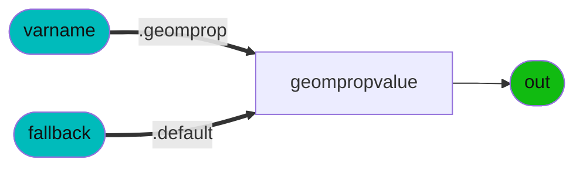

```mermaid
graph LR; 
    IMP_UsdPrimvarReader_boolean_primvar[geompropvalue] --> IMP_UsdPrimvarReader_boolean_out([out])
    style IMP_UsdPrimvarReader_boolean_out fill:#1b1, color:#111
    IMP_UsdPrimvarReader_boolean_varnameINT([varname]) ==.geomprop==> IMP_UsdPrimvarReader_boolean_primvar[geompropvalue]
    style IMP_UsdPrimvarReader_boolean_varnameINT fill:#0bb, color:#111
    IMP_UsdPrimvarReader_boolean_fallbackINT([fallback]) ==.default==> IMP_UsdPrimvarReader_boolean_primvar[geompropvalue]
    style IMP_UsdPrimvarReader_boolean_fallbackINT fill:#0bb, color:#111
```
