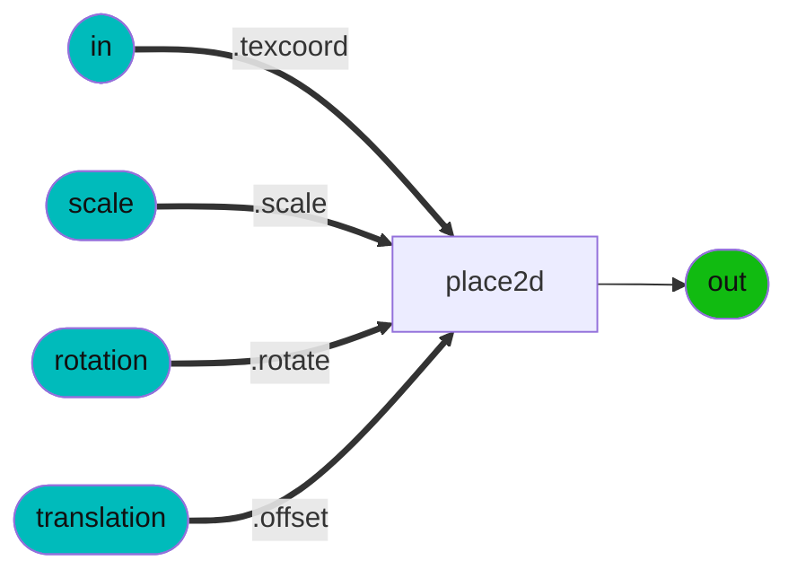

```mermaid
graph LR; 
    IMP_UsdTransform2d_placement[place2d] --> IMP_UsdTransform2d_out([out])
    style IMP_UsdTransform2d_out fill:#1b1, color:#111
    IMP_UsdTransform2d_inINT([in]) ==.texcoord==> IMP_UsdTransform2d_placement[place2d]
    style IMP_UsdTransform2d_inINT fill:#0bb, color:#111
    IMP_UsdTransform2d_scaleINT([scale]) ==.scale==> IMP_UsdTransform2d_placement[place2d]
    style IMP_UsdTransform2d_scaleINT fill:#0bb, color:#111
    IMP_UsdTransform2d_rotationINT([rotation]) ==.rotate==> IMP_UsdTransform2d_placement[place2d]
    style IMP_UsdTransform2d_rotationINT fill:#0bb, color:#111
    IMP_UsdTransform2d_translationINT([translation]) ==.offset==> IMP_UsdTransform2d_placement[place2d]
    style IMP_UsdTransform2d_translationINT fill:#0bb, color:#111
```
