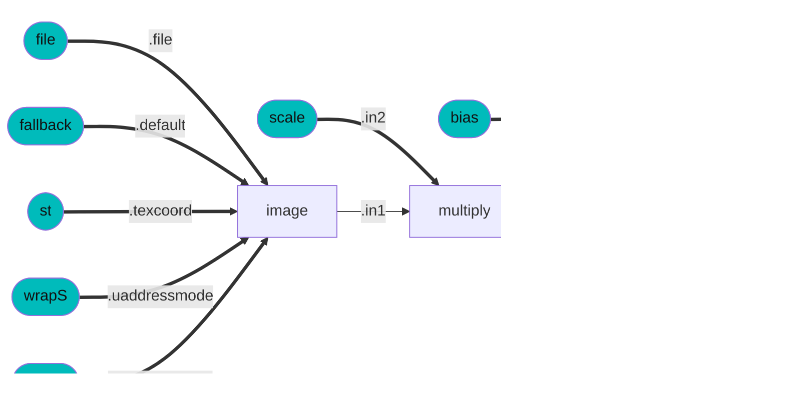

```mermaid
graph LR; 
    IMP_UsdUVTexture_23_image_bias[add] --> IMP_UsdUVTexture_23_r([r])
    style IMP_UsdUVTexture_23_r fill:#1b1, color:#111
    IMP_UsdUVTexture_23_biasINT([bias]) ==.in2==> IMP_UsdUVTexture_23_image_bias[add]
    style IMP_UsdUVTexture_23_biasINT fill:#0bb, color:#111
    IMP_UsdUVTexture_23_image_scale[multiply] --".in1"--> IMP_UsdUVTexture_23_image_bias[add]
    IMP_UsdUVTexture_23_scaleINT([scale]) ==.in2==> IMP_UsdUVTexture_23_image_scale[multiply]
    style IMP_UsdUVTexture_23_scaleINT fill:#0bb, color:#111
    IMP_UsdUVTexture_23_image_reader[image] --".in1"--> IMP_UsdUVTexture_23_image_scale[multiply]
    IMP_UsdUVTexture_23_fileINT([file]) ==.file==> IMP_UsdUVTexture_23_image_reader[image]
    style IMP_UsdUVTexture_23_fileINT fill:#0bb, color:#111
    IMP_UsdUVTexture_23_fallbackINT([fallback]) ==.default==> IMP_UsdUVTexture_23_image_reader[image]
    style IMP_UsdUVTexture_23_fallbackINT fill:#0bb, color:#111
    IMP_UsdUVTexture_23_stINT([st]) ==.texcoord==> IMP_UsdUVTexture_23_image_reader[image]
    style IMP_UsdUVTexture_23_stINT fill:#0bb, color:#111
    IMP_UsdUVTexture_23_wrapSINT([wrapS]) ==.uaddressmode==> IMP_UsdUVTexture_23_image_reader[image]
    style IMP_UsdUVTexture_23_wrapSINT fill:#0bb, color:#111
    IMP_UsdUVTexture_23_wrapTINT([wrapT]) ==.vaddressmode==> IMP_UsdUVTexture_23_image_reader[image]
    style IMP_UsdUVTexture_23_wrapTINT fill:#0bb, color:#111
    IMP_UsdUVTexture_23_image_bias[add] --> IMP_UsdUVTexture_23_g([g])
    style IMP_UsdUVTexture_23_g fill:#1b1, color:#111
    IMP_UsdUVTexture_23_image_bias[add] --> IMP_UsdUVTexture_23_b([b])
    style IMP_UsdUVTexture_23_b fill:#1b1, color:#111
    IMP_UsdUVTexture_23_image_bias[add] --> IMP_UsdUVTexture_23_a([a])
    style IMP_UsdUVTexture_23_a fill:#1b1, color:#111
    IMP_UsdUVTexture_23_image_bias[add] --> IMP_UsdUVTexture_23_rgb([rgb])
    style IMP_UsdUVTexture_23_rgb fill:#1b1, color:#111
```
