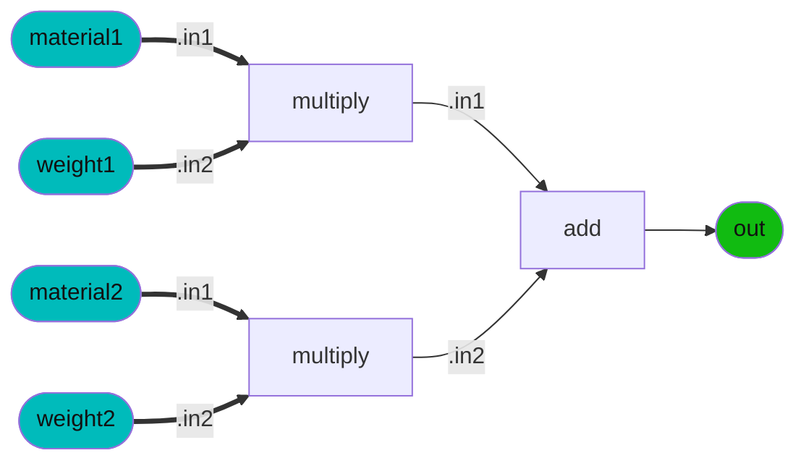

```mermaid
graph LR; 
    NG_lama_add_edf_add1[add] --> NG_lama_add_edf_out([out])
    style NG_lama_add_edf_out fill:#1b1, color:#111
    NG_lama_add_edf_mul1[multiply] --".in1"--> NG_lama_add_edf_add1[add]
    NG_lama_add_edf_material1INT([material1]) ==.in1==> NG_lama_add_edf_mul1[multiply]
    style NG_lama_add_edf_material1INT fill:#0bb, color:#111
    NG_lama_add_edf_weight1INT([weight1]) ==.in2==> NG_lama_add_edf_mul1[multiply]
    style NG_lama_add_edf_weight1INT fill:#0bb, color:#111
    NG_lama_add_edf_mul2[multiply] --".in2"--> NG_lama_add_edf_add1[add]
    NG_lama_add_edf_material2INT([material2]) ==.in1==> NG_lama_add_edf_mul2[multiply]
    style NG_lama_add_edf_material2INT fill:#0bb, color:#111
    NG_lama_add_edf_weight2INT([weight2]) ==.in2==> NG_lama_add_edf_mul2[multiply]
    style NG_lama_add_edf_weight2INT fill:#0bb, color:#111
```
