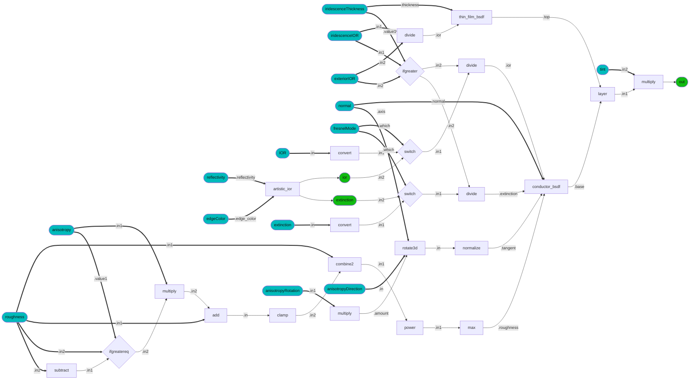

```mermaid
graph LR; 
    IMPL_lama_conductor_tinted_bsdf[multiply] --> IMPL_lama_conductor_out([out])
    style IMPL_lama_conductor_out fill:#1b1, color:#111
    IMPL_lama_conductor_tintINT([tint]) ==.in2==> IMPL_lama_conductor_tinted_bsdf[multiply]
    style IMPL_lama_conductor_tintINT fill:#0bb, color:#111
    IMPL_lama_conductor_thin_film_conductor_bsdf[layer] --".in1"--> IMPL_lama_conductor_tinted_bsdf[multiply]
    IMPL_lama_conductor_thin_film_bsdf[thin_film_bsdf] --".top"--> IMPL_lama_conductor_thin_film_conductor_bsdf[layer]
    IMPL_lama_conductor_iridescenceThicknessINT([iridescenceThickness]) ==.thickness==> IMPL_lama_conductor_thin_film_bsdf[thin_film_bsdf]
    style IMPL_lama_conductor_iridescenceThicknessINT fill:#0bb, color:#111
    IMPL_lama_conductor_iridescence_relative_ior[divide] --".ior"--> IMPL_lama_conductor_thin_film_bsdf[thin_film_bsdf]
    IMPL_lama_conductor_iridescenceIORINT([iridescenceIOR]) ==.in1==> IMPL_lama_conductor_iridescence_relative_ior[divide]
    style IMPL_lama_conductor_iridescenceIORINT fill:#0bb, color:#111
    IMPL_lama_conductor_exteriorIORINT([exteriorIOR]) ==.in2==> IMPL_lama_conductor_iridescence_relative_ior[divide]
    style IMPL_lama_conductor_exteriorIORINT fill:#0bb, color:#111
    IMPL_lama_conductor_conductor_bsdf[conductor_bsdf] --".base"--> IMPL_lama_conductor_thin_film_conductor_bsdf[layer]
    IMPL_lama_conductor_normalINT([normal]) ==.normal==> IMPL_lama_conductor_conductor_bsdf[conductor_bsdf]
    style IMPL_lama_conductor_normalINT fill:#0bb, color:#111
    IMPL_lama_conductor_relative_eta[divide] --".ior"--> IMPL_lama_conductor_conductor_bsdf[conductor_bsdf]
    IMPL_lama_conductor_eta_switch{switch} --".in1"--> IMPL_lama_conductor_relative_eta[divide]
    IMPL_lama_conductor_fresnelModeINT([fresnelMode]) ==.which==> IMPL_lama_conductor_eta_switch[switch]
    style IMPL_lama_conductor_fresnelModeINT fill:#0bb, color:#111
    IMPL_lama_conductor_convert_ior[convert] --".in1"--> IMPL_lama_conductor_eta_switch{switch}
    IMPL_lama_conductor_IORINT([IOR]) ==.in==> IMPL_lama_conductor_convert_ior[convert]
    style IMPL_lama_conductor_IORINT fill:#0bb, color:#111
    IMPL_lama_conductor_artistic_ior[artistic_ior] --> IMPL_lama_conductor_IMPL_lama_conductor_artistic_iorior([ior])
    style IMPL_lama_conductor_IMPL_lama_conductor_artistic_iorior fill:#1b1, color:#111
    IMPL_lama_conductor_IMPL_lama_conductor_artistic_iorior --".in2"--> IMPL_lama_conductor_eta_switch{switch}
    IMPL_lama_conductor_reflectivityINT([reflectivity]) ==.reflectivity==> IMPL_lama_conductor_artistic_ior[artistic_ior]
    style IMPL_lama_conductor_reflectivityINT fill:#0bb, color:#111
    IMPL_lama_conductor_edgeColorINT([edgeColor]) ==.edge_color==> IMPL_lama_conductor_artistic_ior[artistic_ior]
    style IMPL_lama_conductor_edgeColorINT fill:#0bb, color:#111
    IMPL_lama_conductor_exterior_ior_switch{ifgreater} --".in2"--> IMPL_lama_conductor_relative_eta[divide]
    IMPL_lama_conductor_iridescenceIORINT([iridescenceIOR]) ==.in1==> IMPL_lama_conductor_exterior_ior_switch[ifgreater]
    style IMPL_lama_conductor_iridescenceIORINT fill:#0bb, color:#111
    IMPL_lama_conductor_exteriorIORINT([exteriorIOR]) ==.in2==> IMPL_lama_conductor_exterior_ior_switch[ifgreater]
    style IMPL_lama_conductor_exteriorIORINT fill:#0bb, color:#111
    IMPL_lama_conductor_iridescenceThicknessINT([iridescenceThickness]) ==.value1==> IMPL_lama_conductor_exterior_ior_switch[ifgreater]
    style IMPL_lama_conductor_iridescenceThicknessINT fill:#0bb, color:#111
    IMPL_lama_conductor_relative_kappa[divide] --".extinction"--> IMPL_lama_conductor_conductor_bsdf[conductor_bsdf]
    IMPL_lama_conductor_kappa_switch{switch} --".in1"--> IMPL_lama_conductor_relative_kappa[divide]
    IMPL_lama_conductor_fresnelModeINT([fresnelMode]) ==.which==> IMPL_lama_conductor_kappa_switch[switch]
    style IMPL_lama_conductor_fresnelModeINT fill:#0bb, color:#111
    IMPL_lama_conductor_convert_extinction[convert] --".in1"--> IMPL_lama_conductor_kappa_switch{switch}
    IMPL_lama_conductor_extinctionINT([extinction]) ==.in==> IMPL_lama_conductor_convert_extinction[convert]
    style IMPL_lama_conductor_extinctionINT fill:#0bb, color:#111
    IMPL_lama_conductor_artistic_ior[artistic_ior] --> IMPL_lama_conductor_IMPL_lama_conductor_artistic_iorextinction([extinction])
    style IMPL_lama_conductor_IMPL_lama_conductor_artistic_iorextinction fill:#1b1, color:#111
    IMPL_lama_conductor_IMPL_lama_conductor_artistic_iorextinction --".in2"--> IMPL_lama_conductor_kappa_switch{switch}
    IMPL_lama_conductor_exterior_ior_switch{ifgreater} --".in2"--> IMPL_lama_conductor_relative_kappa[divide]
    IMPL_lama_conductor_roughness_anisotropic_squared_clamped[max] --".roughness"--> IMPL_lama_conductor_conductor_bsdf[conductor_bsdf]
    IMPL_lama_conductor_roughness_anisotropic_squared[power] --".in1"--> IMPL_lama_conductor_roughness_anisotropic_squared_clamped[max]
    IMPL_lama_conductor_roughness_linear[combine2] --".in1"--> IMPL_lama_conductor_roughness_anisotropic_squared[power]
    IMPL_lama_conductor_roughnessINT([roughness]) ==.in1==> IMPL_lama_conductor_roughness_linear[combine2]
    style IMPL_lama_conductor_roughnessINT fill:#0bb, color:#111
    IMPL_lama_conductor_roughness_bitangent_clamped[clamp] --".in2"--> IMPL_lama_conductor_roughness_linear[combine2]
    IMPL_lama_conductor_roughness_bitangent[add] --".in"--> IMPL_lama_conductor_roughness_bitangent_clamped[clamp]
    IMPL_lama_conductor_roughnessINT([roughness]) ==.in1==> IMPL_lama_conductor_roughness_bitangent[add]
    style IMPL_lama_conductor_roughnessINT fill:#0bb, color:#111
    IMPL_lama_conductor_roughness_additional[multiply] --".in2"--> IMPL_lama_conductor_roughness_bitangent[add]
    IMPL_lama_conductor_anisotropyINT([anisotropy]) ==.in1==> IMPL_lama_conductor_roughness_additional[multiply]
    style IMPL_lama_conductor_anisotropyINT fill:#0bb, color:#111
    IMPL_lama_conductor_delta{ifgreatereq} --".in2"--> IMPL_lama_conductor_roughness_additional[multiply]
    IMPL_lama_conductor_roughnessINT([roughness]) ==.in2==> IMPL_lama_conductor_delta[ifgreatereq]
    style IMPL_lama_conductor_roughnessINT fill:#0bb, color:#111
    IMPL_lama_conductor_anisotropyINT([anisotropy]) ==.value1==> IMPL_lama_conductor_delta[ifgreatereq]
    style IMPL_lama_conductor_anisotropyINT fill:#0bb, color:#111
    IMPL_lama_conductor_roughness_inverse[subtract] --".in1"--> IMPL_lama_conductor_delta{ifgreatereq}
    IMPL_lama_conductor_roughnessINT([roughness]) ==.in2==> IMPL_lama_conductor_roughness_inverse[subtract]
    style IMPL_lama_conductor_roughnessINT fill:#0bb, color:#111
    IMPL_lama_conductor_tangent_rotate_normalize[normalize] --".tangent"--> IMPL_lama_conductor_conductor_bsdf[conductor_bsdf]
    IMPL_lama_conductor_tangent_rotate[rotate3d] --".in"--> IMPL_lama_conductor_tangent_rotate_normalize[normalize]
    IMPL_lama_conductor_anisotropyDirectionINT([anisotropyDirection]) ==.in==> IMPL_lama_conductor_tangent_rotate[rotate3d]
    style IMPL_lama_conductor_anisotropyDirectionINT fill:#0bb, color:#111
    IMPL_lama_conductor_normalINT([normal]) ==.axis==> IMPL_lama_conductor_tangent_rotate[rotate3d]
    style IMPL_lama_conductor_normalINT fill:#0bb, color:#111
    IMPL_lama_conductor_tangent_rotate_degree[multiply] --".amount"--> IMPL_lama_conductor_tangent_rotate[rotate3d]
    IMPL_lama_conductor_anisotropyRotationINT([anisotropyRotation]) ==.in1==> IMPL_lama_conductor_tangent_rotate_degree[multiply]
    style IMPL_lama_conductor_anisotropyRotationINT fill:#0bb, color:#111
```
