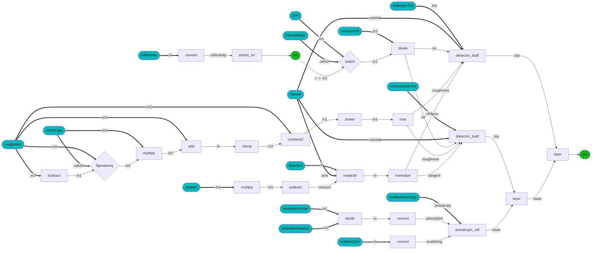

```mermaid
graph LR; 
    IMPL_lama_dielectric_dielectric_bsdf[layer] --> IMPL_lama_dielectric_out([out])
    style IMPL_lama_dielectric_out fill:#1b1, color:#111
    IMPL_lama_dielectric_reflection_bsdf[dielectric_bsdf] --".top"--> IMPL_lama_dielectric_dielectric_bsdf[layer]
    IMPL_lama_dielectric_reflectionTintINT([reflectionTint]) ==.tint==> IMPL_lama_dielectric_reflection_bsdf[dielectric_bsdf]
    style IMPL_lama_dielectric_reflectionTintINT fill:#0bb, color:#111
    IMPL_lama_dielectric_normalINT([normal]) ==.normal==> IMPL_lama_dielectric_reflection_bsdf[dielectric_bsdf]
    style IMPL_lama_dielectric_normalINT fill:#0bb, color:#111
    IMPL_lama_dielectric_relative_ior[divide] --".ior"--> IMPL_lama_dielectric_reflection_bsdf[dielectric_bsdf]
    IMPL_lama_dielectric_exteriorIORINT([exteriorIOR]) ==.in2==> IMPL_lama_dielectric_relative_ior[divide]
    style IMPL_lama_dielectric_exteriorIORINT fill:#0bb, color:#111
    IMPL_lama_dielectric_fresnel_mode_switch{switch} --".in1"--> IMPL_lama_dielectric_relative_ior[divide]
    IMPL_lama_dielectric_IORINT([IOR]) ==.in1==> IMPL_lama_dielectric_fresnel_mode_switch[switch]
    style IMPL_lama_dielectric_IORINT fill:#0bb, color:#111
    IMPL_lama_dielectric_fresnelModeINT([fresnelMode]) ==.which==> IMPL_lama_dielectric_fresnel_mode_switch[switch]
    style IMPL_lama_dielectric_fresnelModeINT fill:#0bb, color:#111
    IMPL_lama_dielectric_artistic_ior[artistic_ior] --> IMPL_lama_dielectric_IMPL_lama_dielectric_artistic_iorior([ior])
    style IMPL_lama_dielectric_IMPL_lama_dielectric_artistic_iorior fill:#1b1, color:#111
    IMPL_lama_dielectric_IMPL_lama_dielectric_artistic_iorior --".r -> .in2"--> IMPL_lama_dielectric_fresnel_mode_switch{switch}
    IMPL_lama_dielectric_reflectivity_color[convert] --".reflectivity"--> IMPL_lama_dielectric_artistic_ior[artistic_ior]
    IMPL_lama_dielectric_reflectivityINT([reflectivity]) ==.in==> IMPL_lama_dielectric_reflectivity_color[convert]
    style IMPL_lama_dielectric_reflectivityINT fill:#0bb, color:#111
    IMPL_lama_dielectric_roughness_anisotropic_squared_clamped[max] --".roughness"--> IMPL_lama_dielectric_reflection_bsdf[dielectric_bsdf]
    IMPL_lama_dielectric_roughness_anisotropic_squared[power] --".in1"--> IMPL_lama_dielectric_roughness_anisotropic_squared_clamped[max]
    IMPL_lama_dielectric_roughness_linear[combine2] --".in1"--> IMPL_lama_dielectric_roughness_anisotropic_squared[power]
    IMPL_lama_dielectric_roughnessINT([roughness]) ==.in1==> IMPL_lama_dielectric_roughness_linear[combine2]
    style IMPL_lama_dielectric_roughnessINT fill:#0bb, color:#111
    IMPL_lama_dielectric_roughness_bitangent_clamped[clamp] --".in2"--> IMPL_lama_dielectric_roughness_linear[combine2]
    IMPL_lama_dielectric_roughness_bitangent[add] --".in"--> IMPL_lama_dielectric_roughness_bitangent_clamped[clamp]
    IMPL_lama_dielectric_roughnessINT([roughness]) ==.in1==> IMPL_lama_dielectric_roughness_bitangent[add]
    style IMPL_lama_dielectric_roughnessINT fill:#0bb, color:#111
    IMPL_lama_dielectric_roughness_additional[multiply] --".in2"--> IMPL_lama_dielectric_roughness_bitangent[add]
    IMPL_lama_dielectric_anisotropyINT([anisotropy]) ==.in1==> IMPL_lama_dielectric_roughness_additional[multiply]
    style IMPL_lama_dielectric_anisotropyINT fill:#0bb, color:#111
    IMPL_lama_dielectric_delta{ifgreatereq} --".in2"--> IMPL_lama_dielectric_roughness_additional[multiply]
    IMPL_lama_dielectric_roughnessINT([roughness]) ==.in2==> IMPL_lama_dielectric_delta[ifgreatereq]
    style IMPL_lama_dielectric_roughnessINT fill:#0bb, color:#111
    IMPL_lama_dielectric_anisotropyINT([anisotropy]) ==.value1==> IMPL_lama_dielectric_delta[ifgreatereq]
    style IMPL_lama_dielectric_anisotropyINT fill:#0bb, color:#111
    IMPL_lama_dielectric_roughness_inverse[subtract] --".in1"--> IMPL_lama_dielectric_delta{ifgreatereq}
    IMPL_lama_dielectric_roughnessINT([roughness]) ==.in2==> IMPL_lama_dielectric_roughness_inverse[subtract]
    style IMPL_lama_dielectric_roughnessINT fill:#0bb, color:#111
    IMPL_lama_dielectric_tangent_rotate_normalize[normalize] --".tangent"--> IMPL_lama_dielectric_reflection_bsdf[dielectric_bsdf]
    IMPL_lama_dielectric_tangent_rotate[rotate3d] --".in"--> IMPL_lama_dielectric_tangent_rotate_normalize[normalize]
    IMPL_lama_dielectric_directionINT([direction]) ==.in==> IMPL_lama_dielectric_tangent_rotate[rotate3d]
    style IMPL_lama_dielectric_directionINT fill:#0bb, color:#111
    IMPL_lama_dielectric_normalINT([normal]) ==.axis==> IMPL_lama_dielectric_tangent_rotate[rotate3d]
    style IMPL_lama_dielectric_normalINT fill:#0bb, color:#111
    IMPL_lama_dielectric_tangent_rotate_degree_offset[subtract] --".amount"--> IMPL_lama_dielectric_tangent_rotate[rotate3d]
    IMPL_lama_dielectric_tangent_rotate_degree[multiply] --".in1"--> IMPL_lama_dielectric_tangent_rotate_degree_offset[subtract]
    IMPL_lama_dielectric_rotationINT([rotation]) ==.in1==> IMPL_lama_dielectric_tangent_rotate_degree[multiply]
    style IMPL_lama_dielectric_rotationINT fill:#0bb, color:#111
    IMPL_lama_dielectric_transmission_layer[layer] --".base"--> IMPL_lama_dielectric_dielectric_bsdf[layer]
    IMPL_lama_dielectric_transmission_bsdf[dielectric_bsdf] --".top"--> IMPL_lama_dielectric_transmission_layer[layer]
    IMPL_lama_dielectric_transmissionTintINT([transmissionTint]) ==.tint==> IMPL_lama_dielectric_transmission_bsdf[dielectric_bsdf]
    style IMPL_lama_dielectric_transmissionTintINT fill:#0bb, color:#111
    IMPL_lama_dielectric_normalINT([normal]) ==.normal==> IMPL_lama_dielectric_transmission_bsdf[dielectric_bsdf]
    style IMPL_lama_dielectric_normalINT fill:#0bb, color:#111
    IMPL_lama_dielectric_relative_ior[divide] --".ior"--> IMPL_lama_dielectric_transmission_bsdf[dielectric_bsdf]
    IMPL_lama_dielectric_roughness_anisotropic_squared_clamped[max] --".roughness"--> IMPL_lama_dielectric_transmission_bsdf[dielectric_bsdf]
    IMPL_lama_dielectric_tangent_rotate_normalize[normalize] --".tangent"--> IMPL_lama_dielectric_transmission_bsdf[dielectric_bsdf]
    IMPL_lama_dielectric_interior_vdf[anisotropic_vdf] --".base"--> IMPL_lama_dielectric_transmission_layer[layer]
    IMPL_lama_dielectric_scatterAnisotropyINT([scatterAnisotropy]) ==.anisotropy==> IMPL_lama_dielectric_interior_vdf[anisotropic_vdf]
    style IMPL_lama_dielectric_scatterAnisotropyINT fill:#0bb, color:#111
    IMPL_lama_dielectric_absorption_vector[convert] --".absorption"--> IMPL_lama_dielectric_interior_vdf[anisotropic_vdf]
    IMPL_lama_dielectric_absorption[divide] --".in"--> IMPL_lama_dielectric_absorption_vector[convert]
    IMPL_lama_dielectric_absorptionColorINT([absorptionColor]) ==.in1==> IMPL_lama_dielectric_absorption[divide]
    style IMPL_lama_dielectric_absorptionColorINT fill:#0bb, color:#111
    IMPL_lama_dielectric_absorptionRadiusINT([absorptionRadius]) ==.in2==> IMPL_lama_dielectric_absorption[divide]
    style IMPL_lama_dielectric_absorptionRadiusINT fill:#0bb, color:#111
    IMPL_lama_dielectric_scatter_vector[convert] --".scattering"--> IMPL_lama_dielectric_interior_vdf[anisotropic_vdf]
    IMPL_lama_dielectric_scatterColorINT([scatterColor]) ==.in==> IMPL_lama_dielectric_scatter_vector[convert]
    style IMPL_lama_dielectric_scatterColorINT fill:#0bb, color:#111
```
