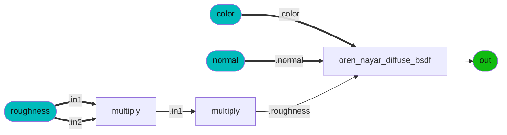

```mermaid
graph LR; 
    NG_lama_diffuse_oren_nayar[oren_nayar_diffuse_bsdf] --> NG_lama_diffuse_out([out])
    style NG_lama_diffuse_out fill:#1b1, color:#111
    NG_lama_diffuse_colorINT([color]) ==.color==> NG_lama_diffuse_oren_nayar[oren_nayar_diffuse_bsdf]
    style NG_lama_diffuse_colorINT fill:#0bb, color:#111
    NG_lama_diffuse_normalINT([normal]) ==.normal==> NG_lama_diffuse_oren_nayar[oren_nayar_diffuse_bsdf]
    style NG_lama_diffuse_normalINT fill:#0bb, color:#111
    NG_lama_diffuse_half_roughness_squared[multiply] --".roughness"--> NG_lama_diffuse_oren_nayar[oren_nayar_diffuse_bsdf]
    NG_lama_diffuse_roughness_squared[multiply] --".in1"--> NG_lama_diffuse_half_roughness_squared[multiply]
    NG_lama_diffuse_roughnessINT([roughness]) ==.in1==> NG_lama_diffuse_roughness_squared[multiply]
    style NG_lama_diffuse_roughnessINT fill:#0bb, color:#111
    NG_lama_diffuse_roughnessINT([roughness]) ==.in2==> NG_lama_diffuse_roughness_squared[multiply]
    style NG_lama_diffuse_roughnessINT fill:#0bb, color:#111
```
