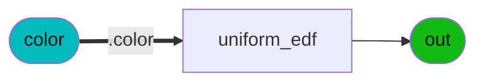

```mermaid
graph LR; 
    IMPL_lama_emission_emission[uniform_edf] --> IMPL_lama_emission_out([out])
    style IMPL_lama_emission_out fill:#1b1, color:#111
    IMPL_lama_emission_colorINT([color]) ==.color==> IMPL_lama_emission_emission[uniform_edf]
    style IMPL_lama_emission_colorINT fill:#0bb, color:#111
```
