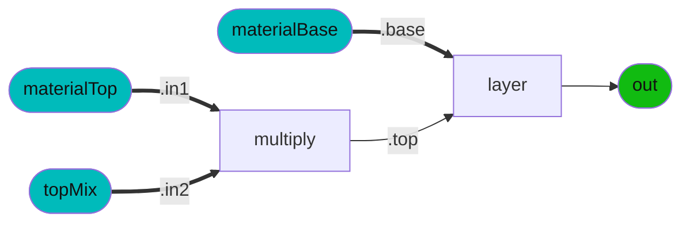

```mermaid
graph LR; 
    NG_lama_layer_bsdf_layer[layer] --> NG_lama_layer_bsdf_out([out])
    style NG_lama_layer_bsdf_out fill:#1b1, color:#111
    NG_lama_layer_bsdf_materialBaseINT([materialBase]) ==.base==> NG_lama_layer_bsdf_layer[layer]
    style NG_lama_layer_bsdf_materialBaseINT fill:#0bb, color:#111
    NG_lama_layer_bsdf_mul[multiply] --".top"--> NG_lama_layer_bsdf_layer[layer]
    NG_lama_layer_bsdf_materialTopINT([materialTop]) ==.in1==> NG_lama_layer_bsdf_mul[multiply]
    style NG_lama_layer_bsdf_materialTopINT fill:#0bb, color:#111
    NG_lama_layer_bsdf_topMixINT([topMix]) ==.in2==> NG_lama_layer_bsdf_mul[multiply]
    style NG_lama_layer_bsdf_topMixINT fill:#0bb, color:#111
```
