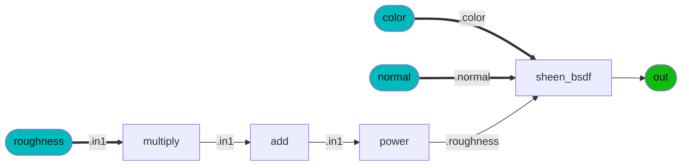

```mermaid
graph LR; 
    IMPL_lama_sheen_sheen_bsdf[sheen_bsdf] --> IMPL_lama_sheen_out([out])
    style IMPL_lama_sheen_out fill:#1b1, color:#111
    IMPL_lama_sheen_colorINT([color]) ==.color==> IMPL_lama_sheen_sheen_bsdf[sheen_bsdf]
    style IMPL_lama_sheen_colorINT fill:#0bb, color:#111
    IMPL_lama_sheen_normalINT([normal]) ==.normal==> IMPL_lama_sheen_sheen_bsdf[sheen_bsdf]
    style IMPL_lama_sheen_normalINT fill:#0bb, color:#111
    IMPL_lama_sheen_roughness_squared[power] --".roughness"--> IMPL_lama_sheen_sheen_bsdf[sheen_bsdf]
    IMPL_lama_sheen_roughness_remapped[add] --".in1"--> IMPL_lama_sheen_roughness_squared[power]
    IMPL_lama_sheen_roughness_compressed[multiply] --".in1"--> IMPL_lama_sheen_roughness_remapped[add]
    IMPL_lama_sheen_roughnessINT([roughness]) ==.in1==> IMPL_lama_sheen_roughness_compressed[multiply]
    style IMPL_lama_sheen_roughnessINT fill:#0bb, color:#111
```
