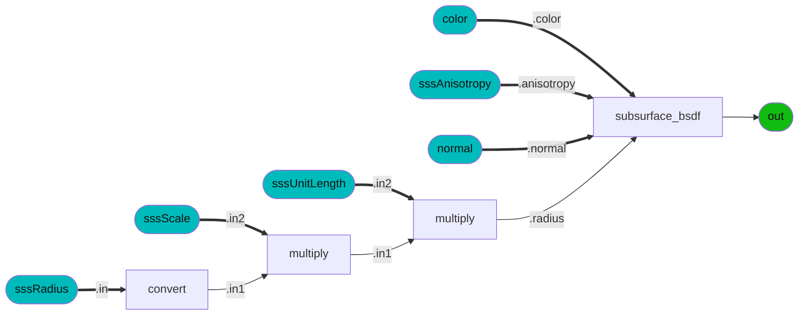

```mermaid
graph LR; 
    IMPL_lama_sss_subsurface_bsdf[subsurface_bsdf] --> IMPL_lama_sss_out([out])
    style IMPL_lama_sss_out fill:#1b1, color:#111
    IMPL_lama_sss_colorINT([color]) ==.color==> IMPL_lama_sss_subsurface_bsdf[subsurface_bsdf]
    style IMPL_lama_sss_colorINT fill:#0bb, color:#111
    IMPL_lama_sss_sssAnisotropyINT([sssAnisotropy]) ==.anisotropy==> IMPL_lama_sss_subsurface_bsdf[subsurface_bsdf]
    style IMPL_lama_sss_sssAnisotropyINT fill:#0bb, color:#111
    IMPL_lama_sss_normalINT([normal]) ==.normal==> IMPL_lama_sss_subsurface_bsdf[subsurface_bsdf]
    style IMPL_lama_sss_normalINT fill:#0bb, color:#111
    IMPL_lama_sss_subsurface_multiply_unitlength[multiply] --".radius"--> IMPL_lama_sss_subsurface_bsdf[subsurface_bsdf]
    IMPL_lama_sss_sssUnitLengthINT([sssUnitLength]) ==.in2==> IMPL_lama_sss_subsurface_multiply_unitlength[multiply]
    style IMPL_lama_sss_sssUnitLengthINT fill:#0bb, color:#111
    IMPL_lama_sss_subsurface_radius_scaled[multiply] --".in1"--> IMPL_lama_sss_subsurface_multiply_unitlength[multiply]
    IMPL_lama_sss_sssScaleINT([sssScale]) ==.in2==> IMPL_lama_sss_subsurface_radius_scaled[multiply]
    style IMPL_lama_sss_sssScaleINT fill:#0bb, color:#111
    IMPL_lama_sss_subsurface_radius_vector[convert] --".in1"--> IMPL_lama_sss_subsurface_radius_scaled[multiply]
    IMPL_lama_sss_sssRadiusINT([sssRadius]) ==.in==> IMPL_lama_sss_subsurface_radius_vector[convert]
    style IMPL_lama_sss_sssRadiusINT fill:#0bb, color:#111
```
