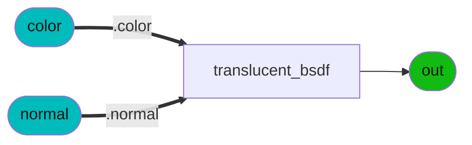

```mermaid
graph LR; 
    NG_lama_translucent_translucent_bsdf1[translucent_bsdf] --> NG_lama_translucent_out([out])
    style NG_lama_translucent_out fill:#1b1, color:#111
    NG_lama_translucent_colorINT([color]) ==.color==> NG_lama_translucent_translucent_bsdf1[translucent_bsdf]
    style NG_lama_translucent_colorINT fill:#0bb, color:#111
    NG_lama_translucent_normalINT([normal]) ==.normal==> NG_lama_translucent_translucent_bsdf1[translucent_bsdf]
    style NG_lama_translucent_normalINT fill:#0bb, color:#111
```
