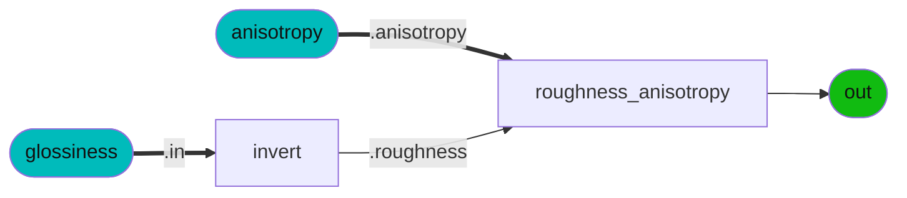

```mermaid
graph LR; 
    IMP_glossiness_anisotropy_roughness1[roughness_anisotropy] --> IMP_glossiness_anisotropy_out([out])
    style IMP_glossiness_anisotropy_out fill:#1b1, color:#111
    IMP_glossiness_anisotropy_anisotropyINT([anisotropy]) ==.anisotropy==> IMP_glossiness_anisotropy_roughness1[roughness_anisotropy]
    style IMP_glossiness_anisotropy_anisotropyINT fill:#0bb, color:#111
    IMP_glossiness_anisotropy_invert1[invert] --".roughness"--> IMP_glossiness_anisotropy_roughness1[roughness_anisotropy]
    IMP_glossiness_anisotropy_glossinessINT([glossiness]) ==.in==> IMP_glossiness_anisotropy_invert1[invert]
    style IMP_glossiness_anisotropy_glossinessINT fill:#0bb, color:#111
```
