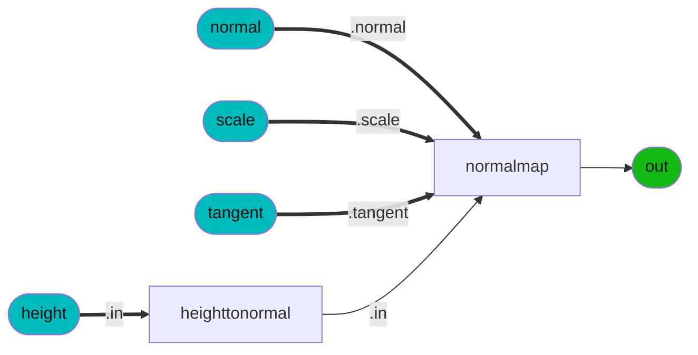

```mermaid
graph LR; 
    NG_bump_vector3_N_normalmap[normalmap] --> NG_bump_vector3_out([out])
    style NG_bump_vector3_out fill:#1b1, color:#111
    NG_bump_vector3_normalINT([normal]) ==.normal==> NG_bump_vector3_N_normalmap[normalmap]
    style NG_bump_vector3_normalINT fill:#0bb, color:#111
    NG_bump_vector3_scaleINT([scale]) ==.scale==> NG_bump_vector3_N_normalmap[normalmap]
    style NG_bump_vector3_scaleINT fill:#0bb, color:#111
    NG_bump_vector3_tangentINT([tangent]) ==.tangent==> NG_bump_vector3_N_normalmap[normalmap]
    style NG_bump_vector3_tangentINT fill:#0bb, color:#111
    NG_bump_vector3_N_heighttonormal[heighttonormal] --".in"--> NG_bump_vector3_N_normalmap[normalmap]
    NG_bump_vector3_heightINT([height]) ==.in==> NG_bump_vector3_N_heighttonormal[heighttonormal]
    style NG_bump_vector3_heightINT fill:#0bb, color:#111
```
