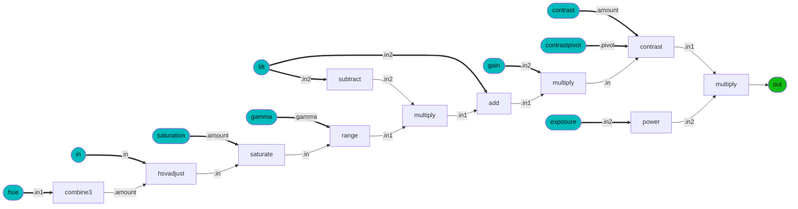

```mermaid
graph LR; 
    NG_colorcorrect_color3_N_exposure[multiply] --> NG_colorcorrect_color3_out([out])
    style NG_colorcorrect_color3_out fill:#1b1, color:#111
    NG_colorcorrect_color3_N_contrast[contrast] --".in1"--> NG_colorcorrect_color3_N_exposure[multiply]
    NG_colorcorrect_color3_contrastINT([contrast]) ==.amount==> NG_colorcorrect_color3_N_contrast[contrast]
    style NG_colorcorrect_color3_contrastINT fill:#0bb, color:#111
    NG_colorcorrect_color3_contrastpivotINT([contrastpivot]) ==.pivot==> NG_colorcorrect_color3_N_contrast[contrast]
    style NG_colorcorrect_color3_contrastpivotINT fill:#0bb, color:#111
    NG_colorcorrect_color3_N_gain[multiply] --".in"--> NG_colorcorrect_color3_N_contrast[contrast]
    NG_colorcorrect_color3_gainINT([gain]) ==.in2==> NG_colorcorrect_color3_N_gain[multiply]
    style NG_colorcorrect_color3_gainINT fill:#0bb, color:#111
    NG_colorcorrect_color3_N_liftadd[add] --".in1"--> NG_colorcorrect_color3_N_gain[multiply]
    NG_colorcorrect_color3_liftINT([lift]) ==.in2==> NG_colorcorrect_color3_N_liftadd[add]
    style NG_colorcorrect_color3_liftINT fill:#0bb, color:#111
    NG_colorcorrect_color3_N_liftmult[multiply] --".in1"--> NG_colorcorrect_color3_N_liftadd[add]
    NG_colorcorrect_color3_N_gamma[range] --".in1"--> NG_colorcorrect_color3_N_liftmult[multiply]
    NG_colorcorrect_color3_gammaINT([gamma]) ==.gamma==> NG_colorcorrect_color3_N_gamma[range]
    style NG_colorcorrect_color3_gammaINT fill:#0bb, color:#111
    NG_colorcorrect_color3_N_saturation[saturate] --".in"--> NG_colorcorrect_color3_N_gamma[range]
    NG_colorcorrect_color3_saturationINT([saturation]) ==.amount==> NG_colorcorrect_color3_N_saturation[saturate]
    style NG_colorcorrect_color3_saturationINT fill:#0bb, color:#111
    NG_colorcorrect_color3_N_hsvadjust[hsvadjust] --".in"--> NG_colorcorrect_color3_N_saturation[saturate]
    NG_colorcorrect_color3_inINT([in]) ==.in==> NG_colorcorrect_color3_N_hsvadjust[hsvadjust]
    style NG_colorcorrect_color3_inINT fill:#0bb, color:#111
    NG_colorcorrect_color3_N_parm2hue[combine3] --".amount"--> NG_colorcorrect_color3_N_hsvadjust[hsvadjust]
    NG_colorcorrect_color3_hueINT([hue]) ==.in1==> NG_colorcorrect_color3_N_parm2hue[combine3]
    style NG_colorcorrect_color3_hueINT fill:#0bb, color:#111
    NG_colorcorrect_color3_N_liftsubtract[subtract] --".in2"--> NG_colorcorrect_color3_N_liftmult[multiply]
    NG_colorcorrect_color3_liftINT([lift]) ==.in2==> NG_colorcorrect_color3_N_liftsubtract[subtract]
    style NG_colorcorrect_color3_liftINT fill:#0bb, color:#111
    NG_colorcorrect_color3_N_exposurepwr[power] --".in2"--> NG_colorcorrect_color3_N_exposure[multiply]
    NG_colorcorrect_color3_exposureINT([exposure]) ==.in2==> NG_colorcorrect_color3_N_exposurepwr[power]
    style NG_colorcorrect_color3_exposureINT fill:#0bb, color:#111
```
