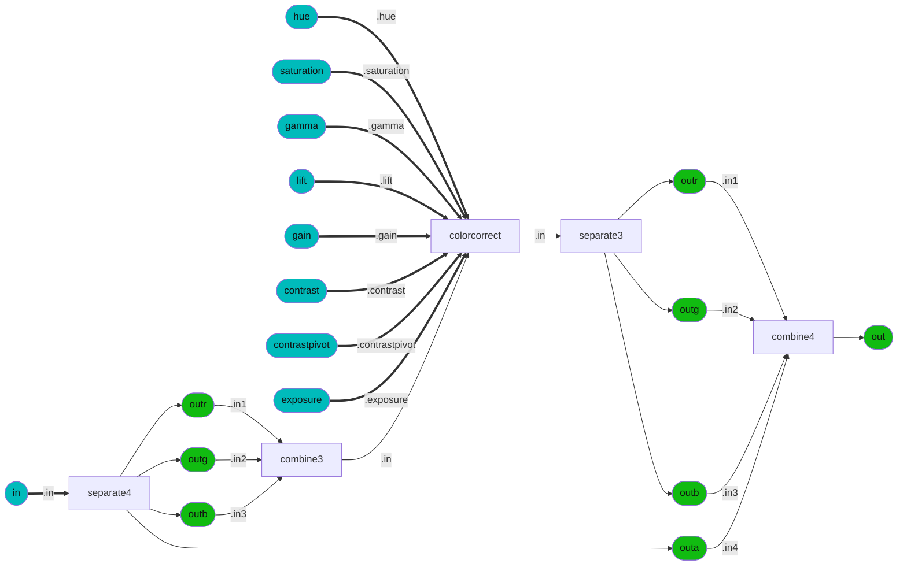

```mermaid
graph LR; 
    NG_colorcorrect_color4_N_combine_with_alpha[combine4] --> NG_colorcorrect_color4_out([out])
    style NG_colorcorrect_color4_out fill:#1b1, color:#111
    NG_colorcorrect_color4_N_split_color[separate3] --> NG_colorcorrect_color4_NG_colorcorrect_color4_N_split_coloroutr([outr])
    style NG_colorcorrect_color4_NG_colorcorrect_color4_N_split_coloroutr fill:#1b1, color:#111
    NG_colorcorrect_color4_NG_colorcorrect_color4_N_split_coloroutr --".in1"--> NG_colorcorrect_color4_N_combine_with_alpha[combine4]
    NG_colorcorrect_color4_N_colorcorrect[colorcorrect] --".in"--> NG_colorcorrect_color4_N_split_color[separate3]
    NG_colorcorrect_color4_hueINT([hue]) ==.hue==> NG_colorcorrect_color4_N_colorcorrect[colorcorrect]
    style NG_colorcorrect_color4_hueINT fill:#0bb, color:#111
    NG_colorcorrect_color4_saturationINT([saturation]) ==.saturation==> NG_colorcorrect_color4_N_colorcorrect[colorcorrect]
    style NG_colorcorrect_color4_saturationINT fill:#0bb, color:#111
    NG_colorcorrect_color4_gammaINT([gamma]) ==.gamma==> NG_colorcorrect_color4_N_colorcorrect[colorcorrect]
    style NG_colorcorrect_color4_gammaINT fill:#0bb, color:#111
    NG_colorcorrect_color4_liftINT([lift]) ==.lift==> NG_colorcorrect_color4_N_colorcorrect[colorcorrect]
    style NG_colorcorrect_color4_liftINT fill:#0bb, color:#111
    NG_colorcorrect_color4_gainINT([gain]) ==.gain==> NG_colorcorrect_color4_N_colorcorrect[colorcorrect]
    style NG_colorcorrect_color4_gainINT fill:#0bb, color:#111
    NG_colorcorrect_color4_contrastINT([contrast]) ==.contrast==> NG_colorcorrect_color4_N_colorcorrect[colorcorrect]
    style NG_colorcorrect_color4_contrastINT fill:#0bb, color:#111
    NG_colorcorrect_color4_contrastpivotINT([contrastpivot]) ==.contrastpivot==> NG_colorcorrect_color4_N_colorcorrect[colorcorrect]
    style NG_colorcorrect_color4_contrastpivotINT fill:#0bb, color:#111
    NG_colorcorrect_color4_exposureINT([exposure]) ==.exposure==> NG_colorcorrect_color4_N_colorcorrect[colorcorrect]
    style NG_colorcorrect_color4_exposureINT fill:#0bb, color:#111
    NG_colorcorrect_color4_N_combine_color[combine3] --".in"--> NG_colorcorrect_color4_N_colorcorrect[colorcorrect]
    NG_colorcorrect_color4_N_split_color4[separate4] --> NG_colorcorrect_color4_NG_colorcorrect_color4_N_split_color4outr([outr])
    style NG_colorcorrect_color4_NG_colorcorrect_color4_N_split_color4outr fill:#1b1, color:#111
    NG_colorcorrect_color4_NG_colorcorrect_color4_N_split_color4outr --".in1"--> NG_colorcorrect_color4_N_combine_color[combine3]
    NG_colorcorrect_color4_inINT([in]) ==.in==> NG_colorcorrect_color4_N_split_color4[separate4]
    style NG_colorcorrect_color4_inINT fill:#0bb, color:#111
    NG_colorcorrect_color4_N_split_color4[separate4] --> NG_colorcorrect_color4_NG_colorcorrect_color4_N_split_color4outg([outg])
    style NG_colorcorrect_color4_NG_colorcorrect_color4_N_split_color4outg fill:#1b1, color:#111
    NG_colorcorrect_color4_NG_colorcorrect_color4_N_split_color4outg --".in2"--> NG_colorcorrect_color4_N_combine_color[combine3]
    NG_colorcorrect_color4_N_split_color4[separate4] --> NG_colorcorrect_color4_NG_colorcorrect_color4_N_split_color4outb([outb])
    style NG_colorcorrect_color4_NG_colorcorrect_color4_N_split_color4outb fill:#1b1, color:#111
    NG_colorcorrect_color4_NG_colorcorrect_color4_N_split_color4outb --".in3"--> NG_colorcorrect_color4_N_combine_color[combine3]
    NG_colorcorrect_color4_N_split_color[separate3] --> NG_colorcorrect_color4_NG_colorcorrect_color4_N_split_coloroutg([outg])
    style NG_colorcorrect_color4_NG_colorcorrect_color4_N_split_coloroutg fill:#1b1, color:#111
    NG_colorcorrect_color4_NG_colorcorrect_color4_N_split_coloroutg --".in2"--> NG_colorcorrect_color4_N_combine_with_alpha[combine4]
    NG_colorcorrect_color4_N_split_color[separate3] --> NG_colorcorrect_color4_NG_colorcorrect_color4_N_split_coloroutb([outb])
    style NG_colorcorrect_color4_NG_colorcorrect_color4_N_split_coloroutb fill:#1b1, color:#111
    NG_colorcorrect_color4_NG_colorcorrect_color4_N_split_coloroutb --".in3"--> NG_colorcorrect_color4_N_combine_with_alpha[combine4]
    NG_colorcorrect_color4_N_split_color4[separate4] --> NG_colorcorrect_color4_NG_colorcorrect_color4_N_split_color4outa([outa])
    style NG_colorcorrect_color4_NG_colorcorrect_color4_N_split_color4outa fill:#1b1, color:#111
    NG_colorcorrect_color4_NG_colorcorrect_color4_N_split_color4outa --".in4"--> NG_colorcorrect_color4_N_combine_with_alpha[combine4]
```
