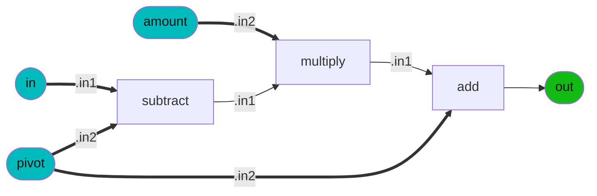

```mermaid
graph LR; 
    NG_contrast_float_N_add_float[add] --> NG_contrast_float_out([out])
    style NG_contrast_float_out fill:#1b1, color:#111
    NG_contrast_float_pivotINT([pivot]) ==.in2==> NG_contrast_float_N_add_float[add]
    style NG_contrast_float_pivotINT fill:#0bb, color:#111
    NG_contrast_float_N_mul_float[multiply] --".in1"--> NG_contrast_float_N_add_float[add]
    NG_contrast_float_amountINT([amount]) ==.in2==> NG_contrast_float_N_mul_float[multiply]
    style NG_contrast_float_amountINT fill:#0bb, color:#111
    NG_contrast_float_N_sub_float[subtract] --".in1"--> NG_contrast_float_N_mul_float[multiply]
    NG_contrast_float_inINT([in]) ==.in1==> NG_contrast_float_N_sub_float[subtract]
    style NG_contrast_float_inINT fill:#0bb, color:#111
    NG_contrast_float_pivotINT([pivot]) ==.in2==> NG_contrast_float_N_sub_float[subtract]
    style NG_contrast_float_pivotINT fill:#0bb, color:#111
```
