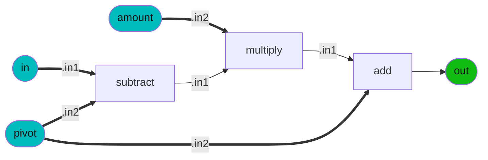

```mermaid
graph LR; 
    NG_contrast_vector2_N_add_vector2[add] --> NG_contrast_vector2_out([out])
    style NG_contrast_vector2_out fill:#1b1, color:#111
    NG_contrast_vector2_pivotINT([pivot]) ==.in2==> NG_contrast_vector2_N_add_vector2[add]
    style NG_contrast_vector2_pivotINT fill:#0bb, color:#111
    NG_contrast_vector2_N_mul_vector2[multiply] --".in1"--> NG_contrast_vector2_N_add_vector2[add]
    NG_contrast_vector2_amountINT([amount]) ==.in2==> NG_contrast_vector2_N_mul_vector2[multiply]
    style NG_contrast_vector2_amountINT fill:#0bb, color:#111
    NG_contrast_vector2_N_sub_vector2[subtract] --".in1"--> NG_contrast_vector2_N_mul_vector2[multiply]
    NG_contrast_vector2_inINT([in]) ==.in1==> NG_contrast_vector2_N_sub_vector2[subtract]
    style NG_contrast_vector2_inINT fill:#0bb, color:#111
    NG_contrast_vector2_pivotINT([pivot]) ==.in2==> NG_contrast_vector2_N_sub_vector2[subtract]
    style NG_contrast_vector2_pivotINT fill:#0bb, color:#111
```
