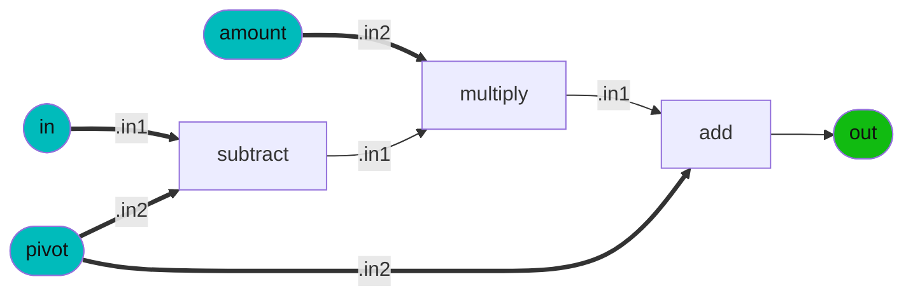

```mermaid
graph LR; 
    NG_contrast_vector3FA_N_add_vector3FA[add] --> NG_contrast_vector3FA_out([out])
    style NG_contrast_vector3FA_out fill:#1b1, color:#111
    NG_contrast_vector3FA_pivotINT([pivot]) ==.in2==> NG_contrast_vector3FA_N_add_vector3FA[add]
    style NG_contrast_vector3FA_pivotINT fill:#0bb, color:#111
    NG_contrast_vector3FA_N_mul_vector3FA[multiply] --".in1"--> NG_contrast_vector3FA_N_add_vector3FA[add]
    NG_contrast_vector3FA_amountINT([amount]) ==.in2==> NG_contrast_vector3FA_N_mul_vector3FA[multiply]
    style NG_contrast_vector3FA_amountINT fill:#0bb, color:#111
    NG_contrast_vector3FA_N_sub_vector3FA[subtract] --".in1"--> NG_contrast_vector3FA_N_mul_vector3FA[multiply]
    NG_contrast_vector3FA_inINT([in]) ==.in1==> NG_contrast_vector3FA_N_sub_vector3FA[subtract]
    style NG_contrast_vector3FA_inINT fill:#0bb, color:#111
    NG_contrast_vector3FA_pivotINT([pivot]) ==.in2==> NG_contrast_vector3FA_N_sub_vector3FA[subtract]
    style NG_contrast_vector3FA_pivotINT fill:#0bb, color:#111
```
