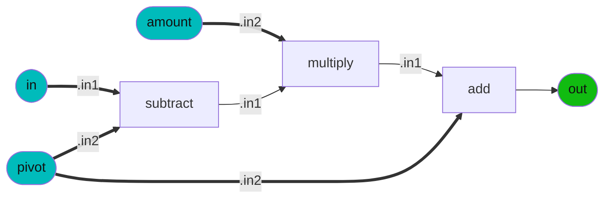

```mermaid
graph LR; 
    NG_contrast_vector4_N_add_vector4[add] --> NG_contrast_vector4_out([out])
    style NG_contrast_vector4_out fill:#1b1, color:#111
    NG_contrast_vector4_pivotINT([pivot]) ==.in2==> NG_contrast_vector4_N_add_vector4[add]
    style NG_contrast_vector4_pivotINT fill:#0bb, color:#111
    NG_contrast_vector4_N_mul_vector4[multiply] --".in1"--> NG_contrast_vector4_N_add_vector4[add]
    NG_contrast_vector4_amountINT([amount]) ==.in2==> NG_contrast_vector4_N_mul_vector4[multiply]
    style NG_contrast_vector4_amountINT fill:#0bb, color:#111
    NG_contrast_vector4_N_sub_vector4[subtract] --".in1"--> NG_contrast_vector4_N_mul_vector4[multiply]
    NG_contrast_vector4_inINT([in]) ==.in1==> NG_contrast_vector4_N_sub_vector4[subtract]
    style NG_contrast_vector4_inINT fill:#0bb, color:#111
    NG_contrast_vector4_pivotINT([pivot]) ==.in2==> NG_contrast_vector4_N_sub_vector4[subtract]
    style NG_contrast_vector4_pivotINT fill:#0bb, color:#111
```
