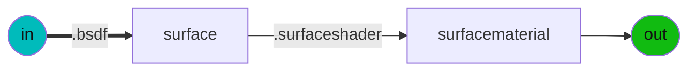

```mermaid
graph LR; 
    NG_convert_BSDF_material_surfacematerial[surfacematerial] --> NG_convert_BSDF_material_out([out])
    style NG_convert_BSDF_material_out fill:#1b1, color:#111
    NG_convert_BSDF_material_surface[surface] --".surfaceshader"--> NG_convert_BSDF_material_surfacematerial[surfacematerial]
    NG_convert_BSDF_material_inINT([in]) ==.bsdf==> NG_convert_BSDF_material_surface[surface]
    style NG_convert_BSDF_material_inINT fill:#0bb, color:#111
```
