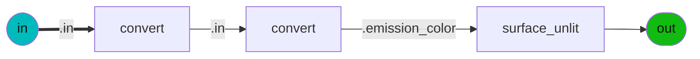

```mermaid
graph LR; 
    NG_convert_boolean_surfaceshader_surface[surface_unlit] --> NG_convert_boolean_surfaceshader_out([out])
    style NG_convert_boolean_surfaceshader_out fill:#1b1, color:#111
    NG_convert_boolean_surfaceshader_float_to_color3[convert] --".emission_color"--> NG_convert_boolean_surfaceshader_surface[surface_unlit]
    NG_convert_boolean_surfaceshader_bool_to_float[convert] --".in"--> NG_convert_boolean_surfaceshader_float_to_color3[convert]
    NG_convert_boolean_surfaceshader_inINT([in]) ==.in==> NG_convert_boolean_surfaceshader_bool_to_float[convert]
    style NG_convert_boolean_surfaceshader_inINT fill:#0bb, color:#111
```
