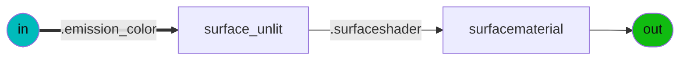

```mermaid
graph LR; 
    NG_convert_color3_material_surfacematerial[surfacematerial] --> NG_convert_color3_material_out([out])
    style NG_convert_color3_material_out fill:#1b1, color:#111
    NG_convert_color3_material_surface_unlit[surface_unlit] --".surfaceshader"--> NG_convert_color3_material_surfacematerial[surfacematerial]
    NG_convert_color3_material_inINT([in]) ==.emission_color==> NG_convert_color3_material_surface_unlit[surface_unlit]
    style NG_convert_color3_material_inINT fill:#0bb, color:#111
```
