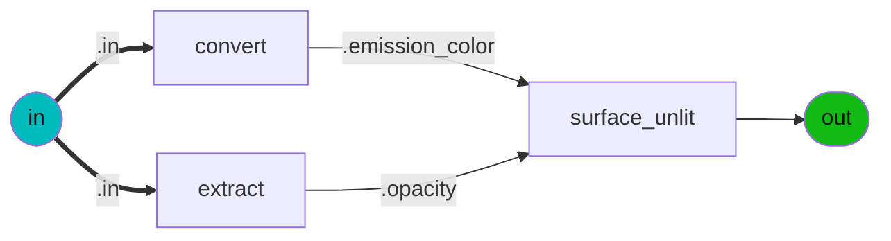

```mermaid
graph LR; 
    NG_convert_color4_surfaceshader_surface[surface_unlit] --> NG_convert_color4_surfaceshader_out([out])
    style NG_convert_color4_surfaceshader_out fill:#1b1, color:#111
    NG_convert_color4_surfaceshader_convert[convert] --".emission_color"--> NG_convert_color4_surfaceshader_surface[surface_unlit]
    NG_convert_color4_surfaceshader_inINT([in]) ==.in==> NG_convert_color4_surfaceshader_convert[convert]
    style NG_convert_color4_surfaceshader_inINT fill:#0bb, color:#111
    NG_convert_color4_surfaceshader_extract[extract] --".opacity"--> NG_convert_color4_surfaceshader_surface[surface_unlit]
    NG_convert_color4_surfaceshader_inINT([in]) ==.in==> NG_convert_color4_surfaceshader_extract[extract]
    style NG_convert_color4_surfaceshader_inINT fill:#0bb, color:#111
```
