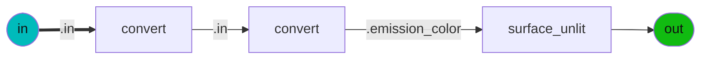

```mermaid
graph LR; 
    NG_convert_vector2_shader_surface[surface_unlit] --> NG_convert_vector2_shader_out([out])
    style NG_convert_vector2_shader_out fill:#1b1, color:#111
    NG_convert_vector2_shader_vec3_to_color3[convert] --".emission_color"--> NG_convert_vector2_shader_surface[surface_unlit]
    NG_convert_vector2_shader_vec2_to_vec3[convert] --".in"--> NG_convert_vector2_shader_vec3_to_color3[convert]
    NG_convert_vector2_shader_inINT([in]) ==.in==> NG_convert_vector2_shader_vec2_to_vec3[convert]
    style NG_convert_vector2_shader_inINT fill:#0bb, color:#111
```
