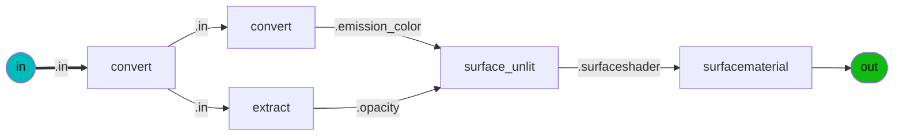

```mermaid
graph LR; 
    NG_convert_vector4_material_surfacematerial[surfacematerial] --> NG_convert_vector4_material_out([out])
    style NG_convert_vector4_material_out fill:#1b1, color:#111
    NG_convert_vector4_material_surface_unlit[surface_unlit] --".surfaceshader"--> NG_convert_vector4_material_surfacematerial[surfacematerial]
    NG_convert_vector4_material_color4_to_color3[convert] --".emission_color"--> NG_convert_vector4_material_surface_unlit[surface_unlit]
    NG_convert_vector4_material_vec4_to_color4[convert] --".in"--> NG_convert_vector4_material_color4_to_color3[convert]
    NG_convert_vector4_material_inINT([in]) ==.in==> NG_convert_vector4_material_vec4_to_color4[convert]
    style NG_convert_vector4_material_inINT fill:#0bb, color:#111
    NG_convert_vector4_material_color4_to_float[extract] --".opacity"--> NG_convert_vector4_material_surface_unlit[surface_unlit]
    NG_convert_vector4_material_vec4_to_color4[convert] --".in"--> NG_convert_vector4_material_color4_to_float[extract]
```
