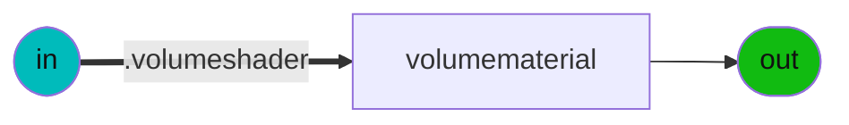

```mermaid
graph LR; 
    NG_convert_volumshader_material_volumematerial[volumematerial] --> NG_convert_volumshader_material_out([out])
    style NG_convert_volumshader_material_out fill:#1b1, color:#111
    NG_convert_volumshader_material_inINT([in]) ==.volumeshader==> NG_convert_volumshader_material_volumematerial[volumematerial]
    style NG_convert_volumshader_material_inINT fill:#0bb, color:#111
```
