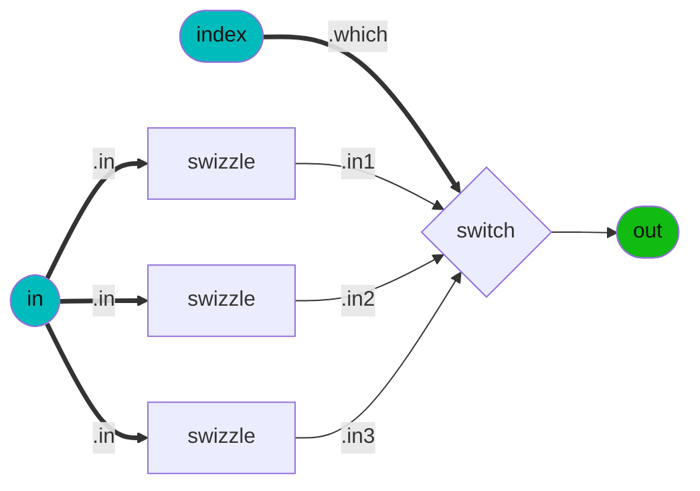

```mermaid
graph LR; 
    NG_extract_color3_N_sw_color3{switch} --> NG_extract_color3_out([out])
    style NG_extract_color3_out fill:#1b1, color:#111
    NG_extract_color3_indexINT([index]) ==.which==> NG_extract_color3_N_sw_color3[switch]
    style NG_extract_color3_indexINT fill:#0bb, color:#111
    NG_extract_color3_N_r_color3[swizzle] --".in1"--> NG_extract_color3_N_sw_color3{switch}
    NG_extract_color3_inINT([in]) ==.in==> NG_extract_color3_N_r_color3[swizzle]
    style NG_extract_color3_inINT fill:#0bb, color:#111
    NG_extract_color3_N_g_color3[swizzle] --".in2"--> NG_extract_color3_N_sw_color3{switch}
    NG_extract_color3_inINT([in]) ==.in==> NG_extract_color3_N_g_color3[swizzle]
    style NG_extract_color3_inINT fill:#0bb, color:#111
    NG_extract_color3_N_b_color3[swizzle] --".in3"--> NG_extract_color3_N_sw_color3{switch}
    NG_extract_color3_inINT([in]) ==.in==> NG_extract_color3_N_b_color3[swizzle]
    style NG_extract_color3_inINT fill:#0bb, color:#111
```
