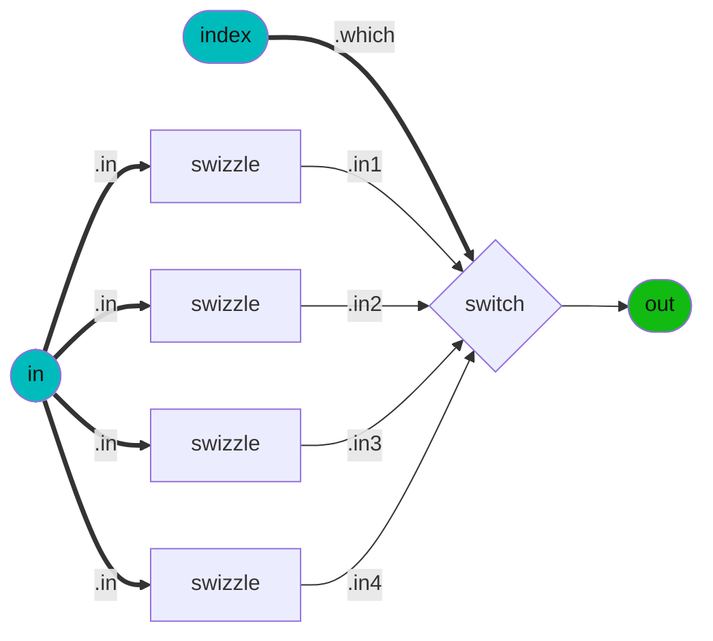

```mermaid
graph LR; 
    NG_extract_color4_N_sw_color4{switch} --> NG_extract_color4_out([out])
    style NG_extract_color4_out fill:#1b1, color:#111
    NG_extract_color4_indexINT([index]) ==.which==> NG_extract_color4_N_sw_color4[switch]
    style NG_extract_color4_indexINT fill:#0bb, color:#111
    NG_extract_color4_N_r_color4[swizzle] --".in1"--> NG_extract_color4_N_sw_color4{switch}
    NG_extract_color4_inINT([in]) ==.in==> NG_extract_color4_N_r_color4[swizzle]
    style NG_extract_color4_inINT fill:#0bb, color:#111
    NG_extract_color4_N_g_color4[swizzle] --".in2"--> NG_extract_color4_N_sw_color4{switch}
    NG_extract_color4_inINT([in]) ==.in==> NG_extract_color4_N_g_color4[swizzle]
    style NG_extract_color4_inINT fill:#0bb, color:#111
    NG_extract_color4_N_b_color4[swizzle] --".in3"--> NG_extract_color4_N_sw_color4{switch}
    NG_extract_color4_inINT([in]) ==.in==> NG_extract_color4_N_b_color4[swizzle]
    style NG_extract_color4_inINT fill:#0bb, color:#111
    NG_extract_color4_N_a_color4[swizzle] --".in4"--> NG_extract_color4_N_sw_color4{switch}
    NG_extract_color4_inINT([in]) ==.in==> NG_extract_color4_N_a_color4[swizzle]
    style NG_extract_color4_inINT fill:#0bb, color:#111
```
