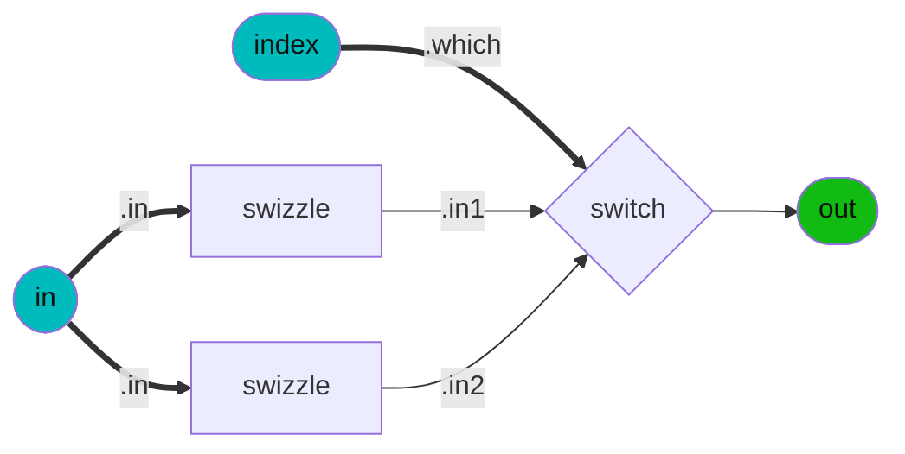

```mermaid
graph LR; 
    NG_extract_vector2_N_sw_vector2{switch} --> NG_extract_vector2_out([out])
    style NG_extract_vector2_out fill:#1b1, color:#111
    NG_extract_vector2_indexINT([index]) ==.which==> NG_extract_vector2_N_sw_vector2[switch]
    style NG_extract_vector2_indexINT fill:#0bb, color:#111
    NG_extract_vector2_N_x_vector2[swizzle] --".in1"--> NG_extract_vector2_N_sw_vector2{switch}
    NG_extract_vector2_inINT([in]) ==.in==> NG_extract_vector2_N_x_vector2[swizzle]
    style NG_extract_vector2_inINT fill:#0bb, color:#111
    NG_extract_vector2_N_y_vector2[swizzle] --".in2"--> NG_extract_vector2_N_sw_vector2{switch}
    NG_extract_vector2_inINT([in]) ==.in==> NG_extract_vector2_N_y_vector2[swizzle]
    style NG_extract_vector2_inINT fill:#0bb, color:#111
```
