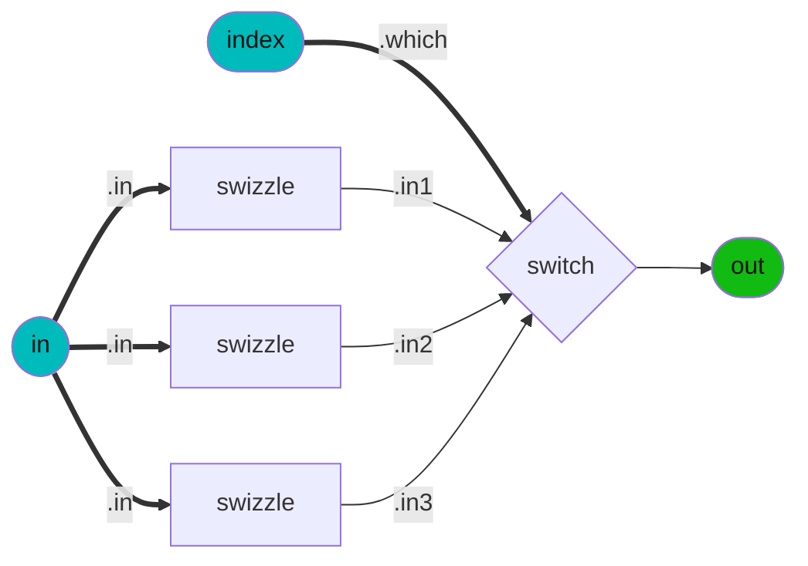

```mermaid
graph LR; 
    NG_extract_vector3_N_sw_vector3{switch} --> NG_extract_vector3_out([out])
    style NG_extract_vector3_out fill:#1b1, color:#111
    NG_extract_vector3_indexINT([index]) ==.which==> NG_extract_vector3_N_sw_vector3[switch]
    style NG_extract_vector3_indexINT fill:#0bb, color:#111
    NG_extract_vector3_N_x_vector3[swizzle] --".in1"--> NG_extract_vector3_N_sw_vector3{switch}
    NG_extract_vector3_inINT([in]) ==.in==> NG_extract_vector3_N_x_vector3[swizzle]
    style NG_extract_vector3_inINT fill:#0bb, color:#111
    NG_extract_vector3_N_y_vector3[swizzle] --".in2"--> NG_extract_vector3_N_sw_vector3{switch}
    NG_extract_vector3_inINT([in]) ==.in==> NG_extract_vector3_N_y_vector3[swizzle]
    style NG_extract_vector3_inINT fill:#0bb, color:#111
    NG_extract_vector3_N_z_vector3[swizzle] --".in3"--> NG_extract_vector3_N_sw_vector3{switch}
    NG_extract_vector3_inINT([in]) ==.in==> NG_extract_vector3_N_z_vector3[swizzle]
    style NG_extract_vector3_inINT fill:#0bb, color:#111
```
