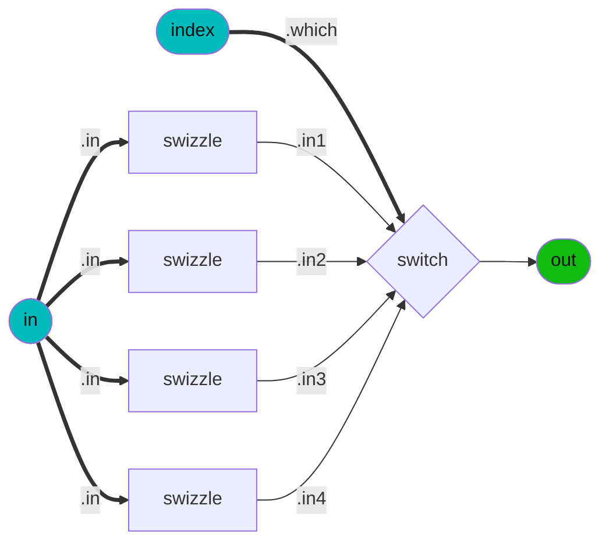

```mermaid
graph LR; 
    NG_extract_vector4_N_sw_vector4{switch} --> NG_extract_vector4_out([out])
    style NG_extract_vector4_out fill:#1b1, color:#111
    NG_extract_vector4_indexINT([index]) ==.which==> NG_extract_vector4_N_sw_vector4[switch]
    style NG_extract_vector4_indexINT fill:#0bb, color:#111
    NG_extract_vector4_N_x_vector4[swizzle] --".in1"--> NG_extract_vector4_N_sw_vector4{switch}
    NG_extract_vector4_inINT([in]) ==.in==> NG_extract_vector4_N_x_vector4[swizzle]
    style NG_extract_vector4_inINT fill:#0bb, color:#111
    NG_extract_vector4_N_y_vector4[swizzle] --".in2"--> NG_extract_vector4_N_sw_vector4{switch}
    NG_extract_vector4_inINT([in]) ==.in==> NG_extract_vector4_N_y_vector4[swizzle]
    style NG_extract_vector4_inINT fill:#0bb, color:#111
    NG_extract_vector4_N_z_vector4[swizzle] --".in3"--> NG_extract_vector4_N_sw_vector4{switch}
    NG_extract_vector4_inINT([in]) ==.in==> NG_extract_vector4_N_z_vector4[swizzle]
    style NG_extract_vector4_inINT fill:#0bb, color:#111
    NG_extract_vector4_N_w_vector4[swizzle] --".in4"--> NG_extract_vector4_N_sw_vector4{switch}
    NG_extract_vector4_inINT([in]) ==.in==> NG_extract_vector4_N_w_vector4[swizzle]
    style NG_extract_vector4_inINT fill:#0bb, color:#111
```
