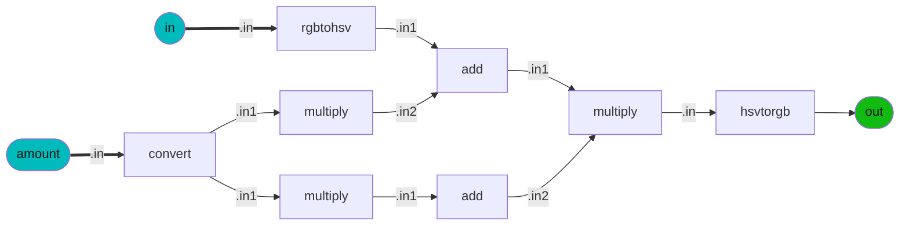

```mermaid
graph LR; 
    NG_hsvadjust_color3_N_torgb_color3[hsvtorgb] --> NG_hsvadjust_color3_out([out])
    style NG_hsvadjust_color3_out fill:#1b1, color:#111
    NG_hsvadjust_color3_N_tmp3_color3[multiply] --".in"--> NG_hsvadjust_color3_N_torgb_color3[hsvtorgb]
    NG_hsvadjust_color3_N_tmp2_color3[add] --".in1"--> NG_hsvadjust_color3_N_tmp3_color3[multiply]
    NG_hsvadjust_color3_N_inhsv_color3[rgbtohsv] --".in1"--> NG_hsvadjust_color3_N_tmp2_color3[add]
    NG_hsvadjust_color3_inINT([in]) ==.in==> NG_hsvadjust_color3_N_inhsv_color3[rgbtohsv]
    style NG_hsvadjust_color3_inINT fill:#0bb, color:#111
    NG_hsvadjust_color3_N_hchans_color3[multiply] --".in2"--> NG_hsvadjust_color3_N_tmp2_color3[add]
    NG_hsvadjust_color3_N_camount_color3[convert] --".in1"--> NG_hsvadjust_color3_N_hchans_color3[multiply]
    NG_hsvadjust_color3_amountINT([amount]) ==.in==> NG_hsvadjust_color3_N_camount_color3[convert]
    style NG_hsvadjust_color3_amountINT fill:#0bb, color:#111
    NG_hsvadjust_color3_N_svchans_color3[add] --".in2"--> NG_hsvadjust_color3_N_tmp3_color3[multiply]
    NG_hsvadjust_color3_N_tmp1_color3[multiply] --".in1"--> NG_hsvadjust_color3_N_svchans_color3[add]
    NG_hsvadjust_color3_N_camount_color3[convert] --".in1"--> NG_hsvadjust_color3_N_tmp1_color3[multiply]
```
