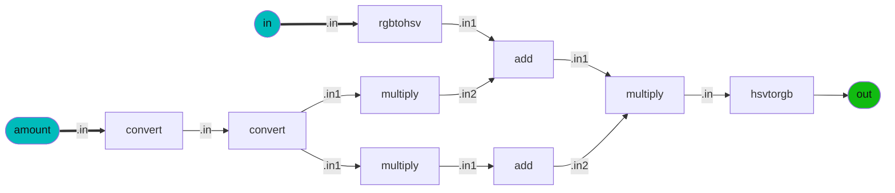

```mermaid
graph LR; 
    NG_hsvadjust_color4_N_torgb_color4[hsvtorgb] --> NG_hsvadjust_color4_out([out])
    style NG_hsvadjust_color4_out fill:#1b1, color:#111
    NG_hsvadjust_color4_N_tmp3_color4[multiply] --".in"--> NG_hsvadjust_color4_N_torgb_color4[hsvtorgb]
    NG_hsvadjust_color4_N_tmp2_color4[add] --".in1"--> NG_hsvadjust_color4_N_tmp3_color4[multiply]
    NG_hsvadjust_color4_N_inhsv_color4[rgbtohsv] --".in1"--> NG_hsvadjust_color4_N_tmp2_color4[add]
    NG_hsvadjust_color4_inINT([in]) ==.in==> NG_hsvadjust_color4_N_inhsv_color4[rgbtohsv]
    style NG_hsvadjust_color4_inINT fill:#0bb, color:#111
    NG_hsvadjust_color4_N_hchans_color4[multiply] --".in2"--> NG_hsvadjust_color4_N_tmp2_color4[add]
    NG_hsvadjust_color4_N_camount_color4[convert] --".in1"--> NG_hsvadjust_color4_N_hchans_color4[multiply]
    NG_hsvadjust_color4_N_camt_color3[convert] --".in"--> NG_hsvadjust_color4_N_camount_color4[convert]
    NG_hsvadjust_color4_amountINT([amount]) ==.in==> NG_hsvadjust_color4_N_camt_color3[convert]
    style NG_hsvadjust_color4_amountINT fill:#0bb, color:#111
    NG_hsvadjust_color4_N_svchans_color4[add] --".in2"--> NG_hsvadjust_color4_N_tmp3_color4[multiply]
    NG_hsvadjust_color4_N_tmp1_color4[multiply] --".in1"--> NG_hsvadjust_color4_N_svchans_color4[add]
    NG_hsvadjust_color4_N_camount_color4[convert] --".in1"--> NG_hsvadjust_color4_N_tmp1_color4[multiply]
```
