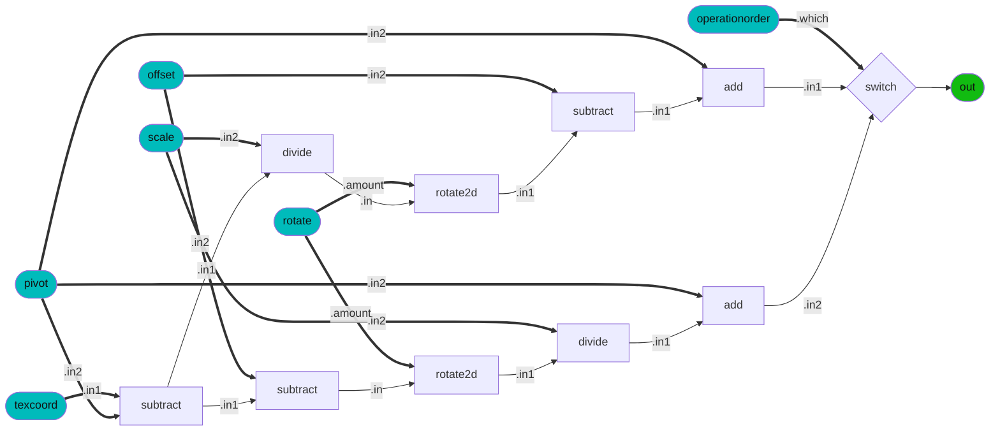

```mermaid
graph LR; 
    NG_place2d_vector2_N_switch_operationorder{switch} --> NG_place2d_vector2_out([out])
    style NG_place2d_vector2_out fill:#1b1, color:#111
    NG_place2d_vector2_operationorderINT([operationorder]) ==.which==> NG_place2d_vector2_N_switch_operationorder[switch]
    style NG_place2d_vector2_operationorderINT fill:#0bb, color:#111
    NG_place2d_vector2_N_addpivot[add] --".in1"--> NG_place2d_vector2_N_switch_operationorder{switch}
    NG_place2d_vector2_pivotINT([pivot]) ==.in2==> NG_place2d_vector2_N_addpivot[add]
    style NG_place2d_vector2_pivotINT fill:#0bb, color:#111
    NG_place2d_vector2_N_applyoffset[subtract] --".in1"--> NG_place2d_vector2_N_addpivot[add]
    NG_place2d_vector2_offsetINT([offset]) ==.in2==> NG_place2d_vector2_N_applyoffset[subtract]
    style NG_place2d_vector2_offsetINT fill:#0bb, color:#111
    NG_place2d_vector2_N_applyrot[rotate2d] --".in1"--> NG_place2d_vector2_N_applyoffset[subtract]
    NG_place2d_vector2_rotateINT([rotate]) ==.amount==> NG_place2d_vector2_N_applyrot[rotate2d]
    style NG_place2d_vector2_rotateINT fill:#0bb, color:#111
    NG_place2d_vector2_N_applyscale[divide] --".in"--> NG_place2d_vector2_N_applyrot[rotate2d]
    NG_place2d_vector2_scaleINT([scale]) ==.in2==> NG_place2d_vector2_N_applyscale[divide]
    style NG_place2d_vector2_scaleINT fill:#0bb, color:#111
    NG_place2d_vector2_N_subpivot[subtract] --".in1"--> NG_place2d_vector2_N_applyscale[divide]
    NG_place2d_vector2_texcoordINT([texcoord]) ==.in1==> NG_place2d_vector2_N_subpivot[subtract]
    style NG_place2d_vector2_texcoordINT fill:#0bb, color:#111
    NG_place2d_vector2_pivotINT([pivot]) ==.in2==> NG_place2d_vector2_N_subpivot[subtract]
    style NG_place2d_vector2_pivotINT fill:#0bb, color:#111
    NG_place2d_vector2_N_addpivot2[add] --".in2"--> NG_place2d_vector2_N_switch_operationorder{switch}
    NG_place2d_vector2_pivotINT([pivot]) ==.in2==> NG_place2d_vector2_N_addpivot2[add]
    style NG_place2d_vector2_pivotINT fill:#0bb, color:#111
    NG_place2d_vector2_N_applyscale2[divide] --".in1"--> NG_place2d_vector2_N_addpivot2[add]
    NG_place2d_vector2_scaleINT([scale]) ==.in2==> NG_place2d_vector2_N_applyscale2[divide]
    style NG_place2d_vector2_scaleINT fill:#0bb, color:#111
    NG_place2d_vector2_N_applyrot2[rotate2d] --".in1"--> NG_place2d_vector2_N_applyscale2[divide]
    NG_place2d_vector2_rotateINT([rotate]) ==.amount==> NG_place2d_vector2_N_applyrot2[rotate2d]
    style NG_place2d_vector2_rotateINT fill:#0bb, color:#111
    NG_place2d_vector2_N_applyoffset2[subtract] --".in"--> NG_place2d_vector2_N_applyrot2[rotate2d]
    NG_place2d_vector2_offsetINT([offset]) ==.in2==> NG_place2d_vector2_N_applyoffset2[subtract]
    style NG_place2d_vector2_offsetINT fill:#0bb, color:#111
    NG_place2d_vector2_N_subpivot[subtract] --".in1"--> NG_place2d_vector2_N_applyoffset2[subtract]
```
