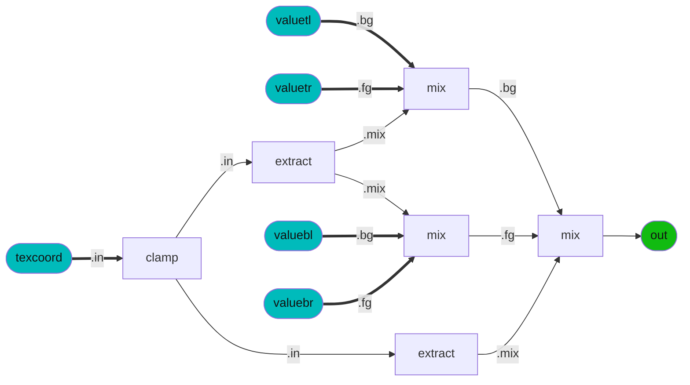

```mermaid
graph LR; 
    NG_ramp4_color4_N_mix_color4[mix] --> NG_ramp4_color4_out([out])
    style NG_ramp4_color4_out fill:#1b1, color:#111
    NG_ramp4_color4_N_mixtop_color4[mix] --".bg"--> NG_ramp4_color4_N_mix_color4[mix]
    NG_ramp4_color4_valuetlINT([valuetl]) ==.bg==> NG_ramp4_color4_N_mixtop_color4[mix]
    style NG_ramp4_color4_valuetlINT fill:#0bb, color:#111
    NG_ramp4_color4_valuetrINT([valuetr]) ==.fg==> NG_ramp4_color4_N_mixtop_color4[mix]
    style NG_ramp4_color4_valuetrINT fill:#0bb, color:#111
    NG_ramp4_color4_N_s_color4[extract] --".mix"--> NG_ramp4_color4_N_mixtop_color4[mix]
    NG_ramp4_color4_N_txclamp_color4[clamp] --".in"--> NG_ramp4_color4_N_s_color4[extract]
    NG_ramp4_color4_texcoordINT([texcoord]) ==.in==> NG_ramp4_color4_N_txclamp_color4[clamp]
    style NG_ramp4_color4_texcoordINT fill:#0bb, color:#111
    NG_ramp4_color4_N_mixbot_color4[mix] --".fg"--> NG_ramp4_color4_N_mix_color4[mix]
    NG_ramp4_color4_valueblINT([valuebl]) ==.bg==> NG_ramp4_color4_N_mixbot_color4[mix]
    style NG_ramp4_color4_valueblINT fill:#0bb, color:#111
    NG_ramp4_color4_valuebrINT([valuebr]) ==.fg==> NG_ramp4_color4_N_mixbot_color4[mix]
    style NG_ramp4_color4_valuebrINT fill:#0bb, color:#111
    NG_ramp4_color4_N_s_color4[extract] --".mix"--> NG_ramp4_color4_N_mixbot_color4[mix]
    NG_ramp4_color4_N_t_color4[extract] --".mix"--> NG_ramp4_color4_N_mix_color4[mix]
    NG_ramp4_color4_N_txclamp_color4[clamp] --".in"--> NG_ramp4_color4_N_t_color4[extract]
```
