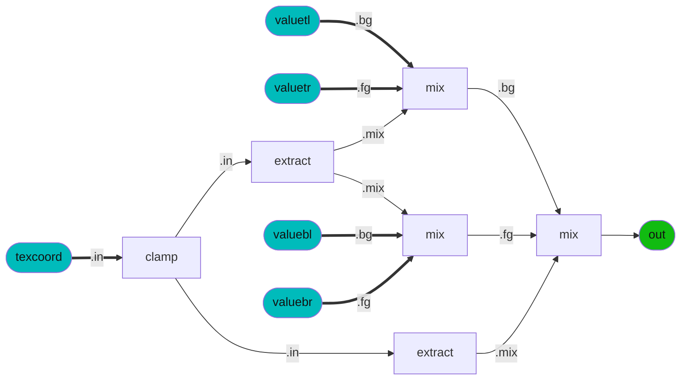

```mermaid
graph LR; 
    NG_ramp4_float_N_mix_float[mix] --> NG_ramp4_float_out([out])
    style NG_ramp4_float_out fill:#1b1, color:#111
    NG_ramp4_float_N_mixtop_float[mix] --".bg"--> NG_ramp4_float_N_mix_float[mix]
    NG_ramp4_float_valuetlINT([valuetl]) ==.bg==> NG_ramp4_float_N_mixtop_float[mix]
    style NG_ramp4_float_valuetlINT fill:#0bb, color:#111
    NG_ramp4_float_valuetrINT([valuetr]) ==.fg==> NG_ramp4_float_N_mixtop_float[mix]
    style NG_ramp4_float_valuetrINT fill:#0bb, color:#111
    NG_ramp4_float_N_s_float[extract] --".mix"--> NG_ramp4_float_N_mixtop_float[mix]
    NG_ramp4_float_N_txclamp_float[clamp] --".in"--> NG_ramp4_float_N_s_float[extract]
    NG_ramp4_float_texcoordINT([texcoord]) ==.in==> NG_ramp4_float_N_txclamp_float[clamp]
    style NG_ramp4_float_texcoordINT fill:#0bb, color:#111
    NG_ramp4_float_N_mixbot_float[mix] --".fg"--> NG_ramp4_float_N_mix_float[mix]
    NG_ramp4_float_valueblINT([valuebl]) ==.bg==> NG_ramp4_float_N_mixbot_float[mix]
    style NG_ramp4_float_valueblINT fill:#0bb, color:#111
    NG_ramp4_float_valuebrINT([valuebr]) ==.fg==> NG_ramp4_float_N_mixbot_float[mix]
    style NG_ramp4_float_valuebrINT fill:#0bb, color:#111
    NG_ramp4_float_N_s_float[extract] --".mix"--> NG_ramp4_float_N_mixbot_float[mix]
    NG_ramp4_float_N_t_float[extract] --".mix"--> NG_ramp4_float_N_mix_float[mix]
    NG_ramp4_float_N_txclamp_float[clamp] --".in"--> NG_ramp4_float_N_t_float[extract]
```
