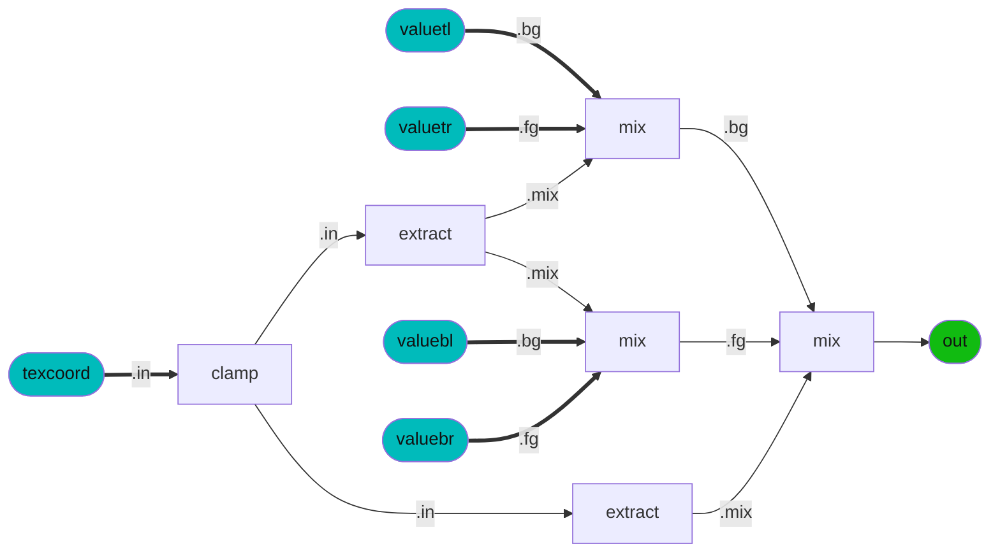

```mermaid
graph LR; 
    NG_ramp4_vector2_N_mix_vector2[mix] --> NG_ramp4_vector2_out([out])
    style NG_ramp4_vector2_out fill:#1b1, color:#111
    NG_ramp4_vector2_N_mixtop_vector2[mix] --".bg"--> NG_ramp4_vector2_N_mix_vector2[mix]
    NG_ramp4_vector2_valuetlINT([valuetl]) ==.bg==> NG_ramp4_vector2_N_mixtop_vector2[mix]
    style NG_ramp4_vector2_valuetlINT fill:#0bb, color:#111
    NG_ramp4_vector2_valuetrINT([valuetr]) ==.fg==> NG_ramp4_vector2_N_mixtop_vector2[mix]
    style NG_ramp4_vector2_valuetrINT fill:#0bb, color:#111
    NG_ramp4_vector2_N_s_vector2[extract] --".mix"--> NG_ramp4_vector2_N_mixtop_vector2[mix]
    NG_ramp4_vector2_N_txclamp_vector2[clamp] --".in"--> NG_ramp4_vector2_N_s_vector2[extract]
    NG_ramp4_vector2_texcoordINT([texcoord]) ==.in==> NG_ramp4_vector2_N_txclamp_vector2[clamp]
    style NG_ramp4_vector2_texcoordINT fill:#0bb, color:#111
    NG_ramp4_vector2_N_mixbot_vector2[mix] --".fg"--> NG_ramp4_vector2_N_mix_vector2[mix]
    NG_ramp4_vector2_valueblINT([valuebl]) ==.bg==> NG_ramp4_vector2_N_mixbot_vector2[mix]
    style NG_ramp4_vector2_valueblINT fill:#0bb, color:#111
    NG_ramp4_vector2_valuebrINT([valuebr]) ==.fg==> NG_ramp4_vector2_N_mixbot_vector2[mix]
    style NG_ramp4_vector2_valuebrINT fill:#0bb, color:#111
    NG_ramp4_vector2_N_s_vector2[extract] --".mix"--> NG_ramp4_vector2_N_mixbot_vector2[mix]
    NG_ramp4_vector2_N_t_vector2[extract] --".mix"--> NG_ramp4_vector2_N_mix_vector2[mix]
    NG_ramp4_vector2_N_txclamp_vector2[clamp] --".in"--> NG_ramp4_vector2_N_t_vector2[extract]
```
