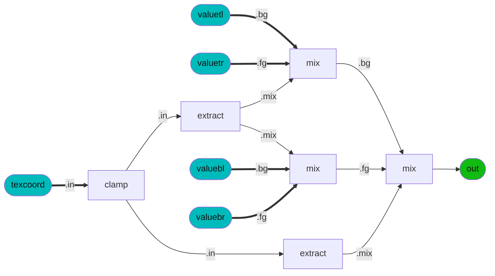

```mermaid
graph LR; 
    NG_ramp4_vector3_N_mix_vector3[mix] --> NG_ramp4_vector3_out([out])
    style NG_ramp4_vector3_out fill:#1b1, color:#111
    NG_ramp4_vector3_N_mixtop_vector3[mix] --".bg"--> NG_ramp4_vector3_N_mix_vector3[mix]
    NG_ramp4_vector3_valuetlINT([valuetl]) ==.bg==> NG_ramp4_vector3_N_mixtop_vector3[mix]
    style NG_ramp4_vector3_valuetlINT fill:#0bb, color:#111
    NG_ramp4_vector3_valuetrINT([valuetr]) ==.fg==> NG_ramp4_vector3_N_mixtop_vector3[mix]
    style NG_ramp4_vector3_valuetrINT fill:#0bb, color:#111
    NG_ramp4_vector3_N_s_vector3[extract] --".mix"--> NG_ramp4_vector3_N_mixtop_vector3[mix]
    NG_ramp4_vector3_N_txclamp_vector3[clamp] --".in"--> NG_ramp4_vector3_N_s_vector3[extract]
    NG_ramp4_vector3_texcoordINT([texcoord]) ==.in==> NG_ramp4_vector3_N_txclamp_vector3[clamp]
    style NG_ramp4_vector3_texcoordINT fill:#0bb, color:#111
    NG_ramp4_vector3_N_mixbot_vector3[mix] --".fg"--> NG_ramp4_vector3_N_mix_vector3[mix]
    NG_ramp4_vector3_valueblINT([valuebl]) ==.bg==> NG_ramp4_vector3_N_mixbot_vector3[mix]
    style NG_ramp4_vector3_valueblINT fill:#0bb, color:#111
    NG_ramp4_vector3_valuebrINT([valuebr]) ==.fg==> NG_ramp4_vector3_N_mixbot_vector3[mix]
    style NG_ramp4_vector3_valuebrINT fill:#0bb, color:#111
    NG_ramp4_vector3_N_s_vector3[extract] --".mix"--> NG_ramp4_vector3_N_mixbot_vector3[mix]
    NG_ramp4_vector3_N_t_vector3[extract] --".mix"--> NG_ramp4_vector3_N_mix_vector3[mix]
    NG_ramp4_vector3_N_txclamp_vector3[clamp] --".in"--> NG_ramp4_vector3_N_t_vector3[extract]
```
