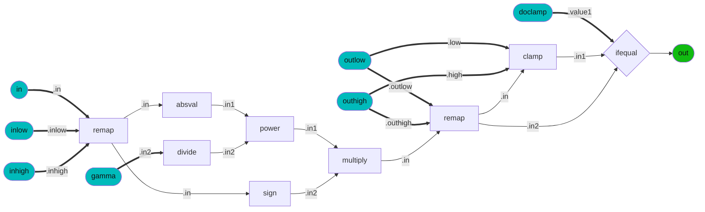

```mermaid
graph LR; 
    NG_range_color3_N_switch_color3{ifequal} --> NG_range_color3_out([out])
    style NG_range_color3_out fill:#1b1, color:#111
    NG_range_color3_doclampINT([doclamp]) ==.value1==> NG_range_color3_N_switch_color3[ifequal]
    style NG_range_color3_doclampINT fill:#0bb, color:#111
    NG_range_color3_N_clamp_color3[clamp] --".in1"--> NG_range_color3_N_switch_color3{ifequal}
    NG_range_color3_outlowINT([outlow]) ==.low==> NG_range_color3_N_clamp_color3[clamp]
    style NG_range_color3_outlowINT fill:#0bb, color:#111
    NG_range_color3_outhighINT([outhigh]) ==.high==> NG_range_color3_N_clamp_color3[clamp]
    style NG_range_color3_outhighINT fill:#0bb, color:#111
    NG_range_color3_N_remap2_color3[remap] --".in"--> NG_range_color3_N_clamp_color3[clamp]
    NG_range_color3_outlowINT([outlow]) ==.outlow==> NG_range_color3_N_remap2_color3[remap]
    style NG_range_color3_outlowINT fill:#0bb, color:#111
    NG_range_color3_outhighINT([outhigh]) ==.outhigh==> NG_range_color3_N_remap2_color3[remap]
    style NG_range_color3_outhighINT fill:#0bb, color:#111
    NG_range_color3_N_gamma_color3[multiply] --".in"--> NG_range_color3_N_remap2_color3[remap]
    NG_range_color3_N_pow_color3[power] --".in1"--> NG_range_color3_N_gamma_color3[multiply]
    NG_range_color3_N_abs_color3[absval] --".in1"--> NG_range_color3_N_pow_color3[power]
    NG_range_color3_N_remap1_color3[remap] --".in"--> NG_range_color3_N_abs_color3[absval]
    NG_range_color3_inINT([in]) ==.in==> NG_range_color3_N_remap1_color3[remap]
    style NG_range_color3_inINT fill:#0bb, color:#111
    NG_range_color3_inlowINT([inlow]) ==.inlow==> NG_range_color3_N_remap1_color3[remap]
    style NG_range_color3_inlowINT fill:#0bb, color:#111
    NG_range_color3_inhighINT([inhigh]) ==.inhigh==> NG_range_color3_N_remap1_color3[remap]
    style NG_range_color3_inhighINT fill:#0bb, color:#111
    NG_range_color3_N_recip_color3[divide] --".in2"--> NG_range_color3_N_pow_color3[power]
    NG_range_color3_gammaINT([gamma]) ==.in2==> NG_range_color3_N_recip_color3[divide]
    style NG_range_color3_gammaINT fill:#0bb, color:#111
    NG_range_color3_N_sign_color3[sign] --".in2"--> NG_range_color3_N_gamma_color3[multiply]
    NG_range_color3_N_remap1_color3[remap] --".in"--> NG_range_color3_N_sign_color3[sign]
    NG_range_color3_N_remap2_color3[remap] --".in2"--> NG_range_color3_N_switch_color3{ifequal}
```
