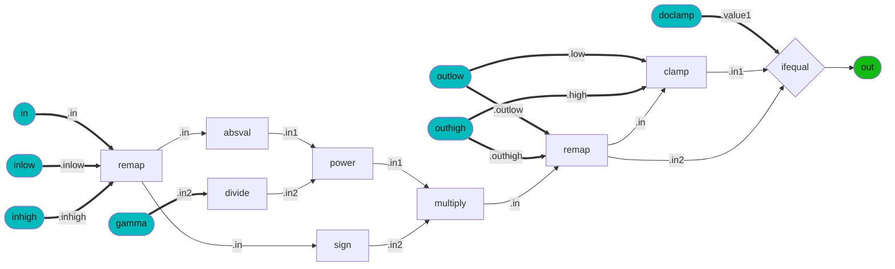

```mermaid
graph LR; 
    NG_range_color4_N_switch_color4{ifequal} --> NG_range_color4_out([out])
    style NG_range_color4_out fill:#1b1, color:#111
    NG_range_color4_doclampINT([doclamp]) ==.value1==> NG_range_color4_N_switch_color4[ifequal]
    style NG_range_color4_doclampINT fill:#0bb, color:#111
    NG_range_color4_N_clamp_color4[clamp] --".in1"--> NG_range_color4_N_switch_color4{ifequal}
    NG_range_color4_outlowINT([outlow]) ==.low==> NG_range_color4_N_clamp_color4[clamp]
    style NG_range_color4_outlowINT fill:#0bb, color:#111
    NG_range_color4_outhighINT([outhigh]) ==.high==> NG_range_color4_N_clamp_color4[clamp]
    style NG_range_color4_outhighINT fill:#0bb, color:#111
    NG_range_color4_N_remap2_color4[remap] --".in"--> NG_range_color4_N_clamp_color4[clamp]
    NG_range_color4_outlowINT([outlow]) ==.outlow==> NG_range_color4_N_remap2_color4[remap]
    style NG_range_color4_outlowINT fill:#0bb, color:#111
    NG_range_color4_outhighINT([outhigh]) ==.outhigh==> NG_range_color4_N_remap2_color4[remap]
    style NG_range_color4_outhighINT fill:#0bb, color:#111
    NG_range_color4_N_gamma_color4[multiply] --".in"--> NG_range_color4_N_remap2_color4[remap]
    NG_range_color4_N_pow_color4[power] --".in1"--> NG_range_color4_N_gamma_color4[multiply]
    NG_range_color4_N_abs_color4[absval] --".in1"--> NG_range_color4_N_pow_color4[power]
    NG_range_color4_N_remap1_color4[remap] --".in"--> NG_range_color4_N_abs_color4[absval]
    NG_range_color4_inINT([in]) ==.in==> NG_range_color4_N_remap1_color4[remap]
    style NG_range_color4_inINT fill:#0bb, color:#111
    NG_range_color4_inlowINT([inlow]) ==.inlow==> NG_range_color4_N_remap1_color4[remap]
    style NG_range_color4_inlowINT fill:#0bb, color:#111
    NG_range_color4_inhighINT([inhigh]) ==.inhigh==> NG_range_color4_N_remap1_color4[remap]
    style NG_range_color4_inhighINT fill:#0bb, color:#111
    NG_range_color4_N_recip_color4[divide] --".in2"--> NG_range_color4_N_pow_color4[power]
    NG_range_color4_gammaINT([gamma]) ==.in2==> NG_range_color4_N_recip_color4[divide]
    style NG_range_color4_gammaINT fill:#0bb, color:#111
    NG_range_color4_N_sign_color4[sign] --".in2"--> NG_range_color4_N_gamma_color4[multiply]
    NG_range_color4_N_remap1_color4[remap] --".in"--> NG_range_color4_N_sign_color4[sign]
    NG_range_color4_N_remap2_color4[remap] --".in2"--> NG_range_color4_N_switch_color4{ifequal}
```
