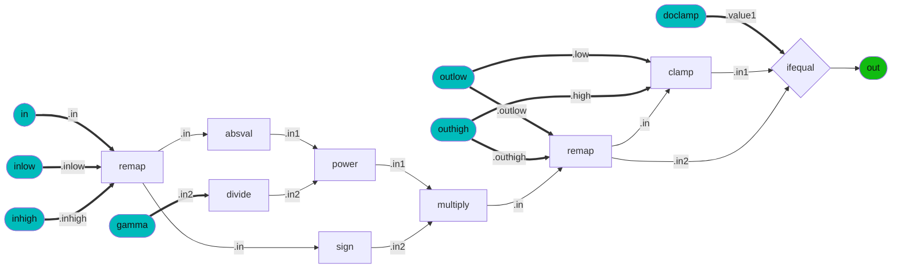

```mermaid
graph LR; 
    NG_range_float_N_switch_float{ifequal} --> NG_range_float_out([out])
    style NG_range_float_out fill:#1b1, color:#111
    NG_range_float_doclampINT([doclamp]) ==.value1==> NG_range_float_N_switch_float[ifequal]
    style NG_range_float_doclampINT fill:#0bb, color:#111
    NG_range_float_N_clamp_float[clamp] --".in1"--> NG_range_float_N_switch_float{ifequal}
    NG_range_float_outlowINT([outlow]) ==.low==> NG_range_float_N_clamp_float[clamp]
    style NG_range_float_outlowINT fill:#0bb, color:#111
    NG_range_float_outhighINT([outhigh]) ==.high==> NG_range_float_N_clamp_float[clamp]
    style NG_range_float_outhighINT fill:#0bb, color:#111
    NG_range_float_N_remap2_float[remap] --".in"--> NG_range_float_N_clamp_float[clamp]
    NG_range_float_outlowINT([outlow]) ==.outlow==> NG_range_float_N_remap2_float[remap]
    style NG_range_float_outlowINT fill:#0bb, color:#111
    NG_range_float_outhighINT([outhigh]) ==.outhigh==> NG_range_float_N_remap2_float[remap]
    style NG_range_float_outhighINT fill:#0bb, color:#111
    NG_range_float_N_gamma_float[multiply] --".in"--> NG_range_float_N_remap2_float[remap]
    NG_range_float_N_pow_float[power] --".in1"--> NG_range_float_N_gamma_float[multiply]
    NG_range_float_N_abs_float[absval] --".in1"--> NG_range_float_N_pow_float[power]
    NG_range_float_N_remap1_float[remap] --".in"--> NG_range_float_N_abs_float[absval]
    NG_range_float_inINT([in]) ==.in==> NG_range_float_N_remap1_float[remap]
    style NG_range_float_inINT fill:#0bb, color:#111
    NG_range_float_inlowINT([inlow]) ==.inlow==> NG_range_float_N_remap1_float[remap]
    style NG_range_float_inlowINT fill:#0bb, color:#111
    NG_range_float_inhighINT([inhigh]) ==.inhigh==> NG_range_float_N_remap1_float[remap]
    style NG_range_float_inhighINT fill:#0bb, color:#111
    NG_range_float_N_recip_float[divide] --".in2"--> NG_range_float_N_pow_float[power]
    NG_range_float_gammaINT([gamma]) ==.in2==> NG_range_float_N_recip_float[divide]
    style NG_range_float_gammaINT fill:#0bb, color:#111
    NG_range_float_N_sign_float[sign] --".in2"--> NG_range_float_N_gamma_float[multiply]
    NG_range_float_N_remap1_float[remap] --".in"--> NG_range_float_N_sign_float[sign]
    NG_range_float_N_remap2_float[remap] --".in2"--> NG_range_float_N_switch_float{ifequal}
```
